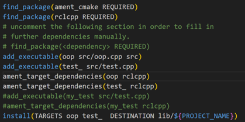
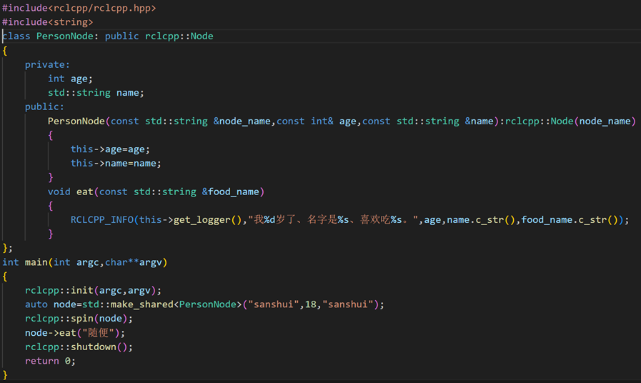
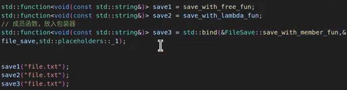

好的，我已将您提供的 C++ 学习笔记整理为规范的 Markdown 格式，并严格按照“第一章、1.1、1.1.1”的层级结构编排。

---

# 第一章 C++ 篇

## 1.1 在 Linux 中编写 C++ 代码

### 1.1.1 使用命名空间
`using namespace std;` :简化代码，避免重复书写 `std::` 前缀。

例如，可以将 `std::cout << ... << std::endl;` 简化为 `cout << ... << endl;`。

> **注意**：如果其他命名空间中有与 `std` 重名的标识符，则容易引发冲突，因此不推荐在大型项目中使用。

### 1.1.2 编译程序
VS Code 本身只负责编辑，编译需要手动完成。有两种常用方式：

#### 方法一：使用 g++
1. 在集成终端中执行：
   ```bash
   g++ 文件名.cpp
   ```
2. 默认生成可执行文件 `a.out`（绿色），可通过 `ls` 查看。
3. 运行程序：
   ```bash
   ./a.out
   ```

#### 方法二：使用 CMake（关键）
1. 在源文件同级目录下创建 `CMakeLists.txt`。
2. 在文件中添加以下内容：
   ```cmake
   cmake_minimum_required(VERSION 3.8)  # 指定最低版本
   project(项目名称)                     # 指定项目名称
   add_executable(可执行文件名 源文件.cpp) # 指定可执行文件与源文件
   ```
3. 生成 Makefile：
   ```bash
   cmake .
   ```
4. 编译生成可执行文件：
   ```bash
   make
   ```
5. 运行：
   ```bash
   ./可执行文件名
   ```

---

## 1.2 编写 ROS 2 节点（C++）

### 1.2.1 编写节点代码
1. **包含头文件**：
   ```cpp
   #include "rclcpp/rclcpp.hpp"
   ```
   （`/` 表示目录层级，对应 Python 中的 `.`）

2. **主函数参数**：
   ```cpp
   int main(int argc, char ** argv)
   ```
   - `argc`：传入参数的数量。
   - `argv`：传入参数的名称数组。

3. **节点编写流程**：
   ```cpp
   rclcpp::init(argc, argv);                     // 初始化
   auto node = std::make_shared<rclcpp::Node>("cpp_node"); // 创建节点
   rclcpp::spin(node);                           // 运行节点
   rclcpp::shutdown();                           // 关闭
   return 0;
   ```

4. **关于 `auto` 与 `make_shared`**：
   - `auto`：编译器自动推导变量类型。
   - `std::make_shared<T>(args...)`：高效创建 `std::shared_ptr` 智能指针。

5. **日志输出**：
   ```cpp
   RCLCPP_INFO(node->get_logger(), "格式字符串 %s", "参数");
   ```

### 1.2.2 编译配置（CMakeLists.txt）
为了让编译器找到 `rclcpp`，需在 `CMakeLists.txt` 中添加：
```cmake
find_package(rclcpp REQUIRED)
add_executable(可执行文件名 src/源文件.cpp)
ament_target_dependencies(可执行文件名 rclcpp)
install(TARGETS 可执行文件名
        DESTINATION lib/${PROJECT_NAME})
```
>- `ament_package()` 必须位于文件末尾，自定义内容请放在该命令之前。
>- 要添加多个可执行文件,应该按照add_ executable、ament_target_dependencies、install的顺序添加
>- 对于install的添加可以把多个可执行文件写在一起


### 1.2.3 配置 VS Code 头文件路径
按 `Ctrl+Shift+P`，搜索 `C/C++: Edit Configurations (UI)`，在“包含路径”中添加：
```
/opt/ros/humble/include/**
```
（每个工作空间需单独配置）

---

## 1.3 功能包与工作空间
### 1.3.1 创建功能包
```bash
ros2 pkg create 包名 --build-type ament_cmake --license Apache-2.0
```
- 源文件放在 `src/` 目录。
- 头文件放在 `include/` 目录。

### 1.3.2 构建与运行
```bash
# 在工作空间根目录下
colcon build
source install/setup.bash
ros2 run 包名 可执行文件名
```
> **注意**：`ros2 run` 使用的是 `add_executable` 指定的**可执行文件名**，而非源文件名。

### 1.3.3 选择性构建与依赖声明
- 仅构建指定包：
  ```bash
  colcon build --packages-select 功能包名
  ```
- 在 `package.xml` 中添加依赖：
  ```xml
  <depend>另一个功能包名</depend>
  ```

---

## 1.4 面向对象编程（C++）

### 1.4.1 类的定义
继承自 `rclcpp::Node`：
```cpp
class MyNode : public rclcpp::Node 
{
    public:
        MyNode(const std::string & node_name) : rclcpp::Node(node_name) 
    {
        // 构造函数体
    }
private:
    // 属性（建议设为 private）
};
```

### 1.4.2 成员初始化与使用
- 使用初始化列表调用父类构造函数：
  ```cpp
  MyNode(const std::string & node_name) : Node(node_name) {}
  ```
- 在类内部使用 `this->` 访问成员，类似于 Python 的 `self.`。
- 创建节点对象：
  ```cpp
  auto node = std::make_shared<MyNode>("my_node");
  node->method();  // 调用方法
  ```

---

## 1.5 常用 C++ 特性

### 1.5.1 auto 自动类型推导
```cpp
auto i = 42;        // int
auto s = "hello";   // const char*
```

### 1.5.2 智能指针
包含头文件 `<memory>`：
```cpp
std::shared_ptr<int> p = std::make_shared<int>(10);
```

### 1.5.3 Lambda 表达式
```cpp
auto func = [捕获列表](参数列表) -> 返回类型 { 函数体 };
```
- `=`：值捕获；`&`：引用捕获。

### 1.5.4 函数包装器（`std::function`）
用于统一自由函数、成员函数、Lambda 函数。
```cpp
#include <functional>
std::function<返回类型(参数类型列表)> 新函数名 = 原函数名;
```
绑定成员函数：
```cpp
std::function<void(int)> f = std::bind(&类::成员函数, &对象, std::placeholders::_1);
```

---

## 1.6 多线程与回调函数

### 1.6.1 安装 httplib 库
在功能包的 `include` 目录下执行：
```bash
git clone https://gitee.com/ohhuo/cpp-httplib.git
```
在 `CMakeLists.txt` 中添加：
```cmake
include_directories(include)
```

### 1.6.2 `<thread>` 线程库
```cpp
#include <thread>
std::thread t(函数, 参数...);
t.join();      // 等待线程结束
t.detach();    // 分离线程，后台独立运行
```

**常用函数**：
- `std::this_thread::sleep_for(std::chrono::seconds(1));`
- `std::this_thread::get_id();`

### 1.6.3 `<chrono>` 时间库
```cpp
using namespace std::chrono_literals;
std::this_thread::sleep_for(500ms);
```
时间转换：
```cpp
auto sec = std::chrono::duration_cast<std::chrono::seconds>(milliseconds);
```

### 1.6.4 httplib 客户端使用
```cpp
#include "httplib.h"

httplib::Client cli("example.com", 80);
auto res = cli.Get("/index.html");
if (res && res->status == 200) {
    std::cout << res->body << std::endl;
}
```
- 支持 `Get`、`Post`、`Put`、`Delete` 等方法。

### 1.6.5 `std::string` 常用操作
| 方法 | 说明 |
| :--- | :--- |
| `length()` / `size()` | 返回字符串长度 |
| `empty()` | 判断是否为空 |
| `append()` / `+=` | 追加字符串 |
| `find()` | 查找子串位置 |
| `substr(pos, len)` | 提取子串 |

### 1.6.6 多线程下载示例
```cpp
class Downloader 
{
    public:
        void download(const std::string &host, const std::string &path,
                  std::function<void(const std::string&, const std::string&)> callback) {
        httplib::Client cli(host);
        auto res = cli.Get(path);
        if (res && res->status == 200) 
        {
            callback(path, res->body);
        }
    }

    void start_download(const std::string &host, const std::string &path,
                        std::function<void(const std::string&, const std::string&)> callback) {
        auto func = std::bind(&Downloader::download, this, host, path, callback);
        std::thread t(func);
        t.detach();
    }
};
```

**主函数调用**：
```cpp
Downloader dl;
dl.start_download("example.com", "/", [](const std::string &path, const std::string &content) {
    std::cout << "Downloaded: " << path << ", size=" << content.length() << std::endl;
});
std::this_thread::sleep_for(std::chrono::seconds(2));
```

---