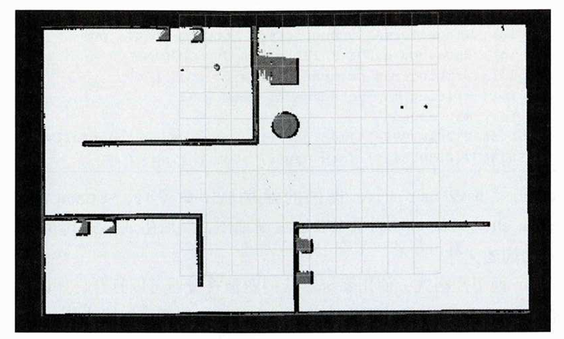
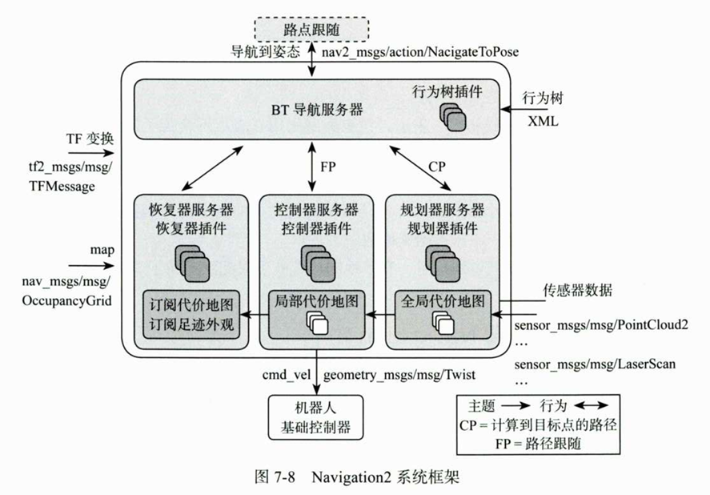
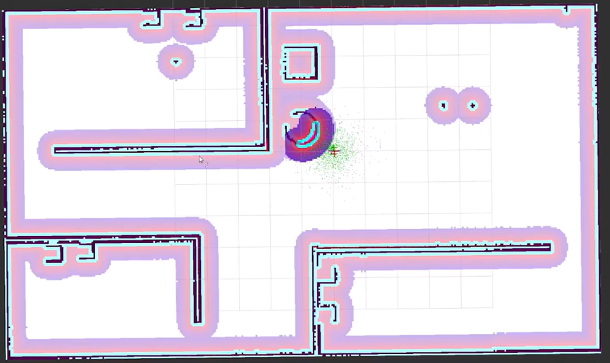
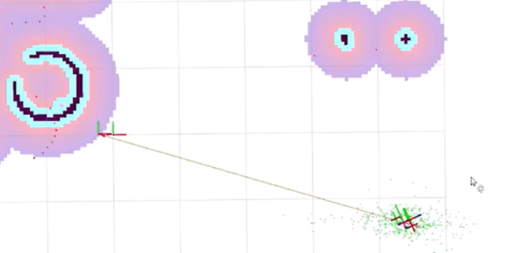
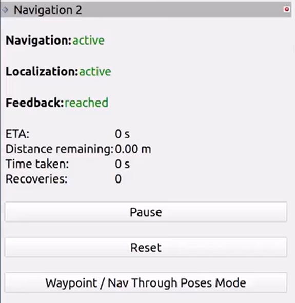
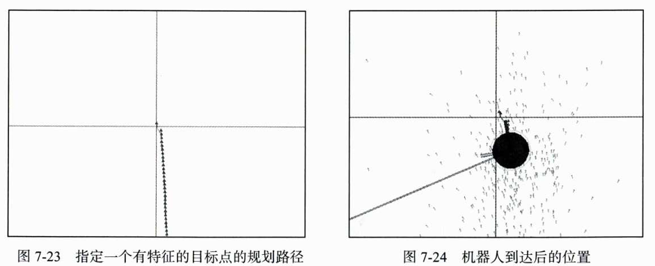
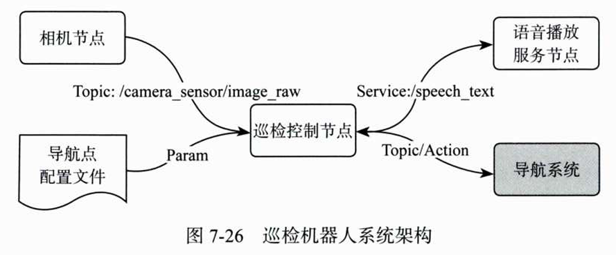

# 第七章 导航 
## 7.1 机器人导航介绍
对于移动机器人来说，自主导航本质上就是要解决这两个问题：**定位**和**路径规划**。
### 7.1.1 同步定位与地图构建

**定位问题**：手机导航依赖卫星定位，但室内/工厂环境无法使用 GPS，机器人需要通过自身传感器获取位置信息。

**地图问题**：导航还需要知道**哪里可以走、哪里不能走**（障碍物），这需要一张标有环境信息的地图。对于特定环境的机器人，地图需要自己构建。

**里程计 + 激光雷达**：利用里程计获取位置信息，激光雷达获取环境深度信息，边移动边记录障碍物信息，可以初步实现自主导航。

#### 实验演示：简单数据叠加的问题

启动 6.5 节仿真，在 RViz 中：
- 设置 **Fixed Frame** 为 `odom`
- 添加里程计（Odometry）和激光雷达（LaserScan）话题
- 设置 **LaserScan Decay Time** 为 `1000`（保留过去 1000s 数据）
- 设置 **Odometry Keep** 为 `10000`（保留过去 10000 个数据）

用键盘控制机器人前进并转弯，发现：
- ✅ 直线运动时，轨迹和障碍物记录准确
- ❌ 转弯时，障碍物信息出现较大偏差

**原因**：传感器数据速率不同步、存在噪声，简单叠加会导致错误记录。

#### SLAM 技术

SLAM（同步定位与地图构建）通过特征提取和滤波等算法，解决定位与建图问题。

**SLAM 分类**（按传感器类型）：

| 类型 | 传感器 | 原理 | 成熟度 |
| :--- | :--- | :--- | :--- |
| 激光 SLAM | 激光雷达 | 获取环境深度信息，标记障碍物和自由空间 | 技术成熟，精度高 |
| 视觉 SLAM | 相机 | 获取图像信息，通过图像处理和特征提取进行建图定位 | 受光照影响大 |

#### 导航 vs SLAM

SLAM 解决**建图**和**定位**，而**导航**还需要基于地图进行**路径规划**并控制机器人移动到目标位置。

> 导航 = 地图 + 定位 + 路径规划 + 运动控制

## 7.2 使用 slam_toolbox 完成建图

SLAM 通过传感器获取环境信息后进行定位和建图。ROS 2 提供了多种 SLAM 功能包，如 `slam_toolbox`、`cartographer_ros` 和 `rtabmap_slam` 等。针对二维激光场景，`slam_toolbox` 开箱即用，上手简单。

### 7.2.1 构建第一张导航地图

`slam_toolbox` 是一套用于 2D SLAM 的开源工具，通过 apt 命令可方便安装。

#### 安装 slam_toolbox

```bash
sudo apt install ros-$ROS_DISTRO-slam-toolbox
```

#### 准备工作

1. 创建工作空间 `chapt7/chapt7_ws/src`
2. 将 6.5 节中的 `fishbot_description` 功能包复制到 `src` 目录下
3. 进入 `chapt7_ws`，重新构建功能包，启动仿真

#### 启动 slam_toolbox 在线建图

```bash
ros2 launch slam_toolbox online_async_launch.py use_sim_time:=True
```

**启动日志关键信息**：
- `Node using stack size 40000000`：节点使用 40000000 栈大小
- `Using solver plugin solver_plugins::CeresSolver`：使用 CeresSolver 求解器
- `maximum laser range setting (20.0 m) exceeds the capabilities of the used Lidar (8.0 m)`：激光雷达最大测距 8.0m，配置中设置为 20.0m（仅警告，不影响使用）
- `Registering sensor: [Custom Described Lidar]`：注册雷达传感器

#### slam_toolbox 输入与输出

| 类型 | 话题/数据 | 说明 |
| :--- | :--- | :--- |
| **输入** | `/scan` | 激光雷达数据 |
| **输入** | 里程计坐标系 `odom` → 机器人坐标系 `base_footprint` 的 TF 变换 | 提供里程计信息 |
| **输出** | `/map` 话题 | 发布构建的地图数据 |

> **注意**：启动时设置 `use_sim_time:=True`，表示使用 Gazebo 仿真时间，防止因时间戳造成数据不合法。

#### RViz 配置

- 设置 **Fixed Frame** 为 `map`
- 添加显示：
  - `/map` 话题（地图数据）
  - `/camera_sensor/image_raw` 话题（图像数据）
  - TF 和 RobotModel 等
- 地图显示：**白色** = 可行走无障碍空间，**黑色** = 障碍物，**灰色** = 未知区域

#### TF 结构分析

使用 `rqt-tf-tree` 查看 TF 结构：

```
map → odom → base_footprint → base_link → ...
```

`slam_toolbox` 没有直接发布 `map → base_footprint`，而是发布 `map → odom`，这样不打破原有的 `odom → base_footprint` 结构关系，保持了里程计与 SLAM 定位的独立性。

#### 建图操作

启动键盘控制节点，控制机器人缓慢移动完成环境探索：
- **降低线速度和角速度**：防止因雷达扫描速率不够造成测量误差
- 完整探索地图如图

### 7.2.2 将地图保存为文件

导航地图通常以图片形式保存，并设置比例尺来对应真实物理尺寸。保存地图可使用 `nav2_map_server` 工具。

#### 安装保存地图服务

```bash
sudo apt install ros-$ROS_DISTRO-nav2-map-server
```

#### 准备工作

1. 创建导航功能包 `fishbot_navigation2`（`ament_cmake` 类型）
2. 在功能包下新建 `maps` 目录
3. 进入 `maps` 目录，运行保存命令

#### 保存地图命令

```bash
ros2 run nav2_map_server map_saver_cli -f room
```

**命令说明**：
- `map_saver_cli`：`nav2_map_server` 提供的保存地图命令行工具
- `-f room`：指定地图文件名为 `room`（生成 `room.pgm` 和 `room.yaml`）

**运行日志关键信息**：
- `Saving map from 'map' topic to 'room' file`：从 `/map` 话题保存地图
- `Free threshold unspecified. Setting it to default value: 0.250000`：自由阈值使用默认值 0.25
- `Occupied threshold unspecified. Setting it to default value: 0.650000`：占据阈值使用默认值 0.65
- `Received a 376 X 222 map @ 0.05 m/pix`：地图尺寸 376×222 像素，分辨率 0.05m/像素

#### 生成的文件

| 文件 | 格式 | 说明 |
| :--- | :--- | :--- |
| `room.pgm` | PGM 图片 | 地图图片，可用图片查看器打开，也可用 PhotoShop 等工具二次编辑 |
| `room.yaml` | YAML 文本 | 地图描述文件，包含分辨率、原点、阈值等元信息 |

#### 地图描述文件（room.yaml）

```yaml
image: room.pgm          # 地图图片文件名
mode: trinary            # 地图类型（三态：占据/自由/未知）
resolution: 0.05         # 分辨率（m/像素），每个像素对应 0.05m
origin: [-10.4, -6.53, 0] # 地图原点坐标（m）
negate: 0                # 是否取反（0=不取反）
occupied_thresh: 0.65    # 占据阈值（≥0.65 为障碍物）
free_thresh: 0.25        # 自由阈值（<0.25 为自由空间）
```

#### 占据栅格地图（Occupancy Grid Map）

地图中的每个像素点有三种状态：
| 颜色 | 状态 | 概率值 |
| :--- | :--- | :--- |
| 白色 | 自由空间（Free） | < 0.25 |
| 黑色 | 占据/障碍物（Occupied） | ≥ 0.65 |
| 灰色 | 未知区域（Unknown） | 0.25 ~ 0.65 |

**为什么使用阈值而非纯 0/1？**
- 传感器存在噪声，即使再好也有误差
- 某个位置是障碍物还是自由空间无法 100% 确定
- 将地图划分为栅格，用概率表示占据可能性（栅格概率值映射到像素值）

> 地图 = 占据栅格地图（Occupancy Grid Map），每个栅格存储被占据的概率值，而非简单的 0/1 二元值。

## 7.3 机器人导航框架 Navigation 2

Navigation 2（Nav2）是一个开源的机器人导航框架，目标是让机器人安全地从 A 点自主移动到 B 点。它具备**路径规划**、**避障**和**自主脱困**等基本能力。

**行为树**：Navigation 2 使用行为树（Behavior Tree）来管理和调度机器人行为。行为树起源于游戏设计（如植物大战僵尸中豌豆射手的行为控制），适合描述机器人何时进行路径规划、何时执行脱困等复杂行为逻辑。

### 7.3.1 Navigation 2 系统框架

Navigation 2 系统框架如图 7-8 所示，核心部分在圆角矩形框内：

**输入**：
- TF 变换
- 地图数据（`/map`）
- 传感器数据（激光雷达、相机等）
- 行为树配置
- 目标位置（`nav2_msgs/action/NavigateToPose`）

**输出**：控制话题 `/cmd_vel`

**核心内部模块**：

| 模块 | 功能 | 可加载插件 |
| :--- | :--- | :--- |
| **BT 导航服务器** | 根据 XML 行为树描述文件，调用下方三个服务器完成行为控制 | — |
| **规划服务器**（Planner Server） | 全局路径规划（计算到目标点的路径 CP） | 多种规划器插件 |
| **控制器服务器**（Controller Server） | 根据全局路径、实时障碍物和局部代价地图完成控制（路径跟随 FP） | 多种控制器插件 |
| **恢复服务器**（Recovery Server） | 执行脱困行为（如卡住时） | 多种恢复插件 |

**工作流程**：
1. BT 导航服务器收到目标点
2. 规划服务器计算到目标点的路径（CP）
3. 控制器服务器进行路径跟随（FP）
4. 若遇到卡住等困境，调用恢复服务器完成脱困

> 此外，Navigation 2 还包含**平滑服务器**等辅助模块，协同完成导航任务。

### 7.3.2 配置 Navigation 2 参数

Navigation 2 作为一个模块，需要正确的输入数据才能正常工作。启动导航前需调整相关参数，以适配仿真机器人，主要包括**话题名称**、**坐标系名称**和**机器人描述**等。

#### 复制配置文件
在功能包`fishbot_navigation2`新建文件夹`config`。
`nav2_bringup` 提供了默认参数配置文件，复制到功能包 `fishbot_navigation2` 的 `config` 目录下：

```bash
cp /opt/ros/$ROS_DISTRO/share/nav2_bringup/params/nav2_params.yaml src/fishbot_navigation2/config
```

#### 参数说明

| 参数类型 | 参数名示例 | 说明 |
| :--- | :--- | :--- |
| **话题配置** | `scan_topic`、`odom_topic` | 雷达数据话题、里程计话题等 |
| **坐标系配置** | `odom_frame_id`、`robot_base_frame` | 里程计坐标系、机器人基础坐标系 |

> **注意**：默认值通常与仿真中的设置一致，如 `odom` 和 `scan`，需确保与实际使用的话题名称匹配。

#### 机器人半径配置

路径规划需考虑机器人尺寸：
- **半径过大**：无法通过窄通道
- **半径过小**：容易发生碰撞

在**全局代价地图**和**局部代价地图**中配置 `robot_radius` 参数：

```yaml
local_costmap:
  local_costmap:
    ros__parameters:
      robot_radius: 0.12   # 机器人半径（单位：米）

global_costmap:
  global_costmap:
    ros__parameters:
      robot_radius: 0.12   # 机器人半径（单位：米）
```

> 该值需与建模时使用的机器人半径一致。


### 7.3.3 编写 launch 并启动导航

有了参数配置文件，接下来编写 launch 文件传递参数并启动导航。

#### launch 文件内容

在 `fishbot_navigation2` 功能包下新建 `launch` 目录，创建 `navigation2.launch.py`：

```python
import os
import launch
import launch_ros
from ament_index_python.packages import get_package_share_directory
from launch.launch_description_sources import PythonLaunchDescriptionSource

def generate_launch_description():
    # 获取与拼接默认路径，主要是本功能包路径与nav2的路径
    fishbot_navigation2_dir = get_package_share_directory('fishbot_navigation2')
    nav2_bringup_dir = get_package_share_directory('nav2_bringup')
    rviz_config_dir = os.path.join(nav2_bringup_dir, 'rviz', 'nav2_default_view.rviz')

    # 创建 launch 配置参数，主要是是否使用仿真时间、地图文件、nav2的配置文件（先前拷贝）
    use_sim_time = launch.substitutions.LaunchConfiguration('use_sim_time', default='true')
    map_yaml_path = launch.substitutions.LaunchConfiguration(
        'map', default=os.path.join(fishbot_navigation2_dir, 'maps', 'room.yaml'))
    nav2_param_path = launch.substitutions.LaunchConfiguration(
        'params_file', default=os.path.join(fishbot_navigation2_dir, 'config', 'nav2_params.yaml'))

    return launch.LaunchDescription([
        # launch 参数
        launch.actions.DeclareLaunchArgument('use_sim_time', default_value=use_sim_time,
            description='Use simulation (Gazebo) clock if true'),
        launch.actions.DeclareLaunchArgument('map', default_value=map_yaml_path,
            description='Full path to map file to load'),
        launch.actions.DeclareLaunchArgument('params_file', default_value=nav2_param_path,
            description='Full path to param file to load'),
        
        # 启动 nav2 功能包下的launch
        launch.actions.IncludeLaunchDescription(
            PythonLaunchDescriptionSource(
                [nav2_bringup_dir, '/launch', '/bringup_launch.py']),
            launch_arguments={
                'map': map_yaml_path,
                'use_sim_time': use_sim_time,
                'params_file': nav2_param_path
            }.items(),
        ),

        # 启动 rviz2
        launch_ros.actions.Node(
            package='rviz2',
            executable='rviz2',
            name='rviz2',
            arguments=['-d', rviz_config_dir],
            parameters=[{'use_sim_time': use_sim_time}],
            output='screen'),
    ])
```

#### launch 文件说明

- 对外提供三个可配置参数：
  - `use_sim_time`：是否使用仿真时间（默认 `true`）
  - `map`：地图文件路径（默认 `maps/room.yaml`）
  - `params_file`：导航参数文件路径（默认 `config/nav2_params.yaml`）
- 通过 `IncludeLaunchDescription` 包含 `nav2_bringup` 的 `bringup_launch.py`
- 同时启动 `rviz2` 加载默认视图配置

#### 编译配置

在 `CMakeLists.txt` 中添加安装目录：

```cmake
install(DIRECTORY launch config maps
    DESTINATION share/${PROJECT_NAME}
)
```

然后重新构建功能包完成文件复制。

---

#### 启动导航

**步骤 1**：启动仿真，加载gazebo和机器人tf等数据
```bash
ros2 launch fishbot_description gazebo_robot.launch.py
```

**步骤 2**：启动导航 launch，加载地图与导航规划
```bash
ros2 launch fishbot_navigation2 navigation2.launch.py
```

启动后 RViz 加载地图，但终端可能报 TF 错误，此时需设置机器人初始位置。


#### 设置初始位置

RViz 工具栏中与导航相关的操作按钮（图 7-9）：

| 工具 | 功能 |
| :--- | :--- |
| **2D Pose Estimate** | 设置机器人初始位置和朝向 |
| **Nav2 Goal** | 设置导航目标点 |

**操作步骤**：
1. 选中 **2D Pose Estimate** 工具
2. 在地图中机器人所在的大概位置单击
3. 按住左键拖动鼠标调整机器人朝向（可多次设置调整）

设置完成后 TF 错误消失，地图显示更新。


#### 代价地图与膨胀层

初始化后地图中障碍物边界变大，这是**代价地图（Costmap）**中的**膨胀层（Inflation Layer）**。膨胀层在障碍物周围按一定半径进行膨胀，防止机器人与障碍物发生碰撞。

**两种代价地图**：
| 类型 | 说明 |
| :--- | :--- |
| **全局代价地图（Global Costmap）** | 用于全局路径规划，覆盖整个地图 |
| **局部代价地图（Local Costmap）** | 用于局部路径规划，仅机器人周围区域 |

**查看局部代价地图**：
1. 在 RViz 左侧显示面板中取消 **Global Costmap** 的显示
2. 保留 **Local Costmap** 显示，可看到机器人周围的障碍物膨胀层（图 7-11b）

膨胀层的作用：将障碍物边界向外扩展，为机器人预留安全距离，避免实际运动中发生碰撞。

### 7.3.4 进行单点与路点导航


#### 单点导航

在 RViz 中，使用 **Nav2 Goal** 工具可以设置目标点，让机器人自主导航。

**操作步骤**：
1. 单击 **Nav2 Goal** 按钮
2. 在地图中选择目标位置，按住左键拖动调整目标朝向
3. 释放后，Navigation 2 会规划出一条**全局路径**

机器人开始沿路径移动。若放大图像，可看到一条很短的蓝色线条，这是**局部规划路线**，用于实时避障和路径跟踪。

**导航取消**：可通过 Navigation 2 RViz 插件中取消当前导航任务。


#### 路点导航

路点导航允许机器人按顺序经过多个指定点。

**启用路点模式**：
1. 在 Navigation 2 RViz 插件中，单击 **Waypoint/Nav Through Poses Mode**
2. 使用 **Nav2 Goal** 工具依次设置多个目标点

**启动路点导航**：
1. 在 RViz 左下角的窗口中
2. 单击 **Start Waypoint Following** 按钮（原本的**Waypoint/Nav Through Poses Mode**会变化成**Start Waypoint Following**）

机器人将依次走向每一个路点。

**注意**：Navigation 2 RViz 插件中还提供了 **Cancel Accumulation** 按钮，用于取消已累积的路点。

### 7.3.5 导航过程中进行动态避障

在导航过程中，若机器人的路径上出现新的障碍物，Navigation 2 应能检测到障碍并重新规划路径绕行。


#### 测试动态避障

**步骤 1：设置导航目标点**

在 RViz 中，使用 **Nav2 Goal** 工具设置一个较远的目标点，Navigation 2 会规划出一条较长的全局路径（如图 7-18 所示）。

**步骤 2：放置障碍物**

在 Gazebo 仿真环境中，通过工具栏的**正方体**模型，将其放置到机器人的必经之路上（如图 7-19 所示）。

**步骤 3：观察路径变化**

回到 RViz 观察，可以发现：
- 障碍物已被添加到代价地图中
- 机器人自动改变了原有路径
- 重新规划出一条绕过障碍物的新路径（如图 7-20 所示）


#### 动态避障原理

在机器人行走过程中，**激光雷达**会持续检测周围的距离信息。一旦发现新障碍物，Navigation 2 会将其添加到**代价地图**中，触发**全局路径重新规划**，实现动态绕障。

> 这个机制确保机器人能够在未知或动态变化的环境中安全移动，是 Navigation 2 自主导航能力的核心之一。


### 7.3.6 优化导航速度和膨胀半径

在导航测试中，若机器人旋转过快容易导致定位不稳（激光雷达扫描频率较低时尤为明显），需通过调整配置文件限制最大速度。此外，膨胀半径设置不合理可能导致可行区域被过度压缩，也需要优化。


#### 1. 限制最大旋转速度

速度相关参数位于**控制器服务器**中，`FollowPath` 模块负责将路径转换为角速度和线速度。

打开 `nav2_params.yaml`，修改 `controller_server` 下的参数：

```yaml
controller_server:
  ros__parameters:
    ...
    FollowPath:
      ...
      max_vel_theta: 0.8        # 最大旋转角速度（rad/s）
      acc_lim_theta: 2.0        # 角加速度（rad/s²）
```

**效果验证**：重启 Navigation 2，设置需掉头的目标点，通过 `ros2 topic echo /cmd_vel --once` 查看速度数据，角速度 `z` 轴分量绝对值最大为 0.8。


#### 2. 缩小膨胀半径

膨胀半径过大时，地图中狭窄区域可能被完全占据，但实际 Gazebo 中该区域比机器人半径大得多，说明膨胀半径设置不合理。

膨胀半径是代价地图的参数，一般设置为**机器人直径**（即 `robot_radius` 的 2 倍）。修改 `nav2_params.yaml` 中全局和局部代价地图的 `inflation_radius`：

```yaml
local_costmap:
  local_costmap:
    ros__parameters:
      ...
      inflation_layer:
        ...
        inflation_radius: 0.24   # 膨胀半径（m）

global_costmap:
  global_costmap:
    ros__parameters:
      ...
      inflation_layer:
        ...
        inflation_radius: 0.24   # 膨胀半径（m）
```

**效果验证**：重启导航后，初始化位置，地图中膨胀区域缩小至合理大小。


#### 参数调整建议

| 参数 | 位置 | 说明 |
| :--- | :--- | :--- |
| `max_vel_theta` | `controller_server/FollowPath` | 最大旋转角速度，限值过大可能导致定位不稳 |
| `acc_lim_theta` | `controller_server/FollowPath` | 角加速度，限制转速变化率 |
| `inflation_radius` | `local_costmap/inflation_layer`<br>`global_costmap/inflation_layer` | 膨胀半径，建议设为 `robot_radius × 2` |

### 7.3.7 优化机器人到点精度

在 Navigation 2 中，机器人到达目标点时并非精准停靠，而是有一个**允许误差范围**。默认情况下，只要机器人在该范围内即视为已到达目标点。

#### 问题现象

指定一个特征明显的目标点（如网格交点），如图 7-23 所示。机器人到达后，距离目标点仍有一段距离（如图 7-24 所示），说明到点精度不足。


#### 解决方案

到点精度由**控制器服务器**控制，需修改 `nav2_params.yaml` 中的相关参数。

##### 修改参数

打开 `nav2_params.yaml`，调整以下参数：

```yaml
controller_server:
  ros__parameters:
    ...
    general_goal_checker:
      ...
      xy_goal_tolerance: 0.15      # 位置允许误差（m）
      yaw_goal_tolerance: 0.15     # 角度允许误差（rad）
    ...
    FollowPath:
      ...
      xy_goal_tolerance: 0.15      # 路径跟踪时的位置允许误差（m）
```

##### 参数说明

| 参数 | 位置 | 作用 |
| :--- | :--- | :--- |
| `xy_goal_tolerance` | `FollowPath` | 路径跟踪时，到达目标点的位置允许误差 |
| `xy_goal_tolerance` | `general_goal_checker` | 实时检测当前位置与目标位置的差距，在允许范围内则停止路径跟随 |
| `yaw_goal_tolerance` | `general_goal_checker` | 到达目标点时的角度允许误差 |

> **注意**：地图默认分辨率为 0.05m，若到点范围设置过小，机器人可能在目标点附近反复徘徊，反而不利于导航。


#### 验证效果

修改后重新构建并启动导航，再次设置目标点，机器人到点更加准确（如图 7-25 所示）。

## 7.4 导航应用开发指南

在实际机器人项目中，导航往往只是系统的一个子模块，需要通过接口进行调用和状态监测，而非人工使用 RViz 工具操作。本节介绍调用机器人导航的常用方法。


### 7.4.1 使用话题初始化机器人位姿

导航启动后，第一步是**初始化机器人位姿**。在 Navigation 2 中，`amcl` 节点根据地图和传感器数据实时计算机器人位置，但初始位置需通过话题告知。

#### 查看 amcl 节点相关信息

```bash
ros2 node info /amcl
```

**关键订阅话题**：
- `/initialpose`：接收初始化位姿（`geometry_msgs/msg/PoseWithCovarianceStamped`）
- `/scan`：激光雷达数据
- `/map`：地图数据

**关键发布话题**：
- `/amcl_pose`：当前估计位姿
- `/tf`：坐标变换
- `/particle_cloud`：粒子云（用于可视化）

#### 命令行发布初始化位姿

```bash
ros2 topic pub /initialpose geometry_msgs/msg/PoseWithCovarianceStamped \
    "{header: {frame_id: map}, pose: {pose: {position: {x: 0.0, y: 0.0, z: 0.0}}}}" --once
```

发布后 RViz 中机器人位姿出现在地图上，表示初始化成功。


### 7.4.2 使用 nav2_simple_commander 初始化位姿

Navigation 2 提供了 `nav2_simple_commander` Python 库，封装常用导航操作，避免手动处理话题。

#### 创建功能包

```bash
ros2 pkg create fishbot_application --build-type ament_python --dependencies rclpy geometry_msgs nav2_simple_commander
```

#### 初始化位姿代码

在功能包目录下创建 `init_robot_pose.py`：

```python
# 位置时间戳，实际上其不是目标类型，但是BasicNavigator类能够将PoseStamped类型转换为目标类型
from geometry_msgs.msg import PoseStamped
from nav2_simple_commander.robot_navigation import BasicNavigator
import rclpy

def main():
    rclpy.init()
    # BasicNavigator实际上是继承于Node的类
    nav_agent = BasicNavigator()

    # 构造初始位姿
    initial_pose = PoseStamped()
    initial_pose.header.frame_id = 'map'
    initial_pose.header.stamp = nav_agent.get_clock().now().to_msg()
    # 利用四元数标定位置
    initial_pose.pose.position.x = 0.0
    initial_pose.pose.position.y = 0.0
    initial_pose.pose.orientation.w = 1.0

    # 发布初始位姿并等待导航激活
    nav_agent.setInitialPose(initial_pose)
    nav_agent.waitUntilNav2Active()

    rclpy.spin(nav_agent)
    rclpy.shutdown()

if __name__ == '__main__':
    main()
```

#### setInitialPose 内部实现

`setInitialPose` 方法最终通过话题发布 `PoseWithCovarianceStamped` 消息：

```python
def _setInitialPose(self):
    msg = PoseWithCovarianceStamped()
    msg.pose.pose = self.initial_pose.pose
    msg.header.frame_id = self.initial_pose.header.frame_id
    msg.header.stamp = self.initial_pose.header.stamp
    self.initial_pose_pub.publish(msg)
```

#### 注册节点

在 `setup.py` 的 `entry_points` 中注册：

```python
entry_points={
    'console_scripts': [
        'init_robot_pose = fishbot_application.init_robot_pose:main',
    ],
},
```

#### 运行测试

```bash
ros2 launch fishbot_navigation2 navigation2.launch.py
# 另开终端
ros2 run fishbot_application init_robot_pose
```

> **应用场景**：可结合二维码等视觉标记自动初始化位姿。当机器人迷路时，通过识别标记调用初始化方法，将机器人重置到已知位置附近。

### 7.4.2 使用 TF 获取机器人实时位置
当 `amcl` 节点正常运行后，它会计算机器人在地图中的位置，并结合里程计发布 `map` 到各坐标系的 TF 变换。

#### amcl 节点坐标系配置

`nav2_params.yaml` 中 amcl 的坐标系配置：

```yaml
amcl:
  ros__parameters:
    base_frame_id: "base_footprint"   # 机器人基座坐标系
    global_frame_id: "map"            # 全局坐标系
    odom_frame_id: "odom"             # 里程计坐标系
    tf_broadcast: true                # 是否广播 TF
```

既然存在 `map → odom → base_footprint` 的 TF 变换，获取机器人在地图中的实时位姿可通过**监听 TF** 实现。


#### 监听 TF 获取机器人位姿
实际上就是第五章的代码，只需要修改`tf = self.buffer.lookup_transform('map', 'base_footprint', rclpy.time.Duration(seconds=1))`即可
创建 `get_robot_pose.py`：

```python
import rclpy
from rclpy.node import Node
from tf2_ros import TransformListener, Buffer
from tf_transformations import euler_from_quaternion

class TFListener(Node):
    def __init__(self):
        super().__init__('tf2_listener')
        self.buffer = Buffer()
        self.listener = TransformListener(self.buffer, self)
        self.timer = self.create_timer(1, self.get_transform)

    def get_transform(self):
        try:
            # 查找 map → base_footprint 的变换（等待最长 1 秒）
            tf = self.buffer.lookup_transform('map', 'base_footprint', rclpy.time.Duration(seconds=1))
            transform = tf.transform
            
            # 将四元数转换为欧拉角
            rotation_euler = euler_from_quaternion([
                transform.rotation.x,
                transform.rotation.y,
                transform.rotation.z,
                transform.rotation.w
            ])
            
            self.get_logger().info(
                f'平移: {transform.translation}, '
                f'旋转四元数: {transform.rotation}, '
                f'旋转欧拉角: {rotation_euler}'
            )
        except Exception as e:
            self.get_logger().warn(f'无法获取坐标变换，原因：{str(e)}')

def main():
    rclpy.init()
    node = TFListener()
    rclpy.spin(node)
    rclpy.shutdown()
```

#### 运行结果
（需要提前启动gazebo和rviz2）
```bash
ros2 run fishbot_application get_robot_pose
```

输出示例：
```
平移: (x=-0.0681, y=-0.0101, z=0.0919),
旋转四元数: (x=0.0, y=0.0, z=0.0068, w=0.99998),
旋转欧拉角: (0.0, -0.0, 0.0136)
```

结果表示：机器人在地图坐标系中的位置和朝向被实时输出。


#### 扩展思考

| 目标 | 方法 |
| :--- | :--- |
| 获取里程计坐标系下的位姿 | 监听 `odom → base_footprint` 的 TF 变换 |
| C++ 实现 | 使用 `tf2_ros::Buffer` 和 `tf2_ros::TransformListener`，API 类似 |

### 7.4.3 调用接口进行单点导航

Navigation 2 对外提供**动作服务**（Action）接口用于导航调用。动作通信是 ROS 2 四大通信机制之一，其核心优势在于**反馈机制**：客户端发送目标后，可实时接收服务端的处理进度反馈。


#### 查看导航动作列表

启动导航后，查看所有动作：

```bash
ros2 action list
```

关键动作：
- `/navigate_to_pose`：单点导航
- `/navigate_through_poses`：路点导航
- `/follow_waypoints`：路径跟随


#### 查看动作信息

```bash
ros2 action info /navigate_to_pose -t
```

**输出**：
- Action clients: `bt_navigator`, `waypoint_follower`, `rviz2`
- Action servers: `bt_navigator`


#### 动作接口定义

```bash
ros2 interface show nav2_msgs/action/NavigateToPose
```

**接口结构**：

| 部分 | 内容 |
| :--- | :--- |
| **Goal（目标）** | `geometry_msgs/PoseStamped pose` + `string behavior_tree` |
| **Result（结果）** | `std_msgs/Empty result` |
| **Feedback（反馈）** | `current_pose`, `navigation_time`, `estimated_time_remaining`, `number_of_recoveries`, `distance_remaining` |

> 反馈数据在 RViz 左下角 Navigation 2 面板实时显示（时间、剩余距离、脱困次数等）。


#### 命令行发送导航目标

```bash
ros2 action send_goal /navigate_to_pose nav2_msgs/action/NavigateToPose \
    "{pose: {header: {frame_id: map}, pose: {position: {x: 2.0, y: 2.0}}}}" --feedback
```

执行后终端会输出目标、实时反馈和最终结果。


#### Python 调用（nav2_simple_commander）

`nav2_simple_commander` 库封装了动作客户端，方便调用。

**创建 `nav_to_pose.py`**：

```python
from geometry_msgs.msg import PoseStamped
from nav2_simple_commander.robot_navigator import BasicNavigator, TaskResult
import rclpy
from rclpy.duration import Duration

def main():
    rclpy.init()
    navigator = BasicNavigator()

    # 等待导航激活
    navigator.waitUntilNav2Active()

    # 设置目标点
    goal_pose = PoseStamped()
    goal_pose.header.frame_id = 'map'
    goal_pose.header.stamp = navigator.get_clock().now().to_msg()
    goal_pose.pose.position.x = 1.0
    goal_pose.pose.position.y = 1.0
    goal_pose.pose.orientation.w = 1.0

    # 发送目标
    navigator.goToPose(goal_pose)

    # 循环获取反馈
    while not navigator.isTaskComplete():
        feedback = navigator.getFeedback()
        navigator.get_logger().info(
            f'预计剩余: {Duration.from_msg(feedback.estimated_time_remaining).nanoseconds / 1e9} s'
        )

        # 超时取消（600秒）
        if Duration.from_msg(feedback.navigation_time) > Duration(seconds=600.0):
            navigator.cancelTask()

    # 结果判断
    result = navigator.getResult()
    if result == TaskResult.SUCCEEDED:
        navigator.get_logger().info('导航结果：成功')
    elif result == TaskResult.CANCELED:
        navigator.get_logger().warn('导航结果：被取消')
    elif result == TaskResult.FAILED:
        navigator.get_logger().error('导航结果：失败')

if __name__ == '__main__':
    main()
```

**关键函数**：

| 函数 | 作用 |
| :--- | :--- |
| `goToPose(goal)` | 发送导航目标 |
| `getFeedback()` | 获取实时反馈 |
| `cancelTask()` | 取消当前任务 |
| `getResult()` | 获取最终结果 |

**底层实现**：`goToPose` 内部通过 `self.nav_to_pose_client.send_goal_async` 发送动作请求，`nav_to_pose_client` 是 `BasicNavigator` 中定义的动作客户端：

```python
self.nav_to_pose_client = ActionClient(self, NavigateToPose, 'navigate_to_pose')
```

---

#### C++ 调用示例

使用 `rclcpp_action` 库创建动作客户端发送导航目标：

```cpp
#include <memory>
#include "nav2_msgs/action/navigate_to_pose.hpp"
#include "rclcpp/rclcpp.hpp"
#include "rclcpp_action/rclcpp_action.hpp"

using NavigationAction = nav2_msgs::action::NavigateToPose;

class NavToPoseClient : public rclcpp::Node {
public:
    using NavigationActionClient = rclcpp_action::Client<NavigationAction>;
    using NavigationActionGoalHandle = rclcpp_action::ClientGoalHandle<NavigationAction>;

    NavToPoseClient() : Node("nav_to_pose_client") {
        // 创建导航动作客户端
        action_client_ = rclcpp_action::create_client<NavigationAction>(this, "navigate_to_pose");
    }

    void sendGoal() {
        // 等待导航动作服务器上线（超时 5s）
        while (!action_client_->wait_for_action_server(std::chrono::seconds(5))) {
            RCLCPP_INFO(get_logger(), "等待 Action 服务上线。");
        }

        // 设置导航目标点
        auto goal_msg = NavigationAction::Goal();
        goal_msg.pose.header.frame_id = "map";
        goal_msg.pose.pose.position.x = 2.0f;
        goal_msg.pose.pose.position.y = 2.0f;

        // 配置发送选项
        auto send_goal_options = rclcpp_action::Client<NavigationAction>::SendGoalOptions();

        // 目标响应回调
        send_goal_options.goal_response_callback =
            [this](NavigationActionGoalHandle::SharedPtr goal_handle) {
                if (goal_handle) {
                    RCLCPP_INFO(get_logger(), "目标点已被服务器接收");
                }
            };

        // 过程反馈回调
        send_goal_options.feedback_callback =
            [this](NavigationActionGoalHandle::SharedPtr goal_handle,
                   const std::shared_ptr<const NavigationAction::Feedback> feedback) {
                (void)goal_handle;
                RCLCPP_INFO(this->get_logger(), "反馈剩余距离: %f", feedback->distance_remaining);
            };

        // 执行结果回调
        send_goal_options.result_callback =
            [this](const NavigationActionGoalHandle::WrappedResult& result) {
                if (result.code == rclcpp_action::ResultCode::SUCCEEDED) {
                    RCLCPP_INFO(this->get_logger(), "处理成功！");
                }
            };

        // 异步发送目标
        action_client_->async_send_goal(goal_msg, send_goal_options);
    }

private:
    NavigationActionClient::SharedPtr action_client_;
};

int main(int argc, char** argv) {
    rclcpp::init(argc, argv);
    auto node = std::make_shared<NavToPoseClient>();
    node->sendGoal();
    rclcpp::spin(node);
    rclcpp::shutdown();
    return 0;
}
```


#### 代码结构说明

| 部分 | 说明 |
| :--- | :--- |
| **创建客户端** | `rclcpp_action::create_client<NavigationAction>(this, "navigate_to_pose")` |
| **等待服务器** | `action_client_->wait_for_action_server()` |
| **构造目标** | `NavigationAction::Goal()`，设置 `frame_id` 和目标坐标 |
| **目标响应回调** | 服务器是否接收目标 |
| **反馈回调** | 实时获取 `distance_remaining` 等反馈数据 |
| **结果回调** | 导航完成（成功/失败/取消） |
| **发送目标** | `async_send_goal(goal_msg, send_goal_options)` |

#### 运行

```bash
# 编译后运行
ros2 run fishbot_application nav_to_pose_client
```
如果机器人真实初始位置就在 (0, 0)（且朝向与 map 一致），则不用手动设初始位姿；如果不是，则必须通过代码（即上一节代码）或 RViz 告诉系统“我在哪”，否则导航无法工作。

### 7.4.4 使用接口完成路点导航

路点导航（Waypoint Navigation）允许机器人按顺序经过多个目标点，与单点导航类似，通过动作服务调用，动作名称为 `/follow_waypoints`。


#### 查看路点动作信息

```bash
ros2 action info /follow_waypoints -t
```

**输出**：
- Action clients: `rviz2`
- Action servers: `waypoint_follower`


#### 动作接口定义

```bash
ros2 interface show nav2_msgs/action/FollowWaypoints
```

| 部分 | 内容 |
| :--- | :--- |
| **Goal（目标）** | `geometry_msgs/PoseStamped[] poses`（目标点数组） |
| **Result（结果）** | `int32[] missed_waypoints`（未到达的点编号） |
| **Feedback（反馈）** | `uint32 current_waypoint`（当前正在前往的点编号） |


#### Python 调用路点导航

创建 `waypoint_follower.py`：

```python
from geometry_msgs.msg import PoseStamped
from nav2_simple_commander.robot_navigator import BasicNavigator, TaskResult
import rclpy

def main():
    rclpy.init()
    navigator = BasicNavigator()
    navigator.waitUntilNav2Active()

    # 创建目标点列表
    goal_poses = []

    # 目标点 1
    goal_pose1 = PoseStamped()
    goal_pose1.header.frame_id = 'map'
    goal_pose1.header.stamp = navigator.get_clock().now().to_msg()
    goal_pose1.pose.position.x = 0.0
    goal_pose1.pose.position.y = 0.0
    goal_pose1.pose.orientation.w = 1.0
    goal_poses.append(goal_pose1)

    # 目标点 2
    goal_pose2 = PoseStamped()
    goal_pose2.header.frame_id = 'map'
    goal_pose2.header.stamp = navigator.get_clock().now().to_msg()
    goal_pose2.pose.position.x = 2.0
    goal_pose2.pose.position.y = 0.0
    goal_pose2.pose.orientation.w = 1.0
    goal_poses.append(goal_pose2)

    # 目标点 3
    goal_pose3 = PoseStamped()
    goal_pose3.header.frame_id = 'map'
    goal_pose3.header.stamp = navigator.get_clock().now().to_msg()
    goal_pose3.pose.position.x = 2.0
    goal_pose3.pose.position.y = 2.0
    goal_pose3.pose.orientation.w = 1.0
    goal_poses.append(goal_pose3)

    # 发送路点导航请求
    navigator.followWaypoints(goal_poses)

    # 循环获取反馈
    while not navigator.isTaskComplete():
        feedback = navigator.getFeedback()
        navigator.get_logger().info(f'当前目标编号: {feedback.current_waypoint}')

    # 结果判断
    result = navigator.getResult()
    if result == TaskResult.SUCCEEDED:
        navigator.get_logger().info('导航结果: 成功')
    elif result == TaskResult.CANCELED:
        navigator.get_logger().warn('导航结果: 被取消')
    elif result == TaskResult.FAILED:
        navigator.get_logger().error('导航结果: 失败')
    else:
        navigator.get_logger().error('导航结果: 返回状态无效')

if __name__ == '__main__':
    main()
```


#### 运行结果

```bash
ros2 run fishbot_application waypoint_follower
```

输出示例：
```
[INFO] [basic_navigator]: Nav2 is ready for use!
[INFO] [basic_navigator]: Following 3 goals...
[INFO] [basic_navigator]: 当前目标编号: 0
...
[INFO] [basic_navigator]: 当前目标编号: 2
[INFO] [basic_navigator]: 导航结果: 成功
```


#### 关键函数对比

| 函数 | 单点导航 | 路点导航 |
| :--- | :--- | :--- |
| 发送目标 | `goToPose(goal)` | `followWaypoints(goal_poses)` |
| 反馈内容 | `distance_remaining`、`navigation_time` 等 | `current_waypoint`（当前目标点编号） |
| 结果 | `TaskResult` | `TaskResult` + `missed_waypoints` |


#### 总结

| 项目 | 说明 |
| :--- | :--- |
| **动作名称** | `/follow_waypoints` |
| **目标** | `PoseStamped[]` 目标点数组 |
| **反馈** | `current_waypoint` 当前点编号 |
| **结果** | `missed_waypoints` 未到达的点编号 |
| **Python API** | `navigator.followWaypoints(goal_poses)` |

## 7.5 导航最佳实践之做一个自动巡检机器人

在需要人工巡检的场景（如高温、高压、有毒气体环境）中，使用机器人可提高安全性和效率。本节基于导航和仿真知识，构建一个能在各个房间不断巡逻并记录图像的机器人。

### 7.5.1 完成机器人系统架构设计

**项目需求**：
1. 在不同目标点之间循环移动
2. 每到达一个目标点后，**语音播放**到达信息
3. 通过**摄像头采集实时图像**并保存到本地


**实现方案**：

| 功能 | 实现方式 |
| :--- | :--- |
| **导航** | 调用 Navigation 2 接口，导航点通过**参数机制**配置 |
| **语音播放** | 自定义服务接口（同步播放），替代第 3 章的异步语音合成 |
| **图像保存** | 订阅相机话题（`/camera_sensor/image_raw`），转换为 OpenCV 格式保存 |


**系统架构**（如图 7-26 所示）：


**节点职责**：

| 节点 | 职责 | 通信方式 |
| :--- | :--- | :--- |
| **巡检控制节点** | 控制巡检流程（移动 → 语音 → 拍照） | 主控逻辑 |
| **语音播放服务节点** | 接收文本，同步合成并播放语音 | Service |
| **相机节点** | 发布图像数据 | Topic |
| **导航系统** | 执行导航任务 | Action + Param |


**下一步**：编写代码逐一实现各功能。


### 7.5.2 编写巡检控制节点

创建功能包 `autopatroi_robot`，依赖 `rclpy` 和 `nav2_simple_commander`。在 `autopatroi_robot/patrol_node.py` 中编写巡检控制节点。

#### 类定义与参数声明

```python
import rclpy
from geometry_msgs.msg import PoseStamped
from nav2_simple_commander.robot_navigator import BasicNavigator, TaskResult
from tf2_ros import TransformListener, Buffer
from tf_transformations import euler_from_quaternion, quaternion_from_euler
from rclpy.duration import Duration

class PatrolNode(BasicNavigator):
    def __init__(self, node_name='patrol_node'):
        super().__init__(node_name)
        # 声明参数
        self.declare_parameter('initial_point', [0.0, 0.0, 0.0])
        self.declare_parameter('target_points', [0.0, 0.0, 0.0, 1.0, 1.0, 1.57])
        self.initial_point_ = self.get_parameter('initial_point').value
        self.target_points_ = self.get_parameter('target_points').value
        
        # TF 监听器（用于获取当前位置）
        self.buffer_ = Buffer()
        self.listener_ = TransformListener(self.buffer_, self)
```

**参数说明**：
- `initial_point`：机器人初始位姿 `[x, y, yaw]`
- `target_points`：目标点数组，每三个一组 `[x, y, yaw]`


#### 辅助方法：合成 PoseStamped

```python
def get_pose_by_xyyaw(self, x, y, yaw):
    """
    通过 x, y, yaw 合成 PoseStamped
    """
    pose = PoseStamped()
    pose.header.frame_id = 'map'
    pose.pose.position.x = x
    pose.pose.position.y = y
    rotation_quat = quaternion_from_euler(0, 0, yaw)
    pose.pose.orientation.x = rotation_quat[0]
    pose.pose.orientation.y = rotation_quat[1]
    pose.pose.orientation.z = rotation_quat[2]
    pose.pose.orientation.w = rotation_quat[3]
    return pose
```


#### 初始化机器人位姿

```python
def init_robot_pose(self):
    """初始化机器人位姿"""
    self.initial_point_ = self.get_parameter('initial_point').value
    self.setInitialPose(self.get_pose_by_xyyaw(
        self.initial_point_[0], self.initial_point_[1], self.initial_point_[2]))
    self.waitUntilNav2Active()
```


#### 获取目标点集

```python
def get_target_points(self):
    """通过参数值获取目标点集合"""
    points = []
    self.target_points_ = self.get_parameter('target_points').value
    for index in range(int(len(self.target_points_) / 3)):
        x = self.target_points_[index * 3]
        y = self.target_points_[index * 3 + 1]
        yaw = self.target_points_[index * 3 + 2]
        points.append([x, y, yaw])
        self.get_logger().info(f'获取到目标点: {index}->({x},{y},{yaw})')
    return points
```


#### 导航到目标点

```python
def nav_to_pose(self, target_pose):
    """导航到指定位姿"""
    self.goToPose(target_pose)
    
    while not self.isTaskComplete():
        feedback = self.getFeedback()
        if feedback:
            self.get_logger().info(
                f'预计: {Duration.from_msg(feedback.estimated_time_remaining).nanoseconds / 1e9} s 后到达')
    
    result = self.getResult()
    if result == TaskResult.SUCCEEDED:
        self.get_logger().info('导航结果: 成功')
    elif result == TaskResult.CANCELED:
        self.get_logger().warn('导航结果: 被取消')
    elif result == TaskResult.FAILED:
        self.get_logger().error('导航结果: 失败')
    else:
        self.get_logger().error('导航结果: 返回状态无效')
```


#### 获取当前位置（TF）

```python
def get_current_pose(self):
    """通过 TF 获取当前位置"""
    try:
        tf = self.buffer_.lookup_transform(
            'map', 'base_footprint', 
            rclpy.time.Time(seconds=0), 
            rclpy.time.Duration(seconds=1))
        transform = tf.transform
        rotation_euler = euler_from_quaternion([
            transform.rotation.x,
            transform.rotation.y,
            transform.rotation.z,
            transform.rotation.w
        ])
        self.get_logger().info(
            f'平移: {transform.translation}, '
            f'旋转四元数: {transform.rotation}, '
            f'旋转欧拉角: {rotation_euler}')
        return transform
    except Exception as e:
        self.get_logger().warn(f'无法获取坐标变换，原因: {str(e)}')
```


#### main 函数（主循环）

```python
def main():
    rclpy.init()
    patrol = PatrolNode()
    patrol.init_robot_pose()

    while rclpy.ok():
        points = patrol.get_target_points()
        for point in points:
            x, y, yaw = point[0], point[1], point[2]
            target_pose = patrol.get_pose_by_xyyaw(x, y, yaw)
            patrol.nav_to_pose(target_pose)
            # TODO: 到达后执行语音播放和拍照

    rclpy.shutdown()
```


#### 参数配置文件
##### 方法一
创建 `config/patrol_config.yaml`：

```yaml
patrol_node:
  ros__parameters:
    initial_point: [0.0, 0.0, 0.0]
    target_points: [
      0.0, 0.0, 0.0,
      1.0, 2.0, 3.14,
      -4.5, 1.5, 1.57,
      -8.0, -5.0, 1.57,
      1.0, -5.0, 3.14,
    ]
```
##### 方法二
此处创建导航参数文件也可以使用以下方法：
先对代码进行一些修改：
```python
def main():
    rclpy.init()
    patrol = PatrolNode()
    rclpy.spin(patrol)
    # patrol.init_robot_pose()

    # while rclpy.ok():
    #     points = patrol.get_target_points()
    #     for point in points:
    #         x, y, yaw = point[0], point[1], point[2]
    #         target_pose = patrol.get_pose_by_xyyaw(x, y, yaw)
    #         patrol.nav_to_pose(target_pose)
    #         # TODO: 到达后执行语音播放和拍照

    # rclpy.shutdown()
```
然后构建功能表

```bash
colcon build
source install/setup.bash
ros2 run ... ...
```
新启动一个终端，保存参数配置：
```bash
ros2 param dump /patrol_node > patrol_config_backup.yaml
```
即可进行修改

#### 注册节点与配置文件

修改 `setup.py`：

```python
data_files=[
    ...
    ('share/' + package_name + "/config", ['config/patrol_config.yaml'])
],

entry_points={
    'console_scripts': [
        'patrol_node = autopatroi_robot.patrol_node:main',
    ],
},
```


#### 运行

```bash
# 启动仿真和导航
ros2 launch fishbot_description gazebo_sim.launch.py
ros2 launch fishbot_navigation2 navigation2.launch.py

# 运行巡检节点（指定参数文件）
ros2 run autopatroi_robot patrol_node \
    --ros-args --params-file install/autopatroi_robot/share/autopatroi_robot/config/patrol_config.yaml
```

观察 RViz 中机器人运动情况，机器人将在各目标点之间循环移动。

### 7.5.3 添加语音播报功能

根据系统架构设计，语音播放功能通过**自定义服务接口**实现同步语音合成与播放。


#### 自定义服务接口

创建功能包 `autopatrol_interfaces`，依赖 `rosidl_default_generators`，在 `srv` 目录下创建 `SpeakText.srv`：

```srv
string text    # 要合成的文字
bool result    # 合成结果（成功/失败）
```

`CMakeLists.txt` 配置：

```cmake
find_package(rosidl_default_generators REQUIRED)

rosidl_generate_interfaces(${PROJECT_NAME}
    "srv/SpeakText.srv"
)

ament_package()
```

`package.xml` 配置：

```xml
<member_of_group>rosidl_interface_packages</member_of_group>
```


#### 语音服务端（speaker.py）

```python
import rclpy
from rclpy.node import Node
from autopatrol_interfaces.srv import SpeakText
import espeakng

class Speaker(Node):
    def __init__(self, node_name):
        super().__init__(node_name)
        # 创建服务端
        self.speech_service = self.create_service(
            SpeakText, 'speech_text', self.speak_text_callback)
        # 创建语音合成对象
        self.speaker = espeakng.Speaker()
        self.speaker.voice = 'zh'

    # 语音合成回调函数
    def speak_text_callback(self, request, response):
        self.get_logger().info('正在朗读 %s' % request.text)

        # 合成并播放语音
        self.speaker.say(request.text)
        self.speaker.wait()

        response.result = True
        return response

def main(args=None):
    rclpy.init(args=args)
    node = Speaker('speaker')
    rclpy.spin(node)
    rclpy.shutdown()
```

在 `setup.py` 中注册 `speaker` 节点：

```python
entry_points={
    'console_scripts': [
        'patrol_node = autopatroi_robot.patrol_node:main',
        'speaker = autopatroi_robot.speaker:main',
    ],
},
```

#### 修改巡检节点（添加语音客户端）

在 `patrol_node.py` 中导入服务接口，添加语音客户端和播放方法：

```python
from autopatrol_interfaces.srv import SpeakText

class PatrolNode(BasicNavigator):
    def __init__(self, node_name='patrol_node'):
        super().__init__(node_name)
        # ... 原有代码 ...
        
        # 创建语音合成服务客户端
        self.speak_client_ = self.create_client(SpeakText, 'speech_text')

    def speak_text(self, text):
        """调用语音合成服务播放文本"""
        # 1. 等待服务上线
        while not self.speak_client_.wait_for_service(timeout_sec=1.0):
            self.get_logger().info('语音合成服务未上线，等待中...')

        # 2. 发送语音合成请求
        self.get_logger().info(f'正在合成并播放语音: {text}')
        request = SpeakText.Request()
        request.text = text
        future = self.speak_client_.call_async(request)
        rclpy.spin_until_future_complete(self, future)

        # 3. 处理服务响应
        future.add_done_callback(self.handle_speak_text_response)
        if future.result() is not None:
            result = future.result().result
            if result:
                self.get_logger().info(f'语音合成成功: {text}')
            else:
                self.get_logger().warn(f'语音合成失败: {text}')
        else:
            self.get_logger().warn('语音合成服务请求失败')
```


#### 修改 main 函数（集成语音播报）

```python
def main():
    rclpy.init()
    patrol = PatrolNode()

    # 初始化并播报
    patrol.speak_text(text='正在初始化位置')
    patrol.init_robot_pose()
    patrol.speak_text(text='位置初始化完成')

    while rclpy.ok():
        points = patrol.get_target_points()
        for point in points:
            x, y, yaw = point[0], point[1], point[2]
            target_pose = patrol.get_pose_by_xyyaw(x, y, yaw)
            # TODO: 到达后执行语音播报和拍照
            patrol.speak_text(text=f'准备前往目标点 {x}, {y}')
            patrol.nav_to_pose(target_pose)
            # TODO: 到达后执行语音播报和拍照
            patrol.speak_text(text='到达目标点，拍照中')

    rclpy.shutdown()
```


#### 创建 launch 文件

在 `launch/autopatroi.launch.py` 中同时启动巡检节点和语音服务节点：

```python
import os
import launch
import launch_ros
from ament_index_python.packages import get_package_share_directory

def generate_launch_description():
    autopatroi_robot_dir = get_package_share_directory('autopatroi_robot')
    patrol_config_path = os.path.join(autopatroi_robot_dir, 'config', 'patrol_config.yaml')

    patrol_node = launch_ros.actions.Node(
        package='autopatroi_robot',
        executable='patrol_node',
        # 直接传递参数文件路径
        parameters=[patrol_config_path]
    )

    speaker_node = launch_ros.actions.Node(
        package='autopatroi_robot',
        executable='speaker'
    )

    return launch.LaunchDescription([
        patrol_node,
        speaker_node,
    ])
```


#### 安装配置文件

在 `setup.py` 的 `data_files` 中添加：

```python
('share/' + package_name + "/launch", glob('launch/*.launch.py')),
('share/' + package_name + "/config", ['config/patrol_config.yaml']),
```


#### 运行

```bash
# 启动仿真和导航
ros2 launch fishbot_description gazebo_sim.launch.py
ros2 launch fishbot_navigation2 navigation2.launch.py

# 启动巡检系统（包含巡检节点 + 语音服务）
ros2 launch autopatroi_robot autopatroi.launch.py
```

### 7.5.4 添加图像保存功能

在巡检节点中添加图像保存功能，每到达一个目标点后保存一张当前图像。


#### 订阅相机话题并保存图像

在 `patrol_node.py` 中添加图像订阅与保存功能：

```python
# 导入消息接口和相关定义
from sensor_msgs.msg import Image
from cv_bridge import CvBridge
import cv2

class PatrolNode(BasicNavigator):
    def __init__(self, node_name='patrol_node'):
        super().__init__(node_name)
        # ... 原有代码 ...
        
        # 订阅与保存图像相关定义
            # ''代表保存图像的默认路径即当前路径下
        self.declare_parameter('image_save_path', '')
        self.image_save_path = self.get_parameter('image_save_path').value

        self.bridge = CvBridge()
        self.latest_image = None

        self.subscription_image = self.create_subscription(
            Image, '/camera_sensor/image_raw', self.image_callback, 10)

    def image_callback(self, msg):
        """将最新的图像消息存储到 latest_image 中"""
        self.latest_image = msg

    def record_image(self):
        """记录图像到本地"""
        if self.latest_image is not None:
            pose = self.get_current_pose()

            cv_image = self.bridge.imgmsg_to_cv2(self.latest_image)
            cv2.imwrite(
                f'{self.image_save_path}image_{pose.translation.x:3.2f}_{pose.translation.y:3.2f}.png',
                cv_image
            )

            self.get_logger().info(f'图像已保存，位置: ({pose.translation.x:.2f}, {pose.translation.y:.2f})')
```

**代码说明**：
- `create_subscription`：订阅 `/camera_sensor/image_raw` 话题，回调函数更新 `latest_image`
- `record_image`：将最新图像转换为 OpenCV 格式，以当前位置命名保存
- 图像文件名示例：`image_1.23_2.45.png`

---

#### 修改 main 函数（集成图像保存）

```python
def main():
   ... 原有代码 ...

    while rclpy.ok():
        ... 原有代码 ...
            
            # 到达目标点后：语音播报 + 保存图像
            patrol.speak_text(text=f"已到达目标点{x},{y},准备记录图像")
            patrol.record_image()
            patrol.speak_text(text="图像记录完成")

    rclpy.shutdown()
```


#### 依赖配置（可选）

在 `package.xml` 中添加：

```xml
<depend>cv_bridge</depend>
<depend>sensor_msgs</depend>
```

在 `setup.py` 的 `data_files` 中添加图像保存路径参数配置：

```yaml
# config/patrol_config.yaml 中添加
patrol_node:
  ros__parameters:
    image_save_path: '/home/ros/patrol_images/'
```


#### 运行

```bash
# 启动仿真和导航
ros2 launch fishbot_description gazebo_sim.launch.py
ros2 launch fishbot_navigation2 navigation2.launch.py

# 启动巡检系统
ros2 launch autopatroi_robot autopatroi.launch.py
```

机器人导航到目标点后，会在指定目录保存图像文件，文件名包含当前位置坐标。