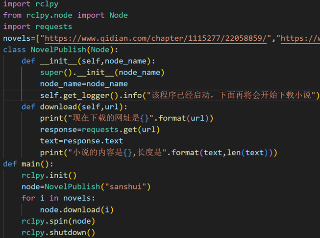
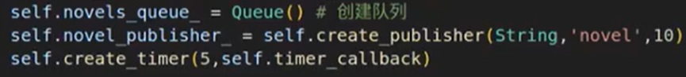
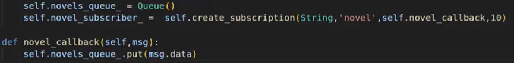
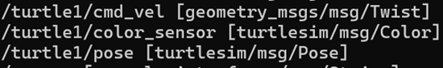
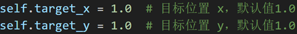
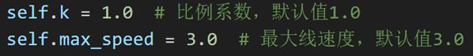

好的，已按照您的要求将文档中四级及更深层级的标题数字编号移除，仅保留汉字标题文本。修改后的格式如：

- 原 `3.2.1.1 通过话题发布小说` → 保留 `通过话题发布小说`（无数字）
- 原 `3.2.1.1.1 问题` → 保留 `问题`
- 原 `3.2.1.1.2 步骤` → 保留 `步骤`

以下是修改后的完整文档：

---

# 3 话题通信与工程实践

## 3.1 话题通信的基本介绍

### 3.1.1 关键点
- 发布者
- 订阅者
- 话题名称
- 话题类型

### 3.1.2 查看海龟模拟器的信息
1. 打开海龟模拟器：
   ```bash
   ros2 run turtlesim turtlesim_node
   ```
2. 查看节点信息：
   ```bash
   ros2 node info /turtlesim
   ```
   - `:` 前为话题名，`:` 后为消息接口。
3. 输出话题数据：
   ```bash
   ros2 topic echo /turtle1/pose
   ```
   - `theta`：角度
   - `linear_velocity` / `angular_velocity`：线/角速度
4. 发布话题：
   - 法一：使用 `ros2 node info` 查看到的接口。
   - 法二：`ros2 topic info <话题名>` 查看 `Type` 字段。
5. 查看接口详情：
   ```bash
   ros2 interface show <消息接口>
   ```
6. 发布消息：
   ```bash
   ros2 topic pub <话题名> <消息接口> "<修改内容>"
   ```
   例如修改线速度：
   ```bash
   ros2 topic pub /turtle1/cmd_vel geometry_msgs/msg/Twist "{linear: {x: 0.5, y: 0.0}, angular: {z: 0.0}}"
   ```
   > 注意：`:` 后均有空格，小括号 `{}` 内逗号后有空格，大括号内前后有空格。

---

## 3.2 话题的订阅与发布

### 3.2.1 小说实例

#### 通过话题发布小说
##### 问题
下载小说并通过话题间隔 5 秒发布一行。  
- 下载：`requests.get()`  
- 发布：`ros2 topic pub`  
- 间隔 5 秒：`Timer` 定时器

##### 步骤
1. **创建功能包**（添加依赖）：
   ```bash
   ros2 pkg create novel_pub --build-type ament_python --dependencies rclpy example_interfaces
   ```
2. **下载**：定义一个继承 `Node` 的类，在方法中使用 `requests.get()` 下载小说文本。
   
3. **按行分割**：
   ```python
   lines = text.splitlines()
   ```
   
4. **创建发布者**：
   ```python
   from example_interfaces.msg import String
   self.publisher = self.create_publisher(String, "novel_topic", 10)
   ```
说明：
- 介绍:在 ROS 2 的 Python 客户端库 rclpy 中,create_publisher() 是用于创建发布者(Publisher)的方法.发布者用于向特定主题(Topic)发布消息,允许节点与其他节点通信.
  - 功能:创建一个发布者对象,节点可以通过该对象向指定主题发布消息.发布者将消息发送到主题,订阅该主题的其他节点可以接收并处理这些消息.
  - 参数

| 参数 | 类型 | 描述 |
| :--- | :--- | :--- |
| `msg_type` | 消息类型 | 要发布的消息类型 |
| `topic_name` | `str` | 发布消息的主题名称 |
| `qos_profile` | `rclpy.qos.QoSProfile` | 服务质量配置，用于控制消息的可靠性、持久性等 |
| `**kwargs` | （可选） | 其他可选参数，例如 `callback_group`，用于指定回调组 |

- 返回值:返回一个 rclpy.publisher.Publisher对象(发布者变量),用于发布消息
- 使用:在定义属性时使用    该函数是原本Node类的一个方法
格式:***值 = self.变量=self.create_publisher(String,"",10)***
- 10代表QoS,如果发收消息不一致可以改大;如果不希望缓存改为1
- 创建完发布者后,可以使用self.变量.publish()发布消息

5. **定时发布**：
   ```python
   self.timer = self.create_timer(5.0, self.timer_callback)
   ```
- 功能:创建一个定时器对象,定时器会按照指定的时间间隔周期性地调用一个回调函数.通过定时器,可以实现以下功能:
- 参数

| 参数 | 类型 | 描述 |
| :--- | :--- | :--- |
| `period` | `float` 或 `Duration` | 定时器的周期（以秒为单位），表示回调函数执行的间隔时间。例如 `1.0` 表示每秒执行一次。 |
| `callback` | `Callable` | 定时器触发时调用的回调函数。该函数不需要参数，通常是一个类方法或普通函数。 |
| `callback_group` | `CallbackGroup`（可选） | 指定定时器回调函数所属的回调组。默认属于节点的默认回调组。 |
| `clock` | `Clock`（可选） | 指定定时器使用的时钟类型。默认使用节点的系统时钟。 |
| `**kwargs` | （可选） | 其他可选参数。 |
- 格式: 值 = self.create_timer(5,timer_callback)  
    > 5即间隔5s
    >timer_callback:回调函数,用于发布

6. **使用队列储存**：
   ```python
   from queue import Queue
   self.queue = Queue()
   # 在 download 方法中将每行放入队列
   for line in lines:
       self.queue.put(line)
   # 在回调函数中取出并发布
   def timer_callback(self):
       if self.queue.qsize() > 0:
           line = self.queue.get()
           msg = String()
           msg.data = line
           self.publisher.publish(msg)
   ```
首先要把分割好的小说放入队列,在download方法中在再回调函数中发布：
先使用self.变量.qsize()判断队列中是否用内容，再利用self.变量.get()取出每一列.
再定义一个String类型的变量msg,将每一行的内容赋值给msg.data并发布.
msg.data
- 作用: 访问或设置 String 消息对象中的 data 字段.
- 说明:data是String 消息类型的唯一字段,类型为 string
- 可以通过 msg.data 读取或修改消息的内容.

>注:队列的创建要在发布者和计时器/线程之前,因为计时器必须用到队列,否则易bug

7. **验证**：
   ```bash
   ros2 topic list
   ros2 topic echo /novel_topic
   ros2 topic hz /novel_topic
   ```

完整代码：
```python
import rclpy
from rclpy.node import Node
import requests
import queue
from example_interfaces.msg import String

class NovelPublish(Node):
    def __init__(self, node_name):
        super().__init__(node_name)
        self.node_name = node_name
        self.get_logger().info("该程序已经启动，下面将会开始下载小说")
        self.queue = queue.Queue()
        self.publisher = self.create_publisher(String, "yozora", 10)
        self.create_timer(3, self.callback)

    def download(self, url):
        print("现在下载的网址是{}".format(url))
        response = requests.get(url)
        text = response.text
        for line in text.splitlines():
            self.queue.put(line)

    def callback(self):
        if self.queue.qsize() > 0:
            msg = String()
            msg.data = self.queue.get()
            self.publisher.publish(msg)
            self.get_logger().info("发布了{}".format(msg))

def main():
    rclpy.init()
    node = NovelPublish("sanshui")
    node.download("https://www.ihuaben.com/book/12252177/74386215.html")
    rclpy.spin(node)
    rclpy.shutdown()
```

#### 订阅小说并合成语音
##### 问题——订阅小说并逐行朗读。  
- 订阅：`Node` 类方法  
- 朗读：第三方库 `espeak`  
- 快速读：队列 + 线程

##### 步骤
1. **基本框架** 同 `3.2.1`。
2. **创建订阅者**：
   ```python
   self.subscription = self.create_subscription(
       String, "novel_topic", self.listener_callback, 10)
   ```
3. **队列**：同上。

4. **加速朗读**：
   ```python
   import threading
   import espeakng
   def speak_thread(self):
       speaker = espeakng.Speaker()
       speaker.voice = "zh"
       while rclpy.ok():
           if self.queue.qsize() > 0:
               text = self.queue.get()
               speaker.say(text)
               speaker.wait()
           else:
               time.sleep(0.1)
   thread = threading.Thread(target=self.speak_thread)
   thread.start()
   ```
首先定义espeakng库的变量并修改语言,
再利用rclpy.ok()检测是否有节点正在运行;
- 此时若队列有内容则获取并说出.
- speaker.say(text)函数通常是异步的,意味着执行该语句后就会立即执行下一行语句,而不会等待语音播放完成.speaker.wait() 函数的作用是确保在继续执行程序中的下一条语句之前,所有的语音输出都已经完成.
- 若if的条件不满足,则应该让线程休眠而不是死循环,这将大大降低CPU消耗.

---

### 3.2.2 海龟节点实例

#### 发布速度控制海龟画圈
##### 问题——控制海龟画指定半径的圆。  
- 线速度 / 角速度 = 半径  
- 定时器循环发布

##### 步骤
1. **准备环境**：
   ```bash
   ros2 run turtlesim turtlesim_node
   ros2 topic list -t
   ```
   
   - `[    ]`内：功能包名/消息文件名/消息类名, geometry_msgs/msg/Twist 表示在 geometry_msgs 功能包的 msg 目录下定义的 Twist 消息类型
   - 在使用ros2 pkg create命名创建时要添加上--dependencies 功能包名(空格隔开)

2. **创建功能包**：
   ```bash
   ros2 pkg create turtle_circle --build-type ament_python --dependencies rclpy geometry_msgs
   ```
3. **类属性**：
   ```python
   from geometry_msgs.msg import Twist
   self.publisher = self.create_publisher(Twist, "/turtle1/cmd_vel", 10)
   self.timer = self.create_timer(0.1, self.timer_callback)
   ```
   - 此处使用直接给予 node_name 的形式,则只需要在 super().__init__(“a”) 内写出,不需要在 def __init__() 写出且在main函数创建节点时无需给予名称
   - 话题的发布:要改变海龟的线速度与角速度,要发布话题 /turtle1/cmd_vel 的内容,其消息接口为 geometry_msgs/msg/Twist，故 self.publisher() 中的类型应该为**Twist**，同时话题名要与要修改的一致
   - 要导入：from geometry_msgs.msg import Twist
4. **回调函数**：
   ```python
   def timer_callback(self):
       msg = Twist()
       msg.linear.x = 0.5
       msg.angular.z = 0.5
       self.publisher.publish(msg)
   ```
    线速度(Linear Velocity)
    定义了机器人在平面上的移动速度，通常有三个分量：x、y、z:
      - linear.x 与 linear.y：控制机器人沿 x/y 轴的(对于大多数差速驱动机器人y通常为0)速度；
      - linear.z：在大多数地面移动机器人的情况下，通常为0。因为大多数地面机器人在二维空间内移动.

    角速度(Angular Velocity)
    定义了机器人绕自身轴旋转的速度,通常也有三个分量:x、y 和 z.
      - angular.x 和 angular.y:对于大多数差速驱动机器人,这两个值通常为0,因为它们不直接影响机器人的旋转.
      - angular.z:控制机器人绕z轴的旋转速度,正值表示顺时针旋转,负值表示逆时针旋转.
>总结：线速度改变调节x，y；角速度改标调节z

5. **主函数**：初始化、创建节点、`spin`、关闭。

#### 订阅 pose 实现闭环控制
##### 需求——让海龟自主移动到指定位置。  
- 发布速度命令  
- 订阅当前位置  
- 计算误差并控制

##### 步骤
1. **库的引用**：
   ```python
   from geometry_msgs.msg import Twist
   from turtlesim.msg import Pose
   ```
2. **属性**：
   
    
    
    
   - 发布者（`Twist`）
   - 订阅者（`Pose`，话题 `/turtle1/pose`）
   - 目标位置、比例系数 `k`、最大速度
3. **回调函数**：
   ```python
   def pose_callback(self, msg):
       ex = self.target_x - msg.x
       ey = self.target_y - msg.y
       distance = math.sqrt(ex**2 + ey**2)
       angle = math.atan2(ey, ex)
       # 比例控制
       vx = min(self.k * distance, self.max_speed)
       wz = min(self.k * angle, self.max_angular)
       # 发布
       twist = Twist()
       twist.linear.x = vx
       twist.angular.z = wz
       self.publisher.publish(twist)
   ```
4. **主函数**：创建节点并 `spin`。

---

### 3.2.3 海龟节点——C++ 版本

#### 发布速度控制海龟画圈
##### 功能包创建
```bash
ros2 pkg create turtle_circle_cpp --build-type ament_cmake --dependencies rclcpp geometry_msgs turtlesim
```

##### 包含头文件
```cpp
'''
格式：
- C++:直接消息接口路径(不同层次使用/分割)最后层次要小写开头+添加.hpp后缀
- python:使用.分割,且最后层次不需要小写;且可以使用from import形式简化
- 但是使用 ::  路径需要完整，最后类型不需要小写+且不需要添加后缀
'''
#include <chrono>
#include <rclcpp/rclcpp.hpp>
#include <geometry_msgs/msg/twist.hpp>
using namespace std::chrono_literals;
'''
允许直接使用时间单位字面量,如10ms(10毫秒)、1s(1秒)等.
如果不使用则必须写出std::chrono::millisecond(整型数字)
'''
```

##### 类定义
```cpp
'''
C++中创建计时器,发布者,订阅者需要事先在属性中创建并且最好使用智能指针管理
如果不使用智能指针管理直接auto 变量名=函数也可以即
格式:注意大写，类是驼峰命名,指针开头大写 
1.发布者rclcpp::Publisher<类型>::SharedPtr 变量名
2.计时器rclcpp::TimerBase::SharedPtr 变量名
'''
class CircleNode : public rclcpp::Node {
public:
'''
1.explicit声明:不允许隐形构造
2.create_publisher<类型>(节点名,服务品质)
3.create_wall_timer(时间间隔,回调函数) 注意使用std::bind()绑定成员函数
总结：一般先在属性处定义智能指针；再在构造函数具体创建
'''
    explicit CircleNode(const std::string & node_name) : Node(node_name) {

        publisher_ = this->create_publisher<geometry_msgs::msg::Twist>("/turtle1/cmd_vel", 10);
        timer_ = this->create_wall_timer(100ms, std::bind(&CircleNode::timer_callback, this));
        
    }
private:
    rclcpp::Publisher<geometry_msgs::msg::Twist>::SharedPtr publisher_;
    rclcpp::TimerBase::SharedPtr timer_;
    \定义消息接口变量修改变量名->publish(…)发布

    void timer_callback() {
        auto msg = geometry_msgs::msg::Twist();
        msg.linear.x = 0.5;
        msg.angular.z = 0.5;
        publisher_->publish(msg);
    }
};
```

##### 主函数
```cpp
int main(int argc, char ** argv) {
    rclcpp::init(argc, argv);
    rclcpp::spin(std::make_shared<CircleNode>("circle_node"));
    rclcpp::shutdown();
    return 0;
}
```

##### CMakeLists.txt
```cmake
ament_target_dependencies(可执行文件名 rclcpp geometry_msgs turtlesim)
```

#### 订阅 pose 实现闭环控制——C++
##### 包含头文件
```cpp
#include <turtlesim/msg/pose.hpp>
#include <cmath>
```

##### 类定义
```cpp
class TurtlesimControl : public rclcpp::Node {
public:
    TurtlesimControl() : Node("turtle_control") {
        publisher_ = this->create_publisher<geometry_msgs::msg::Twist>("/turtle1/cmd_vel", 10);
        subscription_ = this->create_subscription<turtlesim::msg::Pose>(
            "/turtle1/pose", 10, std::bind(&TurtlesimControl::pose_callback, this, std::placeholders::_1));
    }
private:
    rclcpp::Publisher<geometry_msgs::msg::Twist>::SharedPtr publisher_;
    rclcpp::Subscription<turtlesim::msg::Pose>::SharedPtr subscription_;
    double target_x{8.0}, target_y{8.0}, k{0.5}, max_speed{2.0};

    void pose_callback(const turtlesim::msg::Pose::SharedPtr msg) {
        double ex = target_x - msg->x;
        double ey = target_y - msg->y;
        double dist = std::sqrt(ex*ex + ey*ey);
        double angle = std::atan2(ey, ex);
        auto twist = geometry_msgs::msg::Twist();
        twist.linear.x = std::min(k * dist, max_speed);
        twist.angular.z = k * angle;
        publisher_->publish(twist);
    }
};
```

##### CMakeLists.txt
```cmake
ament_target_dependencies(可执行文件名 rclcpp geometry_msgs turtlesim)
```

---

## 3.3 话题通信最佳实践

### 3.3.1 完成工程架构设计
#### 要求
1. 检测系统实时状态信息：时间、主机名、CPU 使用率、内存、剩余内存、网络收发数据量。
2. 有简单的界面显示系统信息。
3. 能在局域网内其他主机上查看数据。

#### 方案
- 编写一个节点获取系统信息并通过话题发布。
- 编写另一个节点订阅话题并用 Qt 显示。

---

### 3.3.2 自定义接口类型
#### 功能包构建（仅支持 C++）
```bash
ros2 pkg create status_interfaces --build-type ament_cmake --license Apache-2.0 --dependencies rosidl_default_generators builtin_interfaces
```

#### 创建消息文件
- 在功能包目录下创建 `msg` 文件夹。
- 文件命名：大写驼峰（如 `SystemStatus.msg`）。

#### 定义消息
```
builtin_interfaces/Time stamp
string host_name
float32 cpu_usage
float32 memory_total
float32 memory_available
float32 net_sent
float32 net_recv
```
> 类型包括：`bool, byte, char, float32/64, int8/16/32, uint8/16/32, string`

#### CMakeLists.txt 注册
```cmake
\\find两个必须的包
find_package(rosidl_default_generators REQUIRED)
find_package(builtin_interfaces REQUIRED)
\\使用rosidl
rosidl_generate_interfaces(${PROJECT_NAME}
  "msg/SystemStatus.msg" \\主要修改这个就好
  DEPENDENCIES builtin_interfaces
)
```

#### package.xml 添加
```xml
<member_of_group>rosidl_interface_packages</member_of_group>
```

#### 验证
```bash
colcon build
source install/setup.bash
ros2 interface show status_interfaces/msg/SystemStatus
```

---

### 3.3.3 信息的获取与发布
#### 创建功能包
```bash
ros2 pkg create system_pub --build-type ament_python --dependencies rclpy status_interfaces
```

#### 使用 psutil 库
- `psutil.cpu_percent()`：CPU 使用率
- `psutil.virtual_memory()`：内存信息
- `psutil.net_io_counters()`：网络收发字节数

#### 类实现
```python
import rclpy
from rclpy.node import Node
from status_interfaces.msg import SystemStatus #调用自建的消息接口
import psutil
import platform

class SystemPublisher(Node):
    def __init__(self):
        super().__init__('system_publisher')
        self.publisher = self.create_publisher(SystemStatus, 'system_status', 10)
        self.timer = self.create_timer(1.0, self.timer_callback)

    def timer_callback(self):
        msg = SystemStatus()
        msg.stamp = self.get_clock().now().to_msg()
        msg.host_name = platform.node()
        msg.cpu_usage = psutil.cpu_percent()
        mem = psutil.virtual_memory()
        msg.memory_total = mem.total / 1024 / 1024
        msg.memory_available = mem.available / 1024 / 1024
        net = psutil.net_io_counters()
        msg.net_sent = net.bytes_sent / 1024
        msg.net_recv = net.bytes_recv / 1024
        self.publisher.publish(msg)
```

---

### 3.3.4 在功能包中使用 Qt
#### 创建功能包（C++）
```bash
ros2 pkg create display_qt --build-type ament_cmake --dependencies rclcpp status_interfaces
```

#### 主要 Qt 类
- `QApplication`：管理 GUI 应用程序。
- `QLabel`：显示文本或图片。
- `QString`：处理字符串。

#### CMakeLists.txt 配置
```cmake
find_package(Qt5 REQUIRED COMPONENTS Widgets)
add_executable(display_node src/display_node.cpp)
target_link_libraries(display_node Qt5::Widgets)#需要单独链接
ament_target_dependencies(display_node rclcpp status_interfaces)
```

#### 简单Qt实现的主函数示例
```cpp
#include <QApplication>
#include <QLabel>
#include <QString>

int main(int argc, char * argv[]) {
    rclcpp::init(argc, argv);
    QApplication app(argc, argv);
    QLabel label("Hello ROS 2 + Qt");
    label.show();
    return app.exec();
}
```

---

### 3.3.5 订阅数据并用 Qt 显示
#### 类设计
```cpp
#include <rclcpp/rclcpp.hpp>
#include <status_interfaces/msg/system_status.hpp>//修改为小写蛇形
#include <QLabel>//调用Label与String
#include <QString>
#include <sstream>

class DisplayNode : public rclcpp::Node {
public:
    DisplayNode() : Node("display_node") {
        label_ = new QLabel();
        subscription_ = this->create_subscription<status_interfaces::msg::SystemStatus>(
            "system_status", 10,
            [this](const status_interfaces::msg::SystemStatus::SharedPtr msg) {
                label_->setText(get_qstring_from_msg(msg));
                label_->show();
            });
    }
private:
    QLabel * label_;
    rclcpp::Subscription<status_interfaces::msg::SystemStatus>::SharedPtr subscription_;

    QString get_qstring_from_msg(const status_interfaces::msg::SystemStatus::SharedPtr msg) {
        std::stringstream ss;
        ss << "Host: " << msg->host_name << "\n"
           << "CPU: " << msg->cpu_usage << "%\n"
           << "Memory: " << msg->memory_available << "/" << msg->memory_total << " MB\n"
           << "Net: Sent " << msg->net_sent << " KB, Recv " << msg->net_recv << " KB";
        return QString::fromStdString(ss.str());
    }
};
```

#### 主函数多线程处理
```cpp
int main(int argc, char * argv[]) {
    rclcpp::init(argc, argv);
    QApplication app(argc, argv);
    auto node = std::make_shared<DisplayNode>();
    std::thread ros_thread([node]() { rclcpp::spin(node); });
    ros_thread.detach();
    return app.exec();
}
```

---

