# 第九章 真机
## 9.0 二驱小车
[二驱小车教程](https://fishros.org.cn/forum/topic/923/fishbot%E4%BA%8C%E9%A9%B1-%E9%85%8D%E5%A5%97%E8%B5%84%E6%96%99%E6%B1%87%E6%80%BB)
[四驱小车教程](https://fishros.org.cn/forum/topic/3466/fishbot%E5%9B%9B%E9%A9%B1v2-%E8%B5%84%E6%96%99%E6%95%99%E7%A8%8B%E6%B1%87%E6%80%BB)

## 9.1 从仿真到实体：移动机器人系统设计

从系统功能角度看，移动机器人由**感知**、**决策**和**控制**三部分组成：
- **感知**：通过激光雷达、编码器、IMU 等传感器实现
- **决策**：由各种算法组合实现（如 Navigation 2 路径规划与运动控制），硬件依托性能较强的处理器
- **控制**：由驱动系统和电动机组成

本章以低成本移动机器人平台 **FishBot** 为例，着重介绍实体机器人软件部分的开发。

### 9.1.1 机器人传感器

FishBot 搭载了四种传感器：**雷达**、**超声波**、**编码器**和 **IMU**。导航主要关注**激光雷达**和**编码器**。

#### 激光雷达

FishBot 使用**单线旋转式激光雷达**，通过发射红外激光（波长约 1000 nm）并接收反射光计算障碍物距离。在 ROS 2 中，雷达数据通过 `/scan` 话题发布，由激光雷达驱动提供。

#### 编码器

编码器用于实时获取轮子转速，结合运动学模型计算机器人速度和里程计数据（`/odom`）。FishBot 采用 **AB 电磁编码器**，由两个霍尔传感器和间隔磁化的圆形磁铁组成，磁铁固定在电动机转子上。电动机转动时，霍尔传感器检测磁性变化，从而测量转速。


### 9.1.2 机器人执行器

执行器是负责运动的部件，最重要的执行器是电动机。FishBot 采用**额定电压 12V 的 370 减速电动机**，带减速器以降低转速、提高转矩（额定转速 130 r/min，额定电流 0.5A，转矩 600 gf·cm）。减速器将电动机的高速低扭矩输出转换为低速高扭矩，更适合移动机器人驱动。


### 9.1.3 机器人决策系统

决策系统负责根据传感器数据和任务要求控制机器人运动，硬件通常采用性能较强的计算机（如工控机、树莓派、Jetson Nano 等）。为降低成本，FishBot 采用同时支持无线和有线连接的驱动控制板，用户可直接使用自己的计算机作为决策端与控制系统通信。

除感知、决策和控制部分外，机器人还需**电池**、**电源模块**和**支撑结构**等硬件配合。

## 9.2 单片机开发基础

实体机器人开发需要与硬件系统打交道，传感器驱动和电动机控制都在**微型控制单元（MCU，即单片机）**上完成。FishBot 驱动控制板采用国产 **ESP32 单片机**，支持 Wi-Fi、蓝牙等无线通信，可方便地读取传感器数据并进行电动机控制。


### 9.2.1 开发平台介绍与安装

ESP32 支持多种开发平台，包括官方的 **ESP IDF** 和更简单易用的 **Arduino**。本章采用 Arduino 进行开发。

#### 安装 PlatformIO IDE

PlatformIO IDE 是 VS Code 的插件，支持多种单片机，主要用 Python 编写。首先安装 Python 虚拟环境工具：

```bash
sudo apt install python3-venv
```

然后在 VS Code 扩展商店中搜索并安装 **PlatformIO IDE**。安装完成后，侧边栏会出现 PlatformIO 按钮，首次单击会执行初始化。也可手动初始化：
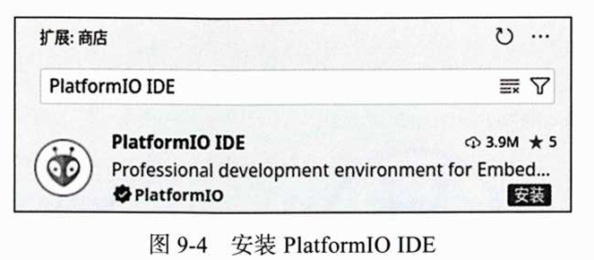
```bash
# 激活虚拟环境
source ~/.platformio/penv/bin/activate

# 安装 PlatformIO 核心（使用国内镜像加速）
pip install platformio -i https://pypi.tuna.tsinghua.edu.cn/simple
```

#### 安装 ESP32 Arduino 开发环境

```bash
pio pkg install --global --platform "platformio/espressif32@6.4.0"
pio pkg install --global --tool "platformio/contrib-piohome"
pio pkg install --global --tool "platformio/framework-arduinoespressif32"
pio pkg install --global --tool "platformio/tool-scans"
pio pkg install --global --tool "platformio/tool-mkfats"
pio pkg install --global --tool "platformio/tool-mkspiffs"
pio pkg install --global --tool "platformio/tool-mklittles"
```

安装完成后重启 VS Code，打开 PlatformIO IDE 插件（如图 9-5 所示）。单击 PIO Home 下的 **Open** 打开主页（如图 9-6 所示）。
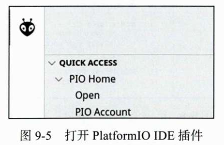
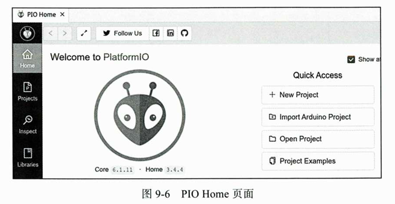

#### 创建第一个 Arduino 工程

1. 单击 **New Project**
2. 输入工程名（如 `example01_helloworld`）
3. 开发板选择 **Adafruit ESP32 Feather**
4. 开发框架选择 **Arduino**
5. 选择工程位置（默认或自定义），单击 **Finish**

创建完成后即可获得一个 Hello World 工程目录（如图 9-8 所示），接下来可在单片机上编写第一个程序。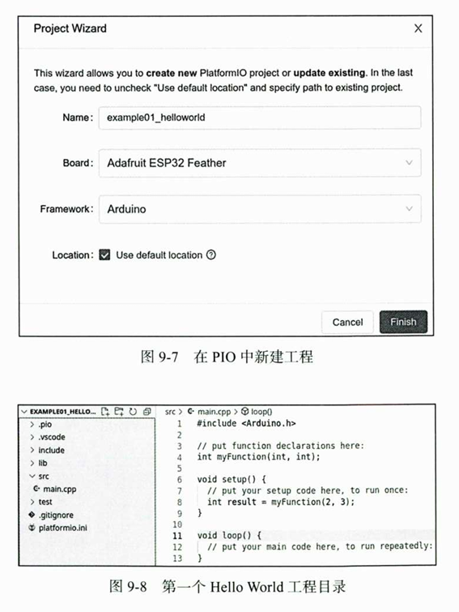

## 9.2.2 第一个 HelloWorld 工程

Arduino 采用 **C++** 作为编程语言，单片机开发流程分为四步：**编写代码 → 编译工程 → 烧录二进制文件 → 运行测试**。

在 `src/main.cpp` 中编写：

```cpp
#include <Arduino.h>

// setup 函数：启动时调用一次，用于初始化
void setup() {
    Serial.begin(115200);          // 设置串口波特率
}

// loop 函数：setup 后循环调用
void loop() {
    Serial.print("Hello World!\n");
    delay(1000);                   // 延时 1000ms
}
```

**核心概念**：
- `setup()`：启动时执行一次，用于初始化设置
- `loop()`：`setup()` 后循环执行，为主循环逻辑
- `Serial`：串口通信对象，通过 USB 转串口芯片与计算机交换数据

**编译与烧录**：
- VS Code 左下角 PlatformIO IDE 提供**编译**和**上传**按钮（如图 9-9）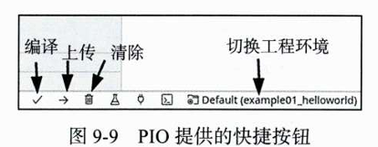
- 编译成功后会生成 `firmware.bin` 二进制文件
- 若首次使用串口设备出现权限问题，执行：
  ```bash
  sudo apt remove --purge brltty -y
  sudo usermod -aG dialout `whoami`
  ```
  重启后生效

**查看串口输出**：
- 安装 VS Code 的 **Serial Monitor** 插件（如图 9-10）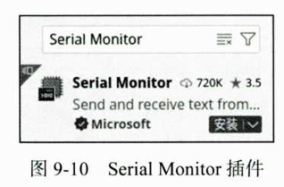
- 选择设备端口（`/dev/ttyUSB*`），波特率设为 **115200**（如图 9-11）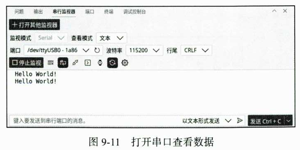
- 即可看到 "Hello World!" 输出

> 下载代码前需关闭串行监视器，同一串口设备同一时间只能由一个程序打开。


## 9.2.3 使用代码点亮 LED 灯

LED（发光二极管）可将电能转化为可见光。FishBot 驱动控制板上的 LED 灯原理图如图 9-12 所示：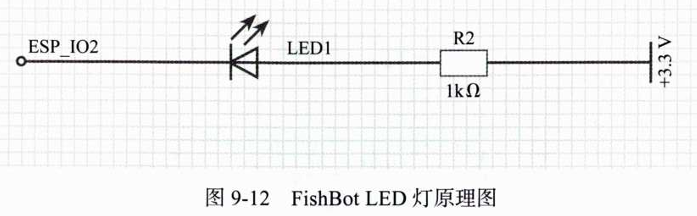

- **R2**：1kΩ 限流电阻
- **LED1**：蓝色 LED
- **右侧**：3.3V 电压源
- **左侧 ESP_IO2**：单片机引脚（GPIO2）

**点灯原理**：
- 将 `ESP_IO2` 设为 **3.3V**：两端电压相同，无电流，LED 熄灭
- 将 `ESP_IO2` 设为 **0V**：右侧 3.3V → LED → 0V，有电流，LED 点亮

新建工程 `example02_led`，在 `src/main.cpp` 中编写：

```cpp
#include <Arduino.h>

void setup() {
    pinMode(2, OUTPUT);            // 设置 GPIO2 为输出模式
}

void loop() {
    digitalWrite(2, LOW);          // 低电平：LED 点亮
    delay(1000);
    digitalWrite(2, HIGH);         // 高电平：LED 熄灭
    delay(1000);
}
```

**核心函数**：
- `pinMode(pin, mode)`：设置引脚模式（`OUTPUT` 输出 / `INPUT` 输入）
- `digitalWrite(pin, value)`：设置引脚电平（`HIGH` 高电平 / `LOW` 低电平）

编译烧录后，LED 将每隔 1000ms 闪烁一次。


## 9.2.4 使用超声波测量距离

超声波传感器通过发射头发送超声波，遇到障碍物反射后由接收头接收，根据**时间 × 声速**计算距离（如图 9-13 所示）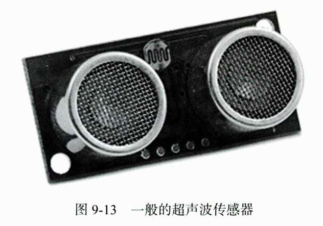。FishBot 超声波模块有四个引脚：

| 引脚 | 功能 |
| :--- | :--- |
| VCC | 电源（5V） |
| GND | 地 |
| TRIG | 触发引脚（发送脉冲触发测距） |
| ECHO | 接收引脚（输出高电平，持续时间 = 超声波飞行时间） |

新建工程 `example03_ultrasound`，在 `src/main.cpp` 中编写：

```cpp
#include <Arduino.h>
#define TRIG 27                    // 发送引脚
#define ECHO 21                    // 接收引脚

void setup() {
    Serial.begin(115200);
    pinMode(TRIG, OUTPUT);
    pinMode(ECHO, INPUT);
}

void loop() {
    // 产生 10μs 高脉冲触发测距
    digitalWrite(TRIG, HIGH);
    delayMicroseconds(10);
    digitalWrite(TRIG, LOW);

    // 测量 ECHO 高电平持续时间（μs）
    double delta_time = pulseIn(ECHO, HIGH);
    // 距离 = 时间 × 声速（0.0343 cm/μs）÷ 2（往返）
    float detect_distance = delta_time * 0.0343 / 2.0;

    Serial.printf("distance=%.6f cm\n", detect_distance);
    delay(500);
}
```

**核心函数**：
- `delayMicroseconds(us)`：微秒级延时
- `pulseIn(pin, value)`：测量引脚高/低电平持续时间（μs）

输出示例：
```
distance=25.896500 cm
distance=25.879351 cm
distance=25.896500 cm
```


## 9.2.5 使用开源库驱动 IMU

FishBot 使用 **MPU6050** 六轴惯性测量单元，通过 **I2C 协议** 与单片机通信。Arduino 支持通过第三方库简化开发，本例使用 `MPU6050_light` 库。

新建工程 `example04_imu`，编辑 `platformio.ini`，添加依赖库：

```ini
lib_deps =
    https://github.com/rfetick/MPU6050_light.git
```

保存后 PlatformIO 自动下载库。将库示例代码 `GetAngle.ino` 复制到 `src/main.cpp`，修改串口波特率并设置 I2C 引脚（SDA=18, SCL=19）：

```cpp
#include "Wire.h"
#include <MPU6050_light.h>

MPU6050 mpu(Wire);
unsigned long timer = 0;

void setup() {
    Serial.begin(115200);
    Wire.begin(18, 19);                    // SDA=18, SCL=19

    byte status = mpu.begin();
    Serial.print(F("MPU6050 status: "));
    Serial.println(status);
    while (status != 0) {}

    Serial.println(F("Calculating offsets, do not move MPU6050"));
    delay(1000);
    mpu.calcOffsets();                     // 计算偏移量
    Serial.println("Done!\n");
}

void loop() {
    mpu.update();                          // 更新传感器数据

    if ((millis() - timer) > 10) {         // 每 10ms 输出一次
        Serial.print("X : ");
        Serial.print(mpu.getAngleX());
        Serial.print("\tY : ");
        Serial.print(mpu.getAngleY());
        Serial.print("\tZ : ");
        Serial.println(mpu.getAngleZ());
        timer = millis();
    }
}
```

**关键说明**：
- `Wire.begin(SDA, SCL)`：初始化 I2C 总线，指定引脚
- `mpu.calcOffsets()`：校准陀螺仪和加速度计偏移（传感器静止时调用）
- `mpu.update()`：更新传感器数据
- `mpu.getAngleX/Y/Z()`：获取各轴角度（度）

输出示例：
```
X : -0.03    Y : 0.03    Z : -2.23
X : -0.04    Y : 0.03    Z : -2.23
```

## 9.3 机器人控制系统的实现

控制移动机器人运动，就是控制电动机转动。FishBot 底盘有两个驱动轮和一个万向轮，通过改变两个轮子的速度实现转弯和移动，属于**两轮差速模型**。


### 9.3.1 使用开源库驱动多路电动机

电动机无法直接连接单片机引脚，需要驱动电路（如 DRV8833）放大信号。FishBot 驱动原理图如图 9-14 所示：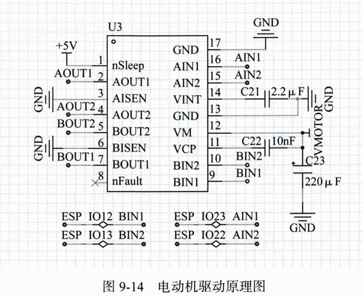
`AIN1(IO23) → AOUT1`，`AIN2(IO22) → AOUT2`。

新建工程 `fishbot_motion_control`，编辑 `platformio.ini`：

```ini
lib_deps =
    https://github.com/fishros/Esp32McpwmMotor.git
```

`Esp32McpwmMotor` 库可同时控制 6 个直流电动机。编写 `src/main.cpp`：

```cpp
#include <Arduino.h>
#include <Esp32McpwmMotor.h>

Esp32McpwmMotor motor;

void setup() {
    motor.attachMotor(0, 22, 23);  // 电动机0：引脚22、23
    motor.attachMotor(1, 12, 13);  // 电动机1：引脚12、13
}

void loop() {
    motor.updateMotorSpeed(0, 70);   // 正转70%
    motor.updateMotorSpeed(1, 70);
    delay(2000);
    motor.updateMotorSpeed(0, -70);  // 反转70%
    motor.updateMotorSpeed(1, -70);
    delay(2000);
}
```

**核心函数**：
- `attachMotor(id, pin1, pin2)`：连接电动机
- `updateMotorSpeed(id, speed)`：设置速度（-100 ~ 100，正反转）


### 9.3.2 电动机速度测量与转换

FishBot 电动机配有 AB 电磁编码器（两个霍尔传感器），转动时产生脉冲。需测量轮子转一圈的脉冲数，将脉冲数转换为速度。

#### 编码器脉冲计数

修改 `platformio.ini`，添加 `Esp32PcntEncoder` 库：

```ini
lib_deps =
    https://github.com/fishros/Esp32McpwmMotor.git
    https://github.com/fishros/Esp32PcntEncoder.git
```

```cpp
#include <Arduino.h>
#include <Esp32PcntEncoder.h>

Esp32PcntEncoder encoders[2];

void setup() {
    Serial.begin(115200);
    encoders[0].init(0, 32, 33);  // 编码器0：GPIO32、33
    encoders[1].init(1, 26, 25);  // 编码器1：GPIO26、25
}

void loop() {
    delay(10);
    Serial.printf("tick1=%d,tick2=%d\n",
                  encoders[0].getTicks(),
                  encoders[1].getTicks());
}
```

**测量结果**：手动转动轮子 10 圈，脉冲数为 19419，单圈脉冲 ≈ 1942。  
**单脉冲对应距离**：
```
0.1051566 = 65 * π / 1942   （轮径65mm，单位mm/脉冲）
```

#### 速度计算（含编码器+电机控制）

```cpp
/**
 * @file main.cpp
 * @brief FishBot 机器人电动机速度测量与编码器脉冲计数示例
 * 
 * 该程序演示如何：
 *   1. 使用 Esp32PcntEncoder 库读取编码器脉冲
 *   2. 使用 Esp32McpwmMotor 库控制电动机转速
 *   3. 根据编码器脉冲数计算轮子实际速度
 * 
 * 硬件连接：
 *   - 编码器0：GPIO32, GPIO33
 *   - 编码器1：GPIO26, GPIO25
 *   - 电动机0：GPIO22, GPIO23
 *   - 电动机1：GPIO12, GPIO13
 * 
 * 单脉冲对应距离：0.1051566 mm（根据轮径65mm和单圈脉冲数1942计算得出）
 */

#include <Arduino.h>          // Arduino 核心库（setup/loop/delay/Serial 等）
#include <Esp32PcntEncoder.h> // ESP32 脉冲计数编码器库
#include <Esp32McpwmMotor.h>  // ESP32 MCPWM 电动机驱动库

// ============================================================
// 全局对象声明
// ============================================================

Esp32McpwmMotor motor;           // 电动机控制对象
Esp32PcntEncoder encoders[2];    // 编码器对象数组（0：左轮，1：右轮）

// ============================================================
// 速度计算相关变量
// ============================================================

int64_t last_ticks[2];        // 上一次读取的编码器计数值（int64_t 防止溢出）
int32_t delta_ticks[2];       // 两次读取之间的脉冲变化量
int64_t last_update_time;     // 上次计算速度的时间（毫秒）
float current_speeds[2];      // 当前速度（单位：m/s）

// ============================================================
// 常量定义
// ============================================================

// 单脉冲对应轮子前进距离 = 轮径65mm × π / 单圈脉冲数1942
// 单位：mm/脉冲
const float PULSE_DISTANCE = 0.1051566;

// ============================================================
// 初始化函数（上电后执行一次）
// ============================================================

void setup() {
    // 1. 初始化串口通信（用于输出速度数据到电脑）
    Serial.begin(115200);

    // 2. 初始化编码器
    //    init(编码器编号, 引脚A, 引脚B)
    encoders[0].init(0, 32, 33);  // 左轮编码器：GPIO32（A相），GPIO33（B相）
    encoders[1].init(1, 26, 25);  // 右轮编码器：GPIO26（A相），GPIO25（B相）

    // 3. 初始化电动机
    //    attachMotor(电动机编号, 引脚1, 引脚2)
    motor.attachMotor(0, 22, 23);  // 左轮电机：GPIO22, GPIO23
    motor.attachMotor(1, 12, 13);  // 右轮电机：GPIO12, GPIO13

    // 4. 设置电动机转速（占空比70%，正转）
    motor.updateMotorSpeed(0, 70);
    motor.updateMotorSpeed(1, 70);

    // 5. 初始化时间变量
    last_update_time = millis();   // 记录当前时间作为起始时间
}

// ============================================================
// 主循环函数（不断重复执行）
// ============================================================

void loop() {
    // 1. 固定延时10ms，控制采样周期（约100Hz）
    delay(10);

    // 2. 计算时间差 dt（单位：毫秒）
    //    millis() 返回从程序开始到当前的毫秒数
    uint64_t dt = millis() - last_update_time;
    if (dt == 0) return;  // 防止除零错误

    // 3. 计算编码器脉冲变化量
    //    当前读数 - 上次读数 = 这段时间内产生的脉冲数
    delta_ticks[0] = encoders[0].getTicks() - last_ticks[0];
    delta_ticks[1] = encoders[1].getTicks() - last_ticks[1];

    // 4. 计算速度（单位：m/s）
    //    速度 = 脉冲数 × 单脉冲距离 / 时间
    //    - 脉冲数 × 单脉冲距离 = 轮子前进距离（mm）
    //    - 除以时间 dt（ms）得到 mm/ms
    //    - 除以1000得到 m/s
    current_speeds[0] = float(delta_ticks[0] * PULSE_DISTANCE) / dt;
    current_speeds[1] = float(delta_ticks[1] * PULSE_DISTANCE) / dt;

    // 5. 更新记录（为下一次计算做准备）
    last_update_time = millis();                      // 更新时间戳
    last_ticks[0] = encoders[0].getTicks();          // 保存当前计数值
    last_ticks[1] = encoders[1].getTicks();

    // 6. 通过串口输出速度数据
    //    格式：speed1=0.210313 m/s, speed2=0.189282 m/s
    Serial.printf("speed1=%f m/s, speed2=%f m/s\n",
                  current_speeds[0],
                  current_speeds[1]);
}
```


### 9.3.3 使用 PID 控制轮子转速

即使设置相同速度，两个电动机实际转速可能不同，需用 PID 控制器动态调节。

**PID 公式**：
\[
\text{Output} = K_p \cdot \text{Error} + K_i \cdot \int \text{Error} \, dt + K_d \cdot \frac{d(\text{Error})}{dt}
\]

#### PID 控制器类（lib/PIDController/）

**PIDController.h**：

```cpp
/**
 * @file PIDController.h
 * @brief PID 控制器类头文件
 * 
 * 该文件定义了 PID 控制器的类接口，用于实现比例-积分-微分控制算法。
 * PID 控制器广泛应用于电机速度控制、温度控制等场景。
 * 
 * PID 公式：Output = Kp * Error + Ki * ∫Error*dt + Kd * d(Error)/dt
 */

#ifndef _PIDCONTROLLER_H_
#define _PIDCONTROLLER_H_

/**
 * @class PIDController
 * @brief PID 控制器类
 * 
 * 提供 PID 控制算法的核心功能：
 *   - 设置 PID 系数 (Kp, Ki, Kd)
 *   - 更新目标值
 *   - 根据当前反馈值计算控制输出
 *   - 输出限幅
 *   - 重置控制器状态
 */
class PIDController {
public:
    // ============================================================
    // 构造函数
    // ============================================================

    PIDController() = default;
    PIDController(float kp, float ki, float kd);

    // ============================================================
    // 核心控制方法，见.cpp文件
    // ============================================================

    float update(float current);
    void update_target(float target);
    void update_pid(float kp, float ki, float kd);
    void reset();
    void out_limit(float out_min, float out_max);

private:
    // ============================================================
    // 目标值相关
    // ============================================================

    float target_;          /**< 目标值（期望值） */

    // ============================================================
    // 输出限幅相关
    // ============================================================

    float out_min_;         /**< 输出最小值 */
    float out_max_;         /**< 输出最大值 */

    // ============================================================
    // PID 控制系数
    // ============================================================

    float kp_;              /**< 比例系数（P） */
    float ki_;              /**< 积分系数（I） */
    float kd_;              /**< 微分系数（D） */

    // ============================================================
    // PID 状态变量
    // ============================================================

    float error_sum_;       /**< 误差累积和（积分项） */
    float error_;           /**< 当前误差变化率（微分项） */
    float error_last_;      /**< 上一次误差值（用于计算微分） */

    // ============================================================
    // 积分限幅
    // ============================================================

    float intergral_up_ = 2500;  /**< 积分上限（防止积分饱和） */
};

#endif // _PIDCONTROLLER_H_
```

**PIDController.cpp**：

```cpp
/**
 * @file PIDController.cpp
 * @brief PID 控制器类实现文件
 * 
 * 实现 PID 控制器的核心算法，包括：
 *   - 比例（P）：根据当前误差产生控制量
 *   - 积分（I）：消除稳态误差
 *   - 微分（D）：抑制超调，提高稳定性
 */

#include "PIDController.h"   // 类声明头文件
#include "Arduino.h"         // Arduino 核心库（使用 millis() 等函数）

// ============================================================
// 构造函数
// ============================================================

/**
 * @brief 带参数的构造函数
 * @param kp 比例系数
 * @param ki 积分系数
 * @param kd 微分系数
 * 
 * 创建 PID 控制器对象并初始化所有状态。
 */
PIDController::PIDController(float kp, float ki, float kd) {
    reset();                     // 重置所有状态变量
    update_pid(kp, ki, kd);      // 设置 PID 系数
}

// ============================================================
// 核心控制方法
// ============================================================

/**
 * @brief PID 核心更新函数
 * @param current 当前测量值（反馈值）
 * @return 控制输出值（已限幅）
 * 
 * PID 计算步骤：
 *   1. 计算误差：error = target - current
 *   2. 计算微分（误差变化率）：error_ = error_last - error
 *   3. 更新历史误差：error_last = error
 *   4. 累积积分：error_sum += error（带积分限幅）
 *   5. 计算输出：Kp*error + Ki*error_sum + Kd*error_
 *   6. 输出限幅：[out_min, out_max]
 */
float PIDController::update(float current) {
    // ============================================================
    // 第一步：计算误差
    // ============================================================
    // error > 0：当前值低于目标值（需要增加输出）
    // error < 0：当前值高于目标值（需要减少输出）
    float error = target_ - current;

    // ============================================================
    // 第二步：计算微分项（误差变化率）
    // ============================================================
    // error_ = error_last - error
    //   - 误差在增大（error_ < 0）：需要更强的控制作用
    //   - 误差在减小（error_ > 0）：需要减弱控制作用
    //   - 注意：有些实现用 error - error_last，符号相反
    error_ = error_last_ - error;

    // 更新上一次误差（供下次计算使用）
    error_last_ = error;

    // ============================================================
    // 第三步：计算积分项
    // ============================================================
    // 累积误差（用于消除稳态误差）
    error_sum_ += error;

    // 积分限幅（防止积分饱和）
    // 当误差长时间存在时，积分项会持续增大，可能导致输出失控
    if (error_sum_ > intergral_up_) {
        error_sum_ = intergral_up_;
    }
    if (error_sum_ < -intergral_up_) {
        error_sum_ = -intergral_up_;
    }

    // ============================================================
    // 第四步：PID 公式计算
    // ============================================================
    // Output = P + I + D
    //   - P（比例）：快速响应当前误差
    //   - I（积分）：消除长期累积误差
    //   - D（微分）：预测误差变化趋势，抑制超调
    float output = kp_ * error + ki_ * error_sum_ + kd_ * error_;

    // ============================================================
    // 第五步：输出限幅
    // ============================================================
    // 防止输出超出执行器可接受范围
    // 例如：电机 PWM 范围 [-100, 100]，超出可能导致硬件损坏
    if (output > out_max_) {
        output = out_max_;
    }
    if (output < out_min_) {
        output = out_min_;
    }

    return output;
}

// ============================================================
// 参数设置方法
// ============================================================

/**
 * @brief 更新目标值
 * @param target 新的目标值
 * 
 * 设置控制器要跟踪的目标值（如期望速度 100 mm/s）。
 * 通常在控制任务开始时调用一次，或在目标变化时调用。
 */
void PIDController::update_target(float target) {
    target_ = target;
}

/**
 * @brief 更新 PID 系数
 * @param kp 新的比例系数
 * @param ki 新的积分系数
 * @param kd 新的微分系数
 * 
 * 在运行过程中动态调整 PID 参数。
 * 调用 reset() 清除历史状态，避免旧数据影响新参数下的控制效果。
 */
void PIDController::update_pid(float kp, float ki, float kd) {
    reset();          // 重置历史状态，避免旧数据干扰
    kp_ = kp;         // 比例系数
    ki_ = ki;         // 积分系数
    kd_ = kd;         // 微分系数
}

// ============================================================
// 状态管理方法
// ============================================================

/**
 * @brief 重置 PID 控制器状态
 * 
 * 将控制器恢复到初始状态：
 *   - 所有目标值、输出限幅、PID 系数归零
 *   - 清除所有历史误差（积分累积、微分历史）
 * 
 * 典型使用场景：
 *   - 切换控制任务时
 *   - PID 调参前
 *   - 系统重新启动时
 */
void PIDController::reset() {
    target_ = 0.0f;
    out_min_ = 0.0f;
    out_max_ = 0.0f;
    kp_ = 0.0f;
    ki_ = 0.0f;
    kd_ = 0.0f;
    error_sum_ = 0.0f;
    error_ = 0.0f;
    error_last_ = 0.0f;
}

/**
 * @brief 设置输出限幅
 * @param out_min 输出最小值
 * @param out_max 输出最大值
 * 
 * 限制控制输出的范围，防止输出值过大。
 * 
 * 示例：
 *   - 电机 PWM 控制：out_limit(-100, 100)
 *   - 加热器控制：out_limit(0, 255)
 *   - 阀门开度控制：out_limit(0, 100)
 */
void PIDController::out_limit(float out_min, float out_max) {
    out_min_ = out_min;
    out_max_ = out_max;
}
```

#### 主程序：PID 速度闭环控制

```cpp
/**
 * @file main.cpp
 * @brief FishBot 机器人 PID 速度闭环控制程序
 * 
 * 本程序实现了电动机的 PID 速度闭环控制：
 *   1. 编码器实时测量轮子实际速度
 *   2. PID 控制器根据目标速度与实际速度的误差计算控制量
 *   3. 控制量输出到电动机驱动器，形成闭环
 * 
 * 硬件连接：
 *   - 编码器0：GPIO32, GPIO33（左轮）
 *   - 编码器1：GPIO26, GPIO25（右轮）
 *   - 电动机0：GPIO22, GPIO23（左轮）
 *   - 电动机1：GPIO12, GPIO13（右轮）
 * 
 * 控制参数：
 *   - PID：Kp=0.625, Ki=0.125, Kd=0.0
 *   - 目标速度：100 mm/s
 *   - 输出范围：[-100, 100]（PWM 占空比）
 *   - 控制周期：10ms（100Hz）
 */

#include <Arduino.h>          // Arduino 核心库
#include <Esp32McpwmMotor.h>  // 电动机驱动库
#include <Esp32PcntEncoder.h> // 编码器脉冲计数库
#include <PIDController.h>    // PID 控制器库

// ============================================================
// 全局对象
// ============================================================

Esp32McpwmMotor motor;           // 电动机控制对象
Esp32PcntEncoder encoders[2];    // 编码器对象（[0]=左轮，[1]=右轮）
PIDController pid_controller[2]; // PID 控制器（[0]=左轮，[1]=右轮）

// ============================================================
// 速度计算相关变量
// ============================================================

int64_t last_ticks[2];        // 上次编码器计数值
int32_t delta_ticks[2];       // 两次采样间的脉冲变化量
int64_t last_update_time;     // 上次速度更新时间（毫秒）
float current_speeds[2];      // 当前实际速度（mm/s）

// ============================================================
// 常量定义
// ============================================================

// 单脉冲对应轮子前进距离：65mm × π / 1942（单位：mm/脉冲）
const float PULSE_DISTANCE = 0.1051566;

// ============================================================
// 速度控制函数
// ============================================================

/**
 * @brief 速度闭环控制函数
 * 
 * 执行一次完整的控制周期：
 *   1. 计算时间差 dt
 *   2. 计算编码器脉冲变化量
 *   3. 计算当前实际速度（mm/s）
 *   4. 更新历史数据（为下一周期准备）
 *   5. PID 计算并输出控制量到电动机
 *   6. 通过串口输出速度数据
 * 
 * 控制流程：目标速度 → PID 控制器 → PWM 占空比 → 电动机 → 编码器 → 实际速度 → PID 反馈
 */
void motorSpeedControl() {
    // ============================================================
    // 第一步：计算时间差（控制周期）
    // ============================================================
    // millis() 返回当前时间（毫秒），last_update_time 是上次记录的时间
    // dt 即为两次控制周期的时间间隔（约 10ms）
    uint64_t dt = millis() - last_update_time;
    if (dt == 0) return;  // 防止除零错误

    // ============================================================
    // 第二步：计算编码器脉冲变化量
    // ============================================================
    // 当前计数值 - 上次计数值 = 这段时间内产生的脉冲数
    delta_ticks[0] = encoders[0].getTicks() - last_ticks[0];
    delta_ticks[1] = encoders[1].getTicks() - last_ticks[1];

    // ============================================================
    // 第三步：计算当前实际速度（单位：mm/s）
    // ============================================================
    // 速度 = 脉冲数 × 单脉冲距离 / 时间
    //   - 脉冲数 × 单脉冲距离 = 轮子前进距离（mm）
    //   - 除以时间 dt（ms）得到 mm/ms
    //   - 乘以 1000 转换为 mm/s
    current_speeds[0] = float(delta_ticks[0] * PULSE_DISTANCE) / dt * 1000;
    current_speeds[1] = float(delta_ticks[1] * PULSE_DISTANCE) / dt * 1000;

    // ============================================================
    // 第四步：更新历史数据（为下一周期准备）
    // ============================================================
    last_update_time = millis();              // 更新时间戳
    last_ticks[0] = encoders[0].getTicks();  // 保存当前计数值
    last_ticks[1] = encoders[1].getTicks();

    // ============================================================
    // 第五步：PID 控制计算
    // ============================================================
    // pid_controller[i].update(current_speeds[i]) 返回控制量（PWM 占空比）
    // 控制量根据 目标速度 - 实际速度 的误差计算得出
    // 控制量范围由 out_limit(-100, 100) 限制
    motor.updateMotorSpeed(0, pid_controller[0].update(current_speeds[0]));
    motor.updateMotorSpeed(1, pid_controller[1].update(current_speeds[1]));

    // ============================================================
    // 第六步：通过串口输出速度数据
    // ============================================================
    // 实际速度与目标速度（100 mm/s）的偏差反映了 PID 控制效果
    Serial.printf("speed1=%f mm/s, speed2=%f mm/s\n",
                  current_speeds[0],
                  current_speeds[1]);
}

// ============================================================
// 初始化函数
// ============================================================

/**
 * @brief Arduino setup 函数（上电或复位后执行一次）
 * 
 * 初始化所有硬件和软件：
 *   1. 串口通信（用于调试输出）
 *   2. 编码器
 *   3. 电动机
 *   4. PID 控制器参数
 */
void setup() {
    // 1. 初始化串口（波特率 115200）
    Serial.begin(115200);

    // 2. 初始化编码器
    //    init(编码器编号, 引脚A, 引脚B)
    encoders[0].init(0, 32, 33);  // 左轮编码器
    encoders[1].init(1, 26, 25);  // 右轮编码器

    // 3. 初始化电动机
    //    attachMotor(电动机编号, 引脚1, 引脚2)
    motor.attachMotor(0, 22, 23);  // 左轮电机
    motor.attachMotor(1, 12, 13);  // 右轮电机

    // 4. 初始化 PID 控制器
    //    4.1 设置 PID 系数（Kp, Ki, Kd）
    //        - Kp 大 → 响应快，但可能振荡
    //        - Ki 大 → 消除稳态误差，但可能积分饱和
    //        - Kd 大 → 抑制超调，但可能放大噪声
    pid_controller[0].update_pid(0.625, 0.125, 0.0);
    pid_controller[1].update_pid(0.625, 0.125, 0.0);

    //    4.2 设置输出限幅（PWM 占空比范围）
    //        取值范围：[-100, 100]，对应 100% 正反转
    pid_controller[0].out_limit(-100, 100);
    pid_controller[1].out_limit(-100, 100);

    //    4.3 设置目标速度（单位：mm/s）
    //        即期望轮子达到的速度
    pid_controller[0].update_target(100);  // 左轮目标速度 100 mm/s
    pid_controller[1].update_target(100);  // 右轮目标速度 100 mm/s

    // 5. 初始化时间记录变量
    last_update_time = millis();
}

// ============================================================
// 主循环函数
// ============================================================

/**
 * @brief Arduino loop 函数（无限循环执行）
 * 
 * 每隔 10ms 执行一次速度控制，形成 100Hz 的控制周期。
 * 这个频率足够快，能有效响应速度变化，又不会过载 CPU。
 */
void loop() {
    delay(10);              // 固定延时 10ms（控制周期 100Hz）
    motorSpeedControl();    // 执行一次速度闭环控制
}
```


### 9.3.4 运动学正逆解的实现
**两轮差速运动学公式**：
先设定：
- 左右轮线速度分别为 \( v_1 \)、\( v_2 \)
- 两轮间距为 \( l \)
- 机器人质心在两轮中间

1. 正解（已知 \( v_1, v_2 \) 求 \( v, \omega \)）
    线速度就是左右轮速度的平均值：
    \[
    v = \frac{v_1 + v_2}{2}
    \]

    机器人绕瞬时旋转中心 \( O \) 做圆周运动，左右轮到 \( O \) 的距离分别为 \( r_1 \)、\( r_2 \)，且 \( r_2 - r_1 = l \)。

    角速度为 \( \omega \)，则：
    \[
    v_1 = \omega r_1, \quad v_2 = \omega r_2
    \]

    两式相减：
    \[
    v_2 - v_1 = \omega (r_2 - r_1) = \omega l
    \]

    所以：
    \[
    \omega = \frac{v_2 - v_1}{l}
    \]

2. 逆解（已知 \( v, \omega \) 求 \( v_1, v_2 \)）
    由正解公式，联立两式，所以：
\[
v_1 = v - \frac{\omega l}{2}, \quad v_2 = v + \frac{\omega l}{2}
\]

反过来，当 \( v_1 = v_2 = v \) 时，\( \omega = 0 \)，机器人直线前进。当 \( v_1 = -v_2 \) 时，\( v = 0 \)，机器人原地旋转。当直线前进的同时右转，左轮速度 \( v_1 \) 会大于右轮速度 \( v_2 \)，因为左侧走的弧线更大。
在 ROS 2 的 `/cmd_vel` 中，`linear.x` 就是这里的 \( v \)，`angular.z` 就是这里的 \( \omega \)，`fishbot_motion_control` 代码里的 `kinematic_forward` 和 `kinematic_inverse` 直接实现了这套推导。
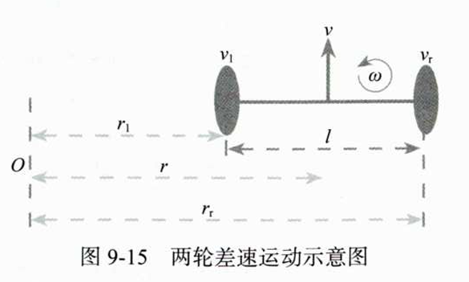
#### Kinematics 类（lib/Kinematics/）

**Kinematics.h**：

```cpp
#ifndef __KINEMATICS_H__
#define __KINEMATICS_H__

#include <Arduino.h>

typedef struct {
    float per_pulse_distance;
    int16_t motor_speed;
    int64_t last_encoder_tick;
} motor_param_t;

class Kinematics {
public:
    Kinematics() = default;
    ~Kinematics() = default;

    void set_motor_param(uint8_t id, float per_pulse_distance);
    void set_wheel_distance(float wheel_distance);
    void kinematic_inverse(float linear_speed, float angle_speed,
                           float &out_left_speed, float &out_right_speed);
    void kinematic_forward(float left_speed, float right_speed,
                           float &out_linear_speed, float &out_angle_speed);
    void update_motor_speed(uint64_t current_time, int32_t left_tick, int32_t right_tick);
    int16_t get_motor_speed(uint8_t id);

private:
    motor_param_t motor_param_[2];
    uint64_t last_update_time;
    float wheel_distance_;
};

#endif
```

**Kinematics.cpp**（部分关键实现）：

```cpp
#include "Kinematics.h"

void Kinematics::set_motor_param(uint8_t id, float per_pulse_distance) {
    motor_param_[id].per_pulse_distance = per_pulse_distance;
}

void Kinematics::set_wheel_distance(float wheel_distance) {
    wheel_distance_ = wheel_distance;
}

int16_t Kinematics::get_motor_speed(uint8_t id) {
    return motor_param_[id].motor_speed;
}

void Kinematics::update_motor_speed(uint64_t current_time, int32_t left_tick, int32_t right_tick) {
    uint32_t dt = current_time - last_update_time;
    last_update_time = current_time;

    int32_t dtick1 = left_tick - motor_param_[0].last_encoder_tick;
    int32_t dtick2 = right_tick - motor_param_[1].last_encoder_tick;
    motor_param_[0].last_encoder_tick = left_tick;
    motor_param_[1].last_encoder_tick = right_tick;

    motor_param_[0].motor_speed = float(dtick1 * motor_param_[0].per_pulse_distance) / dt * 1000;
    motor_param_[1].motor_speed = float(dtick2 * motor_param_[1].per_pulse_distance) / dt * 1000;
}

void Kinematics::kinematic_forward(float left_speed, float right_speed,
                                   float &out_linear_speed, float &out_angle_speed) {
    out_linear_speed = (right_speed + left_speed) / 2.0;
    out_angle_speed = (right_speed - left_speed) / wheel_distance_;
}

void Kinematics::kinematic_inverse(float linear_speed, float angle_speed,
                                   float &out_left_speed, float &out_right_speed) {
    out_left_speed = linear_speed - (angle_speed * wheel_distance_) / 2.0;
    out_right_speed = linear_speed + (angle_speed * wheel_distance_) / 2.0;
}
```

#### 主程序：运动学 + PID 控制

```cpp
#include <Arduino.h>
#include <Esp32McpwmMotor.h>
#include <Esp32PcntEncoder.h>
#include <Kinematics.h>
#include <PIDController.h>

Esp32McpwmMotor motor;
Esp32PcntEncoder encoders[2];
PIDController pid_controller[2];
Kinematics kinematics;

float target_linear_speed = 50.0;   // mm/s
float target_angular_speed = 0.1f;  // rad/s
float out_left_speed, out_right_speed;

void setup() {
    Serial.begin(115200);
    encoders[0].init(0, 32, 33);
    encoders[1].init(1, 26, 25);
    motor.attachMotor(0, 22, 23);
    motor.attachMotor(1, 12, 13);

    pid_controller[0].update_pid(0.625, 0.125, 0.0);
    pid_controller[1].update_pid(0.625, 0.125, 0.0);
    pid_controller[0].out_limit(-100, 100);
    pid_controller[1].out_limit(-100, 100);

    kinematics.set_wheel_distance(175);
    kinematics.set_motor_param(0, 0.1051566);
    kinematics.set_motor_param(1, 0.1051566);

    kinematics.kinematic_inverse(target_linear_speed, target_angular_speed,
                                 out_left_speed, out_right_speed);
    pid_controller[0].update_target(out_left_speed);
    pid_controller[1].update_target(out_right_speed);
}

void loop() {
    delay(10);
    kinematics.update_motor_speed(millis(),
                                  encoders[0].getTicks(),
                                  encoders[1].getTicks());
    motor.updateMotorSpeed(0, pid_controller[0].update(kinematics.get_motor_speed(0)));
    motor.updateMotorSpeed(1, pid_controller[1].update(kinematics.get_motor_speed(1)));
}
```


### 9.3.5 机器人里程计计算

通过运动学正解获取实时速度，对线速度和角速度积分得到位置信息。

**里程计更新公式**（dt 时间内）：
\[
d = v \cdot dt, \quad \theta_{t+1} = \theta_t + \omega \cdot dt
\]
\[
x_{t+1} = x_t + d \cdot \cos(\theta_{t+1}), \quad y_{t+1} = y_t + d \cdot \sin(\theta_{t+1})
\]

#### 扩展 Kinematics.h

```cpp
typedef struct {
    float x;
    float y;
    float angle;
    float linear_speed;
    float angle_speed;
} odom_t;

class Kinematics {
public:
    void update_odom(uint16_t dt);
    odom_t &get_odom();
    static void TransAngleInPI(float angle, float &out_angle);

private:
    odom_t odom_;
};
```

#### 扩展 Kinematics.cpp

```cpp
odom_t &Kinematics::get_odom() { return odom_; }

void Kinematics::TransAngleInPI(float angle, float &out_angle) {
    out_angle = angle;
    if (angle > PI) out_angle -= 2 * PI;
    else if (angle < -PI) out_angle += 2 * PI;
}

void Kinematics::update_odom(uint16_t dt) {
    float dt_s = (float)dt / 1000;

    kinematic_forward(motor_param_[0].motor_speed,
                      motor_param_[1].motor_speed,
                      odom_.linear_speed,
                      odom_.angle_speed);

    odom_.linear_speed /= 1000;  // mm/s → m/s
    odom_.angle += odom_.angle_speed * dt_s;
    TransAngleInPI(odom_.angle, odom_.angle);

    float delta_distance = odom_.linear_speed * dt_s;
    odom_.x += delta_distance * cos(odom_.angle);
    odom_.y += delta_distance * sin(odom_.angle);
}
```

#### 修改 update_motor_speed（添加里程计更新）

```cpp
void Kinematics::update_motor_speed(uint64_t current_time, int32_t left_tick, int32_t right_tick) {
    // ... 原有速度计算代码 ...
    update_odom(dt);  // 添加里程计更新
}
```

#### 主程序输出里程计

```cpp
void loop() {
    // ... 原有控制代码 ...
    Serial.printf("x=%f, y=%f, angle=%f\n",
                  kinematics.get_odom().x,
                  kinematics.get_odom().y,
                  kinematics.get_odom().angle);
}
```

**输出示例**：
```
x=-0.059717, y=0.996842, angle=-3.031903
x=-0.060079, y=0.996802, angle=-3.031274
```

里程计由左右轮实时速度计算得出（非目标速度），至此完成机器人底盘控制系统开发，下一步将其接入 ROS 2。