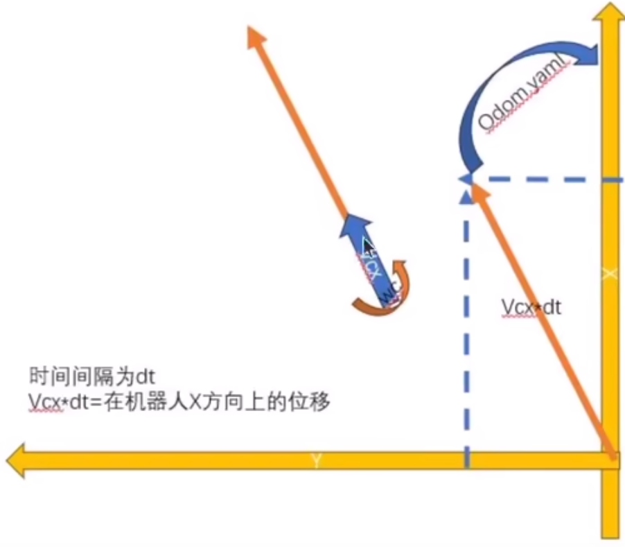
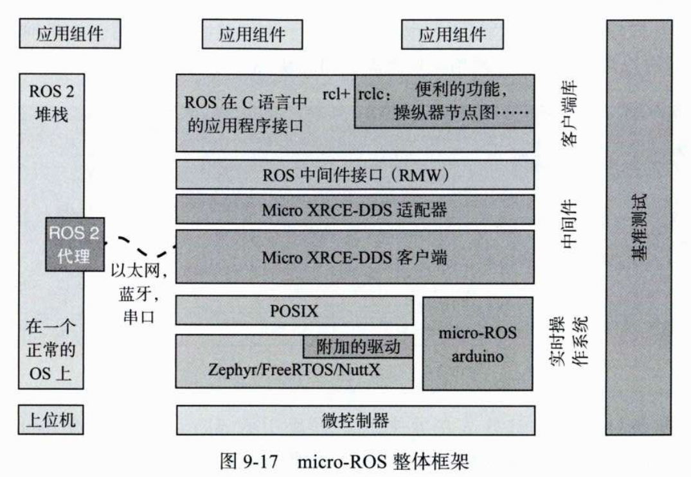

# 第九章 真机
## 9.0 二驱小车
[二驱小车教程](https://fishros.org.cn/forum/topic/923/fishbot%E4%BA%8C%E9%A9%B1-%E9%85%8D%E5%A5%97%E8%B5%84%E6%96%99%E6%B1%87%E6%80%BB)
[四驱小车教程](https://fishros.org.cn/forum/topic/3466/fishbot%E5%9B%9B%E9%A9%B1v2-%E8%B5%84%E6%96%99%E6%95%99%E7%A8%8B%E6%B1%87%E6%80%BB)

## 9.1 从仿真到实体：移动机器人系统设计

从系统功能角度看，移动机器人由**感知**、**决策**和**控制**三部分组成：
- **感知**：通过激光雷达、编码器、IMU 等传感器实现
- **决策**：由各种算法组合实现（如 Navigation 2 路径规划与运动控制），硬件依托性能较强的处理器
- **控制**：由驱动系统和电动机组成

本章以低成本移动机器人平台 **FishBot** 为例，着重介绍实体机器人软件部分的开发。

### 9.1.1 机器人传感器

FishBot 搭载了四种传感器：**雷达**、**超声波**、**编码器**和 **IMU**。导航主要关注**激光雷达**和**编码器**。

#### 激光雷达

FishBot 使用**单线旋转式激光雷达**，通过发射红外激光（波长约 1000 nm）并接收反射光计算障碍物距离。在 ROS 2 中，雷达数据通过 `/scan` 话题发布，由激光雷达驱动提供。

#### 编码器

编码器用于实时获取轮子转速，结合运动学模型计算机器人速度和里程计数据（`/odom`）。FishBot 采用 **AB 电磁编码器**，由两个霍尔传感器和间隔磁化的圆形磁铁组成，磁铁固定在电动机转子上。电动机转动时，霍尔传感器检测磁性变化，从而测量转速。


### 9.1.2 机器人执行器

执行器是负责运动的部件，最重要的执行器是电动机。FishBot 采用**额定电压 12V 的 370 减速电动机**，带减速器以降低转速、提高转矩（额定转速 130 r/min，额定电流 0.5A，转矩 600 gf·cm）。减速器将电动机的高速低扭矩输出转换为低速高扭矩，更适合移动机器人驱动。


### 9.1.3 机器人决策系统

决策系统负责根据传感器数据和任务要求控制机器人运动，硬件通常采用性能较强的计算机（如工控机、树莓派、Jetson Nano 等）。为降低成本，FishBot 采用同时支持无线和有线连接的驱动控制板，用户可直接使用自己的计算机作为决策端与控制系统通信。

除感知、决策和控制部分外，机器人还需**电池**、**电源模块**和**支撑结构**等硬件配合。

## 9.2 单片机开发基础

实体机器人开发需要与硬件系统打交道，传感器驱动和电动机控制都在**微型控制单元（MCU，即单片机）**上完成。FishBot 驱动控制板采用国产 **ESP32 单片机**，支持 Wi-Fi、蓝牙等无线通信，可方便地读取传感器数据并进行电动机控制。


### 9.2.1 开发平台介绍与安装

ESP32 支持多种开发平台，包括官方的 **ESP IDF** 和更简单易用的 **Arduino**。本章采用 Arduino 进行开发。

#### 安装 PlatformIO IDE

PlatformIO IDE 是 VS Code 的插件，支持多种单片机，主要用 Python 编写。首先安装 Python 虚拟环境工具：

```bash
sudo apt install python3-venv
```

然后在 VS Code 扩展商店中搜索并安装 **PlatformIO IDE**。安装完成后，侧边栏会出现 PlatformIO 按钮，首次单击会执行初始化。也可手动初始化：

```bash
# 激活虚拟环境
source ~/.platformio/penv/bin/activate

# 安装 PlatformIO 核心（使用国内镜像加速）
pip install platformio -i https://pypi.tuna.tsinghua.edu.cn/simple
```

#### 安装 ESP32 Arduino 开发环境

```bash
pio pkg install --global --platform "platformio/espressif32@6.4.0"
pio pkg install --global --tool "platformio/contrib-piohome"
pio pkg install --global --tool "platformio/framework-arduinoespressif32"
pio pkg install --global --tool "platformio/tool-scans"
pio pkg install --global --tool "platformio/tool-mkfats"
pio pkg install --global --tool "platformio/tool-mkspiffs"
pio pkg install --global --tool "platformio/tool-mklittles"
```

安装完成后重启 VS Code，打开 PlatformIO IDE 插件（如图 9-5 所示）。单击 PIO Home 下的 **Open** 打开主页（如图 9-6 所示）。


#### 创建第一个 Arduino 工程

1. 单击 **New Project**
2. 输入工程名（如 `example01_helloworld`）
3. 开发板选择 **Adafruit ESP32 Feather**
4. 开发框架选择 **Arduino**
5. 选择工程位置（默认或自定义），单击 **Finish**

创建完成后即可获得一个 Hello World 工程目录（如图 9-8 所示），接下来可在单片机上编写第一个程序。

## 9.2.2 第一个 HelloWorld 工程

Arduino 采用 **C++** 作为编程语言，单片机开发流程分为四步：**编写代码 → 编译工程 → 烧录二进制文件 → 运行测试**。

在 `src/main.cpp` 中编写：

```cpp
#include <Arduino.h>

// setup 函数：启动时调用一次，用于初始化
void setup() {
    Serial.begin(115200);          // 设置串口波特率
}

// loop 函数：setup 后循环调用
void loop() {
    Serial.print("Hello World!\n");
    delay(1000);                   // 延时 1000ms
}
```

**核心概念**：
- `setup()`：启动时执行一次，用于初始化设置
- `loop()`：`setup()` 后循环执行，为主循环逻辑
- `Serial`：串口通信对象，通过 USB 转串口芯片与计算机交换数据

**编译与烧录**：
- VS Code 左下角 PlatformIO IDE 提供**编译**和**上传**按钮（如图 9-9）
- 编译成功后会生成 `firmware.bin` 二进制文件
- 若首次使用串口设备出现权限问题，执行：
  ```bash
  sudo apt remove --purge brltty -y
  sudo usermod -aG dialout `whoami`
  ```
  重启后生效

**查看串口输出**：
- 安装 VS Code 的 **Serial Monitor** 插件（如图 9-10）
- 选择设备端口（`/dev/ttyUSB*`），波特率设为 **115200**（如图 9-11）
- 即可看到 "Hello World!" 输出

> 下载代码前需关闭串行监视器，同一串口设备同一时间只能由一个程序打开。


## 9.2.3 使用代码点亮 LED 灯

LED（发光二极管）可将电能转化为可见光。FishBot 驱动控制板上的 LED 灯原理图如图 9-12 所示：

- **R2**：1kΩ 限流电阻
- **LED1**：蓝色 LED
- **右侧**：3.3V 电压源
- **左侧 ESP_IO2**：单片机引脚（GPIO2）

**点灯原理**：
- 将 `ESP_IO2` 设为 **3.3V**：两端电压相同，无电流，LED 熄灭
- 将 `ESP_IO2` 设为 **0V**：右侧 3.3V → LED → 0V，有电流，LED 点亮

新建工程 `example02_led`，在 `src/main.cpp` 中编写：

```cpp
#include <Arduino.h>

void setup() {
    pinMode(2, OUTPUT);            // 设置 GPIO2 为输出模式
}

void loop() {
    digitalWrite(2, LOW);          // 低电平：LED 点亮
    delay(1000);
    digitalWrite(2, HIGH);         // 高电平：LED 熄灭
    delay(1000);
}
```

**核心函数**：
- `pinMode(pin, mode)`：设置引脚模式（`OUTPUT` 输出 / `INPUT` 输入）
- `digitalWrite(pin, value)`：设置引脚电平（`HIGH` 高电平 / `LOW` 低电平）

编译烧录后，LED 将每隔 1000ms 闪烁一次。


## 9.2.4 使用超声波测量距离

超声波传感器通过发射头发送超声波，遇到障碍物反射后由接收头接收，根据**时间 × 声速**计算距离（如图 9-13 所示）。FishBot 超声波模块有四个引脚：

| 引脚 | 功能 |
| :--- | :--- |
| VCC | 电源（5V） |
| GND | 地 |
| TRIG | 触发引脚（发送脉冲触发测距） |
| ECHO | 接收引脚（输出高电平，持续时间 = 超声波飞行时间） |

新建工程 `example03_ultrasound`，在 `src/main.cpp` 中编写：

```cpp
#include <Arduino.h>
#define TRIG 27                    // 发送引脚
#define ECHO 21                    // 接收引脚

void setup() {
    Serial.begin(115200);
    pinMode(TRIG, OUTPUT);
    pinMode(ECHO, INPUT);
}

void loop() {
    // 产生 10μs 高脉冲触发测距
    digitalWrite(TRIG, HIGH);
    delayMicroseconds(10);
    digitalWrite(TRIG, LOW);

    // 测量 ECHO 高电平持续时间（μs）
    double delta_time = pulseIn(ECHO, HIGH);
    // 距离 = 时间 × 声速（0.0343 cm/μs）÷ 2（往返）
    float detect_distance = delta_time * 0.0343 / 2.0;

    Serial.printf("distance=%.6f cm\n", detect_distance);
    delay(500);
}
```

**核心函数**：
- `delayMicroseconds(us)`：微秒级延时
- `pulseIn(pin, value)`：测量引脚高/低电平持续时间（μs）

输出示例：
```
distance=25.896500 cm
distance=25.879351 cm
distance=25.896500 cm
```


## 9.2.5 使用开源库驱动 IMU

FishBot 使用 **MPU6050** 六轴惯性测量单元，通过 **I2C 协议** 与单片机通信。Arduino 支持通过第三方库简化开发，本例使用 `MPU6050_light` 库。

新建工程 `example04_imu`，编辑 `platformio.ini`，添加依赖库：

```ini
lib_deps =
    https://github.com/rfetick/MPU6050_light.git
```

保存后 PlatformIO 自动下载库。将库示例代码 `GetAngle.ino` 复制到 `src/main.cpp`，修改串口波特率并设置 I2C 引脚（SDA=18, SCL=19）：

```cpp
#include "Wire.h"
#include <MPU6050_light.h>

MPU6050 mpu(Wire);
unsigned long timer = 0;

void setup() {
    Serial.begin(115200);
    Wire.begin(18, 19);                    // SDA=18, SCL=19

    byte status = mpu.begin();
    Serial.print(F("MPU6050 status: "));
    Serial.println(status);
    while (status != 0) {}

    Serial.println(F("Calculating offsets, do not move MPU6050"));
    delay(1000);
    mpu.calcOffsets();                     // 计算偏移量
    Serial.println("Done!\n");
}

void loop() {
    mpu.update();                          // 更新传感器数据

    if ((millis() - timer) > 10) {         // 每 10ms 输出一次
        Serial.print("X : ");
        Serial.print(mpu.getAngleX());
        Serial.print("\tY : ");
        Serial.print(mpu.getAngleY());
        Serial.print("\tZ : ");
        Serial.println(mpu.getAngleZ());
        timer = millis();
    }
}
```

**关键说明**：
- `Wire.begin(SDA, SCL)`：初始化 I2C 总线，指定引脚
- `mpu.calcOffsets()`：校准陀螺仪和加速度计偏移（传感器静止时调用）
- `mpu.update()`：更新传感器数据
- `mpu.getAngleX/Y/Z()`：获取各轴角度（度）

输出示例：
```
X : -0.03    Y : 0.03    Z : -2.23
X : -0.04    Y : 0.03    Z : -2.23
```

## 9.3 机器人控制系统的实现

控制移动机器人运动，就是控制电动机转动。FishBot 底盘有两个驱动轮和一个万向轮，通过改变两个轮子的速度实现转弯和移动，属于**两轮差速模型**。


### 9.3.1 使用开源库驱动多路电动机

电动机无法直接连接单片机引脚，需要驱动电路（如 DRV8833）放大信号。FishBot 驱动原理图如图 9-14 所示：
`AIN1(IO23) → AOUT1`，`AIN2(IO22) → AOUT2`。

新建工程 `fishbot_motion_control`，编辑 `platformio.ini`：

```ini
lib_deps =
    https://github.com/fishros/Esp32McpwmMotor.git
```

`Esp32McpwmMotor` 库可同时控制 6 个直流电动机。编写 `src/main.cpp`：

```cpp
#include <Arduino.h>
#include <Esp32McpwmMotor.h>

Esp32McpwmMotor motor;

void setup() {
    motor.attachMotor(0, 22, 23);  // 电动机0：引脚22、23
    motor.attachMotor(1, 12, 13);  // 电动机1：引脚12、13
}

void loop() {
    motor.updateMotorSpeed(0, 70);   // 正转70%
    motor.updateMotorSpeed(1, 70);
    delay(2000);
    motor.updateMotorSpeed(0, -70);  // 反转70%
    motor.updateMotorSpeed(1, -70);
    delay(2000);
}
```

**核心函数**：
- `attachMotor(id, pin1, pin2)`：连接电动机
- `updateMotorSpeed(id, speed)`：设置速度（-100 ~ 100，正反转）


### 9.3.2 电动机速度测量与转换

FishBot 电动机配有 AB 电磁编码器（两个霍尔传感器），转动时产生脉冲。需测量轮子转一圈的脉冲数，将脉冲数转换为速度。

#### 编码器脉冲计数

修改 `platformio.ini`，添加 `Esp32PcntEncoder` 库：

```ini
lib_deps =
    https://github.com/fishros/Esp32McpwmMotor.git
    https://github.com/fishros/Esp32PcntEncoder.git
```

```cpp
#include <Arduino.h>
#include <Esp32PcntEncoder.h>

Esp32PcntEncoder encoders[2];

void setup() {
    Serial.begin(115200);
    encoders[0].init(0, 32, 33);  // 编码器0：GPIO32、33
    encoders[1].init(1, 26, 25);  // 编码器1：GPIO26、25
}

void loop() {
    delay(10);
    Serial.printf("tick1=%d,tick2=%d\n",
                  encoders[0].getTicks(),
                  encoders[1].getTicks());
}
```

**测量结果**：手动转动轮子 10 圈，脉冲数为 19419，单圈脉冲 ≈ 1942。  
**单脉冲对应距离**：
```
0.1051566 = 65 * π / 1942   （轮径65mm，单位mm/脉冲）
```

#### 速度计算（含编码器+电机控制）

```cpp
/**
 * @file main.cpp
 * @brief FishBot 机器人电动机速度测量与编码器脉冲计数示例
 * 
 * 该程序演示如何：
 *   1. 使用 Esp32PcntEncoder 库读取编码器脉冲
 *   2. 使用 Esp32McpwmMotor 库控制电动机转速
 *   3. 根据编码器脉冲数计算轮子实际速度
 * 
 * 硬件连接：
 *   - 编码器0：GPIO32, GPIO33
 *   - 编码器1：GPIO26, GPIO25
 *   - 电动机0：GPIO22, GPIO23
 *   - 电动机1：GPIO12, GPIO13
 * 
 * 单脉冲对应距离：0.1051566 mm（根据轮径65mm和单圈脉冲数1942计算得出）
 */

#include <Arduino.h>          // Arduino 核心库（setup/loop/delay/Serial 等）
#include <Esp32PcntEncoder.h> // ESP32 脉冲计数编码器库
#include <Esp32McpwmMotor.h>  // ESP32 MCPWM 电动机驱动库

// ============================================================
// 全局对象声明
// ============================================================

Esp32McpwmMotor motor;           // 电动机控制对象
Esp32PcntEncoder encoders[2];    // 编码器对象数组（0：左轮，1：右轮）

// ============================================================
// 速度计算相关变量
// ============================================================

int64_t last_ticks[2];        // 上一次读取的编码器计数值（int64_t 防止溢出）
int32_t delta_ticks[2];       // 两次读取之间的脉冲变化量
int64_t last_update_time;     // 上次计算速度的时间（毫秒）
float current_speeds[2];      // 当前速度（单位：m/s）

// ============================================================
// 常量定义
// ============================================================

// 单脉冲对应轮子前进距离 = 轮径65mm × π / 单圈脉冲数1942
// 单位：mm/脉冲
const float PULSE_DISTANCE = 0.1051566;

// ============================================================
// 初始化函数（上电后执行一次）
// ============================================================

void setup() {
    // 1. 初始化串口通信（用于输出速度数据到电脑）
    Serial.begin(115200);

    // 2. 初始化编码器
    //    init(编码器编号, 引脚A, 引脚B)
    encoders[0].init(0, 32, 33);  // 左轮编码器：GPIO32（A相），GPIO33（B相）
    encoders[1].init(1, 26, 25);  // 右轮编码器：GPIO26（A相），GPIO25（B相）

    // 3. 初始化电动机
    //    attachMotor(电动机编号, 引脚1, 引脚2)
    motor.attachMotor(0, 22, 23);  // 左轮电机：GPIO22, GPIO23
    motor.attachMotor(1, 12, 13);  // 右轮电机：GPIO12, GPIO13

    // 4. 设置电动机转速（占空比70%，正转）
    motor.updateMotorSpeed(0, 70);
    motor.updateMotorSpeed(1, 70);

    // 5. 初始化时间变量
    last_update_time = millis();   // 记录当前时间作为起始时间
}

// ============================================================
// 主循环函数（不断重复执行）
// ============================================================

void loop() {
    // 1. 固定延时10ms，控制采样周期（约100Hz）
    delay(10);

    // 2. 计算时间差 dt（单位：毫秒）
    //    millis() 返回从程序开始到当前的毫秒数
    uint64_t dt = millis() - last_update_time;
    if (dt == 0) return;  // 防止除零错误

    // 3. 计算编码器脉冲变化量
    //    当前读数 - 上次读数 = 这段时间内产生的脉冲数
    delta_ticks[0] = encoders[0].getTicks() - last_ticks[0];
    delta_ticks[1] = encoders[1].getTicks() - last_ticks[1];

    // 4. 计算速度（单位：m/s）
    //    速度 = 脉冲数 × 单脉冲距离 / 时间
    //    - 脉冲数 × 单脉冲距离 = 轮子前进距离（mm）
    //    - 除以时间 dt（ms）得到 mm/ms
    //    - 除以1000得到 m/s
    current_speeds[0] = float(delta_ticks[0] * PULSE_DISTANCE) / dt;
    current_speeds[1] = float(delta_ticks[1] * PULSE_DISTANCE) / dt;

    // 5. 更新记录（为下一次计算做准备）
    last_update_time = millis();                      // 更新时间戳
    last_ticks[0] = encoders[0].getTicks();          // 保存当前计数值
    last_ticks[1] = encoders[1].getTicks();

    // 6. 通过串口输出速度数据
    //    格式：speed1=0.210313 m/s, speed2=0.189282 m/s
    Serial.printf("speed1=%f m/s, speed2=%f m/s\n",
                  current_speeds[0],
                  current_speeds[1]);
}
```


### 9.3.3 使用 PID 控制轮子转速

即使设置相同速度，两个电动机实际转速可能不同，需用 PID 控制器动态调节。

**PID 公式**：
\[
\text{Output} = K_p \cdot \text{Error} + K_i \cdot \int \text{Error} \, dt + K_d \cdot \frac{d(\text{Error})}{dt}
\]

#### PID 控制器类（lib/PIDController/）

**PIDController.h**：

```cpp
/**
 * @file PIDController.h
 * @brief PID 控制器类头文件
 * 
 * 该文件定义了 PID 控制器的类接口，用于实现比例-积分-微分控制算法。
 * PID 控制器广泛应用于电机速度控制、温度控制等场景。
 * 
 * PID 公式：Output = Kp * Error + Ki * ∫Error*dt + Kd * d(Error)/dt
 */

#ifndef _PIDCONTROLLER_H_
#define _PIDCONTROLLER_H_

/**
 * @class PIDController
 * @brief PID 控制器类
 * 
 * 提供 PID 控制算法的核心功能：
 *   - 设置 PID 系数 (Kp, Ki, Kd)
 *   - 更新目标值
 *   - 根据当前反馈值计算控制输出
 *   - 输出限幅
 *   - 重置控制器状态
 */
class PIDController {
public:
    // ============================================================
    // 构造函数
    // ============================================================

    PIDController() = default;
    PIDController(float kp, float ki, float kd);

    // ============================================================
    // 核心控制方法，见.cpp文件
    // ============================================================

    float update(float current);
    void update_target(float target);
    void update_pid(float kp, float ki, float kd);
    void reset();
    void out_limit(float out_min, float out_max);

private:
    // ============================================================
    // 目标值相关
    // ============================================================

    float target_;          /**< 目标值（期望值） */

    // ============================================================
    // 输出限幅相关
    // ============================================================

    float out_min_;         /**< 输出最小值 */
    float out_max_;         /**< 输出最大值 */

    // ============================================================
    // PID 控制系数
    // ============================================================

    float kp_;              /**< 比例系数（P） */
    float ki_;              /**< 积分系数（I） */
    float kd_;              /**< 微分系数（D） */

    // ============================================================
    // PID 状态变量
    // ============================================================

    float error_sum_;       /**< 误差累积和（积分项） */
    float error_;           /**< 当前误差变化率（微分项） */
    float error_last_;      /**< 上一次误差值（用于计算微分） */

    // ============================================================
    // 积分限幅
    // ============================================================

    float intergral_up_ = 2500;  /**< 积分上限（防止积分饱和） */
};

#endif // _PIDCONTROLLER_H_
```

**PIDController.cpp**：

```cpp
/**
 * @file PIDController.cpp
 * @brief PID 控制器类实现文件
 * 
 * 实现 PID 控制器的核心算法，包括：
 *   - 比例（P）：根据当前误差产生控制量
 *   - 积分（I）：消除稳态误差
 *   - 微分（D）：抑制超调，提高稳定性
 */

#include "PIDController.h"   // 类声明头文件
#include "Arduino.h"         // Arduino 核心库（使用 millis() 等函数）

// ============================================================
// 构造函数
// ============================================================

/**
 * @brief 带参数的构造函数
 * @param kp 比例系数
 * @param ki 积分系数
 * @param kd 微分系数
 * 
 * 创建 PID 控制器对象并初始化所有状态。
 */
PIDController::PIDController(float kp, float ki, float kd) {
    reset();                     // 重置所有状态变量
    update_pid(kp, ki, kd);      // 设置 PID 系数
}

// ============================================================
// 核心控制方法
// ============================================================

/**
 * @brief PID 核心更新函数
 * @param current 当前测量值（反馈值）
 * @return 控制输出值（已限幅）
 * 
 * PID 计算步骤：
 *   1. 计算误差：error = target - current
 *   2. 计算微分（误差变化率）：error_ = error_last - error
 *   3. 更新历史误差：error_last = error
 *   4. 累积积分：error_sum += error（带积分限幅）
 *   5. 计算输出：Kp*error + Ki*error_sum + Kd*error_
 *   6. 输出限幅：[out_min, out_max]
 */
float PIDController::update(float current) {
    // ============================================================
    // 第一步：计算误差
    // ============================================================
    // error > 0：当前值低于目标值（需要增加输出）
    // error < 0：当前值高于目标值（需要减少输出）
    float error = target_ - current;

    // ============================================================
    // 第二步：计算微分项（误差变化率）
    // ============================================================
    // error_ = error_last - error
    //   - 误差在增大（error_ < 0）：需要更强的控制作用
    //   - 误差在减小（error_ > 0）：需要减弱控制作用
    //   - 注意：有些实现用 error - error_last，符号相反
    error_ = error_last_ - error;

    // 更新上一次误差（供下次计算使用）
    error_last_ = error;

    // ============================================================
    // 第三步：计算积分项
    // ============================================================
    // 累积误差（用于消除稳态误差）
    error_sum_ += error;

    // 积分限幅（防止积分饱和）
    // 当误差长时间存在时，积分项会持续增大，可能导致输出失控
    if (error_sum_ > intergral_up_) {
        error_sum_ = intergral_up_;
    }
    if (error_sum_ < -intergral_up_) {
        error_sum_ = -intergral_up_;
    }

    // ============================================================
    // 第四步：PID 公式计算
    // ============================================================
    // Output = P + I + D
    //   - P（比例）：快速响应当前误差
    //   - I（积分）：消除长期累积误差
    //   - D（微分）：预测误差变化趋势，抑制超调
    float output = kp_ * error + ki_ * error_sum_ + kd_ * error_;

    // ============================================================
    // 第五步：输出限幅
    // ============================================================
    // 防止输出超出执行器可接受范围
    // 例如：电机 PWM 范围 [-100, 100]，超出可能导致硬件损坏
    if (output > out_max_) {
        output = out_max_;
    }
    if (output < out_min_) {
        output = out_min_;
    }

    return output;
}

// ============================================================
// 参数设置方法
// ============================================================

/**
 * @brief 更新目标值
 * @param target 新的目标值
 * 
 * 设置控制器要跟踪的目标值（如期望速度 100 mm/s）。
 * 通常在控制任务开始时调用一次，或在目标变化时调用。
 */
void PIDController::update_target(float target) {
    target_ = target;
}

/**
 * @brief 更新 PID 系数
 * @param kp 新的比例系数
 * @param ki 新的积分系数
 * @param kd 新的微分系数
 * 
 * 在运行过程中动态调整 PID 参数。
 * 调用 reset() 清除历史状态，避免旧数据影响新参数下的控制效果。
 */
void PIDController::update_pid(float kp, float ki, float kd) {
    reset();          // 重置历史状态，避免旧数据干扰
    kp_ = kp;         // 比例系数
    ki_ = ki;         // 积分系数
    kd_ = kd;         // 微分系数
}

// ============================================================
// 状态管理方法
// ============================================================

/**
 * @brief 重置 PID 控制器状态
 * 
 * 将控制器恢复到初始状态：
 *   - 所有目标值、输出限幅、PID 系数归零
 *   - 清除所有历史误差（积分累积、微分历史）
 * 
 * 典型使用场景：
 *   - 切换控制任务时
 *   - PID 调参前
 *   - 系统重新启动时
 */
void PIDController::reset() {
    target_ = 0.0f;
    out_min_ = 0.0f;
    out_max_ = 0.0f;
    kp_ = 0.0f;
    ki_ = 0.0f;
    kd_ = 0.0f;
    error_sum_ = 0.0f;
    error_ = 0.0f;
    error_last_ = 0.0f;
}

/**
 * @brief 设置输出限幅
 * @param out_min 输出最小值
 * @param out_max 输出最大值
 * 
 * 限制控制输出的范围，防止输出值过大。
 * 
 * 示例：
 *   - 电机 PWM 控制：out_limit(-100, 100)
 *   - 加热器控制：out_limit(0, 255)
 *   - 阀门开度控制：out_limit(0, 100)
 */
void PIDController::out_limit(float out_min, float out_max) {
    out_min_ = out_min;
    out_max_ = out_max;
}
```

#### 主程序：PID 速度闭环控制

```cpp
/**
 * @file main.cpp
 * @brief FishBot 机器人 PID 速度闭环控制程序
 * 
 * 本程序实现了电动机的 PID 速度闭环控制：
 *   1. 编码器实时测量轮子实际速度
 *   2. PID 控制器根据目标速度与实际速度的误差计算控制量
 *   3. 控制量输出到电动机驱动器，形成闭环
 * 
 * 硬件连接：
 *   - 编码器0：GPIO32, GPIO33（左轮）
 *   - 编码器1：GPIO26, GPIO25（右轮）
 *   - 电动机0：GPIO22, GPIO23（左轮）
 *   - 电动机1：GPIO12, GPIO13（右轮）
 * 
 * 控制参数：
 *   - PID：Kp=0.625, Ki=0.125, Kd=0.0
 *   - 目标速度：100 mm/s
 *   - 输出范围：[-100, 100]（PWM 占空比）
 *   - 控制周期：10ms（100Hz）
 */

#include <Arduino.h>          // Arduino 核心库
#include <Esp32McpwmMotor.h>  // 电动机驱动库
#include <Esp32PcntEncoder.h> // 编码器脉冲计数库
#include <PIDController.h>    // PID 控制器库

// ============================================================
// 全局对象
// ============================================================

Esp32McpwmMotor motor;           // 电动机控制对象
Esp32PcntEncoder encoders[2];    // 编码器对象（[0]=左轮，[1]=右轮）
PIDController pid_controller[2]; // PID 控制器（[0]=左轮，[1]=右轮）

// ============================================================
// 速度计算相关变量
// ============================================================

int64_t last_ticks[2];        // 上次编码器计数值
int32_t delta_ticks[2];       // 两次采样间的脉冲变化量
int64_t last_update_time;     // 上次速度更新时间（毫秒）
float current_speeds[2];      // 当前实际速度（mm/s）

// ============================================================
// 常量定义
// ============================================================

// 单脉冲对应轮子前进距离：65mm × π / 1942（单位：mm/脉冲）
const float PULSE_DISTANCE = 0.1051566;

// ============================================================
// 速度控制函数
// ============================================================

/**
 * @brief 速度闭环控制函数
 * 
 * 执行一次完整的控制周期：
 *   1. 计算时间差 dt
 *   2. 计算编码器脉冲变化量
 *   3. 计算当前实际速度（mm/s）
 *   4. 更新历史数据（为下一周期准备）
 *   5. PID 计算并输出控制量到电动机
 *   6. 通过串口输出速度数据
 * 
 * 控制流程：目标速度 → PID 控制器 → PWM 占空比 → 电动机 → 编码器 → 实际速度 → PID 反馈
 */
void motorSpeedControl() {
    // ============================================================
    // 第一步：计算时间差（控制周期）
    // ============================================================
    // millis() 返回当前时间（毫秒），last_update_time 是上次记录的时间
    // dt 即为两次控制周期的时间间隔（约 10ms）
    uint64_t dt = millis() - last_update_time;
    if (dt == 0) return;  // 防止除零错误

    // ============================================================
    // 第二步：计算编码器脉冲变化量
    // ============================================================
    // 当前计数值 - 上次计数值 = 这段时间内产生的脉冲数
    delta_ticks[0] = encoders[0].getTicks() - last_ticks[0];
    delta_ticks[1] = encoders[1].getTicks() - last_ticks[1];

    // ============================================================
    // 第三步：计算当前实际速度（单位：mm/s）
    // ============================================================
    // 速度 = 脉冲数 × 单脉冲距离 / 时间
    //   - 脉冲数 × 单脉冲距离 = 轮子前进距离（mm）
    //   - 除以时间 dt（ms）得到 mm/ms
    //   - 乘以 1000 转换为 mm/s
    current_speeds[0] = float(delta_ticks[0] * PULSE_DISTANCE) / dt * 1000;
    current_speeds[1] = float(delta_ticks[1] * PULSE_DISTANCE) / dt * 1000;

    // ============================================================
    // 第四步：更新历史数据（为下一周期准备）
    // ============================================================
    last_update_time = millis();              // 更新时间戳
    last_ticks[0] = encoders[0].getTicks();  // 保存当前计数值
    last_ticks[1] = encoders[1].getTicks();

    // ============================================================
    // 第五步：PID 控制计算
    // ============================================================
    // pid_controller[i].update(current_speeds[i]) 返回控制量（PWM 占空比）
    // 控制量根据 目标速度 - 实际速度 的误差计算得出
    // 控制量范围由 out_limit(-100, 100) 限制
    motor.updateMotorSpeed(0, pid_controller[0].update(current_speeds[0]));
    motor.updateMotorSpeed(1, pid_controller[1].update(current_speeds[1]));

    // ============================================================
    // 第六步：通过串口输出速度数据
    // ============================================================
    // 实际速度与目标速度（100 mm/s）的偏差反映了 PID 控制效果
    Serial.printf("speed1=%f mm/s, speed2=%f mm/s\n",
                  current_speeds[0],
                  current_speeds[1]);
}

// ============================================================
// 初始化函数
// ============================================================

/**
 * @brief Arduino setup 函数（上电或复位后执行一次）
 * 
 * 初始化所有硬件和软件：
 *   1. 串口通信（用于调试输出）
 *   2. 编码器
 *   3. 电动机
 *   4. PID 控制器参数
 */
void setup() {
    // 1. 初始化串口（波特率 115200）
    Serial.begin(115200);

    // 2. 初始化编码器
    //    init(编码器编号, 引脚A, 引脚B)
    encoders[0].init(0, 32, 33);  // 左轮编码器
    encoders[1].init(1, 26, 25);  // 右轮编码器

    // 3. 初始化电动机
    //    attachMotor(电动机编号, 引脚1, 引脚2)
    motor.attachMotor(0, 22, 23);  // 左轮电机
    motor.attachMotor(1, 12, 13);  // 右轮电机

    // 4. 初始化 PID 控制器
    //    4.1 设置 PID 系数（Kp, Ki, Kd）
    //        - Kp 大 → 响应快，但可能振荡
    //        - Ki 大 → 消除稳态误差，但可能积分饱和
    //        - Kd 大 → 抑制超调，但可能放大噪声
    pid_controller[0].update_pid(0.625, 0.125, 0.0);
    pid_controller[1].update_pid(0.625, 0.125, 0.0);

    //    4.2 设置输出限幅（PWM 占空比范围）
    //        取值范围：[-100, 100]，对应 100% 正反转
    pid_controller[0].out_limit(-100, 100);
    pid_controller[1].out_limit(-100, 100);

    //    4.3 设置目标速度（单位：mm/s）
    //        即期望轮子达到的速度
    pid_controller[0].update_target(100);  // 左轮目标速度 100 mm/s
    pid_controller[1].update_target(100);  // 右轮目标速度 100 mm/s

    // 5. 初始化时间记录变量
    last_update_time = millis();
}

// ============================================================
// 主循环函数
// ============================================================

/**
 * @brief Arduino loop 函数（无限循环执行）
 * 
 * 每隔 10ms 执行一次速度控制，形成 100Hz 的控制周期。
 * 这个频率足够快，能有效响应速度变化，又不会过载 CPU。
 */
void loop() {
    delay(10);              // 固定延时 10ms（控制周期 100Hz）
    motorSpeedControl();    // 执行一次速度闭环控制
}
```


### 9.3.4 运动学正逆解的实现
**两轮差速运动学公式**：
先设定：
- 左右轮线速度分别为 \( v_1 \)、\( v_2 \)
- 两轮间距为 \( l \)
- 机器人质心在两轮中间

1. 正解（已知 \( v_1, v_2 \) 求 \( v, \omega \)）
    线速度就是左右轮速度的平均值：
    \[
    v = \frac{v_1 + v_2}{2}
    \]

    机器人绕瞬时旋转中心 \( O \) 做圆周运动，左右轮到 \( O \) 的距离分别为 \( r_1 \)、\( r_2 \)，且 \( r_2 - r_1 = l \)。

    角速度为 \( \omega \)，则：
    \[
    v_1 = \omega r_1, \quad v_2 = \omega r_2
    \]

    两式相减：
    \[
    v_2 - v_1 = \omega (r_2 - r_1) = \omega l
    \]

    所以：
    \[
    \omega = \frac{v_2 - v_1}{l}
    \]

2. 逆解（已知 \( v, \omega \) 求 \( v_1, v_2 \)）
    由正解公式，联立两式，所以：
\[
v_1 = v - \frac{\omega l}{2}, \quad v_2 = v + \frac{\omega l}{2}
\]

反过来，当 \( v_1 = v_2 = v \) 时，\( \omega = 0 \)，机器人直线前进。当 \( v_1 = -v_2 \) 时，\( v = 0 \)，机器人原地旋转。当直线前进的同时右转，左轮速度 \( v_1 \) 会大于右轮速度 \( v_2 \)，因为左侧走的弧线更大。
在 ROS 2 的 `/cmd_vel` 中，`linear.x` 就是这里的 \( v \)，`angular.z` 就是这里的 \( \omega \)，`fishbot_motion_control` 代码里的 `kinematic_forward` 和 `kinematic_inverse` 直接实现了这套推导。

#### Kinematics 类（lib/Kinematics/）

**Kinematics.h**：

```cpp
#ifndef __KINEMATICS_H__
#define __KINEMATICS_H__

#include <Arduino.h> // 包含 Arduino 核心库，用于基础数据类型和函数

// ============================================================
// 电动机参数结构体
// ============================================================
typedef struct {
    float per_pulse_distance;  // 单个编码器脉冲对应的轮子前进距离（单位：mm/脉冲）
    int16_t motor_speed;       // 当前电动机速度（单位：mm/s），计算时使用
    int64_t last_encoder_tick; // 上次读取的编码器计数值（用于计算速度变化量）
} motor_param_t;

// ============================================================
// 运动学类
// ============================================================
class Kinematics {
public:
    // 默认构造函数和析构函数，使用 default 让编译器自动生成
    Kinematics() = default;
    ~Kinematics() = default;

    // ============================================================
    // 参数设置方法
    // ============================================================

    /**
     * @brief 设置电动机参数
     * @param id 电动机编号（0：左轮，1：右轮）
     * @param per_pulse_distance 每个脉冲对应的轮子前进距离（mm/脉冲）
     */
    void set_motor_param(uint8_t id, float per_pulse_distance);

    /**
     * @brief 设置轮子间距（左右轮之间的距离）
     * @param wheel_distance 轮距（单位：mm）
     */
    void set_wheel_distance(float wheel_distance);

    // ============================================================
    // 运动学正逆解方法
    // ============================================================

    /**
     * @brief 运动学逆解：将机器人线速度和角速度转换为左右轮速度
     * @param linear_speed 目标线速度（单位：mm/s）
     * @param angle_speed  目标角速度（单位：rad/s）
     * @param out_left_speed  左轮速度（输出，单位：mm/s）
     * @param out_right_speed 右轮速度（输出，单位：mm/s）
     */
    void kinematic_inverse(float linear_speed, float angle_speed,
                           float &out_left_speed, float &out_right_speed);

    /**
     * @brief 运动学正解：将左右轮速度转换为机器人线速度和角速度
     * @param left_speed  左轮速度（单位：mm/s）
     * @param right_speed 右轮速度（单位：mm/s）
     * @param out_linear_speed 机器人线速度（输出，单位：mm/s）
     * @param out_angle_speed  机器人角速度（输出，单位：rad/s）
     */
    void kinematic_forward(float left_speed, float right_speed,
                           float &out_linear_speed, float &out_angle_speed);

    // ============================================================
    // 电动机速度更新与获取
    // ============================================================

    /**
     * @brief 根据编码器计数值更新电动机实时速度
     * @param current_time 当前时间（单位：ms）
     * @param left_tick  左轮编码器当前计数值
     * @param right_tick 右轮编码器当前计数值
     */
    void update_motor_speed(uint64_t current_time, int32_t left_tick, int32_t right_tick);

    /**
     * @brief 获取指定电动机的速度
     * @param id 电动机编号（0：左轮，1：右轮）
     * @return 电动机速度（单位：mm/s）
     */
    int16_t get_motor_speed(uint8_t id);

private:
    // ============================================================
    // 成员变量
    // ============================================================

    motor_param_t motor_param_[2];  // 存储两个电动机的参数（左轮、右轮）
    uint64_t last_update_time;      // 上次更新速度的时间（单位：ms）
    float wheel_distance_;           // 轮子间距（单位：mm）
};

#endif // __KINEMATICS_H__
```

**Kinematics.cpp**（部分关键实现）：

```cpp
#include "Kinematics.h"

// ============================================================
// 设置电动机参数
// ============================================================
void Kinematics::set_motor_param(uint8_t id, float per_pulse_distance) {
    // 将每个脉冲对应的轮子前进距离（mm/脉冲）保存到指定电动机的结构体中
    motor_param_[id].per_pulse_distance = per_pulse_distance;
}

// ============================================================
// 设置轮子间距
// ============================================================
void Kinematics::set_wheel_distance(float wheel_distance) {
    // 保存左右轮之间的物理距离（mm），这是运动学计算的关键参数
    wheel_distance_ = wheel_distance;
}

// ============================================================
// 获取指定电动机的当前速度
// ============================================================
int16_t Kinematics::get_motor_speed(uint8_t id) {
    // 返回指定电动机的速度（mm/s），该值由 update_motor_speed() 计算并更新
    return motor_param_[id].motor_speed;
}

// ============================================================
// 更新电动机速度（基于编码器脉冲计算）
// ============================================================
void Kinematics::update_motor_speed(uint64_t current_time, int32_t left_tick, int32_t right_tick) {
    // 1. 计算时间差 dt（单位：ms）
    uint32_t dt = current_time - last_update_time;
    last_update_time = current_time;  // 更新时间戳

    // 2. 计算编码器脉冲变化量（本次读数 - 上次读数）
    int32_t dtick1 = left_tick - motor_param_[0].last_encoder_tick;
    int32_t dtick2 = right_tick - motor_param_[1].last_encoder_tick;

    // 3. 更新上次编码器读数为当前值
    motor_param_[0].last_encoder_tick = left_tick;
    motor_param_[1].last_encoder_tick = right_tick;

    // 4. 计算速度（mm/s）
    //    速度 = (脉冲变化量 × 单脉冲距离) / 时间差 × 1000
    //    乘以 1000 是因为 dt 单位是 ms，要转换为秒
    motor_param_[0].motor_speed = float(dtick1 * motor_param_[0].per_pulse_distance) / dt * 1000;
    motor_param_[1].motor_speed = float(dtick2 * motor_param_[1].per_pulse_distance) / dt * 1000;
}

// ============================================================
// 运动学正解：轮速 → 机器人速度
// ============================================================
void Kinematics::kinematic_forward(float left_speed, float right_speed,
                                   float &out_linear_speed, float &out_angle_speed) {
    // 线速度 = 左右轮速度的平均值
    out_linear_speed = (right_speed + left_speed) / 2.0;

    // 角速度 = (右轮速度 - 左轮速度) / 轮距
    // 当右轮快于左轮时，角速度为正（左转）
    out_angle_speed = (right_speed - left_speed) / wheel_distance_;
}

// ============================================================
// 运动学逆解：机器人速度 → 轮速
// ============================================================
void Kinematics::kinematic_inverse(float linear_speed, float angle_speed,
                                   float &out_left_speed, float &out_right_speed) {
    // 左轮速度 = 线速度 - (角速度 × 轮距) / 2
    out_left_speed = linear_speed - (angle_speed * wheel_distance_) / 2.0;

    // 右轮速度 = 线速度 + (角速度 × 轮距) / 2
    out_right_speed = linear_speed + (angle_speed * wheel_distance_) / 2.0;
}
```

#### 主程序：运动学 + PID 控制

```cpp
/**
 * @file main.cpp
 * @brief ESP32 两轮差速机器人闭环速度控制程序
 * 
 * 功能：通过 PID 控制实现轮子速度闭环，并支持运动学正逆解
 * 硬件：
 *   - 电机驱动：Esp32McpwmMotor（GPIO22/23 左轮，GPIO12/13 右轮）
 *   - 编码器：Esp32PcntEncoder（GPIO32/33 左轮，GPIO26/25 右轮）
 *   - 控制周期：10ms（100Hz）
 */

#include <Arduino.h>          // Arduino 核心库
#include <Esp32McpwmMotor.h>  // ESP32 MCPWM 电机驱动库
#include <Esp32PcntEncoder.h> // ESP32 脉冲计数编码器库
#include <Kinematics.h>       // 两轮差速运动学库
#include <PIDController.h>    // PID 控制器库

// ============================================================
// 全局对象
// ============================================================

Esp32McpwmMotor motor;           // 电机控制对象
Esp32PcntEncoder encoders[2];    // 编码器对象（0：左轮，1：右轮）
PIDController pid_controller[2]; // PID 控制器（0：左轮，1：右轮）
Kinematics kinematics;           // 运动学计算对象

// ============================================================
// 控制参数
// ============================================================

float target_linear_speed = 50.0;   // 目标线速度（mm/s）
float target_angular_speed = 0.1f;  // 目标角速度（rad/s）
float out_left_speed, out_right_speed; // 运动学逆解输出的左右轮目标速度

// ============================================================
// 初始化函数（上电后执行一次）
// ============================================================

void setup() {
    // 1. 初始化串口（用于调试输出）
    Serial.begin(115200);

    // 2. 初始化编码器
    //    init(编码器编号, 引脚A, 引脚B)
    encoders[0].init(0, 32, 33);  // 左轮编码器：GPIO32（A相），GPIO33（B相）
    encoders[1].init(1, 26, 25);  // 右轮编码器：GPIO26（A相），GPIO25（B相）

    // 3. 初始化电机
    //    attachMotor(电机编号, 引脚1, 引脚2)
    motor.attachMotor(0, 22, 23);  // 左轮电机：GPIO22, GPIO23
    motor.attachMotor(1, 12, 13);  // 右轮电机：GPIO12, GPIO13

    // 4. 初始化 PID 控制器
    //    4.1 设置 PID 系数（Kp, Ki, Kd）
    pid_controller[0].update_pid(0.625, 0.125, 0.0);
    pid_controller[1].update_pid(0.625, 0.125, 0.0);

    //    4.2 设置输出限幅（PWM 占空比范围 -100 ~ 100）
    pid_controller[0].out_limit(-100, 100);
    pid_controller[1].out_limit(-100, 100);

    // 5. 初始化运动学参数
    //    5.1 设置轮距（mm）
    kinematics.set_wheel_distance(175);

    //    5.2 设置每个脉冲对应的轮子前进距离（mm/脉冲）
    //        65mm 直径 × π / 1942 脉冲/圈 = 0.1051566 mm/脉冲
    kinematics.set_motor_param(0, 0.1051566);  // 左轮
    kinematics.set_motor_param(1, 0.1051566);  // 右轮

    // 6. 运动学逆解：将目标线速度和角速度转换为左右轮目标速度
    kinematics.kinematic_inverse(target_linear_speed, target_angular_speed,
                                 out_left_speed, out_right_speed);

    // 7. 设置 PID 目标值
    pid_controller[0].update_target(out_left_speed);   // 左轮目标速度（mm/s）
    pid_controller[1].update_target(out_right_speed);  // 右轮目标速度（mm/s）
}

// ============================================================
// 主循环函数（不断重复执行）
// ============================================================

void loop() {
    // 固定延时 10ms，控制周期 100Hz
    delay(10);

    // 1. 更新电机速度：读取编码器计数值，计算当前实际速度
    kinematics.update_motor_speed(millis(),
                                  encoders[0].getTicks(),  // 左轮编码器当前值
                                  encoders[1].getTicks()); // 右轮编码器当前值

    // 2. PID 控制：根据实际速度与目标速度的误差，计算控制输出
    //    update() 返回 PWM 占空比（范围 -100 ~ 100）
    //    get_motor_speed() 获取当前实际速度（mm/s）
    motor.updateMotorSpeed(0, pid_controller[0].update(kinematics.get_motor_speed(0)));
    motor.updateMotorSpeed(1, pid_controller[1].update(kinematics.get_motor_speed(1)));
}
```


### 9.3.5 机器人里程计计算

通过运动学正解获取实时速度，对线速度和角速度积分得到位置信息。

**里程计更新公式**（ $dt$ 时间内）：
\[
d = v \cdot dt, \quad \theta_{t+1} = \theta_t + \omega \cdot dt
\]
\[
x_{t+1} = x_t + d \cdot \cos(\theta_{t+1}), \quad y_{t+1} = y_t + d \cdot \sin(\theta_{t+1})
\]

#### 扩展 Kinematics.h

```cpp
// ============================================================
// 里程计数据结构
// ============================================================
typedef struct {
    float x;            // 机器人在地图中的 X 坐标（单位：m）
    float y;            // 机器人在地图中的 Y 坐标（单位：m）
    float angle;        // 机器人朝向角（单位：rad），范围通常为 -π ~ π
    float linear_speed; // 机器人当前线速度（单位：m/s）
    float angle_speed;  // 机器人当前角速度（单位：rad/s）
} odom_t;

// ============================================================
// 运动学类（扩展里程计功能）
// ============================================================
class Kinematics {
public:
    /**
     * @brief 更新里程计数据
     * 
     * 根据左右轮当前速度，通过运动学正解计算机器人的线速度和角速度，
     * 然后对时间积分得到位置和角度的变化量，更新里程计信息。
     * 
     * @param dt 时间间隔（单位：ms），即上次更新到这次更新的时间差
     */
    void update_odom(uint16_t dt);

    /**
     * @brief 获取当前里程计数据（引用返回）
     * 
     * @return odom_t& 当前里程计结构体引用，包含位置、角度和速度信息
     */
    odom_t &get_odom();

    /**
     * @brief 将角度归一化到 [-π, π] 区间
     * 
     * 将任意角度值映射到标准的 [-π, π] 范围内，避免角度累积过大，
     * 同时保证角度计算的稳定性（如三角函数、角度差计算等）。
     * 
     * @param angle     输入角度（单位：rad）
     * @param out_angle 输出角度（单位：rad），归一化后范围 [-π, π]
     */
    static void TransAngleInPI(float angle, float &out_angle);

private:
    odom_t odom_;  // 里程计数据存储对象
};
```

#### 扩展 Kinematics.cpp

```cpp
// ============================================================
// 获取里程计数据（引用返回）
// ============================================================
odom_t &Kinematics::get_odom() {
    return odom_;  // 返回里程计结构体的引用，方便直接读取或修改
}

// ============================================================
// 将角度归一化到 [-PI, PI] 区间
// ============================================================
void Kinematics::TransAngleInPI(float angle, float &out_angle) {
    out_angle = angle;  // 先赋值

    // 如果角度大于 PI，减去 2*PI
    if (angle > PI) {
        out_angle -= 2 * PI;
    }
    // 如果角度小于 -PI，加上 2*PI
    else if (angle < -PI) {
        out_angle += 2 * PI;
    }
}

// ============================================================
// 更新里程计数据
// ============================================================
void Kinematics::update_odom(uint16_t dt) {
    // 1. 时间转换：ms → s
    float dt_s = (float)dt / 1000;

    // 2. 运动学正解：根据左右轮速度计算机器人速度
    //    输入：motor_param_[0].motor_speed（左轮速度，mm/s）
    //          motor_param_[1].motor_speed（右轮速度，mm/s）
    //    输出：odom_.linear_speed（线速度，mm/s）
    //          odom_.angle_speed（角速度，rad/s）
    kinematic_forward(motor_param_[0].motor_speed,
                      motor_param_[1].motor_speed,
                      odom_.linear_speed,
                      odom_.angle_speed);

    // 3. 单位转换：mm/s → m/s（里程计通常使用国际单位）
    odom_.linear_speed /= 1000;

    // 4. 更新角度：角速度 × 时间 = 角度变化量
    odom_.angle += odom_.angle_speed * dt_s;

    // 5. 角度归一化到 [-PI, PI]，防止角度累积过大
    TransAngleInPI(odom_.angle, odom_.angle);

    // 6. 计算前进距离：线速度 × 时间 = 距离（单位：m）
    float delta_distance = odom_.linear_speed * dt_s;

    // 7. 分解到 X 和 Y 方向
    //    dx = 距离 × cos(当前朝向)
    //    dy = 距离 × sin(当前朝向)
    odom_.x += delta_distance * cos(odom_.angle);
    odom_.y += delta_distance * sin(odom_.angle);
}
```

#### 修改 update_motor_speed（添加里程计更新）

```cpp
void Kinematics::update_motor_speed(uint64_t current_time, int32_t left_tick, int32_t right_tick) {
    // ... 原有速度计算代码 ...
    update_odom(dt);  // 添加里程计更新
}
```

#### 主程序输出里程计

```cpp
void loop() {
    // ... 原有控制代码 ...
    Serial.printf("x=%f, y=%f, angle=%f\n",
                  kinematics.get_odom().x,
                  kinematics.get_odom().y,
                  kinematics.get_odom().angle);
}
```

**输出示例**：
```
x=-0.059717, y=0.996842, angle=-3.031903
x=-0.060079, y=0.996802, angle=-3.031274
```


## 9.4 使用 micro-ROS 接入 ROS 2

上一节实现了对机器人速度的控制和里程计的计算，但要与导航配合使用，还需要把数据接入 ROS 2 系统中，将控制指令和里程计变成 ROS 2 的话题。**micro-ROS** 是一组运行在微控制器的软件，通过它我们可以在微控制器上使用话题订阅发布等 API 进行通信。

### 9.4.1 第一个节点

micro-ROS 的目标是将 ROS 2 引入微控制器上使用，针对微控制器资源受限的特点，micro-ROS 对相关 API 进行了深度优化。

#### micro-ROS 整体框架

其中**深色组件**是专为 micro-ROS 开发的，**浅色组件**取自标准 ROS 2 软件：

- **ROS 2 Agent**：micro-ROS 在正常系统上的代理，通过串口、蓝牙或者以太网等协议和微处理器平台的 micro-ROS 进行连接，并进行数据的转发。
- **micro-ROS Arduino 库**：基于 Arduino 开发的代码库。
- **中间件**：经过优化的微型 DDS 适配器和客户端。
- **客户端 API**：提供了一套基于 `rclc` 的 API 接口。
- **右侧工具**：用于嵌入式软件基准测试。

要将微控制器连接到 ROS 2 中，需要做两部分工作：
1. 在正常系统中安装 Agent。
2. 在微控制器中编写 micro-ROS 程序。

#### 安装 micro-ROS Agent

在主目录下新建 `chapt9/fishbot_ws/src` 目录，克隆 micro-ROS Agent 源码：

```bash
$ cd ~
$ mkdir -p chapt9/fishbot_ws/src
$ cd fishbot_ws/src
$ git clone https://github.com/micro-ROS/micro-ROS-Agent.git -b $ROS_DISTRO
$ git clone https://github.com/micro-ROS/micro_ros_msgs.git -b $ROS_DISTRO
```

构建并运行 Agent：

```bash
$ cd ~/chapt9/fishbot_ws
$ colcon build
$ source install/setup.bash
$ ros2 run micro_ros_agent micro_ros_agent udp4 --port 8888
```

- 使用 `udp4` 作为传输协议，指定端口号为 `8888`。
- 微控制器代码中需要指定通信协议、主机 IP 地址和端口号。

#### 配置微控制器工程

修改 `fishbot_motion_control/platformio.ini` 文件，添加依赖库和配置：

```ini
board_microros_transport = wifi
lib_deps =
    https://gitee.com/ohhuo/micro_ros_platformio.git
```

这里添加了 micro-ROS 的 PlatformIO 版本依赖库，并指定使用 Wi-Fi 与 ROS 2 Agent 进行连接。

#### 编写第一个 micro-ROS 节点

在 `src/main.cpp` 中添加代码：

```cpp
// 引入 micro-ROS 和 Wi-Fi 相关头文件
#include <WiFi.h>
#include <micro_ros_platformio.h>
#include <rcl/rcl.h>
#include <rclc/rclc.h>
#include <rclc/executor.h>

// 声明相关的结构体对象
rcl_allocator_t allocator;    // 内存分配器，用于动态内存分配管理
rclc_support_t support;       // 用于存储时钟、内存分配器和上下文，提供支持
rclc_executor_t executor;     // 执行器，用于管理订阅和计时器回调的执行
rcl_node_t node;              // 节点

// 单独创建一个任务运行 micro-ROS，相当于一个线程
void micro_ros_task(void *parameter) {
    // 1. 设置传输协议并延时等待设置完成
    IPAddress agent_ip;
    agent_ip.fromString("192.168.4.136");  // 替换为你自己主机的 IP 地址
    set_micro_ros_wifi_transports("WIFI_NAME", "WIFI_PASSWORD", agent_ip, 8888);
    delay(2000);
    
    // 2. 初始化内存分配器
    allocator = rcl_get_default_allocator();
    
    // 3. 初始化 support
    rclc_support_init(&support, 0, NULL, &allocator);
    
    // 4. 初始化节点 fishbot_motion_control
    rclc_node_init_default(&node, "fishbot_motion_control", "", &support);
    
    // 5. 初始化执行器
    unsigned int num_handles = 0;
    rclc_executor_init(&executor, &support.context, num_handles, &allocator);
    
    // 6. 循环执行器
    rclc_executor_spin(&executor);
}

void setup() {
    // 创建任务运行 micro_ros_task
    xTaskCreate(micro_ros_task,   // 任务函数
                "micro_ros",      // 任务名称
                10240,            // 任务堆栈大小（字节）
                NULL,             // 传递任务函数的参数
                1,                // 任务优先级
                NULL);            // 任务句柄
}
```

**代码说明**：
1. 设置传输协议为 Wi-Fi，需设置 Agent 所在系统的 IP 地址、端口和 Wi-Fi 信息。
2. `rcl_get_default_allocator()` 使用默认设置初始化 allocator。
3. `rclc_support_init()` 初始化 support，参数为 support 结构体指针、参数数量、参数数组指针和分配器指针。
4. `rclc_node_init_default()` 初始化节点，参数为节点指针、节点名称、命名空间和 support 指针。
5. `rclc_executor_init()` 初始化执行器，参数为执行器指针、support 中的上下文指针、可处理的句柄数量和分配器指针。
6. `rclc_executor_spin()` 对执行器的事件进行不断循环处理。

#### 连接成功验证

将代码下载到开发板，连接成功后 micro-ROS Agent 终端会显示：

```
[timestamp] info | SessionManager.hpp | establish_session | session established
[timestamp] info | ProxyClient.cpp | create_participant | participant created
[timestamp] info | ProxyClient.cpp | create_topic | topic created
[timestamp] info | ProxyClient.cpp | create_subscriber | subscriber created
```

在新的终端中查看节点列表：

```bash
$ ros2 node list
/fishbot_motion_control
```

看到节点 `fishbot_motion_control`，说明 micro-ROS 节点已成功接入 ROS 2 系统。
### 9.4.2 订阅话题控制机器人

在上一节中，我们已经成功将微控制器节点（`fishbot_motion_control`）通过 micro-ROS Agent 接入了 ROS 2 系统。本节的目的是让这个节点具备**订阅速度指令话题**的能力，从而可以通过 ROS 2 的标准消息来控制真实的机器人底盘运动。

####  准备工作：理解速度指令接口

在 ROS 2 中，机器人线速度和角速度的指令通过 `geometry_msgs/msg/Twist` 消息传递。它的结构定义了三个方向的线速度和角速度。

**代码清单 9-42：查看 Twist 消息接口定义**
```bash
$ ros2 interface show geometry_msgs/msg/Twist
---
# This expresses velocity in free space broken into its linear and angular parts.
Vector3 linear
  float64 x
  float64 y
  float64 z
Vector3 angular
  float64 x
  float64 y
  float64 z
```

> **关键点**：在 ROS 2 的坐标系定义中，机器人的正前方为 **X 轴**，垂直于地面向上为 **Z 轴**。因此，对于两轮差速机器人：
> - 前进/后退的线速度对应 `linear.x`
> - 旋转的角速度对应 `angular.z`


#### 在 micro-ROS 节点中创建订阅者

我们将在 `fishbot_motion_control/src/main.cpp` 中，基于 9.4.1 节的节点框架，添加订阅 `/cmd_vel` 话题的代码。

**代码清单 9-43：添加话题订阅者和回调函数**
```cpp
// 1. 引入 Twist 消息类型头文件
#include <geometry_msgs/msg/twist.h>

// 2. 声明订阅者及相关变量
rcl_subscription_t subscriber;              // 订阅者对象
geometry_msgs_msg_Twist sub_msg;            // 用于存储接收到的消息 (C 语言风格)

// 3. 实现回调函数
void twist_callback(const void *msg_in) {
    // 将空指针强制转换为具体的 Twist 消息类型指针
    const geometry_msgs_msg_Twist *twist_msg = 
        (const geometry_msgs_msg_Twist *)msg_in;

    // 4. 调用运动学逆解，将线速度和角速度转换为左右轮目标速度
    //    注意：ROS 2 中 linear.x 单位是 m/s，此处乘 1000 转换为 mm/s
    kinematics.kinematic_inverse(
        twist_msg->linear.x * 1000,   // 机器人线速度 (m/s -> mm/s)
        twist_msg->angular.z,         // 机器人角速度 (rad/s)
        out_left_speed,               // 左轮目标速度 (输出)
        out_right_speed               // 右轮目标速度 (输出)
    );

    // 5. 将计算出的目标速度传递给 PID 控制器
    pid_controller[0].update_target(out_left_speed);
    pid_controller[1].update_target(out_right_speed);
}

// 6. 在 micro_ros_task 中初始化订阅者并注册到执行器
void micro_ros_task(void *parameter) {
    // ... (原有节点初始化代码: support, node) ...

    // 7. 初始化执行器，句柄数量设为 1 (用于处理订阅)
    unsigned int num_handles = 1;  // 原本为 0
    rclc_executor_init(&executor, &support.context, num_handles, &allocator);

    // 8. 初始化订阅者 (使用 Best-Effort QoS)
    rclc_subscription_init_best_effort(
        &subscriber,                                  // 订阅者指针
        &node,                                        // 节点指针
        ROSIDL_GET_MSG_TYPE_SUPPORT(geometry_msgs, msg, Twist), // 消息类型
        "/cmd_vel"                                    // 话题名称
    );

    // 9. 将订阅者添加到执行器，并指定回调函数
    rclc_executor_add_subscription(
        &executor,              // 执行器指针
        &subscriber,            // 订阅者指针
        &sub_msg,               // 存储消息的变量
        &twist_callback,        // 回调函数
        ON_NEW_DATA             // 触发模式：有新数据时调用
    );

    // 10. 开始循环处理 (执行器将自动处理订阅回调)
    rclc_executor_spin(&executor);
}
```


####  代码关键点详解

1.  **消息类型与语言适配**：
    - 由于我们在 C 语言环境中开发（基于 Arduino 框架），使用 C 风格的消息结构体 `geometry_msgs_msg_Twist`，而非 C++ 中的 `geometry_msgs::msg::Twist`。回调函数参数为 `const void*`，通过强制类型转换得到具体类型。

2.  **QoS 策略**：
    - 使用 `rclc_subscription_init_best_effort` 初始化订阅者，采用“最大努力”策略。这意味着发布者不保证消息一定到达，适合实时控制场景（性能优先于可靠性）。关于 QoS 的详细内容将在 10.1 节展开。

3.  **执行器 (Executor) 管理**：
    - `rclc_executor_init` 中的句柄数量 `num_handles` 必须与添加到执行器的订阅者数量匹配（此处为 1）。`rclc_executor_add_subscription` 将订阅者和回调函数注册到执行器中，当 `rclc_executor_spin` 循环运行时，一旦 `/cmd_vel` 话题有新消息，`twist_callback` 就会被自动调用。

4.  **运动学与 PID 控制**：
    - 回调函数中完成了从“机器人速度”到“左右轮速度”的解算，并直接更新了 PID 控制器的目标值。这实现了控制链路：**接收指令 → 解算目标轮速 → PID 闭环控制**。

5.  **单位转换**：
    - `linear.x` 单位是 **m/s**，而 PID 控制器内部速度单位是 **mm/s**，因此乘以 1000 进行转换。


#### 验证与测试

**步骤 1：查看话题订阅情况**

下载代码并确保 Agent 运行正常后，在 ROS 2 终端中查看话题列表：

```bash
$ ros2 topic list -v
---
Published topics:
* /parameter_events [rcl_interfaces/msg/ParameterEvent] 2 publishers
* /rosout [rcl_interfaces/msg/Log] 2 publishers

Subscribed topics:
* /cmd_vel [geometry_msgs/msg/Twist] 1 subscriber
```
可以看到，`/cmd_vel` 话题下多了一个订阅者，说明 micro-ROS 节点已成功订阅该话题。

**步骤 2：使用键盘控制节点发送指令**

启动 ROS 2 的键盘控制节点，按提示操作即可控制真实机器人运动：

```bash
$ ros2 run teleop_twist_keyboard teleop_twist_keyboard
---
This node takes keypresses from the keyboard and publishes them as Twist messages...
```
- 常用按键：`I` 前进，`,` 后退，`J` 左转，`L` 右转。
- 速度调节：`X` 降低线速度，`C` 降低角速度。
- 将机器人放在地面，通过按键观察其运动是否正常。

至此，FishBot 机器人底盘已具备接收上位机速度指令并执行闭环运动控制的能力，为后续的 SLAM 建图和自主导航打下了基础。
### 9.4.3 发布机器人里程计话题

在机器人导航系统中，**里程计（Odometry）** 是核心数据之一。它通过编码器、IMU 等传感器信息，实时估计机器人的位置和姿态，为路径规划与运动控制提供关键反馈。本节将在上一节速度订阅的基础上，为 FishBot 添加里程计发布功能，将底盘计算出的位置信息通过 ROS 2 话题对外提供。

#### 1里程计消息接口

在 ROS 2 中，里程计数据通过 `nav_msgs/msg/Odometry` 消息传递。该消息结构比 `Twist` 更复杂，包含了位置、姿态、速度及其协方差等信息。

**代码清单 9-46：查看 Odometry 消息接口定义**
```bash
ros2 interface show nav_msgs/msg/Odometry

# This represents an estimate of a position and velocity in free space.
std_msgs/Header header
    builtin_interfaces/Time stamp
    int32 sec
    uint32 nanosec
    string frame_id          # 父坐标系（如 "odom"）

string child_frame_id         # 子坐标系（如 "base_footprint"）

geometry_msgs/PoseWithCovariance pose
    Pose pose
        Point position        # x, y, z 位置（米）
        Quaternion orientation # 四元数姿态
    float64[36] covariance    # 位姿协方差矩阵

geometry_msgs/TwistWithCovariance twist
    Twist twist
        Vector3 linear        # 线速度（m/s）
        Vector3 angular       # 角速度（rad/s）
    float64[36] covariance    # 速度协方差矩阵
```

> **接口说明**：
> - **Header**：包含时间戳和坐标系 ID（`frame_id`）。
> - **child_frame_id**：与 `frame_id` 共同定义坐标变换关系（即从 `frame_id` 到 `child_frame_id` 的位姿估计）。
> - **pose**：机器人的位置（x, y, z）和姿态（四元数），通常相对于世界固定坐标系（如 `odom`）。
> - **twist**：机器人的线速度和角速度，在 `child_frame_id` 坐标系下表达。


#### 在 micro-ROS 节点中实现里程计发布

为了实时发布里程计，我们需要：
1. **创建发布者**：用于向 `/odom` 话题发送消息。
2. **准备消息数据**：从运动学模块（`Kinematics`）获取当前位姿和速度，并填充到 `Odometry` 消息中。
3. **定时发布**：利用 micro-ROS 的定时器，以固定频率（如 50ms）调用发布回调。

**代码清单 9-47：添加里程计发布功能**
```cpp
// 1. 引入必要的头文件
#include <nav_msgs/msg/odometry.h>
#include <micro_ros_utilities/string_utilities.h>

// 2. 声明发布者、消息和定时器
rcl_publisher_t odom_publisher;           // 里程计发布者
nav_msgs_msgs_Odometry odom_msg;          // 里程计消息结构体
rcl_timer_t timer;                        // 定时器，用于周期性发布

// 3. 定时器回调函数：发布里程计
void callback_publisher(rcl_timer_t *timer, int64_t last_call_time) {
    // 获取当前里程计数据（由运动学模块计算）
    odom_t odom = kinematics.get_odom();  
    
    // 获取当前时间（毫秒），用于消息时间戳
    int64_t stamp = rmw_uros_epoch_millis();
    odom_msg.header.stamp.sec = static_cast<uint32_t>(stamp / 1000);
    odom_msg.header.stamp.nanosec = static_cast<uint32_t>(stamp % 1000) * 1e6;

    // 4. 填充位姿数据（位置 + 四元数）
    odom_msg.pose.pose.position.x = odom.x;
    odom_msg.pose.pose.position.y = odom.y;
    odom_msg.pose.pose.position.z = 0.0;
    
    // 将欧拉角（yaw）转换为四元数（便于 ROS 2 使用）
    odom_msg.pose.pose.orientation.w = cos(odom.angle * 0.5);
    odom_msg.pose.pose.orientation.x = 0.0;
    odom_msg.pose.pose.orientation.y = 0.0;
    odom_msg.pose.pose.orientation.z = sin(odom.angle * 0.5);

    // 5. 填充速度数据
    odom_msg.twist.twist.linear.x = odom.linear_speed;   // 线速度（m/s）
    odom_msg.twist.twist.angular.z = odom.angle_speed;   // 角速度（rad/s）

    // 6. 发布消息，并检查是否成功
    if (rcl_publish(&odom_publisher, &odom_msg, NULL) != RCL_RET_OK) {
        Serial.printf("error: odom publisher failed!\n");
    }
}

// 7. 在 micro_ros_task 中初始化发布者和定时器
void micro_ros_task(void *parameter) {
    // ... (原有节点初始化代码) ...

    // 设置执行器句柄数量（订阅 + 定时器 = 1 + 1 = 2）
    unsigned int num_handles = 2;
    rclc_executor_init(&executor, &support.context, num_handles, &allocator);

    // 8. 初始化里程计发布者（Best-Effort QoS）
    //    设置消息中的 frame_id 和 child_frame_id
    odom_msg.header.frame_id = micro_ros_string_utilities_set(
        odom_msg.header.frame_id, "odom");
    odom_msg.child_frame_id = micro_ros_string_utilities_set(
        odom_msg.child_frame_id, "base_footprint");
    rclc_publisher_init_best_effort(
        &odom_publisher, 
        &node,
        ROSIDL_GET_MSG_TYPE_SUPPORT(nav_msgs, msg, Odometry), 
        "/odom"
    );

    // 9. 进行时间同步（确保时间戳正确）
    while (!rmw_uros_epoch_synchronized()) {
        rmw_uros_sync_session(1000);  // 尝试与主机时间同步
        delay(10);
    }

    // 10. 创建定时器：每 50ms 调用一次 callback_publisher
    rclc_timer_init_default(
        &timer, 
        &support, 
        RCL_MS_TO_NS(50),        // 50ms 转换为纳秒
        callback_publisher
    );
    rclc_executor_add_timer(&executor, &timer);

    // 11. 启动执行器循环
    rclc_executor_spin(&executor);
}
```


#### 代码关键点详解

- **定时器与执行器**  
  micro-ROS 的执行器 `rclc_executor` 不仅支持订阅回调，还支持定时器回调。我们通过 `rclc_timer_init_default` 创建一个 50ms 的定时器，并用 `rclc_executor_add_timer` 注册到执行器。当 `rclc_executor_spin` 循环运行时，定时器会周期性触发 `callback_publisher` 函数，实现里程计的定时发布。

- **坐标帧名称**  
  `frame_id` 设置为 `"odom"`（世界坐标系），`child_frame_id` 设置为 `"base_footprint"`（机器人基座坐标系）。这表示消息描述的是从 `odom` 到 `base_footprint` 的变换关系。

- **时间同步**  
  由于微控制器通常没有精确的绝对时间，需要通过 `rmw_uros_sync_session` 与主机进行时间同步。`rmw_uros_epoch_synchronized` 用于检查同步状态，确保时间戳准确。

- **欧拉角转四元数**  
  里程计中的姿态使用四元数表示。我们的运动学模块计算的是绕 Z 轴的偏航角（yaw），因此转换为四元数的公式为：  
  ```
  w = cos(angle/2)
  z = sin(angle/2)
  x = y = 0
  ```

- **字符串处理**  
  在 C 语言环境下，消息中的字符串（如 `frame_id`）需要分配内存。`micro_ros_string_utilities_set` 负责为这些字符串分配空间并赋值。

- **QoS 策略**  
  发布者使用了 `rclc_publisher_init_best_effort`（最大努力策略），适合对实时性要求高但对丢包有一定容忍度的传感器数据场景。

#### 验证与可视化

**步骤 1：查看话题列表**
重新编译并烧录代码，在终端查看话题：
```bash
ros2 topic list -v
---
Published topics:
* /odom [nav_msgs/msg/Odometry] 1 publisher
...
```
可见 `/odom` 话题已成功发布。

**步骤 2：查看里程计数据**
使用 `ros2 topic echo` 命令查看具体数据：
```bash
ros2 topic echo /odom --once
---
header:
  stamp:
    sec: 1695890269
    nanosec: 351
  frame_id: odom
child_frame_id: base_footprint
pose:
  pose:
    position:
      x: 0.0025945839006453753
      y: 4.091512528248131e-05
      z: 0.0
    orientation:
      x: 0.0
      y: 0.0
      z: 0.014828025828128564
      w: 0.9998900587814844
twist:
  twist:
    linear:
      x: 0.0
      y: 0.0
      z: 0.0
    angular:
      x: 0.0
      y: 0.0
      z: 0.0
```

**步骤 3：在 RViz2 中可视化里程计**
1. 启动 RViz2：`ros2 run rviz2 rviz2`
2. 添加 `Odometry` 显示：点击 **Add** → **By Topic** → **Odometry**。
3. 设置固定坐标系为 `odom`（在 Global Options 中修改）。
4. 调整 QoS 策略：在 Odometry 显示属性中，将 **Reliability Policy** 改为 **Best Effort**，以匹配微控制器的发布策略。
5. 此时 RViz 中应显示一个彩色箭头，代表机器人当前的位姿估计（如图 9-19 所示）。

## 9.5 移动机器人建图与导航实现
### 9.5.1 驱动并显示雷达点云

在完成底盘控制（速度指令订阅与里程计发布）后，要实现真实的移动机器人建图与导航，还需要准备**激光雷达数据**和**必要的坐标变换**。本节将完成这些剩余步骤，并进行真机的建图与导航配置。

#### 驱动并显示雷达点云

FishBot 采用 **YdLidar X2** 单线激光雷达，并配合一块串口转无线转接板，将雷达数据通过 Wi-Fi 转发到计算机。

**雷达数据流示意图**：
```
雷达 → 串口 → 转接板 → Wi-Fi → 主机 → 转接板驱动 → 生成本地串口(/tmp/tty_laser)
```

##### 配置雷达转接板

转接板有三种工作模式：**配置模式**、**Wi-Fi 模式**和 **UART 模式**。

- **步骤1**：将转接板切换到**配置模式**，通过 USB 数据线连接至计算机。
- **步骤2**：打开串口监视器（如 VS Code Serial Monitor 或 `screen`），选择对应端口（`/dev/ttyUSB*`），设置 **Line Ending** 为 `LF`（表示发送 `\n` 换行符）。
- **步骤3**：打开串口，发送以下指令读取当前配置：
  ```
  $command=read_config
  ```
- **步骤4**：根据实际环境修改配置，例如修改 Wi-Fi 名称和密码：
  ```
  $wifi_ssid=你的WiFi名称
  $wifi_password=你的WiFi密码
  $host_ip=主机的IP地址   # 运行转接板驱动的主机IP
  ```
  发送指令后等待返回确认。
- **步骤5**：修改完成后，将转接板切换到**无线模式**。

##### 运行转接板驱动

创建工作空间并下载转接板驱动源码：

```bash
$ cd ~/chapt9/fishbot_ws/src
$ git clone https://github.com/fishros/ros_serial2wifi.git
```

构建工作空间并运行驱动，将网络数据映射到本地串口设备：

```bash
$ cd ~/chapt9/fishbot_ws
$ colcon build
$ source install/setup.bash
$ ros2 run ros_serial2wifi tcp_server -ros-args -p serial_port:=/tmp/tty_laser
---
[INFO] [tcp_socket_server_node]: TCP端口:8889，已映射到串口设备:/tmp/tty_laser
[INFO] [tcp_socket_server_node]: 等待接受连接...
[INFO] [tcp_socket_server_node]: 来自('192.168.4.207', 57277)的连接已建立
```

> **说明**：该驱动将雷达转接板通过 TCP 发送的数据，转换为一个虚拟串口文件 `/tmp/tty_laser`，供后续雷达驱动读取。

##### 安装与配置雷达驱动

下载 YdLidar 的 ROS 2 驱动包：

```bash
$ cd ~/chapt9/fishbot_ws/src
$ git clone https://github.com/fishros/ydlidar_ros2.git -b fishbot
```

修改雷达驱动配置文件 `ydlidar_ros2/params/ydlidar.yaml`，使其与转接板驱动匹配：
- 将 `port` 改为 `/tmp/tty_laser`
- 将 `frame_id` 改为 `laser_link`

重新构建并运行雷达驱动：

```bash
$ cd ~/chapt9/fishbot_ws
$ colcon build
$ source install/setup.bash
$ ros2 launch ydlidar ydlidar_launch.py
---
[YDLIDAR INFO] Current ROS Driver Version: 1.4.5
[YDLIDAR]: SDK Version: 1.4.5
[YLDIDAR]: Lidar running correctly ! The health status: good
[YLDIDAR]: Connection established in [/tmp/tty_laser] [115200]:
Firmware version: 1.5
Hardware version: 1
Model: S4
[YDLIDAR INFO] Current Sampling Rate : 3K
[YDLIDAR INFO] Now YDLIDAR is scanning ......
```

##### 验证雷达数据

查看话题列表，确认 `/scan` 话题已出现：

```bash
$ ros2 topic list -v
```

输出雷达数据样例：

```bash
$ ros2 topic echo /scan --once
---
header:
  stamp:
    sec: 1696087288
    nanosec: 399012000
  frame_id: laser_link
angle_min: -3.14159274     # 起始角度（-π）
angle_max: 3.14159274      # 结束角度（π）
angle_increment: 0.01853447 # 角度增量（约1°）
time_increment: 0.00033333
scan_time: 0.11466655
range_min: 0.1             # 最小探测距离（m）
range_max: 8.0             # 最大探测距离（m）
ranges:
  - 0.10949999839067459
  - 0.11349999904632568
  - 0.11649999767541885
  # ... 340个距离值
intensities:
  - 1016.0
  - 1016.0
  # ... 对应的强度值
```

**关键字段说明**：
- `angle_min` / `angle_max`：扫描角度范围（通常为 -π ~ π）
- `angle_increment`：每束激光的角分辨率
- `ranges`：距离数组（单位：米）
- `intensities`：反射强度数组（可用于材质区分）

##### 在 RViz2 中可视化雷达数据

1. 启动 RViz2：`ros2 run rviz2 rviz2`
2. 添加 LaserScan 显示：点击 **Add** → **By Topic** → **LaserScan**
3. 设置 **Fixed Frame** 为 `laser_link`
4. 在 LaserScan 显示属性中，将 **Reliability Policy** 改为 **Best Effort**（匹配雷达传感器的 QoS 策略）

此时 RViz2 中应显示扫描到的环境轮廓点云。

### 9.5.2 移动机器人的坐标系框架介绍

基于 ROS 进行移动机器人开发时，我们需要约定好坐标系变换。ROS 提供了一系列提升建议（ROS Enhancement Proposal，REP），其中 **REP-105** 为移动平台的坐标系框架（Coordinate Frames for Mobile Platforms）提供了标准规范，该提案由 Wim Meeussen 于 2010 年 10 月 27 日创建，主要规定了移动机器人坐标系的位置、连接规范和连接维护组件。

#### 四大核心坐标系

**base_link / base_footprint**
`base_link` 坐标系固定在移动机器人的基座上。为了让机器人的轮子贴合地面，通常使用 `base_footprint` 作为 `base_link` 的父坐标系，`base_footprint` 是 `base_link` 在地面上的投影。

**里程计坐标系 odom**
`odom` 坐标系是一个固定在世界位置的坐标系。它会随着时间变化而漂移，因此无法作为长期的全局坐标系使用。但其优点是机器人在 `odom` 坐标系中的位置是连续变化的，不会发生跳跃。所以在自定义控制器计算速度时，采用里程计位置作为当前位置计算速度。

**地图坐标系 map**
`map` 坐标系也是一个固定在世界位置的坐标系，Z 轴向上。机器人在 `map` 坐标系中的姿态不会随着时间而漂移，因此 `map` 坐标系作为长期全局参考使用。但 `map` 坐标系不是连续变化的，机器人在其中的姿态会随时发生跳跃性变化（例如重定位时）。

**地球坐标系 earth**
`earth` 坐标系固定在地心位置（Earth Centered Earth Fixed，ECEF）。当同时使用多个地图时，可以通过 `earth` 坐标系进行连接。

#### 坐标系关系与维护

建图和导航时需要维护的坐标系关系如下图所示：

```
earth → map → odom → base_footprint → base_link → (传感器/执行器)
```

**关键说明**：
- 如果只使用单地图，则不需要维护 `earth` 到 `map` 之间的变换。
- `base_link` 到机器人传感器（`laser_link` 等）和执行器之间的变换，一般使用 URDF 进行描述，然后由 `robot_state_publisher` 节点广播。
- `odom` 到 `base_footprint`（或 `base_link`）之间的坐标变换通过测距模块发布，这个测距模块可能是轮式里程计、视觉里程计或其他模块。在 FishBot 中，我们需要根据里程计数据发布该坐标变换。
- `map` 到 `odom` 之间的坐标变换由定位组件基于传感器观测不断重新计算机器人在 `map` 坐标系中的姿态。定位组件不会直接广播从 `map` 到 `base_link` 的变换，而是先接收 `odom` 到 `base_link` 的变换，再计算并发布 `map` 到 `odom` 之间的变换。在 Navigation 2 中，由 AMCL 模块完成这项工作；使用 slam_toolbox 建图时，则由其内部组件完成。

#### FishBot 坐标系配置建议

对于 FishBot 真机，需要发布如下 TF：
- **odom → base_footprint**：由底盘节点根据里程计数据发布。
- **base_footprint → laser_link**：静态变换，描述雷达在机器人基座上的安装位置（使用 `static_transform_publisher`）。

完成这些坐标变换后，FishBot 即可与 Navigation 2 和 slam_toolbox 等 ROS 2 导航栈无缝对接。

### 9.5.3 准备机器人URDF

URDF（Unified Robot Description Format）用于描述机器人模型。通过URDF文件和`robot_state_publisher`节点，就可以发布基坐标系和各个组件之间的坐标变换。在了解了移动机器人所需的坐标变换后，本节就来编写URDF并广播变换。

#### 创建URDF文件

在`chapt9/fishbot_ws/src`下新建`fishbot_description`功能包（采用默认构建类型），然后在`src/fishbot_description/`下新建`urdf`目录，创建`fishbot.urdf`文件：

**代码清单9-55：src/fishbot_description/urdf/fishbot.urdf**
```xml
<?xml version="1.0"?>
<robot name="fishbot">
    <!-- base_footprint：机器人基座在地面的投影 -->
    <link name="base_footprint" />
    
    <!-- base_link：机器人基座 -->
    <link name="base_link">
        <visual>
            <origin xyz="0 0 0.0" rpy="0 0 0" />
            <geometry>
                <cylinder length="0.12" radius="0.10" />
            </geometry>
            <material name="blue">
                <color rgb="0.1 0.1 1.0 0.5" />
            </material>
        </visual>
    </link>
    
    <!-- base_footprint → base_link 的固定关节 -->
    <joint name="base_joint" type="fixed">
        <parent link="base_footprint" />
        <child link="base_link" />
        <origin xyz="0.0 0.0 0.076" rpy="0 0 0" />
    </joint>

    <!-- laser_link：激光雷达坐标系 -->
    <link name="laser_link">
        <visual>
            <origin xyz="0 0 0" rpy="0 0 0" />
            <geometry>
                <cylinder length="0.02" radius="0.02" />
            </geometry>
            <material name="black">
                <color rgb="0.0 0.0 0.0 0.5" />
            </material>
        </visual>
    </link>
    
    <!-- base_link → laser_link 的固定关节 -->
    <joint name="laser_joint" type="fixed">
        <parent link="base_link" />
        <child link="laser_link" />
        <origin xyz="0 0 0.075" rpy="0 0 0" />
    </joint>
</robot>
```

**URDF说明**：
- 该URDF较为简洁，只添加了`base_footprint`、`base_link`和`laser_link`三个坐标系。
- 根据机器人实际参数修改`base_joint`和`laser_joint`的平移（`xyz`）和旋转（`rpy`）。
- 在建图和导航时，系统会根据`base_link`和`laser_link`之间的坐标变换对激光点进行坐标转换。
- 如果用到其他传感器，需要在URDF中添加相应的部件和关节。

#### 配置CMakeLists.txt

在`fishbot_description`的`CMakeLists.txt`中添加复制`urdf`目录到`install`下的指令：

**代码清单9-56：CMakeLists.txt（片段）**
```cmake
install(DIRECTORY
    urdf
    DESTINATION share/${PROJECT_NAME}
)

ament_package()
```

#### 创建Launch文件

新建`fishbot_bringup`功能包（同样采用默认构建类型），在`src/fishbot_bringup`下新建`launch`目录，然后创建`urdf2tf.launch.py`：

**代码清单9-57：src/fishbot_bringup/launch/urdf2tf.launch.py**
```python
import launch
import launch_ros
from ament_index_python.packages import get_package_share_directory

def generate_launch_description():
    # 获取URDF文件路径
    urdf_tutorial_path = get_package_share_directory('fishbot_description')
    fishbot_model_path = urdf_tutorial_path + '/urdf/fishbot.urdf'
    
    # 为launch声明参数
    action_declare_arg_mode_path = launch.actions.DeclareLaunchArgument(
        name='model', 
        default_value=str(fishbot_model_path),
        description='URDF的绝对路径'
    )
    
    # 获取文件内容生成新的参数
    robot_description = launch_ros.parameter_descriptions.ParameterValue(
        launch.substitutions.Command(
            ['cat ', launch.substitutions.launchConfiguration('model')]
        ),
        value_type=str
    )
    
    # robot_state_publisher节点：发布坐标变换
    robot_state_publisher_node = launch_ros.actions.Node(
        package='robot_state_publisher',
        executable='robot_state_publisher',
        parameters=[{'robot_description': robot_description}]
    )
    
    # joint_state_publisher节点：发布关节状态
    joint_state_publisher_node = launch_ros.actions.Node(
        package='joint_state_publisher',
        executable='joint_state_publisher',
    )
    
    return launch.LaunchDescription([
        action_declare_arg_mode_path,
        joint_state_publisher_node,
        robot_state_publisher_node,
    ])
```

在`fishbot_bringup`的`CMakeLists.txt`中添加复制`launch`目录到`install`下的指令：

**代码清单9-58：CMakeLists.txt（片段）**
```cmake
install(DIRECTORY
    launch
    DESTINATION share/${PROJECT_NAME}
)

ament_package()
```

#### 验证TF变换

重新构建工程后，启动launch文件：

```bash
$ cd ~/chapt9/fishbot_ws
$ colcon build
$ source install/setup.bash
$ ros2 launch fishbot_bringup urdf2tf.launch.py
---
[INFO] [joint_state_publisher-1]: process started with pid [16479]
[INFO] [robot_state_publisher-2]: process started with pid [16481]
[robot_state_publisher-2] [INFO] [robot_state_publisher]: got segment base_footprint
[robot_state_publisher-2] [INFO] [robot_state_publisher]: got segment base_link
[robot_state_publisher-2] [INFO] [robot_state_publisher]: got segment laser_link
```

**验证TF树**：在终端中打开`rqt`的TF树插件，可以查看当前的TF结构：

```bash
$ ros2 run rqt_tf_tree rqt_tf_tree
```

TF树结构如下：
```
base_footprint
    ↓
base_link
    ↓
laser_link
```

这说明三个坐标系之间的变换关系已经正确发布，为后续的建图和导航提供了必要的坐标变换基础。

### 9.5.4 发布里程计 TF

里程计到机器人的坐标变换，表示的是机器人在里程计坐标系中的位置和姿态，这与里程计话题所表示的内容一致。我们只需要将里程计话题转换成里程计和机器人之间的坐标变换即可。

#### 创建里程计 TF 发布节点

在 `fishbot_ws/src/fishbot_bringup/src` 下新建 `odom2tf.cpp` 文件：

**代码清单 9-60：fishbot_ws/src/fishbot_bringup/src/odom2tf.cpp**
```cpp
#include <rclcpp/rclcpp.hpp>
#include <tf2/utils.h>
#include <tf2_ros/transform_broadcaster.h>
#include <geometry_msgs/msg/transform_stamped.hpp>
#include <nav_msgs/msg/odometry.hpp>

class OdomTopic2TF : public rclcpp::Node {
public:
    OdomTopic2TF(std::string name) : Node(name) {
        // 创建 odom 话题订阅者，使用传感器数据的 QoS
        odom_subscribe_ = this->create_subscription<nav_msgs::msg::Odometry>(
            "odom",
            rclcpp::SensorDataQoS(),
            std::bind(&OdomTopic2TF::odom_callback_, this, std::placeholders::_1)
        );
        // 创建一个 tf2_ros::TransformBroadcaster 用于广播坐标变换
        tf_broadcaster_ = std::make_unique<tf2_ros::TransformBroadcaster>(this);
    }

private:
    rclcpp::Subscription<nav_msgs::msg::Odometry>::SharedPtr odom_subscribe_;
    std::unique_ptr<tf2_ros::TransformBroadcaster> tf_broadcaster_;

    // 回调函数：处理接收到的 odom 消息，并发布 TF
    void odom_callback_(const nav_msgs::msg::Odometry::SharedPtr msg) {
        geometry_msgs::msg::TransformStamped transform;
        
        // 使用消息的时间戳和框架 ID
        transform.header = msg->header;
        transform.child_frame_id = msg->child_frame_id;
        
        // 填充平移量
        transform.transform.translation.x = msg->pose.pose.position.x;
        transform.transform.translation.y = msg->pose.pose.position.y;
        transform.transform.translation.z = msg->pose.pose.position.z;
        
        // 填充旋转量（四元数）
        transform.transform.rotation.x = msg->pose.pose.orientation.x;
        transform.transform.rotation.y = msg->pose.pose.orientation.y;
        transform.transform.rotation.z = msg->pose.pose.orientation.z;
        transform.transform.rotation.w = msg->pose.pose.orientation.w;
        
        // 广播坐标变换信息
        tf_broadcaster_->sendTransform(transform);
    }
};

int main(int argc, char **argv) {
    rclcpp::init(argc, argv);
    auto node = std::make_shared<OdomTopic2TF>("odom2tf");
    rclcpp::spin(node);
    rclcpp::shutdown();
    return 0;
}
```

**代码说明**：
- 订阅了里程计话题 `/odom`，并在回调函数中发布坐标变换信息。
- 由于 `odom` 话题发布的服务质量为 `best_effort`，订阅时使用 `rclcpp::SensorDataQoS()` 进行匹配。
- `tf_broadcaster_` 负责将坐标变换广播到 TF 树中。

#### 配置 CMakeLists.txt

修改 `fishbot_bringup` 的 `CMakeLists.txt`，注册 `odom2tf` 节点：

**代码清单 9-61：CMakeLists.txt（片段）**
```cmake
find_package(rclcpp REQUIRED)
find_package(tf2 REQUIRED)
find_package(tf2_ros REQUIRED)
find_package(geometry_msgs REQUIRED)
find_package(nav_msgs REQUIRED)

add_executable(odom2tf src/odom2tf.cpp)

ament_target_dependencies(odom2tf
    rclcpp
    tf2
    nav_msgs
    geometry_msgs
    tf2_ros
)

install(TARGETS odom2tf
    DESTINATION lib/${PROJECT_NAME}
)

ament_package()
```

#### 验证 TF 树

重新构建功能包后，按以下步骤验证：

1. **启动 micro-ROS Agent**，确保机器人已接入，`/odom` 话题数据正常。
2. **运行 odom2tf 节点**：
   ```bash
   ros2 run fishbot_bringup odom2tf
   ```
3. **查看 TF 树**：
   ```bash
   ros2 run rqt_tf_tree rqt_tf_tree
   ```

**TF 树结构**（如图 9-25 所示）：
```
odom
  ↓
base_footprint
  ↓
base_link
  ↓
laser_link
```

此时，`odom` 到 `base_footprint` 的变换已由 `odom2tf` 节点动态发布，结合之前 URDF 提供的 `base_footprint → base_link → laser_link` 静态变换，完整的 TF 树已建立，为建图和导航提供了必要的坐标变换基础。

### 9.5.5 完成机器人建图并保存地图

在完成里程计、速度控制话题以及 `odom` 到 `laser_link` 之间的 TF 结构后，就可以开始建图了。

#### 整合启动文件

为了方便启动，可以将底盘和雷达的启动指令整合到一个 launch 文件中。在 `fishbot_ws/src/fishbot_bringup/launch` 下新建 `bringup.launch.py`：

**代码清单 9-62：fishbot_ws/src/fishbot_bringup/launch/bringup.launch.py**
```python
import launch
import launch_ros
from ament_index_python.packages import get_package_share_directory
from launch.launch_description_sources import PythonLaunchDescriptionSource

def generate_launch_description():
    fishbot_bringup_dir = get_package_share_directory('fishbot_bringup')
    ydlidar_ros2_dir = get_package_share_directory('ydlidar_ros2')

    # URDF → TF（静态变换）
    urdf2tf = launch.actions.IncludeLaunchDescription(
        PythonLaunchDescriptionSource(
            [fishbot_bringup_dir, '/launch', '/urdf2tf.launch.py']
        ),
    )

    # 里程计 → TF（动态变换）
    odom2tf = launch_ros.actions.Node(
        package='fishbot_bringup',
        executable='odom2tf',
        output='screen'
    )

    # micro-ROS Agent
    microros_agent = launch_ros.actions.Node(
        package='micro_ros_agent',
        executable='micro_ros_agent',
        arguments=['udp4', '-port', '8888'],
        output='screen'
    )

    # 串口转 Wi-Fi 驱动（雷达转接板）
    ros_serial2wifi = launch_ros.actions.Node(
        package='ros_serial2wifi',
        executable='tcp_server',
        parameters=[{'serial_port': '/tmp/tty_laser'}],
        output='screen'
    )

    # 雷达驱动（延时 5 秒启动，依赖串口转 Wi-Fi 驱动）
    ydlidar = launch.actions.IncludeLaunchDescription(
        PythonLaunchDescriptionSource(
            [ydlidar_ros2_dir, '/launch', '/ydlidar_launch.py']
        ),
    )
    ydlidar_delay = launch.actions.TimerAction(period=5.0, actions=[ydlidar])

    return launch.LaunchDescription([
        urdf2tf,
        odom2tf,
        microros_agent,
        ros_serial2wifi,
        ydlidar_delay
    ])
```

**说明**：
- 将多个节点启动整合到同一个 launch 文件中。
- 雷达驱动依赖串口转 Wi-Fi 驱动，因此使用 `TimerAction` 延时 5 秒后再启动雷达驱动节点。

保存并重新构建功能包后运行该 launch 文件，给机器人重新上电。各节点正常运行后，检查话题和 TF 结构是否正常，即可开始建图。

#### 运行 SLAM Toolbox 建图

使用 `slam_toolbox` 进行在线建图（如未安装请参考 7.2.1 节）。在新终端中运行，并设置不使用仿真时间：

```bash
$ ros2 launch slam_toolbox online_async_launch.py use_sim_time:=False
---
[INFO] [async_slam_toolbox_node-1]: process started with pid [79802]
[async_slam_toolbox_node-1] [INFO] [slam_toolbox]: Node using stack size 40000000
[async_slam_toolbox_node-1] [INFO] [slam_toolbox]: Using solver plugin solver_plugins::CeresSolver
[async_slam_toolbox_node-1] [WARN] [slam_toolbox]: maximum laser range setting (20.0 m) exceeds the capabilities of the used Lidar (8.0 m)
[async_slam_toolbox_node-1] Registering sensor: [Custom Described Lidar]
```

**启动 RViz 查看建图过程**：
1. 打开 RViz2，将 **Fixed Frame** 设置为 `map`。
2. 添加地图显示（Map）和机器人模型等插件。
3. 控制机器人运动，即可在建图过程中实时查看地图构建情况。

#### 保存地图

建图完成后，使用 `nav2_map_server` 保存地图（如未安装请参考 7.2.2 节）。

在 `chapt9/fishbot_ws/src/` 下新建功能包 `fishbot_navigation2`，在其中创建 `maps` 目录。进入 `maps` 目录，运行以下命令保存地图：

```bash
$ cd ~/chapt9/fishbot_ws/src/fishbot_navigation2/maps
$ ros2 run nav2_map_server map_saver_cli -f room
---
[INFO] [map_saver]: map_saver lifecycle node launched.
[INFO] [map_saver]: Creating
[INFO] [map_saver]: Configuring
[INFO] [map_saver]: Saving map from 'map' topic to 'room' file
[INFO] [map_io]: Received a 376 X 222 map @ 0.05 m/pix
[INFO] [map_io]: Writing map occupancy data to room.pgm
[INFO] [map_io]: Writing map metadata to room.yaml
[INFO] [map_saver]: Map saved successfully
```

保存成功后，会生成两个文件：
- `room.pgm`：地图图像文件
- `room.yaml`：地图元数据文件

#### 完整 TF 树

建图运行后，打开 `rqt-tf-tree`，可以看到完整的 TF 树结构（如图 9-27 所示）：

```
map
  ↓
odom
  ↓
base_footprint
  ↓
base_link
  ↓
laser_link
```

**说明**：
- `map → odom` 之间的坐标变换由 `slam_toolbox` 维护。
- `odom → base_footprint` 由 `odom2tf` 节点发布。
- `base_footprint → laser_link` 由 URDF + `robot_state_publisher` 发布。

由此可以看出，SLAM 除了建图功能外，还具备定位功能。在纯导航（不运行 SLAM）时，定位功能由 Navigation2 中的 AMCL 模块完成。

### 9.5.6 完成机器人导航

在建图完成后，就可以基于已有的地图进行自主导航了。真实机器人的导航配置与仿真环境下的操作基本一致，主要工作是配置Navigation2参数和启动文件。

#### 配置Navigation2

首先需要准备Navigation2的配置文件。将`nav2_bringup`功能包提供的默认参数模板复制到`fishbot_navigation2`的配置目录下：

```bash
$ cd ~/chapt9/fishbot_ws/src/fishbot_navigation2
$ mkdir config
$ cp /opt/ros/$ROS_DISTRO/share/nav2_bringup/params/nav2_params.yaml config/
```

然后根据实际机器人尺寸修改配置文件中的关键参数，主要是机器人半径（`robot_radius`或`footprint`），确保与FishBot的物理尺寸匹配（参考7.3节）。

#### 创建导航启动文件

在`fishbot_navigation2`功能包下创建`launch`目录，并新建`navigation2.launch.py`。可以直接将7.3.3节中的启动文件（代码清单7-10）复制过来，其核心功能包括：

- 加载地图
- 启动AMCL定位节点
- 启动Nav2导航服务器
- 加载配置文件
- 启动RViz2进行可视化

#### 修改CMakeLists.txt

在`fishbot_navigation2`的`CMakeLists.txt`中添加以下安装指令：

```cmake
install(DIRECTORY
    launch
    config
    maps
    DESTINATION share/${PROJECT_NAME}
)

ament_package()
```

重新构建功能包完成文件复制：

```bash
$ cd ~/chapt9/fishbot_ws
$ colcon build
$ source install/setup.bash
```

#### 启动导航

**步骤1：启动机器人底盘**

退出所有程序，重新启动`bringup.launch.py`，确保以下节点正常运行：
- micro-ROS Agent（连接底盘）
- 串口转WiFi驱动（雷达转接板）
- 雷达驱动
- URDF TF发布器
- odom2tf节点

**步骤2：启动导航**

打开新终端，运行导航启动文件并设置不使用仿真时间：

```bash
$ ros2 launch fishbot_navigation2 navigation2.launch.py use_sim_time:=False
```

启动后RViz2会自动加载，并显示之前保存的地图。

#### 初始化机器人位置

启动导航后，终端可能会报TF相关的错误，这是因为导航系统尚未知道机器人的初始位置。此时需要**手动设定机器人初始位置**：

1. 在RViz2工具栏中点击 **2D Pose Estimate** 工具。
2. 在地图上点击机器人实际所在的大致位置，并拖动箭头指示其朝向。
3. 定位初始化完成后，地图上的机器人模型会跳转到正确位置（如图9-28所示）。

AMCL定位节点会根据激光雷达扫描数据，将机器人位置与地图进行匹配，进一步修正初始位姿。

#### 设置导航目标点

初始化完成后，即可设置导航目标点：

1. 在RViz2工具栏中点击 **Nav2 Goal** 工具。
2. 在地图上点击目标位置，并拖动箭头指示最终朝向。

导航系统会计算出一条从当前位置到目标点的全局路径（如图9-29所示），并控制机器人沿路径行驶，同时进行局部避障。

### 9.6 小结与点评

相比于仿真，实体机器人开发更具挑战性和趣味性。本章重点涵盖了以下内容：

**单片机开发基础**
学习ESP32开发环境搭建、GPIO控制、传感器驱动（超声波、IMU）等，掌握了嵌入式开发的基本技能。

**机器人控制系统实现**
从电机驱动、编码器测速、PID控制器到运动学正逆解和里程计计算，完整搭建了底盘控制系统的软件框架。

**micro-ROS接入ROS 2**
通过micro-ROS框架将微控制器节点接入ROS 2系统，实现了速度指令订阅和里程计话题发布，打通了底层硬件与上层软件之间的通信链路。

**建图与导航**
驱动YdLidar X2雷达，理解移动机器人坐标系框架（REP-105），编写URDF模型，发布里程计TF，最终完成slam_toolbox建图和Navigation2导航。

本章内容精彩而富有挑战，完成了从零到一的真实机器人系统搭建。