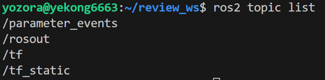
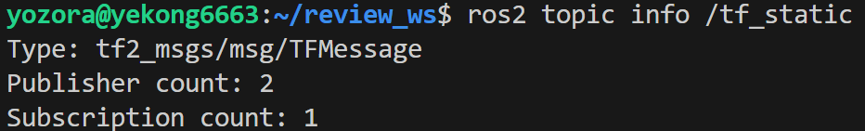
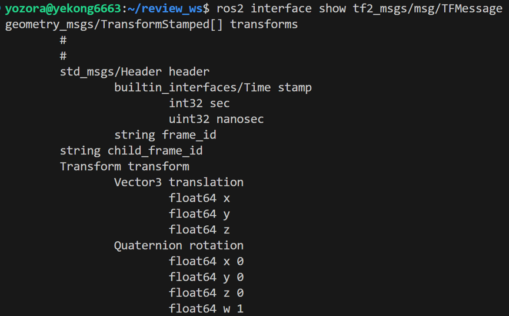
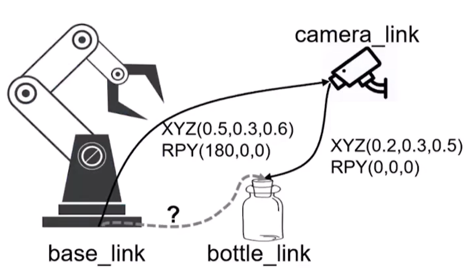

# 第五章 工具

## 5.1 坐标变换工具

### 5.1.1 通过命令使用 TF

#### TF 简介

已知机器人基坐标系 `base_link` 和雷达坐标系 `base_laser` 之间的位置关系为 `(0.1, 0.0, 0.2)`，雷达检测到坐标 `(0.3, 0.0, 0.0)` 处有障碍物。此时对于机器人基坐标系 `base_link` 来说，障碍物的坐标是什么？

当 `base_laser` 的角度发生变化时，坐标计算的难度将会变大，此时需要借助 **TF** 进行精确计算。

#### 常用指令

##### 发布静态变换

**基本格式：**
```bash
ros2 run tf2_ros static_transform_publisher \
  --x ... --y ... --z ... \
  --roll ... --pitch ... --yaw ... \
  --frame-id ... --child-id ...
```

| 参数 | 说明 |
| :--- | :--- |
| `--x --y --z` | 平移距离（m），实数值 |
| `--roll --pitch --yaw` | 轴旋转角度（rad），实数值 |
| `--frame-id` | 父坐标系（基准点） |
| `--child-id` | 子坐标系（被描述对象） |

**旋转角说明：**
- **Roll（翻滚角）**：围绕 x 轴旋转
- **Pitch（俯仰角）**：围绕 y 轴旋转
- **Yaw（偏航角）**：围绕 z 轴旋转

**示例：**

发布 `base_link` 到 `base_laser` 的变换：
```bash
ros2 run tf2_ros static_transform_publisher \
  --x 0.1 --y 0.0 --z 0.2 \
  --roll 0.0 --pitch 0.0 --yaw 0.0 \
  --frame-id base_link --child-frame-id base_laser
```

发布 `base_laser` 到 `wall_point` 的变换：
```bash
ros2 run tf2_ros static_transform_publisher \
  --x 0.3 --y 0.0 --z 0.0 \
  --roll 0.0 --pitch 0.0 --yaw 0.0 \
  --frame-id base_laser --child-frame-id wall_point
```

返回信息示例：
```
[INFO] [static_transform_publisher]: Spinning until stopped - publishing transform
translation: ('0.300000', '0.000000', '0.000000')
rotation: ('0.000000', '0.000000', '0.000000', '1.000000')
from 'base_laser' to 'wall_point'
```

> **注意：** 换行输入必须加 `\`；`--` 与后面的参数不可以有空格。


##### 查询 TF 关系

**基本格式：**
```bash
ros2 run tf2_ros tf2_echo <id1> <id2>
```

**示例：** 查询 `base_link` 到 `wall_point` 的关系
```bash
ros2 run tf2_ros tf2_echo base_link wall_point
```

返回信息：
```
At time 0.0
- Translation: [0.400, 0.000, 0.200]
- Rotation: in Quaternion [0.000, 0.000, 0.000, 1.000]
- Rotation: in RPY (radian) [0.000, -0.000, 0.000]
- Rotation: in RPY (degree) [0.000, -0.000, 0.000]
- Matrix:
   1.000  0.000  0.000  0.400
   0.000  1.000  0.000  0.000
   0.000  0.000  1.000  0.200
   0.000  0.000  0.000  1.000
```

**变换矩阵解读：**

| 区域 | 符号 | 数值 | 含义 |
| :--- | :--- | :--- | :--- |
| 左上 3×3 | R | 单位阵 | 无旋转，姿态完全一致 |
| 右上 3×1 | t | [0.4, 0.0, 0.2] | 沿 x +0.4m，沿 z +0.2m |
| 左下 1×3 | 0ᵗ | [0, 0, 0] | 纯刚体变换，恒为 0 |
| 右下 1×1 | 1 | 1 | 齐次分量，保持 4D→3D 映射 |

#### 可视化工具

**安装：**
```bash
sudo apt install ros-humble-mrpt2 -y
```

**使用：**
```bash
3d-rotation-converter
```

| 输出格式 | 解释 |
| :--- | :--- |
| SO(3) rotation matrix | 3×3 旋转矩阵（MATLAB 风格） |
| Quaternion (w,x,y,z) | 四元数 `[w, x, y, z]` |
| Axis-angle (r,x,y,z) | 轴-角：单位向量 + 旋转角 |
| Axis with angle (log(R)) | 李群/李代数形式（log 映射） |

#### TF 树

生成 TF 树形图（PDF）：
```bash
ros2 run tf2_tools view_frames
```


### 5.1.2 TF 原理的简单探究
#### 运行构建代码
```bash
ros2 run tf2_ros static_transform_publisher
```


#### 查看 TF 话题

发布静态变换后，可通过以下命令查看：

```bash
# 查看所有话题
ros2 topic list

# 查看话题详细信息
ros2 topic info <话题名>

# 查看消息接口详情
ros2 interface show <消息路径>

# 订阅消息
ros2 topic echo <话题名>
```



## 5.2 Python TF 手眼坐标变换

### 需求描述

相机固定在 `camera_link` 处，机械臂底座固定在 `base_link` 处：

- `base_link` → `camera_link`：平移 `(0.5, 0.3, 0.6)`，旋转 `(180°, 0°, 0°)`（固定不变）
- 相机识别到瓶子 `bottle_link`：平移 `(0.2, 0.3, 0.5)`，旋转 `(0°, 0°, 0°)`

### 5.2.1 静态 TF 发布（底座→相机）

**安装依赖：**
```bash
sudo apt install ros-$ROS_DISTRO-tf-transformations
```

**创建功能包：**
```bash
ros2 pkg create <package_name> --build-type ament_python --dependencies rclpy geometry_msgs tf2_ros tf_transformations
```

#### 核心库说明

| 库 | 作用 |
| :--- | :--- |
| `tf2_ros` | 提供 `StaticTransformBroadcaster`（静态坐标发布器） |
| `geometry_msgs.msg` | 几何信息消息类型（Point、Pose、Transform 等） |
| `tf_transformations` | 提供 `quaternion_from_euler`（欧拉角→四元数） |
| `math` | 角度→弧度转换 |

#### 代码实现

```python
import rclpy
from rclpy.node import Node
from geometry_msgs.msg import TransformStamped
from tf2_ros import StaticTransformBroadcaster
from tf_transformations import quaternion_from_euler
import math

class StaticTFPublisher(Node):
    def __init__(self):
        super().__init__('static_tf_publisher')
        # 创建静态广播器
        self.tf_broadcaster = StaticTransformBroadcaster(self)
        self.publish_static_tf()

    def publish_static_tf(self):
        # 创建 TransformStamped 消息
        t = TransformStamped()
        t.header.stamp = self.get_clock().now().to_msg()
        t.header.frame_id = 'base_link'
        t.child_frame_id = 'camera_link'

        # 平移
        t.transform.translation.x = 0.5
        t.transform.translation.y = 0.3
        t.transform.translation.z = 0.6

        # 旋转：欧拉角 → 四元数
        q = quaternion_from_euler(
            math.radians(180.0),
            math.radians(0.0),
            math.radians(0.0)
        )
        t.transform.rotation.x = q[0]
        t.transform.rotation.y = q[1]
        t.transform.rotation.z = q[2]
        t.transform.rotation.w = q[3]

        # 发布
        self.tf_broadcaster.sendTransform(t)
```

### 5.2.2 动态 TF 发布（相机→瓶子）

```python
from tf2_ros import TransformBroadcaster

class DynamicTFPublisher(Node):
    def __init__(self):
        super().__init__('dynamic_tf_publisher')
        self.tf_broadcaster = TransformBroadcaster(self)
        # 创建定时器，周期性发布
        self.timer = self.create_timer(0.1, self.publish_dynamic_tf)

    def publish_dynamic_tf(self):
        t = TransformStamped()
        t.header.stamp = self.get_clock().now().to_msg()
        t.header.frame_id = 'camera_link'
        t.child_frame_id = 'bottle_link'

        t.transform.translation.x = 0.2
        t.transform.translation.y = 0.3
        t.transform.translation.z = 0.5

        # 无旋转
        t.transform.rotation.x = 0.0
        t.transform.rotation.y = 0.0
        t.transform.rotation.z = 0.0
        t.transform.rotation.w = 1.0

        self.tf_broadcaster.sendTransform(t)
```

**查看发布频率：**
```bash
ros2 topic hz <话题名>
```

### 5.2.3 Python 查询 TF 关系

#### 原理
订阅 `/tf` 和 `/tf_static` 话题，收集所有坐标系关系并进行计算。

#### 核心库

| 库 | 作用 |
| :--- | :--- |
| `TransformListener` | 监听 TF 变换（类似订阅者） |
| `Buffer` | 缓存 TF 数据供监听器使用 |
| `euler_from_quaternion` | 四元数→欧拉角转换 |

#### 代码实现

```python
from tf2_ros import Buffer, TransformListener
from tf_transformations import euler_from_quaternion

class TFLookupNode(Node):
    def __init__(self):
        super().__init__('tf_lookup_node')
        # 创建缓冲区和监听器
        self.tf_buffer = Buffer()
        self.tf_listener = TransformListener(self.tf_buffer, self)
        # 定时查询
        self.timer = self.create_timer(1.0, self.lookup_tf)

    def lookup_tf(self):
        try:
            # 查询变换
            t = self.tf_buffer.lookup_transform(
                'base_link',          # 目标坐标系
                'bottle_link',        # 源坐标系
                rclpy.time.Time(seconds=0.0),  # 最新数据
                rclpy.time.Duration(seconds=1.0)  # 超时时间
            )

            # 获取平移
            trans = t.transform.translation
            self.get_logger().info(f'Translation: x={trans.x}, y={trans.y}, z={trans.z}')

            # 四元数 → 欧拉角
            rot = t.transform.rotation
            roll, pitch, yaw = euler_from_quaternion([rot.x, rot.y, rot.z, rot.w])
            self.get_logger().info(f'RPY: roll={roll:.2f}, pitch={pitch:.2f}, yaw={yaw:.2f}')

        except Exception as e:
            self.get_logger().warn(f'TF lookup failed: {e}')
```

> **注意：** TF 查询随时可能失败（找不到帧、未收到数据、超时），必须使用 `try/except` 捕获异常，防止节点崩溃。


## 5.3 C++ 坐标变换

### 5.3.1 C++ 静态 TF 发布

**依赖配置（package.xml）：**
```xml
<depend>rclcpp</depend>
<depend>tf2_ros</depend>
<depend>tf2_geometry_msgs</depend>
<depend>geometry_msgs</depend>
```

**CMakeLists.txt：**
```cmake
find_package(rclcpp REQUIRED)
find_package(tf2_ros REQUIRED)
find_package(tf2_geometry_msgs REQUIRED)
find_package(geometry_msgs REQUIRED)

ament_target_dependencies(${PROJECT_NAME}
  rclcpp
  tf2_ros
  tf2_geometry_msgs
  geometry_msgs
)
```

#### 代码实现

```cpp
#include <rclcpp/rclcpp.hpp>
#include <geometry_msgs/msg/transform_stamped.hpp>
#include <tf2_ros/static_transform_broadcaster.h>
#include <tf2_geometry_msgs/tf2_geometry_msgs.hpp>
#include <tf2/LinearMath/Quaternion.h>

class StaticTfPublisher : public rclcpp::Node {
public:
    StaticTfPublisher() : Node("static_tf_publisher") {
        // 创建静态广播器
        tf_broadcaster_ = std::make_shared<tf2_ros::StaticTransformBroadcaster>(this);
        publish_static_tf();
    }

private:
    void publish_static_tf() {
        geometry_msgs::msg::TransformStamped t;

        t.header.stamp = this->get_clock()->now();
        t.header.frame_id = "base_link";
        t.child_frame_id = "camera_link";

        // 平移
        t.transform.translation.x = 0.5;
        t.transform.translation.y = 0.3;
        t.transform.translation.z = 0.6;

        // 旋转：欧拉角 → 四元数
        tf2::Quaternion q;
        q.setRPY(M_PI, 0.0, 0.0);  // 180° 弧度
        t.transform.rotation = tf2::toMsg(q);

        tf_broadcaster_->sendTransform(t);
    }

    std::shared_ptr<tf2_ros::StaticTransformBroadcaster> tf_broadcaster_;
};
```

**关键点说明：**

| 要点 | 说明 |
| :--- | :--- |
| `tf2::Quaternion q` | 声明 tf2 四元数对象 |
| `q.setRPY(roll, pitch, yaw)` | 欧拉角赋值（弧度制） |
| `M_PI` | π 常量（全大写） |
| `tf2::toMsg(q)` | tf2 类型 → ROS 消息类型 |
| `std::make_shared<>` | 创建共享指针 |


### 5.3.2 C++ 动态 TF 发布

```cpp
#include <tf2_ros/transform_broadcaster.h>

class DynamicTfPublisher : public rclcpp::Node {
public:
    DynamicTfPublisher() : Node("dynamic_tf_publisher") {
        tf_broadcaster_ = std::make_shared<tf2_ros::TransformBroadcaster>(this);
        timer_ = this->create_wall_timer(
            std::chrono::milliseconds(100),
            std::bind(&DynamicTfPublisher::publish_dynamic_tf, this)
        );
    }

private:
    void publish_dynamic_tf() {
        geometry_msgs::msg::TransformStamped t;
        t.header.stamp = this->get_clock()->now();
        t.header.frame_id = "camera_link";
        t.child_frame_id = "bottle_link";

        t.transform.translation.x = 0.2;
        t.transform.translation.y = 0.3;
        t.transform.translation.z = 0.5;

        t.transform.rotation.x = 0.0;
        t.transform.rotation.y = 0.0;
        t.transform.rotation.z = 0.0;
        t.transform.rotation.w = 1.0;

        tf_broadcaster_->sendTransform(t);
    }

    std::shared_ptr<tf2_ros::TransformBroadcaster> tf_broadcaster_;
    rclcpp::TimerBase::SharedPtr timer_;
};
```

### 5.3.3 C++ 查询 TF 关系

#### 代码实现

```cpp
#include <tf2_ros/buffer.h>
#include <tf2_ros/transform_listener.h>
#include <tf2/LinearMath/Quaternion.h>
#include <tf2_geometry_msgs/tf2_geometry_msgs.hpp>

class TFLookupNode : public rclcpp::Node {
public:
    TFLookupNode() : Node("tf_lookup_node") {
        // 创建缓冲区和监听器
        tf_buffer_ = std::make_shared<tf2_ros::Buffer>(this->get_clock());
        tf_listener_ = std::make_shared<tf2_ros::TransformListener>(*tf_buffer_, this);

        timer_ = this->create_wall_timer(
            std::chrono::seconds(1),
            std::bind(&TFLookupNode::lookup_tf, this)
        );
    }

private:
    void lookup_tf() {
        try {
            // 查询变换
            auto t = tf_buffer_->lookupTransform(
                "base_link",          // 目标坐标系
                "bottle_link",        // 源坐标系
                this->get_clock()->now(),
                rclcpp::Duration::from_seconds(1.0)
            );

            // 获取平移
            auto& trans = t.transform.translation;
            RCLCPP_INFO(this->get_logger(),
                "Translation: x=%.2f, y=%.2f, z=%.2f",
                trans.x, trans.y, trans.z);

            // 四元数 → 欧拉角
            auto& rot = t.transform.rotation;
            double roll, pitch, yaw;
            tf2::Quaternion q(rot.x, rot.y, rot.z, rot.w);
            tf2::getEulerYPR(q, yaw, pitch, roll);

            RCLCPP_INFO(this->get_logger(),
                "RPY: roll=%.2f, pitch=%.2f, yaw=%.2f",
                roll, pitch, yaw);

        } catch (const std::exception& e) {
            RCLCPP_WARN(this->get_logger(), "TF lookup failed: %s", e.what());
        }
    }

    std::shared_ptr<tf2_ros::Buffer> tf_buffer_;
    std::shared_ptr<tf2_ros::TransformListener> tf_listener_;
    rclcpp::TimerBase::SharedPtr timer_;
};
```


## 5.4 常用可视化工具

### 5.4.1 rqt

ROS 2 的图形化调试工具集。

**启动：**
```bash
rqt
```

常用插件：
- `rqt_graph`：节点/话题关系图
- `rqt_plot`：数据曲线绘图
- `rqt_console`：日志查看
- `rqt_tf_tree`：TF 树可视化

### 5.4.2 RViz

ROS 可视化工具，用于三维数据展示。

**启动：**
```bash
rviz2
```

**常用显示类型：**
- TF：显示坐标系
- RobotModel：机器人模型
- LaserScan：激光雷达数据
- Image：图像数据
- Marker：自定义标记