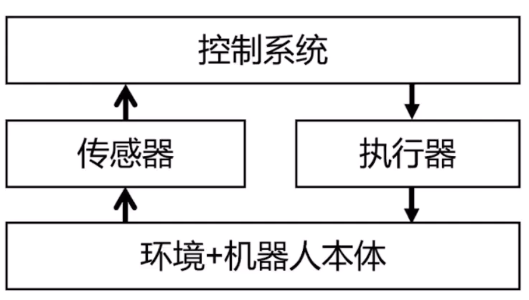
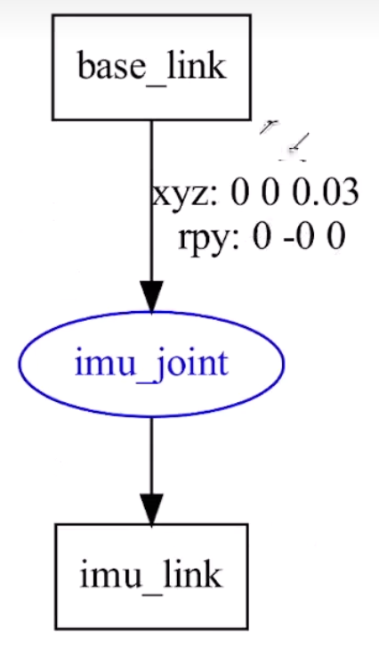
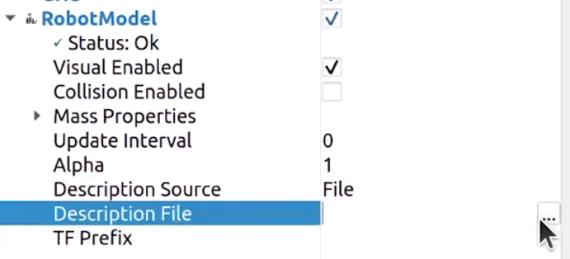
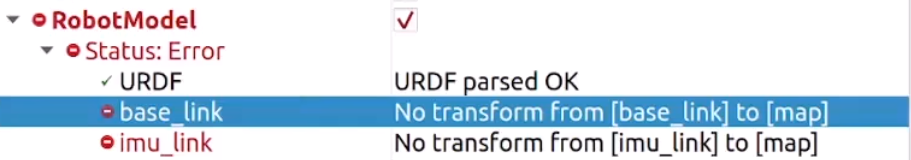
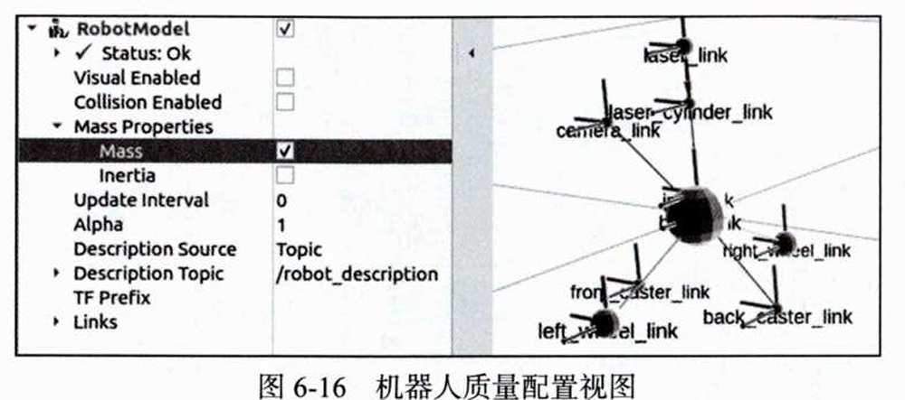
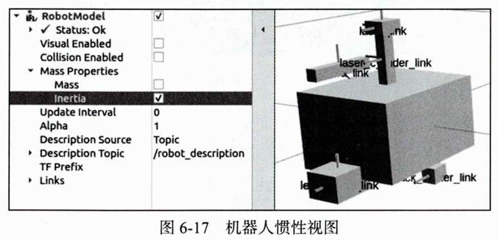
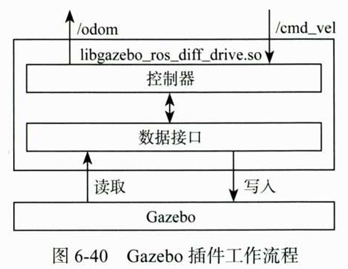
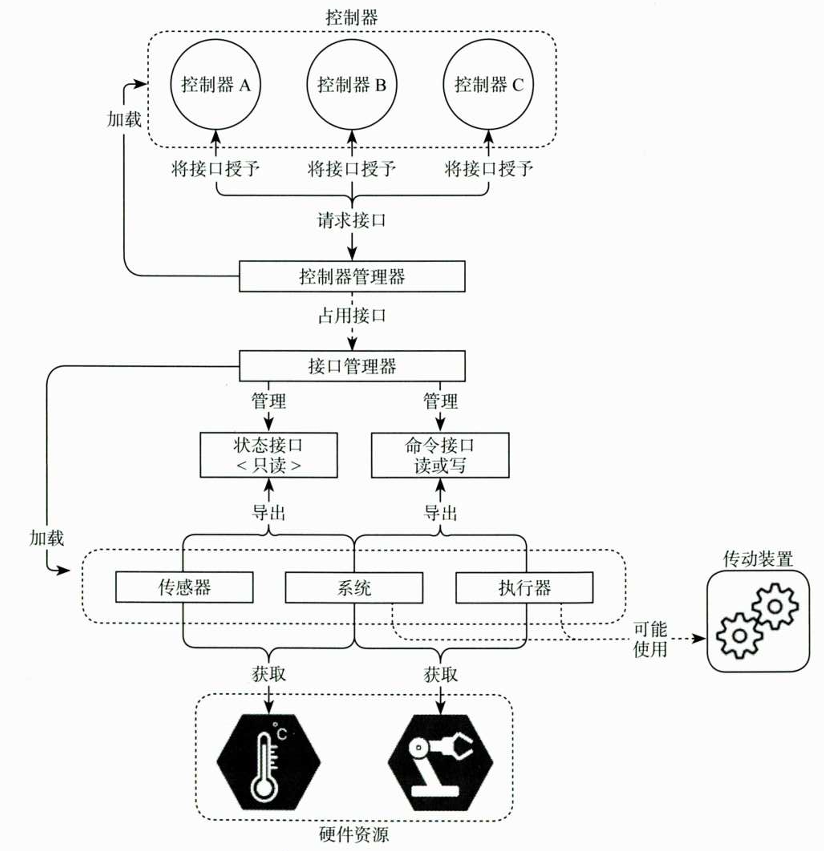

# 第六章 仿真
## 6.1 机器人的建模与仿真概述
### 6.1.1 移动机器人的结构

### 6.1.2 常用机器人的仿真平台——gazebo

## 6.2 使用URDF创建机器人
### 6.2.1 创建身体
#### URDF概述
URDF（Unified Robot Description Format，统一机器人描述格式），底层基于 **XML 可扩展标记语言**，专门用于完整描述机器人：
- 机械几何结构（连杆外形、尺寸、质量惯性）
- 关节传动关系（旋转/平移关节、限位、减速比）
- 搭载传感器、执行器安装位置与参数
- 碰撞、视觉渲染、物理仿真相关配置

#### **示例代码逐行解析**
```xml
<?xml version="1.0"?>
<!-- XML 文件头部声明，指定版本1.0，必须放在文件最顶部 -->
<robot name="first_robot">
    <!-- XML 注释，仅用于代码说明，程序解析时会自动忽略 -->
    <link name="base_link"></link>
    <!-- link 标签：代表机器人刚性连杆（刚体）
         name="base_link"：机器人基座连杆，是整个机器人的根坐标系，必不可少 -->
</robot>
```
**关键标签说明**
1. `<robot>`：根标签，整个机器人模型的容器，`name` 属性为机器人全局名称；
2. `<link>`：连杆单元，对应机器人一块不会形变的刚体（底盘、轮子、机械臂杆、摄像头支架等）；
3. XML 注释语法：`<!-- 注释内容 -->`，不能使用 `//`、`/* */` 这类C语言注释。

#### **代码操作**
**构建功能包**
```bash
ros2 pkg create fishbot_description --build-type ament_cmake --license Apache-2.0
```
一般会在该功能包下新建`URDF`文件夹专门存放，再次之下创建`.urdf`文件

**代码编写**
>注意urdf语言有对应的插件可以安装
```xml
<?xml version="1.0"?>
<robot name="first_robot">

    <!-- 机器人的身体部分 -->
    <link name="base_link">
        <!-- 部件的外观描述 -->
        <visual>
            <!-- 沿着自己几何中心的偏移和旋转量 -->
            <origin xyz="0.0 0.0 0.0" rpy="0.0 0.0 0.0"/>
            <!-- 几何形状 -->
            <geometry>
                <!-- 圆柱体 radius半径0.10m 高度length0.12m -->
                <cylinder radius="0.10" length="0.12"/>
            </geometry>
            <!-- 材质颜色 -->
            <material name="">
                <color rgba="1.0 1.0 1.0 0.5"/>
            </material>
        </visual>
    </link>

    <!-- 机器人的U形部件，惯性测量传感器 -->
    <link name="imu_link">
        <!-- 部件的外观描述 -->
        <visual>
            <!-- 沿着自己几何中心的偏移和旋转量 -->
            <origin xyz="0.0 0.0 0.0" rpy="0.0 0.0 0.0"/>
            <!-- 几何形状 -->
            <geometry>
                <box size="0.02 0.02 0.02"/>
            </geometry>
            <!-- 材质颜色 -->
            <material name="black">
                <color rgba="0.0 0.0 0.0 0.5"/>
            </material>
        </visual>
    </link>

    <!-- 机器人的关节，用于组合机器人的部件 -->
    <joint name="imu_joint" type="fixed">
        <parent link="base_link"/>
        <child link="imu_link"/>
        <origin xyz="0.0 0.0 0.03" rpy="0.0 0.0 0.0"/>
    </joint>

</robot>

```
**结构可视化**
在`urdf`文件夹下,输入：
```bash
urdf_to_graphviz.sh 文件名.urdf
```
可以生产对应的pdf结构图：

### 6.2.2 在RViz中显示机器人
#### 操作步骤
**启动 RViz**
```bash
rviz2
```
**添加 RobotModel 显示插件**
在 RViz 中：
- 点击左下角 Add 按钮
- 选择 By display type → RobotModel
- 点击 OK
- 修改RobotModel下Description Source为File而非Topic
- 点击出现的`...`按钮，选择`.urdf`文件


**更改参考坐标系**
默认情况下会报错：
是因为`global options`中的`fixed frmae`选择了不存在的`map`参考系
此时可以将其修改为`base_link`即可。但是需要注意的是，rviz2不会加载`joint`组件，需要我们自行加载。

**加载`joint`组件**
安装
```bash
sudo apt install ros-$ROS_DISTRO-joint-state-publisher
sudo apt install ros-$ROS_DISTRO-robot-state-publisher
```
| 项目 | joint_state_publisher | robot_state_publisher |
| ---- | ---- | ---- |
| 安装命令 | `sudo apt install ros-$ROS_DISTRO-joint-state-publisher` | `sudo apt install ros-$ROS_DISTRO-robot-state-publisher` |
| 核心作用 | 发布机器人各关节的角度状态数据 | 根据关节角度与URDF模型，计算并发布所有连杆之间的TF坐标变换 |
| 使用场景 | RViz可视化URDF时，存在可活动关节（非fixed固定关节），依靠该节点输出关节角度 | RViz加载URDF模型**必需节点**，将连杆位姿发布至`/tf`话题，供可视化、导航、定位模块读取坐标关系 |
| 依赖关系 | 无强制前置依赖 | 依赖joint_state_publisher输出的关节角度数据完成TF解算 |

**使用launch文件开启`joint_state_publisher`与`robot_state_publisher`节点**
在本功能包的CMakeList下填写：
```cmake
install(DIRECTORY launch urdf
    DESTINATION share/${PROJECT_NAME}
)
```
在本功能包下新建`launch`文件夹，在新建`.launch.py`文件
```py
# fish_robot.urdf
# display_robot.launch.py
# CMakeLists.txt

# ws > src > fishbot_description > launch > display_robot.launch.py > generate_launch_description

import launch
import launch_ros

# 获取功能包安装路径
from ament_index_python.packages import get_package_share_directory  
import os

import launch_ros.parameter_descriptions


def generate_launch_description():
    # ========== 1. 获取默认 URDF 路径 ==========
    urdf_package_path = get_package_share_directory("fishbot_description")
    default_urdf_path = os.path.join(urdf_package_path, 'urdf', 'fish_robot.urdf')

    # ========== 2. 声明 launch 参数 ==========
    action_declare_arg_model = launch.actions.DeclareLaunchArgument(
        name='model',
        default_value=str(default_urdf_path),
        description='加载的模型文件路径'
    )

    # ========== 3. 构建读取 URDF 内容的命令 ==========
    # 因为需要传入的是URDF文件的内容，而非其路径
    command_cat_urdf = launch.substitutions.Command(
        ['cat ', launch.substitutions.LaunchConfiguration('model')]
    )

    # ========== 4. 将命令结果包装为参数值 ==========
    robot_description_value = launch_ros.parameter_descriptions.ParameterValue(
        command_cat_urdf,
        value_type=str
    )

    # ========== 5. 创建 robot_state_publisher 节点 ==========
    # 订阅 /joint_states，计算并发布 TF
    # 原本 ros2 run robot_state_publisher robot_state_publisher可以运行
    # 但是其需要附加上特定的参数——robot_description
    # 需要传入URDF文件的详细内容作为参数
    # 参数名是固定的与参数值即robot_description_value
    action_robot_state_publisher = launch_ros.actions.Node(
        package='robot_state_publisher',
        executable='robot_state_publisher',
        parameters=[{'robot_description': robot_description_value}]
    )

    # ========== 6. 创建 joint_state_publisher 节点 ==========
    # 发布关节状态（默认所有关节角度为 0）
    # 原本 ros2 run joint_state_publisher joint_state_publisher可以运行
    action_joint_state_publisher = launch_ros.actions.Node(
        package='joint_state_publisher',
        executable='joint_state_publisher'
    )

    # ========== 7. 创建 RViz2 节点 ==========
    # 原本 ros2 run rviz2 rviz2可以运行
    action_rviz_node = launch_ros.actions.Node(
        package='rviz2',
        executable='rviz2'
    )

    # ========== 8. 返回 LaunchDescription ==========
    return launch.LaunchDescription([
        action_declare_arg_model,
        action_joint_state_publisher,    
        action_robot_state_publisher,
        action_rviz_node,
    ])
```
**重新运行**
之后运行launch文件
```python
ros2 launch fishbot_description display_robot.launch.py
```
即可打开所有节点，传入URDF，运行Rviz2.重新如同之前一样操作（RobotModel、File加载、Global Options）
也可以保存配置目录（file、save configure as），可以在功能包下新建config文件夹存放，并且修改launch文件
```python

    default_config_path = os.path.join(urdf_package_path, 'config', 对应的配置文件全名)

    action_rviz_node = launch_ros.actions.Node(
        package='rviz2',
        executable='rviz2',
        arguments=['-d'， default_config_path]
    )

# arguments与parameter不同，相当于在命令行运行时加上由arguments拼接的参数
# 即 ros2 run rviz2 rviz2 -d default_config_path
```

### 6.2.3 使用Xacro简化URDF
#### Xacro概述
Xacro 可以把重复的 URDF 代码打包成“宏”，传不同参数就能生成不同部件，省去复制粘贴。

#### Xacro语法
##### 命名空间声明（必须）
```xml
<robot xmlns:xacro="http://www.ros.org/wiki/xacro" name="robot_name">
```
**作用**：告诉解析器这是一个 Xacro 文件，启用宏功能。

##### 宏定义
```xml
<xacro:macro name="宏名称" params="参数1 参数2 参数3">
    <!-- 这里写 URDF 代码，用 ${参数名} 引用传进来的值 -->
</xacro:macro>
```

| 部分 | 说明 |
| :--- | :--- |
| `name` | 宏的名字，调用时用 |
| `params` | 参数列表，用空格分隔 |
| `${参数名}` | 在宏内部引用参数值 |
| `</xacro:macro>` | **必须用闭合标签**，不能自闭合 |

##### 宏调用
```xml
<xacro:宏名称 参数1="值1" 参数2="值2" />
```

**示例**：
```xml
<!-- 定义 -->
<xacro:macro name="wheel" params="radius length">
    <link name="wheel_link">
        <visual>
            <geometry>
                <cylinder radius="${radius}" length="${length}"/>
            </geometry>
        </visual>
    </link>
</xacro:macro>

<!-- 调用 -->
<xacro:wheel radius="0.1" length="0.05"/>
```

##### 变量引用 `${}`
```xml
<!-- 在宏内部 -->
<origin xyz="0 0 ${height}" />
<link name="${prefix}_link" />
```

| 写法 | 含义 |
| :--- | :--- |
| `${参数名}` | 引用宏参数 |
| `${prefix}_link` | 字符串拼接（结果如 `left_wheel_link`） |

##### 数学表达式（高级）

```xml
<origin xyz="0 0 ${radius * 2}" />
<cylinder radius="${radius * 1.5}" length="${length / 2}" />
```

支持 `+`、`-`、`*`、`/` 等基本运算。

##### 文件包含（模块化）

```xml
<xacro:include filename="$(find my_pkg)/urdf/common.xacro" />
```

**作用**：把多个 Xacro 文件拆开，方便复用。比如把**颜色定义**、**传感器**、**关节**等分别放在不同文件里。

##### 条件判断（可选）

```xml
<xacro:if value="${use_camera}">
    <!-- 如果 use_camera 为 true，就包含这段代码 -->
    <xacro:include filename="camera.xacro" />
</xacro:if>
```

##### 常量定义

```xml
<xacro:property name="wheel_radius" value="0.1" />
<xacro:property name="wheel_length" value="0.05" />
```

**作用**：定义全局常量，在宏中引用 `${wheel_radius}`，方便统一修改。

---

##### 常用语法速查表

| 语法 | 示例 | 说明 |
| :--- | :--- | :--- |
| 声明命名空间 | `xmlns:xacro="http://www.ros.org/wiki/xacro"` | 必须加在 `<robot>` 标签中 |
| 定义宏 | `<xacro:macro name="M" params="a b">` | 定义可复用模板 |
| 闭合宏 | `</xacro:macro>` | **不能自闭合** |
| 调用宏 | `<xacro:M a="1" b="2"/>` | 生成实际代码 |
| 引用变量 | `${a}` | 获取参数值 |
| 字符串拼接 | `${prefix}_link` | 生成如 `left_link` |
| 数学运算 | `${radius * 2}` | 支持四则运算 |
| 包含文件 | `<xacro:include filename="path.xacro"/>` | 模块化拆分 |
| 条件判断 | `<xacro:if value="${flag}">` | 按条件包含代码 |
| 常量定义 | `<xacro:property name="pi" value="3.14159"/>` | 全局常量 |


#### Xacro的代码实现
在6.2.2的`urdf`文件夹下创建`.xacro`文件，将原本的`.urdf`文件修改为`.xacro`文件
```xml
<?xml version="1.0"?>
<!-- 机器人的总标题需要修改，加上xmlns:xacro="http://www.ros.org/wiki/xacro" -->
<robot xmlns:xacro="http://www.ros.org/wiki/xacro" name="first_robot">

    <!-- ========== 1. 定义 base_link 宏 ========== -->
    <!-- 作用：生成机器人身体（圆柱体） -->
    <!-- 参数：length（圆柱高度），radius（圆柱半径） -->

    <xacro:macro name="base_link" params="length radius"> <!-- 在声明宏前需要声明宏名称与参数 -->

        <!-- 余下编写同.urdf文件，不过相应的参数使用${参数}来代替 -->
        <link name="base_link">
            <visual>
                <origin xyz="0.0 0.0 0.0" rpy="0.0 0.0 0.0"/>
                <geometry>
                    <cylinder radius="${radius}" length="${length}"/>
                </geometry>
                <material name="white">
                    <color rgba="1.0 1.0 1.0 0.5"/>
                </material>
            </visual>
        </link>

    </xacro:macro>

    <!-- ========== 2. 定义 imu_link 宏 ========== -->
    <!-- 作用：生成 IMU 传感器部件（小立方体） -->
    <!-- 参数：imu_name（部件名称前缀），xyz（安装位置偏移） -->
    <!-- 在xacro文件中，使用宏生成的部件和关节名称必须是不重复，所以此处需要将连接名和关节名参数化 -->
    <xacro:macro name="imu_link" params="imu_name xyz">

        <link name="${imu_name}_link">
            <visual>
                <origin xyz="0.0 0.0 0.0" rpy="0.0 0.0 0.0"/>
                <geometry>
                    <box size="0.02 0.02 0.02"/>
                </geometry>
                <material name="black">
                    <color rgba="0.0 0.0 0.0 0.5"/>
                </material>
            </visual>
        </link>

        <!-- 定义关节：将 imu_link 固定在 base_link 上 -->
        <joint name="${imu_name}_joint" type="fixed">
            <parent link="base_link"/>
            <child link="${imu_name}_link"/>
            <origin xyz="${xyz}" rpy="0.0 0.0 0.0"/>
        </joint>

    </xacro:macro>

    <!-- ========== 3. 调用宏，生成实际部件 ========== -->
    <!-- 注意如果没有前后的<>、<\>而是中间省略的写法即下面的使用宏，需要在最后加上/ -->
    <!-- 生成身体：圆柱高 0.12m，半径 0.1m -->
    <xacro:base_link length="0.12" radius="0.1"/>

    <!-- 生成上方 IMU：安装在 base_link 正上方 0.03m 处 -->
    <xacro:imu_link imu_name="imu_up" xyz="0.0 0.0 0.03"/>

    <!-- 生成下方 IMU：安装在 base_link 正下方 0.03m 处 -->
    <xacro:imu_link imu_name="imu_down" xyz="0.0 0.0 -0.03"/>

</robot>
```
--
#### 将Xacro转化为urdf
Xacro文件无法直接使用，需要转化为urdf文件
```bash
# 安装工具
sudo apt install ros-$ROS_DISTRO-xacro

# 转换
xacro 文件路径
```
---
#### launch文件启动
修改一下6.2.2中的launch文件中
```python
    command_cat_urdf = launch.substitutions.Command(
        ['cat ', launch.substitutions.LaunchConfiguration('model')]
    )
```
为
```python
    command_cat_urdf = launch.substitutions.Command(
        ['xacro ', launch.substitutions.LaunchConfiguration('model')]
    )
```
只需要在命令行输入
```bash
ros2 launch fishbot_description display_robot.launch.py model:=xacro文件路径名
```

### 6.2.4 创建机器人及传感器部件
#### 传感器部件
在本章功能包的`urdf`文件夹下创建新的一个`fishbot`文件夹，再新建`base.xacro`；随后再创建一个专门用于存放传感器的文件夹`sensor`，创建文件`imu.xacro`、`camera.xacro`和`laser.xacro`
>注：文件后缀名也可以写成`.urdf.xacro`

##### base.xacro文件
```xml
<?xml version="1.0"?>
<!-- 由于只是定义一个模块，所以此处无需robot_name -->
<robot xmlns:xacro="http://www.ros.org/wiki/xacro">
    
    <!-- 定义 base_link 宏 -->
    <xacro:macro name="base_xacro" params="length radius">

        <link name="base_link">
            <visual>
                <origin xyz="0 0 0.0" rpy="0 0 0" />
                <geometry>
                    <cylinder length="${length}" radius="${radius}" />
                </geometry>
                <material name="white">
                    <color rgba="1.0 1.0 1.0 0.5"/>
                </material>
            </visual>
        </link>

    </xacro:macro>
    
</robot>
```
##### sensor文件下的imu.xacro
将6.2.3中的imu模块复制过来修改即可
```xml
<?xml version="1.0"?>
<!-- 由于只是定义一个模块，所以此处无需robot_name -->
<robot xmlns:xacro="http://www.ros.org/wiki/xacro">
    
    <!-- 定义 IMU 传感器宏 -->
    <xacro:macro name="imu_xacro" params="xyz">
        <link name="imu_link">
            <visual>
                <origin xyz="0 0 0" rpy="0 0 0" />
                <geometry>
                    <box size="0.02 0.02 0.02" />
                </geometry>
                <material name="black">
                    <color rgba="0 0 0 0.8" />
                </material>
            </visual>
        </link>
        
        <joint name="imu_joint" type="fixed">
            <parent link="base_link" />
            <child link="imu_link" />
            <!-- 修复：$(xyz) → ${xyz}，并补全 rpy -->
            <origin xyz="${xyz}" rpy="0 0 0" />
        </joint>
    </xacro:macro>
    
</robot>
```
##### sensor文件下的camere.xacro
```xml
<?xml version="1.0"?>
<!-- 由于只是定义一个模块，所以此处无需robot_name -->
<robot xmlns:xacro="http://www.ros.org/wiki/xacro">
    
    <!-- 定义相机传感器宏，具体细节同imu模块，只需要修改名称和位置即可 -->
    <xacro:macro name="camera_xacro" params="xyz">
        <!-- 相机部件 -->
        <link name="camera_link">
            <visual>
                <origin xyz="0 0 0.0" rpy="0 0 0" />
                <geometry>
                    <box size="0.02 0.10 0.02" />
                </geometry>
                <material name="green">
                    <color rgba="0.0 1.0 0.0 0.8" />
                </material>
            </visual>
        </link>
        
        <!-- 相机固定关节 -->
        <joint name="camera_joint" type="fixed">
            <parent link="base_link" />
            <child link="camera_link" />
            <origin xyz="${xyz}" rpy="0 0 0" />
        </joint>
    </xacro:macro>
    
</robot>
```
##### sensor文件夹下的laser.xacro
```xml
<?xml version="1.0"?>
<!-- 由于只是定义一个模块，所以此处无需robot_name -->
<robot xmlns:xacro="http://www.ros.org/wiki/xacro">
    
    <!-- 定义激光雷达宏 -->
    <xacro:macro name="laser_xacro" params="xyz">
        
        <!-- ====== 1. 雷达支撑杆 ====== -->
        <link name="laser_cylinder_link">
            <visual>
                <origin xyz="0 0 0" rpy="0 0 0" />
                <geometry>
                    <cylinder length="0.10" radius="0.01" />
                </geometry>
                <material name="green">
                    <color rgba="0.0 1.0 0.0 0.8" />
                </material>
            </visual>
        </link>
        
        <!-- 支撑杆固定关节（固定在 base_link 上） -->
        <!-- 雷达通过一个杆子固定在base上，所有有两个关节 -->
        <joint name="laser_cylinder_joint" type="fixed">
            <parent link="base_link" />
            <child link="laser_cylinder_link" />
            <!-- 修复：{$xyz} → ${xyz}，并补全 rpy -->
            <origin xyz="${xyz}" rpy="0 0 0" />
        </joint>
        
        <!-- ====== 2. 雷达主体 ====== -->
        <link name="laser_link">
            <visual>
                <origin xyz="0 0 0" rpy="0 0 0" />
                <geometry>
                    <cylinder length="0.02" radius="0.02" />
                </geometry>
                <material name="green">
                    <color rgba="0.0 1.0 0.0 0.8" />
                </material>
            </visual>
        </link>
        
        <!-- 雷达主体固定关节（固定在支撑杆顶端） -->
        <joint name="laser_joint" type="fixed">
            <parent link="laser_cylinder_link" />
            <child link="laser_link" />
            <origin xyz="0 0 0.05" rpy="0 0 0" />
        </joint>
        
    </xacro:macro>
    
</robot>
```

#### 机器人组装
在fishbot.xarco文件下
```xml
<?xml version="1.0"?>
<!-- 组装机器人需要name -->
<robot xmlns:xacro="http://www.ros.org/wiki/xacro" name="fishbot">
    
    <!-- ========== 1. 包含所有零部件宏文件 ========== -->
    <!-- 注意：使用 $(find 包名) 语法查找功能包路径，注意括号和空格 -->
    <!-- $(find fishbot_description)即功能包的共享目录 -->
    <!-- 后续填写上文件目录即可 -->
    <xacro:include filename="$(find fishbot_description)/urdf/fishbot/base.urdf.xacro" />
    
    <!-- 传感器组件 -->
    <xacro:include filename="$(find fishbot_description)/urdf/fishbot/sensor/imu.urdf.xacro" />
    <xacro:include filename="$(find fishbot_description)/urdf/fishbot/sensor/laser.urdf.xacro" />
    <xacro:include filename="$(find fishbot_description)/urdf/fishbot/sensor/camera.urdf.xacro" />

    <!-- ========== 2. 调用宏生成各部件 ========== -->
    <!-- 宏调用格式：<xacro:宏名称 参数1="值1" 参数2="值2" ... />   -->
    <!-- 机器人身体：高 0.12m，半径 0.10m -->
    <xacro:base_xacro length="0.12" radius="0.1" />
    
    <!-- 传感器安装 -->
    <xacro:imu_xacro xyz="0 0 0.02" />        <!-- IMU 安装在身体上方 0.02m -->
    <xacro:laser_xacro xyz="0 0 0.10" />      <!-- 激光雷达安装在身体上方 0.10m -->
    <xacro:camera_xacro xyz="0.10 0 0.075" /> <!-- 相机安装在身体前方 0.10m，上方 0.075m -->

</robot>
```
#### 效果展示
输入
```bash
ros2 launch fishbot_description display_robot.launch.py model:=/home/fishros/chapt6/chapt6_ws/install/fishbot_description/share/fishbot_description/urdf/fishbot/fishbot.urdf.xacro
```

### 6.2.5 完善机器人执行器部件
#### 执行器
在`urdf/fishbot`文件下新建`actuator`文件夹，在其中新建文件`wheel.xacro`和`caster.xacro`
##### fishbot/actuator/wheel.urdf.xacro
```xml
<?xml version="1.0"?>
<robot xmlns:xacro="http://www.ros.org/wiki/xacro">
    <!-- 定义车轮宏 -->
    <!-- wheel_name: 车轮名称前缀（如 left/right），xyz: 安装位置偏移 -->
    <xacro:macro name="wheel_xacro" params="wheel_name xyz">
        <!-- 车轮部件 -->
        <link name="${wheel_name}_wheel_link">
            <visual>
                <!-- 绕 X 轴旋转 90°（1.57079 弧度），让圆柱体的轴指向 Y 方向 -->
                <origin xyz="0 0 0" rpy="1.57079 0 0" />
                <geometry>
                    <cylinder length="0.04" radius="0.032" />
                </geometry>
                <material name="yellow">
                    <color rgba="1.0 1.0 0.0 0.8" />
                </material>
            </visual>
        </link>

        <!-- 车轮关节（连续旋转关节，可无限转动即为continuous） -->
        <joint name="${wheel_name}_wheel_joint" type="continuous">
            <parent link="base_link" />
            <child link="${wheel_name}_wheel_link" />
            <origin xyz="${xyz}" />
            <!-- 绕 Y 轴旋转（车轮滚动方向） -->
            <axis xyz="0 1 0" />
        </joint>
    </xacro:macro>
</robot>
```
##### fishbot/actuator/caster.urdf.xacro
```xml
<?xml version="1.0"?>
<robot xmlns:xacro="http://www.ros.org/wiki/xacro">
    <!-- 定义万向轮宏 -->
    <!-- caster_name: 万向轮名称前缀（如 front/back），xyz: 安装位置偏移 -->
    <xacro:macro name="caster_xacro" params="caster_name xyz">
        <!-- 万向轮部件 -->
        <link name="${caster_name}_caster_link">
            <visual>
                <origin xyz="0 0 0" rpy="0 0 0" />
                <geometry>
                    <!-- 万向轮：球体，半径 0.016m -->
                    <sphere radius="0.016" />
                </geometry>
                <material name="yellow">
                    <color rgba="1.0 1.0 0.0 0.8" />
                </material>
            </visual>
        </link>
        <!-- 万向轮关节（固定关节） -->
        <joint name="${caster_name}_caster_joint" type="fixed">
            <parent link="base_link" />
            <child link="${caster_name}_caster_link" />
            <origin xyz="${xyz}" />
            <!-- 固定关节不需要旋转轴，设为 0 0 0 -->
            <axis xyz="0 0 0" />
        </joint>
    </xacro:macro>
</robot>
```
#### 组装——fishbot/actuator/fishbot.urdf.xacro
```xml
<?xml version="1.0"?>
<robot xmlns:xacro="http://www.ros.org/wiki/xacro" name="fishbot">
    
    <!-- ========== 1. 包含宏文件 ========== -->
    <!-- 基础部件（身体） -->
    <xacro:include filename="$(find fishbot_description)/urdf/fishbot/base.urdf.xacro" />
    
    <!-- 传感器 -->
    <xacro:include filename="$(find fishbot_description)/urdf/fishbot/sensor/imu.urdf.xacro" />
    <xacro:include filename="$(find fishbot_description)/urdf/fishbot/sensor/laser.urdf.xacro" />
    <xacro:include filename="$(find fishbot_description)/urdf/fishbot/sensor/camera.urdf.xacro" />
    
    <!-- 执行器 -->
    <xacro:include filename="$(find fishbot_description)/urdf/fishbot/actuator/wheel.urdf.xacro" />
    <xacro:include filename="$(find fishbot_description)/urdf/fishbot/actuator/caster.urdf.xacro" />


    <!-- ========== 2. 调用宏生成各部件 ========== -->
    <!-- 机器人身体 -->
    <xacro:base_xacro length="0.12" radius="0.1" />
    
    <!-- 传感器 -->
    <xacro:imu_xacro xyz="0 0 0.02" />
    <xacro:laser_xacro xyz="0 0 0.10" />
    <xacro:camera_xacro xyz="0.10 0 0.075" />
    
    <!-- 执行器（主动轮 + 万向轮） -->
    <!-- 左轮：车身左侧 0.10m，下方 0.06m -->
    <xacro:wheel_xacro wheel_name="left" xyz="0 0.10 -0.06" />
    <!-- 右轮：车身右侧 0.10m，下方 0.06m -->
    <xacro:wheel_xacro wheel_name="right" xyz="0 -0.10 -0.06" />
    <!-- 轮子的半径刚好是base的一半 -->
    
    <!-- 前万向轮：车身前方 0.08m，下方 0.076m -->
    <xacro:caster_xacro caster_name="front" xyz="0.08 0.0 -0.076" />
    <!-- 后万向轮：车身后方 0.08m，下方 0.076m -->
    <xacro:caster_xacro caster_name="back" xyz="-0.08 0.0 -0.076" />

</robot>
```
### 6.2.6 贴合地面，添加虚拟部件

在仿真环境中，为了让机器人的轮子刚好贴合地面，同时为后续物理引擎提供一个准确的基准点，我们需要引入一个**虚拟部件（Virtual Link）**——`base_footprint`。
#### 问题现象：轮子陷入地面
在 RViz 中观察机器人时，如果直接将 `base_link` 的原点放在地面上，由于 `base_link` 通常是一个圆柱体，其几何中心位于圆柱体的中点，因此模型的下半部分会穿过地面，导致轮子看起来是陷入地下的。

#### 解决方案：添加 `base_footprint` 虚拟部件

`base_footprint` 是一个**空部件（Empty Link）**，它不包含任何几何形状，只作为一个坐标系参考点。它的作用是将机器人的**实际接地位置**与**视觉模型**分离开来。

- `base_footprint` 位于地面上（z = 0），代表机器人在世界中的真实位置。
- `base_link` 通过一个固定关节 `base_joint` 连接到 `base_footprint` 上方，偏移量为 `length/2.0 + 轮子半径 - 0.001`。

#### 修改后的 `base.urdf.xacro` 代码
在 `src/fishbot_description/urdf/fishbot/base.urdf.xacro` 中，添加以下内容：

```xml
<?xml version="1.0"?>
<robot xmlns:xacro="http://www.ros.org/wiki/xacro">
    <xacro:macro name="base_xacro" params="length radius">
        
        <!-- 1. 声明空部件 base_footprint（虚拟地面接触点） -->
        <!-- 虚拟存在，内容为空 -->
        <link name="base_footprint" />
        
        <!-- 2. 固定关节：将 base_link 连接在 base_footprint 上方 -->
        <!-- 其x、y与base_link相同；但是z -->
        <joint name="base_joint" type="fixed">
            <parent link="base_footprint" />
            <child link="base_link" />
            <!-- 高度偏移 = 身体高度的一半 + 轮子半径 - 1mm（让轮子刚好贴地） -->
            <origin xyz="0.0 0.0 ${length/2.0 + 0.032 - 0.001}" rpy="0 0 0" />
        </joint>

        <!-- 3. 原有的 base_link 定义 -->
        <link name="base_link">
            <visual>
                <origin xyz="0 0 0.0" rpy="0 0 0" />
                <geometry>
                    <cylinder length="${length}" radius="${radius}" />
                </geometry>
                <material name="white">
                    <color rgba="1.0 1.0 1.0 0.5" />
                </material>
            </visual>
        </link>
        
    </xacro:macro>
</robot>
```
#### RViz 配置调整

- 在 RViz 的 **Global Options** 中，将 **Fixed Frame** 从 `base_link` 改为 **`base_footprint`**。
- 此时，`base_footprint` 成为机器人的根坐标系，所有关节和部件的位置都基于此参考。

#### 验证结果

- 轮子不再陷入地面，而是刚好贴合地面。
- 机器人的移动和旋转将以 `base_footprint` 为基准，符合真实机器人的运动学特性。

## 6.3 添加物理属性让机器人更真实
### 6.3.1 为机器人部件添加碰撞属性
在 Gazebo 等物理仿真环境中，机器人需要与其他物体（如地面、障碍物）发生接触和碰撞。为了让物理引擎能够正确计算碰撞响应，必须在 URDF 中为每个部件**添加碰撞属性**。
#### 概念介绍

| 属性 | 作用 | 说明 |
| :--- | :--- | :--- |
| **visual** | 定义部件的**可视化外观** | 用于 RViz 等工具显示，不影响物理交互 |
| **collision** | 定义部件的**碰撞模型** | 用于 Gazebo 等物理引擎计算碰撞响应，可以简化形状以提升性能 |

> **注意**：`collision` 的形状可以与 `visual` 相同，也可以根据实际需要设置成更简单的几何体（如用盒体代替复杂网格），以降低计算开销。

#### 实现步骤
在 `link` 标签下添加 `collision` 子标签，内容与 `visual` 基本一致：

```xml
<?xml version="1.0"?>
<robot xmlns:xacro="http://www.ros.org/wiki/xacro">
    <xacro:macro name="base_xacro" params="length radius">
        
        <!-- base_footprint 虚拟地面接触点 -->
        <link name="base_footprint" />
        
        <!-- base_joint 固定关节 -->
        <joint name="base_joint" type="fixed">
            <parent link="base_footprint" />
            <child link="base_link" />
            <origin xyz="0.0 0.0 ${length/2.0 + 0.032 - 0.001}" rpy="0 0 0" />
        </joint>

        <!-- base_link 主体 -->
        <link name="base_link">
            <!-- 可视化外观 -->
            <visual>
                <origin xyz="0 0 0.0" rpy="0 0 0" />
                <geometry>
                    <cylinder length="${length}" radius="${radius}" />
                </geometry>
                <material name="white">
                    <color rgba="1.0 1.0 1.0 0.5" />
                </material>
            </visual>
            
            <!-- 碰撞属性（与 visual 一致） -->
            <collision>
                <origin xyz="0 0 0.0" rpy="0 0 0" />
                <geometry>
                    <cylinder length="${length}" radius="${radius}" />
                </geometry>
                <material name="white">
                    <color rgba="1.0 1.0 1.0 0.5" />
                </material>
            </collision>
        </link>
        
    </xacro:macro>
</robot>
```
#### 其他部件添加碰撞属性（轮子、传感器等）

使用同样的方法，在 `wheel.urdf.xacro`、`imu.urdf.xacro`、`laser.urdf.xacro`、`camera.urdf.xacro` 等文件中，为每个 `link` 添加 `<collision>` 标签。

#### 在 RViz 中验证碰撞模型

1. 重新构建并运行 launch 文件：
   ```bash
   colcon build --packages-select fishbot_description
   source install/setup.bash
   ros2 launch fishbot_description display_robot.launch.py
   ```

2. 在 RViz 中，打开 **RobotModel** 显示插件配置面板：
   - **取消勾选** `Visual Enabled` → 隐藏可视化外观
   - **勾选** `Collision Enabled` → 显示碰撞模型

3. 若碰撞模型与外观一致，说明添加成功（如图 6-14 所示）。

### 6.3.2 为机器人部件添加质量与惯性
在 Gazebo 等物理仿真环境中，机器人部件不仅需要碰撞属性，还需要**质量（mass）** 和**惯性（inertia）** 属性。质量决定重力响应，惯性决定旋转运动的加速度响应。

#### 惯性矩阵简介

惯性矩阵是一个 \(3 \times 3\) 的对称矩阵，用于描述物体在三维空间中的旋转惯性：

\[
I = 
\begin{pmatrix}
I_{xx} & I_{xy} & I_{xz} \\
I_{xy} & I_{yy} & I_{yz} \\
I_{xz} & I_{yz} & I_{zz}
\end{pmatrix}
\]

由于矩阵对称（\(I_{xy}=I_{yx}\)、\(I_{xz}=I_{zx}\)、\(I_{yz}=I_{zy}\)），因此只需要 6 个独立数据即可完整描述。


#### 常见几何体的惯性矩阵计算公式

| 几何体 | 参数 | 惯性矩阵 |
| :--- | :--- | :--- |
| **长方体** | 质量 \(m\)，宽 \(w\)，高 \(h\)，长 \(d\) | \(I_{xx} = \frac{m}{12}(h^2+d^2)\)，\(I_{yy} = \frac{m}{12}(w^2+d^2)\)，\(I_{zz} = \frac{m}{12}(w^2+h^2)\)，其余为 0 |
| **圆柱体** | 质量 \(m\)，半径 \(r\)，高度 \(h\) | \(I_{xx}=I_{yy} = \frac{m}{12}(3r^2+h^2)\)，\(I_{zz} = \frac{m r^2}{2}\)，其余为 0 |
| **球体** | 质量 \(m\)，半径 \(r\) | \(I_{xx}=I_{yy}=I_{zz} = \frac{2}{5} m r^2\)，其余为 0 |

#### 定义质量与惯性宏
在 `urdf/fishbot/` 目录下新建 `common_inertia.xacro` 文件，定义质量与惯性的宏：

```xml
<?xml version="1.0"?>
<robot xmlns:xacro="http://www.ros.org/wiki/xacro">

    <!-- 长方体惯性宏 -->
    <!-- m: 质量(kg), w: 宽(m), h: 高(m), d: 长(m) -->
    <xacro:macro name="box_inertia" params="m w h d">
        <inertial>
            <mass value="${m}" />
            <inertia ixx="${m/12.0 * (h*h + d*d)}" ixy="0.0" ixz="0.0"
                     iyy="${m/12.0 * (w*w + d*d)}" iyz="0.0"
                     izz="${m/12.0 * (w*w + h*h)}" />
        </inertial>
    </xacro:macro>

    <!-- 圆柱体惯性宏 -->
    <!-- m: 质量(kg), r: 半径(m), h: 高度(m) -->
    <xacro:macro name="cylinder_inertia" params="m r h">
        <inertial>
            <mass value="${m}" />
            <inertia ixx="${m/12.0 * (3*r*r + h*h)}" ixy="0.0" ixz="0.0"
                     iyy="${m/12.0 * (3*r*r + h*h)}" iyz="0.0"
                     izz="${m/2.0 * r*r}" />
        </inertial>
    </xacro:macro>

    <!-- 球体惯性宏 -->
    <!-- m: 质量(kg), r: 半径(m) -->
    <xacro:macro name="sphere_inertia" params="m r">
        <inertial>
            <mass value="${m}" />
            <inertia ixx="${2.0/5.0 * m * r*r}" ixy="0.0" ixz="0.0"
                     iyy="${2.0/5.0 * m * r*r}" iyz="0.0"
                     izz="${2.0/5.0 * m * r*r}" />
        </inertial>
    </xacro:macro>

</robot>
```


#### 为各个部件添加质量与惯性
- 在每个部件的`.xacro`文件中，首先导入上述的宏文件
- 再在<link>之中引用宏
```xml
<?xml version="1.0"?>
<robot xmlns:xacro="http://www.ros.org/wiki/xacro">
    
    <!-- 1. 导入惯性宏定义文件 -->
    <xacro:include filename="$(find fishbot_description)/urdf/fishbot/common_inertia.xacro" />
    
    <xacro:macro name="base_xacro" params="length radius">
        
        <!-- base_footprint 虚拟地面接触点 -->
        <link name="base_footprint" />
        
        <!-- base_joint 固定关节 -->
        <joint name="base_joint" type="fixed">
            <parent link="base_footprint" />
            <child link="base_link" />
            <origin xyz="0.0 0.0 ${length/2.0 + 0.032 - 0.001}" rpy="0 0 0" />
        </joint>

        <!-- base_link 主体 -->
        <link name="base_link">
            <!-- 可视化外观 -->
            <visual>
                <origin xyz="0 0 0.0" rpy="0 0 0" />
                <geometry>
                    <cylinder length="${length}" radius="${radius}" />
                </geometry>
                <material name="white">
                    <color rgba="1.0 1.0 1.0 0.5" />
                </material>
            </visual>
            
            <!-- 碰撞属性 -->
            <collision>
                <origin xyz="0 0 0.0" rpy="0 0 0" />
                <geometry>
                    <cylinder length="${length}" radius="${radius}" />
                </geometry>
            </collision>

            <!-- ✅ 添加质量与惯性（圆柱体惯性宏） -->
            <!-- 质量设为 1.0 kg，半径和高度由宏参数传入 -->
            <xacro:cylinder_inertia m="1.0" r="${radius}" h="${length}" />
        </link>
        
    </xacro:macro>
</robot>
```

#### 其他部件修改示例

**车轮（wheel.urdf.xacro）**：
```xml
<link name="${wheel_name}_wheel_link">
    <!-- visual、collision 保持不变 -->
    <xacro:cylinder_inertia m="0.05" r="0.032" h="0.04" />
</link>
```

**IMU（imu.urdf.xacro）**：
```xml
<link name="imu_link">
    <!-- visual、collision 保持不变 -->
    <xacro:box_inertia m="0.01" w="0.02" h="0.02" d="0.02" />
</link>
```

**万向轮（caster.urdf.xacro）**：
```xml
<link name="${caster_name}_caster_link">
    <!-- visual、collision 保持不变 -->
    <xacro:sphere_inertia m="0.015" r="0.016" />
</link>
```

---

#### 在 RViz 中查看质量和惯性

1. 重新构建并运行 launch：
   ```bash
   colcon build --packages-select fishbot_description
   source install/setup.bash
   ros2 launch fishbot_description display_robot.launch.py
   ```

2. 在 RViz 的 **RobotModel** 配置面板中：
   - 取消勾选 `Visual Enabled`，隐藏外观
   - 勾选 `Mass Properties` → 显示质量分布
   - 勾选 `Inertia` → 显示惯性张量

3. 将鼠标悬停在部件上，可以查看具体数值。


## 6.4 在 Gazebo 中完成机器人仿真
Gazebo 是 ROS 2 生态中最常用的物理仿真软件，支持刚体动力学、碰撞检测、传感器仿真等功能，与 ROS 2 的集成最为成熟。
### 6.4.1 安装与使用 Gazebo 构建世界
#### 安装 Gazebo

```bash
sudo apt install gazebo
```

#### 下载 Gazebo 模型库

```bash
mkdir -p ~/.gazebo
cd ~/.gazebo
git clone https://gitee.com/ohhuo/gazebo_models.git ~/.gazebo/models
rm -rf ~/.gazebo/models/.git   # 删除 .git 防止误识别为模型
```

#### 启动 Gazebo

```bash
gazebo
```

启动后默认加载空世界（Empty World）。

#### 插入模型

- 点击左侧 **Insert** 选项卡
- 选择模型（如 `Ambulance`）
- 在场景中单击即可放置
- 右键模型 → **Delete** 可移除

#### 构建自定义房间（Building Editor）

1. **进入编辑模式**：工具栏 → **Edit** → **Building Editor**
2. **绘制墙体**：左侧选择 **Create Walls** → **Wall**，在右上角绘制房间
3. **退出并保存**：选择 **File** → **Exit Building Editor**
   - 弹出对话框时选择 **Save and Exit**
   - 输入模型名称（如 `room`）
   - 选择保存位置：`fishbot_description` 功能包目录下新建 `world` 文件夹
   - 单击 **Save** 保存

#### 保存 Gazebo 世界

1. **File** → **Save World As**
2. 选择 `fishbot_description/world/` 目录
3. 命名为 `custom_room.world`
4. 单击 **Save**

下次启动时可直接加载该世界：

```bash
gazebo src/fishbot_description/world/custom_room.world
```

### SDF 文件格式简介

Gazebo 使用的模型描述格式为 **SDF（Simulation Description Format）**，它与 URDF 结构相似，但功能更丰富（支持光源、物理参数、传感器等）。

**世界文件（.world）** 和 **模型文件（model.sdf）** 均为 XML 格式：

```xml
<sdf version='1.7'>
    <world name='default'>
        <link name='link'>
            <collision name='collision'>
                <geometry>...</geometry>
            </collision>
            <visual name='visual'>
                <geometry>...</geometry>
                <material>...</material>
            </visual>
        </link>
    </world>
</sdf>
```

> **注意**：SDF 继承了 URDF 的 `<link>`、`<visual>`、`<collision>` 等标签，并扩展了更多仿真相关属性。

---

### 常用 Gazebo 命令总结

| 命令 | 作用 |
| :--- | :--- |
| `gazebo` | 启动 Gazebo（空世界） |
| `gazebo <世界文件路径>` | 加载指定世界文件 |
| `sudo apt install gazebo` | 安装 Gazebo |
| `killall gzserver` | 强制关闭 Gazebo 后端进程 |

### 6.4.2 在 Gazebo 中加载机器人模型

Gazebo 使用 SDF 格式描述模型，而机器人建模使用的是 URDF。ROS 2 提供了 `gazebo-ros-pkgs` 功能包，可自动完成 URDF 到 SDF 的转换。

#### 安装 gazebo-ros-pkgs 插件

```bash
sudo apt install ros-$ROS_DISTRO-gazebo-ros-pkgs
```

#### 创建 Gazebo 仿真启动文件

在 `src/fishbot_description/launch/` 下新建 `gazebo_sim.launch.py`：

```python
import launch
import launch_ros
from ament_index_python.packages import get_package_share_directory
from launch.launch_description_sources import PythonLaunchDescriptionSource

def generate_launch_description():
    # 获取功能包路径
    robot_name_in_model = "fishbot"
    urdf_tutorial_path = get_package_share_directory('fishbot_description')
    # 机器人xacro文件路径
    default_model_path = urdf_tutorial_path + '/urdf/fishbot/fishbot.urdf.xacro'
    # gazebo世界文件，.world
    default_world_path = urdf_tutorial_path + '/world/custom_room.world'

    # 声明 launch 参数（支持命令行传入模型路径）
    action_declare_arg_mode_path = launch.actions.DeclareLaunchArgument(
        name='model', default_value=str(default_model_path),
        description='URDF 的绝对路径'
    )

    # 使用 xacro 展开 URDF，生成 robot_description 参数
    robot_description = launch_ros.parameter_descriptions.ParameterValue(
        launch.substitutions.Command(
            ['xacro ', launch.substitutions.LaunchConfiguration('model')]
        ),
        value_type=str
    )

    # 启动 robot_state_publisher，发布 /robot_description 话题
    robot_state_publisher_node = launch_ros.actions.Node(
        package='robot_state_publisher',
        executable='robot_state_publisher',
        parameters=[{'robot_description': robot_description}]
    )

    # 包含 gazebo.launch.py（启动 Gazebo 并加载世界）
    # 使用该launch文件启动其他的launch文件
    launch_gazebo = launch.actions.IncludeLaunchDescription(
        PythonLaunchDescriptionSource(
            [get_package_share_directory('gazebo_ros'), '/launch', '/gazebo.launch.py']
        ),
        launch_arguments=[('world', "default_world_path"),('verbose','true')]
    )

    # 请求 Gazebo 加载机器人（从 /robot_description 话题获取 URDF）
    spawn_entity_node = launch_ros.actions.Node(
        package='gazebo_ros',
        executable='spawn_entity.py',
        arguments=[
            '-topic', '/robot_description',
            '-entity', robot_name_in_model,
        ]
    )

    return launch.LaunchDescription([
        action_declare_arg_mode_path,
        robot_state_publisher_node,
        launch_gazebo,
        spawn_entity_node
    ])
```

#### 关键节点说明

| 节点/操作 | 作用 |
| :--- | :--- |
| `robot_state_publisher` | 加载 URDF 并发布到 `/robot_description` 话题 |
| `IncludeLaunchDescription` | 包含 `gazebo.launch.py`，启动 Gazebo 并加载世界 |
| `spawn_entity.py` | 从 `/robot_description` 获取 URDF，转换为 SDF 并加载到 Gazebo |

#### 修改 CMakeLists.txt

确保 `world` 目录被安装到功能包目录下：

```cmake
install(DIRECTORY world launch urdf
    DESTINATION share/${PROJECT_NAME}
)
```

#### 启动 Gazebo 仿真

```bash
colcon build --packages-select fishbot_description
source install/setup.bash
ros2 launch fishbot_description gazebo_sim.launch.py
```

此时机器人在 Gazebo 中显示，但颜色为默认白色，因为部分 URDF 标签未自动转换。

### 6.4.3 使用 Gazebo 标签扩展 URDF

在 URDF 中，`<gazebo>` 标签是专门写给 Gazebo 仿真器的配置项，用于控制模型在仿真环境中的**外观颜色**和**物理属性**（如摩擦力、刚度等）。
只需要在宏定义中额外添加一个<gazebo reference="..."> ... </gazebo>标签即可。

#### 修改传感器颜色

在 `laser.urdf.xacro` 宏定义中添加 `<gazebo>` 标签，将雷达部件颜色修改为黑色：

```xml
<xacro:macro name="laser_xacro" params="xyz">
    <!-- 原有可视化/碰撞/关节定义保持不变 -->

    <!-- 修改雷达支撑杆颜色 -->
    <gazebo reference="laser_cylinder_link">
        <material>Gazebo/Black</material>
    </gazebo>

    <!-- 修改雷达主体颜色 -->
    <gazebo reference="laser_link">
        <material>Gazebo/Black</material>
    </gazebo>
</xacro:macro>
```

`reference` 属性指定要修改颜色的部件名称；`<material>` 用于设置材质颜色，`Gazebo/Black` 为内置黑色材质。更多内置颜色参考：[Gazebo Materials List](http://wiki.ros.org/simulator_gazebo/Tutorials/ListOfMaterials)

#### 修改车轮摩擦系数（橡胶材质）

轮胎通常需要更高的摩擦力，修改 `wheel.urdf.xacro`：

```xml
<xacro:macro name="wheel_xacro" params="wheel_name xyz">
    <!-- 原有内容保持不变 -->

    <gazebo reference="${wheel_name}_wheel_link">
        <mu1 value="20.0" />        <!-- 切向摩擦系数 -->
        <mu2 value="20.0" />        <!-- 法向摩擦系数 -->
        <kp value="1000000000.0" /> <!-- 接触刚度系数 -->
        <kd value="1.0" />          <!-- 阻尼系数 -->
    </gazebo>
</xacro:macro>
```

#### 修改万向轮（摩擦力为零）

万向轮仅起支撑作用，摩擦力应设为 0，修改 `caster.urdf.xacro`：

```xml
<xacro:macro name="caster_xacro" params="caster_name xyz">
    <!-- 原有内容保持不变 -->

    <gazebo reference="${caster_name}_caster_link">
        <mu1 value="0.0" />
        <mu2 value="0.0" />
        <kp value="1000000000.0" />
        <kd value="1.0" />
    </gazebo>
</xacro:macro>
```

#### Gazebo 物理参数说明

| 参数 | 说明 | 默认值 | 车轮配置 | 万向轮配置 |
| :--- | :--- | :--- | :--- | :--- |
| `mu1` | 切向摩擦系数 | 1.0 | 20.0 | 0.0 |
| `mu2` | 法向摩擦系数 | 1.0 | 20.0 | 0.0 |
| `kp` | 接触刚度系数 | 1e12 | 1e9 | 1e9 |
| `kd` | 阻尼系数 | 1.0 | 1.0 | 1.0 |

#### 完整修改示例（`caster.urdf.xacro`）

```xml
<?xml version="1.0"?>
<robot xmlns:xacro="http://www.ros.org/wiki/xacro">
    <xacro:macro name="caster_xacro" params="caster_name xyz">
        
        <!-- 万向轮部件 -->
        <link name="${caster_name}_caster_link">
            <visual>
                <origin xyz="0 0 0" rpy="0 0 0" />
                <geometry>
                    <sphere radius="0.016" />
                </geometry>
                <material name="yellow">
                    <color rgba="1.0 1.0 0.0 0.8" />
                </material>
            </visual>
        </link>

        <!-- 固定关节 -->
        <joint name="${caster_name}_caster_joint" type="fixed">
            <parent link="base_link" />
            <child link="${caster_name}_caster_link" />
            <origin xyz="${xyz}" />
            <axis xyz="0 0 0" />
        </joint>

        <!-- Gazebo 扩展：摩擦力为零 -->
        <gazebo reference="${caster_name}_caster_link">
            <mu1 value="0.0" />
            <mu2 value="0.0" />
            <kp value="1000000000.0" />
            <kd value="1.0" />
        </gazebo>

    </xacro:macro>
</robot>
```

#### 总结

| 配置内容 | 对应标签 | 作用 |
| :--- | :--- | :--- |
| 修改颜色 | `<gazebo reference="link名"><material>Gazebo/颜色</material></gazebo>` | 覆盖 Gazebo 中的部件颜色 |
| 修改摩擦力 | `<mu1>`、`<mu2>` | 控制接触时的滑动摩擦特性 |
| 修改刚度/阻尼 | `<kp>`、`<kd>` | 控制碰撞时的弹性响应 |

### 6.4.4 使用两轮差速插件控制机器人

为了让机器人在 Gazebo 仿真中运动，需要添加**两轮差速驱动插件**，该插件会订阅 `/cmd_vel` 速度指令话题，并发布 `/odom` 里程计话题和 `/tf` 坐标变换。


#### 创建插件配置文件

在 `src/fishbot_description/urdf/fishbot/` 下新建 `plugins` 目录，并在其中创建 `gazebo_control_plugin.xacro`：

```xml
<?xml version="1.0"?>
<robot xmlns:xacro="http://www.ros.org/wiki/xacro">
    
    <xacro:macro name="gazebo_control_plugin">
        
        <gazebo>
            <plugin name='diff_drive' filename='libgazebo_ros_diff_drive.so'>
                
                <!-- ROS 命名空间与话题重映射 -->
                <ros>
                    <namespace>/</namespace>
                    <remapping>cmd_vel:=cmd_vel</remapping>
                    <remapping>odom:=odom</remapping>
                </ros>
                
                <!-- 更新频率（Hz） -->
                <update_rate>30</update_rate>
                
                <!-- 左右轮关节名称（必须与 URDF 中一致） -->
                <left_joint>left_wheel_joint</left_joint>
                <right_joint>right_wheel_joint</right_joint>
                
                <!-- 运动学参数 -->
                <wheel_separation>0.2</wheel_separation>   <!-- 轮距（m） -->
                <wheel_diameter>0.064</wheel_diameter>     <!-- 轮径（m） -->
                
                <!-- 物理限制 -->
                <max_wheel_torque>20</max_wheel_torque>           <!-- 最大扭矩 -->
                <max_wheel_acceleration>1.0</max_wheel_acceleration> <!-- 最大加速度 -->
                
                <!-- 里程计输出配置 -->
                <publish_odom>true</publish_odom>                 <!-- 发布里程计话题 -->
                <publish_odom_tf>true</publish_odom_tf>           <!-- 发布里程计 TF -->
                <publish_wheel_tf>true</publish_wheel_tf>         <!-- 发布车轮 TF -->
                
                <!-- 坐标系 -->
                <odometry_frame>odom</odometry_frame>             <!-- 里程计坐标系 -->
                <robot_base_frame>base_footprint</robot_base_frame> <!-- 机器人基座坐标系 -->
                
            </plugin>
        </gazebo>
        
    </xacro:macro>
    
</robot>
```

**插件配置项说明**

| 标签 | 作用 |
| :--- | :--- |
| `update_rate` | 里程计信息发布频率（Hz） |
| `left_joint` / `right_joint` | 左右轮关节名称，必须与 URDF 中定义的一致 |
| `wheel_separation` | 左右轮之间的距离（m） |
| `wheel_diameter` | 车轮直径（m） |
| `max_wheel_torque` | 车轮最大扭矩 |
| `max_wheel_acceleration` | 车轮最大加速度 |
| `publish_odom` | 是否发布 `/odom` 里程计话题 |
| `publish_odom_tf` | 是否发布 odom → base_footprint 的 TF 变换 |
| `publish_wheel_tf` | 是否发布车轮的 TF 变换 |
| `odometry_frame` | 里程计坐标系名称（通常为 `odom`） |
| `robot_base_frame` | 机器人基座坐标系（通常为 `base_footprint` 或 `base_link`） |

---

#### 在主文件中调用插件

修改 `fishbot.urdf.xacro`，导入并调用该宏：

```xml
<?xml version="1.0"?>
<robot xmlns:xacro="http://www.ros.org/wiki/xacro" name="fishbot">

    <!-- 包含所有宏文件 -->
    ...
    <!-- 包含插件 -->
    <xacro:include filename="$(find fishbot_description)/urdf/fishbot/plugins/gazebo_control_plugin.xacro" />

    <!-- 调用各部件宏 -->
    ...
    <!-- 传感器、执行器等 -->
    ...

    <!-- ✅ 调用 Gazebo 控制插件 -->
    <xacro:gazebo_control_plugin />

</robot>
```


#### 验证插件运行

重新构建并启动仿真后，查看话题列表：

```bash
ros2 topic list
```

应出现以下关键话题：

```
/clock
/cmd_vel
/joint_states
/odom
/robot_description
/tf
```

使用 `rqt_tf_tree` 查看 TF 树结构：

```bash
rqt
# 选择 Plugins → Visualization → TF Tree
```

TF 树中应包含 `odom → base_footprint` 的变换关系。


#### 使用键盘控制机器人移动

安装并运行键盘控制节点：

```bash
# 安装 teleop_twist_keyboard（如未安装）
sudo apt install ros-$ROS_DISTRO-teleop-twist-keyboard

# 运行键盘控制
ros2 run teleop_twist_keyboard teleop_twist_keyboard
```

**键盘控制键位**：
- `i` / `,`：前进 / 后退
- `j` / `l`：左转 / 右转
- `u` / `o`：左前 / 右前
- `m` / `.`：左后 / 右后
- `w` / `x`：增加 / 减小线速度
- `e` / `c`：增加 / 减小角速度
- `q` / `z`：增加 / 减小最大速度


#### 在 RViz 中显示里程计

1. 启动 RViz，将 **Fixed Frame** 设置为 `odom`
2. 点击 **Add** → **By topic** → **Odometry** → 选择 `/odom` 话题
3. 在左侧 Display 面板中，取消勾选 **Covariance**（协方差显示），使箭头更清晰

此时即可在 RViz 中看到机器人运动的里程计轨迹（红色箭头表示位置与方向）。

#### 里程计路径可视化

在 RViz 中添加 **Path** 显示：
- **Add** → **By topic** → **Odometry** → **Path**
- 或手动添加 **Path** 显示，选择 `/odom` 话题

可显示机器人行走的历史路径

#### 总结

| 步骤 | 操作 |
| :--- | :--- |
| 1 | 创建 `gazebo_control_plugin.xacro`，配置两轮差速插件参数 |
| 2 | 在 `fishbot.urdf.xacro` 中导入并调用该宏 |
| 3 | 重新构建，启动 Gazebo 仿真 |
| 4 | 使用 `teleop_twist_keyboard` 发送速度指令控制机器人运动 |
| 5 | 在 RViz 中显示里程计和运动轨迹 |

### 6.4.5 激光雷达传感器仿真

激光雷达（Lidar）是一种通过发射激光束测量距离的传感器，能够提供机器人周围环境的精确距离信息。在 Gazebo 中，可以通过 `libgazebo_ros_ray_sensor.so` 插件方便地实现激光雷达仿真。


#### 创建激光雷达传感器插件配置文件

在 `src/fishbot_description/urdf/fishbot/plugins/` 下新建 `gazebo_sensor_plugin.xacro`：
```xml
<?xml version="1.0"?>
<robot xmlns:xacro="http://www.ros.org/wiki/xacro">
    
    <xacro:macro name="gazebo_sensor_plugin">
        
        <!-- 参考 laser_link 部件添加传感器 -->
        <gazebo reference="laser_link">
            
            <sensor name="laserscan" type="ray">
                
                <!-- 雷达插件配置 -->
                <plugin name="laserscan" filename="libgazebo_ros_ray_sensor.so">
                    <ros>
                        <namespace>/</namespace>
                        <remapping>~/out:=scan</remapping>   <!-- 将插件输出映射到 /scan 话题 -->
                    </ros>
                    <output_type>sensor_msgs/LaserScan</output_type>  <!-- 消息类型 -->
                    <frame_name>laser_link</frame_name>               <!-- 坐标系名称 -->
                </plugin>
                
                <!-- 传感器通用配置 -->
                <always_on>true</always_on>       <!-- 始终开启 -->
                <visualize>true</visualize>       <!-- 在 Gazebo 中可视化显示 -->
                <update_rate>5</update_rate>      <!-- 更新频率（Hz） -->
                <pose>0 0 0 0 0 0</pose>          <!-- 传感器位置偏移 -->
                
                <!-- 激光雷达参数配置 -->
                <ray>
                    
                    <!-- 扫描角度配置 -->
                    <scan>
                        <horizontal>
                            <samples>360</samples>          <!-- 采样点数（360 个点） -->
                            <resolution>1.000000</resolution> <!-- 角度分辨率 -->
                            <min_angle>0.000000</min_angle>   <!-- 起始角度（0 rad） -->
                            <max_angle>6.280000</max_angle>   <!-- 终止角度（约 360°） -->
                        </horizontal>
                    </scan>
                    
                    <!-- 测距范围配置 -->
                    <range>
                        <min>0.120000</min>       <!-- 最小测距距离（m） -->
                        <max>8.0</max>            <!-- 最大测距距离（m） -->
                        <resolution>0.015000</resolution> <!-- 距离分辨率 -->
                    </range>
                    
                    <!-- 噪声模型配置（高斯噪声） -->
                    <noise>
                        <type>gaussian</type>     <!-- 噪声类型：高斯噪声 -->
                        <mean>0.0</mean>          <!-- 均值 -->
                        <stddev>0.01</stddev>     <!-- 标准差 -->
                    </noise>
                    
                </ray>
                
            </sensor>
            
        </gazebo>
        
    </xacro:macro>
    
</robot>
```

---

#### 传感器标签参数说明

| 标签 | 作用 |
| :--- | :--- |
| `always_on` | 指定传感器是否始终处于开启状态 |
| `visualize` | 指定是否在 Gazebo 中可视化显示传感器数据 |
| `update_rate` | 传感器数据更新频率（Hz） |
| `pose` | 传感器相对于 reference 部件的位姿偏移 |
| `ray` | 包含与射线扫描相关的配置 |

**`<ray>` 子标签说明**

| 标签 | 子标签 | 作用 |
| :--- | :--- | :--- |
| `scan` | `horizontal` | 水平扫描参数（采样点数、角度范围） |
| `range` | `min` / `max` / `resolution` | 测距范围与分辨率 |
| `noise` | `type` / `mean` / `stddev` | 噪声模型（使传感器更加真实） |

---

#### 在主文件中调用传感器插件

修改 `fishbot.urdf.xacro`，导入并调用传感器插件宏：

```xml
<?xml version="1.0"?>
<robot xmlns:xacro="http://www.ros.org/wiki/xacro" name="fishbot">

    <!-- 包含所有宏文件 -->
    ...
    
    <!-- ✅ 导入激光雷达传感器插件 -->
    <xacro:include filename="$(find fishbot_description)/urdf/fishbot/plugins/gazebo_sensor_plugin.xacro" />

    <!-- 调用各部件宏 -->
    ...

    <!-- 调用各插件宏 -->
    <xacro:gazebo_control_plugin />
    <xacro:gazebo_sensor_plugin />   <!-- ✅ 调用激光雷达插件 -->

</robot>
```

---

#### 在 RViz 中显示激光雷达数据

1. 重新构建并启动 Gazebo 仿真：
   ```bash
   colcon build --packages-select fishbot_description
   source install/setup.bash
   ros2 launch fishbot_description gazebo_sim.launch.py
   ```

2. 打开 RViz，将 **Fixed Frame** 设置为 `laser_link` 或 `base_footprint`

3. 添加 LaserScan 显示：
   - 点击 **Add** → **By topic** → **LaserScan** → 选择 `/scan` 话题

4. 调整显示参数：
   - 在左侧 Display 面板中，将 **Size(m)** 从默认的 `0.01` 修改为 `0.1`，使点云更清晰可见

此时即可在 RViz 中看到激光雷达扫描的点云数据（如图 6-37 所示）。

#### 总结

| 步骤 | 操作 |
| :--- | :--- |
| 1 | 创建 `gazebo_sensor_plugin.xacro`，配置激光雷达传感器参数 |
| 2 | 在 `fishbot.urdf.xacro` 中导入并调用该宏 |
| 3 | 重新构建，启动 Gazebo 仿真 |
| 4 | 在 RViz 中添加 LaserScan 显示，调整 Size(m) 参数查看点云 |


### 6.4.6 惯性测量传感器仿真

IMU（Inertial Measurement Unit）是一种集成了多个惯性传感器的设备，可以测量三轴角速度和三轴线加速度数据。通过对角速度积分，可以得到设备的姿态变化信息；通过对加速度积分，可以推算位移变化。

#### 添加 IMU 传感器插件

在 `src/fishbot_description/urdf/fishbot/plugins/gazebo_sensor_plugin.xacro` （即上一节文件中）中添加 IMU 配置：

```xml
<!-- IMU 传感器插件 -->
<gazebo reference="imu_link">
    <sensor name="imu_sensor" type="imu">
        
        <plugin name="imu_plugin" filename="libgazebo_ros_imu_sensor.so">
            <ros>
                <namespace>/</namespace>
                <remapping>~/out:=imu</remapping>   <!-- 发布到 /imu 话题 -->
            </ros>
            <!-- 不使用初始方向作为参考系 -->
            <initial_orientation_as_reference>false</initial_orientation_as_reference>
        </plugin>
        
        <update_rate>100</update_rate>   <!-- 更新频率 100Hz -->
        <always_on>true</always_on>       <!-- 始终开启 -->
        
        <!-- 六轴噪声参数配置 -->
        <imu>
            
            <!-- 角速度噪声（三轴） -->
            <angular_velocity>
                <x>
                    <noise type="gaussian">
                        <mean>0.0</mean>
                        <stddev>2e-4</stddev>
                        <bias_mean>0.0000075</bias_mean>
                        <bias_stddev>0.0000008</bias_stddev>
                    </noise>
                </x>
                <y>
                    <noise type="gaussian">
                        <mean>0.0</mean>
                        <stddev>2e-4</stddev>
                        <bias_mean>0.0000075</bias_mean>
                        <bias_stddev>0.0000008</bias_stddev>
                    </noise>
                </y>
                <z>
                    <noise type="gaussian">
                        <mean>0.0</mean>
                        <stddev>2e-4</stddev>
                        <bias_mean>0.0000075</bias_mean>
                        <bias_stddev>0.0000008</bias_stddev>
                    </noise>
                </z>
            </angular_velocity>
            
            <!-- 线加速度噪声（三轴） -->
            <linear_acceleration>
                <x>
                    <noise type="gaussian">
                        <mean>0.0</mean>
                        <stddev>1.7e-2</stddev>
                        <bias_mean>0.1</bias_mean>
                        <bias_stddev>0.001</bias_stddev>
                    </noise>
                </x>
                <y>
                    <noise type="gaussian">
                        <mean>0.0</mean>
                        <stddev>1.7e-2</stddev>
                        <bias_mean>0.1</bias_mean>
                        <bias_stddev>0.001</bias_stddev>
                    </noise>
                </y>
                <z>
                    <noise type="gaussian">
                        <mean>0.0</mean>
                        <stddev>1.7e-2</stddev>
                        <bias_mean>0.1</bias_mean>
                        <bias_stddev>0.001</bias_stddev>
                    </noise>
                </z>
            </linear_acceleration>
            
        </imu>
        
    </sensor>
</gazebo>
```

#### 在主文件中调用 IMU 插件

修改 `fishbot.urdf.xacro`，确保已包含并调用传感器插件宏：

```xml
<!-- 导入传感器插件 -->
<xacro:include filename="$(find fishbot_description)/urdf/fishbot/plugins/gazebo_sensor_plugin.xacro" />

<!-- 调用传感器插件（已包含 IMU 和激光雷达） -->
<xacro:gazebo_sensor_plugin />
```

#### 验证 IMU 数据

重新构建并启动仿真后，使用以下命令查看 IMU 数据：

```bash
ros2 topic echo /imu
```

输出示例：

```
header:
  stamp:
    sec: 1907
    nanosec: 177000000
  frame_id: base_footprint
orientation:
  x: 3.323854734032508e-07
  y: 9.614017614319119e-10
  z: 0.0008323161689190708
  w: 0.9999996536247823
angular_velocity:
  x: 4.7149947552302334e-05
  y: -0.0003279363730818559
  z: 6.827762943485664e-05
linear_acceleration:
  x: -0.05703073847742614
  y: -0.11417743396430446
  z: 9.90764042915139
```

---

#### IMU 数据说明

| 字段 | 含义 |
| :--- | :--- |
| `orientation` | 姿态四元数（通过角速度积分得到） |
| `angular_velocity` | 三轴角速度（rad/s） |
| `linear_acceleration` | 三轴线加速度（m/s²） |
| `*_covariance` | 对应数据的协方差矩阵（描述测量不确定性） |

---

#### IMU 的作用

| 应用场景 | 说明 |
| :--- | :--- |
| 姿态估计 | 通过积分角速度得到机器人的 Roll、Pitch、Yaw |
| 打滑检测 | 轮子转动但 IMU 姿态未变化 → 机器人打滑 |
| 多传感器融合 | 与轮式里程计、激光雷达、相机数据融合，实现精确定位（如 EKF、UKF） |


#### 总结

| 步骤 | 操作 |
| :--- | :--- |
| 1 | 在 `gazebo_sensor_plugin.xacro` 中添加 IMU 传感器插件配置 |
| 2 | 配置角速度和线加速度的高斯噪声参数，使数据更真实 |
| 3 | 重新构建并启动仿真 |
| 4 | 使用 `ros2 topic echo /imu` 查看 IMU 数据 |

### 6.4.7 深度相机传感器仿真

深度相机可以同时获取彩色图像和深度信息，结合两者可以得到物体的三维坐标，便于机器人进行目标识别与定位操作。Gazebo 中通过 `libgazebo_ros_camera.so` 插件实现深度相机仿真。

---

#### 添加相机坐标系矫正虚拟部件

深度相机默认坐标系中，前方为 Z 轴。为了与 ROS 标准坐标系（X 前、Z 上）对齐，需要在 `camera.urdf.xacro` 中添加一个虚拟矫正部件。

在 `camera.urdf.xacro` 的 `camera_xacro` 宏中添加：

```xml
<!-- 相机坐标系矫正虚拟部件 -->
<link name="camera_optical_link" />

<joint name="camera_optical_joint" type="fixed">
    <parent link="camera_link" />
    <child link="camera_optical_link" />
    <!-- 绕 X 轴旋转 -90°，绕 Z 轴旋转 -90°，使 Z 轴朝前 -->
    <origin xyz="0 0 0" rpy="${-pi/2} 0 ${-pi/2}" />
</joint>
```

#### 添加深度相机传感器插件

在 `gazebo_sensor_plugin.xacro` 的宏定义中添加：

```xml
<!-- 深度相机传感器插件 -->
<gazebo reference="camera_link">
    <sensor type="depth" name="camera_sensor">
        
        <plugin name="depth_camera" filename="libgazebo_ros_camera.so">
            <frame_name>camera_optical_link</frame_name>   <!-- 使用矫正后的坐标系 -->
        </plugin>
        
        <always_on>true</always_on>
        <update_rate>10</update_rate>   <!-- 更新频率 10Hz -->
        
        <camera name="camera">
            <horizontal_fov>1.5009831567</horizontal_fov>   <!-- 水平视场角（rad） -->
            <image>
                <width>800</width>      <!-- 图像宽度 -->
                <height>600</height>    <!-- 图像高度 -->
                <format>R8G8B8</format> <!-- 像素格式 -->
            </image>
            <!-- 畸变系数（设为 0 表示无畸变） -->
            <distortion>
                <k1>0.0</k1>
                <k2>0.0</k2>
                <k3>0.0</k3>
                <p1>0.0</p1>
                <p2>0.0</p2>
                <center>0.5 0.5</center>
            </distortion>
        </camera>
        
    </sensor>
</gazebo>
```

---

#### 话题说明

启动仿真后，深度相机相关话题如下：

| 话题 | 内容 |
| :--- | :--- |
| `/camera_sensor/camera_info` | 彩色相机标定信息 |
| `/camera_sensor/depth/camera_info` | 深度相机标定信息 |
| `/camera_sensor/depth/image_raw` | 深度图像（灰度图，亮度表示距离） |
| `/camera_sensor/image_raw` | 彩色图像 |
| `/camera_sensor/points` | 点云数据（RGB + 三维坐标） |

#### RViz 中显示点云

1. 启动 RViz，将 **Fixed Frame** 设置为 `camera_optical_link` 或 `base_footprint`
2. 添加显示：**Add** → **By topic** → **PointCloud2** → 选择 `/camera_sensor/points`
3. 点云显示效果类似图 6-38

#### rqt 中显示图像

1. 启动 rqt：`rqt`
2. 选择 **Plugins** → **Visualization** → **Image View**
3. 在左上角话题选择下拉框中，选择 `/camera_sensor/image_raw` 或 `/camera_sensor/depth/image_raw`
4. 即可分别查看彩色图像和深度图像（如图 6-39 所示）


#### 总结

| 步骤 | 操作 |
| :--- | :--- |
| 1 | 在 `camera.urdf.xacro` 中添加 `camera_optical_link` 虚拟部件，矫正坐标系 |
| 2 | 在 `gazebo_sensor_plugin.xacro` 中添加深度相机插件配置 |
| 3 | 配置图像尺寸、视场角、畸变参数 |
| 4 | 重新构建并启动仿真 |
| 5 | 使用 `ros2 topic list | grep camera` 查看相机相关话题 |
| 6 | 在 RViz 中显示点云，在 rqt 中显示图像 |

完成配置后，FishBot 即可在 Gazebo 中输出彩色图像、深度图像和点云数据，为视觉 SLAM、目标检测等任务提供传感器输入。

## 6.5 使用 ros2_control 驱动机器人

ros2_control 是 ROS 2 中用于机器人控制的通用框架，旨在解决仿真与真实机器人之间代码复用的问题。通过统一硬件接口，实现控制器与硬件的解耦，避免重复开发控制算法。


### 6.5.1 ros2_control 介绍与安装

#### 为什么需要 ros2_control？

以两轮差速机器人为例，Gazebo 插件中包含两部分逻辑：
| 模块 | 功能 | 是否重复 |
| :--- | :--- | :--- |
| **控制器部分** | 计算里程计、将速度指令转换为轮速目标 | **重复**（仿真空有） |
| **数据接口部分** | 与硬件交互（Gazebo 中为仿真接口，真机上为实际硬件驱动） | **不重复**（硬件不同） |

ros2_control 通过**控制器与硬件接口分离**的设计，将控制器部分抽离为通用模块，使同一套控制器可同时用于仿真和真实机器人。


#### ros2_control 框架结构

整体框架从下往上分为三层：

| 层级 | 功能 | 说明 |
| :--- | :--- | :--- |
| **硬件资源层** | 传感器（只读）、执行器（只写）、系统（读写） | 通过状态接口（只读）和命令接口（只写）暴露数据 |
| **接口管理层** | 管理状态接口和命令接口 | 将硬件资源统一注册到 ROS 2 控制系统中 |
| **控制器管理层** | 加载、卸载、切换控制器 | 管理多个控制器实例，分配硬件接口访问权限 |


#### 安装 ros2_control

```bash
# 安装核心框架
sudo apt install ros-$ROS_DISTRO-ros2-control

# 安装常用控制器集合
sudo apt install ros-$ROS_DISTRO-ros2-controllers
```

---

#### ros2_control 命令行工具

```bash
ros2 control --help
```

| 命令 | 作用 |
| :--- | :--- |
| `list_controller_types` | 查看可用控制器类型 |
| `list_controllers` | 查看当前加载的控制器 |
| `list_hardware_components` | 查看可用硬件组件 |
| `list_hardware_interfaces` | 查看可用命令接口和状态接口 |
| `load_controller` | 加载控制器 |
| `unload_controller` | 卸载控制器 |
| `switch_controllers` | 切换控制器状态 |
| `set_controller_state` | 设置控制器状态 |
| `view_controller_chains` | 查看控制器链 |


#### 可用控制器类型

通过 `ros2 control list_controller_types` 可查看系统中可用的控制器，包括：

| 控制器 | 用途 |
| :--- | :--- |
| `diff_drive_controller` | 两轮差速机器人控制 |
| `joint_state_broadcaster` | 关节状态发布 |
| `imu_sensor_broadcaster` | IMU 数据发布 |
| `joint_trajectory_controller` | 关节轨迹控制 |
| `position_controllers` | 关节位置控制 |
| `velocity_controllers` | 关节速度控制 |
| `effort_controllers` | 关节力控制 |
| `forward_command_controller` | 前向命令控制器 |
| `admittance_controller` | 导纳控制器 |


#### 工作原理

1. **硬件抽象**：将真实硬件或仿真硬件（如 Gazebo 插件）统一封装为 `system`、`actuator` 或 `sensor`
2. **接口标准化**：通过命令接口（写入）和状态接口（读取）与控制器交互
3. **控制器管理**：控制器管理器负责加载/卸载控制器，并为各控制器分配所需的硬件接口
4. **控制器复用**：同一控制器可工作在 Gazebo 或真实硬件上，无需修改控制算法


#### 总结

| 概念 | 说明 |
| :--- | :--- |
| 状态接口 | 从硬件读取数据（如轮子转速、IMU 姿态） |
| 命令接口 | 向硬件写入指令（如目标速度、关节角度） |
| 控制器管理器 | 管理控制器生命周期和接口分配 |
| 硬件资源 | 传感器（只读）、执行器（只写）、系统（读写） |

通过 ros2_control，可以实现控制算法的一次编写、多处运行（仿真 + 真机），大幅提升开发效率。

### 6.5.2 使用 Gazebo 接入 ros2_control

将 Gazebo 接入 ros2_control，本质上是让 Gazebo 按照 ros2_control 指定的接口提供数据。通过 `gazebo-ros2-control` 插件，可以方便地实现 Gazebo 与 ros2_control 的对接。

#### 安装 gazebo-ros2-control 插件

```bash
sudo apt install ros-$ROS_DISTRO-gazebo-ros2-control
```


#### 创建硬件资源描述文件

在 `src/fishbot_description/urdf/fishbot/` 下新建 `fishbot.ros2_control.xacro`：

```xml
<?xml version="1.0"?>
<robot xmlns:xacro="http://www.ros.org/wiki/xacro">
    
    <xacro:macro name="fishbot_ros2_control">
        
        <!-- ros2_control 硬件资源描述 -->
        <ros2_control name="FishBotGazeboSystem" type="system">
            
            <!-- 硬件驱动插件（Gazebo 适配层） -->
            <hardware>
                <plugin>gazebo_ros2_control/GazeboSystem</plugin>
            </hardware>
            
            <!-- 左轮关节 -->
            <joint name="left_wheel_joint">
                <!-- 命令接口（写入） -->
                <command_interface name="velocity">
                    <param name="min">-1</param>
                    <param name="max">1</param>
                </command_interface>
                <command_interface name="effort">
                    <param name="min">-0.1</param>
                    <param name="max">0.1</param>
                </command_interface>
                <!-- 状态接口（读取） -->
                <state_interface name="position" />
                <state_interface name="velocity" />
                <state_interface name="effort" />
            </joint>
            
            <!-- 右轮关节 -->
            <joint name="right_wheel_joint">
                <command_interface name="velocity">
                    <param name="min">-1</param>
                    <param name="max">1</param>
                </command_interface>
                <command_interface name="effort">
                    <param name="min">-0.1</param>
                    <param name="max">0.1</param>
                </command_interface>
                <state_interface name="position" />
                <state_interface name="velocity" />
                <state_interface name="effort" />
            </joint>
            
        </ros2_control>
        
    </xacro:macro>
    
</robot>
```

**配置说明**

| 标签/属性 | 说明 |
| :--- | :--- |
| `<ros2_control name="..." type="system">` | 定义硬件资源，type 可选 `system`、`actuator`、`sensor` |
| `<hardware><plugin>` | 指定 Gazebo 适配插件 `gazebo_ros2_control/GazeboSystem` |
| `<joint name="...">` | 关节名称，必须与 URDF 中定义的关节名一致 |
| `<command_interface name="...">` | 命令接口（写入）：`position`、`velocity`、`effort` |
| `<state_interface name="...">` | 状态接口（读取）：`position`、`velocity`、`effort` |
| `<param name="min/max">` | 命令接口的限幅参数 |

#### 在 URDF 中加载 ros2_control 插件

为了让 Gazebo 解析上述配置，需要在 `fishbot.urdf.xacro` 中添加 Gazebo 插件加载代码（可直接放入 `fishbot_ros2_control.xacro` 或单独的宏中）：

```xml
<!-- Gazebo 加载 ros2_control 插件 -->
<gazebo>
    <plugin filename="libgazebo_ros2_control.so" name="gazebo_ros2_control">
        <parameters>$(find fishbot_description)/config/fishbot_ros2_controller.yaml</parameters>
    </plugin>
</gazebo>
```

> **注意**：`libgazebo_ros2_control.so` 插件会自动扫描 URDF 中的 `<ros2_control>` 标签，并启动 `controller_manager` 节点。


#### 创建控制器管理器配置文件

在功能包下新建 `config/fishbot_ros2_controller.yaml`：

```yaml
controller_manager:
  ros__parameters:
    update_rate: 100        # 更新频率（Hz）
    use_sim_time: true      # 使用仿真时间
```

#### 在主文件中导入并调用宏

修改 `fishbot.urdf.xacro`，注释掉原有的 `gazebo_control_plugin`（两轮差速插件），改用 ros2_control：

```xml
<!-- 注释原有 Gazebo 两轮差速插件（避免冲突） -->
<!-- <xacro:gazebo_control_plugin /> -->

<!-- 导入并调用 ros2_control 硬件资源宏 -->
<xacro:include filename="$(find fishbot_description)/urdf/fishbot/fishbot_ros2_control.xacro" />
<xacro:fishbot_ros2_control />
```


#### 验证插件加载

重新构建并启动仿真：

```bash
colcon build --packages-select fishbot_description
source install/setup.bash
ros2 launch fishbot_description gazebo_sim.launch.py
```

成功加载时，终端日志中应出现类似信息：

```
[gzserver] [INFO] [gazebo_ros2_control]: Loading parameter files .../fishbot_ros2_controller.yaml
[gzserver] [INFO] [gazebo_ros2_control]: Connected to service!! robot_state_publisher
[gzserver] [INFO] [resource_manager]: Successful 'activate' of hardware 'FishBotGazeboSystem'
```

#### 查询控制器管理器服务

```bash
ros2 service list | grep /controller_manager
```

输出示例：

```
/controller_manager/load_controller
/controller_manager/unload_controller
/controller_manager/switch_controller
/controller_manager/list_controllers
...
```


#### 查询硬件接口

```bash
ros2 control list_hardware_interfaces
```

输出示例：

```
command interfaces:
    left_wheel_joint/effort [available] [unclaimed]
    left_wheel_joint/velocity [available] [unclaimed]
    right_wheel_joint/effort [available] [unclaimed]
    right_wheel_joint/velocity [available] [unclaimed]
state interfaces:
    left_wheel_joint/position
    left_wheel_joint/velocity
    left_wheel_joint/effort
    right_wheel_joint/position
    right_wheel_joint/velocity
    right_wheel_joint/effort
```

`[available]` 表示接口可用，`[unclaimed]` 表示未被任何控制器占用。

#### 查询硬件组件

```bash
ros2 control list_hardware_components
```

输出示例：

```
Hardware Component 0:
    name: FishBotGazeboSystem
    state: active
    command interfaces:
        left_wheel_joint/velocity [available] [unclaimed]
        left_wheel_joint/effort [available] [unclaimed]
        right_wheel_joint/velocity [available] [unclaimed]
        right_wheel_joint/effort [available] [unclaimed]
```

#### 总结

| 步骤 | 操作 |
| :--- | :--- |
| 1 | 安装 `gazebo-ros2-control` 插件 |
| 2 | 创建 `fishbot.ros2_control.xacro`，定义硬件接口 |
| 3 | 在 `fishbot.urdf.xacro` 中添加 Gazebo 插件加载代码 |
| 4 | 创建控制器管理器 YAML 配置文件 |
| 5 | 在主文件中导入并调用 ros2_control 宏（注释原差速插件） |
| 6 | 重新构建并启动仿真，验证硬件接口和组件 |

完成上述配置后，Gazebo 中机器人的轮子已成功接入 ros2_control 硬件资源层，下一步即可加载控制器（如 diff_drive_controller）驱动机器人运动。


### 6.5.3 使用关节状态发布控制器

在 Gazebo 中配置好 ros2_control 并启动仿真后，RViz 中的轮子变为白色，这是因为注释掉两轮差速插件后，缺少发布轮子到 `base_footprint` 之间 TF 变换的节点。

解决方法：使用 `joint_state_broadcaster` 控制器发布 `/joint_states` 话题，再由 `robot_state_publisher` 转换为 TF 数据。


#### 配置关节状态发布控制器

在 `src/fishbot_description/config/fishbot_ros2_controller.yaml` 中添加：

```yaml
controller_manager:
  ros__parameters:
    update_rate: 100        # 更新频率（Hz）
    use_sim_time: true      # 使用仿真时间

    # 关节状态发布控制器
    fishbot_joint_state_broadcaster:
      type: joint_state_broadcaster/JointStateBroadcaster
```

**配置说明**：
- `fishbot_joint_state_broadcaster`：控制器节点名称
- `type`：控制器类型，`joint_state_broadcaster/JointStateBroadcaster` 会自动扫描所有状态接口并通过 `/joint_states` 话题发布


#### 加载并激活控制器

`joint_state_broadcaster` 配置后不会自动加载，需要手动加载并激活：

```bash
ros2 control load_controller fishbot_joint_state_broadcaster --set-state active
```

成功时输出：

```
Successfully loaded controller fishbot_joint_state_broadcaster into state active
```

此时 Gazebo 终端会出现类似日志：

```
[controller_manager]: Loading controller 'fishbot_joint_state_broadcaster'
[controller_manager]: Configuring controller 'fishbot_joint_state_broadcaster'
[fishbot_joint_state_broadcaster]: 'joints' or 'interfaces' parameter is empty. All available state interfaces will be published
```

#### 验证关节状态发布

查看 `/joint_states` 话题数据：

```bash
ros2 topic echo /joint_states
```

输出示例：

```
header:
  stamp:
    sec: 1624
    nanosec: 966000000
  frame_id: ''
name:
  - left_wheel_joint
  - right_wheel_joint
position:
  - -0.0014026132543119019
  - -0.007543676248629616
velocity:
  - 3.3059034240689677e-06
  - -7.505933224259147e-05
effort:
  - 0.0
  - 0.0
```

有了 `/joint_states` 话题，`robot_state_publisher` 会自动将其转换为对应的 TF 变换，RViz 中的轮子即可正常显示。


#### 在 launch 文件中自动加载控制器

手动加载控制器较麻烦，可在 `gazebo_sim.launch.py` 中添加自动加载逻辑：

```python
# 加载并激活关节状态发布控制器
load_joint_state_controller = launch.actions.ExecuteProcess(
    cmd=['ros2', 'control', 'load_controller', '--set-state', 'active',
         'fishbot_joint_state_broadcaster'],
    output='screen'
)

return launch.LaunchDescription([
    # ... 其他节点 ...
    
    # 注册事件：当机器人加载完成后执行控制器加载
    launch.actions.RegisterEventHandler(
        event_handler=launch.event_handlers.OnProcessExit(
            target_action=spawn_entity_node,
            on_exit=[load_joint_state_controller],
        ),
    ),
])
```

**说明**：使用 `RegisterEventHandler` 确保控制器在机器人加载完成后才加载，避免时序问题。


#### 控制器管理命令

| 命令 | 作用 |
| :--- | :--- |
| `ros2 control list_controllers` | 查看所有控制器及其状态 |
| `ros2 control set_controller_state <name> <state>` | 切换控制器状态（`active`/`inactive`） |
| `ros2 control unload_controller <name>` | 卸载控制器 |

**示例**：

```bash
# 查看控制器列表
ros2 control list_controllers
# 输出: fishbot_joint_state_broadcaster[joint_state_broadcaster/JointStateBroadcaster] active

# 使控制器失活
ros2 control set_controller_state fishbot_joint_state_broadcaster inactive

# 卸载控制器
ros2 control unload_controller fishbot_joint_state_broadcaster
```

---

#### 总结

| 步骤 | 操作 |
| :--- | :--- |
| 1 | 在 YAML 配置中添加 `joint_state_broadcaster` 控制器 |
| 2 | 使用 `ros2 control load_controller` 加载并激活控制器 |
| 3 | 验证 `/joint_states` 话题是否正常发布 |
| 4 | 在 launch 文件中添加自动加载逻辑（可选） |
| 5 | 使用 `list_controllers` 等命令管理控制器状态 |

完成上述配置后，ros2_control 已成功接管关节状态发布，下一步可使用力控制器或速度控制器驱动机器人运动。

### 6.5.4 使用力控制器控制轮子

在机器人控制中，力控制（Effort Control）是实现柔顺控制的一种常见策略。ros2_control 提供了 `effort_controllers/JointGroupEffortController` 控制器，可同时对多个关节施加力矩控制。

---

#### 配置力控制器

在 `src/fishbot_description/config/fishbot_ros2_controller.yaml` 中添加：

```yaml
controller_manager:
  ros__parameters:
    update_rate: 100
    use_sim_time: true

    # 关节状态发布控制器
    fishbot_joint_state_broadcaster:
      type: joint_state_broadcaster/JointStateBroadcaster

    # 力控制器
    fishbot_effort_controller:
      type: effort_controllers/JointGroupEffortController

# 力控制器参数
fishbot_effort_controller:
  ros__parameters:
    joints:
      - left_wheel_joint
      - right_wheel_joint
    command_interfaces:
      - effort
    state_interfaces:
      - position
      - velocity
      - effort
```

**配置说明**：

| 参数 | 说明 |
| :--- | :--- |
| `joints` | 要控制的关节名称列表 |
| `command_interfaces` | 命令接口类型（`effort` 表示力矩控制） |
| `state_interfaces` | 状态接口类型（读取位置、速度、力矩） |

---

#### 在 launch 文件中自动加载力控制器

修改 `gazebo_sim.launch.py`，按顺序加载控制器：

```python
# 加载并激活力控制器
load_fishbot_effort_controller = launch.actions.ExecuteProcess(
    cmd=['ros2', 'control', 'load_controller', '--set-state', 'active',
         'fishbot_effort_controller'],
    output='screen'
)

return launch.LaunchDescription([
    # ... 其他节点 ...

    # 先加载关节状态控制器，再加载力控制器（保证顺序）
    launch.actions.RegisterEventHandler(
        event_handler=launch.event_handlers.OnProcessExit(
            target_action=load_joint_state_controller,
            on_exit=[load_fishbot_effort_controller],
        )
    ),
])
```

> **注意**：控制器加载顺序很重要，避免因接口抢占导致启动异常。力控制器需要在关节状态控制器加载完成后再加载。

---

#### 验证控制器话题

重新构建并启动仿真后，查看力控制器相关话题：

```bash
ros2 topic list -v | grep fishbot_effort_controller
```

输出示例：

```
* /fishbot_effort_controller/transition_event [lifecycle_msgs/msg/TransitionEvent] 1 publisher
* /fishbot_effort_controller/commands [std_msgs/msg/Float64MultiArray] 1 subscriber
```

其中 `/fishbot_effort_controller/commands` 是发布控制命令的话题。

---

#### 发布力矩指令控制机器人运动

向两个轮子施加微小力矩（0.0001 N·m）：

```bash
ros2 topic pub /fishbot_effort_controller/commands std_msgs/msg/Float64MultiArray "{data: [0.0001, 0.0001]}"
```

观察 Gazebo 中的机器人，会看到轮子缓慢而平稳地转动，这就是力控制的效果。

---

#### 查看硬件接口占用状态

力控制器加载后，力矩接口会被占用：

```bash
ros2 control list_hardware_interfaces
```

输出示例：

```
command interfaces
    left_wheel_joint/effort [available] [claimed]    # ← 已被力控制器占用
    left_wheel_joint/velocity [available] [unclaimed]
    right_wheel_joint/effort [available] [claimed]   # ← 已被力控制器占用
    right_wheel_joint/velocity [available] [unclaimed]
state interfaces
    left_wheel_joint/effort
    left_wheel_joint/position
    left_wheel_joint/velocity
    right_wheel_joint/effort
    right_wheel_joint/position
    right_wheel_joint/velocity
```

`[claimed]` 表示该接口已被控制器占用，其他控制器无法再使用该接口。

---

#### 总结

| 步骤 | 操作 |
| :--- | :--- |
| 1 | 在 YAML 配置中添加 `effort_controllers/JointGroupEffortController` 控制器 |
| 2 | 配置要控制的关节、命令接口和状态接口 |
| 3 | 在 launch 文件中按顺序加载控制器（先 joint_state_broadcaster，再 effort_controller） |
| 4 | 使用 `ros2 topic pub` 向 `/.../commands` 话题发布力矩指令 |
| 5 | 通过 `list_hardware_interfaces` 查看接口占用情况 |

通过力控制器，可以直接对轮子施加力矩控制，实现更加平滑和柔顺的运动。

### 6.5.5 使用两轮差速控制器控制机器人
两轮差速控制器（`diff_drive_controller/DiffDriveController`）不仅涉及数据转发，还包含运动学计算，可根据速度指令计算轮子目标速度，同时根据轮子反馈计算里程计信息。


#### 配置两轮差速控制器

在 `src/fishbot_description/config/fishbot_ros2_controller.yaml` 中添加：

```yaml
controller_manager:
  ros__parameters:
    update_rate: 100
    use_sim_time: true

    fishbot_joint_state_broadcaster:
      type: joint_state_broadcaster/JointStateBroadcaster

    fishbot_diff_drive_controller:
      type: diff_drive_controller/DiffDriveController

# 两轮差速控制器参数
fishbot_diff_drive_controller:
  ros__parameters:
    # 轮子配置
    left_wheel_names: ["left_wheel_joint"]
    right_wheel_names: ["right_wheel_joint"]
    wheel_separation: 0.20                # 轮距（m）
    wheel_radius: 0.032                   # 轮子半径（m）
    wheel_separation_multiplier: 1.0
    left_wheel_radius_multiplier: 1.0
    right_wheel_radius_multiplier: 1.0

    # 里程计发布配置
    publish_rate: 50.0                    # 里程计发布频率（Hz）
    odom_frame_id: odom                   # 里程计坐标系
    base_frame_id: base_footprint         # 机器人基座坐标系
    pose_covariance_diagonal: [0.001, 0.001, 0.0, 0.0, 0.0, 0.01]
    twist_covariance_diagonal: [0.001, 0.0, 0.0, 0.0, 0.0, 0.01]

    # 控制模式
    open_loop: true                       # 开环控制
    enable_odom_tf: true                  # 启用里程计 TF 发布
    cmd_vel_timeout: 0.5                  # 速度指令超时时间（s）
    use_stamped_vel: false                # 是否使用带时间戳的速度指令
```


#### 两轮差速控制器参数说明

| 参数 | 说明 |
| :--- | :--- |
| `left_wheel_names` / `right_wheel_names` | 左右轮关节名称列表 |
| `wheel_separation` | 轮子间距（m） |
| `wheel_radius` | 轮子半径（m） |
| `wheel_separation_multiplier` | 轮距乘法因子 |
| `left/right_wheel_radius_multiplier` | 左右轮半径乘法因子 |
| `publish_rate` | 里程计信息发布频率（Hz） |
| `odom_frame_id` | 里程计坐标系 ID |
| `base_frame_id` | 机器人基座坐标系 ID |
| `pose_covariance_diagonal` | 位姿协方差矩阵对角元素 |
| `twist_covariance_diagonal` | 速度协方差矩阵对角元素 |
| `open_loop` | 是否开环控制（true 表示仅根据指令计算里程计，不依赖轮子反馈） |
| `enable_odom_tf` | 是否发布 odom → base_footprint 的 TF |
| `cmd_vel_timeout` | 接收速度指令的超时时间（超时后停止运动） |
| `use_stamped_vel` | 是否使用带时间戳的速度指令 |

**速度限制参数**：

| 参数 | 说明 |
| :--- | :--- |
| `linear.x.has_velocity_limits` | 是否限制线速度 |
| `linear.x.has_acceleration_limits` | 是否限制线加速度 |
| `linear.x.has_jerk_limits` | 是否限制线加加速度 |
| `linear.x.max_velocity` / `min_velocity` | 线速度最大/最小值 |
| `linear.x.max_acceleration` | 线加速度最大值 |
| `angular.z.has_velocity_limits` | 是否限制角速度 |
| `angular.z.has_acceleration_limits` | 是否限制角加速度 |
| `angular.z.has_jerk_limits` | 是否限制角加加速度 |
| `angular.z.max_velocity` / `min_velocity` | 角速度最大/最小值 |
| `angular.z.max_acceleration` | 角加速度最大值 |


#### 在 launch 文件中加载差速控制器

修改 `gazebo_sim.launch.py`，按顺序加载控制器：

```python
# 加载两轮差速控制器
load_diff_drive_controller = launch.actions.ExecuteProcess(
    cmd=['ros2', 'control', 'load_controller', '--set-state', 'active',
         'fishbot_diff_drive_controller'],
    output='screen'
)

return launch.LaunchDescription([
    # ... 其他节点 ...

    # 按顺序加载：关节状态 → 力控制器 → 差速控制器
    launch.actions.RegisterEventHandler(
        event_handler=launch.event_handlers.OnProcessExit(
            target_action=load_joint_state_controller,
            on_exit=[load_fishbot_effort_controller, load_diff_drive_controller],
        )
    ),
])
```

> **注意**：力控制器和差速控制器会竞争同一硬件接口，建议注释掉力控制器或仅保留一个，避免控制冲突。

#### 查看差速控制器相关话题

```bash
ros2 topic list -v | grep fishbot_diff_drive_controller
```

输出示例：

```
/fishbot_diff_drive_controller/cmd_vel_unstamped   # 速度指令话题
/fishbot_diff_drive_controller/odom                # 里程计话题
/fishbot_diff_drive_controller/transition_event    # 生命周期事件
```

---

#### 重映射话题名称（便于键盘控制）

修改 `fishbot.ros2_control.xacro` 中的 Gazebo 插件配置，添加话题重映射：

```xml
<gazebo>
    <plugin filename="libgazebo_ros2_control.so" name="gazebo_ros2_control">
        <robot_param>robot_description</robot_param>
        <robot_param_node>robot_state_publisher</robot_param_node>
        <parameters>$(find fishbot_description)/config/fishbot_ros2_controller.yaml</parameters>
        <ros>
            <!-- 重映射为标准话题名 -->
            <remapping>/fishbot_diff_drive_controller/cmd_vel_unstamped:=/cmd_vel</remapping>
            <remapping>/fishbot_diff_drive_controller/odom:=/odom</remapping>
        </ros>
    </plugin>
</gazebo>
```


#### 使用键盘控制机器人

重新构建并启动仿真后，启动键盘控制节点：

```bash
ros2 run teleop_twist_keyboard teleop_twist_keyboard
```

按 `i`（前进）、`,`（后退）、`j`（左转）、`l`（右转）等键即可控制机器人运动。

#### 总结

| 步骤 | 操作 |
| :--- | :--- |
| 1 | 在 YAML 配置中添加 `diff_drive_controller` 控制器 |
| 2 | 配置轮子参数、里程计参数、速度限制等 |
| 3 | 在 launch 文件中按顺序加载控制器 |
| 4 | 在 Gazebo 插件配置中重映射话题名（`/cmd_vel`、`/odom`） |
| 5 | 使用 `teleop_twist_keyboard` 控制机器人运动 |

至此，FishBot 已通过 ros2_control 成功接入两轮差速控制器，可在 Gazebo 中实现键盘控制。实际真机接入时，只需将 `<hardware><plugin>` 替换为对应硬件的驱动库即可，控制器层代码无需改动，体现了 ros2_control 的硬件抽象优势。

## 第六章 仿真 思维导图总结

```
第六章 仿真
│
├── 1. 建模与仿真概述
│   ├── URDF：机器人描述格式（XML）
│   └── Gazebo：物理仿真平台
│
├── 2. URDF 机器人建模
│   ├── 核心标签
│   │   ├── <robot>：根标签
│   │   ├── <link>：刚体部件
│   │   │   ├── <visual>：可视化外观
│   │   │   ├── <collision>：碰撞属性
│   │   │   └── <inertial>：质量与惯性
│   │   └── <joint>：关节连接
│   │       ├── fixed：固定
│   │       ├── continuous：无限旋转
│   │       ├── revolute：有限旋转
│   │       └── prismatic：滑动
│   │
│   └── RViz 显示
│       ├── joint_state_publisher：发布关节状态
│       ├── robot_state_publisher：发布 TF
│       └── ros2 launch + model:=路径
│
├── 3. Xacro 宏语言
│   ├── 核心语法
│   │   ├── <xacro:macro name params>：定义宏
│   │   ├── <xacro:宏名 参数=值/>：调用宏
│   │   ├── ${参数名}：引用变量
│   │   ├── <xacro:include filename>：包含文件
│   │   ├── <xacro:property>：定义常量
│   │   └── 数学表达式：+ - * /
│   │
│   └── 转换命令：xacro robot.xacro > robot.urdf
│
├── 4. 物理属性
│   ├── collision：碰撞模型（可与 visual 相同或简化）
│   └── inertial：质量 + 惯性矩阵
│       ├── box_inertia（长方体）
│       ├── cylinder_inertia（圆柱体）
│       └── sphere_inertia（球体）
│
├── 5. 虚拟部件 base_footprint
│   ├── 作用：地面接触点，解决轮子陷入地面
│   ├── 空部件 + 固定关节
│   └── 偏移量：length/2 + 轮子半径 - 0.001
│
├── 6. Gazebo 仿真
│   ├── 安装：sudo apt install gazebo
│   ├── 世界构建
│   │   ├── Insert：插入模型
│   │   ├── Building Editor：绘制墙体房间
│   │   └── Save World As：保存 .world 文件
│   ├── SDF 格式：Gazebo 模型描述（继承 URDF）
│   └── 加载机器人
│       ├── 安装：gazebo-ros-pkgs
│       ├── 关键节点：spawn_entity.py（URDF → SDF）
│       └── launch：gazebo_sim.launch.py
│
├── 7. Gazebo 标签扩展 URDF
│   ├── <gazebo reference="部件名">
│   ├── 修改颜色：<material>Gazebo/颜色</material>
│   └── 修改摩擦/刚度：<mu1> <mu2> <kp> <kd>
│
├── 8. 传感器仿真（Gazebo 插件）
│   ├── 激光雷达
│   │   ├── 插件：libgazebo_ros_ray_sensor.so
│   │   ├── 话题：/scan
│   │   └── 配置：采样点数、角度范围、测距范围、噪声
│   ├── IMU
│   │   ├── 插件：libgazebo_ros_imu_sensor.so
│   │   ├── 话题：/imu
│   │   └── 配置：角速度噪声、线加速度噪声
│   └── 深度相机
│       ├── 插件：libgazebo_ros_camera.so
│       ├── 话题：/camera_sensor/image_raw、/points
│       ├── 配置：分辨率、视场角
│       └── 需要：camera_optical_link 矫正坐标系
│
└── 9. ros2_control 控制框架
    ├── 框架结构
    │   ├── 硬件资源层：传感器、执行器、系统
    │   ├── 接口管理层：状态接口（读）+ 命令接口（写）
    │   └── 控制器管理层：加载/卸载/切换控制器
    ├── 安装
    │   ├── ros2-control（核心框架）
    │   ├── ros2-controllers（常用控制器）
    │   └── gazebo-ros2-control（Gazebo 适配）
    ├── 硬件资源描述
    │   └── fishbot.ros2_control.xacro
    │       ├── <ros2_control type="system">
    │       ├── <hardware><plugin>
    │       └── <joint> + command/state interface
    ├── 控制器配置
    │   └── fishbot_ros2_controller.yaml
    │       ├── joint_state_broadcaster：发布关节状态
    │       ├── effort_controller：力矩控制
    │       └── diff_drive_controller：两轮差速控制
    ├── 加载控制器
    │   └── ros2 control load_controller <name> --set-state active
    └── 键盘控制
        └── ros2 run teleop_twist_keyboard teleop_twist_keyboard
```

---

### 🎯 核心流程简图

```
编写 Xacro 模型
    │
    ▼
添加碰撞 + 质量惯性
    │
    ▼
添加 base_footprint 虚拟部件
    │
    ▼
配置 Gazebo 世界 + 加载机器人
    │
    ▼
添加传感器插件（雷达/IMU/相机）
    │
    ▼
安装 ros2_control + 配置硬件接口
    │
    ▼
加载控制器 → 键盘控制机器人
```


### 📋 关键命令速查

| 命令 | 用途 |
| :--- | :--- |
| `xacro robot.xacro > robot.urdf` | Xacro → URDF |
| `gazebo` | 启动 Gazebo |
| `ros2 launch fishbot_description display_robot.launch.py model:=` | RViz 显示 |
| `ros2 launch fishbot_description gazebo_sim.launch.py` | Gazebo 仿真 |
| `ros2 control load_controller <name> --set-state active` | 加载控制器 |
| `ros2 run teleop_twist_keyboard teleop_twist_keyboard` | 键盘控制 |
| `ros2 topic echo /scan` | 查看雷达数据 |
| `ros2 topic echo /imu` | 查看 IMU 数据 |