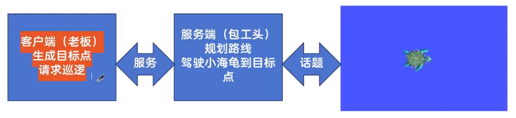
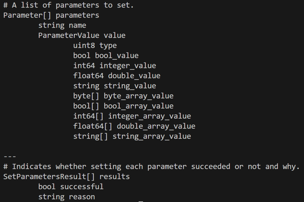

# 4 服务与参数通信

## 4.1 服务与参数通信介绍

### 4.1.1 服务通信介绍

#### 查看服务信息
| 命令 | 作用 |
| :--- | :--- |
| `ros2 service list -t` | 列出所有服务及对应的消息接口 |
| `ros2 interface show <接口名>` | 查看服务接口详情，`---` 上方为请求，下方为响应 |
| `ros2 service call <服务名> <接口> "<请求内容>"` | 调用服务并传入参数 |

#### 可视化工具
- 启动 `rqt` → `Plugins` → `Services` → `Service Caller`，可图形化调用服务。

### 4.1.2 基于服务的参数通信

#### 常用命令
| 命令 | 作用 |
| :--- | :--- |
| `ros2 param list` | 列出所有参数 |
| `ros2 param describe <节点名>/<参数名>` | 查看参数详细信息 |
| `ros2 param get <节点名>/<参数名>` | 获取参数当前值 |
| `ros2 param set <节点名>/<参数名> <值>` | 修改参数值 |
| `ros2 param dump <节点名> > <文件名>.yaml` | 导出参数到 YAML 文件 |
| `ros2 run <功能包> <节点> --ros-args --params-file <文件.yaml>` | 从文件加载参数启动节点 |
| `ros2 param --help` | 查看参数相关命令帮助 |

#### 可视化工具
`rqt` → `Plugins` → `Configuration` → `Dynamic Reconfigure`，可动态修改参数。

---

## 4.2 Python 服务通信——人脸检测

### 4.2.1 自定义服务接口

#### 步骤
1. 创建功能包，依赖为`rosidl_default_generators`（用于功能包创建）`sensor_msgs`（用于本章的人脸检测）。
```bash
ros2 pkg create 功能包名 --dependencies sensor_msgs rosidl_default_generators --liscense Apach-2.0
```
2. 在功能包目录下创建 `srv` 文件夹，文件名采用大写驼峰命名法，扩展名 `.srv`。
3. 编写服务定义，使用 `---` 分割请求和响应部分，类型后加 `[]` 表示数组。
```srv
sensor_msgs/Image image
---
int16 number
float32 use_time
int32[] top
int32[] right
int32[] bottom
int32[] left
```
4. CMakeLists.txt 中注册：
```cmake
 # 1. 查找依赖（必须）
find_package(ament_cmake REQUIRED)
find_package(rosidl_default_generators REQUIRED)   # ← 生成器
find_package(sensor_msgs REQUIRED)                 # ← 服务依赖

# 2. 生成服务接口代码（关键）
rosidl_generate_interfaces(${PROJECT_NAME}
  "srv/FaceDetector.srv"                           # ← 服务文件路径
  DEPENDENCIES sensor_msgs                         # ← 依赖的消息包
)

```
5. package.xml 添加：
```xml
   <member_of_group>rosidl_interface_packages</member_of_group>
```
6. 构建并验证：
 ```bash
   colcon build
   source install/setup.bash
   ros2 interface show <功能包名>/srv/FaceDetect
```

### 4.2.2 Python 实现人脸检测（基础图像处理）

#### 安装依赖
```bash
pip3 install face_recognition -i https://pypi.tuna.tsinghua.edu.cn/simple
```
>-i：索引，代表从后面的地址安装
#### 功能包
```bash
ros2 pkg create service --build-type ament_python --dependencies rclpy 自定义消息接口功能包名 --license Apache-2.0
```

#### 资源文件处理
图片: 保存置于该功能包下的`resource`文件夹；在`colcon build`时其下的文件（即非代码文件）不会自动拷贝,需要在`setup.py`下的`date files`代码中添加：
```python
('share/' + package_name + '/resource', ['resource/图片名.jpg']),
```
完整代码如下：
```python
data_files=[
    ('share/ament_index/resource_index/packages',
        ['resource/' + package_name]),
    ('share/' + package_name, ['package.xml']),
    ('share/' + package_name + "/resource", ['resource/marathon.jpg']),
],
```

#### 常用库函数详解
>注：pip install | grep …:过滤已下载的库名
##### 1. `face_recognition.face_locations`
| 项目 | 说明 |
| :--- | :--- |
| **使用格式** | `face_recognition.face_locations(img, number_of_times_to_upsample=1, model='hog')` |
| **参数** | `img`：图像的 NumPy 数组。<br>`number_of_times_to_upsample`（可选）：图像上采样次数，提高小脸检测精度，默认为 1。<br>`model`（可选）：检测模型，`'hog'`（默认，速度快）或 `'cnn'`（精度高）。 |
| **返回值** | 列表，每个元素为 `(top, right, bottom, left)` 元组，表示人脸位置。 |
| **作用** | 检测图像中所有人脸的位置坐标。 |

##### 2. OpenCV (`cv2`) 常用函数

| 函数 | 使用格式 | 参数说明 | 作用 |
| :--- | :--- | :--- | :--- |
| `cv2.imread` | `cv2.imread(path, flag)` | `path`：图像路径。<br>`flag`：读取模式（如 `cv2.IMREAD_COLOR`）。 | 读取图像为 NumPy 数组。 |
| `cv2.imshow` | `cv2.imshow(window_name, image)` | `window_name`：窗口名。<br>`image`：要显示的图像。 | 在窗口中显示图像。 |
| `cv2.imwrite` | `cv2.imwrite(filename, img, params)` | `filename`：保存路径。<br>`img`：图像数据。<br>`params`：格式参数。 | 保存图像文件。 |
| `cv2.resize` | `cv2.resize(src, dsize, fx, fy)` | `src`：原图。<br>`dsize`：目标尺寸。<br>`fx/fy`：缩放因子。 | 缩放图像。 |
| `cv2.rectangle` | `cv2.rectangle(img, pt1, pt2, color, thickness)` | `pt1/pt2`：矩形对角点。<br>`color`：颜色。<br>`thickness`：线宽。 | 绘制矩形框。 |
| `cv2.putText` | `cv2.putText(img, text, org, fontFace, fontScale, color, thickness)` | `text`：文本。<br>`org`：起始坐标。<br>`fontFace`：字体。<br>`fontScale`：字号。 | 在图像上添加文字。 |
| `cv2.selectROI` | `cv2.selectROI(windowName, img, showCrosshair, fromCenter)` | `showCrosshair`：是否显示十字线。<br>`fromCenter`：是否从中心选择。 | 交互式选择 ROI 区域。 |

##### 3. `get_package_share_directory`
| 项目 | 说明 |
| :--- | :--- |
| **使用格式** | `get_package_share_directory(package_name, print_warning=False)` |
| **参数** | `package_name`：功能包名称。<br>`print_warning`：是否打印警告。 |
| **返回值** | 功能包的共享目录绝对路径。 |
| **作用** | 获取功能包安装后的 `share` 目录路径，用于定位资源文件。 |

#### 图像处理示例代码
```python
import cv2
import face_recognition
from ament_index_python.packages import get_package_share_directory
import os

# 获取图片路径
pkg_share = get_package_share_directory('demo_python_service')
img_path = os.path.join(pkg_share, 'resource', 'test.jpg')

# 读取并检测人脸
image = cv2.imread(img_path)
locations = face_recognition.face_locations(image)

# 绘制人脸框
for top, right, bottom, left in locations:
    cv2.rectangle(image, (left, top), (right, bottom), (0, 255, 0), 2)

cv2.imshow("Face Detection", image)
cv2.waitKey(0)
cv2.destroyAllWindows()
```

### 4.2.3 人脸检测服务端实现

#### ROS 与 OpenCV 图像转换——`cv_bridge`
| 项目 | 说明 |
| :--- | :--- |
| **导入方式** | `from cv_bridge import CvBridge` |
| **作用** | 实现 ROS 的 `sensor_msgs/Image` 与 OpenCV 的 `numpy.ndarray` 相互转换。 |
| **方法** | `cv2_to_imgmsg(cv_image)`：OpenCV → ROS Image。<br>`imgmsg_to_cv2(ros_image)`：ROS Image → OpenCV。 |

#### 服务端核心代码结构
```python
import rclpy
from rclpy.node import Node

from cv_bridge import CvBridge

'''
导入创建的消息接口
话题：from ….msg import …
服务：from ….srv import …
前面为功能表，后面为具体的文件
'''
from your_package.srv import FaceDetect

import face_recognition
import cv2
import time
import os
from ament_index_python.packages import get_package_share_directory

class FaceDetectService(Node):
    def __init__(self):
        super().__init__('face_detect_server')
        #建立服务
        self.srv = self.create_service(FaceDetect, 'detect_face', self.callback)
        #创建CvBridge
        self.bridge = CvBridge()
        #将face_recognitions的部分参数属性化
        self.number_of_times_to_upsample = 1 #在检测人脸前先把图像放大几次
        self.model = "hog" #使用什么模型（cnn：卷积神经网络）
        # 默认图片路径
        self.default_img_path = os.path.join(
            get_package_share_directory('your_package'),
            'resource', 'default.jpg'
        )

    '''
    有response和request的服务回调函数
    对传入的response进行读取
    对request进行赋值最后返回
    '''
    def callback(self, request, response):
        # 转换图像
        #如果request中有图像就使用（需要将ros2图像转化为cv2）
        if request.image.data:
            image = self.bridge.imgmsg_to_cv2(request.image)
        #如果没有读入默认图像
        else:
            image = cv2.imread(self.default_img_path)

        start_time = time.time()
        # 人脸检测
        locations = face_recognition.face_locations(
            image,
            number_of_times_to_upsample=self.number_of_times_to_upsample,
            model=self.model
        )
        elapsed = time.time() - start_time

        # 填充响应，这些都是我们在消息接口中定义的内容
        response.number = len(face_locations)
        response.use_time = elapsed
        for top, right, bottom, left in locations:
            response.top.append(top)
            response.right.append(right)
            response.bottom.append(bottom)
            response.left.append(left)
        #最后返回
        return response

def main():
    rclpy.init()
    node = FaceDetectService()
    rclpy.spin(node)
    rclpy.shutdown()
```
构造默认测试图片的完整路径
```python
#方法1
self.default_image_path = os.path.join(
        get_package_share_directory('demo_python_service'),
        'resource/default.jpg '
    )
'''
1.get_package_share_directory('demo_python_service') 
会返回 ROS 2 包 demo_python_service 的共享目录
目录通常是 install/demo_python_service/share/demo_python_service
再拼上 resource/default.jpg，这样无论包安装到哪都能找到这张图
2.os.path.join
会将传入的字符串自动添加上"/"合并
'''

#方法2
'''
不使用os手动合并
'''
self.default_image_path=get_package_share_directory('demo_python_service')+"/resource/default.jpg"
#不要忘记在setup.py中为图片添加路径
```
#### colcon build构建

```bash
colcon build …
source install/setup.bash
```
可以使用查看详细信息（-t：查看路径）
```bash
ros2 service list -t
```
使用传输信息
```bash
ros2 service call /服务名 消息接口
```
注意：
- 服务只有传入后才会有返回
- 图片名不要写错！
- 只要源码有改动（包括 .py、.cpp、CMakeLists.txt、package.xml 等）都要执行：
```bash
colcon build --packages-select face_detection_show_pkg
source install/setup.bash
```

### 4.2.4 人脸检测客户端实现

#### 客户端核心方法
| 方法 | 说明 |
| :--- | :--- |
| `create_client(srv_type, srv_name)` | 创建服务客户端对象。 |
| `client.wait_for_service(timeout_sec)` | 等待服务端上线，返回布尔值。 |
| `client.call_async(request)` | 异步发送请求，返回 `Future` 对象。 |
| `rclpy.spin_until_future_complete(node, future)` | 阻塞等待异步结果完成。 |
| `future.result()` | 获取服务端返回的 `Response`。 |

#### 客户端完整代码示例
```python
import rclpy
from rclpy.node import Node
from cv_bridge import CvBridge
from your_package.srv import FaceDetect
import cv2
import os
from ament_index_python.packages import get_package_share_directory

class FaceDetectClient(Node):
    def __init__(self):
        super().__init__('face_detect_client')
        #建立客户端
        self.client = self.create_client(FaceDetect, 'detect_face')
        #建立图像转换对象
        self.bridge = CvBridge()
        #等待服务端响应
        while not self.client.wait_for_service(timeout_sec=1.0):
            self.get_logger().info('Waiting for service...')
        #成员函数调用
        self.send_request()

    def send_request(self):
        # 读取测试图片
        pkg_share = get_package_share_directory('your_package')
        img_path = os.path.join(pkg_share, 'resource', 'test.jpg')
        img = cv2.imread(img_path)

        # 构造请求
        # 使用 自定义消息接口.Request()
        request = FaceDetect.Request()
        request.image = self.bridge.cv2_to_imgmsg(img, encoding='bgr8')

        # 异步发送，固定格式
        future = self.client.call_async(request)      # 异步传输消息
        rclpy.spin_until_future_complete(self, future)# 阻塞当前线程直到future.done()完成
        response = future.result()#获取结果

        #特别说明：不可以使用
        #while future.done()is not: time.sleep()

        # 显示结果
        if response is not None:
            self.display_result(img, response)

    def display_result(self, img, response):
        for i in range(response.number):
            left = response.left[i]
            right = response.right[i]
            top = response.top[i]
            bottom = response.bottom[i]
            cv2.rectangle(img, (left, top), (right, bottom), (0, 255, 0), 2)
        cv2.imshow("Detection Result", img)
        cv2.waitKey(0)

def main():
    rclpy.init()
    node = FaceDetectClient()
    rclpy.spin_once(node, timeout_sec=1)
    rclpy.shutdown()
```

---

## 4.3 C++ 服务通信——巡逻海龟

### 4.3.1 自定义服务接口
1. 需求:让小海龟在海龟模拟器中随机游走进行巡逻
分析:
 - 控制海龟到达目标点我知道,怎么改成动态接收?服务
 - 用什么接口?自定义的
 - 随机游走?客户端来产生随机点,请求巡逻服务

2. 消息接口
在消息接口中一般使用大写单词表示常量
此处构建与人脸检测的构建方式相同但是不需要额外的库（DEPENDENCIES后不需要写）
```srv
float32 target_x    # 目标x值
float32 target_y    # 目标y值
---
int8 SUCCESS = 1    # 定义常量，表示成功
int8 FAIL = 0       # 定义常量，表示失败
int8 result         # 处理结果
```
### 4.3.2 创建服务端
#### 功能包
```bash
ros2 pkg create demo_cpp_service --build-type ament_cmake --dependencies chapt4_interfaces rclcpp geometry_msgs turtlesim --license Apache-2.0
```
四个功能包依赖：`rclcpp`、`geometry_msgs`、`turtlesim`、`自行写的消息接口功能包`
#### 代码
1. 声明服务共享指针：`rclcpp::Service<接口>::SharedPtr service_;`
2. 创建服务：`service_ = this->create_service<接口>(服务名, 回调函数);`
3. 回调函数采用 Lambda 表达式：
   ```cpp
   [this](const ...::Request::SharedPtr req, ...::Response::SharedPtr res) {
       // 处理 req，填充 res
   }
   ```
`const ...::Request::SharedPtr req, ...::Response::SharedPtr res`也是一般的服务端回调函数的参数
#### 服务端代码示例
```cpp
#include <rclcpp/rclcpp.hpp>
#include <geometry_msgs/msg/twist.hpp>
#include <turtlesim/msg/pose.hpp>
#include "turtle_move_interface/srv/turtle_move.hpp"
#include <cmath>  // 用于 sqrt, atan2, fabs

// 定义 PI 常量
#ifndef M_PI
#define M_PI 3.14159265358979323846
#endif

class TurtleMoveServer : public rclcpp::Node {
public:
    TurtleMoveServer() : Node("turtle_move_server") {
        // 创建服务，相比于单纯地控制增加的部分
        // 其实也就是利用服务为目标位置赋值
        service_ = this->create_service<turtle_move_interface::srv::TurtleMove>(
            "move_turtle",
            [this](const turtle_move_interface::srv::TurtleMove::Request::SharedPtr req,
                   turtle_move_interface::srv::TurtleMove::Response::SharedPtr res) {
                if (req->target_x >= 0.0 && req->target_y >= 0.0) {
                    target_x_ = req->target_x;
                    target_y_ = req->target_y;
                    res->result = turtle_move_interface::srv::TurtleMove::Response::SUCCESS;
                } else {
                    res->result = turtle_move_interface::srv::TurtleMove::Response::FAIL;
                }
            });

        // 创建发布者
        publisher_ = this->create_publisher<geometry_msgs::msg::Twist>("/turtle1/cmd_vel", 10);

        // 创建订阅者
        subscription_ = this->create_subscription<turtlesim::msg::Pose>(
            "/turtle1/pose",
            10,
            std::bind(&TurtleMoveServer::move_callback, this, std::placeholders::_1));

        // 初始化目标位置（默认在原点附近，等待服务调用更新）
        target_x_ = 1.0;
        target_y_ = 1.0;

        // 控制参数
        k_ = 1.5;
        max_speed_ = 3.0;
    }

private:
    // 回调函数：处理小海龟位置更新
    void move_callback(const turtlesim::msg::Pose::SharedPtr msg) {
        // 计算位置误差
        double x_error = target_x_ - msg->x;
        double y_error = target_y_ - msg->y;
        double distance = std::sqrt(x_error * x_error + y_error * y_error);

        geometry_msgs::msg::Twist speed;

        // 如果距离大于阈值，继续移动
        if (distance > 0.1) {
            // 计算目标方向角
            double target_angle = std::atan2(target_y_ - msg->y, target_x_ - msg->x);
            double angle_error = target_angle - msg->theta;

            // 归一化角度误差到 [-PI, PI]
            while (angle_error > M_PI) angle_error -= 2 * M_PI;
            while (angle_error < -M_PI) angle_error += 2 * M_PI;

            // 线速度：与距离成正比，但限制最大速度
            double linear_speed = distance * k_;
            if (linear_speed > max_speed_) {
                linear_speed = max_speed_;
            }
            speed.linear.x = linear_speed;

            // 角速度：与角度误差成正比
            speed.angular.z = angle_error * k_;
        }

        // 发布速度指令
        publisher_->publish(speed);
    }

    // 成员变量
    rclcpp::Service<turtle_move_interface::srv::TurtleMove>::SharedPtr service_;
    rclcpp::Publisher<geometry_msgs::msg::Twist>::SharedPtr publisher_;
    rclcpp::Subscription<turtlesim::msg::Pose>::SharedPtr subscription_;

    double target_x_;
    double target_y_;
    double k_;
    double max_speed_;
};

int main(int argc, char** argv) {
    rclcpp::init(argc, argv);
    auto node = std::make_shared<TurtleMoveServer>();
    rclcpp::spin(node);
    rclcpp::shutdown();
    return 0;
}
```

### 4.3.3 创建客户端

#### 客户端三步走
1. 等待服务：`client->wait_for_service(timeout)`
2. 构造请求：`auto req = std::make_shared<Request>(); req->target_x = ...;`
3. 异步发送：`auto future = client->async_send_request(req);`

#### 客户端代码示例
```cpp
#include <rclcpp/rclcpp.hpp>
#include "turtle_move_interface/srv/turtle_move.hpp"
#include <cstdlib>
#include <ctime>
#include <chrono>

using namespace std::chrono_literals;

class Client : public rclcpp::Node {
private:
    rclcpp::Client<turtle_move_interface::srv::TurtleMove>::SharedPtr client;
    rclcpp::TimerBase::SharedPtr timer;

public:
    Client(const std::string &node_name) : rclcpp::Node(node_name) {
        srand(time(NULL));
        
        // 创建客户端
        client = this->create_client<turtle_move_interface::srv::TurtleMove>("move_turtle");
        
        // 创建定时器，每5秒发送一次请求
        timer = this->create_wall_timer(
            5s,
            std::bind(&Client::send_request, this)
        );
    }

    void send_request() {
        // 等待服务可用，固定格式
        while (!this->client->wait_for_service(1s)) {
            RCLCPP_INFO(this->get_logger(), "等待服务...");
        }
        
        if (!rclcpp::ok()) {
            RCLCPP_INFO(this->get_logger(), "主线程已中断");
            return;
        }

        // 创建请求，注意request使用make_shared
        auto request = std::make_shared<turtle_move_interface::srv::TurtleMove::Request>();
        request->target_x = rand() % 12;  // turtlesim 范围 0~11
        request->target_y = rand() % 12;
        
        RCLCPP_INFO(this->get_logger(), "目标坐标: (%.2f, %.2f)", 
                    request->target_x, request->target_y);

        // 异步发送请求，也是固定格式
        // 调用客户端的async_send_request方法，传入request和一个回调函数（与python相比不同之处，可以直接在回调函数中完成后续处理）
        this->client->async_send_request(
            request,
            [this](rclcpp::Client<turtle_move_interface::srv::TurtleMove>::SharedFuture future) {
                auto response = future.get();
                if (response->result == turtle_move_interface::srv::TurtleMove::Response::SUCCESS) {
                    RCLCPP_INFO(this->get_logger(), "请求成功！");
                } else if (response->result == turtle_move_interface::srv::TurtleMove::Response::FAIL) {
                    RCLCPP_INFO(this->get_logger(), "请求失败！");
                }
            }
        );
    }
};

int main(int argc, char** argv) {
    rclcpp::init(argc, argv);
    auto node = std::make_shared<Client>("turtle_move_client");
    rclcpp::spin(node);
    rclcpp::shutdown();
    return 0;
}
```

---

## 4.4 Python 节点参数操作

### 4.4.1 参数声明与获取

| 方法 | 使用格式 | 作用 |
| :--- | :--- | :--- |
| `declare_parameter` | `self.declare_parameter('param_name', default_value)` | 声明参数并设置默认值。 |
| `get_parameter` | `value = self.get_parameter('param_name').value` | 获取参数当前值。 |
| `set_parameters` | `self.set_parameters([rclpy.Parameter('name', value)])` | 设置自身节点参数。 |

#### 代码示例
```python
class ParamNode(Node):
    def __init__(self):
        super().__init__('param_node')
        self.declare_parameter('speed', 0.5)
        self.speed = self.get_parameter('speed').value
```

### 4.4.2 订阅参数更新

| 方法 | 说明 |
| :--- | :--- |
| `add_on_set_parameters_callback(callback)` | 注册参数修改时的回调函数。 |

#### 回调函数示例
```python
from rcl_interfaces.msg import SetParametersResult

def parameter_callback(self, params):
    for param in params:
        if param.name == 'speed':
            self.speed = param.value
    return SetParametersResult(successful=True)
```
#### 有参数的人类识别服务端
```python
import os

import rclpy
from rclpy.node import Node
# 使用参数需要额外导入
from rclpy.parameter import Parameter
from rcl_interfaces.msg import SetParametersResult

from cv_bridge import CvBridge
from ament_index_python.packages import get_package_share_directory

from face_detection_show_pkg.srv import FaceDetection  


class BaseService(Node):
    def __init__(self, node_name):
        super().__init__(node_name)

        # 创建服务
        self.service = self.create_service(
            FaceDetection,
            "yozora",
            self.callback
        )

        # 初始化 cv_bridge
        self.cv_bridge = CvBridge()

        # 获取资源图片路径
        self.path = os.path.join(
            get_package_share_directory("face_detection_show_pkg"),
            "resource",
            "marathon.jpg"
        )

        # 重点：声明参数（参数名+值）
        self.declare_parameter("face_locations_upsample_times", 1)
        self.declare_parameter("face_locations_model", "hog")

        # 利用参数值给成员变量赋值
        self.upsample_time = self.get_parameter("face_locations_upsample_times").value
        self.model = self.get_parameter("face_locations_model").value

        # 设置参数回调
        # 在节点运行时，通过外部指令动态修改内部变量的值，无需重启节点。
        self.add_on_set_parameters_callback(self.parameter_callback)

    # 写法较为固定
    def parameter_callback(self, parameters):
        for parameter in parameters:
            if parameter.name == "face_locations_upsample_times":
                self.upsample_time = parameter.value
            elif parameter.name == "face_locations_model":
                self.model = parameter.value
        return SetParametersResult(successful=True)

    def callback(self, request, response):
        pass

def main():
    rclpy.init()
    node = BaseService("base_service_node")
    rclpy.spin(node)
    rclpy.shutdown()
```
其中参数回调的模板如下
```python
def parameter_callback(self, parameters):
    for parameter in parameters:           # 固定：遍历参数列表
        if parameter.name == "param1":     # 固定：判断参数名
            self.param1 = parameter.value  # 固定：更新内部变量
        elif parameter.name == "param2":
            self.param2 = parameter.value
    return SetParametersResult(successful=True)  # 固定：返回成功
```
#### 设置自身节点参数
```python
Self.set_parameters( [rclpy.Paeameter(param_name,param_type,param_value)] )
```
### 4.4.3 客户端修改其他节点参数
#### 基本原理
通过请求服务完成参数设置
可以作为对服务通信的再次练习
首先使用SetParameters我们需要先看看该消息接口具体内容
```bash
ros2 interface show rcl_interfaces/srv/SetParameters
```



#### 所需接口
- 服务类型：`rcl_interfaces/srv/SetParameters`
- 消息类型：`rcl_interfaces/msg/Parameter`、`ParameterValue`、`ParameterType`

#### 完整代码示例
```python
import rclpy
from rclpy.node import Node

from rclpy.parameter import Parameter
from rcl_interfaces.srv import SetParameters
from rcl_interfaces.msg import Parameter, ParameterType, ParameterValue

import cv2
from cv_bridge import CvBridge
from face_detection_show_pkg.srv import FaceDetection


class BaseClient(Node):
    def __init__(self, node_name):
        super().__init__(node_name)
        self.client = self.create_client(FaceDetection, "yozora")
        self.cv_bridge = CvBridge()
        self.image = cv2.imread(...)  

    def send_request(self):
        # 1. 等待服务响应，固定格式
        while self.client.wait_for_service(timeout_sec=1) is False:
            self.get_logger().info("等待服务响应中")

        # 2. 创建请求对象
        request = FaceDetection.Request()
        request.image = self.cv_bridge.cv2_to_imgmsg(self.image)

        # 3. 发送请求，固定格式
        future = self.client.call_async(request)
        rclpy.spin_until_future_complete(self, future)
        response = future.result()
        self.get_logger().info(
            f"读取图片耗时{response.use_time}秒，一共检测到{response.number}张人脸"
        )
        self.show(response)

    def show(self, response):
        for i in range(response.number):
            self.get_logger().info(
                f"人脸 {i+1}: top={response.top[i]}, right={response.right[i]}, "
                f"bottom={response.bottom[i]}, left={response.left[i]}"
            )

    # 创建一个新的客户端，用来修改服务端的参数
    def new_send_request(self, parameters):
        # 1. 创建新的客户端，注意类型
        # 类型使用 ros2 interface show ...即可查看
        update_client = self.create_client(SetParameters, "/mygo/set_parameters")

        #  2. 等待服务响应，固定格式
        while update_client.wait_for_service(timeout_sec=1) is False:
            self.get_logger().info("等待服务响应中")

        # 3. 构造request
        request = SetParameters.Request()
        request.parameters = parameters

        # 4. 异步请求，固定格式
        future = update_client.call_async(request)
        rclpy.spin_until_future_complete(self, future)
        response = future.result()
        return response

    # 直接更新参数，其实是构造new_send_request方法的parameters参数并且调用
    # 根据传入的参数，构造参数对象，调用new_send_request进行更新
    def update_parameter(self, model="hog"):
        # 1.创建参数对象
        # 创建一个参数对象需要对其命名+赋值
        parameter = Parameter()
        parameter.name = "face_locations_model"

        # 2. 消息的赋值
        # 消息接口Parameter下有一个值为ParameterValue，其也是一个消息接口，
        # 所以需要在创建一个消息接口赋值。
        # 赋值：对其特定类型的对象进行赋值并且声明其类型
        parameter_value = ParameterValue()
        parameter_value.string_value = model
        parameter_value.type = ParameterType.PARAMETER_STRING
        parameter.value = parameter_value
        
        # 3. 请求更新参数
        response = self.new_send_request([parameter])
        for result in response.results:
            self.get_logger().info(f"参数设置结果: {result.successful}, {result.reason}")


def main():
    rclpy.init()
    node = BaseClient("face_detection_client")
    rclpy.spin(node)

    BaseClient.update_parameter(model = 'hog')
    BaseClient.send_request()
    BaseClient.update_parameter(model = 'cnn')
    BaseClient.send_request()

    rclpy.shutdown()
```

## 4.5 C++ 节点参数操作

### 4.5.1 参数声明与获取

| 方法 | 使用格式 | 作用 |
| :--- | :--- | :--- |
| `declare_parameter` | `this->declare_parameter("name", default_value);` | 声明参数。 |
| `get_parameter` | `this->get_parameter("name", variable);` | 获取参数值存入变量。 |
| `set_parameter` | `this->set_parameter(rclcpp::Parameter("name", value));` | 设置参数。 |

### 4.5.2 订阅参数更新
固定式如下：
```cpp
parameter_callback_handle_ = this->add_on_set_parameters_callback(
    [this](const std::vector<rclcpp::Parameter> &parameters) -> rcl_interfaces::msg::SetParametersResult {
        rcl_interfaces::msg::SetParametersResult result;
        result.successful = true;

        // for(parameter:parameters)等价于python的for parameter in parameters
        for (const auto &parameter : parameters) {
            RCLCPP_INFO(this->get_logger(), "更新参数: %s = %f", 
                        parameter.get_name().c_str(), parameter.as_double());

            // 唯一需要修改的地方
            if (parameter.get_name() == "k") {
                k_ = parameter.as_double();
            }
            if (parameter.get_name() == "max_speed") {
                max_speed_ = parameter.as_double();
            }
        }
        return result;
    }
);
```
应该是向`add_on_set_parameters_callback`方法传入一个回调函数，此处直接使用隐匿函数`[]()->...{}`,
### 4.5.3 客户端修改其他节点参数
在原本的基础上添加，基本上就是固定模板：
```cpp
#include <rclcpp/rclcpp.hpp>
#include <rcl_interfaces/srv/set_parameters.hpp>
#include <rcl_interfaces/msg/parameter.hpp>
#include <rcl_interfaces/msg/parameter_value.hpp>
#include <rcl_interfaces/msg/parameter_type.hpp>

class ParameterClient : public rclcpp::Node {
public:
    ParameterClient() : Node("parameter_client") {}

    // 发送参数设置请求
    rcl_interfaces::srv::SetParameters::Response::SharedPtr
    new_send_request(const rcl_interfaces::msg::Parameter& param) {
        
        // 1. 创建客户端并等待服务上线
        auto new_client = this->create_client<rcl_interfaces::srv::SetParameters>("/tomori/set_parameters");
        
        while (!new_client->wait_for_service(std::chrono::seconds(1))) {
            RCLCPP_INFO(this->get_logger(), "等待服务...");
            if (!rclcpp::ok()) {
                RCLCPP_INFO(this->get_logger(), "主线程已中断");
                return nullptr;
            }
        }

        // 2. 构造请求
        auto request = std::make_shared<rcl_interfaces::srv::SetParameters::Request>();
        request->parameters.push_back(param);

        // 异步调用并等待结果
        // 还可以给async_send_request方法后面加上回调函数
        auto future = new_client->async_send_request(request);
        rclcpp::spin_until_future_complete(this->get_node_base_interface(), future);
        auto response = future.get();
        return response;
    }

    // 更新参数（入口函数）
    void update_param(double k) {
        // 构造参数
        auto param = rcl_interfaces::msg::Parameter();
        param.name = "k";
        
        auto param_value = rcl_interfaces::msg::ParameterValue();
        param_value.type = rcl_interfaces::msg::ParameterType::PARAMETER_DOUBLE;
        param_value.double_value = k;
        param.value = param_value;
        
        // 发送请求
        auto response = new_send_request(param);
        
        if (response == nullptr) {
            RCLCPP_INFO(this->get_logger(), "参数获取失败");
            return;
        }
        
        // 处理响应结果
        for (auto result : response->results) {
            if (result.successful == true) {
                RCLCPP_INFO(this->get_logger(), "结果: 成功");
            } else {
                RCLCPP_INFO(this->get_logger(), "结果: 失败，原因: %s", result.reason.c_str());
            }
        }
    }
};

int main(int argc, char **argv)
{
    rclcpp::init(argc, argv);
    auto node = std::make_shared<Client>("soyo");

    node->update_param(5.0);

    rclcpp::spin(node);
    rclcpp::shutdown();
    return 0;
}
```

---

## 4.6 Launch 文件批量启动
### 4.6.1 使用 Launch 启用多个节点

#### 文件结构

在**任意一个功能包**目录下创建 `launch` 文件夹，再在该文件夹下创建 `*.launch.py` 文件编写启动配置。

```
your_package/
├── launch/
│   └── your_launch.launch.py
├── src/
├── CMakeLists.txt
└── package.xml
```
#### 库说明

| 库 | 说明 |
| :--- | :--- |
| **launch** | 通用进程启动器，与 ROS 无关。可启动任意可执行文件/shell 命令；设置环境变量；支持定时、条件、分组、事件响应；支持 Python/XML/YAML 三种描述格式。 |
| **launch_ros** | ROS 2 专用扩展，在 `launch` 基础上专门处理 ROS 2 语义。可启动 ROS 2 节点（Node 动作）；设置参数文件、重映射、命名空间、QoS 等 ROS 概念；加载 ComposableNode（把多个节点塞进一个进程）。 |

#### 代码模板

##### 1. 综述

| 规则 | 说明 |
| :--- | :--- |
| **函数名** | 必须是 `generate_launch_description()` |
| **参数** | 无 |
| **返回值** | `launch.LaunchDescription` 类型的对象（包含节点列表） |

##### 2. 具体格式

**创建节点**：

```python
import launch
import launch_ros
def generate_launch_description():
    node_name = launch_ros.actions.Node(
        package="功能包名",
        executable="可执行文件名",  # 无后缀
        output="输出方式",          # screen / log / both（可选）
)
```

**含参数**：
1. 声明参数
```python
from launch.actions import DeclareLaunchArgument
from launch.substitutions import LaunchConfiguration

DeclareLaunchArgument(
    '参数名',
    default_value='默认值',
    description='参数说明（可选）'
)
```
2. 使用参数
```python
node_name = launch_ros.actions.Node(
    package='包名',
    executable='可执行文件名',
    # 建将所有的参数名称设置相同，与原本的参数一致
    parameters=[{'参数名': LaunchConfiguration('参数名')}],
    # 或直接用于其他值
    arguments=['--ros-args', '-p', '参数名:=' + LaunchConfiguration('参数名')]
)
```

**返回 LaunchDescription**：

```python
return launch.LaunchDescription([节点1, 节点2, 节点3])
```
##### 3. 完整示例（小海龟多节点启动）

```python
import launch
import launch_ros

def generate_launch_description():
    # 创建客户端节点
    client = launch_ros.actions.Node(
        package="turtle_move_control",
        executable="client",
        output="both",
    )

    # 创建服务端节点
    service = launch_ros.actions.Node(
        package="turtle_move_control",
        executable="service",
        output="both",
    )

    # 创建 turtlesim 节点
    turtle = launch_ros.actions.Node(
        package="turtlesim",
        executable="turtlesim_node",
        output="both",
    )

    # 返回 LaunchDescription
    return launch.LaunchDescription([client, service, turtle])
```

##### 4. 带参数传递的示例（人脸检测）

```python
import launch
import launch_ros
from launch.actions import DeclareLaunchArgument
from launch.substitutions import LaunchConfiguration

def generate_launch_description():
    # 声明可传入参数
    upsample_arg = DeclareLaunchArgument(
        'upsample_times',
        default_value='1',
        description='Face detection upsample times'
    )

    model_arg = DeclareLaunchArgument(
        'model',
        default_value='hog',
        description='Detection model: hog or cnn'
    )

    # 创建服务端节点（传入参数）
    service = launch_ros.actions.Node(
        package="face_detection_show_pkg",
        executable="face_detection_server",
        output="screen",
        parameters=[{
            'face_locations_upsample_times': LaunchConfiguration('upsample_times'),
            'face_locations_model': LaunchConfiguration('model'),
        }]
    )

    # 创建客户端节点
    client = launch_ros.actions.Node(
        package="face_detection_show_pkg",
        executable="face_detection_client",
        output="screen",
    )

    return launch.LaunchDescription([
        upsample_arg,
        model_arg,
        service,
        client,
    ])
```
####  注册

##### CMakeLists.txt

```cmake
install(DIRECTORY launch DESTINATION share/${PROJECT_NAME})
```

> **注意**：`DIRECTORY` 后跟文件夹名（无后缀），`DESTINATION` 为目标路径。

##### setup.py

```python
from glob import glob

package_name = 'your_package'

setup(
    # ... 其他配置 ...
    data_files=[
        # ... 其他 data_files ...
        ('share/' + package_name + '/launch', glob('launch/*.launch.py')),
    ],
    # ...
)
```

> **注意**：`glob()` 内部**不要有空格**，正确写法：`glob('launch/*.launch.py')`，错误写法：`glob('launch/*.launch.py ')`

#### 使用

```bash
# 编译
colcon build --packages-select your_package

# 刷新环境
source install/setup.bash

# 启动 launch 文件
ros2 launch your_package your_launch.launch.py

# 带参数启动
ros2 launch your_package your_launch.launch.py upsample_times:=2 model:=cnn
```

> **注意**：在功能包内也可以不写功能包名（如果当前目录在功能包根目录下）。

---

#### Launch 进阶组件

| 组件 | 使用格式 | 作用 |
| :--- | :--- | :--- |
| `IncludeLaunchDescription` | `launch.actions.IncludeLaunchDescription(launch.launch_description_sources.PythonLaunchDescriptionSource([path]))` | 包含其他 launch 文件 |
| `LogInfo` | `launch.actions.LogInfo(msg="message")` | 打印信息 |
| `ExecuteProcess` | `launch.actions.ExecuteProcess(cmd=['command', 'arg1'])` | 执行系统命令 |
| `GroupAction` | `launch.actions.GroupAction([action1, action2])` | 组合多个动作 |
| `TimerAction` | `launch.actions.TimerAction(period=5.0, actions=[action])` | 延迟执行动作 |
| `IfCondition` | `condition=launch.conditions.IfCondition(LaunchConfiguration('use_xxx'))` | 条件执行动作 |

#### 完整示例代码（含所有导入）

```python
import launch
import launch_ros
from launch import LaunchDescription
from launch_ros.actions import Node
from launch.actions import DeclareLaunchArgument, LogInfo, ExecuteProcess
from launch.substitutions import LaunchConfiguration
from launch.conditions import IfCondition

def generate_launch_description():
    # 声明参数
    speed_arg = DeclareLaunchArgument(
        'speed',
        default_value='0.5',
        description='Turtle speed'
    )

    # 创建节点（带参数）
    turtle_control = Node(
        package='demo_cpp_service',
        executable='turtle_control',
        output='screen',
        parameters=[{'speed': LaunchConfiguration('speed')}]
    )

    # 执行系统命令（如启动 rqt）
    rqt_process = ExecuteProcess(
        cmd=['rqt'],
        output='screen',
        condition=IfCondition(LaunchConfiguration('use_rqt', default='false'))
    )

    # 打印日志
    log_info = LogInfo(msg="Launch file started!")

    return LaunchDescription([
        speed_arg,
        log_info,
        turtle_control,
        rqt_process,
    ])
```

---

#### 常见问题

| 问题 | 解决方法 |
| :--- | :--- |
| `executable` 找不到 | 确认 `setup.py` 或 `CMakeLists.txt` 中已注册可执行文件，且已 `colcon build` |
| 参数未生效 | 检查 `parameters=[{'参数名': LaunchConfiguration('参数名')}]` 是否写对 |
| `glob` 匹配不到文件 | 检查 `launch/*.launch.py` 路径是否正确，文件名是否匹配 |
| 节点启动顺序问题 | 使用 `launch.actions.TimerAction` 延迟启动，或使用 `launch.actions.GroupAction` 分组控制 |

## 第4章总结：服务与参数通信

### 一、核心概念对比

| 通信方式 | 通信模式 | 应用场景 | 代码特征 |
| :--- | :--- | :--- | :--- |
| **话题（Topic）** | 异步、单向数据流 | 传感器数据、状态发布 | 发布/订阅，最灵活 |
| **服务（Service）** | 同步/异步 RPC | 短暂任务、指令控制 | 请求/响应，模板固定 |
| **参数（Parameter）** | 基于服务 Key-Value | 配置管理 | 声明/回调，模板最固定 |

### 二、服务通信模板

#### 自定义服务接口

```srv
# 请求字段
---
# 响应字段
int8 SUCCESS = 1    # 常量定义
```

**CMakeLists.txt 配置**：
```cmake
find_package(rosidl_default_generators REQUIRED)
rosidl_generate_interfaces(${PROJECT_NAME} "srv/xxx.srv")
```

#### 服务模板

| 角色 | 核心步骤 |
| :--- | :--- |
| **服务端** | `create_service` + 回调函数（处理 req → 返回 res） |
| **客户端** | `create_client` + `wait_for_service` + `call_async` + `spin_until_future_complete` |


### 三、参数通信模板

#### Python 参数操作

| 操作 | 代码 |
| :--- | :--- |
| 声明 | `self.declare_parameter('name', default)` |
| 获取 | `self.get_parameter('name').value` |
| 回调 | `add_on_set_parameters_callback(self.cb)` |

#### C++ 参数操作

| 操作 | 代码 |
| :--- | :--- |
| 声明 | `this->declare_parameter("name", default)` |
| 获取 | `this->get_parameter("name", var)` |
| 回调 | `add_on_set_parameters_callback([this](params){...})` |

#### 客户端修改远程节点参数（Python/C++ 通用）

1. 创建 `SetParameters` 客户端：`/目标节点名/set_parameters`
2. 构造 `Parameter` 对象（设置 name + value + type）
3. 发送 `SetParameters.Request()`
4. 检查 `response.results[0].successful`

---

### 四、Launch 文件批量启动

#### 核心规则

- 函数名必须是 `generate_launch_description()`
- 返回 `launch.LaunchDescription([节点列表])`
- 每个节点用 `launch_ros.actions.Node` 定义

#### 参数传递流程

```
DeclareLaunchArgument('参数名')  →  LaunchConfiguration('参数名')
    ↓
Node(parameters=[{'参数名': LaunchConfiguration('参数名')}])
    ↓
节点代码: self.declare_parameter('参数名', default)
    ↓
ros2 launch pkg xxx.launch.py 参数名:=新值
```

#### 注册路径

| 构建系统 | 注册方式 |
| :--- | :--- |
| CMake | `install(DIRECTORY launch DESTINATION share/${PROJECT_NAME})` |
| Python | `data_files=[('share/'+pkg+'/launch', glob('launch/*.launch.py'))]` |

---

### 五、关键模板速查

#### Python 参数回调（固定模板）

```python
def parameter_callback(self, parameters):
    for param in parameters:
        if param.name == "参数名":
            self.变量 = param.value
    return SetParametersResult(successful=True)
```

#### C++ 参数回调（固定模板）

```cpp
param_cb_handle_ = this->add_on_set_parameters_callback(
    [this](const std::vector<rclcpp::Parameter>& params) {
        rcl_interfaces::msg::SetParametersResult result;
        result.successful = true;
        for (const auto& param : params) {
            if (param.get_name() == "参数名") {
                成员变量_ = param.as_double();
            }
        }
        return result;
    }
);
```

#### 同步调用服务（Python 固定格式）

```python
future = client.call_async(request)
rclpy.spin_until_future_complete(self, future)
response = future.result()
```

#### 同步调用服务（C++ 固定格式）

```cpp
auto future = client->async_send_request(request);
rclcpp::spin_until_future_complete(this->get_node_base_interface(), future);
auto response = future.get();
```

---
