注：格式
- 使用一级标题、二级标题（m.n ...）、三级标题（m.n.r ...），之后就是序号
- 外部代码需要加粗斜体


# 第1章 
## 1.1 Numpy数组的生成
numpy一般使用导入格式：***import numpy as np***

***X = np.array(list)***：生成数组，***X***类型为***numpy.ndarray***
- 当***list***的元素为非***list***时，会生成一维矩阵，亦称向量
- 当***list***的元素为***list***时，会生成N维矩阵，***list***中的每一个***list***元素代表一行
- 表示方法：
  1. 常量：***array(list)***，***list***的元素也可以为***list***，如***array([1,2,3])***,***array(\[[1,2],[3,4]])***
  2.  变量：一般使用大写字母表示：X、Y……
```python
import numpy as np #以后就使用np代替numpy了
X = np.array([11,45,14]) #一维矩阵
X = np.array([[11,45,14],[1,00,86]]) #二维矩阵
```
## 1.2 Numpy数组的计算——计算方法同线性代数
广播：矩阵与一个数的运算
## 1.3 元素的访问——若X为numpy.ndarray 
1. 单个：类似二维数组（所有标号也是从0开始）
- X[n]：访问第n行
- X[m][n]：访问第m行第列
- X[numpy.ndarray]：输出以对应索引为元素的向量
```python
X = np.array( [[11,45,14],[1,00,86]])
Y = np.array([0,2,4])
x[0] # [11,45,14]
x[0][0]# 11
X[Y]#array[11,14,00]
```  
1. 遍历：类似二维数组，可以遍历一行
```python
X = np.array( [[11,45,14],[1,00,86]])
for row in X:
    print(row) #每一次输出一行
``` 
1. 矩阵的数组化：使用numpy.ndarray.flattern()方法可以将矩阵数组化
```python
np.array([[11,45,14],[1,00,86]]).flattern()#[11,45,14,1,00,86]
``` 
1. 矩阵与数的比较
矩阵与一个数比较，如：X  15，实际上是将矩阵内每个元素与数比较，结果为一个布尔矩阵。
```python
X = np.array( [[11,45,14],[1,00,86]])
Y = X  50#Y = array([[0,0,0],[0,0,1]])
#可以使用X[X15]的形式直接给出含对应元素的向量，如
Z = X[X15]#array([86])
``` 
## 1.4 matplotlib的使用
一般使用格式为：***import matplotlib.pyplot as plt  ...***
1. pyplot的使用
- 首先指定x与y
- ***plt.plot(x,y,...)*** 绘制图形
- ***plt.show()*** 必要的展示图像，最后一定要加上（NPC）
1. 绘制图像
```python
"""
绘制正余弦函数
"""
import numpy as np
import matplotlib.pyplot as plt
# 生成数据
x = np.arange(0, 6, 0.1) #结果类型为numpy.narray，即a(array)+range
y1 = np.sin(x)
y2 = np.cos(x)#注意数学函数也是来自于numpy库
# 绘制图形
plt.plot(x, y1, label="sin")#使用label显示图例
plt.plot(x, y2, linestyle = "--", label="cos") # 用虚线绘制
plt.xlabel("x") # x轴标签
plt.ylabel("y") # y轴标签
plt.title('sin & cos') # 标题
plt.legend()#显示图例，所有plot函数要加上label
plt.show()#NPC
#其实plt库下的plot用法很多与matlab类似
```
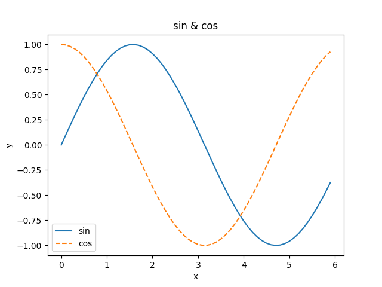
1. 读取图片与显示
- 使用***matplotlib***下的***image***的***imread***函数读取指定路径下的图片
- 使用***matplotlib***下的***pyplot***的***imshow***函数显示图片
- ***plt.show***函数NPC
```python
from matplotlib.image import imread
import matplotlib.pyplot as plt

img = imread(...)#输入指定路径
plt.imshow(img)#展示
plt.show()#NPC
```

# 第二章——感知机
## 2.1 定义
- 感知机接收多个输入信号，输出一个信号；
- 感知机的信号也会形成流，向前方输送信息；
- 感知机的信号只有“流/不流 ”（ 1/0）两种取值；
- 在本书中，0对应“不传递信号”，1对应“传递信号”；
  
总结：感知机是多输入单输出的，且输入信号是二元的0/1，正逻辑
## 2.2 原理图

1. 输出基础的***0/1***
设输入为$x_1$，$x_2$，其权重分别为$w_1$、$w_2$；输出为$y$；阈值为$θ$（当值超过阈值时才判定为1），则有：
$$
y =
\begin{cases} 
0 & (w_1x_1 + w_2x_2 \leq \theta) \\ 
1 & (w_1x_1 + w_2x_2  \theta)
\end{cases}
$$

注：基础latex语法
- 使用 ***\$*** 包裹，单个 ***\$*** 用在单个变量，双个 ***\$$*** 用在表达式单独列行
- 使用 ***%*** 注释
- 大括号语法：
  - 前后单独两行使用 ***\begin{cases}*** 、***\end{cases}***
  - 中间使用\\连接
  - 使用&确保长度一致
  - **\希腊字母**名输出希腊字母,首字母大小写对应字母大小写，如$\Phi$、$\phi$。
  - ***\leq***表示小于等于

2. 引入偏置$b$的输入：
将等式右侧的$\theta$左移，令$-\theta=b$，使得当输入结果$w_1x_1 + w_2x_2-b$时即可有输出：
$$
y =
\begin{cases} 
0 & (b + w_1x_1 + w_2x_2 \leq 0) \\ 
1 & (b + w_1x_1 + w_2x_2  0)
\end{cases}
$$
此时称$b$为偏置。
3. 权重$w$反应一个变量的重要性；偏置$b$调整神经元被激活的容易程度。
## 2.3 基本逻辑门的实现
基本逻辑：
```python
def LogicGate(x1,x2):
  x = np.array([x1,x2])#使用矩阵存储变量x
  w = np.array([w1,w2])#使用矩阵存储权重w
  temp = np.sum(x*w) + b#使用np.sum函数计算矩阵所有元素之和，以求得判别式值
  #比较
  if temp=0
    return 1
  elif temp<0
    return 0
```
实际上只需要调整$w_1$、$w_2$、$b$的值即可实现与门、与非门、或门。
1. 与门（AND），
令$w_1 = 0.5$、$w_2 = 0.5$，$b=-0.7$即可实现。
2. 与非门（NAND）
只需要将与门的所有参数修改为其对应相反数即可，令$w_1 = -0.5$、$w_2 = -0.5$，$b=0.7$即可实现。
3. 或门（OR）
令$w_1 = 0.5$、$w_2 = 0.5$，$b=-0.2$即可实现。
## 2.4 感知机的局限性
1. 从上述例子可知，一维的感知机相当于使用**一条直线**将满足笛卡尔坐标系分成两部分，而满足上述门的点恰好都散落在这两部分。
2. 但是对于异或表达式（XOR），必须使用二维的感知机，即无法使用一条直线而是必须使用曲线才能将散落在笛卡尔坐标系上的点分成两部分。
3. 称由直线分割而成的空间称为线性空间；由曲线分割而成的空间称为非线性空间。
## 2.5 多层感知机
将一维的感知机组合起来，就能够形成多维感知机——叠加了多层的感知机也称为多层感知机。
类似于使用多个基础的逻辑门搭建起来的复杂电路图。

运用数电的知识：
1. 异或逻辑表达式
   $$
   y = \overline{x_1}\,x_2 + x_1\,\overline{x_2}
   $$
2. 中间变量：
    $$s_1 = \overline{x_1 x_2}（与非门，即 NAND）   \\
    s_2 = x_1 + x_2（或门，即 OR）$$           
3. 异或门实现：
   $$
   y = s_1 \cdot s_2 = \bigl(\overline{x_1 x_2}\bigr) \cdot (x_1 + x_2)
   $$

则python语句为
```python
def XOR(x1,x2):
  s1=NAND(x1,x2)
  s1=OR(x1,x2)
  y=AND(s1,s2)
  return y
```

# 第三章——神经网络
## 3.1 从感知机到神经网络
1. 神经网络的基本结构
- 称最左边的一列称为输入层，最右边的一列称为输出层，中间的一列称为中间层。
- 中间层有时也称为隐藏层，隐藏层的神经元（和输入层、输出层不同）肉眼看不见。
- 本书中把输入层到输出层依次称为第0层、第1层、第2层（便于后面基于Python进行实现）。
  
下图，第0层对应输入层，第1层对应中间层，第2层对应输出层。
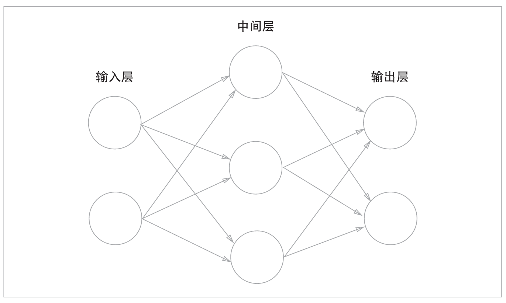
>- 虽然神经网络一共由3层神经元构成，但实质上只有2层神经元有权重（即输入层到中间层和中间层到输出层），因此本书将其称为“2层网络”。
>- 请注意，有的书也会根据构成网络的层数，把上图的网络称为“3层网络”。
## 3.2 感知机的完整结构
第二章感知机的结构图中，偏置$b$未被绘制出。如果要明确地表示出$b$，可以像下图：添加权重为$b$的输入信号1。由于$b$恒等于1，所以为了区别于其他神经元，将其整个涂成灰色
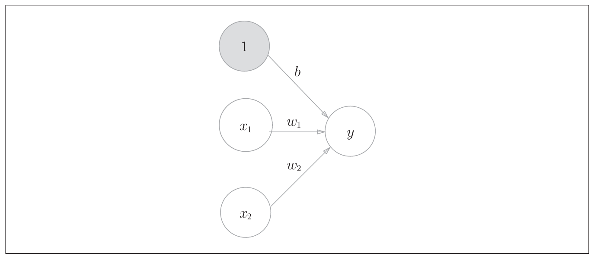

为了使得感知机的表达式更加简洁，引入跃阶函数$h(x)$，即
$$y=h(x)(w_1x_1+w_2x_2+b)$$其中跃阶函数$h(x)$表达式为：
$$h=
\begin{cases}
0 & x \leq 0 \\
1 & x  >0
\end{cases}
$$
又将跃阶函数$h(x)$称为“激活函数”。
接下来，令加权输入信号和偏置的总和为$a$，则有$$a=w_1x_1+w_2x_2+b$$则感知机的表达式可以写为$$y=h(a)$$由此感知机的结构图可以化为：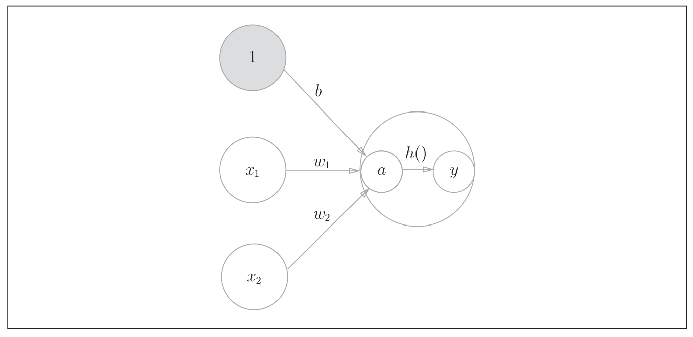
注：本书中，“神经元”和“节点”两个术语的含义相同。这里我们称$a$和$y$为“节点”，其实它和之前所说的“神经元”含义相同.

通常下图的左图所示，神经元用一个$○$表示。本书中，在可以明确神经网络的动作的情况下，将在图中明确显示激活函数的计算过程，下图的右图所示。
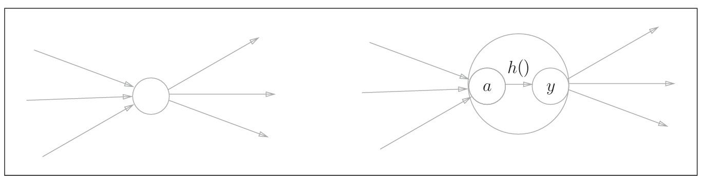

## 3.3 激活函数
### 3.3.1 sigmoid函数
#### 表达式
$$h(x)=\frac{1}{1+e^{-x}}$$
- 神经网络中用sigmoid函数作为激活函数，进行信号的转换
- 感知机和神经网络的主要区别就在于激活函数
#### python实现
```python
def sigmoid(x):
  return 1/(1+np.exp(-x))#同样的指数函数也来源于numpy库
```
>注意参数x为NumPy数组时，结果也能被正确计算——
根据NumPy的广播功能，如果在标量和NumPy数组之间进行运算，则标量会和NumPy数组的各个元素进行运算。
#### 图像
```python
import numpy as np
import matplotlib.pypl0t as plt 
def sigmoid(x):
  return 1/(1+np.exp(-x))#同样的指数函数也来源于numpy库
X = np.arange(-5,5,0.1)
Y = sigmoid(X)
plt.plot(X,Y)
plt.ylim(-0.1,1.1)#限定范围
plt.show()
```
### 3.3.2 阶跃函数
#### python实现
```python
def StepFunction(x):
  return np.array(x>0, dtype=int) 
```
- np.array的第一个参数用于构建numpy数组，关键字参数dtype用于指定numpy数组的元素类型。
- 之所以需要指定int是因为输入可能是浮点数，最后输出也是浮点数，需要转化为整型。
- 原书dtype是np.int，但是现在已经不适用了，直接使用int。

或
```python
def StepFunction(x):
    y = x > 0
    return y.astype(int)
```
- astype是numpy数组的方法，可以将其转化为指定类型。
- 注意方法不需要加上***np.***。
- 同样np.int，但是现在已经不适用了，直接使用int。
2. 图像，此处直接绘制上述两个阶跃函数
```python
import numpy as np
import matplotlib.pyplot as plt 
def sigmoid(x):
    return 1/(1+np.exp(-x))
def StepFunction(x):
    return np.array(x  0, dtype=int) 
#绘制
X = np.arange(-5,5,0.1)
Y1 = sigmoid(X)
Y2 = StepFunction(X)
plt.plot(X,Y1,label = "sigmoid")
plt.plot(X,Y2,label = "StepFunction",linestyle = "--")
plt.legend()
plt.title("sigmoid and step function")
plt.ylim(-0.1,1.1)#限定范围在-0.1~1.1
plt.show()
```
结果图：

#### sigmoid函数与阶跃函数的比较
- “平滑性”的不同：sigmoid函数是一条平滑的曲线，输出随着输入发生连续性的变化；而阶跃函数以0为界，输出发生急剧性的变化。
  sigmoid函数的平滑性对神经网络的学习具有重要意义。
- 相对于阶跃函数只能返回0或1，sigmoid函数可以返回等实数（这一点和刚才的平滑性有关）。
  感知机中神经元之间流动的是0或1的二元信号，而神经网络中流动的是续的实数值信号。
- 都具有相似的形状，均是均是“输入小时，输出接近0（为0）；随着输入增大，输出向1靠近（变成1）”。
  当输入信号为重要信息时，阶跃函数和sigmoid函数都会输出较大的值；当输入信号为不重要的信息时，两者都输出较小的值
- 不管输入信号有多小，或者有多大，输出信号的值都在0到1之间。
- 均为非线性函数。
### 3.3.3 非线性函数
神经网络的激活函数必须使用非线性函数，即激活函数不能使用线性函数。

原因：因为使用线性函数的话，不管如何加深层数，总是存在与之等效的“无隐藏层的神经网络”。
 设$h(x)=cx$，如果$y(x)=h(h(x))$，则其实际上等价于$$y(x)=c^2x=ax,a=c^2$$可见仍然是线性函数。
### 3.3.4 ReLU（Rectified Linear Unit）函数
#### 表达式:
$$y=
\begin{cases}
x & (x \geq 0) \\
0 & (x < 0)
\end{cases}
$$
#### python实现
```python 
def ReLU(x):
  return np.maximum(0,x)#就是看x与0那个更大
```
#### 图像
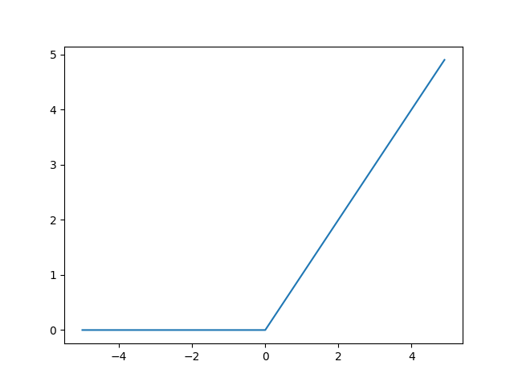
本章剩余部分的内容仍将使用sigmoid函数作为激活函数，但在本书的后半部分，则将主要使用ReLU函数。
## 3.4 矩阵运算
### 3.4.1 信息获取
1. np.ndim()：获得数组的维数可以通过函数
2. np.shape()：获得数组的形状
```python
import numpy as np
A = np.array([1,2,3,4,5])
B = np.array([[1,2,3],[4,5,6]])
C = np.array([[[1,2,3]],[[4,5,6]],[[7,8,9]]])
list_maxtri = [A,B,C]
for i in list_maxtri:
  print(np.ndim(i))
  print(np.shape(i))#也可以使用i.shape()的形式，二者结果都是一个元组
"""
1#一维
(5,)#一行
2#二维
(2, 3)#2行3列
3#三维
(3, 1, 3)#3行1列3竖
"""
```
### 3.4.2 矩阵乘法
使用np.np.dot(A,B)
使用\*运算是将对应元素相乘
```python
import numpy as np
A = np.array([1,2,3])
B = np.array([[1],[2],[3]])
A*B
np.np.dot(A，B)
'''
[[1 2 3]
 [2 4 6]
 [3 6 9]]
[14]
'''
```
## 3.5 三层神经网络的实现
### 3.5.1 符号定义
导入${w_{ij}}^{(k)}$、${a_i}^{(i)}$等符号.其中右上角的$(k)$代表位于第k层（注意，k从0开始计数），右下角的$ij$代表从前一层第$j$个神经元传递给后一层第$i$个神经元。具体示意图如下：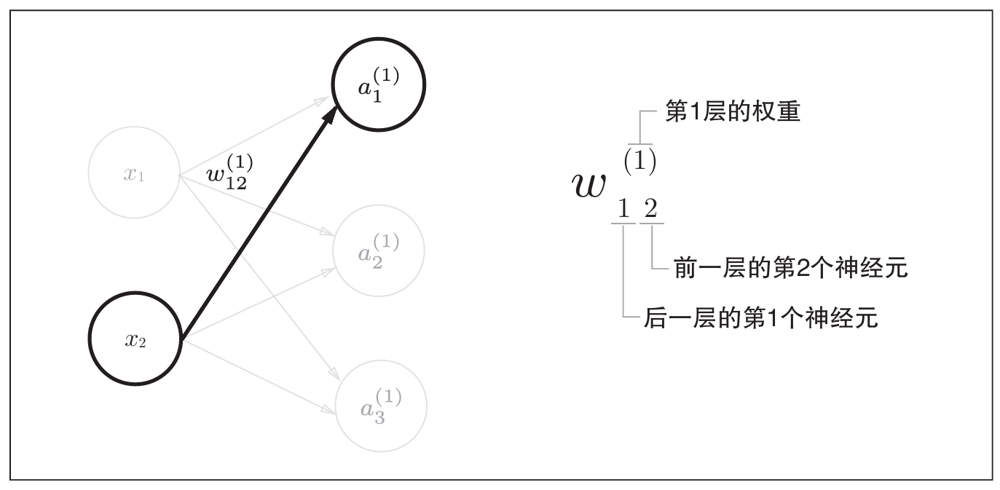
### 3.5.2 各层间信号传递的实现
#### 从输入层到第1层
##### 层到层
现在看一下从输入层到第1层的第1个神经元的信号传递过程：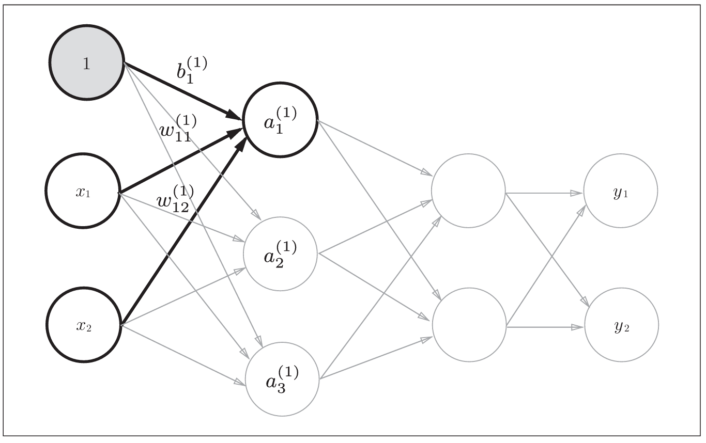
增加了表示偏置的神经元“1”。偏置的右下角的索引号只有一个——因为前一层的偏置神经元（神经元“1”）只有一个。

上图的计算为：单个神经元的加权和：
$$
a_1^{(1)} = w_{11}^{(1)}x_1 + w_{12}^{(1)}x_2 + b_1^{(1)}
$$

如果使用矩阵的乘法运算，则可以将第1层的加权和表示成下面的式:
\[
\boldsymbol{A}^{(1)} = \boldsymbol{X} \boldsymbol{W}^{(1)} + \boldsymbol{B}^{(1)} 
\]

其中，
\[
\boldsymbol{A}^{(1)} = 
\begin{pmatrix}
a_1^{(1)} & a_2^{(1)} & a_3^{(1)}
\end{pmatrix}, \quad 
\boldsymbol{X} = 
\begin{pmatrix}
x_1 & x_2
\end{pmatrix}, \quad 
\boldsymbol{B}^{(1)} = 
\begin{pmatrix}
b_1^{(1)} & b_2^{(1)} & b_3^{(1)}
\end{pmatrix}
\]
\[
\boldsymbol{W}^{(1)} = 
\begin{pmatrix}
w_{11}^{(1)} & w_{21}^{(1)} & w_{31}^{(1)} \\
w_{12}^{(1)} & w_{22}^{(1)} & w_{32}^{(1)}
\end{pmatrix}
\]
实现代码：
```python
X = np.array([1.0, 0.5])#输入
W1 = np.array([[0.1, 0.3, 0.5], [0.2, 0.4, 0.6]])
'''
每一行代表前一层的一个神经元到后一层的神经元的权重。
此处第一行代表输入层神经元x1对第1层三个神经元的权重。
输入m个变量，输出n个变量，则权重矩阵为m行n列。
权重矩阵所有元素之和为1。
'''
B1 = np.array([0.1, 0.2, 0.3])
'''
每一个代表对下一层各个神经元的偏置
输入m个变量，输出n个变量，则偏置矩阵为1行n列。
'''
A1 = np.np.dot(X, W1) + B1#注意不同于逻辑门直接使用*，此处要使用矩阵乘法。
```
##### 激活函数
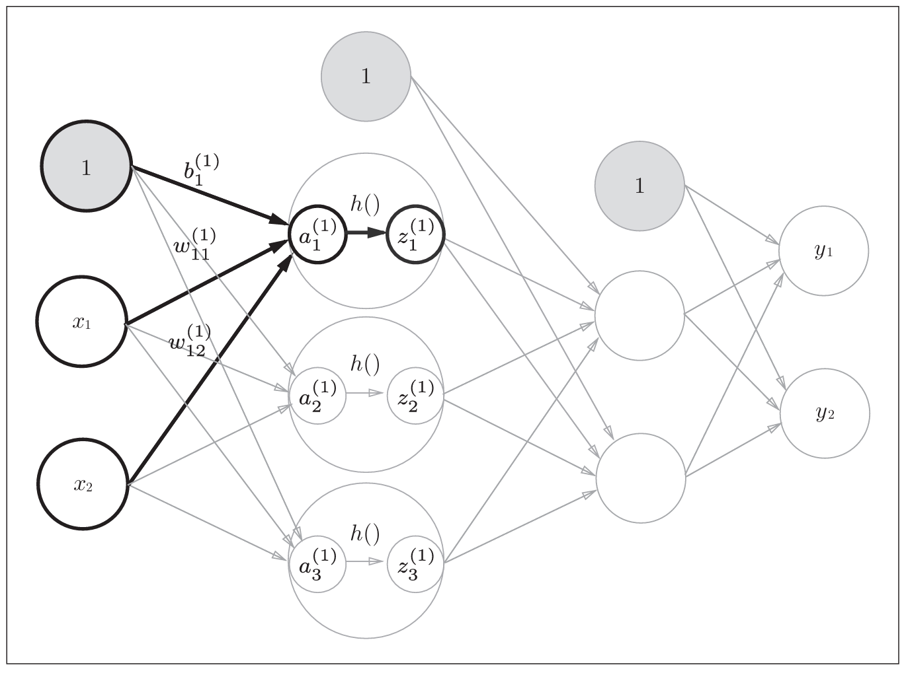
``` python
Z1 = sigmoid(A1)
```
#### 从第1层到第2层
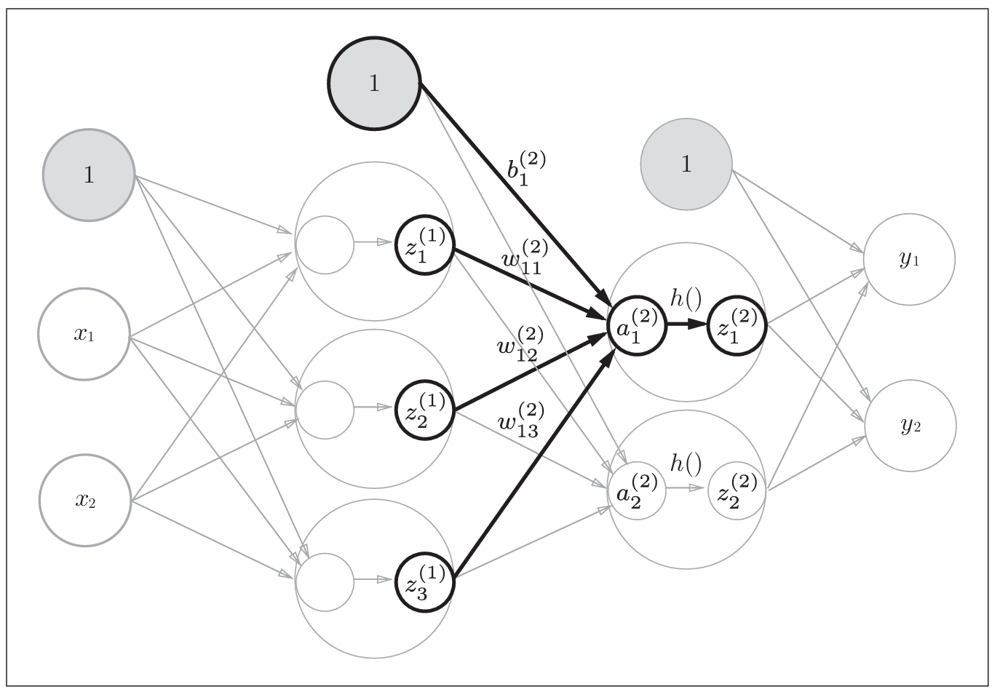
从图中可知此时输入为${z_i}^{(1)}$，对应权重为${w_{ij}}^{(2)}$，偏置为${b_i}^{(2)}$，最后累加和为${a_i}^{(2)}$，经过激活函数得到的值为${z_i}^{(2)}$。由此对应python代码为：
```python
W2 = np.array([[0.1, 0.4], [0.2, 0.5], [0.3, 0.6]])
'''
3个输入，2个输出，对应3行两列的numpy数组（矩阵）
'''
B2 = np.array([0.1, 0.2])
A2 = np.np.dot(Z1, W2) + B2 #输入*权重+偏置
Z2 = sigmoid(A2)#激活函数
```
#### 从第2层到输出层
输出层的实现也和之前的实现基本相同。不过最后的激活函数和之前的隐藏层有所不同。
```python
def identity_function(x):
    return x
W3 = np.array([[0.1, 0.3], [0.2, 0.4]])
B3 = np.array([0.1, 0.2])
A3 = np.np.dot(Z2, W3) + B3
Y = identity_function(A3) # 或者Y = A3
```
- identity_function()函数（也称为“恒等函数”）为输出层的激活函数
- 其输入=输出，
- 其实没必要特地定义，此处只是为了和之前的流程保持统一。
- 另外下图中，输出层的激活函数用σ()表示，不同于隐藏层的激活函数h()。
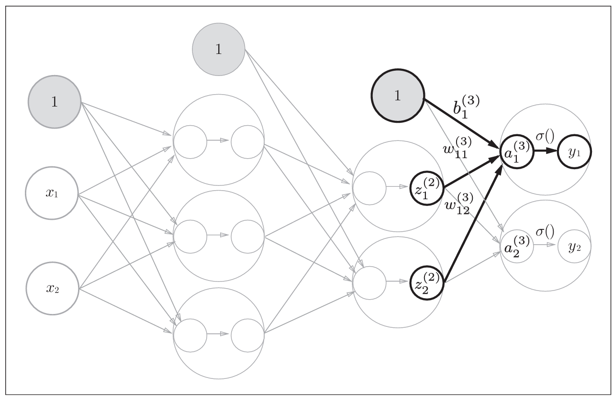
输出层所用的激活函数，要根据求解问题的性质决定，一般地有：
- 回归问题可以使用恒等函数
- 二元分类问题可以使用sigmoid函数
- 多元分类问题可以使用softmax函数。
#### 代码总结
```python
import numpy as np

#激活函数
def sigmoid(x):
    return 1/(1+np.exp(-x))
def IdentifyFunction(x):
    return x

#初始化所有权重、偏置
def InitNetwork():
    network = {}
    network["W1"] = np.array([[0.1, 0.3, 0.5], [0.2, 0.4, 0.6]])
    network["W2"] = np.array([[0.1, 0.4], [0.2, 0.5], [0.3, 0.6]])
    network["W3"] = np.array([[0.1, 0.3], [0.2, 0.4]])
    network["B1"] = np.array([0.1, 0.2, 0.3])
    network["B2"] = np.array([0.1, 0.2])
    network["B3"] = np.array([0.1, 0.2])

    return network
  '''
  使用字典时，先使用字典名 = {}初始化
  可以使用字典名[键名] = 键值 的方法辅助，注意使用[]而不是{}；同样使用时也是字典名[键名]。
  '''

#进行神经网络运算
def Forward(network,x):
  A1 = np.dot(x,network["W1"]) + network["B1"]
  Z1 = sigmoid(A1)
  A2 = np.dot(Z1,network["W2"]) + network["B2"]
  Z2 = sigmoid(A2)
  A3 = np.dot(Z2,network["W3"]) + network["B3"]
  Z3 = IdentifyFunction(A3)
  return Z3
  '''
  注意Ai是权重计算结果，代入激活函数计算Zi。
  '''

network = InitNetwork()
x = np.array([1.0, 0.5])
y = Forward(network, x)#[0.31682708 0.69627909]
```
## 3.6 输出层的设计
### 3.6.1 恒等函数和softmax函数
1. 恒等函数会将输入按原样输出。其神经网络图表示如下：


2. 分类问题中使用的softmax函数为：
\[
y_k = \frac{e^{a_k}}{\sum\limits_{i=1}^n e^{a_i}}
\]
其神经网络图表示如下:

softmax函数的输出通过箭头与所有的输入信号相连。这是因为，从表达式可以看出，输出层的各个神经元都受到所有输入信号的影响。
其python实现为：
```python
def softmax(x)
  return np.exp(x)/np.sum(np.exp(x))
```
### 3.6.2 softmax函数的使用注意事项
在计算机的运算上可能存在溢出问题。因为softmax函数的表达式含有$e^x$，若$x$取值稍大极有可能溢出。
>并不是最后的结果溢出，而是计算中间值$e^{a_k}$时可能存在很大的数导致溢出，使得最后的结果出错。

解决方法如下：
\[
y_k = \frac{e^{a_k}}{\sum_{i=1}^n e^{a_i}} = \frac{C e^{a_k}}{C \sum_{i=1}^n e^{a_i}}
\]

\[
= \frac{e^{a_k + \log C}}{\sum_{i=1}^n e^{a_i + \log C}}
\]

\[
= \frac{e^{a_k + C'}}{\sum_{i=1}^n e^{a_i + C'}}
\]
- 过程说明：在分子和分母上都乘上任意的常数$C$（因为同时对分母和分子乘以相同的常数，计算结果不变）。然后，把$C$移动到指数函数$e^x$中，记为$logC$。最后，把$logC$替换为另一个符号$C'$。
- 结论：在进行softmax的指数函数的运算时，加上（或者减去）某个常数并不会改变运算的结果。
- $C'$的选取：这里的$C'$可以使用任何值，但是为了防
止溢出，一般会使用**输入信号中的最大值的相反数（即让每个数减去最大值）**。

由此softmax函数的实现为：
```python
def softmax(x):
  max = np.max(x)
  return np.exp(x-max)/np.sum(np.exp(x-max)) 
  '''
  np.max用于选取数组中的最大值
  np.maximum用于比较输入两个元素的值
  最后的表达式就是在原来的基础上减去最大值max
  '''
```
### 3.6.3 softmax函数的特征
1. 值域为$[0,1]$
2. 归一性：输出值的和为1
   - 可以将输出值视为“概率”
   - 输出值为[ 0.018  0.245  0.737]可以解释成y[0]的概率是0.018（1.8%）， y[1]的概率是0.245（24.5%）， y[2]的概率是0.737（73.7%）。
   - 从概率的结果来看，可以说“因为第2个元素的概率最高，所以答案是第2个类别”；
   - 也可以说“有74%的概率是第2个类别，有25%的概率是第1个类别，有1%的概率是第0个类别”。
3. 使用了softmax函数，各个元素之间的大小关系不会改变。
   - 比如，a的最大值是第2个元素，y的最大值也仍是第2个元素。
   - 一般而言，神经网络只把输出值最大的神经元所对应的类别作为识别结果。因此，神经网络在进行分类时，输出层的softmax函数可以省略。
   - 在实际的问题中，由于指数函数的运算需要一定的计算机运算量，因此输出层的softmax函数一般会被省略
## 3.7 实战案例——手写数字的识别
前向传播（forward propagation，又称推理处理）：学习结束后，使用学习到的参数对输入数据进行分类。
使用神经网络解决问题时，也需要首先使用训练数据（学习数据）进行权重参数的学习；进行推理时，使用刚才学习到的参数，对输入数据进行分类。
### 3.7.1 MNIST数据集
 - 数据集是MNIST手写数字图像集。
  - MNIST是机器学习领域最有名的数据集之一，被应用于从简单的实验到发表的论文研究等各种场合。
  - 在阅读图像识别或机器学习的论文时，MNIST数据集经常作为实验用的数据出现。
  - MNIST的图像数据是28像素 ×28像素的灰度图像（1通道），各个像素的取值在0到255之间。每个图像数据相应地标有“7”“ 2”“ 1”等标签。


### 3.7.2 基础调用代码说明
使用时要位于ch03下
#### 数据获取代码
```python
import sys, os
sys.path.append(os.pardir) # 为了导入父目录中的文件而进行的设定
from dataset.mnist import load_mnist
# 第一次调用会花费几分钟……
(x_train, t_train), (x_test, t_test) = load_mnist(flatten=True,
normalize=False)
# 输出各个数据的形状
print(x_train.shape) # (60000, 784)
print(t_train.shape) # (60000,)
print(x_test.shape)  # (10000, 784)
print(t_test.shape)  # (10000,)```
```
1. ***sys.path.append(os.pardir)***
- sys.path
是Python在导入模块时会搜索sys.path列表中的路径。
其默认包含：当前脚本所在目录、环境变量 PYTHONPATH、Python 标准库路径等。
- os.pardir
值为字符串,表示“父目录”（parent directory）。
与操作系统无关的写法（Windows 和 Linux 都适用）。
- sys.path.append(os.pardir)
将 '..' 添加到 sys.path 中，意味着 Python 在导入模块时会额外查找当前脚本的父目录。
2. 导入dataset/mnist.py中的load_mnist函数,以读入MNIST数据集。
- 第一次调用load_mnist函数时，因为要下载MNIST数据集，所以需要接入网络。第
- 第2次及以后的调用只需读入保存在本地的文件（pickle文件）即可，因此处理所需的时间非常短。
  - pickle：可以将程序运行中的对象保存为文件。如果加载保存过的pickle文件，可以立刻复原之前程序运行中的对象。
3. load_mnist函数以“(训练图像,训练标签)，(测试图像，测试标签)”的形式返回读入的MNIST数据
   - 图像是指原始未处理的数据集
   - 标签是指图像所对应的数字
4. load_mnist(normalize=True, flatten=True, one_hot_label=False) 可以设置3个参数
   - normalize：正则化，决定是否将数据转化为$[0,1]$区间。
   - flatten：扁平化，决定是否将矩阵转化为向量。
   - one_hot_label：独热编码标签。决定是否标签转换为二进制向量的表示方法。
     - 比如说数字有0~9，如果结果为0，则不会是[0]，[1,0,0,0,0,0,0,0,0,0].
#### 数据获取和显示代码
```python
import sys, os
sys.path.append(os.pardir)
import numpy as np
from dataset.mnist import load_mnist

from PIL import Image
def img_show(img):
    pil_img = Image.fromarray(np.uint8(img))#转化图片类型
    pil_img.show()#show方法显示

(x_train, t_train), (x_test, t_test) = load_mnist(flatten=True,
normalize=False)
img = x_train[0]#挑选第一张图片显示
label = t_train[0]
print(label) # 5
print(img.shape)          # (784,)
img = img.reshape(28, 28) # 把图像的形状变成原来的尺寸
print(img.shape)          # (28, 28)
img_show(img)
```
1. flatten=True时读入的图像是以一列（一维）NumPy
数组的形式保存的。因此显示图像时，需要把它变为原来的28像素×28像素的形状。
2. 可以通过reshape()方法的参数指定期望的形状，更改NumPy数组的形状。
3. 需要把保存为NumPy数组的图像数据先转化为***np.uint8***类型，再使用Image.fromarray()函数转换为PIL用的数据对象。
#### 神经网络的推理处理
神经网络的输入层有784个神经元，输出层有10个神经元。
- 输入层的784这个数字来源于图像大小的28×28=784
- 输出层的10这个数字来源于10类别分类，即数字0到9。
- 这个神经网络有2个隐藏层：
  - 第1个隐藏层有50个神经元
  - 第2个隐藏层有100个神经元。
  - 这个50和100可以设置为任何值。
###### 基本处理函数
首先引入三个处理函数——获取测试数据的GetData函数，获取权重与偏置数据的InitNetwork函数，计算神经网络的Predict函数。
```python
def GetDate():
    (x_train,t_train),(x_test,t_test) = \
      load_mnist(normalize=True, 
      flatten=True, one_hot_label=False)
    return x_test,t_test#只需要测试集数据
    '''
    可以使用单反斜杠来换行
    对于括号内的参数，可以不写
    '''

def InitNetwork():
    with open("sample_weight.pkl", 'rb') as f:
        network = pickle.load(f)
    return network
        '''
        对于pickle对象，必须使用二进制读取（rb）
        对于pickle对象，必须使用load方法加载
        '''

def Predict(x,network):
    W1,W2,W3 = network["W1"],network["W2"],network["W3"]
    B1,B2,B3 = network["B1"],network["B2"],network["B3"]
    A1 = np.dot(x,W1) + B1
    Z1 = sigmoid(A1)
    A2 = np.dot(Z1,W2) + B2
    Z2 = sigmoid(A2)
    A3 = np.dot(Z2,W3) + B3
    Z3 = softmax(A3)
    #分类问题的最后输出层的激活函数为softmax函数。
    return Z3
```
>***InitNetwork***函数会读入保存在pickle文sample_weight.pkl中的学习到的权重参数A。这个文件中以字典变量的形式保存了权重和偏置参数。

python中处理文件的一般操作：
```python  
with open(文件路径（字符串）, 打开方式) as f:
    '''
    使用f代替文件进行详细操作，一般是使用“方法”
    使用with open() as的形式可以自动关闭文件
    如果文件不存在也能够继续运行。
    '''
  ```
###### 精确度评价
```python
x,t = GetData()
network = InitNetwork()
accuracy_cnt = 0

for i in range(0,len(x)):
    y = Predict(x[i],network)
    p = np.argmax(y)#np.argmax()：返回数组中最大值所在位置的索引
    if(p == t[i]):
      accuracy_cnt+=1
print(f"Accuracy：{accuracy_cnt/len(x)}")
```
或者先输出所有数的结果再比较
```python
x,t = GetData()
network = InitNetwork()
accuracy_cnt = 0
y = Predict(x,network)

for i in range(0,len(x)):
    p = np.argmax(y[i])
    if(p == t[i]):
      accuracy_cnt+=1
print(f"Accuracy：{accuracy_cnt/len(x)}")
```
分析：
1. 获取测试对象+对应的真实值，初始化神经网络
2. 在循环中，使用神经网络计算得出值，寻找测试对象计算值对应的结果
3. 正确就$＋1$
>在该例子中实现进行正则化预处理，这可以有效提高结果的准确性。
### 3.7.3 批处理的高级代码
现在我们来关注输入数据和权重参数的“形状”
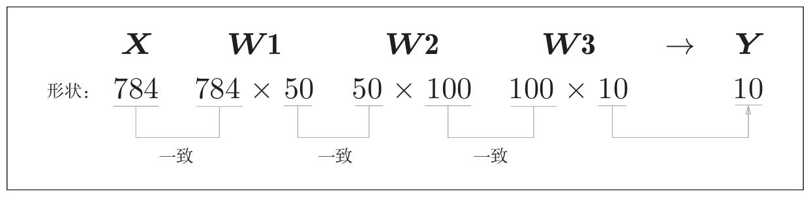
1. 从整体的处理流程来看，上图的输入一个由784个元素（28×28的二维数组经过扁平化）构成的一维数组后，输出一个有10个元素的一维数组。
2. 这是只输入一张图像数据时的处理流程。

现在我们来考虑打包输入多张图像的情形。比如，我们想用predict()函数一次性打包处理100张图像。为此，可以把$\bold{\textit{x}}$的形状改为100×784，将100张图像打包作为输入数据。
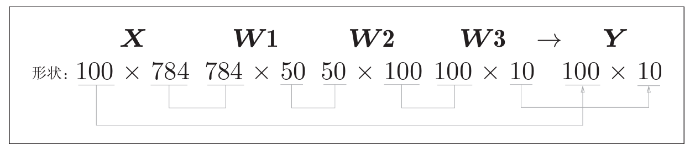
1. 输入数据的形状为100×784
2. 输出数据的形状为100×10。
3. 这表示输入的100张图像的结果被一次性输出了。
  - x[0]和y[0]中保存了第0张图像及其推理结果，
  - x[1]和y[1]中保存了第1张图像及其推理结果。

这种打包式的输入数据称为批（batch）。批有“捆”的意思，图像就如同纸币一样扎成一捆。
>批处理对计算机的运算大有利处，可以大幅缩短每张图像的处理时间。
>原因：这是因为大多数处理数值计算的库都进行了能够高效处理大型数组运算的最优化。并且，在神经网络的运算中，当数据传送成为瓶颈时，批处理可以减轻数据总线的负荷（严格地讲，相对于数据读入，可以将更多的时间用在计算上）。
>- 即批处理一次性计算大型数组要比分开逐步计算各个小型数组速度更快。

实现代码：
```python
x,t = GetData()
network = InitNetwork()
batch = 100#设置批处理值
accuracy_cnt = 0

for i in range(0,len(x),batch):#每次处理batch个
    y = Predict(x[i:i+batch],network)#每次比较batch个，x索引为i:i+batch
    p = np.argmax(y,axis=1)#比较每一行
    accuracy_cnt+=np.sum(p == t[i:i+batch])
print(f"Accuracy：{accuracy_cnt/len(x)}")
```
1. np.argmax的axis关键字变量表示维度，axis=0代表选出每一列的max；axis=1代表选出每一行的max.
2. np.sum(p == t[i:i+batch])
   - 比较以批为单位进行分类的结果和实际的答案，需要在NumPy数组之间使用比较运算符（==）生成由True/False构成的布尔型数组，并计算True的个数。
   - a == b：两个相同维度的矩阵进行比较的结果是，返回一个布尔矩阵，元素数量与原来的矩阵相同，元素值为True/False。
     ```python
      a = np.array([1,2,3])
      b = np.array([1,2,4])
      a == b #array([1,1,0])
      ```

#   第四章 神经网络的学习
“学习”是指从训练数据中自动获取最优权重参数的过程。
## 4.1 从数据中学习
“从数据中学习”指可以由数据自动决定权重参数的值。
### 4.1.1 数据驱动
机器学习的方法极力避免人为介入，尝试从收集到的数据中发现答案（模式）。而非由人类以自己的经验和直觉为线索，通过反复试验推进工作。

譬如，从零开始想出一个可以识别5的算法，不如利用有效数据来解决这个问题。一种方案是，先图像中提取特征量再用机器学习技术学习这些特征量的模式。
>这里所说的“特征量”是指可以从输入数据（输入图像）中准确地提取本质数据（重要的数据）的转换器。>图像的特征量通常表示为向量的形式。在计算机视觉领域，
>常用的特征量包括SIFT、SURF和HOG等。使用这些特征量将图像数据转换为向量，然后对转换后的向量使用机器学习中的SVM、KNN等分类器进行学习。

由此可以总结出从人工设计规则转变为由机器从数据中学习的过程：
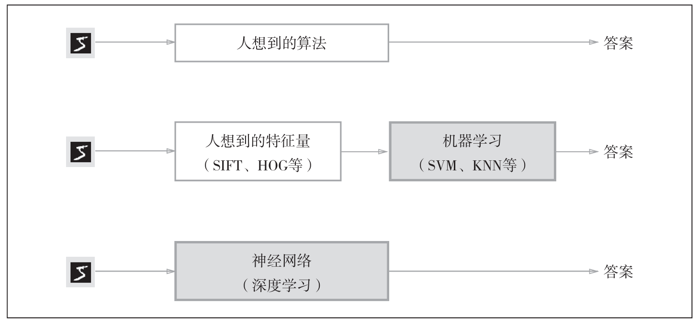
>深度学习有时也称为端到端机器学（end-to-end machine learning）。
>这里所说的端到端是指从一端到另一端的意思，也就是从原始数据（输入）中获得目标结果（输出）的意思。
神经网络的优点是对所有的问题都可以用同样的流程来解决。
### 4.1.2 训练数据和测试数据
机器学习中，一般将数据分为训练数据（监督数据）和测试数据两部分来进行学习和实验等。
首先，使用训练数据进行学习，寻找最优的参数；然后，使用测试数据评价训练得到的模型的实际能力。
>为什么需要将数据分为训练数据和测试数据呢？
>因为我们追求的是模型的泛化能力:
>- 泛化能力是指处理未被观察过的数据（不包含在训练数据中的数据）的能力。
>- 获得泛化能力是机器学习的最终目标。

仅仅用一个数据集去学习和评价参数，是无法进行正确评价的。这样会导致过拟合.
## 4.2 损失函数
神经网络的学习中使用的，作为线索寻找最优权重的指标称为损失函数（loss function）。
>这个损失函数可以使用任意函数，但一般用均方误差和交叉熵误差等。
>损失函数是表示神经网络性能的“恶劣程度”的指标，即当前的神经网络对监督数据在多大程度上不拟合，在多大程度上不一致。
### 4.2.1　均方误差（mean squared error）
#### 表达式
$$E = \frac{1}{2}\sum_k{(y_k-t_k)}^2$$

其中$y_k$是表示神经网络的输出，$t_k$表示监督数据，$k$表示神经网络的维度。
>在理论分析时，监督数据$t_k$常常使用***one-hot***的形式表示。
#### python实现
```python
def MeanSquaredError(y,t):
    return 0.5*np.sum((y - t)**2)
```
### 4.2.2　交叉熵权误差（cross entropy error）
#### 表达式
$$E = -\sum_k{t_klogy_k}$$
>在外文文献中常常使用$log$直接表示以$e$为底数的对数，而非使用$ln$。
>在理论分析时，监督数据常常使用***one-hot***的形式表示。
>交叉熵误差的值是由正确解标签所对应的输出结果决定的.
#### python实现
```python
def CrossEntropyError(y,t):
    delta = 1e-7
    return -*np.sum(t * np.log(y + delta))
```
>为了避免出现$log(0)$，引入一个极小量$\delta$来避免$y=0$的情形。
### 4.2.3　mini-batch学习
#### 导入
机器学习使用**训练数据**进行学习。使用训练数据进行学习，严格来说，就是针对训练数据**计算损失函数的值**，找出使该值尽可能小的参数。因此，计算损失函数时必须将**所有的训练数据**作为对象。

以交叉熵误差为例，可以写成下面的式：

$$E = -\frac{1}{N}\sum_n\sum_k{t_{nk}logy_{nk}}$$

其中右下角的$nk$表示第$n$个数据的第$k$个元素的值，数据有$N$个。
>其实只是把求单个数据扩大到了N份数据，
>最后还要除以$N$进行正规化。

如果以全部数据为对象求损失函数的和，则计算过程需要花费较长的时间。再者，如果遇到大数据，（数据量有几百万、几千万之多），这种情况下以全部数据为对象计算损失函数是不现实的。因此，我们从全部数据中选出一部分，作为全部数据的“近似”。

神经网络的学习也是从训练数据中选出一批数据（称为mini-batch,小批量），然后对每个mini-batch进行学习。
>总结：理论上的指标是对所有的训练数据求取损失函数以获取最优参数；但是出于对数据量和计算时间的考量不太合适，所以就抽取一部分的数据进行训练。
>损失函数的“全部”指的是训练数据的全部而不是整个数据；如果引入mini-batch的概念就是针对这整个mini-batch的数据进行计算损失函数。
#### python实现抽取mini-batch集
```python
train_size = t.shape[0]#获取训练集的总数
batch_size = 10#指定batch数
batch_mask = np.random.choice(train_size,batch_size)#生成对应的要抽取的batch标号
x_batch = x_train[batch_mask]
t_batch = t_train[batch_mask]
```
>***np.random.choice(m,n)*** 表示从0~m-1中抽取n个数据。
>m即训练集的个数，使用t.shape[0]获取，使用shape方法获取numpy数组的维度：如果numpy数组只有一维，则[0]是长度;如果numpy数组是二维，则[0]是长度行数.
>n即mini-batch数，这个自行决定。
>获取对应的mini-batch数据使用原始numpy数组[要获取元素的编号的numpy数组]。也就是如果要获取numpy数组特定索引的元素所构成的numpy数组，可以在[]中放入一个指名索引的向量。
### 4.2.4　mini-batch版交叉熵误差的实现
#### 一般情况
```python
def CrossEntropyError(y,t):
    if y.ndim == 1:
       y = y.reshape(1,y.size)
       t = t.reshape(1,t.size)

    batch_size = y.shape[0]
    return -np.sum(t * np.log(y + 1e-7))/　batch_size
```
>reshape方法的作用：将原来的向量转换过后为二维矩阵了（虽然只有一行，但还是矩阵）。举个例子就是把array([1,2,3])转化为array([[1,2,3]])
>reshape的参数，就是指定行数与列数。行数就是1；列数就是size属性（元素总个数），当然针对向量也可以使用shape方法获取长度。
>最后的计算除以batch_size，其实际上就是y，t的行数（一般都是用一行表示一个变量），使用shape属性的第一个元素。
#### 非one-hot数据
```python
def CrossEntropyError(y,t):
    if y.ndim == 1:#把向量变为矩阵
       y = y.reshape(1,y.size)
       t = t.reshape(1,t.size)
    batch_size = y.shape[0]
    return -np.sum(np.log \ 
    (y[np.arange(batch_size), t] + 1e-7)) / batch_size
```
>np.arange(batch_size)会生成一个从0到batch_size-1的数组，可以理解为其代表了y的行数；而t代表了每一行都具体元素。二者组合即可生成每一行含有特定元素的numpy矩阵。
>eg.batch_size=5时，np.arange(batch_size)会生成array([0, 1, 2, 3, 4])，若t为array([2, 7, 0, 9, 4])，则二者一组合会生成array(\[ [y[0,2], y[1,7], y[2,0], y[3,9], y[4,4] ]).
>对于one-hot类型，直接计算；对于非one-hot类型，先取出再计算。
### 4.2.5　为何要设定损失函数
为了找到使损失函数的值尽可能小的地方，需要计算参数的导数（确切地讲是梯度），然后以这个导数为指引，逐步更新参数的值。

在进行神经网络的学习时，不能将识别精度作为指标。因为如果以
识别精度为指标，则参数的导数在绝大多数地方都会变为0。
## 4.3 数值微分（numerical differentiation）
### 4.3.1　导数
$$
\frac{\mathrm{d}f(x)}{\mathrm{d}x} = \lim_{h \to 0} \frac{f(x+h) - f(x)}{h}
$$
实际上我们不会使用的解析方式求导数，即直接通过导数公式求解导数并且代入；而是运用数值微分（numerical differentiation）的方法，即将$h$设置为一个较小的值，直接计算$$\frac{f(x+h) - f(x)}{h}$$并以此来作为导数值。

考虑到在python中，变量的值无法无限小所以一般选取 ***$h=0.0001$***；而由于$h≠0$，使用更为精确的中心差分计算导数：

$$\frac{f(x+h) - f(x-h)}{2h}$$

其python实现为：
```python
#f即为具体函数
def NumericialDiff(f, x):
    h = 1e-4
    return (f(x+h) - f(x-h)) / (2*h) 
    #记得后面也有有括号，否则就变成了先除以2再乘以h
```
### 4.3.2 偏导数
#### 多元函数的实现
对于函数：
$$f(x_0, x_1) = {x_0}^2 + {x_1}^2$$其python代码实现为：
```python
def F(x):
    return x[0]*x[0] + x[1]*x[1]
    #或x[0]**2 + x[1]**2
    #或np.sum(x**2)
```
>也就是说，对于多元函数其输入变为了一个numpy数组。
>通过索引[]来表示不同的元。
#### 偏导数的实现
对于上述函数如果要使用“数值微分”的方式求解$x_0=3$，$x_1=4$时的偏导数$\frac{\partial{f}}{x_0}$和$\frac{\partial{f}}{x_1}$，python代码为
```python
def f_temp1(x):
    return x*x + 4*4
def f_temp2(x):
    return 3*3 + x*x
numercialdiff(f_temp1,3)
numercialdiff(f_temp2,4)
```
>也就是说，需要先定义一个将其他变量都代入具体值的单元函数再运用数值微分的方式求解偏导数。
## 4.4 梯度（gradient）
### 4.4.1 定义
由全部变量的偏导数汇总而成的向量称为梯度。
### 4.4.2 python实现
```python 
def NumercialGrad(f,x):
    h = 1e-4
    grad = np.zeros_like(x)
    for idx in range(x.size):
        temp = x[idx]

        x[idx] = temp + h
        fxh1 = f(x)

        x[idx] = temp - h
        fxh2 = f(x)

        grad[idx] = (fxh1 - fxh2) / (2*h)
        x[idx] = temp
    return grad
```
>梯度的计算本质上就是将求解偏导的过程集中起来。
>首先定义极小量$h$和grad的numpy形状，此处使用np.zeros_like(x)可以生成一个形状与numpy数组一样的但是值全为0的numpy数组。
>遍历，使用for循环遍历，每一次对x[idx]元进行计算，要实现使用temp来存储。
>计算$f(x+h)$和$f(x-h)$，注意此处的x实质上应该是只有x[idx]变化的（$±h$）的numpy数组，所以每一次需要传入整个numpy数组，但是需要单独修改x[idx]。
>将计算得出的偏导存储入grad numpy数组。
### 4.4.3 梯度的含义
梯度会指向各点处的函数值降低的方向。
更严格地讲，梯度指示的方向是各点处的函数值减小最多的方向。
## 4.5 梯度法
### 4.5.1 梯度法的理论
#### 梯度为0的点
根据梯度的性质，梯度可以使用来寻找函数最小值（或者尽可能小的值）这个方法就是梯度法。
>函数的极小值、最小值以及被称为鞍点（saddle point）的地方，梯度都为0。
>所以梯度为0不一定是最小值点。
>鞍点是从某个方向上看是极大值，从另一个方向上看则是极小值的点。
>当函数很复杂且呈扁平状时，学习可能会进入一个（几乎）平坦的地区，陷入被称为“学习高原”的无法前进的停滞期。
#### 梯度法的具体实现思路
函数的取值从当前位置沿着梯度方向前进一定距离，然后在新的地方重新求梯度，再沿着新梯度方向前进，不断地沿梯度方向前进。
>1. 通过不断地沿梯度方向前进，逐渐减小函数值。
>2. 根据目的是寻找最小值还是最大值，梯度法的叫法有所不同。严格地讲，寻找最小值的梯度法称为梯度下降法（gradient descent method），寻找最大值的梯度法称为梯度上升法（gradient ascent method）。
>3. 但是通过反转损失函数的符号，求最小值的问题和求最大值的问题会变成相同的问题，因此“下降”还是“上升”的差异本质上并不重要。
>4. 一般来说，神经网络（深度学习）中，梯度法主要是指梯度下降法。
#### 梯度法的数学表达式
$$x_0 = x_0 - \eta\frac{\partial{f}}{x_0} $$
$$x_1 = x_1 - \eta\frac{\partial{f}}{x_1} $$
称$\eta$为表示更新量，在神经网络中表示更新率。上述式子在每次更新时会反复执行。
>学习率$\eta$需要事先确定为某个值，比如0.01或0.001。
>一般而言，这个值过大或过小，都无法抵达一个“好的位置”。在神经网络的学习中，一般会一边改变学习率的值，一边确认学习是否正确进行了.
>称这种需要认为决定的参数为“超参数”。
#### 梯度法的python实现
```python
def grad_descent(f,init_x,lr,step=100):
    x = init_x
    for i in range(step):
        grad = NumericialGrad(f,x)
        x = x - grad*lr
    return x
```
>本质上就是输入函数、初始值、学习率、步长；每一次循环计算梯度代入公式计算x。
### 4.5.2 神经网络的梯度
神经网络的学习也要求梯度。这里所说的梯度是指损失函数关于权重参数的梯度。比如，有一个只有一个形状为2×3的权重$\bold{\textit{W}}$的神经网络，损失函数用$L$表示。此时梯度可以用表示:

$$
W = 
\begin{pmatrix}
w_{11} & w_{12} & w_{13} \\
w_{21} & w_{22} & w_{23}
\end{pmatrix}
$$

$$
\frac{\partial L}{\partial W} = 
\begin{pmatrix}
\frac{\partial L}{\partial w_{11}} & \frac{\partial L}{\partial w_{12}} & \frac{\partial L}{\partial w_{13}} \\
\frac{\partial L}{\partial w_{21}} & \frac{\partial L}{\partial w_{22}} & \frac{\partial L}{\partial w_{23}}
\end{pmatrix}
$$

上述过程的python实现为：
```python
import sys, os
sys.path.append(os.pardir)
import numpy as np
from common.functions import softmax, cross_entropy_error
from common.gradient import numerical_gradient#导入函数
class SimpleNet():
      def __init__(self):#初始化时初始化权重矩阵
          self.W = np.random.randn(2,3)
          #np.random.randn：生成标准正态分布（均值为 0，方差为 1）

      def Predict(self, x):#计算权重和a（暂时不考虑偏置）
          return np.dot(x,self.W) #因为只有输入到输出所以直接返回
      
      def Loss(self, x, t):
          z = Predict(x)
          y = softmax(z)#使用softmax求输出
          loss = cross_entropy_error(y,t)#求损失值
          return loss

net = SimpleNet()# 权重参数
x = np.array([0.6, 0.9])
p = net.Predict(x)
```
求解$W$的导数为：
```python
def f(W):
    return net.Loss(x, t)

dW = numerical_gradient(f, net.W)
```
>为什么f的W参数未使用到？
>numerical_gradient(f, net.W) 被调用时，它接收两个参数：f：一个函数和net.W：当前的权重数组。
>在numerical_gradient 内部，会直接修改传入的 net.W 数组（并在每次修改后调用 f计算$f(x+h)$和$f(x-h)$以计算导数组合成梯度。
>而实际上在上述过程中修改了net.W，当调用f函数时，虽然传入的net.W的没用使用到，但是其会调用Loss方法，（计算交叉指数熵），其内部使用的self.W正是被numerical_gradient函数修改的数组。
>因此：当 numerical_gradient 改变 net.W 时，net.loss 的结果会自动变化。所以f不需要使用传入的W，也能正确反映损失随权重的变化。

Python中如果定义的是简单的函数，可以使用lambda表示法：
```python
f = lambda W : net.Loss(x,t)
```

注意，之前所写的NumericalGrad函数只能使用在x维度为1时（即x为向量），如果x为多维数组，需要修改，代码如下：
```python
def numerical_gradient(f, x):
    h = 1e-4 # 0.0001
    grad = np.zeros_like(x)
    
    it = np.nditer(x, flags=['multi_index'], op_flags=['readwrite'])
    #使用multi_index访问全局，使用readwrite赋以读写权限
    while not it.finished:
        idx = it.multi_index

        tmp_val = x[idx]

        x[idx] = float(tmp_val) + h
        #强制为float型，当元素是int型时，加法产生意外的整数截断
        fxh1 = f(x) # f(x+h)
        x[idx] = tmp_val - h 
        #由于上面已经转换过了，所以必定是float型
        fxh2 = f(x) # f(x-h)

        grad[idx] = (fxh1 - fxh2) / (2*h)
        
        x[idx] = tmp_val # 还原值

        it.iternext()   
        
    return grad
```
np.nditer（N-dimensional iterator）函数可以方便地遍历n维数组，而无需使用for嵌套。返回值为迭代器类型数据。其使用说明如下：
```python
numpy.nditer(op, flags=None, op_flags=None, ...)#原型
'''
op：要迭代的数组（可以是多个数组，这里只有一个 x）
flags：控制迭代行为的字符串列表。常用值：
  'multi_index'：记录当前元素的多维索引（通过 it.multi_index 访问）
                 x有n维度就会返回一个有n个元素的元组
  'c_index'：记录C风格的扁平索引。
  'f_index'：记录Fortran风格的扁平索引。
op_flags：对操作数（数组）的访问权限的字符串列表。常用值：
  'readonly'：只读。
  'readwrite'：可读可写（允许修改原数组元素）
  'writeonly'：只写。
'''
```
it.finished: 的说明：迭代器的属性，布尔值。当迭代器已经访问完所有元素时，finished 变为 True；否则为 False。while not it.finished:代表只要还有元素未被处理，就继续循环体。
idx = it.multi_index：以元组形式获取当前迭代器所指元素的多维索引
it.iternext()：将迭代器移动到下一个元素
## 4.6 学习算法的实现
### 4.6.1 神经网络学习的总结
0. 前提
神经网络存在合适的权重和偏置，调整权重和偏置以便拟合训练数据的过程称为“学习”。神经网络的学习分成下面4个步骤。
1. 步骤1（mini-batch）
从训练数据中随机选出一部分数据，这部分数据称为mini-batch。目标是减小mini-batch的损失函数的值。
1. 步骤2（计算梯度）
为了减小mini-batch的损失函数的值，需要求出各个权重参数的梯度。梯度表示损失函数的值减小最多的方向。
1. 步骤3（更新参数）
将权重参数沿梯度方向进行微小更新。
1. 步骤4（重复）
重复步骤1、步骤2、步骤3。

>因为数据是随机选择的mini-batch数据，所以又称为随机梯度下降法（stochastic gradient descent）。
>“随机”指的是“随机选择的”.因此，随机梯度下降法是“对随机选择的数据进行的梯度下降法”。
>深度学习的很多框架中，随机梯度下降法一般由一个名为SGD的函数来实现。SGD来源于随机梯度下降法的英文名称的首字母。
### 4.6.2 手写数字识别的神经网络
#### 2层神经网络的类
将这个2层神经网络实现为一个名为TwoLayerNet的类
```python
'''
功能：进行一次神经网络的计算并且计算损失与梯度
函数：__init__（初始化权重和偏置）、predict（神经网络计算）、loss（损失计算）、numerical_gradient（梯度计算）
'''
import sys, os
sys.path.append(os.pardir)  
import numpy as np
from common.functions import *
'''
导入模块中的所有公开名称
即模块中所有不以单下划线 _ 开头的函数、变量、类等。
导入后，可以直接使用这些名称，而不需要加模块名前缀。
'''
from common.gradient import numerical_gradient

class TwoLayerNet:
    '''
    由于只有两层（输入，中间，输出），所以需要3个size（神经元数）
    输入层神经元数，中间一层隐藏层神经元数，输出层神经元数
    weight_init_std=0.01 是权重初始化的标准差，保证数据在[-0.3,0.3]
    '''
    def __init__(self, input_size, hidden_size, output_size, weight_init_std=0.01):
        # 初始化权重
        self.params = {}
        self.params['W1'] = weight_init_std * np.random.randn(input_size, hidden_size)
        self.params['b1'] = np.zeros(hidden_size)
        self.params['W2'] = weight_init_std * np.random.randn(hidden_size, output_size)
        self.params['b2'] = np.zeros(output_size)
        '''
        np.random.randn()可以有n个输入什么，会生成n维数组
          1.权重是每一行代表前一层一个神经元对后一层所有神经元的权重
          2.行数是前一层神经元数，列数是后一层神经元数
        np.zeros()生成同上，但是元素皆是0
          1.偏置是每一行代表前一层一个神经元对后一层所有神经元的偏置
          2.由于每一层只有一个偏置，输入一维（长度）即可
        '''

    def predict(self, x):
        W1, W2 = self.params['W1'], self.params['W2']
        b1, b2 = self.params['b1'], self.params['b2']
    
        a1 = np.dot(x, W1) + b1
        z1 = sigmoid(a1)
        a2 = np.dot(z1, W2) + b2
        y = softmax(a2)
      
        return y
        
    # x:输入数据, t:监督数据
    def loss(self, x, t):
        y = self.predict(x)

        return cross_entropy_error(y, t)
    
    def accuracy(self, x, t):
        y = self.predict(x)
        #进行求解，最后每一行都是0~9这十个数字的可能概率
        y = np.argmax(y, axis=1)
        t = np.argmax(t, axis=1)
        #因为这里t也是one-hot类型数据也必须做处理；如果只是普通数据则不需要。
        
        accuracy = np.sum(y == t) / float(x.shape[0])
        #每一行代表一个数据，总个数为行数
        return accuracy
        
    # x:输入数据, t:监督数据
    def numerical_gradient(self, x, t):
        loss_W = lambda W: self.loss(x, t)
        
        grads = {}
        grads['W1'] = numerical_gradient(loss_W, self.params['W1'])
        grads['b1'] = numerical_gradient(loss_W, self.params['b1'])
        grads['W2'] = numerical_gradient(loss_W, self.params['W2'])
        grads['b2'] = numerical_gradient(loss_W, self.params['b2'])
        #梯度求解：封装一下loss方法（交叉指数熵函数）
        #向求梯度函数输入封装的方法和要求的量
        return grads
        
    def gradient(self, x, t):#另一种计算梯度的方法
        W1, W2 = self.params['W1'], self.params['W2']
        b1, b2 = self.params['b1'], self.params['b2']
        grads = {}
        
        batch_num = x.shape[0]
        
        # forward
        a1 = np.dot(x, W1) + b1
        z1 = sigmoid(a1)
        a2 = np.dot(z1, W2) + b2
        y = softmax(a2)
        
        # backward
        dy = (y - t) / batch_num
        grads['W2'] = np.dot(z1.T, dy)
        grads['b2'] = np.sum(dy, axis=0)
        
        da1 = np.dot(dy, W2.T)
        dz1 = sigmoid_grad(a1) * da1
        grads['W1'] = np.dot(x.T, dz1)
        grads['b1'] = np.sum(dz1, axis=0)

        return grads
```
应用：
```python
'''
np.random.rand()是均匀分布函数
生成指定的形状
'''
x = np.random.rand(100, 784) # 伪输入数据（100笔）
t = np.random.rand(100, 10)  # 伪正确解标签（100笔）
grads = net.numerical_gradient(x, t)  # 计算梯度
grads['W1'].shape  # (784, 100)
grads['b1'].shape  # (100,)
grads['W2'].shape  # (100, 10)
grads['b2'].shape  # (10,)
```
>input_size=784（输入图像的大小是784=28×28）
>output_size=10（十个类别）
>隐藏层的个数hidden_size设置为一个合适的值即可
>权重使用符合高斯分布的随机数进行初始化，偏置使用0进行初始化
#### mini-batch的实现
```python
import sys, os
sys.path.append(os.pardir)
import numpy as np
import matplotlib.pyplot as plt
from dataset.mnist import load_mnist
from two_layer_net import TwoLayerNet

# 读入数据
(x_train, t_train), (x_test, t_test) = load_mnist(normalize=True, one_hot_label=True)
#初始化神经网络，给出各层神经元数
network = TwoLayerNet(input_size=784, hidden_size=50, output_size=10)

# 超参数
iters_num = 10000  # 适当设定循环的次数
train_size = x_train.shape[0]#总训练数据
batch_size = 100#每次batch数
learning_rate = 0.1#学习率eta

# 存储每个epoch的损失度
train_loss_list = []
# 存储每个epoch的精度
train_acc_list = []
test_acc_list = []
# 每个epoch内循环次数，即计算epoch的值——总数/mini-batch数
iter_per_epoch = max(train_size / batch_size, 1)

for i in range(iters_num):
    # 抽取mini-batch
    batch_mask = np.random.choice(train_size, batch_size)
    x_batch = x_train[batch_mask]
    t_batch = t_train[batch_mask]
    
    # 利用梯度下降法计算
      # 计算梯度，有两种计算方法
    #grad = network.numerical_gradient(x_batch, t_batch)
    grad = network.gradient(x_batch, t_batch)
  
      # 更新参数，梯度下降法的公式，每次自减学习率与梯度之积
    for key in ('W1', 'b1', 'W2', 'b2'):
        network.params[key] -= learning_rate * grad[key]
    
    # 记录下每一次的损失
    loss = network.loss(x_batch, t_batch)
    train_loss_list.append(loss)
    
    # 计算每个epoch的识别精度，即当i是iter_per_epoch的整数倍
    if i % iter_per_epoch == 0:
        # 使用accuracy方法计算并且加到列表中
        train_acc = network.accuracy(x_train, t_train)
        test_acc = network.accuracy(x_test, t_test)
        train_acc_list.append(train_acc)
        test_acc_list.append(test_acc)
        
        print("train acc, test acc | " + str(train_acc) + ", " + str(test_acc))

# 绘制图形
x = np.arange(len(train_acc_list))
plt.plot(x, train_acc_list, label='train acc')
plt.plot(x, test_acc_list, label='test acc', linestyle='--')
plt.xlabel("epochs")
plt.ylabel("accuracy")
plt.ylim(0, 1.0)
plt.legend(loc='lower right')
plt.show()
```
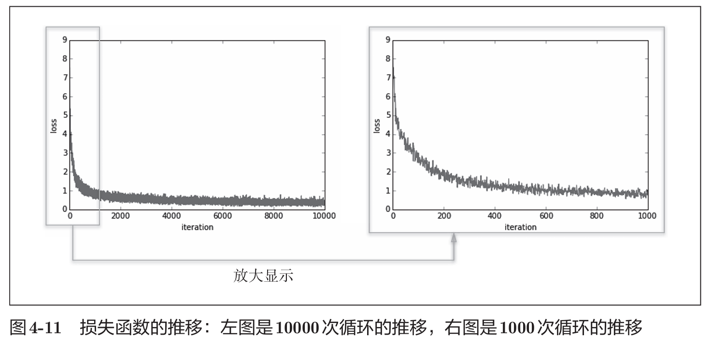
神经网络学习的最初目标是掌握泛化能力，因此要评价神经网络的泛
化能力，就必须使用不包含在训练数据中的数据。
在进行学习的过程中，会定期地对训练数据和测试数据记录识别精度。每经过一个epoch，我们都会记录下训练数据和测试数据的识别精度。
epoch是一个单位。一个epoch表示学习中所有训练数据均被使用过一次时的更新次数。
>比如，对于10000笔训练数据，用大小为100笔数据的mini-batch进行学习时，重复随机梯度下降法100次，所有的训练数据就都被“看过”了。此时，100次就是一个epoch。
> 实际上，一般做法是事先将所有训练数据随机打乱，然后按指定的批次大小，按序生成mini-batch。这样每个mini-batch均有一个索引号，比如此例可以是0,1,2, ... ,99，然后用索引号可以遍历所有的mini-batch。遍历一次所有数据，就称为一个epoch。
>请注意，本节中的mini-batch每次都是随机选择的，所以不一定每个数据都会被看到。

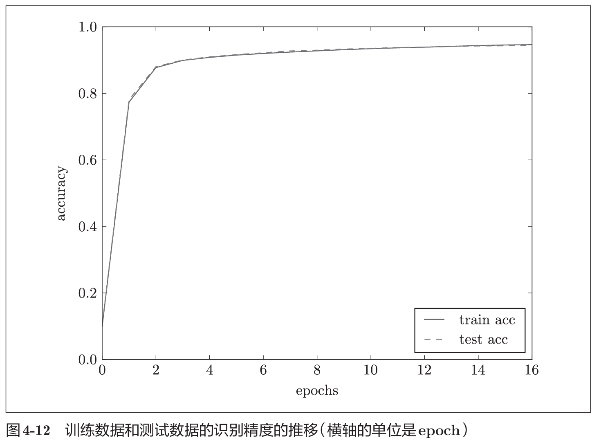