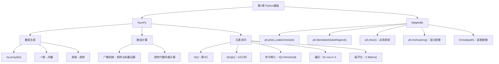
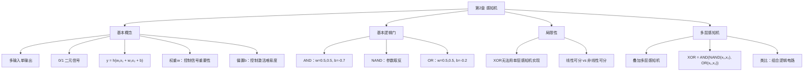
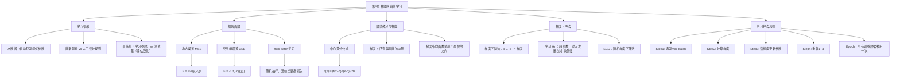
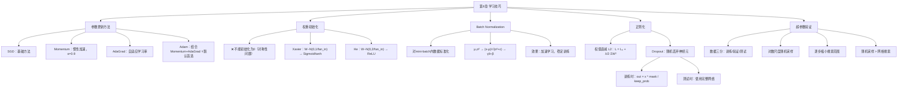

# 《深度学习入门：基于Python的理论与实现》——总结与思维导图

> 本书作者：斋藤康毅  
> 笔记整理：涵盖第1~8章，每章配有思维导图 + 全书总结

---

## 📚 全书总思维导图

```
《深度学习入门：基于Python的理论与实现》
│
├── 第1章 Python基础
│   ├── NumPy数组操作
│   │   ├── 数组生成：np.array()
│   │   ├── 数组计算：广播机制
│   │   ├── 元素访问：索引、切片、布尔索引
│   │   └── 形状变换：flatten()、reshape()
│   └── Matplotlib绘图
│       ├── plt.plot() 绘制曲线
│       ├── plt.imshow() 显示图像
│       └── plt.show() 展示图形
│
├── 第2章 感知机
│   ├── 感知机模型：多输入单输出，0/1信号
│   ├── 数学表达式：y = h(w₁x₁ + w₂x₂ + b)
│   ├── 基本逻辑门
│   │   ├── AND（与门）：w₁=0.5, w₂=0.5, b=-0.7
│   │   ├── NAND（与非门）：参数取反
│   │   └── OR（或门）：w₁=0.5, w₂=0.5, b=-0.2
│   ├── 局限性：单层感知机无法实现XOR（非线性可分）
│   └── 多层感知机：组合NAND+OR+AND → 实现XOR
│
├── 第3章 神经网络
│   ├── 网络结构：输入层→隐藏层→输出层
│   ├── 激活函数
│   │   ├── 阶跃函数：二值输出，不可微
│   │   ├── Sigmoid：平滑，输出(0,1)，易饱和
│   │   └── ReLU：y=max(0,x)，计算简单，缓解梯度消失
│   ├── 关键原则：激活函数必须是非线性函数
│   ├── 矩阵运算：np.dot() 实现层间计算
│   │   └── 公式：A⁽ᵏ⁾ = X·W⁽ᵏ⁾ + B⁽ᵏ⁾
│   ├── 输出层设计
│   │   ├── 恒等函数 → 回归问题
│   │   ├── Sigmoid → 二分类
│   │   └── Softmax → 多分类（输出可解释为概率）
│   └── 手写数字识别实战（MNIST）
│       ├── 网络结构：784 → 50 → 100 → 10
│       ├── 批处理：提高计算效率
│       └── 精度评估：np.argmax() 比较预测与标签
│
├── 第4章 神经网络的学习
│   ├── 学习本质：从数据中自动获取最优权重参数
│   ├── 损失函数（Loss Function）
│   │   ├── 均方误差（MSE）：E = ½Σ(yₖ-tₖ)²
│   │   ├── 交叉熵误差（CEE）：E = -Σ tₖ·log(yₖ)
│   │   └── mini-batch：从训练集随机抽样计算损失
│   ├── 数值微分
│   │   ├── 中心差分：f'(x) ≈ [f(x+h)-f(x-h)] / 2h
│   │   └── 偏导数 → 梯度（所有偏导数的向量）
│   ├── 梯度下降法（Gradient Descent）
│   │   ├── 公式：x ← x - η·∂f/∂x
│   │   ├── 学习率 η：超参数，需手动调节
│   │   └── SGD：随机梯度下降法
│   ├── 学习算法四步骤
│   │   ├── Step 1: 选取mini-batch
│   │   ├── Step 2: 计算梯度
│   │   ├── Step 3: 更新参数
│   │   └── Step 4: 重复1~3
│   └── TwoLayerNet 实现
│       ├── params字典：保存W1,b1,W2,b2
│       ├── predict()：前向传播
│       ├── loss()：计算损失
│       ├── accuracy()：计算精度
│       └── numerical_gradient() / gradient()：求梯度
│
├── 第5章 误差反向传播法
│   ├── 计算图（Computational Graph）
│   │   ├── 正向传播：从左向右，计算输出
│   │   ├── 反向传播：从右向左，传递导数
│   │   └── 核心原理：链式法则（Chain Rule）
│   ├── 基础节点的反向传播
│   │   ├── 加法节点：上游导数原封不动传给下游
│   │   └── 乘法节点：上游导数 × 翻转的输入值
│   ├── 层的实现（面向对象）
│   │   ├── MulLayer：forward(x,y)→x*y, backward(dout)→(dout*y, dout*x)
│   │   ├── AddLayer：forward→x+y, backward→(dout, dout)
│   │   ├── ReLU层：x≤0时导数为0, x>0时原封不动
│   │   ├── Sigmoid层：dx = dout * y * (1-y)
│   │   ├── Affine层：仿射变换 Y=X·W+B
│   │   │   ├── ∂L/∂X = ∂L/∂Y · Wᵀ
│   │   │   ├── ∂L/∂W = Xᵀ · ∂L/∂Y
│   │   │   └── ∂L/∂B = Σ∂L/∂Y（按列求和）
│   │   └── SoftmaxWithLoss层：反向传播 = yₖ - tₖ
│   ├── 新版TwoLayerNet（基于计算图层）
│   │   └── 结构：Affine1→ReLU→Affine2→SoftmaxWithLoss
│   ├── 梯度确认（Gradient Check）
│   │   └── 比较数值微分与反向传播结果，验证正确性
│   └── 优势：相比数值微分，效率大幅提升
│
├── 第6章 与学习相关的技巧
│   ├── 参数更新方法
│   │   ├── SGD：基本方法，W←W-η·∂L/∂W
│   │   ├── Momentum：引入速度v，惯性加速
│   │   │   └── v←αv-η·∂L/∂W, W←W+v（α≈0.9）
│   │   ├── AdaGrad：自适应学习率
│   │   │   └── h←h+(∂L/∂W)², W←W-η·∂L/∂W/(√h+ε)
│   │   └── Adam：结合Momentum+AdaGrad（默认首选）
│   │       └── 一阶矩m + 二阶矩v + 偏差修正
│   ├── 权重初始化
│   │   ├── 不能初始化为0（破坏对称性）
│   │   ├── Xavier初始化：W~N(0, 1/fan_in) → 适合Sigmoid/tanh
│   │   └── He初始化：W~N(0, 2/fan_in) → 适合ReLU
│   ├── Batch Normalization
│   │   ├── 对mini-batch内激活值标准化
│   │   ├── 步骤：求μ,σ²→归一化→γx̂+β缩放平移
│   │   └── 效果：加速学习、抑制内部协变量偏移
│   ├── 正则化（防过拟合）
│   │   ├── 权值衰减（L2正则化）：L = L_orig + λ/2·ΣW²
│   │   └── Dropout：训练时随机丢弃神经元
│   │       ├── 训练时：out = x * mask / keep_prob
│   │       └── 测试时：使用完整网络
│   └── 超参数验证
│       ├── 数据三分：训练集/验证集/测试集
│       ├── 搜索策略：对数尺度随机采样 + 逐步缩小范围
│       └── 随机采样优于网格搜索
│
├── 第7章 卷积神经网络（CNN）
│   ├── 整体结构
│   │   ├── 全连接→"Conv-ReLU-Pool"组合替换
│   │   └── 前段提取特征 + 后段综合判断
│   ├── 卷积层（Convolution Layer）
│   │   ├── 卷积运算：滤波器滑动 + 乘积累加
│   │   ├── 填充（Padding）：保持空间大小
│   │   ├── 步幅（Stride）：控制输出尺寸
│   │   ├── 输出大小公式：OH = (H+2P-FH)/S + 1
│   │   ├── 三维卷积：(C,H,W) × (C,FH,FW) → 加权求和
│   │   ├── 多滤波器：FN个滤波器 → FN个特征图
│   │   ├── 权重形状：(FN, C, FH, FW) 四维
│   │   ├── 批处理形状：(N, C, H, W) 四维
│   │   └── im2col：图像展开为矩阵，利用矩阵乘法加速
│   ├── 池化层（Pooling Layer）
│   │   ├── Max池化：取区域内最大值（主流）
│   │   ├── Average池化：取区域内平均值
│   │   ├── 特征：无学习参数、通道数不变
│   │   └── 效果：缩小空间 + 位置鲁棒性
│   ├── SimpleConvNet实现
│   │   └── Conv→ReLU→Pool→Affine→ReLU→Affine→Softmax
│   ├── CNN可视化
│   │   ├── 第1层滤波器：学习边缘、斑块等低级特征
│   │   └── 层次化特征提取：边缘→纹理→物体部件→物体
│   └── 经典CNN架构
│       ├── LeNet（1998）：最早的CNN，Sigmoid激活
│       └── AlexNet（2012）：ReLU+Dropout，深度学习热潮起点
│
└── 第8章 深度学习
    ├── 加深网络
    │   ├── 深层CNN特点：3×3小滤波器、ReLU、Dropout、Adam、He初始化
    │   ├── 加深动机
    │   │   ├── 减少参数数量（2×3×3 < 5×5）
    │   │   ├── 扩大感受野
    │   │   ├── 增加非线性表现力
    │   │   └── 学习更高效（分层分解问题）
    │   └── 精度提升技巧
    │       ├── 集成学习：多模型平均
    │       ├── 学习率衰减：逐步减小η
    │       └── Data Augmentation：旋转、平移、裁剪扩充数据
    ├── 深度学习小历史
    │   ├── ImageNet & ILSVRC：大规模图像识别竞赛
    │   ├── VGG：3×3卷积堆叠，结构简单应用广泛
    │   ├── GoogLeNet：Inception结构，纵向+横向深度
    │   ├── ResNet：快捷结构（Skip Connection）
    │   │   └── F(x)→F(x)+x，缓解梯度消失，可堆叠150层+
    │   └── 迁移学习：复用预训练权重，Fine-tuning
    ├── 深度学习高速化
    │   ├── GPU加速：并行计算，cuDNN优化库
    │   ├── 分布式学习：多GPU/多机器，TensorFlow/CNTK支持
    │   └── 位数缩减：半精度浮点（16bit）、二值化网络
    └── 应用与未来
        ├── 物体检测：R-CNN → Faster R-CNN
        ├── 图像分割：FCN（全卷积网络），像素级分类
        ├── 图像标题生成：NIC = CNN + RNN（多模态处理）
        ├── 图像风格变换：内容图像+风格图像→合成
        ├── 图像生成：DCGAN（生成者vs识别者对抗）
        ├── 自动驾驶：SegNet环境识别
        └── 强化学习：DQN（Deep Q-Network），AlphaGo
```

---

## 第1章 · Python基础



> **关键收获**：NumPy提供高效的数组运算和广播机制；Matplotlib用于数据可视化。

---

## 第2章 · 感知机



> **关键收获**：感知机是神经网络的起源；单层只能处理线性可分问题；多层叠加可解决非线性问题（如XOR）。

---

## 第3章 · 神经网络

```mermaid
graph TD
    A[第3章 神经网络] --> B[网络结构]
    A --> C[激活函数]
    A --> D[矩阵运算实现]
    A --> E[输出层设计]
    A --> F[MNIST实战]

    B --> B1["输入层→隐藏层→输出层"]
    B --> B2["本书称'2层网络'（仅计有权重的层）"]

    C --> C1["阶跃函数：二值，不可微"]
    C --> C2["Sigmoid：1/(1+e⁻ˣ)，平滑"]
    C --> C3["ReLU：max(0,x)，高效"]
    C --> C4["⚠️ 激活函数必须是非线性函数"]

    D --> D1["加权和：A = X·W + B"]
    D --> D2["激活输出：Z = h(A)"]
    D --> D3["Forward网络：逐层传递"]
    D --> D4["权重形状：(输入数, 输出数)"]

    E --> E1["恒等函数 → 回归"]
    E --> E2["Sigmoid → 二分类"]
    E --> E3["Softmax → 多分类（概率输出）"]
    E --> E4["Softmax防溢出：减去最大值"]

    F --> F1["MNIST：28×28灰度图像"]
    F --> F2["网络：784→50→100→10"]
    F --> F3["批处理：100张/批"]
    F --> F4["精度评估：argmax比较"]
```



> **关键收获**：神经网络 = 感知机 + 非线性激活函数；Softmax输出可解释为概率；批处理大幅提升计算效率。

---

## 第4章 · 神经网络的学习



> **关键收获**：损失函数衡量模型"恶劣程度"；梯度下降法是学习的核心算法；mini-batch平衡效率与准确性。

---

## 第5章 · 误差反向传播法

```mermaid
graph TD
    A[第5章 误差反向传播法] --> B[计算图]
    A --> C[基础节点]
    A --> D[层的类实现]
    A --> E[TwoLayerNet重构]
    A --> F[梯度确认]

    B --> B1["正向传播：计算输出"]
    B --> B2["反向传播：计算导数"]
    B --> B3["链式法则：导数逐层传递"]
    B --> B4["局部计算：每节点只关注自身"]

    C --> C1["加法节点"]
    C1 --> C1a["∂z/∂x = 1, ∂z/∂y = 1"]
    C1 --> C1b["上游导数原封不动传递"]
    C --> C2["乘法节点"]
    C2 --> C2a["∂z/∂x = y, ∂z/∂y = x"]
    C2 --> C2b["翻转乘数：dout×y, dout×x"]

    D --> D1["MulLayer / AddLayer"]
    D --> D2["ReLU层：x>0时传dout，x≤0时传0"]
    D --> D3["Sigmoid层：dx = dout·y·(1-y)"]
    D --> D4["Affine层：矩阵乘法的反向传播"]
    D4 --> D4a["∂L/∂X = ∂L/∂Y · Wᵀ"]
    D4 --> D4b["∂L/∂W = Xᵀ · ∂L/∂Y"]
    D --> D5["SoftmaxWithLoss层"]
    D5 --> D5a["反向传播 = yₖ - tₖ （简单优雅！）"]

    E --> E1["OrderedDict 有序存储层"]
    E --> E2["predict()：依次forward"]
    E --> E3["gradient()：forward→backward"]
    E --> E4["比数值微分高效得多"]

    F --> F1["比较两种梯度计算结果"]
    F --> F2["np.average(abs(grad_back-grad_num))"]
    F --> F3["差异应接近于0（< 1e-7）"]
```



> **关键收获**：反向传播利用链式法则高效计算梯度，是深度学习训练的核心引擎；SoftmaxWithLoss 的反向传播结果简洁为 `yₖ-tₖ`。

---

## 第6章 · 与学习相关的技巧



> **关键收获**：Adam是最推荐的优化器默认选择；He初始化配合ReLU是最佳实践；BatchNorm+Dropout是训练深层网络的两大法宝。

---

## 第7章 · 卷积神经网络（CNN）

```mermaid
graph TD
    A[第7章 CNN] --> B[为什么需要CNN]
    A --> C[卷积层]
    A --> D[池化层]
    A --> E[实现技术]
    A --> F[可视化与经典架构]

    B --> B1["全连接层：忽略空间结构信息"]
    B --> B2["CNN：保持(通道,高,宽)三维形状"]
    B --> B3["空间邻近像素关联性强"]

    C --> C1["卷积运算：滤波器滑动+乘积累加"]
    C --> C2["填充 Padding：保持空间大小"]
    C --> C3["步幅 Stride：控制输出尺寸"]
    C --> C4["输出公式：OH=(H+2P-FH)/S+1"]
    C --> C5["三维卷积：多通道加权求和"]
    C --> C6["多滤波器 → 多通道输出"]
    C --> C7["数据形状：(N,C,H,W) 四维"]
    C --> C8["权重形状：(FN,C,FH,FW) 四维"]

    D --> D1["Max池化：取最大值（主流）"]
    D --> D2["Average池化：取平均值"]
    D --> D3["特征：无学习参数、通道数不变"]
    D --> D4["效果：降维+位置鲁棒性"]

    E --> E1["im2col：图像展开为矩阵"]
    E1 --> E1a["展开后矩阵乘法 → 高效GPU计算"]
    E1 --> E1b["代价：内存消耗增加"]
    E --> E2["col2im：反向传播的逆展开"]

    F --> F1["第1层滤波器：检测边缘和斑块"]
    F --> F2["层次化：边缘→纹理→部件→物体"]
    F --> F3["LeNet (1998)：首个CNN，Sigmoid激活"]
    F --> F4["AlexNet (2012)：ReLU+Dropout，深度学习热潮的开端"]
```



> **关键收获**：CNN通过卷积层保留空间信息提取局部特征；im2col将卷积转化为矩阵乘法实现高效计算；从边缘到语义的层次化特征提取是CNN强大能力的根源。

---

## 第8章 · 深度学习

```mermaid
graph TD
    A[第8章 深度学习] --> B[加深网络]
    A --> C[经典架构]
    A --> D[高速化]
    A --> E[应用案例]
    A --> F[未来方向]

    B --> B1["深层CNN：3×3小滤波器+ReLU+Dropout+Adam+He初始化"]
    B --> B2["加深的好处"]
    B2 --> B2a["减少参数：2×3×3 < 5×5"]
    B2 --> B2b["扩大感受野"]
    B2 --> B2c["增加非线性表现力"]
    B2 --> B2d["分层分解，学习更高效"]
    B --> B3["精度提升技巧"]
    B3 --> B3a["集成学习"]
    B3 --> B3b["学习率衰减"]
    B3 --> B3c["Data Augmentation"]

    C --> C1["VGG：3×3卷积堆叠，简单实用"]
    C --> C2["GoogLeNet：Inception多尺度结构"]
    C --> C3["ResNet：Skip Connection"]
    C3 --> C3a["F(x)→F(x)+x"]
    C3 --> C3b["缓解梯度消失，可堆叠150层+"]
    C --> C4["迁移学习：复用预训练权重 Fine-tuning"]

    D --> D1["GPU + cuDNN：并行计算加速"]
    D --> D2["分布式学习：多GPU/多机器"]
    D --> D3["位数缩减：16bit半精度，二值化网络"]
    D --> D4["im2col 适合 GPU 矩阵运算"]

    E --> E1["物体检测：R-CNN → Faster R-CNN"]
    E --> E2["图像分割：FCN 像素级分类"]
    E --> E3["图像标题：NIC = CNN + RNN"]
    E --> E4["图像风格变换：内容+风格→合成"]
    E --> E5["图像生成：DCGAN（生成对抗网络）"]
    E --> E6["自动驾驶：SegNet 环境识别"]
    E --> E7["强化学习：DQN → AlphaGo"]

    F --> F1["无监督学习：GAN等无需标签数据"]
    F --> F2["多模态处理：图像+文本+语音融合"]
    F --> F3["嵌入式应用：模型压缩、位数缩减"]
```



> **关键收获**：加深网络能减少参数、扩大感受野、提升表现力；ResNet的Skip Connection是训练超深网络的关键突破；深度学习正从监督学习向无监督学习、强化学习、多模态处理等更广泛的领域拓展。

---

## 🎯 全书知识体系总结

```
《深度学习入门》知识进阶路线

Python基础(NumPy/Matplotlib)
    │
    ▼
感知机 → 线性可分 → 多层叠加 → XOR
    │
    ▼
神经网络 = 感知机 + 激活函数(Sigmoid→ReLU)
    │
    ▼
前向传播 + Softmax输出 → MNIST识别
    │
    ▼
学习 = 损失函数 + 梯度下降 + mini-batch SGD
    │
    ▼
反向传播(计算图+链式法则) → 高效计算梯度
    │
    ▼
学习技巧：Adam | He初始化 | BatchNorm | Dropout | 超参数搜索
    │
    ▼
CNN：卷积层 + 池化层 → 层次化特征提取 → 图像识别
    │
    ▼
深度学习：加深网络(VGG/GoogLeNet/ResNet) + GPU加速
    │
    ▼
前沿应用：物体检测/图像分割/图像生成/强化学习/自动驾驶
```

### 核心公式速查

| 概念 | 公式 |
|------|------|
| 感知机 | $y = h(w_1x_1 + w_2x_2 + b)$ |
| Sigmoid | $h(x) = \frac{1}{1+e^{-x}}$ |
| ReLU | $y = \max(0, x)$ |
| Softmax | $y_k = \frac{e^{a_k}}{\sum e^{a_i}}$ |
| 均方误差 | $E = \frac{1}{2}\sum_k (y_k - t_k)^2$ |
| 交叉熵误差 | $E = -\sum_k t_k \log y_k$ |
| 梯度下降 | $W \leftarrow W - \eta \frac{\partial L}{\partial W}$ |
| Softmax-with-Loss反向传播 | $\frac{\partial L}{\partial a_k} = y_k - t_k$ |
| Sigmoid反向传播 | $\frac{\partial L}{\partial x} = \frac{\partial L}{\partial y} \cdot y(1-y)$ |
| CNN输出大小 | $OH = \frac{H + 2P - FH}{S} + 1$ |
| He初始化 | $W \sim \mathcal{N}(0, \frac{2}{\text{fan\_in}})$ |
| ResNet快捷连接 | $y = F(x) + x$ |

### 最佳实践清单

| 场景 | 推荐方案 |
|------|----------|
| 激活函数 | 隐藏层用 ReLU |
| 权重初始化 | ReLU → He初始化；Sigmoid/tanh → Xavier初始化 |
| 优化器 | 默认选择 Adam |
| 正则化 | BatchNorm + Dropout |
| 图像任务 | CNN（卷积+池化） |
| 深度网络 | ResNet 的 Skip Connection |
| 小数据集 | 迁移学习 + Data Augmentation |
| 超参数搜索 | 对数尺度随机采样 + 逐步缩小范围 |
| 梯度计算 | 误差反向传播法（非数值微分） |
| 学习率 | 从 0.01 或 0.001 开始尝试 |

---

> 📝 **笔记说明**：本文档基于《深度学习入门：基于Python的理论与实现》（斋藤康毅 著）整理，涵盖了从感知机到深度学习的完整知识体系，适合作为复习提纲和快速参考。
