# 第七章 卷积神经网络（CNN）

本章介绍卷积神经网络的基本思想、卷积层与池化层的计算方式、以及基于矩阵运算的高效实现方法。本章还概述了代表性的卷积网络结构，包括 LeNet、AlexNet 和 VGG。

## 7.1 整体结构
CNN（卷积神经网络）与之前介绍的神经网络一样，可以通过组装层来构建。其核心区别在于，CNN 新引入了 **卷积层（Convolution层）** 和 **池化层（Pooling层）**。

### 全连接网络回顾

在之前的神经网络中，相邻层的所有神经元之间都有连接，这种结构称为**全连接（fully-connected）**，通过 Affine 层实现。
>即堆叠多层 "Affine-ReLU" 组合，最后通过 Affine 层和 Softmax 层输出最终结果。

### CNN 的网络结构
**关键变化：**
- CNN 在结构中新增了 Convolution 层和 Pooling 层。
- 之前的 "Affine - ReLU" 组合被替换为 **"Convolution - ReLU - (Pooling)"** 组合，其中 Pooling 层有时会被省略。
- 靠近输出的层仍然使用 "Affine - ReLU" 组合。
- 最后的输出层使用 "Affine - Softmax" 组合。

这种结构是一般 CNN 中比较常见的设计模式：**前段使用卷积层提取局部特征，后段使用全连接层进行综合判断**。

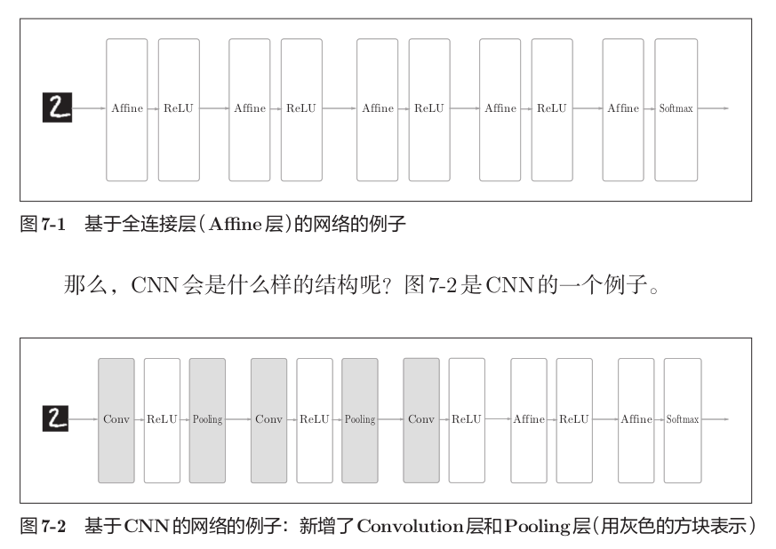

## 7.2 卷积层

CNN中引入了一些特有的术语，如填充、步幅等。此外，各层间传递的数据是有形状的数据（如三维数据），这与之前的全连接网络不同。本节将详细介绍CNN中使用的卷积层的结构。

### 7.2.1 全连接层存在的问题

全连接层（Affine层）中，相邻层的神经元全部连接在一起，输出的数量可以任意决定。但全连接层存在一个问题：**数据的形状被“忽视”了**。
例如，输入图像通常是高、长、通道方向上的三维形状，但向全连接层输入时，需要将三维数据**拉平为一维数据**。然而事实上，图像的三维形状中应该含有重要的空间信息：*空间上邻近的像素通常为相似的值，RGB各个通道之间有着密切的关联性，而相距较远的像素之间则关联不大*。
三维形状中可能隐藏有值得提取的本质模式。但是，**全连接层会忽视形状**，将全部的输入数据**作为相同维度的神经元处理，无法利用与形状相关的信息**。
>在之前使用MNIST数据集的例子中，输入图像是1通道、高28像素、长28像素的(1,28,28)形状，却被排成1列，以784个数据的形式输入到最开始的Affine层。

而**卷积层可以保持形状不变**。当输入数据是图像时，卷积层会以三维数据的形式接收输入数据，并同样以三维数据的形式输出至下一层。因此，在CNN中，可以正确理解图像等具有形状的数据。

CNN中，有时将卷积层的输入输出数据称为**特征图**。其中，卷积层的输入数据称为**输入特征图**，输出数据称为**输出特征图**。本书中将“输入输出数据”和“特征图”作为含义相同的词使用。

### 7.2.2 卷积运算

卷积层进行的处理就是**卷积运算**。卷积运算相当于图像处理中的“滤波器运算”。

在卷积运算中，对输入数据应用滤波器。假设用`(height, width)`表示数据和滤波器的形状，在一个具体例子中，输入大小是(4,4)，滤波器大小是(3,3)，输出大小是(2,2)。
**卷积运算的运算法则**：
1. 卷积运算以一定间隔滑动滤波器的窗口并应用。
2. **将各个位置上滤波器的元素和输入的对应元素相乘，再求和**
   >这个计算称为乘积累加运算
3. 然后将这个结果保存到输出的对应位置。
4. 重复上述操作，就可以得到卷积运算的输出。

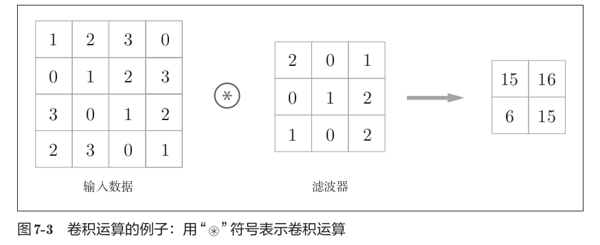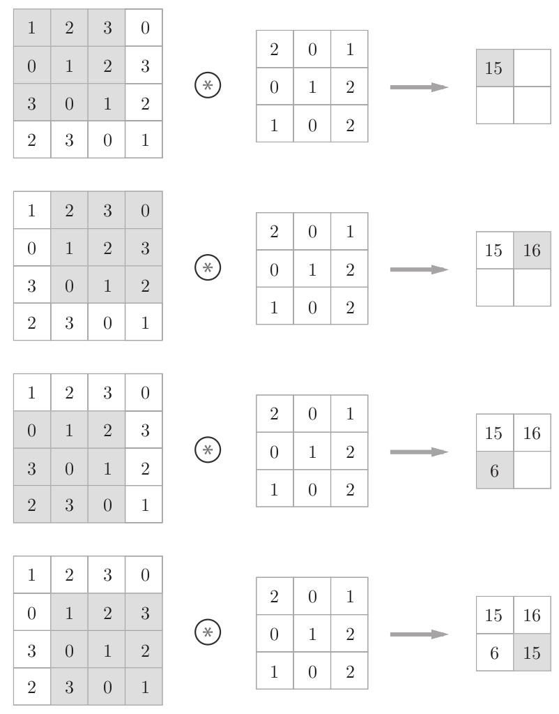

在全连接的神经网络中，除了权重参数，还存在偏置。CNN中，**滤波器的参数就对应之前的权重**。并且，CNN中也存在偏置。向应用了滤波器的数据加上偏置，偏置通常只有1个(1×1)，这个值会**被加到应用了滤波器的所有元素上**。
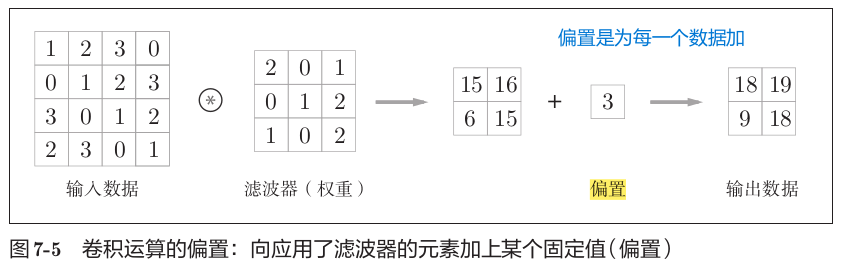

### 7.2.3 填充

在进行卷积层的处理之前，有时要向输入数据的周围填入固定的数据（比如0等），这称为**填充**，是卷积运算中经常会用到的处理。

>如下，对大小为(4,4)的输入数据应用了幅度为1的填充。“幅度为1的填充”是指用幅度为1像素的0填充周围。通过填充，大小为(4,4)的输入数据变成了(6,6)的形状。然后，应用大小为(3,3)的滤波器，生成了大小为(4,4)的输出数据。填充的值可以设置成2、3等任意的整数。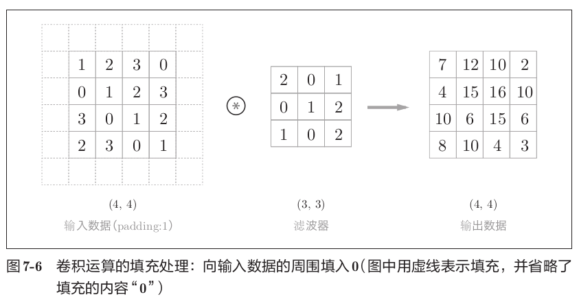

使用填充主要是为了调整输出的大小。如果**每次进行卷积运算都会缩小空间**，在反复进行多次卷积运算的深度网络中，**某个时刻输出大小就有可能变为1**，导致**无法再应用卷积运算**。为了避免出现这样的情况，就要使用填充。将填充的幅度设为1，那么相对于输入大小(4,4)，输出大小也保持为原来的(4,4)。因此，卷积运算就可以在保持空间大小不变的情况下将数据传给下一层。

### 7.2.4 步幅

应用滤波器的位置间隔称为**步幅**。之前的例子中步幅都是1，如果将步幅设为2，则应用滤波器的窗口的间隔变为2个元素。增大步幅后，输出大小会变小。而增大填充后，输出大小会变大。

假设输入大小为(H,W)，滤波器大小为(FH,FW)，输出大小为(OH,OW)，填充为P，步幅为S。此时，输出大小可通过以下公式进行计算：

$$OH = \frac{H + 2P - FH}{S} + 1$$

$$OW = \frac{W + 2P - FW}{S} + 1$$

>例如，输入大小(4,4)，填充1，步幅1，滤波器大小(3,3)时，输出大小为(4,4)。输入大小(7,7)，填充0，步幅2，滤波器大小(3,3)时，输出大小为(3,3)。输入大小(28,31)，填充2，步幅3，滤波器大小(5,5)时，输出大小为(10,10)。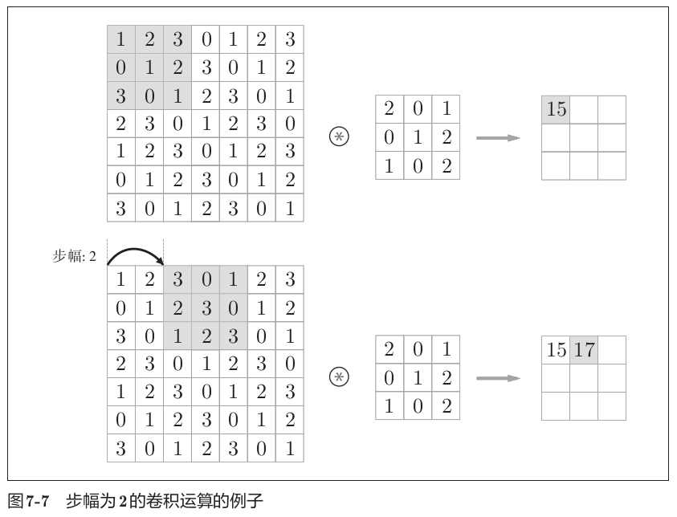

这里需要注意的是，所设定的值必须使$\frac{H + 2P - FH}{S}$和$\frac{W + 2P - FW}{S}$分别可以**除尽**。当输出大小无法除尽时（结果是小数时），需要采取报错等对策。根据深度学习框架的不同，当值无法除尽时，有时会向最接近的整数四舍五入，不进行报错而继续运行。

### 7.2.5 三维数据的卷积运算

之前的卷积运算的例子都是以有高、长方向的二维形状为对象的。但是，图像是三维数据，除了高、长方向之外，还需要处理通道方向。

和二维数据时相比，纵深方向（通道方向）上特征图增加了。通道方向上有多个特征图时，**先是纵深方向上的输入数据与滤波器进行卷积运算，再将通道对应位置数据相加（先卷积再相加）**，从而得到输出。
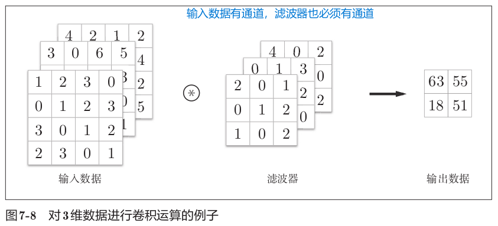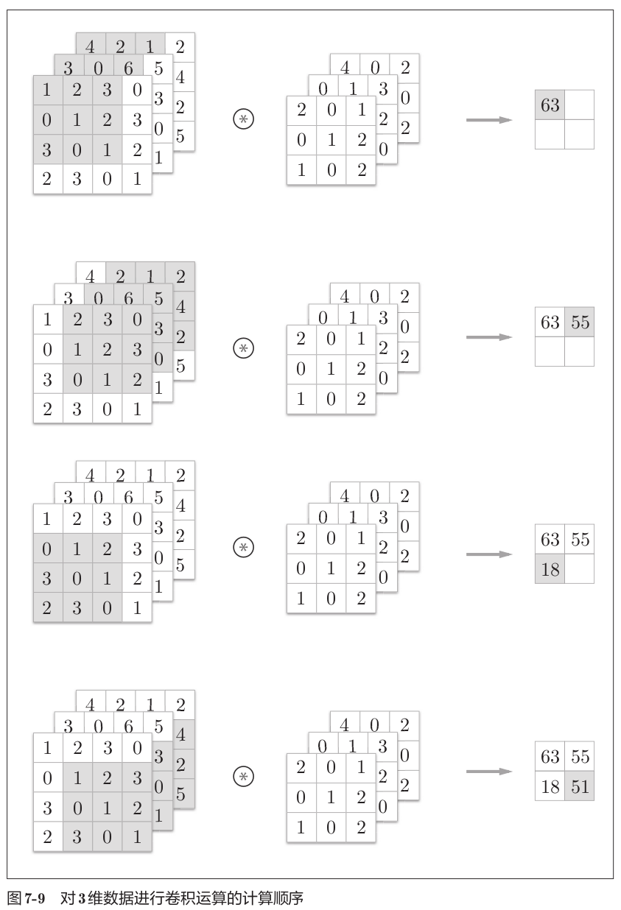

在三维数据的卷积运算中，**输入数据和滤波器的通道数要设为相同的值**。滤波器的通道数必须和输入数据的通道数一致。滤波器大小可以设定为任意值，不过**每个通道的滤波器大小要全部相同**。

### 7.2.6 结合方块思考

将数据和滤波器结合长方体的方块来考虑，三维数据的卷积运算会很容易理解。把三维数据表示为多维数组时，**书写顺序为(channel, height, width)**。比如，通道数为C、高度为H、长度为W的数据的形状可以写成(C,H,W)。滤波器也一样，要按(channel, height, width)的顺序书写。比如，通道数为C、滤波器高度为FH、长度为FW时，可以写成(C,FH,FW)。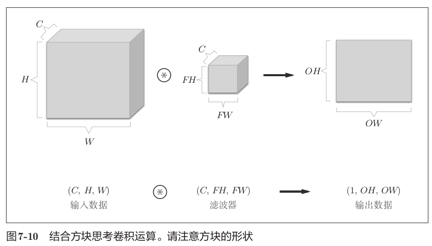

在这个例子中，数据输出是1张特征图，也就是通道数为1的特征图。如果要在通道方向上也拥有多个卷积运算的输出，就需要用到**多个滤波器（权重）**。通过应用FN个滤波器，输出特征图也生成了FN个。如果将这FN个特征图汇集在一起，就得到了形状为(FN,OH,OW)的方块。将这个方块传给下一层，就是CNN的处理流。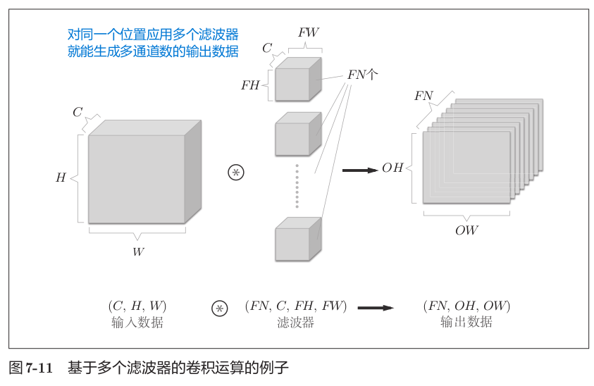

关于卷积运算的滤波器，也必须考虑滤波器的数量。因此，作为四维数据，**滤波器的权重数据要按(output_channel, input_channel, height, width)的顺序书写**。比如，通道数为3、大小为5×5的滤波器有20个时，可以写成(20,3,5,5)。

卷积运算中（和全连接层一样）存在偏置。每个通道只有一个偏置。偏置的形状是(FN,1,1)，滤波器的输出结果的形状是(FN,OH,OW)。这两个方块相加时，要对滤波器的输出结果(FN,OH,OW)按通道加上相同的偏置值。不同形状的方块相加时，可以基于NumPy的广播功能轻松实现。
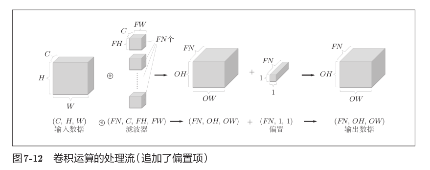

### 7.2.7 批处理
**实际上就是上图的利用多个滤波器输出多通道。**

神经网络的处理中进行了将输入数据打包的批处理。之前的全连接神经网络的实现也对应了批处理，通过批处理，能够实现处理的高效化和学习时对mini-batch的对应。

卷积运算也同样对应批处理。为此，需要将在各层间传递的数据保存为四维数据。具体地讲，就是按(batch_num, channel, height, width)的顺序保存数据。批处理版的数据流中，在各个数据的开头添加了批用的维度。数据作为四维的形状在各层间传递，对这N个数据进行了卷积运算。也就是说，批处理将N次的处理汇总成了1次进行。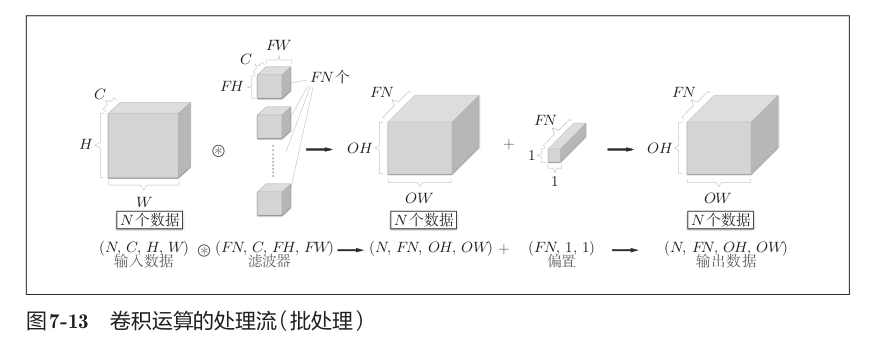

## 7.3 池化层
### 7.3.1 池化层的基本概念
池化是缩小高、长方向上的空间的运算。
>例如，进行将2×2的区域集约成1个元素的处理，缩小空间大小。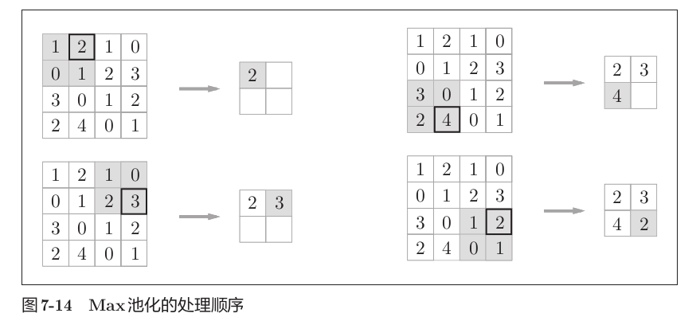

**Max池化**是获取最大值的运算，2×2表示目标区域的大小（例子如上图）。从2×2的区域中**取出最大的元素**。
一般来说，**池化的窗口大小会和步幅设定成相同的值**。比如，3×3的窗口的步幅会设为3，4×4的窗口的步幅会设为4等。

除了Max池化之外，还有**Average池化**等。Average池化是计算目标区域的平均值。
>在图像识别领域，主要使用Max池化。
>因此，本书中说到“池化层”时，指的是Max池化。

### 7.3.2 池化层的特征

1. **没有要学习的参数**：池化层和卷积层不同，池化只是从目标区域中取最大值（或者平均值），所以不存在要学习的参数。
2. **通道数不发生变化**：经过池化运算，输入数据和输出数据的通道数不会发生变化，计算是按通道独立进行的。
3. **对微小的位置变化具有鲁棒性（健壮）**：输入数据发生微小偏差时，池化仍会返回相同的结果。因此，池化对输入数据的微小偏差具有鲁棒性。比如，3×3的池化的情况下，池化会吸收输入数据的偏差（根据数据的不同，结果有可能不一致）。

## 7.4 卷积层和池化层的实现

### 7.4.1 四维数组

CNN中各层间传递的数据是四维数据。
>比如数据的形状是(10,1,28,28)，则它对应10个高为28、长为28、通道为1的数据。
要访问第1个数据，可以写成x[0]。
要访问第2个数据，可以写成x[1]。
要访问第1个数据的第1个通道的空间数据，可以写成x[0, 0]或者x[0][0]。

### 7.4.2 基于im2col（"image to column"，从图像到矩阵）的展开
我们不使用for语句，而是使用**im2col**这个便利的函数进行简单的实现。

im2col是一个函数，将输入数据展开以适合滤波器（权重）。对三维的输入数据应用im2col后，数据转换为二维矩阵（正确地讲，是把包含批数量的四维数据转换成了二维数据）。
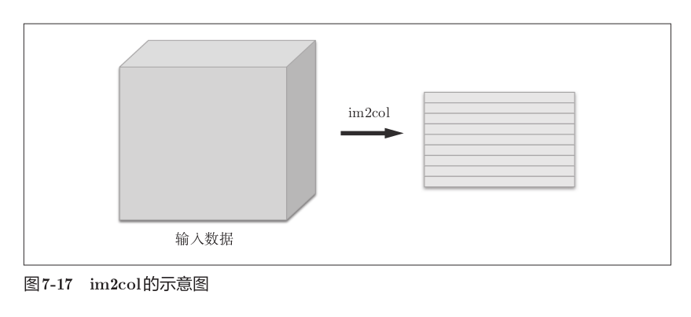

im2col会把输入数据展开以适合滤波器。具体地说，对于输入数据，将应用滤波器的区域（三维方块）横向展开为1列。im2col会在所有应用滤波器的地方进行这个展开处理。在滤波器的应用区域重叠的情况下，使用im2col展开后，展开后的元素个数会多于原方块的元素个数。因此，使用im2col的实现存在比普通的实现消耗更多内存的缺点。但是，汇总成一个大的矩阵进行计算，对计算机的计算颇有益处。在矩阵计算的库等中，矩阵计算的实现已被高度最优化，可以高速地进行大矩阵的乘法运算。因此，通过归结到矩阵计算上，可以有效地利用线性代数库。

使用im2col展开输入数据后，之后只需将卷积层的滤波器（权重）纵向展开为1列，并计算两个矩阵的乘积即可。这和全连接层的Affine层进行的处理基本相同。基于im2col方式的输出结果是二维矩阵。因为CNN中数据会保存为四维数组，所以要将二维输出数据转换为合适的形状。

总而言之，使用im2col能够方便地计算卷积。
举个例子：
```
输入数据（4×4）：
 1  2  3  4
 5  6  7  8
 9 10 11 12
13 14 15 16

滤波器（3×3）：
 a  b  c
 d  e  f
 g  h  i
 正常卷积时，滤波器窗口依次覆盖4个3×3区域，每个区域做乘积累加。

区域1（左上角）：
 1  2  3
 5  6  7
 9 10 11
输出(0,0) = 1a + 2b + 3c + 5d + 6e + 7f + 9g + 10h + 11i

区域2（右上角）：
 2  3  4
 6  7  8
10 11 12
输出(0,1) = 2a + 3b + 4c + 6d + 7e + 8f + 10g + 11h + 12i

区域3（左下角）：
 5  6  7
 9 10 11
13 14 15
输出(1,0) = 5a + 6b + 7c + 9d + 10e + 11f + 13g + 14h + 15i

区域4（右下角）：
 6  7  8
10 11 12
14 15 16
输出(1,1) = 6a + 7b + 8c + 10d + 11e + 12f + 14g + 15h + 16i
```

```
im2col将上述4个区域分别横向拉成一行，拼成一个4行9列的矩阵：
[ 1  2  3  5  6  7  9 10 11 ]    ← 区域1
[ 2  3  4  6  7  8 10 11 12 ]    ← 区域2
[ 5  6  7  9 10 11 13 14 15 ]    ← 区域3
[ 6  7  8 10 11 12 14 15 16 ]    ← 区域4
原来的16个元素变成了36个元素（4行×9列），数据被复制了多次。

im2col将滤波器纵向拉成一列，得到9行1列的矩阵：
[ a ]
[ b ]
[ c ]
[ d ]
[ e ]
[ f ]
[ g ]
[ h ]
[ i ]

进行矩阵乘法：
[ 1  2  3  5  6  7  9 10 11 ]   [ a ]   [ 1a+2b+3c+5d+6e+7f+9g+10h+11i ]
[ 2  3  4  6  7  8 10 11 12 ]   [ b ]   [ 2a+3b+4c+6d+7e+8f+10g+11h+12i ]
[ 5  6  7  9 10 11 13 14 15 ] × [ c ] = [ 5a+6b+7c+9d+10e+11f+13g+14h+15i ]
[ 6  7  8 10 11 12 14 15 16 ]   [ d ]   [ 6a+7b+8c+10d+11e+12f+14g+15h+16i ]
                                [ e ]
                                [ f ]
                                [ g ]
                                [ h ]
                                [ i ]
矩阵乘法的结果是一个4行1列的矩阵，四个值正好对应四个卷积输出。

将4行1列reshape为2行2列，得到最终输出：
[ 输出(0,0)  输出(0,1) ]
[ 输出(1,0)  输出(1,1) ]
 这就是im2col的全部过程。
```
一般的示意图：
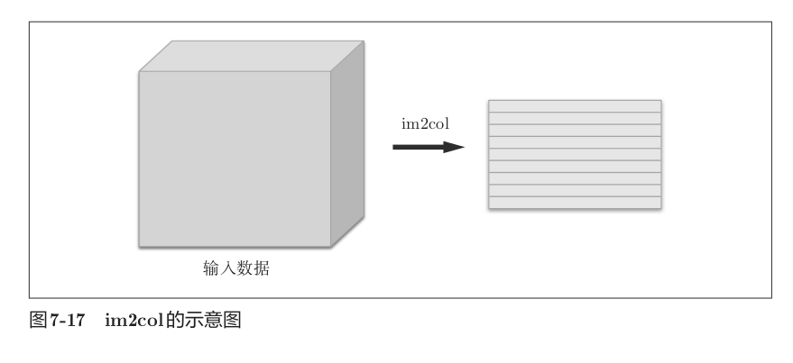
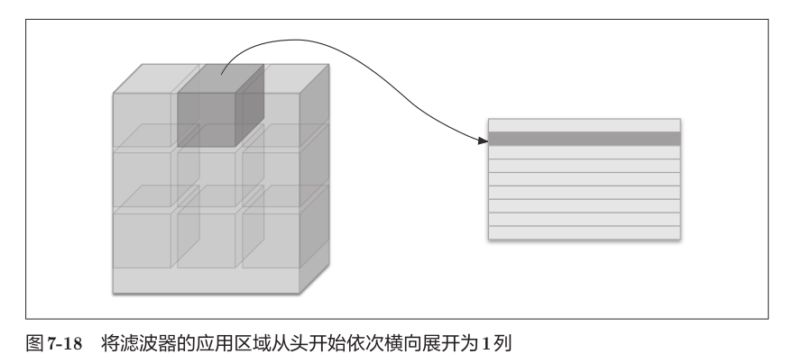
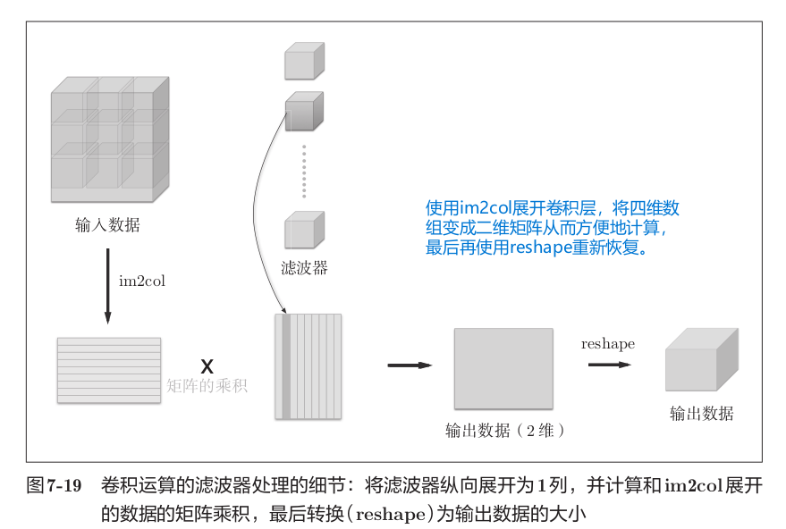

### 7.4.3 卷积层的实现

本书提供了im2col函数，并将这个im2col函数作为黑盒使用。im2col函数具有以下接口：

```python
im2col(input_data, filter_h, filter_w, stride=1, pad=0)
```

其中，input_data是由（数据量，通道，高，长）的四维数组构成的输入数据，filter_h是滤波器的高，filter_w是滤波器的长，stride是步幅，pad是填充。

使用im2col展开后，卷积层的实现变得非常简单。卷积层的初始化方法将滤波器（权重）、偏置、步幅、填充作为参数接收。滤波器是(FN, C, FH, FW)的四维形状。FN、C、FH、FW分别是Filter Number（滤波器数量）、Channel、Filter Height、Filter Width的缩写。

在forward实现中，用im2col展开输入数据，并用reshape将滤波器展开为二维数组。然后，计算展开后的矩阵的乘积。展开滤波器时，通过reshape(FN,-1)将各个滤波器的方块纵向展开为1列。通过在reshape时指定为-1，reshape函数会自动计算-1维度上的元素个数，以使多维数组的元素个数前后一致。
>比如，(10,3,5,5)形状的数组的元素个数共有750个，指定reshape(10,-1)后，就会转换成(10,75)形状的数组。

forward的实现中，最后会将输出大小转换为合适的形状。转换时使用了NumPy的transpose函数。transpose会更改多维数组的轴的顺序，通过指定从0开始的索引序列，就可以更改轴的顺序。
```python
class Convolution:
    def __init__(self, W, b, stride=1, pad=0):
        self.W = W
        self.b = b
        self.stride = stride
        self.pad = pad

    def forward(self, x):
        FN, C, FH, FW = self.W.shape
        N, C, H, W = x.shape
        out_h = int(1 + (H + 2*self.pad - FH) / self.stride)
        out_w = int(1 + (W + 2*self.pad - FW) / self.stride)
        col = im2col(x, FH, FW, self.stride, self.pad)
        col_W = self.W.reshape(FN, -1).T # 滤波器的展开
        out = np.dot(col, col_W) + self.b
        out = out.reshape(N, out_h, out_w, -1).transpose(0, 3, 1, 2)
        return out
```

以上就是卷积层的forward处理的实现。通过使用im2col进行展开，基本上可以像实现全连接层的Affine层一样来实现。在进行卷积层的反向传播时，必须进行im2col的逆处理，这可以使用本书提供的col2im函数来进行。除了使用col2im这一点，卷积层的反向传播和Affine层的实现方式都一样。

### 7.4.4 池化层的实现

池化层的实现和卷积层相同，都使用im2col展开输入数据。不过，池化的情况下，在通道方向上是独立的，这一点和卷积层不同。池化的应用区域按通道单独展开。
```text
池化层使用im2col实现的例子

输入数据（单通道，4×4）：

 1  2  3  4
 5  6  7  8
 9 10 11 12
13 14 15 16

进行2×2的Max池化，步幅为2，无填充。

正常池化时，窗口依次覆盖4个2×2区域，每个区域取最大值。

区域1（左上角）：
 1  2
 5  6
最大值 = 6

区域2（右上角）：
 3  4
 7  8
最大值 = 8

区域3（左下角）：
 9 10
13 14
最大值 = 14

区域4（右下角）：
11 12
15 16
最大值 = 16

池化输出为2×2：
 6  8
14 16
```
```text
im2col将上述4个区域分别横向拉成一行

[ 1  2  5  6 ]    ← 区域1
[ 3  4  7  8 ]    ← 区域2
[ 9 10 13 14 ]    ← 区域3
[11 12 15 16 ]    ← 区域4

对展开后的矩阵，在行方向（axis=1）上取最大值：

[ 6 ]    ← 区域1的最大值
[ 8 ]    ← 区域2的最大值
[ 14 ]   ← 区域3的最大值
[ 16 ]   ← 区域4的最大值

将4行1列reshape为2行2列，得到最终池化输出：

[ 6  8 ]
[14 16 ]

```

```text
"在通道方向上单独展开"指的是池化层处理多通道数据时，
各个通道之间互不干扰，彼此独立地进行im2col展开和池化运算。

输入数据是3通道的4×4图像：

通道1：          通道2：          通道3：
 1  2  3  4      9 10 11 12      1  3  5  7
 5  6  7  8     13 14 15 16      2  4  6  8
 9 10 11 12      1  2  3  4      9 11 13 15
13 14 15 16      5  6  7  8     10 12 14 16

进行2×2的Max池化，步幅为2。

im2col展开时，每个通道各自独立地取出4个2×2窗口，分别拉成一行：

通道1展开（每个窗口拉成一行，共4行×4列）：
[ 1  2  5  6 ]    ← 窗口1
[ 3  4  7  8 ]    ← 窗口2
[ 9 10 13 14 ]    ← 窗口3
[11 12 15 16 ]    ← 窗口4

通道2展开（每个窗口拉成一行，共4行×4列）：
[ 9 10 13 14 ]    ← 窗口1
[11 12 15 16 ]    ← 窗口2
[ 1  2  5  6 ]    ← 窗口3
[ 3  4  7  8 ]    ← 窗口4

通道3展开（每个窗口拉成一行，共4行×4列）：
[ 1  3  2  4 ]    ← 窗口1
[ 5  7  6  8 ]    ← 窗口2
[ 9 11 10 12 ]    ← 窗口3
[13 15 14 16 ]    ← 窗口4

三个通道分别展开后，各自独立取最大值，得到各自的池化结果。

通道1取最大值得到：
[ 6  8 ]
[14 16 ]

通道2取最大值得到：
[14 16 ]
[ 6  8 ]

通道3取最大值得到：
[ 4  8 ]
[12 16 ]

将三个通道的输出拼在一起，通道数保持为3不变。

整个过程中，三个通道的数据从未混合，
每个通道的展开矩阵只包含该通道自身的元素。
```
示例图：
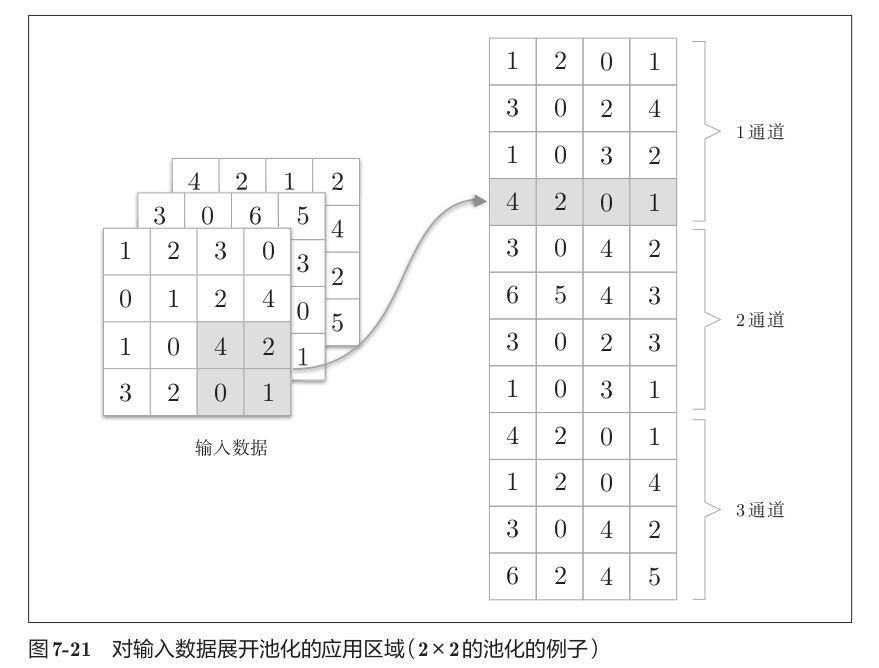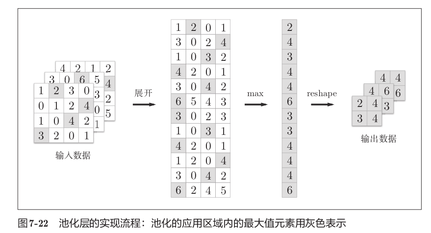

像这样展开之后，只需对展开的矩阵求各行的最大值，并转换为合适的形状即可。池化层的实现按下面三个阶段进行：

1. 展开输入数据。
2. 求各行的最大值。
3. 转换为合适的输出大小。

各阶段的实现都很简单，只有一两行代码。最大值的计算可以使用NumPy的np.max方法。np.max可以指定axis参数，并在这个参数指定的各个轴方向上求最大值。比如，如果写成np.max(x, axis=1)，就可以在输入x的第1维的各个轴方向上求最大值。
```python
class Pooling:
    def __init__(self, pool_h, pool_w, stride=1, pad=0):
        self.pool_h = pool_h
        self.pool_w = pool_w
        self.stride = stride
        self.pad = pad
    def forward(self, x):
        N, C, H, W = x.shape
        out_h = int(1 + (H - self.pool_h) / self.stride)
        out_w = int(1 + (W - self.pool_w) / self.stride)
        # 展开 (1)
        col = im2col(x, self.pool_h, self.pool_w, self.stride, self.pad)
        col = col.reshape(-1, self.pool_h*self.pool_w)
        # 最大值 (2)
        out = np.max(col, axis=1)
        # 转换 (3)
        out = out.reshape(N, out_h, out_w, C).transpose(0, 3, 1, 2)
        return out
```

以上就是池化层的forward处理的介绍。通过将输入数据展开为容易进行池化的形状，后面的实现就会变得非常简单。池化层的backward处理可以参考ReLU层的实现中使用的max的反向传播。

## 7.5 CNN的实现

组合已经实现的卷积层和池化层，搭建进行手写数字识别的CNN。网络的构成是"Convolution - ReLU - Pooling - Affine - ReLU - Affine - Softmax"，将实现为名为SimpleConvNet的类。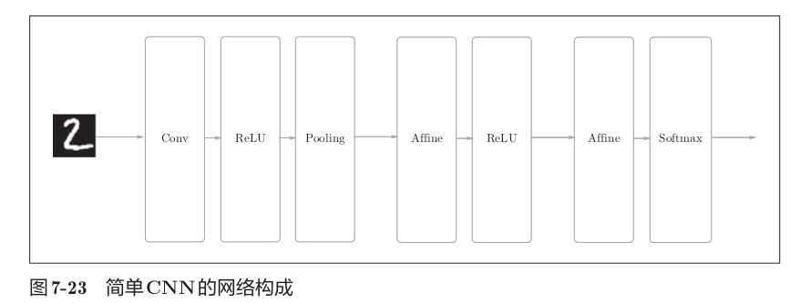

SimpleConvNet的初始化方法取以下参数：
- input_dim表示输入数据的维度（通道，高，长）
- conv_param是卷积层的超参数（字典），包含：
    - filter_num滤波器的数量
    - filter_size滤波器的大小
    - stride步幅
    - pad填充
- hidden_size是隐藏层（全连接）的神经元数量
- output_size是输出层（全连接）的神经元数量
- weight_init_std是初始化时权重的标准差。
>设：`{'filter_num':30,'filter_size':5, 'pad':0, 'stride':1}`

在初始化的最开始部分，将由初始化参数传入的卷积层的超参数从字典中取了出来，然后计算卷积层的输出大小。
```python
class SimpleConvNet:
    def __init__(self, input_dim=(1, 28, 28),
                 conv_param={'filter_num':30, 'filter_size':5,
                             'pad':0, 'stride':1},
                 hidden_size=100, output_size=10, weight_init_std=0.01):

        filter_num = conv_param['filter_num']
        filter_size = conv_param['filter_size']
        filter_pad = conv_param['pad']
        filter_stride = conv_param['stride']
        input_size = input_dim[1]

        conv_output_size = (input_size - filter_size + 2*filter_pad) / filter_stride + 1

        pool_output_size = int(filter_num * (conv_output_size/2) * (conv_output_size/2))
```
接下来是权重参数的初始化。学习所需的参数是第1层的卷积层和剩余两个全连接层的权重和偏置。将这些参数保存在实例变量的params字典中。将第1层的卷积层的权重设为关键字W1，偏置设为关键字b1。同样，分别用关键字W2、b2和关键字W3、b3来保存第2个和第3个全连接层的权重和偏置。
```python
self.params = {}

# 第1层卷积层的权重，形状为(滤波器数量, 输入通道数, 滤波器高, 滤波器宽)
# filter_num=30, input_dim[0]=1, filter_size=5 → 形状(30, 1, 5, 5)
self.params['W1'] = weight_init_std * \
    np.random.randn(filter_num, input_dim[0], filter_size, filter_size)

# 第1层卷积层的偏置，每个滤波器对应一个偏置，形状为(30,)
self.params['b1'] = np.zeros(filter_num)

# 第1个全连接层的权重，形状为(池化层输出展平后的维度, 隐藏层神经元数)
# pool_output_size=4320, hidden_size=100 → 形状(4320, 100)
self.params['W2'] = weight_init_std * \
    np.random.randn(pool_output_size, hidden_size)

# 第1个全连接层的偏置，形状为(100,)
self.params['b2'] = np.zeros(hidden_size)

# 第2个全连接层的权重，形状为(隐藏层神经元数, 输出层神经元数)
# hidden_size=100, output_size=10 → 形状(100, 10)
self.params['W3'] = weight_init_std * \
    np.random.randn(hidden_size, output_size)

# 第2个全连接层的偏置，形状为(10,)
self.params['b3'] = np.zeros(output_size)
```

最后生成必要的层。从最前面开始按顺序向有序字典（OrderedDict）的layers中添加层。只有最后的SoftmaxWithLoss层被添加到别的变量lastLayer中。
```python
# 使用有序字典保存网络各层，保证正向和反向传播时的顺序
self.layers = OrderedDict()

# 第1层：卷积层，使用W1和b1作为参数，传入步幅和填充
self.layers['Conv1'] = Convolution(self.params['W1'],
    self.params['b1'],
    conv_param['stride'],
    conv_param['pad'])

# 第2层：ReLU激活函数层
self.layers['Relu1'] = Relu()

# 第3层：池化层，窗口大小2×2，步幅为2
self.layers['Pool1'] = Pooling(pool_h=2, pool_w=2, stride=2)

# 第4层：第1个全连接层，使用W2和b2作为参数
self.layers['Affine1'] = Affine(self.params['W2'],
    self.params['b2'])

# 第5层：ReLU激活函数层
self.layers['Relu2'] = Relu()

# 第6层：第2个全连接层，使用W3和b3作为参数
self.layers['Affine2'] = Affine(self.params['W3'],
    self.params['b3'])

# 输出层：SoftmaxWithLoss层（单独保存，不放入layers字典）
self.last_layer = SoftmaxWithLoss()
```

像这样初始化后，进行推理的predict方法和求损失函数值的loss方法就可以实现。参数x是输入数据，t是教师标签。用于推理的predict方法从头开始依次调用已添加的层，并将结果传递给下一层。在求损失函数的loss方法中，除了使用predict方法进行的forward处理之外，还会继续进行forward处理，直到到达最后的SoftmaxWithLoss层。
```python
# 使用有序字典保存网络各层，保证正向和反向传播时的顺序
self.layers = OrderedDict()

# 第1层：卷积层，使用W1和b1作为参数，传入步幅和填充
self.layers['Conv1'] = Convolution(self.params['W1'],
    self.params['b1'],
    conv_param['stride'],
    conv_param['pad'])

# 第2层：ReLU激活函数层
self.layers['Relu1'] = Relu()

# 第3层：池化层，窗口大小2×2，步幅为2
self.layers['Pool1'] = Pooling(pool_h=2, pool_w=2, stride=2)

# 第4层：第1个全连接层，使用W2和b2作为参数
self.layers['Affine1'] = Affine(self.params['W2'],
    self.params['b2'])

# 第5层：ReLU激活函数层
self.layers['Relu2'] = Relu()

# 第6层：第2个全连接层，使用W3和b3作为参数
self.layers['Affine2'] = Affine(self.params['W3'],
    self.params['b3'])

# 输出层：SoftmaxWithLoss层（单独保存，不放入layers字典）
self.last_layer = SoftmaxWithLoss()
```

参数的梯度通过误差反向传播法求出，通过把正向传播和反向传播组装在一起来完成。因为已经在各层正确实现了正向传播和反向传播的功能，所以只需要以合适的顺序调用即可。最后，把各个权重参数的梯度保存到grads字典中。
```python
def predict(self, x):
    # 按顺序遍历所有层，依次进行正向传播
    for layer in self.layers.values():
        x = layer.forward(x)
    return x

def loss(self, x, t):
    # 先进行推理得到网络的输出y
    y = self.predict(x)
    # 将输出y和教师标签t传入SoftmaxWithLoss层计算损失
    return self.lastLayer.forward(y, t)
```

如果使用MNIST数据集训练SimpleConvNet，训练数据的识别率为99.82%，测试数据的识别率为98.96%（每次学习的识别精度都会发生一些误差）。测试数据的识别率大约为99%，就小型网络来说，这是一个非常高的识别率。卷积层和池化层是图像识别中必备的模块。CNN可以有效读取图像中的某种特性，在手写数字识别中，还可以实现高精度的识别。
```python
def gradient(self, x, t):
    # 正向传播：调用loss方法执行正向传播，各层会保存反向传播所需的中间值
    self.loss(x, t)

    # 反向传播的初始信号，损失对自身求导为1
    dout = 1
    # 从输出层开始反向传播，得到损失对Affine2输入的梯度
    dout = self.lastLayer.backward(dout)

    # 将layers字典中的所有层取出，反转顺序
    layers = list(self.layers.values())
    layers.reverse()
    # 按相反顺序依次调用各层的backward方法
    for layer in layers:
        dout = layer.backward(dout)

    # 从各层中取出计算好的梯度，组装成grads字典
    grads = {}
    grads['W1'] = self.layers['Conv1'].dW   # 卷积层权重的梯度
    grads['b1'] = self.layers['Conv1'].db   # 卷积层偏置的梯度
    grads['W2'] = self.layers['Affine1'].dW # 第1个全连接层权重的梯度
    grads['b2'] = self.layers['Affine1'].db # 第1个全连接层偏置的梯度
    grads['W3'] = self.layers['Affine2'].dW # 第2个全连接层权重的梯度
    grads['b3'] = self.layers['Affine2'].db # 第2个全连接层偏置的梯度

    return grads
```

## 7.6 CNN的可视化

### 7.6.1 第1层权重的可视化

对MNIST数据集进行了简单的CNN学习。当时，第1层的卷积层的权重的形状是(30,1,5,5)，即30个大小为5×5、通道为1的滤波器。滤波器大小是5×5、通道数是1，意味着滤波器可以可视化为1通道的灰度图像。将卷积层（第1层）的滤波器显示为图像，比较学习前和学习后的权重。
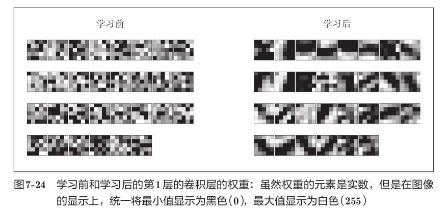

学习前的滤波器是随机进行初始化的，所以在黑白的浓淡上没有规律可循，但学习后的滤波器变成了有规律的图像。通过学习，滤波器被更新成了**有规律的滤波器**，比如从白到黑渐变的滤波器、含有块状区域的滤波器等。

这些有规律的滤波器在观察边缘（颜色变化的分界线）和斑块（局部的块状区域）等。比如，左半部分为白色、右半部分为黑色的滤波器的情况下，会对垂直方向上的边缘有响应。选择两个学习完的滤波器对输入图像进行卷积处理时，"滤波器1"对垂直方向上的边缘有响应，"滤波器2"对水平方向上的边缘有响应。由此可知，卷积层的滤波器会提取边缘或斑块等原始信息，并将这些原始信息传递给后面的层。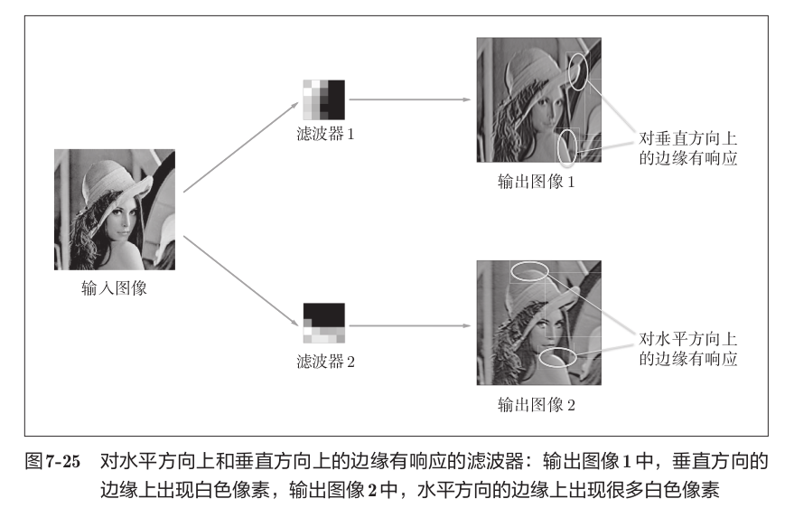

### 7.6.2 基于分层结构的信息提取

上面的结果是针对第1层的卷积层得出的。第1层的卷积层中提取了边缘或斑块等"低级"信息，那么在堆叠了多层的CNN中，**随着层次加深，提取的信息（正确地讲，是反映强烈的神经元）也越来越抽象**。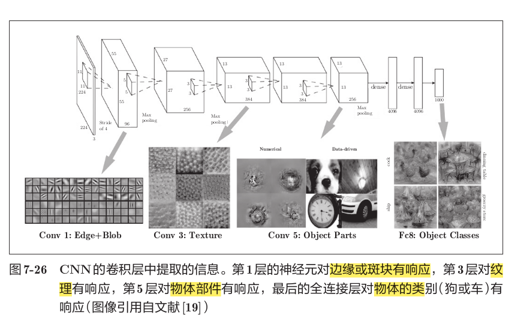

进行一般物体识别（车或狗等）的8层CNN中，堆叠了多层卷积层和池化层，最后经过全连接层输出结果。最开始的层对简单的边缘有响应，接下来的层对纹理有响应，再后面的层对更加复杂的物体部件有响应。也就是说，**随着层次加深，神经元从简单的形状向"高级"信息变化**。就像我们理解东西的"含义"一样，响应的对象在逐渐变化。

## 7.7 具有代表性的CNN（了解性内容）

### 7.7.1 LeNet

LeNet在1998年被提出，是进行手写数字识别的网络，也是最早的CNN。它有连续的卷积层和池化层（正确地讲，是只"抽选元素"的子采样层），最后经全连接层输出结果。

和"现在的CNN"相比，LeNet有几个不同点。LeNet中使用sigmoid函数作为激活函数，而现在的CNN中主要使用ReLU函数。此外，原始的LeNet中使用子采样缩小中间数据的大小，而现在的CNN中Max池化是主流。

LeNet与现在的CNN虽然有些许不同，但差别并不是那么大。LeNet是20多年前提出的最早的CNN，这令人十分称奇。

### 7.7.2 AlexNet

在LeNet问世20多年后，AlexNet被发布出来。AlexNet是引发深度学习热潮的导火线，不过它的网络结构和LeNet基本上没有什么不同。AlexNet叠有多个卷积层和池化层，最后经由全连接层输出结果。

虽然结构上AlexNet和LeNet没有大的不同，但有以下几点差异：激活函数使用ReLU，使用进行局部正规化的LRN（Local Response Normalization）层，使用Dropout。

关于网络结构，LeNet和AlexNet没有太大的不同。但是，围绕它们的环境和计算机技术有了很大的进步。现在任何人都可以获得大量的数据。而且，擅长大规模并行计算的GPU得到普及，高速进行大量的运算已经成为可能。大数据和GPU已成为深度学习发展的巨大的原动力。大多数情况下，深度学习（加深了层次的网络）存在大量的参数，因此学习需要大量的计算，并且需要使那些参数"满意"的大量数据，GPU和大数据给这些课题带来了希望。

