# 第五章 误差反向传播法
## 5.1 利用计算图表示误差反向传播
### 5.1.1　用计算图求解
计算图通过节点和箭头表示计算过程。节点用 $○$ 表示，$○$ 中是计算的内
容。将计算的中间结果写在箭头的上方，表示各个节点的计算结果从左向右
传递。
#### 实际案例
1. 问题1：在超市买了2个100日元一个的苹果，消费税是10%，请计算支付金额。
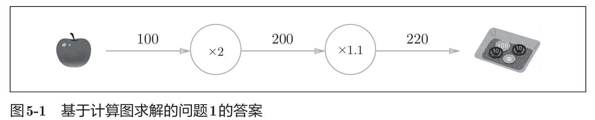
不过只用○表示乘法运算“×”也是可行的，可以表示为
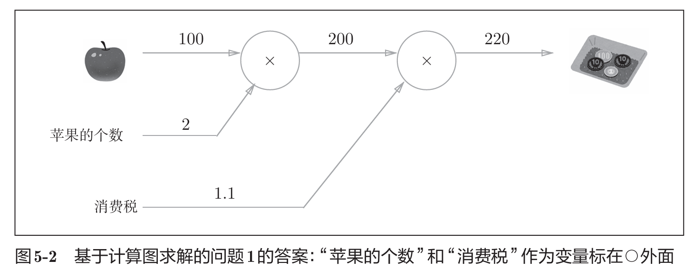
2. 问题2：在超市买了2个苹果、3个橘子。其中，苹果每个100日元，橘子每个150日元。消费税是10%，请计算支付金额。
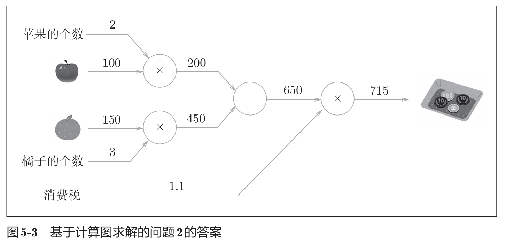
#### 一般方法
1. 构建计算图。
2. 在计算图上，从左向右进行计算。
>这里的第2步的“从左向右进行计算”是一种正方向上的传播，简称为**正向传播（forward propagation）**。正向传播是从计算图出发点到结束点的传播。
>当然也可以考虑反向（从图上看的话，就是从右向左）的传播。实际上，这种传播称为**反向传播（backward propagation）**。反向传播将在接下来的**导数计算**中发挥重要作用。
### 5.1.2　局部计算
>计算图的特征:通过传递“局部计算”获得最终结果。
>“局部”的意思是“与自己相关的某个小范围”。
>局部计算是指，无论全局发生了什么，都能只根据与自己相关的信息输出接下来的结果。

在具体的计算中，各个节点处只需进行与自己有关的计算，不用考虑全局。
>计算图可以集中精力于局部计算。无论全局的计算有多么复杂，各个步骤所要做的就是对象节点的局部计算。
>虽然局部计算非常简单，但是通过传递它的计算结果，可以获得全局的复杂计算的结果。
### 5.1.3　为何用计算图解题
#### 计算图的优点

1. 使各个节点致力于简单的计算，从而简化问题。
2. 可以将中间的计算结果全部保存起来。
3. 可以通过反向传播高效计算导数。

#### 反向传播的实际案例

问题1中，我们计算了购买2个苹果时加上消费税最终需要支付的金额。这里，假设我们想知道苹果价格的上涨会在多大程度上影响最终的支付金额，即求“支付金额关于苹果的价格的导数”。

设苹果的价格为 $x$，支付金额为 $L$，相当于求解 $\frac{\partial{L}}{\partial{x}}$ ，则可以表示为：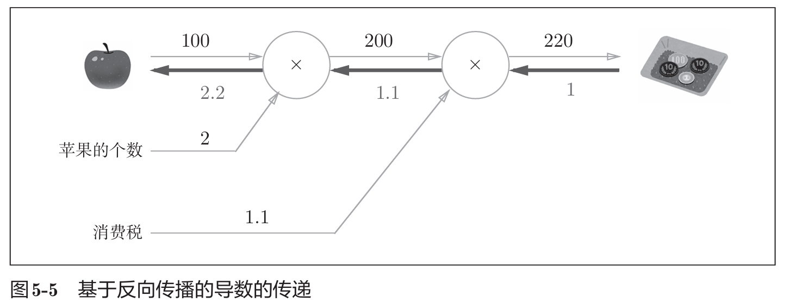

反向传播使用与正方向相反的箭头（粗线）表示。反向传播传递“局部导数”，将导数的值写在箭头的下方。
>计算中途求得的导数的结果（中间传递的导数）可以被共享，从而可以高效地计算多个导数。这边是计算图的优点，可以通过正向传播和反向传播高效地计算各个变量的**导数值**。

## 5.2 链式法则
反向传播原理，是基于链式法则（chain rule）的。

### 5.2.1　计算图的反向传播
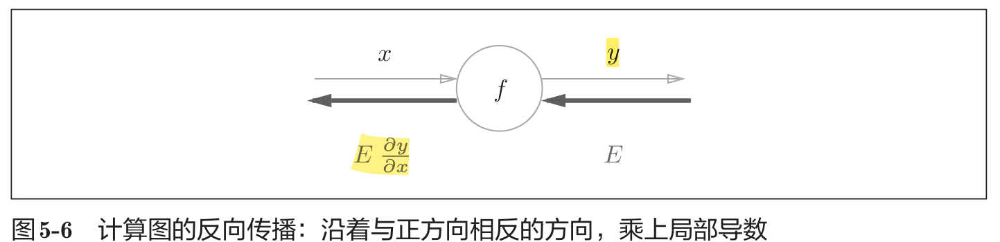
反向传播的计算顺序：将信号 $E$ 乘以节点的局部导数（$\frac{\partial{L}}{\partial{x}}$），然后将结果传递给下一个节点。
>这里所说的局部导数是指正向传播中 $y=f(x)$ 的导数，也就是 $y$ 关于 $x$ 的导数（$\frac{\partial{L}}{\partial{x}}$）.

###　5.2.２　链式法则在计算图的具体案例
函数 $f=(x+y)^2$ 的计算图表示如下：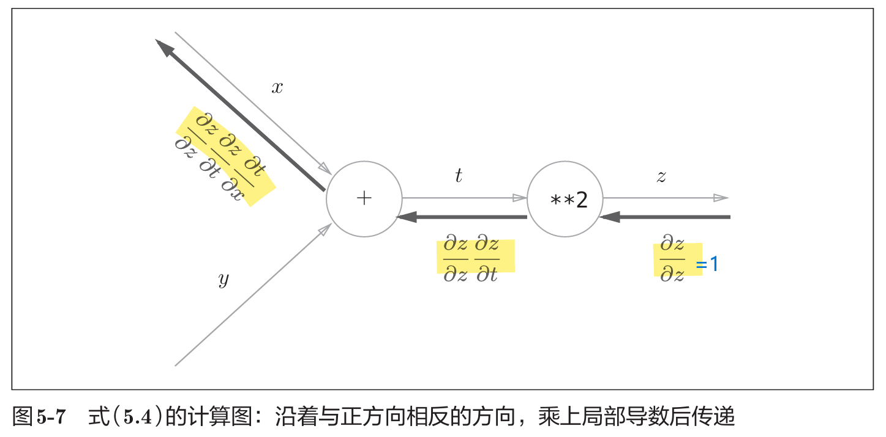
根据计算的规则（信号与导数相乘）可以写出上图的导数。
>图中反向传播最开始的信号 $\frac{\partial{z}}{\partial{z}}$ 在前面的数学式中没有出现，这是因为 $\frac{\partial{z}}{\partial{z}}=1$ ，所以在刚才的式子中被省略了。

代入具体数值可得：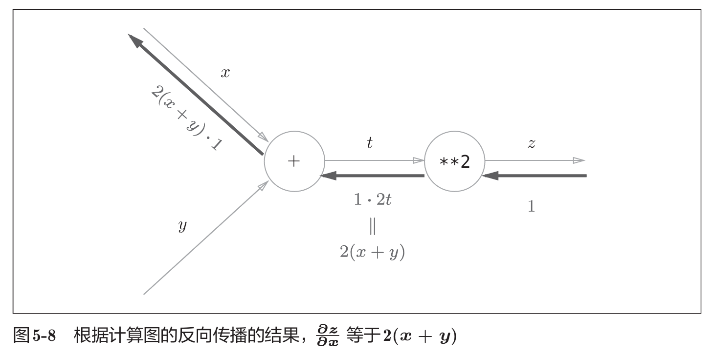

## 5.3 反向传播
### 5.3.1　加法节点的反向传播
这里以 $z=x+y$ 为对象观察，其导数可由下式解析性地计算出来：

$$
\begin{cases}
\frac{\partial{z}}{\partial{x}}=1 \\
\frac{\partial{z}}{\partial{y}}=1
\end{cases}
$$

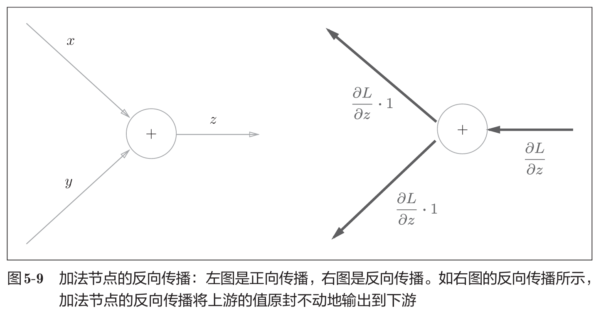
>总结：加法节点不会改变上流传递来的导数，直接将其**原封不动地往下抄写**即可。

一般来讲，我们研究中间节点的传输时，上游信号 $E$ 使用 $\frac{\partial{L}}{\partial{z}}=1$ ，其中 $L$ 就是整个计算图的最终输入。具体表示如下：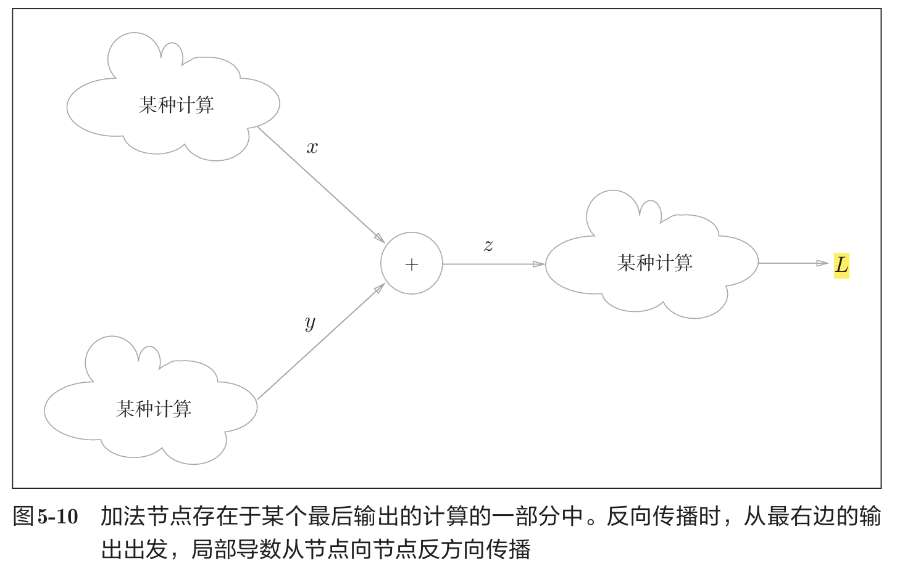

再来看一个具体例子：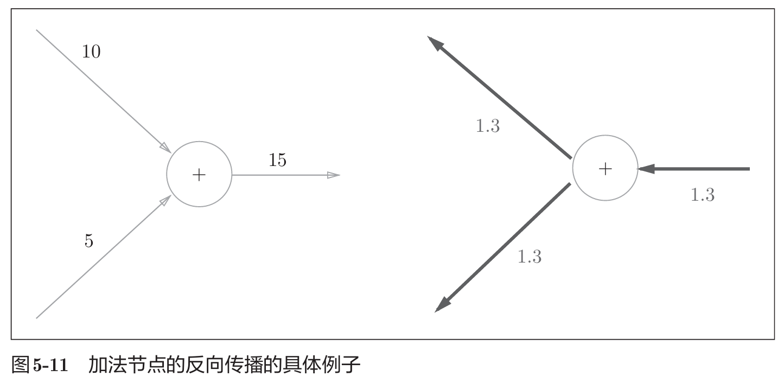
其中上游信号 $E=1.3$ ，而经过加法节点并不好改变信号值，直接顺序向下写即可。

### 5.3.2　乘法节点的反向传播
考虑 $z=xy$ ,则

$$
\begin{cases}
\frac{\partial{z}}{\partial{x}}=y \\
\frac{\partial{z}}{\partial{y}}=x
\end{cases}
$$

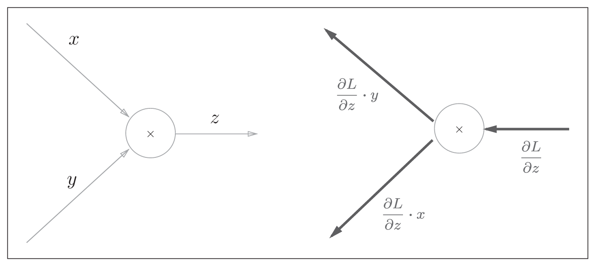
>总结：乘法的反向传播会将上游的值乘以正向传播时的输入信号的“翻转值”后传递给下游。
>正向传播时信号是 $x$ 和 $y$ 的话，反向传播时则是分别乘上 $y$ 和 $x$。

再来看一个具体例子：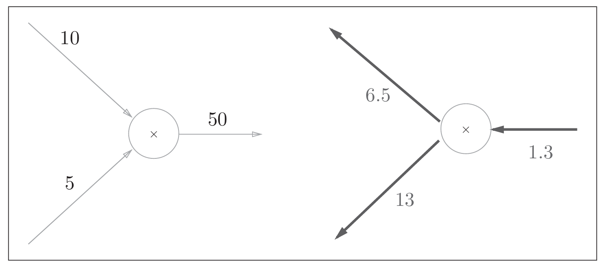
此时上游信号值 $E=1.3$ ，由于正向传播时信号分别是 $10$ 和 $5$，则分享传播时为 $5×1.3=6.5$ 和 $10×1.3=13$。

### 5.3.3　5.1中例子计算图的反向传播
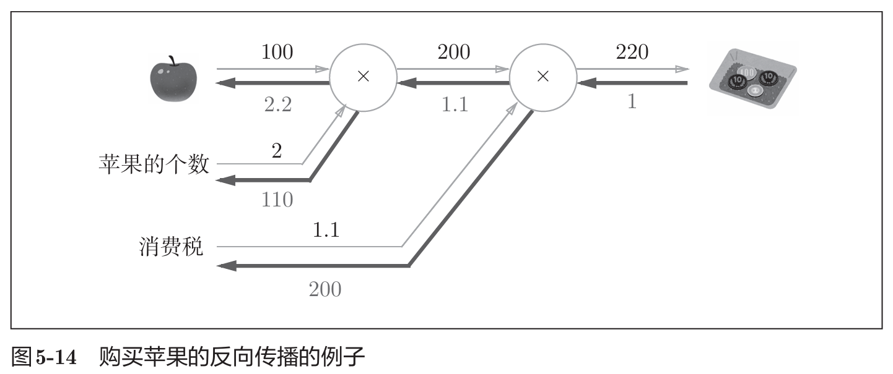
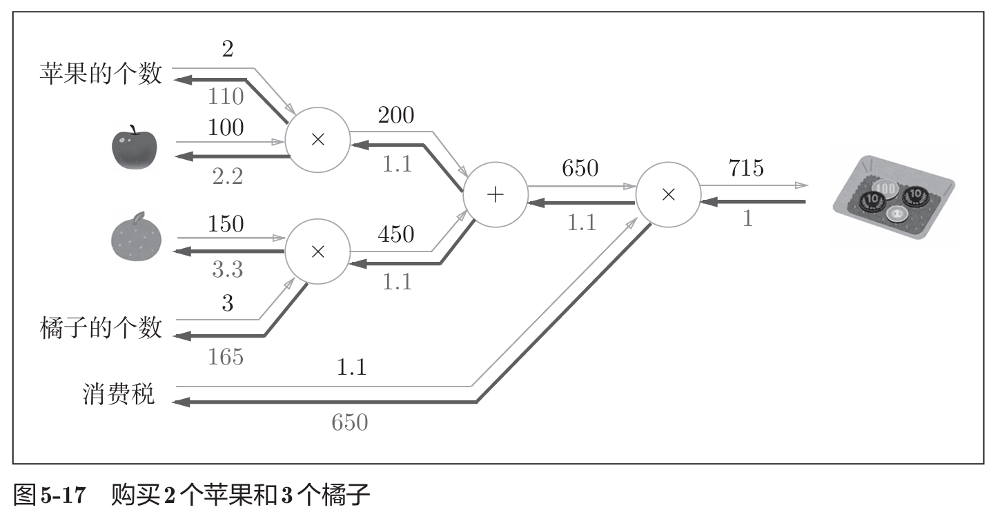

## 5.4 简单层的实现
### 5.4.1 层的概念
#### 定义
称计算图的乘法节点称为“乘法层”（MulLayer）。
加法节点称为“加法层”（AddLayer）。
这里所说的“层”是神经网络中功能的单位。
使用“类”来实现“层”。
#### 方法
层的实现中有两个共通的方法（接口）：forward()和backward()。forward()对应正向传播，backward()对应反向传播。

#### 原则
1. 先调用forward方法并且传入必要参数，完成正向传播；再调用backward方法并且传入上游信号值，完成反向传播。
2. 一般来说，只有在backward方法中会再次使用的参数（这些参数是在调用forward方法时传入的）才需要进行初始化（值为None）。

### 5.4.2 乘法层的实现
```python
class MulLayer:
    def __init__(self):
        self.x = None
        self.y = None

    def forward(self, x, y):
        self.x = x
        self.y = y
        out = x * y
        return out #输出值即乘积

    def backward(self, dout):
        dx = dout * self.y # 翻转x和y
        dy = dout * self.x
        return dx, dy #输出值即x和y的翻转值y和x与信号乘积
```
使用乘法层来实现最开始买苹果的问题：
```python
#初始化最开始输入——苹果的单价、数目、消费税
apple = 100
apple_num = 2
tax = 1.1
# layer
mul_apple_layer = MulLayer()#苹果层输入苹果的单价与个数
mul_tax_layer = MulLayer()#消费税层输入苹果的基本价格和消费税
# forward
apple_price = mul_apple_layer.forward(apple, apple_num)
price = mul_tax_layer.forward(apple_price, tax)#价格来自上一层
print(price) # 220
# backward
dprice = 1
dapple_price, dtax = mul_tax_layer.backward(dprice)
dapple, dapple_num = mul_apple_layer.backward(dapple_price)
print(dapple, dapple_num, dtax) # 2.2 110 200
```
>正向传播与反向传播调用的层是恰好相反的！

### 5.4.3　加法层的实现
```python
class AddLayer:
    def __init__(self):
        pass
    def forward(self, x, y):
        out = x + y
        return out
    def backward(self, dout):
        dx = dout * 1
        dy = dout * 1
        return dx, dy
```
>因为backward中无需再次使用forward的参数，所有无需初始化存储。

使用加法层和乘法层来实现买苹果与橙子的问题：
```python
#初始化最开始输入——苹果的单价和数目、橙子的单价和数目、消费税
apple = 100
apple_num = 2
orange = 150
orange_num = 3
tax = 1.1
# layer
mul_apple_layer = MulLayer()
mul_orange_layer = MulLayer()
add_apple_orange_layer = AddLayer()
mul_tax_layer = MulLayer()
# forward
apple_price = mul_apple_layer.forward(apple, apple_num) #(1)
orange_price = mul_orange_layer.forward(orange, orange_num) #(2)
all_price = add_apple_orange_layer.forward(apple_price, orange_price) #(3)
price = mul_tax_layer.forward(all_price, tax) #(4)
# backward——相反调用
dprice = 1
dall_price, dtax = mul_tax_layer.backward(dprice) #(4)
dapple_price, dorange_price = add_apple_orange_layer.backward(dall_price) #(3)
dorange, dorange_num = mul_orange_layer.backward(dorange_price) #(2)
dapple, dapple_num = mul_apple_layer.backward(dapple_price) #(1)
print(price) # 715
print(dapple_num, dapple, dorange, dorange_num, dtax) # 110 2.2 3.3 165 650
```
## 5.5 激活函数层的实现
### 5.5.1　ReLU层
#### 表达式
ReLU函数 $y$ 及其导数 $\frac{\partial{y}}{\partial{x}}$ 为

$$
y = 
\begin{cases}
x & x \geq 0 \\
0 & x < 0
\end{cases}
$$

$$
\frac{\partial{y}}{\partial{x}} = 
\begin{cases}
1 & x \geq 0 \\
0 & x < 0
\end{cases}
$$

从其导数中可知：如果正向传播时的输入x大于0，则反向传播会将上游的值原封不动地传给下游。如果正向传播时的x小于等于0，则反向传播中传给下游的信号将停在此处。表示如下：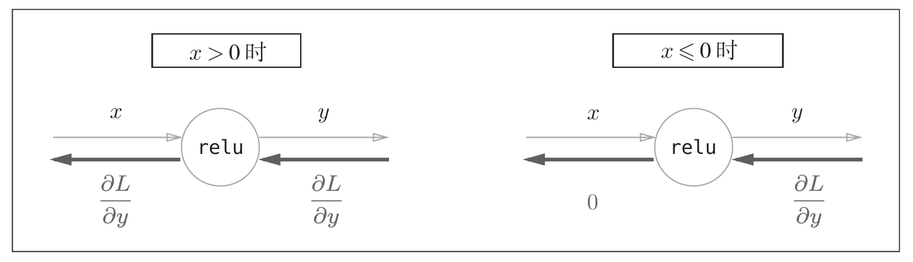

#### python实现（基于numpy数组）
```python
class Relu:
    def __init__(self):
        self.mask = None

    def forward(self, x):
        self.mask = (x <= 0)#首先筛选出x中小于<=0的数
        out = x.copy() #避免修改x，copy函数可以对可迭代对象进行复制 
        out[self.mask] = 0 #使用[numpy数组]进行索引，将小于0的数置零
        return out

    def backward(self, dout):
        dout[self.mask] = 0 #小于等于0就变为0；其他不变
        dx = dout
        return dx
```
>mask是一个布尔掩码，用于记录前向传播中哪些输入元素 ≤0（被置为0的位置）

### 5.5.2　Sigmoid层
#### 表达式

$$
y = \frac{1}{1+e^{-x}}
$$

#### 反向传播的计算
其正向传播的计算图为：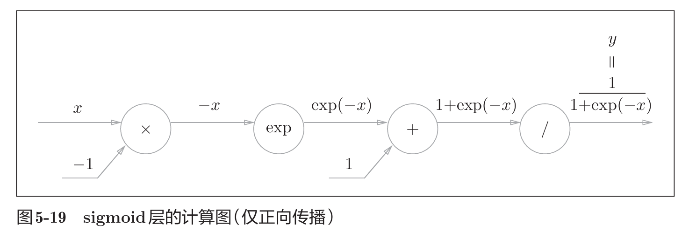
下面计算反向传播：
1. “ $/$ ”节点表示函数$ y = \frac{1}{x} $，其导数为：

$$ \frac{\partial{y}}{\partial{x}} = -\frac{1}{x^2} = -y^2 $$

根据反向传播的规律——上游信号乘以导数值有：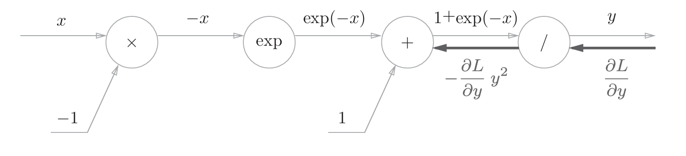

2. “ $+$ ”节点将上游的值原封不动地传给下游: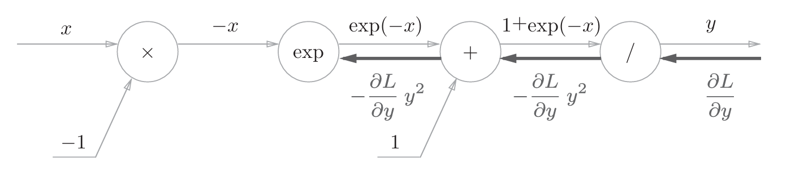
3. “exp”节点表示 $y=e^x$，其导数为：
   
   $$ \frac{\partial{y}}{\partial{x}} = e^x $$

本例子中实际应该代入 $-x$，则有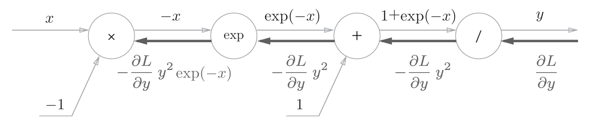
4. “×”节点将正向传播时的值翻转后做乘法运算。因此这里要乘以 $−1$：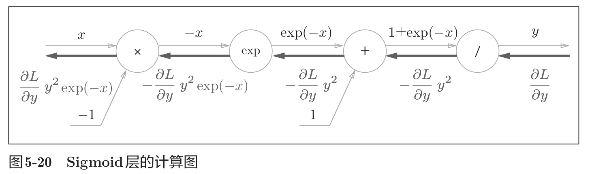

不过在实际中，我们只关心输入与输出，所以可使用以下“集约化”的形式：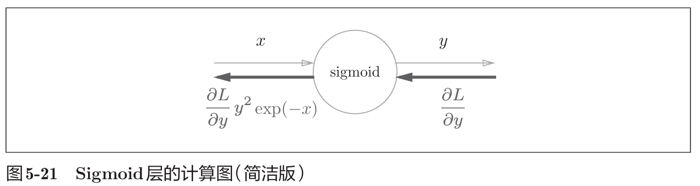
上述反向传播的输出可以进一步写成：

$$
\begin{aligned}
\frac{\partial L}{\partial y} y^2 \exp(-x) 
&= \frac{\partial L}{\partial y} \frac{1}{(1 + \exp(-x))^2} \exp(-x) \\
&= \frac{\partial L}{\partial y} \frac{1}{1 + \exp(-x)} \frac{\exp(-x)}{1 + \exp(-x)} \\
&= \frac{\partial L}{\partial y} y(1 - y)
\end{aligned}
$$

计算图为：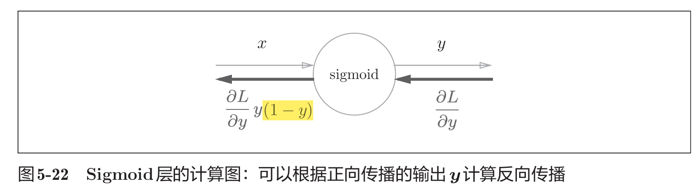

#### python实现
```python
class Sigmoid:
    def __init__(self):
        self.out = None

    def forward(self, x):
        out = 1 / (1 + np.exp(-x))
        self.out = out
        return out

    def backward(self, dout):
        dx = dout * (1.0 - self.out) * self.out
        return dx
```
>注意这里要存储的 $y$ 与之前加法乘法的 $y$ 不同。这里的 $y$ 是输出，加法乘法的 $y$ 是输入。所以要保存的是forward的return值。

## 5.6 Affine/Softmax层的实现
### 5.6.1　Affine层
神经网络的正向传播中进行的矩阵的乘积运算在几何学领域被称为“仿射变换”。因此这里将进行仿射变换的处理实现为“Affine层”。
>几何中，仿射变换包括一次线性变换和一次平移，分别对应神经网络的加权和运算与加偏置运算。

### 5.6.2 单层Affine层的实现
设 $\bm{X}$、$\bm{W}$、$\bm{B}$ 分别是形状为 $(2,)$、$(2,3)$、$(3,)$ 的多维数组。其经过Y = np.dot(X, W) + B的计算如下所示：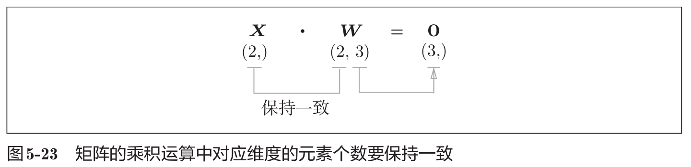
>注意：要区分表示矩阵行列式的 $(2,)$ 与 $(2,3)$，在线性代数中前者相当于 $1×2$，后者相当于 $2×3$。

则Affine层的计算图可表示为：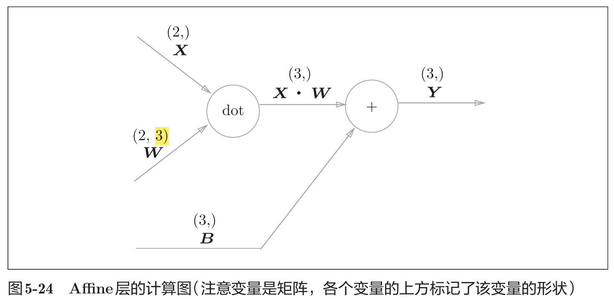
接下来考虑反向传播，表达式为：

$$
\begin{aligned}
\frac{\partial{L}}{\partial{\bm{X}}} = & \frac{\partial{L}}{\partial{\bm{Y}}} \cdot {\bm{W}}^T \\
\frac{\partial{L}}{\partial{\bm{W}}} = & {\bm{X}}^T \cdot \frac{\partial{L}}{\partial{\bm{Y}}}
\end{aligned}
$$

>公式说明：
>1. 实际上求解到某处 $X$ 的反向传播值（就是导数），本质上就是求解信号源 $L$ 相对于X的导数，只不过使用链式法则实现。
>2. 此处矩阵点乘原本是 $\bm{X} \cdot \bm{W}$，则反向传播就是求谁的就把谁换成上游的信号源（此处就是 $\frac{\partial{L}}{\partial{\bm{Y}}}$）,再把另一者转置。
>3. 右上标T代表对矩阵转置。

计算过程中的符号变换为：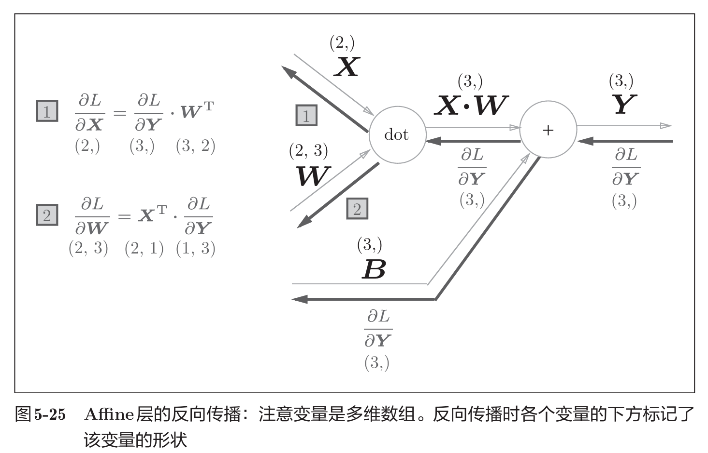

### 5.6.3 批版本的Affine层的实现
现在我们考虑N个数据一起进行正向传播的情况，也就是批版本的Affine层。其运算过程中矩阵大小变换为：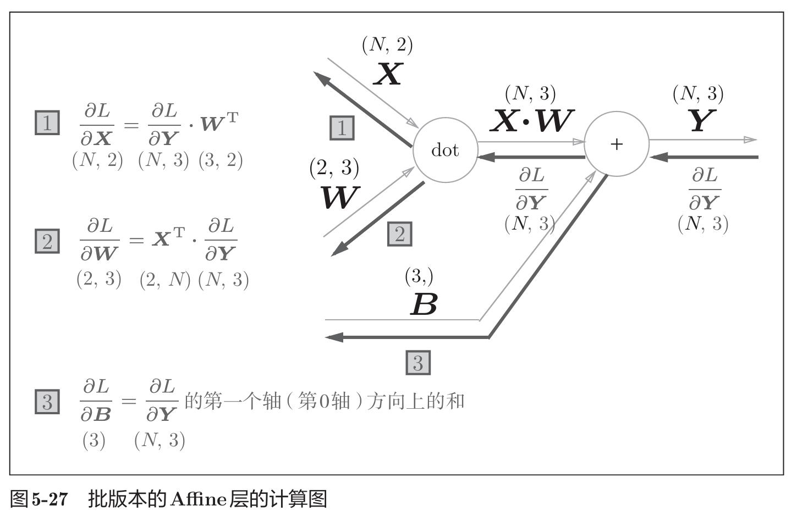
由此python实现为：
```python
class Affine:
    def __init__(self, W, b):
        self.W = W
        self.b = b
        self.x = None
        self.dW = None
        self.db = None

    def forward(self, x):
        self.x = x
        out = np.dot(x, self.W) + self.b
        return out

    def backward(self, dout):
        dx = np.dot(dout, self.W.T)
        self.dW = np.dot(self.x.T, dout)
        self.db = np.sum(dout, axis=0)
        return dx
```
>1. 由于权重 $\bm{W}$ 和偏置$\bm{B}$ 是常量，所以直接在初始化时就赋值。而输入 $\bm{X}$ 则等到forward方法被调用时再赋值。最后 dW、db是后续用于存储梯度的矩阵，也要初始化。
>2. forward就是实现 $\bm{X} \cdot \bm{W} + \bm{B}$。
>3. backward就是实现：上述的两个矩阵表达式。其中 $\frac{\partial{L}}{\partial{\bm{Y}}}$ 就是dout（上游信号源）。矩阵转置使用T完成转置（直接numpy数组.p即可）。
>4. 注意 $\bm{B}$ 的实现：***self.db = np.sum(dout, axis=0)***。
>   - 实际上从之前的计算图也可以发现，$\bm{X}$ 的形状是(A,B)，而$\bm{W}$ 的形状是 $(B,C)$，那么 $\bm{X} \cdot \bm{W} + \bm{B}$ 的形状就是 $(A,C)$。但是 $\bm{B}$ 的形状是 $(C,)$，很明显对不上。
>   - 实际上在加法时NumPy会使用广播机制，将 $\bm{X}$ 隐式地扩展为形状 $(N, H)$的矩阵，从而实现逐元素加法。
>   - 因此最后返回计算时需要将上游信号 dout 按列相加（即 axis = 0）。

### 5.7.3　Softmax-with-Loss 层
#### 计算图分析
softmax函数会将输入值正规化之后再输出。比如手写数字识别时Softmax层的输出如下图所示：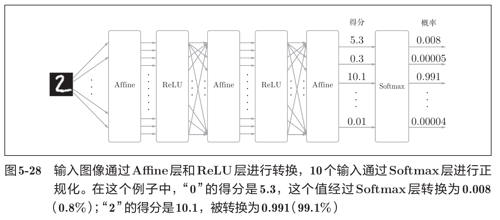
>神经网络中进行的处理有推理（inference）和学习两个阶段。神经网络的推理通常不使用Softmax层。
>当神经网络的推理只需要给出一个答案的情况下，因为此时只对得分最大值感兴趣，所以不需要Softmax层。
>不过，神经网络的学习阶段则需要Softmax层。

在实际中，一般考虑包含作为损失函数的交叉熵误差（cross entropy error），所以称为“Softmax-with-Loss层 ”，其实现为：
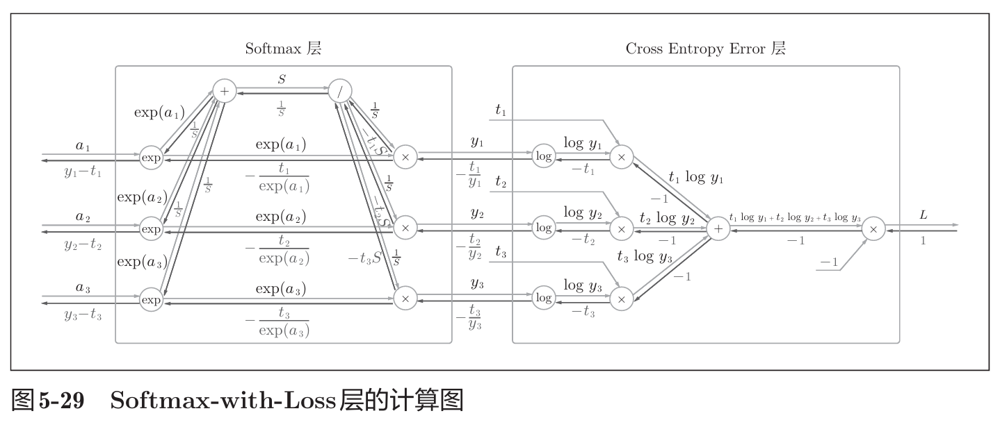
实际计算中有：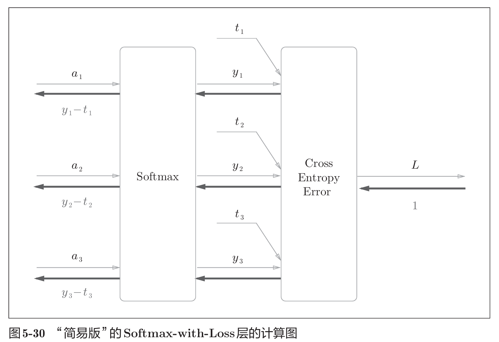
也就是说正向传播时输入权重和 $a_i$ 给softmax-with-loss，最后输出信号源 $L$，则最后会返回Softmax层的输出值减去监督数据即 $y_i - t_i$.
>神经网络的反向传播会把这个差分表示的误差传递给前面的层，这是神经网络学习中的重要性质。

#### python实现
```python
class SoftmaxWithLoss:
    def __init__(self):
        self.loss = None # 损失
        self.y = None    # softmax的输出
        self.t = None    # 监督数据（one-hot vector）

    def forward(self, x, t):#把权重和转化为损失值
        self.t = t
        self.y = softmax(x)
        self.loss = cross_entropy_error(self.y, self.t)
        return self.loss

    def backward(self, dout=1):
        batch_size = self.t.shape[0]
        dx = (self.y - self.t) / batch_size 
        #因为输入由1变成了多个，除以批的大小（batch_size）
        return dx
```

## 5.7 误差反向传播法的实现
### python代码
```python
import sys, os
sys.path.append(os.pardir)  
import numpy as np
from common.layers import * #导入之前写的各种“层”类
from common.gradient import numerical_gradient#导入数值微分函数
from collections import OrderedDict#导入顺序字典

class TwoLayerNet:

    def __init__(self, input_size, hidden_size, output_size, weight_init_std = 0.01):
        # 初始化权重
        self.params = {}
        self.params['W1'] = weight_init_std * np.random.randn(input_size, hidden_size)
        self.params['b1'] = np.zeros(hidden_size)
        self.params['W2'] = weight_init_std * np.random.randn(hidden_size, output_size) 
        self.params['b2'] = np.zeros(output_size)

        # 生成层
        self.layers = OrderedDict()
        self.layers['Affine1'] = Affine(self.params['W1'], self.params['b1'])
        self.layers['Relu1'] = Relu()
        self.layers['Affine2'] = Affine(self.params['W2'], self.params['b2'])

        self.lastLayer = SoftmaxWithLoss()
        
    def predict(self, x):
        for layer in self.layers.values():
            x = layer.forward(x)
        return x
        
    # x:输入数据, t:监督数据
    def loss(self, x, t):
        y = self.predict(x)
        return self.lastLayer.forward(y, t)
    
    def accuracy(self, x, t):
        y = self.predict(x)
        y = np.argmax(y, axis=1)
        if t.ndim != 1 : 
            t = np.argmax(t, axis=1)

        accuracy = np.sum(y == t) / float(x.shape[0])
        return accuracy
        
    # x:输入数据, t:监督数据
    def numerical_gradient(self, x, t):
        loss_W = lambda W: self.loss(x, t)
        
        grads = {}
        grads['W1'] = numerical_gradient(loss_W, self.params['W1'])
        grads['b1'] = numerical_gradient(loss_W, self.params['b1'])
        grads['W2'] = numerical_gradient(loss_W, self.params['W2'])
        grads['b2'] = numerical_gradient(loss_W, self.params['b2'])
        
        return grads
        
    def gradient(self, x, t):
        # forward
        self.loss(x, t)

        # backward
        dout = 1
        dout = self.lastLayer.backward(dout)
        
        layers = list(self.layers.values())
        layers.reverse()
        for layer in layers:
            dout = layer.backward(dout)

        # 设定
        grads = {}
        grads['W1'] = self.layers['Affine1'].dW
        grads['b1'] = self.layers['Affine1'].db
        grads['W2'] = self.layers['Affine2'].dW
        grads['b2'] = self.layers['Affine2'].db

        return grads
```
解释：
1. 初始化函数中的“层”初始化
    ```python
    # 生成层
    self.layers = OrderedDict()
    self.layers['Affine1'] = Affine(self.params['W1'], self.params['b1'])
    self.layers['Relu1'] = Relu()
    self.layers['Affine2'] = Affine(self.params['W2'], self.params['b2'])

    self.lastLayer = SoftmaxWithLoss()
    ```
    这里将所有的层类（layer）放入一个OrderedDict（顺序字典中）。原本python中的字典类型是无序的，而OrderedDict则是有序的，可以按顺序进行遍历。除此之外，使用方法基本与原本的dict类相同。
    注意格式是“字典[键值] = 类名(初始化所需变量)”，即键值为一个对应层的实例变量。
    特别地，由于最后的损失值使用多（计算梯度、精确度），所以单独写出方便调用。
    功能：初始化二层神经网络的各个“层”
2. 预测方法——predict
    ```python
    def predict(self, x):
    for layer in self.layers.values():
        x = layer.forward(x)
    return x
    ```
    此处使用for循环遍历layers字典的键值，使用字典.values()方法取出键值。会按顺序调用顺序字典内的所有实例变量。
    使用x = layer.forward(x)依次传递。
    功能：完成输入层权重计算+激活函数计算、输出层权重计算
3. 损失值计算方法——loss
    ```python
    def loss(self, x, t):
    y = self.predict(x)
    return self.lastLayer.forward(y, t)
    ```
    功能：调用输出层self.lastLayer的激活函数+损失值函数计算损失值。
4. 精确度计算方法——accuracy
   ```python
    def accuracy(self, x, t):
        y = self.predict(x)
        y = np.argmax(y, axis=1)
        if t.ndim != 1 : 
            t = np.argmax(t, axis=1)
            
        accuracy = np.sum(y == t) / float(x.shape[0])
        return accuracy
   ```
   中间的判断即
   - 如果 t 本来就是一维整数数组（t.ndim == 1），直接比较即可。
   - 如果 t 是二维 one‑hot 矩阵（t.ndim != 2），则通过 np.argmax(t, axis=1) 将其转换为整数标签。
    最后accuracy计算中除以的值就是输入量的个数
5. 数值微分求梯度——numerical_gradient
   就是利用第四章的数值积分 $\frac{f(x+h)-f(x-h)}{2h}$ 计算。
6. 误差反向传播法求梯度——gradient
    ```python    
    def gradient(self, x, t):
    # forward
    self.loss(x, t)

    # backward
    dout = 1
    dout = self.lastLayer.backward(dout)
    
    layers = list(self.layers.values())
    layers.reverse()
    for layer in layers:
        dout = layer.backward(dout)

    # 设定，注意上面使用layers来接收列表化后的有序字典
    # 但是实际上原本的self.layers这个类属性并未改变
    # 每个“Affine层”类下面的dW、dB就是导数
    grads = {}
    grads['W1'] = self.layers['Affine1'].dW
    grads['b1'] = self.layers['Affine1'].db
    grads['W2'] = self.layers['Affine2'].dW
    grads['b2'] = self.layers['Affine2'].db

    return grads
    ```
    - 利用反向传播求解导数构成梯度——正向的传播的逆过程。首先调用loss方法完成一次完整的正向传播之后才能反向传播。
    - 依次逆过来调用各个“层”的backward方法。首先是SoftmaxWithLoss，然后是layers中的各个层。注意顺序字典无法正常地反向遍历，必须先转化为列表后使用reverse方法才行。
    - 最后依次遍历，每次调用backward方法，传入dout赋值给自己。

### 5.7.2　误差反向传播法的梯度确认
数值微分的优点是实现简单，因此，一般情况下不太容易出错。而误差
反向传播法的实现很复杂，容易出错。所以，经常会比较数值微分的结果和误差反向传播法的结果，以确认误差反向传播法的实现是否正确。

确认数值微分求出的梯度结果和误差反向传播法求出的结果是否一致（严格地讲，是非常相近）的操作称为梯度确认（gradient check）：
```python
import sys, os
sys.path.append(os.pardir) 
import numpy as np
from dataset.mnist import load_mnist
from two_layer_net import TwoLayerNet

# 读入数据
(x_train, t_train), (x_test, t_test) = load_mnist(normalize=True, one_hot_label=True)
#  构建两层神经网络实例变量
network = TwoLayerNet(input_size=784, hidden_size=50, output_size=10)
# 选取前三个作为样本，注意如果是二维矩阵会取出前三行（也就是三个变量）
x_batch = x_train[:3]
t_batch = t_train[:3]
#  利用两种方式求梯度
grad_numerical = network.numerical_gradient(x_batch, t_batch)
grad_backprop = network.gradient(x_batch, t_batch)

for key in grad_numerical.keys():#  使用keys方法遍历 grad_numerical 字典中的所有键
    diff = np.average( np.abs(grad_backprop[key] - grad_numerical[key]) )#  使用np的取平均函数
    print(key + ":" + str(diff))
```

### 5.7.3　使用误差反向传播法的学习
就是将求梯度的方法更换一下即可。
   