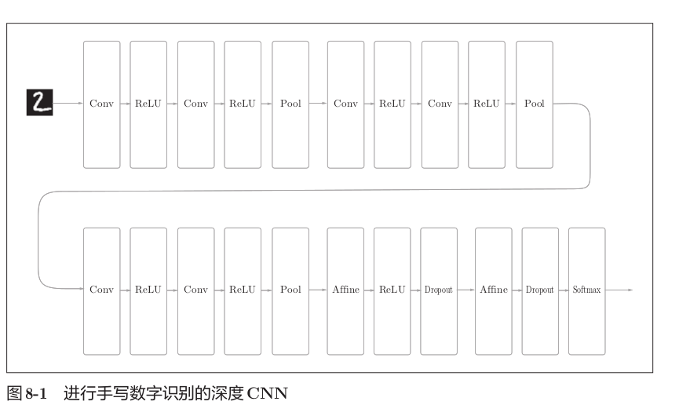

# 第8章 深度学习（了解性内容）

深度学习是加深了层的深度神经网络。基于之前介绍的网络，只需通过叠加层，就可以创建深度网络。本章将介绍深度学习的性质、课题和可能性，并对当前的深度学习进行概括性的说明。

## 8.1 加深网络

### 8.1.1 向更深的网络出发

这里创建一个比之前实现的网络都更深的CNN，参考了VGG的网络结构。

该网络的特点如下：

- 基于3×3的小型滤波器的卷积层。
- 激活函数使用ReLU。
- 全连接层的后面使用Dropout层。
- 基于Adam的最优化。
- 使用He初始值作为权重初始值。

该网络的卷积层全都是3×3的小型滤波器，特点是随着层的加深，通道数变大。卷积层的通道数从前面的层开始按顺序以16、16、32、32、64、64的方式增加。插入了池化层，以逐渐减小中间数据的空间大小，后面的全连接层中使用了Dropout层。

使用这个网络进行学习后，识别精度达到了99.38%，是非常优秀的性能。识别错误的图像对于人类而言也很难判断，里面有一些图像很难判断是哪个数字，即使是我们人类，也同样会犯识别错误。“1”和“7”、“0”和“6”、“3”和“5”的组合比较容易混淆。通过观察这些例子，可以感受到深度CNN中蕴藏着巨大的可能性。

### 8.1.2 进一步提高识别精度

对于MNIST数据集，层不用特别深就获得了最高的识别精度。一般认为，这是因为对于手写数字识别这样一个比较简单的任务，没有必要将网络的表现力提高到那么高的程度。而大规模的一般物体识别的情况，因为问题复杂，所以加深层对提高识别精度大有裨益。

参考排行榜中前几名的方法，可以发现进一步提高识别精度的技术和线索：

- **集成学习**：让多个模型单独进行学习，推理时再取多个模型的输出的平均值。通过进行集成学习，神经网络的识别精度可以提高好几个百分点。
- **学习率衰减**：随着学习的进行，使学习率逐渐减小。
- **Data Augmentation（数据扩充）**：基于算法“人为地”扩充输入图像（训练图像）。

Data Augmentation虽然方法很简单，但在提高识别精度上效果显著。具体地说，对于输入图像，**通过施加旋转、垂直或水平方向上的移动等微小变化，增加图像的数量**。这在数据集的图像数量有限时尤其有效。除了变形之外，Data Augmentation还可以通过其他各种方法扩充图像，比如裁剪图像的crop处理、将图像左右翻转的flip处理等。对于一般的图像，施加亮度等外观上的变化、放大缩小等尺度上的变化也是有效的。通过Data Augmentation巧妙地增加训练图像，就可以提高深度学习的识别精度。

### 8.1.3 加深层的动机

关于加深层的重要性，现状是理论研究还不够透彻。尽管目前相关理论还比较贫乏，但从过往的研究和实验中可以解释几点。

从以ILSVRC为代表的大规模图像识别的比赛结果中可以看出加深层的重要性。这种比赛的结果显示，最近前几名的方法多是基于深度学习的，并且有逐渐加深网络的层的趋势，层越深，识别性能也越高。

加深层的好处之一是可以**减少网络的参数数量**。与没有加深层的网络相比，加深了层的网络可以用更少的参数达到同等水平的表现力。一次5×5的卷积运算的区域可以由两次3×3的卷积运算抵充。相对于前者的参数数量25（5×5），后者一共是18（2×3×3），通过叠加卷积层，参数数量减少了。这个参数数量之差会随着层的加深而变大。重复三次3×3的卷积运算时，参数的数量总共是27。而为了用一次卷积运算“观察”与之相同的区域，需要一个7×7的滤波器，此时的参数数量是49。

叠加小型滤波器来加深网络的好处是可以减少参数的数量，扩大**感受野**（receptive field，给神经元施加变化的某个局部空间区域）。通过叠加层，将ReLU等激活函数夹在卷积层的中间，进一步提高了网络的表现力。这是因为向网络添加了基于激活函数的“非线性”表现力，通过非线性函数的叠加，可以表现更加复杂的东西。

加深层的另一个好处是**使学习更加高效**。与没有加深层的网络相比，通过加深层，可以减少学习数据，从而高效地进行学习。通过加深网络，可以分层次地分解需要学习的问题，各层需要学习的问题就变成了更简单的问题。最开始的层只要专注于学习边缘就好，只需用较少的学习数据就可以高效地进行学习。因为和印有“狗”的照片相比，包含边缘的图像数量众多，并且边缘的模式比“狗”的模式结构更简单。

通过加深层，可以分层次地传递信息。提取了边缘的层的下一层能够使用边缘的信息，应该能够高效地学习更加高级的模式。通过加深层，可以将各层要学习的问题分解成容易解决的简单问题，从而可以进行高效的学习。

近几年的深层化是由大数据、计算能力等即便加深层也能正确地进行学习的新的技术和环境支撑的。

## 8.2 深度学习的小历史

一般认为，现在深度学习之所以受到大量关注，其契机是2012年举办的大规模图像识别大赛ILSVRC（ImageNet Large Scale Visual Recognition Challenge）。在那年的比赛中，基于深度学习的方法（通称AlexNet）以压倒性的优势胜出，彻底颠覆了以往的图像识别方法。2012年深度学习的这场逆袭成为一个转折点，在之后的比赛中，深度学习一直活跃在舞台中央。

### 8.2.1 ImageNet

ImageNet是拥有超过100万张图像的数据集。它包含了各种各样的图像，并且每张图像都被关联了标签（类别名）。每年都会举办使用这个巨大数据集的ILSVRC图像识别大赛。

ILSVRC大赛有多个测试项目，其中之一是“类别分类”（classification），在该项目中，会进行1000个类别的分类，比试识别精度。从2010年到2015年的优胜队伍的成绩来看，以2012年为界，之后基于深度学习的方法一直居于首位。2012年的AlexNet大幅降低了错误识别率，此后基于深度学习的方法不断在提升识别精度。特别是2015年的ResNet（一个超过150层的深度网络）将错误识别率降低到了3.5%，这个结果甚至超过了普通人的识别能力。

这些年在深度学习取得不斐成绩的网络中，VGG、GoogLeNet、ResNet已广为人知。

### 8.2.2 VGG

VGG是由卷积层和池化层构成的基础的CNN。它的特点在于将有权重的层（卷积层或者全连接层）叠加至16层（或者19层），具备了深度（根据层的深度，有时也称为“VGG16”或“VGG19”）。

VGG中需要注意的地方是，基于3×3的小型滤波器的卷积层的运算是连续进行的。重复进行“卷积层重叠2次到4次，再通过池化层将大小减半”的处理，最后经由全连接层输出结果。

VGG在2014年的比赛中最终获得了第2名的成绩（GoogLeNet是2014年的第1名）。虽然在性能上不及GoogLeNet，但因为VGG结构简单，应用性强，所以很多技术人员都喜欢使用基于VGG的网络。

### 8.2.3 GoogLeNet

GoogLeNet的网络结构看上去非常复杂，但实际上它基本上和之前介绍的CNN结构相同。GoogLeNet的特征是，网络不仅在纵向上有深度，在横向上也有深度（广度）。

GoogLeNet在横向上有“宽度”，这称为**Inception结构**。Inception结构使用了多个大小不同的滤波器（和池化），最后再合并它们的结果。GoogLeNet的特征就是将这个Inception结构用作一个构件（构成元素）。在GoogLeNet中，很多地方都使用了大小为1×1的滤波器的卷积层。这个1×1的卷积运算通过在通道方向上减小大小，有助于减少参数和实现高速化处理。

### 8.2.4 ResNet

ResNet是微软团队开发的网络。它的特征在于具有比以前的网络更深的结构。

我们已经知道加深层对于提升性能很重要。但是，在深度学习中，过度加深层的话，很多情况下学习将不能顺利进行，导致最终性能不佳。ResNet中，为了解决这类问题，导入了**快捷结构**（也称为“捷径”或“小路”）。导入这个快捷结构后，就可以随着层的加深而不断提高性能了。

快捷结构横跨（跳过）了输入数据的卷积层，将输入x合计到输出。在连续2层的卷积层中，将输入x跳着连接至2层后的输出。通过快捷结构，原来的2层卷积层的输出F(x)变成了F(x) + x。通过引入这种快捷结构，即使加深层，也能高效地学习。因为通过快捷结构，反向传播时信号可以无衰减地传递。

快捷结构只是原封不动地传递输入数据，所以反向传播时会将来自上游的梯度原封不动地传向下游，不对来自上游的梯度进行任何处理。基于快捷结构，不用担心梯度会变小（或变大），能够向前一层传递“有意义的梯度”。通过这个快捷结构，之前因为加深层而导致的梯度消失问题就有望得到缓解。

ResNet以VGG网络为基础，引入快捷结构以加深层。根据实验的结果，即便加深到150层以上，识别精度也会持续提高。在ILSVRC大赛中，ResNet的错误识别率为3.5%（前5类中包含正确解这一精度下的错误识别率）。

实践中经常会灵活应用使用ImageNet这个巨大的数据集学习到的权重数据，这称为**迁移学习**，将学习完的权重的一部分复制到其他神经网络，进行再学习（fine tuning）。比如，准备一个和VGG相同结构的网络，把学习完的权重作为初始值，以新数据集为对象，进行再学习。迁移学习在手头数据集较少时非常有效。

## 8.3 深度学习的高速化

随着大数据和网络的大规模化，深度学习需要进行大量的运算。现实是只用CPU来应对深度学习无法令人放心。大多数深度学习的框架都支持GPU，可以高速地处理大量的运算。最近的框架也开始支持多个GPU或多台机器上的分布式学习。

### 8.3.1 需要努力解决的问题

在深度学习中，卷积层的处理时间加起来占GPU整体的95%，占CPU整体的89%。因此，如何高速、高效地进行卷积层中的运算是深度学习的一大课题。深度学习的高速化的主要课题就变成了如何高速、高效地进行大量的乘积累加运算。

### 8.3.2 基于GPU的高速化

GPU原本是作为图像专用的显卡使用的，但最近不仅用于图像处理，也用于通用的数值计算。由于GPU可以高速地进行并行数值计算，GPU计算的目标就是将这种压倒性的计算能力用于各种用途。

深度学习中需要进行大量的乘积累加运算，这种大量的并行运算正是GPU所擅长的。与使用单个CPU相比，使用GPU进行深度学习的运算可以达到惊人的高速化。使用CPU要花40天以上的时间，而使用GPU则可以将时间缩短至6天。通过使用cuDNN这个最优化的库，可以进一步实现高速化。

GPU主要由NVIDIA和AMD两家公司提供。与深度学习比较“亲近”的是NVIDIA的GPU，大多数深度学习框架只受益于NVIDIA的GPU。这是因为深度学习的框架中使用了NVIDIA提供的CUDA这个面向GPU计算的综合开发环境。cuDNN是在CUDA上运行的库，里面实现了为深度学习最优化过的函数。

通过im2col可以将卷积层进行的运算转换为大型矩阵的乘积。这个im2col方式的实现对GPU来说是非常方便的实现方式。相比按小规模的单位进行计算，GPU更擅长计算大规模的汇总好的数据。通过基于im2col以大型矩阵的乘积的方式汇总计算，更容易发挥出GPU的能力。

### 8.3.3 分布式学习

虽然通过GPU可以实现深度学习运算的高速化，但即便如此，当网络较深时，学习还是需要几天到几周的时间。将深度学习的学习过程扩展开来的想法（也就是分布式学习）变得重要起来。

为了进一步提高深度学习所需的计算的速度，可以考虑在多个GPU或者多台机器上进行分布式计算。现在的深度学习框架中，出现了好几个支持多GPU或者多机器的分布式学习的框架。其中，Google的TensorFlow、微软的CNTK在开发过程中高度重视分布式学习。

基于分布式学习，随着GPU个数的增加，学习速度也在提高。与使用1个GPU时相比，使用100个GPU（设置在多台机器上，共100个）可以实现56倍的高速化。之前花费7天的学习只要3个小时就能完成，充分说明了分布式学习惊人的效果。

关于分布式学习，“如何进行分布式计算”是一个非常难的课题，包含了机器间的通信、数据的同步等多个无法轻易解决的问题。可以将这些难题都交给TensorFlow等优秀的框架。

### 8.3.4 运算精度的位数缩减

在深度学习的高速化中，除了计算量之外，内存容量、总线带宽等也有可能成为瓶颈。关于内存容量，需要考虑将大量的权重参数或中间数据放在内存中。关于总线带宽，当流经GPU（或者CPU）总线的数据超过某个限制时，就会成为瓶颈。考虑到这些情况，我们希望尽可能减少流经网络的数据的位数。

关于数值精度（用几位数据表示数值），我们已经知道深度学习并不那么需要数值精度的位数。这是神经网络的一个重要性质，基于神经网络的健壮性。即便输入图像附有一些小的噪声，输出结果也仍然保持不变。正是因为有了这个健壮性，流经网络的数据即便有所“劣化”，对输出结果的影响也较小。

计算机中表示小数时，有32位的单精度浮点数和64位的双精度浮点数等格式。根据以往的实验结果，在深度学习中，即便是16位的半精度浮点数（half float），也可以顺利地进行学习。NVIDIA的下一代GPU框架Pascal也支持半精度浮点数的运算，可以认为今后半精度浮点数将被作为标准使用。

以往的深度学习的实现中并没有注意数值的精度，不过Python中一般使用64位的浮点数。NumPy中提供了16位的半精度浮点数类型（不过，只有16位类型的存储，运算本身不用16位进行），即便使用NumPy的半精度浮点数，识别精度也不会下降。

关于深度学习的位数缩减，到目前为止已有若干研究。最近有人提出了用1位来表示权重和中间数据的Binarized Neural Networks方法。为了实现深度学习的高速化，位数缩减是今后必须关注的一个课题，特别是在面向嵌入式应用程序中使用深度学习时，位数缩减非常重要。

## 8.4 深度学习的应用案例

前面主要讨论了手写数字识别的图像类别分类问题（称为“物体识别”）。不过，深度学习并不局限于物体识别，还可以应用于各种各样的问题。在图像、语音、自然语言等各个不同的领域，深度学习都展现了优异的性能。

### 8.4.1 物体检测

物体检测是从图像中确定物体的位置，并进行分类的问题。物体检测是比物体识别更难的问题。之前介绍的物体识别是以整个图像为对象的，但是物体检测需要从图像中确定类别的位置，而且还有可能存在多个物体。

对于这样的物体检测问题，人们提出了多个基于CNN的方法，展示了非常优异的性能。

在使用CNN进行物体检测的方法中，有一个叫作**R-CNN**的有名的方法。首先（以某种方法）找出形似物体的区域，然后对提取出的区域应用CNN进行分类。R-CNN的前半部分的处理——候选区域的提取（发现形似目标物体的处理）中，可以使用计算机视觉领域积累的各种各样的方法。R-CNN的论文中使用了一种被称为Selective Search的方法，最近还提出了一种基于CNN来进行候选区域提取的**Faster R-CNN**方法。Faster R-CNN用一个CNN来完成所有处理，使得高速处理成为可能。

### 8.4.2 图像分割

图像分割是指在像素水平上对图像进行分类。使用以像素为单位对各个对象分别着色的监督数据进行学习，在推理时对输入图像的所有像素进行分类。

要基于神经网络进行图像分割，最简单的方法是以所有像素为对象，对每个像素执行推理处理。这样的方法需要按照像素数量进行相应次forward处理，因而需要耗费大量的时间。为了解决这个问题，有人提出了一个名为**FCN（Fully Convolutional Network）**的方法。该方法通过一次forward处理，对所有像素进行分类。

FCN的字面意思是“全部由卷积层构成的网络”。相对于一般的CNN包含全连接层，FCN将全连接层替换成发挥相同作用的卷积层。在物体识别中使用的网络的全连接层中，中间数据的空间容量被作为排成一列的节点进行处理，而只由卷积层构成的网络中，空间容量可以保持原样直到最后的输出。

FCN的特征在于最后导入了扩大空间大小的处理，基于这个处理，变小了的中间数据可以一下子扩大到和输入图像一样的大小。FCN最后进行的扩大处理是基于双线性插值法的扩大，这个双线性插值扩大是通过去卷积（逆卷积运算）来实现的。

### 8.4.3 图像标题的生成

有一项融合了计算机视觉和自然语言的研究，给出一个图像后，会自动生成介绍这个图像的文字（图像的标题）。基于深度学习生成图像标题的代表性方法是被称为**NIC（Neural Image Caption）**的模型。NIC由深层的CNN和处理自然语言的RNN（Recurrent Neural Network）构成。RNN是呈递归式连接的网络，经常被用于自然语言、时间序列数据等连续性的数据上。

NIC基于CNN从图像中提取特征，并将这个特征传给RNN。RNN以CNN提取出的特征为初始值，递归地生成文本。NIC是组合了两个神经网络（CNN和RNN）的简单结构，可以生成惊人的高精度的图像标题。组合图像和自然语言等多种信息进行的处理称为**多模态处理**，是近年来备受关注的一个领域。

## 8.5 深度学习的未来

深度学习已经不再局限于以往的领域，开始逐渐应用于各个领域。

### 8.5.1 图像风格变换

有一项研究是使用深度学习来“绘制”带有艺术气息的画。输入两个图像后，会生成一个新的图像。两个输入图像中，一个称为“内容图像”，另一个称为“风格图像”。

如果指定将梵高的绘画风格应用于内容图像，深度学习就会按照指示绘制出新的画作。此项研究出自论文“A Neural Algorithm of Artistic Style”，一经发表就受到全世界的广泛关注。

这个方法是在学习过程中使网络的中间数据近似内容图像的中间数据，使输入图像近似内容图像的形状。为了从风格图像中吸收风格，导入了风格矩阵的概念，通过在学习过程中减小风格矩阵的偏差，使输入图像接近梵高的风格。

### 8.5.2 图像的生成

有一种研究是生成新的图像时不需要任何图像（虽然需要事先使用大量的图像进行学习，但在“画”新图像时不需要任何图像）。基于深度学习，可以实现从零生成“卧室”的图像。

基于DCGAN（Deep Convolutional Generative Adversarial Network）方法生成的卧室图像可能看上去像是真的照片，但其实这些图像都是基于DCGAN新生成的图像，是没有人见过的图像，是从零生成的新图像。

DCGAN中使用了深度学习，其技术要点是使用了**Generator（生成者）**和**Discriminator（识别者）**这两个神经网络。Generator生成近似真品的图像，Discriminator判别它是不是真图像（是Generator生成的图像还是实际拍摄的图像）。通过让两者以竞争的方式学习，Generator会学习到更加精妙的图像作假技术，Discriminator则会成长为能以更高精度辨别真假的鉴定师。两者互相切磋、共同成长，这是**GAN（Generative Adversarial Network）**这个技术的有趣之处。在这样的切磋中成长起来的Generator最终会掌握画出足以以假乱真的图像的能力。

之前见到的机器学习问题都是被称为**监督学习**的问题，使用的是图像数据和教师标签成对给出的数据集。而这里讨论的问题并没有给出监督数据，只给了大量的图像（图像的集合），这样的问题称为**无监督学习**。无监督学习虽然是很早之前就开始研究的领域，但最近随着使用深度学习的DCGAN等方法受到关注，无监督学习有望得到进一步发展。

### 8.5.3 自动驾驶

计算机代替人类驾驶汽车的自动驾驶技术有望得到实现。自动驾驶需要结合各种技术的力量来实现，比如决定行驶路线的路线计划技术、照相机或激光等传感技术等。在这些技术中，正确识别周围环境的技术尤其重要，要正确识别时刻变化的环境、自由来往的车辆和行人是非常困难的。

最近，在识别周围环境的技术中，深度学习的力量备受期待。基于CNN的神经网络SegNet，可以像图8-25那样高精度地识别行驶环境。SegNet对输入图像进行了分割（像素水平的判别），在某种程度上正确地识别了道路、建筑物、人行道、树木、车辆等。今后若能基于深度学习使这种技术进一步实现高精度化、高速化的话，自动驾驶的实用化可能也就没那么遥远了。

### 8.5.4 Deep Q-Network（强化学习）

就像人类通过摸索试验来学习一样（比如骑自行车），让计算机也在摸索试验的过程中自主学习，这称为**强化学习**。强化学习和有“教师”在身边教的“监督学习”有所不同。

强化学习的基本框架是，代理（Agent）根据环境选择行动，然后通过这个行动改变环境。根据环境的变化，代理获得某种报酬。强化学习的目的是决定代理的行动方针，以获得更好的报酬。报酬并不是确定的，只是“预期报酬”。需要从游戏得分或者游戏结束等明确的指标来反向计算，决定“预期报酬”。如果是监督学习的话，每个行动都可以从“教师”那里获得正确的评价。

在使用了深度学习的强化学习方法中，有一个叫作**Deep Q-Network（通称DQN）**的方法。该方法基于被称为Q学习的强化学习算法。在Q学习中，为了确定最合适的行动，需要确定一个被称为最优行动价值函数的函数。为了近似这个函数，DQN使用了深度学习（CNN）。

在DQN的研究中，有让电子游戏自动学习，并实现了超过人类水平的操作的例子。DQN中使用的CNN把游戏图像的帧（连续4帧）作为输入，最终输出游戏手柄的各个动作的“价值”。输入数据只有电子游戏的图像，这一点值得大书特书，大幅提高了DQN的实用性。无需根据每个游戏改变设置，只要给DQN游戏图像就可以了。DQN可以用相同的结构学习《吃豆人》、Atari等很多游戏，甚至在很多游戏中取得了超过人类的成绩。

人工智能AlphaGo击败围棋冠军的新闻受到了广泛关注。AlphaGo技术的内部也用了深度学习和强化学习。AlphaGo学习了3000万个专业棋手的棋谱，并且不停地重复自己和自己的对战，积累了大量的学习经验。AlphaGo和DQN都是Google的Deep Mind公司进行的研究。

## 8.6 小结

本章实现了一个（稍微）深层的CNN，并在手写数字识别上获得了超过99%的高识别精度。讲解了加深网络的动机，指出了深度学习在朝更深的方向前进。介绍了深度学习的趋势和应用案例，以及对高速化的研究和代表深度学习未来的研究案例。

深度学习领域还有很多尚未揭晓的东西，新的研究正一个接一个地出现。全世界的研究者和技术专家将继续积极从事这方面的研究，一定能实现目前无法想象的技术。

