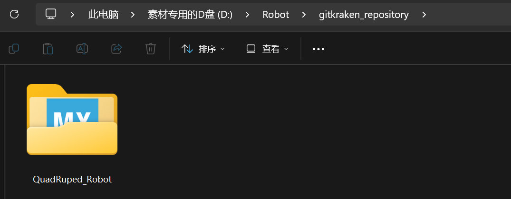
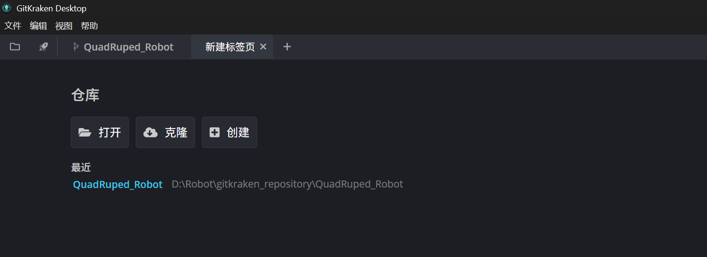
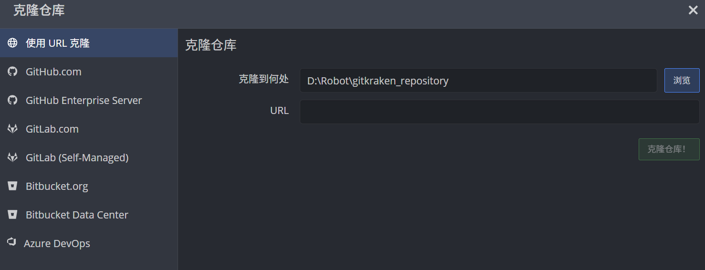
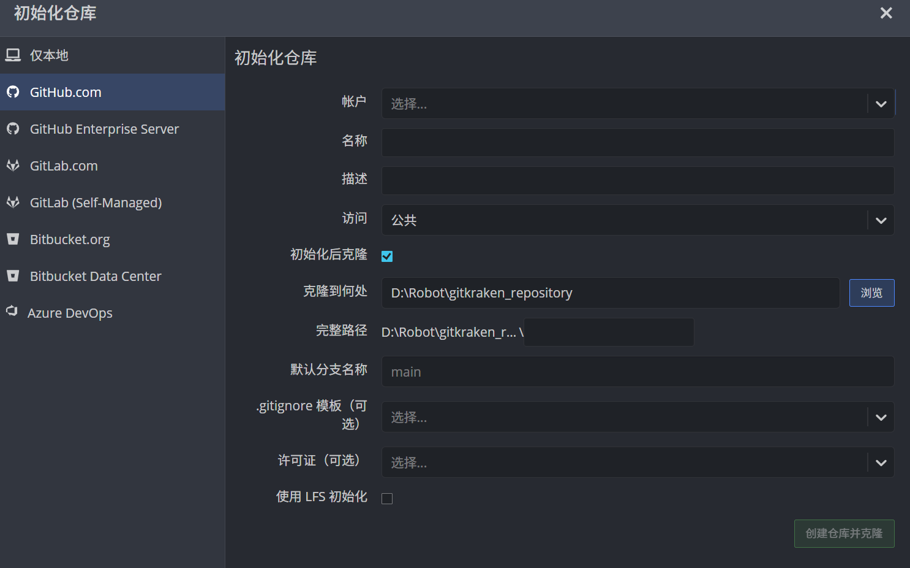
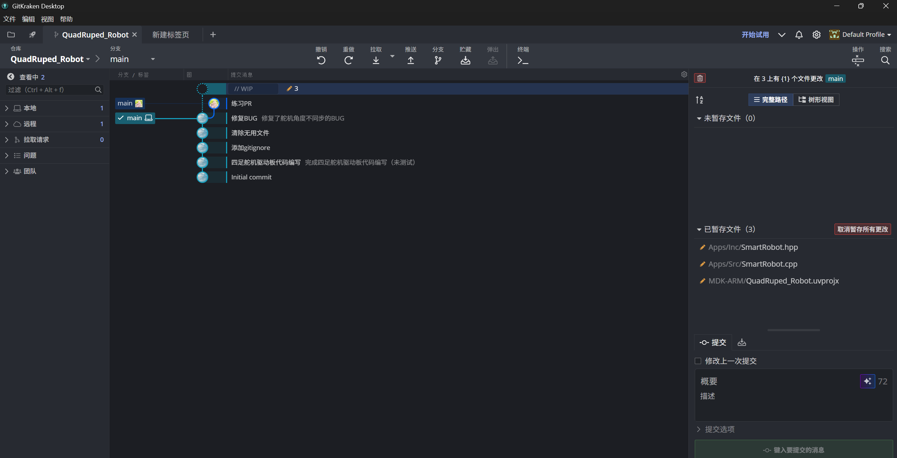
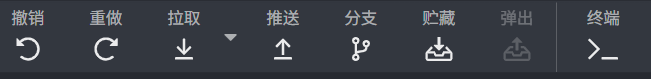
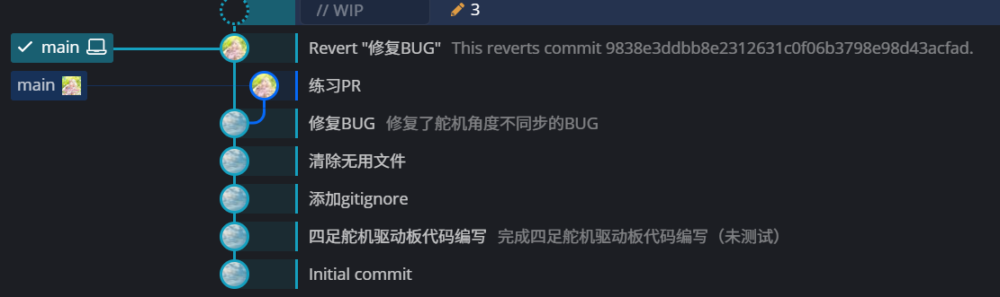
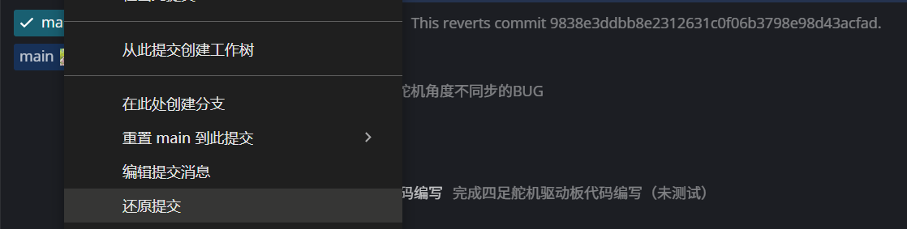

>这是一篇有关GitKraken如何使用的教程
>By xxl from Zhang Wenjing(zwj051029)
---
# 1.仓库说明
## 仓库位置
**GitKraken** 要求用户把所有的仓库放在一个指定文件夹下，也就是说之后所有的代码文件都会存储在文件下。
>此处主要是当设定了克隆仓库位置后，自己新建仓库只能在克隆仓库的位置。
## 克隆仓库
1. 初始界面点击克隆

2. 选择目标位置与克隆仓库

## 新建仓库
1. 初始界面点击新建

2. 新建

>此处选择GitHub.com则可以直接在本地新建仓库的同时，也可以在GitHub上新建。
# 2.git系列
## 代码修改与提交
之后只需要在对应的“仓库”文件夹下修改代码，便可以在GitKraken界面看到：
将暂存文件进行提交，然后输入提交信息，点击提交即可完成**本地**的提交。
## 推送至GitHub
点击推送（Push）按钮即可将代码提交到GitHub上。

## 回退
右键显示图标（√和电脑图标）

>电脑图标代表本地。
选择还原提交即可。

# 3.GitHub上的代码修改
不要直接克隆源代码，而是先fork一份再克隆。修改这个forked的代码再自行提交。