# 第一章 老虎机问题

## 本章概述

本章作为全书开篇，从最简单的“老虎机问题”入手，帮助我们建立对强化学习核心概念的直觉。老虎机问题虽然简单，但它完美地体现了强化学习与监督学习、无监督学习的根本区别，并引出了强化学习中最核心的权衡：**利用与探索的困境**。

通过本章，我们将学会：
- 区分强化学习与其他机器学习范式
- 理解行动价值（Action Value）的概念及其估计方法
- 掌握 ε-greedy 算法的原理与实现
- 理解稳态与非稳态问题的区别及应对策略


### 为什么从老虎机问题开始？

老虎机问题是强化学习目标（最大化累计奖励）的**最小化实现**。它剥离了状态迁移的复杂性，让我们能专注于“行动—奖励”的闭环。

| 特性 | 老虎机问题 | 一般强化学习问题 |
| :--- | :--- | :--- |
| 状态 | 无状态 | 有复杂状态空间 |
| 行动影响 | 不影响环境 | 会改变环境状态 |
| 反馈 | 即时反馈 | 延迟反馈 |
| 核心矛盾 | 探索 vs 利用 | 探索 vs 利用 + 长期规划 |


### 本章知识脉络

```
1.1 机器学习的分类
  └── 强化学习的定位：与监督学习、无监督学习的区别
        ↓
1.2 老虎机问题定义
  └── 引入数学符号：期望值、行动价值 q(a)
        ↓
1.3 老虎机算法
  └── 样本平均法估计价值 + ε-greedy 平衡探索与利用
        ↓
1.4 代码实现
  └── Bandit 类 + Agent 类 → 实验验证
        ↓
1.5 非稳态问题
  └── 引入固定步长 α → 指数移动平均
        ↓
1.6 小结
```


## 1.1 机器学习的分类与强化学习

### 1.1.1 监督学习

| 项目 | 说明 |
| :--- | :--- |
| **定义** | 从带有**正确答案标签**的数据中学习输入到输出的映射 |
| **数据** | (输入, 输出) 数据对，如手写数字图像 → 数字标签 |
| **特点** | 有“老师”（人类标注者）提供正确答案 |
| **目标** | 对新输入做出正确预测 |
| **例子** | 图像分类、语音识别、机器翻译 |

### 1.1.2 无监督学习

| 项目 | 说明 |
| :--- | :--- |
| **定义** | 在没有正确答案标签的情况下，发现数据中的隐藏结构 |
| **数据** | 只有输入数据，没有输出标签 |
| **目标** | 聚类、降维、特征提取 |
| **例子** | 客户分群、异常检测、t-SNE 可视化 |

### 1.1.3 强化学习
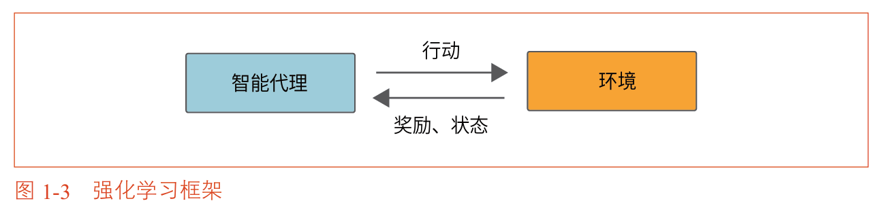
| 项目 | 说明 |
| :--- | :--- |
| **定义** | 智能代理通过与环境**交互**和**试错**学习，**最大化累计奖励** |
| **核心角色** | 智能代理（Agent）+ 环境（Environment） |
| **交互循环** | 观察状态 → 选择行动 → 获得奖励 → 更新策略 |
| **学习方式** | 试错学习，没有正确答案，只有奖励信号 |
| **例子** | 游戏AI、机器人控制、自动驾驶 |


#### 三种范式对比

| 维度 | 监督学习 | 无监督学习 | 强化学习 |
| :--- | :--- | :--- | :--- |
| 数据来源 | 带标签的静态数据集 | 无标签的静态数据集 | **与环境交互产生的数据** |
| 反馈信号 | 明确正确答案（损失函数） | 数据内在结构 | **奖励信号（稀疏、延迟）** |
| 核心任务 | 识别、分类、回归 | 聚类、降维 | **序列决策** |
| 学习方式 | 从标注中学习 | 从数据分布中学习 | **从试错中学习** |


## 1.2 老虎机问题

### 1.2.1 什么是老虎机问题

多臂老虎机问题（Multi-Armed Bandit Problem）是最简单的强化学习问题。
>实际上应该是多台单臂老虎机问题。

**设定**：
- 多台老虎机，每台有不同且未知的中奖概率
- 有限次数（如1000次）内，选择机器并拉杆
- 目标：最大化总奖励（硬币数）

**强化学习视角**：
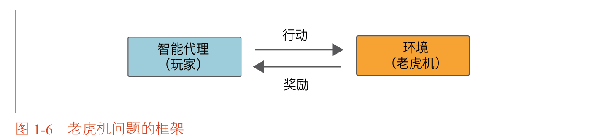
| 概念 | 对应 |
| :--- | :--- |
| 环境 | 多台老虎机 |
| 智能代理 | 玩家 |
| 行动 | 选择并拉动某台机器 |
| 奖励 | 获得的硬币数 |

> 老虎机问题是“无状态”环境，环境不因行动而改变。

### 1.2.2 什么是好的老虎机

由于奖励具有**随机性**，评价老虎机要看其**期望值**。

**行动价值（Action Value）**：在某个状态下，采取某个行动所能获得的奖励的**期望值**。

**核心目标**：找到并持续选择拥有最高行动价值的老虎机。

### 1.2.3 数学符号

| 符号 | 含义 |
| :--- | :--- |
| $R_t$ | 第 $t$ 次获得的奖励（随机变量） |
| $A$ | 行动（随机变量） ，使用小写字母 $a$、$b$ 等表示老虎机，即 $A \in \{a,b\}$|
| $q(A)$ | 行动 $A$ 的**真实**价值（期望值）  |
| $Q(A)$ | 行动 $A$ 的**估计**价值（通过学习得到） |
>在强化学习中，期望值（ $\mathbb{E}$ ，expectation）也被称作价值（ $q$ 或 $Q$，quality ）。因此，也有：$$q(A) = \mathbb{E} (R|A)$$

## 1.3 老虎机算法
在深入讨论具体算法之前，我们需要先理解强化学习与监督学习在"学习方式"上的根本差异。

**监督学习的学习方式**
在监督学习中，数据集包含明确的"正确答案标签"。当模型做出一个错误的预测时，它**也能知道正确答案是什么**。

**强化学习的学习方式**
强化学习的情况完全不同。在强化学习中，玩家自己采取行动，只能得到该行动产生的结果，也就是奖励。没有"老师"告诉玩家什么才是正确的行动。

玩家必须以这些零散的奖励为线索，自己估计和判断什么是正确答案以及什么是最佳行动。这就是强化学习的核心挑战所在：**从稀疏的、有噪声的反馈信号中，推断出最优的行动策略**。

### 1.3.1 价值的估计方法

使用**样本平均法（Sample Average）** 估计行动价值。

$$Q_n(a) = \frac{R_1 + R_2 + \dots + R_n}{n}$$

即用过去所有试验中，选择该行动所获得的平均奖励作为估计值。

## 1.3.2 求平均值的增量式实现

为了高效地在代码中计算并更新行动价值的估计值，我们需要推导一个增量式的更新公式，避免每次都重新计算所有历史奖励的总和。

设 $Q_{n-1}$ 是前 $n-1$ 次试验后对某台老虎机价值的估计值，$R_n$ 是第 $n$ 次试验获得的奖励。

首先，$Q_{n-1}$ 为：

$$Q_{n-1} = \frac{R_1 + R_2 + \cdots + R_{n-1}}{n-1}$$

将等式两边乘以 $n-1$，得到前 $n-1$ 次奖励的总和：

$$R_1 + R_2 + \cdots + R_{n-1} = (n-1)Q_{n-1} \tag{1.1}$$

接下来考虑第 $n$ 次试验后的新估计值 $Q_n$，它是前 $n$ 次奖励的平均值：

$$Q_n = \frac{R_1 + R_2 + \cdots + R_n}{n}$$

将分子拆分为前 $n-1$ 次奖励的总和加上第 $n$ 次的奖励 $R_n$：

$$Q_n = \frac{1}{n} \left( \underbrace{R_1 + \cdots + R_{n-1}}_{(n-1)Q_{n-1}} + R_n \right) $$

代入式(1.1)中的总和结果：

$$Q_n = \frac{1}{n} \{(n-1)Q_{n-1} + R_n\}$$

展开括号：

$$Q_n = \left( 1 - \frac{1}{n} \right) Q_{n-1} + \frac{1}{n} R_n $$

进一步变形，将式子整理为“旧估计值加上一个修正项”的形式：

$$Q_n = Q_{n-1} + \frac{1}{n}(R_n - Q_{n-1})$$

这个最终的公式就是**增量式更新公式**。它的核心含义是：

| 组成部分 | 含义 |
| :--- | :--- |
| $Q_{n-1}$ | 更新前的旧估计值 |
| $R_n$ | 新获得的奖励 |
| $R_n - Q_{n-1}$ | **预测误差**（新结果与旧预期的差距） |
| $\frac{1}{n}$ | **步长**（Step Size），控制向新观测值学习的速率 |

这个增量式更新的优点在于：
- 不需要存储所有历史奖励数据，只需记住当前的估计值 $Q$ 和尝试次数 $n$
- 每获得一个新的奖励，只需进行一次简单的算术运算即可更新估计值
- 随着 $n$ 的增大，步长 $\frac{1}{n}$ 逐渐减小，估计值变得越来越稳定

## 1.3.3 玩家的策略：利用与探索的权衡

如果玩家已经对每台老虎机的价值有了一定的估计，接下来该如何选择行动？这个问题引出了强化学习中最核心的权衡。

**利用（Exploitation）——只看眼前**

利用是指选择当前估计价值最高的行动。这是一种**贪婪**的策略，能够最大化**即时**的预期收益。

- **做法**：根据**当前**的价值估计值 $Q(a)$，选择 $Q$ 值最大的那台老虎机。
- **优点**：如果当前的估计值足够准确，那么玩家就能获得当前认知下的最高期望奖励。这是一种安全的、保守的策略，能够确保即时的收益最大化。
- **缺点**：玩家可能因为初始几次的“好运气”而错误地认定某台机器是最好的，从而错过真正的最优选择。用术语来说，这就是“陷入局部最优”。

**探索（Exploration）——观望未来**

探索是指尝试一些**当前并非最优**的行动，目的是收集更多信息，降低对未知机器价值估计的不确定性。

- **做法**：选择当前估计价值不是最高的老虎机，获取它的奖励数据。
- **优点**：有机会找到真正最好的机器。随着对更多机器的尝试，价值估计值的可靠性会提高，从而在长期获得更高的总奖励。如果发现了比当前最优更好的机器，未来的收益将会大幅提升。
- **缺点**：短期内可能会牺牲一些奖励。因为探索必然意味着把次数花在“当前看来不是最好的”机器上，这会直接导致总奖励的损失。而且探索本身有风险——如果被探索的机器确实不是最好的，那么这些尝试就是“浪费”的。

**核心困境**

利用与探索之间存在根本性的矛盾。下表详细对比了这两种策略：

| 对比维度 | 利用 | 探索 |
| :--- | :--- | :--- |
| **选择方式** | 选择当前估计价值最高的行动 | 尝试当前估计价值不高的行动 |
| **核心目标** | 最大化当前的预期收益 | 收集新信息，减少不确定性 |
| **理论基础** | 信赖已有的估计值 | 怀疑已有的估计值可能不准确 |
| **短期收益** | 较高（在估计准确的前提下） | 可能较低（因为可能选到差的机器） |
| **长期收益** | 可能陷入局部最优，错过更好的选择 | 有更大的机会发现全局最优 |
| **信息获取** | 不获取新信息，只利用已有信息 | 获取新信息，降低不确定性 |
| **风险特征** | 保守，但可能因信息不足而犯错 | 激进，但可能浪费时间和资源 |

**权衡的本质**

如果玩家总是利用当前已知的最佳选择，就永远无法确认是否存在更好的选择。
但如果玩家过于频繁地探索，又会因为浪费太多时间在次优选择上而损失总奖励。
最优的策略是在“已经掌握足够信息、应该安心利用”和“信息还不够、需要继续探索”之间找到动态的平衡点。

#### ε-greedy 算法

**ε-greedy 算法** 是解决这一困境最简单、最经典的方法。

 **ε-greedy 策略**：
- 以 $1-\epsilon$ 的概率进行**利用**：选择当前估计价值最高的行动
- 以 $\epsilon$ 的概率进行**探索**：在所有行动中随机选择一个

这个算法的优雅之处在于它的简洁性。通过一个参数 ε，就可以平滑地调节探索与利用的平衡：
- $\epsilon = 0$：完全贪婪，永远利用，不探索
- $\epsilon = 1$：完全随机，永远探索，不利用
- $\epsilon = 0.1$：90% 的时间利用已有知识，10% 的时间探索新可能

通常情况下，一个适中的 $\epsilon$ 值能够在保持大部分时间利用已有知识的同时，确保有足够的探索来发现更好的选择。

## 1.4 老虎机算法的实现

### 1.4.1 Bandit 类（环境）

我们首先实现一个 `Bandit` 类来模拟老虎机环境。在这个实现中，每台老虎机的奖励被简化为 0 或 1（即“输”或“赢”），每台机器的胜率（即返回 1 的概率）就是它的真实价值。

```python
import numpy as np

class Bandit:
    def __init__(self, arms=10):
        # arms: 老虎机的台数，默认10台
        # np.random.rand(arms) 生成 arms 个 [0,1) 之间的随机数
        # 这些随机数代表每台老虎机的真实胜率（即真实价值 q(a)）
        self.rates = np.random.rand(arms)
    
    def play(self, arm):
        # arm: 玩家选择的老虎机编号（0 到 arms-1）
        # rate: 该老虎机的真实胜率
        rate = self.rates[arm]
        
        # 生成一个 [0,1) 的随机数，如果小于胜率则返回1（赢），否则返回0（输）
        if rate > np.random.rand():
            return 1
        else:
            return 0
```

**代码说明**：
- `__init__` 方法：在创建环境时随机生成每台老虎机的真实胜率，这些胜率就是它们的“真实价值”$q(a)$，但玩家并不知道这些值。
- `play` 方法：模拟拉动指定老虎机的过程，返回奖励 1（赢）或 0（输）。随机性的引入使得每次结果都不同，体现了老虎机问题的随机性特征。


### 1.4.2 Agent 类（智能代理）

接下来实现智能代理类，它使用 ε-greedy 策略选择行动，并使用增量式更新维护对每台老虎机价值的估计。

```python
class Agent:
    def __init__(self, epsilon, action_size=10):
        # epsilon: ε-greedy 策略中的探索概率
        # action_size: 可选行动的数量（老虎机台数）
        self.epsilon = epsilon
        self.Qs = np.zeros(action_size)      # 每台机器的估计价值，初始化为0
        self.ns = np.zeros(action_size)      # 每台机器被尝试的次数，初始化为0
    
    def update(self, action, reward):
        # action: 刚刚采取的行动（选择的老虎机编号）
        # reward: 该行动获得的奖励（0或1）
        
        # 更新这台机器的尝试次数
        self.ns[action] += 1
        
        # 增量式更新公式：Q_new = Q_old + (1/n)(reward - Q_old)
        # 注意：这里的步长是 1/n，即样本平均法的步长
        self.Qs[action] += (reward - self.Qs[action]) / self.ns[action]
    
    def get_action(self):
        # 按 ε-greedy 策略选择一个行动
        
        # 以 epsilon 的概率进行探索：随机选择一台机器
        if np.random.rand() < self.epsilon:
            return np.random.randint(0, len(self.Qs))
        # 以 1-epsilon 的概率进行利用：选择当前估计价值最高的机器
        else:
            return np.argmax(self.Qs)
```

**代码说明**：
- `__init__` 方法：初始化所有价值估计值 $Q(a)$ 为 0，所有尝试次数 $n(a)$ 为 0。这里的初始值是一种“先验信念”，随着数据的积累会被逐步修正。
- `update` 方法：实现了第 1.3.2 节推导的增量式更新公式。每获得一个新的奖励，就立即更新对应行动的估计价值，不需要存储任何历史数据。
- `get_action` 方法：按照 ε-greedy 策略决定下一步的行动，以 $1-\epsilon$ 的概率选择当前 $Q$ 值最大的行动，以 $\epsilon$ 的概率随机探索。


### 1.4.3 尝试运行

下面将 `Bandit` 类和 `Agent` 类结合起来，进行 1000 次试验，观察智能代理的学习效果。

```python
import matplotlib.pyplot as plt

# ============ 参数设置 ============
steps = 1000           # 尝试总次数
epsilon = 0.1          # ε-greedy 的探索概率

# ============ 初始化环境和智能代理 ============
bandit = Bandit()      # 创建10台老虎机，随机生成胜率
agent = Agent(epsilon) # 创建智能代理，使用ε-greedy策略

# ============ 运行实验 ============
total_reward = 0
total_rewards = []     # 记录每一步累计奖励的变化
rates = []             # 记录每一步的胜率变化

for step in range(steps):
    # ① 智能代理选择行动
    action = agent.get_action()
    
    # ② 环境执行行动并返回奖励
    reward = bandit.play(action)
    
    # ③ 智能代理从行动和奖励中学习，更新估计值
    agent.update(action, reward)
    
    # ④ 记录统计数据
    total_reward += reward
    total_rewards.append(total_reward)
    rates.append(total_reward / (step + 1))

# ============ 输出结果 ============
print(f"总奖励: {total_reward}")

# ============ 绘制结果 ============
# 图1：累计奖励变化
plt.figure()
plt.ylabel('Total reward')
plt.xlabel('Steps')
plt.plot(total_rewards)
plt.show()

# 图2：胜率变化
plt.figure()
plt.ylabel('Rates')
plt.xlabel('Steps')
plt.plot(rates)
plt.show()
```

**输出示例**：
```
总奖励: 859
```
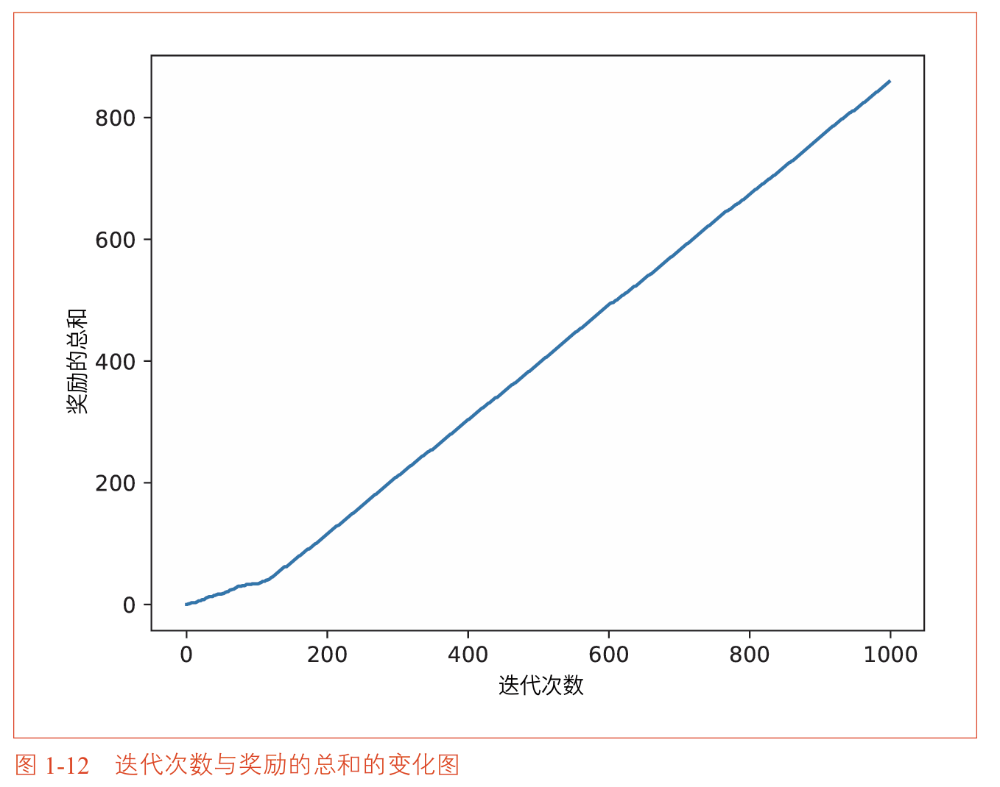
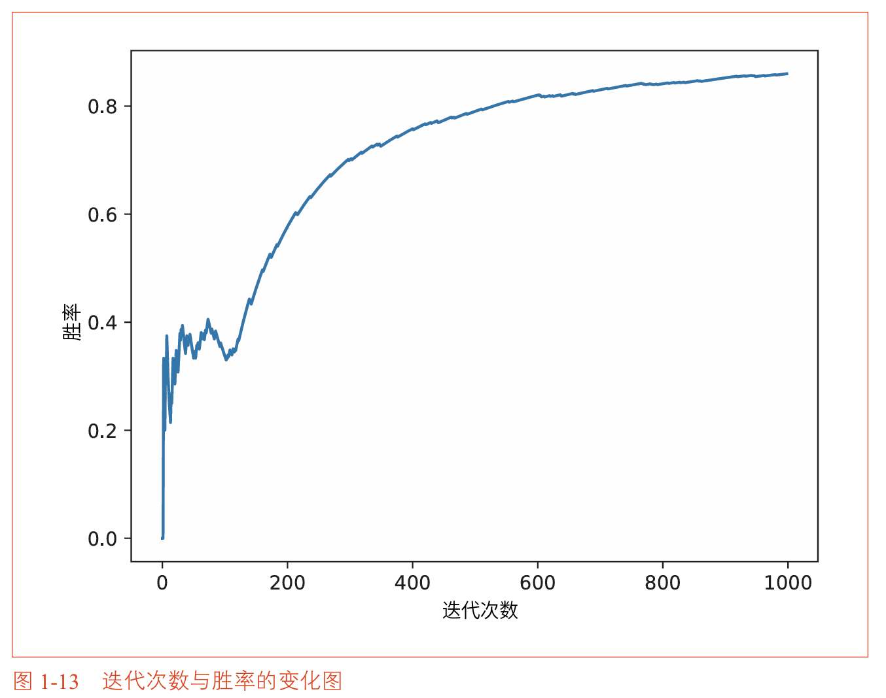
**代码说明**：
- 循环中的三个步骤（选择 → 执行 → 学习）构成了强化学习中最基本的交互循环。
- 图1-12展示了累计奖励随步数稳步增长的趋势，但仅凭这张图难以看出学习效率。
- 图1-13展示了胜率随时间的变化，能够更清晰地反映学习过程：初始阶段胜率迅速上升（代理在快速识别好机器），随后增速放缓并趋于稳定（代理已基本确定最优机器，剩余探索主要用于确认）。


### 1.4.4 算法平均的特性

由于算法中涉及大量随机因素（老虎机胜率的随机生成、ε-greedy 中的随机探索、每局结果的随机性），单次实验的结果并不可靠。为了评估算法的“平均性能”，需要**重复多次实验并取平均值**。

```python
runs = 200              # 重复实验次数
steps = 1000            # 每次实验的步数
epsilon = 0.1           # ε-greedy 的探索概率

# 创建二维数组存储每次实验的胜率变化
# all_rates[r][t] 表示第 r 次实验在第 t 步时的胜率
all_rates = np.zeros((runs, steps))

for run in range(runs):
    bandit = Bandit()
    agent = Agent(epsilon)
    total_reward = 0
    rates = []
    
    for step in range(steps):
        action = agent.get_action()
        reward = bandit.play(action)
        agent.update(action, reward)
        total_reward += reward
        rates.append(total_reward / (step + 1))
    
    # 记录本次实验的胜率序列
    all_rates[run] = rates

# 按步数计算所有实验的平均胜率
avg_rates = np.average(all_rates, axis=0)

# 绘制平均胜率变化图
plt.ylabel('Rates')
plt.xlabel('Steps')
plt.plot(avg_rates)
plt.show()
```
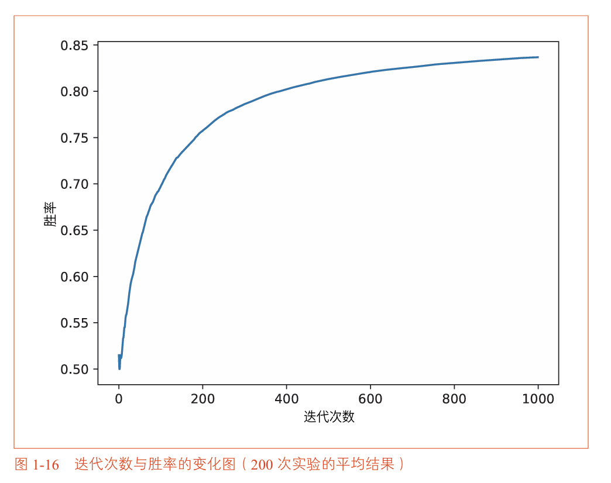

**关于 ε 的选择**

下图展示了不同 ε 值（0.01、0.1、0.3）在 200 次实验平均下的胜率变化：
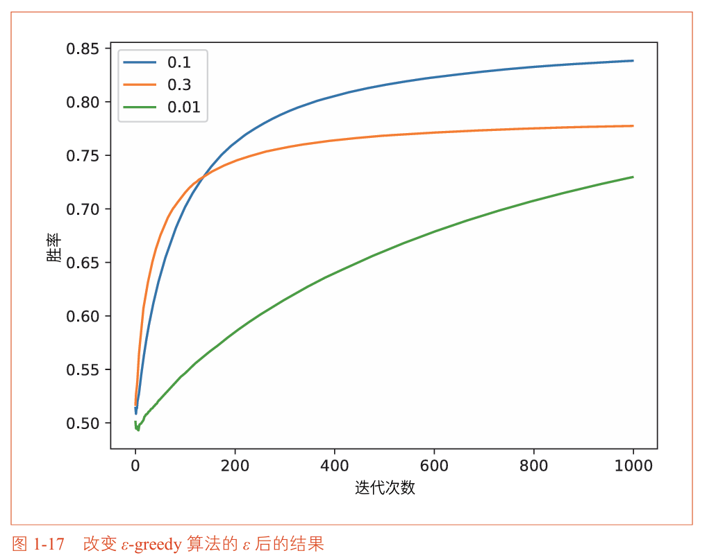
- **$\epsilon = 0.01$**（探索极少）：胜率增长缓慢。因为几乎永远选择当前估计最好的机器，如果早期碰巧给差机器估计出了较高的值，算法会陷入局部最优，难以发现真正最好的机器。
- **$\epsilon = 0.3$**（探索过多）：胜率初期上升较快，但很快趋于平缓并达到上限。因为 30% 的时间在随机探索，导致最终只有 70% 的步数用于利用已知的好机器，胜率天花板大约在 0.7 左右。
- **$\epsilon = 0.1$**（平衡较好）：胜率稳步上升，最终达到三者中最高的水平。这个 ε 值在“利用已掌握的信息”和“继续收集新信息”之间取得了最好的平衡。

**结论**：
- $\epsilon$ 不是越大越好，也不是越小越好。
- 存在一个最优的 $\epsilon$ 值，能够最大化长期累计奖励。
- 最优 $\epsilon$ 值取决于具体问题的性质（如总步数、机器数量、价值分布的差异程度等）。在本例中，$\epsilon=0.1$ 显著优于 $\epsilon=0.01$ 和 $\epsilon=0.3$。


## 1.5 非稳态问题

### 1.5.1 什么是非稳态问题

前面的讨论都基于一个关键假设：环境是 **稳态（Stationary）** 的，即老虎机的**真实价值（胜率）是固定不变的**。在这个假设下，**样本平均法是最优的估计方法**，因为每个历史数据都具有相同的参考价值。

然而在现实世界的许多问题中，环境是不断变化的。用户的偏好会随季节改变，商品的价格会因市场波动而调整，竞争对手的策略也会动态更新。这种环境属性随时间变化的问题被称为 **非稳态（Non-Stationary）** 问题。

**从样本平均到固定步长**

回顾之前的增量式更新公式：

$$Q_n = Q_{n-1} + \frac{1}{n}(R_n - Q_{n-1})$$

这里的步长是 $\frac{1}{n}$，它会随着 $n$ 的增大而逐渐减小到 0。这意味着**当 $n$ 很大时，即使环境发生了变化，新的奖励数据也几乎不会改变旧的估计值**，算法将无法适应环境的变化。

为了解决这个问题，我们将步长从 $\frac{1}{n}$ 替换为一个**固定常数 $\alpha$**：

$$Q_n = Q_{n-1} + \alpha(R_n - Q_{n-1}), \quad \alpha \in (0,1]$$

其中 $\alpha$ 是一个固定的超参数，控制着对新数据的响应速度。

**指数移动平均的权重分布**

将更新公式展开，可以清楚地看到每个历史奖励的权重分配：

$$\begin{aligned}
Q_n &= Q_{n-1} + \alpha(R_n - Q_{n-1}) \\
    &= \alpha R_n + (1-\alpha)Q_{n-1} \\
    &= \alpha R_n + (1-\alpha)\{\alpha R_{n-1} + (1-\alpha)Q_{n-2}\} \\
    &= \alpha R_n + \alpha(1-\alpha)R_{n-1} + (1-\alpha)^2 Q_{n-2}
\end{aligned}$$

继续展开直到 $Q_0$，各历史奖励的权重分布如下：

| 奖励 | 权重 |
| :--- | :--- |
| $R_n$（最新） | $\alpha$ |
| $R_{n-1}$ | $\alpha(1-\alpha)$ |
| $R_{n-2}$ | $\alpha(1-\alpha)^2$ |
| $R_{n-3}$ | $\alpha(1-\alpha)^3$ |
| 更早的数据 | 呈指数级递减 |

因为 $0 < 1-\alpha < 1$，越旧的奖励其 $(1-\alpha)$ 的指数越高，权重越小，呈**指数级衰减**。这种模式被称为**指数移动平均（Exponential Moving Average）**。

> **关键洞察**：样本平均法对所有历史数据一视同仁；指数移动平均则天然地“重视近期、淡忘久远”，使算法能够持续跟踪环境的最新变化。

**两种更新方法的对比**

| 方法 | 步长 | 权重特点 | 适用场景 | 示意图|
| :--- | :--- | :--- | :--- | :---|
| 样本平均 | $\frac{1}{n}$（随时间递减） | 所有历史数据等权重 | 稳态环境 |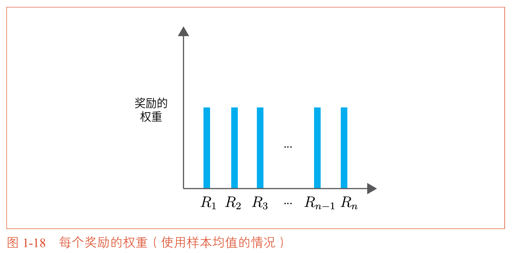|
| 指数移动平均 | $\alpha$（固定常数） | 近期权重大，旧数据指数衰减 | **非稳态环境** |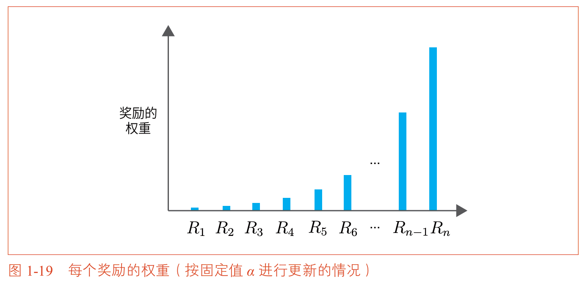|


### 1.5.2 解决非稳态问题的实现

**非稳态环境的实现**

创建一个 `NonStatBandit` 类，它在每次 `play` 时都会略微改变所有机器的胜率：

```python
import numpy as np

class NonStatBandit:
    def __init__(self, arms=10):
        self.arms = arms
        self.rates = np.random.rand(arms)  # 随机生成初始胜率
    
    def play(self, arm):
        rate = self.rates[arm]  # 当前胜率
        
        # 环境变化：每次游戏后，所有机器的胜率加上微小随机噪声
        # np.random.randn() 生成均值为0、标准差为1的正态分布随机数
        self.rates += 0.1 * np.random.randn(self.arms)
        
        if rate > np.random.rand():
            return 1
        else:
            return 0
```

**代码说明**：与稳态版本的关键区别在于 `self.rates += 0.1 * np.random.randn(self.arms)`。这行代码使每台老虎机的真实胜率在每次游戏后发生微小随机变化，环境处于持续漂移状态。即使玩家找到了“当前最好”的机器，这个“最好”也只是暂时的。

**适应非稳态的智能代理**

使用固定步长 $\alpha$ 的智能代理：

```python
class AlphaAgent:
    def __init__(self, epsilon, alpha, action_size=10):
        self.epsilon = epsilon
        self.alpha = alpha          # 固定步长
        self.Qs = np.zeros(action_size)  # 不需要 ns（尝试次数）
    
    def update(self, action, reward):
        # 固定步长更新：Q_new = Q_old + α(reward - Q_old)
        self.Qs[action] += (reward - self.Qs[action]) * self.alpha
    
    def get_action(self):
        if np.random.rand() < self.epsilon:
            return np.random.randint(0, len(self.Qs))
        else:
            return np.argmax(self.Qs)
```

**代码说明**：与普通 `Agent` 的唯一区别在于 `update` 方法中使用 `self.alpha` 作为步长，不再需要记录尝试次数 `self.ns`。这个简单的修改使智能代理能够持续跟踪环境变化，因为它永远不会“停止学习”。


### 1.5.3 实验结果

对比两种更新方法在非稳态环境中的表现：

```python
import matplotlib.pyplot as plt

runs = 200
steps = 1000
epsilon = 0.1
alpha = 0.8  # 固定步长

sample_avg_rates = np.zeros((runs, steps))
alpha_rates = np.zeros((runs, steps))

# 方法1：样本平均法（步长 = 1/n）
for run in range(runs):
    bandit = NonStatBandit()
    agent = Agent(epsilon)
    total_reward = 0
    rates = []
    for step in range(steps):
        action = agent.get_action()
        reward = bandit.play(action)
        agent.update(action, reward)
        total_reward += reward
        rates.append(total_reward / (step + 1))
    sample_avg_rates[run] = rates

# 方法2：固定步长法（步长 = α）
for run in range(runs):
    bandit = NonStatBandit()
    agent = AlphaAgent(epsilon, alpha)
    total_reward = 0
    rates = []
    for step in range(steps):
        action = agent.get_action()
        reward = bandit.play(action)
        agent.update(action, reward)
        total_reward += reward
        rates.append(total_reward / (step + 1))
    alpha_rates[run] = rates

# 绘制对比结果
plt.ylabel('Rates')
plt.xlabel('Steps')
plt.plot(np.average(sample_avg_rates, axis=0), label='sample average')
plt.plot(np.average(alpha_rates, axis=0), label='alpha const update')
plt.legend()
plt.show()
```

**实验结果分析**：
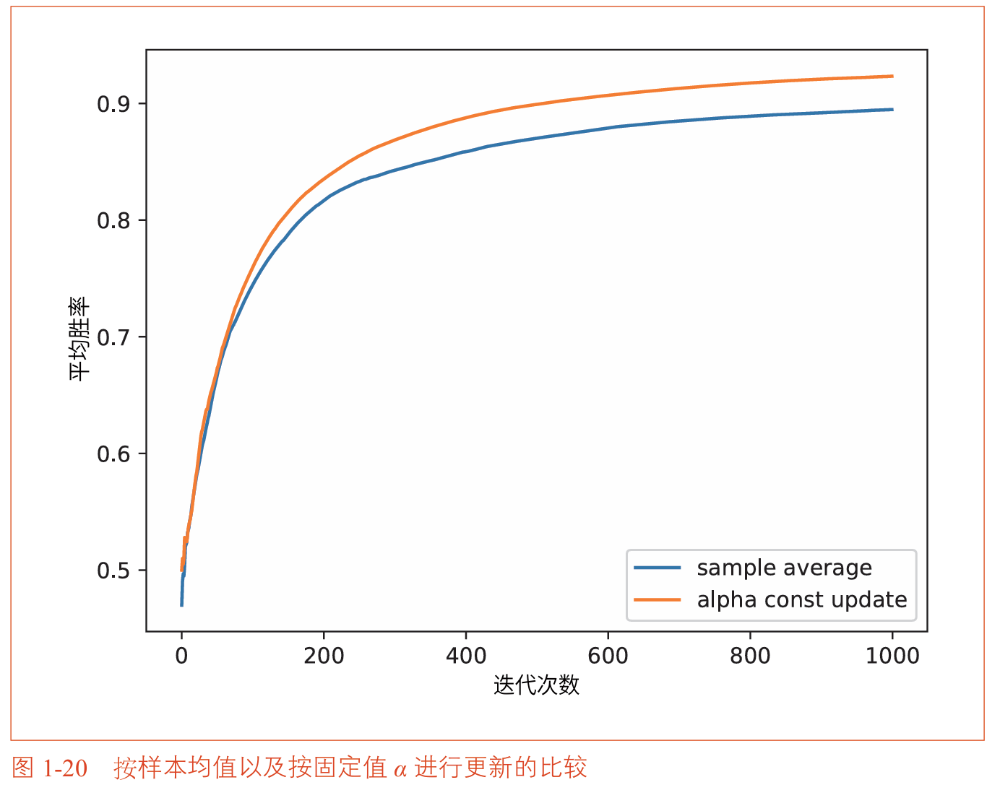
| 阶段 | 样本平均法（$1/n$） | 固定步长法（$\alpha$） |
| :--- | :--- | :--- |
| 初始阶段 | 两种方法表现相近 | 两种方法表现相近 |
| 中期阶段 | 随 $n$ 增大，步长变小，对变化反应迟钝 | 始终保持相同更新力度，持续跟踪 |
| 长期阶段 | 胜率明显较低，且差距持续扩大 | 胜率较高，能快速适应环境变化 |

**核心结论**：样本平均法在稳态环境下最优，但无法“忘记”过时信息，在非稳态下表现不佳。固定步长法虽然在稳态下方差较大，但在非稳态下能快速跟踪环境变化，始终保持合理的估计。


### 1.5.4 关于初始值的重要提示

使用固定步长 $\alpha$ 的更新公式展开后：

$$Q_n = \alpha R_n + \alpha(1-\alpha)R_{n-1} + \cdots + \alpha(1-\alpha)^{n-1}R_1 + (1-\alpha)^n Q_0$$

关键结论：
- 初始值 $Q_0$ 的影响不会完全消失，只会随 $(1-\alpha)^n$ 指数级衰减
- 相比之下，样本平均法的初始值在第一次更新后就被覆盖了
- 使用固定步长时，需要更谨慎地选择初始值，或给予充分训练时间让偏置衰减


## 本章小结

| 要点 | 说明 |
| :--- | :--- |
| **强化学习的定位** | 通过试错与环境交互，学习最大化累计奖励，与监督/无监督学习有本质区别 |
| **老虎机问题** | 理解行动价值 q(a) = E[R|A=a]，即采取某个行动的期望奖励 |
| **利用与探索的权衡** | 强化学习的核心挑战，ε-greedy 是简单有效的解决方案 |
| **增量式更新** | $Q_n = Q_{n-1} + \text{步长} \times (R_n - Q_{n-1})$，所有RL算法的核心更新形式 |
| **环境适应性** | 稳态用 $1/n$（样本平均），非稳态用固定 $\alpha$（指数移动平均） |


### 关键公式速查

| 公式 | 名称 | 适用场景 |
| :--- | :--- | :--- |
| $Q_n = Q_{n-1} + \frac{1}{n}(R_n - Q_{n-1})$ | 增量式样本平均 | **稳态环境**，所有历史数据等权重 |
| $Q_n = Q_{n-1} + \alpha(R_n - Q_{n-1})$ | 固定步长更新 | **非稳态环境**，近期数据权重大（指数移动平均） |


# 第二章 马尔可夫决策过程

## 本章概述

在第一章的老虎机问题中，无论智能代理采取什么行动，之后面临的问题**都是一样的**——环境没有状态，每次选择都是独立的。但现实世界的问题远比这复杂。
>以围棋为例，智能代理落子后，棋盘上的棋子排列会发生变化，对手的落子会进一步改变局面。智能代理采取的不同行动导致棋局每时每刻都在变化，它必须考虑到棋局的转变，下出最佳的一手。

老虎机问题中还有一个重要的简化：它没有考虑“状态”这个概念。在老虎机问题中，**环境不会因为玩家的行动而发生改变**，玩家每次面对的都是一组相同的老虎机。但在现实问题中，智能代理的行动会改变环境的状态，而环境状态的变化又会反过来影响智能代理未来的决策。这种状态、行动和奖励之间的动态循环，构成了强化学习的核心框架。

本章将介绍一种能够描述这种复杂交互的数学模型——**马尔可夫决策过程（Markov Decision Process，MDP）**。MDP是强化学习中最基本的数学框架，几乎所有强化学习问题都可以用MDP来描述。本章将首先通过具体例子直观理解MDP，然后用数学语言精确刻画MDP的各个组成部分，最后通过一个简单的网格世界问题，展示如何在MDP框架下寻找最优策略。

### 本章知识脉络

```
2.1 什么是MDP
  └── 从网格世界理解状态、行动、奖励的动态交互
        ↓
2.2 环境的数学表示
  └── 用数学语言定义状态迁移、奖励函数、策略
        ↓
2.3 MDP的目标
  └── 收益的定义、价值函数、最优策略的概念
        ↓
2.4 MDP的实例分析
  └── 通过两个方格的网格世界手动求解最优策略
        ↓
2.5 小结
```


## 2.1 什么是MDP

MDP是Markov Decision Process的缩写，中文译为“马尔可夫决策过程”。决策过程是指智能代理通过与环境互动决定其行动的过程，而“马尔可夫”则强调了状态具有马尔可夫性——未来只取决于当前状态，与过去无关。

### 2.1.1 MDP的具体例子
#### 例子一
让我们通过一个具体的例子来理解MDP。想象一个被网格分割的世界，其中有一个机器人可以在网格上向右或向左移动，如下图所示。
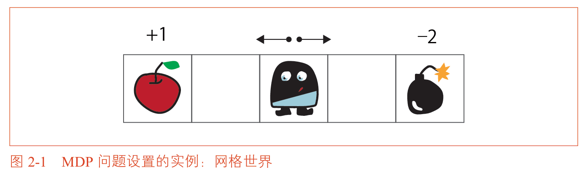
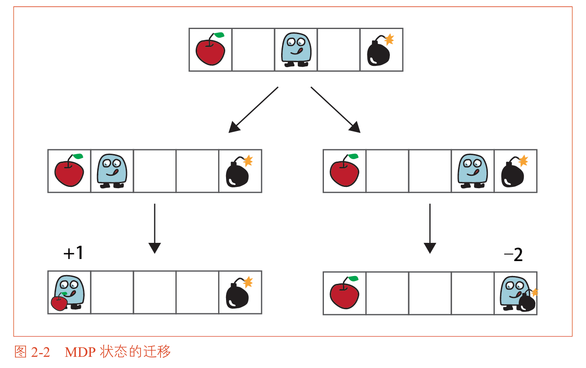
在这个网格世界中：
- 最左端有一个苹果，拿到苹果的奖励是 +1
- 最右端有一个炸弹，碰到炸弹的奖励是 -2
- 空白的网格奖励为 0

如果用强化学习的术语来描述：
- **机器人**就是智能代理
- **网格世界**就是环境
- **向左或向右移动**就是智能代理可以采取的行动
- **苹果和炸弹的位置**决定了奖励的发放

在这个问题中，智能代理每次行动时情况都会发生变化。假设智能代理向左移动，然后再向左移动，它会到达苹果的位置并得到 +1 的奖励。如果智能代理向右移动，然后再向右移动，它会到达炸弹的位置并得到 -2 的奖励。

从这些状态迁移中，我们可以清晰地看到MDP的两个核心特征：
1. **状态随行动而改变**：智能代理所处的位置（状态）取决于它之前选择了向左还是向右。
2. **奖励与状态相关**：智能代理到达不同位置会获得不同的奖励。

在这个例子中，智能代理的最佳策略是显而易见的：向左移动两次，拿到苹果。这个问题的最优行动取决于状态，而状态又取决于之前的行动，这就构成了一个动态的决策过程。

#### 例子二
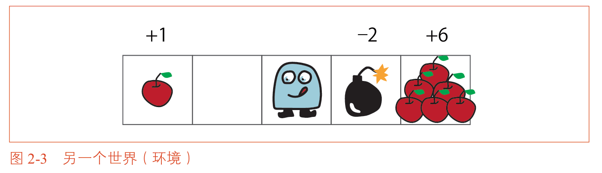
再看另一个稍复杂的例子：假设网格的左端有一个奖励为 +1 的苹果，紧挨着智能代理的右边是一个奖励为 -2 的炸弹，而网格的右端还有一个奖励为 +6 的苹果。在这个问题中，智能代理向右移动一步会立即获得负奖励（-2），但如果再向右移动一步，就会获得更大的正奖励（+6）。

这个例子揭示了一个关键点：**智能代理不能只贪图眼前的奖励，而要考虑将来获得的奖励总和**。如果智能代理只看眼前，它可能会选择安全的左转获得 +1。但如果它有远见，就会选择先承受 -2 的损失，然后获得 +6 的更大回报。这正是强化学习区别于简单贪心算法的核心所在——目标不是最大化即时奖励，而是最大化累计奖励的总和。

### 2.1.2 智能代理与环境的互动

在MDP中，智能代理与环境按照固定的时序进行互动：
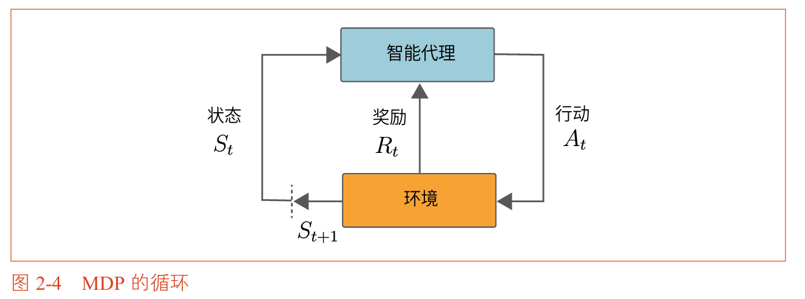
1. 在时刻 $t$，环境处于状态 $S_t$
2. 智能代理观察状态 $S_t$，并选择一个行动 $A_t$
3. 环境因行动 $A_t$ 而改变，进入下一个状态 $S_{t+1}$
4. 环境向智能代理返回奖励 $R_t$
5. 时刻推进到 $t+1$，循环继续

这个过程产生的时间序列数据如下：

$$S_0, A_0, R_0, S_1, A_1, R_1, S_2, A_2, R_2, \dots$$

>关于奖励的时机，本书采用 $R_t$ 的标记方式，即：在状态 $S_t$ 中执行行动 $A_t$，获得奖励 $R_t$，并迁移到下一个状态 $S_{t+1}$。


## 2.2 环境和智能代理的数学表示

MDP通过数学公式来表示智能代理、环境以及二者之间的互动。要做到这一点，需要用数学式来表达以下三个要素：

1. **状态迁移**：状态如何随时间变化
2. **奖励函数**：如何给予奖励
3. **策略**：智能代理如何决定行动

### 2.2.1 状态迁移

状态迁移描述的是：当智能代理在当前状态 $s$ 下采取行动 $a$ 后，**环境**会迁移到哪个下一个状态 $s'$。
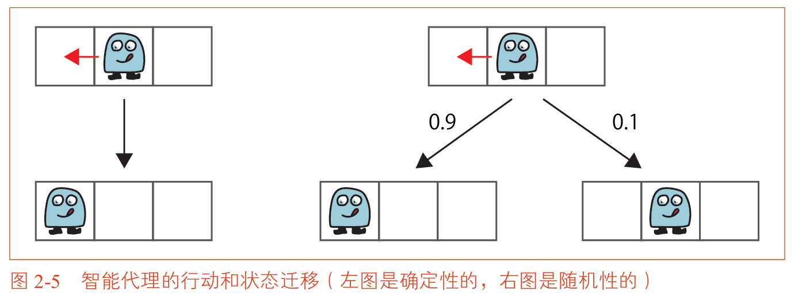
**确定性状态迁移**

在确定性环境中，下一个状态 $s'$ 由当前状态 $s$ 和行动 $a$ 唯一决定。
>例如，如果智能代理选择向左移动，它总是会向左移动一格。这种确定性迁移可以表示为一个函数：

$$s' = f(s, a)$$

其中 $f$ 被称为**状态迁移函数（State Transition Function）**。

**随机性状态迁移**

在随机性环境中，即使智能代理在相同的状态下执行相同的行动，迁移到的下一个状态也可能不同。
>例如，智能代理选择向左移动，但可能由于地面打滑，它有 0.9 的概率向左移动，有 0.1 的概率留在原地。

随机性状态迁移可以用**状态迁移概率（State Transition Probability）** 来描述：

$$p(s' \mid s, a)$$

这个式子表示：在当前状态 $s$ 下采取行动 $a$ 后，迁移到下一个状态 $s'$ 的概率。

| 迁移类型 | 数学表示 | 特点 |
| :--- | :--- | :--- |
| 确定性 | $s' = f(s, a)$ | 给定 $s$ 和 $a$，$s'$ 唯一确定 |
| 随机性 | $p(s' \mid s, a)$ | 给定 $s$ 和 $a$，$s'$ 按概率分布确定 |

**马尔可夫性**

状态迁移概率 $p(s' \mid s, a)$ 的一个重要特征在于：下一个状态 $s'$ **只取决于当前状态 $s$ 和行动 $a$**，与更早的历史（之前处于什么状态、执行了哪些行动）无关。这个特性被称为**马尔可夫性（Markov Property）**。

>MDP通过假设马尔可夫性来模拟状态迁移和奖励。引入马尔可夫性主要是为了使问题更容易解决。如果不假定马尔可夫性，就必须考虑之前所有的状态和行动，组合的数量会呈指数级增长，使得问题在计算上不可行。

### 2.2.2 奖励函数
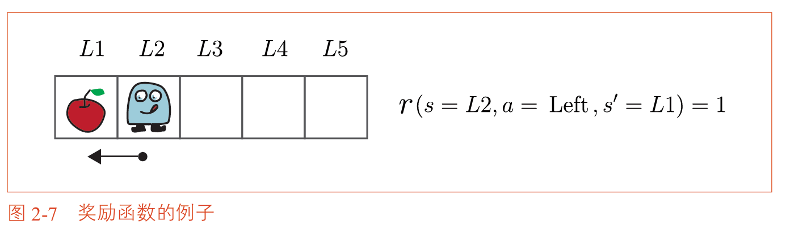
奖励函数 $r(s, a, s')$ 定义了智能代理在状态 $s$ 下执行行动 $a$、迁移到下一个状态 $s'$ 时能获得多少奖励。

为了简单起见，本书假设奖励的发放是确定性的，即给定三元组 $(s, a, s')$，奖励的值是唯一确定的。
>例如，在网格世界中，如果智能代理从某个位置移动到苹果所在的位置，奖励函数就返回 +1。

需要注意的是，在某些问题中，奖励可能只取决于下一个状态 $s'$（如到达苹果位置获得 +1），而不依赖于具体的行动 $a$。这种情况下奖励函数可以简化为 $r(s')$。

>虽然本书假设奖励是确定性的，但即使奖励本身是随机性的（例如，到达某个位置时有 0.8 的概率获得 -10，有 0.2 的概率获得 0），后续推导的贝尔曼方程等理论仍然成立，只需将奖励函数 $r(s, a, s')$ 理解为奖励的期望值即可。

### 2.2.3 智能代理的策略
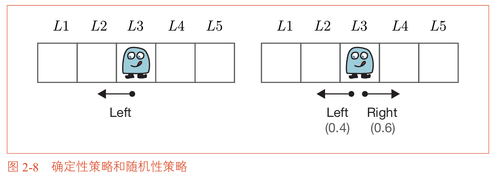
**策略（Policy）** 是智能代理的行为准则，它决定了智能代理在某个状态下应该采取什么行动。

**确定性策略**

在确定性策略下，智能代理在某个状态 $s$ 下总是采取固定的行动 $a$：

$$a = \mu(s)$$

其中 $\mu$ 被称为确定性策略函数。

**随机性策略**

在随机性策略下，智能代理在状态 $s$ 下以一定的概率选择各个行动：

$$\pi(a \mid s)$$

这个式子表示：在状态 $s$ 下，智能代理选择行动 $a$ 的概率。

| 策略类型 | 数学表示 | 特点 |
| :--- | :--- | :--- |
| 确定性 | $a = \mu(s)$ | 每个状态下只选择一个行动 |
| 随机性 | $\pi(a \mid s)$ | 每个状态下按概率分布选择行动 |

由于MDP的环境状态迁移满足马尔可夫性（只依赖于当前状态），智能代理的策略也只需要基于当前状态来决定行动，而不需要依赖历史信息。这是MDP框架的重要性质，它大大简化了决策问题的复杂性。

确定性策略可以看作是随机性策略的特例：在某个状态下，选择一个行动的概率为1，选择其他行动的概率为0。因此，本书后续将主要基于随机性策略 $\pi(a \mid s)$ 进行探讨。


## 2.3 MDP的目标

在定义了MDP的各个组成部分之后，我们现在可以明确MDP的核心目标：**找到最优策略（Optimal Policy）**。最优策略是使智能代理获得的累计奖励（收益）最大化的策略。

在正式定义最优策略之前，我们需要先理解一些基本概念。

### 2.3.1 回合制任务和连续性任务

根据问题的不同，MDP可以分为两类：

| 任务类型 | 定义 | 示例 |
| :--- | :--- | :--- |
| **回合制任务** | 有明确的结束状态，任务会终止 | 围棋比赛、迷宫寻宝 |
| **连续性任务** | 没有结束，任务会无限持续 | 库存管理、机器人持续控制 |

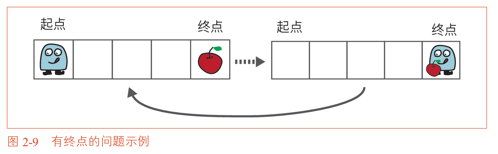
在回合制任务中，智能代理从一个初始状态出发，经过一系列状态迁移，最终到达终止状态，这个从开始到结束的完整序列被称为一个“回合（Episode）”。每个回合结束后，智能代理会回到初始状态重新开始。

在连续性任务中，没有终止状态，智能代理需要无限期地持续决策。例如，一个负责管理仓库库存的智能代理需要持续决定每天的进货量，这个过程没有天然的结束点。

### 2.3.2 收益

在定义了状态迁移、奖励函数和策略之后，我们终于可以定义MDP的优化目标了。智能代理的目标不是最大化即时奖励，而是最大化**收益（Return）**，即**未来所有奖励的加权总和**。

设时刻为 $t$，状态为 $S_t$，智能代理根据策略 $\pi$ 执行行动，获得奖励序列 $R_t, R_{t+1}, R_{t+2}, \dots$，则收益 $G_t$ 的定义如下：

$$G_t = R_t + \gamma R_{t+1} + \gamma^2 R_{t+2} + \gamma^3 R_{t+3} + \dots$$

其中 $\gamma$ 是**折现率（Discount Rate）**，取值在 0 到 1 之间。

**为什么要引入折现率？**

折现率在MDP中扮演着两个关键角色：

1. **防止收益发散**：在连续性任务中，如果没有折现率（即 $\gamma = 1$），无限多个奖励相加会趋向无穷大，导致收益无法定义。有了 $\gamma < 1$，远期奖励的权重指数级衰减，收益收敛于有限值。

2. **体现时间偏好**：折现率使近期的奖励比远期的奖励更重要。这符合人类和动物的决策习惯——我们通常更看重眼前的收益而不是遥远的承诺。

**折现率的数值含义**：

| 折现率 $\gamma$ | 含义 |
| :--- | :--- |
| $\gamma = 0$ | 只看当前奖励，完全短视 |
| $\gamma = 0.9$ | 未来一步的奖励打9折，两步打81折 |
| $\gamma = 1$ | 所有奖励同等重要（仅用于回合制任务） |

收益的递归形式在后续推导中会频繁使用。从定义出发，我们可以将收益写成递归形式：

$$G_t = R_t + \gamma R_{t+1} + \gamma^2 R_{t+2} + \dots = R_t + \gamma (R_{t+1} + \gamma R_{t+2} + \dots) = R_t + \gamma G_{t+1}$$

这个简单的递推关系 $G_t = R_t + \gamma G_{t+1}$ 是贝尔曼方程的基石。

### 2.3.3 状态价值函数

由于智能代理的策略和环境的迁移都可能具有随机性，即使从相同的状态出发，不同回合获得的收益也会随机变化。因此，我们需要用**期望值**来评价一个状态的好坏。

**状态价值函数（State-Value Function）** $v_\pi(s)$ 定义为：在策略 $\pi$ 下，从状态 $s$ 出发所能获得的收益的期望值。

$$v_\pi(s) = \mathbb{E}_\pi[G_t \mid S_t = s]$$

这个函数的含义是：如果智能代理从状态 $s$ 出发，并持续遵循策略 $\pi$，它平均能获得多少累计奖励。当策略 $\pi$ 变化时，价值函数也会随之变化。

### 2.3.4 最优策略和最优价值函数

在强化学习中，我们的最终目标是找到**最优策略**——在所有可能的策略中，使每个状态的价值函数都达到最大值的策略。

**如何比较两个策略的好坏？**
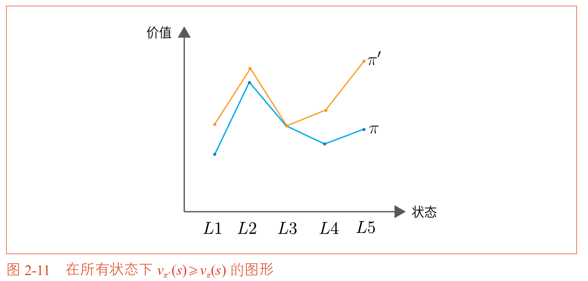
假设有两个策略 $\pi$ 和 $\pi'$。如果在**所有状态** $s$ 下都有 $v_{\pi'}(s) \geq v_\pi(s)$，则称策略 $\pi'$ 不劣于策略 $\pi$。如果至少在一个状态下严格大于，则称 $\pi'$ 优于 $\pi$。

**最优策略的定义**：

如果存在一个策略 $\pi_*$，使得对于所有状态 $s$ 和所有其他策略 $\pi$，都有：

$$v_{\pi_*}(s) \geq v_\pi(s)$$

则 $\pi_*$ 被称为最优策略。

**最优策略的重要性质**：

在MDP中，至少存在一个最优策略，而且最优策略是**确定性策略**。这意味着最优策略可以用函数 $\mu_*(s)$ 表示：在每个状态 $s$ 下，$\mu_*(s)$ 唯一确定地指定一个行动。

最优策略所对应的状态价值函数被称为**最优状态价值函数（Optimal State-Value Function）**，记作 $v_*(s)$：

$$v_*(s) = \max_\pi v_\pi(s)$$

| 符号 | 含义 |
| :--- | :--- |
| $v_\pi(s)$ | 在策略 $\pi$ 下，状态 $s$ 的价值函数 |
| $v_*(s)$ | 最优状态价值函数 |
| $\pi_*$ | 最优策略 |


## 2.4 MDP的例子

现在让我们通过一个具体的MDP问题来巩固上述概念。

### 2.4.1 问题设定：两个方格的网格世界

考虑一个只有两个方格的网格世界，如下图所示：


问题的设定如下：

- 智能代理可以执行两个行动：向右移动（Right）或向左移动（Left）
- 状态迁移是确定性的（选择向左一定向左，选择向右一定向右）
- 当智能代理从 L1 移动到 L2 时，获得苹果，奖励为 +1
- 当智能代理从 L2 移动到 L1 时，苹果重新出现
- 如果智能代理撞墙（在 L1 时向左，或在 L2 时向右），获得奖励为 -1
- 这是一个**连续性任务**（没有终止状态）
- 折现率 $\gamma = 0.9$

**回溯线形图**

为了清晰地表示状态、行动和奖励之间的关系，我们可以绘制**回溯线形图（Backup Diagram）**。回溯线形图是一种有向图，用节点表示状态，用箭头表示行动和状态迁移。

例如，考虑策略 $\mu_1$：在 L1 向右移动，在 L2 向右移动。

状态 L1 的回溯线形图如下：

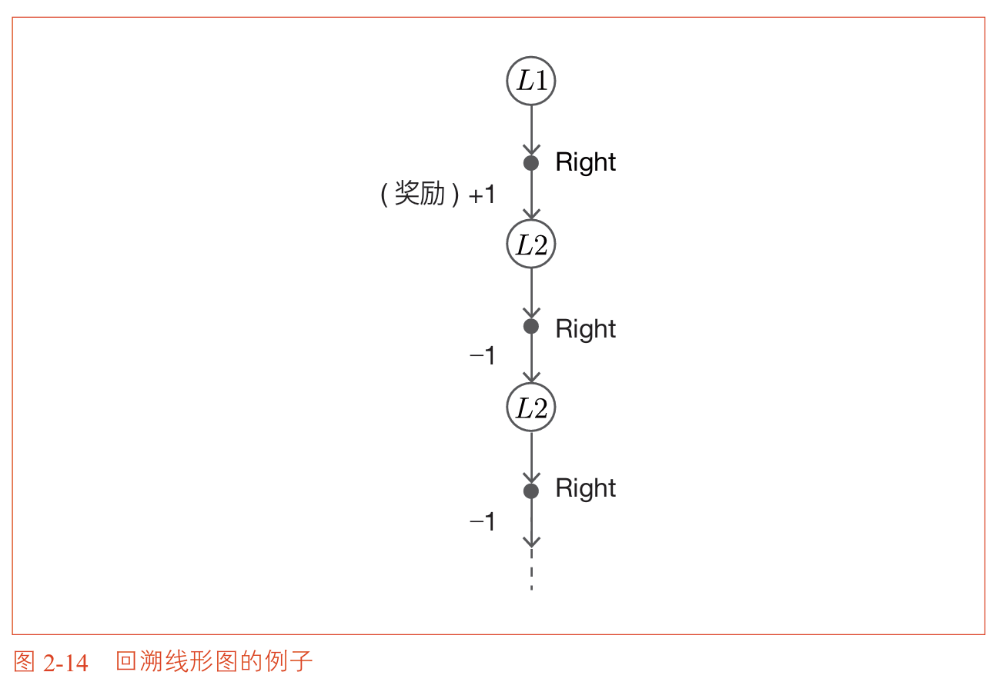

这个图表示：从状态 L1 出发，如果选择 Right，会获得 +1 奖励并迁移到 L2；如果选择 Left，会获得 -1 奖励并留在 L1。

**手动求解价值函数**

由于该问题状态和行动都很少，我们可以列出所有可能的确定性策略（共 $2^2 = 4$ 个），然后手动计算每个策略的价值函数。
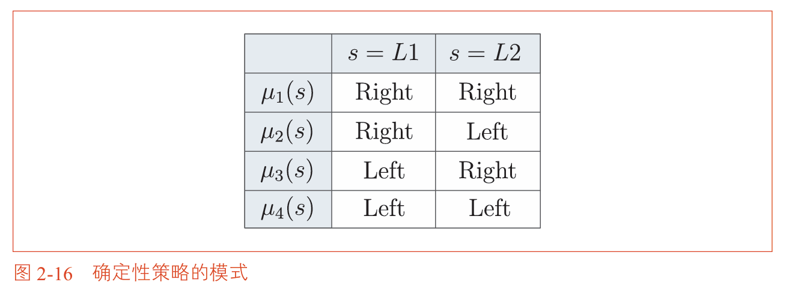

以策略 $\mu_1$（在两个状态下都向右移动）为例：

在状态 L1 下选择 Right，智能代理获得 +1 并迁移到 L2。之后，在 L2 下继续选择 Right，智能代理撞墙获得 -1 并留在 L2（因为右墙阻挡），此后会持续获得 -1。

因此，状态 L1 的价值函数为：

$$v_{\mu_1}(L1) = 1 + 0.9 \times (-1) + 0.9^2 \times (-1) + 0.9^3 \times (-1) + \dots$$

利用无限等比数列求和公式 $1 + r + r^2 + \dots = \frac{1}{1-r}$（$0 < r < 1$）：

$$v_{\mu_1}(L1) = 1 - 0.9 \times \frac{1}{1-0.9} = 1 - 9 = -8$$

状态 L2 的价值函数为：

$$v_{\mu_1}(L2) = -1 + 0.9 \times (-1) + 0.9^2 \times (-1) + \dots = -\frac{1}{1-0.9} = -10$$
>其实上述二者主要差别就是初始值不同。

对所有四个策略进行类似计算，得到以下结果：
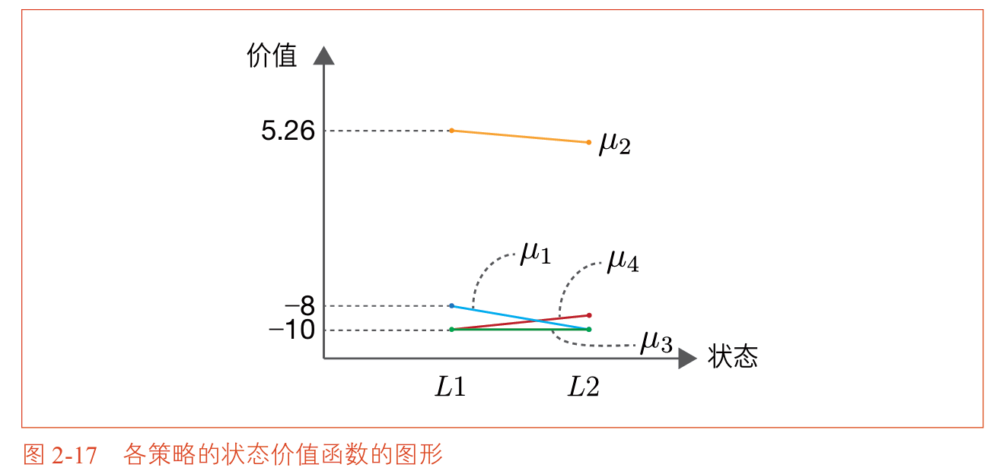

从图可以看出，策略 $\mu_2$（在 L1 向右移动，在 L2 向左移动）在所有状态下的价值函数都高于其他策略，因此 $\mu_2$ 就是该问题的最优策略。

这个策略的含义是：智能代理在 L1 和 L2 之间**来回移动**，每次从 L1 到 L2 都能获得 +1 的苹果奖励。它永远不会撞墙，因此也永远不会受到 -1 的惩罚。这是一个直观上合理的最优策略。


## 本章小结

本章从老虎机问题迈向了更现实的强化学习问题——马尔可夫决策过程。

| 概念 | 含义 |
| :--- | :--- |
| **状态** | 环境的快照，包含决策所需的所有信息 |
| **行动** | 智能代理在某个状态下可以做出的选择 |
| **奖励** | 环境对智能代理行动给出的即时反馈 |
| **策略** | 智能代理的行为准则，从状态到行动的映射 |
| **收益** | 未来所有奖励的**折现总和**，智能代理的**真正**优化目标 |
| **价值函数** | 在某个策略下，从某个状态出发的期望收益 |
| **最优策略** | 在所有状态下使价值函数最大化的策略 |

MDP是强化学习中最基本的数学框架。它通过状态、行动、奖励、策略这四个核心概念，精确刻画了智能代理与环境之间的动态交互。本章通过两个方格的网格世界，我们首次体验了如何在一个具体的MDP问题中寻找最优策略。

从下一章开始，我们将学习MDP中最重要的方程——贝尔曼方程，它是连接价值函数与最优策略的桥梁，也是后续所有强化学习算法的理论基础。


### 关键公式速查

| 公式 | 含义 |
| :--- | :--- |
| $s' = f(s, a)$ | 确定性状态迁移函数 |
| $p(s' \mid s, a)$ | 随机性状态迁移概率 |
| $a = \mu(s)$ | 确定性策略 |
| $\pi(a \mid s)$ | 随机性策略 |
| $G_t = R_t + \gamma R_{t+1} + \gamma^2 R_{t+2} + \dots$ | 收益的定义 |
| $G_t = R_t + \gamma G_{t+1}$ | 收益的递归形式 |
| $v_\pi(s) = \mathbb{E}_\pi[G_t \mid S_t = s]$ | 状态价值函数的定义 |
| $v_*(s) = \max_\pi v_\pi(s)$ | 最优状态价值函数 |


**本章要点**

- 与老虎机问题的关键区别在于**状态的存在**：行动会影响状态，状态又影响未来的决策
- MDP的目标是**最大化收益的期望值**，而不是即时奖励
- 最优策略具有确定性，这意味着在最优策略下，每个状态只对应一个最优行动
- 两个方格的网格世界展示了如何通过枚举策略来手动求解最优策略，这种方法只适用于极小规模的问题
