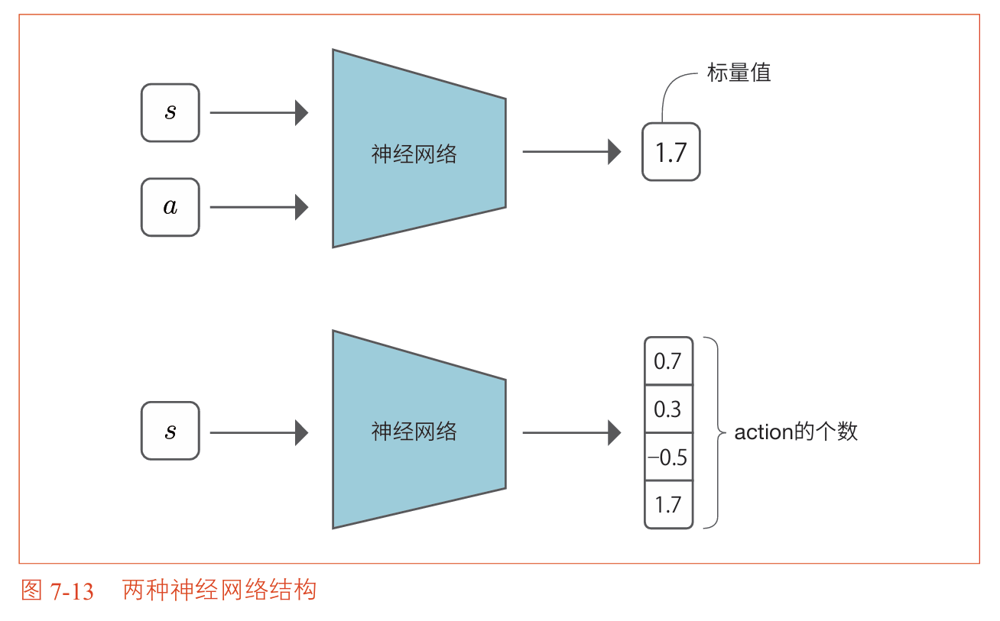
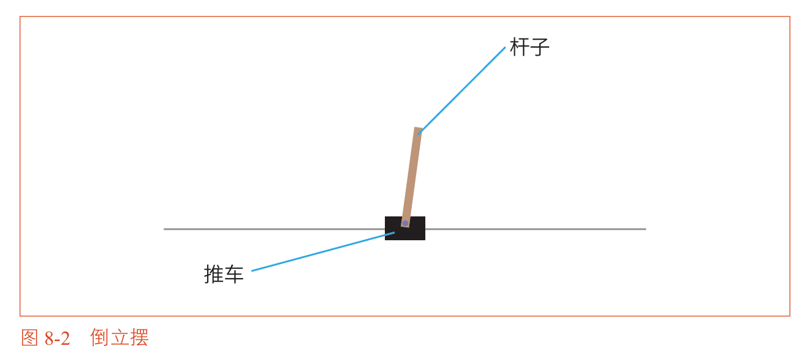
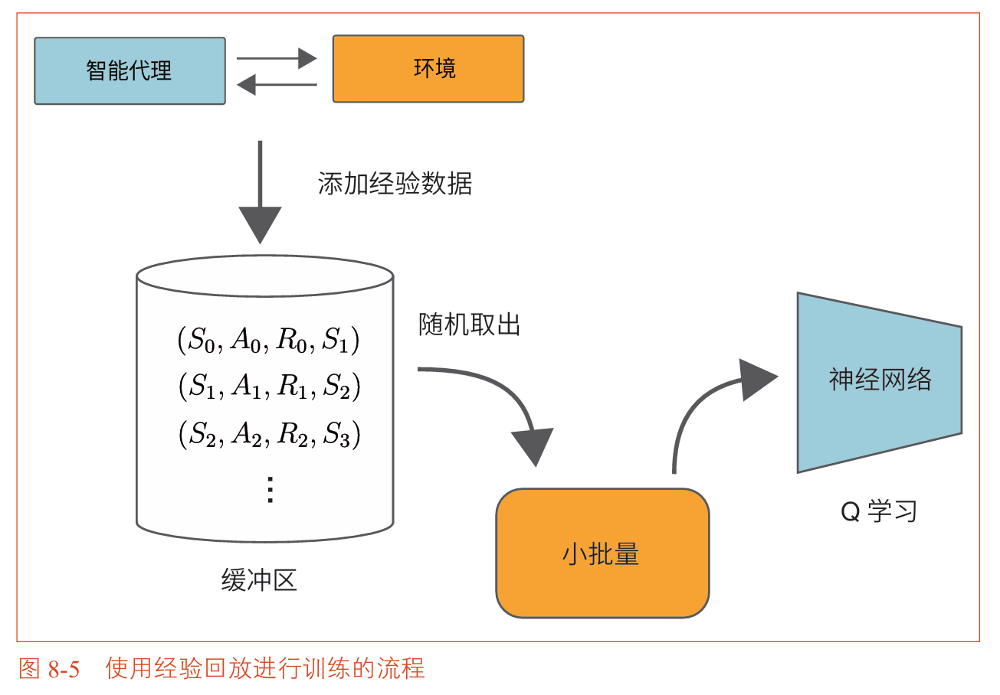
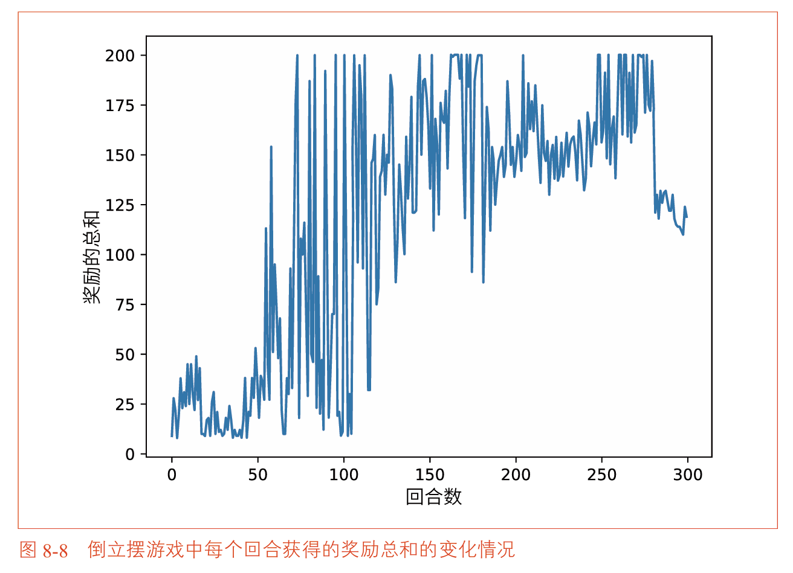
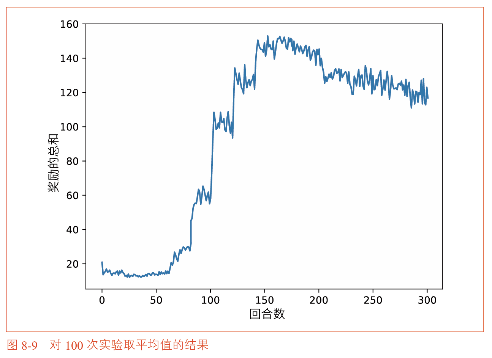
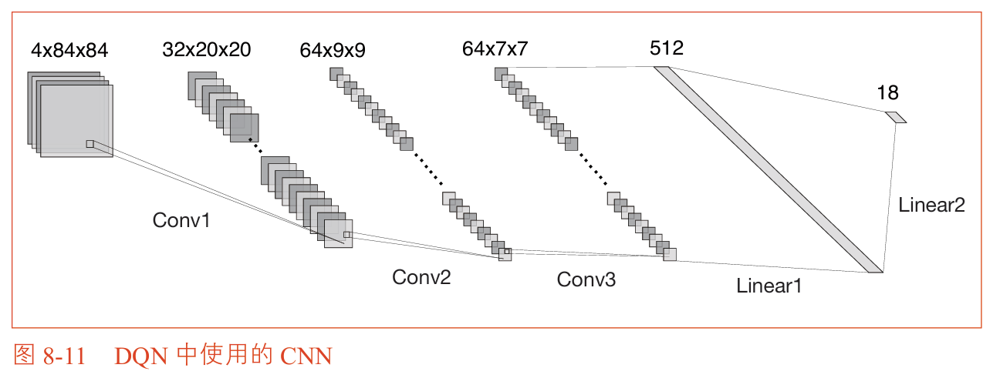
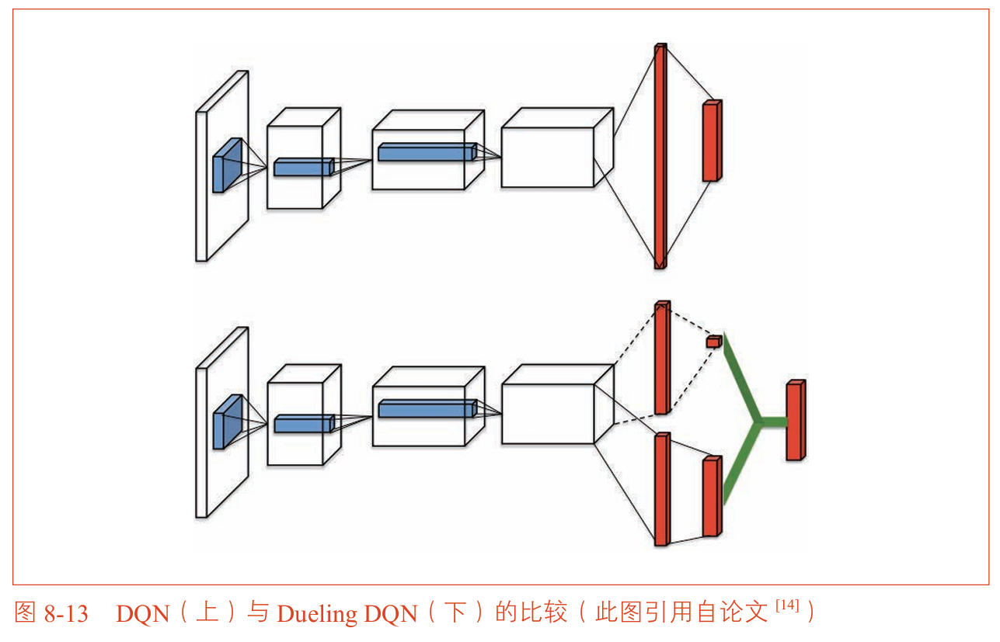

## 第七章 神经网络和Q学习

### 本章概述

在前面的章节中，我们学习了强化学习的基础算法：动态规划、蒙特卡洛方法和TD方法（SARSA、Q学习）。这些算法都基于一个共同的假设：**状态空间和行动空间足够小**，可以将价值函数或Q函数存储为**表格**。

表格形式意味着每个状态-行动对都有独立的存储条目。对于3×4网格世界（12个状态 × 4个行动 = 48个条目），表格方法完全可行。但现实世界的问题远没有这么简单。

考虑围棋的棋局：棋盘上的棋子布局有超过 $10^{170}$ 种可能状态。对于如此庞大的状态空间，表格方法在物理上不可能实现。即使状态数量稍多一些（比如视频游戏的原始像素画面），表格方法也会因为**维数灾难**而迅速失效。

解决问题的方向是：用**函数近似**来替代表格。也就是说，我们不存储每个状态-行动对的Q值，而是用一个参数化的函数（比如神经网络）来近似Q函数。

神经网络特别适合这个任务，因为：
1. 神经网络可以处理高维输入（如原始像素）
2. 神经网络能够**泛化**——对于从未见过的状态，也能给出合理的输出
3. 神经网络可以通过梯度下降进行端到端训练

本章将首先介绍深度学习的工具，然后将其与Q学习结合，为第8章的DQN铺平道路。

### 本章知识脉络

```
7.1 DeZero简介
  └── 深度学习框架的基本用法（变量、张量、自动求导）
        ↓
7.2 线性回归
  └── 用DeZero实现最基础的机器学习模型
        ↓
7.3 神经网络
  └── 从线性回归扩展到神经网络（激活函数、层、优化器）
        ↓
7.4 Q学习与神经网络
  └── 将Q函数的表格表示替换为神经网络
        ↓
7.5 小结
```


## 7.1 DeZero简介

本书使用一个名为 **DeZero** 的深度学习框架。DeZero是在“鱼书”系列的第三本书《深度学习入门2：自制框架》中创建的框架，其API设计与PyTorch非常相似。如果读者熟悉PyTorch或TensorFlow，可以很快上手。

> DeZero的代码可以轻松迁移到PyTorch。本书配套的GitHub仓库中，也同时提供了DeZero版和PyTorch版的代码。

### 7.1.1 使用DeZero

安装DeZero：
```bash
pip install dezero
```

**Variable类**

DeZero的核心是 `Variable` 类，它是NumPy多维数组 `np.ndarray` 的封装：

```python
import numpy as np
from dezero import Variable

# 创建Variable
x_np = np.array(5.0)
x = Variable(x_np)

# 计算
y = 3 * x ** 2
print(y)  # variable(75.0)

# 反向传播（自动求导）
y.backward()
print(x.grad)  # variable(30.0)
```

**自动求导原理**：$y = 3x^2$ 的导数为 $dy/dx = 6x$，当 $x=5$ 时导数为30。DeZero通过反向传播自动计算了这个梯度。

### 7.1.2 多维数组（张量）和函数

机器学习处理的数据通常是**多维数组**，也称为**张量（Tensor）**：

| 维度 | 名称 | 形状示例 |
| :--- | :--- | :--- |
| 0维 | 标量 | `()` |
| 1维 | 向量 | `(3,)` |
| 2维 | 矩阵 | `(3, 4)` |
| 3维及以上 | 张量 | `(32, 3, 224, 224)` |

**向量的内积**：
$$a \cdot b = a_1b_1 + a_2b_2 + \dots + a_nb_n$$

**矩阵的乘积**：

矩阵乘积要求左侧矩阵的列数等于右侧矩阵的行数：
$$\mathbf{A}_{(m \times n)} \times \mathbf{B}_{(n \times p)} = \mathbf{C}_{(m \times p)}$$

```python
import dezero.functions as F

# 向量的内积
a = np.array([1, 2, 3])
b = np.array([4, 5, 6])
c = F.matmul(a, b)  # 32

# 矩阵的乘积
a = np.array([[1, 2], [3, 4]])
b = np.array([[5, 6], [7, 8]])
c = F.matmul(a, b)  # [[19, 22], [43, 50]]
```

### 7.1.3 最优化（梯度下降法）

**Rosenbrock函数**是一个经典的最优化测试函数：
$$y = 100(x_1 - x_0^2)^2 + (x_0 - 1)^2$$

它的最小值在 $(x_0, x_1) = (1, 1)$ 处取得，但搜索路径非常曲折。

```python
def rosenbrock(x0, x1):
    return 100 * (x1 - x0 ** 2) ** 2 + (x0 - 1) ** 2

x0 = Variable(np.array(0.0))
x1 = Variable(np.array(2.0))
y = rosenbrock(x0, x1)
y.backward()

print(x0.grad)  # variable(-2.0)
print(x1.grad)  # variable(400.0)
```

**梯度下降法**：

梯度指示的是函数值增加最快的方向。要让函数值减小，需要沿着梯度的**反方向**更新参数：

```python
lr = 0.001  # 学习率
for i in range(10000):
    y = rosenbrock(x0, x1)
    x0.cleargrad()
    x1.cleargrad()
    y.backward()
    x0.data -= lr * x0.grad.data
    x1.data -= lr * x1.grad.data

print(x0, x1)  # 接近 (1.0, 1.0)
```

> **重要提示**：`backward()` 会累积梯度，每次反向传播前需要调用 `cleargrad()` 清空之前的梯度。


## 7.2 线性回归

在将神经网络用于强化学习之前，我们先从最基础的机器学习任务——线性回归——开始。

### 7.2.1 玩具数据集

生成一个简单的线性数据集，包含噪声：

```python
np.random.seed(0)
x = np.random.rand(100, 1)
y = 5 + 2 * x + np.random.rand(100, 1)  # y = 5 + 2x + 噪声
```

这个数据集的真实规律是：$y = 5 + 2x$，但数据中包含随机噪声。

### 7.2.2 线性回归的理论

线性回归的目标是找到参数 $W$ 和 $b$，使得模型 $y = Wx + b$ 能够拟合数据。

**损失函数**：均方误差（Mean Squared Error, MSE）
$$L = \frac{1}{N} \sum_{i=1}^N (Wx_i + b - y_i)^2$$

### 7.2.3 线性回归的实现

```python
import numpy as np
from dezero import Variable
import dezero.functions as F

# 生成数据集
np.random.seed(0)
x = np.random.rand(100, 1)
y = 5 + 2 * x + np.random.rand(100, 1)

# 参数初始化
W = Variable(np.zeros((1, 1)))  # 权重
b = Variable(np.zeros(1))        # 偏置

def predict(x):
    return F.matmul(x, W) + b

def mean_squared_error(x0, x1):
    diff = x0 - x1
    return F.sum(diff ** 2) / len(diff)

# 训练
lr = 0.1
for i in range(100):
    y_pred = predict(x)
    loss = mean_squared_error(y, y_pred)
    
    W.cleargrad()
    b.cleargrad()
    loss.backward()
    
    W.data -= lr * W.grad.data
    b.data -= lr * b.grad.data

print(W.data, b.data)  # W ≈ 2.118, b ≈ 5.466
```

训练后得到的参数 $W \approx 2.118$，$b \approx 5.466$，非常接近真实值 $W=2$，$b=5$。


## 7.3 神经网络

### 7.3.1 非线性数据集

当数据不是线性关系时，线性回归无法拟合。考虑一个正弦波数据集：

```python
x = np.random.rand(100, 1)
y = np.sin(2 * np.pi * x) + np.random.rand(100, 1)
```

线性模型无法拟合正弦曲线，需要使用神经网络。

### 7.3.2 线性变换和激活函数

**线性变换（仿射变换）**：
$$y = Wx + b$$

- $W$：权重（Weight）
- $b$：偏置（Bias）

DeZero提供了 `F.linear` 函数来实现线性变换：
```python
y = F.linear(x, W, b)
```

**激活函数**：引入非线性，使神经网络能够拟合任意复杂的函数：

| 激活函数 | 公式 | 特点 |
| :--- | :--- | :--- |
| Sigmoid | $\sigma(x) = \frac{1}{1 + e^{-x}}$ | 输出范围 (0,1)，平滑可微 |
| ReLU | $f(x) = \max(0, x)$ | 计算简单，缓解梯度消失 |

### 7.3.3 神经网络的实现

一个两层的神经网络：线性变换 → 激活函数 → 线性变换

```python
def predict(x):
    y = F.linear(x, W1, b1)   # 第一层
    y = F.sigmoid(y)           # 激活函数
    y = F.linear(y, W2, b2)    # 第二层
    return y
```

### 7.3.4 层与模型

DeZero提供了更高级的API来构建神经网络：

```python
from dezero import Model
import dezero.layers as L
import dezero.functions as F

class TwoLayerNet(Model):
    def __init__(self, hidden_size, out_size):
        super().__init__()
        self.l1 = L.Linear(hidden_size)
        self.l2 = L.Linear(out_size)
    
    def forward(self, x):
        y = F.sigmoid(self.l1(x))
        y = self.l2(y)
        return y

model = TwoLayerNet(10, 1)
```

### 7.3.5 优化器

DeZero提供了多种优化器：

| 优化器 | 特点 |
| :--- | :--- |
| SGD | 标准随机梯度下降 |
| Momentum | 加入动量，加速收敛 |
| AdaGrad | 自适应学习率 |
| Adam | 结合Momentum和AdaGrad的优点 |

```python
from dezero import optimizers

model = TwoLayerNet(10, 1)
optimizer = optimizers.SGD(lr=0.2)
optimizer.setup(model)

for i in range(10000):
    y_pred = model(x)
    loss = F.mean_squared_error(y, y_pred)
    model.cleargrads()
    loss.backward()
    optimizer.update()  # 自动更新所有参数
```


## 7.4 Q学习与神经网络

### 7.4.1 神经网络的预处理

网格世界中的状态是坐标 `(h, w)`，需要转换为神经网络可以处理的形式——**独热向量（One-Hot Vector）**。

独热向量：只有一个元素为1，其余为0的向量。

```python
def one_hot(state, height=3, width=4):
    vec = np.zeros(height * width, dtype=np.float32)
    h, w = state
    idx = width * h + w
    vec[idx] = 1.0
    return vec[np.newaxis, :]  # 添加批量维度

state = (2, 0)
x = one_hot(state)  # 形状: (1, 12)
```

**为什么使用独热编码？**
- 类别数据不能直接输入神经网络
- 独热编码保留了“互斥”关系（一个状态只能在一个位置）
- 方便处理离散状态空间

### 7.4.2 表示Q函数的神经网络

表格Q函数存储为字典：`Q[(state, action)] = value`

神经网络版Q函数：输入状态，输出所有行动的Q值：

```python
class QNet(Model):
    def __init__(self, action_size=4):
        super().__init__()
        self.l1 = L.Linear(100)   # 隐藏层大小100
        self.l2 = L.Linear(action_size)  # 输出层，大小=行动数
    
    def forward(self, x):
        x = F.relu(self.l1(x))
        x = self.l2(x)
        return x

qnet = QNet(4)
state_one_hot = one_hot((2, 0))
qs = qnet(state_one_hot)  # 形状: (1, 4)
```

**两种神经网络结构的选择**：

| 结构 | 输入 | 输出 | 优点 | 缺点 |
| :--- | :--- | :--- | :--- | :--- |
| 方案A | 状态 + 行动 | Q值（标量） | 灵活 | 计算 $\max_a Q(s,a)$ 需要多次前向传播 |
| **方案B** | **仅状态** | **所有行动的Q值（向量）** | **只需一次前向传播即可得到所有行动的Q值** | 输出维度固定 |

本书采用**方案B**，因为它更高效。

### 7.4.3 神经网络和Q学习

**Q学习的更新式**：
$$Q(S_t, A_t) \leftarrow Q(S_t, A_t) + \alpha [ R_t + \gamma \max_a Q(S_{t+1}, a) - Q(S_t, A_t) ]$$

当用神经网络表示Q函数时，更新变成了**回归问题**：

> 将 TD目标 $T = R_t + \gamma \max_a Q(S_{t+1}, a)$ 作为**正确答案标签**，训练神经网络使其输出接近 $T$。

```python
class QLearningAgent:
    def __init__(self, action_size=4, gamma=0.9, lr=0.01, epsilon=0.1):
        self.gamma = gamma
        self.epsilon = epsilon
        self.action_size = action_size
        
        # 神经网络Q函数
        self.qnet = QNet(action_size)
        self.optimizer = optimizers.SGD(lr)
        self.optimizer.setup(self.qnet)
    
    def get_action(self, state):
        # ε-greedy
        if np.random.rand() < self.epsilon:
            return np.random.choice(self.action_size)
        else:
            qs = self.qnet(state)
            return qs.data.argmax()
    
    def update(self, state, action, reward, next_state, done):
        # 计算TD目标
        if done:
            next_q = np.zeros(1)
        else:
            next_qs = self.qnet(next_state)
            next_q = next_qs.max(axis=1)
            next_q.unchain()  # 阻止梯度传播到next_q
        
        target = self.gamma * next_q + reward
        
        # 计算当前Q值
        qs = self.qnet(state)
        q = qs[:, action]  # 只取当前行动对应的Q值
        
        # 损失函数（均方误差）
        loss = F.mean_squared_error(target, q)
        
        # 反向传播和参数更新
        self.qnet.cleargrads()
        loss.backward()
        self.optimizer.update()
```

### 7.4.4 关键点：`unchain()`

在计算TD目标时，`next_q` 来自神经网络。但我们不希望梯度通过 `next_q` 反向传播到目标网络（否则目标会随参数变化而移动，训练不稳定）。

```python
next_q.unchain()  # 从计算图中分离，TD目标被视为常数
```

### 7.4.5 运行结果

```python
env = GridWorld()
agent = QLearningAgent()
loss_history = []

for episode in range(1000):
    state = env.reset()
    state = one_hot(state)
    total_loss = 0
    
    while True:
        action = agent.get_action(state)
        next_state, reward, done = env.step(action)
        next_state = one_hot(next_state)
        
        loss = agent.update(state, action, reward, next_state, done)
        total_loss += loss
        
        if done:
            break
        state = next_state
    
    loss_history.append(total_loss)
```

> **注意**：神经网络的训练并不稳定。即使损失函数下降，策略也可能出现波动。这是深度强化学习的核心挑战之一，将在第8章中通过DQN的技术（经验回放、目标网络）来解决。


## 7.5 小结

本章完成了从**表格方法**到**深度强化学习**的关键跨越。

**表格方法 vs 神经网络方法**：

| 对比 | 表格Q学习 | 神经网络Q学习 |
| :--- | :--- | :--- |
| Q函数表示 | 字典 `(state, action) → value` | 神经网络 `state → [Q值向量]` |
| 状态空间 | 只能处理离散小状态空间 | 可以处理高维连续状态 |
| 泛化能力 | 无（每个状态独立） | 有（相似状态共享参数） |
| 训练方式 | 直接更新 | 梯度下降 |
| 稳定性 | 稳定 | 不稳定（需要技巧） |

**核心公式更新**：

| Q学习更新式（表格） | Q学习更新式（神经网络） |
| :--- | :--- |
| $Q \leftarrow Q + \alpha [T - Q]$ | $loss = \frac{1}{2}(T - Q)^2$，通过梯度下降优化 |
| 直接更新Q值 | 更新神经网络参数，Q值随之改变 |

**本章引入的新概念**：

| 概念 | 说明 |
| :--- | :--- |
| DeZero | 用于教学的深度学习框架，API类似PyTorch |
| 独热编码 | 将离散状态转换为神经网络输入向量 |
| 回归问题 | 将强化学习更新视为监督学习（用TD目标作为标签） |
| unchained | 阻止TD目标反向传播，稳定训练 |

**使用神经网络的意义**
第七章实验的核心就是用神经网络替换掉之前用来存Q值的表格。
>在第六章的网格世界里，状态只有12个，把每个状态和每个行动的Q值存在一个字典里完全够用。
>但现实问题中，状态空间可能非常大，表格可能根本存不下。

所以需要用神经网络来近似Q函数：输入是状态，输出是这个状态下所有行动对应的Q值。

神经网络的输入不能直接用坐标，需要先转成独热向量。把这个向量送进网络，网络输出对应数字，决策时选最大的那个数字对应的行动就行。

训练的方式和表格Q学习基本一致，核心还是那个TD目标：$R + \gamma \max_a Q(S', a)$。区别在于：
- 表格Q学习是直接把Q值往TD目标方向拉：$Q \leftarrow Q + \alpha(T - Q)$。
- 神经网络需要把TD目标当作“正确答案”来计算损失函数，比如均方误差 $loss = (T - Q)^2$，然后通过梯度下降反向传播来调整网络参数，让网络输出的Q值逐渐接近TD目标。


# 第八章 DQN
## 本章概述
在第七章中，我们将Q学习与神经网络结合，实现了用神经网络近似Q函数。但实验结果并不理想：训练过程不稳定，损失函数剧烈波动，不同次运行的结果差异很大。

本章将介绍 **DQN（Deep Q-Network，深度Q网络）** ，它是Q学习与神经网络结合的**里程碑式算法**。DQN在2013年被提出，2015年登上《Nature》杂志，首次实现了在Atari游戏中达到人类水平的性能，引发了深度强化学习的热潮。

DQN的核心贡献不是提出了新的理论，而是引入了两项关键技术来解决神经网络Q学习的不稳定性：

1. **经验回放（Experience Replay）** ：存储过去的经验，随机采样打破数据相关性
2. **目标网络（Target Network）** ：用独立的网络计算TD目标，稳定训练目标

本章将从OpenAI Gym这个强化学习环境库开始，逐步实现DQN，并介绍其扩展算法。

### 本章知识脉络

```
8.1 OpenAI Gym
  └── 强化学习环境库的基本使用（CartPole倒立摆任务）
        ↓
8.2 DQN的核心技术
  └── 经验回放 + 目标网络 → 稳定训练
        ↓
8.3 DQN与Atari
  └── 扩展到图像输入（CNN、预处理、奖励裁剪）
        ↓
8.4 DQN的扩展
  └── Double DQN、优先级经验回放、Dueling DQN
        ↓
8.5 小结
```


## 8.1 OpenAI Gym

### 8.1.1 OpenAI Gym 是什么

OpenAI Gym 是一个开源库，提供了各种强化学习任务（环境），接口统一，便于算法测试和比较。

安装：
```bash
pip install gym
```

创建环境：
```python
import gym
env = gym.make('CartPole-v0')
```

**CartPole（倒立摆）任务**：

- 目标：移动小车，保持杆子平衡
- 状态：4个连续值（小车位置、小车速度、杆子角度、杆子角速度）
- 行动：2个离散值（向左推、向右推）
- 终止条件：杆子角度超过15° 或 小车移出边界
- 奖励：每保持平衡一步获得 +1
- 上限：版本0为200步，版本1为500步

### 8.1.2 Gym的基本用法

```python
import gym
import numpy as np

env = gym.make('CartPole-v0')

# 重置环境，获取初始状态
state = env.reset()  # 形状: (4,)
print(state)  # [0.034, -0.013, -0.021, 0.021]

# 获取行动空间
print(env.action_space)  # Discrete(2)，0=左推，1=右推

# 执行一步
action = 0  # 或1
next_state, reward, done, info = env.step(action)

# 可视化（会弹出窗口）
env.render()

# 关闭窗口
env.close()
```

**step() 返回值**：

| 返回值 | 含义 |
| :--- | :--- |
| `next_state` | 下一个状态，形状(4,)的数组 |
| `reward` | 即时奖励，每一步保持平衡为+1 |
| `done` | 是否结束（杆子倒下或移出边界） |
| `info` | 附加调试信息（通常不使用） |

### 8.1.3 随机智能代理

```python
env = gym.make('CartPole-v0')
state = env.reset()
done = False

while not done:
    env.render()
    action = np.random.choice([0, 1])  # 随机行动
    next_state, reward, done, info = env.step(action)
    state = next_state

env.close()
```

随机智能代理几乎无法保持平衡，通常在几十步内就会失败。


## 8.2 DQN的核心技术

### 8.2.1 为什么神经网络Q学习不稳定？

**问题根源：数据相关 + 目标移动**

| 问题 | 原因 | 后果 |
| :--- | :--- | :--- |
| **数据相关** | 连续时间步的经验高度相关（$E_t$ 和 $E_{t+1}$ 几乎相同） | 神经网络违背独立同分布假设，梯度更新偏差大 |
| **目标移动** | TD目标 $R + \gamma \max_a Q(S', a)$ 本身包含Q网络 | 目标在不断变化，模型追着移动的靶子 |

**对比监督学习**：

| | 监督学习 | Q学习 |
| :--- | :--- | :--- |
| 数据 | 随机采样，独立同分布 | 连续经验，高度相关 |
| 标签 | 固定不变 | TD目标随Q变化 |


### 8.2.2 技术一：经验回放（Experience Replay）

**核心思路**：存经验到“缓存区”，再随机取出，打破相关性。



```python
from collections import deque
import random

class ReplayBuffer:
    def __init__(self, buffer_size, batch_size):
        self.buffer = deque(maxlen=buffer_size)  # 固定容量，自动淘汰旧数据
        self.batch_size = batch_size
    
    def add(self, state, action, reward, next_state, done):
        self.buffer.append((state, action, reward, next_state, done))
    
    def get_batch(self):
        # 随机采样
        data = random.sample(self.buffer, self.batch_size)
        # 打包成numpy数组
        state = np.stack([x[0] for x in data])
        action = np.array([x[1] for x in data])
        reward = np.array([x[2] for x in data])
        next_state = np.stack([x[3] for x in data])
        done = np.array([x[4] for x in data]).astype(np.int32)
        return state, action, reward, next_state, done
```

**经验回放的两个作用**：

| 作用 | 说明 |
| :--- | :--- |
| 打破相关性 | 随机采样打乱时间顺序，数据近似独立同分布 |
| 数据复用 | 每条经验可以被多次使用，提高数据效率 |


### 8.2.3 技术二：目标网络（Target Network）

**核心思路**：用两个网络，一个更新，一个固定，定期同步。

| 网络 | 作用 | 更新方式 |
| :--- | :--- | :--- |
| **主网络 $Q$** | 输出当前Q值，用于选择行动 | 每步都更新（梯度下降） |
| **目标网络 $Q_{\text{target}}$** | 计算TD目标中的 $\max_a Q(S', a)$ | **定期**从主网络复制参数 |

TD目标使用目标网络计算：
$$T = R + \gamma \max_a Q_{\text{target}}(S', a)$$

```python
import copy

# 两个网络
self.qnet = QNet(action_size)          # 主网络
self.qnet_target = QNet(action_size)   # 目标网络

def sync_qnet(self):
    # 定期同步：将主网络参数复制到目标网络
    self.qnet_target = copy.deepcopy(self.qnet)

# 更新时使用目标网络计算TD目标
next_qs = self.qnet_target(next_state)  # ← 用目标网络
next_q = next_qs.max(axis=1)
target = reward + gamma * next_q
```

### 8.2.4 DQN的完整更新流程

```python
def update(self, state, action, reward, next_state, done):
    # 1. 存储经验
    self.replay_buffer.add(state, action, reward, next_state, done)
    
    # 2. 缓冲区不够大时不训练
    if len(self.replay_buffer) < self.batch_size:
        return
    
    # 3. 随机采样小批量
    state, action, reward, next_state, done = self.replay_buffer.get_batch()
    
    # 4. 用主网络计算当前Q值
    qs = self.qnet(state)
    q = qs[np.arange(self.batch_size), action]
    
    # 5. 用目标网络计算TD目标
    next_qs = self.qnet_target(next_state)
    next_q = next_qs.max(axis=1)
    next_q.unchain()
    target = reward + (1 - done) * gamma * next_q
    
    # 6. 损失函数和反向传播
    loss = F.mean_squared_error(q, target)
    self.qnet.cleargrads()
    loss.backward()
    self.optimizer.update()
    
    # 7. 定期同步目标网络（在外部循环中执行）
```

### 8.2.5 运行结果

在CartPole任务上训练300个回合，每20个回合同步目标网络：

| 训练阶段 | 平均奖励 | 说明 |
| :--- | :--- | :--- |
| 前50回合 | < 50 | 代理刚开始学习，平衡能力差 |
| 50-150回合 | 50-150 | 快速学习阶段，奖励迅速提升 |
| 150回合后 | 波动上升 | 逐渐接近上限200 |

> 由于随机性，单次实验结果不可靠，通常需要重复多次实验取平均。
> 


## 8.3 DQN与Atari（游戏）

### 8.3.1 Atari环境的特殊挑战

| 挑战 | 说明 |
| :--- | :--- |
| **高维输入** | 原始输入是210×160×3的RGB图像，约10万维 |
| **POMDP问题** | 单帧图像无法判断球的方向，需要使用连续多帧 |
| **训练时间长** | 需要数天训练（使用GPU） |

### 8.3.2 预处理

**POMDP解决方案**：将连续4帧图像叠加为一个状态。

**预处理步骤**：
1. 裁剪：去除图像边缘无用的记分牌区域
2. 转灰度：RGB → 灰度（减少计算量）
3. 缩放：缩小到84×84
4. 归一化：像素值缩放到 [0, 1] 范围
5. 堆叠：将连续4帧堆叠成 84×84×4 的张量

### 8.3.3 CNN结构

处理图像需要使用**卷积神经网络（CNN）** ，而不是全连接网络：


### 8.3.4 其他技巧

| 技巧 | 说明 |
| :--- | :--- |
| **GPU加速** | 图像数据计算量大，GPU必不可少 |
| **ε衰减** | 初始ε=1.0（完全探索），线性衰减到0.1，然后固定 |
| **奖励裁剪** | 将奖励截断到 [-1, 1] 范围，防止奖励尺度差异过大 |


## 8.4 DQN的扩展

### 8.4.1 Double DQN

**问题**：DQN使用 $\max_a Q(S', a)$ 会导致**过估计**——估计值系统性地高于真实值。

**原因**：Q值包含噪声，max操作会放大噪声。

**Double DQN的解决方案**：

| | DQN | Double DQN |
| :--- | :--- | :--- |
| 选择行动的来源 | 目标网络 | **主网络** |
| 获取Q值的来源 | 目标网络 | **目标网络** |

$$T = R + \gamma Q_{\text{target}}\big(S', \arg\max_a Q_{\text{main}}(S', a)\big)$$

- 用**主网络**选行动：$\arg\max_a Q_{\text{main}}(S', a)$
- 用**目标网络**取Q值：$Q_{\text{target}}(S', \text{那个行动})$

> 这样做可以减轻过估计，因为两个网络的噪声不会同时被放大。

### 8.4.2 优先级经验回放（PER）

**核心思路**：不是所有经验都同等重要。**TD误差大的经验应该更频繁地被采样**。

$$\delta = |T - Q(S,A)|$$

| TD误差 | 含义 | 采样优先级 |
| :--- | :--- | :--- |
| 大 | 模型预测与目标差距大，需要重点学习 | 高 |
| 小 | 模型已经学得很好，不需要重复学习 | 低 |

### 8.4.3 Dueling DQN

**核心思路**：将Q值分解为**状态价值**和**优势函数**。

$$Q(s,a) = V(s) + A(s,a)$$

| 组成部分 | 含义 |
| :--- | :--- |
| $V(s)$ | 状态s本身的价值（与行动无关） |
| $A(s,a)$ | 行动a相对于平均水平的优势 |

**网络结构**：


**优势**：在某些状态下，所有行动的结果几乎相同（比如球已经进入对方阵地），此时只需要学习 $V(s)$ 即可，不需要分别学习每个 $Q(s,a)$，提高了学习效率。

### 8.4.4 Rainbow

Rainbow是将DQN的多种改进算法**全部组合**起来的算法：

- Double DQN
- 优先级经验回放
- Dueling DQN
- 分类DQN（C51）
- Noisy Network

在Atari任务上，Rainbow的性能显著优于任何单一改进。


## 8.5 小结

DQN是深度强化学习的里程碑，其核心贡献是两项解决训练不稳定的技术。

| 关键技术 | 解决的问题 | 核心机制 |
| :--- | :--- | :--- |
| **经验回放** | 数据相关性 | 存储经验，随机采样 |
| **目标网络** | TD目标移动 | 独立网络，定期同步 |

**DQN的演进路径**：

```
DQN (2013)
  ↓ + Double DQN
Double DQN (2015)
  ↓ + 优先级经验回放
  ↓ + Dueling DQN
  ↓ + 分类DQN (C51)
  ↓ + Noisy Network
Rainbow (2017)
  ↓ + 分布式训练
Ape-X → R2D2 → NGU → Agent57 (2020, 超越人类水平)
```


