# 第三章 贝尔曼方程
## 本章概述
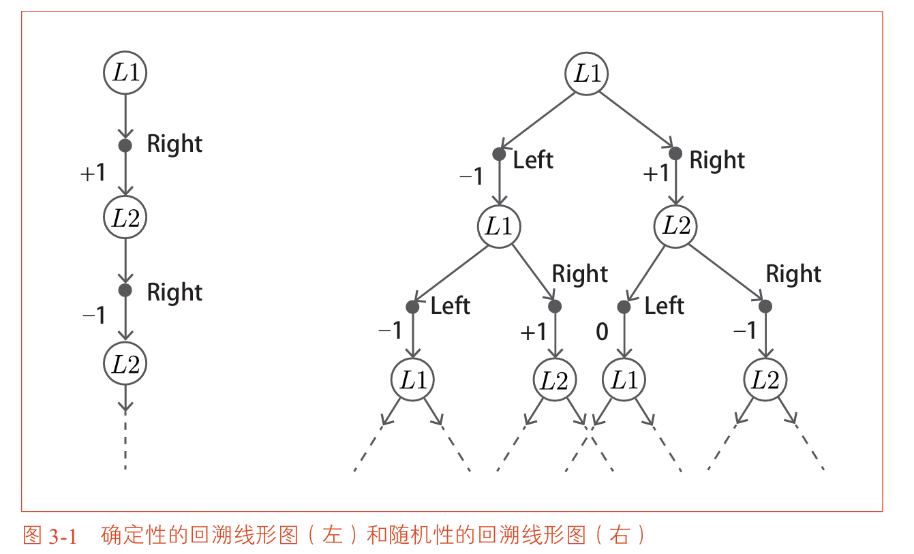
在第二章中，我们通过两个方格的网格世界学习了MDP的基本概念。在那个问题中，我们假设**环境是确定性的**，智能代理的**策略也是确定性**的。因此，回溯线形图延伸为一条直线，价值函数可以通过简单的数学计算求解。

但在更一般的MDP中，智能代理的**策略可能是随机性**的，**环境的状态迁移也可能是随机性的**。在这种情况下，回溯线形图会像树枝一样**不断分叉延伸**，价值函数无法再通过简单的手动计算求解。

本章的目标是推导出MDP中最重要的方程——**贝尔曼方程（Bellman Equation）**。贝尔曼方程是连接当前状态价值与未来状态价值的桥梁，它将看似无限的计算转化为有限的形式。无论是动态规划、蒙特卡洛方法还是Q学习，所有这些算法的理论基础都可以追溯到贝尔曼方程。

### 本章知识脉络

```
3.1 贝尔曼方程的推导
  └── 从收益的递归定义出发，推导出价值函数的贝尔曼方程
        ↓
3.2 贝尔曼方程的应用示例
  └── 通过两个方格的网格世界验证贝尔曼方程的正确性
        ↓
3.3 行动价值函数（Q函数）
  └── 引入Q函数，推导Q函数的贝尔曼方程
        ↓
3.4 贝尔曼最优方程
  └── 对最优策略成立的贝尔曼方程，引入max算子
        ↓
3.5 贝尔曼最优方程的应用示例
  └── 通过两个方格的网格世界求解最优策略
        ↓
3.6 小结
```


## 3.1 贝尔曼方程的推导

贝尔曼方程是强化学习中最核心的数学工具。本节的推导将严格遵循从定义出发、逐步展开的数学逻辑。

### 3.1.1 准备知识：概率和期望值

$x$ 和 $y$ 同时发生的概率（联合概率）为：

$$p(x, y) = p(x)p(y \mid x)$$

奖励 $r(x, y)$ 由 $x$ 和 $y$ 共同决定，期望奖励可以表示为对所有可能组合的加权求和：

$$\mathbb{E}[r(x, y)] = \sum_x \sum_y p(x, y)r(x, y)= \sum_x \sum_y p(x)p(y \mid x)r(x, y)$$

这个结构——先根据概率选择第一个随机变量，再根据条件概率选择第二个随机变量，最后计算奖励的加权和——与贝尔曼方程中“先根据策略选择行动，再根据状态迁移概率选择下一个状态”的结构完全相同。

### 3.1.2 贝尔曼方程的推导

现在我们从收益的定义出发，正式推导贝尔曼方程。

**第一步：收益的递归形式**

回顾收益的定义：

$$G_t = R_t + \gamma R_{t+1} + \gamma^2 R_{t+2} + \gamma^3 R_{t+3} + \dots$$

将 $t+1$ 代入定义式，得到从时刻 $t+1$ 开始的收益：

$$G_{t+1} = R_{t+1} + \gamma R_{t+2} + \gamma^2 R_{t+3} + \dots$$

比较 $G_t$ 和 $G_{t+1}$ 的关系：

$$G_t = R_t + \gamma(R_{t+1} + \gamma R_{t+2} + \gamma^2 R_{t+3} + \dots) = R_t + \gamma G_{t+1}$$

这个递归关系 $G_t = R_t + \gamma G_{t+1}$ 看似简单，但它是贝尔曼方程的基石。它表明：当前时刻的收益等于当前奖励加上折现后的未来收益。

**第二步：代入状态价值函数的定义**

状态价值函数的定义为收益的条件期望：

$$v_\pi(s) = \mathbb{E}_\pi[G_t \mid S_t = s]$$

将 $G_t = R_t + \gamma G_{t+1}$ 代入：

$$v_\pi(s) = \mathbb{E}_\pi[R_t + \gamma G_{t+1} \mid S_t = s]$$

利用期望的线性性质（和的期望等于期望的和）：

$$v_\pi(s) = \mathbb{E}_\pi[R_t \mid S_t = s] + \gamma \mathbb{E}_\pi[G_{t+1} \mid S_t = s]$$

现在我们需要分别计算这两项。

**第三步：计算第一项 $\mathbb{E}_\pi[R_t \mid S_t = s]$**

这一项是在状态 $s$ 下采取行动所能获得的即时奖励的期望值。

智能代理在状态 $s$ 下根据策略 $\pi(a \mid s)$ 选择行动 $a$。选择行动 $a$ 后，环境根据状态迁移概率 $p(s' \mid s, a)$ 迁移到下一个状态 $s'$。迁移到 $s'$ 后，智能代理获得奖励 $r(s, a, s')$。

因此，即时奖励的期望为所有行动和所有下一个状态的概率加权和：

$$\mathbb{E}_\pi[R_t \mid S_t = s] = \sum_a \sum_{s'} \pi(a \mid s) p(s' \mid s, a) r(s, a, s')$$

**第四步：计算第二项 $\gamma \mathbb{E}_\pi[G_{t+1} \mid S_t = s]$**

这一项是未来收益的期望值。关键洞察在于：状态 $s$ 下的未来收益等于所有可能的下一个状态 $s'$ 的价值函数的加权平均。

智能代理在状态 $s$ 下选择行动 $a$，迁移到 $s'$ 的概率是 $\pi(a \mid s)p(s' \mid s, a)$。到达 $s'$ 后，**从 $s'$ 出发的期望收益就是状态价值函数 $v_\pi(s')$**（收益 $G_t$ 的期望就是状态价值函数）。

因此：

$$\gamma \mathbb{E}_\pi[G_{t+1} \mid S_t = s] = \gamma \sum_a \sum_{s'} \pi(a \mid s) p(s' \mid s, a) v_\pi(s')$$

**第五步：合并两项得到贝尔曼方程**

将第三、四步的结果代入第二步的等式：

$$v_\pi(s) = \sum_a \sum_{s'} \pi(a \mid s) p(s' \mid s, a) r(s, a, s') + \gamma \sum_a \sum_{s'} \pi(a \mid s) p(s' \mid s, a) v_\pi(s')$$

合并公共因子：

$$v_\pi(s) = \sum_a \sum_{s'} \pi(a \mid s) p(s' \mid s, a) \{ r(s, a, s') + \gamma v_\pi(s') \}$$

这就是**贝尔曼方程**的最终形式。

**贝尔曼方程的核心含义**：

这个方程将“当前状态的价值”与“下一个状态的价值”联系在了一起。具体来说，一个状态的价值由两部分构成：
1. 在当前状态采取行动后**立即获得的奖励**的期望值
2. 在下一个状态出发后**未来能获得的收益**的期望值

**贝尔曼方程的意义**：

| 特点 | 说明 |
| :--- | :--- |
| 递归结构 | 当前价值依赖未来价值，形成递归关系 |
| 自洽性 | 任何策略的价值函数都必须满足这个方程 |
| 无限问题→有限问题 | 将无限时间步的期望转化为有限项求和 |
| 算法基础 | 所有强化学习算法的理论根源 |


## 3.2 贝尔曼方程的应用示例

现在让我们通过两个方格的网格世界，验证贝尔曼方程确实能够正确地求解价值函数。

### 3.2.1 问题设定

考虑一个简单的网格世界：两个方格 L1 和 L2，左右两侧有墙。智能代理可以向左或向右移动，状态迁移是确定性的。
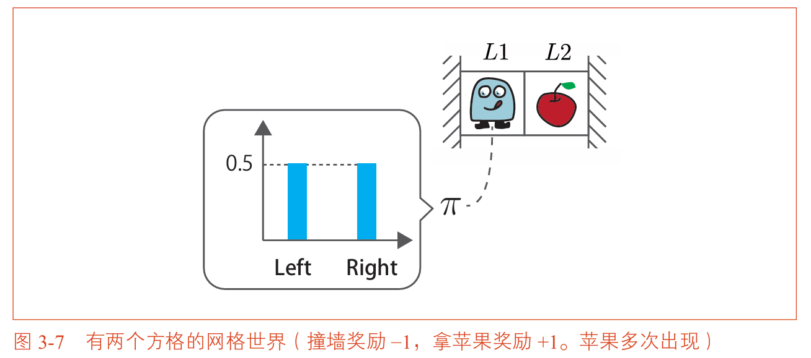
奖励规则为：

- 从 L1 向右移动到 L2：获得 +1（拿到苹果）
- 从 L2 向左移动到 L1：获得 0（苹果重新出现）
- 撞墙（在 L1 向左或在 L2 向右）：获得 -1
- 这是一个连续性任务，$\gamma = 0.9$

与第二章不同，这次我们假设智能代理的策略是**随机性的**：在任何状态下，向左和向右的概率各为 0.5。

### 3.2.2 应用贝尔曼方程

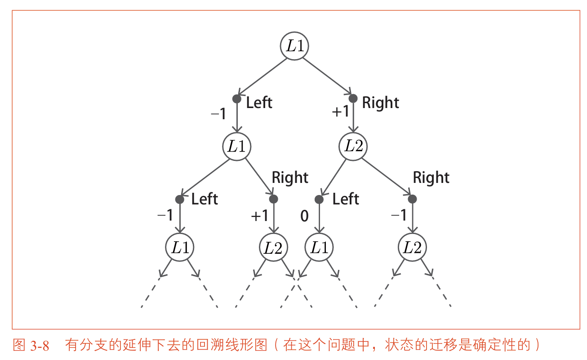

由于每个状态都有两个可能的行动，每个行动又对应一个确定的下一个状态，回溯线形图以指数方式扩展，无限延伸。手动计算这个无限分支的总和几乎是不可能的。
但是，贝尔曼方程可以完美地解决这个问题。

**确定状态的化简**
的问题中的状态迁移是确定性的。也就是说，状态的迁移是由函数 $f(s,a)$ 而不是概率 $p(s'|s,a)$ 决定的，则有以下结论成立：

- 如果 $s' = f(s,a)$，则 $p(s'|s,a) = 1$。
- 如果 $s' \neq f(s,a)$，则 $p(s'|s,a) = 0$。

这意味着在式 3.7 中只剩下与满足 $s' = f(s,a)$ 的 $s'$ 相对应的项。因此，式子可以简化表示为以下形式。

当 $s' = f(s,a)$ 时
$$v_\pi(s) = \sum_a \pi(a|s) \{r(s,a,s') + \gamma \nu_\pi(s')\} $$
当 $s' \neq f(s,a)$ 时
$$v_\pi(s) = 0 $$

**对状态 L1 应用贝尔曼方程**

在状态 L1 下，智能代理以 0.5 的概率选择 Left，以 0.5 的概率选择 Right。

选择 Left 时：迁移到 L1（撞墙），奖励为 -1。这项贡献为 $0.5 \times (-1 + 0.9 \times v_\pi(L1))$。

选择 Right 时：迁移到 L2，奖励为 +1。这项贡献为 $0.5 \times (1 + 0.9 \times v_\pi(L2))$。

因此，L1 的贝尔曼方程为：

$$v_\pi(L1) = 0.5\{-1 + 0.9v_\pi(L1)\} + 0.5\{1 + 0.9v_\pi(L2)\}$$

整理：

$$0.55v_\pi(L1) - 0.45v_\pi(L2) = 0 \tag{3.1}$$

**对状态 L2 应用贝尔曼方程**

同理，在 L2 下：

选择 Left 时：迁移到 L1，奖励为 0。贡献为 $0.5 \times (0 + 0.9 \times v_\pi(L1))$。

选择 Right 时：迁移到 L2（撞墙），奖励为 -1。贡献为 $0.5 \times (-1 + 0.9 \times v_\pi(L2))$。

$$v_\pi(L2) = 0.5\{0 + 0.9v_\pi(L1)\} + 0.5\{-1 + 0.9v_\pi(L2)\}$$

整理得：

$$0.45v_\pi(L1) - 0.55v_\pi(L2) = 0.5 \tag{3.2}$$

### 3.2.3 求解联立方程组

现在我们有了两个方程、两个未知数：

$$0.55v_\pi(L1) - 0.45v_\pi(L2) = 0 \tag{3.1}$$
$$0.45v_\pi(L1) - 0.55v_\pi(L2) = 0.5 \tag{3.2}$$

**结果**：$v_\pi(L1) = -2.25$，$v_\pi(L2) = -2.75$

### 3.2.4 贝尔曼方程的意义

通过这个例子，我们可以看到贝尔曼方程的强大之处：

| 问题 | 直接计算 | 使用贝尔曼方程 |
| :--- | :--- | :--- |
| 无限分支求和 | 需要处理无限扩展的回溯树 | 转化为联立方程 |
| 随机性 | 难以直接计算期望 | 自然地通过概率加权处理 |
| 计算量 | 随深度指数增长 | 只取决于状态数量 |

即使是一个只有两个状态的简单问题，直接计算无限延伸的分支求和也是不可行的。而贝尔曼方程通过建立状态之间的**递归关系**，将无限问题转化为有限方程组的求解，这正是它在强化学习中如此重要的根本原因。


## 3.3 行动价值函数（Q函数）

状态价值函数 $v_\pi(s)$ 描述了在某个状态下遵循策略 $\pi$ 能获得多少期望收益。但智能代理在决策时，真正需要回答的问题是：**在状态 $s$ 下，如果我选择行动 $a$，之后遵循策略 $\pi$，能获得多少期望收益？**

这就是**行动价值函数（Action-Value Function）**，也常被称为 **Q函数**，它回答了上述问题。

### 3.3.1 Q函数的定义

**Q函数** $q_\pi(s, a)$ 的定义为：在状态 $s$ 下采取行动 $a$，之后遵循策略 $\pi$，所能获得的收益的期望值。

$$q_\pi(s, a) = \mathbb{E}_\pi[G_t \mid S_t = s, A_t = a]$$

**Q函数与状态价值函数的关系**：

状态价值函数可以看作是对 Q 函数的“平均”。具体来说，在状态 $s$ 下，智能代理根据策略 $\pi$ 可能选择不同的行动。每个行动 $a$ 被选择的概率为 $\pi(a \mid s)$，如果选择行动 $a$，对应的 Q 值为 $q_\pi(s, a)$。

因此：

$$v_\pi(s) = \sum_a \pi(a \mid s) q_\pi(s, a)$$

这个关系表明：状态价值是 Q 值在策略分布下的加权平均。如果我们知道了所有行动的 Q 值，就可以通过加权平均得到状态价值。
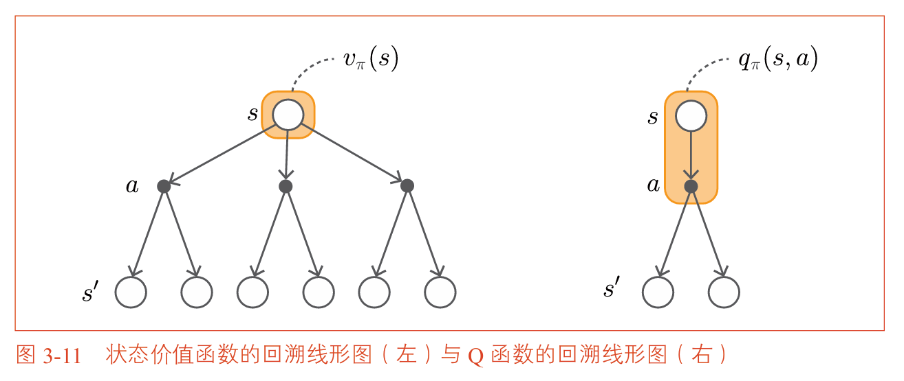
| 函数 | 符号 | 定义 | 依赖 |
| :--- | :--- | :--- | :--- |
| 状态价值函数 | $v_\pi(s)$ | 从状态 $s$ 出发的期望收益 | 状态 + 策略 |
| Q函数 | $q_\pi(s, a)$ | 在状态 $s$ 采取行动 $a$ 后的期望收益 | 状态 + 行动 + 策略 |

### 3.3.2 Q函数的贝尔曼方程

类似于状态价值函数的推导，我们可以推导出 Q 函数的贝尔曼方程。

从定义出发：

$$q_\pi(s, a) = \mathbb{E}_\pi[G_t \mid S_t = s, A_t = a]$$

利用收益的递归形式 $G_t = R_t + \gamma G_{t+1}$：

$$q_\pi(s, a) = \mathbb{E}_\pi[R_t + \gamma G_{t+1} \mid S_t = s, A_t = a]$$

在当前状态 $s$ 和行动 $a$ 已经固定的情况下，下一个状态 $s'$ 由状态迁移概率 $p(s' \mid s, a)$ 决定，奖励由 $r(s, a, s')$ 决定，而到达 $s'$ 后的未来收益由 $v_\pi(s')$ 给出。

因此：

$$q_\pi(s, a) = \sum_{s'} p(s' \mid s, a) \{ r(s, a, s') + \gamma v_\pi(s') \}$$

再用 $v_\pi(s') = \sum_{a'} \pi(a' \mid s') q_\pi(s', a')$ 替换：

$$q_\pi(s, a) = \sum_{s'} p(s' \mid s, a) \left\{ r(s, a, s') + \gamma \sum_{a'} \pi(a' \mid s') q_\pi(s', a') \right\}$$

这就是 **Q函数的贝尔曼方程**。恰好是**状态价值函数/策略函数**。

这个方程的核心结构是：Q 值 = 即时奖励的期望 + 未来 Q 值的折现期望。


## 3.4 贝尔曼最优方程

前面推导的贝尔曼方程对**任意策略** $\pi$ 都成立。但我们最终想要的是**最优策略**。对于最优策略，贝尔曼方程可以简化为更紧凑的形式——**贝尔曼最优方程（Bellman Optimality Equation）**。

### 3.4.1 状态价值函数的贝尔曼最优方程

回顾状态价值的贝尔曼方程：

$$v_\pi(s) = \sum_a \pi(a \mid s) \sum_{s'} p(s' \mid s, a) \{ r(s, a, s') + \gamma v_\pi(s') \}$$

对于**最优策略** $\pi_*$，情况会变得简单。在一个状态 $s$ 下，最优策略**只会选择能使未来收益最大化的那个行动**，而不会在其他行动上分配概率。

具体来说，对于状态 $s$ 中的每个候选行动 $a$，计算：

$$\sum_{s'} p(s' \mid s, a) \{ r(s, a, s') + \gamma v_*(s') \}$$

这是选择行动 $a$ 后能够获得的总收益。最优策略会选择使这个值最大的那个行动，并以概率 1 选择它。

因此，最优状态价值函数 $v_*(s)$ 可以直接写成：

$$v_*(s) = \max_a \sum_{s'} p(s' \mid s, a) \{ r(s, a, s') + \gamma v_*(s') \}$$

这就是**状态价值函数的贝尔曼最优方程**。

与普通贝尔曼方程的关键区别在于：普通贝尔曼方程中，行动是**按策略 $\pi$ 的概率分布**加权的；而贝尔曼最优方程中，行动是**通过 max 算子**直接选择最优的那个。
>**max 算子**：取值最大的代入计算。

### 3.4.2 Q函数的贝尔曼最优方程

类似地，Q函数也有对应的贝尔曼最优方程：

$$q_*(s, a) = \sum_{s'} p(s' \mid s, a) \left\{ r(s, a, s') + \gamma \max_{a'} q_*(s', a') \right\}$$

这个方程的含义是：最优 Q 值 $q_*(s, a)$ 等于采取行动 $a$ 后的即时奖励期望，加上在下一个状态 $s'$ 下选择最优行动的 Q 值的折现期望。
>这里 $\pi_*$ 是最优策略，所以可以用 max 算子来简化。具体来说就是将 $\sum_{a'} \pi_*(a' \mid s')\dots$ 部分替换为 $\max_{a'}\dots$。

**贝尔曼最优方程的重要意义**：

| 特点 | 说明 |
| :--- | :--- |
| 无需显式策略 | 方程中不出现策略 $\pi$，因为最优策略隐式地由 max 算子定义 |
| 自包含 | 只涉及 $v_*$ 或 $q_*$ 自身，形成了一个自洽的最优性条件 |
| 确定性最优策略 | 最优策略是确定性的（每个状态只选一个行动），这是贝尔曼最优方程的推论 |

**最优策略的提取**：

一旦求得最优 Q 函数 $q_*(s, a)$，最优策略就可以直接提取：

$$\mu_*(s) = \arg\max_a q_*(s, a)$$

这意味着：在状态 $s$ 下，选择 $q_*(s, a)$ 最大的行动 $a$，这就是最优策略。这个简单的关系是 Q 学习方法的核心依据。

## 3.5 贝尔曼最优方程的应用示例
现在让我们再次回到两个方格的网格世界，用贝尔曼最优方程求解最优策略。


### 3.5.1 问题设定

与 3.2 节相同：两个方格 L1 和 L2，行动为 Left 和 Right，状态迁移确定性，奖励规则不变，$\gamma = 0.9$。

不同之处在于：我们现在求解的是**最优**价值函数，而不是某个随机策略的价值函数。

### 3.5.2 应用贝尔曼最优方程

由于状态迁移是确定性的，贝尔曼最优方程可以简化为：

$$v_*(s) = \max_a \{ r(s, a, s') + \gamma v_*(s') \}$$

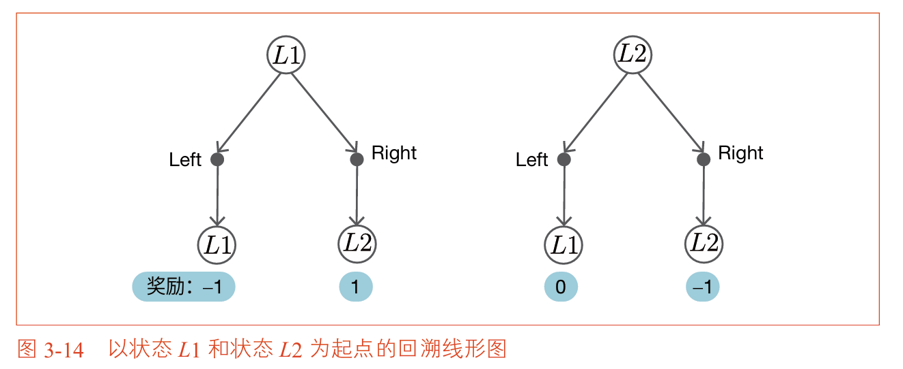
**对状态 L1 应用贝尔曼最优方程**：

选择 Left 时：迁移到 L1（撞墙），奖励为 -1，贡献 = $-1 + 0.9v_*(L1)$

选择 Right 时：迁移到 L2，奖励为 +1，贡献 = $1 + 0.9v_*(L2)$

因此：

$$v_*(L1) = \max\{-1 + 0.9v_*(L1), \ 1 + 0.9v_*(L2)\}$$

**对状态 L2 应用贝尔曼最优方程**：

选择 Left 时：迁移到 L1，奖励为 0，贡献 = $0 + 0.9v_*(L1)$

选择 Right 时：迁移到 L2（撞墙），奖励为 -1，贡献 = $-1 + 0.9v_*(L2)$

因此：

$$v_*(L2) = \max\{0.9v_*(L1), \ -1 + 0.9v_*(L2)\}$$

现在我们有了两个含有 max 算子的方程。虽然 max 是非线性运算，但这个方程组仍然可以通过试错或直觉求解。

### 3.5.3 求解最优价值函数和最优策略

直观上，最优策略应该是：在 L1 选择 Right（去拿苹果），在 L2 选择 Left（回来再拿苹果）。这样智能代理在 L1 和 L2 之间来回移动，每次都能获得 +1 的苹果奖励。

在这个策略下，智能代理在 L1 和 L2 之间循环，每两步获得 +1 奖励。但注意折现率 $\gamma = 0.9$，远处奖励会被打折。

经过求解得到：

$$v_*(L1) = 5.26, \quad v_*(L2) = 4.73$$

最优性： $\mu_*(L1) = \text{Right}$，$\mu_*(L2) = \text{Left}$。
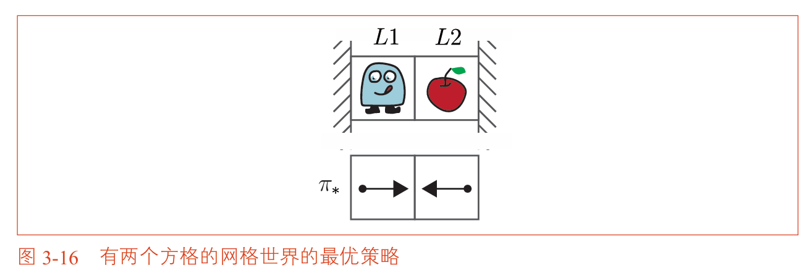

### 3.5.4 从最优价值函数到最优策略

一旦知道了最优价值函数 $v_*$，最优策略可以通过以下方式提取：

$$\mu_*(s) = \arg\max_a \sum_{s'} p(s' \mid s, a) \{ r(s, a, s') + \gamma v_*(s') \}$$

对于确定性环境，这简化为：

$$\mu_*(s) = \arg\max_a \{ r(s, a, s') + \gamma v_*(s') \}$$

在 L1：比较 Left（$-1 + 0.9×5.26 = 3.734$）和 Right（$1 + 0.9×4.73 = 5.257$），选择 Right。

在 L2：比较 Left（$0 + 0.9×5.26 = 4.734$）和 Right（$-1 + 0.9×4.73 = 3.257$），选择 Left。

因此，最优策略是在 L1 向右移动，在 L2 向左移动，在两个状态之间来回穿梭。


## 本章小结

本章推导了强化学习中最核心的数学工具——贝尔曼方程及其最优形式。

| 方程类型 | 针对对象 | 核心算子 | 用途 |
| :--- | :--- | :--- | :--- |
| 贝尔曼方程 | 给定策略 $\pi$ | $\sum_a \pi(a \mid s)$ | 评估给定策略的价值 |
| 贝尔曼最优方程 | 最优策略 $\pi_*$ | $\max_a$ | 直接求解最优价值 |

**关键公式汇总**：

| 公式 | 名称 |
| :--- | :--- |
| $v_\pi(s) = \sum_a \sum_{s'} \pi(a \mid s) p(s' \mid s, a) \{ r(s, a, s') + \gamma v_\pi(s') \}$ | 状态价值贝尔曼方程 |
| $v_\pi(s) = \sum_a \pi(a \mid s)q_\pi(s, a)$ | 状态价值函数与Q函数的关系 |
| $q_\pi(s, a) = \sum_{s'} p(s' \mid s, a) \{ r(s, a, s') + \gamma \sum_{a'} \pi(a' \mid s') q_\pi(s', a') \}$ | Q函数贝尔曼方程 |
| $v_*(s) = \max_a \sum_{s'} p(s' \mid s, a) \{ r(s, a, s') + \gamma v_*(s') \}$ | 状态价值贝尔曼最优方程 |
| $q_*(s, a) = \sum_{s'} p(s' \mid s, a) \{ r(s, a, s') + \gamma \max_{a'} q_*(s', a') \}$ | Q函数贝尔曼最优方程 |
| $\mu_*(s) = \arg\max_a q_*(s, a)$ | 从Q函数提取最优策略 |

**本章核心要点**：

1. 贝尔曼方程将无限时间步的收益期望转化为有限项的递归方程
2. 贝尔曼最优方程通过 max 算子消去了策略，直接定义了最优价值函数
3. 最优策略可以从最优 Q 函数中直接提取（选择 Q 值最大的行动）
4. 贝尔曼方程是后续所有强化学习算法（DP、MC、TD、Q学习）的理论基础

# 第四章 动态规划法

## 本章概述

在第三章中，我们推导了贝尔曼方程和贝尔曼最优方程。理论上，通过这些方程可以求解任意MDP问题的最优策略。具体方法是：列出所有状态下的贝尔曼方程，形成联立方程组，然后直接求解。
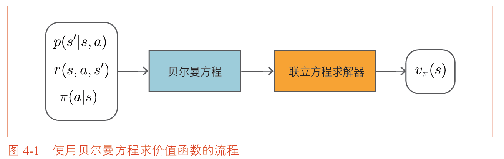

但这种方法只适用于状态数量极少的小型问题。当状态数量稍多一些时，联立方程组的规模会迅速膨胀，直接求解在计算上变得不可行。

本章将介绍**动态规划法（Dynamic Programming，DP）**，它是一类能够在状态和行动数量较大时仍然高效求解贝尔曼方程的算法。动态规划法的核心思想是将复杂问题分解为子问题，通过迭代的方式逐步逼近真实的价值函数，而不需要一次性求解整个方程组。

动态规划法有两个重要前提：
1. **环境模型已知**：我们需要知道状态迁移概率 $p(s'|s,a)$ 和奖励函数 $r(s,a,s')$
2. **问题满足马尔可夫性**：这是使用贝尔曼方程的基础

本章将依次介绍动态规划法的三个核心算法：迭代策略评估、策略迭代法和价值迭代法。

### 本章知识脉络

```
4.1 动态规划法和策略评估
  └── 迭代策略评估：用贝尔曼方程反复更新价值函数，直到收敛
        ↓
4.2 解决更大的问题（3×4网格世界）
  └── 实现GridWorld类，在更大的环境中验证策略评估
        ↓
4.3 策略迭代法
  └── 策略评估 + 策略改进交替进行，逐步逼近最优策略
        ↓
4.4 策略迭代法的实现
  └── 在3×4网格世界中实现策略迭代法
        ↓
4.5 价值迭代法
  └── 将策略评估与策略改进合并为一个步骤，进一步提高效率
        ↓
4.6 小结
```


## 4.1 动态规划法和策略评估

强化学习涉及两项基本任务：**策略评估**和**策略控制**。

| 任务 | 定义 | 目标 |
| :--- | :--- | :--- |
| 策略评估 | 求给定策略 $\pi$ 的价值函数 | 计算 $v_\pi(s)$ 和 $q_\pi(s,a)$ |
| 策略控制 | 改进策略使其接近最优 | 找到最优策略 $\pi_*$ |

强化学习的最终目标是策略控制（找到最优策略），但策略评估通常是实现这一目标的必经之路——只有知道当前策略有多好，才能决定如何改进它。

### 4.1.1 动态规划法简介

回顾价值函数的定义：

$$v_\pi(s) = \mathbb{E}_\pi[R_t + \gamma R_{t+1} + \gamma^2 R_{t+2} + \dots \mid S_t = s]$$

直接计算这个包含无限项的期望值通常是不可能的。但贝尔曼方程可以解决这个问题：

$$v_\pi(s) = \sum_{a,s'} \pi(a|s)p(s'|s,a)\{r(s,a,s') + \gamma v_\pi(s')\}$$

贝尔曼方程将无限时间的问题转化为当前状态与下一状态之间的递归关系。动态规划法的核心思路是将这个方程改写为**迭代更新式**：

$$V_{k+1}(s) = \sum_{a,s'} \pi(a|s)p(s'|s,a)\{r(s,a,s') + \gamma V_k(s')\}$$

这里用 $V_k(s)$ 表示第 $k$ 次迭代对价值函数的估计值。算法从任意初始值 $V_0(s)$ 出发，反复应用上述更新式，逐步逼近真实的价值函数。

**自举法**

这个更新式的特点是：用**估计值**来改进**估计值**——用下一状态的估计值 $V_k(s')$ 来更新当前状态的估计值 $V_{k+1}(s)$。这种用估计值更新估计值的方法被称为**自举法（Bootstrapping）**。

>Bootstrap 这个词本意是指“拔靴带”，即自己提着自己的靴带把自己拉起来，比喻不借助外部帮助、依靠自身力量完成某件事。在强化学习中，自举指的是算法不依赖环境模型的精确计算（如无限求和），而是用已有的估计来更新新的估计。

**迭代策略评估算法**

迭代策略评估的流程如下：

1. 初始化：对所有状态 $s$，设置 $V_0(s) = 0$（或其他任意值）
2. 更新：用贝尔曼方程计算 $V_{k+1}(s)$
3. 重复：直到 $V_k$ 收敛到 $v_\pi$

该算法的收敛性由贝尔曼方程的压缩映射性质保证，在满足一定条件时，反复更新必然收敛到真实的价值函数。

### 4.1.2 迭代策略评估的示例

让我们再次使用用两个方格的网格世界来演示迭代策略评估的执行过程。

**问题设定**：
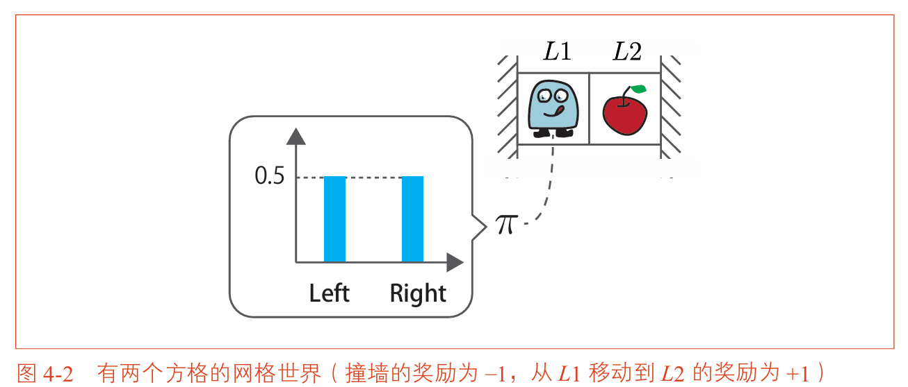

- 智能代理可以向左或向右移动
- 状态迁移是确定性的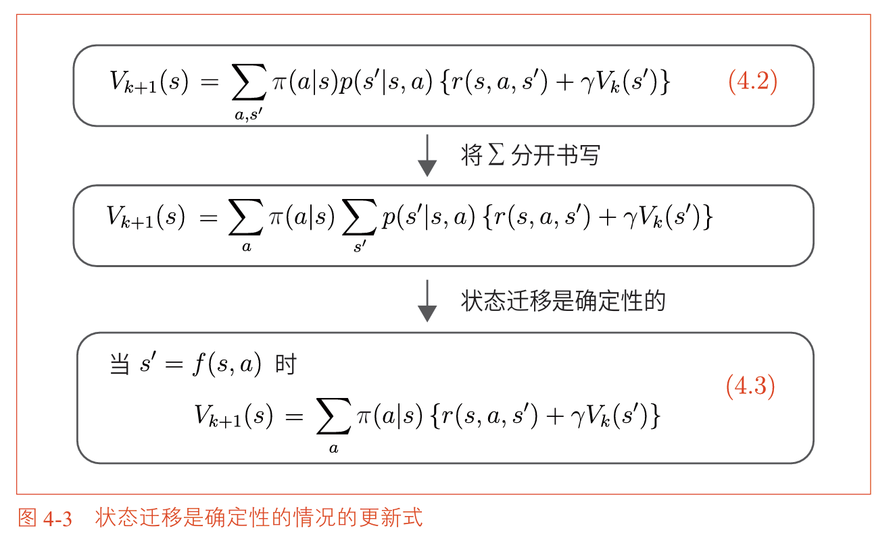
- 奖励：从 L1 到 L2 获得 +1；撞墙获得 -1
- 策略：随机策略，向左和向右各 0.5 概率
- 折现率 $\gamma = 0.9$
- 这是一个连续性任务（无终止状态）

**第一步：初始化**

$$V_0(L1) = 0, \quad V_0(L2) = 0$$

**第二步：第一次更新**

在 L1 下，以 0.5 概率向左（撞墙，奖励 -1，留在 L1），以 0.5 概率向右（拿苹果，奖励 +1，迁移到 L2）：

$$V_1(L1) = 0.5\{-1 + 0.9V_0(L1)\} + 0.5\{1 + 0.9V_0(L2)\}$$

代入 $V_0(L1) = V_0(L2) = 0$：

$$V_1(L1) = 0.5 \times (-1) + 0.5 \times (1) = 0$$

在 L2 下，以 0.5 概率向左（迁移到 L1，奖励 0），以 0.5 概率向右（撞墙，奖励 -1，留在 L2）：

$$V_1(L2) = 0.5\{0 + 0.9V_0(L1)\} + 0.5\{-1 + 0.9V_0(L2)\} = -0.5$$
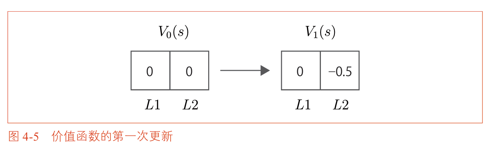
**第三步：第二次更新**

$$V_2(L1) = 0.5\{-1 + 0.9V_1(L1)\} + 0.5\{1 + 0.9V_1(L2)\}$$

代入 $V_1(L1) = 0$，$V_1(L2) = -0.5$：

$$V_2(L1) = 0.5 \times (-1) + 0.5 \times (1 + 0.9 \times (-0.5)) = -0.5 + 0.5 \times 0.55 = -0.225$$

$$V_2(L2) = 0.5\{0 + 0.9V_1(L1)\} + 0.5\{-1 + 0.9V_1(L2)\} = 0.5 \times 0 + 0.5 \times (-1 - 0.45) = -0.725$$

继续迭代，价值函数会逐渐接近真实值 $v_\pi(L1) = -2.25$，$v_\pi(L2) = -2.75$。

### 4.1.3 迭代策略评估的实现

以下是用 Python 实现迭代策略评估的代码：

```python
# ============================================================
# 两个方格的网格世界
# 状态: 0 = L1（左格）, 1 = L2（右格）
# 行动: 0 = Left（向左移动）, 1 = Right（向右移动）
# ============================================================

import numpy as np

# ---------- 超参数设置 ----------
gamma = 0.9          # 折现率，控制未来奖励的权重
threshold = 1e-4     # 收敛阈值，当更新量小于该值时停止迭代

# ---------- 环境模型 ----------
def next_state_reward(state, action):
    """
    状态迁移函数：给定当前状态和行动，返回下一个状态和即时奖励
    
    奖励规则：
        - 从 L1 向右移动到 L2：获得 +1（拿到苹果）
        - 撞墙（在 L1 向左，或在 L2 向右）：获得 -1
        - 从 L2 向左移动到 L1：获得 0（苹果重新出现，无即时奖励）
    
    参数：
        state: 当前状态（0 或 1）
        action: 当前行动（0 或 1）
    
    返回：
        next_state: 下一个状态
        reward: 即时奖励
    """
    if state == 0:  # 当前在 L1
        if action == 0:  # 选择向左移动 → 撞墙，留在 L1，奖励 -1
            return 0, -1.0
        else:            # 选择向右移动 → 迁移到 L2，获得苹果奖励 +1
            return 1, 1.0
    else:  # 当前在 L2
        if action == 0:  # 选择向左移动 → 迁移到 L1，苹果重新出现，奖励 0
            return 0, 0.0
        else:            # 选择向右移动 → 撞墙，留在 L2，奖励 -1
            return 1, -1.0

# ---------- 策略定义 ----------
# 随机策略：在每个状态下，向左和向右各以 0.5 的概率被选择
# policy[state][action] 表示在状态 state 下选择 action 的概率
policy = {
    0: {0: 0.5, 1: 0.5},  # 在 L1：50% 向左，50% 向右
    1: {0: 0.5, 1: 0.5}   # 在 L2：50% 向左，50% 向右
}

# ---------- 迭代策略评估 ----------
# 价值函数 V[state] 表示从 state 出发的期望收益估计值
V = {0: 0.0, 1: 0.0}    # 初始估计值全部设为 0
iteration = 0            # 记录迭代次数

while True:
    # new_V 存储本轮迭代更新后的价值函数
    new_V = {}
    # delta 记录本轮所有状态中更新量的最大值，用于判断是否收敛
    delta = 0
    
    # 遍历所有状态（L1 和 L2）
    for state in [0, 1]:
        total = 0.0
        
        # 遍历所有可能的行动
        for action in [0, 1]:
            prob = policy[state][action]              # 选择该行动的概率
            next_s, reward = next_state_reward(state, action)  # 执行行动，得到下一个状态和奖励
            
            # 贝尔曼方程更新式：
            # V_new(state) = Σ_a π(a|s) × [ r(s,a,s') + γ × V_old(s') ]
            # 即：当前状态的价值 = 所有行动的加权和（权重为策略概率）
            # 每个行动的价值 = 即时奖励 + 折现后的下一个状态价值
            total += prob * (reward + gamma * V[next_s])
        
        new_V[state] = total
        
        # 更新 delta：取所有状态中变化量的最大值
        delta = max(delta, abs(new_V[state] - V[state]))
    
    # 用更新后的价值函数替换旧的价值函数
    V = new_V
    iteration += 1
    
    # 如果所有状态的变化量都小于阈值，认为已收敛，停止迭代
    if delta < threshold:
        break

# ---------- 输出结果 ----------
print(f"迭代次数: {iteration}")
print(f"v(L1) = {V[0]:.6f}")   # 理论值: -2.250000
print(f"v(L2) = {V[1]:.6f}")   # 理论值: -2.750000
```

**输出**：
```
迭代次数: 76
v(L1) = -2.249168
v(L2) = -2.749168
```

**覆盖方式（In-place Update）**

上面的代码使用两个字典（`V` 和 `new_V`）分别存储旧值和新值。还有一种更高效的方式是**覆盖方式**——直接使用一个字典，每次更新后立即覆盖旧值：

```python
# 覆盖方式的迭代策略评估
V = {0: 0.0, 1: 0.0}
iteration = 0

while True:
    delta = 0
    
    # 更新 L1
    old_value = V[0]
    new_value = 0.5 * (-1 + 0.9 * V[0]) + 0.5 * (1 + 0.9 * V[1])
    V[0] = new_value
    delta = max(delta, abs(new_value - old_value))
    
    # 更新 L2
    old_value = V[1]
    new_value = 0.5 * (0 + 0.9 * V[0]) + 0.5 * (-1 + 0.9 * V[1])
    V[1] = new_value
    delta = max(delta, abs(new_value - old_value))
    
    iteration += 1
    if delta < threshold:
        break

print(f"迭代次数: {iteration}")  # 输出: 60
print(f"v(L1) = {V[0]:.6f}")
print(f"v(L2) = {V[1]:.6f}")
```

覆盖方式之所以更高效，是因为更新 L2 时使用了已经更新过的 $V(L1)$ 值，加速了信息的传播。在本例中，覆盖方式只需 60 次迭代即可收敛，而标准方式需要 76 次。

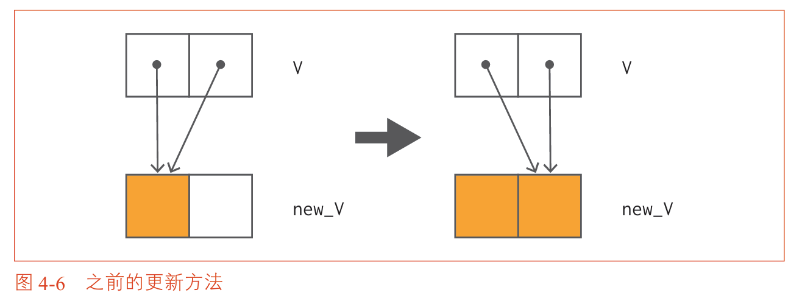
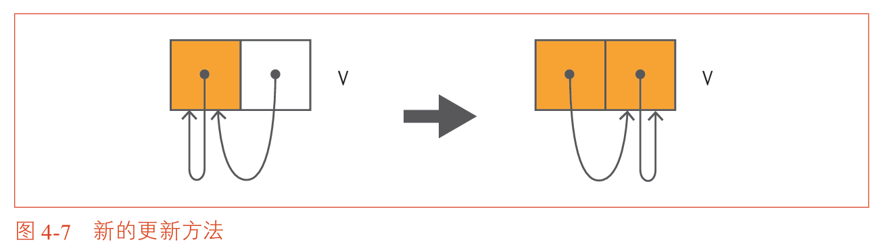

## 4.2 解决更大的问题

现在我们从两个方格的问题“毕业”，挑战一个更大的网格世界——3×4 网格世界。

### 4.2.1 问题设定

3×4 网格世界如下图所示：

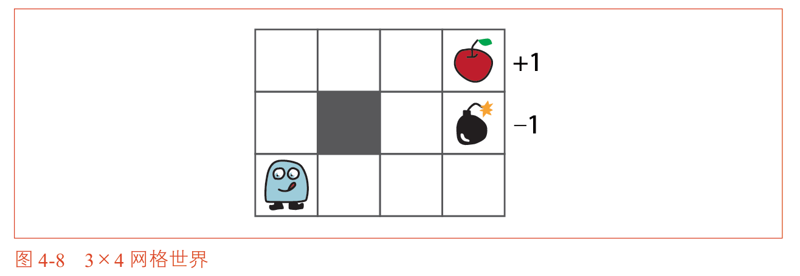

**规则**：
- 智能代理可以向上、下、左、右四个方向移动
- 灰色方块代表墙，智能代理不能进入
- 网格外也是墙，无法越过
- 撞墙的奖励为 0（停留在原地，不获奖励也不受惩罚）
- 到达苹果（+1）或炸弹（-1）后回合结束
- 状态迁移是确定性的（选择右一定向右，除非有墙阻挡）

这是一个**回合制任务**，到达苹果或炸弹后回合结束。
### 4.2.2 GridWorld 类的实现
#### 第一部分：初始化方法 `__init__`

```python
import numpy as np
from collections import defaultdict

class GridWorld:
    def __init__(self):
        # 行动空间：0=上, 1=下, 2=左, 3=右
        self.action_space = [0, 1, 2, 3]
        self.action_meaning = {
            0: "UP",
            1: "DOWN", 
            2: "LEFT",
            3: "RIGHT"
        }
        
        # 奖励映射：每个格子的奖励值
        # None 表示墙
        self.reward_map = np.array([
            [0, 0, 0, 1.0],      # 第0行：三个空格 + 苹果(+1)
            [0, None, 0, -1.0],  # 第1行：空格 + 墙 + 空格 + 炸弹(-1)
            [0, 0, 0, 0]         # 第2行：四个空格
        ])
        
        # 关键位置
        self.goal_state = (0, 3)    # 苹果位置
        self.wall_state = (1, 1)    # 墙的位置
        self.start_state = (2, 0)   # 起点位置（左下角）
        self.agent_state = self.start_state
```

`__init__` 方法完成了网格世界的初始化工作：
1. 首先定义了行动空间，用数字 0~3 分别表示上、下、左、右四个方向，同时用 `action_meaning` 字典提供可读的名称便于调试。
2. 然后创建了奖励映射 `reward_map`，它是一个 3 行 4 列的 NumPy 二维数组，其中 `None` 表示该位置是墙，智能代理无法进入。数字表示到达该格子时获得的奖励：0 表示普通空格，+1 表示苹果，-1 表示炸弹。
3. 最后定义了三个关键位置：苹果所在的目标状态、墙的位置、以及智能代理的起始位置。

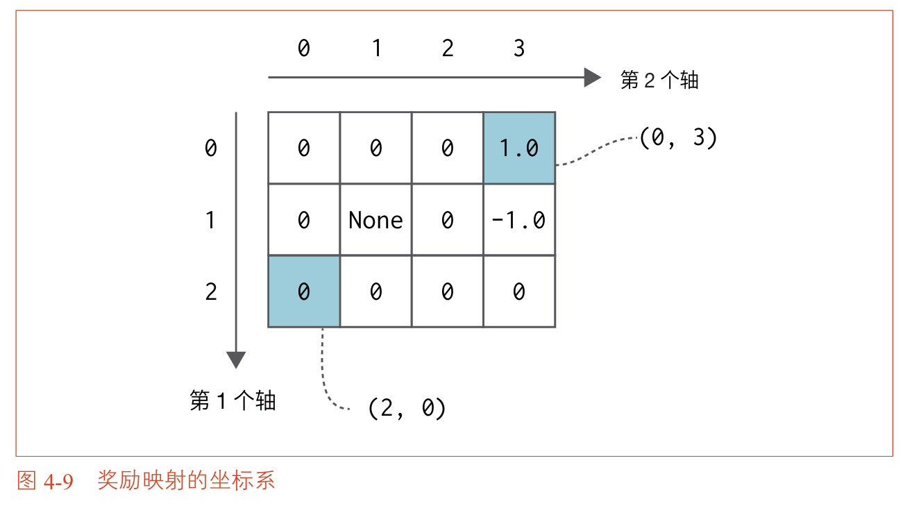

#### 第二部分：属性方法 `@property`

```python
    @property
    def height(self):
        return len(self.reward_map)
    
    @property
    def width(self):
        return len(self.reward_map[0])
    
    @property
    def shape(self):
        return self.reward_map.shape
```
这三个 `@property` 装饰器使得 `height`、`width` 和 `shape` 可以**像属性一样被访问**（例如 `env.height`），而**不需要加括号调用**。

`height` 返回网格的行数（3），`width` 返回网格的列数（4），`shape` 返回一个元组 `(3, 4)`。这些属性在遍历状态和边界检查时会被频繁使用。


#### 第三部分：行动和状态的遍历方法

```python
    def actions(self):
        """返回所有候选行动"""
        return self.action_space
    
    def states(self):
        """生成所有非墙状态的迭代器"""
        for h in range(self.height):
            for w in range(self.width):
                if self.reward_map[h, w] is not None:
                    yield (h, w)
```

`actions` 方法简单地返回行动空间列表 `[0, 1, 2, 3]`，用于在策略改进和价值迭代中遍历所有可能的行动。
`states` 方法是一个生成器，它遍历网格中的所有位置，只 `yield` 那些不是墙的状态（即奖励映射中不为 `None` 的位置）。这样在迭代策略评估和价值迭代中，就可以用 `for state in env.states()` 遍历所有有效状态，而无需手动处理墙的过滤逻辑。

#### 第四部分：状态迁移方法 `next_state`

```python
    def next_state(self, state, action):
        """计算执行行动后的下一个状态"""
        # 行动对应的位移
        action_move_map = {
            0: (-1, 0),  # 上
            1: (1, 0),   # 下
            2: (0, -1),  # 左
            3: (0, 1)    # 右
        }
        
        h, w = state
        dh, dw = action_move_map[action]
        next_h, next_w = h + dh, w + dw
        
        # 检查是否撞墙或超出边界
        if (next_h < 0 or next_h >= self.height or
            next_w < 0 or next_w >= self.width):
            return state  # 撞墙，留在原地
        
        if self.reward_map[next_h, next_w] is None:
            return state  # 撞墙，留在原地
        
        return (next_h, next_w)
```


`next_state` 方法实现了确定性的状态迁移函数。
它首先根据行动查找对应的位移量（上下左右分别对应行坐标和列坐标的变化），然后计算目标位置的坐标。接下来进行两次检查：第一次检查目标位置是否超出了网格边界，第二次检查目标位置是否为墙（奖励映射中为 `None`）。
如果触发了任何一种撞墙情况，智能代理就留在原地（即下一个状态等于当前状态）。否则返回目标位置的坐标。这个方法是动态规划算法中状态迁移概率 $p(s'|s,a)$ 的具体实现——在确定性环境中，迁移概率要么是 1（到达唯一的目标状态），要么是 0（其他状态）。


#### 第五部分：奖励方法 `reward` 和可视化方法 `render_v`

```python
    def reward(self, state, action, next_state):
        """计算奖励"""
        h, w = next_state
        r = self.reward_map[h, w]
        if r is None:
            return 0.0
        return float(r)
    
    def render_v(self, V=None, policy=None):
        """
        可视化价值函数和策略
        V: 价值函数字典，格式为 {(h,w): value}
        policy: 策略字典，格式为 {(h,w): {action: probability}}
        """
        # 此方法的具体绘图实现省略（使用matplotlib）
        pass
```

`reward` 方法根据下一个状态 `next_state` 从奖励映射中查找对应的奖励值。虽然函数的参数包含了 `state` 和 `action`，但在本实现中奖励只取决于目标位置，因此这两个参数未被使用。如果目标位置是墙（理论上不会发生，因为 `next_state` 永远不会返回墙的位置），则返回 0.0。

`render_v` 方法是可视化接口，用于在终端或图形界面中展示价值函数和策略。它接收可选的 `V` 字典（状态到价值的映射）和 `policy` 字典（状态到行动概率分布的映射）。如果提供了 `V`，每个格子会显示其价值数值，并用颜色深浅表示价值大小（红色为负，绿色为正）。如果提供了 `policy`，每个格子会用箭头指示当前策略下概率最大的行动方向。具体的绘图实现使用 Matplotlib 库，由于代码较长且不涉及核心算法逻辑，此处省略。
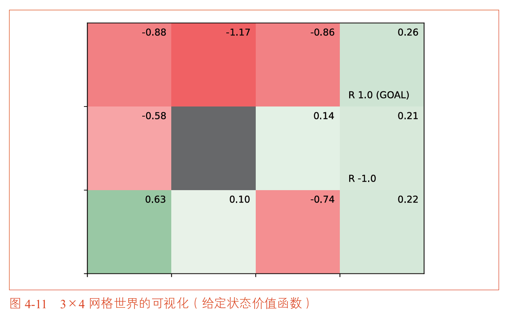

```python
# 使用示例
env = GridWorld()

# 遍历所有状态
for state in env.states():
    print(state)

# 执行一次状态迁移
next_s = env.next_state((2, 0), 3)  # 从起点向右移动
print(next_s)  # 输出: (2, 1)

# 获取奖励
r = env.reward((2, 0), 3, (2, 1))
print(r)  # 输出: 0.0
```

### 4.2.3 defaultdict 的用法

在实现价值函数时，使用普通字典需要预先初始化所有键：

```python
V = {}
for state in env.states():
    V[state] = 0
```

使用 `collections.defaultdict` 可以简化这一过程：

```python
from collections import defaultdict

V = defaultdict(lambda: 0)
state = (1, 2)
print(V[state])  # 自动输出0，无需预先初始化
```

`defaultdict(lambda: 0)` 表示：当访问不存在的键时，自动创建该键并赋予默认值 0。

同样，策略也可以用 defaultdict 表示：

```python
# 随机策略：每个状态以0.25概率选择四个行动
pi = defaultdict(lambda: {0: 0.25, 1: 0.25, 2: 0.25, 3: 0.25})
```

### 4.2.4 迭代策略评估的实现

在 3×4 网格世界上进行策略评估，需要先定义评估函数，然后创建环境和策略，最后执行评估并可视化结果。

**第一步：定义迭代策略评估函数**

```python
from collections import defaultdict
import numpy as np

def eval_onestep(pi, V, env, gamma=0.9):
    """
    对价值函数进行一次迭代更新
    
    参数：
        pi: 策略字典，格式为 {state: {action: probability}}
        V: 当前价值函数字典，格式为 {state: value}
        env: GridWorld 环境实例
        gamma: 折现率
    
    返回：
        更新后的价值函数 V
    """
    # 遍历环境中的所有非墙状态
    for state in env.states():
        # 目标状态（苹果位置）的价值始终为 0
        if state == env.goal_state:
            V[state] = 0
            continue
        
        # 获取当前状态下各行动的概率分布
        action_probs = pi[state]
        new_V = 0
        
        # 贝尔曼方程：V(s) = Σ_a π(a|s) × [ r + γ × V(s') ]
        for action, action_prob in action_probs.items():
            next_state = env.next_state(state, action)
            r = env.reward(state, action, next_state)
            new_V += action_prob * (r + gamma * V[next_state])
        
        V[state] = new_V
    
    return V

def policy_eval(pi, V, env, gamma, threshold=0.001):
    """
    迭代策略评估：反复调用 eval_onestep 直到价值函数收敛
    
    参数：
        pi: 策略字典
        V: 初始价值函数字典
        env: GridWorld 环境实例
        gamma: 折现率
        threshold: 收敛阈值
    
    返回：
        收敛后的价值函数 V
    """
    while True:
        old_V = V.copy()
        V = eval_onestep(pi, V, env, gamma)
        
        # 计算所有状态中更新量的最大值
        delta = max(abs(V[s] - old_V[s]) for s in V.keys())
        
        if delta < threshold:
            break
    
    return V
```

**第二步：创建环境、策略和初始价值函数，执行评估**

```python
# 创建 3×4 网格世界环境
env = GridWorld()
gamma = 0.9

# 定义随机策略：在 4 个方向上均匀选择（概率各 0.25）
pi = defaultdict(lambda: {0: 0.25, 1: 0.25, 2: 0.25, 3: 0.25})

# 初始化价值函数（所有状态初始为 0）
V = defaultdict(lambda: 0)

# 执行迭代策略评估（收敛阈值为 0.001）
V = policy_eval(pi, V, env, gamma=0.9, threshold=0.001)

# 可视化评估结果
env.render_v(V, pi)
```


`eval_onestep` 函数实现了贝尔曼方程的一步迭代。它遍历所有非墙状态，对每个状态计算所有行动的加权和，其中权重为策略概率 `π(a|s)`。`policy_eval` 函数反复调用 `eval_onestep`，直到所有状态的价值函数更新量都小于设定的阈值（此处为 0.001），此时认为价值函数已经收敛。

`defaultdict` 的作用是：当访问 `V[state]` 而该状态尚未被赋值时，自动返回默认值 0，避免了手动初始化所有状态。策略 `pi` 使用同样的方式，所有状态默认采用均匀随机策略。

**第三步：运行结果**

运行上述代码后，调用 `env.render_v(V, pi)` 会生成如下图所示的可视化结果：


**结果解读**：

可视化图中，每个格子显示两个信息：
- 格子**右上角**的数字：该状态的价值函数值（保留两位小数）
- 格子的**背景颜色**：红色表示负值，绿色表示正值，颜色越深表示绝对值越大
- 格子中的**箭头**：表示当前策略下概率最大的行动方向

从图中可以观察到以下现象：
- **起点（左下角）的价值约为 -0.10**：这是一个负值，说明在随机策略下，从起点出发的期望收益是负数。
- **整体底部和中部区域的价值为负值**（红色背景）：这是因为炸弹（-1）位于右上区域，随机移动时有较大概率误入炸弹区域。
- **炸弹附近的红色最深**：靠近炸弹的位置价值最低。
- **越靠近苹果（右上角）价值越高**：苹果附近的区域为绿色或接近绿色。

这表明随机策略的性能很差。在随机策略下，智能代理从起点出发后盲目地上下左右乱走，有相当大的概率会误入炸弹区域，因此期望收益为负。这正是我们需要通过策略改进来寻找最优策略的原因。

## 4.3 策略迭代法

策略评估只是第一步，我们的最终目标是找到最优策略。策略迭代法通过**交替进行策略评估和策略改进**来实现这一目标。

### 4.3.1 策略改进

回顾贝尔曼最优方程，最优策略 $\mu_*$ 可以通过对价值函数取最大值的行动来获得：

$$\mu_*(s) = \arg\max_a \left[ \sum_{s'} p(s'|s,a) \{ r(s,a,s') + \gamma v_*(s') \} \right]$$

这启发我们可以用类似的方法**改进任意策略**：给定当前策略 $\mu$ 的价值函数 $v_\mu$，构造一个新策略 $\mu'$：

$$\mu'(s) = \arg\max_a \left[ \sum_{s'} p(s'|s,a) \{ r(s,a,s') + \gamma v_\mu(s') \} \right]$$

这就是**策略改进定理（Policy Improvement Theorem）**的直观表达：通过对当前价值函数做**贪婪化（Greedification）**，我们总能获得一个不劣于原策略的新策略。

**策略改进定理的要点**：

| 要点 | 说明 |
| :--- | :--- |
| 贪婪化 | 在每个状态选择使 $r + \gamma v_\pi(s')$ 最大的行动 |
| 单调改进 | 新策略在所有状态下都不劣于原策略 |
| 最优条件 | 如果贪婪化没有改变策略，则该策略就是最优策略 |

### 4.3.2 策略迭代法的流程


## 4.4 策略迭代法的实现

### 4.4.1 辅助函数：argmax

在实现策略改进之前，需要实现一个 `argmax` 函数，它返回字典中值最大的键：

```python
def argmax(d):
    """返回字典中值最大的键"""
    max_value = max(d.values())
    for key, value in d.items():
        if value == max_value:
            return key
    return None
```

### 4.4.2 贪婪策略生成

```python
def greedy_policy(V, env, gamma):
    """根据价值函数生成贪婪策略"""
    pi = {}
    
    for state in env.states():
        if state == env.goal_state:
            continue
        
        action_values = {}
        for action in env.actions():
            next_state = env.next_state(state, action)
            r = env.reward(state, action, next_state)
            action_values[action] = r + gamma * V[next_state]
        
        best_action = argmax(action_values)
        
        # 生成确定性策略（概率分布）
        action_probs = {a: 0.0 for a in env.actions()}
        action_probs[best_action] = 1.0
        pi[state] = action_probs
    
    return pi
```

### 4.4.3 策略迭代法的完整实现

```python
def policy_iter(env, gamma, threshold=0.001):
    """策略迭代法"""
    # 初始化：随机策略
    pi = defaultdict(lambda: {a: 0.25 for a in env.actions()})
    V = defaultdict(lambda: 0)
    
    iteration = 0
    while True:
        iteration += 1
        
        # 评估当前策略
        V = policy_eval(pi, V, env, gamma, threshold)
        
        # 改进策略
        new_pi = greedy_policy(V, env, gamma)
        
        # 检查策略是否发生变化
        if all(new_pi[s] == pi[s] for s in env.states()):
            break
        
        pi = new_pi
    
    print(f"策略迭代法在第 {iteration} 次迭代后收敛")
    return pi, V

# 运行策略迭代法
env = GridWorld()
gamma = 0.9
optimal_pi, optimal_V = policy_iter(env, gamma)
```

**运行结果**：

策略迭代法在 4 次迭代后收敛到最优策略：

| 迭代次数 | 策略变化 | 说明 |
| :--- | :--- | :--- |
| 第1次 | 随机策略 → 贪婪策略 | 大部分状态已找到正确方向 |
| 第2次 | 继续改进 | 底部中间区域策略优化 |
| 第3次 | 继续改进 | 左上角区域策略优化 |
| 第4次 | 策略不再变化 | 达到最优策略 |

最优策略的效果是：智能代理会避开炸弹，沿着最短路径前往苹果。


## 4.5 价值迭代法

策略迭代法有一个可能的缺点：每次迭代都需要完整的策略评估（即让价值函数收敛到当前策略的真实值），这个过程可能很耗时。

价值迭代法提供了一种替代方案：**将策略评估和策略改进合并为一个步骤**。

### 4.5.1 价值迭代法的推导

回顾贝尔曼最优方程：

$$v_*(s) = \max_a \sum_{s'} p(s'|s,a) \{ r(s,a,s') + \gamma v_*(s') \}$$

价值迭代法将这个方程改为**更新式**：

$$V_{k+1}(s) = \max_a \sum_{s'} p(s'|s,a) \{ r(s,a,s') + \gamma V_k(s') \}$$

与策略迭代法的关键区别：

| 对比 | 策略迭代法 | 价值迭代法 |
| :--- | :--- | :--- |
| 每轮步骤 | 评估（收敛）+ 改进 | 一步更新（评估+改进合并） |
| 计算量 | 每轮较大 | 每轮较小 |
| 收敛速度 | 一般需要更少轮数 | 需要更多轮数，但每轮更快 |
| 是否显式维护策略 | 是 | 否（最后才提取策略） |

价值迭代法直接通过贝尔曼最优方程更新价值函数，不需要显式维护策略，在得到最优价值函数后再用贪婪化提取最优策略。

### 4.5.2 价值迭代法的实现

```python
def value_iter_onestep(V, env, gamma):
    """价值迭代的一步更新"""
    for state in env.states():
        if state == env.goal_state:
            V[state] = 0
            continue
        
        action_values = []
        for action in env.actions():
            next_state = env.next_state(state, action)
            r = env.reward(state, action, next_state)
            action_values.append(r + gamma * V[next_state])
        
        V[state] = max(action_values)
    
    return V

def value_iter(env, gamma, threshold=0.001):
    """价值迭代法"""
    V = defaultdict(lambda: 0)
    iteration = 0
    
    while True:
        iteration += 1
        old_V = V.copy()
        V = value_iter_onestep(V, env, gamma)
        
        delta = max(abs(V[s] - old_V[s]) for s in V.keys())
        
        if delta < threshold:
            break
    
    print(f"价值迭代法在第 {iteration} 次迭代后收敛")
    return V

# 运行价值迭代法
env = GridWorld()
gamma = 0.9
optimal_V = value_iter(env, gamma)

# 从最优价值函数提取最优策略
optimal_pi = greedy_policy(optimal_V, env, gamma)
```

**运行结果**：
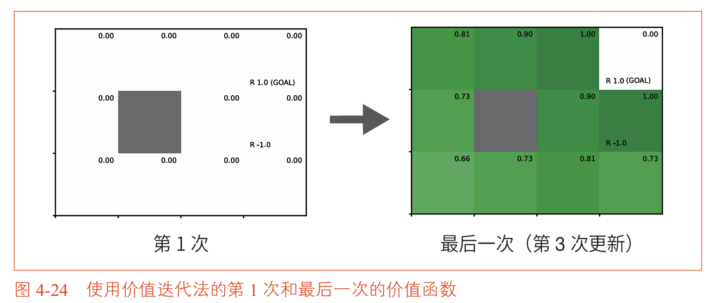
价值迭代法在 3 次迭代后收敛到最优价值函数，与策略迭代法的结果一致。

| 迭代次数 | 价值函数变化 | 说明 |
| :--- | :--- | :--- |
| 第1次 | 初始值（全0）更新 | 靠近目标的状态价值大幅提升 |
| 第2次 | 继续更新 | 远离目标的状态价值持续提升 |
| 第3次 | 收敛 | 所有状态达到最优价值 |


## 4.6 小结

本章介绍了动态规划法求解MDP问题的三种算法。

### 三种算法的对比总结

| 算法 | 核心思路 | 每轮操作 | 通俗理解 | 优点 | 缺点 |
| :--- | :--- | :--- | :--- | :--- | :--- |
| **迭代策略评估** | 反复应用贝尔曼方程 | 更新价值函数 | **只算账，不做决定**。给定一个走法，反复计算这个走法到底有多好。算完就结束，不问你"那换个走法会不会更好？" | 简单直接，逻辑清晰 | 只评估，不优化，不能用来找最优策略 |
| **策略迭代法** | 评估 + 改进交替进行 | 完整评估 + 贪婪化 | **算清楚再换**。先把这个走法摸透了（评估到收敛），再换个更好的走法（贪婪化），然后重新摸透……反复循环直到最优。就像试餐厅，每家都吃完所有菜再换下一家。 | 收敛快，需要的轮数少 | 每轮要把价值算到完全收敛，计算量大，耗时 |
| **价值迭代法** | 贝尔曼最优方程直接更新 | 一步更新 | **边试边换，不等摸透**。每步都直接选当前看起来最好的方向更新，不等价值收敛就继续下一轮。就像试餐厅，每家只尝一口就换，但多转几圈后判断也越来越准。 | 不需要等待价值函数完全收敛，每轮计算量小 | 需要的轮数更多，但每轮快，总计算量可能更小 |


### 一句话总结

- **迭代策略评估**：只算账，不算完不收工，但不做决定。
- **策略迭代法**：算完一笔账 → 做个决定 → 再算新账 → 再做决定……收工慢但次数少。
- **价值迭代法**：边算边决定，不等算清楚就继续，收工快但转的圈数多。

**关键公式汇总**：

| 公式 | 名称 | 用途 |
| :--- | :--- | :--- |
| $V_{k+1}(s) = \sum_{a,s'} \pi(a\|s)p(s'\|s,a)\{r + \gamma V_k(s')\}$ | 迭代策略评估更新式 | 评估给定策略 |
| $\mu'(s) = \arg\max_a \sum_{s'} p(s'\|s,a)\{r + \gamma v_\mu(s')\}$ | 策略改进（贪婪化） | 改进策略 |
| $V_{k+1}(s) = \max_a \sum_{s'} p(s'\|s,a)\{r + \gamma V_k(s')\}$ | 价值迭代更新式 | 直接求最优价值 |

>注：**max** 与 **arg max** 的区别
>| 符号 | 返回什么 | 强化学习中的用途 |
>| :--- | :---  | :--- |
>| **max** | 返回**最大值本身**（数值） | 价值迭代中更新 $V(s)$：$V(s)=\max_a[\dots]$，算出这个状态最好能达到多少 |
>| **argmax** | 返回**取得最大值的那个东西**（索引/行动/参数） | 策略改进中提取最优策略：$\pi(s)=\arg\max_a Q(s,a)$，决定在该状态选哪个行动 |


**本章要点**：

1. 动态规划法要求**环境模型已知**（状态迁移概率和奖励函数）
2. 迭代策略评估用贝尔曼方程反复更新价值函数，直到收敛
3. 策略迭代法交替进行**评估**和**改进**，两者共同构成通用策略迭代框架
4. 价值迭代法将评估和改进合并为一步，通过贝尔曼最优方程直接更新
5. 三种方法殊途同归，都能收敛到最优策略


、