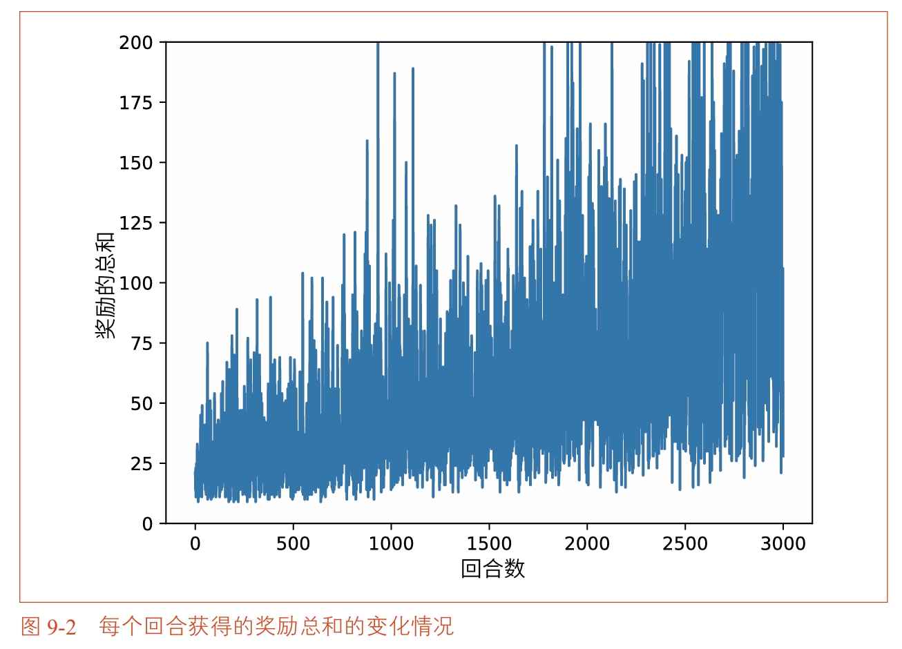
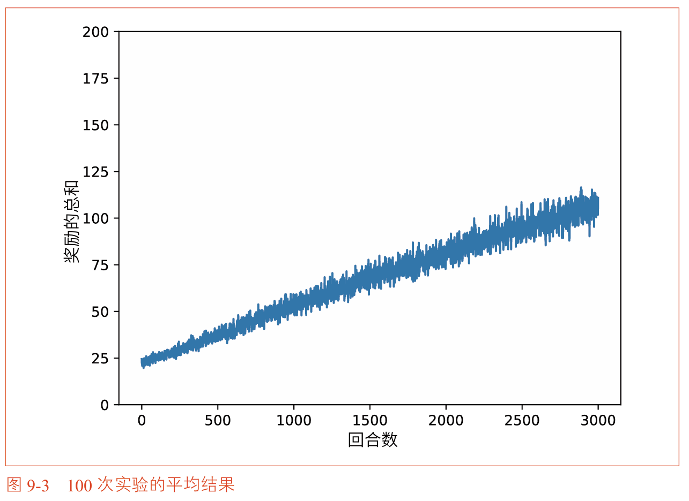
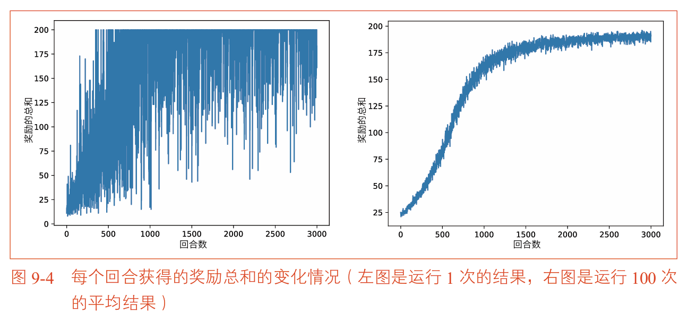
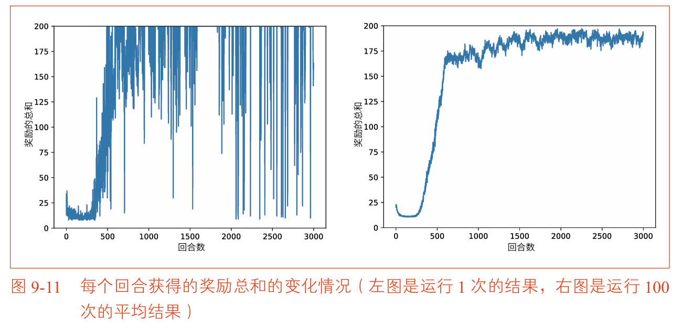
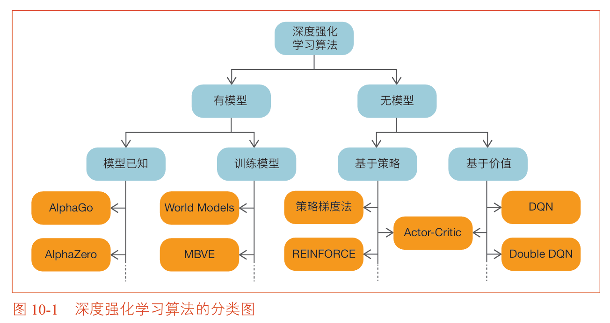
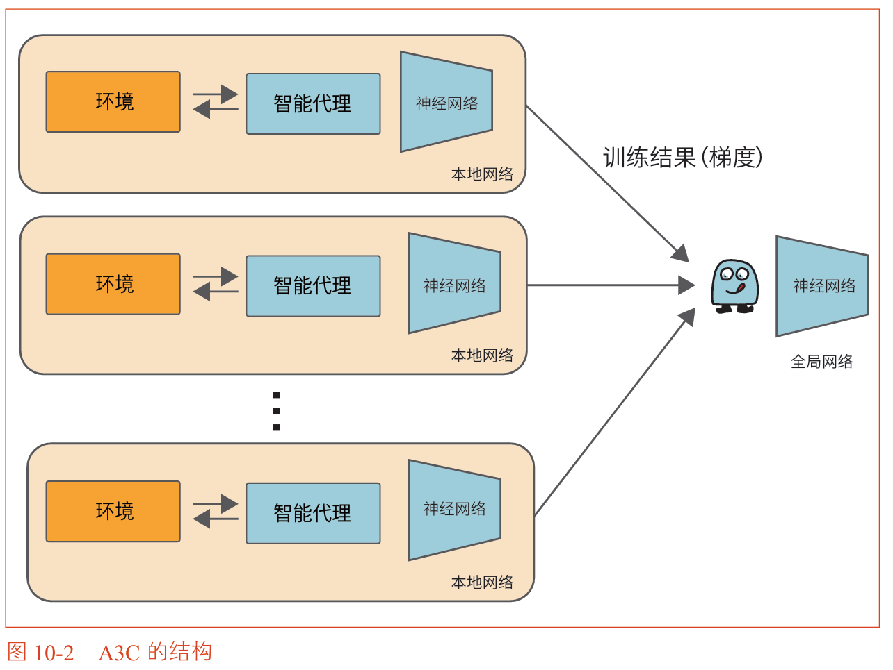
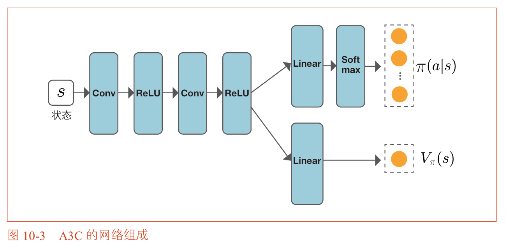
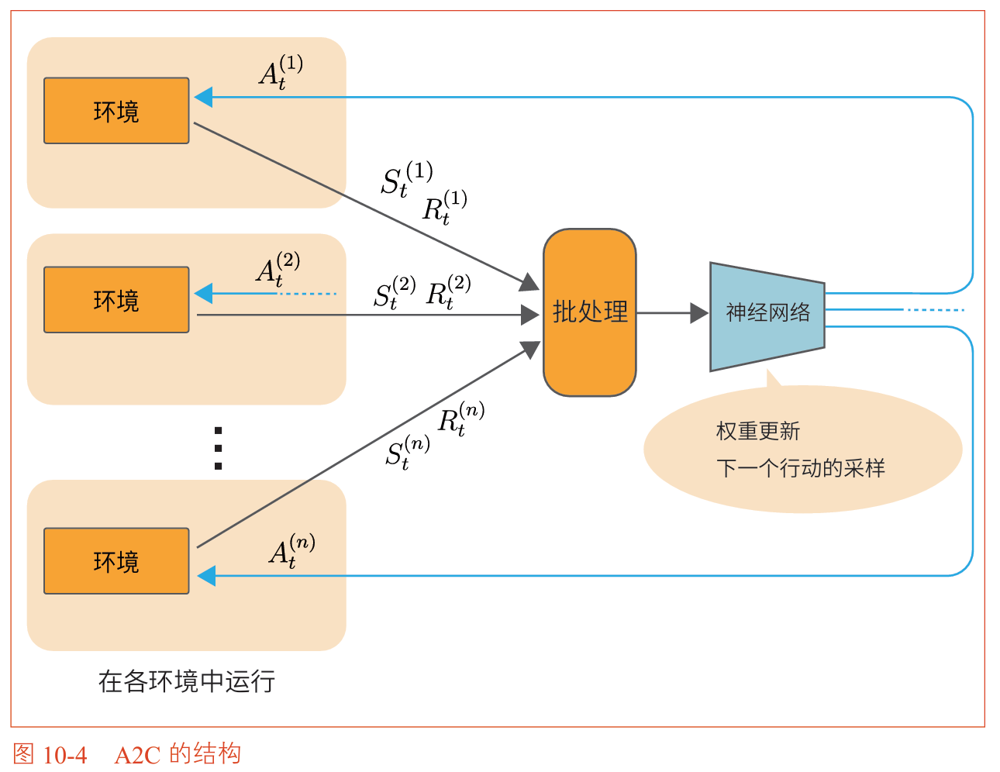

## 第九章 策略梯度法
### 本章概述

在前面的章节中，我们学习了Q学习、SARSA、蒙特卡洛方法等算法。这些算法都可以被归类为**基于价值的方法（Value-based Method）**。

它们的共同思路是：先学习价值函数（Q函数或状态价值函数），然后通过价值函数来间接确定策略。具体来说，先估计 $Q(s,a)$ 或 $V(s)$，再通过贪婪化或 $\epsilon$-greedy 从价值函数中提取策略。

基于价值的方法有一个根本性的局限：**策略是通过价值函数间接得到的**。这意味着：
1. 在连续行动空间中难以应用（因为 $\arg\max_a$ 需要对连续空间做优化）
2. 策略总是“贪婪”的变体，可能过于确定性
3. 价值函数的微小变化可能导致策略剧烈变化

本章介绍的**策略梯度法（Policy Gradient Method）** 提供了一条完全不同的路径：**不学习价值函数，直接学习策略**。策略被参数化为 $\pi_\theta(a|s)$，我们通过梯度上升直接优化策略的参数 $\theta$，使得期望收益最大化。

策略梯度法的核心优势在于：
- 可以直接处理连续行动空间
- 策略的更新是平滑的，不会突然改变
- 适合部分可观测环境（POMDP）
- 在某些问题中，策略比价值函数更简单

本章将从最简单的策略梯度法开始，逐步改进为REINFORCE算法，再引入基线和Actor-Critic方法，展示策略梯度法的完整演进路径。

### 本章知识脉络

```
9.1 最简单的策略梯度法
  └── 推导策略梯度公式，实现基础版本
        ↓
9.2 REINFORCE
  └── 改进权重：用 G_t 代替 G(τ)，减小方差
        ↓
9.3 基线（Baseline）
  └── 引入基线 b(S_t) 进一步减小方差
        ↓
9.4 Actor-Critic
  └── 用神经网络同时表示策略和价值函数，使用TD方法
        ↓
9.5 基于策略的方法的优点
  └── 总结策略梯度法的三个核心优势
        ↓
9.6 小结
```


## 9.1 最简单的策略梯度法

### 9.1.1 策略梯度法的推导

策略梯度法的核心思想是：用神经网络（或其他参数化函数）直接表示策略 $\pi_\theta(a|s)$，其中 $\theta$ 是神经网络的权重参数。我们的目标是找到使期望收益最大化的 $\theta$。

**轨迹（Trajectory）**：一个完整的回合产生的状态、行动、奖励序列
$$\tau = (S_0, A_0, R_0, S_1, A_1, R_1, \dots, S_{T+1})$$

**收益（Return）**：沿轨迹 $\tau$ 获得的折现奖励总和
$$G(\tau) = R_0 + \gamma R_1 + \gamma^2 R_2 + \dots + \gamma^T R_T$$

**目标函数**：在策略 $\pi_\theta$ 下，收益的期望值
$$J(\theta) = \mathbb{E}_{\tau \sim \pi_\theta}[G(\tau)]$$

目标是最大化 $J(\theta)$，即找到 $\theta$ 使得期望收益最大。

**策略梯度定理**
$$\nabla_\theta J(\theta) = \mathbb{E}_{\tau \sim \pi_\theta} \left[ G(\tau) \sum_{t=0}^T \nabla_\theta \log \pi_\theta(A_t|S_t) \right]$$

### 9.1.2 策略梯度法的算法

式9.1中包含期望值，通过蒙特卡洛方法近似。让策略 $\pi_\theta$ 的智能代理实际采取行动，得到 $n$ 个轨迹 $\tau$，然后取平均：

$$\nabla_\theta J(\theta) \approx \frac{1}{n} \sum_{i=1}^n G(\tau^{(i)}) \sum_{t=0}^T \nabla_\theta \log \pi_\theta(A_t^{(i)}|S_t^{(i)})$$

当样本数 $n=1$ 时，简化为：
$$\nabla_\theta J(\theta) \approx G(\tau) \sum_{t=0}^T \nabla_\theta \log \pi_\theta(A_t|S_t) \tag{9.2}$$

**参数更新方法**（梯度上升法）：
$$\theta \leftarrow \theta + \alpha \nabla_\theta J(\theta)$$

其中 $\alpha$ 是学习率。由于我们是在最大化目标函数 $J(\theta)$，因此沿梯度方向更新（加号），称为**梯度上升法**。

> **代码实现中的处理**：在神经网络的训练中，通常使用梯度下降（减号）来最小化损失函数。因此我们将目标函数乘以 $-1$ 作为损失函数：
> $$Loss = -G(\tau) \sum_{t=0}^T \log \pi_\theta(A_t|S_t)$$
> 然后通过 `loss.backward()` 计算梯度，用优化器（SGD、Adam等）执行**梯度下降**更新参数。最大化 $J(\theta)$ 等价于最小化 $-J(\theta)$。

### 9.1.3 策略梯度法的实现

```python
import numpy as np
import gym
from dezero import Model
from dezero import optimizers
import dezero.functions as F
import dezero.layers as L

class Policy(Model):
    """策略网络：输入状态，输出各行动的概率（Softmax）"""
    def __init__(self, action_size):
        super().__init__()
        self.l1 = L.Linear(128)
        self.l2 = L.Linear(action_size)
    
    def forward(self, x):
        x = F.relu(self.l1(x))
        x = F.softmax(self.l2(x))  # Softmax输出概率分布
        return x

class Agent:
    def __init__(self):
        self.gamma = 0.98
        self.lr = 0.0002
        self.action_size = 2
        self.memory = []          # 存储 (reward, prob)
        self.pi = Policy(self.action_size)
        self.optimizer = optimizers.Adam(self.lr)
        self.optimizer.setup(self.pi)
    
    def get_action(self, state):
        state = state[np.newaxis, :]  # 添加批量维度
        probs = self.pi(state)
        probs = probs[0]
        action = np.random.choice(len(probs), p=probs.data)
        return action, probs[action]   # 返回行动和其概率
    
    def add(self, reward, prob):
        self.memory.append((reward, prob))
    
    def update(self):
        self.pi.cleargrads()
        G, loss = 0, 0
        # 从后往前计算收益
        for reward, prob in reversed(self.memory):
            G = reward + self.gamma * G
        # 计算损失 = -Σ G * log(prob)
        for reward, prob in self.memory:
            loss += -F.log(prob) * G
        loss.backward()
        self.optimizer.update()
        self.memory = []
```

**运行结果**：虽然随着回合推进奖励逐渐增加，但即使经历3000个回合仍未能达到上限200，表明最简单的策略梯度法还有改进空间。


## 9.2 REINFORCE

### 9.2.1 REINFORCE算法

**问题**：最简单的策略梯度法中，每个时刻 $t$ 的权重都是 $G(\tau)$（整个回合的总收益）。这意味着在评估行动 $A_t$ 的好坏时，$t$ 时刻之前的奖励也被包含在内了——这些奖励与 $A_t$ 无关，只是噪声。

**改进**：用 $G_t$（从时刻 $t$ 开始的收益）代替 $G(\tau)$：
$$G_t = R_t + \gamma R_{t+1} + \gamma^2 R_{t+2} + \dots + \gamma^{T-t} R_T$$

**REINFORCE的梯度**：
$$\nabla_\theta J(\theta) = \mathbb{E}_{\tau \sim \pi_\theta} \left[ \sum_{t=0}^T G_t \nabla_\theta \log \pi_\theta(A_t|S_t) \right]$$

**意义**：行动 $A_t$ 的好坏只由该行动之后的收益决定，之前的收益与它无关。

### 9.2.2 REINFORCE的实现

```python
def update(self):
    self.pi.cleargrads()
    G, loss = 0, 0
    # 从后往前计算每个时刻的收益 G_t
    for reward, prob in reversed(self.memory):
        G = reward + self.gamma * G
        loss += -F.log(prob) * G   # 每个时刻使用不同的权重 G_t
    loss.backward()
    self.optimizer.update()
    self.memory = []
```

**运行结果**：训练更稳定，速度更快，平均结果接近上限200。


## 9.3 基线（Baseline）

### 9.3.1 基线的思路

**问题**：即使 $G_t$ 已经比 $G(\tau)$ 更好，但仍存在方差大的问题。例如，在倒立摆中，当杆子即将倒下时，无论采取什么行动，几个时间步后游戏都会结束。此时 $G_t \approx 3$（假设 $\gamma=1$），所有行动都会被正权重增强——但实际上这些行动的好坏与当前状态无关。

**解决方案**：引入**基线 $b(S_t)$**，从 $G_t$ 中减去一个与状态相关的基准值：
$$G_t - b(S_t)$$

这样，如果某个状态无论如何都会得到正收益，基线会将其“归零”，避免无意义的增强。

### 9.3.2 带基线的策略梯度法

$$\nabla_\theta J(\theta) = \mathbb{E}_{\tau \sim \pi_\theta} \left[ \sum_{t=0}^T (G_t - b(S_t)) \nabla_\theta \log \pi_\theta(A_t|S_t) \right]$$

$b(S_t)$ 可以是任何函数。实践中通常使用价值函数 $V_{\pi_\theta}(S_t)$ 作为基线：
$$b(S_t) = V_{\pi_\theta}(S_t)$$

这样，权重变为 $G_t - V(S_t)$，即“实际收益比预期好多少”。这正是**优势函数**的概念。


## 9.4 Actor-Critic

### 9.4.1 Actor-Critic的推导

Actor-Critic将基于策略和基于价值的方法结合起来。

**核心思想**：使用两个神经网络
- **Actor（策略网络）** $\pi_\theta(a|s)$：负责选择行动，参数为 $\theta$
- **Critic（价值网络）** $V_\omega(s)$：负责评估状态的价值，参数为 $\omega$

**从蒙特卡洛到TD**：REINFORCE需要等到回合结束才能计算 $G_t$。Actor-Critic使用TD方法，用 $R_t + \gamma V_\omega(S_{t+1})$ 代替 $G_t$，从而实现**每步更新**。

**Actor-Critic的梯度**：
$$\nabla_\theta J(\theta) = \mathbb{E}_{\tau \sim \pi_\theta} \left[ \sum_{t=0}^T (R_t + \gamma V_\omega(S_{t+1}) - V_\omega(S_t)) \nabla_\theta \log \pi_\theta(A_t|S_t) \right]$$

其中 $\delta_t = R_t + \gamma V_\omega(S_{t+1}) - V_\omega(S_t)$ 是**TD误差**。

**两网络的角色**：

| 网络 | 名称 | 作用 | 更新方式 |
| :--- | :--- | :--- | :--- |
| $\pi_\theta$ | Actor（行动者） | 选择行动 | 沿 $\nabla_\theta \log \pi_\theta \cdot \delta_t$ 方向更新 |
| $V_\omega$ | Critic（评论者） | 评估状态价值 | 最小化 $(R_t + \gamma V_\omega(S_{t+1}) - V_\omega(S_t))^2$ |

> **名字由来**：Actor是“演员”，负责在环境中采取行动；Critic是“评论家”，负责评价Actor的行动好坏。Critic通过TD误差告诉Actor“这个行动比预期好还是差”。

### 9.4.2 Actor-Critic的实现

```python
class PolicyNet(Model):
    """Actor网络：输出策略概率"""
    def __init__(self, action_size=2):
        super().__init__()
        self.l1 = L.Linear(128)
        self.l2 = L.Linear(action_size)
    def forward(self, x):
        x = F.relu(self.l1(x))
        x = F.softmax(self.l2(x))
        return x

class ValueNet(Model):
    """Critic网络：输出状态价值"""
    def __init__(self):
        super().__init__()
        self.l1 = L.Linear(128)
        self.l2 = L.Linear(1)
    def forward(self, x):
        x = F.relu(self.l1(x))
        x = self.l2(x)
        return x

class Agent:
    def __init__(self):
        self.gamma = 0.98
        self.pi = PolicyNet()      # Actor
        self.v = ValueNet()        # Critic
        self.optimizer_pi = optimizers.Adam(0.0002).setup(self.pi)
        self.optimizer_v = optimizers.Adam(0.0005).setup(self.v)
    
    def update(self, state, action_prob, reward, next_state, done):
        state = state[np.newaxis, :]
        next_state = next_state[np.newaxis, :]
        
        # ---- Critic的损失：TD学习 ----
        target = reward + self.gamma * self.v(next_state) * (1 - done)
        target.unchain()
        v = self.v(state)
        loss_v = F.mean_squared_error(v, target)
        
        # ---- Actor的损失：策略梯度 ----
        delta = target - v          # TD误差
        delta.unchain()
        loss_pi = -F.log(action_prob) * delta
        
        # ---- 反向传播和更新 ----
        self.v.cleargrads()
        self.pi.cleargrads()
        loss_v.backward()
        loss_pi.backward()
        self.optimizer_v.update()
        self.optimizer_pi.update()
```

**运行结果**：Actor-Critic在倒立摆任务上表现优异，训练稳定且能快速达到200步上限。


## 9.5 基于策略的方法的优点

基于策略的方法有三个核心优势：

**(1) 策略直接模型化，更高效**
- 基于价值的方法：学习价值函数 → 间接推导策略
- 基于策略的方法：直接学习策略
- 有些问题的价值函数很复杂，但最优策略很简单，此时策略梯度法更高效

**(2) 可以处理连续行动空间**
- 基于价值的方法需要 $\arg\max_a Q(s,a)$，在连续空间中难以计算
- 策略梯度法可以直接输出连续值（如正态分布的均值和方差）

**(3) 策略更新平滑**
- 基于价值的方法：Q函数微小变化可能导致 $\arg\max$ 突然改变，策略剧烈变化
- 策略梯度法：通过Softmax输出概率，参数更新时各行动概率平滑变化


## 9.6 小结

本章介绍了四种策略梯度法，它们共享统一的数学框架，区别在于权重 $\Phi_t$ 的选择：

| 方法 | 权重 $\Phi_t$ | 特点 |
| :--- | :--- | :--- |
| 最简单的策略梯度法 | $G(\tau)$（整个回合的总收益） | 包含无关噪声，方差大 |
| REINFORCE | $G_t$（从时刻 $t$ 开始的收益） | 排除过去奖励，方差减小 |
| 带基线的REINFORCE | $G_t - b(S_t)$ | 进一步减小方差 |
| **Actor-Critic** | $R_t + \gamma V(S_{t+1}) - V(S_t)$（TD误差） | 每步更新，无需等回合结束 |

**统一公式**：
$$\nabla_\theta J(\theta) = \mathbb{E}_{\tau \sim \pi_\theta} \left[ \sum_{t=0}^T \Phi_t \nabla_\theta \log \pi_\theta(A_t|S_t) \right]$$

### 关键公式汇总

| 公式 | 名称 |
| :--- | :--- |
| $$J(\theta) = \mathbb{E}_{\tau \sim \pi_\theta}[G(\tau)]$$ | 策略目标函数 |
| $$\nabla_\theta J(\theta) = \mathbb{E}\left[G(\tau)\sum_t \nabla_\theta \log \pi_\theta(A_t \mid S_t)\right]$$ | 最简单的策略梯度 |
| $$\nabla_\theta J(\theta) = \mathbb{E}\left[\sum_t G_t \nabla_\theta \log \pi_\theta(A_t \mid S_t)\right]$$ | REINFORCE |
| $$\nabla_\theta J(\theta) = \mathbb{E}\left[\sum_t (G_t - b(S_t)) \nabla_\theta \log \pi_\theta(A_t \mid S_t)\right]$$ | 带基线的REINFORCE |
| $$\nabla_\theta J(\theta) = \mathbb{E}\left[\sum_t \delta_t \nabla_\theta \log \pi_\theta(A_t \mid S_t)\right]$$ | Actor-Critic |
| $$\delta_t = R_t + \gamma V_\omega(S_{t+1}) - V_\omega(S_t)$$ | TD误差（Actor-Critic中的权重） |


- 策略梯度法**直接优化策略**，不经过价值函数
- REINFORCE用 $G_t$ 代替 $G(\tau)$，排除了过去奖励的噪声
- 基线 $b(S_t)$ 可以进一步减小方差，通常使用价值函数 $V(S_t)$
- Actor-Critic = 策略网络（Actor）+ 价值网络（Critic），结合了两者的优点
- 策略梯度法可处理**连续行动空间**、策略更新**平滑**、适合POMDP


# 第十章 进一步学习

### 本章概述

在前面九章中，我们学习了强化学习的基础知识和核心算法：从老虎机问题到马尔可夫决策过程，从贝尔曼方程到动态规划、蒙特卡洛方法、TD方法，再到深度强化学习的核心算法DQN和策略梯度法。

本章是本书的最后一章，它的定位是“全景图”和“未来展望”。本章不再深入推导新算法，而是：

1. 对深度强化学习算法进行**分类整理**，帮助建立整体认知
2. 介绍策略梯度法的**改进算法**（A3C、DDPG、TRPO、PPO）
3. 介绍DQN的**改进算法**（分类DQN、Noisy Network、Rainbow等）
4. 展示深度强化学习的**案例研究**（围棋、机器人控制、芯片设计等）
5. 讨论深度强化学习的**挑战和可能性**

本章的内容相对独立，各节之间没有严格的递进关系，可以按兴趣选择性阅读。

### 本章知识脉络

```
10.1 深度强化学习算法的分类
  └── 有模型 vs 无模型，基于策略 vs 基于价值
        ↓
10.2 策略梯度法的改进算法
  └── A3C/A2C（并行）、DDPG（连续行动）、TRPO/PPO（稳定更新）
        ↓
10.3 DQN的改进算法
  └── 分类DQN、Noisy Network、Rainbow及后续演进
        ↓
10.4 案例研究
  └── 棋盘游戏、机器人控制、NAS、自动驾驶、能源管理、芯片设计
        ↓
10.5 深度强化学习的挑战和可能性
  └── Sim2Real、离线强化学习、模仿学习、AGI展望
        ↓
10.6 小结
```


## 10.1 深度强化学习算法的分类

深度强化学习算法可以从多个维度进行分类。下图展示了主要的分类方式：


**分类维度一：是否使用环境模型**

| 分类 | 定义 | 特点 | 代表算法 |
| :--- | :--- | :--- | :--- |
| **有模型** | 使用环境模型（状态迁移概率和奖励函数） | 可以进行规划，无需实际交互 | AlphaGo、AlphaZero、World Models |
| **无模型** | 不使用环境模型 | 需要与环境实际交互，通过试错学习 | DQN、策略梯度法、Actor-Critic |

**关于环境模型的两种获取方式**：

- **模型已知**：环境模型是预先给定的，智能代理可以直接使用。例如围棋的规则是已知的，AlphaGo可以在“头脑”中模拟对局。
- **训练模型**：环境模型本身是未知的，智能代理通过与环境交互获得的数据来训练一个近似的环境模型。这被称为“学习模型”或“世界模型”（World Models）。

> 训练环境模型的方法非常有潜力，但也存在问题：模型生成的数据与实际环境之间可能存在偏差，导致智能代理在模拟环境中表现良好，但在真实环境中表现不佳。

**分类维度二：无模型方法的内部划分**

| 分类 | 定义 | 特点 | 代表算法 |
| :--- | :--- | :--- | :--- |
| **基于策略** | 直接学习策略 $\pi(a|s)$ | 适合连续行动空间，策略更新平滑 | REINFORCE、策略梯度法 |
| **基于价值** | 学习价值函数，间接得到策略 | 适合离散行动空间，样本效率高 | DQN、Double DQN |
| **Actor-Critic** | 同时学习策略和价值函数 | 结合两者优点 | A3C、A2C、DDPG、PPO |


## 10.2 策略梯度法的改进算法

本节介绍三种对第9章策略梯度法的改进方向。

### 10.2.1 A3C和A2C

**A3C（Asynchronous Advantage Actor-Critic，异步优势Actor-Critic）**

A3C的名字包含三个“A”和一个“C”：Asynchronous（异步）、Advantage（优势）、Actor-Critic（演员-评论家）。

**核心思路**：使用多个智能代理并行、异步地与环境交互，各自独立收集经验并计算梯度，然后异步地更新全局网络。

**结构**：


**A3C的优点**：

| 优点 | 说明 |
| :--- | :--- |
| 训练速度快 | 多个智能代理并行运行，同时收集经验 |
| 数据多样性强 | 不同智能代理在不同环境中探索，数据相关性低 |
| 无需经验回放 | 并行本身就降低了数据相关性，节省内存 |

**A3C的网络结构**：在A3C中，Actor和Critic共享神经网络的底层参数。网络从输入层开始，经过若干卷积层和全连接层后，分叉为两个输出头——一个输出策略（Actor），一个输出价值（Critic）。



**A2C（Advantage Actor-Critic）**

A2C是A3C的同步版本，去掉了“Asynchronous”（异步）中的第一个“A”。与A3C不同的是，A2C等待所有并行智能代理完成一个时间步的交互后，**同步地**计算梯度和更新参数。

| 对比 | A3C（异步） | A2C（同步） |
| :--- | :--- | :--- |
| 参数更新 | 每个代理独立异步更新 | 所有代理同步更新 |
| GPU利用 | 需要多个GPU | 单个GPU即可 |
| 实现难度 | 较复杂 | 较简单 |
| 性能 | 优秀 | 与A3C相当 |

> 实践中A2C使用更多，因为它更容易实现，且可以高效利用GPU进行批量计算。


### 10.2.2 DDPG（Deep Deterministic Policy Gradient，深度确定性策略梯度）

**DDPG解决的问题**：处理**连续行动空间**的问题。

回顾第9章的策略梯度法，策略输出的是行动的概率分布（通过Softmax），适用于离散行动（如左/右）。但在连续行动空间中，需要输出一个具体的连续值（如施加2.05牛顿的力）。

**DDPG的核心机制**：使用**确定性策略** $\mu_\theta(s)$，输入状态 $s$，直接输出一个确定的连续行动 $a$（而不是概率分布）。同时，结合DQN中的Q学习来评估策略的好坏。

**DDPG的两个网络**：

| 网络 | 作用 | 更新方式 |
| :--- | :--- | :--- |
| **Actor（策略网络）** $\mu_\theta(s)$ | 输入状态，输出连续行动 | 朝着使Q值增大的方向更新 |
| **Critic（Q网络）** $Q_\phi(s,a)$ | 评估状态-行动对的Q值 | 通过DQN的Q学习更新 |

**训练的两个步骤**：

1. **更新Actor**：将Actor的输出 $a = \mu_\theta(s)$ 送入Critic网络，通过反向传播计算 $\nabla_\theta Q(s, \mu_\theta(s))$，沿着使Q值增大的方向调整Actor的参数。$a$ 是连续值，可以无缝输入Critic网络。

2. **更新Critic**：使用DQN的方式进行Q学习，用目标网络计算TD目标，最小化Q值的误差。

> DDPG还使用了“软目标更新”：目标网络不再定期同步，而是每次都朝着主网络的方向缓慢靠近（以很小的比例 $\tau$ 更新），使训练更加稳定。此外，为了促进探索，在Actor输出的行动上添加噪声。


### 10.2.3 TRPO和PPO

**策略梯度法的问题**：只知道参数更新的“方向”（梯度），不知道“步幅”（学习率）应该多大。步幅过大可能导致策略变差，步幅过小则训练缓慢。

**TRPO（Trust Region Policy Optimization，信赖域策略优化）**

TRPO的核心思想：在更新策略时，**约束新旧策略之间的差异不超过某个阈值**，确保每次更新都在“可信赖的区域内”进行。

**具体做法**：使用KL散度（衡量两个概率分布相似程度的指标）作为约束条件。要求更新后的策略 $\pi_{\text{new}}$ 与更新前的策略 $\pi_{\text{old}}$ 之间的KL散度不超过某个阈值 $\delta$。

> KL散度是一种衡量两个概率分布差异的指标。KL散度越小，两个策略越相似；KL散度越大，差异越大。TRPO要求KL散度不超过阈值，从而限制策略在一次更新中的变化幅度。

**PPO（Proximal Policy Optimization，近端策略优化）**

PPO是TRPO的简化版本。TRPO需要计算二阶导数（海塞矩阵），计算量大。PPO将约束转化为目标函数中的惩罚项或截断项，计算量大幅降低，性能与TRPO相当。

> PPO是目前实践中使用最广泛的策略梯度算法之一，在强化学习研究和工程中占据重要地位。


## 10.3 DQN的改进算法

本节介绍在DQN基础上发展起来的改进算法。

### 10.3.1 分类DQN（Categorical DQN / C51）

**回顾DQN的问题**：DQN用**期望值**一个数字来表示Q函数。但收益本身是一个**概率分布**（不同回合会得到不同的收益），用一个期望值描述会丢失分布信息。

**分类DQN的核心思路**：不训练期望值 $Q(s,a)$，而是训练收益的**完整概率分布** $Z(s,a)$。

**具体做法**：
1. 将收益的可能取值范围划分成多个区间（“格子”），例如分成51个区间（因此得名C51）
2. 在每个区间上，模型输出该区间被选中的概率
3. 形成一个**分类分布**（离散的概率分布）
4. 训练目标是让这个分布逼近真实的收益分布

**优势**：保留更多信息，训练更稳定，性能更好。


### 10.3.2 Noisy Network

**DQN的问题**：使用 $\epsilon$-greedy 进行探索，需要手动调节 $\epsilon$ 的值，并且 $\epsilon$ 需要随着训练进程逐渐衰减（调度设置）。

**Noisy Network的核心思路**：在神经网络的全连接层中**加入可学习的噪声**，让网络自身学会何时探索、何时利用。

**具体做法**：
- 将全连接层的权重 $\mathbf{W}$ 建模为**正态分布的均值和方差**
- 每次前向传播时，从正态分布中采样实际的权重值
- 采样过程引入随机性，即使选择贪心行动也会自然产生探索

**优势**：不需要 $\epsilon$-greedy，不需要手动调节 $\epsilon$，网络自主决定探索程度。


### 10.3.3 Rainbow

Rainbow是将DQN的多种改进算法**全部组合**起来的算法。它融合了以下方法：

| 融合的算法 | 作用 |
| :--- | :--- |
| Double DQN | 解决过估计问题 |
| 优先级经验回放 | 更高效地利用重要经验 |
| Dueling DQN | 分离状态价值和优势函数 |
| 分类DQN（C51） | 学习收益分布而非期望值 |
| Noisy Network | 自主探索，无需 $\epsilon$-greedy |

在Atari游戏上的实验结果表明，Rainbow的性能显著优于任何一种单一的改进方法。


### 10.3.4 Rainbow之后的改进算法

| 算法 | 名称含义 | 核心改进 |
| :--- | :--- | :--- |
| **Ape-X** | 分布式优先级经验回放 | 大量智能代理在不同CPU上并行收集经验，设置不同的探索率 $\epsilon$，收集多样化的数据 |
| **R2D2** | Recurrent + Replay + Distributed DQN | 在Ape-X基础上引入RNN（LSTM），处理时间序列数据 |
| **NGU** | Never Give Up（永不放弃） | 引入**内部奖励**机制，在奖励稀疏的任务中也能持续探索 |
| **Agent57** | Atari 57个游戏全部超越人类 | 改进NGU的内部奖励机制，加入“元控制器”调度策略。首次在所有57个Atari游戏中均超越人类水平 |

**关于内部奖励**：当智能代理遇到与预期不同的状态迁移时，会给自己发放“内部奖励”（类似于“好奇心”驱动）。这在外部奖励极为稀疏（几乎为0）的任务中尤为有效，智能代理会出于好奇持续探索环境。


## 10.4 案例研究

### 10.4.1 棋盘游戏

棋盘游戏的特点：
- **完全信息**：棋盘上所有信息都可见
- **零和性**：一方赢则另一方输，收益之和为0
- **确定性**：状态迁移没有随机性

**游戏树**：棋盘游戏可以用树结构来表示，节点是棋面状态，边是合法的棋步。在所有棋步中搜索最优解，但状态数量爆炸：
- 黑白棋：$10^{58}$ 个状态
- 国际象棋：$10^{123}$ 个状态
- 将棋：$10^{226}$ 个状态
- 围棋：$10^{400}$ 个状态

**蒙特卡洛树搜索（MCTS）**：通过随机模拟对局来评估棋面的好坏，近似展开游戏树。

**AlphaGo**：结合蒙特卡洛树搜索 + 深度强化学习。使用两个神经网络：
- **Policy网络**：输出下一步落子的概率分布，缩小搜索范围
- **Value网络**：评估当前盘面的获胜概率

训练过程：先用人类棋谱数据进行监督学习，再通过**自我对弈**进行强化学习。

**AlphaGo Zero**：
- 不使用任何人类棋谱数据，完全通过自我对弈学习
- 不使用领域知识（如围棋的特定战术）
- 用一个统一的神经网络代替Policy网络和Value网络
- 以100:0击败AlphaGo

> 关键启示：使用人类数据的监督学习只能达到人类的水平；强化学习从自身经验中学习，理论上可以超越人类。

**AlphaZero**：将AlphaGo Zero的方法推广到国际象棋和将棋，成为通用的棋盘游戏算法。


### 10.4.2 机器人控制

**Google AI的机器人抓取研究**：使用7台机器人，在几个月的实际运行中收集数据。使用基于Q学习的QT-Opt算法（异策略型，可重用历史数据）。

**结果**：对未见过的物体抓取成功率达96%，将失败率降至监督学习的20%以下。

**Sim2Real（模拟到现实）**：

在模拟器上训练成本低、速度快，但模拟与现实之间存在差距。**领域随机化**是一种解决方案：在模拟器中添加随机元素（光照、纹理、物理参数等），让智能代理在多样化的模拟环境中训练，提高泛化能力，使其能适应现实世界。

OpenAI用这种方法训练机械手解开魔方，成功在现实世界中复现。


### 10.4.3 NAS（Neural Architecture Search，神经架构搜索）

**问题**：深度学习模型的网络架构通常由人工设计，需要大量经验和反复尝试。

**NAS的核心思路**：用强化学习自动搜索最优的网络架构。

**具体方法**（论文“Neural Architecture Search with Reinforcement Learning”）：
1. 用RNN作为智能代理
2. RNN生成文本，描述一个神经网络的架构
3. 用验证数据训练该网络，测量识别精度
4. 识别精度作为奖励信号
5. 使用REINFORCE算法更新RNN的参数

> RNN生成的架构以文本形式描述，例如网络层数、卷积核大小、步幅等参数。随着训练进行，RNN学会生成能提高识别精度的架构。


### 10.4.4 其他案例

| 领域 | 应用 | 关键点 |
| :--- | :--- | :--- |
| **自动驾驶** | AWS DeepRacer赛车 | 在模拟器中训练，部署到真实赛车 |
| **能源管理** | 办公楼空调控制 | 保持舒适度的同时削减30%以上成本 |
| **芯片设计** | 谷歌TPU芯片布局 | 6小时内完成设计，超越人类专家水平 |


## 10.5 深度强化学习的挑战和可能性

### 10.5.1 应用于实际系统

**挑战**：
1. 机器人价格昂贵，难以大量收集数据
2. 试错过程中可能造成设备损坏或人身危险

**解决方案一：使用模拟器**
- 优点：快速重复，安全无风险
- 问题：模拟与现实之间的差距（Sim2Real）
- 应对：领域随机化，在多样化的模拟环境中训练

**解决方案二：离线强化学习（Offline Reinforcement Learning）**
- 使用**已有数据**（如人类操作记录）进行训练
- 不与环境实际交互
- 与异策略型方法相关，但离线强化学习完全脱离环境交互

**解决方案三：模仿学习（Imitation Learning）**
- 参考专家的示范数据（“状态、行动、奖励”序列）
- 将专家数据添加到经验回放缓冲区中
- 训练模型逐渐接近专家的行为


### 10.5.2 将问题表示为MDP形式时的建议

在实际应用中，**如何将问题表示为MDP是成败的关键**。需要确定以下事项：

| 事项 | 说明 |
| :--- | :--- |
| 回合制还是连续性任务 | 决定算法选择 |
| 奖励函数的设计 | 实践中通常需要反复调整 |
| 行动空间 | 智能代理可以采取的行动 |
| 状态空间 | 环境的状态如何表示 |
| 折现率 $\gamma$ | 远视还是短视 |
| 环境和代理的边界 | 什么可控，什么不可控 |

> 界定环境和代理的边界通常遵循：**可以完全控制的部分作为智能代理，难以控制的部分（如硬件）作为环境**。


### 10.5.3 通用人工智能系统

**现状**：当前的AI系统基本都是为特定任务设计的（下棋、开车、识别图像）。而人类拥有多种技能。

**AGI（通用人工智能，Artificial General Intelligence）**：实现人类所拥有的广泛技能的系统。

**“Reward is enough”假说**（DeepMind, 2021）：
> 可以通过“最大化奖励总和”这一单一目标来充分实现智能和相关能力。

如果这个假说成立，强化学习将是实现AGI的关键技术——因为强化学习的核心正是通过与环境交互来实现奖励总和最大化。

> 这只是假设，能否实现尚不清楚。但了解这一观点本身就能拓展视野。


## 10.6 小结

本章从宏观视角梳理了深度强化学习的整体图景。

**算法分类框架**：

| 维度 | 分类 | 代表算法 |
| :--- | :--- | :--- |
| 是否使用模型 | 有模型 | AlphaGo、World Models |
| | 无模型 | DQN、策略梯度法、Actor-Critic |
| 无模型方法 | 基于策略 | REINFORCE、策略梯度法 |
| | 基于价值 | DQN、Double DQN |
| | Actor-Critic | A3C、A2C、DDPG、PPO |

**策略梯度法的改进演进**：

```
最简单的策略梯度法
        ↓
REINFORCE（用 G_t 代替 G(τ)）
        ↓
带基线的REINFORCE（引入价值函数作为基线）
        ↓
Actor-Critic（用TD误差替代 G_t - V(S_t)）
        ↓
A3C / A2C（并行化）
        ↓
DDPG（连续行动空间）
        ↓
TRPO / PPO（约束更新步幅）
```

**DQN的改进演进**：

```
DQN
  ↓
Double DQN（解决过估计）
  ↓
优先级经验回放（重要性采样）
  ↓
Dueling DQN（分离V和A）
  ↓
分类DQN / Noisy Network
  ↓
Rainbow（全部融合）
  ↓
Ape-X → R2D2 → NGU → Agent57
```

**关键公式汇总**：

| 算法 | 核心公式 | 用途 |
| :--- | :--- | :--- |
| A3C/A2C | 并行Actor-Critic，$\nabla J = \mathbb{E}[\sum_t \delta_t \nabla\log\pi]$ | 加速训练，数据多样 |
| DDPG | $a = \mu_\theta(s)$，$Q_\phi(s,a)$ | 连续行动空间 |
| TRPO/PPO | 约束KL散度 $\text{KL}(\pi_{\text{old}}\|\pi_{\text{new}}) \leq \delta$ | 稳定策略更新 |


**本章要点**

- 深度强化学习算法可按**有模型/无模型**、**基于策略/基于价值**进行分类
- A3C/A2C使用**并行训练**加速学习
- DDPG通过**确定性策略**处理连续行动空间
- TRPO/PPO通过**约束策略更新步幅**实现稳定学习
- Rainbow融合了DQN的多种改进，性能最优
- 深度强化学习已成功应用于**围棋、机器人、芯片设计**等实际领域
- 未来挑战包括**Sim2Real、离线强化学习、模仿学习**等
- **AGI**的可能性是目前最前沿的探索方向


