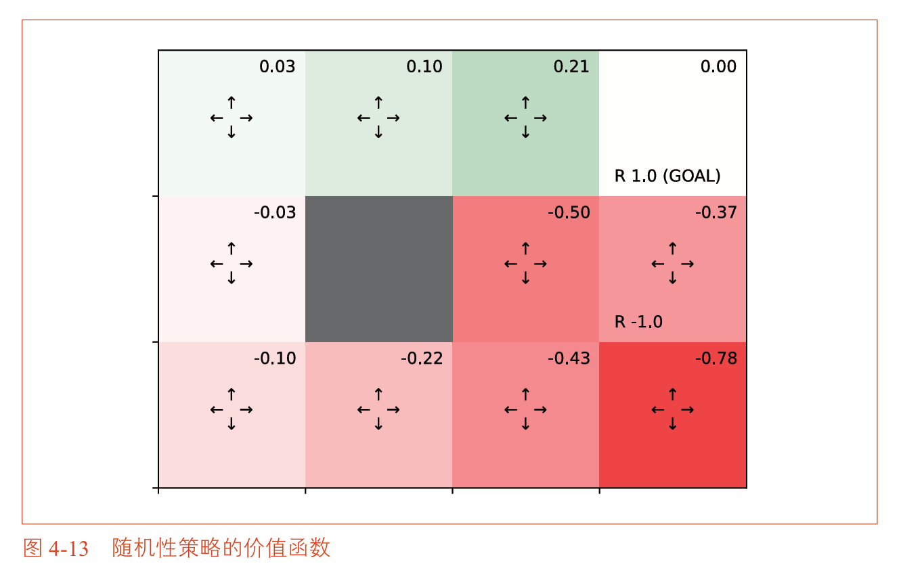
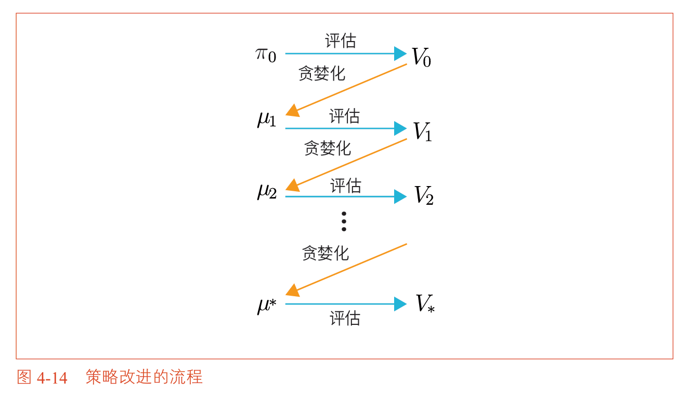
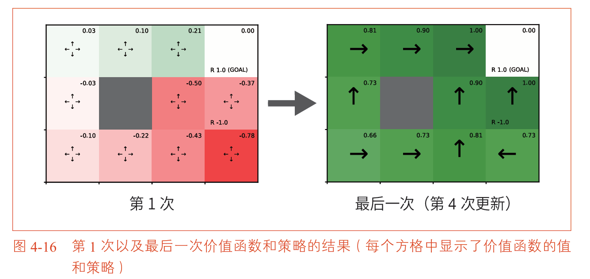

## 第五章 蒙特卡洛方法
### 本章概述

在前面第四章中，我们学习了动态规划法，它通过反复应用贝尔曼方程来求解MDP问题。但动态规划法有一个关键的前提条件：**需要知道完整的环境模型**，也就是状态迁移概率 $p(s'|s,a)$ 和奖励函数 $r(s,a,s')$。智能代理可以在不实际采取行动的情况下，在“大脑中”模拟整个决策过程，这被称为**规划（Planning）**。

然而在现实世界的大多数问题中，环境模型是未知的。例如，在库存管理问题中，商品的销售量受到天气、季节、竞争对手策略等复杂因素的影响，我们无法精确知道销售的概率分布。即使理论上可以建模，其复杂度也往往超出实际可行范围。

本章将介绍**蒙特卡洛方法（Monte Carlo Method）**，它是一类通过**重复采样**来估计数值的方法的总称。在强化学习中，蒙特卡洛方法让智能代理**实际与环境交互**，从真实经验中学习价值函数和最优策略，而不需要预先知道环境模型。

蒙特卡洛方法的核心思想非常简单：让智能代理实际玩很多个回合，记录每个回合获得的收益，然后取平均值来估计状态或行动的价值。随着样本数量的增加，根据大数定律，这个平均值会收敛到真实的价值函数。

蒙特卡洛方法只能用于**回合制任务**（有明确终点的任务），因为收益的计算需要等到回合结束才能完成。对于连续性任务（永远不会结束），蒙特卡洛方法无法直接使用，这将在第六章的TD方法中得到解决。

### 本章知识脉络

```
5.1 蒙特卡洛方法的基础知识
  └── 骰子实验：分布模型 vs 样本模型，增量式实现
        ↓
5.2 使用蒙特卡洛方法评估策略
  └── 从实际经验中估计状态价值函数，高效计算收益
        ↓
5.3 蒙特卡洛方法的实现
  └── 在3×4网格世界中实现策略评估（RandomAgent类）
        ↓
5.4 使用蒙特卡洛方法的策略控制
  └── 从状态价值转向Q函数，引入ε-greedy和固定步长α
        ↓
5.5 同策略型与异策略型
  └── 目标策略 vs 行为策略，重要性采样的原理
        ↓
5.6 小结
```


## 5.1 蒙特卡洛方法的基础知识

蒙特卡洛方法这个名字来源于摩纳哥的蒙特卡洛赌场，因为这种方法的核心是“随机抽样”，与赌博中的随机性有类比关系。在强化学习出现之前，蒙特卡洛方法已经在物理、金融、工程等领域被广泛使用。

### 5.1.1 骰子的点数和

让我们从一个简单的例子开始：计算掷两个骰子所得到的点数和。

**分布模型的方法**：

如果我们知道骰子的概率分布，可以用解析方法精确计算期望值。两个骰子的点数和概率分布如下：

| 点数和 | 2 | 3 | 4 | 5 | 6 | 7 | 8 | 9 | 10 | 11 | 12 |
| :--- | :---: | :---: | :---: | :---: | :---: | :---: | :---: | :---: | :---: | :---: | :---: |
| 概率 | 1/36 | 2/36 | 3/36 | 4/36 | 5/36 | 6/36 | 5/36 | 4/36 | 3/36 | 2/36 | 1/36 |

```python
import numpy as np

# 分布模型：精确计算期望值
ps = {
    2: 1/36, 3: 2/36, 4: 3/36, 5: 4/36, 6: 5/36,
    7: 6/36, 8: 5/36, 9: 4/36, 10: 3/36, 11: 2/36, 12: 1/36
}

expected_value = sum(x * p for x, p in ps.items())
print(f"期望值: {expected_value}")  # 输出: 7.0
```

这种方法的优点是精确，但缺点是需要完整的概率分布。当骰子数量增加到10个时，需要枚举 $6^{10} = 60466176$ 种组合，计算量迅速膨胀。

### 5.1.2 分布模型与样本模型

**分布模型（Distribution Model）**：显式地持有概率分布，然后通过数学公式计算期望值。就像上面的骰子例子，我们精确列出了所有可能的点数和对应的概率。

**样本模型（Sample Model）**：不持有概率分布，而是能够从环境中**采样**。通过重复采样并取平均值来估计期望值。随着采样次数增加，平均值会收敛到真实期望值（大数定律）。

```python
# 样本模型：只定义如何采样
def sample_dice(dices=2):
    """掷 dices 个骰子，返回点数和"""
    total = 0
    for _ in range(dices):
        # np.random.choice 从 [1,2,3,4,5,6] 中等概率抽取一个
        total += np.random.choice([1, 2, 3, 4, 5, 6])
    return total

# 使用样本模型计算期望值（蒙特卡洛方法）
n_samples = 10000
samples = [sample_dice() for _ in range(n_samples)]
estimated_value = np.mean(samples)
print(f"采样估计的期望值: {estimated_value}")  # 输出: 接近7.0
```

**两种模型的对比**：

| 对比项 | 分布模型 | 样本模型 |
| :--- | :--- | :--- |
| 需要什么 | 完整的概率分布 | 只需能采样 |
| 计算方式 | 解析计算 | 采样后取平均 |
| 精度 | 精确（无误差） | 近似（有统计误差） |
| 数据要求 | 高（需知道所有概率） | 低（只需能生成样本） |
| 复杂度 | 随状态空间指数增长 | 不依赖状态空间大小 |

**两种模型的实现对比**：

```python
# 分布模型的实现：需要明确持有概率分布
class DistributionModel:
    def __init__(self):
        self.probs = {2: 1/36, 3: 2/36, ...}  # 完整的概率表
    
    def get_expectation(self):
        return sum(x * p for x, p in self.probs.items())

# 样本模型的实现：只需定义采样过程
class SampleModel:
    def sample(self):
        return np.random.choice([1,2,3,4,5,6]) + np.random.choice([1,2,3,4,5,6])
```

### 5.1.3 蒙特卡洛方法的实现

```python
import numpy as np

def sample_dice():
    """掷两个骰子，返回点数和"""
    return np.random.choice([1, 2, 3, 4, 5, 6]) + np.random.choice([1, 2, 3, 4, 5, 6])

# ========== 方法一：简单平均法 ==========
n_samples = 1000
samples = []

for _ in range(n_samples):
    samples.append(sample_dice())

estimated_value = sum(samples) / len(samples)
print(f"简单平均法: {estimated_value}")  # 输出: 接近7.0

# ========== 方法二：增量式实现 ==========
# 更高效：不需要存储所有历史样本
V = 0
n = 0

for _ in range(n_samples):
    s = sample_dice()
    n += 1
    V += (s - V) / n  # 增量式更新公式

print(f"增量式实现: {V}")  # 输出: 接近7.0
```

**增量式更新公式的推导**：

设 $V_{n-1}$ 是前 $n-1$ 个样本的平均值，$x_n$ 是第 $n$ 个样本：

$$V_n = \frac{1}{n} \sum_{i=1}^n x_i = \frac{1}{n} \left( \sum_{i=1}^{n-1} x_i + x_n \right) = \frac{1}{n} \left( (n-1)V_{n-1} + x_n \right) = V_{n-1} + \frac{1}{n}(x_n - V_{n-1})$$

这就是第1章中老虎机问题使用过的增量式更新公式。它的优势在于：
1. 不需要存储所有历史样本，节省内存
2. 每获得一个新样本，只需一次简单运算即可更新估计值
3. 随着 $n$ 增大，步长 $\frac{1}{n}$ 逐渐减小，估计值趋于稳定


## 5.2 使用蒙特卡洛方法评估策略

现在我们将蒙特卡洛方法应用于强化学习中的策略评估。其核心思想是：让智能代理实际执行策略 $\pi$ 很多个回合，记录每个回合从各个状态出发获得的收益，然后取平均值来估计状态价值函数 $v_\pi(s)$。

### 5.2.1 使用蒙特卡洛方法计算价值函数

回顾价值函数的定义：

$$v_\pi(s) = \mathbb{E}_\pi[G \mid S = s]$$

其中 $G$ 是从状态 $s$ 出发获得的收益（折现奖励的总和）。

蒙特卡洛方法通过以下方式近似这个期望值：

$$V(s) = \frac{G^{(1)} + G^{(2)} + \cdots + G^{(N)}}{N}$$

其中 $G^{(i)}$ 是第 $i$ 个回合中从状态 $s$ 出发获得的收益。

**具体流程**：

1. 让智能代理根据策略 $\pi$ 玩一个完整的回合，记录所有状态、行动和奖励
2. 从后往前计算每个时间步的收益 $G_t$（利用 $G_t = R_t + \gamma G_{t+1}$）
3. 对每个访问过的状态 $s$，将 $G_t$ 添加到该状态的收益列表中
4. 重复多个回合，对每个状态取平均收益

**单次试验示例**：

假设从状态 $s$ 出发，智能代理经历了一个4步的回合，奖励序列为 $R_0=1, R_1=0, R_2=2$，折现率 $\gamma=1$：

| 时间步 | 状态 | 行动 | 奖励 |
| :--- | :--- | :--- | :--- |
| t=0 | s | a₁ | 1 |
| t=1 | s₁ | a₂ | 0 |
| t=2 | s₂ | a₃ | 2 |
| t=3 | 目标 | - | - |

从状态 $s$ 出发的收益：
$$G^{(1)} = 1 + 0 + 2 = 3$$

因此第一次试验后，$V(s) = 3$。

如果第二次试验从状态 $s$ 出发的收益为 $G^{(2)} = 2$，则：
$$V(s) = \frac{3 + 2}{2} = 2.5$$

随着试验次数增加，$V(s)$ 会越来越接近真实的 $v_\pi(s)$。

### 5.2.2 高效计算收益的技巧

在一个回合中，从后往前计算收益是最高效的方式。利用递归关系 $G_t = R_t + \gamma G_{t+1}$，可以从最后一个奖励开始倒推：

```python
# 假设一个回合产生的数据
rewards = [1, 0, 2]  # R_0, R_1, R_2
gamma = 1.0

# 从后往前计算收益
G = 0
for t in reversed(range(len(rewards))):
    G = rewards[t] + gamma * G
    print(f"G_{t} = {G}")

# 输出：
# G_2 = 2
# G_1 = 0 + 1*2 = 2
# G_0 = 1 + 1*2 = 3
```

这种从后往前的计算方式是强化学习中的常见模式，在后续的TD算法中也会反复使用。

### 5.2.3 高效计算所有状态的收益

在实际的强化学习问题中，我们通常需要评估所有状态的价值。一个高效的技巧是：**在一个回合中同时收集所有状态的收益样本**。

考虑一个从状态A出发的回合，依次经过状态B、C，最终到达目标：

```
A → B → C → 目标
奖励：R₀    R₁    R₂
```

从后往前计算：

| 起点状态 | 收益 |
| :--- | :--- |
| C | $G_C = R_2$ |
| B | $G_B = R_1 + \gamma G_C$ |
| A | $G_A = R_0 + \gamma G_B$ |

从一次试验中，我们就获得了三个状态（A、B、C）的收益样本。随着回合的重复进行，每个状态都会积累越来越多的收益样本，取平均值即可得到价值函数的估计值。


## 5.3 蒙特卡洛方法的实现

本节将实现蒙特卡洛方法，在 3×4 网格世界中对随机策略进行评估。

### 5.3.1 step 方法和 reset 方法

在实现蒙特卡洛方法之前，我们需要在 GridWorld 类中添加两个方法，使智能代理能够实际与环境交互：

- `reset()`：将智能代理重置到起始位置，开始新的回合
- `step(action)`：执行一个行动，返回下一个状态、奖励和回合是否结束的标志

```python
class GridWorld:
    # ... 之前的代码 ...
    
    def reset(self):
        """重置环境到起始状态"""
        self.agent_state = self.start_state
        return self.agent_state
    
    def step(self, action):
        """
        执行一个行动
        
        参数：
            action: 行动（0=上, 1=下, 2=左, 3=右）
        
        返回：
            next_state: 下一个状态
            reward: 即时奖励
            done: 回合是否结束
        """
        state = self.agent_state
        next_state = self.next_state(state, action)
        reward = self.reward(state, action, next_state)
        self.agent_state = next_state
        
        # 如果到达苹果或炸弹位置，回合结束
        done = (next_state == self.goal_state) or (reward == -1.0)
        
        return next_state, reward, done
```

### 5.3.2 RandomAgent 类的实现

```python
from collections import defaultdict
import numpy as np

class RandomAgent:
    """
    使用随机策略的智能代理，用于蒙特卡洛策略评估
    
    该代理采用均匀随机策略（4个方向各25%概率），
    通过与环境交互收集经验数据，然后用蒙特卡洛方法评估策略价值
    """
    
    def __init__(self, gamma=0.9, action_size=4):
        """
        初始化智能代理
        
        参数：
            gamma: 折现率
            action_size: 行动空间大小（4个方向）
        """
        self.gamma = gamma
        self.action_size = action_size
        
        # 策略：均匀随机，每个状态下4个行动各0.25概率
        random_actions = {0: 0.25, 1: 0.25, 2: 0.25, 3: 0.25}
        self.pi = defaultdict(lambda: random_actions)
        
        # 价值函数 V，存储每个状态的估计值
        self.V = defaultdict(lambda: 0)
        
        # cnts 记录每个状态被访问的次数，用于增量式更新
        self.cnts = defaultdict(lambda: 0)
        
        # memory 存储一个回合中所有的 (状态, 行动, 奖励) 数据
        self.memory = []
    
    def get_action(self, state):
        """
        根据策略选择行动
        
        参数：
            state: 当前状态
        
        返回：
            选中的行动（0=上, 1=下, 2=左, 3=右）
        """
        action_probs = self.pi[state]
        actions = list(action_probs.keys())
        probs = list(action_probs.values())
        return np.random.choice(actions, p=probs)
    
    def add(self, state, action, reward):
        """
        将一步经验数据添加到记忆中
        
        参数：
            state: 当前状态
            action: 采取的行动
            reward: 获得的奖励
        """
        data = (state, action, reward)
        self.memory.append(data)
    
    def reset(self):
        """清空记忆，开始新的回合"""
        self.memory.clear()
    
    def eval(self):
        """
        执行蒙特卡洛策略评估
        
        从后往前遍历 memory 中存储的经验数据，
        计算每个状态的收益，并用增量式更新公式更新 V
        """
        G = 0
        
        # 从后往前遍历
        for data in reversed(self.memory):
            state, action, reward = data
            
            # 收益的递归计算：G_t = R_t + gamma * G_{t+1}
            G = self.gamma * G + reward
            
            # 增量式更新：V(s) = V(s) + (1/n) * (G - V(s))
            self.cnts[state] += 1
            self.V[state] += (G - self.V[state]) / self.cnts[state]
```

**代码说明**：

`add` 方法按时间顺序记录 `(状态, 行动, 奖励)` 三元组。`eval` 方法在回合结束后被调用：它从后往前遍历 `memory`，用递归关系计算每个时间步的收益 $G_t$，然后用增量式更新公式更新对应状态的价值估计值。

`cnts` 字典记录每个状态被访问的次数，用于计算步长 $\frac{1}{n}$。这正是增量式平均的实现方式。

### 5.3.3 运行蒙特卡洛策略评估

```python
# 创建环境和智能代理
env = GridWorld()
agent = RandomAgent(gamma=0.9)

# 运行 1000 个回合
episodes = 1000

for episode in range(episodes):
    # 重置环境，开始新回合
    state = env.reset()
    agent.reset()
    
    while True:
        # 智能代理选择行动
        action = agent.get_action(state)
        
        # 环境执行行动
        next_state, reward, done = env.step(action)
        
        # 记录经验数据
        agent.add(state, action, reward)
        
        if done:
            # 回合结束，执行蒙特卡洛评估
            agent.eval()
            break
        
        state = next_state

# 可视化评估结果
env.render_v(agent.V)
```

**运行结果**：



将蒙特卡洛方法的结果与第四章动态规划法的结果进行对比：

| 对比项 | 动态规划法（精确） | 蒙特卡洛方法（估计） |
| :--- | :--- | :--- |
| 需要环境模型 | 是（需要 $p$ 和 $r$） | 否（只需能采样） |
| 学习方式 | 规划（模拟计算） | 学习（实际经验） |
| 结果精度 | 精确值 | 近似值（随样本增加而提高） |
| 计算方式 | 贝尔曼方程解析计算 | 经验数据的平均值 |

两种方法的结果基本一致，验证了蒙特卡洛方法的有效性。关键区别在于：动态规划法需要知道环境模型，而蒙特卡洛方法只需要能够与环境交互并观察结果。


## 5.4 使用蒙特卡洛方法的策略控制

策略评估之后，下一步是策略控制——找到最优策略。在动态规划法中，策略改进通过对状态价值函数做贪婪化来实现，即选择使 $r + \gamma V(s')$ 最大的行动。这需要知道环境模型 $p$ 和 $r$。

蒙特卡洛方法的策略控制采用不同的方式：直接评估 **Q函数**，然后对Q函数做贪婪化。

### 5.4.1 从状态价值转向Q函数

在无模型环境中，环境模型（状态迁移概率和奖励函数）是未知的，因此无法直接用状态价值函数 $V$ 来计算 $r + \gamma V(s')$。解决方案是转而使用 Q 函数 $Q(s,a)$：

$$\mu(s) = \arg\max_a Q(s,a)$$

当我们知道了 Q 函数后，策略改进只需要简单地选择 Q 值最大的行动，完全不需要环境模型。

Q 函数的蒙特卡洛估计与状态价值函数类似：

$$Q(s,a) \approx \frac{1}{N} \sum_{i=1}^N G^{(i)}(s,a)$$

即：从状态 $s$ 采取行动 $a$ 后获得的收益的平均值。

```python
# Q 函数的增量式更新
self.Q[(state, action)] += (G - self.Q[(state, action)]) / self.cnts[(state, action)]
```

### 5.4.2 蒙特卡洛策略控制的直接实现及其问题

一个直观的想法是：用蒙特卡洛方法评估当前策略的 Q 函数，然后对 Q 函数做贪婪化得到新策略，再评估新策略的 Q 函数……就像动态规划中的策略迭代法一样。

但这种做法有一个严重问题：**如果策略变成完全贪婪的（确定性策略），智能代理就不再探索其他行动了**。它只会沿着一条固定的路径走，无法访问到所有状态-行动对，导致许多 $Q(s,a)$ 无法被估计。

### 5.4.3 第一个修改：ε-greedy 算法

为了解决探索不足的问题，我们引入 ε-greedy 算法：

```python
def get_action(self, state):
    """
    ε-greedy 策略：以 ε 概率随机探索，以 1-ε 概率贪婪利用
    """
    if np.random.rand() < self.epsilon:
        # 探索：随机选择一个行动
        return np.random.randint(0, self.action_size)
    else:
        # 利用：选择 Q 值最大的行动
        qs = [self.Q[(state, a)] for a in range(self.action_size)]
        return np.argmax(qs)
```

这样，即使策略主要倾向于贪婪行动，仍有 ε 概率去探索其他行动，确保所有状态-行动对都能被充分访问。

```python
def greedy_probs(Q, state, epsilon=0.1, action_size=4):
    """
    生成 ε-greedy 策略的概率分布
    
    返回：字典 {action: probability}
    """
    qs = [Q[(state, action)] for action in range(action_size)]
    max_action = np.argmax(qs)
    
    # 所有行动的基础概率：epsilon / action_size
    base_prob = epsilon / action_size
    
    # 构建概率分布
    probs = {action: base_prob for action in range(action_size)}
    
    # 最大 Q 值的行动额外获得 (1 - epsilon) 的概率
    probs[max_action] += (1 - epsilon)
    
    return probs
```

### 5.4.4 第二个修改：固定步长 α

在蒙特卡洛策略控制中，策略在不断变化，因此收益的概率分布是非稳态的（随着策略改进，收益的分布也会改变）。对于非稳态问题，使用固定步长 $\alpha$ 比使用样本平均 $\frac{1}{n}$ 更合适：

$$Q(s,a) \leftarrow Q(s,a) + \alpha (G - Q(s,a))$$

其中 $\alpha \in (0, 1]$ 是一个固定的常数。

**两种更新方式的对比**：

| 更新方式 | 步长 | 适用场景 | 权重特点 |
| :--- | :--- | :--- | :--- |
| 样本平均 | $\frac{1}{n}$ | 稳态环境（策略不变） | 所有历史数据等权重 |
| 固定步长 $\alpha$ | $\alpha$ | 非稳态环境（策略在变化） | 近期数据权重大 |

### 5.4.5 McAgent 类的完整实现

```python
class McAgent:
    """
    使用蒙特卡洛方法进行策略控制的智能代理
    
    采用 ε-greedy 算法平衡探索与利用
    使用固定步长 α 适应非稳态环境
    """
    
    def __init__(self, gamma=0.9, epsilon=0.1, alpha=0.1, action_size=4):
        self.gamma = gamma
        self.epsilon = epsilon
        self.alpha = alpha
        self.action_size = action_size
        
        # Q 函数：存储 (state, action) -> value 的映射
        self.Q = defaultdict(lambda: 0)
        
        # 策略：每个状态的行动概率分布（ε-greedy）
        self.pi = defaultdict(lambda: {a: 0.25 for a in range(action_size)})
        
        # 记忆：存储一个回合中的所有 (状态, 行动, 奖励)
        self.memory = []
    
    def get_action(self, state):
        """按 ε-greedy 策略选择行动"""
        action_probs = self.pi[state]
        actions = list(action_probs.keys())
        probs = list(action_probs.values())
        return np.random.choice(actions, p=probs)
    
    def add(self, state, action, reward):
        self.memory.append((state, action, reward))
    
    def reset(self):
        self.memory.clear()
    
    def update(self):
        """
        回合结束后执行蒙特卡洛更新
        """
        G = 0
        
        # 从后往前遍历，计算每个时间步的收益
        for state, action, reward in reversed(self.memory):
            G = self.gamma * G + reward
            
            key = (state, action)
            
            # 使用固定步长 α 更新 Q 函数（非稳态环境适用）
            self.Q[key] += (G - self.Q[key]) * self.alpha
            
            # 更新策略：在当前状态下采用 ε-greedy
            self.pi[state] = greedy_probs(self.Q, state, self.epsilon)
```

### 5.4.6 运行蒙特卡洛策略控制

```python
# 创建环境和智能代理
env = GridWorld()
agent = McAgent(gamma=0.9, epsilon=0.1, alpha=0.1)

# 训练 10000 个回合
episodes = 10000

for episode in range(episodes):
    state = env.reset()
    agent.reset()
    
    while True:
        action = agent.get_action(state)
        next_state, reward, done = env.step(action)
        agent.add(state, action, reward)
        
        if done:
            agent.update()
            break
        
        state = next_state

# 可视化 Q 函数
env.render_q(agent.Q)
```

**运行结果**：



可视化图中，每个格子被分成4个扇形区域，每个区域对应一个行动（上、下、左、右）。数字表示该状态-行动对的 Q 值，颜色表示大小（绿色为正，红色为负）。

从 Q 函数中提取贪婪策略，即可得到最优策略：



智能代理学会了避开炸弹，沿着最短路径前往苹果。


## 5.5 同策略型与异策略型

### 5.5.1 同策略型（On-Policy）与异策略型（Off-Policy）的定义

到目前为止，我们使用的策略 $\pi$ 同时承担了两个角色：
1. 作为**行为策略**：实际用来与环境交互、收集数据的策略
2. 作为**目标策略**：正在被评估和改进的策略

当行为策略和目标策略是同一个策略时，这被称为**同策略型（On-Policy）**。

但如果我们可以将这两个角色分离：用一个策略 $b$ 来探索环境、收集数据（行为策略），同时用另一个策略 $\pi$ 作为学习和改进的目标（目标策略），这就被称为**异策略型（Off-Policy）**。

| 对比项 | 同策略型 | 异策略型 |
| :--- | :--- | :--- |
| 行为策略 vs 目标策略 | 同一个策略 | 不同策略 |
| 探索方式 | ε-greedy 等 | 行为策略负责探索 |
| 目标策略特性 | 必须包含探索（不能完全贪婪） | 可以是完全贪婪的 |
| 数据效率 | 较低（不能用过去的数据） | 较高（可以重用旧数据） |
| 典型算法 | SARSA | Q学习（将在第6章介绍） |

**形象的比喻**：同策略型就像运动员自己训练自己，一边练习一边改进技术。异策略型就像通过观察优秀运动员的比赛录像来学习，自己的训练方式（行为策略）和想要学习的目标技术（目标策略）是不同的。

### 5.5.2 重要性采样

在异策略型方法中，我们需要用从行为策略 $b$ 采样的数据来估计目标策略 $\pi$ 的价值。这需要一种技术来“校正”两个策略之间的概率差异——这就是**重要性采样（Importance Sampling）**。

**核心思想**：当我们从概率分布 $b$ 采样时，要计算关于另一个概率分布 $\pi$ 的期望值，需要对每个样本乘以一个权重：

$$\rho(x) = \frac{\pi(x)}{b(x)}$$

这个权重 $\rho$ 被称为**重要性比率（Importance Ratio）**。它表示在目标策略 $\pi$ 下观察到数据 $x$ 的概率与在行为策略 $b$ 下观察到该数据的概率之比。

```python
import numpy as np

# 简单的例子：计算期望值
x = np.array([1, 2, 3])
pi = np.array([0.1, 0.1, 0.8])  # 目标策略（想要估计的分布）
b = np.array([1/3, 1/3, 1/3])   # 行为策略（实际采样的分布）

# 真实期望值
true_expectation = np.sum(x * pi)
print(f"真实期望值: {true_expectation}")

# 从行为策略采样，用重要性采样估计期望值
n_samples = 1000
samples = []

for _ in range(n_samples):
    idx = np.random.choice([0, 1, 2], p=b)
    rho = pi[idx] / b[idx]
    samples.append(rho * x[idx])

estimated_expectation = np.mean(samples)
print(f"重要性采样估计: {estimated_expectation}")
```

**为什么重要性采样有效？**

$$\mathbb{E}_\pi[x] = \sum x \pi(x) = \sum x \frac{b(x)}{b(x)} \pi(x) = \sum x \frac{\pi(x)}{b(x)} b(x) = \mathbb{E}_b\left[x \frac{\pi(x)}{b(x)}\right]$$

这个推导告诉我们：从 $b$ 采样时，只需将每个样本乘以 $\frac{\pi(x)}{b(x)}$，就可以无偏地估计关于 $\pi$ 的期望值。

### 5.5.3 重要性采样的方差问题

重要性采样的一个主要问题是**方差可能很大**。如果两个策略差异较大，重要性比率 $\rho = \pi/b$ 可能会非常大或非常小，导致估计值不稳定。

```python
# 当两个策略差异较大时，方差会增大
b_different = np.array([0.2, 0.2, 0.6])  # 更接近 pi
b_far = np.array([0.6, 0.2, 0.2])        # 远离 pi

# 使用 b_far 时，重要性比率的方差更大
# rho = pi/b 会取到很大的值（如 0.8/0.2 = 4）
```

**减小方差的方法**：使行为策略 $b$ 尽可能接近目标策略 $\pi$。这正是 ε-greedy 策略的一个优势——它本身就很接近贪婪策略，因此重要性采样的方差被控制在合理范围内。

```python
# 异策略型蒙特卡洛方法的权重更新（附录A）
# 从后往前更新重要性比率
rho = 1
for state, action, reward in reversed(self.memory):
    G = self.gamma * rho * G + reward
    # rho 从后往前累积
    rho *= self.pi[state][action] / self.b[state][action]
```

### 5.5.4 同策略型 vs 异策略型在蒙特卡洛中的适用场景

| 场景 | 推荐方法 | 原因 |
| :--- | :--- | :--- |
| 环境稳定，目标明确 | 同策略型 | 简单直接，不需要重要性采样 |
| 需要利用历史数据 | 异策略型 | 可以从旧数据中学习 |
| 行为策略难以控制 | 异策略型 | 目标策略可以独立于行为策略 |
| 需要保证探索充分 | 异策略型 | 行为策略可以专门负责探索 |


## 5.6 小结

本章介绍了蒙特卡洛方法，它是一类不依赖环境模型、通过实际采样来估计价值的算法。

**核心要点总结**：

| 要点 | 说明 |
| :--- | :--- |
| 蒙特卡洛方法 | 通过重复采样和取平均来估计期望值，适用于回合制任务 |
| 分布模型 vs 样本模型 | 分布模型需要完整概率；样本模型只需能采样，更灵活 |
| 增量式更新 | $V = V + \frac{1}{n}(G - V)$，高效、不需存储历史 |
| 策略评估 | 从实际经验中估计 $v_\pi(s)$ 或 $q_\pi(s,a)$ |
| 策略控制 | 用蒙特卡洛估计 Q 函数，再做贪婪化改进策略 |
| ε-greedy | 以 ε 概率探索，保证所有状态-行动对都能被访问 |
| 固定步长 α | 适应非稳态环境（策略在变化），比 $1/n$ 更合适 |
| 同策略型 vs 异策略型 | 行为策略和目标策略是否相同；异策略型需要重要性采样 |
| 重要性采样 | 用从 $b$ 采样的数据估计 $\pi$ 的期望，权重为 $\pi/b$ |

**本章算法演进路径**：

```text
骰子采样（引入蒙特卡洛思想）
        ↓
蒙特卡洛策略评估（从经验估计状态价值）
        ↓
蒙特卡洛策略控制（从状态价值转向Q函数）
        ↓
ε-greedy 算法（解决探索不足的问题）
        ↓
固定步长 α（适应非稳态环境）
        ↓
同策略型（目前采用的方法）
        ↓
异策略型 + 重要性采样（分离行为策略和目标策略）
```

```python
# 本章关键代码汇总

# 1. 增量式更新（样本平均）
V[state] += (G - V[state]) / cnts[state]

# 2. 增量式更新（固定步长 α）
Q[(state, action)] += (G - Q[(state, action)]) * alpha

# 3. ε-greedy 概率分布
def greedy_probs(Q, state, epsilon, action_size):
    qs = [Q[(state, a)] for a in range(action_size)]
    max_action = np.argmax(qs)
    probs = {a: epsilon/action_size for a in range(action_size)}
    probs[max_action] += 1 - epsilon
    return probs

# 4. 重要性采样权重
rho = pi[action] / b[action]
```


💡 **本章要点**

- 蒙特卡洛方法不需要环境模型，只需与环境交互的经验
- 策略评估通过对多个回合的收益取平均来实现
- 策略控制需要 Q 函数 + 探索机制（如 ε-greedy）
- 固定步长 α 适用于策略不断变化的非稳态环境
- 异策略型方法可以分离行为策略和目标策略，为Q学习奠定基础

