# 第一章 导论

## 1.1 刚体运动状态描述

### 平面与空间

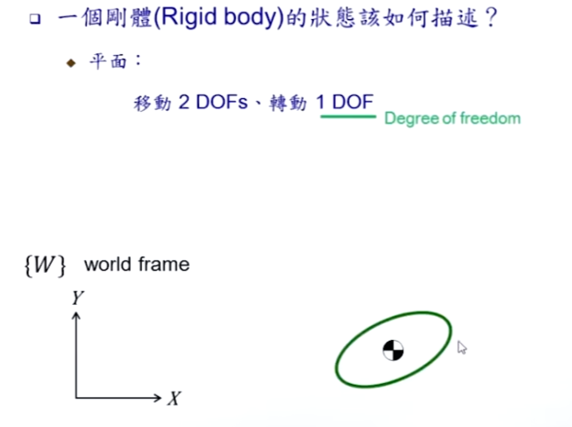

- 绿色椭圆表示二维平面中的刚体，黑白圆点表示参考点，通常取质心。
- 平面刚体有 3 个自由度：沿 $(X、Y)$ 方向平移，以及绕垂直平面的 $Z$ 轴旋转。
- $\{W\}$ 表示固定的世界坐标系。

平面刚体的位姿可表示为：

$$
\boldsymbol{q}_{\text{planar}}=[x,y,\theta]^T
$$

- $x,y$：参考点的位置。
- $\theta$：刚体的朝向。

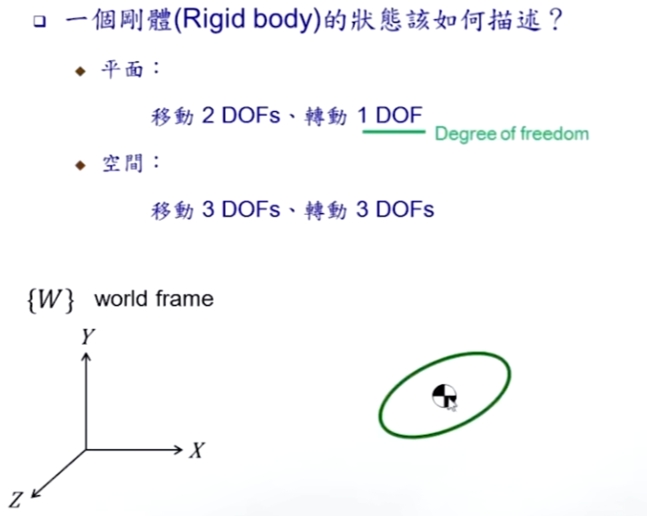

- 三维刚体有 6 个自由度。
- 3 个平移自由度：沿 $(X、Y、Z)$ 方向移动。
- 3 个旋转自由度：分别绕 $(X、Y,Z)$ 轴旋转。
- 图中的三根坐标轴构成世界坐标系 $\{W\}$。

空间刚体的位姿可表示为：

$$
\boldsymbol{q}_{\text{spatial}}=[x,y,z,\phi,\theta,\psi]^T
$$

- $x,y,z$：刚体的位置。
- $\phi,\theta,\psi$：刚体的姿态参数。

### 整合表述

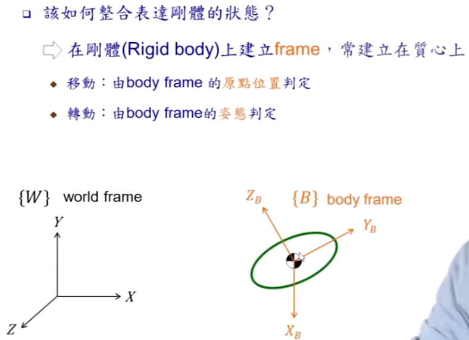

- 在刚体上建立随其运动的坐标系，称为刚体坐标系 $\{B\}$。
- $\{B\}$ 的原点位置描述刚体的平移。
- $(X_B、Y_B、Z_B)$ 的方向描述刚体的旋转。
- 刚体位姿就是 $\{B\}$ 相对于世界坐标系 $\{W\}$ 的位置和姿态。

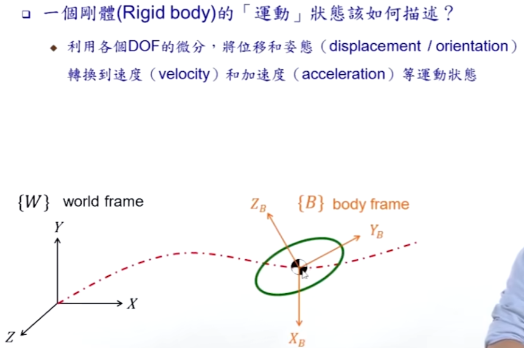

- 红色虚线表示刚体参考点的运动轨迹。
- 绿色椭圆表示刚体在某一时刻的位置。
- 橙色坐标轴表示该时刻刚体的姿态。
- 位姿对时间求导得到速度，再求导得到加速度。
- 平移对应线速度和线加速度，旋转对应角速度和角加速度。

## 1.2 移动

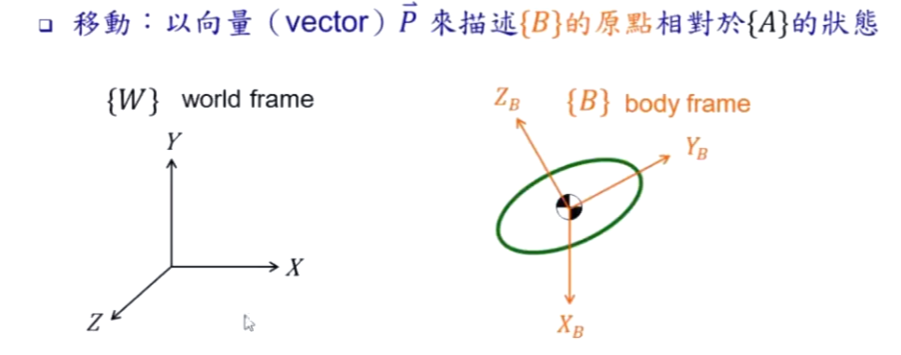

- 图中绿色箭头从世界坐标系 \(\{W\}\) 原点指向刚体坐标系 \(\{B\}\) 原点。
- 该箭头就是位置向量 \(\boldsymbol{P}\)，用于描述刚体的移动位置。
- 平移时，\(\{B\}\) 的坐标轴方向不变，只改变原点位置。

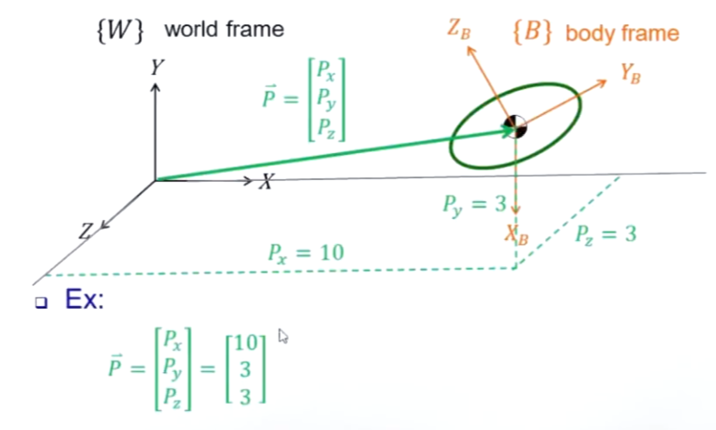

#### 示例

- 图中将 \(\boldsymbol{P}\) 分解为世界坐标系三个方向的分量。
- 由图可知：\(P_x=10\)、\(P_y=3\)、\(P_z=3\)。

$$
\boldsymbol{P}=\begin{bmatrix}P_x\\P_y\\P_z\end{bmatrix}
=\begin{bmatrix}10\\3\\3\end{bmatrix}
$$

- 三个分量共同确定 \(\{B\}\) 原点在 \(\{W\}\) 中的位置。

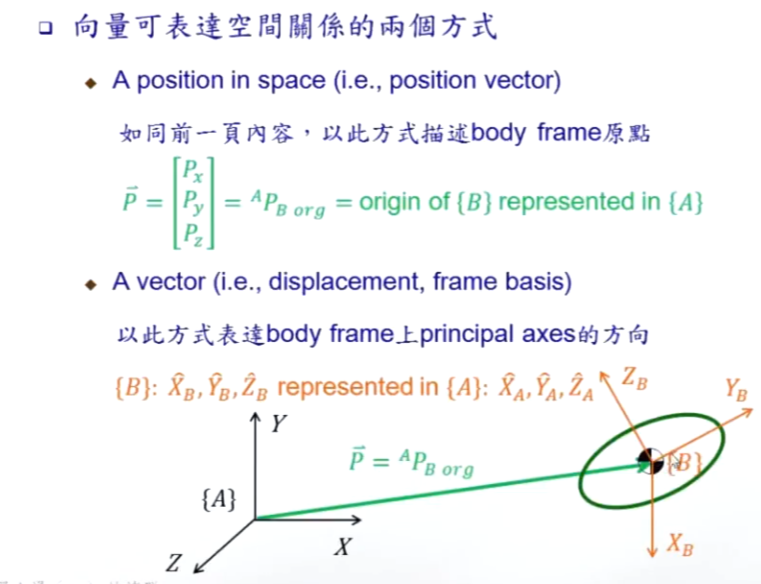
1. 用位置向量表示 \(\{B\}\) 原点在 \(\{W\}\) 中的位置。
2. 用三个方向向量表示 \(X_B、Y_B、Z_B\) 在 \(\{W\}\) 中的方向。

## 1.3 转动

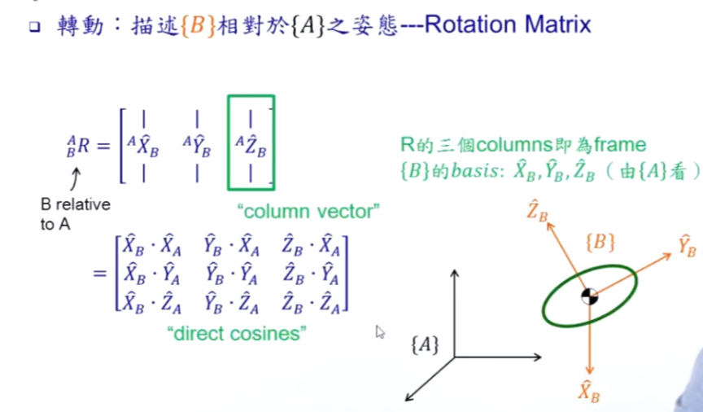  

- 使用旋转矩阵描述刚体坐标系 \(\{B\}\) 相对于参考坐标系 \(\{A\}\) 的姿态。
- 矩阵的三列分别是 \(X_B、Y_B、Z_B\) 在 \(\{A\}\) 中的**单位方向向量**。
- 矩阵元素是各坐标轴之间的点积，也称为方向余弦。

$$
{}^A_BR=[{}^A\hat X_B\quad{}^A\hat Y_B\quad{}^A\hat Z_B]
$$

求旋转矩阵主要有两种方法：

#### 1. 直接看投影

- 分别观察 \(X_B、Y_B、Z_B\) 在参考坐标系 \(\{A\}\) 的三个轴上的投影。
- 将每根轴的投影分量写成一个列向量。
- 按照 \(X_B、Y_B、Z_B\) 的顺序，将三个列向量放入矩阵。
- 得到的矩阵就是 \({}^A_BR\)。

#### 2. 运用点积公式

- 矩阵第 1/2/3 列表示 \(X_B\)/\(Y_B\)/\(Z_B\) 在 \(\{A\}\) 中的方向。
- 每个矩阵元素通过刚体坐标轴与参考坐标轴的单位向量点积得到。

$$
{}^A_BR=
\begin{bmatrix}
\hat X_B\cdot\hat X_A & \hat Y_B\cdot\hat X_A & \hat Z_B\cdot\hat X_A\\
\hat X_B\cdot\hat Y_A & \hat Y_B\cdot\hat Y_A & \hat Z_B\cdot\hat Y_A\\
\hat X_B\cdot\hat Z_A & \hat Y_B\cdot\hat Z_A & \hat Z_B\cdot\hat Z_A
\end{bmatrix}
$$

其中，点积结果表示两个坐标轴方向之间夹角的余弦，因此矩阵元素也称为方向余弦。

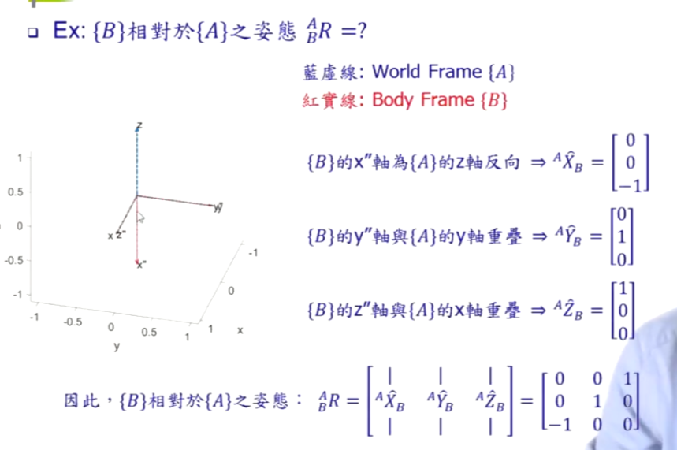

#### 示例

- 图中 \(X_B\) 轴与 \(A\) 坐标系的 \(-Z_A\) 方向重合。
- \(Y_B\) 轴与 \(Y_A\) 方向重合，\(Z_B\) 轴与 \(X_A\) 方向重合。
- 因此三根轴在 \(\{A\}\) 中的方向向量分别组成旋转矩阵：

$$
{}^A_BR=
\begin{bmatrix}
0&0&1\\
0&1&0\\
-1&0&0
\end{bmatrix}
$$

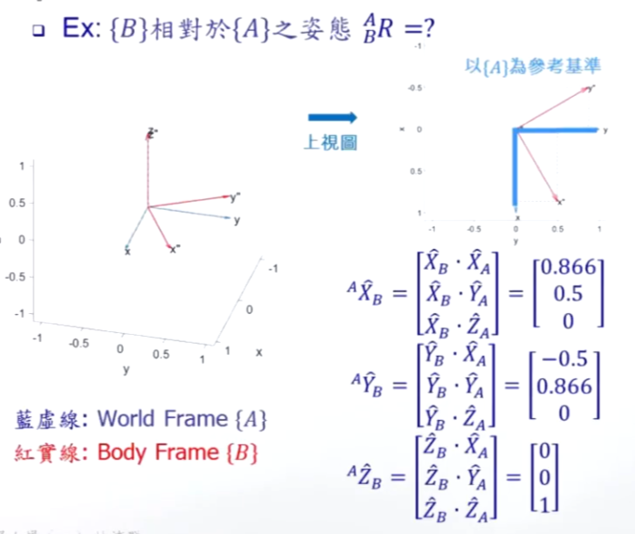

#### 示例

- 刚体坐标系相对参考坐标系绕 \(Z\) 轴旋转。
- 每根 \(B\) 坐标轴都用其在 \(A\) 坐标系中的分量表示。
- 图中方向余弦为 \(0.866\) 和 \(0.5\)，对应约 \(30^\circ\) 的旋转。
- 将三个方向向量按列组合成旋转矩阵。
- 旋转矩阵的每一列对应刚体坐标系的一根坐标轴：

$$
{}^A_BR=
\begin{bmatrix}
0.866&-0.5&0\\
0.5&0.866&0\\
0&0&1
\end{bmatrix}
$$

## 1.4 旋转矩阵
### 特性
#### 转置等于逆矩阵
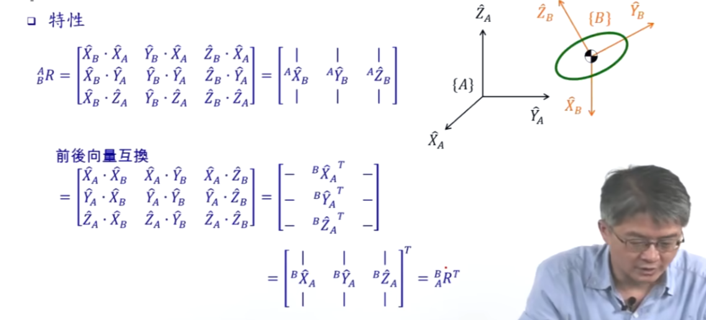

- 旋转矩阵的列向量是相互正交的单位向量。
- 因此旋转矩阵满足：

$$
R^TR=RR^T=I
$$

- 旋转矩阵的逆矩阵等于转置矩阵：

$$
R^{-1}=R^T
$$

旋转矩阵的转置可以用来交换参考坐标系和刚体坐标系。

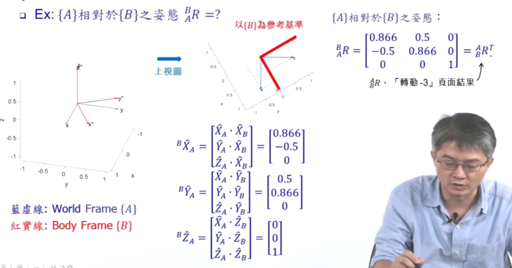

#### 示例

- 先根据图中的坐标轴方向，求出 \(\{A\}\) 相对于 \(\{B\}\) 的旋转矩阵。
- 再利用转置关系得到 \(\{B\}\) 相对于 \(\{A\}\) 的旋转矩阵。

$$
{}^A_BR=\left({}^B_AR\right)^T
$$

#### 正交矩阵的特点
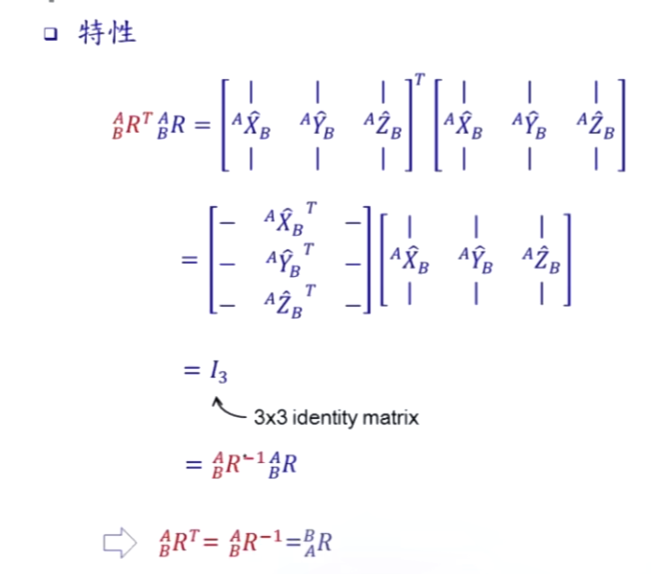
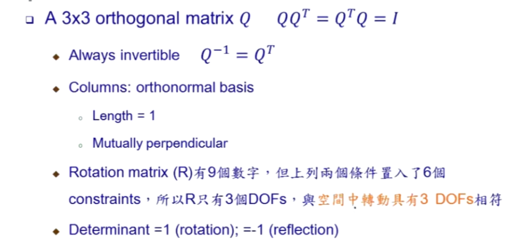

- 旋转矩阵属于正交矩阵，列向量长度为 1，且两两垂直。
- 旋转矩阵有 9 个元素，但正交约束使其只有 3 个独立自由度。
- 旋转矩阵的行列式为 1；行列式为 \(-1\) 通常表示镜像反射，而不是纯旋转。

### 旋转矩阵的作用2——转换坐标
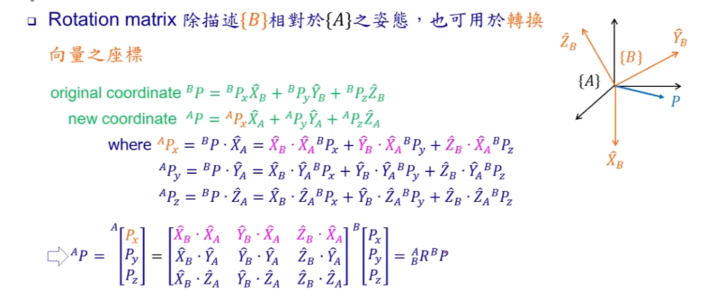

- 旋转矩阵不仅描述姿态，还可以转换同一个向量在不同坐标系中的坐标。
- 若 \({}^BP\) 是向量在 \(\{B\}\) 中的坐标，则在 \(\{A\}\) 中的坐标为：

$$
{}^AP={}^A_BR\,{}^BP
$$

#### 示例
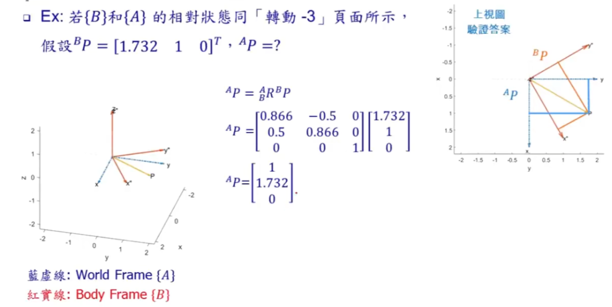

- 根据坐标轴方向写出 \({}^A_BR\)。
- 将 \({}^BP\) 左乘旋转矩阵，得到 \({}^AP\)。
- 计算结果为：

$$
{}^AP=\begin{bmatrix}1\\1.732\\0\end{bmatrix}
$$

### 旋转矩阵的作用3——转动状态的描述
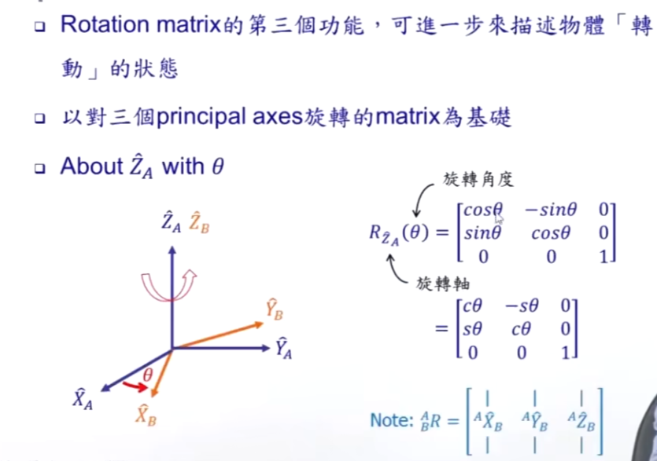
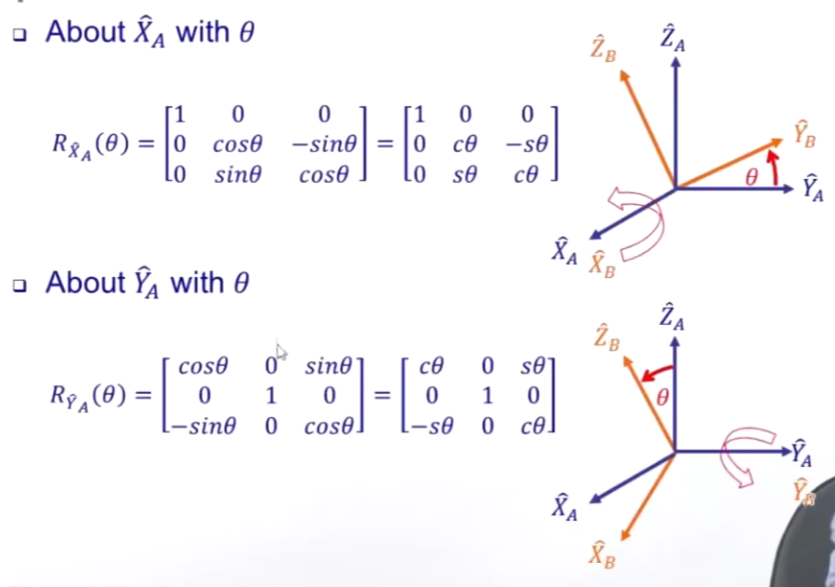 

- 绕参考坐标系 \(X_A、Y_A、Z_A\) 轴旋转时，分别使用对应的基本旋转矩阵。
- 绕 \(Z_A\) 轴旋转 \(\theta\)：

$$
R_{Z_A}(\theta)=
\begin{bmatrix}
\cos\theta&-\sin\theta&0\\
\sin\theta&\cos\theta&0\\
0&0&1
\end{bmatrix}
$$

- 绕 \(X_A\) 轴旋转：

$$
R_{X_A}(\theta)=
\begin{bmatrix}
1&0&0\\
0&\cos\theta&-\sin\theta\\
0&\sin\theta&\cos\theta
\end{bmatrix}
$$

- 绕 \(Y_A\) 轴旋转：

$$
R_{Y_A}(\theta)=
\begin{bmatrix}
\cos\theta&0&\sin\theta\\
0&1&0\\
-\sin\theta&0&\cos\theta
\end{bmatrix}
$$

#### 示例
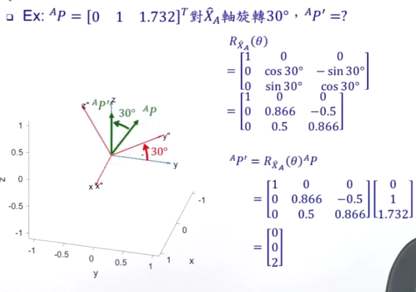

- 向量绕 \(X_A\) 轴旋转 \(30^\circ\)。
- 先写出 \(R_{X_A}(30^\circ)\)，再计算：

$$
{}^AP'=R_{X_A}(30^\circ){}^AP
$$

- 最终得到：

$$
{}^AP'=\begin{bmatrix}0\\0\\2\end{bmatrix}
$$

### 用法总结
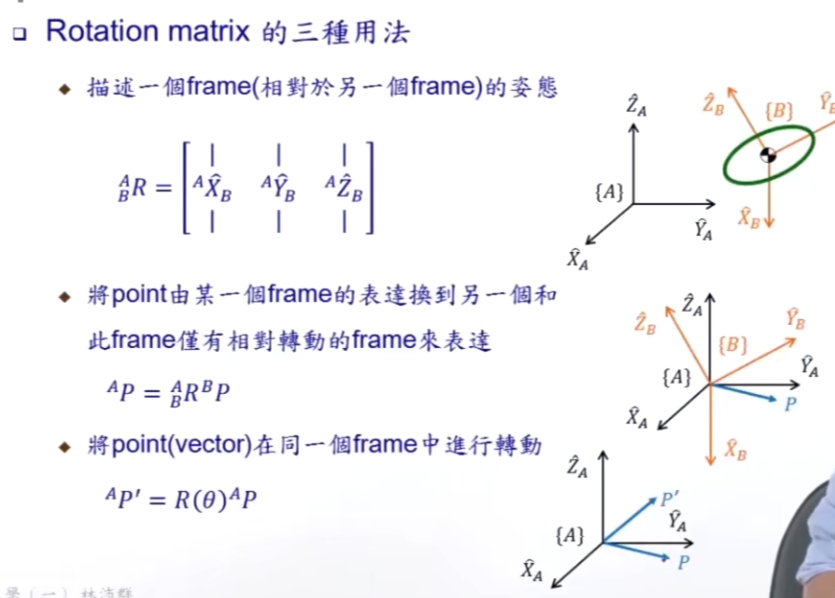

- 描述一个坐标系相对于另一个坐标系的姿态。
- 将点或向量从一个坐标系转换到另一个坐标系。
- 描述同一坐标系中的点或向量经过旋转后的状态。

# 第二章
## 2.1 Rotation Matrix

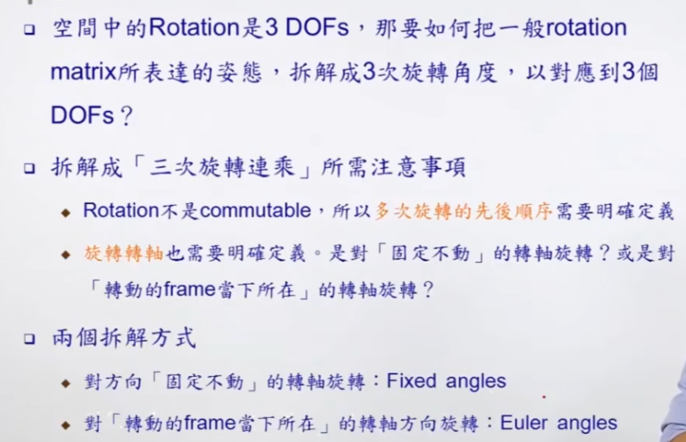

空间中的 Rotation 有 3 个自由度，因此可以将一个一般的旋转状态拆解为三次绕坐标轴的旋转。

将旋转拆解为三次旋转时，需要明确两个问题：

- **旋转顺序**：Rotation 不满足交换律，因此不同的旋转先后顺序可能得到不同的结果。
- **旋转轴的定义**：需要明确每次旋转是绕固定不动的坐标轴，还是绕已经随刚体转动后的坐标轴。

根据旋转轴的选择，可以分为：

- **Fixed Angles**：绕固定不动的坐标轴旋转。
- **Euler Angles**：绕随刚体一起转动的坐标轴旋转。

### Fixed Angles——对原始的不变的轴旋转

Fixed Angles 的每一次旋转都以**最初固定不动的参考坐标系**为基准。

因此，即使刚体已经发生了旋转，之后仍然绕原始参考坐标系中的轴进行旋转。

#### 由旋转角推算旋转矩阵——以 X-Y-Z 为例

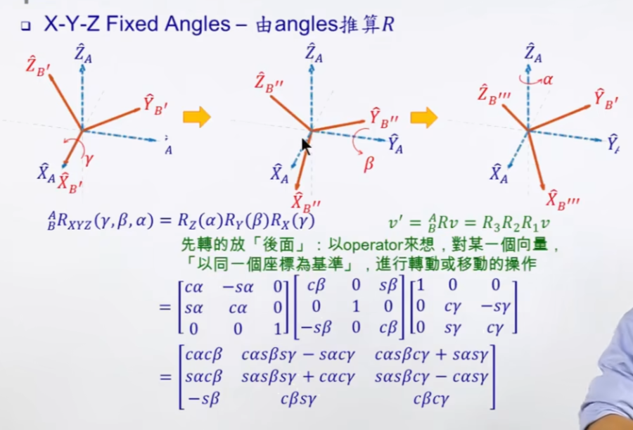

假设依次绕固定坐标系的：

1. \(X\) 轴旋转 \(\gamma\)
2. \(Y\) 轴旋转 \(\beta\)
3. \(Z\) 轴旋转 \(\alpha\)

则总旋转矩阵为：

$$
{}^A_BR_{XYZ}(\gamma,\beta,\alpha)
=
R_Z(\alpha)R_Y(\beta)R_X(\gamma)
$$

即：

$$
{}^A_BR_{XYZ}(\gamma,\beta,\alpha)
=
\begin{bmatrix}
c_\alpha & -s_\alpha & 0\\
s_\alpha & c_\alpha & 0\\
0&0&1
\end{bmatrix}
\begin{bmatrix}
c_\beta&0&s_\beta\\
0&1&0\\
-s_\beta&0&c_\beta
\end{bmatrix}
\begin{bmatrix}
1&0&0\\
0&c_\gamma&-s_\gamma\\
0&s_\gamma&c_\gamma
\end{bmatrix}
$$

其中：

$$
c_\alpha=\cos\alpha,\qquad
s_\alpha=\sin\alpha
$$

其余同理。

矩阵相乘后得到：

$$
{}^A_BR_{XYZ}=
\begin{bmatrix}
c_\alpha c_\beta &
c_\alpha s_\beta s_\gamma-s_\alpha c_\gamma &
c_\alpha s_\beta c_\gamma+s_\alpha s_\gamma
\\
s_\alpha c_\beta &
s_\alpha s_\beta s_\gamma+c_\alpha c_\gamma &
s_\alpha s_\beta c_\gamma-c_\alpha s_\gamma
\\
-s_\beta &
c_\beta s_\gamma &
c_\beta c_\gamma
\end{bmatrix}
$$

注意矩阵作用顺序是**从右往左**：

$$
R_Z(\alpha)R_Y(\beta)R_X(\gamma)
$$

表示实际先进行：

$$
X\rightarrow Y\rightarrow Z
$$

三次旋转。

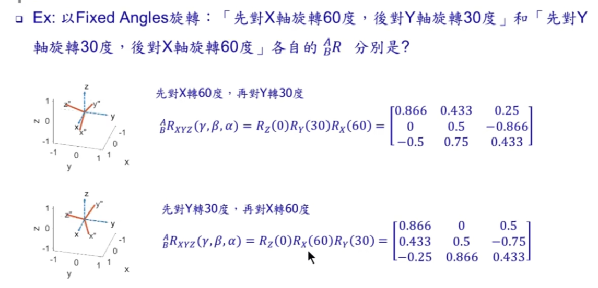

#### 示例

若先绕固定 \(X\) 轴旋转 \(60^\circ\)，再绕固定 \(Y\) 轴旋转 \(30^\circ\)，则：

$$
{}^A_BR
=
R_Z(0)R_Y(30^\circ)R_X(60^\circ)
$$

得到：

$$
{}^A_BR=
\begin{bmatrix}
0.866&0.433&0.25\\
0&0.5&-0.866\\
-0.5&0.75&0.433
\end{bmatrix}
$$

如果改变旋转顺序，先绕 \(Y\) 轴旋转 \(30^\circ\)，再绕 \(X\) 轴旋转 \(60^\circ\)，则：

$$
{}^A_BR
=
R_Z(0)R_X(60^\circ)R_Y(30^\circ)
$$

得到：

$$
{}^A_BR=
\begin{bmatrix}
0.866&0&0.5\\
0.433&0.5&-0.75\\
-0.25&0.866&0.433
\end{bmatrix}
$$

两者结果不同，因此：

$$
\boxed{R_XR_Y\neq R_YR_X}
$$

即旋转矩阵一般**不满足交换律**。

#### 由旋转矩阵推算旋转角——以 X-Y-Z 为例

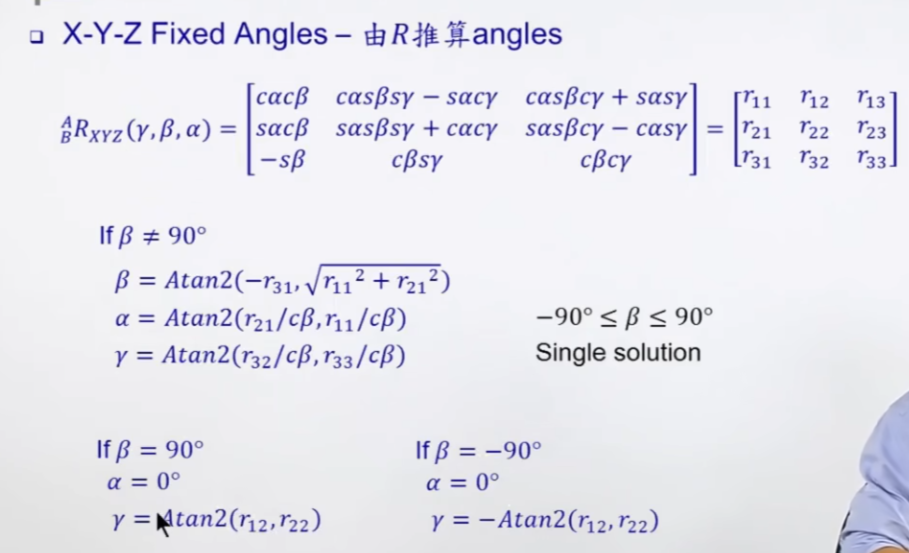

若已知：

$$
{}^A_BR_{XYZ}
=
\begin{bmatrix}
r_{11}&r_{12}&r_{13}\\
r_{21}&r_{22}&r_{23}\\
r_{31}&r_{32}&r_{33}
\end{bmatrix}
$$

并且：

$$
{}^A_BR_{XYZ}
=
\begin{bmatrix}
c_\alpha c_\beta &
c_\alpha s_\beta s_\gamma-s_\alpha c_\gamma &
c_\alpha s_\beta c_\gamma+s_\alpha s_\gamma
\\
s_\alpha c_\beta &
s_\alpha s_\beta s_\gamma+c_\alpha c_\gamma &
s_\alpha s_\beta c_\gamma-c_\alpha s_\gamma
\\
-s_\beta &
c_\beta s_\gamma &
c_\beta c_\gamma
\end{bmatrix}
$$

当：

$$
\cos\beta\neq0
$$

即：

$$
\beta\neq\pm90^\circ
$$

时，可由旋转矩阵求得：

$$
\beta
=
\operatorname{Atan2}
\left(
-r_{31},
\sqrt{r_{11}^2+r_{21}^2}
\right)
$$

$$
\alpha
=
\operatorname{Atan2}
\left(
\frac{r_{21}}{\cos\beta},
\frac{r_{11}}{\cos\beta}
\right)
$$

$$
\gamma
=
\operatorname{Atan2}
\left(
\frac{r_{32}}{\cos\beta},
\frac{r_{33}}{\cos\beta}
\right)
$$

在课程采用的范围：

$$
-90^\circ\leq\beta\leq90^\circ
$$

下得到一个解。

当：

$$
\beta=90^\circ
$$

时，可令：

$$
\alpha=0^\circ
$$

并计算：

$$
\gamma
=
\operatorname{Atan2}(r_{12},r_{22})
$$

当：

$$
\beta=-90^\circ
$$

时，可令：

$$
\alpha=0^\circ
$$

并计算：

$$
\gamma
=
-\operatorname{Atan2}(r_{12},r_{22})
$$

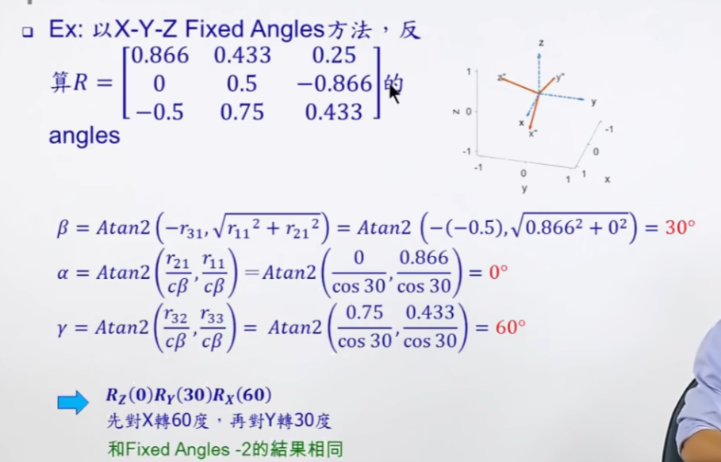

#### 示例

已知：

$$
R=
\begin{bmatrix}
0.866&0.433&0.25\\
0&0.5&-0.866\\
-0.5&0.75&0.433
\end{bmatrix}
$$

首先计算：

$$
\beta
=
\operatorname{Atan2}
\left(
-r_{31},
\sqrt{r_{11}^2+r_{21}^2}
\right)
$$

$$
=
\operatorname{Atan2}
\left(
0.5,
\sqrt{0.866^2+0^2}
\right)
=30^\circ
$$

再计算：

$$
\alpha
=
\operatorname{Atan2}
\left(
\frac{r_{21}}{\cos\beta},
\frac{r_{11}}{\cos\beta}
\right)
=0^\circ
$$

以及：

$$
\gamma
=
\operatorname{Atan2}
\left(
\frac{r_{32}}{\cos\beta},
\frac{r_{33}}{\cos\beta}
\right)
=60^\circ
$$

因此：

$$
R
=
R_Z(0^\circ)
R_Y(30^\circ)
R_X(60^\circ)
$$

表示：

> 先绕固定 \(X\) 轴旋转 \(60^\circ\)，再绕固定 \(Y\) 轴旋转 \(30^\circ\)。

### Euler Angles——对已经旋转的轴旋转

Euler Angles 与 Fixed Angles 最大的区别在于：

- Fixed Angles：后续始终绕**原始固定坐标轴**旋转。
- Euler Angles：后续绕**已经随着刚体转动后的坐标轴**旋转。

因此 Euler Angles 的旋转轴本身也会随着前一次旋转发生改变。

#### 由旋转角推算旋转矩阵——以 Z-Y-X 为例

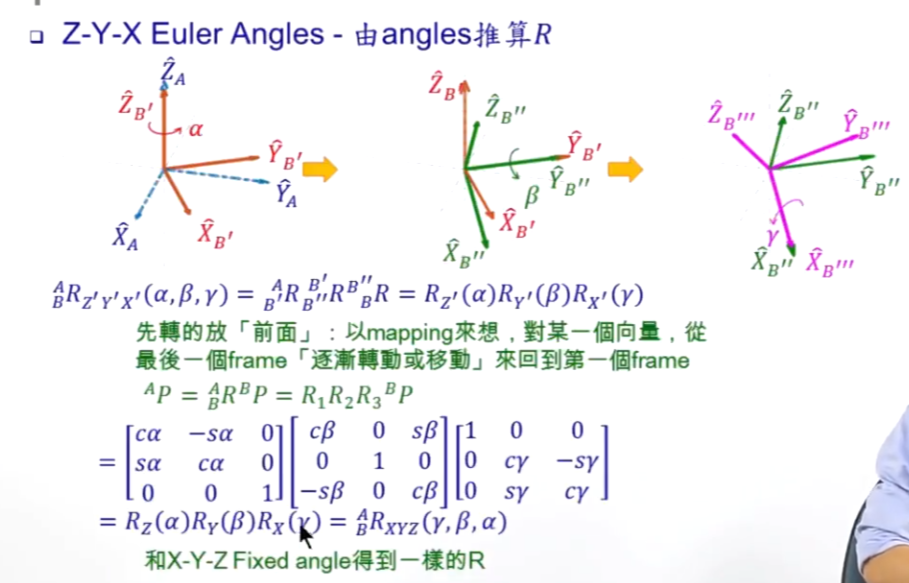

假设依次：

1. 绕当前 \(Z\) 轴旋转 \(\alpha\)
2. 绕旋转后的 \(Y\) 轴旋转 \(\beta\)
3. 绕再次旋转后的 \(X\) 轴旋转 \(\gamma\)

则：

$$
{}^A_BR_{Z'Y'X'}(\alpha,\beta,\gamma)
=
R_{Z'}(\alpha)
R_{Y'}(\beta)
R_{X'}(\gamma)
$$

其最终旋转矩阵可以写为：

$$
{}^A_BR
=
R_Z(\alpha)
R_Y(\beta)
R_X(\gamma)
$$

因此：

$$
\boxed{
R_{Z'Y'X'}(\alpha,\beta,\gamma)
=
R_{XYZ}(\gamma,\beta,\alpha)
}
$$

即：

> Z-Y-X Euler Angles 与反向顺序的 X-Y-Z Fixed Angles 可以得到相同的最终旋转矩阵。

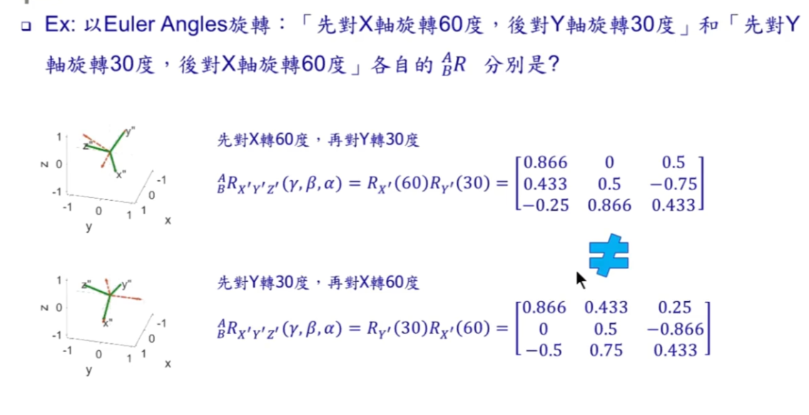

#### 示例

对于 Euler Angles，旋转顺序同样不能任意交换。

先绕当前 \(X\) 轴旋转 \(60^\circ\)，再绕新的 \(Y\) 轴旋转 \(30^\circ\)：

$$
R_{X'}(60^\circ)R_{Y'}(30^\circ)
=
\begin{bmatrix}
0.866&0&0.5\\
0.433&0.5&-0.75\\
-0.25&0.866&0.433
\end{bmatrix}
$$

而先绕当前 \(Y\) 轴旋转 \(30^\circ\)，再绕新的 \(X\) 轴旋转 \(60^\circ\)：

$$
R_{Y'}(30^\circ)R_{X'}(60^\circ)
=
\begin{bmatrix}
0.866&0.433&0.25\\
0&0.5&-0.866\\
-0.5&0.75&0.433
\end{bmatrix}
$$

二者结果不同。

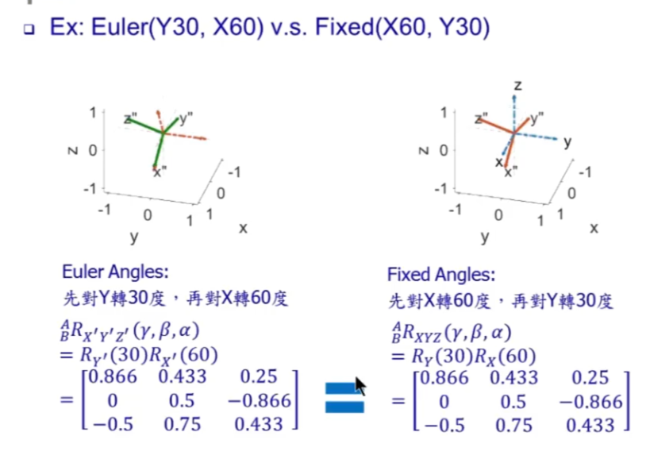

但是：

Euler Angles：

$$
Y'30^\circ
\rightarrow
X'60^\circ
$$

得到：

$$
R_{Y'}(30^\circ)R_{X'}(60^\circ)
$$

而 Fixed Angles：

$$
X60^\circ
\rightarrow
Y30^\circ
$$

得到：

$$
R_Y(30^\circ)R_X(60^\circ)
$$

二者最终旋转矩阵相同：

$$
\boxed{
R_{Y'}(30^\circ)R_{X'}(60^\circ)
=
R_Y(30^\circ)R_X(60^\circ)
}
$$

这体现了 Euler Angles 与 Fixed Angles 之间的对应关系。

#### 由旋转矩阵推算旋转角——以 Z-Y-Z 为例

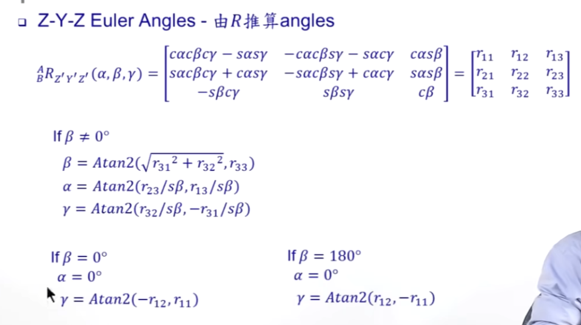

对于 Z-Y-Z Euler Angles：

$$
{}^A_BR_{Z'Y'Z'}(\alpha,\beta,\gamma)
=
\begin{bmatrix}
c_\alpha c_\beta c_\gamma-s_\alpha s_\gamma
&
-c_\alpha c_\beta s_\gamma-s_\alpha c_\gamma
&
c_\alpha s_\beta
\\
s_\alpha c_\beta c_\gamma+c_\alpha s_\gamma
&
-s_\alpha c_\beta s_\gamma+c_\alpha c_\gamma
&
s_\alpha s_\beta
\\
-s_\beta c_\gamma
&
s_\beta s_\gamma
&
c_\beta
\end{bmatrix}
$$

令：

$$
R=
\begin{bmatrix}
r_{11}&r_{12}&r_{13}\\
r_{21}&r_{22}&r_{23}\\
r_{31}&r_{32}&r_{33}
\end{bmatrix}
$$

当：

$$
\sin\beta\neq0
$$

时：

$$
\beta
=
\operatorname{Atan2}
\left(
\sqrt{r_{31}^2+r_{32}^2},
r_{33}
\right)
$$

$$
\alpha
=
\operatorname{Atan2}
\left(
\frac{r_{23}}{\sin\beta},
\frac{r_{13}}{\sin\beta}
\right)
$$

$$
\gamma
=
\operatorname{Atan2}
\left(
\frac{r_{32}}{\sin\beta},
-\frac{r_{31}}{\sin\beta}
\right)
$$

当：

$$
\beta=0^\circ
$$

时，可以令：

$$
\alpha=0^\circ
$$

并计算：

$$
\gamma
=
\operatorname{Atan2}(-r_{12},r_{11})
$$

当：

$$
\beta=180^\circ
$$

时，可以令：

$$
\alpha=0^\circ
$$

并计算：

$$
\gamma
=
\operatorname{Atan2}(r_{12},-r_{11})
$$

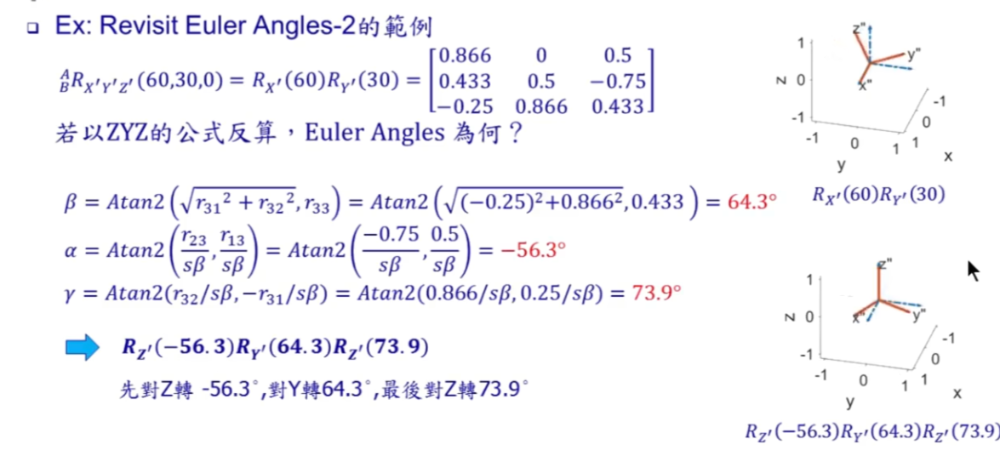

#### 示例

已知旋转矩阵：

$$
R=
\begin{bmatrix}
0.866&0&0.5\\
0.433&0.5&-0.75\\
-0.25&0.866&0.433
\end{bmatrix}
$$

若使用 Z-Y-Z Euler Angles 反算：

$$
\beta
=
\operatorname{Atan2}
\left(
\sqrt{(-0.25)^2+0.866^2},
0.433
\right)
=64.3^\circ
$$

$$
\alpha=-56.3^\circ
$$

$$
\gamma=73.9^\circ
$$

因此同一个旋转矩阵还可以表示成：

$$
R
=
R_{Z'}(-56.3^\circ)
R_{Y'}(64.3^\circ)
R_{Z'}(73.9^\circ)
$$

> 同一个最终位姿，可以使用不同的旋转轴顺序和不同的旋转角度进行描述。

#### 总结

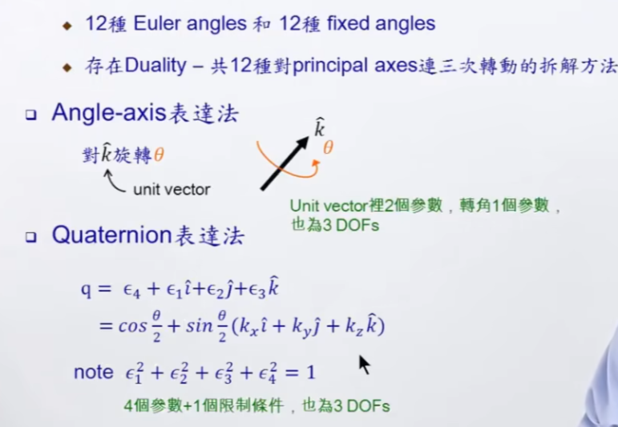

Rotation 有 3 个自由度。

Fixed Angles 和 Euler Angles 都可以通过三次绕主轴旋转来描述一般的空间旋转，并且二者之间存在对应关系。

除了 Fixed Angles 和 Euler Angles 外，还可以使用其他方法描述旋转。

##### Angle-Axis 表示法

使用一个单位向量：

$$
\hat{k}
$$

描述旋转轴，再使用旋转角：

$$
\theta
$$

描述绕该轴旋转的角度。

其中：

- 单位向量 \(\hat{k}\) 提供 2 个独立参数。
- 旋转角 \(\theta\) 提供 1 个参数。

因此总共仍然是：

$$
\boxed{3\text{ DOFs}}
$$

##### Quaternion 表示法

Quaternion 可以写为：

$$
q
=
\epsilon_4
+
\epsilon_1 i
+
\epsilon_2 j
+
\epsilon_3 k
$$

也可以由 Angle-Axis 表示为：

$$
q
=
\cos\frac{\theta}{2}
+
\sin\frac{\theta}{2}
\left(
k_x i+k_y j+k_z k
\right)
$$

并满足：

$$
\epsilon_1^2+\epsilon_2^2+\epsilon_3^2+\epsilon_4^2=1
$$

Quaternion 使用 4 个参数，但具有 1 个限制条件，因此仍对应：

$$
\boxed{3\text{ DOFs}}
$$

## 2.2 Transformation Matrix

### Mapping

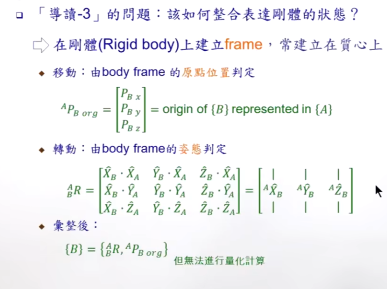

为了完整描述一个刚体的空间状态，可以在刚体上建立一个 body frame \(\{B\}\)。

刚体的位置由 \(\{B\}\) 原点在参考坐标系 \(\{A\}\) 中的位置表示：

$$
{}^AP_{B\,org}
=
\begin{bmatrix}
P_{Bx}\\
P_{By}\\
P_{Bz}
\end{bmatrix}
$$

刚体的姿态由旋转矩阵：

$$
{}^A_BR
$$

表示。

因此可以将刚体状态写成：

$$
\{B\}
=
\left\{
{}^A_BR,\,
{}^AP_{B\,org}
\right\}
$$

也就是：

> 位置向量负责描述移动，旋转矩阵负责描述转动。

但若只把二者分开表示，不方便直接进行统一的矩阵运算。

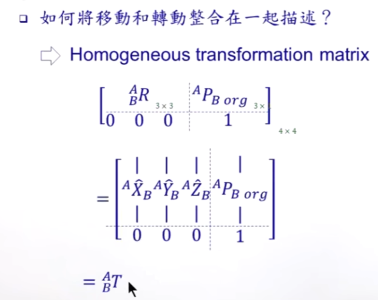

因此将旋转矩阵和平移向量整合为一个 **Homogeneous Transformation Matrix（齐次变换矩阵）**：

$$
{}^A_BT
=
\begin{bmatrix}
{}^A_BR & {}^AP_{B\,org}\\
0&0&0&1
\end{bmatrix}
$$

也可以写成：

$$
{}^A_BT
=
\begin{bmatrix}
|&|&|&|\\
{}^A\hat X_B&
{}^A\hat Y_B&
{}^A\hat Z_B&
{}^AP_{B\,org}\\
|&|&|&|\\
0&0&0&1
\end{bmatrix}
$$

其中：

- 前三列描述 \(\{B\}\) 三根坐标轴在 \(\{A\}\) 中的方向。
- 第四列描述 \(\{B\}\) 原点在 \(\{A\}\) 中的位置。

因此一个 \(4\times4\) 的齐次变换矩阵可以同时描述：

$$
\boxed{\text{Rotation + Translation}}
$$

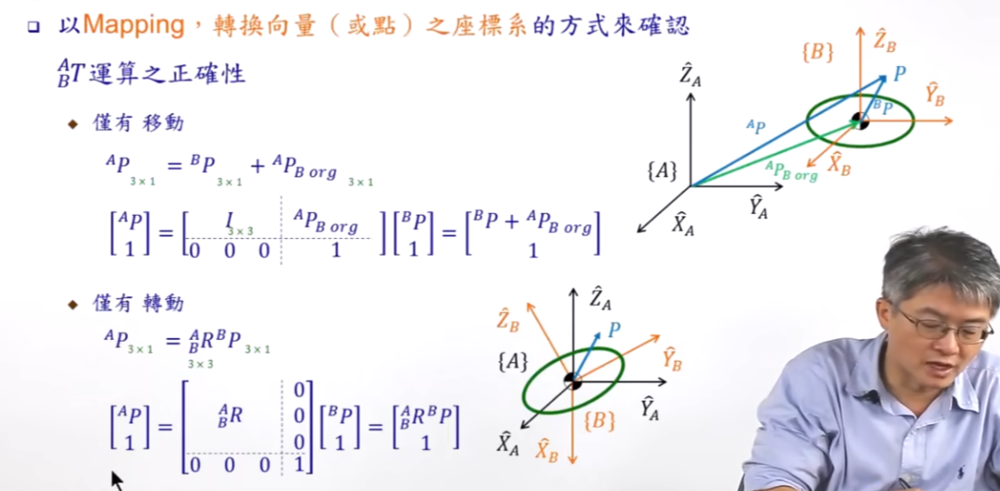

齐次变换矩阵可以用于将同一个点在不同坐标系之间进行 Mapping。

若只有平移：

$$
{}^AP
=
{}^BP
+
{}^AP_{B\,org}
$$

写成齐次形式：

$$
\begin{bmatrix}
{}^AP\\
1
\end{bmatrix}
=
\begin{bmatrix}
I&{}^AP_{B\,org}\\
0&0&0&1
\end{bmatrix}
\begin{bmatrix}
{}^BP\\
1
\end{bmatrix}
$$

若只有旋转：

$$
{}^AP
=
{}^A_BR\,{}^BP
$$

写成齐次形式：

$$
\begin{bmatrix}
{}^AP\\
1
\end{bmatrix}
=
\begin{bmatrix}
{}^A_BR&0\\
0&0&0&1
\end{bmatrix}
\begin{bmatrix}
{}^BP\\
1
\end{bmatrix}
$$

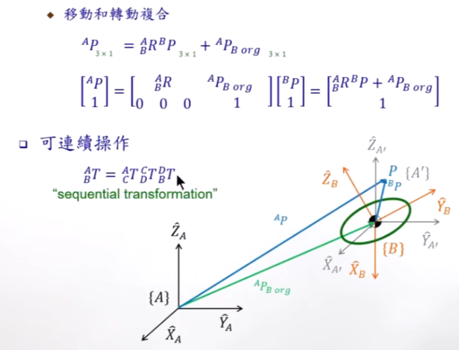

当同时存在移动和转动时：

$$
{}^AP
=
{}^A_BR\,{}^BP
+
{}^AP_{B\,org}
$$

写成齐次形式：

$$
\boxed{
\begin{bmatrix}
{}^AP\\
1
\end{bmatrix}
=
{}^A_BT
\begin{bmatrix}
{}^BP\\
1
\end{bmatrix}
}
$$

即：

$$
\begin{bmatrix}
{}^AP\\
1
\end{bmatrix}
=
\begin{bmatrix}
{}^A_BR&{}^AP_{B\,org}\\
0&0&0&1
\end{bmatrix}
\begin{bmatrix}
{}^BP\\
1
\end{bmatrix}
$$

Mapping 的本质是：

> 点本身没有改变，只是把同一个点从一个坐标系中的表达转换成另一个坐标系中的表达。

齐次变换还可以连续进行。

例如：

$$
{}^AP
=
{}^A_BT\,{}^BP
$$

又有：

$$
{}^BP
=
{}^B_CT\,{}^CP
$$

因此：

$$
{}^AP
=
{}^A_BT\,{}^B_CT\,{}^CP
$$

于是：

$$
\boxed{
{}^A_CT
=
{}^A_BT\,{}^B_CT
}
$$

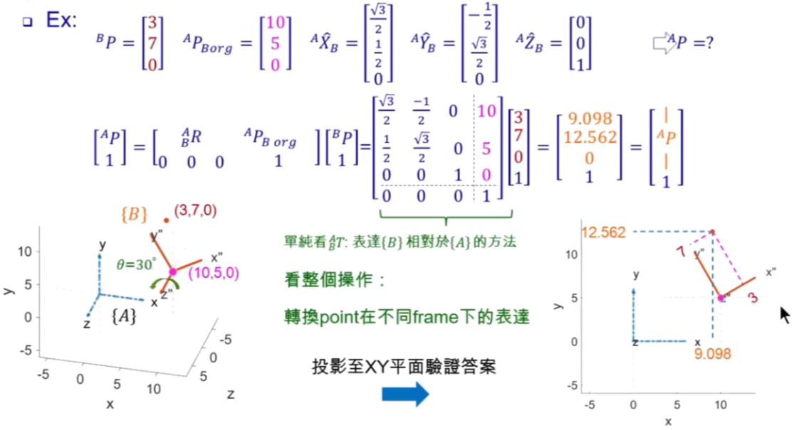

#### 示例

已知：

$$
{}^BP=
\begin{bmatrix}
3\\
7\\
0
\end{bmatrix}
$$

$$
{}^AP_{B\,org}
=
\begin{bmatrix}
10\\
5\\
0
\end{bmatrix}
$$

并且：

$$
{}^A\hat X_B
=
\begin{bmatrix}
\frac{\sqrt3}{2}\\
\frac12\\
0
\end{bmatrix}
$$

$$
{}^A\hat Y_B
=
\begin{bmatrix}
-\frac12\\
\frac{\sqrt3}{2}\\
0
\end{bmatrix}
$$

$$
{}^A\hat Z_B
=
\begin{bmatrix}
0\\
0\\
1
\end{bmatrix}
$$

因此：

$$
{}^A_BT
=
\begin{bmatrix}
\frac{\sqrt3}{2}&-\frac12&0&10\\
\frac12&\frac{\sqrt3}{2}&0&5\\
0&0&1&0\\
0&0&0&1
\end{bmatrix}
$$

进行 Mapping：

$$
\begin{bmatrix}
{}^AP\\
1
\end{bmatrix}
=
{}^A_BT
\begin{bmatrix}
{}^BP\\
1
\end{bmatrix}
$$

得到：

$$
\begin{bmatrix}
{}^AP\\
1
\end{bmatrix}
=
\begin{bmatrix}
9.098\\
12.562\\
0\\
1
\end{bmatrix}
$$

因此：

$$
{}^AP
=
\begin{bmatrix}
9.098\\
12.562\\
0
\end{bmatrix}
$$

### Operators

除了作为 Mapping 以外，齐次变换矩阵还可以作为 **Operator**，直接对同一个坐标系中的点或向量进行移动和转动。

#### 对向量或点的正向操作

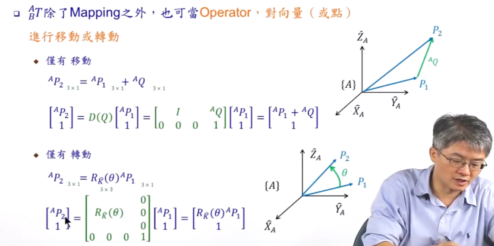

若只有移动：

$$
{}^AP_2
=
{}^AP_1
+
{}^AQ
$$

对应：

$$
\begin{bmatrix}
{}^AP_2\\
1
\end{bmatrix}
=
\begin{bmatrix}
I&{}^AQ\\
0&0&0&1
\end{bmatrix}
\begin{bmatrix}
{}^AP_1\\
1
\end{bmatrix}
$$

若只有转动：

$$
{}^AP_2
=
R_{\hat K}(\theta)\,{}^AP_1
$$

对应：

$$
\begin{bmatrix}
{}^AP_2\\
1
\end{bmatrix}
=
\begin{bmatrix}
R_{\hat K}(\theta)&0\\
0&0&0&1
\end{bmatrix}
\begin{bmatrix}
{}^AP_1\\
1
\end{bmatrix}
$$

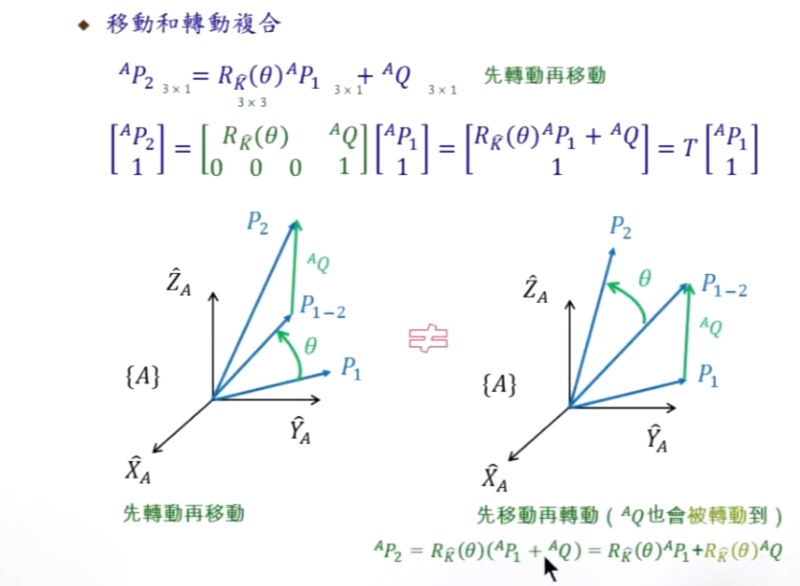

若先转动，再移动：

$$
{}^AP_2
=
R_{\hat K}(\theta)\,{}^AP_1
+
{}^AQ
$$

因此：

$$
\begin{bmatrix}
{}^AP_2\\
1
\end{bmatrix}
=
\begin{bmatrix}
R_{\hat K}(\theta)&{}^AQ\\
0&0&0&1
\end{bmatrix}
\begin{bmatrix}
{}^AP_1\\
1
\end{bmatrix}
$$

需要注意：

> 先转动再移动与先移动再转动一般不相同。

先转动再移动：

$$
{}^AP_2
=
R_{\hat K}(\theta)\,{}^AP_1
+
{}^AQ
$$

而先移动再转动：

$$
{}^AP_2
=
R_{\hat K}(\theta)
\left(
{}^AP_1+{}^AQ
\right)
$$

即：

$$
{}^AP_2
=
R_{\hat K}(\theta)\,{}^AP_1
+
R_{\hat K}(\theta)\,{}^AQ
$$

因此两者通常不相等。

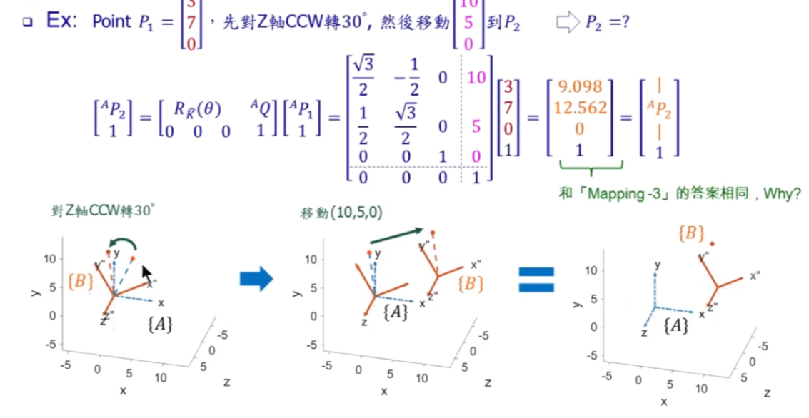

#### 示例

已知：

$$
P_1=
\begin{bmatrix}
3\\
7\\
0
\end{bmatrix}
$$

先绕 \(Z\) 轴逆时针旋转 \(30^\circ\)，然后平移：

$$
Q=
\begin{bmatrix}
10\\
5\\
0
\end{bmatrix}
$$

则：

$$
\begin{bmatrix}
P_2\\
1
\end{bmatrix}
=
\begin{bmatrix}
R_Z(30^\circ)&Q\\
0&0&0&1
\end{bmatrix}
\begin{bmatrix}
P_1\\
1
\end{bmatrix}
$$

得到：

$$
P_2=
\begin{bmatrix}
9.098\\
12.562\\
0
\end{bmatrix}
$$

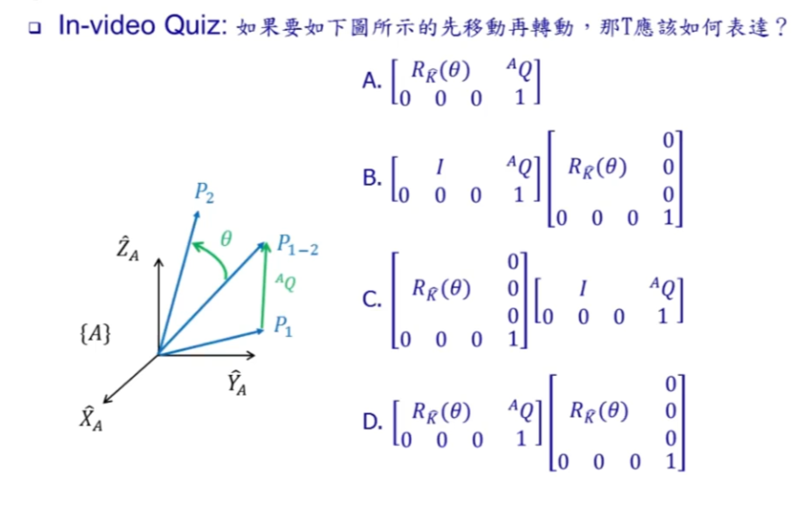

如果操作顺序变为：

> 先移动，再转动

则需要分别写出两个 transformation matrix，并按照实际作用顺序从右往左相乘：

$$
T
=
\begin{bmatrix}
R_{\hat K}(\theta)&0\\
0&0&0&1
\end{bmatrix}
\begin{bmatrix}
I&{}^AQ\\
0&0&0&1
\end{bmatrix}
$$

因此图中对应 **C**。

#### 对 frame 的反向操作

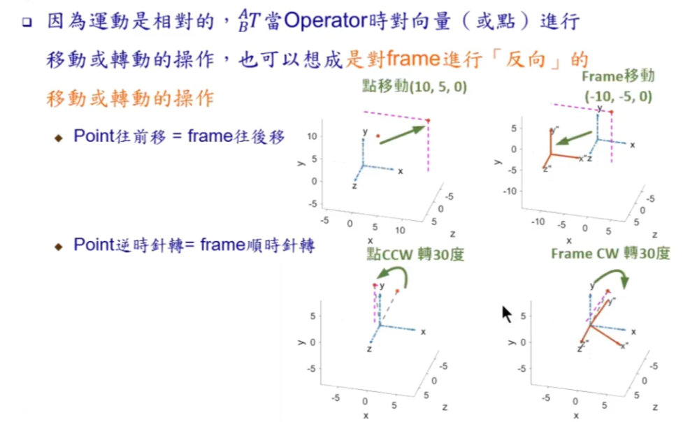

由于运动是相对的，当齐次变换矩阵作为 Operator 对点进行操作时，也可以反过来理解为对参考 frame 做相反方向的运动。

例如：

- Point 向前移动，等价于 frame 向后移动。
- Point 逆时针旋转，等价于 frame 顺时针旋转。

因此：

$$
\boxed{
\text{Point 正向运动}
\Longleftrightarrow
\text{Frame 反向运动}
}
$$

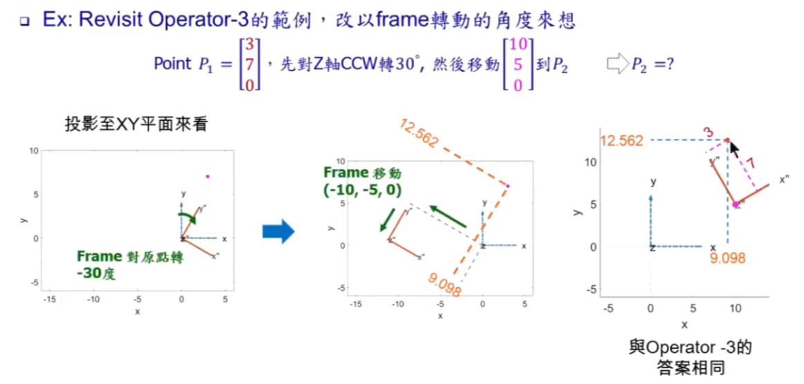

#### 示例

原问题为：

$$
P_1=
\begin{bmatrix}
3\\
7\\
0
\end{bmatrix}
$$

点先绕 \(Z\) 轴逆时针旋转 \(30^\circ\)，然后再平移：

$$
\begin{bmatrix}
10\\
5\\
0
\end{bmatrix}
$$

也可以反过来从 frame 的角度理解：

- Point 逆时针转 \(30^\circ\)，对应 frame 顺时针转 \(30^\circ\)。
- Point 平移 \((10,5,0)\)，对应 frame 反向移动 \((-10,-5,0)\)。

最终得到的点坐标与前面的 Operator 方法相同。

### 小结

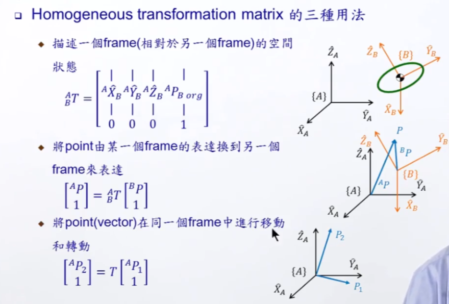

Homogeneous Transformation Matrix 主要具有三种用途。

#### 1. 描述一个 frame 相对于另一个 frame 的空间状态

$$
{}^A_BT
=
\begin{bmatrix}
{}^A_BR&{}^AP_{B\,org}\\
0&0&0&1
\end{bmatrix}
$$

其中同时包含：

- Rotation
- Translation

#### 2. Mapping

将同一个点从某一个 frame 的表达转换到另一个 frame：

$$
\boxed{
\begin{bmatrix}
{}^AP\\
1
\end{bmatrix}
=
{}^A_BT
\begin{bmatrix}
{}^BP\\
1
\end{bmatrix}
}
$$

点本身不发生运动，只改变坐标表达。

#### 3. Operator

对同一个 frame 中的点或向量进行真正的移动和转动：

$$
\boxed{
\begin{bmatrix}
P_2\\
1
\end{bmatrix}
=
T
\begin{bmatrix}
P_1\\
1
\end{bmatrix}
}
$$

### 运算法则

#### 连续运算

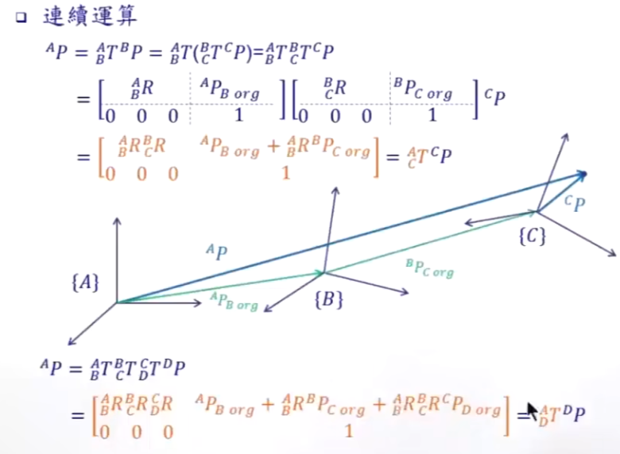

若：

$$
{}^AP
=
{}^A_BT\,{}^BP
$$

并且：

$$
{}^BP
=
{}^B_CT\,{}^CP
$$

则：

$$
{}^AP
=
{}^A_BT\,{}^B_CT\,{}^CP
$$

因此：

$$
\boxed{
{}^A_CT
=
{}^A_BT\,{}^B_CT
}
$$

连续变换时，中间 frame 可以依次连接起来：

$$
{}^A_DT
=
{}^A_BT
{}^B_CT
{}^C_DT
$$

因此可以将复杂的 frame 关系拆解为多个简单的相邻坐标变换。

#### 逆矩阵

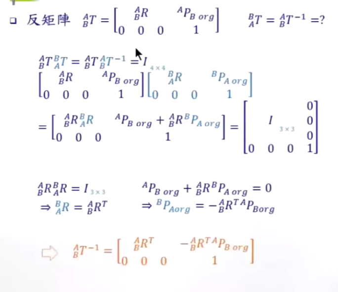

已知：

$$
{}^A_BT
=
\begin{bmatrix}
{}^A_BR&{}^AP_{B\,org}\\
0&0&0&1
\end{bmatrix}
$$

反方向的坐标变换为：

$$
{}^B_AT
=
\left({}^A_BT\right)^{-1}
$$

因为：

$$
{}^B_AR
=
\left({}^A_BR\right)^T
$$

所以齐次变换矩阵的逆为：

$$
\boxed{
\left({}^A_BT\right)^{-1}
=
\begin{bmatrix}
\left({}^A_BR\right)^T
&
-\left({}^A_BR\right)^T{}^AP_{B\,org}
\\
0&0&0&1
\end{bmatrix}
}
$$

因此：

$$
\boxed{
{}^B_AT
=
\begin{bmatrix}
{}^B_AR&
{}^BP_{A\,org}\\
0&0&0&1
\end{bmatrix}
}
$$

其中：

$$
{}^B_AR
=
\left({}^A_BR\right)^T
$$

$$
{}^BP_{A\,org}
=
-
\left({}^A_BR\right)^T
{}^AP_{B\,org}
$$

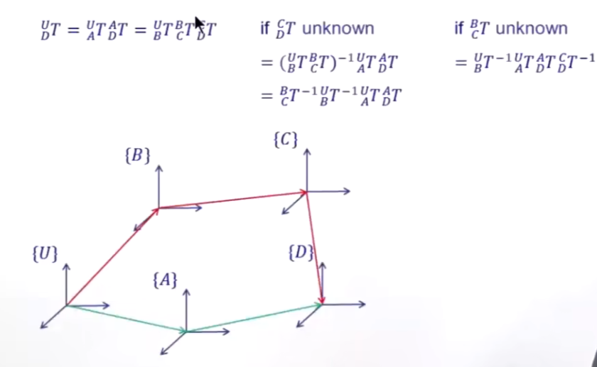

在多个 frame 的连续关系中，如果某一个 transformation matrix 未知，可以利用：

- 连续变换
- 矩阵逆

求出未知项。

例如：

$$
{}^U_DT
=
{}^U_BT
{}^B_CT
{}^C_DT
$$

若 \({}^C_DT\) 未知，则可以将已知矩阵移到另一侧并取逆。

核心原则是：

> 沿着 frame 的连接方向使用 \(T\)，反方向则使用 \(T^{-1}\)。

#### 总结

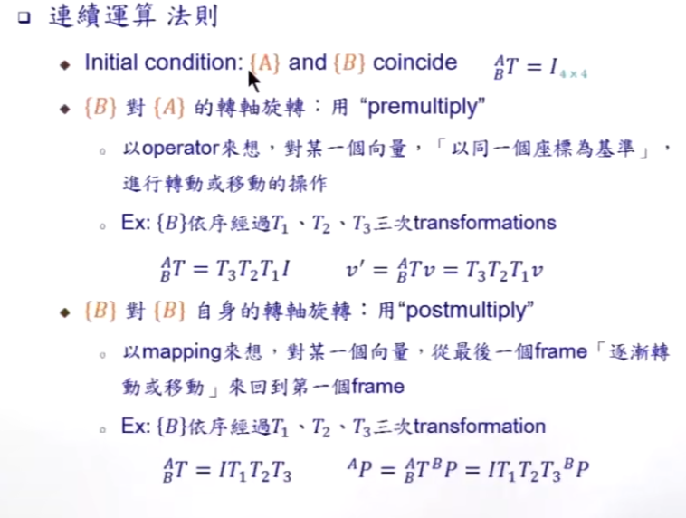

连续变换时，还需要根据旋转轴属于固定 frame 还是当前 body frame，决定新的 transformation 应该乘在左边还是右边。

初始时：

$$
\{A\}
\text{ 与 }
\{B\}
\text{ 重合}
$$

因此：

$$
{}^A_BT=I_{4\times4}
$$

##### Premultiply

如果 \(\{B\}\) 是绕**固定参考坐标系 \(\{A\}\) 的轴**进行旋转或移动，则新的 transformation 放在左侧：

$$
\boxed{
T_{\text{new}}
=
T_iT_{\text{old}}
}
$$

例如依次进行：

$$
T_1,\quad T_2,\quad T_3
$$

则：

$$
{}^A_BT
=
T_3T_2T_1I
$$

即：

$$
\boxed{\text{固定轴变换}\rightarrow\text{Premultiply}}
$$

##### Postmultiply

如果 \(\{B\}\) 绕**自身当前坐标系的轴**进行旋转或移动，则新的 transformation 放在右侧：

$$
\boxed{
T_{\text{new}}
=
T_{\text{old}}T_i
}
$$

若依次进行：

$$
T_1,\quad T_2,\quad T_3
$$

则：

$$
{}^A_BT
=
IT_1T_2T_3
$$

即：

$$
\boxed{\text{自身轴变换}\rightarrow\text{Postmultiply}}
$$

因此可以记为：

$$
\boxed{
\begin{aligned}
\text{绕固定 frame 的轴} &\rightarrow \text{Premultiply}\\
\text{绕当前自身 frame 的轴} &\rightarrow \text{Postmultiply}
\end{aligned}
}
$$