# 第一章 DDPM
## 1.1 概述
### 扩散模型的内涵
扩散模型是一类生成模型。它通过不断向真实数据中加入噪声，使数据逐渐变成随机噪声；然后学习逆向去噪过程，从随机噪声中逐步生成新的数据。

### 扩散模型的流程
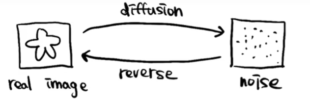
真实图像经过前向扩散逐渐加入噪声，变成近似纯噪声的样本；模型再通过逆向过程逐步去除噪声，恢复出图像。
1. 训练过程：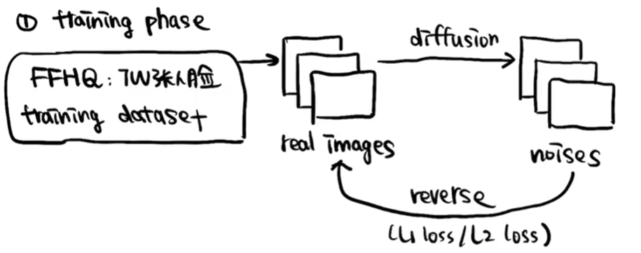
训练时，模型将训练数据加噪得到噪声图像，再学习如何通过逆向过程进行去噪，并根据去噪结果计算损失、更新模型参数。
2. 推理过程：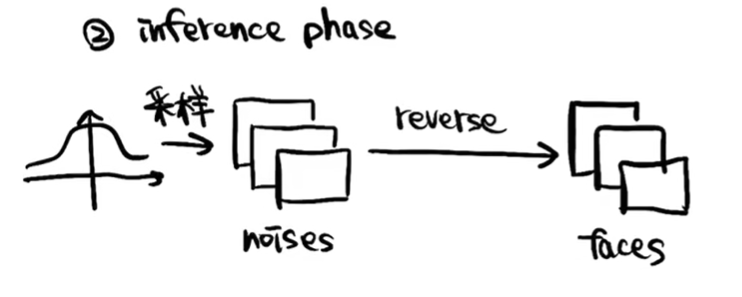
推理时，从随机噪声开始，经过多次逆向去噪，最终生成新的图像。图中以人脸作为生成结果示例。

### 意义——与 GAN 模型的对比
1. GAN 模型的流程：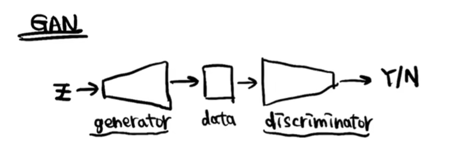
生成器接收随机噪声并生成数据，判别器判断输入数据是真实数据还是生成数据。
2. GAN 模型需要同时训练生成器和判别器，两者之间存在对抗关系，因此训练过程可能不稳定，也容易出现模式崩溃等问题。扩散模型通常基于去噪损失进行训练，训练过程相对稳定，但推理时需要多步去噪，生成速度较慢。

##　1.2 扩散（diffusion）阶段
### 整体过程
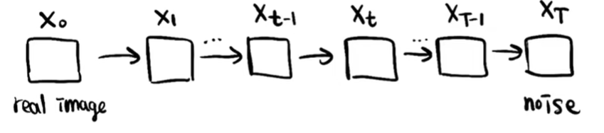
前向扩散过程从真实图像 $x_0$ 开始，在每个时间步逐渐加入少量高斯噪声，得到 $x_1,x_2,\cdots,x_T$。当时间步 $T$ 足够大时，$x_T$ 基本变成纯噪声。
### 单步过程
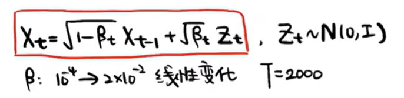  
单步加噪可以表示为：

$$x_t=\sqrt{1-\beta_t}x_{t-1}+\sqrt{\beta_t}z_t,\qquad z_t\sim\mathcal{N}(0,I)$$

其中，$\beta_t$ 表示第 $t$ 步加入的噪声强度，通常取较小的值。

这是一个递推表达式，但是我们希望能够直接使用 $x_0$ 计算出任意时刻的 $x_t$，从而不必逐步执行前面的加噪过程。
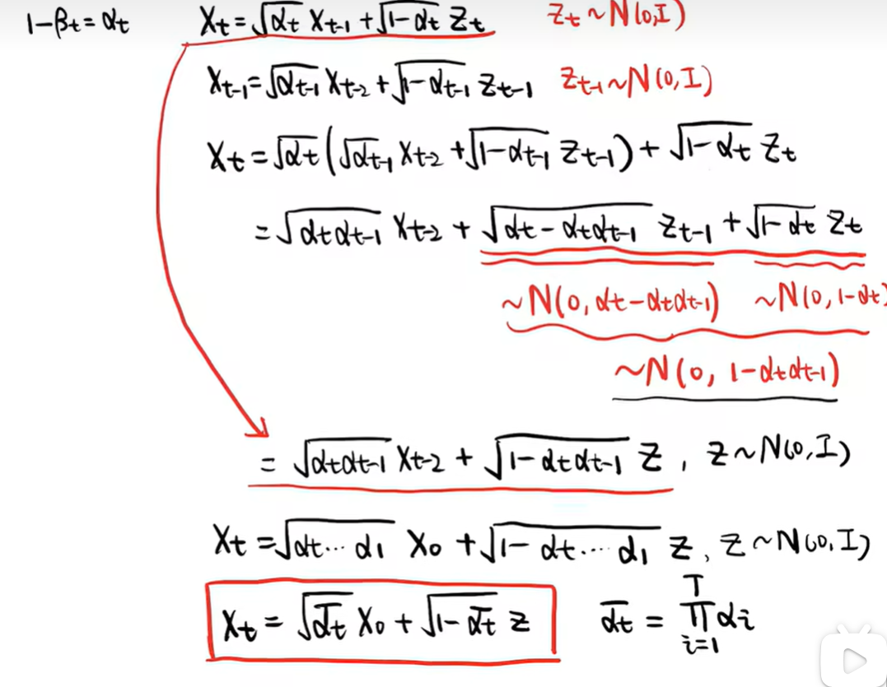
令 $\alpha_t=1-\beta_t$，并定义 $\bar{\alpha}_t=\prod_{i=1}^{t}\alpha_i$，经过推导可以得到：

$$x_t=\sqrt{\bar{\alpha}_t}x_0+\sqrt{1-\bar{\alpha}_t}z,\qquad z\sim\mathcal{N}(0,I)$$

这说明 $x_t$ 可以由原始图像 $x_0$ 和一次采样得到的高斯噪声 $z$ 直接计算。
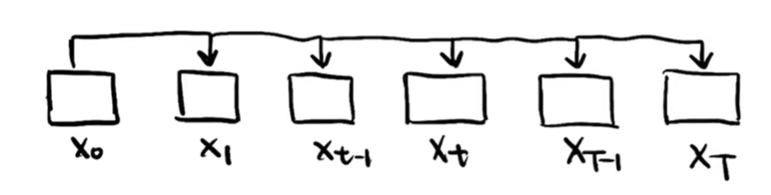
因此，在训练时可以直接随机选择一个时间步 $t$，将噪声添加到 $x_0$ 得到 $x_t$，不需要真的按照 $x_0\rightarrow x_1\rightarrow\cdots\rightarrow x_t$ 的顺序计算。
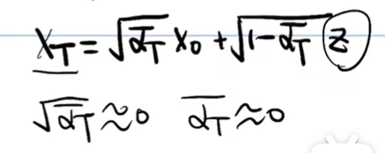
随着 $t$ 增大，$\bar{\alpha}_t$ 逐渐减小，原始图像所占的比例越来越低，噪声所占的比例越来越高；当 $t=T$ 时，$x_T$ 近似为纯噪声。
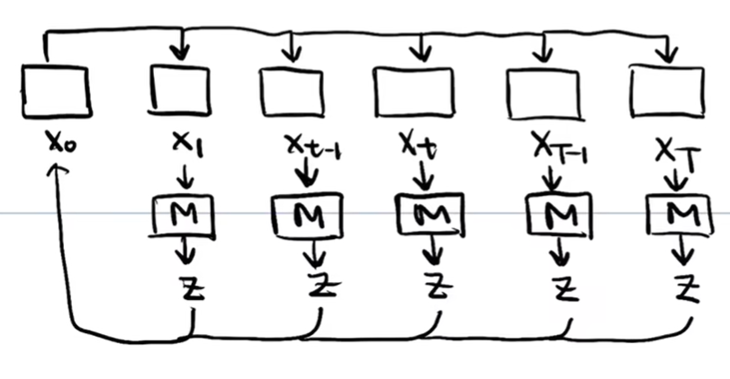
训练时，随机选取一个时间步，将对应的带噪图像 $x_t$ 输入模型，模型学习预测其中加入的噪声 $z$。
### 总结
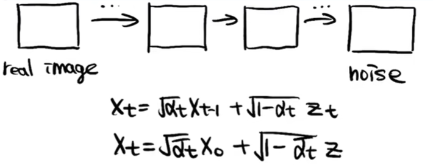

## 1.3 重建（reverse）阶段
### 导入案例
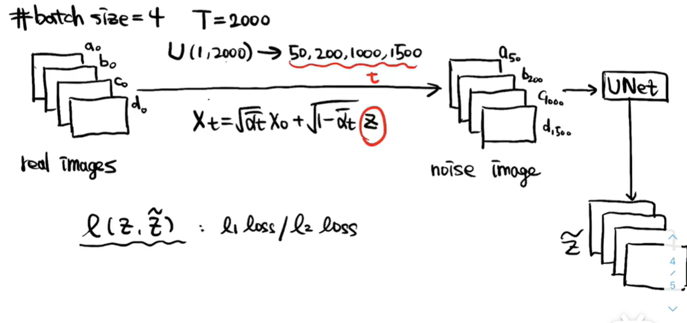
训练时，从真实图像 $x_0$ 中随机选择一个时间步 $t$，根据前向扩散公式得到带噪图像 $x_t$，再将 $x_t$ 和 $t$ 输入 U-Net，预测所加入的噪声 $\tilde{z}$，并与真实噪声 $z$ 计算损失。
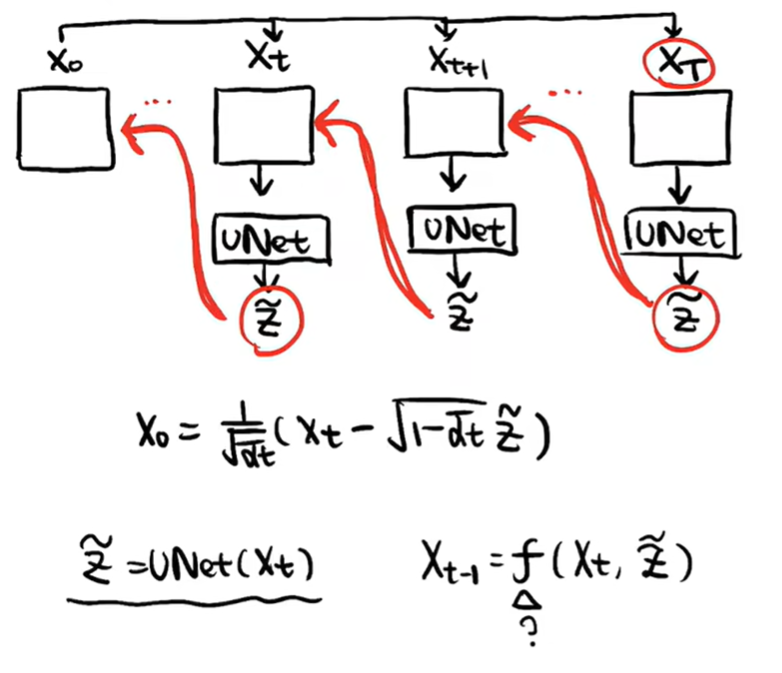
推理时，从纯噪声 $x_T$ 开始。U-Net 在每一步预测当前图像中的噪声，并利用预测结果计算上一步的图像，重复这一过程直到得到 $x_0$。

### 关键目标
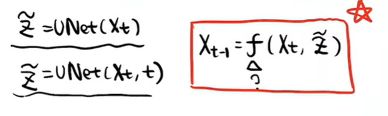
因此，重建阶段的关键是：先由 U-Net 预测噪声 $\tilde{z}=\mathrm{UNet}(x_t,t)$，再根据 $x_t$ 和预测噪声计算 $x_{t-1}$。

### 推导过程 
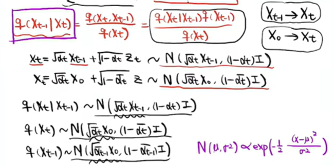
为了得到逆向过程，需要求出 $q(x_{t-1}|x_t)$。由于前向过程和高斯噪声有关，可以利用高斯分布的性质，将其写成一个正态分布。
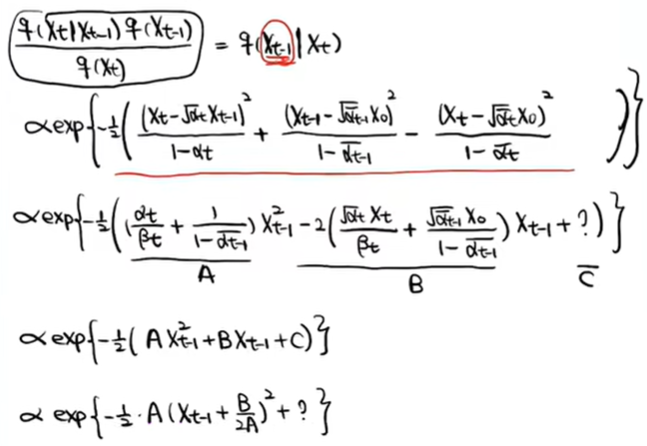
通过配方，可以得到该正态分布的均值和方差。
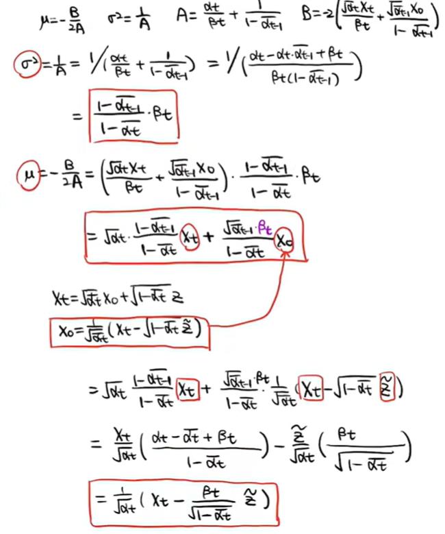 
最终，逆向过程的均值可以写成当前样本 $x_t$ 与模型预测噪声 $\tilde{z}$ 的函数。

### 总结公式
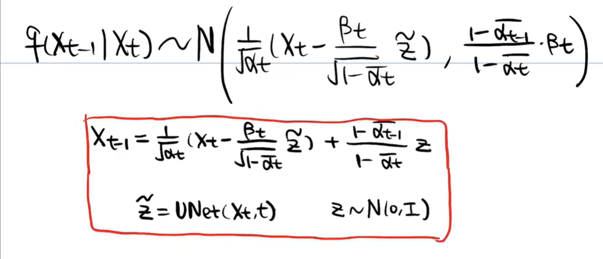
其中，$\tilde{z}=\mathrm{UNet}(x_t,t)$，$z\sim\mathcal{N}(0,I)$。需要注意，方差项中还包含 $\beta_t$：

$$\sigma_t^2=\frac{1-\bar{\alpha}_{t-1}}{1-\bar{\alpha}_t}\beta_t$$

每一步都要重新采样一个随机噪声 $z$；在最后一步通常不再添加噪声，直接得到生成结果。

### 重建阶段的整体过程
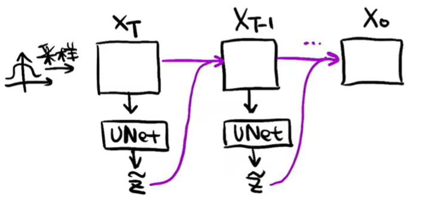
从 $x_T$ 开始，模型按照 $x_T\rightarrow x_{T-1}\rightarrow\cdots\rightarrow x_0$ 的顺序逐步去噪。所有时间步通常共用同一个 U-Net，只是输入的时间步 $t$ 不同。

## 1.4 本章总结
### 总结
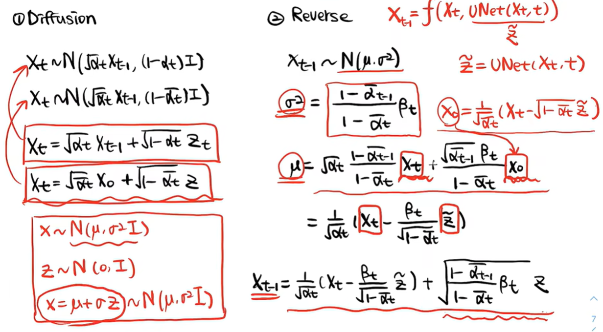

## 1.5 代码
### 注意事项
* 只讲关键部分的代码实现，可以一定程度上减轻复现或者读懂代码的难度
* 深入理解 DDPM
* DDPM 不算是很基础的深度学习内容，需要有基本的深度学习的知识和 Pytorch 的使用经验

### 参考代码

* 比较简单的玩具代码：
  [https://github.com/abarankab/DDPM](https://github.com/abarankab/DDPM)

* 比较实用的代码：
  [https://github.com/Janspiry/Image-Super-Resolution-via-Iterative-Refinement](https://github.com/Janspiry/Image-Super-Resolution-via-Iterative-Refinement)

### 为了复现 DDPM，我们需要考虑哪些细节问题？
1. alpha、beta 这些预先定义好的参数怎么获得？
2. 训练过程？
3. 推理过程？
4. UNet 的结构？

# 第二章 具体应用（论文阅读）
## 2.1 SR3
### 摘要
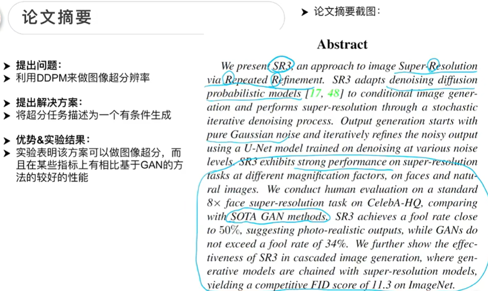
SR3（Super-Resolution via Repeated Refinement）将图像超分辨率任务看作一个有条件的生成问题：以低分辨率图像（LR）作为条件，利用扩散模型逐步生成对应的高分辨率图像（HR）。

### 相关工作
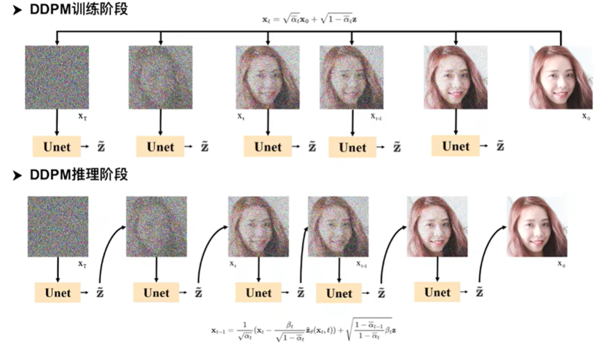
上图对比了 DDPM 的训练阶段和推理阶段。训练时，对高分辨率图像逐步加噪，并让 U-Net 预测噪声；推理时，从噪声开始，反复调用 U-Net 进行去噪，最终得到高分辨率结果。

### 提出方法
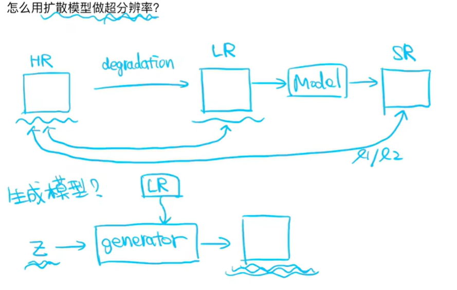
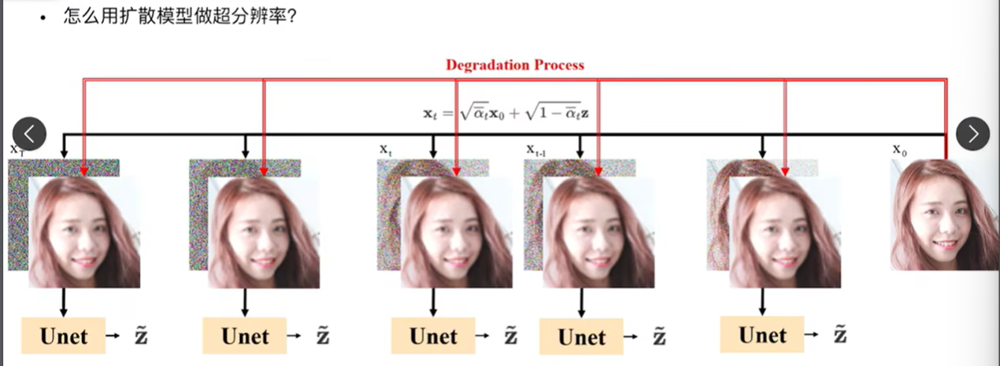
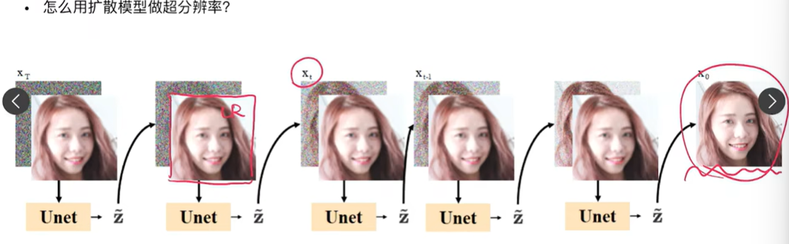
超分辨率的基本流程是：先将高分辨率图像退化为低分辨率图像，再以低分辨率图像作为条件进行重建。与普通 DDPM 不同，SR3 的 U-Net 不仅接收带噪图像，**还接收对应的低分辨率图像**。

图表示：**低分辨率图像**在整个逆向去噪过程中始终作为条件输入，模型从噪声开始不断细化图像，最终生成与低分辨率图像内容一致、但分辨率更高的结果。

* 改动1：
  **将 LR 作为 condition**，与带噪图像 $x_t$ 在通道维度上拼接：

  $$x_{\mathrm{input}}=\operatorname{Concat}(x_t,x_{\mathrm{LR}})$$

  对于 RGB 图像，U-Net 的输入通道数为 $3+3=6$，输出通道数为 $3$。这样模型在去噪时可以参考低分辨率图像中的结构和内容。

* 改动2：
  不再直接使用离散的 $\bar{\alpha}_t$，而是在相邻噪声水平之间进行均匀采样：

  $$\text{noise\_level}\sim\mathcal{U}(\bar{\alpha}_{t-1},\bar{\alpha}_t)$$

  这样训练时使用的噪声强度更加连续，模型能够适应更多不同的噪声水平。

* 改动3：
  不再直接将离散时间步 $t$ 输入 U-Net，而是输入改动 2 中采样得到的连续噪声水平 $\text{noise\_level}$：

  $$\mathrm{U\text{-}Net}(x_{\mathrm{input}},\text{noise\_level})$$

  $\text{noise\_level}$ 直接反映当前图像所包含的噪声强度，比单独使用时间步 $t$ 更适合描述连续的噪声状态。

## 2.2 Deblur
### 摘要
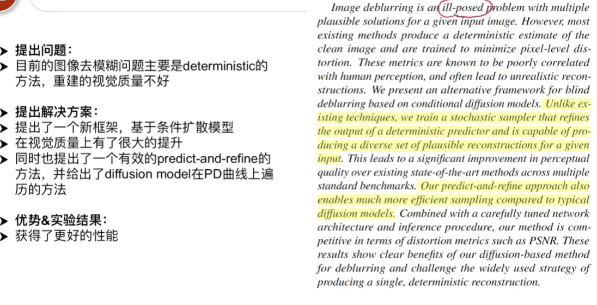
本文研究盲图像去模糊问题。由于同一张模糊图像可能对应多个合理的清晰结果，作者使用条件扩散模型生成多样化的重建结果，并提出 predict-and-refine 策略提升采样效率和感知质量。

### 相关工作
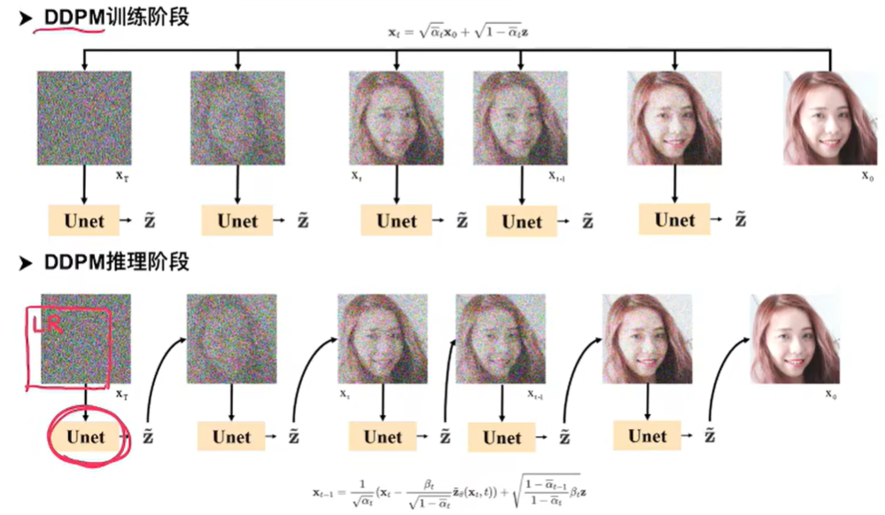
与 SR3 类似，去模糊模型将退化图像作为条件输入。训练时对清晰图像加噪，并让 U-Net 学习预测噪声；推理时则从噪声开始，在模糊图像的约束下逐步恢复清晰图像。
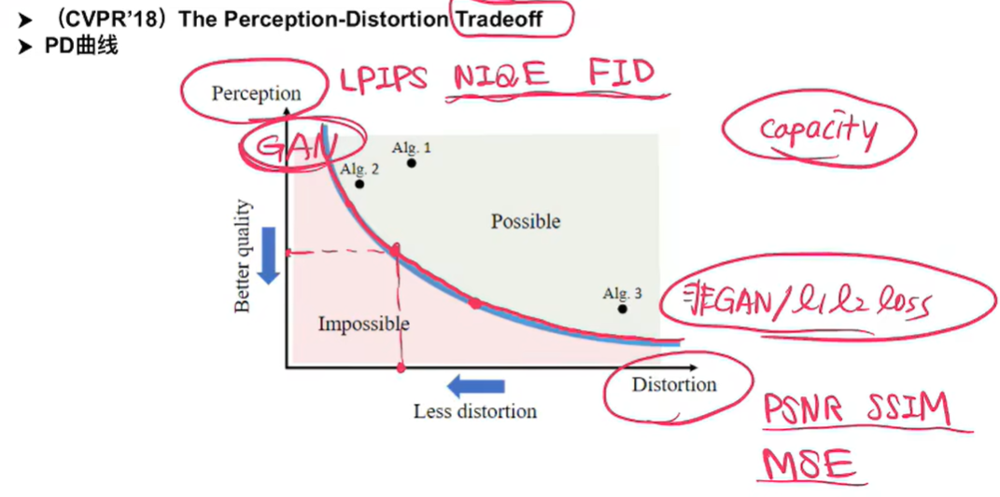
图中展示了感知质量（Perception）和失真程度（Distortion）之间的权衡，这种关系通常称为 Perception-Distortion（PD）Trade-off。失真程度主要衡量重建图像与真实图像在像素或结构上的差异，失真越小通常表示与真实图像越接近；感知质量则更关注图像是否清晰、自然以及是否符合人类视觉习惯。

常见指标包括：

* PSNR（Peak Signal-to-Noise Ratio，峰值信噪比）：根据像素之间的均方误差计算，PSNR 越高表示像素级失真越小。
* SSIM（Structural Similarity Index，结构相似性）：从亮度、对比度和结构等方面比较两张图像，通常比 PSNR 更能反映图像结构的相似程度。
* LPIPS（Learned Perceptual Image Patch Similarity）：利用深度网络提取的特征来衡量感知差异，更接近人类对图像相似性的判断，LPIPS 越低通常表示感知上越相似。
* NIQE（Natural Image Quality Evaluator）：一种不需要真实图像作为参考的无参考图像质量指标，用自然图像统计特征评价图像是否自然。
* FID（Fréchet Inception Distance）：主要用于比较两组图像的特征分布，常用于评价生成图像的质量和多样性，FID 越低通常越好。

当一个模糊图像对应多个合理的清晰结果时，仅使用 MSE、PSNR 等像素级损失，模型容易学习这些结果的平均值，生成的图像虽然失真较小，但可能显得平滑或模糊。扩散模型可以生成更加锐利、自然的细节，但生成结果不一定与某一张真实图像的每个像素完全一致，因此可能出现感知质量提高而 PSNR 下降的情况。这就是图中的感知质量与失真程度之间的权衡。

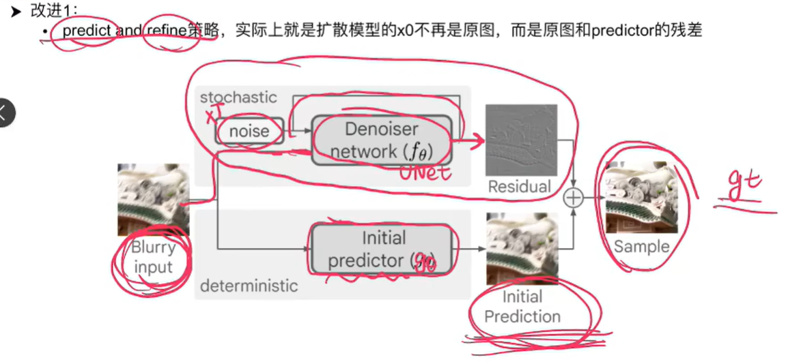
predict-and-refine 的思路是：先由一个确定性的 predictor 得到初始结果，再由较轻量的去噪网络预测**残差**并进行细化，最终**将初始结果和残差相加**得到清晰图像。

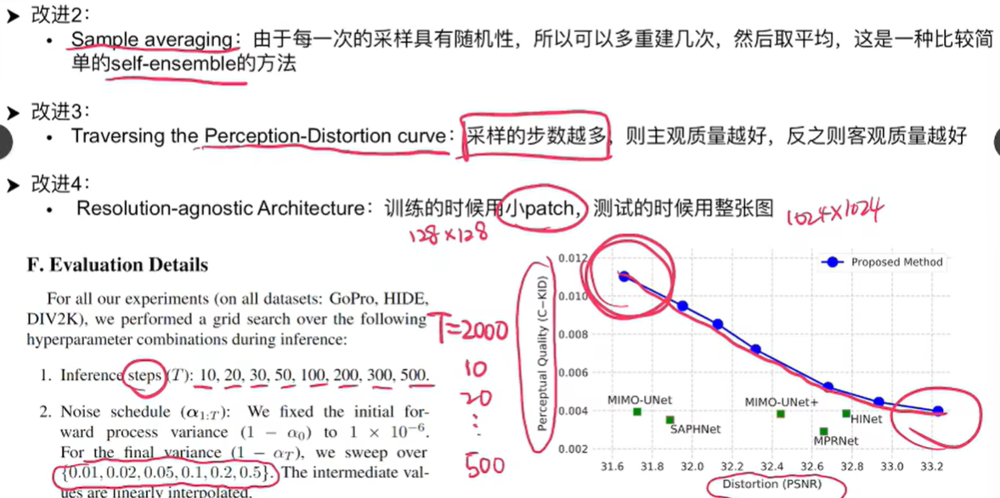
这与前面的 Perception-Distortion 曲线相对应：通过改变**逆向扩散的采样步数**，可以让模型**在同一个感知质量与失真的权衡范围内取得不同的结果**。一般来说，

1. 采样步数较少时，推理速度较快，但去噪和细节恢复不够充分，结果可能偏平滑；
2. 增加采样步数后，模型能够进行更充分的细化，通常有助于提升感知质量，但会增加推理时间。

也就是说，采样步数提供了一种沿 PD 曲线寻找不同工作点的方式。

由于扩散模型的每次采样都包含随机性，可以对同一个输入进行多次采样，再取结果的平均值，这种方法称为 sample averaging。它可以减小随机波动、提高结果稳定性，但平均操作也可能削弱不同样本中的锐利细节，因此需要在稳定性和感知质量之间进行权衡。

### 提出方法
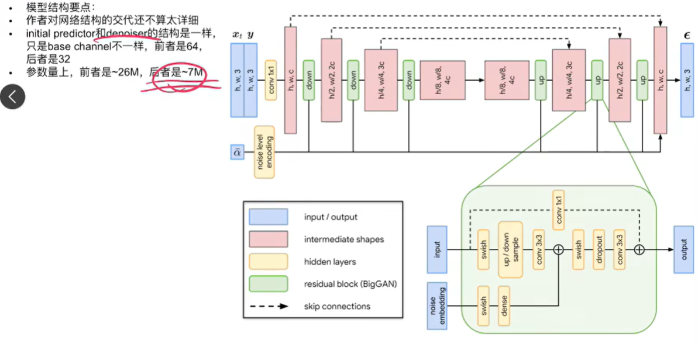
上图展示了模型的 U-Net 结构。输入包括退化图像、带噪图像以及噪声水平，网络通过下采样、残差模块、上采样和跳跃连接提取多尺度特征，最终预测噪声或残差。

### 文章总结
本文虽然相比 DDPM 改动不多，但是有一些思路可以借鉴：

  * predict-and-refine：由于每一步去噪做的非常简单，所以 denoiser 本身可能其实可以非常轻量
  * 通过改变采样步数，可以在感知质量和像素失真之间进行权衡：采样步数越多，通常感知质量越好；采样步数越少，推理速度越快。
  * 训练时使用小尺寸 patch，测试时可以使用整张图像，说明网络结构与输入分辨率无关，具有一定的灵活性。

核心要点：
1. 残差
2. 修改采样步数，寻求平衡

## 2.3 DDIM（Denoising Diffusion Implicit Models）
### 复习 DDPM
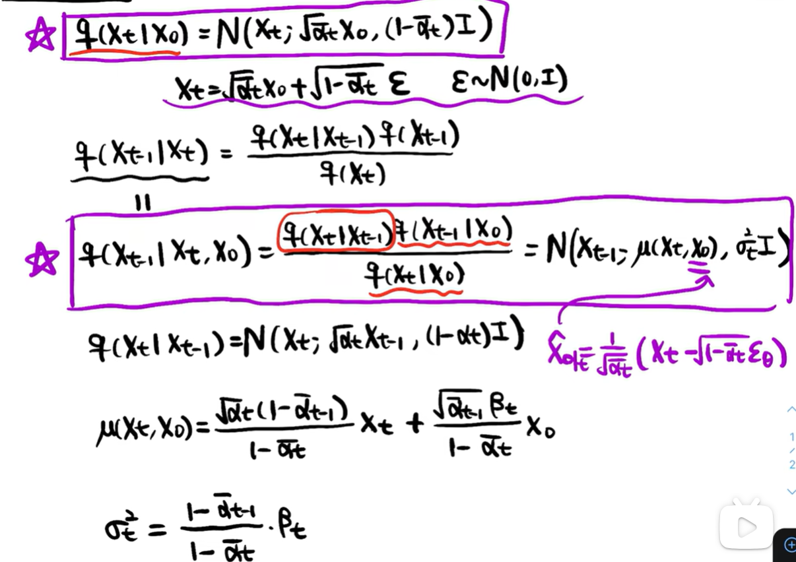
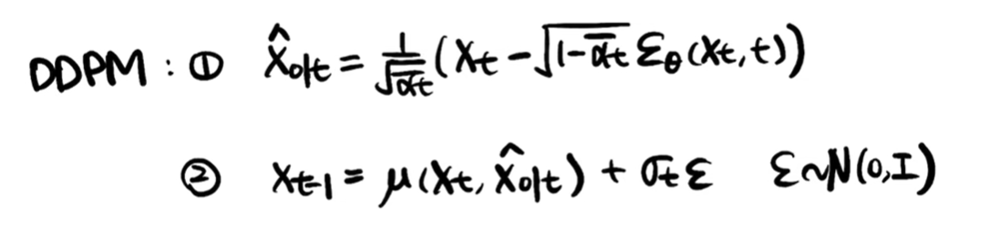
DDPM 在采样时通常按照 $T,T-1,\ldots,1$ 的顺序逐步去噪。模型先根据 $x_t$ 预测噪声 $\epsilon_\theta(x_t,t)$，再利用预测结果计算 $x_{t-1}$。除最后一步外，每一步通常还会加入随机噪声，因此同一个初始噪声可能生成不同的结果。

### DDIM 的创新点
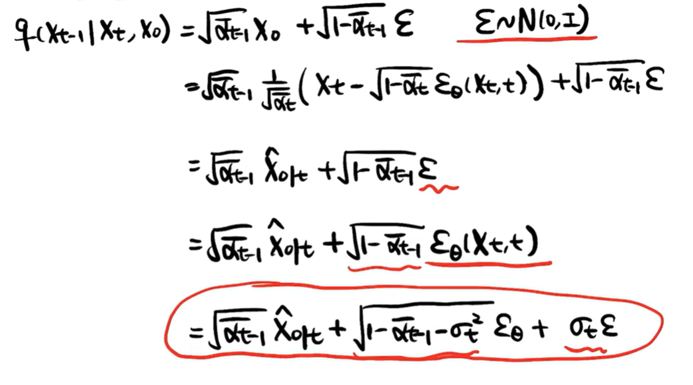
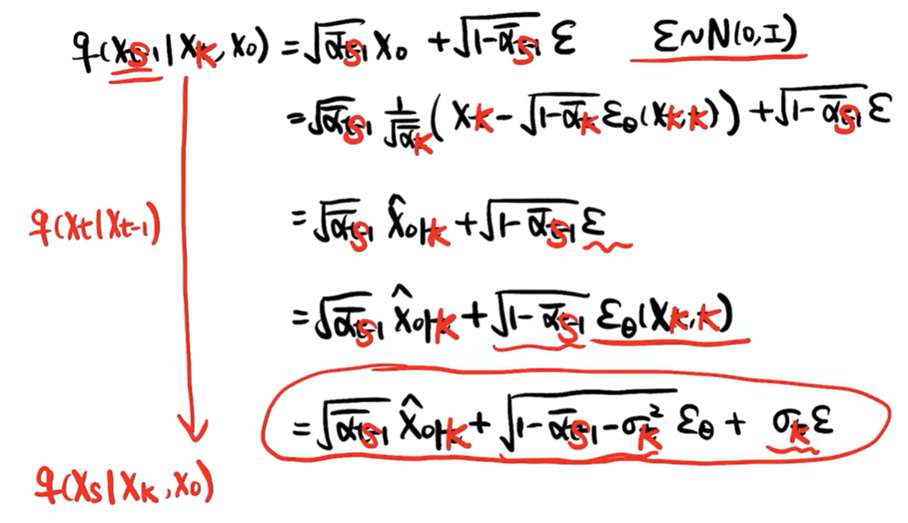
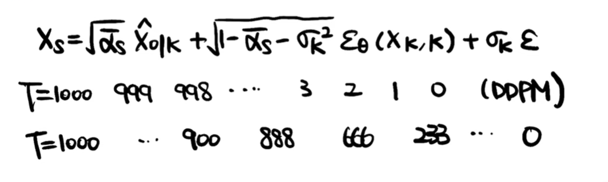
DDIM 保留了 DDPM 的训练方式，但重新定义了逆向采样过程。它不必使用所有的时间步，而是可以选择一个较短的时间步序列，例如 $1000\rightarrow900\rightarrow800\rightarrow\cdots\rightarrow0$，直接跨越若干中间状态，从而显著减少采样次数。这里的关键不是减少训练时间，而是减少推理时调用 U-Net 的次数。

DDIM 的一般采样公式可以写成：

$$x_s=\sqrt{\bar{\alpha}_s}\hat{x}_{0|t}+\sqrt{1-\bar{\alpha}_s-\sigma_t^2}\,\epsilon_\theta(x_t,t)+\sigma_t\epsilon$$

其中 $s<t$，表示从当前时刻 $t$ 跳到更早的时刻 $s$；$\epsilon\sim\mathcal{N}(0,I)$，$\sigma_t$ 控制采样过程中的随机性。当 $\sigma_t=0$ 时，不再额外加入随机噪声，采样过程是确定性的；当 $\sigma_t$ 取为 DDPM 对应的噪声大小时，可以得到与 DDPM 类似的随机采样过程。

### 深入探讨
#### 条件使用
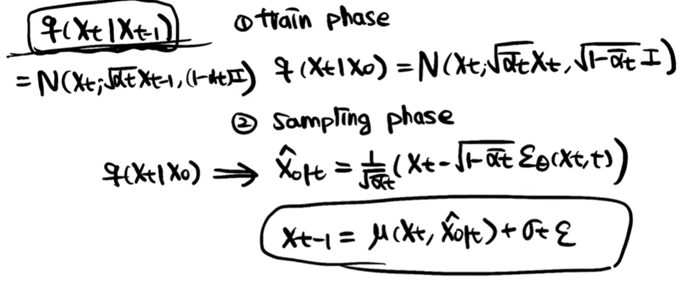
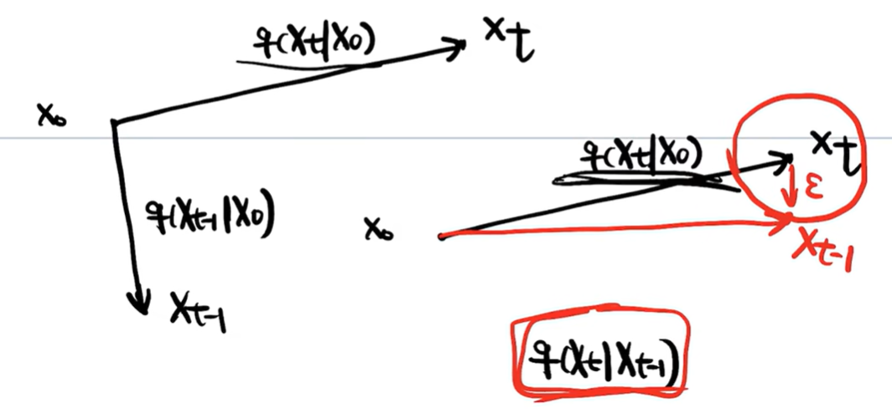

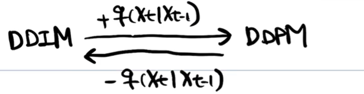
训练阶段仍然使用 DDPM 的目标：随机选择时间步 $t$，根据 $x_0$ 构造 $x_t$，并训练网络预测噪声 $\epsilon_\theta(x_t,t)$。因此，DDIM 通常不需要重新训练 DDPM 模型，就可以直接改变采样方式。这是 DDIM 最重要的实用价值之一：同一个模型可以根据需要选择 DDPM 或 DDIM 采样。

训练时可以直接利用 $q(x_t|x_0)$ 得到任意时刻的 $x_t$，而**不需要依次计算中间状态**；采样时则利用模型预测的噪声估计 $x_0$，再从 $x_t$ 跳到更早的状态 $x_s$。

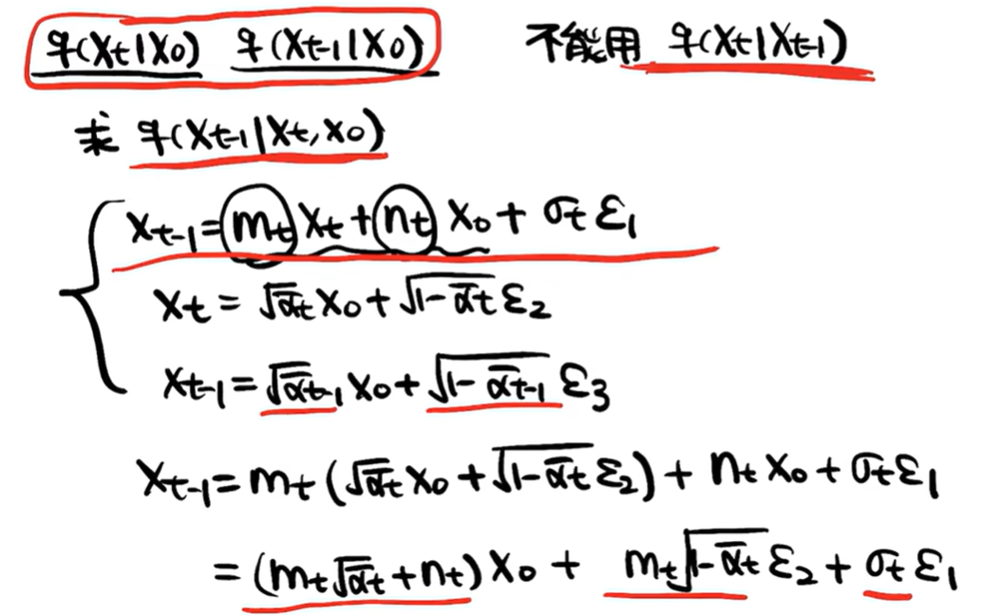
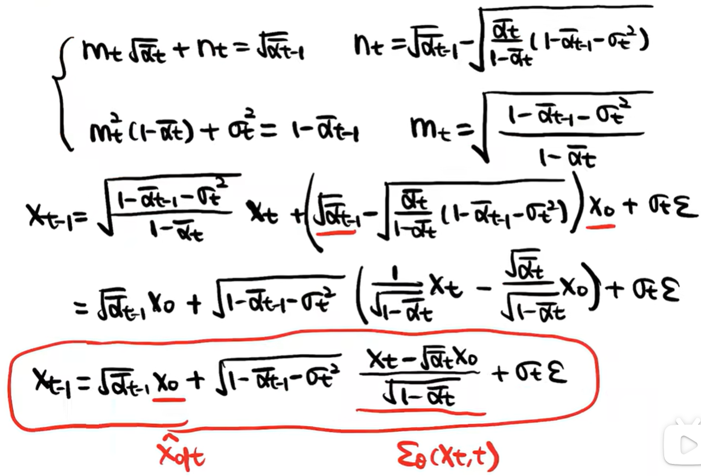
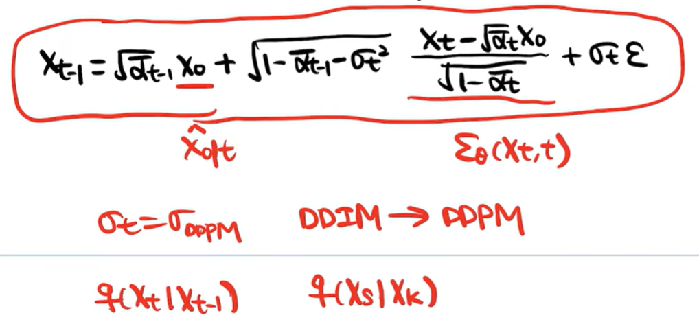
DDIM 采样的核心做法是先根据模型预测的噪声估计原始图像：

$$\hat{x}_{0|t}=\frac{x_t-\sqrt{1-\bar{\alpha}_t}\,\epsilon_\theta(x_t,t)}{\sqrt{\bar{\alpha}_t}}$$

然后利用 $\hat{x}_{0|t}$、当前状态 $x_t$ 和噪声预测值，直接计算较早时刻的 $x_s$。因此，采样不再局限于相邻时间步。需要注意，跳步并不是简单地丢弃中间结果，而是根据噪声调度重新计算跳步后的状态。

#### 训练目标 
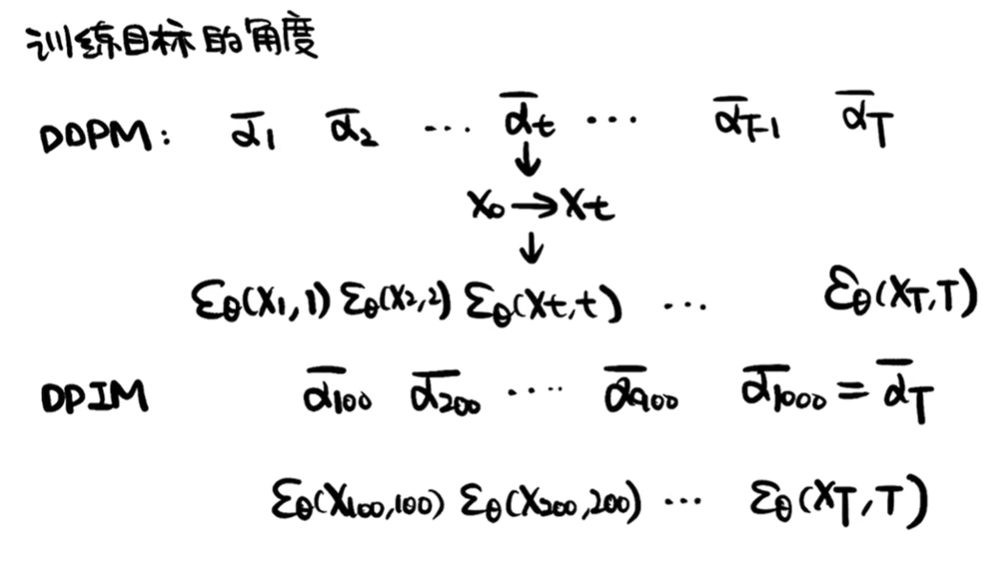
DDIM 与 DDPM 使用相同的噪声预测网络和训练目标，**主要区别在于采样过程**，而不是网络结构或损失函数。严格来说，DDIM 使用了一族与 DDPM 具有相同边缘分布的非马尔可夫过程；在实际使用中，可以理解为：模型训练不变，只改变推理时的去噪路径。

因此，DDIM 的优势是**可以用更少的采样步数生成图像**，同时通常保持较好的质量。代价是采样步数越少，近似误差可能越大；确定性采样虽然结果稳定、可复现，但生成多样性会受到影响。

#### 图示理解
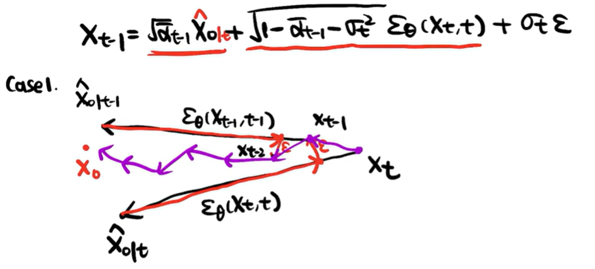
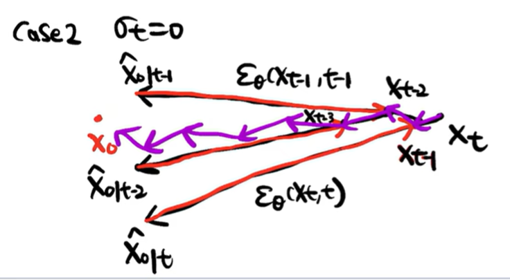
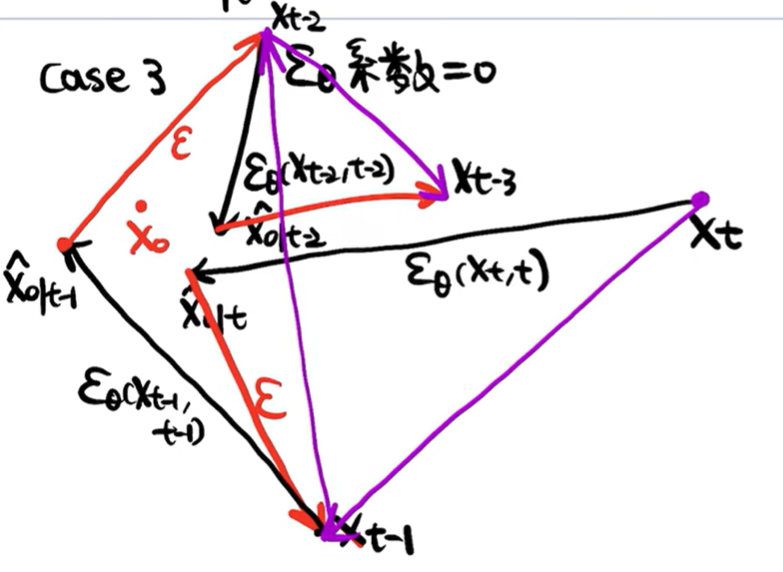
从几何角度看，DDPM 每一步都加入随机噪声，采样路径会产生随机扰动；DDIM 在 $\sigma_t=0$ 时不再加入随机噪声，同一个初始噪声会沿着确定的路径生成同一个结果。选择较少的时间步时，模型可以跨越多个中间状态直接更新，但每次更新的跨度更大，对模型预测的准确性要求也更高。

#### 常微分方程
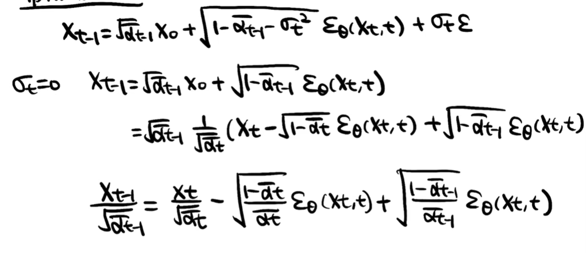
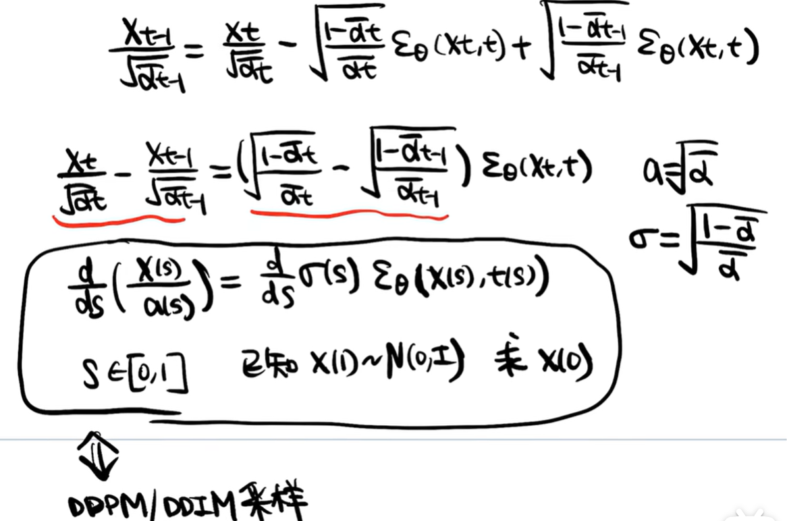
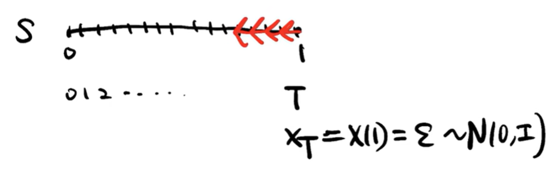
当采样步数足够密集时，确定性 DDIM 的离散更新可以看作某个常微分方程（ODE）的数值求解。将离散时间步连续化，记连续变量为 $s\in[0,1]$，模型预测的噪声决定了样本沿去噪轨迹变化的方向。

因此，DDIM 可以使用不同的数值积分方法和步长进行采样。采样步数越少，速度越快，但离散化误差可能增大；采样步数越多，轨迹近似越准确，但推理成本也越高。ODE 视角说明了 DDIM 为什么能够灵活地改变采样步数，本质上是在用不同步长近似同一条连续去噪轨迹。

### DDIM 总结
DDIM 的核心贡献不是改变训练目标，而是**重新设计逆向采样过程**。它**允许跳过部分时间步**，并**通过参数 $\sigma_t$ 控制随机性**：$\sigma_t=0$ 时为确定性采样，适合快速、可复现的生成；加入随机性则可以获得更多样的结果。总结来说，DDIM 在基本不改变模型训练的前提下，提供了速度、稳定性和生成多样性之间的可调节方案。

# 第三章
## 3.1 Score-based Model
### 摘要
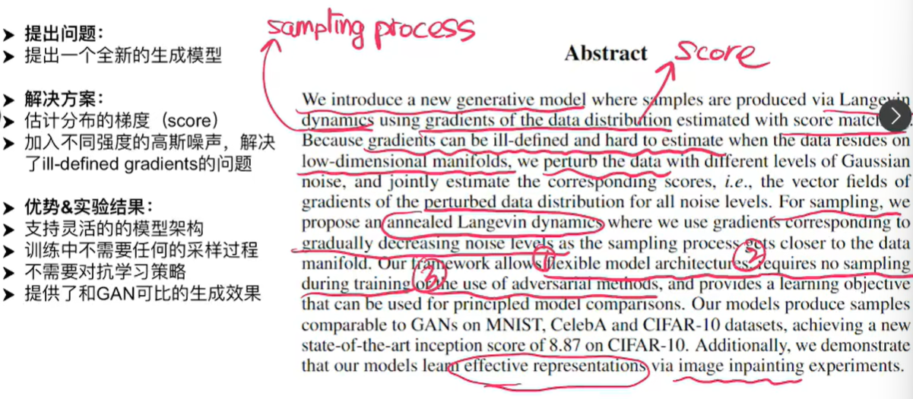
Score-based Model（基于分数的生成模型）不直接学习数据分布 $p(x)$，而是学习其 score function：

$$s(x)=\nabla_x\log p(x)$$

训练完成后，利用估计得到的 score 指引样本逐步向高概率区域移动，最终生成符合数据分布的样本。它的核心采样方法是 Langevin dynamics。

### 相关工作
#### 生成模型的分类

（1）**likelihood-based models：**

* 直接对数据分布 $p(x)$ 进行建模，并通过似然函数评价模型对数据的拟合程度
* variational auto-encoders（VAEs）
* normalizing flow models
* 缺点：对于网络结构的设计有很大的限制

（2）**implicit generative models：**

* 不直接计算显式的似然，而是让生成样本看起来属于目标数据分布
* generative adversarial networks（GANs）
* 缺点：往往需要对抗学习，不好训练，容易崩

Score-based Model 可以看作另一种间接描述数据分布的方法：它不需要知道概率密度的归一化常数，只需要学习概率密度变化最快的方向。

#### 详细工作
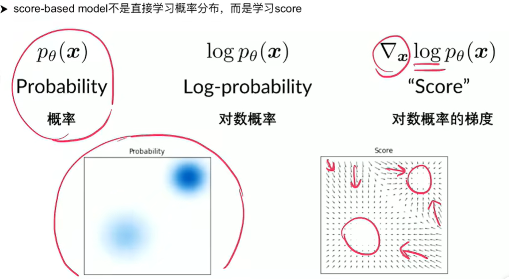
这里的 $p_\theta(x)$ 表示模型描述的概率密度，$\log p_\theta(x)$ 是对数概率，而 $\nabla_x\log p_\theta(x)$ 就是 score。它表示当前位置的概率密度应该向哪个方向增加。

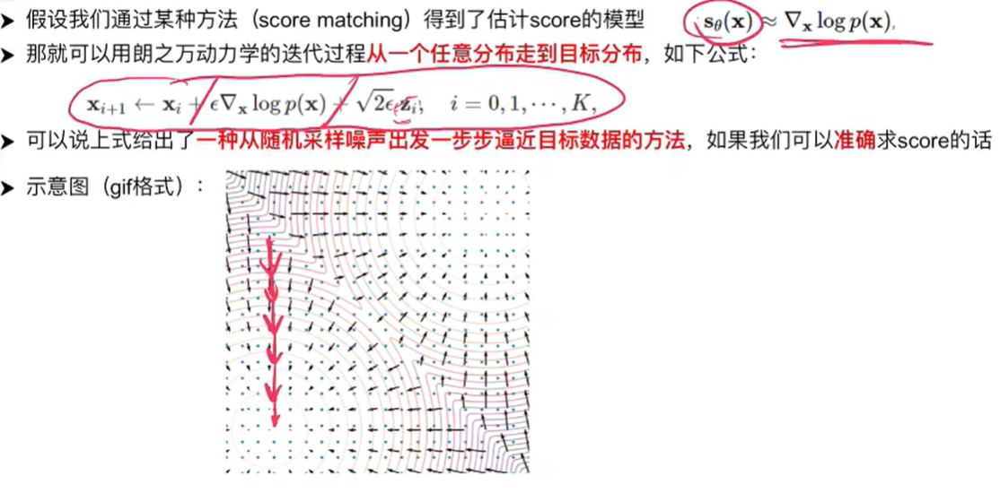
如果能够准确估计 score，就可以从一个初始样本出发，沿着概率增大的方向移动。Langevin dynamics 在移动过程中加入随机噪声，因此不会只沿一条确定路径前进，而是能够探索目标分布中的不同区域。

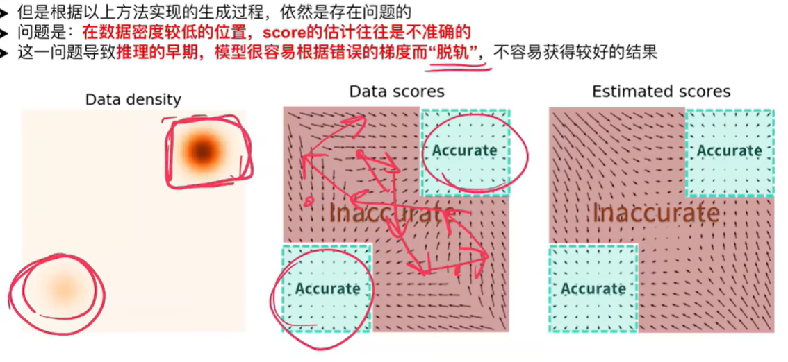
直接估计真实数据分布的 score 存在困难。**真实数据通常集中在低维流形附近，其他区域的样本密度很低**，训练数据也很少覆盖这些区域，因此模型在低密度区域的 score 预测容易不准确。采样初期如果处在这些区域，就可能沿错误方向偏离数据分布。

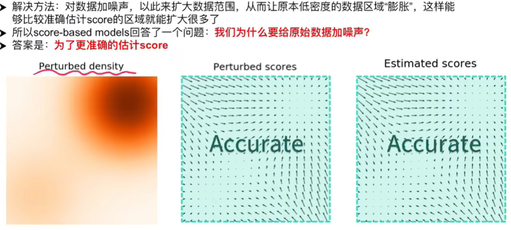
解决方法是先对数据**加入高斯噪声**，使原本集中在低维流形上的分布变得更加平滑、覆盖范围更广。这样可以在更大的区域内稳定地估计 score。不同的噪声强度对应不同的扰动分布，因此模型需要同时学习多个噪声水平下的 score。
对于一个概率密度 $p(x)$，$\log p(x)$ 表示对数概率，而 $\nabla_x\log p(x)$ 表示对输入 $x$ 求梯度。这个梯度的方向指向概率密度增大的方向，大小反映了概率变化的快慢，因此称为 score。

如果能够准确得到 $s(x)$，就可以从任意初始分布出发，沿着 score 指向高密度区域，并在过程中加入适量随机噪声，使样本逐渐接近目标分布。

最基本的 Langevin dynamics 更新为：

$$x_{i+1}=x_i+\frac{\epsilon}{2}s_\theta(x_i)+\sqrt{\epsilon}z_i,\qquad z_i\sim\mathcal{N}(0,I)$$

其中，$s_\theta(x_i)$ 是网络对 score 的估计，$\epsilon$ 是步长，$z_i$ 是随机噪声。第一项负责将样本推向高概率区域，第二项负责探索和保持随机性。

### 提出方法
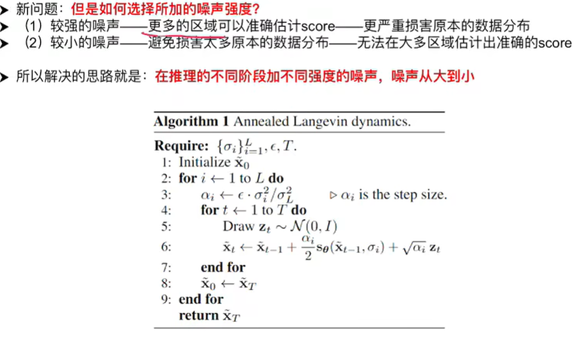
方法使用一系列从大到小的噪声水平 $\sigma_1>\sigma_2>\cdots>\sigma_L$。较大的噪声可以扩大分布的覆盖范围，使 score 更容易估计；较小的噪声则保留更多原始数据的细节。

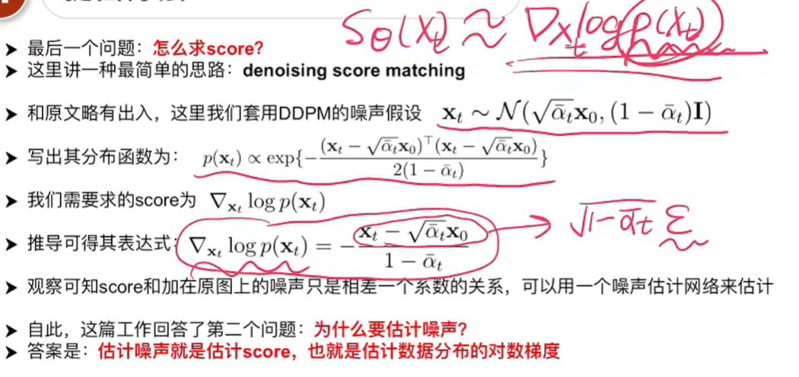
训练时，先根据已知的加噪过程生成带噪样本，再利用可计算的条件分布 score 作为监督信号。推理时按照从大到小的噪声顺序进行 Langevin dynamics，这就是 annealed Langevin dynamics。
设加入噪声后的样本为：

$$\tilde{x}=x+\sigma z,\qquad z\sim\mathcal{N}(0,I)$$

其中，$\sigma$ 表示噪声强度。噪声较大时，数据分布更加平滑，score 更容易估计；噪声较小时，扰动分布更接近真实数据，可以提供更精细的方向信息。

因此，采样时使用一系列从大到小的噪声水平 $\sigma_1>\sigma_2>\cdots>\sigma_L$。在较大的噪声水平下先进行粗略采样，使样本进入数据分布附近；随后逐渐减小噪声，逐步恢复真实数据中的细节。这种逐级减小噪声的策略称为 annealed sampling。

### Score 的含义
对于概率密度 $p(x)$，score 定义为：

$$s(x)=\nabla_x\log p(x)$$

它只描述概率密度的相对变化方向，不要求直接求出 $p(x)$ 的数值。由于归一化常数与 $x$ 无关，在求梯度时会消失，这也是 score-based 方法不需要显式计算复杂概率密度的原因。

对加噪后的分布 $p_\sigma(\tilde{x})$，模型学习的是：

$$s_\theta(\tilde{x},\sigma)\approx\nabla_{\tilde{x}}\log p_\sigma(\tilde{x})$$

也就是说，模型不仅接收带噪样本，还需要知道当前的噪声强度。不同噪声水平对应不同的概率分布和不同的 score，不能用同一个不带条件的 score 统一表示。

### Denoising Score Matching
直接使用真实数据分布的 score 作为监督信号通常不可行，因为真实分布 $p(x)$ 未知。Denoising Score Matching 通过已知的加噪过程构造监督信号。

对于固定的原始样本 $x_0$，加噪后的条件分布为：

$$q_\sigma(\tilde{x}|x_0)=\mathcal{N}(\tilde{x};x_0,\sigma^2I)$$

其 score 可以直接求出：

$$\nabla_{\tilde{x}}\log q_\sigma(\tilde{x}|x_0)=-\frac{\tilde{x}-x_0}{\sigma^2}$$

因此可以使用以下损失训练网络：

$$\mathcal{L}(\theta)=\frac{1}{2}\mathbb{E}\left[\left\|s_\theta(\tilde{x},\sigma)+\frac{\tilde{x}-x_0}{\sigma^2}\right\|^2\right]$$

训练目标是让网络预测“从带噪样本指向原始数据高密度区域”的方向。虽然监督信号来自条件分布 $q_\sigma(\tilde{x}|x_0)$，在数据和噪声上取期望后，最优解对应于扰动数据分布的 score。

### Annealed Langevin Dynamics
在第 $l$ 个噪声水平 $\sigma_l$ 下，使用 Langevin dynamics 进行多次更新：

$$x_{i+1}=x_i+\frac{\alpha_l}{2}s_\theta(x_i,\sigma_l)+\sqrt{\alpha_l}z_i$$

其中，$\alpha_l$ 是与 $\sigma_l$ 相关的步长。通常先从较大的 $\sigma_l$ 开始，经过若干次更新后切换到更小的噪声水平，再继续采样。这样就形成“先确定整体位置，再恢复局部细节”的生成过程。

较大的噪声有利于覆盖更大的空间并避免样本陷入错误区域；较小的噪声有利于精确贴近真实数据流形。Annealed Langevin Dynamics 正是通过逐步减小噪声，在全局探索能力和局部细节恢复能力之间取得平衡。

### 本节总结
Score-based Model 的核心逻辑可以概括为：

1. 学习概率分布对数的梯度 $\nabla_x\log p(x)$，而不是直接学习概率密度；
2. 通过给数据加入不同强度的高斯噪声，使 score 在更大的区域内可估计；
3. 使用 Denoising Score Matching 训练多噪声水平下的 score 网络；
4. 推理时采用 Annealed Langevin Dynamics，从大噪声到小噪声逐步生成样本。

它与扩散模型的联系在于二者都依赖“逐步加噪和逐步去噪”的思想；区别在于，Score-based Model 从 score function 和 Langevin dynamics 出发描述生成过程，而 DDPM 通常从显式的离散前向、逆向概率过程出发。

## 3.2 SDE
### 导入
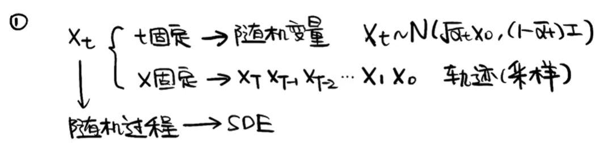
在离散扩散模型中，时间步 $t$ 取有限个离散值；如果把时间步连续化，就可以用随机微分方程（Stochastic Differential Equation，SDE）描述数据随时间变化的过程。此时，$x_t$ 表示连续时间 $t$ 下的随机变量。
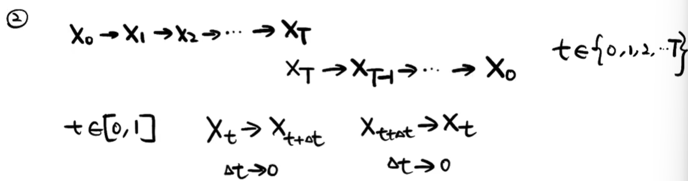
前向过程表示数据逐渐加噪：$x_0\rightarrow x_T$；反向过程则从噪声逐渐恢复数据：$x_T\rightarrow x_0$。当离散时间间隔 $\Delta t$ 趋近于 0 时，离散更新可以看作连续时间过程。
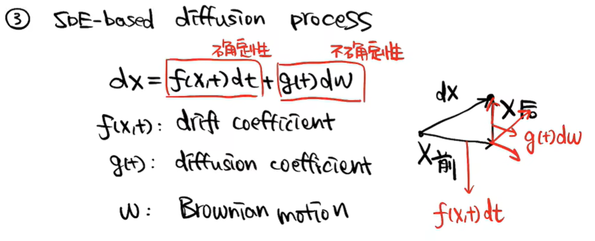

### 公式
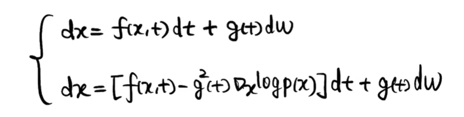
一般的 SDE 写成：

$$dx=f(x,t)dt+g(t)dW$$

其中，$f(x,t)$ 是 drift coefficient（漂移系数），描述确定性的变化方向；$g(t)$ 是 diffusion coefficient（扩散系数），控制随机扰动的强度；$W$ 是 Wiener process（布朗运动）。因此，SDE 同时包含确定性变化和随机变化。

如果已知前向 SDE 产生的数据分布及其 score $\nabla_x\log p_t(x)$，就可以构造对应的反向时间 SDE：

$$dx=[f(x,t)-g(t)^2\nabla_x\log p_t(x)]dt+g(t)d\bar{W}$$

反向过程中的 score 项负责把样本从高噪声区域引回数据分布。实际使用时，真实 score 未知，需要用神经网络 $s_\theta(x,t)$ 进行估计。

### 两种不同情况下的求解方法
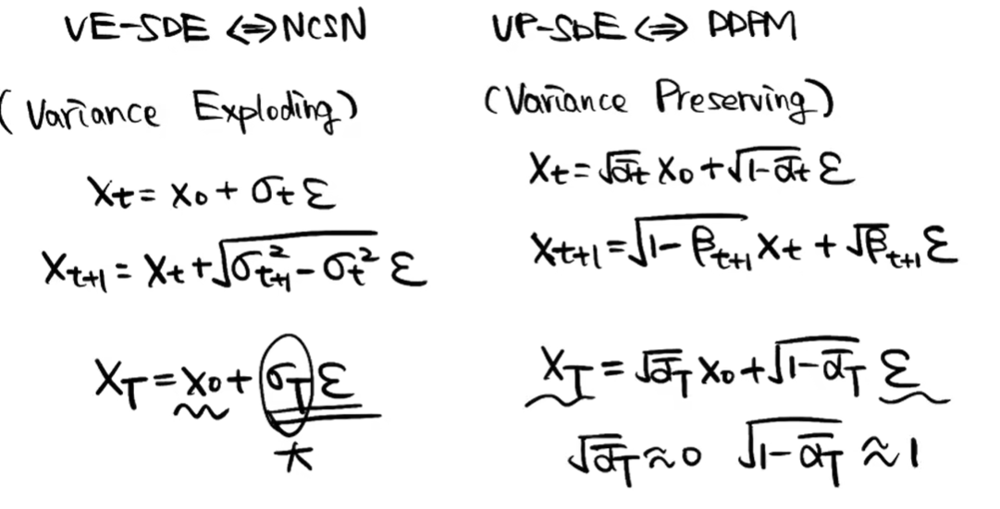
常见的前向 SDE 有两种：
* VE-SDE（Variance Exploding，方差爆炸）：主要不断增大噪声方差，最终样本近似为大方差高斯噪声
* VP-SDE（Variance Preserving，方差保持）：通过同时缩小信号和加入噪声，使整体方差保持在合理范围内，DDPM 属于 VP-SDE 的离散形式

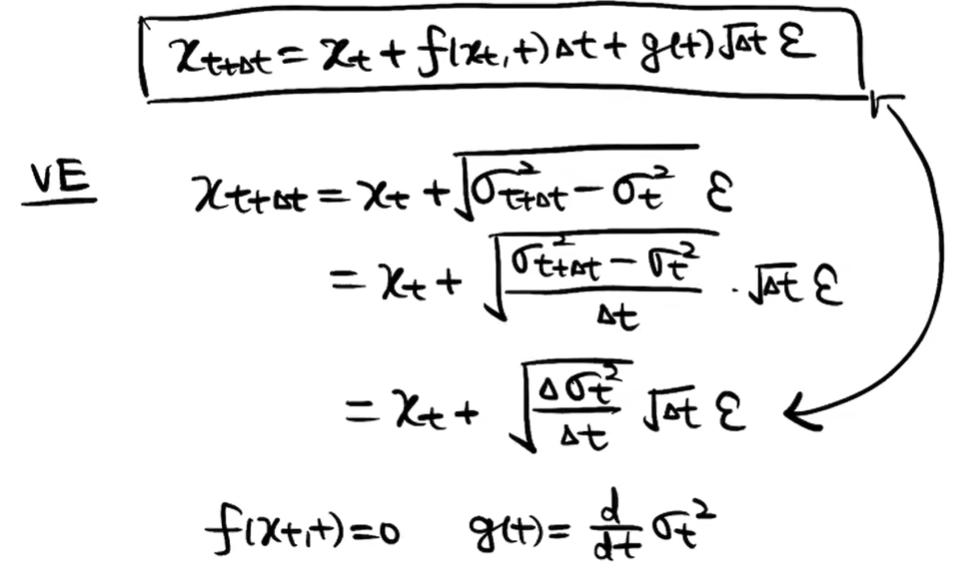
对于 VE-SDE，前向过程可以理解为只增加噪声：

$$x_t=x_0+\sigma_t\epsilon$$

相邻时间的噪声增量满足：

$$x_{t+\Delta t}=x_t+\sqrt{\sigma_{t+\Delta t}^2-\sigma_t^2}\,\epsilon$$

因此它对应的漂移项为 $f(x,t)=0$，扩散项由噪声方差的变化率决定。

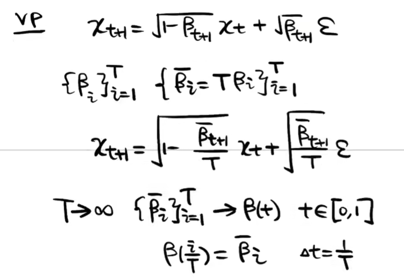
对于 VP-SDE，前向过程既衰减原始信号，又逐渐加入噪声。离散形式可以写成：

$$x_{t+1}=\sqrt{1-\beta_{t+1}}x_t+\sqrt{\beta_{t+1}}\epsilon$$

当离散步数 $T\rightarrow\infty$、$\Delta t=1/T\rightarrow0$ 时，离散的 $\beta_t$ 变成连续噪声调度函数 $\beta(t)$。
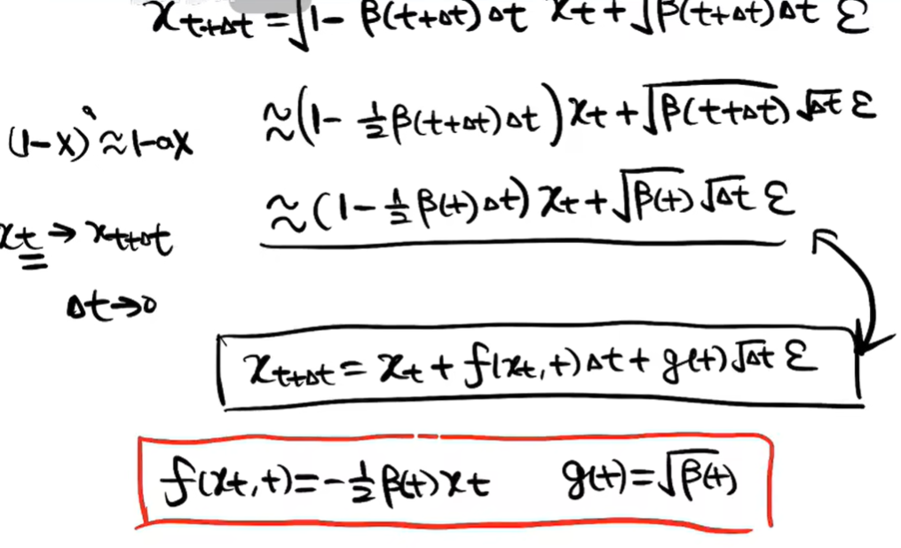
利用 $\sqrt{1-u}\approx1-\frac{u}{2}$，可以将 VP-SDE 的离散更新写成连续形式：

$$dx=-\frac{1}{2}\beta(t)x_tdt+\sqrt{\beta(t)}dW$$

所以 VP-SDE 的漂移系数和扩散系数分别为：

$$f(x,t)=-\frac{1}{2}\beta(t)x,\qquad g(t)=\sqrt{\beta(t)}$$

这说明 DDPM 的加噪过程本质上可以看作 VP-SDE 的数值离散化。

### 补充
#### 关系
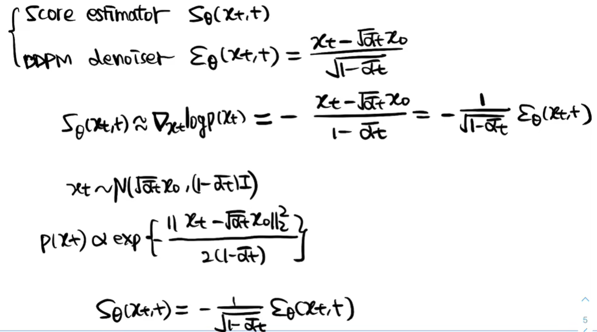
DDPM 的噪声预测网络与 score 网络可以互相转换。对于 DDPM 的加噪公式：

$$x_t=\sqrt{\bar{\alpha}_t}x_0+\sqrt{1-\bar{\alpha}_t}\epsilon$$

有：

$$s_\theta(x_t,t)\approx-\frac{1}{\sqrt{1-\bar{\alpha}_t}}\epsilon_\theta(x_t,t)$$

因此，虽然 DDPM 通常训练网络预测噪声 $\epsilon_\theta$，但经过一个与噪声水平有关的缩放后，就可以得到 score 的估计。这也是 DDPM、Score-based Model 和 SDE 统一起来的关键。

#### VE 与 VP 的等价性
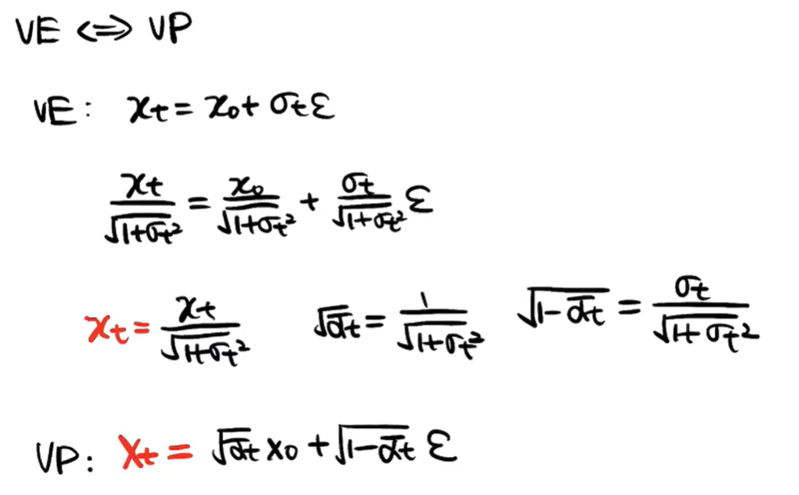
VE-SDE 与 VP-SDE 在形式上不同，但可以通过对变量进行缩放建立联系。对 VE 过程中的 $x_t$ 进行归一化：

$$\tilde{x}_t=\frac{x_t}{\sqrt{1+\sigma_t^2}}$$

则有：

$$\tilde{x}_t=\frac{x_0}{\sqrt{1+\sigma_t^2}}+\frac{\sigma_t}{\sqrt{1+\sigma_t^2}}\epsilon$$

这已经具有 VP-SDE 中“信号系数 + 噪声系数”的形式。也就是说，VE 和 VP 主要是噪声参数化方式不同，经过适当的缩放后可以描述相近的扰动过程。

### 本节总结
SDE 将扩散模型从离散时间推广到了连续时间：
1. 前向 SDE 负责把数据逐渐变成噪声，反向 SDE 借助 score 将噪声还原为数据。
2. VE-SDE 和 VP-SDE 是两种常见的噪声过程，其中 VP-SDE 与 DDPM 的联系最直接。
3. 使用 SDE 的好处是可以灵活选择采样步长，并进一步使用 ODE 或其他数值方法加速采样。

## 3.3 guided-diffusion
### 摘要
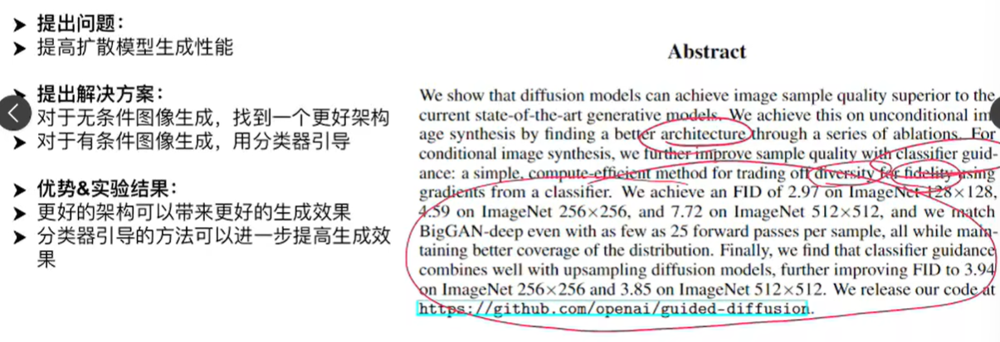
Guided Diffusion 的目标是提高扩散模型的生成质量，并让生成结果更好地符合指定类别或条件。它主要包含两个方向：一是**改进 U-Net 等模型结构**，二是**利用分类器的梯度对采样过程进行引导**。

分类器引导的直观思想是：扩散模型负责生成“像真实数据”的样本，分类器则告诉当前样本应该向哪个方向变化，才能更符合目标类别。两者结合后，可以在样本质量和条件一致性之间取得更好的效果。

### 相关工作
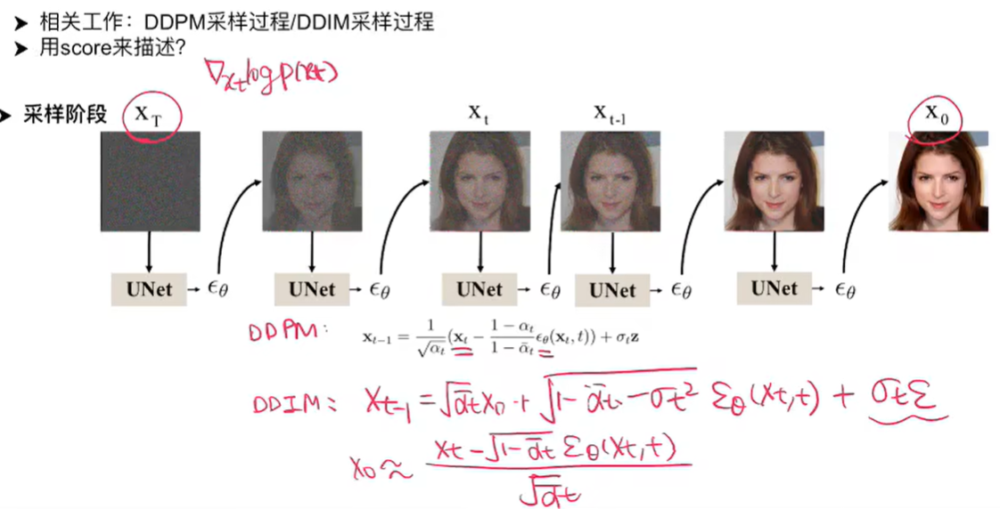
扩散模型的无条件采样只使用数据分布的 score 或噪声预测结果，因此可以生成自然图像，但无法指定生成类别。分类器引导在每个去噪步骤中额外使用一个分类器，根据当前带噪图像预测目标标签的概率，并利用其梯度修正去噪方向。
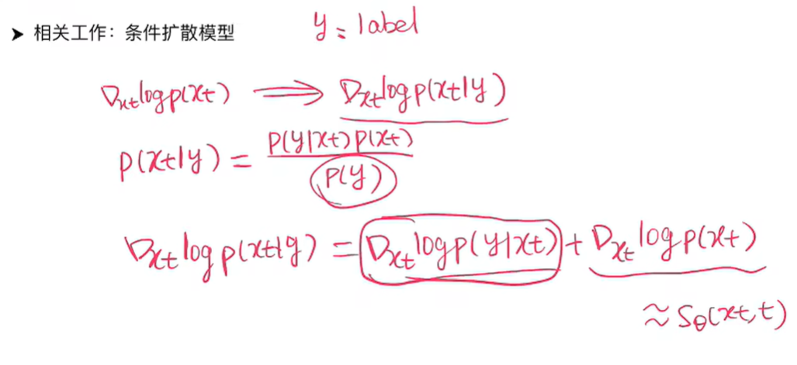
设目标类别为 $y$。根据贝叶斯公式：

$$\log p(x_t|y)=\log p(y|x_t)+\log p(x_t)-\log p(y)$$

由于 $p(y)$ 与 $x_t$ 无关，对 $x_t$ 求梯度可得：

$$\nabla_{x_t}\log p(x_t|y)=\nabla_{x_t}\log p(y|x_t)+\nabla_{x_t}\log p(x_t)$$

其中，$\nabla_{x_t}\log p(x_t)$ 是扩散模型提供的无条件 score，$\nabla_{x_t}\log p(y|x_t)$ 是分类器提供的条件引导方向。两者相加后，就得到了朝向目标类别的条件 score。

实际采样时通常使用带引导强度的形式：

$$s_{\mathrm{guided}}(x_t,t,y)=s_\theta(x_t,t)+w\nabla_{x_t}\log p_\phi(y|x_t,t)$$

其中，$w$ 是 guidance scale。$w$ 越大，生成结果越符合目标类别，但过大可能导致图像多样性下降、细节失真或出现过度引导；$w=0$ 时则退化为无条件生成。

分类器需要在不同噪声水平的图像上进行训练，因此输入通常包含 $x_t$ 和时间步 $t$。在采样的每一步，分类器都要对当前带噪状态进行判断，并将分类概率对图像的梯度传回，用来修正 U-Net 的去噪结果。

### 提出方法

* 用分类器引导生成
* [https://github.com/openai/guided-diffusion/blob/main/scripts/classifier_sample.py#L54](https://github.com/openai/guided-diffusion/blob/main/scripts/classifier_sample.py#L54)

采样过程可以概括为：

1. 从高斯噪声 $x_T$ 开始；
2. U-Net 预测当前状态中的噪声，得到无条件去噪方向；
3. 分类器计算 $\nabla_{x_t}\log p_\phi(y|x_t,t)$；
4. 将分类器梯度乘以引导强度 $w$，加入扩散模型的采样更新；
5. 重复以上步骤，直到得到最终样本 $x_0$。

因此，分类器引导并没有改变扩散模型的基本前向加噪过程，而是在逆向采样时增加了一个与类别有关的梯度项。它可以提升条件生成的准确性，但需要额外训练一个噪声条件分类器，并在每个采样步进行额外的分类器计算。

### 本节总结
Guided Diffusion 的关键是利用分类器梯度改变扩散模型的采样方向：

$$\text{条件 score}=\text{无条件 score}+\text{分类器引导梯度}$$

该方法的优点是条件控制直接、效果明显，能够提高类别一致性和视觉质量；缺点是需要额外的分类器，并且引导强度需要仔细调整。它也说明了扩散模型的采样过程不仅可以依赖自身的去噪网络，还可以融合其他模型提供的梯度信息。
