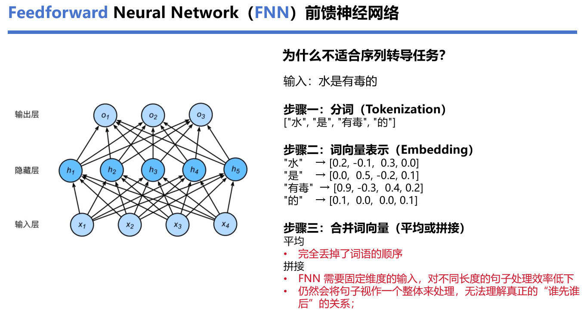
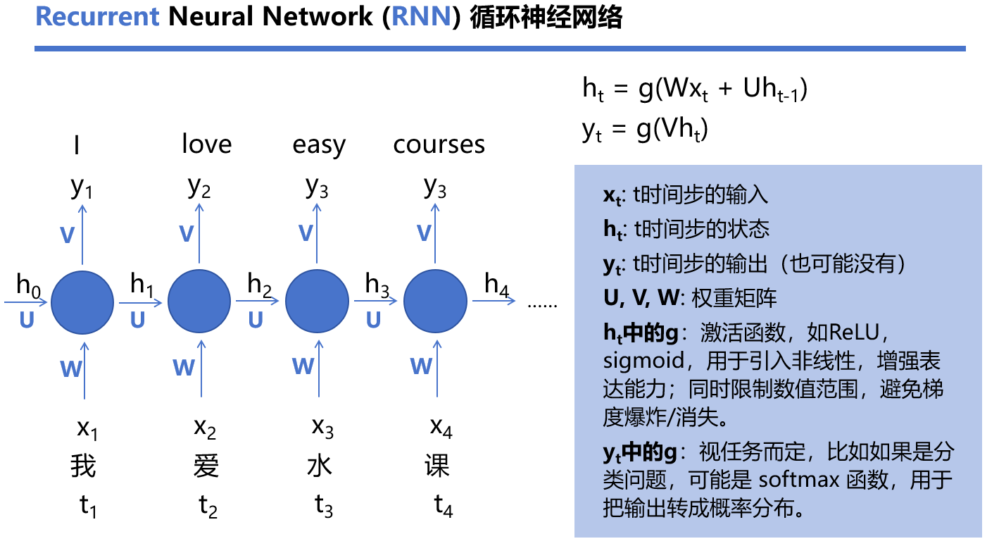
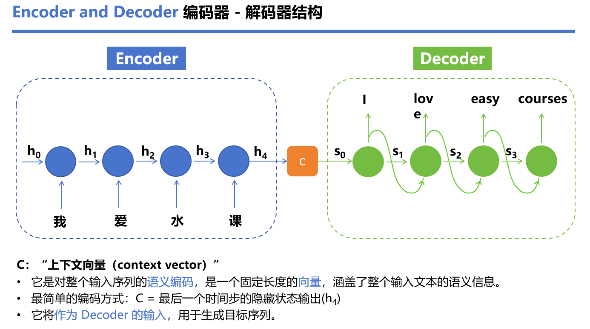
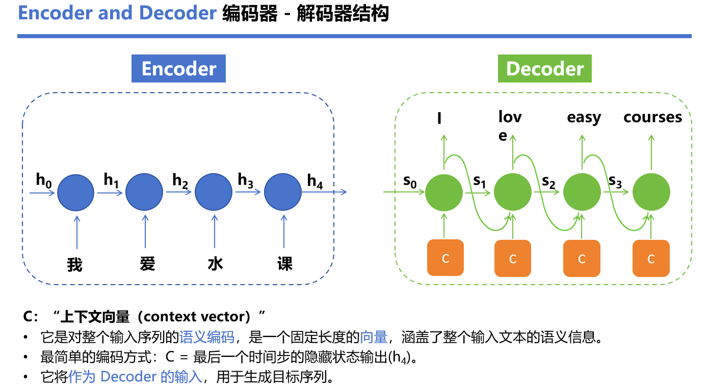
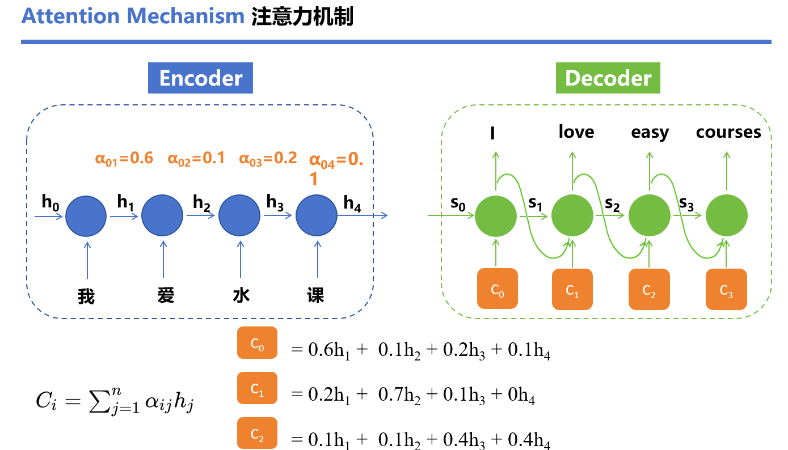
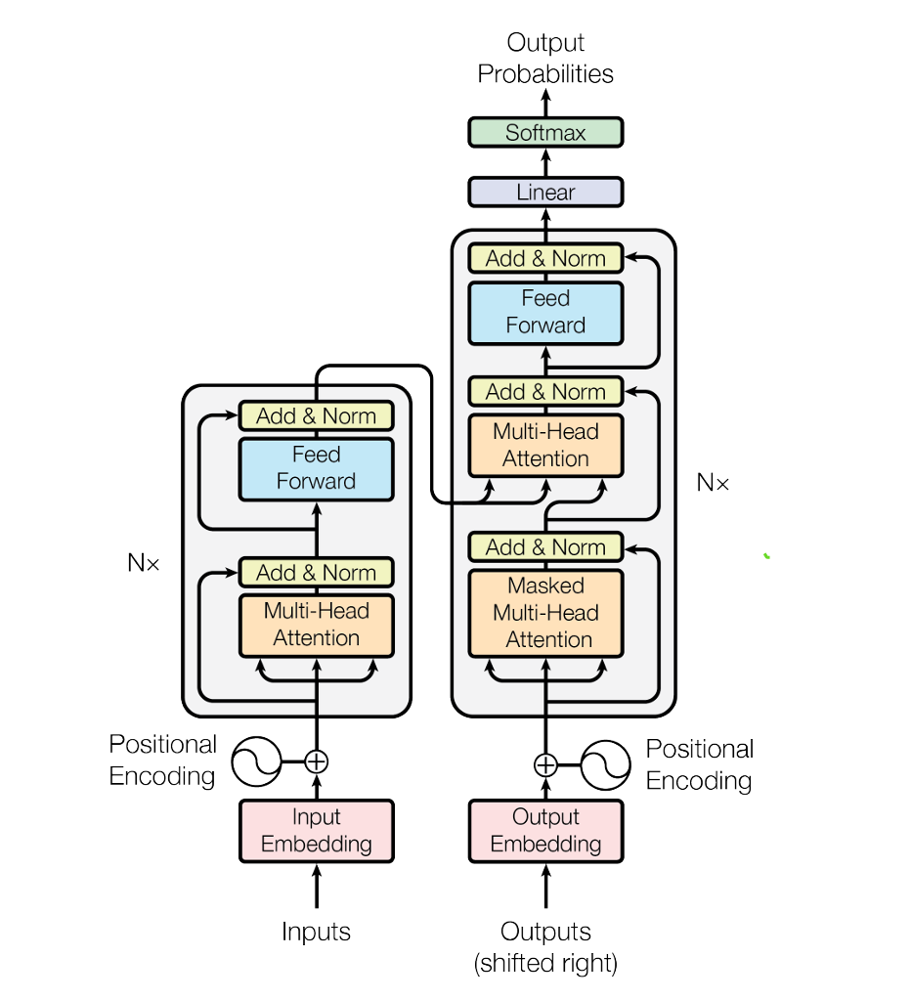

# Transformer 学习笔记

## 0. 一句话总结

**Transformer 是首个完全抛弃 RNN/CNN、只依赖注意力机制（Attention）的序列转导模型**。它解决了 RNN 无法并行、难以捕捉长距离依赖的问题，在机器翻译上以更小的训练成本取得了 SOTA 效果，后来成为 BERT、GPT 等所有大模型的基础架构。

## 1. 背景与动机：为什么需要 Transformer

### 1.1 Transformer 之前的序列模型

主流序列转导（Sequence Transduction）模型的结构特点：

1. **基于 RNN / CNN**
   
   传统的模型由于输入固定，难以处理长度易变的语言输入。
2. **编码器-解码器（Encoder-Decoder）结构**
    
    引入编码器-解码器的网络将输入与输出分开了。虽然解决了长度的问题，但是随之而来的问题便是——使用上下文向量时容易**遗忘上游信息**；并且针对**不同时间段输入信息的重要性**也难以区分。
3. **用注意力机制增强**（但绝大多数情况下只是辅助，仍与 RNN 一起使用）
    
    注意力机制是在解码器中针对每一个输出单独计算其上行文向量。但是其也有一个明显的问题——每一个输出需要依赖前序输出，计算时间被严重拉长。

RNN（LSTM、GRU 都是其变体）当时是序列建模/机器翻译的主流方法。

### 1.2 RNN 的根本局限

> RNN 按"符号位置"逐个推进计算：生成隐藏状态序列 $h_t = f(h_{t-1}, x_t)$，第 t 步依赖第 t-1 步。

- **无法并行**：递归计算的顺序性导致训练过程无法有效并行化
- **长距离依赖难学**：信号要穿越 O(n) 步的路径，序列越长越容易梯度消失/爆炸
- 虽有因子分解技巧、条件计算等改进，但**顺序计算的根本约束依然存在**

### 1.3 已有的一些替代尝试

| 模型 | 思路 | 问题 |
||||
| Extended Neural GPU / ByteNet / ConvS2S | 用 CNN 做基础模块，可并行 | 任意两位置关联的计算量随距离增长（线性/对数），**难以学习远距离依赖** |
| Memory Network | 递归注意力机制 | 不是序列对齐的递归，仍有局限 |

### 1.4 Transformer 的创新

1. **完全摒弃 RNN / CNN**（不用序列对齐的递归或卷积）
2. 仍采用**编码器-解码器结构**
3. **完全基于注意力机制**，且是首个完全基于 Self-Attention 的序列转导模型

额外好处：注意力权重大小可直接观察，**可解释性好**（详见附录 Attention 可视化）。

## 2. 整体架构

Transformer 遵循 Encoder-Decoder 结构，核心特点：

- **多层堆叠的自注意力机制**（Stacked Self-Attention）
- **逐点的全连接层**（Point-wise FFN）
- 输入 $(x_1,...,x_n)$ → 编码器 → 连续表示 $z=(z_1,...,z_n)$ → 解码器 → 逐个生成输出 $(y_1,...,y_m)$
- 解码器是**自回归**的：生成下一个符号时把前面已生成的符号作为额外输入

### 2.1 编码器（Encoder）

- 由 **N = 6 个相同层**堆叠而成
- 每层包含**两个子层**：
  1. **多头自注意力**（Multi-Head Self-Attention）
  2. **逐位置全连接前馈网络**（Position-wise FFN）
- 每个子层都加**残差连接 + 层归一化**：

$$\text{Output} = \text{LayerNorm}(x + \text{Sublayer}(x))$$

- 所有子层和嵌入层输出维度统一为 $d_{model} = 512$（方便残差相加）

**编码器作用**：把输入序列的每个词，从"孤立的词向量"变成"**结合了上下文信息的向量**"。经过自注意力后，每个位置的表示里都包含了整句其他词的信息——"bank"在"river bank"和"money bank"中会有不同的表示（一词多义消歧）。编码器输出 z 就是输入句子"读完上下文后"的表示。

### 2.2 解码器（Decoder）

- 也是 N = 6 个相同层，比编码器**多一个子层**：
  1. **Masked 多头自注意力**（掩码自注意力）
  2. **Encoder-Decoder 注意力**：对编码器输出的 z 做多头注意力
  3. FFN（同编码器）
- 每个子层同样残差 + LayerNorm
- **关键修改**：解码器的自注意力被 Mask 掉——位置 i 只能 attend 到位置 ≤ i 的信息
  - 实现方式：softmax 之前把非法位置的分数设为 $-\infty$
  - 配合**输出嵌入右移一位**，保证"预测位置 i 只依赖已知的 < i 的输出"，保持自回归性质

> **为什么解码器要 Mask？**
> 解码是逐词生成的：预测第 i 个词时，后面的词还没生成。如果不 Mask，注意力会"偷看"未来词，训练时模型就能**作弊**（等价于测试时永远做不到，因为测试时未来词根本不存在）。

**解码器作用**：逐词生成输出序列。每生成一个词，它要看三样东西——①自己**已经生成**的部分（Masked 自注意力，保证不偷看未来）；②编码器给的**源语言信息**（Encoder-Decoder 注意力）；③把它加工成下一个词的概率（FFN + Softmax）。翻译时：编码器"读懂了"英文原句，解码器负责"组织"中文译文。

## 3. 核心机制：注意力（Attention）

### 3.1 注意力函数的一般定义

> Attention 函数接收一个 **Query（查询）** 和一组 **Key-Value（键值对）**，映射出一个输出。
> 输出 = 对 Values 的**加权和**，权重由 Query 与对应 Key 的**兼容性函数**（compatibility function）计算。

形象理解：Query 是"我要找什么"，Key 是"每个位置的标签"，Value 是"每个位置的内容"。先算 Query 和每个 Key 有多匹配，再用匹配度作为权重去加权汇总所有 Value。

**注意力机制作用**：从一个序列中**按相关程度动态提取信息**，让每个词都能"看到"其他词，把相关信息加权汇总到自己的表示里。

- 核心价值 1：**直接关联，不分远近**——任意两个位置之间一步直达（路径长度 O(1)），解决 RNN 的长距离依赖问题
- 核心价值 2：**权重动态计算**——每个句子都实时算匹配度，不是固定规则，比"只看相邻词"灵活得多
- 注意：**"看到上下文"≠注意力**。RNN/CNN 也"看上下文"，但一个靠压缩传递（会遗忘）、一个靠窗口扫描（看不远）；注意力是显式地、全局地、加权地看。而当 Q 来自一个序列、K/V 来自另一个序列时（Cross-Attention），它看的就不是"自己的"上下文了

### 3.2 Scaled Dot-Product Attention（缩放点积注意力）

输入：维度 $d_k$ 的 Queries 和 Keys，维度 $d_v$ 的 Values。

**Q、K、V 各自的作用**：

- **Query（查询）**：我要找什么——由"当前词"生成，代表当前词的"需求"
- **Key（键）**：我是什么——每个词的"标签"，用来被 Query 检索匹配
- **Value（值）**：我的内容——每个词真正携带的信息，匹配上之后被"取走"
- 分工逻辑：**Q 和 K 决定"该关注谁"（算权重），V 决定"关注到什么内容"（加权取走）**。把"检索"和"内容"分开设计，才能做到"知道该看谁"和"真拿到信息"两件事各自优化

**计算过程（5步）**：

1. **点积**：计算 Query 与所有 Key 的点积，得到相似度矩阵 $QK^T$
2. **缩放**：除以 $\sqrt{d_k}$
3. **Softmax**：归一化成权重（和为 1 的概率分布）
4. **加权平均**：权重乘上 V
5. **输出**：得到注意力输出

$$\text{Attention}(Q, K, V) = \text{softmax}\left(\frac{QK^T}{\sqrt{d_k}}\right)V$$

实际实现中，Q、K、V 都是打包成矩阵一次性计算的。

**为什么用点积注意力而不是加性注意力？**

- 两种注意力的理论复杂度相近
- 点积注意力**更快、更省内存**——可以用高度优化的矩阵乘法库实现
- 加性注意力用单隐层前馈网络算兼容性，无法享受矩阵乘法的优化

**为什么要除以 $\sqrt{d_k}$（缩放）？**

- 当 $d_k$ 较大时，点积结果会很大（$q \cdot k = \sum_{i=1}^{d_k} q_i k_i$ 的方差 = $d_k$，假设各分量均值为 0 方差为 1 的独立随机变量）
- 点积过大 → softmax 进入梯度极小区域 → 训练困难
- 除以 $\sqrt{d_k}$ 把方差拉回 1，稳定梯度

### 3.3 Multi-Head Attention（多头注意力）

**单头 vs 多头**（设 $d_{model} = 512$）：

- 单头：一次性处理整个 512 维，给出一个注意力结果
- 多头：把 512 维分成 **8 份（每份 64 维）**，8 个头分别做注意力，再拼接起来

$$\text{MultiHead}(Q, K, V) = \text{Concat}(\text{head}_1, ..., \text{head}_h) W^O$$

$$\text{head}_i = \text{Attention}(QW_i^Q, KW_i^K, VW_i^V)$$

其中 $W_i^Q \in \mathbb{R}^{d_{model} \times d_k}$，$W_i^K \in \mathbb{R}^{d_{model} \times d_k}$，$W_i^V \in \mathbb{R}^{d_{model} \times d_v}$，$W^O \in \mathbb{R}^{hd_v \times d_{model}}$

本文超参数：$h = 8$，$d_k = d_v = d_{model}/h = 64$

**多头注意力作用**：单头注意力只能从一个"角度"看词与词的关系，不同信息（句法、语义、指代）混在一起会被平均掉（averaging inhibits this）。多头把表示切成多个子空间，让模型**同时从多个角度并行观察**——比如 8 个头中，有的头专门抓"动词和宾语的搭配"，有的头抓"指代关系"，有的头抓"句法结构"，最后拼起来，理解更丰富细致。

**多头注意力的使用注意事项**：
- 一开始将原始的输入划分开，经过注意力机制后需要再次通过**拼接+线性层**恢复原始的维度。
- 其中线性层用于重新恢复原本的**清晰度**。

**多头注意力的优势**：

- 让模型可以从**多个不同的表示子空间**（不同的线性投影）和多个位置**并行**地提取信息
- 单头注意力会把所有信息平均在一起（averaging inhibits this），多头的"多通道"**获得更丰富更细致的理解**
- **计算成本几乎不变**：每个头维度缩小 h 倍，总计算量和全维度的单头注意力差不多

### 3.4 多头注意力在模型中的三种应用方式

| 类型 | Q 来源 | K/V 来源 | 作用 |
|---|---|---|---|
| **Encoder-Decoder Attention** | 解码器上一层输出 | 编码器输出 | 解码器每个位置都可以 attend 编码器的所有位置（模拟传统 seq2seq 注意力） |
| **Encoder Self-Attention** | 编码器上一层输出 | 编码器上一层输出 | 编码器每个位置 attend 前一层所有位置 |
| **Decoder Self-Attention**（Masked） | 解码器上一层输出 | 解码器上一层输出 | 每个位置 attend 到自身及之前的位置，通过 Mask 保持自回归 |

## 4. 位置编码（Positional Encoding）

**问题**：Transformer 没有递归也没有卷积，模型本身**对序列顺序一无所知**。同样的词不管出现在第几位，得到的嵌入都一样，模型会把它当词袋处理。

**位置编码作用**：让模型知道"词出现在第几个位置"。语言里语序就是信息——没有位置编码，"我打你"和"你打我"在模型眼里**完全一样**（两句话的词袋相同）；有了它，模型才能区分语序、理解"bank 后面的 river 会影响 bank 的意思"这类顺序敏感的信息。

**解决**：在编码器和解码器最底层的输入嵌入上**加上位置编码**，维度与嵌入一致（$d_{model}=512$）直接相加：

$$PE_{(pos, 2i)} = \sin(pos / 10000^{2i / d_{model}})$$
$$PE_{(pos, 2i+1)} = \cos(pos / 10000^{2i / d_{model}})$$

其中 pos 是位置，i 是维度索引。

**为什么用正弦/余弦？**

- 每个维度对应一个正弦波，波长从 $2\pi$ 到 $10000 \cdot 2\pi$ 呈几何级数分布
- **相对位置友好**：对任意固定偏移 k，$PE_{pos+k}$ 可以表示成 $PE_{pos}$ 的线性函数 → 模型容易学到"按相对位置去注意"
- 可能支持**外推**到训练时没见过的更长序列
- 实验（Table 3 row E）表明：用学习的绝对位置嵌入与正弦版本结果几乎相同，选正弦是因为外推潜力

## 5. 其余组件

### 5.1 前馈网络 FFN（Position-wise FFN）

每个 Encoder/Decoder 层都包含一个**逐位置、共享参数**的两层全连接网络，中间夹 ReLU：

$$FFN(x) = \max(0, xW_1 + b_1)W_2 + b_2$$

- 输入输出维度 $d_{model} = 512$，中间层维度 $d_{ff} = 2048$（4 倍放大）
- 不同位置共享同一组参数，不同层参数不同
- 等价于两个 kernel size = 1 的卷积
- **FFN 作用**：注意力做的事本质是"信息的加权汇总"——对 Value 做线性组合，**学不到复杂的非线性特征**。FFN 对每个词的表示做独立的非线性加工（等价于对每个位置各跑一遍"深度思考"），让模型能表达更复杂的模式。两句话的比喻：**注意力负责"从别人那里拿信息"，FFN 负责"拿到信息后自己消化"**

### 5.2 Embeddings and Softmax

- 和其他序列转导模型一样，用**学习的嵌入**把输入/输出 token 转为 $d_{model}$ 维向量
- 用线性变换 + softmax 把解码器输出转成下一个 token 的预测概率
- **权重共享**：两个嵌入层（编码器输入、解码器输入）和 softmax 前的线性层共享同一套权重矩阵
- 嵌入层的权重乘以 $\sqrt{d_{model}}$

**Embedding 作用**：把离散的 token（词表里的编号，如第 37 号）变成模型能计算的**连续向量**。编号本身没有语义（37 > 36 不代表什么），必须映射到稠密向量空间，让语义相近的词向量靠近——这是模型一切理解能力的前提。

**Softmax 作用**：把"打分"变成"概率"。解码器最后的线性层给词表里每个词打一个分数（logits），softmax 把它们归一化成和为 1 的概率分布，模型选概率最高的词输出。注意力和 Softmax 的输出都用它，因为"权重"和"概率"都需要非负且和为 1。

### 5.3 残差连接 + LayerNorm

- 每个子层输出：$\text{LayerNorm}(x + \text{Sublayer}(x))$

**残差连接作用**：让梯度"抄近道"直通前面的层，缓解深层网络的梯度消失；同时保证每个子层在"加工信息"之外**保留原始输入**（x + 加工结果），这样模型深层也能训练起来——没有它，6 层堆叠很难训。

**LayerNorm 作用**：把每层的数值分布拉回稳定范围（归一化成均值 0、方差 1），防止训练过程中数值过大/过小导致训练不稳定、发散。在**特征维度**上归一化（区别于 BatchNorm 在 batch 维度），因此不受 batch 大小和序列长度影响，适合变长序列。

## 6. 为什么选择 Self-Attention（三个维度对比）

对比三种把变长序列 $(x_1,...,x_n)$ 映射到同长序列的层：Self-Attention vs RNN vs CNN。

**Table 1：最大路径长度、每层复杂度、最少顺序操作数**

| 层类型 | 每层复杂度 | 顺序操作数 | 最大路径长度 |
|---|---|---|---|
| Self-Attention | $O(n^2 \cdot d)$ | $O(1)$ | $O(1)$ |
| Recurrent | $O(n \cdot d^2)$ | $O(n)$ | $O(n)$ |
| Convolutional | $O(k \cdot n \cdot d^2)$ | $O(1)$ | $O(\log_k n)$ |
| Self-Attention(restricted) | $O(r \cdot n \cdot d)$ | $O(1)$ | $O(n/r)$ |

n = 序列长度，d = 表示维度，k = 卷积核大小，r = 受限注意力的邻域大小

**三个关键维度解读**：

1. **每层总计算复杂度**：当 $n < d$（机器翻译中很常见，如 word-piece 表示），Self-Attention 比 RNN 更快；卷积通常比 RNN 贵 k 倍（可分离卷积可降到 $O(knd + nd^2)$，即使 k=n 也等于 Self-Attention + FFN 的组合）
2. **并行计算能力（顺序操作数）**：Self-Attention 只需要 $O(1)$ 次顺序操作——所有位置**同时**计算；RNN 必须 $O(n)$ 步串行
3. **学习长距离依赖的能力（最大路径长度）**：Self-Attention 任意两位置路径长度恒为 $O(1)$，路径越短越容易学习长距离依赖；RNN 是 $O(n)$，CNN 是 $O(\log_k n)$（膨胀卷积）

**额外好处**：可解释性。可以画出注意力权重矩阵，观察每个词关注了哪些词；多个注意力头能各司其职（有的负责句法、有的负责语义、有的处理指代关系）。

## 7. 训练细节

### 7.1 数据与批处理

- WMT 2014 **英德**：约 450 万句对，BPE 编码，共享词表约 37,000 tokens
- WMT 2014 **英法**：更大，3600 万句，32,000 word-piece 词表
- 按近似序列长度分 batch，每个 batch 约含 25,000 源 token + 25,000 目标 token

### 7.2 硬件与训练时长

- 一台机器 8 块 NVIDIA P100 GPU
- base 模型：每步约 0.4 秒，训练 100,000 步（12 小时）
- big 模型：每步 1.0 秒，训练 300,000 步（3.5 天）

### 7.3 优化器：Adam + Warmup

- Adam：$\beta_1 = 0.9$，$\beta_2 = 0.98$，$\epsilon = 10^{-9}$
- **学习率动态调度**（Transformer 训练的重要 trick）：

$$lrate = d_{model}^{-0.5} \cdot \min(\text{step\_num}^{-0.5},\ \text{step\_num} \cdot \text{warmup\_steps}^{-1.5})$$

- 前 warmup_steps（= 4000）步学习率**线性上升**，之后按步数的**负平方根递减**
- 为什么 warmup？训练初期模型参数还没稳定，梯度噪声大，先用小学习率预热，避免训练震荡

### 7.4 正则化

三种正则化手段：

1. **Residual Dropout**（$P_{drop} = 0.1$）：每个子层输出在残差相加和归一化之前加 dropout；编码器/解码器堆栈中嵌入与位置编码之和也加 dropout
2. **Label Smoothing**（$\epsilon_{ls} = 0.1$）：让模型对标签更"不自信"。**会损害困惑度（perplexity），但提升准确率和 BLEU**——因为模型不再追求把概率都押在一个 token 上，反而更不容易过拟合
3. （base 模型还用了最后 5 个 checkpoint 平均，big 用最后 20 个）

## 8. 实验结果

### 8.1 机器翻译（WMT 2014）

| 模型 | EN-DE BLEU | EN-FR BLEU | 训练成本（FLOPs） |
|---|---|---|---|
| ByteNet | 23.75 | — | — |
| GNMT+RL（集成） | 26.30 | 41.16 | $1.8 \times 10^{20}$ |
| ConvS2S（集成） | 26.36 | 41.29 | $7.7 \times 10^{19}$ |
| MoE | 26.03 | 40.56 | $2.0 \times 10^{19}$ |
| **Transformer (base)** | **27.3** | **38.1** | $3.3 \times 10^{18}$ |
| **Transformer (big)** | **28.4** | **41.8** | $2.3 \times 10^{19}$ |

- 英德：big 模型比之前最好结果（包括集成模型）**高 2 个多 BLEU**，SOTA = 28.4
- 英法：big 模型 41.8，超过所有之前发表的单模型，训练成本不到之前 SOTA 的 1/4
- **base 模型就超过了所有已发表的模型和集成**，且训练成本只是对手的零头
- 推理用 beam search：beam size = 4，长度惩罚 $\alpha = 0.6$

### 8.2 消融实验（模型变体，Table 3，英德 newstest2013 开发集）

| 变体 | 结果 | 结论 |
|---|---|---|
| (A) 注意力头数 h = 1 | 比最优设置差 0.9 BLEU | 单头不够，但头过多质量也下降（8 头最优） |
| (B) 减小 key 维度 $d_k$ | 质量受损 | 说明算兼容性不简单，点积以外的更复杂兼容函数可能有帮助 |
| (C) 增大模型尺寸 | 更大更好 | 模型容量收益 |
| (D) 无 dropout | 过拟合，变差 | **dropout 对防止过拟合非常重要** |
| (E) 学习位置嵌入替代正弦 | 几乎相同 | 正弦版有外推优势所以被选中 |
| big | N=6, d=1024, d_ff=4096, h=16, dropout=0.3 | 最好结果 |

### 8.3 扩展到其他任务：英语成分句法分析（Constituency Parsing）

- 只用 WSJ 4 万句训练（4 层 Transformer，$d_{model}=1024$）：**91.3 F1**，超过了 Berkeley Parser（90.4），之前 RNN seq2seq 在小数据上做不到
- 半监督（1700 万句）：**92.7 F1**，超过之前所有模型（除了 RNN Grammar 93.3）
- 说明 Transformer 不只是翻译专用，**泛化能力好**

## 9. 附录：注意力可视化（论文的直观证据）

- **长距离依赖**：encoder 第 5 层（共 6 层）中，很多注意力头会 attend 动词 "making" 的远距离依赖（"making... more difficult" 的搭配），说明模型确实学到了长距离的语法搭配
- **指代消解**（anaphora resolution）：第 5 层的 head 5/6 对 "its" 的注意力非常锐利——"its" 关注了它指代的对象 "Law"
- **各司其职**：不同的头学会了不同的任务，有的关注句法结构，有的关注语义

> 这是"可解释性"的直观证据：直接看注意力权重矩阵，就能理解模型在思考什么。

## 10. 理解与易错点总结

### 10.1 用一句话串起整个模型

> 输入序列 → 词嵌入 + 位置编码 → 6 层编码器（多头自注意力 → FFN，各带残差+LayerNorm）→ 得到上下文表示 z
> 输出序列（右移一位）→ 词嵌入 + 位置编码 → 6 层解码器（Masked 多头自注意力 → Encoder-Decoder 注意力 → FFN）→ 线性层 + Softmax → 预测下一个词（自回归）
> 注意力计算：词嵌入向量化、划分不同小样本空间（多头）、每个空间中进行注意力机制的计算——建立词与词之间的关系、位置编码——建立词在句子中的位置关系。

### 10.2 容易混淆的点

| 易错点 | 澄清 |
|---|---|
力和普通点积注意力 | 唯一区别是 $\sqrt{d_k}$ 缩放因子 |
| 单头 vs 多头 | 多头不是算 8 次完整的注意力，而是把 512 维**切分**成 8 份 64 维分别算，再拼接，总计算量几乎不变 |
| Encoder 与 Decoder 的注意力 | 编码器是"全量"自注意力（无 Mask）；解码器自注意力要 **Mask**（只看过去）；还要再加一个对编码器输出的注意力（Q 来自解码器，K/V 来自编码器） |
| 位置编码加在哪 | 只加在**最底层**的输入嵌入上（encoder 和 decoder 都加），不是每层都加 |
| FFN 的"逐位置" | 每个位置共享同一组参数，理解为 kernel=1 的卷积 |
| Warmup 与学习率 | 不是恒定学习率！先线性升后平方根降 |
| Transformer 没有"词序信息" | 全靠位置编码注入，这是设计上最巧妙也最容易被忽略的一环 |

### 10.3 各组件作用速查表

| 组件 | 它作用 |
|---|---|
| 词嵌入 Embedding | 把离散 token 变成模型能计算的连续向量，语义相近的向量靠近 |
| 位置编码 PE | 注入词序信息——没有它，"我打你"和"你打我"没有区别 |
| 自注意力 Self-Attention | 让每个词直接看到其他所有词，动态加权汇总信息，建模词与词的关系（含长距离依赖） |
| 多头 Multi-Head | 从多个子空间/角度并行观察，避免单头把不同类型的信息平均掉 |
| Mask（解码器） | 禁止看未来词，维持"逐词生成"的自回归性质 |
| Encoder-Decoder 注意力 | 把编码器（源语言）的信息带入解码生成过程，实现"对齐" |
| FFN | 对每个词做独立的非线性加工（"消化"信息），弥补注意力只会加权求和的局限 |
| 残差连接 | 梯度直通，防止深层梯度消失，保留原始信息 |
| LayerNorm | 稳定每层数值范围，训练更稳，不受 batch 影响 |
| Softmax | 把打分变成概率分布（非负、和为 1） |
| 缩放 $1/\sqrt{d_k}$ | 防止点积过大、softmax 进入梯度消失区 |
| Warmup 学习率 | 训练初期用小学效率预热，防止震荡，之后按步数平方根衰减 |
| Dropout / Label Smoothing | 防过拟合（dropout 随机丢弃神经元；label smoothing 让模型别"太自信"） |

