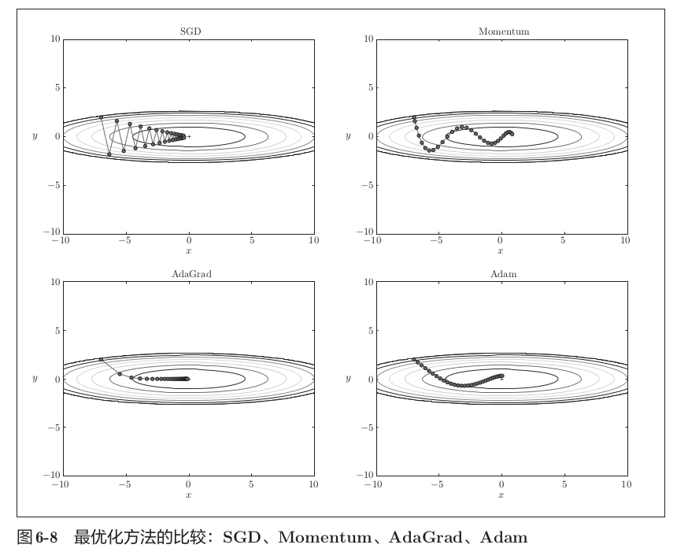
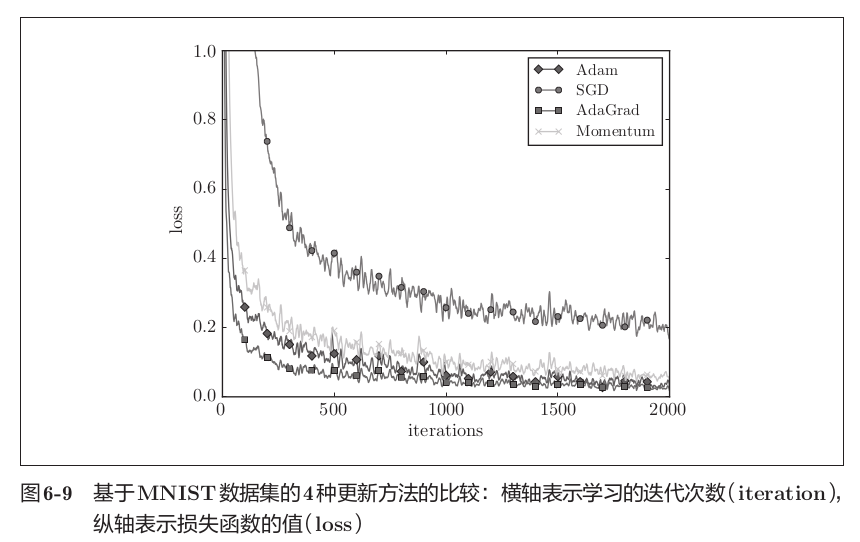
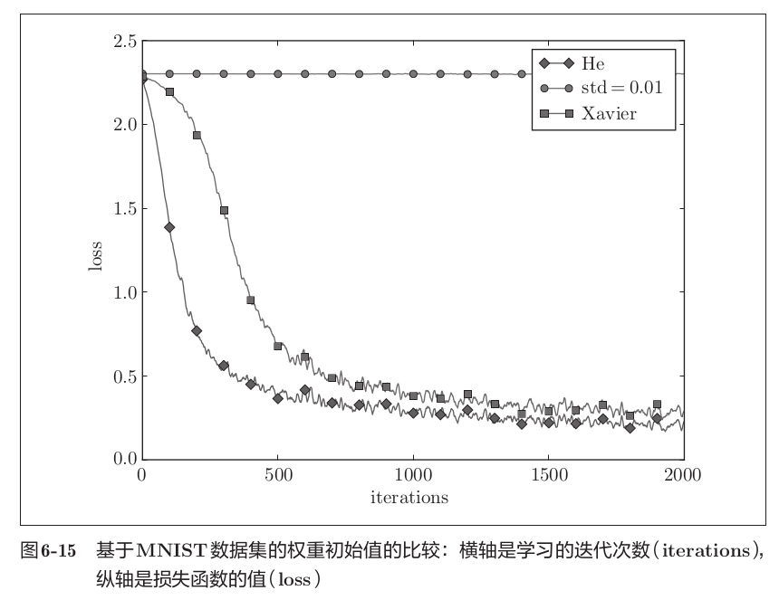
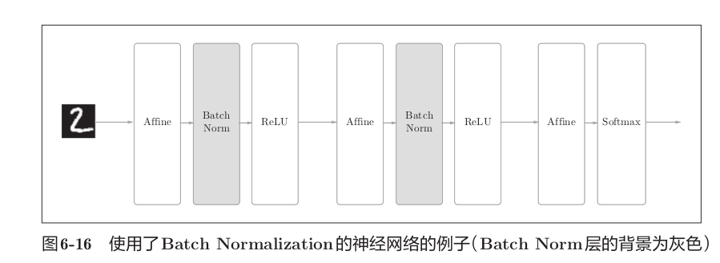
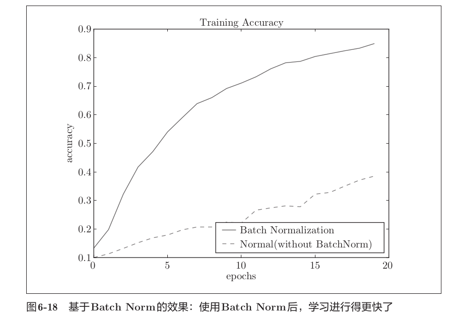
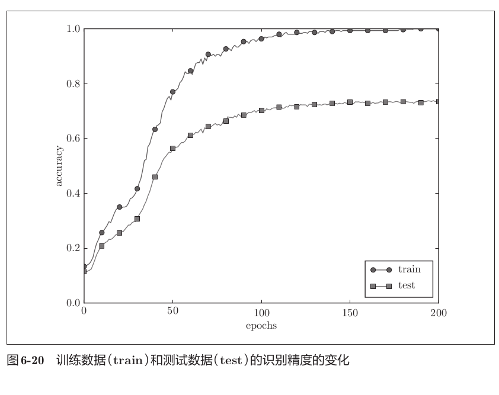
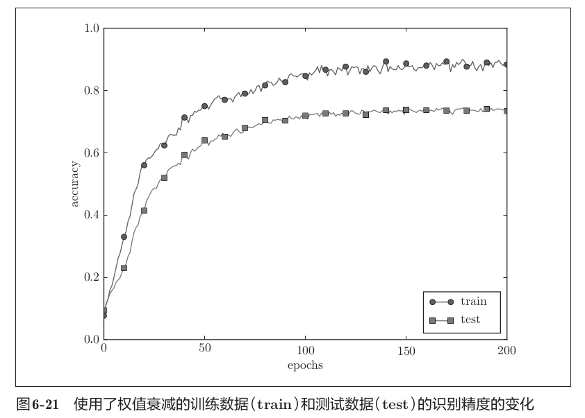
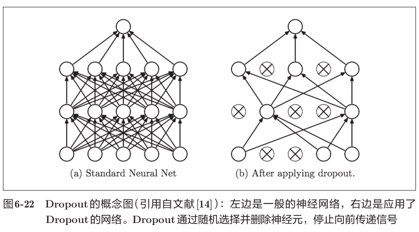
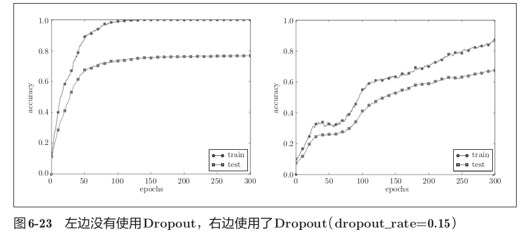

# 第六章 与学习相关的技巧

本章讨论深度学习中与“学习过程”直接相关的技巧。重点包括参数更新算法、权重初始化、Batch Normalization、正则化手段以及超参数验证。有效应用这些技巧，可以让训练更稳定、更快收敛，并改善模型的泛化能力。

## 6.1 参数的更新

### 6.1.1 随机梯度下降法（SGD）

随机梯度下降法（Stochastic Gradient Descent，SGD）是在每个 mini-batch 上计算梯度并更新参数。它的核心公式为：

$$
W \leftarrow W - \eta \, \frac{\partial L}{\partial W}
$$

这里 $\eta$ 是学习率，$\frac{\partial L}{\partial W}$ 是损失函数对权重 $W$ 的梯度。SGD 的实现非常简单：

```python
for W, dW in zip(params, dWs):
    # dW 是当前 mini-batch 的梯度
    W -= learning_rate * dW
```

SGD 的优点是每次更新的计算量小，适合大规模数据集；它的噪声性质有时还能帮助参数逃离局部极小值。但缺点也很明显：在某些方向上，参数更新可能振荡；在另一些方向上，更新速度又可能非常慢。

> 选择合适的学习率非常关键。学习率过大会导致训练发散，过小则使训练过程非常缓慢。

### 6.1.2 Momentum

Momentum（动量法）试图让参数更新带有惯性，从而抑制振荡并加快下降。它引入一个速度变量 $v$：

$$
\begin{aligned}
 v &\leftarrow \alpha v - \eta \, \frac{\partial L}{\partial W} \\
 W &\leftarrow W + v
\end{aligned}
$$

其中 $\alpha$ 是动量系数，常取 $0.9$,这里的 $\alpha$ 起到摩擦力的作用，即物体不受梯度力时速度会逐渐减小。如果最近几次更新的方向一致，则动量会让参数继续沿该方向前进；如果更新方向反复变化，则动量会起到平滑作用。

```python
velocity = momentum * velocity - learning_rate * dW
W += velocity
```

动量法尤其适合在鞍面或较陡峭与较平坦方向并存的优化问题中使用。

### 6.1.3 AdaGrad

AdaGrad 的核心思想是对不同参数采用自适应学习率。它记录梯度平方的累积历史，并用它来缩放当前梯度：

$$
\begin{aligned}
 h &\leftarrow h + \left(\frac{\partial L}{\partial W}\right)^2 \\
 W &\leftarrow W - \eta \, \frac{\frac{\partial L}{\partial W}}{\sqrt{h} + \epsilon}
\end{aligned}
$$

这里 $h$ 是累积的梯度平方和，$\epsilon$ 用于数值稳定。

```python
h += dW * dW
W -= learning_rate * dW / (np.sqrt(h) + epsilon)
```

AdaGrad 会让频繁更新的参数学习率变小，而对稀疏参数保持较大的步长。因此它在自然语言处理等稀疏特征场景中表现良好，但长期训练时可能使学习率过早下降，直至0,所以有新的方法可以弥补这一缺点，也就是让h并非无止境的增大，即选择性遗忘过去的梯度，将h控制在合理的范围内，方法为RMSPORP。

### 6.1.4 Adam

Adam 结合了 Momentum 和自适应学习率的思想，是目前最常用的优化器之一。它维护一阶矩和二阶矩估计：

$$
\begin{aligned}
 m &\leftarrow \beta_1 m + (1 - \beta_1) \, \frac{\partial L}{\partial W} \\
 v &\leftarrow \beta_2 v + (1 - \beta_2) \, \left(\frac{\partial L}{\partial W}\right)^2 \\
 \hat m &= \frac{m}{1 - \beta_1^t} \\
 \hat v &= \frac{v}{1 - \beta_2^t} \\
 W &\leftarrow W - \eta \, \frac{\hat m}{\sqrt{\hat v} + \epsilon}
\end{aligned}
$$

其中 $\beta_1$ 和 $\beta_2$ 分别是一阶矩和二阶矩的衰减率，常见取值为 $0.9$ 和 $0.999$。

```python
m = beta1 * m + (1 - beta1) * dW
v = beta2 * v + (1 - beta2) * (dW ** 2)
m_hat = m / (1 - beta1 ** t)
v_hat = v / (1 - beta2 ** t)
W -= learning_rate * m_hat / (np.sqrt(v_hat) + epsilon)
```

Adam 的优势在于它对不同参数自动调整步长，且同时保留梯度历史信息，使得训练更稳定。

### 6.1.5 更新方法比较

- SGD：最简单，适合大规模训练，但需要精心调节学习率，收敛速度慢。
- Momentum：在 SGD 上加速，抑制振荡，适合具有陡峭/平坦方向的损失面。
- AdaGrad：对稀疏参数有优势，但长期训练时可能使学习率过早衰减，有优化方法。
- Adam：默认选择之一，收敛稳定，适合调参时间有限的场景。

在实践中，Adam 是一个良好的默认选择；而对于大规模卷积网络，SGD + Momentum 往往能获得更好的泛化性能。





## 6.2 权重的初始值

### 6.2.1 权重能否初始化为 0？

如果将所有权重初始化为 0，神经网络中的所有隐藏神经元将变得完全相同。前向传播结果相同，反向传播得到的梯度也相同。因此每一层的神经元都沿着相同路径更新，网络无法学习到不同的特征。(如果权重全部为0,那么对于n+1层来说,第n层对其输入全部为0,那么在使用反向传播计算梯度时，这一层的梯度最终结果也必然是相等的，依次前推，各个参数对于损失函数的梯度完全相等，那么他们的更新也完全相同，这显然偏离了学习的本来目的，学习就是为了区分，区分每个参数的重要性)

因此，必须使用随机初始化来打破对称性，使不同神经元从不同的起点开始学习。

### 6.2.2 隐藏层激活值的分布

隐藏层激活值的分布决定了信号在网络中是否能够顺利传递。设某一层的输入为 $x$，权重矩阵为 $W$，则线性变换后的输出为：

$$
y = W x + b.
$$

如果 $x$ ，权重 $W_{ij}$ 的均值接近 0，且权重 $W_{ij}$ 的方差为 $\sigma^2$，二者都需要满足独立同分布条件，那么输出 $y$ 的方差大致与输入层通道数 $n$ 成正比：

$$
\text{Var}(y_i) \approx n \, \sigma^2 \, \text{Var}(x).
$$

这说明权重初始方差直接影响每层输出的尺度。

当权重太大时，经过 sigmoid 或 tanh 等饱和激活函数后，激活值会集中在接近 0 或 1 的区域，此时导数 $\frac{\mathrm{d}f}{\mathrm{d}z}$ 很小，反向传播时梯度会被压缩，容易出现梯度消失。反过来，权重太小时，输出接近 0，信号变弱，网络难以学习到有效特征。

因此，理想的初始化应让每一层激活值保持在一个合理范围，使前向传播信号既不过分放大，也不过分衰减；同时让反向传播梯度在层间不会迅速衰减或爆炸。

对于使用 sigmoid 或 tanh 激活函数的网络，一个常见的初始化策略是让权重方差与输入通道数成反比：

\[
W \sim \mathcal{N}\left(0, {\frac{1}{\text{fan\_in}}}\right)
\]

**解释**：权重 \(W\) 从**均值为 0、方差为 \({\frac{1}{\text{fan\_in}}}\)** 的正态分布中随机采样。

对应的初始化代码为：

```python
W = np.random.randn(fan_in, fan_out) * np.sqrt(1.0 / fan_in)
```

这就是书中提到的 Xavier 初始化。

### 6.2.3 ReLU 的权重初始化

对于 ReLU 激活函数，负值会被截断为 0，因此有效激活的数量约为一半。为了补偿这一变化，He 初始化建议权重方差为：

$$
W \sim \mathcal{N}\left(0, \frac{2}{\text{fan\_in}}\right)
$$

**解释**：权重 $W$ 从**均值为 0、方差为 $\frac{2}{\text{fan\_in}}$** 的正态分布中随机采样。其中 $\text{fan\_in}$ 是该层输入神经元的个数。目的是让经过该层线性变换后的输出方差与输入方差保持一致，防止信号在前向传播中爆炸或消失。

```python
W = np.random.randn(fan_in, fan_out) * np.sqrt(2.0 / fan_in)
```

He 初始化可以保持 ReLU 网络前向传播时的信号尺度稳定，减轻深层网络训练初期的梯度问题。

### 6.2.4 MNIST 上的比较

在 MNIST 这类手写数字识别任务中，实验显示：

- 对于 sigmoid 或 tanh 激活函数，Xavier 初始化更容易让训练稳定收敛。
- 对于 ReLU 激活函数，He 初始化通常能取得更快的收敛速度。

权重初始化本身不会决定最终性能，但它对训练早期的表现有较大影响。



## 6.3 Batch Normalization

Batch Normalization（BN）是为了稳定深层网络训练而提出的一种方法。它的核心思想是**将某一层输入的激活值在 mini-batch 内进行标准化，从而减少每层输入分布的变化**。这种变化被称为“内部协变量偏移”（internal covariate shift）。
 
不是直接由Affine到激活函数（此处为ReLU函数），而是中间经过 Batch Norm层进行标准化后再到激活函数。

BN 的基本步骤如下：

$$
\begin{aligned}
 \mu &= \frac{1}{m} \sum_{i=1}^m x_i, \\
 \sigma^2 &= \frac{1}{m} \sum_{i=1}^m (x_i - \mu)^2, \\
 \hat x &= \frac{x - \mu}{\sqrt{\sigma^2 + \epsilon}}, \\
 y &= \gamma \hat x + \beta.
\end{aligned}
$$

- 第一步计算当前 mini-batch 的均值 $\mu$；
- 第二步计算当前 mini-batch 的方差 $\sigma^2$；
- 第三步将输入归一化得到 $\hat x$，使其均值为 0、方差为 1；
- 第四步再使用可学习参数 $\gamma$ 和 $\beta$ 对归一化结果进行线性变换，恢复网络的表达能力。

其中，$\epsilon$ 是用于避免除以 0 的小常数；$\gamma$ 和 $\beta$ 可以让网络在标准化之后重新调整尺度与偏移，不损失表达能力。

在代码层面，前向传播可以写成：

```python
mu = x.mean(axis=0)                       # 计算 mini-batch 的均值
var = x.var(axis=0)                        # 计算 mini-batch 的方差
x_norm = (x - mu) / np.sqrt(var + eps)     # 对输入进行归一化
out = gamma * x_norm + beta                # 缩放和平移
```

这里 $x$ 的形状通常为 $(N, D)$，其中 $N$ 是 mini-batch 大小，$D$ 是特征维度。

使用 BN 能够让**学习速度加快**：

## 6.4 正则化

### 6.4.1 过拟合

过拟合是指模型在训练集上表现很好，但在测试集或新数据上表现下降。这通常发生在模型容量大、训练时间长或训练数据不足时。深度网络表达能力强，更容易记住训练数据中的噪声和异常样本，因此需要正则化手段来提高泛化能力。

### 6.4.2 权值衰减

正则化在机器学习领域内就是让模型更加符合规律，避免拟合曲线的突变，要尽量平滑，而权重是影响变化大小的因素，权重过大，模型对于x的变化非常敏感，变化距离，因此需要在损失函数后面添加惩罚项，抑制过大的权重。
权值衰减（L2 正则化）是在损失函数 $L$ 中加上 $\frac{\lambda}{2}$ 倍的权重平方和 $\sum W^2$：

$$
L = L_{\text{orig}} + \frac{\lambda}{2} \sum W^2.
$$

相应地，梯度会增加一项：

$$
\frac{\partial L}{\partial W} = \frac{\partial L_{\text{orig}}}{\partial W} + \lambda W.
$$

你会发现，这样处理，会使得大权重的更新衰减的更多，有效的抑制了大权重的产生
实现时可以这样写：

```python
dW += weight_decay * W
W -= learning_rate * dW
```

权值衰减可以抑制权重过大，使模型更平滑，从而降低过拟合风险。

### 6.4.3 Dropout

Dropout 在训练时以一定概率随机丢弃神经元输出，使网络每次前向传播时相当于使用不同的子网络。这种随机化能够降低神经元间的共适应关系。

```python
mask = (np.random.rand(*x.shape) < keep_prob)
out = x * mask
out /= keep_prob
```

测试阶段不再丢弃神经元，而是直接使用完整网络输出。

Dropout 的核心思想是让模型具有更强的鲁棒性，从而提高泛化表现。
Dropout 通过随机丢弃神经元，既破坏了网络内部复杂的“协同依赖”，又在隐式地训练和集成无数个子模型，同时迫使模型在残缺信息下做判断，这三个机制共同作用，大大降低了模型对训练数据中特定噪声的敏感度，从而强力抑制过拟合。


图 6-23 中，通过使用 Dropout，训练数据和测试数据的识别精度的差距变小了。并且，训练数据也没有到达 100% 的识别精度。像这样，通过使用 Dropout，即便是表现力强的网络，也可以抑制过拟合。

## 6.5 超参数的验证

超参数（如各层神经元数量、batch大小、学习率、权值衰减系数等）不像权重和偏置可通过梯度下降自动学习，其取值对模型性能有决定性影响。本节聚焦于如何高效地寻找合适的超参数取值。

### 6.5.1 验证数据

#### 数据划分的职责

在之前的实验中，数据被划分为**训练数据**和**测试数据**，分别用于参数学习和泛化能力评估。但评估超参数性能时，**必须使用独立的验证数据**，绝不能使用测试数据来调整超参数。

#### 为何不能用测试数据调超参数

若使用测试数据评估超参数的"好坏"，超参数的值将逐渐被调整到仅拟合测试数据。这会导致模型对测试数据过拟合，最终评估时看似性能良好，实则泛化能力低下，无法应对其他新数据。

#### 验证数据的获取方式

- 有的数据集会预先划分为训练、验证、测试三部分。
- 若未预先划分，用户需自行分割。通常的做法是从训练数据中分离出一部分作为验证数据，例如从MNIST的训练集中分割20%作为验证集。

#### MNIST上的分割实现

```python
x_train, t_train, (x_test, t_test) = load_mnist()

# 打乱训练数据（防止数据偏斜）
x_train, t_train = shuffle_dataset(x_train, t_train)

# 分割验证数据
validation_rate = 0.20
validation_num = int(x_train.shape[0] * validation_rate)

x_val = x_train[:validation_num]
t_val = t_train[:validation_num]
x_train = x_train[validation_num:]
t_train = t_train[validation_num:]
```

分割前先打乱数据是为了避免数据按类别顺序排列导致的偏差。打乱操作可使用 `np.random.shuffle` 实现。

#### 数据用途总结

- **训练数据**：用于权重和偏置的学习。
- **验证数据**：用于超参数的性能评估与选择。
- **测试数据**：仅在最后使用一次，用于确认最终的泛化能力。

### 6.5.2 超参数的最优化

#### 核心策略：逐步缩小范围

超参数最优化的有效方法是**从粗到细逐步缩小"好值"的可能范围**。具体流程如下：

- **步骤0**：大致设定超参数的范围（通常以对数尺度指定，如 $10^{-3}$ 到 $10^{3}$）。
- **步骤1**：从设定的范围中随机采样一组超参数。
- **步骤2**：用采样得到的超参数进行学习，通过验证数据评估识别精度（为了节省时间，可减少epoch数）。
- **步骤3**：重复步骤1和步骤2多次（如100次），根据精度的好坏缩小超参数的范围。

反复执行上述循环，不断收窄范围，最终在缩小的范围内选定一组超参数。

#### 随机采样 vs 网格搜索

有研究指出，**随机采样**比有规律的网格搜索更有效。原因在于不同超参数对最终识别精度的影响程度各异，随机采样能以更高的概率覆盖到影响较大的超参数的关键区间。

#### 深度学习中的时间考量

深度学习训练往往耗时较长（数天至数周）。因此，在超参数搜索过程中，应**尽早放弃表现不佳的超参数组合**，并通过减少epoch数来缩短单次评估的时间。

#### 进阶方法

本节介绍的方法偏向实践性，带有经验色彩。若需更严谨高效的方法，可参考**贝叶斯最优化**（Bayesian optimization），它基于贝叶斯定理进行更智能的搜索。

### 6.5.3 超参数最优化的实现

#### 实验设定

以MNIST数据集为例，将**学习率（lr）** 和**权值衰减系数（weight decay）** 作为搜索对象。初始范围设定如下：

- 学习率：$10^{-6}$ 到 $10^{-2}$
- 权值衰减系数：$10^{-8}$ 到 $10^{-4}$

#### 随机采样代码

```python
import numpy as np

weight_decay = 10 ** np.random.uniform(-8, -4)
lr = 10 ** np.random.uniform(-6, -2)
```

`np.random.uniform(a, b)` 在区间 $[a, b)$ 内均匀采样，再利用 $10^{\text{值}}$ 将对数尺度映射为实际数值。

#### 实验结果与分析

经过多次随机采样和训练（使用少量epoch），按验证数据上的识别精度从高到低排序，得到以下结果：

| 排名 | 验证精度 | 学习率（lr） | 权值衰减系数 |
|------|----------|--------------|--------------|
| Best-1 | 0.83 | 0.0092 | 3.86e-07 |
| Best-2 | 0.78 | 0.00956 | 6.04e-07 |
| Best-3 | 0.77 | 0.00571 | 1.27e-06 |
| Best-4 | 0.74 | 0.00626 | 1.43e-05 |
| Best-5 | 0.73 | 0.0052 | 8.97e-06 |

#### 范围缩小与迭代

从上述结果可观察到：

- **学习率**的良好范围约为 **0.001 ~ 0.01**。
- **权值衰减系数**的良好范围约为 **$10^{-8} \sim 10^{-6}$**。

据此，可将搜索范围缩窄至上述区间，然后重复随机采样、训练和评估的过程。经过多轮迭代后，最终从缩小的范围中选定一组超参数作为最终配置。
