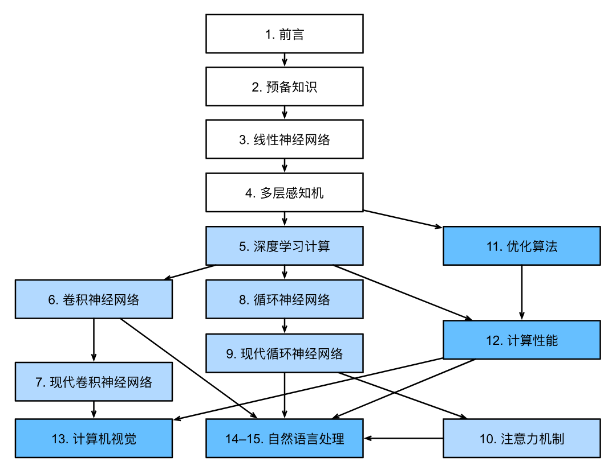

#  引言

## 1.1 日常生活中的机器学习

机器学习（Machine Learning，ML）是一类强大的可以从经验中学习的技术。深度学习（Deep Learning，DL）是机器学习的一个主要分支，是一套强大的技术，可以推动计算机视觉、自然语言处理、医疗保健和基因组学等不同领域的创新。

以唤醒词识别为例（如"Alexa"、"Hey Siri"），我们不需要编写一个"明确地"识别唤醒词的程序，而是只需要定义一个灵活的程序算法，其输出由许多参数决定，然后使用数据集来确定当下的"最佳参数集"。任一调整参数后的程序被称为模型（model），使用数据集来选择参数的元程序被称为学习算法（learning algorithm）。

训练过程通常包含如下步骤：
1. 从一个随机初始化参数的模型开始；
2. 获取一些数据样本（例如，音频片段以及对应的是/否标签）；
3. 调整参数，使模型在这些样本中表现得更好；
4. 重复第（2）步和第（3）步，直到模型表现令人满意。

这种"通过用数据集来确定程序行为"的方法可以被看作"用数据编程"（programming with data）。


## 1.2 机器学习中的关键组件

无论什么类型的机器学习问题，都会遇到以下核心组件：

### 1.2.1 数据

每个数据集由一个个样本组成，大多时候它们遵循独立同分布（i.i.d.）。
样本通常由一组称为**特征**（features）的属性组成，要预测的属性称为**标签**（label）或**目标**（target）。

- 固定长度特征向量是方便属性，但并非所有数据都符合（如文本、不同分辨率的图像）
- 深度学习的一个主要优势是可以处理不同长度的数据
- 数据量越大，工作越容易，但仅仅拥有海量数据不够，还需要正确的数据
- 数据不均衡或包含社会偏见时，模型可能产生偏见

### 1.2.2 模型

深度学习与经典方法的区别在于：前者关注**功能强大的模型**，这些模型由神经网络错综复杂地交织在一起，包含层层数据转换。

### 1.2.3 目标函数

定义模型**优劣程度**的度量，通常希望优化到最低点，因此也称为损失函数（loss function）或成本函数。

- 回归问题常用损失函数：平方误差（squared error）
- 分类问题常用损失函数：交叉熵（cross-entropy）
- 训练数据集：用于拟合模型参数
- 测试数据集：用于评估拟合的模型
- 过拟合（overfitting）：模型在训练集上表现良好，但不能推广到测试集

### 1.2.4 优化算法

搜索出最佳参数以最小化损失函数。深度学习中大多流行的优化算法基于梯度下降（gradient descent）。


## 1.3 各种机器学习问题

### 1.3.1 监督学习

擅长在"给定输入特征"的情况下预测标签。每个"特征-标签"对称为一个样本。大部分机器学习的成功应用都使用了监督学习。

#### 回归

标签取任意数值时称为回归问题，如预测房价、电影评分、住院时间等。判断经验：任何有关"有多少"的问题很可能是回归问题。

#### 分类

预测样本属于哪个类别。二项分类（binomial classification）只有两类；多项分类（multiclass classification）有两个以上的类别。

#### 标记问题

多标签分类（multi-label classification）：学习预测不相互排斥的类别。

#### 搜索与推荐系统

搜索需要对项目进行排序；推荐系统向特定用户进行"个性化"推荐。

#### 序列学习

输入是连续的，模型需要"记忆"功能，如视频处理、机器翻译、语音识别等。

### 1.3.2 无监督学习

数据中不含有"目标"的机器学习问题，包括聚类、主成分分析、因果关系和概率图模型、生成对抗性网络等。

### 1.3.3 强化学习

智能体（agent）与环境交互，通过观察、动作和奖励循环学习，目标是产生一个好的策略（policy）。深度强化学习将深度学习应用于强化学习问题。


## 1.4 起源与深度学习的发展

神经网络的发展受生物神经元的启发，核心原则包括：
- 线性和非线性处理单元的交替（称为层）
- 使用链式规则（反向传播）调整网络参数

深度学习的复兴得益于两个关键因素：
1. **大数据**：互联网公司提供大规模数据集
2. **算力**：GPU的普及使大规模计算成为可能

深度学习框架的演进极大地简化了工作：从早期的Caffe、Torch、Theano，到如今的TensorFlow、PyTorch、MXNet等。


## 1.5 小结

- 机器学习研究计算机系统如何利用经验（通常是数据）来提高特定任务的性能
- 表示学习研究如何自动找到合适的数据表示方式，深度学习是多层次的表示学习
- 深度学习不仅取代了传统机器学习的浅层模型，还取代了特征工程
- 大数据和GPU算力是深度学习突破的关键
- 整个系统优化是获得高性能的关键，开源框架使这变得容易

# 前言

## 一、关于本书
### 1.1 一种结合了代码、数学和HTML的媒介

应用深度学习需要同时了解四个方面：
1. 以特定方式提出问题的**动机**
2. 给定建模方法的**数学**
3. 将模型拟合数据的**优化算法**
4. 能够有效训练模型、克服数值计算缺陷并最大限度地利用现有硬件的**工程方法**


### 1.2 内容和结构

全书分为三个部分：

**第一部分：基础知识和预备知识**
- 第1章：深度学习入门课程
- 第2章：预备知识（数据存储与处理、线性代数、微积分、概率）
- 第3章：线性神经网络（线性回归、softmax回归）
- 第4章：多层感知机（MLP、正则化）

**第二部分：现代深度学习技术**
- 第5章：深度学习计算（模型构建、参数管理、GPU）
- 第6章：卷积神经网络（CNN）基础
- 第7章：现代卷积神经网络（AlexNet、VGG、ResNet等）
- 第8章：循环神经网络（RNN）基础
- 第9章：现代循环神经网络（GRU、LSTM、seq2seq）
- 第10章：注意力机制（Transformer）

**第三部分：可伸缩性、效率和应用程序**
- 第11章：优化算法（SGD、Adam等）
- 第12章：计算性能（GPU、多GPU、分布式）
- 第13章：计算机视觉应用
- 第14章：NLP预训练（word2vec、BERT）
- 第15章：NLP应用（情感分析、自然语言推断）

### 1.4 代码

本书大部分章节以可执行代码为特色。`d2l` 包封装了本书中经常导入和引用的函数、类等。`d2l` 包依赖以下模块：

```python
#@save
# collections 提供额外的数据结构，如 Counter（计数器）、defaultdict（默认字典）、OrderedDict（有序字典）
import collections

# hashlib 提供哈希算法（如 SHA-1、MD5），常用于文件完整性校验和数据去重
import hashlib

# math 提供数学函数，如 sqrt、log、exp、三角函数等
import math

# os 提供操作系统接口，用于文件和目录操作（创建、删除、路径拼接、环境变量等）
import os

# random 提供随机数生成函数，如 random.shuffle（打乱）、random.choice（随机选择）、random.randint（随机整数）
import random

# re 提供正则表达式操作，用于字符串的模式匹配、查找、替换和分割
import re

# shutil 提供高级文件操作，如复制文件、移动文件、删除目录树、压缩/解压文件
import shutil

# sys 提供 Python 解释器相关的变量和函数，如 sys.path（模块搜索路径）、sys.modules（已加载模块）、sys.argv（命令行参数）
import sys

# tarfile 提供 tar 归档文件的读写操作，用于创建和解压 .tar、.tar.gz、.tgz 等格式的压缩包
import tarfile

# time 提供时间相关函数，如 time.time（获取当前时间戳）、time.sleep（程序休眠）
import time

# zipfile 提供 zip 归档文件的读写操作，用于创建和解压 .zip 格式的压缩包
import zipfile

# defaultdict 是 collections 模块中的一种字典子类，当访问不存在的键时，会自动返回一个默认值（而非抛出 KeyError）
from collections import defaultdict

# pandas 是 Python 的数据分析库，提供 DataFrame（数据表）结构，用于数据读取、清洗、处理和统计分析
import pandas as pd

# requests 是 Python 的 HTTP 库，用于发送网络请求（GET、POST 等），从互联网下载数据或调用 API
import requests

# IPython.display 提供在 Jupyter Notebook 中显示各种内容的功能，如 display（显示对象）、Image（显示图片）、HTML（显示 HTML 内容）
from IPython import display

# matplotlib 是 Python 的绘图库，pyplot 提供类似 MATLAB 的绘图接口，用于绘制折线图、散点图、直方图等
from matplotlib import pyplot as plt

# matplotlib_inline.backend_inline 用于在 Jupyter Notebook 中内联显示 matplotlib 图形，使图表直接呈现在单元格输出中
from matplotlib_inline import backend_inline

# d2l = sys.modules[__name__] 将当前模块自身赋值给 d2l
# 这允许在模块内部定义函数和类后，通过 d2l.xxx 的方式调用自身的内容
# 相当于给当前模块起了一个别名 d2l，方便在模块内部引用自己
d2l = sys.modules[__name__]
```

本书代码基于 **PyTorch** 实现：

```python
#@save
import numpy as np

# torch 是 PyTorch 的核心库，提供张量操作、自动求导、神经网络模块等
# PyTorch 是一个基于 Python 的开源深度学习框架，torch 就是它的主模块
import torch

# torchvision 是 PyTorch 的计算机视觉扩展库
# 提供常用的数据集（如 MNIST、CIFAR-10、ImageNet）、预训练模型和图像处理工具
import torchvision

# PIL（Python Imaging Library）是 Python 的图像处理库
# Image 模块用于打开、操作和保存图像文件（如 JPEG、PNG 格式）
from PIL import Image

# nn 是 torch 中的神经网络模块（Neural Network）
# 提供构建神经网络所需的所有组件：层（Linear、Conv2d）、损失函数、容器（Sequential）等
from torch import nn

# functional 是 nn 中的函数式接口，通常简写为 F
# 提供不包含可学习参数的函数，如激活函数（relu、sigmoid）、池化（max_pool2d）、卷积（conv2d）等
from torch.nn import functional as F

# utils 中的 data 模块提供数据加载和批处理工具
# 包含 Dataset（数据集抽象类）和 DataLoader（批量加载器，支持多进程、打乱、批处理）
from torch.utils import data

# transforms 是 torchvision 中的图像预处理和增强工具
# 提供常见的图像变换操作：ToTensor（转为张量）、Normalize（标准化）、RandomCrop（随机裁剪）等
from torchvision import transforms
```


### 1.5 论坛

本书相关的论坛：[discuss.d2l.ai](https://discuss.d2l.ai/)


## 二、小结

- 深度学习已经彻底改变了模式识别，引入了一系列技术，包括计算机视觉、自然语言处理、自动语音识别
- 要成功地应用深度学习，必须知道如何抛出一个问题、建模的数学方法、将模型与数据拟合的算法，以及实现所有这些的工程技术
- 本书提供了文本、图表、数学和代码的全面资源
- 所有Jupyter Notebook都可以在GitHub上下载

# 符号说明

## 一、数字

| 符号 | 含义 | 说明 |
|------|------|------|
| $x$ | 标量 | 单个数值，如学习率 0.01 |
| $\mathbf{x}$ | 向量 | 一维数组，如一个样本的特征向量 |
| $\mathbf{X}$ | 矩阵 | 二维数组，如一批样本的特征矩阵 |
| $\mathsf{X}$ | 张量 | 多维数组（三维及以上），如图像数据（通道×高×宽） |
| $\mathbf{I}$ | 单位矩阵 | 对角线为 1，其余为 0 的方阵 |
| $x_i$, $[\mathbf{x}]_i$ | 向量第 $i$ 个元素 | 索引从 1 开始（数学惯例），而非 0 |
| $x_{ij}$, $[\mathbf{X}]_{ij}$ | 矩阵第 $i$ 行第 $j$ 列的元素 | 行索引在前，列索引在后 |


## 二、集合论

| 符号 | 含义 | 说明 |
|------|------|------|
| $\mathcal{X}$ | 集合 | 如 $\mathcal{X} = \{1, 2, 3\}$ |
| $\mathbb{Z}$ | 整数集合 | 包含所有整数 $\{\dots, -2, -1, 0, 1, 2, \dots\}$ |
| $\mathbb{R}$ | 实数集合 | 包含所有实数（有理数 + 无理数） |
| $\mathbb{R}^n$ | $n$ 维实数向量集合 | 如 $\mathbb{R}^3$ 表示三维空间中的所有向量 |
| $\mathbb{R}^{a\times b}$ | $a\times b$ 实数矩阵集合 | 如 $\mathbb{R}^{2\times 3}$ 表示 $2$ 行 $3$ 列的矩阵 |
| $\mathcal{A}\cup\mathcal{B}$ | 并集 | 属于 $\mathcal{A}$ **或**属于 $\mathcal{B}$ 的元素 |
| $\mathcal{A}\cap\mathcal{B}$ | 交集 | 同时属于 $\mathcal{A}$ **且**属于 $\mathcal{B}$ 的元素 |
| $\mathcal{A}\setminus\mathcal{B}$ | 相对补集 | 属于 $\mathcal{A}$ **但不属于** $\mathcal{B}$ 的元素 |

>使用花体（\mathcal）表示集合


## 三、函数和运算符

| 符号 | 含义 | 说明 |
|------|------|------|
| $f(\cdot)$ | 函数 | 如 $f(x) = x^2$ |
| $\log(\cdot)$ | 自然对数 | 底数为 $e$（约 2.718），记为 $\ln$ |
| $\exp(\cdot)$ | 指数函数 | 即 $e^x$ |
| $\mathbf{1}_\mathcal{X}$ | 指示函数 | 条件成立为 1，否则为 0 |
| $\mathbf{(\cdot)}^\top$ | 转置 | 矩阵行变列，列变行 |
| $\mathbf{X}^{-1}$ | 矩阵的逆 | 满足 $\mathbf{X}\mathbf{X}^{-1} = \mathbf{I}$ |
| $\odot$ | 按元素相乘 | 两个同形状矩阵对应位置元素相乘（Hadamard 积） |
| $[\cdot, \cdot]$ | 连结 | 沿指定维度拼接两个张量 |
| $\lvert \mathcal{X} \rvert$ | 集合的基数 | 集合中元素的个数 |
| $\|\cdot\|_p$ | $L_p$ 范数 | 向量的 $p$ 范数，$\|\mathbf{x}\|_p = \left(\sum_i \|x_i\|^p\right)^{1/p}$ |
| $\|\cdot\|$ | $L_2$ 范数 | 向量的欧几里得长度，$\|\mathbf{x}\| = \sqrt{\sum_i x_i^2}$ |
| $\langle \mathbf{x}, \mathbf{y} \rangle$ | 点积 | $\mathbf{x}^\top\mathbf{y} = \sum_i x_i y_i$ |
| $\sum$ | 连加 | 求和运算 |
| $\prod$ | 连乘 | 求积运算 |
| $\stackrel{\mathrm{def}}{=}$ | 定义 | 表示“定义为” |


$L_p$ 范数
定义：向量的 $p$ 范数定义为向量各元素绝对值 $p$ 次方之和的 $p$ 次方根：
$$\|\mathbf{x}\|_p = \left(\sum_{i} |x_i|^p\right)^{1/p}$$
$L_2$ 范数
特别地，当 $p=2$ 时，称为 $L_2$ 范数，即向量各元素平方之和的平方根（欧几里得长度）：

$$\|\mathbf{x}\| = \|\mathbf{x}\|_2 = \sqrt{\sum_{i} x_i^2}$$

## 四、微积分

| 符号 | 含义 | 说明 |
|------|------|------|
| $\frac{dy}{dx}$ | 导数 | 函数 $y$ 关于 $x$ 的变化率（一元函数） |
| $\frac{\partial y}{\partial x}$ | 偏导数 | 函数 $y$ 关于 $x$ 的变化率（多元函数，固定其他变量） |
| $\nabla_{\mathbf{x}} y$ | 梯度 | 多元函数所有偏导数组成的向量 |
| $\int_a^b f(x) \;dx$ | 定积分 | 函数 $f$ 在区间 $[a, b]$ 上的累积面积 |
| $\int f(x) \;dx$ | 不定积分 | 函数 $f$ 的原函数（反导数） |


## 五、概率与信息论

| 符号 | 含义 | 说明 |
|------|------|------|
| $P(\cdot)$ | 概率分布 | 随机变量取值的概率分配 |
| $z \sim P$ | 随机变量服从分布 $P$ | $z$ 从分布 $P$ 中采样 |
| $P(X \mid Y)$ | 条件概率 | 在 $Y$ 发生条件下，$X$ 发生的概率 |
| $p(x)$ | 概率密度函数 | 连续随机变量的概率密度（PDF） |
| ${E}_{x} [f(x)]$ | 数学期望 | 函数 $f$ 在随机变量 $x$ 分布上的平均值 |
| $X \perp Y$ | 独立 | 两个随机变量相互独立 |
| $X \perp Y \mid Z$ | 条件独立 | 在给定 $Z$ 的条件下，$X$ 和 $Y$ 独立 |
| $\mathrm{Var}(X)$ | 方差 | 随机变量偏离均值的平方的期望 |
| $\sigma_X$ | 标准差 | 方差的平方根 |
| $\mathrm{Cov}(X, Y)$ | 协方差 | 两个随机变量的线性相关程度 |
| $\rho(X, Y)$ | 相关性 | 归一化后的协方差，范围 $[-1, 1]$ |
| $H(X)$ | 熵 | 随机变量不确定性的度量 |
| $D_{\mathrm{KL}}(P\|Q)$ | KL 散度 | 分布 $P$ 和 $Q$ 之间的差异（非对称） |


## 六、复杂度

| 符号 | 含义 | 说明 |
|------|------|------|
| $\mathcal{O}$ | 大 O 标记 | 算法时间或空间复杂度的渐进上界，表示最坏情况下的增长速率 |


## 重要说明

1. **向量默认为列向量**，书中所有向量 $\mathbf{x}$ 默认是列向量，转置 $\mathbf{x}^\top$ 为行向量。
2. **索引从 1 开始**：书中数学符号的索引从 1 开始，而代码中从 0 开始（Python 惯例）。
3. **粗体/花体区分**：
   - 小写粗体（$\mathbf{x}$）= 向量
   - 大写粗体（$\mathbf{X}$）= 矩阵
   - 花体大写（$\mathcal{X}$）= 集合
   - 无衬线大写（$\mathsf{X}$）= 张量
4. **$L_p$ 范数**：$p=2$ 时即欧几里得距离，$p=1$ 时即绝对值之和，$p=\infty$ 时即最大绝对值。