# 第七章 现代卷积神经网络

## 本章概述

上一章我们学习了卷积神经网络（CNN）的基本原理和经典架构 LeNet。本章将沿着**计算机视觉发展的历史脉络**，介绍一系列在现代深度学习中占据主导地位的卷积神经网络架构。这些模型大多曾是 ImageNet 大规模视觉识别挑战赛（ILSVRC）的优胜者，它们推动了计算机视觉领域的飞速发展。

通过按时间顺序学习这些模型，我们可以理解**架构设计的演进逻辑**——从 AlexNet 的开创性突破，到 VGG 的模块化设计，再到 ResNet 的残差学习，每一步都解决了前一代模型的关键瓶颈。


### 本章将介绍的模型

| 模型 | 年份 | 核心创新 | 意义 |
|------|------|----------|------|
| **AlexNet** | 2012 | 深度CNN + ReLU + Dropout + GPU并行 | 首个在大规模视觉竞赛中击败传统方法的深度网络，开启了深度学习时代 |
| **VGG** | 2014 | 重复使用 \(3 \times 3\) 卷积块 | 证明了**网络深度**比卷积核大小更重要，模块化设计思想 |
| **NiN（网络中的网络）** | 2014 | \(1 \times 1\) 卷积替代全连接层 | 大幅减少参数，引入“跨通道信息融合”的思想 |
| **GoogLeNet（Inception）** | 2014 | Inception 模块（多尺度并行卷积） | 在同一层用不同大小的卷积核提取多尺度特征 |
| **ResNet（残差网络）** | 2015 | 残差连接（跨层跳跃连接） | 解决了深层网络训练困难的问题，可训练上百层甚至上千层 |
| **DenseNet（稠密网络）** | 2016 | 密集连接（每层与所有前层相连） | 特征重用，参数效率高，但计算成本较大 |


### 现代 CNN 架构演进的几个关键趋势

| 趋势 | 说明 |
|------|------|
| **越来越深** | 层数从 AlexNet 的 8 层到 ResNet 的 152 层甚至上千层 |
| **越来越宽** | 通道数逐渐增加（64 → 512 → 2048） |
| **引入跳跃连接** | ResNet 的残差连接解决了梯度消失问题 |
| **模块化设计** | VGG 的重复块、Inception 模块、ResNet 的残差块 |
| **批量归一化** | 加速训练、提高稳定性，是现代网络的标配 |
| **\(1 \times 1\) 卷积** | NiN 引入，用于通道数调整和信息融合 |


### 章节结构

```
第七章：现代卷积神经网络
│
├── 7.1 AlexNet
│   ├── 背景：ImageNet 竞赛
│   ├── 架构：8层（5卷积 + 3全连接）
│   └── 创新：ReLU、Dropout、GPU并行
│
├── 7.2 VGG
│   ├── 核心思想：重复相同的 \(3 \times 3\) 卷积块
│   └── 优势：结构简洁、易于扩展
│
├── 7.3 NiN
│   ├── 核心思想：\(1 \times 1\) 卷积代替全连接层
│   └── 优势：参数更少，可灵活控制通道数
│
├── 7.4 GoogLeNet
│   ├── 核心思想：Inception 模块（多尺度并行卷积）
│   └── 优势：在保持计算效率的同时提取多尺度特征
│
├── 7.5 批量归一化
│   ├── 核心思想：对每层输出做标准化
│   └── 优势：加速训练、允许更大学习率、缓解过拟合
│
├── 7.6 ResNet
│   ├── 核心思想：残差连接 \(H(x) = F(x) + x\)
│   └── 优势：解决梯度消失，可训练极深网络
│
└── 7.7 DenseNet
    ├── 核心思想：密集连接（每层连接所有前层）
    └── 优势：特征重用，参数效率高
```

## 7.1 深度卷积神经网络（AlexNet）

在 LeNet 提出后的近二十年里，卷积神经网络虽然在小数据集上表现良好，但并未主导计算机视觉领域。这是因为当时的神经网络在更大、更真实的数据集上训练时，性能和可行性仍有待验证。直到 2012 年，AlexNet 的出现打破了这一局面，它首次证明了**学习到的特征可以超越手工设计的特征**，并开启了深度学习的时代。

### 7.1.1 历史背景：深度学习的“寒冬”

在 AlexNet 之前，计算机视觉的主流方法是 **手工设计特征 + 传统分类器** 的流水线：

1. 获取一个有趣的数据集。在早期，收集这些数据集需要昂贵的传感器（在当时最先进的图像也就100万像素）。
2. 根据光学、几何学、其他知识以及偶然的发现，手工对特征数据集进行预处理。
3. 通过标准的特征提取算法，如SIFT（尺度不变特征变换）和SURF（加速鲁棒特征）或其他手动调整的流水线来输入数据。
4. 将提取的特征送入最喜欢的分类器中（例如线性模型或其它核方法），以训练分类器。

> 当时的共识是：**推动领域进步的是数据特征，而不是学习算法。**

### 7.1.2 AlexNet 的突破：两个关键因素

#### 1. 大规模数据集：ImageNet

- 2009 年发布，包含 **100 万个样本**，**1000 个类别**
- 由李飞飞团队开发，利用谷歌图像搜索预筛选 + 亚马逊众包标注
- 发起了 ImageNet 挑战赛（ILSVRC），成为计算机视觉的竞赛标杆

#### 2. 硬件革命：GPU

- GPU 拥有数百至数千个核心，比 CPU 快几个数量级
- 2012 年，Alex Krizhevsky 和 Ilya Sutskever 使用 **NVIDIA GTX 580 GPU** 实现了快速卷积运算
- GPU 比 CPU 更适合深度学习中的矩阵乘法和卷积操作（高并行性）

> GPU 优势：功耗随频率平方增长，用 16 个慢核心替代 1 个快核心，综合性能更高。

### 7.1.3 AlexNet 的架构

AlexNet 由 **8 层**组成：**5 个卷积层 + 3 个全连接层**。
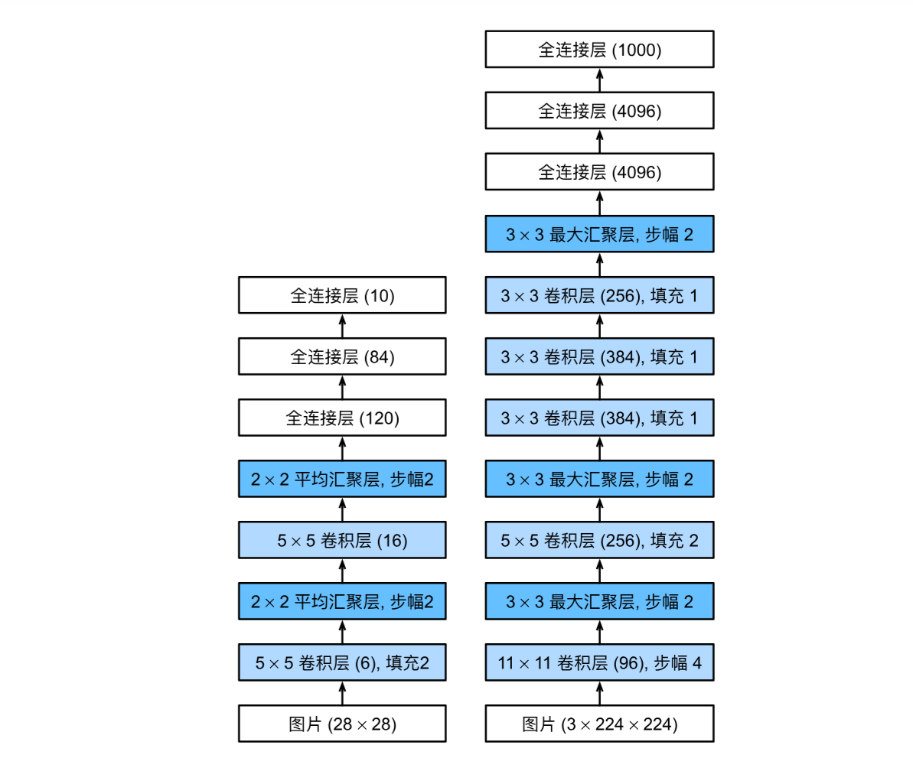

#### 关键改进

| 特性 | LeNet | AlexNet | 意义 |
|------|-------|---------|------|
| **层数** | 5 层 | 8 层 | 更深的网络能学习更复杂的特征 |
| **激活函数** | Sigmoid | **ReLU** | 计算简单，缓解梯度消失 |
| **正则化** | 权重衰减 | **Dropout** | 有效防止过拟合 |
| **卷积核大小** | 5×5 | 11×11、5×5、3×3 | 在大图像上捕获更大范围的特征 |
| **通道数** | 6、16 | 96、256、384、384、256 | 约是 LeNet 的 10 倍 |
| **全连接层** | 120、84 | 4096、4096 | 约 1GB 参数 |

#### 网络结构详解

| 层 | 操作 | 输入 → 输出形状 | 说明 |
|----|------|----------------|------|
| 1 | Conv2d + ReLU | (1, 224, 224) → (96, 54, 54) | 11×11 卷积核，步幅 4，padding=1 |
| 2 | MaxPool2d | (96, 54, 54) → (96, 26, 26) | 3×3 窗口，步幅 2 |
| 3 | Conv2d + ReLU | (96, 26, 26) → (256, 26, 26) | 5×5 卷积核，padding=2 |
| 4 | MaxPool2d | (256, 26, 26) → (256, 12, 12) | 3×3 窗口，步幅 2 |
| 5 | Conv2d + ReLU | (256, 12, 12) → (384, 12, 12) | 3×3 卷积核，padding=1 |
| 6 | Conv2d + ReLU | (384, 12, 12) → (384, 12, 12) | 3×3 卷积核，padding=1 |
| 7 | Conv2d + ReLU | (384, 12, 12) → (256, 12, 12) | 3×3 卷积核，padding=1 |
| 8 | MaxPool2d | (256, 12, 12) → (256, 5, 5) | 3×3 窗口，步幅 2 |
| 9 | Flatten | (256, 5, 5) → (6400,) | 展平 |
| 10 | Linear + ReLU | 6400 → 4096 | 全连接层 |
| 11 | Dropout | 4096 → 4096 | p=0.5 |
| 12 | Linear + ReLU | 4096 → 4096 | 全连接层 |
| 13 | Dropout | 4096 → 4096 | p=0.5 |
| 14 | Linear | 4096 → 10 | 输出层（Fashion-MNIST） |

### 7.1.4 PyTorch 实现

```python
import torch
from torch import nn
from d2l import torch as d2l

net = nn.Sequential(
    # 第一层：大卷积核，大步幅，减少空间尺寸
    nn.Conv2d(1, 96, kernel_size=11, stride=4, padding=1), nn.ReLU(),
    nn.MaxPool2d(kernel_size=3, stride=2),
    
    # 第二层：减小卷积核，增加通道数
    nn.Conv2d(96, 256, kernel_size=5, padding=2), nn.ReLU(),
    nn.MaxPool2d(kernel_size=3, stride=2),
    
    # 第三~五层：三个连续卷积层，通道数增加后减少
    nn.Conv2d(256, 384, kernel_size=3, padding=1), nn.ReLU(),
    nn.Conv2d(384, 384, kernel_size=3, padding=1), nn.ReLU(),
    nn.Conv2d(384, 256, kernel_size=3, padding=1), nn.ReLU(),
    nn.MaxPool2d(kernel_size=3, stride=2),
    
    # 全连接层
    nn.Flatten(),
    nn.Linear(6400, 4096), nn.ReLU(),
    nn.Dropout(p=0.5),
    nn.Linear(4096, 4096), nn.ReLU(),
    nn.Dropout(p=0.5),
    nn.Linear(4096, 10)
)
```

### 7.1.5 验证输出形状

```python
X = torch.randn(1, 1, 224, 224)
for layer in net:
    X = layer(X)
    print(layer.__class__.__name__, 'output shape:', X.shape)
```

### 7.1.6 读取数据集与训练 AlexNet

由于 Fashion-MNIST 图像分辨率（28×28）低于 ImageNet（224×224），需要调整图像大小：

```python
batch_size = 128
train_iter, test_iter = d2l.load_data_fashion_mnist(batch_size, resize=224)

lr, num_epochs = 0.01, 10
d2l.train_ch6(net, train_iter, test_iter, num_epochs, lr, d2l.try_gpu())
```

训练结果示例：
```
loss 0.326, train acc 0.881, test acc 0.879
4187.6 examples/sec on cuda:0
```

### 7.1.7 为什么 ReLU 比 Sigmoid 好？

| 特性 | Sigmoid | ReLU |
|------|---------|------|
| **计算** | 需要复杂的指数运算 | 只需比较大小 |
| **梯度** | 两端接近 0（梯度消失） | 正区间梯度恒为 1 |
| **训练** | 参数不易更新 | 训练更稳定、更快 |

### 7.1.8 小结

- **历史意义**：第一个在现代意义下成功的深度 CNN，开启了深度学习时代
- **核心创新**：深层结构 + ReLU + Dropout + GPU 并行训练
- **架构特点**：8 层（5 卷积 + 3 全连接），通道数逐层增加
- **参数量**：约 6000 万参数（原版 ImageNet 模型），全连接层占大部分
- **与 LeNet 对比**：更深、更宽、用 ReLU 替代 Sigmoid、加 Dropout
- **影响**：证明了端到端学习的有效性，终结了手工设计特征的时代


## 7.2 使用块的网络（VGG）

AlexNet 虽然证明了深层神经网络的有效性，但它没有提供一个通用的设计模板。VGG 网络引入了 **块（Block）** 的概念，将重复的层模式封装成可复用的模块，使网络设计变得更加简洁和系统化。

### 7.2.1 VGG块

VGG 块的核心思想是将**卷积层序列**（带 ReLU 激活）与**最大汇聚层**组合成一个模块：

| 组成部分 | 具体配置 | 作用 |
|----------|----------|------|
| 卷积层 × N | 3×3 卷积核，padding=1 | 提取局部特征，保持空间分辨率 |
| 激活函数 | ReLU | 引入非线性 |
| 汇聚层 | 2×2 最大汇聚，步幅=2 | 下采样，分辨率减半 |

```python
import torch
from torch import nn
from d2l import torch as d2l

def vgg_block(num_convs, in_channels, out_channels):
    """VGG块：num_convs个卷积层 + 1个最大汇聚层"""
    layers = []
    for _ in range(num_convs):
        layers.append(nn.Conv2d(in_channels, out_channels,
                                kernel_size=3, padding=1))
        layers.append(nn.ReLU())
        in_channels = out_channels
    layers.append(nn.MaxPool2d(kernel_size=2, stride=2))
    return nn.Sequential(*layers)   # *将列表解包为位置参数
```

### 7.2.2 VGG网络架构

VGG 网络由 **5 个卷积块** + **3 个全连接层** 组成。原始 VGG-11 的配置如下：

```python
conv_arch = ((1, 64), (1, 128), (2, 256), (2, 512), (2, 512))
```

每个元组 `(num_convs, out_channels)` 表示该块的卷积层数和输出通道数。

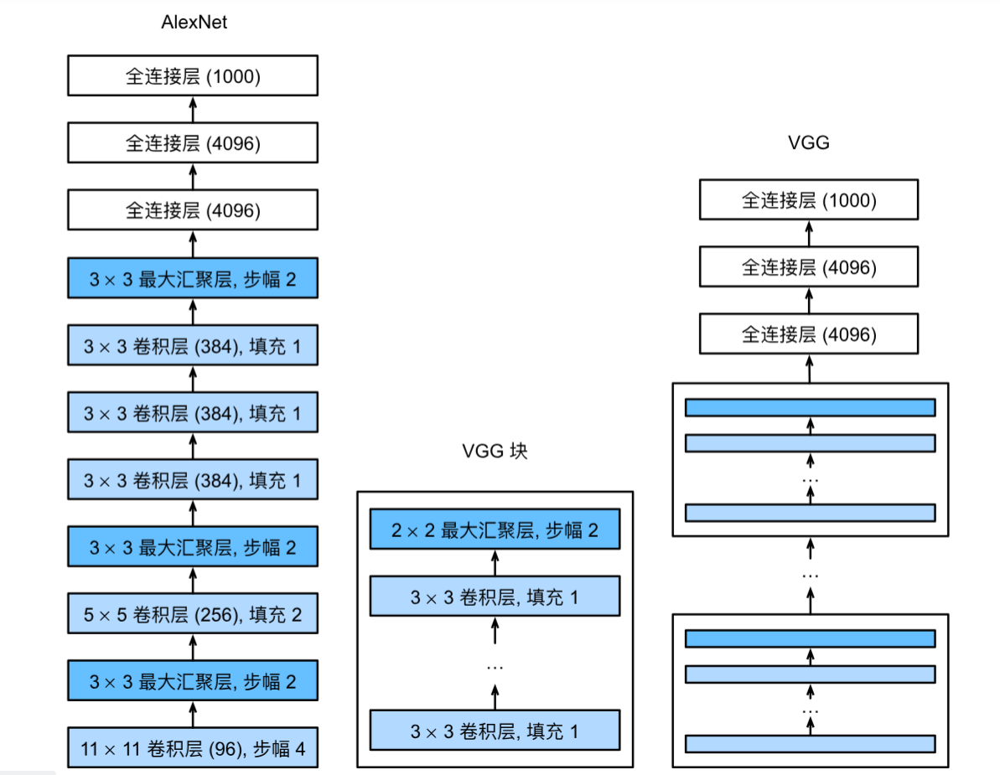

#### 完整实现

```python
def vgg(conv_arch):
    conv_blks = []
    in_channels = 1
    # 构建卷积层部分（5个VGG块）
    for (num_convs, out_channels) in conv_arch:
        conv_blks.append(vgg_block(num_convs, in_channels, out_channels))
        in_channels = out_channels
    
    # 全连接层部分
    return nn.Sequential(
        *conv_blks, nn.Flatten(),
        nn.Linear(out_channels * 7 * 7, 4096), nn.ReLU(), nn.Dropout(0.5),
        nn.Linear(4096, 4096), nn.ReLU(), nn.Dropout(0.5),
        nn.Linear(4096, 10)   # Fashion-MNIST: 10类
    )

net = vgg(conv_arch)
```

#### 各层输出形状

| 层 | 操作 | 输入 → 输出形状 | 说明 |
|----|------|----------------|------|
| 1 | VGG块1 | (1, 224, 224) → (64, 112, 112) | 1个卷积层，通道64 |
| 2 | VGG块2 | (64, 112, 112) → (128, 56, 56) | 1个卷积层，通道128 |
| 3 | VGG块3 | (128, 56, 56) → (256, 28, 28) | 2个卷积层，通道256 |
| 4 | VGG块4 | (256, 28, 28) → (512, 14, 14) | 2个卷积层，通道512 |
| 5 | VGG块5 | (512, 14, 14) → (512, 7, 7) | 2个卷积层，通道512 |
| 6 | Flatten | (512, 7, 7) → (25088,) | 展平 |
| 7 | Linear + ReLU | 25088 → 4096 | 全连接层 |
| 8 | Dropout | 4096 → 4096 | p=0.5 |
| 9 | Linear + ReLU | 4096 → 4096 | 全连接层 |
| 10 | Dropout | 4096 → 4096 | p=0.5 |
| 11 | Linear | 4096 → 10 | 输出层 |

> **注意**：`nn.Sequential` 中的每个 VGG 块本身也是 `Sequential` 类型，所以打印层数时看到的是 8 个 `Sequential` 块（5 个卷积块 + 3 个全连接层中的线性层），但实际有 11 个操作层。

### 7.2.3 简化版 VGG（在 Fashion-MNIST 上训练）

原版 VGG-11 有约 1.38 亿参数，计算量巨大。为了在 Fashion-MNIST 上可行，将通道数缩小 4 倍：

```python
ratio = 4
small_conv_arch = [(pair[0], pair[1] // ratio) for pair in conv_arch]
# 结果: ((1, 16), (1, 32), (2, 64), (2, 128), (2, 128))
net = vgg(small_conv_arch)
```

### 7.2.4 训练

```python
lr, num_epochs, batch_size = 0.05, 10, 128
train_iter, test_iter = d2l.load_data_fashion_mnist(batch_size, resize=224)
d2l.train_ch6(net, train_iter, test_iter, num_epochs, lr, d2l.try_gpu())
```

> **注意**：在 CPU 上训练 VGG 非常慢（约 1-3 小时），强烈建议使用 GPU（Colab 约 3-5 分钟）。

### 7.2.5 VGG 的关键设计思想

| 设计原则 | 说明 |
|----------|------|
| **小卷积核堆叠** | 用多个 3×3 卷积层堆叠，感受野等同于更大的卷积核，但参数更少 |
| **通道数翻倍** | 每个 VGG 块后输出通道数翻倍（64→128→256→512） |
| **分辨率减半** | 每个 VGG 块后空间尺寸减半（通过步幅为2的汇聚层） |
| **模块化设计** | 通过 `vgg_block` 函数复用结构，代码简洁 |

### 7.2.6 VGG 系列变体

| 模型 | 卷积层数 | 全连接层数 | 总层数 | 参数量（约） |
|------|----------|------------|--------|-------------|
| VGG-11 | 8 | 3 | 11 | 1.33亿 |
| VGG-13 | 10 | 3 | 13 | 1.33亿 |
| VGG-16 | 13 | 3 | 16 | 1.38亿 |
| VGG-19 | 16 | 3 | 19 | 1.44亿 |

### 7.2.7 小结

- VGG 通过**可复用的卷积块**（VGG块）构建网络，使架构设计更加简洁
- VGG 使用**多个 3×3 小卷积核堆叠**，比大卷积核参数更少且更有效
- VGG 的缺点是**参数量巨大**（主要是全连接层），计算成本高
- VGG 证明了**网络深度**（更多层）比**卷积核大小**更重要
- 块的概念成为后续所有现代网络架构的基础（ResNet块、Inception块等）


## 7.3 网络中的网络（NiN）

在前面的章节中，LeNet、AlexNet和VGG都遵循一个共同的设计模式：**卷积层提取特征 → 全连接层分类**。然而，全连接层有两个主要问题：

1. **参数爆炸**：全连接层的参数量巨大（VGG中全连接层占了约90%的参数）
2. **丢失空间结构**：展平操作完全丢弃了特征图的空间位置信息

**网络中的网络（NiN）** 提出了一种全新的思路：**用 1×1 卷积层替代全连接层**，在网络内部构建“微型网络”。

### 7.3.1 NiN块

NiN块的核心思想是：**在每个像素位置，用 1×1 卷积（相当于逐像素的全连接层）来增加非线性**。

```python
import torch
from torch import nn
from d2l import torch as d2l

def nin_block(in_channels, out_channels, kernel_size, strides, padding):
    return nn.Sequential(
        # 普通卷积层：提取空间特征
        nn.Conv2d(in_channels, out_channels, kernel_size, strides, padding),
        nn.ReLU(),
        # 1×1卷积层：跨通道信息融合（相当于逐像素全连接）
        nn.Conv2d(out_channels, out_channels, kernel_size=1), nn.ReLU(),
        # 又一个1×1卷积层：增加更多非线性
        nn.Conv2d(out_channels, out_channels, kernel_size=1), nn.ReLU()
    )
```

**NiN块的结构**：

```
普通卷积层（3×3 / 5×5 / 11×11）
    ↓
1×1 卷积层（跨通道全连接）
    ↓
1×1 卷积层（跨通道全连接）
```

**为什么用两个 1×1 卷积层？**
- 第一个 1×1 卷积：在不同通道间融合信息
- 第二个 1×1 卷积：增加模型的非线性表达能力

> 每个 1×1 卷积都带有 ReLU 激活，相当于在每个像素位置叠加了一个 2 层 MLP，因此称为“网络中的网络”。

### 7.3.2 NiN模型架构

NiN去除了全连接层，改用**全局平均汇聚层**进行分类：

| 部分 | 组成 | 说明 |
|------|------|------|
| 卷积层部分 | 4个NiN块 + 3个最大汇聚层 | 提取空间特征，逐步减少空间尺寸，增加通道数 |
| 分类部分 | NiN块（输出通道=类别数）+ 全局平均汇聚 | 替代全连接层，大幅减少参数 |

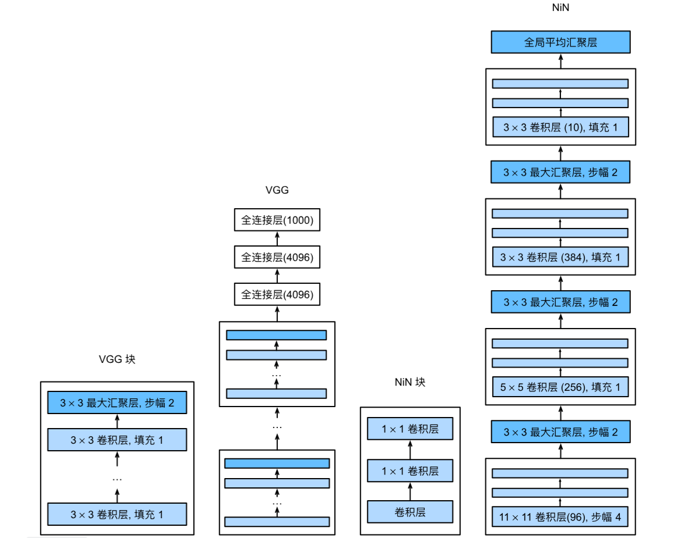

#### 代码实现

```python
net = nn.Sequential(
    # NiN块1：输入1通道 → 96通道，11×11卷积
    nin_block(1, 96, kernel_size=11, strides=4, padding=0),
    nn.MaxPool2d(3, stride=2),
    
    # NiN块2：96通道 → 256通道，5×5卷积
    nin_block(96, 256, kernel_size=5, strides=1, padding=2),
    nn.MaxPool2d(3, stride=2),
    
    # NiN块3：256通道 → 384通道，3×3卷积
    nin_block(256, 384, kernel_size=3, strides=1, padding=1),
    nn.MaxPool2d(3, stride=2),
    nn.Dropout(0.5),
    
    # NiN块4：384通道 → 10通道（类别数），3×3卷积
    nin_block(384, 10, kernel_size=3, strides=1, padding=1),
    
    # 全局平均汇聚：将每个特征图压缩为1×1
    nn.AdaptiveAvgPool2d((1, 1)),
    nn.Flatten()  # 输出形状：(批量大小, 10)
)
```

#### 各层输出形状

| 层 | 操作 | 输入 → 输出形状 | 说明 |
|----|------|----------------|------|
| 1 | NiN块1 | (1, 224, 224) → (96, 54, 54) | 11×11卷积，步幅4 |
| 2 | MaxPool2d | (96, 54, 54) → (96, 26, 26) | 3×3池化，步幅2 |
| 3 | NiN块2 | (96, 26, 26) → (256, 26, 26) | 5×5卷积，padding=2 |
| 4 | MaxPool2d | (256, 26, 26) → (256, 12, 12) | 3×3池化，步幅2 |
| 5 | NiN块3 | (256, 12, 12) → (384, 12, 12) | 3×3卷积，padding=1 |
| 6 | MaxPool2d | (384, 12, 12) → (384, 5, 5) | 3×3池化，步幅2 |
| 7 | Dropout | (384, 5, 5) → (384, 5, 5) | p=0.5 |
| 8 | NiN块4 | (384, 5, 5) → (10, 5, 5) | 3×3卷积，输出10通道 |
| 9 | AdaptiveAvgPool2d | (10, 5, 5) → (10, 1, 1) | 全局平均汇聚 |
| 10 | Flatten | (10, 1, 1) → (10,) | 展平为10维向量 |

### 7.3.3 NiN vs 传统CNN的关键区别

| 对比维度 | AlexNet / VGG | NiN |
|----------|---------------|-----|
| **分类器** | 全连接层（参数巨大） | 全局平均汇聚（无参数） |
| **参数数量** | 数千万～数亿 | **显著减少** |
| **空间结构** | 展平后丢失 | **始终保留**直到最后 |
| **过拟合风险** | 高（全连接层） | 低（无全连接层） |
| **1×1卷积** | 不使用 | **核心组件** |

### 7.3.4 全局平均汇聚层

全局平均汇聚层（Global Average Pooling）是NiN的关键创新：

```python
nn.AdaptiveAvgPool2d((1, 1))
```

**作用**：对每个特征图的所有空间位置取平均，得到一个标量。

| 传统做法（全连接层） | NiN做法（全局平均汇聚） |
|---------------------|------------------------|
| 展平 → 全连接层 → 输出 | 全局平均汇聚 → 直接输出 |
| 需要大量参数 | **零参数** |
| 容易过拟合 | **不易过拟合** |
| 不保留空间信息 | 利用整个特征图的信息 |

**直观理解**：每个通道对应一个类别，全局平均汇聚就是让模型“看”整个特征图，然后决定属于该类别的置信度。

### 7.3.5 训练

```python
lr, num_epochs, batch_size = 0.1, 10, 128
train_iter, test_iter = d2l.load_data_fashion_mnist(batch_size, resize=224)
d2l.train_ch6(net, train_iter, test_iter, num_epochs, lr, d2l.try_gpu())
```

训练结果示例：
```
loss 0.322, train acc 0.881, test acc 0.865
3226.1 examples/sec on cuda:0
```

### 7.3.6 为什么 1×1 卷积如此重要？

| 功能 | 说明 |
|------|------|
| **通道数调整** | 自由增加或减少通道维度 |
| **跨通道信息融合** | 在不同通道间进行线性组合 |
| **增加非线性** | 每个 1×1 卷积后都有 ReLU，增强网络表达能力 |
| **替代全连接层** | 在保持空间结构的同时实现全连接功能 |
| **参数效率** | 参数量远小于全连接层 |

### 7.3.7 小结

- NiN用**1×1卷积**替代全连接层，大幅减少参数
- NiN的核心组件是**NiN块**：卷积层 + 两个1×1卷积层
- NiN使用**全局平均汇聚层**替代全连接层进行分类
- 优势：**参数更少、不易过拟合、保留空间结构**
- 劣势：训练时间可能略长（由于1×1卷积增加了计算量）
- NiN的设计思想影响了许多后续架构（如GoogLeNet的Inception模块、ResNet的瓶颈块等）


## 7.4 含并行连结的网络（GoogLeNet）

GoogLeNet 是 2014 年 ImageNet 图像识别挑战赛的冠军，它吸收了 NiN 中 1×1 卷积的思想，并引入了一个核心创新——**Inception 块**，通过在网络中并行使用不同尺寸的卷积核来捕捉多尺度特征。

### 7.4.1 Inception 块

Inception 块的核心思想是：**不同大小的卷积核可以捕捉不同范围的图像细节**。

- $1\times1$ 卷积：捕捉细微的局部特征
- $3\times3$ 卷积：捕捉中等范围特征
- $5\times5$ 卷积：捕捉较大范围特征
- $3\times3$ 最大汇聚：保留背景信息

#### 结构图

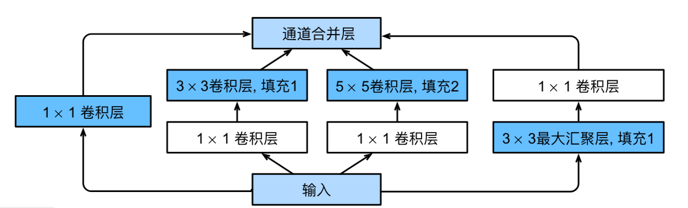

**四条并行路径**：

| 路径 | 操作 | 作用 |
|------|------|------|
| **路径1** | $1\times1$ 卷积 | 提取局部特征，减少通道数 |
| **路径2** | $1\times1$ 卷积 → $3\times3$ 卷积 | 先降维，再提取中等范围特征 |
| **路径3** | $1\times1$ 卷积 → $5\times5$ 卷积 | 先降维，再提取大范围特征 |
| **路径4** | $3\times3$ 最大汇聚 → $1\times1$ 卷积 | 保留背景信息并调整通道数 |

**关键设计**：路径2和路径3中的 $1\times1$ 卷积用于**减少通道数**，降低计算复杂度。所有路径的输出在**通道维度**上拼接。

#### 代码实现

```python
import torch
from torch import nn
from torch.nn import functional as F
from d2l import torch as d2l

class Inception(nn.Module):
    # c1--c4是每条路径的输出通道数
    def __init__(self, in_channels, c1, c2, c3, c4, **kwargs):
        super(Inception, self).__init__(**kwargs)
        # 线路1：单1×1卷积
        self.p1_1 = nn.Conv2d(in_channels, c1, kernel_size=1)
        
        # 线路2：1×1卷积 → 3×3卷积
        self.p2_1 = nn.Conv2d(in_channels, c2[0], kernel_size=1)
        self.p2_2 = nn.Conv2d(c2[0], c2[1], kernel_size=3, padding=1)
        
        # 线路3：1×1卷积 → 5×5卷积
        self.p3_1 = nn.Conv2d(in_channels, c3[0], kernel_size=1)
        self.p3_2 = nn.Conv2d(c3[0], c3[1], kernel_size=5, padding=2)
        
        # 线路4：3×3最大汇聚 → 1×1卷积
        self.p4_1 = nn.MaxPool2d(kernel_size=3, stride=1, padding=1)
        self.p4_2 = nn.Conv2d(in_channels, c4, kernel_size=1)

    def forward(self, x):
        p1 = F.relu(self.p1_1(x))
        p2 = F.relu(self.p2_2(F.relu(self.p2_1(x))))
        p3 = F.relu(self.p3_2(F.relu(self.p3_1(x))))
        p4 = F.relu(self.p4_2(self.p4_1(x)))
        # 在通道维度上拼接
        return torch.cat((p1, p2, p3, p4), dim=1)
```

### 7.4.2 GoogLeNet 整体架构

GoogLeNet 由 **9 个 Inception 块** + 全局平均汇聚层组成，没有使用全连接层。

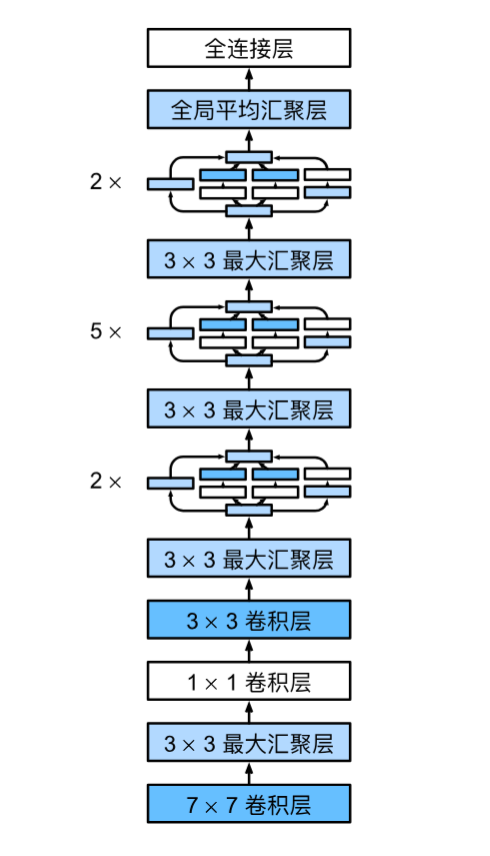

#### 各模块详解

**模块1（b1）**：7×7 卷积 + 最大汇聚

```python
b1 = nn.Sequential(
    nn.Conv2d(1, 64, kernel_size=7, stride=2, padding=3),
    nn.ReLU(),
    nn.MaxPool2d(kernel_size=3, stride=2, padding=1)
)
# 输入 1×224×224 → 输出 64×54×54
```

**模块2（b2）**：1×1 卷积 → 3×3 卷积 + 最大汇聚

```python
b2 = nn.Sequential(
    nn.Conv2d(64, 64, kernel_size=1),
    nn.ReLU(),
    nn.Conv2d(64, 192, kernel_size=3, padding=1),
    nn.ReLU(),
    nn.MaxPool2d(kernel_size=3, stride=2, padding=1)
)
# 64×54×54 → 192×26×26
```

**模块3（b3）**：2 个 Inception 块 + 最大汇聚

```python
b3 = nn.Sequential(
    Inception(192, 64, (96, 128), (16, 32), 32),    # 输出通道: 64+128+32+32=256
    Inception(256, 128, (128, 192), (32, 96), 64),   # 输出通道: 128+192+96+64=480
    nn.MaxPool2d(kernel_size=3, stride=2, padding=1)
)
# 192×26×26 → 480×12×12
```

**模块4（b4）**：5 个 Inception 块 + 最大汇聚

```python
b4 = nn.Sequential(
    Inception(480, 192, (96, 208), (16, 48), 64),    # 输出: 512
    Inception(512, 160, (112, 224), (24, 64), 64),   # 输出: 512
    Inception(512, 128, (128, 256), (24, 64), 64),   # 输出: 512
    Inception(512, 112, (144, 288), (32, 64), 64),   # 输出: 528
    Inception(528, 256, (160, 320), (32, 128), 128), # 输出: 832
    nn.MaxPool2d(kernel_size=3, stride=2, padding=1)
)
# 480×12×12 → 832×5×5
```

**模块5（b5）**：2 个 Inception 块 + 全局平均汇聚

```python
b5 = nn.Sequential(
    Inception(832, 256, (160, 320), (32, 128), 128), # 输出: 832
    Inception(832, 384, (192, 384), (48, 128), 128), # 输出: 1024
    nn.AdaptiveAvgPool2d((1, 1)),
    nn.Flatten()
)
# 832×5×5 → 1024×1×1 → 1024
```

**完整网络**：

```python
net = nn.Sequential(b1, b2, b3, b4, b5, nn.Linear(1024, 10))
```

#### 各层输出形状汇总（输入 96×96）

| 模块 | 操作 | 输入 → 输出形状 | 说明 |
|------|------|----------------|------|
| b1 | Conv7×7 + MaxPool | (1, 96, 96) → (64, 24, 24) | 7×7卷积，步幅2 |
| b2 | Conv1×1 + Conv3×3 + MaxPool | (64, 24, 24) → (192, 12, 12) | |
| b3 | 2×Inception + MaxPool | (192, 12, 12) → (480, 6, 6) | |
| b4 | 5×Inception + MaxPool | (480, 6, 6) → (832, 3, 3) | |
| b5 | 2×Inception + GlobalAvgPool | (832, 3, 3) → (1024,) | 全局平均汇聚 |
| Linear | 全连接 | (1024,) → (10,) | 分类输出 |

### 7.4.3 Inception 块的通道数分配

Inception 块的参数 `(c1, c2, c3, c4)` 含义：

| 参数 | 含义 |
|------|------|
| `c1` | 路径1（1×1卷积）的输出通道数 |
| `c2 = (c2_1, c2_2)` | 路径2：先降维到 `c2_1`，再 3×3 卷积到 `c2_2` |
| `c3 = (c3_1, c3_2)` | 路径3：先降维到 `c3_1`，再 5×5 卷积到 `c3_2` |
| `c4` | 路径4（汇聚后 1×1 卷积）的输出通道数 |

**典型比例**：`c1 : c2_2 : c3_2 : c4 ≈ 2:4:1:1` 或 `4:6:3:2`

### 7.4.4 为什么 GoogLeNet 有效？

| 设计思想 | 解释 |
|----------|------|
| **多尺度特征** | 同一层使用 1×1、3×3、5×5 卷积核并行提取不同范围的特征 |
| **降维瓶颈** | 在 3×3 和 5×5 卷积前用 1×1 卷积减少通道数，大幅降低计算量 |
| **保留空间信息** | 汇聚层保留了背景信息，不是简单的丢弃 |
| **无全连接层** | 使用全局平均汇聚，参数少，不易过拟合 |

### 7.4.5 训练

```python
lr, num_epochs, batch_size = 0.1, 10, 128
train_iter, test_iter = d2l.load_data_fashion_mnist(batch_size, resize=96)
d2l.train_ch6(net, train_iter, test_iter, num_epochs, lr, d2l.try_gpu())
```

> **注意**：GoogLeNet 在 Fashion-MNIST 上可能会出现训练不稳定（loss 为 nan），因为原模型是为 ImageNet（1000 类）设计的，通道数对 Fashion-MNIST 来说过大。简化通道数或减小学习率可以缓解。

### 7.4.6 Inception 系列后续改进

| 版本 | 改进 |
|------|------|
| **Inception v2** | 添加批量归一化（Batch Normalization） |
| **Inception v3** | 用 1×3 + 3×1 分解 3×3 卷积，减少计算量 |
| **Inception v4** | 引入残差连接（ResNet 思想） |

### 7.4.7 小结

- **Inception 块** = 4 条并行路径（1×1、3×3、5×5 卷积 + 3×3 汇聚）
- **核心优势**：多尺度特征提取 + 1×1 卷积降维
- **GoogLeNet** = 9 个 Inception 块 + 全局平均汇聚 + 无全连接层
- **参数量**：比 VGG 少得多（约 700 万 vs VGG 的 1.38 亿），但计算复杂度更高
- **设计哲学**：“多尺度并行” + “深度与宽度并重”


## 7.5 批量规范化

训练深层神经网络是困难的，尤其是在较短时间内让它们收敛。**批量规范化**（Batch Normalization）是一种流行且有效的技术，能够持续加速深层网络的收敛速度。结合残差块，批量规范化使得研究人员能够训练超过100层的网络。

### 7.5.1 为什么需要批量规范化？

训练深层网络时面临几个挑战：

1. **数据预处理影响巨大**：输入特征的尺度不统一会阻碍优化器工作。标准化输入（零均值、单位方差）能显著改善训练。

2. **中间层变量分布变化剧烈**：在训练过程中，每一层的输入分布会不断变化（因为前一层参数在更新）。这种变化使得网络需要不断适应新的分布，减慢收敛速度。

3. **深层网络容易过拟合**：需要更强的正则化手段。

批量规范化的核心思想：**在每次训练迭代中，对当前小批量的数据进行标准化（减去均值、除以标准差），然后再用可学习的缩放和偏移参数进行调整。**

### 7.5.2 批量规范化的数学原理

对于小批量 $\mathcal{B}$ 中的输入 $\mathbf{x}$，批量规范化 $\mathrm{BN}$ 定义为：

$$\mathrm{BN}(\mathbf{x}) = \boldsymbol{\gamma} \odot \frac{\mathbf{x} - \hat{\boldsymbol{\mu}}_\mathcal{B}}{\hat{\boldsymbol{\sigma}}_\mathcal{B}} + \boldsymbol{\beta}$$

其中：
- $\hat{\boldsymbol{\mu}}_\mathcal{B}$：小批量的均值
- $\hat{\boldsymbol{\sigma}}_\mathcal{B}$：小批量的标准差（加一个微小常数 $\epsilon$ 防止除零）
- $\boldsymbol{\gamma}$：**拉伸参数（scale）**，可学习
- $\boldsymbol{\beta}$：**偏移参数（shift）**，可学习

均值和标准差的计算：

$$\hat{\boldsymbol{\mu}}_\mathcal{B} = \frac{1}{|\mathcal{B}|} \sum_{\mathbf{x} \in \mathcal{B}} \mathbf{x}$$

$$\hat{\boldsymbol{\sigma}}_\mathcal{B}^2 = \frac{1}{|\mathcal{B}|} \sum_{\mathbf{x} \in \mathcal{B}} (\mathbf{x} - \hat{\boldsymbol{\mu}}_\mathcal{B})^2 + \epsilon$$

其中，$\epsilon$ 是一个极小量，是为了防止标准化时除数为0.

> **关键洞察**：标准化后数据均值为0、方差为1，但网络可以学习 $\gamma$ 和 $\beta$ 来恢复任意想要的均值和方差，保持模型的表达能力。
>
> - 如果 $\gamma = 1$、$\beta = 0$：完全采用标准化
> - 如果 $\gamma$ 和 $\beta$ 取其他值：恢复或调整成任意想要的分布
>
> 这让批量规范化层变成一个**可调节的智能模块**，在“标准化带来的稳定性”和“模型本身的表达能力”之间取得平衡。网络可以根据任务需要，**选择保持标准化还是向某个方向偏移**，甚至可以退化为恒等映射（$\mathrm{BN}(\mathbf{x}) \approx \mathbf{x}$），把选择权完全交给网络自己。


### 7.5.3 批量规范化的位置

| 网络类型 | 放置位置 |
|----------|----------|
| **全连接层** | 仿射变换（$\mathbf{W}\mathbf{x} + \mathbf{b}$）之后，激活函数之前 |
| **卷积层** | 卷积运算之后，激活函数之前；**每个输出通道独立**进行批量规范化 |

对于卷积层，每个通道有自己的 $\gamma$ 和 $\beta$（标量），在 $m \times p \times q$ 个元素上计算均值和方差。

### 7.5.4 训练模式 vs 预测模式

| 模式 | 行为 |
|------|------|
| **训练** | 使用当前小批量的均值和方差进行标准化，并更新移动平均 |
| **预测** | 使用训练期间累积的**移动平均**均值和方差（固定值） |

> 这与 Dropout 类似：训练和预测时的行为不同。

### 7.5.5 从零实现

```python
import torch
from torch import nn
from d2l import torch as d2l

def batch_norm(X, gamma, beta, moving_mean, moving_var, eps, momentum):
    """批量规范化的底层实现"""
    # 预测模式：使用移动平均
    if not torch.is_grad_enabled():
        X_hat = (X - moving_mean) / torch.sqrt(moving_var + eps)
    else:
        # 训练模式：计算当前小批量的均值和方差
        assert len(X.shape) in (2, 4)
        if len(X.shape) == 2:
            # 全连接层：按特征维度计算
            mean = X.mean(dim=0)
            var = ((X - mean) ** 2).mean(dim=0)
        else:
            # 卷积层：按通道维度计算（保留广播形状）
            mean = X.mean(dim=(0, 2, 3), keepdim=True)
            var = ((X - mean) ** 2).mean(dim=(0, 2, 3), keepdim=True)
        
        # 标准化
        X_hat = (X - mean) / torch.sqrt(var + eps)
        
        # 更新移动平均（用于预测）
        moving_mean = momentum * moving_mean + (1.0 - momentum) * mean
        moving_var = momentum * moving_var + (1.0 - momentum) * var
    
    # 缩放和偏移（可学习参数）
    Y = gamma * X_hat + beta
    return Y, moving_mean.data, moving_var.data
```

**自定义 BatchNorm 层**：

```python
class BatchNorm(nn.Module):
    def __init__(self, num_features, num_dims):
        super().__init__()
        # 形状：全连接层 (1, num_features)，卷积层 (1, num_features, 1, 1)
        shape = (1, num_features) if num_dims == 2 else (1, num_features, 1, 1)
        
        # 可学习的拉伸和偏移参数
        self.gamma = nn.Parameter(torch.ones(shape))
        self.beta = nn.Parameter(torch.zeros(shape))
        
        # 移动平均（非模型参数，不参与梯度更新）
        self.moving_mean = torch.zeros(shape)
        self.moving_var = torch.ones(shape)

    def forward(self, X):
        # 将移动平均移动到与 X 相同的设备
        if self.moving_mean.device != X.device:
            self.moving_mean = self.moving_mean.to(X.device)
            self.moving_var = self.moving_var.to(X.device)
        
        Y, self.moving_mean, self.moving_var = batch_norm(
            X, self.gamma, self.beta, self.moving_mean,
            self.moving_var, eps=1e-5, momentum=0.9)
        return Y
```

### 7.5.6 带批量规范化的 LeNet

在卷积层/全连接层之后、激活函数之前插入批量规范化层：

```python
# 在激活函数之前插入
net = nn.Sequential(
    nn.Conv2d(1, 6, kernel_size=5), BatchNorm(6, num_dims=4), nn.Sigmoid(),
    nn.AvgPool2d(kernel_size=2, stride=2),
    nn.Conv2d(6, 16, kernel_size=5), BatchNorm(16, num_dims=4), nn.Sigmoid(),
    nn.AvgPool2d(kernel_size=2, stride=2), nn.Flatten(),
    nn.Linear(16*4*4, 120), BatchNorm(120, num_dims=2), nn.Sigmoid(),
    nn.Linear(120, 84), BatchNorm(84, num_dims=2), nn.Sigmoid(),
    nn.Linear(84, 10)
)
```

**训练**：

```python
lr, num_epochs, batch_size = 1.0, 10, 256
train_iter, test_iter = d2l.load_data_fashion_mnist(batch_size)
d2l.train_ch6(net, train_iter, test_iter, num_epochs, lr, d2l.try_gpu())
```

> 注意：学习率可以设得比平时**大得多**（1.0 vs 通常的 0.1），这是批量规范化加速收敛的体现。

查看学习到的 $\gamma$ 和 $\beta$：

```python
net[1].gamma.reshape((-1,)), net[1].beta.reshape((-1,))
```
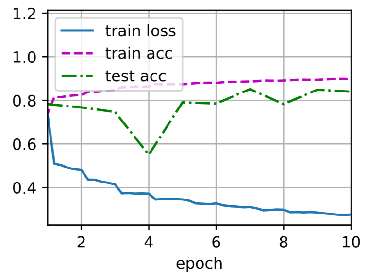

### 7.5.7 简洁实现（PyTorch 内置）

PyTorch 提供了 `nn.BatchNorm1d`（全连接层）和 `nn.BatchNorm2d`（卷积层）：

```python
net = nn.Sequential(
    nn.Conv2d(1, 6, kernel_size=5), nn.BatchNorm2d(6), nn.Sigmoid(),
    nn.AvgPool2d(kernel_size=2, stride=2),
    nn.Conv2d(6, 16, kernel_size=5), nn.BatchNorm2d(16), nn.Sigmoid(),
    nn.AvgPool2d(kernel_size=2, stride=2), nn.Flatten(),
    nn.Linear(256, 120), nn.BatchNorm1d(120), nn.Sigmoid(),
    nn.Linear(120, 84), nn.BatchNorm1d(84), nn.Sigmoid(),
    nn.Linear(84, 10)
)

d2l.train_ch6(net, train_iter, test_iter, num_epochs, lr, d2l.try_gpu())
```

### 7.5.8 批量规范化的效果

| 效果 | 说明 |
|------|------|
| **加速收敛** | 允许使用更大的学习率，训练速度显著提升 |
| **正则化** | 小批量的随机噪声起到类似 Dropout 的正则化效果 |
| **减少对初始化的依赖** | 对参数初始化不那么敏感 |
| **稳定训练** | 减少内部协变量偏移（尽管这个解释有争议） |

### 7.5.9 关于“内部协变量偏移”的争议

批量规范化的原始论文将其成功归因于**减少内部协变量偏移**。但后来的研究指出：

1. 这个名称与严格的**协变量偏移**（$P(\mathbf{x})$ 变化）不同，用词不当
2. 批量规范化的效果可能源于**使优化曲面更平滑**，而不是减少协变量偏移

> 无论如何，批量规范化在实践中效果卓越，已成为现代深度网络的标配。

### 7.5.10 小结

- **批量规范化** = 对小批量数据标准化 + 可学习的缩放和偏移
- **作用**：加速收敛、允许更大学习率、轻微正则化
- **位置**：线性变换/卷积之后，激活函数之前
- **训练 vs 预测**：训练用小批量统计，预测用移动平均
- **卷积层特殊处理**：每个输出通道独立计算均值和方差
- **本质**：虽然原理解释有争议，但效果已被广泛验证


## 7.6 残差网络（ResNet）

随着网络层数的加深，一个核心问题浮现出来：**添加新层真的能提升网络性能吗？** 理论上是，但实践中随着层数增加，训练误差反而可能上升——因为深层网络难以优化。残差网络（ResNet）通过引入**残差连接（跳跃连接）** 彻底解决了这个问题，使得训练上百层甚至上千层的网络成为可能。

### 7.6.1 函数类与嵌套函数

#### 核心思想：嵌套函数类

假设 $\mathcal{F}_1 \subseteq \mathcal{F}_2 \subseteq \cdots \subseteq \mathcal{F}_6$ 是一系列嵌套的函数类（即更复杂的函数类包含较简单的函数类）。如果 $f^*$ 是真实的最优函数，那么越大的函数类应该包含越接近 $f^*$ 的函数。

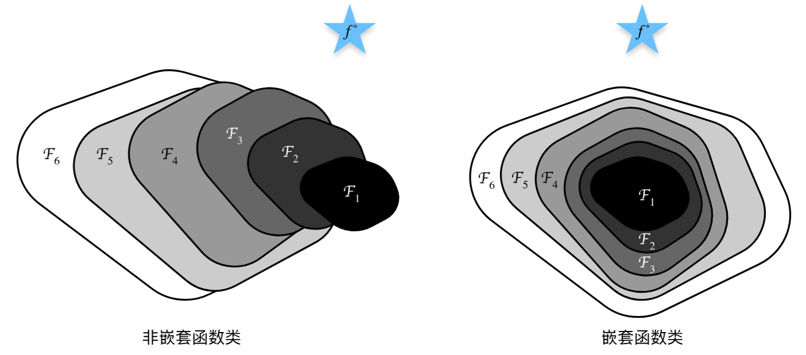

#### 关键洞察
如果新添加的层可以学习成**恒等映射** $f(\mathbf{x}) = \mathbf{x}$，那么深层网络至少不应比浅层网络差。

##### 为什么？
因为如果新增的层是恒等映射，那么它的输出等于输入，相当于这一层根本没起作用。这样一来，深层网络就退化成了浅层网络，效果自然不会比浅层差。所以只要网络**有能力**学到恒等映射，加层就不会是一件坏事。

##### 问题是：**标准网络很难学到恒等映射**。

理论上，要把一个线性层变成恒等映射，只需要把权重矩阵设为单位矩阵，偏置设为0就行。但在实际训练中，由于梯度消失、优化困难、参数初始化不合理等问题，网络往往学不到这个“最简单”的解，反而会学到一些破坏原有特征的东西，导致深层网络比浅层网络表现更差。

这就是 ResNet 要解决的问题。它通过引入**残差连接**，让网络学习的**不是 $f(\mathbf{x})$，而是 $F(\mathbf{x}) = f(\mathbf{x}) - \mathbf{x}$**。这样，如果网络想变成恒等映射，只需要让残差部分 $F(\mathbf{x}) = 0$，也就是把所有权重逼近0。把权重变成0，比变成单位矩阵容易得多。所以 ResNet 让“保持恒等映射”这件事变得非常简单，使深层网络的训练不再是难题。

### 7.6.2 残差块

#### 设计思想

ResNet的核心思想是：**让网络学习“残差”而不是“完整映射”**。

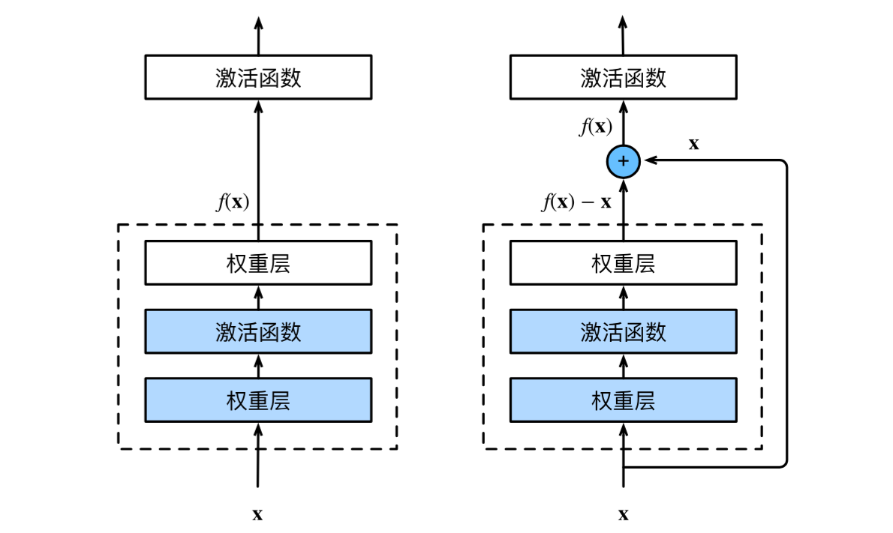

| 普通块 | 残差块 |
|--------|--------|
| 直接学习 $f(\mathbf{x})$ | 学习残差 $f(\mathbf{x}) - \mathbf{x}$ |
| 恒等映射难以学习 | 只需将权重置0即可实现恒等映射 |
| 深层难以优化 | 梯度可通过跳跃连接直接传播 |

#### 残差块的结构

残差块包含：
1. 两个 $3 \times 3$ 卷积层（相同输出通道数）
2. 每个卷积层后接批量规范化层和 ReLU
3. 跨层数据通路（跳跃连接）：输入直接加到输出上
4. 最后再经过 ReLU 激活


**数学表达**：

$$ \text{输出} = \text{ReLU}(F(\mathbf{x}) + \mathbf{x}) $$

其中 $F(\mathbf{x})$ 是两层卷积提取的特征，$\mathbf{x}$ 是原始输入。

```python
import torch
from torch import nn
from torch.nn import functional as F
from d2l import torch as d2l

class Residual(nn.Module):
    def __init__(self, input_channels, num_channels, use_1x1conv=False, strides=1):
        super().__init__()
        # 第一个卷积层：可能改变通道数和空间尺寸
        self.conv1 = nn.Conv2d(input_channels, num_channels,
                               kernel_size=3, padding=1, stride=strides)
        # 第二个卷积层：保持通道数和空间尺寸
        self.conv2 = nn.Conv2d(num_channels, num_channels,
                               kernel_size=3, padding=1)
        # 1×1卷积：用于调整残差连接（改变通道数或空间尺寸）
        if use_1x1conv:
            self.conv3 = nn.Conv2d(input_channels, num_channels,
                                   kernel_size=1, stride=strides)
        else:
            self.conv3 = None
        self.bn1 = nn.BatchNorm2d(num_channels)
        self.bn2 = nn.BatchNorm2d(num_channels)

    def forward(self, X):
        # 主路径：卷积1 → BN → ReLU → 卷积2 → BN
        Y = F.relu(self.bn1(self.conv1(X)))
        Y = self.bn2(self.conv2(Y))
        # 残差连接：如果形状不匹配，用1×1卷积调整
        if self.conv3:
            X = self.conv3(X)
        Y += X
        return F.relu(Y)
```

**两种残差块类型**：

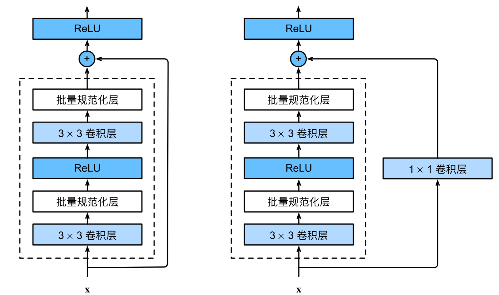

| 类型 | 条件 | 用途 |
|------|------|------|
| 不包含 1×1 卷积 | `use_1x1conv=False` | 输入输出形状相同时使用 |
| 包含 1×1 卷积 | `use_1x1conv=True` | 改变通道数或减小空间尺寸时使用 |

测试输出形状：

```python
# 输入输出形状一致
blk = Residual(3, 3)
X = torch.rand(4, 3, 6, 6)
blk(X).shape          # torch.Size([4, 3, 6, 6])

# 增加通道数，减半空间尺寸
blk = Residual(3, 6, use_1x1conv=True, strides=2)
blk(X).shape          # torch.Size([4, 6, 3, 3])
```

### 7.6.3 ResNet 模型架构
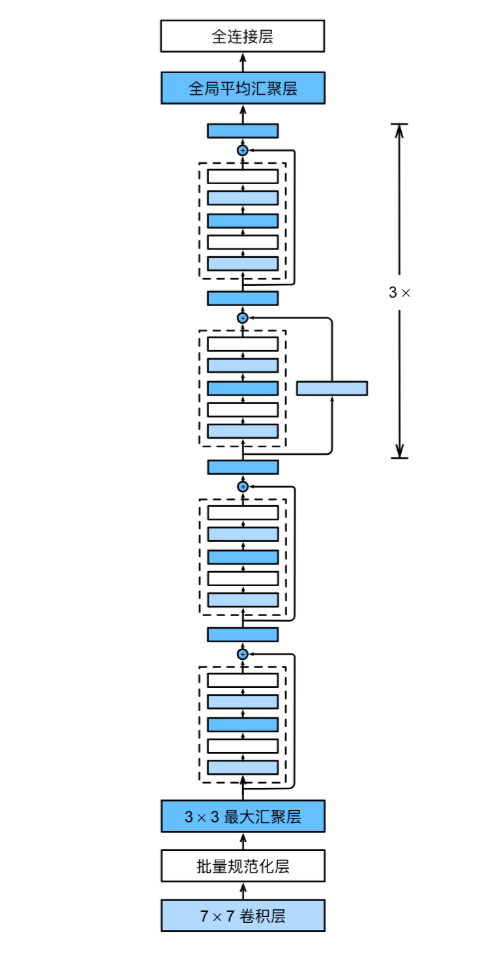
ResNet 的整体架构与 GoogLeNet 类似，但更加简洁：

| 模块 | 组成 | 输出形状 | 说明 |
|------|------|----------|------|
| **b1** | 7×7 卷积（步幅2）+ BN + ReLU + 3×3 最大汇聚（步幅2） | (64, 56, 56) | 初始下采样 |
| **b2** | 2 个残差块（64 通道） | (64, 56, 56) | 第一个模块不降采样 |
| **b3** | 2 个残差块（128 通道，第一个步幅2） | (128, 28, 28) | 通道翻倍，尺寸减半 |
| **b4** | 2 个残差块（256 通道，第一个步幅2） | (256, 14, 14) | 通道翻倍，尺寸减半 |
| **b5** | 2 个残差块（512 通道，第一个步幅2） | (512, 7, 7) | 通道翻倍，尺寸减半 |
| **全局平均汇聚** | AdaptiveAvgPool2d | (512, 1, 1) | 汇聚所有空间位置 |
| **全连接层** | Linear(512, 10) | (10,) | 分类输出 |

```python
# 模块定义
b1 = nn.Sequential(
    nn.Conv2d(1, 64, kernel_size=7, stride=2, padding=3),
    nn.BatchNorm2d(64), nn.ReLU(),
    nn.MaxPool2d(kernel_size=3, stride=2, padding=1)
)

def resnet_block(input_channels, num_channels, num_residuals, first_block=False):
    blk = []
    for i in range(num_residuals):
        if i == 0 and not first_block:
            # 非第一个模块：第一个残差块降采样（步幅2）
            blk.append(Residual(input_channels, num_channels,
                                use_1x1conv=True, strides=2))
        else:
            blk.append(Residual(num_channels, num_channels))
    return blk

# 构建ResNet-18
b2 = nn.Sequential(*resnet_block(64, 64, 2, first_block=True))
b3 = nn.Sequential(*resnet_block(64, 128, 2))
b4 = nn.Sequential(*resnet_block(128, 256, 2))
b5 = nn.Sequential(*resnet_block(256, 512, 2))

net = nn.Sequential(
    b1, b2, b3, b4, b5,
    nn.AdaptiveAvgPool2d((1, 1)),
    nn.Flatten(),
    nn.Linear(512, 10)
)
```


### 7.6.4 各层输出形状

```python
X = torch.rand(size=(1, 1, 224, 224))
for layer in net:
    X = layer(X)
    print(layer.__class__.__name__, 'output shape:', X.shape)
```

输出：
```
Sequential output shape:     torch.Size([1, 64, 56, 56])
Sequential output shape:     torch.Size([1, 64, 56, 56])
Sequential output shape:     torch.Size([1, 128, 28, 28])
Sequential output shape:     torch.Size([1, 256, 14, 14])
Sequential output shape:     torch.Size([1, 512, 7, 7])
AdaptiveAvgPool2d output shape: torch.Size([1, 512, 1, 1])
Flatten output shape:        torch.Size([1, 512])
Linear output shape:         torch.Size([1, 10])
```

### 7.6.5 训练

```python
lr, num_epochs, batch_size = 0.05, 10, 256
train_iter, test_iter = d2l.load_data_fashion_mnist(batch_size, resize=96)
d2l.train_ch6(net, train_iter, test_iter, num_epochs, lr, d2l.try_gpu())
```

训练结果示例：
```
loss 0.008, train acc 0.999, test acc 0.898
4650.1 examples/sec on cuda:0
```

> **注意**：ResNet 在 Fashion-MNIST 上训练很快，10 轮就能达到约 90% 的测试准确率，且几乎没有过拟合。

### 7.6.6 为什么 ResNet 如此有效？

| 原因 | 说明 |
|------|------|
| **梯度流动顺畅** | 跳跃连接为梯度提供了“高速公路”，缓解梯度消失 |
| **恒等映射容易学习** | 只需将残差块的权重逼近0即可实现恒等映射 |
| **优化更平滑** | 残差映射比原始映射更容易优化 |
| **特征重用** | 浅层特征可以通过跳跃连接直接传递到深层 |

### 7.6.7 ResNet 变体

| 模型 | 层数 | 说明 |
|------|------|------|
| ResNet-18 | 18 | 基本版本 |
| ResNet-34 | 34 | 更多残差块 |
| ResNet-50 | 50 | 引入 **bottleneck** 架构（1×1 降维 → 3×3 → 1×1 升维） |
| ResNet-101 | 101 | 更深 |
| ResNet-152 | 152 | 最深版本 |

### 7.6.8 小结

- **残差网络的核心创新**：跨层跳跃连接（残差连接），让网络学习 $f(\mathbf{x}) - \mathbf{x}$ 而非 $f(\mathbf{x})$
- **优势**：缓解梯度消失，使训练极深网络成为可能
- **ResNet-18**：8 个残差块（共 18 层），是 ResNet 系列的基本版本
- **影响**：ResNet 的设计思想深刻影响了后续几乎所有深度神经网络架构（如 DenseNet、ResNeXt、Inception-ResNet 等）


## 7.6 残差网络（ResNet）

随着网络层数的加深，一个核心问题浮现出来：**添加新层真的能提升网络性能吗？** 理论上是，但实践中随着层数增加，训练误差反而可能上升——因为深层网络难以优化。残差网络（ResNet）通过引入**残差连接（跳跃连接）** 彻底解决了这个问题，使得训练上百层甚至上千层的网络成为可能。

### 7.6.1 函数类与嵌套函数

#### 核心思想：嵌套函数类

假设 $\mathcal{F}_1 \subseteq \mathcal{F}_2 \subseteq \cdots \subseteq \mathcal{F}_6$ 是一系列嵌套的函数类（即更复杂的函数类包含较简单的函数类）。如果 $f^*$ 是真实的最优函数，那么越大的函数类应该包含越接近 $f^*$ 的函数。


**关键洞察**：如果新添加的层可以学习成**恒等映射** $f(\mathbf{x}) = \mathbf{x}$，那么深层网络至少不应比浅层网络差。问题是：标准网络很难学习到恒等映射。

### 7.6.2 残差块

#### 设计思想

ResNet的核心思想是：**让网络学习“残差”而不是“完整映射”**。


| 普通块 | 残差块 |
|--------|--------|
| 直接学习 $f(\mathbf{x})$ | 学习残差 $f(\mathbf{x}) - \mathbf{x}$ |
| 恒等映射难以学习 | 只需将权重置0即可实现恒等映射 |
| 深层难以优化 | 梯度可通过跳跃连接直接传播 |

#### 残差块的结构

残差块包含：
1. 两个 $3 \times 3$ 卷积层（相同输出通道数）
2. 每个卷积层后接批量规范化层和 ReLU
3. 跨层数据通路（跳跃连接）：输入直接加到输出上
4. 最后再经过 ReLU 激活

**数学表达**：

$$ \text{输出} = \text{ReLU}(F(\mathbf{x}) + \mathbf{x}) $$

其中 $F(\mathbf{x})$ 是两层卷积提取的特征，$\mathbf{x}$ 是原始输入。

```python
import torch
from torch import nn
from torch.nn import functional as F
from d2l import torch as d2l

class Residual(nn.Module):
    def __init__(self, input_channels, num_channels, use_1x1conv=False, strides=1):
        super().__init__()
        # 第一个卷积层：可能改变通道数和空间尺寸
        self.conv1 = nn.Conv2d(input_channels, num_channels,
                               kernel_size=3, padding=1, stride=strides)
        # 第二个卷积层：保持通道数和空间尺寸
        self.conv2 = nn.Conv2d(num_channels, num_channels,
                               kernel_size=3, padding=1)
        # 1×1卷积：用于调整残差连接（改变通道数或空间尺寸）
        if use_1x1conv:
            self.conv3 = nn.Conv2d(input_channels, num_channels,
                                   kernel_size=1, stride=strides)
        else:
            self.conv3 = None
        self.bn1 = nn.BatchNorm2d(num_channels)
        self.bn2 = nn.BatchNorm2d(num_channels)

    def forward(self, X):
        # 主路径：卷积1 → BN → ReLU → 卷积2 → BN
        Y = F.relu(self.bn1(self.conv1(X)))
        Y = self.bn2(self.conv2(Y))
        # 残差连接：如果形状不匹配，用1×1卷积调整
        if self.conv3:
            X = self.conv3(X)
        Y += X
        return F.relu(Y)
```

**两种残差块类型**：


| 类型 | 条件 | 用途 |
|------|------|------|
| 不包含 1×1 卷积 | `use_1x1conv=False` | 输入输出形状相同时使用 |
| 包含 1×1 卷积 | `use_1x1conv=True` | 改变通道数或减小空间尺寸时使用 |

测试输出形状：

```python
# 输入输出形状一致
blk = Residual(3, 3)
X = torch.rand(4, 3, 6, 6)
blk(X).shape          # torch.Size([4, 3, 6, 6])

# 增加通道数，减半空间尺寸
blk = Residual(3, 6, use_1x1conv=True, strides=2)
blk(X).shape          # torch.Size([4, 6, 3, 3])
```

### 7.6.3 ResNet 模型架构

ResNet 的整体架构与 GoogLeNet 类似，但更加简洁：

| 模块 | 组成 | 输出形状 | 说明 |
|------|------|----------|------|
| **b1** | 7×7 卷积（步幅2）+ BN + ReLU + 3×3 最大汇聚（步幅2） | (64, 56, 56) | 初始下采样 |
| **b2** | 2 个残差块（64 通道） | (64, 56, 56) | 第一个模块不降采样 |
| **b3** | 2 个残差块（128 通道，第一个步幅2） | (128, 28, 28) | 通道翻倍，尺寸减半 |
| **b4** | 2 个残差块（256 通道，第一个步幅2） | (256, 14, 14) | 通道翻倍，尺寸减半 |
| **b5** | 2 个残差块（512 通道，第一个步幅2） | (512, 7, 7) | 通道翻倍，尺寸减半 |
| **全局平均汇聚** | AdaptiveAvgPool2d | (512, 1, 1) | 汇聚所有空间位置 |
| **全连接层** | Linear(512, 10) | (10,) | 分类输出 |

```python
# 模块定义
b1 = nn.Sequential(
    nn.Conv2d(1, 64, kernel_size=7, stride=2, padding=3),
    nn.BatchNorm2d(64), nn.ReLU(),
    nn.MaxPool2d(kernel_size=3, stride=2, padding=1)
)

def resnet_block(input_channels, num_channels, num_residuals, first_block=False):
    blk = []
    for i in range(num_residuals):
        if i == 0 and not first_block:
            # 非第一个模块：第一个残差块降采样（步幅2）
            blk.append(Residual(input_channels, num_channels,
                                use_1x1conv=True, strides=2))
        else:
            blk.append(Residual(num_channels, num_channels))
    return blk

# 构建ResNet-18
b2 = nn.Sequential(*resnet_block(64, 64, 2, first_block=True))
b3 = nn.Sequential(*resnet_block(64, 128, 2))
b4 = nn.Sequential(*resnet_block(128, 256, 2))
b5 = nn.Sequential(*resnet_block(256, 512, 2))

net = nn.Sequential(
    b1, b2, b3, b4, b5,
    nn.AdaptiveAvgPool2d((1, 1)),
    nn.Flatten(),
    nn.Linear(512, 10)
)
```


### 7.6.4 各层输出形状

```python
X = torch.rand(size=(1, 1, 224, 224))
for layer in net:
    X = layer(X)
    print(layer.__class__.__name__, 'output shape:', X.shape)
```

输出：
```
Sequential output shape:     torch.Size([1, 64, 56, 56])
Sequential output shape:     torch.Size([1, 64, 56, 56])
Sequential output shape:     torch.Size([1, 128, 28, 28])
Sequential output shape:     torch.Size([1, 256, 14, 14])
Sequential output shape:     torch.Size([1, 512, 7, 7])
AdaptiveAvgPool2d output shape: torch.Size([1, 512, 1, 1])
Flatten output shape:        torch.Size([1, 512])
Linear output shape:         torch.Size([1, 10])
```

### 7.6.5 训练

```python
lr, num_epochs, batch_size = 0.05, 10, 256
train_iter, test_iter = d2l.load_data_fashion_mnist(batch_size, resize=96)
d2l.train_ch6(net, train_iter, test_iter, num_epochs, lr, d2l.try_gpu())
```

训练结果示例：
```
loss 0.008, train acc 0.999, test acc 0.898
4650.1 examples/sec on cuda:0
```

> **注意**：ResNet 在 Fashion-MNIST 上训练很快，10 轮就能达到约 90% 的测试准确率，且几乎没有过拟合。

### 7.6.6 为什么 ResNet 如此有效？

| 原因 | 说明 |
|------|------|
| **梯度流动顺畅** | 跳跃连接为梯度提供了“高速公路”，缓解梯度消失 |
| **恒等映射容易学习** | 只需将残差块的权重逼近0即可实现恒等映射 |
| **优化更平滑** | 残差映射比原始映射更容易优化 |
| **特征重用** | 浅层特征可以通过跳跃连接直接传递到深层 |

### 7.6.7 ResNet 变体

| 模型 | 层数 | 说明 |
|------|------|------|
| ResNet-18 | 18 | 基本版本 |
| ResNet-34 | 34 | 更多残差块 |
| ResNet-50 | 50 | 引入 **bottleneck** 架构（1×1 降维 → 3×3 → 1×1 升维） |
| ResNet-101 | 101 | 更深 |
| ResNet-152 | 152 | 最深版本 |

### 7.6.8 小结

- **残差网络的核心创新**：跨层跳跃连接（残差连接），让网络学习 $f(\mathbf{x}) - \mathbf{x}$ 而非 $f(\mathbf{x})$
- **优势**：缓解梯度消失，使训练极深网络成为可能
- **ResNet-18**：8 个残差块（共 18 层），是 ResNet 系列的基本版本
- **影响**：ResNet 的设计思想深刻影响了后续几乎所有深度神经网络架构（如 DenseNet、ResNeXt、Inception-ResNet 等）


## 7.7 稠密连接网络（DenseNet）

DenseNet（Densely Connected Convolutional Networks，密集连接卷积网络）是 ResNet 之后在跨层连接思路上的进一步发展。如果说 ResNet 的核心是**相加（add）**，那么 DenseNet 的核心就是**拼接（concatenate）**。

### 7.7.1 从 ResNet 到 DenseNet

回顾一下：ResNet 将函数展开为：

$$f(\mathbf{x}) = \mathbf{x} + g(\mathbf{x})$$

即输出 = 输入（恒等映射）+ 残差部分（非线性变换）。

DenseNet 进一步扩展了这个思路：**不把新旧特征相加，而是把所有特征都保留下来，在通道维度上拼接在一起。**

简单来说，ResNet 是“旧特征 + 新特征”，而 DenseNet 是“旧特征 + 新特征”（拼接而非相加）。

#### ResNet vs DenseNet 的关键区别

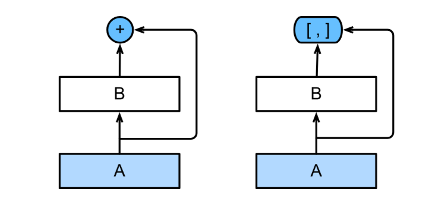
| 对比 | ResNet | DenseNet |
|------|--------|----------|
| **连接方式** | 相加：$f(\mathbf{x}) = \mathbf{x} + g(\mathbf{x})$ | 拼接：$[\mathbf{x}, f_1(\mathbf{x}), f_2([\mathbf{x}, f_1(\mathbf{x})]), \ldots]$ |
| **特征处理** | 旧特征被“覆盖” | 所有特征都被保留 |
| **信息流动** | 通过残差连接 | 每层都与之前所有层直接连接 |

**数学上的展开**：

$$\mathbf{x} \to [\mathbf{x}, f_1(\mathbf{x}), f_2([\mathbf{x}, f_1(\mathbf{x})]), f_3([\mathbf{x}, f_1(\mathbf{x}), f_2([\mathbf{x}, f_1(\mathbf{x})])]), \ldots]$$

每一层的输出都会与之前所有层的输出拼接到一起，形成“稠密连接”。

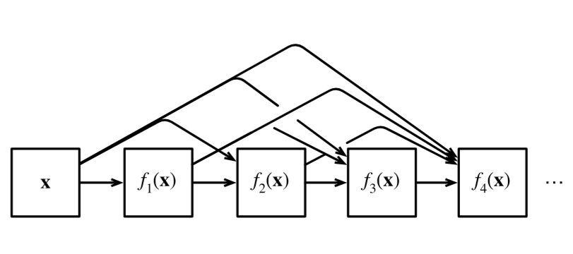

### 7.7.2 稠密块（Dense Block）

稠密块是 DenseNet 的基本构建单元。在稠密块中：

1. 每个卷积块的输入 = 之前**所有**卷积块输出的拼接
2. 每个卷积块输出固定数量的通道（称为**增长率**）
3. 块内通道数不断累积增长

```python
import torch
from torch import nn
from d2l import torch as d2l

# 卷积块：BN → ReLU → Conv
def conv_block(input_channels, num_channels):
    return nn.Sequential(
        nn.BatchNorm2d(input_channels), nn.ReLU(),
        nn.Conv2d(input_channels, num_channels, kernel_size=3, padding=1))

# 稠密块：多个卷积块，每个块的输入包含之前所有块的输出
class DenseBlock(nn.Module):
    def __init__(self, num_convs, input_channels, num_channels):
        super(DenseBlock, self).__init__()
        layer = []
        for i in range(num_convs):
            # 当前块的输入通道 = 原始输入通道 + 之前所有块的输出通道
            layer.append(conv_block(
                num_channels * i + input_channels, num_channels))
        self.net = nn.Sequential(*layer)

    def forward(self, X):
        for blk in self.net:
            Y = blk(X)
            # 在通道维度上拼接
            X = torch.cat((X, Y), dim=1)
        return X
```

**测试**：输入 3 通道，稠密块 2 个卷积块，每个卷积块输出 10 通道

```python
blk = DenseBlock(2, 3, 10)
X = torch.randn(4, 3, 8, 8)
Y = blk(X)
Y.shape          # torch.Size([4, 23, 8, 8])
# 3 + 2 × 10 = 23 通道
```

**增长率（Growth Rate）**：每个卷积块输出的通道数，决定了通道数的增长速度。在上例中，增长率为 10。

### 7.7.3 过渡层（Transition Layer）

由于稠密块会不断累积通道数，如果不加控制，通道数会爆炸式增长。**过渡层**用于：

1. 用 $1 \times 1$ 卷积**减半通道数**
2. 用步幅为 2 的平均汇聚层**减半高和宽**

```python
def transition_block(input_channels, num_channels):
    return nn.Sequential(
        nn.BatchNorm2d(input_channels), nn.ReLU(),
        nn.Conv2d(input_channels, num_channels, kernel_size=1),
        nn.AvgPool2d(kernel_size=2, stride=2))

# 将 23 通道减为 10 通道，空间尺寸减半
blk = transition_block(23, 10)
blk(Y).shape       # torch.Size([4, 10, 4, 4])
```

### 7.7.4 DenseNet 模型架构

DenseNet 的整体结构与 ResNet 类似：

1. **初始层**：$7 \times 7$ 卷积（步幅 2）+ 批量规范化 + ReLU + $3 \times 3$ 最大汇聚（步幅 2）
2. **4 个稠密块**：每个块包含 4 个卷积层，增长率 32
3. **过渡层**：在稠密块之间，减半通道和空间尺寸
4. **输出层**：全局平均汇聚 + 全连接层

```python
# 初始层
b1 = nn.Sequential(
    nn.Conv2d(1, 64, kernel_size=7, stride=2, padding=3),
    nn.BatchNorm2d(64), nn.ReLU(),
    nn.MaxPool2d(kernel_size=3, stride=2, padding=1))

# 四个稠密块 + 过渡层
num_channels, growth_rate = 64, 32
num_convs_in_dense_blocks = [4, 4, 4, 4]
blks = []
for i, num_convs in enumerate(num_convs_in_dense_blocks):
    blks.append(DenseBlock(num_convs, num_channels, growth_rate))
    num_channels += num_convs * growth_rate
    if i != len(num_convs_in_dense_blocks) - 1:
        blks.append(transition_block(num_channels, num_channels // 2))
        num_channels = num_channels // 2

# 输出层
net = nn.Sequential(
    b1, *blks,
    nn.BatchNorm2d(num_channels), nn.ReLU(),
    nn.AdaptiveAvgPool2d((1, 1)),
    nn.Flatten(),
    nn.Linear(num_channels, 10))
```

### 7.7.5 各层形状变化

| 模块 | 输入 → 输出形状 | 说明 |
|------|----------------|------|
| b1（初始） | (1, 96, 96) → (64, 24, 24) | 7×7 卷积 + 池化 |
| 稠密块1 | (64, 24, 24) → (192, 24, 24) | 4 个卷积块 × 32 = +128 通道 |
| 过渡层1 | (192, 24, 24) → (96, 12, 12) | 通道减半，尺寸减半 |
| 稠密块2 | (96, 12, 12) → (224, 12, 12) | +128 通道 |
| 过渡层2 | (224, 12, 12) → (112, 6, 6) | 通道减半，尺寸减半 |
| 稠密块3 | (112, 6, 6) → (240, 6, 6) | +128 通道 |
| 过渡层3 | (240, 6, 6) → (120, 3, 3) | 通道减半，尺寸减半 |
| 稠密块4 | (120, 3, 3) → (248, 3, 3) | +128 通道 |
| 全局汇聚 + 全连接 | (248, 3, 3) → (10,) | 输出分类结果 |

### 7.7.6 训练

```python
lr, num_epochs, batch_size = 0.1, 10, 256
train_iter, test_iter = d2l.load_data_fashion_mnist(batch_size, resize=96)
d2l.train_ch6(net, train_iter, test_iter, num_epochs, lr, d2l.try_gpu())
```

训练结果示例：
```
loss 0.140, train acc 0.950, test acc 0.882
5544.6 examples/sec on cuda:0
```

### 7.7.7 DenseNet 的核心设计思想

| 思想 | 解释 |
|------|------|
| **稠密连接** | 每层与之前所有层在通道上拼接，信息充分共享 |
| **增长率** | 控制每个卷积块的输出通道数，限制通道增长速度 |
| **过渡层** | 用 1×1 卷积降维 + 平均汇聚降采样 |
| **特征重用** | 浅层特征可以直接传递到深层，避免信息丢失 |
| **参数效率** | 相比 ResNet，DenseNet 用更少的参数达到相近效果 |

### 7.7.8 DenseNet vs ResNet 对比

| 对比维度 | ResNet | DenseNet |
|----------|--------|----------|
| **连接方式** | 相加（+） | 拼接（cat） |
| **特征处理** | 覆盖旧特征 | 保留所有旧特征 |
| **参数效率** | 较高 | 更高（参数更少） |
| **内存消耗** | 一般 | 较高（需存储所有中间特征） |
| **梯度流动** | 通过残差连接 | 每层都直接接收梯度 |

### 7.7.9 DenseNet 的优缺点

| 优点 | 缺点 |
|------|------|
| 参数利用率高 | 内存占用大（需存储所有中间特征） |
| 特征重用效果好 | 训练速度相对较慢 |
| 梯度流动更顺畅 | 实现复杂度较高 |
| 过拟合风险低 | 通道数增长需要精心控制 |

### 7.7.10 小结

- **DenseNet 的核心创新**：稠密连接——每层与之前所有层在通道维度上拼接
- **DenseNet 的两大组件**：稠密块（特征累积）+ 过渡层（通道压缩 + 下采样）
- **增长率**：控制通道增长速度的关键超参数
- **与 ResNet 的本质区别**：ResNet 用**相加**，DenseNet 用**拼接**
- **取舍**：DenseNet 参数效率更高，但内存消耗更大

## 第七章：现代卷积神经网络 - 总结

本章沿着计算机视觉的发展脉络，系统介绍了从 AlexNet 到 DenseNet 的经典卷积神经网络架构。每一代模型都在前一代的基础上解决了关键瓶颈，共同构成了现代深度学习的基石。


### 一、模型演进时间线

```
2012 ──── AlexNet ──── 开启深度学习时代
          │
2014 ──── VGG ──── 模块化设计 + 小卷积核堆叠
          │
2014 ──── NiN ──── 1×1 卷积 + 全局平均汇聚
          │
2014 ──── GoogLeNet ──── Inception 多尺度并行
          │
2015 ──── ResNet ──── 残差连接（跳跃连接）
          │
2016 ──── DenseNet ──── 密集连接（通道拼接）
```


### 二、各模型核心思想对比

| 模型 | 核心创新 | 一句话概括 |
|------|----------|-----------|
| **AlexNet** | 深度CNN + ReLU + Dropout + GPU | 第一个真正成功的深度CNN，证明学习到的特征胜过手工特征 |
| **VGG** | 重复的 3×3 卷积块 | 模块化设计，用多个小卷积核替代大卷积核 |
| **NiN** | 1×1 卷积 + 全局平均汇聚 | 用 1×1 卷积替代全连接层，大幅减少参数 |
| **GoogLeNet** | Inception 多尺度并行块 | 同一层用不同尺寸卷积核提取多尺度特征 |
| **ResNet** | 残差连接（跳跃连接） | 让网络学习残差 F(x) = f(x) - x，解决梯度消失 |
| **DenseNet** | 密集连接（通道拼接） | 每层与之前所有层在通道上拼接，特征充分重用 |


### 三、关键技术创新图谱

```
         ┌─────────────────────────────────────────────┐
         │              解决的核心问题                    │
         └─────────────────────────────────────────────┘
                              │
         ┌────────────────────┼────────────────────────────┐
         │                    │                            │
    【参数爆炸】         【梯度消失/训练困难】        【特征表达能力不足】
         │                    │                            │
         ▼                    ▼                            ▼
      NiN 1×1卷积        ResNet 残差连接            GoogLeNet Inception
      全局平均汇聚          DenseNet 密集连接          多尺度并行
                                          │
                                          ▼
                                    Batch Normalization
                                    （稳定训练，加速收敛）
```


### 四、设计模式总结

#### 1. 空间尺寸与通道数的变化规律

| 方向 | 变化趋势 | 原因 |
|------|----------|------|
| **空间尺寸** | 逐渐减小（224→112→56→...） | 通过步幅>1的卷积或汇聚层降采样 |
| **通道数** | 逐渐增加（64→128→256→...） | 更多通道提取更丰富的特征 |
| **最终** | 全局平均汇聚 → 全连接层 → 输出 | 将空间信息汇聚为类别预测 |

#### 2. 连接方式的演进

| 阶段 | 连接方式 | 代表模型 |
|------|----------|----------|
| **顺序连接** | 逐层串联 | LeNet, AlexNet, VGG |
| **并行连接** | 多路径并行 | GoogLeNet (Inception) |
| **跳跃连接** | 跨层相加 | ResNet |
| **密集连接** | 跨层拼接 | DenseNet |

#### 3. 参数效率的演进

```
参数数量（相对比较）：
VGG (1.38亿) >> AlexNet (6000万) > ResNet (1100万) ≈ GoogLeNet (700万) > NiN ≈ DenseNet

趋势：越来越注重参数效率，用更少的参数达到更好的效果
```


### 五、关键技术详解

#### 1. 1×1 卷积（NiN 引入）

| 用途 | 说明 |
|------|------|
| **通道数调整** | 自由增加或减少通道维度 |
| **跨通道信息融合** | 在不同通道间进行线性组合 |
| **降维/升维** | 减少通道数可降低计算量 |
| **替代全连接层** | 保持空间结构的同时实现全连接功能 |

#### 2. 残差连接（ResNet 核心）

$$ \text{输出} = \text{ReLU}(F(\mathbf{x}) + \mathbf{x}) $$

**为什么有效？**
- 梯度可直接通过跳跃连接传播（缓解梯度消失）
- 变成恒等映射只需权重逼近0（容易优化）
- 浅层特征可直接传递到深层

#### 3. 批量规范化（BN）

$$\mathrm{BN}(\mathbf{x}) = \gamma \cdot \frac{\mathbf{x} - \mu}{\sigma} + \beta$$

**作用**：
- 加速收敛（允许更大学习率）
- 轻微正则化（小批量噪声）
- 减少对初始化的依赖

#### 4. Inception 多尺度并行

| 路径 | 作用 |
|------|------|
| 1×1 卷积 | 捕捉细节特征 |
| 3×3 卷积 | 捕捉中等范围特征 |
| 5×5 卷积 | 捕捉较大范围特征 |
| 3×3 汇聚 | 保留背景信息 |


### 六、关键对比表

#### 6.1 各模型参数与性能对比

| 模型 | 层数 | 参数量（约） | 主要优点 | 主要缺点 |
|------|------|-------------|----------|----------|
| **AlexNet** | 8 | 6000万 | 开创性，证明了深度CNN的潜力 | 参数量大，没有模块化 |
| **VGG** | 11-19 | 1.38亿 | 结构简洁，模块化设计 | 参数量极大，计算慢 |
| **NiN** | 约10 | 显著减少 | 无全连接层，参数效率高 | 训练时间略长 |
| **GoogLeNet** | 22 | 700万 | 多尺度特征，参数少 | 架构复杂，设计精细 |
| **ResNet** | 18-152 | 1100万(18层) | 可训练极深网络，解决梯度消失 | 层数越深计算量越大 |
| **DenseNet** | 约40 | 比ResNet少 | 特征重用，参数效率更高 | 内存消耗大 |

#### 6.2 连接方式对比

| 模型 | 连接方式 | 特征处理 | 信息流动 |
|------|----------|----------|----------|
| **VGG** | 顺序连接 | 逐层传递 | 单向线性 |
| **GoogLeNet** | 并行连接 | 多路径融合 | 多尺度并行 |
| **ResNet** | 跳跃连接（+） | 旧特征被覆盖 | 跨层捷径 |
| **DenseNet** | 密集连接（cat） | 所有特征保留 | 全连接通 |


### 七、现代CNN设计的通用原则

根据本章模型演进，可以总结出以下通用设计原则：

1. **深度重要，但需配合跳跃连接**：单纯加深会导致梯度消失，需配合 ResNet 风格连接
2. **模块化设计**：VGG 的块、Inception 块、残差块 → 可复用结构
3. **1×1 卷积是万能工具**：通道调整、降维、跨通道信息融合
4. **批量规范化是标配**：加速训练、稳定收敛
5. **全局平均汇聚代替全连接**：减少参数、防止过拟合
6. **多尺度特征提取**：不同尺寸卷积核并行
7. **特征重用**：浅层特征可通过跳跃/密集连接传递到深层


### 八、一句话总结

> **从 AlexNet 到 DenseNet，CNN 架构演进的本质是：用更少的参数、更稳定的训练，让网络更深、更宽、更有效地提取和重用特征。每一代模型都在前一代基础上解决了一个关键瓶颈——AlexNet 证明了深度，VGG 提出了模块化，NiN 引入了 1×1 卷积，GoogLeNet 实现了多尺度，ResNet 解决了梯度消失，DenseNet 做到了极致特征共享。**