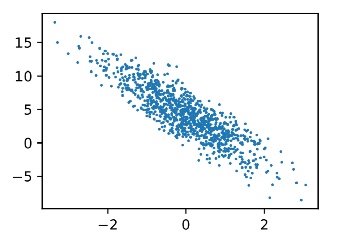
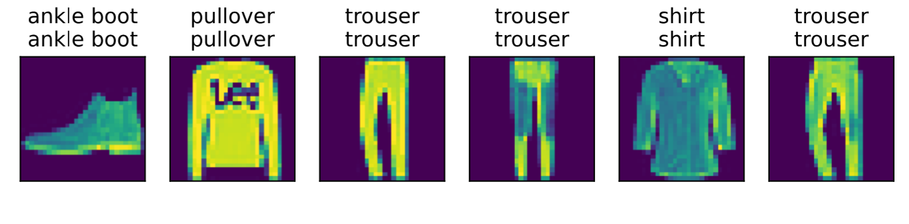

# 第 3 章 线性神经网络

## 3.1 线性回归

线性回归是回归问题中最简单且最流行的模型，可以追溯到 19 世纪初。它能够为自变量与因变量之间的关系建模，是理解更复杂神经网络的基础。

### 3.1.1 回归与预测

在机器学习领域，大多数任务都与 **预测** 有关。当我们想预测一个数值时，就会涉及到 **回归（Regression）** 问题。常见的回归问题包括：
- 预测价格（房屋、股票等）
- 预测住院时间
- 预测需求（零售销量等）

需要区分的是，并非所有预测都是回归问题。**分类（Classification）** 问题则是预测数据属于哪一组类别。

### 3.1.2 线性回归的基本元素

#### 线性模型的核心假设

线性回归基于两个核心假设：
1. 自变量 $\mathbf{x}$ 和因变量 $y$ 之间的关系是**线性**的
2. 任何噪声都服从正态分布

#### 房价预测示例

以根据房屋面积（平方英尺）和房龄（年）来估算房屋价格为例：

- **训练数据集（Training Set）**：收集到的包含房屋销售价格、面积和房龄的**真实数据集**
- **样本（Sample）**：数据集中的**每行数据**（一次房屋交易，即一次完整的数据）
- **标签（Label）**：预测的**目标**（房屋价格）
- **特征（Feature）**：预测所依据的**自变量**（面积和房龄）

用 $n$ 表示数据集中的样本数。对索引为 $i$ 的样本，其输入表示为 $\mathbf{x}^{(i)} = [x_1^{(i)}, x_2^{(i)}]^\top$，对应的标签是 $y^{(i)}$。

#### 线性模型的数学表示

线性假设将房屋价格表示为特征（面积和房龄）的加权和：

$$\mathrm{price} = w_{\mathrm{area}} \cdot \mathrm{area} + w_{\mathrm{age}} \cdot \mathrm{age} + b$$

其中：
- $w_{\mathrm{area}}$ 和 $w_{\mathrm{age}}$ 称为**权重（Weight）**，决定了每个特征对预测值的影响
- $b$ 称为**偏置（Bias）**、**偏移量（Offset）**或**截距（Intercept）**，表示当所有特征为 0 时的预测值

严格来说，这是输入特征的一个**仿射变换（Affine Transformation）**，即通过加权和进行线性变换，再通过偏置项进行平移。

#### 高维数据的向量表示

当输入包含 $d$ 个特征时，将预测结果 $\hat{y}$ 表示为：

$$\hat{y} = w_1 x_1 + \cdots + w_d x_d + b$$

将所有特征放入向量 $\mathbf{x} \in \mathbb{R}^d$，所有权重放入向量 $\mathbf{w} \in \mathbb{R}^d$，用点积形式简洁表达：

$$\hat{y} = \mathbf{w}^\top \mathbf{x} + b$$

对于包含 $n$ 个样本的数据集，特征矩阵 $\mathbf{X} \in \mathbb{R}^{n \times d}$ 的每一行是一个样本，每一列是一种特征。预测值 $\hat{\mathbf{y}} \in \mathbb{R}^n$ 可通过矩阵-向量乘法表示：

$${\hat{\mathbf{y}}} = \mathbf{X} \mathbf{w} + b$$


### 3.1.3 损失函数

**损失函数（Loss Function）** 能够量化目标的**实际值**与**预测值**之间的差距。回归问题中最常用的损失函数是**平方误差函数**。

对于样本 $i$，预测值为 $\hat{y}^{(i)}$，真实标签为 $y^{(i)}$ 时，平方误差为：

$$l^{(i)}(\mathbf{w}, b) = \frac{1}{2} \left(\hat{y}^{(i)} - y^{(i)}\right)^2$$

其中常数 $\frac{1}{2}$ 是为了求导后形式更简洁（导数的系数为 1）。

在整个训练集上的平均损失（经验风险）为：

$$L(\mathbf{w}, b) = \frac{1}{n} \sum_{i=1}^n l^{(i)}(\mathbf{w}, b) = \frac{1}{n} \sum_{i=1}^n \frac{1}{2} \left(\mathbf{w}^\top \mathbf{x}^{(i)} + b - y^{(i)}\right)^2$$

训练的目标是找到一组参数 $(\mathbf{w}^*, b^*)$ 来最小化总损失：

$$\mathbf{w}^*, b^* = \operatorname*{argmin}_{\mathbf{w}, b}\  L(\mathbf{w}, b)$$


### 3.1.4 解析解

线性回归存在**解析解（Analytical Solution）**，可以用公式直接表达。将偏置 $b$ 合并到参数 $\mathbf{w}$ 中（在矩阵中附加一列），优化问题变为最小化 $\|\mathbf{y} - \mathbf{X}\mathbf{w}\|^2$。

将损失关于 $\mathbf{w}$ 的导数设为 0，得到解析解：

$$\mathbf{w}^* = (\mathbf{X}^\top \mathbf{X})^{-1} \mathbf{X}^\top \mathbf{y}$$

解析解可以进行很好的数学分析，但对问题限制很严格，无法广泛应用在深度学习中。
将偏置 $b$ 并入权重 $\mathbf{w}$，特征末尾加 1：$\hat{y} = \mathbf{w}^\top \mathbf{x} \Rightarrow \hat{\mathbf{y}} = \mathbf{X} \mathbf{w}$。

#### 推导过程
##### 损失函数为

$$L(\mathbf{w}) = \|\mathbf{X}\mathbf{w} - \mathbf{y}\|^2 $$

##### 损失函数的等价表达式
对于任意向量 $\mathbf{z} \in \mathbb{R}^n$，其 L₂ 范数的平方定义为各分量平方和：

$$\|\mathbf{z}\|^2 = z_1^2 + z_2^2 + \cdots + z_n^2$$

而向量的内积（点积）为：

$$\mathbf{z}^\top \mathbf{z} = \sum_{i=1}^n z_i^2$$

两者显然相等：

$$\|\mathbf{z}\|^2 = \mathbf{z}^\top \mathbf{z}$$

令 $\mathbf{z} = \mathbf{X}\mathbf{w} - \mathbf{y}$，代入上式得：

$$\|\mathbf{X}\mathbf{w} - \mathbf{y}\|^2 = (\mathbf{X}\mathbf{w} - \mathbf{y})^\top (\mathbf{X}\mathbf{w} - \mathbf{y})$$

##### 展开
结合 $ (\mathbf{X}\mathbf{w})^\top = \mathbf{w}^\top\mathbf{X}^\top$ 和 $(\mathbf{X} \pm \mathbf{w})^\top = \mathbf{X} ^\top \pm \mathbf{w}^\top$  展开得：

$$L(\mathbf{w}) = \mathbf{w}^\top \mathbf{X}^\top \mathbf{X} \mathbf{w} - 2\mathbf{w}^\top \mathbf{X}^\top \mathbf{y} + \mathbf{y}^\top \mathbf{y}$$

##### 求解梯度
对 $\mathbf{w}$ 求梯度：

规则一：$\nabla_{\mathbf{w}} (\mathbf{w}^\top \mathbf{A} \mathbf{w}) = 2\mathbf{A} \mathbf{w}$（当 $\mathbf{A}$ 对称时）

类比标量：$\frac{d}{dx}(a x^2) = 2a x$  
向量版本只是把标量 $x$ 换成向量 $\mathbf{w}$（注意可以把 $\mathbf{w}^\top$ 也可以视为标量 $x$，因为实际上 $\mathbf{w}^\top \mathbf{w} = \mathbf{w}^2$ ），把标量 $a$ 换成对称矩阵 $\mathbf{A}$。

规则二：$\nabla_{\mathbf{w}} (\mathbf{w}^\top \mathbf{b}) = \mathbf{b}$

类比标量：$\frac{d}{dx}(b x) = b$  
向量版本中，$\mathbf{b}$ 是常向量。

$$\nabla_{\mathbf{w}} L(\mathbf{w}) = 2\mathbf{X}^\top \mathbf{X} \mathbf{w} - 2\mathbf{X}^\top \mathbf{y}$$

##### 梯度为0
令梯度为零：

$$\mathbf{X}^\top \mathbf{X} \mathbf{w} = \mathbf{X}^\top \mathbf{y}$$

若 $\mathbf{X}^\top \mathbf{X}$ 可逆，则解析解为：

$$\boxed{\mathbf{w}^* = (\mathbf{X}^\top \mathbf{X})^{-1} \mathbf{X}^\top \mathbf{y}}$$

计算流程：

$$L(\mathbf{w}) \xrightarrow{\text{求导}} \nabla L(\mathbf{w}) \xrightarrow{\text{令=0}} \mathbf{X}^\top \mathbf{X} \mathbf{w} = \mathbf{X}^\top \mathbf{y} \xrightarrow{\text{求解}} \mathbf{w}^* = (\mathbf{X}^\top \mathbf{X})^{-1} \mathbf{X}^\top \mathbf{y}$$

### 3.1.5 随机梯度下降（SGD）

当无法得到解析解时，可以用**梯度下降（Gradient Descent）** 来优化模型。它通过不断在损失函数递减的方向上更新参数来降低误差。

在深度学习中通常使用**小批量随机梯度下降（Minibatch Stochastic Gradient Descent）**：

1. 随机抽取一个小批量 $\mathcal{B}$（固定数量的训练样本）
2. 计算小批量的平均损失关于模型参数的梯度
3. 将梯度乘以学习率 $\eta$，从当前参数中减去

更新公式为：

$$(\mathbf{w}, b) \leftarrow (\mathbf{w}, b) - \frac{\eta}{|\mathcal{B}|} \sum_{i \in \mathcal{B}} \partial_{(\mathbf{w}, b)} l^{(i)}(\mathbf{w}, b)$$
其中 $\sum_{i \in \mathcal{B}} \partial_{(\mathbf{w}, b)} l^{(i)}(\mathbf{w}, b)$ 就是小批量 $\mathcal{B}$ 每个样本 $i$ 的损失函数 $l^{(i)}(\mathbf{w}, b)$ 关于模型参数 $(\mathbf{w}, b)$ 的梯度和。

对于平方损失和仿射变换，根据损失函数 $L(\mathbf{w}, b)$ :
$$
L(\mathbf{w}, b) = \frac{1}{n} \sum_{i=1}^n l^{(i)}(\mathbf{w}, b) = \frac{1}{n} \sum_{i=1}^n \frac{1}{2} \left(\mathbf{w}^\top \mathbf{x}^{(i)} + b - y^{(i)}\right)^2
$$

分别对 $\mathbf{w}$ 和 $b$ 求偏导，可以得到具体更新规则为：

$$\begin{aligned} \mathbf{w} &\leftarrow \mathbf{w} - \frac{\eta}{|\mathcal{B}|} \sum_{i \in \mathcal{B}} \mathbf{x}^{(i)} \left(\mathbf{w}^\top \mathbf{x}^{(i)} + b - y^{(i)}\right) \\ b &\leftarrow b - \frac{\eta}{|\mathcal{B}|} \sum_{i \in \mathcal{B}} \left(\mathbf{w}^\top \mathbf{x}^{(i)} + b - y^{(i)}\right) \end{aligned}$$

其中：
- $|\mathcal{B}|$ 为**批量大小（Batch Size）**
- $\eta$ 为**学习率（Learning Rate）**
- 批量大小和学习率都是**超参数（Hyperparameter）**，需要手动选择


### 3.1.6 用模型进行预测

给定训练好的线性回归模型 $\hat{\mathbf{w}}^\top \mathbf{x} + \hat{b}$，可以通过输入特征来估计目标值。这个过程称为**预测（Prediction）**。


### 3.1.7 矢量化加速

在训练模型时，我们希望同时处理整个小批量的样本。矢量化利用线性代数库，避免在 Python 中编写开销高昂的 for 循环，通常能带来**数量级的加速**。

```python
%matplotlib inline
import math
import time
import numpy as np
import torch
from d2l import torch as d2l
```

#### 计时器类

```python
class Timer:  #@save
    """记录多次运行时间"""
    def __init__(self):
        self.times = []
        self.start()

    def start(self):
        """启动计时器"""
        self.tik = time.time()

    def stop(self):
        """停止计时器并将时间记录在列表中"""
        # 将经过时间放到属性——时间列表中
        self.times.append(time.time() - self.tik)
        # 返回类属性时间列表的最后一个元素
        return self.times[-1]

    def avg(self):
        """返回平均时间"""
        return sum(self.times) / len(self.times)

    def sum(self):
        """返回时间总和"""
        return sum(self.times)

    def cumsum(self):
        """返回累计时间"""
        return np.array(self.times).cumsum().tolist()
```

#### 向量加法对比实验

```python
# 创建两个 10000 维的全 1 向量
n = 10000
a = torch.ones([n])
b = torch.ones([n])
```

**使用 for 循环（标量操作）：**

```python
c = torch.zeros(n)
timer = Timer()
for i in range(n):
    c[i] = a[i] + b[i]
print(f'{timer.stop():.5f} sec')
# 输出示例: 0.09661 sec
```

**使用矢量化（重载的 `+` 运算符）：**
PyTorch 对张量类型重新定义了 + 运算符的行为。

```python
timer.start()
d = a + b
print(f'{timer.stop():.5f} sec')
# 输出示例: 0.00021 sec
```

**结论**：矢量化代码通常比 for 循环快数百倍，且更简洁、更少出错。


### 3.1.8 正态分布与平方损失

正态分布（高斯分布）与线性回归有着密切的联系。

#### 正态分布的定义

若随机变量 $x$ 具有均值 $\mu$ 和方差 $\sigma^2$（标准差 $\sigma$），其概率密度函数为：

$$p(x) = \frac{1}{\sqrt{2 \pi \sigma^2}} \exp\left(-\frac{1}{2 \sigma^2} (x - \mu)^2\right)$$

```python
def normal(x, mu, sigma):
    p = 1 / math.sqrt(2 * math.pi * sigma**2)
    return p * np.exp(-0.5 / sigma**2 * (x - mu)**2)
```

**观察**：
- 改变均值 $\mu$ 会产生沿 $x$ 轴的**偏移**
- 增加方差 $\sigma^2$ 会**分散分布**、**降低峰值**

#### 从噪声假设推导平方损失

假设观测中包含服从正态分布 $\mathcal{N}(0, \sigma^2)$ 的噪声：
$$y = \mathbf{w}^\top \mathbf{x} + b + \epsilon, \quad \epsilon \sim \mathcal{N}(0, \sigma^2)$$

给定 $\mathbf{x}$ 观测到特定 $y$ 的**似然（Likelihood）** 为：

$$P(y \mid \mathbf{x}) = \frac{1}{\sqrt{2 \pi \sigma^2}} \exp\left(-\frac{1}{2 \sigma^2} (y - \mathbf{w}^\top \mathbf{x} - b)^2\right)$$

> 似然衡量的是：在给定模型参数 $(\mathbf{w}, b)$ 和输入 $\mathbf{x}$ 的条件下，观测到真实输出 $y$ 的概率。在线性回归中，这个概率由预测误差 $\epsilon = y - (\mathbf{w}^\top \mathbf{x} + b)$ （实际值 $-$ 误差值）决定，误差越小，似然越大；**似然求解方法就是将误差代入误差自身的概率密度函数**（如上式） 。

整个数据集的似然为：

$$P(\mathbf y \mid \mathbf X) = \prod_{i=1}^{n} p(y^{(i)}|\mathbf{x}^{(i)})$$

**极大似然估计（Maximum Likelihood Estimation, MLE）** 选择使似然最大化的参数。通过最小化负对数似然：

$$-\log P(\mathbf y \mid \mathbf X) = \sum_{i=1}^n \frac{1}{2} \log(2 \pi \sigma^2) + \frac{1}{2 \sigma^2} \left(y^{(i)} - \mathbf{w}^\top \mathbf{x}^{(i)} - b\right)^2$$

当 $\sigma$ 固定时，第一项为常数，最小化负对数似然等价于**最小化均方误差**。因此，在**高斯噪声假设下，最小化均方误差等价于线性模型的极大似然估计**。


### 3.1.9 从线性回归到深度网络

线性回归可以看作一个简单的神经网络。

#### 神经网络图

线性回归是一个**单层神经网络**：
- 输入层：包含 $d$ 个输入（特征维度为 $d$）
- 输出层：1 个输出（预测值）
- 连接方式：**全连接层（Fully-connected Layer）** 或**稠密层（Dense Layer）**，每个输入都与输出相连

通常计算层数时不考虑输入层，因此线性回归是**单层神经网络**。

#### 生物学启示

生物神经元通过树突接收信号 $x_i$，通过突触权重 $w_i$ 加权，在细胞核中以加权和 $\sum_i x_i w_i + b$ 的形式汇聚，然后通过轴突输出。

$$
\underbrace{x_i}_{\text{输入信号}} \xrightarrow{\text{树突}} \underbrace{w_i}_{\text{突触权重}} \xrightarrow{\text{加权}} \underbrace{\sum_i x_i w_i + b}_{\text{细胞核求和}} \xrightarrow{\text{轴突}} \underbrace{\sigma(y)}_{\text{非线性处理}}
$$

虽然深度学习受神经科学启发，但如今更多灵感来自数学、统计学和计算机科学。正如 Russell 和 Norvig 所说：“虽然飞机可能受到鸟类的启发，但几个世纪以来，鸟类学并不是航空创新的主要驱动力。”


### 3.1.10 小结

1. **机器学习模型的关键要素**：训练数据、损失函数、优化算法、模型本身
2. **矢量化**：使数学表达更简洁，运行更快（通常有数量级加速）
3. **最小化目标函数与极大似然估计**：在高斯噪声假设下等价
4. **线性回归**：不仅是一个经典的统计模型，也是单层神经网络的雏形


### 3.1.11 关键公式汇总

| 概念 | 公式 |
|------|------|
| 线性模型 | $\hat{y} = \mathbf{w}^\top \mathbf{x} + b$ |
| 平方损失（单样本） | $l^{(i)}(\mathbf{w}, b) = \frac{1}{2}(\hat{y}^{(i)} - y^{(i)})^2$ |
| 经验损失（全体） | $L(\mathbf{w}, b) = \frac{1}{n} \sum_{i=1}^n \frac{1}{2}(\mathbf{w}^\top \mathbf{x}^{(i)} + b - y^{(i)})^2$ |
| 解析解 | $\mathbf{w}^* = (\mathbf{X}^\top \mathbf{X})^{-1} \mathbf{X}^\top \mathbf{y}$ |
| SGD 更新 | $\mathbf{w} \leftarrow \mathbf{w} - \frac{\eta}{\|\mathcal{B}\|} \sum_{i \in \mathcal{B}} \partial_{\mathbf{w}} l^{(i)}(\mathbf{w}, b)$ |
| 正态分布 PDF | $p(x) = \frac{1}{\sqrt{2\pi\sigma^2}} \exp(-\frac{1}{2\sigma^2}(x-\mu)^2)$ |
| 高斯噪声模型 | $y = \mathbf{w}^\top \mathbf{x} + b + \epsilon, \quad \epsilon \sim \mathcal{N}(0, \sigma^2)$ |
| 负对数似然 | $-\log P(\mathbf y \mid \mathbf X) = \sum_{i=1}^n \frac{1}{2} \log(2\pi\sigma^2) + \frac{1}{2\sigma^2}(y^{(i)} - \mathbf{w}^\top \mathbf{x}^{(i)} - b)^2$ |
>PDF 指概率密度函数。


## 3.2 线性回归的从零开始实现

在了解线性回归的关键思想之后，我们可以通过代码来动手实现线性回归。本章将从零开始实现整个方法，包括数据流水线、模型、损失函数和小批量随机梯度下降优化器。虽然现代的深度学习框架几乎可以自动化地进行所有这些工作，但从零开始实现可以确保我们真正知道自己在做什么。

在实现中，我们将只使用张量和自动求导，在之后的章节中才会利用深度学习框架的优势，介绍更简洁的实现方式。


### 3.2.1 生成数据集

为了简单起见，我们将根据带有噪声的线性模型构造一个人造数据集。任务是使用这个有限样本的数据集来恢复这个模型的参数。我们使用低维数据，以便可以很容易地将其可视化。

在下面的代码中，生成一个包含 1000 个样本的数据集，每个样本包含从标准正态分布中采样的 2 个特征。合成数据集是一个矩阵 $\mathbf{X} \in \mathbb{R}^{1000 \times 2}$。

使用线性模型参数 $\mathbf{w} = [2, -3.4]^\top$、$b = 4.2$ 和噪声项 $\epsilon$ 生成数据集及其标签：

$$\mathbf{y} = \mathbf{X} \mathbf{w} + b + \epsilon$$

噪声项 $\epsilon$ 服从均值为 0、标准差为 0.01 的正态分布，代表模型预测和标签时的潜在观测误差。

```python
%matplotlib inline
import random
import torch
from d2l import torch as d2l

def synthetic_data(w, b, num_examples):  #@save
    """生成 y = Xw + b + 噪声"""
    # 从标准正态分布 N(0,1) 中采样 num_examples 个样本，每个样本 len(w) 个特征
    # 使用元组指定张量大小，行代表每一个样本，列代表每一个元素的特征量
    X = torch.normal(0, 1, (num_examples, len(w)))

    # 计算真实值：矩阵乘法 X@w + b
    # matmul 函数能够针对不同类型执行矩阵乘法——dot、mv、mv等
    y = torch.matmul(X, w) + b

    # 添加噪声：均值为 0，标准差为 0.01
    y += torch.normal(0, 0.01, y.shape)
    return X, y.reshape((-1, 1))  # 将 y 转换为列向量

# 设置真实的权重和偏置
true_w = torch.tensor([2, -3.4])
true_b = 4.2
# 生成 1000 个样本，特征值就是x,标签（目标）就是y
features, labels = synthetic_data(true_w, true_b, 1000)
```

`features` 中的每一行都包含一个二维数据样本，`labels` 中的每一行都包含一维标签值（一个标量）。

```python
print('features:', features[0], '\nlabel:', labels[0])
# 输出示例: features: tensor([-0.3679, -1.8471]) 
#          label: tensor([9.7361])
```

通过生成第二个特征 `features[:, 1]` 和 `labels` 的散点图，可以直观观察到两者之间的线性关系。

```python
d2l.set_figsize()
d2l.plt.scatter(features[:, 1].detach().numpy(), labels.detach().numpy(), 1)
```

从散点图可以清晰看到，特征与标签之间存在明显的线性关系，且带有少量噪声。


### 3.2.2 读取数据集

训练模型时要对数据集进行遍历，每次抽取一小批量样本，并使用它们来更新模型。由于这个过程是训练机器学习算法的基础，需要定义一个函数，该函数能打乱数据集中的样本并以小批量方式获取数据。

```python
def data_iter(batch_size, features, labels):
    """
    小批量数据迭代器，用于逐个批次地返回打乱后的训练数据。
    
    输入参数:
        batch_size (int): 每个批次包含的样本数量
        features (torch.Tensor): 特征矩阵，形状为 (num_examples, num_features)
        labels (torch.Tensor): 标签向量，形状为 (num_examples, 1)
    
    输出:
        生成器，每次产生一个元组 (batch_features, batch_labels)
        - batch_features (torch.Tensor): 当前批次的特征，形状 (batch_size, num_features)
        - batch_labels (torch.Tensor): 当前批次的标签，形状 (batch_size, 1)
    """
    # 获取数据集中的样本总数（= features 的行数）
    num_examples = len(features)
    
    # 生成索引列表 [0, 1, 2, ..., num_examples-1]
    indices = list(range(num_examples))
    
    # 随机打乱索引顺序，使每个 epoch 的样本读取顺序不同
    # 这有助于避免模型学习到样本的顺序信息，提升泛化能力
    random.shuffle(indices)
    
    # 从 0 开始遍历，每次步进 batch_size，直到覆盖所有样本
    for i in range(0, num_examples, batch_size):
        # 取出当前批次的索引
        # min(i + batch_size, num_examples) 确保最后一个批次不越界
        batch_indices = torch.tensor(
            indices[i: min(i + batch_size, num_examples)]
        )
        
        # yield 使函数变为生成器
        # 每次迭代返回当前批次的特征和标签
        # 注意：特征和标签的样本顺序相同，都是按 batch_indices 选取的
        yield features[batch_indices], labels[batch_indices]
```
>`yield` 是 Python 中用于创建生成器（Generator）的关键字。与`return`不同，它让函数能够产生一个值后暂停，下次调用时从暂停处继续执行，而不是一次性返回所有结果。

通常，我们利用 GPU 并行运算的优势，处理合理大小的“小批量”。每个样本都可以并行地进行模型计算，且每个样本损失函数的梯度也可以被并行计算。GPU 在处理几百个样本时，所花费的时间不比处理一个样本时多太多。

直观感受一下小批量运算：读取第一个小批量数据样本并打印。

```python
batch_size = 10

# 因为函数 data_iter 使用了 yield 生成器，所以正好适合循环。
for X, y in data_iter(batch_size, features, labels):
    print(X, '\n', y)
    break
```

每个批量的特征维度显示批量大小和输入特征数，批量的标签形状与 `batch_size` 相等。


### 3.2.3 初始化模型参数

在开始用小批量随机梯度下降优化模型参数之前，需要先初始化参数。这里通过从均值为 0、标准差为 0.01 的正态分布中采样随机数来初始化权重，并将偏置初始化为 0。

```python
# 权重：从 N(0, 0.01) 采样，形状为 (2, 1)，需要计算梯度
w = torch.normal(0, 0.01, size=(2, 1), requires_grad=True)
# 偏置：初始化为 0，需要计算梯度
b = torch.zeros(1, requires_grad=True)
```

在初始化参数之后，任务是更新这些参数，直到这些参数足够拟合数据。每次更新都需要计算损失函数关于模型参数的梯度。使用自动微分（如 `sec_autograd` 中介绍）来计算梯度，避免手动计算。


### 3.2.4 定义模型

定义模型，将模型的输入和参数同模型的输出关联起来。线性模型的输出是输入特征 $\mathbf{X}$ 和模型权重 $\mathbf{w}$ 的矩阵-向量乘法后加上偏置 $b$。注意 $\mathbf{X}\mathbf{w}$ 是一个向量，而 $b$ 是一个标量，通过广播机制，标量会被加到向量的每个分量上。

```python
def linreg(X, w, b):  #@save
    """线性回归模型"""
    return torch.matmul(X, w) + b
```


### 3.2.5 定义损失函数

使用平方损失函数（均方误差的一半）。在实现中，需要将真实值 `y` 的形状转换为和预测值 `y_hat` 的形状相同。

```python
def squared_loss(y_hat, y):  #@save
    """均方损失"""
    # reshape 确保 y 与 y_hat 形状一致，便于逐元素运算
    return (y_hat - y.reshape(y_hat.shape)) ** 2 / 2
```


### 3.2.6 定义优化算法

尽管线性回归有解析解，但本书中的其他模型大多没有。这里实现小批量随机梯度下降算法。

在每一步中，使用从数据集中随机抽取的一个小批量，然后根据参数计算损失的梯度，朝着减少损失的方向更新参数。

```python
def sgd(params, lr, batch_size):  #@save
    """
    小批量随机梯度下降（Stochastic Gradient Descent）
    
    该函数接收模型参数列表、学习率和批量大小，对每个参数执行一步梯度下降更新。
    更新公式为：param = param - lr * (梯度 / batch_size)
    
    输入参数:
        params (list): 模型参数列表，如 [w, b]，每个参数都包含 .grad 属性
        lr (float): 学习率（learning rate），控制每次更新的步长
        batch_size (int): 小批量大小，用于规范化梯度
    
    返回值:
        无（原地更新参数）
    """
    # torch.no_grad() 上下文管理器
    # 作用：禁用自动微分机制，在此作用域内的操作不会被记录到计算图中
    # 为什么需要？因为参数更新本身不是模型的前向计算，不需要计算梯度
    # 如果不加，会浪费内存和时间去构建无用的计算图
    with torch.no_grad():
        # 遍历所有需要更新的参数（如 w 和 b）
        for param in params:
            # ==================================================
            # 参数更新公式推导：
            # 原始公式：θ ← θ - (η/|B|) · Σ ∇_θ l_i(θ)
            #
            # 因为我们在反向传播时使用了 l.sum().backward()
            # l 的形状是 (batch_size, 1)，l.sum() 将批量损失求和得到标量
            # 所以 param.grad 存储的是批量损失之和的梯度 = Σ ∇_θ l_i(θ)
            # 
            # 因此更新公式为：
            #   param = param - lr * (param.grad / batch_size)
            # ==================================================
            
            # 原地更新参数
            # param -= lr * param.grad / batch_size 等价于：
            # param = param - lr * param.grad / batch_size
            param -= lr * param.grad / batch_size
            
            # ==================================================
            # 梯度清零
            #   PyTorch 默认会累积梯度（即 .grad 会累加）
            #   如果不清零，下次调用 .backward() 时，新梯度会与旧梯度相加
            #   导致梯度越来越大，参数更新方向错误
            # 
            # .zero_() 中的下划线 _ 表示原地操作（in-place）
            # 直接修改 param.grad 的内容，不创建新对象
            # ==================================================
            param.grad.zero_()
```

该函数接受模型参数集合、学习速率和批量大小作为输入。每一步更新的大小由学习速率 `lr` 决定。使用批量大小来规范化步长，使步长大小不依赖于批量大小的选择。
>with 是 Python 中用于上下文管理（Context Manager） 的关键字。它能够自动管理资源的获取和释放，确保代码执行完毕后资源被正确清理，即使在执行过程中发生异常也能安全退出。

### 3.2.7 训练

现在我们已经准备好了模型训练所有需要的要素，可以实现主要的训练过程了。

**训练循环**：
1. 初始化参数
2. 重复以下步骤直到完成：
   - 计算梯度 $\mathbf{g} \leftarrow \partial_{(\mathbf{w},b)} \frac{1}{|\mathcal{B}|} \sum_{i \in \mathcal{B}} l(\mathbf{x}^{(i)}, y^{(i)}, \mathbf{w}, b)$
   - 更新参数 $(\mathbf{w}, b) \leftarrow (\mathbf{w}, b) - \eta \mathbf{g}$

在每个**迭代周期（epoch）** 中，使用 `data_iter` 函数遍历整个数据集，将训练数据集中所有样本都使用一次。迭代周期个数 `num_epochs` 和学习率 `lr` 都是超参数。

```python
# ============================================================
# 设置超参数（Hyperparameters）
# ============================================================

lr = 0.03          # 学习率（learning rate）

num_epochs = 3     # 迭代周期数（number of epochs）

net = linreg       # 模型函数：线性回归

loss = squared_loss  # 损失函数：平方损失

# ============================================================
# 训练循环（Training Loop）
# ============================================================
# 训练循环是深度学习中最核心的代码模式
# 每个 epoch 中，所有样本都会被遍历一次
# 每个 batch 中，执行：前向传播 → 计算损失 → 反向传播 → 更新参数

for epoch in range(num_epochs):  # 外层循环：遍历 num_epochs 次完整数据集
    # ============================================================
    # 内层循环：遍历所有小批量数据
    # ============================================================
    # data_iter 返回一个生成器，每次 yield 一个 (batch_X, batch_y)
    # 每个 batch 包含 batch_size 个样本
    # 循环次数 = ceil(样本总数 / batch_size)
    for X, y in data_iter(batch_size, features, labels):
        # ----- 前向传播（Forward Propagation） -----
        # 计算当前批量的预测值
        # net(X, w, b) = X @ w + b
        # 结果形状: (batch_size, 1)
        # 
        # 计算过程：
        #   X: (batch_size, 2)  → 每个样本有 2 个特征
        #   w: (2, 1)           → 2 个权重
        #   b: (1,)             → 1 个偏置
        #   X @ w: (batch_size, 1) → 每个样本的线性组合
        #   + b: 广播到每个样本 → 每个样本加上相同的偏置
        y_hat = net(X, w, b)
        
        # ----- 计算损失（Compute Loss） -----
        # 计算每个样本的损失
        # loss(y_hat, y) = (y_hat - y)² / 2
        # 结果形状: (batch_size, 1) → 每个样本一个损失值
        l = loss(y_hat, y)
        
        # ----- 反向传播（Backward Propagation） -----
        # l.sum() 将批量中所有样本的损失相加，得到一个标量
        # 为什么要求和？
        #   因为 .backward() 只能对标量调用
        #   如果 l 是向量 (batch_size, 1)，直接 .backward() 会报错
        # 
        # .backward() 计算 l.sum() 关于 w 和 b 的梯度
        # 计算结果存入 w.grad 和 b.grad
        # 
        # 注意：w.grad 和 b.grad 存储的是批量损失之和的梯度
        # 即：w.grad = Σ ∇_w l_i(w,b)，不是平均梯度
        l.sum().backward()
        
        # ----- 更新参数（Update Parameters） -----
        # 使用小批量随机梯度下降更新 w 和 b
        # sgd 内部会：
        #   1. 用 w.grad / batch_size 计算平均梯度
        #   2. w = w - lr * (w.grad / batch_size)
        #   3. b = b - lr * (b.grad / batch_size)
        #   4. 将 w.grad 和 b.grad 清零（防止下次累加）
        sgd([w, b], lr, batch_size)
    
    # ============================================================
    # 每个 epoch 结束后评估模型
    # ============================================================
    # 计算整个训练集上的平均损失
    # 用于监控训练进度，观察模型是否在持续学习
    
    # with torch.no_grad(): 禁用梯度追踪
    # 因为评估时不需要计算梯度，可以节省内存和计算时间
    # 如果不加，每次评估都会构建计算图，浪费资源
    with torch.no_grad():
        # 计算整个数据集的预测值
        # X 和 features 本质上是“全部数据”和“部分数据”的关系
        # features: (1000, 2)，w: (2, 1)，b: (1,)
        # 结果: (1000, 1)
        y_hat_all = net(features, w, b)
        
        # 计算所有样本的损失
        # 结果形状: (1000, 1)
        train_loss_all = loss(y_hat_all, labels)
        
        # 计算平均损失
        # .mean() 对 (1000, 1) 张量求平均，得到标量
        # float() 将张量转换为 Python 浮点数，便于格式化输出
        avg_loss = float(train_loss_all.mean())
        
        # 打印当前 epoch 的训练损失
        # 损失下降说明模型在学习
        # 通常期望：epoch 1 损失较大，后续逐渐减小
        print(f'epoch {epoch + 1}, loss {avg_loss:f}')
        
        # 输出示例：
        # epoch 1, loss 0.043705  ← 初始损失较大
        # epoch 2, loss 0.000172  ← 损失显著下降
        # epoch 3, loss 0.000047  ← 损失继续下降，趋于平稳
```

损失快速下降，说明模型正在有效学习。


### 3.2.8 评估训练结果

因为使用的是合成数据集，所以知道真实的参数是什么。可以通过比较真实参数和训练学到的参数来评估训练的成功程度。

```python
print(f'w的估计误差: {true_w - w.reshape(true_w.shape)}')
print(f'b的估计误差: {true_b - b}')
# 输出示例:
# w的估计误差: tensor([ 0.0003, -0.0002], grad_fn=<SubBackward0>)
# b的估计误差: tensor([0.0010], grad_fn=<RsubBackward1>)
```

真实参数和通过训练学到的参数确实非常接近，误差在 $10^{-4}$ 量级。

> **注意**：在机器学习中，我们通常不太关心恢复真正的参数，而更关心如何高度准确地预测。即使是在复杂的优化问题上，随机梯度下降通常也能找到非常好的解。


### 3.2.9 小结

- 我们从零开始实现了线性回归，包括数据生成、数据读取、参数初始化、模型定义、损失函数定义、优化算法定义和训练循环
- 在这一过程中只使用张量和自动微分，不需要定义层或复杂的优化器
- 线性回归虽然简单，但其中的训练模式（小批量梯度下降、前向传播、反向传播、参数更新）是深度学习的核心范式


### 3.2.10 关键代码汇总

| 组件 | 函数/代码 | 说明 |
|------|-----------|------|
| 数据生成 | `synthetic_data(w, b, num_examples)` | 生成带噪声的线性数据 |
| 数据读取 | `data_iter(batch_size, features, labels)` | 打乱并批量读取数据 |
| 模型 | `linreg(X, w, b)` | 线性回归模型 $\hat{y} = Xw + b$ |
| 损失函数 | `squared_loss(y_hat, y)` | 平方损失 $\frac{1}{2}(\hat{y}-y)^2$ |
| 优化器 | `sgd(params, lr, batch_size)` | 小批量随机梯度下降 |
| 训练循环 | `for epoch in range(num_epochs)` | 迭代训练，打印损失 |


## 3.3 线性回归的简洁实现

在上一节中，我们从零开始实现了线性回归，包括数据迭代器、模型定义、损失函数和优化算法。实际上，现代深度学习框架已经为我们实现了这些常用组件。本节将介绍如何使用 **PyTorch 的高级 API** 更简洁地实现线性回归模型。

使用高级 API 的优势在于：
- 减少重复代码
- 利用框架的优化实现（如 GPU 加速、高效的数据加载）
- 更容易扩展到更复杂的模型


### 3.3.1 生成数据集

首先，我们使用与之前相同的方式生成数据集。这里直接调用 `d2l.synthetic_data` 函数，该函数在上一节中已定义。

```python
import numpy as np
import torch
from torch.utils import data  # PyTorch 的数据处理工具
from d2l import torch as d2l

# 设置真实的权重和偏置（与上一节相同）
true_w = torch.tensor([2, -3.4])   # 特征权重：[特征1权重=2, 特征2权重=-3.4]
true_b = 4.2                        # 偏置
features, labels = d2l.synthetic_data(true_w, true_b, 1000)  # 生成 1000 个样本
```


### 3.3.2 读取数据集

PyTorch 的 `torch.utils.data` 模块提供了高效的数据加载工具。我们可以用几行代码就构造出一个数据迭代器，而不需要手动实现打乱和分批逻辑。

```python
def load_array(data_arrays, batch_size, is_train=True):  #@save
    """
    构造一个 PyTorch 数据迭代器
    
    参数:
        data_arrays: 包含特征和标签的元组，如 (features, labels)
        batch_size: 每个批次的大小
        is_train: 是否在每轮打乱数据（训练时 True，测试时 False）
    
    返回:
        DataLoader: 可迭代的数据加载器对象
    """
    # TensorDataset 将多个张量包装成一个数据集对象
    # *data_arrays 将元组解包为 (features, labels)
    # 它们会被自动对齐：第 i 个样本 = (features[i], labels[i])
    dataset = data.TensorDataset(*data_arrays)
    
    # DataLoader 负责批量加载、打乱和多线程处理
    # shuffle=is_train: 训练时打乱顺序，提高模型泛化能力
    return data.DataLoader(dataset, batch_size, shuffle=is_train)

# 使用：创建 batch_size=10 的数据迭代器
batch_size = 10
data_iter = load_array((features, labels), batch_size)
```

**PyTorch 数据加载流程：**

```
features (1000, 2) + labels (1000, 1)
            ↓
      TensorDataset  ← 将数据配对：(features[i], labels[i])
            ↓
      DataLoader     ← 处理分批、打乱、并行加载
            ↓
    迭代时每次返回 (batch_features, batch_labels)
```

**验证数据迭代器：**

```python
# next(iter(data_iter)) 获取第一个批次
# iter(data_iter) 创建迭代器对象
# next() 获取下一个元素（即第一个批次）
next(iter(data_iter))
# 输出示例：
# [tensor([[ 0.1554, -0.2034],    ← 第一批的 10 个样本的特征
#          [-0.2140,  1.0352],
#          ...]),
#  tensor([[ 5.2116],              ← 对应的 10 个标签
#          [ 0.2479],
#          ...])]
```


### 3.3.3 定义模型

PyTorch 的 `nn` 模块提供了大量预定义的神经网络层。对于线性回归，我们只需要一个**全连接层（Fully-connected Layer）**，也称为**线性层**。

```python
from torch import nn

# nn.Sequential 是一个容器，按顺序执行其中的层
# 这里只有一个层：nn.Linear(2, 1)，注意nn.Linear代表一个层
# nn.Linear(in_features, out_features)
#   - in_features=2: 输入特征数（2 个特征）
#   - out_features=1: 输出特征数（预测 1 个值）
net = nn.Sequential(nn.Linear(2, 1))
```

**`nn.Linear` 内部结构：**

```
输入:  (batch_size, 2)    权重 W: (1, 2)    偏置 b: (1,)
           ↓                    ↓                ↓
       X @ W.T              (batch_size, 1)      +
           ↓                                     ↓
    预测值: (batch_size, 1)                    广播相加
```

注意：`nn.Linear(2, 1)` 在内部创建了两个可训练参数：
- `weight`：形状为 `(1, 2)` 的权重矩阵
- `bias`：形状为 `(1,)` 的偏置向量

这些参数默认需要梯度（`requires_grad=True`），因为训练时需要更新。


### 3.3.4 初始化模型参数

深度学习框架通常提供多种参数初始化方法。这里我们使用正态分布初始化权重，用零初始化偏置。

```python
# net[0] 获取 Sequential 中的第一层（即 nn.Linear）
# weight.data 访问权重张量（不包含梯度信息）
# normal_(0, 0.01) 原地用均值为 0、标准差为 0.01 的正态分布填充
# 在Pytorch中。含“_”的函数\方法代表原地执行，可以减少内存占用
net[0].weight.data.normal_(0, 0.01)

# bias.data 访问偏置张量
# fill_(0) 原地用 0 填充
net[0].bias.data.fill_(0)

# 输出示例: tensor([0.])  ← 偏置初始化为 0
```

**参数初始化方法对比：**

| 方法 | 说明 |
|------|------|
| `normal_(mean, std)` | 从正态分布填充 |
| `uniform_(a, b)` | 从均匀分布填充 |
| `fill_(value)` | 用固定值填充 |
| `zeros_()` | 用 0 填充 |
| `ones_()` | 用 1 填充 |


### 3.3.5 定义损失函数

PyTorch 的 `nn` 模块提供了常见的损失函数。这里使用 **均方误差损失（Mean Squared Error Loss）**。

```python
# MSELoss 计算预测值与真实值之间的均方误差
# 默认返回所有样本损失的平均值（reduction='mean'）
# 可选：reduction='sum' 返回总和，reduction='none' 返回每个样本的损失
loss = nn.MSELoss()
```

注意：这里默认是**平均损失**，而不是从零开始实现中的**总和损失**。因此后续的优化器不需要再手动除以 `batch_size`。


### 3.3.6 定义优化算法

PyTorch 的 `optim` 模块实现了多种优化算法。这里使用**小批量随机梯度下降（SGD）**。

```python
# torch.optim.SGD 创建 SGD 优化器
# 参数：
#   net.parameters(): 需要优化的所有参数（权重和偏置）
#   lr=0.03: 学习率
trainer = torch.optim.SGD(net.parameters(), lr=0.03)
```

**`net.parameters()` 返回什么？**

```python
# 对于 net = nn.Sequential(nn.Linear(2, 1))
# net.parameters() 返回两个参数：
#   1. 权重: shape (1, 2)，requires_grad=True
#   2. 偏置: shape (1,)，requires_grad=True
```

PyTorch 的优化器会自动追踪这些参数的梯度，并在调用 `step()` 时更新它们。


### 3.3.7 训练

现在所有组件都已就绪，训练过程比从零实现时简洁得多。

```python
num_epochs = 3  # 训练轮数

for epoch in range(num_epochs):
    # ---- 遍历所有批次 ----
    for X, y in data_iter:
        # 1. 前向传播：计算预测值
        # net(X) 等价于 net.forward(X)
        # 输出形状: (batch_size, 1)
        y_hat = net(X)
        
        # 2. 计算损失
        # loss 是 MSELoss 实例，计算预测值与真实值的均方误差
        # 返回标量（平均损失）
        l = loss(y_hat, y)
        
        # 3. 梯度清零
        # 默认梯度会累积，不清零会导致梯度累加
        # trainer.zero_grad() 清空所有参数的梯度
        trainer.zero_grad()
        
        # 4. 反向传播：计算梯度
        # l 是标量，可以直接调用 backward()
        l.backward()
        
        # 5. 更新参数
        # trainer.step() 根据梯度和学习率更新所有参数
        # 等价于：param -= lr * param.grad
        # 注意：这里不需要除以 batch_size，因为 MSELoss 返回的是平均损失
        trainer.step()
    
    # ---- 每轮结束后评估 ----
    # 使用全部数据计算损失（评估时不追踪梯度）
    with torch.no_grad():
        train_loss = loss(net(features), labels)
        print(f'epoch {epoch + 1}, loss {train_loss:f}')
```

**输出示例：**
```
epoch 1, loss 0.000183
epoch 2, loss 0.000101
epoch 3, loss 0.000101
```

损失快速下降，说明模型正在有效学习。


### 3.3.8 评估训练结果

最后，我们比较学到的参数与真实参数。

```python
# 从网络中提取学习到的权重
w = net[0].weight.data
print('w的估计误差：', true_w - w.reshape(true_w.shape))
# 输出示例: w的估计误差： tensor([-0.0003, -0.0002])

# 提取学习到的偏置
b = net[0].bias.data
print('b的估计误差：', true_b - b)
# 输出示例: b的估计误差： tensor([8.1062e-06])
```

权重误差在 $10^{-4}$ 量级，偏置误差在 $10^{-6}$ 量级，说明模型成功恢复了真实参数。


### 3.3.9 与从零实现的对比

| 组件 | 从零实现 | 简洁实现（PyTorch） |
|------|----------|-------------------|
| **数据读取** | 手写 `data_iter` | `data.DataLoader` |
| **模型定义** | 手写 `linreg` | `nn.Linear` |
| **参数初始化** | `torch.normal` | `weight.data.normal_` |
| **损失函数** | 手写 `squared_loss` | `nn.MSELoss` |
| **优化算法** | 手写 `sgd` | `torch.optim.SGD` |
| **训练循环** | 手动梯度清零、更新 | `trainer.zero_grad()`, `trainer.step()` |
| **代码量** | ~100 行 | ~30 行 |


### 3.3.10 关键要点

1. **`nn.Sequential`**：按顺序执行层的容器，适合线性堆叠的模型
2. **`nn.Linear`**：全连接层，自动管理权重和偏置参数
3. **`nn.MSELoss`**：均方误差损失，默认返回平均损失（而非总和）
4. **`torch.optim.SGD`**：SGD 优化器，自动管理参数更新
5. **训练模式**：前向传播 → 计算损失 → 梯度清零 → 反向传播 → 参数更新
6. **参数访问**：通过 `net[0].weight.data` 和 `net[0].bias.data` 访问层的参数


### 3.3.11 总结

- 使用 PyTorch 的高级 API 可以显著简化模型实现
- 框架提供了数据加载、网络层、损失函数和优化器的标准实现
- 这些组件经过优化，性能更好，且更容易扩展到复杂模型
- 理解从零实现有助于理解底层原理，而使用高级 API 有助于提高开发效率


## 3.4 Softmax 回归

线性回归适用于预测"多少"的问题（如房价、销量）。但在机器学习中，我们还经常遇到**分类（Classification）** 问题：不是问"多少"，而是问"哪一个"。

分类问题的典型例子包括：
- 邮件是否为垃圾邮件？
- 用户是否会订阅服务？
- 图像中的动物是猫、狗还是鸡？
- 用户接下来最可能看哪部电影？

### 3.4.1 分类问题

#### 类别表示：独热编码

以图像分类为例。假设每个图像是 $2 \times 2$ 的灰度图，有 4 个像素特征 $x_1, x_2, x_3, x_4$，类别为"猫""鸡""狗"中的一种。

标签的表示方式有两种：
- **整数编码**：$y \in \{1, 2, 3\}$ 分别代表猫、鸡、狗。这只适用于类别有自然顺序的情况。
- **独热编码（One-hot Encoding）**：用一个向量表示，分量数与类别数相同，对应类别为 1，其余为 0。

$$y \in \{(1, 0, 0), (0, 1, 0), (0, 0, 1)\}$$

其中 $(1,0,0)$ 对应"猫"，$(0,1,0)$ 对应"鸡"，$(0,0,1)$ 对应"狗"。独热编码是分类问题中最常用的标签表示方法。


### 3.4.2 网络架构

为了估计每个类别的条件概率，模型需要为每个类别输出一个值。对于线性模型，这意味着需要和类别数一样多的**仿射函数（Affine Function）**。

以 4 个特征、3 个类别为例，需要 12 个权重和 3 个偏置：

$$
\begin{aligned}
o_1 &= x_1 w_{11} + x_2 w_{12} + x_3 w_{13} + x_4 w_{14} + b_1,\\
o_2 &= x_1 w_{21} + x_2 w_{22} + x_3 w_{23} + x_4 w_{24} + b_2,\\
o_3 &= x_1 w_{31} + x_2 w_{32} + x_3 w_{33} + x_4 w_{34} + b_3.
\end{aligned}
$$

其中 $o_1, o_2, o_3$ 是**未规范化的预测（logits）**。

用向量形式表达：

$$\mathbf{o} = \mathbf{W} \mathbf{x} + \mathbf{b}$$

其中 $\mathbf{W} \in \mathbb{R}^{3 \times 4}$ 是权重矩阵，$\mathbf{b} \in \mathbb{R}^3$ 是偏置向量。

与线性回归一样，softmax 回归也是**单层神经网络**，其输出层是**全连接层**（每个输出都依赖于所有输入）。


### 3.4.3 全连接层的参数开销

对于具有 $d$ 个输入和 $q$ 个输出的全连接层，参数数量为 $\mathcal{O}(dq)$。

>在实际应用中，这个数字可能非常庞大。例如，一张 $1024 \times 1024$ 的彩色图像有约 300 万个像素，若输出 1000 个类别，则参数数量约为 30 亿。现代技术通过设计更高效的连接方式来减少参数开销。


### 3.4.4 Softmax 运算

直接将线性层的输出 $o_j$ 视为概率存在两个问题：
1. 输出值没有限制，可能为负
2. 输出值之和不一定为 1

这两个问题都违反了概率公理。**Softmax 函数** 解决了这些问题：

$$\hat{y}_j = \frac{\exp(o_j)}{\sum_{k} \exp(o_k)}$$

其中 $\hat{\mathbf{y}} = \mathrm{softmax}(\mathbf{o})$ 是输出的概率分布。

**Softmax 的性质：**
- 非负性：$\exp(o_j) > 0$，所以 $\hat{y}_j > 0$
- 归一化：$\sum_j \hat{y}_j = 1$
- 单调性：softmax 不改变 $o_j$ 之间的大小顺序，因此 $\operatorname{argmax}_j \hat{y}_j = \operatorname{argmax}_j o_j$
- 可导性：便于使用梯度下降优化

**注意**：尽管 softmax 是非线性函数，但 softmax 回归仍然是一个**线性模型**，因为其输出仍然由输入的仿射变换决定。


### 3.4.5 小批量样本的矢量化

为了提高计算效率，通常对小批量样本进行矢量化计算。

设批量大小为 $n$，特征维度为 $d$，类别数为 $q$：
- $\mathbf{X} \in \mathbb{R}^{n \times d}$：小批量特征
- $\mathbf{W} \in \mathbb{R}^{d \times q}$：权重矩阵
- $\mathbf{b} \in \mathbb{R}^{1 \times q}$：偏置向量

矢量计算表达式为：

$$\mathbf{O} = \mathbf{X} \mathbf{W} + \mathbf{b}, \quad \hat{\mathbf{Y}} = \mathrm{softmax}(\mathbf{O})$$

其中 $\mathbf{O}, \hat{\mathbf{Y}} \in \mathbb{R}^{n \times q}$。softmax 运算**按行**执行：**对每一行先求幂，再除以行和进行标准化**。


### 3.4.6 损失函数

#### 对数似然

对于单个样本，softmax 输出 $\hat{\mathbf{y}}$ 可以看作条件概率分布：$\hat{y}_j = P(y = j \mid \mathbf{x})$。

整个数据集的似然为：

$$P(\mathbf{Y} \mid \mathbf{X}) = \prod_{i=1}^n P(\mathbf{y}^{(i)} \mid \mathbf{x}^{(i)})$$

最大化似然等价于最小化负对数似然：

$$-\log P(\mathbf{Y} \mid \mathbf{X}) = \sum_{i=1}^n l(\mathbf{y}^{(i)}, \hat{\mathbf{y}}^{(i)})$$

其中单个样本的损失为：

$$l(\mathbf{y}, \hat{\mathbf{y}}) = -\sum_{j=1}^q y_j \log \hat{y}_j$$

这就是**交叉熵损失（Cross-Entropy Loss）**。

**直观理解**：由于 $\mathbf{y}$ 是独热向量，只有真实类别对应的项不为 0，所以损失简化为 $-\log \hat{y}_{\text{true}}$。这意味着模型对真实类别预测的概率越高，损失越小。


##### 推导详情

**第一步：单个样本的似然**

对于单个样本 $(\mathbf{x}^{(i)}, \mathbf{y}^{(i)})$，softmax 回归模型的输出 $\hat{\mathbf{y}}^{(i)}$ 是一个概率向量：

$$\hat{y}_j^{(i)} = P(y^{(i)} = j \mid \mathbf{x}^{(i)})$$

其中 $\hat{y}_j^{(i)}$ 表示模型认为第 $i$ 个样本属于类别 $j$ 的概率。

由于 $\mathbf{y}^{(i)}$ 是**独热编码**向量，假设真实类别为 $k$，则 $\mathbf{y}^{(i)}$ 中只有第 $k$ 个分量为 1，其余为 0。

模型对真实类别的预测概率就是 $\hat{y}_k^{(i)}$。为了保持数学表达的一致性，我们将这个概率写为：

$$P(\mathbf{y}^{(i)} \mid \mathbf{x}^{(i)}) = \prod_{j=1}^q (\hat{y}_j^{(i)})^{y_j^{(i)}}$$

**解释**：
- 当 $y_j^{(i)} = 1$ 时，$(\hat{y}_j^{(i)})^{1} = \hat{y}_j^{(i)}$，对应真实类别的概率
- 当 $y_j^{(i)} = 0$ 时，$(\hat{y}_j^{(i)})^{0} = 1$，相当于乘了一个 1，不影响乘积

**第二步：整个数据集的似然**

假设样本之间**独立同分布**，则整个数据集的似然为所有样本似然的乘积：

$$P(\mathbf{Y} \mid \mathbf{X}) = \prod_{i=1}^n P(\mathbf{y}^{(i)} \mid \mathbf{x}^{(i)}) = \prod_{i=1}^n \prod_{j=1}^q (\hat{y}_j^{(i)})^{y_j^{(i)}}$$

**第三步：取对数**

连乘在数学上难以处理（求导困难、数值不稳定），通常取**对数似然**，将连乘转化为连加：

$$\log P(\mathbf{Y} \mid \mathbf{X}) = \log \left( \prod_{i=1}^n \prod_{j=1}^q (\hat{y}_j^{(i)})^{y_j^{(i)}} \right) = \sum_{i=1}^n \sum_{j=1}^q y_j^{(i)} \log \hat{y}_j^{(i)}$$

**第四步：最大化对数似然 → 最小化负对数似然**

我们想要最大化对数似然，等价于最小化其相反数（负对数似然）：

$$-\log P(\mathbf{Y} \mid \mathbf{X}) = -\sum_{i=1}^n \sum_{j=1}^q y_j^{(i)} \log \hat{y}_j^{(i)} = \sum_{i=1}^n \left( -\sum_{j=1}^q y_j^{(i)} \log \hat{y}_j^{(i)} \right)$$

定义单个样本的损失为：

$$l(\mathbf{y}^{(i)}, \hat{\mathbf{y}}^{(i)}) = -\sum_{j=1}^q y_j^{(i)} \log \hat{y}_j^{(i)}$$

**第五步：得到交叉熵损失**

这就是**交叉熵损失**的定义：

$$l(\mathbf{y}, \hat{\mathbf{y}}) = -\sum_{j=1}^q y_j \log \hat{y}_j$$

其中：
- $y_j$ 是真实标签的第 $j$ 个分量（0 或 1）
- $\hat{y}_j$ 是模型预测的第 $j$ 个类别的概率

**第六步：简化形式**

由于 $\mathbf{y}$ 是独热编码向量，假设真实类别为 $k$，则 $y_k = 1$，其他 $y_j = 0$。代入损失函数：

$$l(\mathbf{y}, \hat{\mathbf{y}}) = -y_k \log \hat{y}_k = -\log \hat{y}_k$$

即**损失 = 负的真实类别预测概率的对数**。


#### Softmax 的导数

将 softmax 代入交叉熵损失，求导得到：

$$\partial_{o_j} l(\mathbf{y}, \hat{\mathbf{y}}) = \mathrm{softmax}(\mathbf{o})_j - y_j$$

**这个结果非常重要**：梯度等于"模型预测的概率"减去"真实标签"。这与线性回归中"预测值减去真实值"的形式类似，使得梯度计算变得简单。

当 $y_j = 1$（真实类别）时，梯度为 $\hat{y}_j - 1$；当 $y_j = 0$ 时，梯度为 $\hat{y}_j$。这直观地解释了：模型会提高真实类别的预测概率，降低其他类别的概率。


##### 推导过程

**第一步：写出损失函数**

交叉熵损失为：

$$l(\mathbf{y}, \hat{\mathbf{y}}) = -\sum_{r=1}^q y_r \log \hat{y}_r = -\sum_{r=1}^q y_r \log \frac{\exp(o_r)}{\sum_{k=1}^q \exp(o_k)}$$


**第二步：对第 $j$ 个 logit 求导**

我们要求 $\frac{\partial l}{\partial o_j}$。结合 $l(\mathbf{y}, \hat{\mathbf{y}}) = -\sum_{r=1}^q y_r \log \hat{y}_r$$ 根据链式法则：

$$\frac{\partial l}{\partial o_j} = -\sum_{r=1}^q y_r \cdot \frac{1}{\hat{y}_r} \cdot \frac{\partial \hat{y}_r}{\partial o_j}$$

**第三步：计算 softmax 的导数**

1. $r = j$（对分子求导）

    当我们对 $o_j$ 求导，而 $r = j$ 时，意味着要计算的 $\hat{y}_r$ 的**分子正好是 $e^{o_j}$**，分母 $S$ 中也包含 $e^{o_j}$。此时分子分母都包含 $o_j$，使用**除法求导法则**。

    已知：

    $$\hat{y}_j = \frac{e^{o_j}}{S}$$

    根据除法法则：

    $$\frac{\partial \hat{y}_j}{\partial o_j} = \frac{e^{o_j} \cdot S - e^{o_j} \cdot e^{o_j}}{S^2} = \frac{e^{o_j}}{S} \cdot \frac{S - e^{o_j}}{S} = \hat{y}_j \cdot (1 - \hat{y}_j)$$


2. $r \neq j$（只对分母求导）

    当我们对 $o_j$ 求导，而 $r \neq j$ 时，**分子 $e^{o_r}$ 与 $o_j$ 无关**（不包含 $o_j$），因此分子的导数为 0。但分母 $S$ 中仍然包含 $e^{o_j}$，所以需要对分母求导。

    此时使用除法法则：

    $$\frac{\partial \hat{y}_r}{\partial o_j} = \frac{0 \cdot S - e^{o_r} \cdot e^{o_j}}{S^2} = -\frac{e^{o_r}}{S} \cdot \frac{e^{o_j}}{S} = -\hat{y}_r \hat{y}_j$$

**第四步：代入链式法则**

将 softmax 的导数代入：

$$\frac{\partial l}{\partial o_j} = -\sum_{r=1}^q y_r \cdot \frac{1}{\hat{y}_r} \cdot \frac{\partial \hat{y}_r}{\partial o_j}$$

分情况展开：

- 当 $r = j$ 时：$-\ y_j \cdot \frac{1}{\hat{y}_j} \cdot \hat{y}_j (1 - \hat{y}_j) = -\ y_j (1 - \hat{y}_j)$
- 当 $r \neq j$ 时：$-\ y_r \cdot \frac{1}{\hat{y}_r} \cdot (-\hat{y}_r \hat{y}_j) = y_r \hat{y}_j$

因此：

$$\frac{\partial l}{\partial o_j} = -\ y_j (1 - \hat{y}_j) + \sum_{r \neq j} y_r \hat{y}_j$$

**第五步：利用独热编码简化**

由于 $\mathbf{y}$ 是独热编码向量（只有一个类别为 1，其余为 0），$\sum_{r=1}^q y_r = 1$。

因此：

$$\frac{\partial l}{\partial o_j} = -\ y_j + y_j \hat{y}_j + \sum_{r \neq j} y_r \hat{y}_j = -\ y_j + \hat{y}_j \sum_{r=1}^q y_r = -\ y_j + \hat{y}_j$$

**第六步：得到最终结果**

$$\boxed{\frac{\partial l}{\partial o_j} = \hat{y}_j - y_j}$$


这与线性回归的梯度形式 $\hat{y} - y$ 在结构上惊人地一致。


### 3.4.7 信息论基础

#### 熵（Entropy）

熵衡量一个概率分布的不确定性：

$$H[P] = \sum_j -P(j) \log P(j)$$

熵是编码从分布 $P$ 中随机抽取的数据所需的平均比特数（以 nat 为单位）。分布越均匀，熵越大；分布越确定（如一个类别概率为 1），熵越小。

#### 信息量

事件 $j$ 的信息量定义为：

$$-\log P(j)$$

- 概率越低的事件，信息量越大（越"令人惊异"）
- 概率越高的事件，信息量越小

#### 交叉熵

交叉熵 $H(P, Q)$ 表示"当真实分布为 $P$，但观察者使用分布 $Q$ 来编码时的平均惊异程度"：

$$H(P, Q) = -\sum_j P(j) \log Q(j)$$

- 当 $P = Q$ 时，交叉熵达到最小值，等于 $H(P)$
- 交叉熵衡量两个分布之间的差异

**交叉熵损失**正是用模型预测分布 $\hat{\mathbf{y}}$ 来编码真实分布 $\mathbf{y}$ 所需的交叉熵。


### 3.4.8 模型预测与评估

训练完成后，对于新样本：
1. 计算 softmax 输出，得到每个类别的概率
2. 选择概率最大的类别作为预测结果

**精度（Accuracy）** 是分类问题最常用的评估指标：

$$\text{精度} = \frac{\text{正确预测数}}{\text{总预测数}}$$


### 3.4.9 小结

| 概念 | 说明 |
|------|------|
| **独热编码** | 用向量表示类别，对应位置为 1，其余为 0 |
| **Softmax** | 将 logits 转换为概率分布：$\hat{y}_j = \frac{\exp(o_j)}{\sum_k \exp(o_k)}$ |
| **交叉熵损失** | $l(\mathbf{y}, \hat{\mathbf{y}}) = -\sum_j y_j \log \hat{y}_j$ |
| **梯度** | $\partial_{o_j} l = \hat{y}_j - y_j$ |
| **熵** | $H[P] = -\sum_j P(j) \log P(j)$，衡量不确定性 |
| **精度** | 正确预测数 / 总预测数 |
| **关键区别** | 线性回归预测"多少"，softmax 回归预测"哪一个" |


### 3.4.10 关键公式汇总

| 公式 | 说明 |
|------|------|
| $\mathbf{o} = \mathbf{W}\mathbf{x} + \mathbf{b}$ | 线性层（logits） |
| $\hat{y}_j = \frac{\exp(o_j)}{\sum_k \exp(o_k)}$ | Softmax 函数 |
| $l(\mathbf{y}, \hat{\mathbf{y}}) = -\sum_j y_j \log \hat{y}_j$ | 交叉熵损失 |
| $\partial_{o_j} l = \hat{y}_j - y_j$ | 损失对 logits 的梯度 |
| $\mathbf{O} = \mathbf{X}\mathbf{W} + \mathbf{b}$ | 小批量矢量化 |
| $\hat{\mathbf{Y}} = \mathrm{softmax}(\mathbf{O})$ | 小批量 softmax |
| $\text{精度} = \text{正确数} / \text{总数}$ | 分类评估指标 |


## 3.4 Softmax 回归

线性回归适用于预测"多少"的问题（如房价、销量）。但在机器学习中，我们还经常遇到**分类（Classification）** 问题：不是问"多少"，而是问"哪一个"。

分类问题的典型例子包括：
- 邮件是否为垃圾邮件？
- 用户是否会订阅服务？
- 图像中的动物是猫、狗还是鸡？
- 用户接下来最可能看哪部电影？

### 3.4.1 分类问题

#### 类别表示：独热编码

以图像分类为例。假设每个图像是 $2 \times 2$ 的灰度图，有 4 个像素特征 $x_1, x_2, x_3, x_4$，类别为"猫""鸡""狗"中的一种。

标签的表示方式有两种：
- **整数编码**：$y \in \{1, 2, 3\}$ 分别代表猫、鸡、狗。这只适用于类别有自然顺序的情况。
- **独热编码（One-hot Encoding）**：用一个向量表示，分量数与类别数相同，对应类别为 1，其余为 0。

$$y \in \{(1, 0, 0), (0, 1, 0), (0, 0, 1)\}$$

其中 $(1,0,0)$ 对应"猫"，$(0,1,0)$ 对应"鸡"，$(0,0,1)$ 对应"狗"。独热编码是分类问题中最常用的标签表示方法。

### 3.4.2 网络架构

为了估计每个类别的条件概率，模型需要为每个类别输出一个值。对于线性模型，这意味着需要和类别数一样多的**仿射函数（Affine Function）**。

以 4 个特征、3 个类别为例，需要 12 个权重和 3 个偏置：

$$
\begin{aligned}
o_1 &= x_1 w_{11} + x_2 w_{12} + x_3 w_{13} + x_4 w_{14} + b_1,\\
o_2 &= x_1 w_{21} + x_2 w_{22} + x_3 w_{23} + x_4 w_{24} + b_2,\\
o_3 &= x_1 w_{31} + x_2 w_{32} + x_3 w_{33} + x_4 w_{34} + b_3.
\end{aligned}
$$

其中 $o_1, o_2, o_3$ 是**未规范化的预测（logits）**。

用向量形式表达：

$$\mathbf{o} = \mathbf{W} \mathbf{x} + \mathbf{b}$$

其中 $\mathbf{W} \in \mathbb{R}^{3 \times 4}$ 是权重矩阵，$\mathbf{b} \in \mathbb{R}^3$ 是偏置向量。

与线性回归一样，softmax 回归也是**单层神经网络**，其输出层是**全连接层**（每个输出都依赖于所有输入）。

### 3.4.3 全连接层的参数开销

对于具有 $d$ 个输入和 $q$ 个输出的全连接层，参数数量为 $\mathcal{O}(dq)$。

在实际应用中，这个数字可能非常庞大。例如，一张 $1024 \times 1024$ 的彩色图像有约 300 万个像素，若输出 1000 个类别，则参数数量约为 30 亿。现代技术通过设计更高效的连接方式来减少参数开销。

### 3.4.4 Softmax 运算

直接将线性层的输出 $o_j$ 视为概率存在两个问题：
1. 输出值没有限制，可能为负
2. 输出值之和不一定为 1

这两个问题都违反了概率公理。**Softmax 函数** 解决了这些问题：

$$\hat{y}_j = \frac{\exp(o_j)}{\sum_{k} \exp(o_k)}$$

其中 $\hat{\mathbf{y}} = \mathrm{softmax}(\mathbf{o})$ 是输出的概率分布。

**Softmax 的性质：**
- 非负性：$\exp(o_j) > 0$，所以 $\hat{y}_j > 0$
- 归一化：$\sum_j \hat{y}_j = 1$
- 单调性：softmax 不改变 $o_j$ 之间的大小顺序，因此 $\operatorname{argmax}_j \hat{y}_j = \operatorname{argmax}_j o_j$
- 可导性：便于使用梯度下降优化

**注意**：尽管 softmax 是非线性函数，但 softmax 回归仍然是一个**线性模型**，因为其输出仍然由输入的仿射变换决定。

### 3.4.5 小批量样本的矢量化

为了提高计算效率，通常对小批量样本进行矢量化计算。

设批量大小为 $n$，特征维度为 $d$，类别数为 $q$：
- $\mathbf{X} \in \mathbb{R}^{n \times d}$：小批量特征
- $\mathbf{W} \in \mathbb{R}^{d \times q}$：权重矩阵
- $\mathbf{b} \in \mathbb{R}^{1 \times q}$：偏置向量

矢量计算表达式为：

$$\mathbf{O} = \mathbf{X} \mathbf{W} + \mathbf{b}, \quad \hat{\mathbf{Y}} = \mathrm{softmax}(\mathbf{O})$$

其中 $\mathbf{O}, \hat{\mathbf{Y}} \in \mathbb{R}^{n \times q}$。softmax 运算**按行**执行：对每一行先求幂，再除以行和进行标准化。

### 3.4.6 交叉熵损失

#### 对数似然

对于单个样本，softmax 输出 $\hat{\mathbf{y}}$ 可以看作条件概率分布：$\hat{y}_j = P(y = j \mid \mathbf{x})$。

整个数据集的似然为：

$$P(\mathbf{Y} \mid \mathbf{X}) = \prod_{i=1}^n P(\mathbf{y}^{(i)} \mid \mathbf{x}^{(i)})$$

最大化似然等价于最小化负对数似然：

$$-\log P(\mathbf{Y} \mid \mathbf{X}) = \sum_{i=1}^n l(\mathbf{y}^{(i)}, \hat{\mathbf{y}}^{(i)})$$

其中单个样本的损失为：

$$l(\mathbf{y}, \hat{\mathbf{y}}) = -\sum_{j=1}^q y_j \log \hat{y}_j$$

这就是**交叉熵损失（Cross-Entropy Loss）**。

#### 推导过程

**第一步：单个样本的似然**

对于单个样本 $(\mathbf{x}^{(i)}, \mathbf{y}^{(i)})$，softmax 回归模型的输出 $\hat{\mathbf{y}}^{(i)}$ 是一个概率向量：

$$\hat{y}_j^{(i)} = P(y^{(i)} = j \mid \mathbf{x}^{(i)})$$

由于 $\mathbf{y}^{(i)}$ 是**独热编码**向量，假设真实类别为 $k$，则 $\mathbf{y}^{(i)}$ 中只有第 $k$ 个分量为 1，其余为 0。

模型对真实类别的预测概率就是 $\hat{y}_k^{(i)}$。为了保持数学表达的一致性，我们将这个概率写为：

$$P(\mathbf{y}^{(i)} \mid \mathbf{x}^{(i)}) = \prod_{j=1}^q (\hat{y}_j^{(i)})^{y_j^{(i)}}$$

**解释**：
- 当 $y_j^{(i)} = 1$ 时，$(\hat{y}_j^{(i)})^{1} = \hat{y}_j^{(i)}$，对应真实类别的概率
- 当 $y_j^{(i)} = 0$ 时，$(\hat{y}_j^{(i)})^{0} = 1$，相当于乘了一个 1，不影响乘积

**第二步：整个数据集的似然**

假设样本之间**独立同分布**，则整个数据集的似然为所有样本似然的乘积：

$$P(\mathbf{Y} \mid \mathbf{X}) = \prod_{i=1}^n P(\mathbf{y}^{(i)} \mid \mathbf{x}^{(i)}) = \prod_{i=1}^n \prod_{j=1}^q (\hat{y}_j^{(i)})^{y_j^{(i)}}$$

**第三步：取对数**

连乘在数学上难以处理（求导困难、数值不稳定），通常取**对数似然**，将连乘转化为连加：

$$\log P(\mathbf{Y} \mid \mathbf{X}) = \sum_{i=1}^n \sum_{j=1}^q y_j^{(i)} \log \hat{y}_j^{(i)}$$

**第四步：最大化对数似然 → 最小化负对数似然**

我们想要最大化对数似然，等价于最小化其相反数（负对数似然）：

$$-\log P(\mathbf{Y} \mid \mathbf{X}) = -\sum_{i=1}^n \sum_{j=1}^q y_j^{(i)} \log \hat{y}_j^{(i)} = \sum_{i=1}^n \left( -\sum_{j=1}^q y_j^{(i)} \log \hat{y}_j^{(i)} \right)$$

定义单个样本的损失为：

$$l(\mathbf{y}^{(i)}, \hat{\mathbf{y}}^{(i)}) = -\sum_{j=1}^q y_j^{(i)} \log \hat{y}_j^{(i)}$$

**第五步：得到交叉熵损失**

这就是**交叉熵损失**的定义：

$$l(\mathbf{y}, \hat{\mathbf{y}}) = -\sum_{j=1}^q y_j \log \hat{y}_j$$

其中：
- $y_j$ 是真实标签的第 $j$ 个分量（0 或 1）
- $\hat{y}_j$ 是模型预测的第 $j$ 个类别的概率

**第六步：简化形式**

由于 $\mathbf{y}$ 是独热编码向量，假设真实类别为 $k$，则 $y_k = 1$，其他 $y_j = 0$。代入损失函数：

$$l(\mathbf{y}, \hat{\mathbf{y}}) = -y_k \log \hat{y}_k = -\log \hat{y}_k$$

即**损失 = 负的真实类别预测概率的对数**。

**第七步：直观理解**

- 如果模型对真实类别的预测概率 $\hat{y}_k$ 接近 1，则损失接近 0（很好）
- 如果模型对真实类别的预测概率 $\hat{y}_k$ 接近 0，则损失趋向于 $+\infty$（很差）

**第八步：推导路径总结**

$$\text{最大化似然} \iff \text{最小化负对数似然} \iff \text{最小化交叉熵}$$

这个过程完美地将**极大似然估计**和**信息论中的交叉熵**统一起来，解释了为什么在分类问题中交叉熵是自然的损失函数选择。

### 3.4.7 Softmax 的导数

将 softmax 代入交叉熵损失，求导得到：

$$\partial_{o_j} l(\mathbf{y}, \hat{\mathbf{y}}) = \mathrm{softmax}(\mathbf{o})_j - y_j$$

**这个结果非常重要**：梯度等于"模型预测的概率"减去"真实标签"。这与线性回归中"预测值减去真实值"的形式类似，使得梯度计算变得简单。

当 $y_j = 1$（真实类别）时，梯度为 $\hat{y}_j - 1$；当 $y_j = 0$ 时，梯度为 $\hat{y}_j$。这直观地解释了：模型会提高真实类别的预测概率，降低其他类别的概率。

#### 推导过程

**第一步：计算 softmax 的导数**

softmax 的导数需要分两种情况：

**当 $r = j$ 时（分子包含 $o_j$，'有关'）：**

$$\frac{\partial \hat{y}_j}{\partial o_j} = \hat{y}_j (1 - \hat{y}_j)$$

**当 $r \neq j$ 时（分子不包含 $o_j$，'无关'）：**

$$\frac{\partial \hat{y}_r}{\partial o_j} = -\hat{y}_r \hat{y}_j$$

**第二步：写出损失函数**

交叉熵损失为：

$$l(\mathbf{y}, \hat{\mathbf{y}}) = -\sum_{r=1}^q y_r \log \hat{y}_r$$

其中 $\hat{y}_r = \frac{\exp(o_r)}{\sum_{k=1}^q \exp(o_k)}$。

**第三步：对第 $j$ 个 logit 求导**

根据链式法则：

$$\frac{\partial l}{\partial o_j} = -\sum_{r=1}^q y_r \cdot \frac{1}{\hat{y}_r} \cdot \frac{\partial \hat{y}_r}{\partial o_j}$$

**第四步：代入 softmax 的导数并利用独热编码简化**

分情况展开，并利用 $\mathbf{y}$ 是独热编码向量（$\sum_{r=1}^q y_r = 1$），最终得到：

$$\frac{\partial l}{\partial o_j} = \hat{y}_j - y_j$$

**两种情况的梯度含义：**

| 情况 | 梯度公式 | 含义 |
|------|----------|------|
| $j = k$（真实类别） | $\hat{y}_k - 1 \leq 0$ | 梯度为负，更新时 $o_k$ 增大，真实类别概率上升 |
| $j \neq k$（其他类别） | $\hat{y}_j \geq 0$ | 梯度为正，更新时 $o_j$ 减小，其他类别概率下降 |

### 3.4.8 信息论基础

#### 熵（Entropy）

熵衡量一个概率分布的不确定性：

$$H[P] = \sum_j -P(j) \log P(j)$$

熵是编码从分布 $P$ 中随机抽取的数据所需的平均比特数（以 nat 为单位）。分布越均匀，熵越大；分布越确定（如一个类别概率为 1），熵越小。

#### 信息量

事件 $j$ 的信息量定义为：

$$-\log P(j)$$

- 概率越低的事件，信息量越大（越"令人惊异"）
- 概率越高的事件，信息量越小

#### 交叉熵

交叉熵 $H(P, Q)$ 表示"当真实分布为 $P$，但观察者使用分布 $Q$ 来编码时的平均惊异程度"：

$$H(P, Q) = -\sum_j P(j) \log Q(j)$$

- 当 $P = Q$ 时，交叉熵达到最小值，等于 $H(P)$
- 交叉熵衡量两个分布之间的差异

**交叉熵损失**正是用模型预测分布 $\hat{\mathbf{y}}$ 来编码真实分布 $\mathbf{y}$ 所需的交叉熵。

### 3.4.9 模型预测与评估

训练完成后，对于新样本：
1. 计算 softmax 输出，得到每个类别的概率
2. 选择概率最大的类别作为预测结果

**精度（Accuracy）** 是分类问题最常用的评估指标：

$$\text{精度} = \frac{\text{正确预测数}}{\text{总预测数}}$$

### 3.4.10 关键公式汇总

| 公式 | 说明 |
|------|------|
| $\mathbf{o} = \mathbf{W}\mathbf{x} + \mathbf{b}$ | 线性层（logits） |
| $\hat{y}_j = \frac{\exp(o_j)}{\sum_k \exp(o_k)}$ | Softmax 函数 |
| $l(\mathbf{y}, \hat{\mathbf{y}}) = -\sum_j y_j \log \hat{y}_j$ | 交叉熵损失 |
| $\partial_{o_j} l = \hat{y}_j - y_j$ | 损失对 logits 的梯度 |
| $\mathbf{O} = \mathbf{X}\mathbf{W} + \mathbf{b}$ | 小批量矢量化 |
| $\hat{\mathbf{Y}} = \mathrm{softmax}(\mathbf{O})$ | 小批量 softmax |
| $\text{精度} = \text{正确数} / \text{总数}$ | 分类评估指标 |

### 3.4.11 小结

| 概念 | 说明 |
|------|------|
| **独热编码** | 用向量表示类别，对应位置为 1，其余为 0 |
| **Softmax** | 将 logits 转换为概率分布：$\hat{y}_j = \frac{\exp(o_j)}{\sum_k \exp(o_k)}$ |
| **交叉熵损失** | $l(\mathbf{y}, \hat{\mathbf{y}}) = -\sum_j y_j \log \hat{y}_j$ |
| **梯度** | $\partial_{o_j} l = \hat{y}_j - y_j$ |
| **熵** | $H[P] = -\sum_j P(j) \log P(j)$，衡量不确定性 |
| **精度** | 正确预测数 / 总预测数 |
| **关键区别** | 线性回归预测"多少"，softmax 回归预测"哪一个" |


## 3.5 图像分类数据集（Fashion-MNIST）

在开始实现 softmax 回归之前，我们需要一个合适的数据集来测试模型。本节将介绍 **Fashion-MNIST** 数据集，它是图像分类任务中最常用的基准数据集之一。

### 3.5.1 数据集简介

MNIST 数据集是图像分类中广泛使用的经典数据集，但作为基准数据集过于简单。Fashion-MNIST 是一个更具挑战性的替代品，由 Zalando 发布，包含 10 个类别的服装图像。

**数据集特点：**
- 训练集：60,000 张图像
- 测试集：10,000 张图像
- 每张图像为 28×28 像素的灰度图（单通道）
- 像素值范围：0（白色）到 255（黑色）

**10 个类别：**

| 类别编号 | 类别名称 | 中文名称 |
|----------|----------|----------|
| 0 | t-shirt | T恤 |
| 1 | trouser | 裤子 |
| 2 | pullover | 套衫 |
| 3 | dress | 连衣裙 |
| 4 | coat | 外套 |
| 5 | sandal | 凉鞋 |
| 6 | shirt | 衬衫 |
| 7 | sneaker | 运动鞋 |
| 8 | bag | 包 |
| 9 | ankle boot | 短靴 |

### 3.5.2 加载数据集

PyTorch 的 `torchvision` 包提供了 Fashion-MNIST 数据集的便捷加载接口。

```python
%matplotlib inline
# 这是 Jupyter Notebook 的魔法命令，让 matplotlib 绘制的图像直接显示在 Notebook 中

import torch
# 导入 PyTorch 核心库，提供张量操作和自动微分等基础功能

import torchvision
# 导入 torchvision，PyTorch 的视觉工具包
# 提供了常用数据集（如 Fashion-MNIST、CIFAR-10）、预训练模型和图像处理函数

from torch.utils import data
# 从 PyTorch 的工具模块中导入 data 子模块
# data.DataLoader 用于批量加载数据，支持多进程并行读取

from torchvision import transforms
# 从 torchvision 中导入 transforms 模块
# 提供常用的图像预处理操作，如转张量、归一化、裁剪、缩放等

from d2l import torch as d2l
# 导入本书自带的 d2l 工具包，包含绘图、计时、数据加载等辅助函数

d2l.use_svg_display()
# 调用 d2l 的显示设置函数，让 matplotlib 输出 SVG 格式的图表
# SVG 是矢量图格式，缩放不失真，在 Jupyter 中显示更清晰


# ============================================================
# 配置图像转换器
# ============================================================

# transforms.ToTensor() 创建一个转换操作对象
# 作用：
#   1. 将 PIL Image 或 numpy.ndarray 格式的图像转换为 PyTorch 张量
#   2. 自动调整维度顺序：从 (H, W, C) 变为 (C, H, W)
#      (H=高度，W=宽度，C=通道数，灰度图 C=1，彩色图 C=3)
#   3. 将像素值从 [0, 255] 缩放到 [0.0, 1.0]
#      这对神经网络训练很重要，因为输入值范围太大会导致梯度不稳定
trans = transforms.ToTensor()


# ============================================================
# 加载 Fashion-MNIST 训练集
# ============================================================

# torchvision.datasets.FashionMNIST 是 torchvision 内置的数据集类
# 它会自动从网络下载 Fashion-MNIST 数据集（如果本地没有的话）
mnist_train = torchvision.datasets.FashionMNIST(
    root="../data",
    # root: 指定数据存储的根目录
    # "../data" 表示上级目录下的 data 文件夹
    
    train=True,
    # train: True 表示加载训练集 (60,000 张图像)
    #        False 表示加载测试集 (10,000 张图像)
    
    transform=trans,
    # transform: 指定数据预处理转换
    # 每个样本加载时会自动应用这个转换
    # 这里应用了上面定义的 ToTensor()，将 PIL 图像转为归一化的张量
    
    download=True
    # download: True 表示如果本地没有数据则自动从官网下载
    # 第一次运行时会下载，后续运行直接读取本地缓存
)


# ============================================================
# 加载 Fashion-MNIST 测试集
# ============================================================

mnist_test = torchvision.datasets.FashionMNIST(
    root="../data",
    # 与训练集使用相同的存储目录
    
    train=False,
    # train=False 表示加载测试集 (10,000 张图像)
    # 测试集用于评估模型在未见数据上的表现，不参与训练
    
    transform=trans,
    # 使用与训练集相同的图像转换
    # 确保训练和测试的数据格式一致
    
    download=True
    # 如果测试集本地不存在，也自动下载
)
```

查看数据集基本信息：

```python
len(mnist_train), len(mnist_test)
# 输出: (60000, 10000)

mnist_train[0][0].shape
# 输出: torch.Size([1, 28, 28])
# 格式: (通道数, 高度, 宽度) - 灰度图通道数为 1
```

### 3.5.3 获取类别标签

定义一个函数将数字标签转换为对应的类别名称。

```python
def get_fashion_mnist_labels(labels):  #@save
    """返回 Fashion-MNIST 数据集的文本标签"""
    text_labels = [
        't-shirt', 'trouser', 'pullover', 'dress', 'coat',
        'sandal', 'shirt', 'sneaker', 'bag', 'ankle boot'
    ]
    return [text_labels[int(i)] for i in labels]
```

### 3.5.4 可视化样本

创建一个函数来显示图像网格。

```python
def show_images(imgs, num_rows, num_cols, titles=None, scale=1.5):  #@save
    """
    绘制图像列表（按网格排列）
    
    参数:
        imgs: 图像列表，每个元素可以是 PyTorch 张量或 PIL Image
        num_rows: 网格的行数
        num_cols: 网格的列数
        titles: 每个子图的标题列表（可选），长度应等于 num_rows * num_cols
        scale: 缩放因子，控制整个图形的大小，默认 1.5
    
    返回:
        axes: matplotlib 坐标轴对象数组
    """
    # 计算图形尺寸：宽度 = 列数 * scale，高度 = 行数 * scale
    figsize = (num_cols * scale, num_rows * scale)
    
    # 创建子图网格，返回 Figure 对象和坐标轴数组
    # _ 表示忽略 Figure 对象（我们只需要坐标轴）
    _, axes = d2l.plt.subplots(num_rows, num_cols, figsize=figsize)
    
    # 将二维坐标轴数组展平为一维，便于用单个循环遍历
    axes = axes.flatten()
    
    # 遍历每个坐标轴和对应的图像
    # zip(axes, imgs) 将坐标轴与图像一一配对
    # enumerate 提供索引 i，用于设置标题
    for i, (ax, img) in enumerate(zip(axes, imgs)):
        # 判断 img 是否是 PyTorch 张量
        if torch.is_tensor(img):
            # 张量 → 转为 NumPy 数组（matplotlib 需要 NumPy 格式）
            # 注意：如果张量形状是 (C, H, W) 且 C=1，imshow 会自动处理
            ax.imshow(img.numpy())
        else:
            # 非张量（如 PIL Image）直接显示
            ax.imshow(img)
        
        # 隐藏 x 轴刻度（数值和标签）
        ax.axes.get_xaxis().set_visible(False)
        
        # 隐藏 y 轴刻度（数值和标签）
        ax.axes.get_yaxis().set_visible(False)
        
        # 如果提供了标题列表，设置当前子图的标题
        if titles:
            ax.set_title(titles[i])
    
    # 返回坐标轴对象，方便后续操作
    return axes
```

显示训练数据集中前 18 个样本：

```python
X, y = next(iter(data.DataLoader(mnist_train, batch_size=18)))
show_images(X.reshape(18, 28, 28), 2, 9, titles=get_fashion_mnist_labels(y))
```

### 3.5.5 创建数据迭代器

为了提高性能，使用 PyTorch 的 `DataLoader` 来批量加载数据。

```python
batch_size = 256

def get_dataloader_workers():  #@save
    """使用 4 个进程来读取数据"""
    return 4

train_iter = data.DataLoader(
    mnist_train,
    batch_size,
    shuffle=True,
    num_workers=get_dataloader_workers()
)
```

测试数据加载性能：

```python
timer = d2l.Timer()
for X, y in train_iter:
    continue
f'{timer.stop():.2f} sec'
```

### 3.5.6 整合所有组件

定义一个统一的函数来获取和读取 Fashion-MNIST 数据集。

```python
def load_data_fashion_mnist(batch_size, resize=None):  #@save
    """
    下载 Fashion-MNIST 数据集，然后将其加载到内存中
    
    参数:
        batch_size: 批量大小
        resize: 可选，图像缩放大小（如 64 表示缩放到 64×64）
    
    返回:
        train_iter: 训练集数据迭代器
        test_iter: 测试集数据迭代器
    """
    trans = [transforms.ToTensor()]
    if resize:
        trans.insert(0, transforms.Resize(resize))
    trans = transforms.Compose(trans)
    
    mnist_train = torchvision.datasets.FashionMNIST(
        root="../data", train=True, transform=trans, download=True
    )
    mnist_test = torchvision.datasets.FashionMNIST(
        root="../data", train=False, transform=trans, download=True
    )
    
    return (
        data.DataLoader(mnist_train, batch_size, shuffle=True,
                        num_workers=get_dataloader_workers()),
        data.DataLoader(mnist_test, batch_size, shuffle=False,
                        num_workers=get_dataloader_workers())
    )
```

测试图像大小调整功能：

```python
train_iter, test_iter = load_data_fashion_mnist(32, resize=64)

for X, y in train_iter:
    print(X.shape, X.dtype, y.shape, y.dtype)
    break
# 输出: torch.Size([32, 1, 64, 64]) torch.float32 torch.Size([32]) torch.int64
```

### 3.5.7 图像格式说明

Fashion-MNIST 图像以 **PyTorch 张量** 格式加载，形状为 `(1, 28, 28)`（通道数、高度、宽度），像素值范围已归一化到 `[0.0, 1.0]`。

| 格式 | 形状 | 像素范围 | 说明 |
|------|------|----------|------|
| PIL Image | (28, 28) | 0-255 | 加载时的原始格式 |
| Tensor (ToTensor) | (1, 28, 28) | 0.0-1.0 | 神经网络输入格式 |

### 3.5.8 关键要点

| 要点 | 说明 |
|------|------|
| **Fashion-MNIST** | 10 类服装图像，60k 训练 + 10k 测试，28×28 灰度图 |
| **数据加载** | `torchvision.datasets.FashionMNIST` + `torch.utils.data.DataLoader` |
| **图像转换** | `transforms.ToTensor()` 将图像转为张量并归一化 |
| **数据形状** | `(batch_size, 1, 28, 28)` 灰度图 |
| **数据迭代器** | 提供批量化、打乱、多进程并行加载功能 |
| **图像缩放** | `transforms.Resize()` 可以调整图像尺寸 |

### 3.5.9 小结

- Fashion-MNIST 是一个服装分类数据集，由 10 个类别的图像组成，将在后续章节中用于评估各种分类算法
- 图像的形状记为 `(高度, 宽度)` 或 `(通道数, 高度, 宽度)`
- 数据迭代器是获得高性能的关键组件，利用多进程并行加载可以避免减慢训练过程
- 使用 `transforms.Compose` 可以组合多个图像预处理操作

# 第 3 章 线性神经网络

## 3.6 Softmax 回归的从零开始实现

在上一节中我们介绍了 softmax 回归的原理，本节将使用 Fashion-MNIST 数据集从零开始实现 softmax 回归。与线性回归一样，从零开始实现有助于深入理解 softmax 回归的细节。

### 3.6.1 准备工作

首先导入必要的库，并加载 Fashion-MNIST 数据集，设置批量大小为 256。

```python
import torch

# 从 IPython 中导入 display 模块
# IPython.display 提供了在 Jupyter Notebook 中显示内容的功能
# 这里主要用于显示动态更新的图表（训练过程中的实时动画）
from IPython import display

from d2l import torch as d2l

batch_size = 256

# 加载 Fashion-MNIST 训练集和测试集的数据迭代器
# 就是上一节最后实现的函数
train_iter, test_iter = d2l.load_data_fashion_mnist(batch_size)
```

### 3.6.2 初始化模型参数

Fashion-MNIST 数据集中的每个图像是 28×28 像素的灰度图。我们需要将每个图像**展平**为长度为 784 的向量（28×28=784），每个像素位置作为一个特征。

由于数据集有 10 个类别，输出维度为 10。

```python
# 输入特征数：每个图像展平后有 784 个像素
num_inputs = 784
# 输出类别数：Fashion-MNIST 有 10 个类别
num_outputs = 10

# 权重 W: (784, 10)，从均值为 0、标准差为 0.01 的正态分布中随机初始化
W = torch.normal(0, 0.01, size=(num_inputs, num_outputs), requires_grad=True)

# 偏置 b: (10,)，初始化为 0
b = torch.zeros(num_outputs, requires_grad=True)
```

### 3.6.3 定义 Softmax 操作

实现 softmax 需要三个步骤：
1. 对每个元素求幂（`exp`）
2. 对每一行求和（得到规范化常数）
3. 将每一行除以对应的规范化常数

```python
def softmax(X):
    """Softmax 操作：将 logits 转换为概率分布"""
    # X_exp: 对每个元素求幂，确保所有值都为正
    X_exp = torch.exp(X)
    # partition: 对每一行求和，形状为 (batch_size, 1)
    # keepdim=True 保持维度，便于广播除法
    partition = X_exp.sum(1, keepdim=True)
    # 广播除法：每行除以该行的和
    return X_exp / partition
```

**验证 softmax 输出：**

```python
# 生成一个随机矩阵 (2, 5) 作为演示
X = torch.normal(0, 1, (2, 5))
X_prob = softmax(X)
# 每行概率和为 1
X_prob, X_prob.sum(1)
# 输出示例:
# (tensor([[0.2968, 0.4115, 0.0945, 0.1603, 0.0368],
#          [0.2128, 0.5422, 0.0865, 0.1104, 0.0481]]),
#  tensor([1.0000, 1.0000]))
```

> **注意**：这种实现虽然数学上正确，但可能存在数值稳定性问题（如 `exp(50)` 会导致上溢）。在实际应用中，通常使用更稳定的实现方式。

### 3.6.4 定义模型

定义 softmax 回归模型：输入图像展平后，通过线性层得到 logits，再应用 softmax 得到概率分布。

```python
def net(X):
    """
    定义 softmax 回归模型
    
    参数:
        X: 输入图像，形状 (batch_size, 1, 28, 28)
    
    返回:
        每个类别的概率分布，形状 (batch_size, num_outputs)
    """
    # X.reshape((-1, W.shape[0])): 将图像展平为 (batch_size, 784)
    # torch.matmul(...): 矩阵乘法 (batch_size, 784) @ (784, 10) = (batch_size, 10)
    # + b: 广播加法
    return softmax(torch.matmul(X.reshape((-1, W.shape[0])), W) + b)
```

### 3.6.5 定义损失函数

实现交叉熵损失函数。交叉熵损失对于真实类别取负对数概率：

```python
def cross_entropy(y_hat, y):
    """
    交叉熵损失函数
    
    参数:
        y_hat: 预测概率，形状 (batch_size, num_classes)
        y: 真实标签，形状 (batch_size,)
    
    返回:
        每个样本的损失值，形状 (batch_size,)
    
    公式:
        l(y, y_hat) = -Σ y_j * log(y_hat_j)
        
        由于 y 是独热编码向量，只有真实类别 k 对应的 y_k = 1
        所以损失简化为: l = -log(y_hat_k)
        
        其中 y_hat_k 是模型对真实类别的预测概率
    """
    # 使用高级索引选择每个样本真实类别的预测概率
    # y_hat[range(len(y_hat)), y] 等价于:
    #   对于第 i 个样本，选择第 y[i] 个类别的预测概率
    #   len(y_hat) 返回y的行数
    #   range(len(y_hat)) 相当与就是要遍历所有行数
    #   y 指定每一行的真实数值
    # 
    # 例如: 
    #   y_hat = [[0.1, 0.3, 0.6],    # 样本0: 各类别概率
    #            [0.3, 0.2, 0.5]]    # 样本1: 各类别概率
    #   y = [0, 2]                   # 样本0真实类别0，样本1真实类别2
    #   y_hat[range(2), y] = [0.1, 0.5]
    #   即: 样本0真实类别的概率是0.1，样本1真实类别的概率是0.5
    # 
    # 然后对真实类别的概率取负对数作为损失
    #   样本0: -log(0.1) = 2.3026  (预测很差)
    #   样本1: -log(0.5) = 0.6931  (预测一般)
    return -torch.log(y_hat[range(len(y_hat)), y])
```


### 3.6.6 分类精度计算

**精度（Accuracy）** 是正确预测数量与总预测数量之比。

```python
def accuracy(y_hat, y):
    """
    计算预测正确的数量
    
    参数:
        y_hat: 预测概率，形状 (batch_size, num_classes)
        y: 真实标签，形状 (batch_size,)
    
    返回:
        正确预测的样本数 (float)
    """
    # 如果 y_hat 是二维矩阵（有多个类别），取每行最大值的索引作为预测类别
    # 求行最大值要在列方向上求最大
    if len(y_hat.shape) > 1 and y_hat.shape[1] > 1:
        y_hat = y_hat.argmax(axis=1)
    
    # 将预测类别转换为与 y 相同的数据类型，然后与真实标签比较
    cmp = y_hat.type(y.dtype) == y
    
    # 返回正确预测的数量（将布尔值转换为浮点数后求和）
    return float(cmp.type(y.dtype).sum())
```

**累加器类：**

```python
class Accumulator:
    """
    累加器类：用于在多个变量上进行数值累加
    
    用途：在训练和评估模型时，需要同时记录多个统计量（如损失和、正确预测数、样本总数等）
         这个类提供了简洁的接口来累加这些值
    
    示例:
        metric = Accumulator(3)        # 创建能累加 3 个变量的累加器
        metric.add(l.sum(), acc, n)    # 累加损失和、正确数、样本数
        avg_loss = metric[0] / metric[2]  # 计算平均损失
        avg_acc = metric[1] / metric[2]   # 计算平均精度
    """
    
    def __init__(self, n):
        """
        初始化累加器
        
        参数:
            n: 需要累加的变量个数
        """
        # 创建长度为 n 的列表，初始值全为 0.0
        # 例如: n=3 时，self.data = [0.0, 0.0, 0.0]
        self.data = [0.0] * n
    
    def add(self, *args):
        """
        添加多个值到累加器（按位置对应相加）
        
        参数:
            *args: 可变数量的参数，个数必须与初始化时指定的 n 相同
        
        示例:
            metric = Accumulator(2)
            metric.add(5, 10)   # self.data 变为 [5.0, 10.0]
            metric.add(2, 3)    # self.data 变为 [7.0, 13.0]
        """
        # zip(self.data, args) 将两个列表按位置配对
        # 例如: zip([5.0, 10.0], [2, 3]) → [(5.0, 2), (10.0, 3)]
        # float(b) 确保所有值都被转换为浮点数
        # 列表推导式: 对每一对 (a, b) 计算 a + float(b)
        self.data = [a + float(b) for a, b in zip(self.data, args)]
    
    def reset(self):
        """
        重置所有累加值为 0
        
        用途: 开始新的 epoch 或实验时，重新初始化累加器
        """
        # 将 data 中的所有元素重置为 0.0
        # len(self.data) 保持长度不变
        self.data = [0.0] * len(self.data)
    
    def __getitem__(self, idx):
        """
        通过索引访问累加器的值（支持 [] 语法）
        
        参数:
            idx: 索引位置
        
        返回:
            第 idx 个累加值
        
        示例:
            metric = Accumulator(3)
            metric.add(1, 2, 3)
            loss_sum = metric[0]  # 返回 1.0
            acc_sum = metric[1]   # 返回 2.0
        """
        return self.data[idx]
```

**模型精度评估：**

```python
def evaluate_accuracy(net, data_iter):
    """
    计算模型在指定数据集上的分类精度
    
    精度 = 正确预测的样本数 / 总样本数
    
    参数:
        net: 模型（可以是自定义模型或 PyTorch 的 nn.Module）
        data_iter: 数据迭代器，提供 (特征, 标签) 批次
    
    返回:
        float: 分类精度（0 到 1 之间的浮点数）
    
    示例:
        test_acc = evaluate_accuracy(net, test_iter)
        print(f'测试集精度: {test_acc:.4f}')  # 输出: 0.8320
    """
    # ============================================================
    # 1. 切换模型到评估模式（仅对 PyTorch 的 nn.Module 有效）
    # ============================================================
    # isinstance(net, torch.nn.Module) 检查 net 是否是 PyTorch 的神经网络模块
    # net.eval() 的作用：
    #   - 对于 nn.Dropout：关闭 dropout，所有神经元都参与计算
    #   - 对于 nn.BatchNorm：使用全局统计量（训练时累积的均值和方差）
    #   - 这些操作在评估时是必要的，以得到确定的预测结果
    if isinstance(net, torch.nn.Module):
        net.eval()
    
    # ============================================================
    # 2. 初始化累加器
    # ============================================================
    # Accumulator(2) 创建可以累加 2 个变量的累加器
    #   metric[0]: 正确预测的样本数（累加值）
    #   metric[1]: 总样本数（累加值）
    metric = Accumulator(2)
    
    # ============================================================
    # 3. 遍历数据集进行评估
    # ============================================================
    with torch.no_grad():
        # 遍历数据迭代器中的所有批次
        for X, y in data_iter:
            # ============================================================
            # 3a. 前向传播：获取预测结果
            # ============================================================
            # net(X): 对当前批次的图像进行预测
            #         返回形状为 (batch_size, num_classes) 的概率分布
            # accuracy(net(X), y): 计算当前批次中正确预测的样本数
            #                      返回整数（如 210 表示 256 个样本中预测对了 210 个）
            # 
            # y.numel(): 返回张量 y 中的元素总数
            #            对于标签张量 y，numel() = batch_size
            #            例如 y 的形状是 (256,)，numel() = 256
            correct_pred = accuracy(net(X), y)
            total_samples = y.numel()
            
            # ============================================================
            # 3b. 累加统计量
            # ============================================================
            # metric.add(correct_pred, total_samples) 将正确数和总数累加
            # 例如:
            #   第 1 批次: correct=210, total=256
            #   第 2 批次: correct=198, total=256
            #   ... 累加后:
            #   metric[0] = 所有批次正确预测的总和
            #   metric[1] = 所有批次样本的总和
            metric.add(correct_pred, total_samples)
    
    # ============================================================
    # 4. 计算并返回精度
    # ============================================================
    # 精度 = 正确预测总数 / 样本总数
    # 例如: metric[0] = 8300, metric[1] = 10000
    #       精度 = 8300 / 10000 = 0.83
    return metric[0] / metric[1]
```

### 3.6.7 训练

**单个 Epoch 的训练函数：**

```python
def train_epoch_ch3(net, train_iter, loss, updater):
    """
    训练模型一个迭代周期（一个 epoch）
    
    一个 epoch 表示完整遍历一次整个训练数据集。
    此函数会对训练集中的所有批次进行一次前向传播、反向传播和参数更新。
    
    参数:
        net: 模型（可以是自定义模型或 PyTorch 的 nn.Module）
        train_iter: 训练数据迭代器，每次返回一个批次 (X, y)
        loss: 损失函数（如交叉熵损失）
        updater: 参数更新函数
                 - 如果是 torch.optim.Optimizer 实例，使用 PyTorch 优化器
                 - 否则使用自定义优化器（如 d2l.sgd）
    
    返回:
        train_loss (float): 当前 epoch 的平均训练损失
        train_acc (float): 当前 epoch 的训练精度
    """
    # ============================================================
    # 1. 切换到训练模式
    # ============================================================
    # 如果是 PyTorch 的 nn.Module，切换到训练模式
    # net.train() 的作用：
    #   - 对 nn.Dropout：启用 dropout，训练时随机丢弃神经元以防止过拟合
    #   - 对 nn.BatchNorm：使用当前批次的均值和方差进行归一化
    #   - 这对训练是必要的，评估时需要切换到 eval() 模式
    if isinstance(net, torch.nn.Module):
        net.train()
    
    # ============================================================
    # 2. 初始化累加器
    # ============================================================
    # Accumulator(3) 创建可以累加 3 个变量的累加器
    #   metric[0]: 训练损失的累加和（所有批次的损失之和）
    #   metric[1]: 正确预测的累加数（所有批次正确预测之和）
    #   metric[2]: 样本总数的累加（所有批次样本数之和）
    metric = Accumulator(3)
    
    # ============================================================
    # 3. 遍历所有批次进行训练
    # ============================================================
    for X, y in train_iter:
        # ============================================================
        # 3a. 前向传播（Forward Propagation）
        # ============================================================
        # net(X): 将输入 X 传入模型，计算预测值
        #         对于 softmax 回归，net(X) = softmax(X@W + b)
        #         输出形状: (batch_size, num_classes)
        y_hat = net(X)
        
        # ============================================================
        # 3b. 计算损失（Compute Loss）
        # ============================================================
        # loss(y_hat, y): 计算当前批次的损失
        #                 对于交叉熵损失，返回形状为 (batch_size,) 的损失向量
        #                 每个元素对应该样本的损失值
        #                 例如: [0.5, 1.2, 0.3, ...]
        l = loss(y_hat, y)
        
        # ============================================================
        # 3c. 反向传播（Backward Propagation）与参数更新
        # ============================================================
        # 根据 updater 的类型，采用不同的更新策略
        if isinstance(updater, torch.optim.Optimizer):
            # ----- 分支 A: 使用 PyTorch 内置优化器 -----
            # 适用场景：使用 nn.Module 定义的模型，如 nn.Linear
            # 优化器已包含需要优化的参数列表（net.parameters()）
            
            # 梯度清零：防止不同批次的梯度累加
            # 如果不清零，梯度会累积，导致参数更新方向错误
            updater.zero_grad()
            
            # l.mean().backward() 计算梯度
            # 为什么用 mean() 而不是 sum()？
            #   - PyTorch 的 MSELoss 默认返回平均损失（reduction='mean'）
            #   - 用 mean() 可以统一处理，避免手动除以 batch_size
            l.mean().backward()
            
            # 参数更新：根据梯度和学习率更新所有参数
            # 等价于: param -= lr * param.grad
            updater.step()
        else:
            # ----- 分支 B: 使用自定义优化器（如 d2l.sgd） -----
            # 适用场景：从零实现的模型，参数是独立的张量（如 [W, b]）
            # 自定义优化器需要手动传入参数和批量大小
            
            # l.sum().backward() 计算梯度
            # 为什么用 sum()？
            #   - 自定义损失函数返回的是每个样本的损失向量
            #   - 求和后得到标量，才能调用 backward()
            #   - 梯度会在 sgd 函数中除以 batch_size
            l.sum().backward()
            
            # 更新参数（传入当前批次大小）
            # updater 通常是 d2l.sgd([W, b], lr, batch_size)
            # 内部执行: param -= lr * param.grad / batch_size
            updater(X.shape[0])
        
        # ============================================================
        # 3d. 累积统计量
        # ============================================================
        # 累加三个值：
        #   l.sum(): 当前批次的损失之和（标量）
        #   accuracy(y_hat, y): 当前批次正确预测的样本数
        #   y.numel(): 当前批次的总样本数（batch_size）
        # 
        # 为什么累加 l.sum() 而不是 l.mean()？
        #   因为我们最后要计算所有样本的平均损失
        #   先累加损失之和，最后再除以总样本数
        metric.add(float(l.sum()), accuracy(y_hat, y), y.numel())
    
    # ============================================================
    # 4. 返回平均损失和平均精度
    # ============================================================
    # metric[0] / metric[2]: 平均损失 = 损失总和 / 总样本数
    # metric[1] / metric[2]: 平均精度 = 正确预测总数 / 总样本数
    return metric[0] / metric[2], metric[1] / metric[2]
```

**训练函数（包含可视化）：**

```python
class Animator:
    """
    动画绘制器：用于在训练过程中动态更新图表，实时显示训练进度
    
    用途：在训练模型时，实时绘制损失、精度等指标随 epoch 变化的曲线
         可以直观地观察模型的收敛情况
    
    工作原理：每次调用 add() 方法时，向图表中添加新的数据点，重新绘制图表
             并使用 IPython.display 实现动画效果
    
    示例:
        animator = Animator(xlabel='epoch', xlim=[1, 10], ylim=[0.3, 0.9],
                            legend=['train loss', 'train acc', 'test acc'])
        for epoch in range(num_epochs):
            # 训练模型...
            animator.add(epoch + 1, (train_loss, train_acc, test_acc))
    """
    
    def __init__(self, xlabel=None, ylabel=None, legend=None, xlim=None,
                 ylim=None, xscale='linear', yscale='linear',
                 fmts=('-', 'm--', 'g-.', 'r:'), nrows=1, ncols=1,
                 figsize=(3.5, 2.5)):
        """
        初始化动画绘制器
        
        参数:
            xlabel: x 轴标签
            ylabel: y 轴标签
            legend: 图例列表
            xlim: x 轴范围 [min, max]
            ylim: y 轴范围 [min, max]
            xscale: x 轴刻度类型（'linear' 或 'log'）
            yscale: y 轴刻度类型（'linear' 或 'log'）
            fmts: 线条样式元组，依次用于多条曲线
            nrows: 子图行数
            ncols: 子图列数
            figsize: 图表大小（宽度, 高度）
        """
        # 如果没有提供图例，初始化为空列表
        if legend is None:
            legend = []
        
        # 使用 SVG 格式显示图表，缩放不失真
        d2l.use_svg_display()
        
        # 创建图表和坐标轴
        self.fig, self.axes = d2l.plt.subplots(nrows, ncols, figsize=figsize)
        
        # 如果只有一个子图，将 axes 包装成列表以便统一处理
        if nrows * ncols == 1:
            self.axes = [self.axes, ]
        
        # 配置坐标轴的函数（使用 lambda 捕获外部参数）
        # 当调用 self.config_axes() 时，会设置 xlabel, ylabel, xlim, ylim, legend 等
        self.config_axes = lambda: d2l.set_axes(
            self.axes[0], xlabel, ylabel, xlim, ylim, xscale, yscale, legend)
        
        # 存储数据的列表（初始为 None）
        # self.X: 存储多条曲线的 x 坐标数据，每条曲线是一个列表
        # self.Y: 存储多条曲线的 y 坐标数据，每条曲线是一个列表
        # self.fmts: 存储每条曲线的线条样式
        self.X, self.Y, self.fmts = None, None, fmts
    
    def add(self, x, y):
        """
        向图表中添加新的数据点并重新绘制
        
        参数:
            x: x 坐标值（可以是单个值或列表）
            y: y 坐标值（可以是单个值或列表）
               如果 y 有多个值，会自动绘制多条曲线
        
        工作流程:
            1. 将新数据点添加到内部存储列表中
            2. 清除当前坐标轴
            3. 用所有数据重新绘制所有曲线
            4. 更新图表显示
        """
        # ============================================================
        # 1. 标准化输入：将 y 转换为列表
        # ============================================================
        # 如果 y 不是可迭代对象（如单个数字），包装成列表
        # 这样无论传入单个值还是多个值，都能统一处理
        if not hasattr(y, "__len__"):
            y = [y]
        n = len(y)  # 曲线的数量
        
        # 如果 x 不是可迭代对象，复制 n 份使每个 y 对应一个 x
        if not hasattr(x, "__len__"):
            x = [x] * n
        
        # ============================================================
        # 2. 初始化存储列表（仅在第一次调用时）
        # ============================================================
        # 第一次调用时，self.X 为 None，需要初始化
        # 为每条曲线创建一个空列表
        if not self.X:
            self.X = [[] for _ in range(n)]
        if not self.Y:
            self.Y = [[] for _ in range(n)]
        
        # ============================================================
        # 3. 添加新数据点
        # ============================================================
        # 遍历每条曲线，将对应的 (x, y) 添加到列表中
        for i, (a, b) in enumerate(zip(x, y)):
            # a 和 b 都不为 None 时才添加
            # 这样可以跳过无效的数据点
            if a is not None and b is not None:
                self.X[i].append(a)   # 第 i 条曲线的 x 坐标列表
                self.Y[i].append(b)   # 第 i 条曲线的 y 坐标列表
        
        # ============================================================
        # 4. 重新绘制图表
        # ============================================================
        # 清除当前坐标轴上的所有内容
        self.axes[0].cla()
        
        # 绘制所有曲线
        # zip(self.X, self.Y, self.fmts) 将每条曲线的 x, y, 样式组合在一起
        # 例如: (曲线0的x列表, 曲线0的y列表, 曲线0的样式)
        for x, y, fmt in zip(self.X, self.Y, self.fmts):
            self.axes[0].plot(x, y, fmt)
        
        # 配置坐标轴（标签、范围、图例等）
        self.config_axes()
        
        # ============================================================
        # 5. 显示更新后的图表（实现动画效果）
        # ============================================================
        # display.display(self.fig): 显示当前图表
        # display.clear_output(wait=True): 清除之前的输出，等待新输出
        # 组合使用实现图表的实时更新动画
        display.display(self.fig)
        display.clear_output(wait=True)
```

**综合实现**
```python
def train_ch3(net, train_iter, test_iter, loss, num_epochs, updater):
    """
    训练模型（定义见第3章）
    
    这是一个完整的训练流程函数，集成了训练、评估和可视化功能。
    训练过程中会实时显示损失和精度的变化曲线。
    
    参数:
        net: 模型（自定义模型或 nn.Module）
        train_iter: 训练数据迭代器，提供训练批次
        test_iter: 测试数据迭代器，用于评估模型性能
        loss: 损失函数（如 cross_entropy）
        num_epochs: 训练的迭代周期数（遍历整个训练集的次数）
        updater: 参数更新函数（自定义 sgd 或 PyTorch 优化器）
    
    返回:
        无返回值（训练结果通过断言检查，图表实时显示）
    
    示例:
        num_epochs = 10
        train_ch3(net, train_iter, test_iter, cross_entropy, num_epochs, updater)
    """
    
    # ============================================================
    # 1. 创建动画绘制器，用于实时可视化训练过程
    # ============================================================
    # Animator 会在 Jupyter Notebook 中动态更新图表
    # 参数说明:
    #   - xlabel='epoch': x 轴标签为 "epoch"
    #   - xlim=[1, num_epochs]: x 轴范围从 1 到 num_epochs
    #   - ylim=[0.3, 0.9]: y 轴范围从 0.3 到 0.9
    #                     损失通常从 0.5 左右下降到 0.3 以下
    #                     精度通常从 0.6 左右上升到 0.85 以上
    #   - legend: 图例标签，依次对应三条曲线
    #             第一条: 训练损失（蓝色实线）
    #             第二条: 训练精度（粉色虚线）
    #             第三条: 测试精度（绿色点划线）
    animator = Animator(
        xlabel='epoch', 
        xlim=[1, num_epochs], 
        ylim=[0.3, 0.9],
        legend=['train loss', 'train acc', 'test acc']
    )
    
    # ============================================================
    # 2. 训练循环
    # ============================================================
    # 遍历 num_epochs 个迭代周期
    # 每个 epoch 完整遍历一次训练集
    for epoch in range(num_epochs):
        # ============================================================
        # 2a. 训练一个 epoch
        # ============================================================
        # train_epoch_ch3 会遍历训练集中的所有批次
        # 对每个批次执行: 前向传播 → 计算损失 → 反向传播 → 更新参数
        # 
        # 返回:
        #   train_loss: 当前 epoch 的平均训练损失（所有样本的平均）
        #   train_acc: 当前 epoch 的训练精度
        # 
        # 例如: train_metrics = (0.32, 0.85)
        #       表示该 epoch 平均损失为 0.32，训练精度为 85%
        train_metrics = train_epoch_ch3(net, train_iter, loss, updater)
        
        # ============================================================
        # 2b. 在测试集上评估模型性能
        # ============================================================
        # evaluate_accuracy 在测试集上计算模型的分类精度
        # 测试集不参与训练，用于评估模型的泛化能力
        # 
        # 例如: test_acc = 0.83
        #       表示模型在测试集上的精度为 83%
        test_acc = evaluate_accuracy(net, test_iter)
        
        # ============================================================
        # 2c. 更新可视化图表
        # ============================================================
        # train_metrics 是元组 (train_loss, train_acc)
        # train_metrics + (test_acc,) 合并为 (train_loss, train_acc, test_acc)
        # 
        # 例如: epoch=1 时:
        #   train_metrics = (0.48, 0.72)
        #   test_acc = 0.71
        #   animator.add(1, (0.48, 0.72, 0.71))
        # 
        # 效果: 在图表中添加一个数据点，三条曲线各有一个点
        # epoch=2 时:
        #   animator.add(2, (0.35, 0.82, 0.80))
        #   三条曲线各自延伸到新数据点
        # 
        # 随着 epoch 增加，曲线逐渐延伸，形成完整的训练过程图
        animator.add(epoch + 1, train_metrics + (test_acc,))
    
    # ============================================================
    # 3. 验证训练结果（断言检查）
    # ============================================================
    # 确保训练结果在合理范围内，如果异常则抛出错误
    # 这些断言帮助及早发现训练中的问题
    
    # 解包最后的训练结果
    train_loss, train_acc = train_metrics
    
    # 检查1: 训练损失应该小于 0.5
    # 如果损失过高，说明模型没有正常学习
    # 可能原因: 学习率太大/太小、模型错误、数据问题等
    assert train_loss < 0.5, f"训练损失过高: {train_loss}"
    
    # 检查2: 训练精度应该在 0.7 到 1.0 之间
    # Fashion-MNIST 有 10 个类别，随机猜测精度为 0.1
    # 训练后精度应该显著高于随机猜测
    # 如果精度 <= 0.7，说明模型学习效果不佳
    assert train_acc <= 1 and train_acc > 0.7, f"训练精度异常: {train_acc}"
    
    # 检查3: 测试精度应该在 0.7 到 1.0 之间
    # 测试精度反映模型的泛化能力
    # 如果测试精度过低，可能发生了过拟合或欠拟合
    assert test_acc <= 1 and test_acc > 0.7, f"测试精度异常: {test_acc}"
```

**开始训练：**

```python
# 设置学习率
lr = 0.1

============================================================
# 定义参数更新函数（自定义优化器）
# ============================================================

def updater(batch_size):
    """
    参数更新函数：使用小批量随机梯度下降（SGD）更新模型参数
    
    这个函数是对 d2l.sgd 的简单包装，用于在训练循环中更新权重 W 和偏置 b。
    
    参数:
        batch_size: 当前批次的样本数量，用于计算平均梯度
    
    返回:
        无返回值（直接更新全局参数 W 和 b）
    
    注意:
        这个函数需要访问全局变量 W、b 和 lr
        - W: 权重矩阵，形状 (784, 10)
        - b: 偏置向量，形状 (10,)
        - lr: 学习率，控制每次更新的步长
    """
    # d2l.sgd 是本书自带的随机梯度下降函数
    # 参数说明:
    #   [W, b]: 需要更新的参数列表
    #   lr: 学习率 (在外部定义为 lr = 0.1)
    #   batch_size: 用于梯度平均的批量大小
    # 
    # d2l.sgd 内部执行:
    #   for param in [W, b]:
    #       param = param - lr * param.grad / batch_size
    #       param.grad.zero_()
    # 
    # 注意: 这里除以 batch_size 是因为损失函数返回的是损失之和
    #       除以 batch_size 得到平均梯度，使更新步长与批量大小无关
    return d2l.sgd([W, b], lr, batch_size)

# ============================================================
# 设置训练超参数并开始训练
# ============================================================

# 训练迭代周期数（遍历整个训练集的次数）
# 10 个 epoch 通常足够让 softmax 回归在 Fashion-MNIST 上收敛
num_epochs = 10

# 开始训练模型
# 参数说明:
#   net: 模型函数，定义为 net(X) = softmax(X.reshape(...) @ W + b)
#   train_iter: 训练数据迭代器，batch_size=256，打乱顺序
#   test_iter: 测试数据迭代器，batch_size=256，不打乱顺序
#   cross_entropy: 交叉熵损失函数
#   num_epochs: 训练 10 个迭代周期
#   updater: 自定义参数更新函数
train_ch3(net, train_iter, test_iter, cross_entropy, num_epochs, updater)
```

训练过程显示损失下降、精度提升，最终测试精度达到约 82-83%。

### 3.6.8 预测

训练完成后，我们可以用模型对新的图像进行分类预测。

```python
def predict_ch3(net, test_iter, n=6):
    """
    对测试集中的图像进行分类预测并可视化显示
    
    预测流程:
        1. 从测试集中取第一批图像
        2. 用模型预测每个图像的类别
        3. 将预测结果和真实标签一起显示在图像下方
    
    参数:
        net: 训练好的模型
        test_iter: 测试数据迭代器
        n: 要显示和预测的图像数量，默认 6 张
    
    返回:
        无返回值（直接显示图像网格）
    
    示例:
        predict_ch3(net, test_iter)    # 预测并显示 6 张图像
        predict_ch3(net, test_iter, n=10)  # 预测并显示 10 张图像
    """
    
    # ============================================================
    # 1. 获取第一批测试数据
    # ============================================================
    # 遍历 test_iter 获取第一批数据后立即跳出循环
    # 这样做是为了获取测试集的一批图像和标签
    # 
    # X: 图像张量，形状 (batch_size, 1, 28, 28)
    #    例如 batch_size=256，则 X 包含 256 张 28x28 的灰度图
    # y: 标签张量，形状 (batch_size,)，每个元素是 0-9 的整数
    # 
    # 注意: 测试集是固定的，每次调用都取第一批，保证结果可复现
    for X, y in test_iter:
        break  # 只取第一批，不遍历整个测试集
    
    # ============================================================
    # 2. 获取真实标签的文本形式
    # ============================================================
    # d2l.get_fashion_mnist_labels(y) 将整数标签转换为文本
    # 例如: y = tensor([0, 2, 9, ...])
    #       trues = ['ankle boot', 'pullover', 'ankle boot', ...]
    trues = d2l.get_fashion_mnist_labels(y)
    
    # ============================================================
    # 3. 模型预测
    # ============================================================
    # net(X): 将图像输入模型，得到预测概率分布
    #         形状: (batch_size, 10)，每行是 10 个类别的概率
    #         例如: [[0.1, 0.3, 0.6, ...], [0.2, 0.4, 0.1, ...]]
    # 
    # .argmax(axis=1): 沿第 1 维（类别维度）取最大值的索引
    #                  即每行中概率最大的类别编号
    #                  形状: (batch_size,)
    #                  例如: [2, 1, 9, ...] 表示预测类别 2、1、9
    # 
    # d2l.get_fashion_mnist_labels(...): 将预测的整数标签转换为文本
    preds = d2l.get_fashion_mnist_labels(net(X).argmax(axis=1))
    
    # ============================================================
    # 4. 构建标题：真实标签 + 预测标签
    # ============================================================
    # zip(trues, preds) 将真实标签和预测标签配对
    # 例如: trues = ['ankle boot', 'pullover', 'trouser']
    #       preds = ['ankle boot', 'shirt', 'trouser']
    #       配对后: [('ankle boot', 'ankle boot'), ('pullover', 'shirt'), ...]
    # 
    # f"{true}\n{pred}" 生成两行标题:
    #   第一行: 真实标签
    #   第二行: 预测标签
    # 
    # 这样显示时，上面是真实标签，下面是预测标签
    # 如果两行相同，说明预测正确；如果不同，说明预测错误
    titles = [true + '\n' + pred for true, pred in zip(trues, preds)]
    
    # ============================================================
    # 5. 显示图像
    # ============================================================
    # X[0:n]: 取前 n 张图像
    #         形状: (n, 1, 28, 28)
    # 
    # .reshape((n, 28, 28)): 重塑为 (n, 28, 28)
    #         去掉通道维度 (1)，因为显示灰度图只需要高度和宽度
    # 
    # 1, n: 1 行 n 列的网格
    # 
    # titles[0:n]: 只取前 n 个标题
    # 
    # d2l.show_images 函数会:
    #   - 创建 1 行 n 列的子图网格
    #   - 在每张图像下方显示对应的标题
    #   - 隐藏坐标轴，使显示更清晰
    d2l.show_images(
        X[0:n].reshape((n, 28, 28)), 
        1, 
        n, 
        titles=titles[0:n]
    )


predict_ch3(net, test_iter)
```


### 3.6.9 关键要点

| 组件 | 实现 |
|------|------|
| **模型参数** | `W: (784, 10)`，`b: (10,)` |
| **Softmax** | `exp(X) / sum(exp(X), axis=1)` |
| **模型** | `softmax(X@W + b)` |
| **损失函数** | `-log(y_hat[range(n), y])` |
| **精度** | `argmax(y_hat, axis=1) == y` |
| **训练循环** | 前向传播 → 计算损失 → 反向传播 → 更新参数 |

### 3.6.10 小结

- softmax 回归是解决多分类问题的线性模型
- 从零实现 softmax 回归需要手动处理：参数初始化、softmax 操作、交叉熵损失、精度计算
- 训练过程与线性回归类似：读取数据 → 前向传播 → 计算损失 → 反向传播 → 更新参数
- 评估分类模型时，**精度**是最直观的性能指标

## 3.7 Softmax 回归的简洁实现

在从零实现 softmax 回归之后，本节将使用 PyTorch 的高级 API 来更简洁地实现相同的模型。通过深度学习框架，我们可以用更少的代码完成同样的任务，同时获得更好的数值稳定性。

### 3.7.1 准备工作

首先导入必要的库并加载数据。

```python
import torch
from torch import nn
from d2l import torch as d2l

batch_size = 256
train_iter, test_iter = d2l.load_data_fashion_mnist(batch_size)
```

### 3.7.2 初始化模型参数

使用 PyTorch 的 `nn.Sequential` 和 `nn.Linear` 来定义模型。由于输入是 28×28 的图像，需要先将其展平为长度为 784 的向量，再输入到全连接层。

```python
# ============================================================
# 1. 定义模型架构：使用 Sequential 容器
# ============================================================

# nn.Sequential 是 PyTorch 的序列化容器
# 它会按顺序执行其中定义的每一层：前一层的输出自动作为后一层的输入
# 
# 这里包含两个操作：
#   - nn.Flatten(): 将输入张量展平为一维
#   - nn.Linear(784, 10): 全连接线性层
# 
# 数据流向:
#   输入: (batch_size, 1, 28, 28) 
#     → nn.Flatten() 
#     → (batch_size, 784) 
#     → nn.Linear(784, 10) 
#     → (batch_size, 10)
# 
# 其中:
#   - batch_size = 256（在 data_iter 中定义）
#   - 1 是灰度图的通道数
#   - 28, 28 是图像的高度和宽度
#   - 784 = 28 * 28（展平后的像素数）
#   - 10 是输出类别数（Fashion-MNIST 有 10 个类别）
net = nn.Sequential(nn.Flatten(), nn.Linear(784, 10))


# ============================================================
# 2. 定义参数初始化函数
# ============================================================

def init_weights(m):
    """
    初始化模型参数
    
    参数:
        m: 模型中的一个层（Module）
    
    作用:
        - 检查 m 是否是 nn.Linear 类型的层
        - 如果是，用正态分布初始化其权重
        - 偏置默认初始化为 0（PyTorch 的默认行为）
    
    注意:
        - nn.init.normal_ 是原地操作（in-place），直接修改 m.weight
        - 下划线 _ 表示原地操作，不创建新对象
        - 标准差 0.01 是常用的初始化值，避免梯度消失或爆炸
    """
    # type(m) == nn.Linear: 检查 m 是否是全连接层
    # 因为 Sequential 中可能包含其他类型的层（如 Flatten）
    # 我们只需要对线性层进行初始化
    if type(m) == nn.Linear:
        # nn.init.normal_ 用正态分布填充张量
        # 参数: (张量, 均值, 标准差)
        # 这里用 均值=0, 标准差=0.01 初始化权重
        # 这样初始化的权重值较小且随机，有助于打破对称性
        nn.init.normal_(m.weight, std=0.01)
        # 注意: 偏置 b 没有被显式初始化
        # PyTorch 默认将 nn.Linear 的偏置初始化为 0
        # 这与我们的需求一致（从零实现中 b = torch.zeros(10)）


# ============================================================
# 3. 应用初始化函数
# ============================================================

# net.apply(init_weights) 对 net 中的所有子层递归调用 init_weights
# 
# 执行过程:
#   1. 遍历 net 中的所有层（模块）
#   2. 对每一层调用 init_weights(层)
#   3. 如果是 nn.Linear，初始化其权重
#   4. 如果是 nn.Flatten，跳过（type 不匹配）
# 
# 等价于手动执行:
#   init_weights(net[0])  # net[0] 是 Flatten，跳过
#   init_weights(net[1])  # net[1] 是 Linear(784, 10)，初始化权重
net.apply(init_weights)
```

**关键点**：`nn.Linear` 内部已经包含了可训练的权重和偏置参数（`requires_grad=True`），无需像从零实现那样手动创建 `W` 和 `b`。

### 3.7.3 数值稳定性：重新审视 Softmax

在从零实现中，我们直接计算 `softmax` 后传入交叉熵损失。这在数学上是正确的，但可能带来**数值稳定性问题**。

#### 上溢问题

当 logits 中有很大的正数时，`exp(o_k)` 可能超出数据类型的最大值，导致 `inf`。

```python
# 例如：o = [1000, 1001, 1002]
# exp(1000) 已经远远超过 float32 的最大值
# 导致 y_hat 中出现 inf，损失变为 nan
```

#### 下溢问题

即使通过减去最大值解决了上溢，exp 的结果可能产生接近 0 的值，导致 `log(0) = -inf`。

#### 解决方案：Log-Sum-Exp 技巧

PyTorch 的 `nn.CrossEntropyLoss` 将 softmax 计算和交叉熵损失**合并**，内部使用数值稳定的算法：

$$\log(\hat{y}_j) = o_j - \max(o_k) - \log\left(\sum_k \exp(o_k - \max(o_k))\right)$$

这样避免了直接计算 `exp(o_j)` 的大值，也避免了计算 `log(0)`。

```python
# nn.CrossEntropyLoss 内部实现:
#   - 不单独计算 softmax
#   - 直接在 logits 上计算交叉熵损失
#   - 使用 Log-Sum-Exp 技巧保证数值稳定性
loss = nn.CrossEntropyLoss(reduction='none')
```

> **重要**：`nn.CrossEntropyLoss` 要求输入的是**未经过 softmax 的 logits**，而不是概率。它会在内部计算 softmax 和交叉熵。

### 3.7.4 定义优化器

```python
# torch.optim.SGD 创建随机梯度下降优化器
# net.parameters() 返回模型中所有可训练参数（包括 W 和 b）
# lr=0.1 设置学习率
trainer = torch.optim.SGD(net.parameters(), lr=0.1)
```

### 3.7.5 训练

调用之前定义的 `train_ch3` 函数进行训练。

```python
num_epochs = 10
d2l.train_ch3(net, train_iter, test_iter, loss, num_epochs, trainer)
```

**训练过程说明**：

在 `d2l.train_ch3` 内部：
1. 对每个 epoch，遍历训练集的所有批次
2. 前向传播：`y_hat = net(X)`
3. 计算损失：`l = loss(y_hat, y)`
4. 反向传播：`l.mean().backward()`
5. 优化器更新：`trainer.step()`
6. 评估并记录训练损失、训练精度和测试精度

### 3.7.6 代码对比：从零实现 vs 简洁实现

| 组件 | 从零实现 | 简洁实现 |
|------|----------|----------|
| **参数定义** | 手动定义 `W: (784,10)`，`b: (10,)` | `nn.Linear(784, 10)` 自动管理 |
| **参数初始化** | `torch.normal(0, 0.01, size=...)` | `nn.init.normal_(m.weight, std=0.01)` |
| **模型定义** | `def net(X): return softmax(X.reshape(-1,784)@W + b)` | `nn.Sequential(nn.Flatten(), nn.Linear(784, 10))` |
| **展平操作** | 手动 `X.reshape((-1, 784))` | `nn.Flatten()` 自动处理 |
| **Softmax** | 手写 `softmax` 函数 | 由 `nn.CrossEntropyLoss` 内部处理 |
| **损失函数** | `def cross_entropy(y_hat, y): return -log(y_hat[range(len(y_hat)), y])` | `nn.CrossEntropyLoss(reduction='none')` |
| **数值稳定性** | 需手动处理 | 内置 Log-Sum-Exp 技巧 |
| **优化器** | 手写 `sgd([W, b], lr, batch_size)` | `torch.optim.SGD(net.parameters(), lr=0.1)` |
| **代码行数** | ~150 行 | ~30 行 |

### 3.7.7 训练结果

训练 10 个 epoch 后，softmax 回归在 Fashion-MNIST 测试集上可达到约 83% 的精度。相比从零实现的版本，简洁实现的代码更少、更易维护，同时数值稳定性更好。

### 3.7.8 关键要点

| 概念 | 说明 |
|------|------|
| `nn.Sequential` | 按顺序执行多个层的容器 |
| `nn.Flatten` | 将输入张量展平为一维 |
| `nn.Linear` | 全连接层（线性层），自动管理权重和偏置 |
| `nn.CrossEntropyLoss` | 交叉熵损失，内部结合了 softmax，数值稳定 |
| `torch.optim.SGD` | 随机梯度下降优化器 |
| 数值稳定性 | 通过 Log-Sum-Exp 技巧避免上溢/下溢 |
| 参数管理 | `net.parameters()` 获取所有可训练参数 |

### 3.7.9 小结

- 使用 PyTorch 的高级 API 可以显著简化 softmax 回归的实现
- `nn.CrossEntropyLoss` 内部使用数值稳定的算法，避免了直接计算 softmax 的数值问题
- 深度学习框架不仅提供了简洁的接口，还内置了数值稳定性保障
- `nn.Sequential` 是构建简单神经网络的基础工具，便于串联多个层
- 掌握高级 API 可以提高开发效率，同时理解底层原理有助于调试和优化

## 思维导图
```txt


3.1 线性回归
├── 3.1.1 回归与预测
│   ├── 回归：预测数值（房价、温度、销量）
│   └── 分类：预测类别（猫/狗、垃圾邮件）
│
├── 3.1.2 线性模型
│   ├── 核心假设
│   │   ├── 输入输出关系是线性的
│   │   └── 噪声服从正态分布
│   ├── 向量形式
│   │   ├── ŷ = wᵀx + b
│   │   └── ŷ = Xw + b（整个数据集）
│   └── 术语
│       ├── w（权重）：特征的影响力
│       ├── b（偏置）：特征为0时的预测值
│       └── 仿射变换 = 线性变换 + 平移
│
├── 3.1.3 损失函数
│   ├── 平方损失（单样本）
│   │   └── lⁱ = ½(ŷⁱ - yⁱ)²
│   ├── 经验风险（全体）
│   │   └── L(w,b) = (1/n)Σ lⁱ
│   └── 目标
│       └── 找 w*, b* 使 L(w,b) 最小
│
├── 3.1.4 解析解
│   ├── 合并偏置
│   │   └── 特征末尾加1，w末尾加b
│   ├── 损失函数
│   │   └── L(w) = ||Xw - y||²
│   ├── 推导路径
│   │   ├── L(w) = (Xw-y)ᵀ(Xw-y)
│   │   ├── = wᵀXᵀXw - 2wᵀXᵀy + yᵀy
│   │   ├── ∇L(w) = 2XᵀXw - 2Xᵀy
│   │   ├── 令梯度=0 → XᵀXw = Xᵀy
│   │   └── w* = (XᵀX)⁻¹Xᵀy
│   └── 局限
│       ├── 只适用于线性模型
│       └── 大规模数据无法求逆
│
├── 3.1.5 随机梯度下降 SGD
│   ├── 核心思想
│   │   └── 用一小批样本的梯度近似全梯度
│   ├── 更新公式
│   │   └── (w,b) ← (w,b) - (η/|B|)Σ∂lⁱ
│   ├── 超参数
│   │   ├── η：学习率（步长）
│   │   └── |B|：批量大小
│   └── 优势
│       └── 适用于大规模/非线性模型
│
├── 3.1.6 用模型预测
│   └── 输入特征 → 计算 ŷ = ŵᵀx + b̂
│
├── 3.1.7 矢量化加速
│   ├── 核心思想
│   │   └── 用张量运算代替 Python for 循环
│   ├── 实验对比
│   │   ├── for循环：~0.096 秒
│   │   └── 矢量化：~0.0002 秒
│   └── 结论
│       └── 矢量化快数百倍
│
├── 3.1.8 正态分布与平方损失
│   ├── 正态分布 PDF
│   │   └── p(x) = (1/√(2πσ²))·exp(-(x-μ)²/(2σ²))
│   ├── 噪声假设
│   │   └── y = wᵀx + b + ε, ε~N(0,σ²)
│   ├── 似然函数
│   │   └── P(y|x) = (1/√(2πσ²))·exp(-(y-wᵀx-b)²/(2σ²))
│   ├── 极大似然估计（MLE）
│   │   └── 最大化似然 ⇔ 最小化平方损失
│   └── 结论
│       └── 高斯噪声假设 → 平方损失是自然选择
│
└── 3.1.9 线性回归 → 深度网络
    ├── 神经网络图
    │   ├── 单层神经网络
    │   └── 全连接层（稠密层）
    └── 生物学启示
        ├── 树突 → 输入信号
        ├── 突触 → 权重
        ├── 细胞核 → 加权和
        └── 轴突 → 输出


3.2 线性回归的从零实现
├── 3.2.1 生成数据集
│   ├── synthetic_data(w, b, num_examples)
│   ├── X ~ N(0, 1)
│   ├── y = Xw + b + ε
│   └── ε ~ N(0, 0.01)
│
├── 3.2.2 读取数据集
│   ├── data_iter(batch_size, features, labels)
│   ├── 生成索引列表
│   ├── random.shuffle() 打乱
│   ├── 按批次 yield 数据
│   └── yield = 生成器，惰性求值
│
├── 3.2.3 初始化模型参数
│   ├── W = torch.normal(0, 0.01, size=(2,1), requires_grad=True)
│   └── b = torch.zeros(1, requires_grad=True)
│
├── 3.2.4 定义模型
│   └── linreg(X, w, b) = torch.matmul(X, w) + b
│
├── 3.2.5 定义损失函数
│   └── squared_loss(y_hat, y) = (y_hat - y.reshape(y_hat.shape))² / 2
│
├── 3.2.6 定义优化算法
│   ├── sgd(params, lr, batch_size)
│   ├── param -= lr * param.grad / batch_size
│   ├── param.grad.zero_()
│   └── 为什么除以 batch_size？
│       └── 因为 l.sum().backward() 存的是梯度之和
│
├── 3.2.7 训练
│   ├── 训练循环
│   │   ├── for epoch in range(num_epochs)
│   │   │   └── for X, y in data_iter
│   │   │       ├── 1. 前向传播：y_hat = net(X, w, b)
│   │   │       ├── 2. 计算损失：l = loss(y_hat, y)
│   │   │       ├── 3. 反向传播：l.sum().backward()
│   │   │       └── 4. 更新参数：sgd([w, b], lr, batch_size)
│   │   └── 每个 epoch 结束
│   │       └── 评估并打印损失
│   └── 输出示例
│       ├── epoch 1, loss 0.043705
│       ├── epoch 2, loss 0.000172
│       └── epoch 3, loss 0.000047
│
└── 3.2.8 评估结果
    ├── true_w - w
    └── true_b - b


3.3 线性回归的简洁实现
├── 3.3.1 生成数据集
│   └── features, labels = d2l.synthetic_data(true_w, true_b, 1000)
│
├── 3.3.2 读取数据集
│   ├── TensorDataset(*data_arrays)
│   │   └── 将特征和标签配对
│   └── DataLoader(dataset, batch_size, shuffle=True)
│       ├── 自动批量加载
│       ├── 自动打乱
│       └── 多进程并行
│
├── 3.3.3 定义模型
│   ├── nn.Sequential(nn.Linear(2, 1))
│   └── nn.Linear 自动管理 W 和 b
│
├── 3.3.4 初始化参数
│   ├── net[0].weight.data.normal_(0, 0.01)
│   └── net[0].bias.data.fill_(0)
│
├── 3.3.5 定义损失函数
│   └── loss = nn.MSELoss()
│       └── reduction='mean'（默认返回平均损失）
│
├── 3.3.6 定义优化器
│   ├── trainer = torch.optim.SGD(net.parameters(), lr=0.03)
│   ├── trainer.zero_grad() → 清零
│   ├── loss.backward() → 计算梯度
│   └── trainer.step() → 更新参数
│
├── 3.3.7 训练
│   ├── 训练循环（与从零实现类似）
│   └── 区别
│       ├── 从零实现：l.sum().backward() + sgd 除以 batch_size
│       └── 简洁实现：MSELoss 自动平均 + SGD 不除以 batch_size
│
└── 3.3.8 评估结果
    ├── w = net[0].weight.data
    └── b = net[0].bias.data


3.4 Softmax 回归
├── 3.4.1 分类问题
│   └── 预测"哪一个"而非"多少"
│
├── 3.4.2 类别表示
│   └── 独热编码（One-hot Encoding）
│       ├── (1,0,0) = 猫
│       ├── (0,1,0) = 鸡
│       └── (0,0,1) = 狗
│
├── 3.4.3 网络架构
│   ├── oⱼ = Σ wⱼᵢxᵢ + bⱼ（多个仿射函数）
│   ├── 矩阵形式：o = Wx + b
│   ├── 全连接层（稠密层）
│   └── 单层神经网络
│
├── 3.4.4 Softmax 运算
│   ├── ŷⱼ = exp(oⱼ) / Σexp(oₖ)
│   ├── 性质
│   │   ├── 非负：exp(oⱼ) > 0
│   │   ├── 归一化：Σŷⱼ = 1
│   │   └── 单调性：argmax ŷ = argmax o
│   └── 注意：仍是线性模型
│
├── 3.4.5 小批量矢量化
│   ├── O = XW + b
│   └── Ŷ = softmax(O)
│
├── 3.4.6 交叉熵损失
│   ├── 单个样本
│   │   └── l = -Σ yⱼ log ŷⱼ
│   ├── 独热编码简化
│   │   └── l = -log ŷ_true
│   ├── 推导路径
│   │   ├── 似然：P(Y|X) = Π P(yⁱ|xⁱ)
│   │   ├── 取对数 → 连乘变连加
│   │   ├── 最大化 → 取负 → 最小化
│   │   └── 得到交叉熵损失
│   └── 结论
│       └── 最大化似然 ⇔ 最小化交叉熵
│
├── 3.4.7 Softmax 导数
│   ├── ∂l/∂oⱼ = ŷⱼ - yⱼ
│   └── 形式与线性回归一致
│       └── 梯度 = 预测 - 真实
│
├── 3.4.8 信息论基础
│   ├── 熵：H[P] = -Σ P(j)logP(j)
│   ├── 信息量：-logP(j)
│   └── 交叉熵：H(P,Q) = -Σ P(j)logQ(j)
│
└── 3.4.9 评估指标
    └── 精度 = 正确预测数 / 总预测数


3.5 Fashion-MNIST 数据集
├── 3.5.1 数据集简介
│   ├── 10 类服装
│   │   ├── 0: t-shirt
│   │   ├── 1: trouser
│   │   ├── 2: pullover
│   │   ├── 3: dress
│   │   ├── 4: coat
│   │   ├── 5: sandal
│   │   ├── 6: shirt
│   │   ├── 7: sneaker
│   │   ├── 8: bag
│   │   └── 9: ankle boot
│   ├── 训练集：60000 张
│   ├── 测试集：10000 张
│   └── 图像尺寸：28×28 灰度图
│
├── 3.5.2 加载数据
│   ├── torchvision.datasets.FashionMNIST(root, train, transform, download)
│   └── transforms.ToTensor()
│       ├── PIL → Tensor
│       ├── (H,W,C) → (C,H,W)
│       └── [0,255] → [0.0,1.0]
│
├── 3.5.3 标签转换
│   └── get_fashion_mnist_labels(labels)
│       └── 整数 → 文本标签
│
├── 3.5.4 可视化
│   └── show_images(imgs, rows, cols, titles, scale)
│       ├── 创建子图网格
│       ├── 逐个显示图像
│       ├── 隐藏坐标轴
│       └── 设置标题
│
├── 3.5.5 数据迭代器
│   ├── DataLoader(dataset, batch_size, shuffle, num_workers)
│   ├── num_workers：多进程并行读取
│   └── shuffle=True：训练时打乱
│
└── 3.5.6 整合函数
    └── load_data_fashion_mnist(batch_size, resize=None)
        ├── 支持图像缩放（transforms.Resize）
        └── 返回 train_iter, test_iter


3.6 Softmax 回归的从零实现
├── 3.6.1 准备工作
│   ├── import torch, display, d2l
│   └── train_iter, test_iter = d2l.load_data_fashion_mnist(256)
│
├── 3.6.2 初始化参数
│   ├── num_inputs = 784 (28×28)
│   ├── num_outputs = 10
│   ├── W = torch.normal(0, 0.01, size=(784,10), requires_grad=True)
│   └── b = torch.zeros(10, requires_grad=True)
│
├── 3.6.3 定义 Softmax
│   ├── softmax(X)
│   │   ├── X_exp = torch.exp(X)
│   │   ├── partition = X_exp.sum(1, keepdim=True)
│   │   └── return X_exp / partition
│   └── 注意：可能存在数值稳定性问题
│
├── 3.6.4 定义模型
│   └── net(X) = softmax(X.reshape((-1, W.shape[0])) @ W + b)
│
├── 3.6.5 定义损失函数
│   └── cross_entropy(y_hat, y)
│       └── return -log(y_hat[range(len(y_hat)), y])
│
├── 3.6.6 精度计算
│   ├── accuracy(y_hat, y)
│   │   ├── y_hat = argmax(axis=1)
│   │   └── return sum(y_hat == y)
│   ├── Accumulator 类
│   │   ├── add(*args)：累加
│   │   ├── reset()：重置
│   │   └── __getitem__：下标访问
│   └── evaluate_accuracy(net, data_iter)
│
├── 3.6.7 训练
│   ├── train_epoch_ch3(net, train_iter, loss, updater)
│   │   └── 一个 epoch 的训练逻辑
│   ├── Animator 类：训练过程实时可视化
│   ├── train_ch3(net, train_iter, test_iter, loss, num_epochs, updater)
│   │   ├── 每个 epoch：训练 → 测试 → 动画更新
│   │   └── 断言验证训练结果
│   └── 训练参数
│       ├── lr = 0.1
│       ├── num_epochs = 10
│       └── updater = d2l.sgd([W, b], lr, batch_size)
│
└── 3.6.8 预测
    └── predict_ch3(net, test_iter, n=6)
        ├── 取第一批
        ├── 真实标签 vs 预测标签
        └── 显示对比


3.7 Softmax 回归的简洁实现
├── 3.7.1 准备
│   └── train_iter, test_iter = d2l.load_data_fashion_mnist(256)
│
├── 3.7.2 定义模型
│   ├── net = nn.Sequential(nn.Flatten(), nn.Linear(784, 10))
│   ├── nn.Flatten：展平 (batch,1,28,28) → (batch,784)
│   └── nn.Linear(784,10)：全连接层
│
├── 3.7.3 初始化参数
│   ├── def init_weights(m)
│   │   └── if type(m) == nn.Linear
│   │       └── nn.init.normal_(m.weight, std=0.01)
│   └── net.apply(init_weights)
│
├── 3.7.4 数值稳定性
│   ├── 问题
│   │   ├── 上溢：exp(大数) → inf
│   │   └── 下溢：exp(小数) → 0 → log(0) = -inf
│   ├── 解决方案：Log-Sum-Exp 技巧
│   │   └── log(ŷⱼ) = oⱼ - max(o) - log(Σexp(oₖ - max(o)))
│   └── nn.CrossEntropyLoss 内部已实现
│       └── 输入应为 logits（未经过 softmax）
│
├── 3.7.5 损失函数
│   └── loss = nn.CrossEntropyLoss(reduction='none')
│
├── 3.7.6 优化器
│   └── trainer = torch.optim.SGD(net.parameters(), lr=0.1)
│
├── 3.7.7 训练
│   └── d2l.train_ch3(net, train_iter, test_iter, loss, num_epochs, trainer)
│
└── 3.7.8 代码对比
    ├── 从零实现：~150 行
    └── 简洁实现：~30 行
```