# 第九章 现代循环神经网络

## 本章概述

前一章介绍了循环神经网络的基础知识，但对于当今各种各样的序列学习问题，这些技术可能并不够用。本章将介绍更复杂的序列模型，以应对 RNN 在实际应用中的挑战。

### 主要挑战

| 挑战 | 描述 |
|------|------|
| **数值不稳定性** | 梯度消失和梯度爆炸问题 |
| **长期依赖** | 难以捕捉长距离的序列依赖关系 |
| **输入输出变长** | 许多任务中输入和输出都是任意长度的序列 |
| **单向信息流** | 标准 RNN 只能利用过去的信息 |

### 本章内容

| 章节 | 内容 |
|------|------|
| **9.1 门控循环单元（GRU）** | 通过重置门和更新门控制信息流动 |
| **9.2 长短期记忆网络（LSTM）** | 通过输入门、遗忘门、输出门和记忆单元实现长期记忆 |
| **9.3 深层循环神经网络** | 堆叠多个 RNN 层提高表达能力 |
| **9.4 双向循环神经网络** | 同时利用过去和未来的上下文信息 |
| **9.5 机器翻译与数据集** | 变长序列任务的数据准备 |
| **9.6 编码器-解码器架构** | 处理变长输入输出序列的通用框架 |
| **9.7 序列到序列学习（Seq2Seq）** | RNN 实现编码器-解码器的具体方案 |
| **9.8 束搜索** | 平衡质量和效率的序列生成策略 |

### 本章学习目标

完成本章学习后，你将能够：

1. 理解 **GRU** 和 **LSTM** 的门控机制及其解决梯度问题的原理
2. 构建 **深层循环神经网络** 处理更复杂的序列任务
3. 使用 **双向循环神经网络** 利用双向上下文信息
4. 理解 **编码器-解码器架构** 处理变长序列到变长序列的映射
5. 掌握 **束搜索** 在序列生成中的应用

### 核心思想

> **如果说标准 RNN 是"记忆"的雏形，那么 GRU 和 LSTM 就是给记忆装上了"读写控制器"，让网络学会自主决定何时记住、何时忘记、何时输出。这种门控机制是解决梯度消失/爆炸的关键突破。**


## 9.1 门控循环单元（GRU）

### 9.1.1 为什么需要门控机制？

标准 RNN 在处理长序列时面临三个关键问题：

| 问题 | 描述 |
|------|------|
| **早期信息丢失** | 第一个观测值可能对预测所有未来值至关重要，但梯度消失使早期信息无法传递到后期 |
| **无关词元干扰** | 某些词元（如辅助 HTML 代码）与预测任务无关，但 RNN 无法"跳过"它们 |
| **逻辑中断** | 序列中存在逻辑上的段落切换（如章节过渡、市场牛熊转换），需要"重置"内部状态 |

**门控机制的核心思想**：引入可学习的"门"来控制信息流，让网络自己学会何时记住、何时忘记、何时读取。

### 9.1.2 重置门和更新门

#### 门控设计

重置门（Reset Gate）$\mathbf{R}_t$ 和更新门（Update Gate）$\mathbf{Z}_t$ 都是 $(0, 1)$ 区间中的向量：

- **重置门**：控制"可能还想记住"的过去状态的数量
- **更新门**：控制新状态中有多少是旧状态的副本

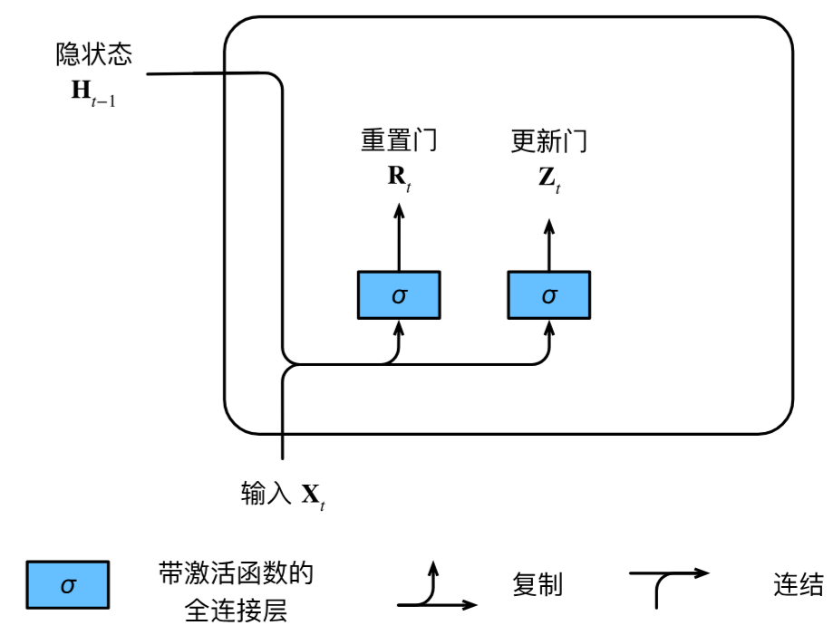

#### 核心公式

$$\mathbf{R}_t = \sigma(\mathbf{X}_t \mathbf{W}_{xr} + \mathbf{H}_{t-1} \mathbf{W}_{hr} + \mathbf{b}_r)$$

$$\mathbf{Z}_t = \sigma(\mathbf{X}_t \mathbf{W}_{xz} + \mathbf{H}_{t-1} \mathbf{W}_{hz} + \mathbf{b}_z)$$

其中 $\mathbf{W}_{xr}, \mathbf{W}_{xz} \in \mathbb{R}^{d \times h}$ 和 $\mathbf{W}_{hr}, \mathbf{W}_{hz} \in \mathbb{R}^{h \times h}$ 是权重参数，$\mathbf{b}_r, \mathbf{b}_z \in \mathbb{R}^{1 \times h}$ 是偏置参数。

### 9.1.3 候选隐状态

$$\tilde{\mathbf{H}}_t = \tanh(\mathbf{X}_t \mathbf{W}_{xh} + (\mathbf{R}_t \odot \mathbf{H}_{t-1}) \mathbf{W}_{hh} + \mathbf{b}_h)$$

其中 $\odot$ 是 Hadamard 积（按元素乘积）。

**重置门的作用**：
- $\mathbf{R}_t$ 接近 $1$：恢复标准 RNN 行为
- $\mathbf{R}_t$ 接近 $0$：候选隐状态由当前输入决定，旧状态被**重置**


### 9.1.4 隐状态更新

$$\mathbf{H}_t = \mathbf{Z}_t \odot \mathbf{H}_{t-1} + (1 - \mathbf{Z}_t) \odot \tilde{\mathbf{H}}_t$$

**更新门的作用**：
- $\mathbf{Z}_t$ 接近 $1$：保留旧状态，忽略当前输入（**跳过时间步**）
- $\mathbf{Z}_t$ 接近 $0$：完全更新为候选隐状态


### 9.1.5 GRU 的两个显著特征

| 特征 | 作用 |
|------|------|
| **重置门** | 有助于捕获序列中的**短期依赖关系** |
| **更新门** | 有助于捕获序列中的**长期依赖关系** |

### 9.1.6 从零开始实现

```python
import torch
from torch import nn
from d2l import torch as d2l

# ==================== 1. 加载数据 ====================
batch_size, num_steps = 32, 35  # 批次大小32，时间步数35
train_iter, vocab = d2l.load_data_time_machine(batch_size, num_steps)


# ==================== 2. 初始化模型参数 ====================
def get_params(vocab_size, num_hiddens, device):
    """
    初始化 GRU 的所有可训练参数
    
    Args:
        vocab_size: 词表大小（输入/输出维度）
        num_hiddens: 隐藏单元数
        device: 计算设备（CPU/GPU）
    
    Returns:
        params: 所有可训练参数列表（11个参数）
    
    GRU 参数分为四组:
        1. 更新门: W_xz, W_hz, b_z
        2. 重置门: W_xr, W_hr, b_r
        3. 候选隐状态: W_xh, W_hh, b_h
        4. 输出层: W_hq, b_q
    """
    num_inputs = num_outputs = vocab_size  # 输入和输出维度都等于词表大小

    def normal(shape):
        """从标准差为 0.01 的正态分布中采样"""
        return torch.randn(size=shape, device=device) * 0.01

    def three():
        """
        返回一组三参数: (输入权重, 隐状态权重, 偏置)
        用于更新门、重置门、候选隐状态各一组
        """
        return (normal((num_inputs, num_hiddens)),      # 输入 → 隐状态权重
                normal((num_hiddens, num_hiddens)),     # 隐状态 → 隐状态权重
                torch.zeros(num_hiddens, device=device))  # 偏置

    # ---- 更新门参数 ----
    # 控制有多少旧状态保留到新状态（值越大，保留越多）
    W_xz, W_hz, b_z = three()

    # ---- 重置门参数 ----
    # 控制是否忽略过去的隐状态（值越小，忽略越多）
    W_xr, W_hr, b_r = three()

    # ---- 候选隐状态参数 ----
    # 生成当前时间步的候选隐状态
    W_xh, W_hh, b_h = three()

    # ---- 输出层参数 ----
    # 将隐状态映射到词表大小的输出
    W_hq = normal((num_hiddens, num_outputs))  # 隐状态 → 输出
    b_q = torch.zeros(num_outputs, device=device)  # 输出偏置

    # 收集所有参数并启用梯度
    params = [W_xz, W_hz, b_z, W_xr, W_hr, b_r, W_xh, W_hh, b_h, W_hq, b_q]
    for param in params:
        param.requires_grad_(True)
    return params


# ==================== 3. 初始化隐状态 ====================
def init_gru_state(batch_size, num_hiddens, device):
    """
    返回全零初始隐状态
    
    Returns:
        tuple: 包含形状为 (批量大小, 隐藏单元数) 的零张量
        使用元组包装以保持与 LSTM 等模型的接口一致
    """
    return (torch.zeros((batch_size, num_hiddens), device=device), )


# ==================== 4. 定义 GRU 前向传播 ====================
def gru(inputs, state, params):
    """
    GRU 前向传播（按时间步循环）
    
    Args:
        inputs: (时间步数, 批量大小, 词表大小) 的独热编码输入
        state: 初始隐状态 (批量大小, 隐藏单元数)
        params: 11个可训练参数
    
    Returns:
        outputs: (时间步数×批量大小, 词表大小) 所有时间步输出拼接
        state: 最终隐状态
    
    GRU 核心公式:
        Z_t = sigmoid(X_t·W_xz + H_{t-1}·W_hz + b_z)          # 更新门
        R_t = sigmoid(X_t·W_xr + H_{t-1}·W_hr + b_r)          # 重置门
        H̃_t = tanh(X_t·W_xh + (R_t⊙H_{t-1})·W_hh + b_h)      # 候选隐状态
        H_t = Z_t⊙H_{t-1} + (1-Z_t)⊙H̃_t                       # 最终隐状态
        O_t = H_t·W_hq + b_q                                   # 输出
    """
    # 解包参数
    W_xz, W_hz, b_z, W_xr, W_hr, b_r, W_xh, W_hh, b_h, W_hq, b_q = params
    H, = state  # 解包隐状态（从元组中取出张量）
    outputs = []

    # 沿时间步维度循环处理每个时间步的输入
    for X in inputs:  # X: (批量大小, 词表大小)
        # ---- 1. 计算更新门 ----
        # 决定保留多少旧状态：值越接近 1，保留越多
        Z = torch.sigmoid((X @ W_xz) + (H @ W_hz) + b_z)

        # ---- 2. 计算重置门 ----
        # 决定忽略多少旧状态：值越接近 0，忽略越多
        R = torch.sigmoid((X @ W_xr) + (H @ W_hr) + b_r)

        # ---- 3. 计算候选隐状态 ----
        # R * H 按元素相乘：重置门控制是否重置旧状态
        # 当 R 接近 0 时，旧状态被完全忽略，候选状态只由当前输入决定
        H_tilda = torch.tanh((X @ W_xh) + ((R * H) @ W_hh) + b_h)

        # ---- 4. 更新隐状态 ----
        # 更新门在旧状态和候选状态之间做凸组合
        # Z 控制保留旧状态的比例，(1-Z) 控制采纳新候选的比例
        H = Z * H + (1 - Z) * H_tilda

        # ---- 5. 计算输出 ----
        # 当前时间步的输出 = 隐状态 × 输出权重 + 输出偏置
        Y = H @ W_hq + b_q
        outputs.append(Y)

    # 将所有时间步的输出沿第 0 维拼接
    # 形状: (时间步数 × 批量大小, 词表大小)
    return torch.cat(outputs, dim=0), (H,)


# ==================== 5. 训练模型 ====================
vocab_size, num_hiddens, device = len(vocab), 256, d2l.try_gpu()
num_epochs, lr = 500, 1

# 创建 GRU 模型（从零实现）
# RNNModelScratch 是通用封装类，传入 GRU 特有的三个函数:
#   - get_params: 参数初始化
#   - init_gru_state: 隐状态初始化
#   - gru: 前向传播
model = d2l.RNNModelScratch(
    len(vocab),           # 词表大小
    num_hiddens,          # 隐藏单元数
    device,               # 计算设备
    get_params,           # 参数初始化函数
    init_gru_state,       # 隐状态初始化函数
    gru                   # 前向传播函数
)

# 训练模型
# 使用 500 轮迭代，学习率 1
d2l.train_ch8(model, train_iter, vocab, lr, num_epochs, device)
```

### 9.1.7 简洁实现（PyTorch）

使用 `nn.GRU` 高级 API：

```python
# ==================== 1. 加载数据 ====================
import torch
from torch import nn
from d2l import torch as d2l

batch_size, num_steps = 32, 35
train_iter, vocab = d2l.load_data_time_machine(batch_size, num_steps)


# ==================== 2. 定义模型 ====================
num_inputs = vocab_size          # 输入维度 = 词表大小
num_hiddens = 256                # 隐藏单元数（超参数）

# 创建 PyTorch 内置的 GRU 层
# nn.GRU 封装了所有 GRU 的门控计算，底层使用优化的 CUDA 内核
gru_layer = nn.GRU(num_inputs, num_hiddens)

# 使用 d2l 的 RNNModel 包装器，自动添加输出层
# RNNModel 会将 GRU 的输出（隐状态）通过全连接层映射到词表大小
model = d2l.RNNModel(gru_layer, len(vocab))

# 将模型参数移到 GPU（如果可用）
model = model.to(device)


# ==================== 3. 训练 ====================
num_epochs, lr = 500, 1

# 训练函数与从零实现相同，但底层使用 PyTorch 优化的 GRU 实现
# 高级 API 版本速度更快（约 4 倍），因为使用了编译好的 CUDA 运算符
d2l.train_ch8(model, train_iter, vocab, lr, num_epochs, device)
```

### 9.1.8 公式汇总

| 公式 | 含义 |
|------|------|
| $\mathbf{R}_t = \sigma(\mathbf{X}_t \mathbf{W}_{xr} + \mathbf{H}_{t-1} \mathbf{W}_{hr} + \mathbf{b}_r)$ | 重置门 |
| $\mathbf{Z}_t = \sigma(\mathbf{X}_t \mathbf{W}_{xz} + \mathbf{H}_{t-1} \mathbf{W}_{hz} + \mathbf{b}_z)$ | 更新门 |
| $\tilde{\mathbf{H}}_t = \tanh(\mathbf{X}_t \mathbf{W}_{xh} + (\mathbf{R}_t \odot \mathbf{H}_{t-1}) \mathbf{W}_{hh} + \mathbf{b}_h)$ | 候选隐状态 |
| $\mathbf{H}_t = \mathbf{Z}_t \odot \mathbf{H}_{t-1} + (1 - \mathbf{Z}_t) \odot \tilde{\mathbf{H}}_t$ | 隐状态更新 |

### 9.1.9 小结

| 要点 | 说明 |
|------|------|
| **门控机制** | 通过可学习的门控制信息流，解决梯度消失问题 |
| **重置门** | 控制是否忽略过去状态，捕获短期依赖 |
| **更新门** | 控制是否保留旧状态，捕获长期依赖 |


## 9.2 长短期记忆网络（LSTM）

### 9.2.1 为什么需要 LSTM？

长期信息保存和短期输入缺失是循环神经网络面临的关键问题。LSTM 通过引入**记忆元（Memory Cell）**和**门控机制**来解决这些问题。
>有趣的是，该设计比 GRU 更早（1997年），也更复杂。

### 9.2.2 LSTM 的门控记忆元

LSTM 引入了三个门来控制信息流：

| 门 | 作用 | 控制什么 |
|----|------|---------|
| **输入门** $\mathbf{I}_t$ | 控制新信息写入记忆元的多少 | 当前输入中哪些值得记住 |
| **遗忘门** $\mathbf{F}_t$ | 控制旧信息从记忆元中遗忘多少 | 过去记忆中哪些该丢弃 |
| **输出门** $\mathbf{O}_t$ | 控制从记忆元读取多少信息作为输出 | 记忆元中哪些该输出 |

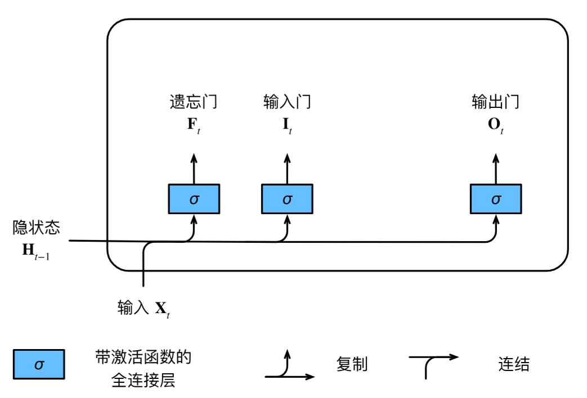

### 9.2.3 LSTM 核心公式

#### 输入门、遗忘门、输出门

$$\mathbf{I}_t = \sigma(\mathbf{X}_t \mathbf{W}_{xi} + \mathbf{H}_{t-1} \mathbf{W}_{hi} + \mathbf{b}_i)$$

$$\mathbf{F}_t = \sigma(\mathbf{X}_t \mathbf{W}_{xf} + \mathbf{H}_{t-1} \mathbf{W}_{hf} + \mathbf{b}_f)$$

$$\mathbf{O}_t = \sigma(\mathbf{X}_t \mathbf{W}_{xo} + \mathbf{H}_{t-1} \mathbf{W}_{ho} + \mathbf{b}_o)$$

其中 $\mathbf{W}_{xi}, \mathbf{W}_{xf}, \mathbf{W}_{xo} \in \mathbb{R}^{d \times h}$ 和 $\mathbf{W}_{hi}, \mathbf{W}_{hf}, \mathbf{W}_{ho} \in \mathbb{R}^{h \times h}$ 是权重参数，$\mathbf{b}_i, \mathbf{b}_f, \mathbf{b}_o \in \mathbb{R}^{1 \times h}$ 是偏置参数。

#### 候选记忆元

$$\tilde{\mathbf{C}}_t = \tanh(\mathbf{X}_t \mathbf{W}_{xc} + \mathbf{H}_{t-1} \mathbf{W}_{hc} + \mathbf{b}_c)$$

其中 $\mathbf{W}_{xc} \in \mathbb{R}^{d \times h}$ 和 $\mathbf{W}_{hc} \in \mathbb{R}^{h \times h}$ 是权重参数，$\mathbf{b}_c \in \mathbb{R}^{1 \times h}$ 是偏置参数。

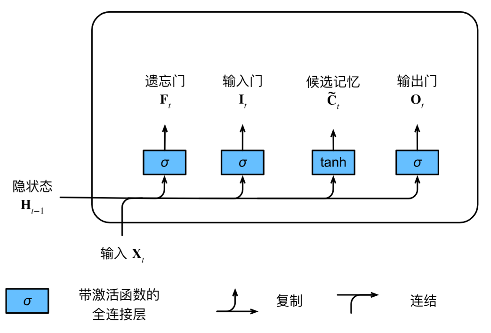

#### 记忆元更新

$$\mathbf{C}_t = \mathbf{F}_t \odot \mathbf{C}_{t-1} + \mathbf{I}_t \odot \tilde{\mathbf{C}}_t$$

- 遗忘门 $\mathbf{F}_t$：控制保留多少旧记忆
- 输入门 $\mathbf{I}_t$：控制写入多少新信息
- 当 $\mathbf{F}_t = 1$ 且 $\mathbf{I}_t = 0$ 时，记忆永久保留（**梯度高速公路**）

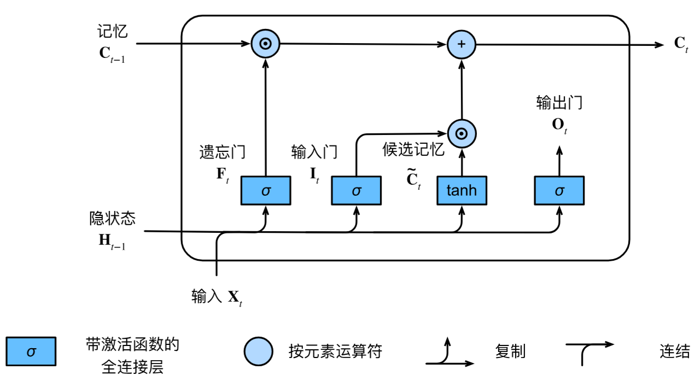

#### 隐状态更新

$$\mathbf{H}_t = \mathbf{O}_t \odot \tanh(\mathbf{C}_t)$$

- 输出门 $\mathbf{O}_t$：控制从记忆元中读取多少信息
- $\tanh$ 将记忆元值压缩到 $(-1, 1)$ 范围

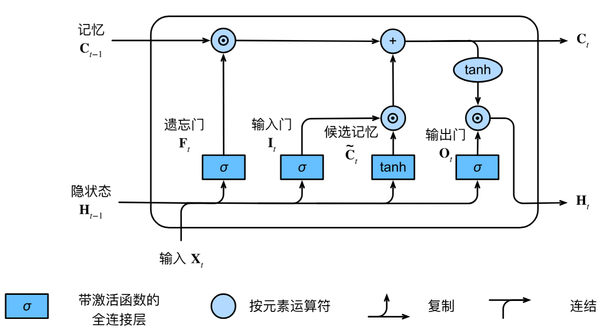


### 9.2.4 从零实现 LSTM

```python
# ==================== 1. 加载数据 ====================
import torch
from torch import nn
from d2l import torch as d2l

batch_size, num_steps = 32, 35
train_iter, vocab = d2l.load_data_time_machine(batch_size, num_steps)


# ==================== 2. 初始化模型参数 ====================
def get_lstm_params(vocab_size, num_hiddens, device):
    """
    初始化 LSTM 的所有可训练参数
    
    Args:
        vocab_size: 词表大小（输入/输出维度）
        num_hiddens: 隐藏单元数
        device: 计算设备（CPU/GPU）
    
    Returns:
        params: 所有可训练参数列表（14个参数）
    
    LSTM 参数分为五组:
        1. 输入门: W_xi, W_hi, b_i
        2. 遗忘门: W_xf, W_hf, b_f
        3. 输出门: W_xo, W_ho, b_o
        4. 候选记忆元: W_xc, W_hc, b_c
        5. 输出层: W_hq, b_q
    """
    num_inputs = num_outputs = vocab_size  # 输入和输出都等于词表大小

    def normal(shape):
        """从标准差为 0.01 的正态分布中采样"""
        return torch.randn(size=shape, device=device) * 0.01

    def three():
        """
        返回一组三参数: (输入权重, 隐状态权重, 偏置)
        用于四个门控单元各一组
        """
        return (normal((num_inputs, num_hiddens)),      # 输入→隐状态权重
                normal((num_hiddens, num_hiddens)),     # 隐状态→隐状态权重
                torch.zeros(num_hiddens, device=device)) # 偏置

    # ---- 输入门参数 ----
    # 控制新信息写入记忆元：值越接近1，写入越多
    W_xi, W_hi, b_i = three()

    # ---- 遗忘门参数 ----
    # 控制旧信息从记忆元中丢弃：值越接近0，遗忘越多
    W_xf, W_hf, b_f = three()

    # ---- 输出门参数 ----
    # 控制从记忆元读取多少信息作为输出
    W_xo, W_ho, b_o = three()

    # ---- 候选记忆元参数 ----
    # 生成当前时间步可写入的新信息
    W_xc, W_hc, b_c = three()

    # ---- 输出层参数 ----
    # 将隐状态映射到词表大小的输出
    W_hq = normal((num_hiddens, num_outputs))
    b_q = torch.zeros(num_outputs, device=device)

    # 收集所有参数（4组门参数 × 3个 + 2个输出参数 = 14个参数）
    params = [W_xi, W_hi, b_i, W_xf, W_hf, b_f,
              W_xo, W_ho, b_o, W_xc, W_hc, b_c, W_hq, b_q]
    for param in params:
        param.requires_grad_(True)
    return params
```

```python
# ==================== 3. 初始化隐状态和记忆元 ====================
def init_lstm_state(batch_size, num_hiddens, device):
    """
    返回 LSTM 的初始状态（全零张量对）
    
    Returns:
        tuple: (H, C) 两个形状为 (批量大小, 隐藏单元数) 的零张量
        - H: 隐状态（输出给下一层）
        - C: 记忆元（内部长期记忆）
    """
    return (torch.zeros((batch_size, num_hiddens), device=device),
            torch.zeros((batch_size, num_hiddens), device=device))


# ==================== 4. 定义 LSTM 前向传播 ====================
def lstm(inputs, state, params):
    """
    LSTM 前向传播（按时间步循环）
    
    Args:
        inputs: (时间步数, 批量大小, 词表大小) 的独热编码输入
        state: (H, C) 初始隐状态和记忆元
        params: 14个可训练参数
    
    Returns:
        outputs: (时间步数×批量大小, 词表大小) 所有时间步输出拼接
        state: (H, C) 最终隐状态和记忆元
    
    LSTM 核心公式:
        I_t = sigmoid(X_t·W_xi + H_{t-1}·W_hi + b_i)          # 输入门
        F_t = sigmoid(X_t·W_xf + H_{t-1}·W_hf + b_f)          # 遗忘门
        O_t = sigmoid(X_t·W_xo + H_{t-1}·W_ho + b_o)          # 输出门
        C̃_t = tanh(X_t·W_xc + H_{t-1}·W_hc + b_c)             # 候选记忆元
        C_t = F_t⊙C_{t-1} + I_t⊙C̃_t                            # 记忆元更新
        H_t = O_t⊙tanh(C_t)                                    # 隐状态更新
        O_t = H_t·W_hq + b_q                                   # 输出
    """
    # 解包参数
    [W_xi, W_hi, b_i, W_xf, W_hf, b_f,
     W_xo, W_ho, b_o, W_xc, W_hc, b_c, W_hq, b_q] = params
    H, C = state  # 解包隐状态 H 和记忆元 C
    outputs = []

    # 沿时间步维度循环处理每个时间步的输入
    for X in inputs:  # X: (批量大小, 词表大小)
        # ---- 1. 计算输入门 ----
        # 决定写入多少新信息到记忆元
        # 值越接近1，写入越多
        I = torch.sigmoid((X @ W_xi) + (H @ W_hi) + b_i)

        # ---- 2. 计算遗忘门 ----
        # 决定丢弃多少旧信息
        # 值越接近0，遗忘越多
        F = torch.sigmoid((X @ W_xf) + (H @ W_hf) + b_f)

        # ---- 3. 计算输出门 ----
        # 决定从记忆元读取多少信息作为输出
        # 值越接近1，读取越多
        O = torch.sigmoid((X @ W_xo) + (H @ W_ho) + b_o)

        # ---- 4. 计算候选记忆元 ----
        # 当前时间步可写入的新信息
        # tanh 将值压缩到 (-1, 1) 范围
        C_tilda = torch.tanh((X @ W_xc) + (H @ W_hc) + b_c)

        # ---- 5. 更新记忆元 ----
        # 遗忘门 × 旧记忆 + 输入门 × 候选记忆
        # 当 F=1, I=0 时，记忆永久保留（梯度高速公路）
        C = F * C + I * C_tilda

        # ---- 6. 更新隐状态 ----
        # 输出门控制从记忆元读取多少信息
        # tanh 将记忆元值压缩到 (-1, 1) 范围
        H = O * torch.tanh(C)

        # ---- 7. 计算输出 ----
        # 当前时间步的输出 = 隐状态 × 输出权重 + 输出偏置
        Y = (H @ W_hq) + b_q
        outputs.append(Y)

    # 将所有时间步的输出沿第0维拼接
    # 形状: (时间步数 × 批量大小, 词表大小)
    return torch.cat(outputs, dim=0), (H, C)
```

```python
# ==================== 5. 训练模型 ====================
vocab_size, num_hiddens, device = len(vocab), 256, d2l.try_gpu()
num_epochs, lr = 500, 1

# 创建 LSTM 模型（从零实现）
model = d2l.RNNModelScratch(
    len(vocab),              # 词表大小
    num_hiddens,             # 隐藏单元数
    device,                  # 计算设备
    get_lstm_params,         # 参数初始化函数
    init_lstm_state,         # 状态初始化函数（返回 H 和 C）
    lstm                     # 前向传播函数
)

# 训练模型
d2l.train_ch8(model, train_iter, vocab, lr, num_epochs, device)
```

输出示例：
```
perplexity 1.4, 22462.5 tokens/sec on cuda:0
time traveller for the brow henint it aneles a overrecured aback
travellerifilby freenotin s dof nous be and the filing and 
```


### 9.2.5 简洁实现（PyTorch 高级 API）

```python
# ==================== 简洁实现（PyTorch 高级 API） ====================
num_inputs = vocab_size          # 输入维度 = 词表大小
num_hiddens = 256                # 隐藏单元数（超参数）

# 创建 PyTorch 内置的 LSTM 层
# nn.LSTM 封装了所有 LSTM 的门控计算，底层使用优化的 CUDA 内核
# 与 nn.RNN 和 nn.GRU 接口一致
lstm_layer = nn.LSTM(num_inputs, num_hiddens)

# 使用 d2l 的 RNNModel 包装器，自动添加输出层
# RNNModel 会将 LSTM 的输出（隐状态）通过全连接层映射到词表大小
model = d2l.RNNModel(lstm_layer, len(vocab))

# 将模型参数移到 GPU（如果可用）
model = model.to(device)

# 训练模型（复用之前的训练函数）
# 高级 API 版本速度更快（约 15 倍），因为使用了编译好的 CUDA 运算符
d2l.train_ch8(model, train_iter, vocab, lr, num_epochs, device)
```

输出示例：
```
perplexity 1.1, 330289.2 tokens/sec on cuda:0
time travelleryou can show black is white by argument said filby
travelleryou can show black is white by argument said filby
```


### 9.2.6 LSTM vs GRU 对比

| 对比维度 | GRU | LSTM |
|----------|-----|------|
| **门数量** | 2（重置门、更新门） | 3（输入门、遗忘门、输出门） |
| **记忆单元** | 无独立记忆元 | 有独立记忆元 $\mathbf{C}_t$ |
| **参数数量** | 约 $3dh + 3h^2$ | 约 $4dh + 4h^2$ |
| **表达能力** | 较强 | 更强 |
| **计算速度** | 更快 | 较慢 |
| **适用场景** | 快速训练、简单任务 | 复杂任务、长序列 |

### 9.2.7 公式汇总

| 公式 | 含义 |
|------|------|
| $\mathbf{I}_t = \sigma(\mathbf{X}_t \mathbf{W}_{xi} + \mathbf{H}_{t-1} \mathbf{W}_{hi} + \mathbf{b}_i)$ | 输入门：控制写入 |
| $\mathbf{F}_t = \sigma(\mathbf{X}_t \mathbf{W}_{xf} + \mathbf{H}_{t-1} \mathbf{W}_{hf} + \mathbf{b}_f)$ | 遗忘门：控制丢弃 |
| $\mathbf{O}_t = \sigma(\mathbf{X}_t \mathbf{W}_{xo} + \mathbf{H}_{t-1} \mathbf{W}_{ho} + \mathbf{b}_o)$ | 输出门：控制读取 |
| $\tilde{\mathbf{C}}_t = \tanh(\mathbf{X}_t \mathbf{W}_{xc} + \mathbf{H}_{t-1} \mathbf{W}_{hc} + \mathbf{b}_c)$ | 候选记忆元 |
| $\mathbf{C}_t = \mathbf{F}_t \odot \mathbf{C}_{t-1} + \mathbf{I}_t \odot \tilde{\mathbf{C}}_t$ | 记忆元更新 |
| $\mathbf{H}_t = \mathbf{O}_t \odot \tanh(\mathbf{C}_t)$ | 隐状态更新 |

### 9.2.8 小结

| 要点 | 说明 |
|------|------|
| **三个门** | 输入门（写入）、遗忘门（丢弃）、输出门（读取） |
| **记忆元** | 独立的"长期记忆"通道，形成梯度高速公路 |
| **隐状态** | 输出门的门控版本，传递给下一层 |
| **梯度解决** | 记忆元更新中 $\mathbf{C}_{t-1}$ 到 $\mathbf{C}_t$ 没有矩阵乘法，只有逐元素乘积，缓解梯度消失 |
| **参数数量** | 约 4 倍于标准 RNN |


## 9.3 深度循环神经网络

### 9.3.1 为什么需要深度 RNN？

单层 RNN 的表示能力有限，难以捕捉复杂的序列模式。通过堆叠多个循环层，可以：

| 优势 | 说明 |
|------|------|
| **分层特征提取** | 底层学习局部/短期模式，高层学习全局/长期模式 |
| **更强表达能力** | 更多非线性变换，拟合更复杂的函数 |
| **多尺度建模** | 不同层在不同时间尺度上处理信息 |

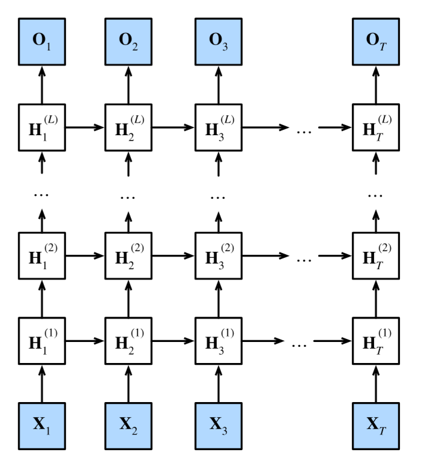

### 9.3.2 函数依赖关系

#### 符号定义

| 符号 | 形状 | 含义 |
|------|------|------|
| $\mathbf{X}_t$ | $\mathbb{R}^{n \times d}$ | 时间步 $t$ 的输入 |
| $\mathbf{H}_t^{(l)}$ | $\mathbb{R}^{n \times h}$ | 第 $l$ 层在时间步 $t$ 的隐状态 |
| $\mathbf{O}_t$ | $\mathbb{R}^{n \times q}$ | 时间步 $t$ 的输出 |
| $L$ | - | 隐藏层数（超参数） |
| $h$ | - | 隐藏单元数（超参数） |

#### 层间信息流

设置 $\mathbf{H}_t^{(0)} = \mathbf{X}_t$（第 0 层视为输入层），第 $l$ 层的隐状态为：

$$\mathbf{H}_t^{(l)} = \phi_l(\mathbf{H}_t^{(l-1)} \mathbf{W}_{xh}^{(l)} + \mathbf{H}_{t-1}^{(l)} \mathbf{W}_{hh}^{(l)} + \mathbf{b}_h^{(l)})$$

其中：
- $\mathbf{H}_t^{(l-1)} \mathbf{W}_{xh}^{(l)}$：来自**下一层**当前时间步的输入（纵向连接）
- $\mathbf{H}_{t-1}^{(l)} \mathbf{W}_{hh}^{(l)}$：来自**同一层**上一时间步的隐状态（横向循环连接）
- $\phi_l$：第 $l$ 层的激活函数

#### 信息流方向


**两个方向的连接**：
- **横向**：同一层在不同时间步之间传递（循环连接）
- **纵向**：不同层在同一时间步之间传递（前馈连接）

#### 输出计算

输出层仅基于最后一层 $L$ 的隐状态：

$$\mathbf{O}_t = \mathbf{H}_t^{(L)} \mathbf{W}_{hq} + \mathbf{b}_q$$

### 9.3.3 简洁实现

```python
import torch
from torch import nn
from d2l import torch as d2l

# ==================== 1. 加载数据 ====================
batch_size, num_steps = 32, 35
train_iter, vocab = d2l.load_data_time_machine(batch_size, num_steps)

# ==================== 2. 定义深度 LSTM 模型 ====================
vocab_size, num_hiddens, num_layers = len(vocab), 256, 2  # 2层 LSTM
num_inputs = vocab_size
device = d2l.try_gpu()

# nn.LSTM 的 num_layers 参数指定隐藏层数
lstm_layer = nn.LSTM(num_inputs, num_hiddens, num_layers)
model = d2l.RNNModel(lstm_layer, len(vocab))
model = model.to(device)

# ==================== 3. 训练 ====================
num_epochs, lr = 500, 2
d2l.train_ch8(model, train_iter, vocab, lr * 1.0, num_epochs, device)
```

输出示例：
```
perplexity 1.0, 224250.2 tokens/sec on cuda:0
time travelleryou can show black is white by argument said filby
travelleryou can show black is white by argument said filby
```

### 9.3.4 关键参数总结

| 参数 | 说明 | 典型值 |
|------|------|--------|
| `num_layers` | 隐藏层数 | 2-4 |
| `num_hiddens` | 每层隐藏单元数 | 256-1024 |
| 学习率 | 深层网络需要更小心调整 | 1-2（常比单层大） |

### 9.3.5 小结

| 要点 | 说明 |
|------|------|
| **深度 RNN 结构** | 每层接收下层输入 + 自身上一时间步隐状态 |
| **信息流** | 横向（时间）和纵向（层间）两个方向 |
| **参数增长** | 层数 $L$ 增加，参数量线性增长 |
| **训练注意** | 需要更谨慎的初始化、学习率调整 |
| **高级 API** | `nn.LSTM(num_inputs, num_hiddens, num_layers)` 一行实现 |


## 9.4 双向循环神经网络

### 9.4.1 为什么需要双向？

在标准 RNN 中，信息只能从**过去流向未来**（单向）。但在某些任务中，**未来的信息同样重要**：

| 任务 | 为什么需要未来信息 |
|------|-------------------|
| **完形填空** | "我___饿了，我可以吃半头猪" → 需要下文判断填"非常" |
| **命名实体识别** | "Green" 是人名还是颜色 → 取决于上下文 |
| **词性标注** | 一个词的词性受前后词共同影响 |
| **语音识别** | 当前音素受前后音素共同影响 |

**核心问题**：单向 RNN 只能看到过去，无法利用未来的上下文信息。

### 9.4.2 隐马尔可夫模型（HMM）的启示

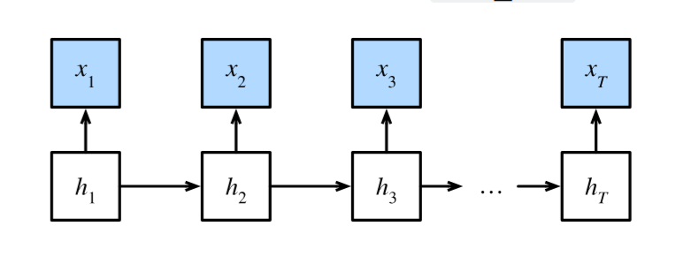

#### HMM 的定义

隐马尔可夫模型假设存在隐变量 $h_t$ 控制观测 $x_t$：

$$P(x_1, \ldots, x_T, h_1, \ldots, h_T) = \prod_{t=1}^T P(h_t \mid h_{t-1}) P(x_t \mid h_t)$$

其中 $P(h_1 \mid h_0) = P(h_1)$。

#### 前向递归（Forward Recursion）

$$P(x_1, \ldots, x_T) = \sum_{h_T} \pi_T(h_T) P(x_T \mid h_T)$$

其中 $\pi_{t+1}(h_{t+1}) = \sum_{h_t} \pi_t(h_t) P(x_t \mid h_t) P(h_{t+1} \mid h_t)$，$\pi_1(h_1) = P(h_1)$。

**前向递归的本质**：从序列开头向结尾传递信息，与 RNN 的前向传播类似。

#### 后向递归（Backward Recursion）

$$\rho_{t-1}(h_{t-1}) = \sum_{h_t} P(h_t \mid h_{t-1}) P(x_t \mid h_t) \rho_t(h_t)$$

其中 $\rho_T(h_T) = 1$。

**后向递归的本质**：从序列结尾向开头传递信息，相当于反向 RNN。

#### 结合前向和后向

$$P(x_j \mid x_{-j}) \propto \sum_{h_j} \pi_j(h_j) \rho_j(h_j) P(x_j \mid h_j)$$

其中 $x_{-j}$ 表示除 $x_j$ 外的所有观测。

**关键洞察**：前向递归提供"过去"的信息，后向递归提供"未来"的信息，两者结合可以更好地预测当前位置。

### 9.4.3 双向 RNN 的架构

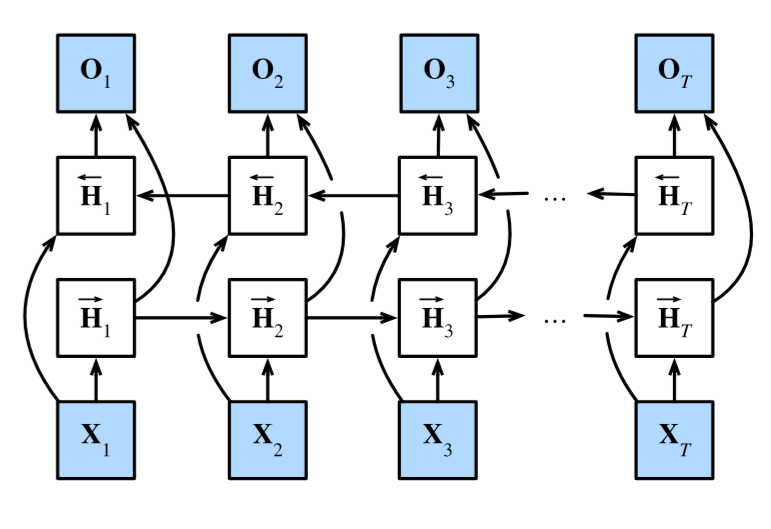

#### 前向隐状态

$$\overrightarrow{\mathbf{H}}_t = \phi(\mathbf{X}_t \mathbf{W}_{xh}^{(f)} + \overrightarrow{\mathbf{H}}_{t-1} \mathbf{W}_{hh}^{(f)} + \mathbf{b}_h^{(f)})$$

- 从 $t=1$ 到 $T$ 正向传播
- 只依赖过去的信息

#### 反向隐状态

$$\overleftarrow{\mathbf{H}}_t = \phi(\mathbf{X}_t \mathbf{W}_{xh}^{(b)} + \overleftarrow{\mathbf{H}}_{t+1} \mathbf{W}_{hh}^{(b)} + \mathbf{b}_h^{(b)})$$

- 从 $t=T$ 到 $1$ 反向传播
- 只依赖未来的信息

#### 输出

将前向和反向隐状态拼接：

$$\mathbf{H}_t = [\overrightarrow{\mathbf{H}}_t; \overleftarrow{\mathbf{H}}_t] \in \mathbb{R}^{n \times 2h}$$

$$\mathbf{O}_t = \mathbf{H}_t \mathbf{W}_{hq} + \mathbf{b}_q$$

其中 $\mathbf{W}_{hq} \in \mathbb{R}^{2h \times q}$。


### 9.4.4 简洁实现

```python
import torch
from torch import nn
from d2l import torch as d2l

# ==================== 1. 加载数据 ====================
batch_size, num_steps, device = 32, 35, d2l.try_gpu()
train_iter, vocab = d2l.load_data_time_machine(batch_size, num_steps)

# ==================== 2. 定义双向 LSTM ====================
vocab_size, num_hiddens, num_layers = len(vocab), 256, 2
num_inputs = vocab_size

# bidirectional=True 启用双向
lstm_layer = nn.LSTM(num_inputs, num_hiddens, num_layers, bidirectional=True)
model = d2l.RNNModel(lstm_layer, len(vocab))
model = model.to(device)

# ==================== 3. 训练 ====================
num_epochs, lr = 500, 1
d2l.train_ch8(model, train_iter, vocab, lr, num_epochs, device)
```

输出示例：
```
perplexity 1.1, 109857.9 tokens/sec on cuda:0
time travellerererererererererererererererererererererererererer
travellerererererererererererererererererererererererererer
```

### 9.4.5 双向 RNN 的应用限制

| 限制 | 说明 |
|------|------|
| **不能用于在线预测** | 需要完整的未来序列，无法实时生成 |
| **不能用于因果任务** | 语言模型只能从左到右，否则会"作弊" |
| **计算开销大** | 前向+后向两次传播，速度约为单方向的一半 |
| **梯度链更长** | 反向传播需要经过更长的计算图 |

### 9.4.6 适用场景

| 场景 | 说明 |
|------|------|
| **序列编码** | 将整个序列编码为固定长度向量（如 Seq2Seq 的编码器） |
| **序列标注** | 词性标注、命名实体识别（每个位置的输出依赖完整上下文） |
| **填空/完形填空** | 利用左右上下文预测缺失词 |
| **情感分析** | 整个句子的语义可能依赖前后的词 |

### 9.4.7 小结

| 要点 | 说明 |
|------|------|
| **前向隐状态** | 从过去到未来，捕获历史信息 |
| **反向隐状态** | 从未来到过去，捕获未来信息 |
| **输出拼接** | 将两个方向的隐状态拼接后送入输出层 |
| **与 HMM 类比** | 前向递归 ≈ 正向传播，后向递归 ≈ 反向传播 |
| **使用注意** | 不可用于预测未来任务，只可用于编码和标注任务 |
| **参数翻倍** | 隐藏单元数翻倍，参数量约为单向的两倍 |


## 9.5 机器翻译与数据集
### 9.5.1 什么是机器翻译？

**机器翻译（Machine Translation）** 指的是将序列从一种语言自动翻译成另一种语言。

| 概念 | 说明 |
|------|------|
| **源语言（Source Language）** | 待翻译的原始语言（如英语） |
| **目标语言（Target Language）** | 翻译后的语言（如法语） |
| **统计机器翻译（SMT）** | 基于统计模型的传统方法 |
| **神经机器翻译（NMT）** | 基于神经网络端到端学习的现代方法 |

**与传统语言模型的区别**：
- 语言模型：单一语言，预测下一个词元
- 机器翻译：双语句对（源语言 + 目标语言），输入输出都是变长序列

### 9.5.2 下载和预处理数据集

使用 Tatoeba 项目的"英-法"双语句子对数据集。

```python
import os
import torch
from d2l import torch as d2l

# ==================== 1. 下载数据集 ====================
# 注册数据集到 d2l 数据中心
d2l.DATA_HUB['fra-eng'] = (d2l.DATA_URL + 'fra-eng.zip',
                           '94646ad1522d915e7b0f9296181140edcf86a4f5')

def read_data_nmt():
    """载入“英语－法语”数据集"""
    # 下载并解压数据集，返回解压后的目录路径
    data_dir = d2l.download_extract('fra-eng')
    # 读取 fra.txt 文件，每行是一个"英-法"句对，用制表符分隔
    with open(os.path.join(data_dir, 'fra.txt'), 'r', encoding='utf-8') as f:
        return f.read()

raw_text = read_data_nmt()
print(raw_text[:75])  # 打印前75个字符预览
```

输出示例：
```
Go.	Va !
Hi.	Salut !
Run!	Cours !
Run!	Courez !
Who?	Qui ?
Wow!	Ça alors !
```

#### 预处理步骤

```python
def preprocess_nmt(text):
    """
    预处理“英语－法语”数据集
    
    步骤：
        1. 将不间断空格（\u202f, \xa0）替换为普通空格
        2. 将所有大写字母转为小写
        3. 在单词和标点符号之间插入空格（便于词元化）
    """
    def no_space(char, prev_char):
        """判断是否需要在 char 前插入空格"""
        # 如果 char 是标点符号（,.!?）且前一个字符不是空格，则需要插入空格
        return char in set(',.!?') and prev_char != ' '

    # 1. 替换不间断空格为普通空格，并转为小写
    text = text.replace('\u202f', ' ').replace('\xa0', ' ').lower()
    
    # 2. 在标点符号前插入空格
    # 遍历每个字符，如果满足条件则在前面加空格
    out = [' ' + char if i > 0 and no_space(char, text[i - 1]) else char
           for i, char in enumerate(text)]
    return ''.join(out)

text = preprocess_nmt(raw_text)
print(text[:80])
```

输出示例：
```
go .	va !
hi .	salut !
run !	cours !
run !	courez !
who ?	qui ?
wow !	ça alors !
```
>注：不间断空格就是“不能换行的空格”，视觉上看起来和普通空格一样，但起到粘连两个词的作用。在文本预处理时，需要将其替换为普通空格，否则会影响词元化（分词）。

### 9.5.3 词元化

在机器翻译中，通常使用**单词级词元化**（而非字符级），因为单词级能更好地保留语义。

```python
def tokenize_nmt(text, num_examples=None):
    """
    词元化“英语－法语”数据集
    
    Args:
        text: 预处理后的文本
        num_examples: 使用的样本数量（None 表示全部）
    
    Returns:
        source: 源语言词元列表（每个元素是一个词元列表）
        target: 目标语言词元列表
    """
    source, target = [], []
    # 按行分割，每行是一个句对
    for i, line in enumerate(text.split('\n')):
        # 如果指定了样本数且超出，则停止
        if num_examples and i > num_examples:
            break
        # 按制表符分割，得到源语言和目标语言
        parts = line.split('\t')
        if len(parts) == 2:
            # 按空格分割得到词元列表
            source.append(parts[0].split(' '))
            target.append(parts[1].split(' '))
    return source, target

source, target = tokenize_nmt(text)
source[:6], target[:6]
```

输出示例：
```
([['go', '.'], ['hi', '.'], ['run', '!'], ['run', '!'], ['who', '?'], ['wow', '!']],
 [['va', '!'], ['salut', '!'], ['cours', '!'], ['courez', '!'], ['qui', '?'], ['ça', 'alors', '!']])
```

#### 绘制序列长度分布

```python
def show_list_len_pair_hist(legend, xlabel, ylabel, xlist, ylist):
    """绘制列表长度对的直方图"""
    d2l.set_figsize()
    # 统计源语言和目标语言每个序列的长度
    _, _, patches = d2l.plt.hist(
        [[len(l) for l in xlist], [len(l) for l in ylist]])
    d2l.plt.xlabel(xlabel)
    d2l.plt.ylabel(ylabel)
    # 为目标语言添加斜线纹理（便于区分）
    for patch in patches[1].patches:
        patch.set_hatch('/')
    d2l.plt.legend(legend)

show_list_len_pair_hist(['source', 'target'], '# tokens per sequence',
                        'count', source, target)
```

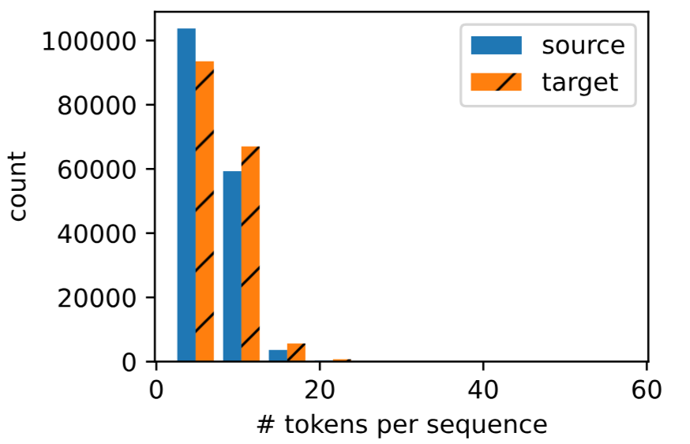

**观察**：大多数文本序列的词元数量少于 20 个。

### 9.5.4 构建词表

由于机器翻译涉及两种语言，需要分别为源语言和目标语言构建词表。

```python
# ==================== 4. 构建词表 ====================
# 为源语言（英语）构建词表
# min_freq=2：出现次数少于2次的词元视为 <unk>
# reserved_tokens：保留特殊词元
src_vocab = d2l.Vocab(source, min_freq=2,
                      reserved_tokens=['<pad>', '<bos>', '<eos>'])
print(len(src_vocab))  # 输出词表大小
```

输出示例：
```
10012
```

**特殊词元说明**：

| 词元 | 含义 | 用途 |
|------|------|------|
| `<pad>` | 填充词元 | 将序列填充到相同长度 |
| `<bos>` | 序列开始 | 解码器起始输入 |
| `<eos>` | 序列结束 | 表示生成结束 |
| `<unk>` | 未知词 | 处理未登录词（自动添加） |

### 9.5.5 截断和填充

在机器翻译中，每个样本的源和目标序列长度不同，需要统一长度以形成小批量。

```python
def truncate_pad(line, num_steps, padding_token):
    """
    截断或填充文本序列
    
    Args:
        line: 词元索引列表
        num_steps: 目标长度
        padding_token: 填充词元的索引
    
    Returns:
        长度为 num_steps 的索引列表
    """
    if len(line) > num_steps:
        return line[:num_steps]  # 截断：只取前 num_steps 个
    # 填充：追加填充词元到目标长度
    return line + [padding_token] * (num_steps - len(line))

# 示例：将 source[0]（'go .'）填充到长度10
truncate_pad(src_vocab[source[0]], 10, src_vocab['<pad>'])
```

输出示例：
```
[47, 4, 1, 1, 1, 1, 1, 1, 1, 1]
```

#### 构建训练数组

```python
def build_array_nmt(lines, vocab, num_steps):
    """
    将机器翻译的文本序列转换成小批量数组
    
    Args:
        lines: 文本序列列表（已词元化）
        vocab: 词表
        num_steps: 目标长度
    
    Returns:
        array: 填充后的张量，形状 (样本数, num_steps)
        valid_len: 每个序列的有效长度（不含填充）
    """
    # 1. 将词元转换为索引
    lines = [vocab[l] for l in lines]
    
    # 2. 在序列末尾添加 <eos> 表示结束
    lines = [l + [vocab['<eos>']] for l in lines]
    
    # 3. 截断或填充到 num_steps
    array = torch.tensor([truncate_pad(l, num_steps, vocab['<pad>']) for l in lines])
    
    # 4. 计算有效长度（排除填充词元）
    valid_len = (array != vocab['<pad>']).type(torch.int32).sum(1)
    
    return array, valid_len
```

### 9.5.6 数据加载器

```python
def load_data_nmt(batch_size, num_steps, num_examples=600):
    """
    返回翻译数据集的迭代器和词表
    
    Args:
        batch_size: 批次大小
        num_steps: 时间步数（目标序列长度）
        num_examples: 使用的样本数量
    
    Returns:
        data_iter: 数据迭代器，每批包含 (src_array, src_valid_len, tgt_array, tgt_valid_len)
        src_vocab: 源语言词表
        tgt_vocab: 目标语言词表
    """
    # 1. 预处理原始文本
    text = preprocess_nmt(read_data_nmt())
    
    # 2. 词元化
    source, target = tokenize_nmt(text, num_examples)
    
    # 3. 构建源语言和目标语言的词表
    src_vocab = d2l.Vocab(source, min_freq=2,
                          reserved_tokens=['<pad>', '<bos>', '<eos>'])
    tgt_vocab = d2l.Vocab(target, min_freq=2,
                          reserved_tokens=['<pad>', '<bos>', '<eos>'])
    
    # 4. 将文本转换为填充后的数组
    src_array, src_valid_len = build_array_nmt(source, src_vocab, num_steps)
    tgt_array, tgt_valid_len = build_array_nmt(target, tgt_vocab, num_steps)
    
    # 5. 组装数据并创建迭代器
    data_arrays = (src_array, src_valid_len, tgt_array, tgt_valid_len)
    data_iter = d2l.load_array(data_arrays, batch_size)
    
    return data_iter, src_vocab, tgt_vocab
```

#### 测试数据加载器

```python
# 加载数据：批次大小2，时间步数8
train_iter, src_vocab, tgt_vocab = load_data_nmt(batch_size=2, num_steps=8)

# 打印第一个批次的数据
for X, X_valid_len, Y, Y_valid_len in train_iter:
    print('X:', X.type(torch.int32))              # 源语言序列
    print('X的有效长度:', X_valid_len)            # 源语言有效长度
    print('Y:', Y.type(torch.int32))              # 目标语言序列
    print('Y的有效长度:', Y_valid_len)            # 目标语言有效长度
    break
```

输出示例：
```
X: tensor([[  6, 143,   4,   3,   1,   1,   1,   1],
        [ 54,   5,   3,   1,   1,   1,   1,   1]], dtype=torch.int32)
X的有效长度: tensor([4, 3])
Y: tensor([[  6,   0,   4,   3,   1,   1,   1,   1],
        [ 93,   5,   3,   1,   1,   1,   1,   1]], dtype=torch.int32)
Y的有效长度: tensor([4, 3])
```

### 9.5.7 数据流程图

```
原始文本 (fra.txt)
    │
    ▼
read_data_nmt() ──→ 读取全部文本
    │
    ▼
preprocess_nmt() ──→ 替换不间断空格 → 小写 → 标点前加空格
    │
    ▼
tokenize_nmt() ────→ 按制表符分割 → 按空格分割 → [source, target]
    │
    ▼
d2l.Vocab() ──────→ 构建词表（含 <pad>, <bos>, <eos>）
    │
    ▼
build_array_nmt() ─→ 转索引 → 添加 <eos> → 截断/填充 → 计算有效长度
    │
    ▼
d2l.load_array() ──→ 组装小批量 (X, X_valid_len, Y, Y_valid_len)
```

### 9.5.8 关键数据结构总结

| 数据结构 | 类型 | 含义 |
|----------|------|------|
| `source` | `list of list of str` | 源语言词元列表（未索引） |
| `target` | `list of list of str` | 目标语言词元列表（未索引） |
| `src_vocab` | `Vocab` | 源语言词表 |
| `tgt_vocab` | `Vocab` | 目标语言词表 |
| `src_array` | `torch.Tensor` | 源语言填充后的索引数组 |
| `src_valid_len` | `torch.Tensor` | 源语言有效长度（不含填充） |
| `data_iter` | `DataLoader` | 小批量迭代器 |

### 9.5.9 小结

| 要点 | 说明 |
|------|------|
| **机器翻译任务** | 将序列从源语言翻译到目标语言（变长→变长） |
| **预处理步骤** | 替换特殊空格 → 小写 → 标点前加空格 |
| **词元化** | 机器翻译常用单词级（而非字符级） |
| **特殊词元** | `<pad>`（填充）、`<bos>`（开始）、`<eos>`（结束）、`<unk>`（未知） |
| **长度统一** | 截断和填充使所有序列长度一致 |
| **有效长度** | 记录排除填充词元的真实长度 |


## 9.6 编码器-解码器架构
### 9.6.1 为什么需要编码器-解码器架构？

在处理序列转换任务（如机器翻译）时，我们面临一个核心问题：

| 问题 | 说明 |
|------|------|
| **输入变长** | 源语言句子的长度不固定 |
| **输出变长** | 目标语言句子的长度也不固定 |
| **输入≠输出** | 输入长度和输出长度通常不同 |
| **语义对齐** | 需要将源语言的语义完整传递到目标语言 |

**编码器-解码器架构**正是为解决这些问题而设计的：

1. **编码器**：将变长输入压缩为固定大小的"状态"（语义摘要）
2. **解码器**：从固定状态中逐步生成变长输出


### 9.6.2 架构图解

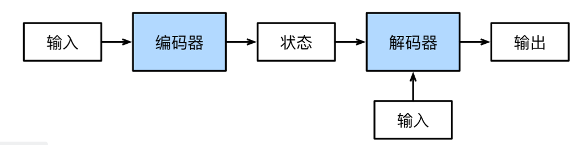

**示例**：英语 → 法语翻译

| 组件 | 输入 | 输出 |
|------|------|------|
| **编码器** | `["They", "are", "watching", "."]` | 固定形状的编码状态 |
| **解码器** | 编码状态 + 已生成的词元 | 逐个生成 `["Ils", "regardent", "."]` |

### 9.6.3 编码器接口

编码器接收变长序列作为输入，输出固定形状的编码状态。

```python
from torch import nn

class Encoder(nn.Module):
    """编码器-解码器架构的基本编码器接口"""
    def __init__(self, **kwargs):
        super(Encoder, self).__init__(**kwargs)

    def forward(self, X, *args):
        """
        前向传播
        
        Args:
            X: 输入序列，形状 (批量大小, 时间步数)
            *args: 额外参数（如有效长度）
        
        Returns:
            enc_outputs: 编码输出（固定形状的状态）
        """
        raise NotImplementedError
```

**编码器的作用**：

| 输入 | 处理 | 输出 |
|------|------|------|
| 变长源语言序列 | 提取语义信息 | 固定大小的"语义摘要"（状态） |
| `["They", "are", "watching", "."]` | 神经网络编码 | 状态向量（如 256 维） |

### 9.6.4 解码器接口

解码器接收编码状态，逐步生成输出序列。

```python
class Decoder(nn.Module):
    """编码器-解码器架构的基本解码器接口"""
    def __init__(self, **kwargs):
        super(Decoder, self).__init__(**kwargs)

    def init_state(self, enc_outputs, *args):
        """
        从编码器输出初始化解码器状态
        
        Args:
            enc_outputs: 编码器的输出
        
        Returns:
            state: 解码器的初始状态
        """
        raise NotImplementedError

    def forward(self, X, state):
        """
        解码器前向传播
        
        Args:
            X: 当前时间步的输入（如上一时间步生成的词元）
            state: 解码器状态（包含编码状态和隐状态）
        
        Returns:
            output: 当前时间步的输出（词元概率分布）
            state: 更新后的状态
        """
        raise NotImplementedError
```

**解码器的工作流程**：

```
         编码状态 (固定大小)
              │
              ▼
         ┌─────────┐
    <bos>→│ 解码器  │→ "Ils"
         └─────────┘
              │
              ▼
         ┌─────────┐
   "Ils"→│ 解码器  │→ "regardent"
         └─────────┘
              │
              ▼
         ┌─────────┐
"regardent"→│ 解码器  │→ "."
         └─────────┘
              │
              ▼
         遇到 <eos> 停止
```

### 9.6.5 合并编码器和解码器

```python
class EncoderDecoder(nn.Module):
    """编码器-解码器架构的基类"""
    def __init__(self, encoder, decoder, **kwargs):
        super(EncoderDecoder, self).__init__(**kwargs)
        self.encoder = encoder
        self.decoder = decoder

    def forward(self, enc_X, dec_X, *args):
        """
        完整的前向传播
        
        Args:
            enc_X: 编码器输入（源语言序列）
            dec_X: 解码器输入（目标语言序列，训练时使用）
            *args: 额外参数
        
        Returns:
            decoder 的输出
        """
        # 1. 编码：将源语言序列编码为固定状态
        enc_outputs = self.encoder(enc_X, *args)
        
        # 2. 初始化解码器状态
        dec_state = self.decoder.init_state(enc_outputs, *args)
        
        # 3. 解码：从状态生成目标语言序列
        return self.decoder(dec_X, dec_state)
```

### 9.6.6 训练与推理的区别

| 阶段 | 编码器输入 | 解码器输入 | 解码器输出 |
|------|-----------|-----------|-----------|
| **训练** | 源语言序列（完整） | 目标语言序列（完整，含 `<bos>`） | 目标语言序列（完整，含 `<eos>`） |
| **推理** | 源语言序列（完整） | 上一时间步的输出 | 逐词生成直到 `<eos>` |

```
训练时：
  编码器: ["They", "are", "watching", "."] → 状态
  解码器: ["<bos>", "Ils", "regardent"] → ["Ils", "regardent", "."]

推理时：
  编码器: ["They", "are", "watching", "."] → 状态
  解码器: ["<bos>"] → "Ils" → "regardent" → "." → "<eos>" 停止
```

### 9.6.7 关键特性

| 特性 | 说明 |
|------|------|
| **模块化** | 编码器和解码器可以独立设计和替换 |
| **灵活性** | 编码器和解码器可以使用不同类型（RNN/CNN/Transformer） |
| **端到端** | 整个架构可以端到端训练 |
| **变长处理** | 天然支持变长输入和变长输出 |

### 9.6.8 应用场景

| 任务 | 编码器输入 | 解码器输出 |
|------|-----------|-----------|
| **机器翻译** | 源语言句子 | 目标语言句子 |
| **文本摘要** | 长文本 | 简短摘要 |
| **对话系统** | 用户消息 | 系统回复 |
| **图像描述** | 图像特征 | 文本描述 |
| **代码生成** | 自然语言需求 | 代码 |
| **语音识别** | 语音信号 | 文本转录 |

### 9.6.9 小结

| 要点 | 说明 |
|------|------|
| **核心思想** | 编码器将变长输入→固定状态，解码器将固定状态→变长输出 |
| **状态** | 编码器和解码器之间的"桥梁"，承载语义信息 |
| **模块化** | 编码器和解码器独立实现，通过状态交互 |
| **训练** | 使用教师强制（Teacher Forcing），解码器输入真实目标 |
| **推理** | 解码器逐词生成，直到遇到 `<eos>` |
| **典型应用** | 机器翻译、文本摘要、对话系统等所有序列转换任务 |


## 9.7 序列到序列学习（Seq2Seq）
### 9.7.1 什么是 Seq2Seq？

**Seq2Seq（Sequence to Sequence）** 是编码器-解码器架构的具体实现，使用两个循环神经网络（RNN）分别作为编码器和解码器，用于处理输入和输出都是变长序列的任务（如机器翻译）。

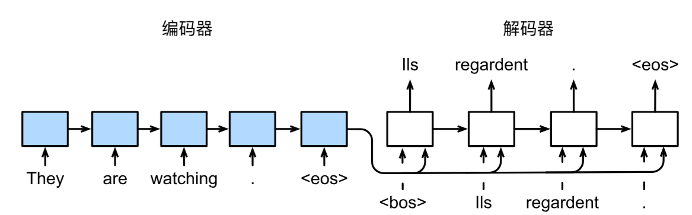

**核心流程**：

```
源语言: "They are watching ."
    │
    ▼
编码器（RNN）→ 上下文变量 c（固定形状）
    │
    ▼
解码器（RNN）→ 逐个生成目标词元
    │
    ▼
目标语言: "Ils regardent ."
```

### 9.7.2 编码器

编码器将变长输入序列编码为固定形状的上下文变量 $\mathbf{c}$。

#### 数学定义

对于输入序列 $x_1, \ldots, x_T$，编码器的隐状态更新：

$$\mathbf{h}_t = f(\mathbf{x}_t, \mathbf{h}_{t-1})$$

上下文变量通常取最后一个时间步的隐状态：

$$\mathbf{c} = q(\mathbf{h}_1, \ldots, \mathbf{h}_T) = \mathbf{h}_T$$

#### 代码实现

```python
import collections
import math
import torch
from torch import nn
from d2l import torch as d2l


class Seq2SeqEncoder(d2l.Encoder):
    """
    用于序列到序列学习的循环神经网络编码器
    
    结构：
        1. 嵌入层（Embedding）：将词元索引转为密集向量
        2. GRU 层：处理序列，输出隐状态
    """
    def __init__(self, vocab_size, embed_size, num_hiddens, num_layers,
                 dropout=0, **kwargs):
        """
        Args:
            vocab_size: 源语言词表大小
            embed_size: 嵌入向量维度
            num_hiddens: 隐藏单元数
            num_layers: GRU 层数
            dropout: Dropout 概率
        """
        super(Seq2SeqEncoder, self).__init__(**kwargs)
        
        # ---- 1. 嵌入层 ----
        # 将词元索引（整数）映射为密集向量（embed_size 维）
        # 输入: (batch_size, num_steps)  输出: (batch_size, num_steps, embed_size)
        self.embedding = nn.Embedding(vocab_size, embed_size)
        
        # ---- 2. GRU 层 ----
        # 输入维度 embed_size，隐藏单元数 num_hiddens，层数 num_layers
        self.rnn = nn.GRU(embed_size, num_hiddens, num_layers,
                          dropout=dropout)

    def forward(self, X, *args):
        """
        前向传播
        
        Args:
            X: 输入序列索引，形状 (batch_size, num_steps)
            *args: 额外参数（如有效长度）
        
        Returns:
            output: 所有时间步的隐状态，形状 (num_steps, batch_size, num_hiddens)
            state: 最终隐状态，形状 (num_layers, batch_size, num_hiddens)
        """
        # 1. 嵌入：将索引转为向量
        # X 形状: (batch_size, num_steps) → (batch_size, num_steps, embed_size)
        X = self.embedding(X)
        
        # 2. 转置：将时间步放到第0维
        # GRU 期望输入形状为 (num_steps, batch_size, embed_size)
        X = X.permute(1, 0, 2)
        
        # 3. GRU 前向传播
        # output: 所有时间步的隐状态 (num_steps, batch_size, num_hiddens)
        # state: 最后一层的最终隐状态 (num_layers, batch_size, num_hiddens)
        output, state = self.rnn(X)
        
        return output, state
```

#### 测试编码器

```python
# 实例化编码器：词表大小10，嵌入维度8，隐藏单元16，2层
encoder = Seq2SeqEncoder(vocab_size=10, embed_size=8, num_hiddens=16,
                         num_layers=2)
encoder.eval()

# 模拟输入：4个样本，每个7个时间步
X = torch.zeros((4, 7), dtype=torch.long)
output, state = encoder(X)

print(output.shape)  # torch.Size([7, 4, 16])  (时间步, 批量, 隐藏单元)
print(state.shape)   # torch.Size([2, 4, 16])  (层数, 批量, 隐藏单元)
```

输出：
```
torch.Size([7, 4, 16])
torch.Size([2, 4, 16])
```

### 9.7.3 解码器

解码器从上下文变量中逐步生成输出序列。

#### 数学定义

解码器隐状态更新：

$$\mathbf{s}_{t'} = g(y_{t'-1}, \mathbf{c}, \mathbf{s}_{t'-1})$$

输出概率分布：

$$P(y_{t'} \mid y_1, \ldots, y_{t'-1}, \mathbf{c})$$

#### 代码实现

```python
class Seq2SeqDecoder(d2l.Decoder):
    """
    用于序列到序列学习的循环神经网络解码器
    
    结构：
        1. 嵌入层：将目标词元转为向量
        2. 上下文变量与输入拼接后送入 GRU
        3. 全连接层将隐状态映射到词表大小的输出
    """
    def __init__(self, vocab_size, embed_size, num_hiddens, num_layers,
                 dropout=0, **kwargs):
        """
        Args:
            vocab_size: 目标语言词表大小
            embed_size: 嵌入向量维度
            num_hiddens: 隐藏单元数
            num_layers: GRU 层数
            dropout: Dropout 概率
        """
        super(Seq2SeqDecoder, self).__init__(**kwargs)
        
        # ---- 1. 嵌入层 ----
        self.embedding = nn.Embedding(vocab_size, embed_size)
        
        # ---- 2. GRU 层 ----
        # 输入维度 = embed_size + num_hiddens（因为拼接了上下文变量）
        # 上下文变量在每个时间步都与输入拼接
        self.rnn = nn.GRU(embed_size + num_hiddens, num_hiddens, num_layers,
                          dropout=dropout)
        
        # ---- 3. 输出层 ----
        # 将隐状态映射到词表大小，用于预测下一个词元
        self.dense = nn.Linear(num_hiddens, vocab_size)

    def init_state(self, enc_outputs, *args):
        """
        从编码器输出初始化解码器状态
        
        Args:
            enc_outputs: 编码器输出 (output, state)
        
        Returns:
            state: 初始化解码器隐状态（使用编码器的最终隐状态）
        """
        # enc_outputs[1] 是编码器的最终隐状态
        # 形状: (num_layers, batch_size, num_hiddens)
        return enc_outputs[1]

    def forward(self, X, state):
        """
        解码器前向传播
        
        Args:
            X: 目标输入序列，形状 (batch_size, num_steps)
            state: 解码器状态（初始来自编码器）
        
        Returns:
            output: 每个时间步的输出概率分布，形状 (batch_size, num_steps, vocab_size)
            state: 最终隐状态
        """
        # ---- 1. 嵌入 ----
        # X: (batch_size, num_steps) → (batch_size, num_steps, embed_size)
        X = self.embedding(X)
        # 转置为 (num_steps, batch_size, embed_size)
        X = X.permute(1, 0, 2)
        
        # ---- 2. 准备上下文变量 ----
        # state[-1] 是最后一层的隐状态（包含编码信息）
        # 形状: (batch_size, num_hiddens)
        # repeat 将其复制 num_steps 次，与每个时间步的输入拼接
        context = state[-1].repeat(X.shape[0], 1, 1)
        # context 形状: (num_steps, batch_size, num_hiddens)
        
        # ---- 3. 拼接输入和上下文 ----
        # 在每个时间步，输入和上下文变量拼接作为 GRU 的输入
        X_and_context = torch.cat((X, context), 2)
        # 形状: (num_steps, batch_size, embed_size + num_hiddens)
        
        # ---- 4. GRU 前向传播 ----
        output, state = self.rnn(X_and_context, state)
        # output: (num_steps, batch_size, num_hiddens)
        
        # ---- 5. 输出层 ----
        # output 转置为 (batch_size, num_steps, num_hiddens)
        output = self.dense(output).permute(1, 0, 2)
        # 形状: (batch_size, num_steps, vocab_size)
        
        return output, state
```

#### 测试解码器

```python
decoder = Seq2SeqDecoder(vocab_size=10, embed_size=8, num_hiddens=16,
                         num_layers=2)
decoder.eval()

# 从编码器获取初始状态
state = decoder.init_state(encoder(X))
output, state = decoder(X, state)

print(output.shape)  # torch.Size([4, 7, 10])  (批量, 时间步, 词表大小)
print(state.shape)   # torch.Size([2, 4, 16])  (层数, 批量, 隐藏单元)
```

输出：
```
torch.Size([4, 7, 10])
torch.Size([2, 4, 16])
```

### 9.7.4 带遮蔽的损失函数

在机器翻译中，不同序列长度不同，填充词元 `<pad>` 不应参与损失计算。

```python
def sequence_mask(X, valid_len, value=0):
    """
    在序列中屏蔽不相关的项（填充词元）
    
    Args:
        X: 输入张量，形状 (batch_size, num_steps)
        valid_len: 每个序列的有效长度，形状 (batch_size,)
        value: 屏蔽位置的填充值
    
    Returns:
        X: 屏蔽后的张量
    """
    maxlen = X.size(1)  # 最大长度
    
    # 创建掩码：位置 < valid_len 为 True，>= valid_len 为 False
    # torch.arange(maxlen) → [0,1,2,...,maxlen-1]
    # [None, :] 增加维度 → (1, maxlen)
    # valid_len[:, None] → (batch_size, 1)
    # 广播比较 → (batch_size, maxlen)
    mask = torch.arange((maxlen), dtype=torch.float32,
                        device=X.device)[None, :] < valid_len[:, None]
    
    # 将掩码为 False 的位置置为 value
    X[~mask] = value
    return X

# 示例
X = torch.tensor([[1, 2, 3], [4, 5, 6]])
sequence_mask(X, torch.tensor([1, 2]))
```

输出：
```
tensor([[1, 0, 0],
        [4, 5, 0]])
```

#### 带遮蔽的交叉熵损失

```python
class MaskedSoftmaxCELoss(nn.CrossEntropyLoss):
    """
    带遮蔽的 softmax 交叉熵损失函数
    
    继承自 nn.CrossEntropyLoss，增加对填充词元的屏蔽功能
    """
    def forward(self, pred, label, valid_len):
        """
        Args:
            pred: 预测值，形状 (batch_size, num_steps, vocab_size)
            label: 标签，形状 (batch_size, num_steps)
            valid_len: 有效长度，形状 (batch_size,)
        
        Returns:
            weighted_loss: 每个样本的加权损失，形状 (batch_size,)
        """
        # 1. 创建权重矩阵：有效位置为 1，填充位置为 0
        weights = torch.ones_like(label)
        weights = sequence_mask(weights, valid_len)
        
        # 2. 计算交叉熵损失（不求和/平均）
        # 需要将 pred 转置为 (batch_size, vocab_size, num_steps)
        self.reduction = 'none'
        unweighted_loss = super(MaskedSoftmaxCELoss, self).forward(
            pred.permute(0, 2, 1), label)
        
        # 3. 应用权重掩码，然后按样本求平均
        weighted_loss = (unweighted_loss * weights).mean(dim=1)
        return weighted_loss

# 测试：3个样本，长度分别为4、2、0
loss = MaskedSoftmaxCELoss()
loss(torch.ones(3, 4, 10), torch.ones((3, 4), dtype=torch.long),
     torch.tensor([4, 2, 0]))
```

输出：
```
tensor([2.3026, 1.1513, 0.0000])
```

### 9.7.5 训练函数

```python
def train_seq2seq(net, data_iter, lr, num_epochs, tgt_vocab, device):
    """
    训练序列到序列模型
    
    Args:
        net: 编码器-解码器模型
        data_iter: 数据迭代器
        lr: 学习率
        num_epochs: 训练轮数
        tgt_vocab: 目标语言词表（用于获取 <bos> 的索引）
        device: 计算设备
    """
    # ---- 1. 参数初始化（Xavier） ----
    def xavier_init_weights(m):
        if type(m) == nn.Linear:
            nn.init.xavier_uniform_(m.weight)
        if type(m) == nn.GRU:
            for param in m._flat_weights_names:
                if "weight" in param:
                    nn.init.xavier_uniform_(m._parameters[param])

    net.apply(xavier_init_weights)
    net.to(device)
    
    # ---- 2. 设置优化器和损失函数 ----
    optimizer = torch.optim.Adam(net.parameters(), lr=lr)
    loss = MaskedSoftmaxCELoss()
    net.train()
    
    # ---- 3. 训练循环 ----
    animator = d2l.Animator(xlabel='epoch', ylabel='loss',
                            xlim=[10, num_epochs])
    
    for epoch in range(num_epochs):
        timer = d2l.Timer()
        metric = d2l.Accumulator(2)  # (训练损失总和, 词元数量)
        
        for batch in data_iter:
            # 从 batch 中取出数据并移到设备
            X, X_valid_len, Y, Y_valid_len = [x.to(device) for x in batch]
            
            # ---- 4. 构造解码器输入（教师强制） ----
            # 在训练时，解码器的输入是：<bos> + 真实目标序列（去掉最后一个）
            # 这样解码器每一步都知道"正确答案"，加速收敛
            bos = torch.tensor([tgt_vocab['<bos>']] * Y.shape[0],
                               device=device).reshape(-1, 1)
            dec_input = torch.cat([bos, Y[:, :-1]], 1)
            # dec_input 形状: (batch_size, num_steps)
            
            # ---- 5. 前向传播 ----
            optimizer.zero_grad()
            Y_hat, _ = net(X, dec_input, X_valid_len)
            
            # ---- 6. 计算损失（屏蔽填充词元） ----
            l = loss(Y_hat, Y, Y_valid_len)
            
            # ---- 7. 反向传播和梯度裁剪 ----
            l.sum().backward()
            d2l.grad_clipping(net, 1)
            
            # ---- 8. 更新参数 ----
            num_tokens = Y_valid_len.sum()
            optimizer.step()
            
            # ---- 9. 记录指标 ----
            with torch.no_grad():
                metric.add(l.sum(), num_tokens)
        
        # 每10轮打印损失
        if (epoch + 1) % 10 == 0:
            animator.add(epoch + 1, (metric[0] / metric[1],))
    
    print(f'loss {metric[0] / metric[1]:.3f}, {metric[1] / timer.stop():.1f} '
          f'tokens/sec on {str(device)}')
```

#### 训练模型

```python
# 超参数设置
embed_size, num_hiddens, num_layers, dropout = 32, 32, 2, 0.1
batch_size, num_steps = 64, 10
lr, num_epochs, device = 0.005, 300, d2l.try_gpu()

# 加载数据
train_iter, src_vocab, tgt_vocab = d2l.load_data_nmt(batch_size, num_steps)

# 创建编码器和解码器
encoder = Seq2SeqEncoder(len(src_vocab), embed_size, num_hiddens, num_layers, dropout)
decoder = Seq2SeqDecoder(len(tgt_vocab), embed_size, num_hiddens, num_layers, dropout)

# 组装模型并训练
net = d2l.EncoderDecoder(encoder, decoder)
train_seq2seq(net, train_iter, lr, num_epochs, tgt_vocab, device)
```

输出：
```
loss 0.019, 11451.2 tokens/sec on cuda:0
```

### 9.7.6 预测函数

```python
def predict_seq2seq(net, src_sentence, src_vocab, tgt_vocab, num_steps,
                    device, save_attention_weights=False):
    """
    序列到序列模型的预测
    
    Args:
        net: 训练好的模型
        src_sentence: 源语言句子（字符串）
        src_vocab: 源语言词表
        tgt_vocab: 目标语言词表
        num_steps: 最大预测步数
        device: 计算设备
        save_attention_weights: 是否保存注意力权重
    
    Returns:
        output_seq: 预测的目标语言句子（字符串）
        attention_weight_seq: 注意力权重序列（可选）
    """
    net.eval()
    
    # ---- 1. 预处理源句子 ----
    # 转小写 → 按空格分割 → 转索引 → 添加 <eos>
    src_tokens = src_vocab[src_sentence.lower().split(' ')] + [
        src_vocab['<eos>']]
    enc_valid_len = torch.tensor([len(src_tokens)], device=device)
    
    # 截断/填充到 num_steps
    src_tokens = d2l.truncate_pad(src_tokens, num_steps, src_vocab['<pad>'])
    
    # 添加批量轴: (1, num_steps)
    enc_X = torch.unsqueeze(
        torch.tensor(src_tokens, dtype=torch.long, device=device), dim=0)
    
    # ---- 2. 编码 ----
    enc_outputs = net.encoder(enc_X, enc_valid_len)
    dec_state = net.decoder.init_state(enc_outputs, enc_valid_len)
    
    # ---- 3. 初始化解码器输入 ----
    # 第一个输入是 <bos>（开始标记）
    dec_X = torch.unsqueeze(torch.tensor(
        [tgt_vocab['<bos>']], dtype=torch.long, device=device), dim=0)
    
    # ---- 4. 逐词生成 ----
    output_seq, attention_weight_seq = [], []
    
    for _ in range(num_steps):
        # 解码器前向传播
        Y, dec_state = net.decoder(dec_X, dec_state)
        
        # 取概率最高的词元作为预测
        dec_X = Y.argmax(dim=2)
        pred = dec_X.squeeze(dim=0).type(torch.int32).item()
        
        # 保存注意力权重（后续使用）
        if save_attention_weights:
            attention_weight_seq.append(net.decoder.attention_weights)
        
        # 遇到 <eos> 停止生成
        if pred == tgt_vocab['<eos>']:
            break
        
        output_seq.append(pred)
    
    # 将索引序列转换回字符串
    return ' '.join(tgt_vocab.to_tokens(output_seq)), attention_weight_seq
```

### 9.7.7 评估指标：BLEU

**BLEU**（Bilingual Evaluation Understudy）是机器翻译的常用评估指标。

#### 数学定义

$$\text{BLEU} = \exp\left(\min\left(0, 1 - \frac{\text{len}_{\text{label}}}{\text{len}_{\text{pred}}}\right)\right) \prod_{n=1}^k p_n^{1/2^n}$$

其中：
- $p_n$：$n$ 元语法的精确率
- 第一个因子：长度惩罚（防止预测过短）

BLEU的值越大越好。
#### 代码实现

```python
def bleu(pred_seq, label_seq, k):
    """
    计算 BLEU 分数
    
    Args:
        pred_seq: 预测序列（字符串）
        label_seq: 标签序列（字符串）
        k: 最大 n-gram 长度
    
    Returns:
        score: BLEU 分数（0~1，越高越好）
    """
    pred_tokens = pred_seq.split(' ')
    label_tokens = label_seq.split(' ')
    
    len_pred = len(pred_tokens)
    len_label = len(label_tokens)
    
    # ---- 1. 长度惩罚 ----
    # 如果预测序列比标签序列短，施加惩罚
    score = math.exp(min(0, 1 - len_label / len_pred))
    
    # ---- 2. 计算 n-gram 精确率 ----
    for n in range(1, k + 1):
        # 统计标签中所有 n-gram 的出现次数
        label_subs = collections.defaultdict(int)
        for i in range(len_label - n + 1):
            label_subs[' '.join(label_tokens[i: i + n])] += 1
        
        # 统计预测中匹配的 n-gram 数量
        num_matches = 0
        for i in range(len_pred - n + 1):
            ngram = ' '.join(pred_tokens[i: i + n])
            if label_subs[ngram] > 0:
                num_matches += 1
                label_subs[ngram] -= 1  # 防止重复匹配
        
        # 计算 n-gram 精确率并加权
        precision = num_matches / (len_pred - n + 1)
        score *= math.pow(precision, math.pow(0.5, n))
    
    return score
```

### 9.7.8 翻译测试

```python
engs = ['go .', "i lost .", "he's calm .", "i'm home ."]
fras = ['va !', "j'ai perdu .", "il est calme .", "je suis chez moi ."]

for eng, fra in zip(engs, fras):
    translation, _ = predict_seq2seq(
        net, eng, src_vocab, tgt_vocab, num_steps, device)
    print(f'{eng} => {translation}, bleu {bleu(translation, fra, k=2):.3f}')
```

输出：
```
go . => va !, bleu 1.000
i lost . => j'ai perdu ., bleu 1.000
he's calm . => il est bon ?, bleu 0.537
i'm home . => je suis chez moi debout ., bleu 0.803
```


### 9.7.9 核心概念总结

| 概念 | 说明 |
|------|------|
| **编码器** | RNN 将变长输入编码为固定状态（上下文变量 $\mathbf{c}$） |
| **解码器** | RNN 从上下文变量逐步生成变长输出 |
| **上下文变量** | 编码器和解码器之间的"桥梁"，承载语义信息 |
| **嵌入层** | 将离散词元索引映射为连续向量 |
| **教师强制** | 训练时用真实目标作为解码器输入（而非预测） |
| **遮蔽损失** | 排除填充词元对损失函数的贡献 |
| **BLEU** | 基于 n-gram 匹配的翻译质量评估指标 |


## 9.8 束搜索
### 9.8.1 序列生成的问题

在 Seq2Seq 的解码阶段，我们需要从所有可能的输出序列中找到最优序列：

$$\arg\max_{\mathbf{y}} \log P(\mathbf{y} \mid \mathbf{x}) = \arg\max_{\mathbf{y}} \sum_{t'=1}^{T'} \log P(y_{t'} \mid y_{t'-1}, \ldots, y_1, \mathbf{x})$$

**搜索空间爆炸**：

| 词表大小 $\|\mathcal{Y}\|$ | 最大长度 $T'$ | 候选序列总数 |
|---|---|---|
| 10,000 | 10 | $10^{40}$（天文数字！） |

**三种搜索策略对比**：

| 策略 | 计算量 | 最优性 | 适用场景 |
|------|--------|--------|----------|
| **贪心搜索** | $O(\|\mathcal{Y}\| \cdot T')$ | 局部最优（可能错过全局最优） | 速度快，精度要求不高 |
| **穷举搜索** | $O(\|\mathcal{Y}\|^{T'})$ | 全局最优 | 词表小/序列短（实际不可行） |
| **束搜索** | $O(k \cdot \|\mathcal{Y}\| \cdot T')$ | 近似最优 | 实际应用（平衡速度与精度） |

### 9.8.2 贪心搜索（Greedy Search）

#### 核心思想

每一步选择概率最大的词元：

$$y_{t'} = \arg\max_{y \in \mathcal{Y}} P(y \mid y_1, \ldots, y_{t'-1}, \mathbf{c})$$

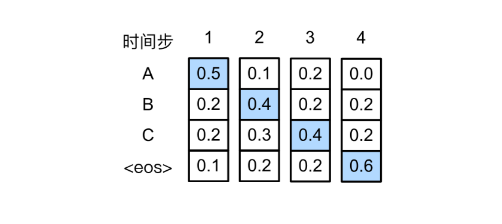
**问题**：贪心搜索可能错过全局最优解。

#### 贪心搜索失败示例

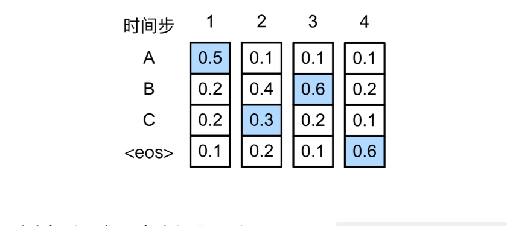

| 序列 | 概率计算 | 结果 |
|------|----------|------|
| 贪心搜索：A → B → C → `<eos>` | $0.5 \times 0.4 \times 0.4 \times 0.6 = 0.048$ | **不是最优** ❌ |
| 最优序列：A → C → B → `<eos>` | $0.5 \times 0.3 \times 0.6 \times 0.6 = 0.054$ | **更优** ✅ |

**结论**：在时间步2选择第二高概率的词元，可能导致最终整体概率更高。贪心搜索只考虑局部最优，无法保证全局最优。

### 9.8.3 穷举搜索（Exhaustive Search）

**核心思想**：列举所有可能的输出序列，计算其条件概率，选择最高的。

**问题**：

$$|\mathcal{Y}| = 10000,\ T' = 10$$

$$\text{候选序列数} = 10000^{10} = 10^{40}$$

**结论**：计算量天文数字，**实际不可行**。

### 9.8.4 束搜索（Beam Search）

#### 核心思想

束搜索是贪心搜索和穷举搜索的折中方案，通过**束宽（Beam Size）** $k$ 控制搜索宽度：

- 每步保留 $k$ 个最优候选序列
- $k=1$ 等价于贪心搜索
- $k = |\mathcal{Y}|$ 等价于穷举搜索

#### 束搜索过程详解

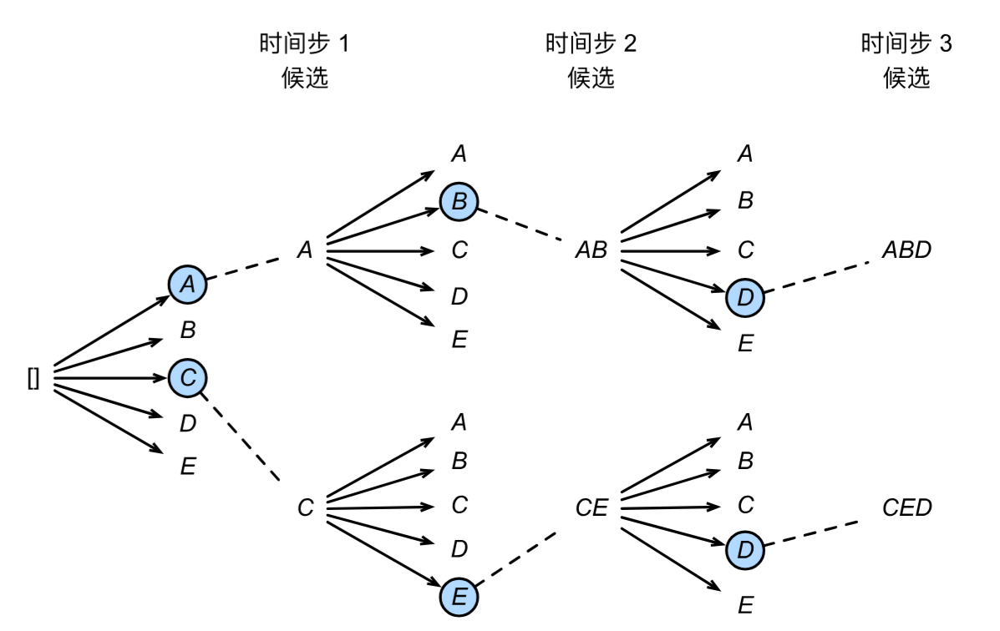

**超参数**：束宽 $k=2$，最大长度 $T'=3$，词表 $\mathcal{Y} = \{A, B, C, D, E\}$

**时间步 1**：选择概率最高的 2 个词元

$$P(A \mid \mathbf{c}) = 0.5,\quad P(C \mid \mathbf{c}) = 0.4$$

候选序列：`[A]`, `[C]`

**时间步 2**：扩展 2 个候选，计算 $2 \times 5 = 10$ 个组合，选前 2 名

$$P(A, B \mid \mathbf{c}) = 0.5 \times 0.4 = 0.20$$

$$P(C, E \mid \mathbf{c}) = 0.4 \times 0.6 = 0.24$$

候选序列：`[C, E]`, `[A, B]`（按概率排序）

**时间步 3**：继续扩展，选前 2 名

$$P(A, B, D \mid \mathbf{c}) = 0.20 \times 0.6 = 0.12$$

$$P(C, E, D \mid \mathbf{c}) = 0.24 \times 0.5 = 0.12$$

**最终候选序列**：`[A]`, `[C]`, `[A,B]`, `[C,E]`, `[A,B,D]`, `[C,E,D]`

#### 长度归一化

由于长序列的概率乘积更小（乘了更多小于 1 的数），需要归一化：

$$\frac{1}{L^\alpha} \log P(y_1, \ldots, y_L \mid \mathbf{c}) = \frac{1}{L^\alpha} \sum_{t'=1}^L \log P(y_{t'} \mid y_1, \ldots, y_{t'-1}, \mathbf{c})$$

其中：
- $L$：候选序列长度
- $\alpha$：通常设为 $0.75$

**为什么要归一化？**

| 序列 | 概率 | 长度 | 未归一化得分 | 归一化得分（$\alpha=1$） |
|------|------|------|-------------|----------------------|
| A → B → C → `<eos>` | 0.048 | 4 | -3.04 | -0.76 |
| A → `<eos>` | 0.5 | 2 | -0.69 | -0.35 |

虽然短序列概率更高，但长序列可能语义更完整。归一化让不同长度的序列可以公平比较。

### 9.8.5 三种策略计算量对比

| 策略 | 计算复杂度 | 示例（$\|\mathcal{Y}\|=10000, T'=10$） |
|------|-----------|-------------------------------------|
| **贪心搜索** | $O(\|\mathcal{Y}\| \cdot T')$ | $10000 \times 10 = 10^5$ ✅ 可行 |
| **束搜索（k=5）** | $O(k \cdot \|\mathcal{Y}\| \cdot T')$ | $5 \times 10000 \times 10 = 5 \times 10^5$ ✅ 可行 |
| **束搜索（k=10）** | $O(k \cdot \|\mathcal{Y}\| \cdot T')$ | $10 \times 10000 \times 10 = 10^6$ ✅ 可行 |
| **穷举搜索** | $O(\|\mathcal{Y}\|^{T'})$ | $10000^{10} = 10^{40}$ ❌ 不可行 |

### 9.8.6 束宽 $k$ 的影响

| 束宽 $k$ | 精度 | 速度 | 适用场景 |
|----------|------|------|----------|
| **1** | 低（贪心） | 最快 | 实时应用、轻量模型 |
| **3-5** | 适中 | 快 | 大多数实际应用 |
| **10** | 较高 | 较快 | 质量要求较高的场景 |
| **100** | 很高 | 慢 | 学术研究、质量优先 |
| **=词表大小** | 最优 | 极慢（穷举） | 仅理论，实际不可行 |


### 9.8.7 核心概念总结

| 概念 | 说明 |
|------|------|
| **贪心搜索** | 每步选概率最高的词元，计算量最小，易陷入局部最优 |
| **穷举搜索** | 枚举所有可能序列，保证全局最优，计算量指数爆炸 |
| **束搜索** | 每步保留 k 个最优候选，平衡精度和计算量 |
| **束宽 k** | 控制候选数量，$k=1$=贪心，$k=|\mathcal{Y}|$=穷举 |
| **长度归一化** | 公平比较不同长度的序列，惩罚过短/过长的输出 |

## 9.9 第九章总结

### 本章核心脉络

```
门控机制（GRU/LSTM）→ 深层/双向扩展 → 机器翻译数据集 → 编码器-解码器 → Seq2Seq → 束搜索
     (9.1/9.2)           (9.3/9.4)         (9.5)           (9.6)         (9.7)       (9.8)
```

### 各节核心要点

#### 9.1 GRU

| 概念 | 关键点 |
|------|--------|
| **问题驱动** | 标准 RNN 梯度消失，无法处理长距离依赖 |
| **重置门** $\mathbf{R}_t$ | 控制是否忽略过去状态，捕获**短期依赖** |
| **更新门** $\mathbf{Z}_t$ | 控制是否保留旧状态，捕获**长期依赖** |
| **核心公式** | $\mathbf{H}_t = \mathbf{Z}_t \odot \mathbf{H}_{t-1} + (1 - \mathbf{Z}_t) \odot \tilde{\mathbf{H}}_t$ |
| **特点** | 参数约 3 倍于 RNN，计算高效 |

#### 9.2 LSTM

| 概念 | 关键点 |
|------|--------|
| **三个门** | 输入门（写入）、遗忘门（丢弃）、输出门（读取） |
| **记忆元** $\mathbf{C}_t$ | 独立的"长期记忆"通道，形成**梯度高速公路** |
| **核心公式** | $\mathbf{C}_t = \mathbf{F}_t \odot \mathbf{C}_{t-1} + \mathbf{I}_t \odot \tilde{\mathbf{C}}_t$ |
| **LSTM vs GRU** | LSTM 更复杂（4 倍参数）、表达更强；GRU 更快、参数更少 |

#### 9.3 深度 RNN

| 概念 | 关键点 |
|------|--------|
| **架构** | 堆叠多个 RNN 层，每层接收下层输入 + 自身前一隐状态 |
| **信息流** | 横向（时间）+ 纵向（层间）两个方向 |
| **层数** | 通常 2-4 层，每增加一层参数量线性增长 |

#### 9.4 双向 RNN

| 概念 | 关键点 |
|------|--------|
| **前向隐状态** | 从过去到未来，捕获历史信息 |
| **反向隐状态** | 从未来到过去，捕获未来信息 |
| **输出** | 拼接两个方向：$\mathbf{H}_t = [\overrightarrow{\mathbf{H}}_t; \overleftarrow{\mathbf{H}}_t]$ |
| **限制** | 不可用于在线预测/语言模型（需要未来信息） |
| **适用** | 编码器、序列标注、完形填空 |

#### 9.5 机器翻译与数据集

| 概念 | 关键点 |
|------|--------|
| **任务** | 源语言 → 目标语言（变长→变长） |
| **预处理** | 不间断空格替换 → 小写 → 标点前加空格 |
| **特殊词元** | `<pad>`（填充）、`<bos>`（开始）、`<eos>`（结束） |
| **有效长度** | 记录排除填充词元的真实长度 |

#### 9.6 编码器-解码器架构

| 概念 | 关键点 |
|------|--------|
| **编码器** | 变长输入 → 固定状态 $\mathbf{c}$（语义摘要） |
| **解码器** | 固定状态 → 变长输出（逐词生成） |
| **状态** | 编码器与解码器之间的"桥梁" |
| **训练** | 教师强制（Teacher Forcing） |
| **推理** | 逐词生成直到 `<eos>` |

#### 9.7 Seq2Seq

| 概念 | 关键点 |
|------|--------|
| **编码器** | 通常用 GRU/LSTM，输出最终隐状态作为上下文 $\mathbf{c}$ |
| **解码器** | GRU/LSTM，输入为嵌入 + 上下文变量拼接 |
| **遮蔽损失** | 排除 `<pad>` 对损失的贡献 |
| **BLEU** | 基于 n-gram 匹配的翻译质量评估（越大越好） |

#### 9.8 束搜索

| 策略 | 计算量 | 最优性 |
|------|--------|--------|
| **贪心搜索** | $O(\|\mathcal{Y}\| \cdot T')$ | 局部最优 |
| **束搜索** | $O(k \cdot \|\mathcal{Y}\| \cdot T')$ | 近似最优（实用） |
| **穷举搜索** | $O(\|\mathcal{Y}\|^{T'})$ | 全局最优（不可行） |

**长度归一化**：$ \frac{1}{L^\alpha} \sum_{t'=1}^L \log P(y_{t'} \mid \ldots) $，公平比较不同长度序列。

### 关键公式速查表

| 公式 | 含义 |
|------|------|
| $\mathbf{H}_t = \mathbf{Z}_t \odot \mathbf{H}_{t-1} + (1 - \mathbf{Z}_t) \odot \tilde{\mathbf{H}}_t$ | GRU 隐状态更新 |
| $\mathbf{C}_t = \mathbf{F}_t \odot \mathbf{C}_{t-1} + \mathbf{I}_t \odot \tilde{\mathbf{C}}_t$ | LSTM 记忆元更新 |
| $\mathbf{H}_t = \mathbf{O}_t \odot \tanh(\mathbf{C}_t)$ | LSTM 隐状态更新 |
| $\mathbf{H}_t^{(l)} = \phi_l(\mathbf{H}_t^{(l-1)} \mathbf{W}_{xh}^{(l)} + \mathbf{H}_{t-1}^{(l)} \mathbf{W}_{hh}^{(l)} + \mathbf{b}_h^{(l)})$ | 深度 RNN 第 $l$ 层 |
| $\overrightarrow{\mathbf{H}}_t, \overleftarrow{\mathbf{H}}_t$ | 双向 RNN 前向/反向隐状态 |
| $\mathbf{c} = \mathbf{h}_T$ | 上下文变量（编码器最终状态） |
| $\mathbf{s}_{t'} = g(y_{t'-1}, \mathbf{c}, \mathbf{s}_{t'-1})$ | 解码器状态更新 |
| $\text{BLEU} = \exp(\min(0, 1 - \text{len}_{\text{label}}/\text{len}_{\text{pred}})) \prod_{n=1}^k p_n^{1/2^n}$ | BLEU 评估指标 |
| $\frac{1}{L^\alpha} \sum \log P(\cdot)$ | 束搜索长度归一化 |

### 思维导图

```
第九章：现代循环神经网络
│
├── 9.1 GRU
│   ├── 重置门 R_t（捕获短期依赖）
│   ├── 更新门 Z_t（捕获长期依赖）
│   └── 候选隐状态 H̃_t
│
├── 9.2 LSTM
│   ├── 输入门 I_t（写入控制）
│   ├── 遗忘门 F_t（丢弃控制）
│   ├── 输出门 O_t（读取控制）
│   └── 记忆元 C_t（独立长期记忆）
│
├── 9.3 深度 RNN
│   ├── 堆叠多个循环层
│   ├── 横向（时间步）+ 纵向（层间）
│   └── 参数量随层数线性增长
│
├── 9.4 双向 RNN
│   ├── 前向 H→_t（过去→未来）
│   ├── 后向 H←_t（未来→过去）
│   └── 拼接输出 [H→_t; H←_t]
│
├── 9.5 机器翻译与数据集
│   ├── 源语言 → 目标语言
│   ├── 预处理：不间断空格 → 小写 → 标点加空格
│   └── 特殊词元：<pad>, <bos>, <eos>
│
├── 9.6 编码器-解码器
│   ├── 编码器：变长 → 固定状态 c
│   ├── 解码器：固定状态 → 变长
│   └── 教师强制（训练）
│
├── 9.7 Seq2Seq
│   ├── RNN 编码器 + RNN 解码器
│   ├── 上下文变量拼接解码器输入
│   ├── 遮蔽损失（排除 <pad>）
│   └── BLEU 评估
│
└── 9.8 束搜索
    ├── 贪心搜索（局部最优）
    ├── 穷举搜索（全局最优但不可行）
    └── 束搜索（k 个候选，平衡质量与效率）
```

### 一句话总结

> **GRU 和 LSTM 通过门控机制（重置/更新门或输入/遗忘/输出门）解决梯度消失问题；深度 RNN 堆叠多层提高表达能力；双向 RNN 利用上下文信息；编码器-解码器 + Seq2Seq 将变长序列编码为固定状态再解码为变长输出；束搜索通过保留 k 个候选平衡生成质量与速度。**