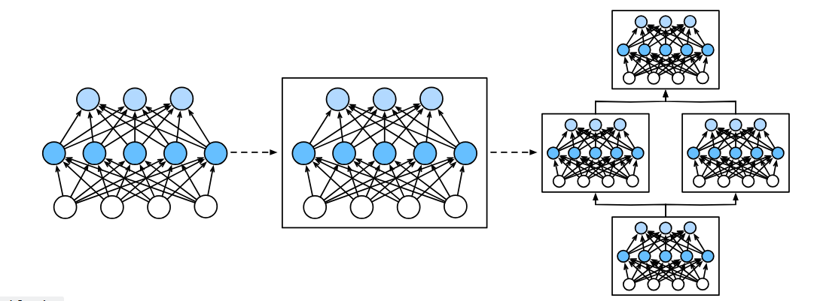
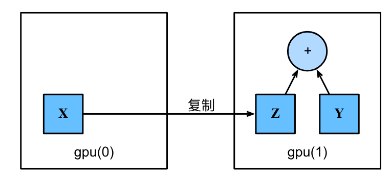

# 第五章 深度学习计算

## 5.1 层和块

在深度学习中，**块（Block）** 是比单个层更大但比整个模型更小的组件，可以描述单个层、由多个层组成的组件或整个模型本身。块的核心思想是**模块化**：将简单的块组合成更大的块，这一过程可以递归进行，最终构成完整的神经网络。

### 5.1.1 块的基本功能

在 PyTorch 中，块由 `nn.Module` 类表示。每个块必须提供以下基本功能：

1. 将输入数据作为前向传播函数的参数
2. 通过前向传播函数生成输出
3. 计算输出关于输入的梯度（通过反向传播，自动完成）
4. 存储和访问前向传播所需的参数
5. 根据需要初始化模型参数

### 5.1.2 nn.Sequential 块

`nn.Sequential` 是一种特殊的 `Module`，它维护了一个由 `Module` 组成的**有序列表**（内涵多个元素），按顺序执行每个块：

```python
import torch
from torch import nn
from torch.nn import functional as F

# 使用 Sequential 构建多层感知机
net = nn.Sequential(nn.Linear(20, 256), nn.ReLU(), nn.Linear(256, 10))

# 测试前向传播
X = torch.rand(2, 20)         # 2个样本，每个20维特征
net(X)                        # 输出形状 (2, 10)
```

### 5.1.3 自定义块

通过继承 `nn.Module` 并实现 `__init__` 和 `forward` 方法，可以创建自定义块：

```python
class MLP(nn.Module):
    """自定义多层感知机块"""
    def __init__(self):
        super().__init__()                          # 必须调用父类构造函数
        self.hidden = nn.Linear(20, 256)            # 隐藏层：20 -> 256
        self.out = nn.Linear(256, 10)               # 输出层：256 -> 10

    def forward(self, X):
        # 前向传播：X -> 隐藏层 -> ReLU -> 输出层
        # F.relu 就是代指relu函数，其是 torch.nn.functional模块下的
        return self.out(F.relu(self.hidden(X)))

net = MLP()
net(X)
```
也就是说一个块就相当于融合了多个层。

**关键点**：
- `super().__init__()` 必须调用，以正确初始化父类
- 自定义层作为实例变量存储在 `self` 中
- 反向传播**自动**生成，无需手动实现

### 5.1.4 自定义顺序块

`Sequential` 的本质是**将多个块串联**。我们可以自己实现一个简化的版本：

```python
class MySequential(nn.Module):
    """自定义顺序块"""
    def __init__(self, *args):
        super().__init__()
        # _modules 是有序字典，用于存储子模块
        # 系统会在参数初始化时自动查找 _modules 中的子块
        for idx, module in enumerate(args):
            self._modules[str(idx)] = module

    def forward(self, X):
        # 按添加顺序依次执行每个块
        for block in self._modules.values():
            X = block(X)
        return X

# 使用自定义顺序块
net = MySequential(nn.Linear(20, 256), nn.ReLU(), nn.Linear(256, 10))
net(X)
```

**为什么要用 `_modules` 而不是普通列表？**
- `_modules` 是 `nn.Module` 内置的有序字典
- 系统在参数初始化时会自动查找 `_modules` 中的子块
- 确保所有子模块被正确注册，`net.parameters()` 能收集到所有参数

### 5.1.5 在前向传播中执行代码

块的优势之一是可以在前向传播中执行任意代码，包括控制流和数学运算：

```python
class FixedHiddenMLP(nn.Module):
    """包含固定权重和控制流的多层感知机"""
    def __init__(self):
        super().__init__()
        # 创建不参与训练的随机权重（requires_grad=False）
        self.rand_weight = torch.rand((20, 20), requires_grad=False)
        self.linear = nn.Linear(20, 20)              # 可训练的全连接层

    def forward(self, X):
        X = self.linear(X)
        # 使用固定权重进行矩阵乘法
        X = F.relu(torch.mm(X, self.rand_weight) + 1)
        # 复用同一全连接层（共享参数）
        X = self.linear(X)
        # 控制流：L1范数大于1时不断除以2
        while X.abs().sum() > 1:
            X /= 2
        return X.sum()                               # 返回所有元素之和

net = FixedHiddenMLP()
net(X)
```

### 5.1.6 块的嵌套组合

块可以任意嵌套，形成复杂网络：

```python
class NestMLP(nn.Module):
    """嵌套块"""
    def __init__(self):
        super().__init__()
        self.net = nn.Sequential(
            nn.Linear(20, 64), nn.ReLU(),
            nn.Linear(64, 32), nn.ReLU()
        )
        self.linear = nn.Linear(32, 16)

    def forward(self, X):
        return self.linear(self.net(X))

# 组合多个块形成更大的网络
chimera = nn.Sequential(
    NestMLP(),                      # 嵌套块
    nn.Linear(16, 20),
    FixedHiddenMLP()                # 自定义块
)
chimera(X)
```
相当于再将块与块串联组合。

### 5.1.7 小结

- **块**是模块化的基本构建单元，可以是单层、多层或整个模型
- **`nn.Module`** 是所有块的基类，提供参数管理、初始化、反向传播等核心功能
- **`nn.Sequential`** 是顺序执行多个块的特殊容器
- 自定义块只需继承 `nn.Module` 并实现 `__init__` 和 `forward`
- 块可以任意嵌套，支持在前向传播中执行复杂的控制流和数学运算
- 实际上就是将层集成化形成块，块还可以再集成化。

## 5.2 参数管理 

在选择了架构并设置了超参数后，我们就进入了训练阶段。此时，我们的目标是找到使损失函数最小化的模型参数值。经过训练后，我们将需要使用这些参数来做出未来的预测。此外，有时我们希望提取参数，以便在其他环境中复用它们，将模型保存下来，以便它可以在其他软件中执行，或者为了获得科学的理解而进行检查。

之前的介绍中，我们只依靠深度学习框架来完成训练的工作，而忽略了操作参数的具体细节。本节，我们将对参数进行介绍。

### 5.2.1 参数访问

首先，我们看一下具有单隐藏层的多层感知机：

```python
import torch
from torch import nn

net = nn.Sequential(nn.Linear(4, 8), nn.ReLU(), nn.Linear(8, 1))
X = torch.rand(size=(2, 4))
net(X)
```

当通过 `Sequential` 类定义模型时，我们可以通过索引来访问模型的任意层。这就像模型是一个列表一样，每层的参数都在其属性中。

#### 1. 按层访问

```python
# 检查第二个全连接层（索引为2）的参数
print(net[2].state_dict())
# OrderedDict([('weight', tensor([[ 0.3016, -0.1901, ...]])), ('bias', tensor([-0.0291]))])
```

输出的结果告诉我们：全连接层包含两个参数，分别是该层的权重和偏置，两者都存储为单精度浮点数（float32）。参数名称允许唯一标识每个参数，即使在包含数百个层的网络中也是如此。

#### 2. 访问目标参数

注意，每个参数都表示为参数类的一个实例。要对参数执行任何操作，首先需要访问底层的数值：

```python
print(type(net[2].bias))          # <class 'torch.nn.parameter.Parameter'>
print(net[2].bias)                # Parameter containing: tensor([-0.0291], requires_grad=True)
print(net[2].bias.data)           # tensor([-0.0291])
print(net[2].weight.grad == None) # True（尚未调用反向传播）
```

参数是复合的对象，包含值、梯度和额外信息。这就是需要显式参数值的原因。

#### 3. 一次性访问所有参数

当需要对所有参数执行操作时，逐个访问可能会很麻烦，特别是处理嵌套块时。下面演示访问第一个全连接层的参数和访问所有层：

```python
# 访问第一层的参数
print(*[(name, param.shape) for name, param in net[0].named_parameters()])
# ('weight', torch.Size([8, 4])) ('bias', torch.Size([8]))

# 访问所有层的参数
print(*[(name, param.shape) for name, param in net.named_parameters()])
# ('0.weight', torch.Size([8, 4])) ('0.bias', torch.Size([8])) 
# ('2.weight', torch.Size([1, 8])) ('2.bias', torch.Size([1]))

# 通过状态字典访问
net.state_dict()['2.bias'].data   # tensor([-0.0291])
```
>`*`是解包操作，可以把元组/列表等拆开。

#### 4. 从嵌套块收集参数

当将多个块相互嵌套时，参数命名约定遵循层级路径：

```python
def block1():
    return nn.Sequential(nn.Linear(4, 8), nn.ReLU(),
                         nn.Linear(8, 4), nn.ReLU())

def block2():
    net = nn.Sequential()
    for i in range(4):
        net.add_module(f'block {i}', block1())  # 嵌套block1
    return net

rgnet = nn.Sequential(block2(), nn.Linear(4, 1))
rgnet(X)

# 查看网络结构：
# Sequential(
#   (0): Sequential(
#     (block 0): Sequential(
#       (0): Linear(in_features=4, out_features=8, bias=True)
#       (1): ReLU()
#       (2): Linear(in_features=8, out_features=4, bias=True)
#       (3): ReLU()
#     )
#     (block 1): Sequential(...)
#     ...
#   )
#   (1): Linear(in_features=4, out_features=1, bias=True)
# )
```

因为层是分层嵌套的，可以像通过嵌套列表索引一样访问它们：

```python
# 访问第一个主块中、第二个子块的第一层的偏置项
rgnet[0][1][0].bias.data
```


### 5.2.2 参数初始化

知道了如何访问参数后，现在看看如何正确地初始化参数。在之前的章节中讨论了良好初始化的必要性。深度学习框架提供默认随机初始化，也允许创建自定义初始化方法。

默认情况下，PyTorch会根据一个范围均匀地初始化权重和偏置矩阵，这个范围是根据输入和输出维度计算出的。PyTorch的`nn.init`模块提供了多种预置初始化方法。

#### 1. 内置初始化

下面的代码将所有权重参数初始化为标准差为0.01的高斯随机变量，且将偏置参数设置为0：

```python
def init_normal(m):
    if type(m) == nn.Linear:
        nn.init.normal_(m.weight, mean=0, std=0.01)
        nn.init.zeros_(m.bias)
net.apply(init_normal)
net[0].weight.data[0], net[0].bias.data[0]
```

还可以将所有参数初始化为给定的常数，比如初始化为1：

```python
def init_constant(m):
    if type(m) == nn.Linear:
        nn.init.constant_(m.weight, 1)
        nn.init.zeros_(m.bias)
net.apply(init_constant)
net[0].weight.data[0], net[0].bias.data[0]
```

#### 2. 对不同的块应用不同的初始化

可以对某些块应用不同的初始化方法。下面使用Xavier初始化方法初始化第一个神经网络层，然后将第三个神经网络层初始化为常量值42：

```python
def init_xavier(m):
    if type(m) == nn.Linear:
        nn.init.xavier_uniform_(m.weight)

def init_42(m):
    if type(m) == nn.Linear:
        nn.init.constant_(m.weight, 42)

net[0].apply(init_xavier)   # 第一层用Xavier
net[2].apply(init_42)       # 第三层初始化为42
print(net[0].weight.data[0])
print(net[2].weight.data)
```

#### 3. 自定义初始化

有时深度学习框架没有提供需要的初始化方法。下面实现一个自定义初始化方法，按以下分布初始化权重参数 $w$：

$$ 
w \sim \begin{cases} 
U(5, 10) & \text{ 概率 } \frac{1}{4} \\
0 & \text{ 概率 } \frac{1}{2} \\
U(-10, -5) & \text{ 概率 } \frac{1}{4}
\end{cases}
$$

```python
def my_init(m):
    """
    自定义初始化函数，对全连接层进行特殊初始化
    
    参数:
        m: 神经网络的一个子模块（层）
    """
    if type(m) == nn.Linear:
        print("Init", *[(name, param.shape) 
                        for name, param in m.named_parameters()][0])
        
        # 将权重在 [-10, 10] 区间内进行均匀分布初始化
        nn.init.uniform_(m.weight, -10, 10)
        
        # 使用布尔掩码将绝对值小于5的权重置为0
        # 1) m.weight.data.abs() >= 5 创建一个布尔张量（True/False）
        # 2) 与原始权重相乘，True位置保持原值，False位置变为0
        # 最终效果：只有 [-10, -5] 和 [5, 10] 区间有权重，中间区间全为0
        m.weight.data *= m.weight.data.abs() >= 5

# net.apply() 递归遍历网络中的所有子模块，对每个模块调用 my_init 函数
# apply() 会从顶层模块一直递归到最底层的子模块
net.apply(my_init)

# 查看第0层（第一个全连接层）的权重前2行
# net[0] 访问网络第一个层，.weight 获取权重参数，[:2] 取前2行数据
net[0].weight[:2]
```

注意，始终可以直接设置参数：

```python
net[0].weight.data[:] += 1
net[0].weight.data[0, 0] = 42
net[0].weight.data[0]
```


### 5.2.3 参数绑定

有时希望在多个层间共享参数：可以定义一个稠密层，然后使用它的参数来设置另一个层的参数。

```python
# 需要给共享层一个名称，以便可以引用它的参数
shared = nn.Linear(8, 8)
net = nn.Sequential(nn.Linear(4, 8), nn.ReLU(),
                    shared, nn.ReLU(),
                    shared, nn.ReLU(),
                    nn.Linear(8, 1))
net(X)

# 检查参数是否相同
print(net[2].weight.data[0] == net[4].weight.data[0])  # True

# 修改一个，另一个同步变化
net[2].weight.data[0, 0] = 100
print(net[2].weight.data[0] == net[4].weight.data[0])  # True
```

这个例子表明第三个和第五个神经网络层的参数是**绑定**的，它们不仅值相等，而且由相同的张量表示。因此，如果改变其中一个参数，另一个参数也会改变。

**重要问题：当参数绑定时，梯度会发生什么情况？**

答案是由于模型参数包含梯度，因此在反向传播期间第二个隐藏层（即第三个神经网络层）和第三个隐藏层（即第五个神经网络层）的梯度会加在一起。


### 5.2.4 小结

- **参数访问**：可以通过索引、`named_parameters()`、`state_dict()` 等多种方式访问模型参数
- **参数初始化**：PyTorch 提供多种内置初始化方法（正态、常数、Xavier等），也支持自定义初始化
- **参数绑定**：通过共享同一个 `nn.Module` 实例，可以在多个层间共享参数，减少参数量
- **核心API**：
  - `net.apply()`：递归应用初始化函数到所有子模块
  - `net.state_dict()`：获取模型的状态字典
  - `net.named_parameters()`：遍历所有参数（含名称）
  - `param.data`：访问参数数值张量
  - `param.grad`：访问参数梯度


## 5.3 延后初始化

在之前构建网络时，我们可能注意到一个有趣的现象：定义多层感知机时，我们指定了输入维度为 20，但在实际应用中，我们常常直接定义网络架构而不指定输入维度，代码依然能正常运行。这得益于深度学习框架的**延后初始化**（Deferred Initialization）机制。

### 5.3.1 什么是延后初始化？

**延后初始化**是指框架在实例化网络时并不立即初始化参数，而是等到**第一次有数据通过网络**时，才根据实际输入形状动态推断各层的大小并初始化参数。

换句话说：**先定义网络结构，等数据来了再“按需”分配参数。**

### 5.3.2 为什么需要延后初始化？

1. **输入维度未知**：在定义网络时，我们可能还不知道输入数据的精确形状
2. **简化模型定义**：不需要手动计算每一层的输入/输出维度
3. **便于架构修改**：调整网络结构时无需同步更新维度计算
4. **对卷积网络尤其重要**：图像分辨率会影响各层输出尺寸，延后初始化省去了手动计算

### 5.3.3 延后初始化的工作机制

实例化网络时：

```python
import torch
from torch import nn

net = nn.Sequential(nn.Linear(20, 256), nn.ReLU(), nn.Linear(256, 10))
```

此时，框架只知道每一层的**输入/输出特征数量**（如 20 → 256），但参数尚未被真正分配和初始化。可以尝试访问参数来验证：

```python
# 此时参数尚未初始化
# 若尝试访问 net[0].weight，可能会看到未初始化的状态或报错
```

当数据第一次通过网络时：

```python
X = torch.rand(2, 20)      # 2个样本，每个20维
net(X)                     # 第一次前向传播触发初始化
```

一旦数据传入：
1. 框架检测到输入形状为 (2, 20)，确定第一层输入维度为 20
2. 分配第一层权重矩阵 (20, 256) 并初始化
3. 计算第一层输出形状 (2, 256)，确定第二层输入维度为 256
4. 依此类推，逐层初始化所有参数

>也就是说，我们只需要先指定神经网络的输入输出端形状而无需自行初始化参数。

### 5.3.4 延后初始化的优点

| 优点 | 说明 |
|------|------|
| **简化代码** | 无需手动计算和指定每层的输入尺寸 |
| **灵活性高** | 可以轻松修改网络架构，框架自动适配 |
| **避免错误** | 减少因维度计算错误导致的运行时崩溃 |
| **动态输入支持** | 支持输入维度可变的情况（如不同分辨率的图像） |

### 5.3.5 注意事项

- 延后初始化发生在**第一次前向传播**时
- 初始化一旦完成，参数形状就固定下来
- 如果后续传入不同维度的输入，可能会引发错误
- 在某些需要提前知道参数形状的场景（如自定义初始化），可能需要手动触发初始化

### 5.3.6 小结

- **延后初始化**是深度学习框架的一种机制，在数据第一次通过网络时才动态推断并初始化参数
- 它**简化了模型定义**，无需预先指定所有维度
- 对于**卷积神经网络**等输入尺寸变化频繁的模型尤为重要
- 框架通过第一次前向传播获取输入形状后，**逐层推断**并初始化所有参数


## 5.4 自定义层

深度学习成功背后的一个关键因素是网络的灵活性——我们可以通过创造性的方式组合不同的层，设计出适用于各种任务的架构。尽管深度学习框架提供了大量预定义层，但有时我们需要实现框架中尚不存在的层。本节将展示如何构建自定义层。

### 5.4.1 不带参数的层

最简单的自定义层是**不带参数**的层。只需继承 `nn.Module` 并实现 `forward` 方法即可。

下面的 `CenteredLayer` 层从输入中减去均值（中心化操作）：

```python
import torch
import torch.nn.functional as F
from torch import nn

class CenteredLayer(nn.Module):
    def __init__(self):
        super().__init__()          # 调用父类构造函数

    def forward(self, X):
        return X - X.mean()         # 每个样本减去自身均值（对整批数据求均值）
```

测试该层：

```python
layer = CenteredLayer()
layer(torch.FloatTensor([1, 2, 3, 4, 5]))
# 输出: tensor([-2., -1.,  0.,  1.,  2.])
```

将自定义层作为组件合并到更大的模型中：

```python
net = nn.Sequential(nn.Linear(8, 128), CenteredLayer())

# 验证中心化效果：输出均值应接近0
Y = net(torch.rand(4, 8))
Y.mean()        # 由于浮点精度，结果可能是一个非常小的非零数，如 -1.3970e-09
```

### 5.4.2 带参数的层

更常见的是**带参数**的层，这些参数可以通过训练进行调整。PyTorch 提供了 `nn.Parameter` 类来封装可训练参数，它会自动被 `net.parameters()` 收集。
**向`nn.Parameter`传入指定的参数，再赋值给自身属性（如`weight`，`bias`）**。
下面实现自定义版本的全连接层（带 ReLU 激活）：

```python
class MyLinear(nn.Module):
    def __init__(self, in_units, units):
        super().__init__()
        # nn.Parameter 将张量包装为可训练参数
        # 形状: (输入维度, 输出维度)
        self.weight = nn.Parameter(torch.randn(in_units, units))
        # 偏置形状: (输出维度,)
        self.bias = nn.Parameter(torch.randn(units,))

    def forward(self, X):
        # 矩阵乘法 + 偏置
        linear = torch.matmul(X, self.weight.data) + self.bias.data
        # 应用 ReLU 激活函数
        return F.relu(linear)
```

实例化并查看参数：

```python
linear = MyLinear(5, 3)
linear.weight           # 查看权重参数，形状为 (5, 3)
```

使用自定义层进行前向传播：

```python
linear(torch.rand(2, 5))
# 输出形状: (2, 3)
```

将自定义层用于构建模型，就像使用内置层一样：

```python
net = nn.Sequential(MyLinear(64, 8), MyLinear(8, 1))
net(torch.rand(2, 64))
# 输出形状: (2, 1)
```

### 5.4.3 小结

| 要点 | 说明 |
|------|------|
| **自定义层** | 继承 `nn.Module`，实现 `__init__`（定义参数）和 `forward`（定义计算） |
| **无参数层** | 只需实现 `forward`，如中心化层 `CenteredLayer` |
| **有参数层** | 使用 `nn.Parameter` 包装可训练张量，框架自动管理参数 |
| **参数收集** | `net.parameters()` 自动收集所有 `nn.Parameter` |
| **即插即用** | 自定义层可与内置层混合使用，构建任意复杂网络 |


## 5.5 读写文件

在实际的深度学习工作中，我们经常需要**保存训练好的模型**以备将来使用（如部署推理），或者**定期保存中间结果**以防止训练中断导致进度丢失。本节将介绍如何在 PyTorch 中保存和加载张量、模型参数以及整个模型。

### 5.5.1 加载和保存张量

对于单个张量，可以使用 `torch.save()` 和 `torch.load()` 进行读写：

```python
import torch
from torch import nn
from torch.nn import functional as F

# 保存张量
x = torch.arange(4)
torch.save(x, 'x-file')          # 保存到文件 'x-file'

# 读取张量
x2 = torch.load('x-file')
print(x2)                        # tensor([0, 1, 2, 3])
```

也可以保存和读取**张量列表**或**字典**：

```python
# 保存张量列表
y = torch.zeros(4)
torch.save([x, y], 'x-files')
x2, y2 = torch.load('x-files')

# 保存字典（键为字符串，值为张量）
mydict = {'x': x, 'y': y}
torch.save(mydict, 'mydict')
mydict2 = torch.load('mydict')
```

### 5.5.2 加载和保存模型参数

保存单个张量虽然有用，但模型通常包含数百个参数，逐个保存非常麻烦。PyTorch 提供了 **`state_dict()`** 方法，可以将模型的所有参数打包成一个字典进行保存和加载。

#### 保存模型参数

```python
class MLP(nn.Module):
    def __init__(self):
        super().__init__()
        self.hidden = nn.Linear(20, 256)
        self.output = nn.Linear(256, 10)

    def forward(self, x):
        return self.output(F.relu(self.hidden(x)))

net = MLP()
X = torch.randn(size=(2, 20))
Y = net(X)

# 保存模型参数到文件
torch.save(net.state_dict(), 'mlp.params')
```

#### 加载模型参数

加载参数时，需要**先用代码定义相同的网络架构**，然后加载参数：

```python
# 创建相同架构的新模型
clone = MLP()

# 加载保存的参数
clone.load_state_dict(torch.load('mlp.params'))

# 切换到评估模式（关闭 dropout 等训练特有行为）
clone.eval()

# 验证：同一输入应产生相同输出
Y_clone = clone(X)
print(Y_clone == Y)          # 输出全为 True
```

> **重要提示**：`state_dict()` 保存的是**参数**（权重和偏置），而不是**网络架构**本身。加载时必须先用代码定义相同的架构，然后才能加载参数。

### 5.5.3 保存和加载的注意事项

| 方法 | 保存内容 | 加载要求 |
|------|---------|----------|
| `torch.save(x, 'file')` | 单个张量 | 用 `torch.load()` 直接读取 |
| `torch.save([x, y], 'file')` | 张量列表 | 按顺序解包读取 |
| `torch.save(dict, 'file')` | 张量字典 | 按键名读取 |
| `torch.save(net.state_dict(), 'file')` | **模型参数**（推荐） | 需先定义相同架构，再加载参数 |
| `torch.save(net, 'file')` | 整个模型对象 | 不推荐，存在兼容性问题 |

### 5.5.4 小结

- **`torch.save()`** 和 **`torch.load()`** 用于张量及字典的读写
- **`state_dict()`** 将模型的所有参数打包成字典，便于保存和加载
- 加载模型参数时**必须先定义相同的网络架构**，然后通过 `load_state_dict()` 加载
- 推荐使用**参数保存**方式（`state_dict`），而非保存整个模型对象，以保证跨版本兼容性
- `model.eval()` 在加载后调用，确保模型处于推理模式（如 Dropout 被禁用）


## 5.6 GPU

现代深度学习离不开GPU（Graphics Processing Unit，图形处理器）的加速。自2000年以来，GPU性能每十年增长约1000倍，远超CPU的发展速度。本节将介绍如何在PyTorch中使用GPU进行计算，包括张量的设备管理、多GPU操作以及神经网络在GPU上的部署。

### 5.6.1 计算设备

在PyTorch中，每个张量都有一个 **设备（device）** 属性，表示它存储在哪个硬件上：

```python
import torch
from torch import nn

# CPU和GPU的设备表示
torch.device('cpu')          # CPU设备
torch.device('cuda')         # 默认GPU（第0块）
torch.device('cuda:1')       # 第1块GPU
```

查询可用GPU数量：

```python
torch.cuda.device_count()    # 返回可用的GPU数量
```

定义工具函数，方便在多GPU环境中安全地使用GPU：

```python
def try_gpu(i=0):
    """如果存在第i块GPU则返回它，否则返回CPU"""
    if torch.cuda.device_count() >= i + 1:
        return torch.device(f'cuda:{i}')
    return torch.device('cpu')

def try_all_gpus():
    """返回所有可用的GPU，如果没有GPU则返回[CPU]"""
    devices = [torch.device(f'cuda:{i}')
               for i in range(torch.cuda.device_count())]
    return devices if devices else [torch.device('cpu')]
```

### 5.6.2 张量与GPU

**查询张量所在设备**：

```python
x = torch.tensor([1, 2, 3])
x.device                  # device(type='cpu')
```

**在GPU上创建张量**：

```python
# 方式一：创建时指定 device 参数
X = torch.ones(2, 3, device=try_gpu())
X.device                  # device(type='cuda', index=0)

# 方式二：使用 .cuda() 方法（已创建的张量移动到GPU）
X = torch.ones(2, 3).cuda(0)    # 移动到第0块GPU

# 方式三：使用 .to() 方法（更通用，可指定任意设备）
X = torch.ones(2, 3).to(try_gpu(1))  # 移动到第1块GPU
```

### 5.6.3 设备间数据传输

**关键规则**：**参与同一运算的所有张量必须在同一设备上**。

如果 `X` 在 GPU0，`Y` 在 GPU1，直接执行 `X + Y` 会报错。需要先将数据复制到同一设备：

```python
X = torch.ones(2, 3, device=try_gpu(0))
Y = torch.rand(2, 3, device=try_gpu(1))

# 将 X 复制到 GPU1（不改变 X 本身）
Z = X.cuda(1)             # 创建副本，X仍在GPU0

# 或者直接修改 X 的位置（若需要）
# X = X.cuda(1)

# 现在 Z 和 Y 都在 GPU1，可以相加
Y + Z                     # 结果在 GPU1
```

**注意**：如果张量已经在目标设备上，`.cuda(1)` 不会复制，直接返回自身：

```python
Z = X.cuda(0)
Z is X                    # True
```

### 5.6.4 神经网络与GPU

将模型参数移动到GPU，与移动张量类似：

```python
net = nn.Sequential(nn.Linear(3, 1))

# 将模型所有参数移到GPU
net = net.to(device=try_gpu())

# 或者
# net.cuda()

# 验证参数是否在GPU上
net[0].weight.data.device   # device(type='cuda', index=0)
```

模型在GPU上时，输入张量也必须在同一GPU：

```python
X = torch.ones(2, 3, device=try_gpu(0))
net(X)                      # 前向传播在GPU0上执行，结果在GPU0
```

### 5.6.5 性能注意事项

| 要点 | 说明 |
|------|------|
| **设备一致性** | 所有参与运算的张量和模型参数必须在同一设备上 |
| **数据传输成本高** | CPU↔GPU 或 GPU↔GPU 之间的数据传输比计算慢得多 |
| **避免频繁传输** | 尽量在GPU上完成所有计算，最后才将结果传回CPU |
| **日志记录注意** | 在GPU训练时，不要每个batch都把结果传回CPU打印，这会严重拖慢速度 |
| **批量操作更优** | 多个小操作不如合并为一个大操作 |

### 5.6.6 小结

- **设备**：通过 `torch.device` 指定计算设备（CPU或GPU）
- **张量移动**：使用 `.to(device)` 或 `.cuda(i)` 在设备间传输数据
- **模型移动**：使用 `.to(device)` 将模型所有参数移到目标设备
- **规则**：所有参与同一运算的数据必须在同一设备上
- **性能**：设备间数据传输是主要瓶颈，应尽量减少不必要的复制

## 思维导图
第五章：深度学习计算
│
├── 5.1 层和块（模块化基石）
│   ├── nn.Module：所有块的父类
│   ├── nn.Sequential：顺序执行容器
│   ├── 自定义块：继承 + __init__ + forward
│   └── 嵌套组合：块中套块，递归构建
│
├── 5.2 参数管理（操控模型内部）
│   ├── 访问：state_dict() / named_parameters() / 索引
│   ├── 初始化：内置（normal, constant, Xavier） + 自定义（apply）
│   └── 绑定：共享同一实例 → 参数同步 + 梯度叠加
│
├── 5.3 延后初始化（动态推断）
│   ├── 时机：第一次前向传播时
│   ├── 过程：逐层推断输入/输出维度 → 分配内存 → 初始化
│   └── 价值：简化定义，适应动态输入
│
├── 5.4 自定义层（扩展能力）
│   ├── 无参数层：仅实现 forward
│   └── 有参数层：nn.Parameter 包装可训练张量
│
├── 5.5 读写文件（模型持久化）
│   ├── 张量：torch.save / torch.load
│   └── 模型参数：state_dict（推荐） vs 保存整个模型（不推荐）
│
└── 5.6 GPU（硬件加速）
    ├── 设备管理：torch.device
    ├── 数据迁移：.to(device) / .cuda()
    ├── 规则：所有张量必须在同一设备
    └── 性能：传输是瓶颈，批量操作更优