# 第八章 循环神经网络

## 本章概述

在前面的章节中，我们主要处理两种数据类型：**表格数据**和**图像数据**。对于图像数据，卷积神经网络（CNN）通过利用像素的空间结构取得了巨大成功。然而，现实世界中还有大量数据是**序列数据**——它们不仅包含内容，还包含**顺序信息**。本章将介绍专门处理序列数据的神经网络架构：**循环神经网络（RNN）**。


### 为什么需要循环神经网络？

| 数据类型 | 特点 | 代表模型 |
|----------|------|----------|
| **表格数据** | 样本独立，特征固定 | 多层感知机（MLP） |
| **图像数据** | 空间结构，像素相关 | 卷积神经网络（CNN） |
| **序列数据** | 时间/顺序依赖，前后相关 | 循环神经网络（RNN） |

**序列数据的核心特征**：顺序本身包含信息。如果把序列打乱，信息就会丢失或变得难以理解。


### 序列数据的常见例子

| 领域 | 序列数据 | 特点 |
|------|----------|------|
| **自然语言处理** | 文本、句子 | 单词顺序决定语义 |
| **音频处理** | 语音信号 | 时间顺序决定语音内容 |
| **视频处理** | 图像帧序列 | 帧顺序构成动作和事件 |
| **金融预测** | 股票价格、交易记录 | 历史数据影响未来走势 |
| **医疗监测** | 患者体征数据（体温、心率） | 时序变化反映健康状况 |
| **用户行为** | 网页浏览、点击记录 | 行为序列反映用户意图 |


### 循环神经网络的核心思想

循环神经网络通过引入**状态变量（State）** 来存储过去的信息，并结合当前输入来确定当前输出：

```
        输出
         ↑
    ┌─────────┐
    │  状态    │ ← 存储过去信息
    │ (记忆)   │
    └─────────┘
         ↑
    当前输入 + 过去状态
```

**关键区别**：
- 传统网络：输入 → 输出（无记忆）
- 循环网络：输入 + 过去状态 → 输出 + 更新状态（有记忆）


### 本章结构

```
第八章：循环神经网络
│
├── 8.1 序列模型
│   ├── 序列数据的基本概念
│   ├── 自回归模型
│   └── 马尔可夫假设
│
├── 8.2 文本预处理
│   ├── 文本数据的读取
│   ├── 词元化（Tokenization）
│   └── 词表构建（Vocabulary）
│
├── 8.3 语言模型
│   ├── 语言模型的定义
│   ├── 语言模型的评价指标（困惑度）
│   └── 语言模型的数据集处理
│
├── 8.4 循环神经网络基础
│   ├── RNN 的数学原理
│   ├── RNN 的前向传播
│   └── RNN 的隐藏状态
│
├── 8.5 从零实现 RNN
│   ├── RNN 的参数初始化
│   ├── RNN 的前向传播与训练
│   └── 基于 RNN 的文本生成
│
├── 8.6 简洁实现 RNN（PyTorch）
│   └── 使用 RNN 的高级 API
│
└── 8.7 通过时间反向传播（BPTT）
    ├── BPTT 的数学原理
    └── 梯度消失与梯度爆炸
```


### CNN 与 RNN 的对比

| 对比维度 | 卷积神经网络（CNN） | 循环神经网络（RNN） |
|----------|---------------------|---------------------|
| **适用数据** | 图像（空间结构） | 序列（时间结构） |
| **核心操作** | 卷积（局部感受野） | 状态更新（记忆） |
| **信息传递** | 空间上从局部到全局 | 时间上从过去到现在 |
| **参数共享** | 卷积核在空间上共享 | 权重在时间步上共享 |
| **典型应用** | 图像分类、目标检测 | 语言模型、机器翻译 |


### 本章学习目标

完成本章学习后，你将能够：

1. 理解**序列数据**的特点和建模方法
2. 掌握**文本预处理**的基本流程（词元化、词表构建）
3. 理解**语言模型**的概念和评价方式
4. 掌握**循环神经网络**的基本原理和数学表达
5. 能够从零实现和用高级API实现 RNN
6. 理解**通过时间反向传播（BPTT）** 的原理和梯度问题


### 一句话总结

> **如果说卷积神经网络（CNN）是为“空间”而生的网络，那么循环神经网络（RNN）就是为“时间”而生的网络。前者擅长处理“在哪里”，后者擅长处理“什么时候”和“顺序如何”。**


## 8.1 序列模型

序列数据（Sequence Data）是许多现实世界问题的核心，例如股票价格、语音、文本和视频。与独立同分布的数据不同，序列数据中的每个数据点都与它前后的数据点相关联，这种时间上的依赖关系使得传统的深度学习方法不再适用。本章将介绍处理序列数据所需的基本统计工具和模型概念。

### 8.1.1 序列数据的特殊性

想象一下电影评分的场景。一个用户对电影的评价并非一成不变，而是会受到多种时间因素的影响：

*   **锚定效应（Anchoring）**：用户的评分会受到他人意见（如奥斯卡奖项）的影响，这种影响会持续一段时间。
*   **享乐适应（Hedonic Adaption）**：用户会习惯当前的平均电影质量，因此一连串好电影之后，一部普通电影可能会被评得很低。
*   **季节性（Seasonality）**：观众在不同时间段的观影偏好不同，例如很少有人在8月看圣诞电影。

这些例子表明，使用时间动力学来建模序列数据至关重要，无论是在股票价格预测还是推荐系统中。

### 8.1.2 统计工具

处理序列数据的核心是估计条件概率 $P(x_t \mid x_{t-1}, \ldots, x_1)$，即在给定过去所有观测值的情况下，预测当前时间步 $t$ 的值 $x_t$。

#### 自回归模型（Autoregressive Models）

##### 问题分析
###### 首先，我们面临的困境：序列太长

假设我们有一串按时间顺序排列的数据：$x_1, x_2, x_3, \ldots, x_t$。

我们想做一个事情：**根据过去所有的数据，预测当前时刻的值。**

数学上，我们想学习这样一个概率：

$$P(x_t \mid x_{t-1}, x_{t-2}, \ldots, x_1)$$

这个式子的意思是：**给定了过去 $t-1$ 个时刻的所有数据，当前时刻 $x_t$ 取某个值的概率是多少？**

###### 问题在哪里？

这个条件里变量的个数是 $t-1$（也就是过去所有时刻的数量）。

- 如果今天 $t=100$，条件里有 99 个变量。
- 如果明天 $t=101$，条件里就有 100 个变量。

**条件变量的个数一直在变！**

这意味着：**如果你要让模型“看到”过去全部的历史，那模型的参数数量必须随时间增长而增长**——这是一件非常可怕的事情，因为模型还没开始训练，它的结构就已经在不断变化了。

**所以，直接建模 $P(x_t \mid x_{t-1}, \ldots, x_1)$ 是不可行的。$t$ 在变，变量的数量在变，模型结构无法固定。**

###### 那我们怎么解决这个问题？

有两种主流的方法。它们的思想完全不同，但目标是一样的：**让预测时依赖的信息量是固定的，不会随时间增长。**

#### 方法一：自回归模型（只看最近一段历史）

##### 核心思想

**假设**：当前值 $x_t$ 只和过去最近的 $\tau$ 个时刻的值有关，和 $\tau$ 之前的历史完全无关。

用数学写出来就是：

$$x_t \sim P(x_t \mid x_{t-1}, x_{t-2}, \ldots, x_{t-\tau})$$

##### 为什么这能解决问题？

因为 $\tau$ 是一个固定的数，比如我们设定 $\tau = 4$。

那么无论 $t$ 是 100 还是 1000，我们永远只看过去 4 个时刻的数据。条件里的变量永远是 4 个，不会变。

| 当前时刻 | 用来预测的数据 |
| :--- | :--- |
| $x_{100}$ | 只看 $x_{99}, x_{98}, x_{97}, x_{96}$（过去 4 个） |
| $x_{1000}$ | 只看 $x_{999}, x_{998}, x_{997}, x_{996}$（还是过去 4 个） |
| $x_{t}$ | 只看 $x_{t-1}, x_{t-2}, x_{t-3}, x_{t-4}$（永远是 4 个） |

> **固定的 $\tau$ 就保证了模型的结构固定，参数数量固定，这是可以训练的前提。**

##### 为什么叫“自回归”？

- **“回归”（Regression）**：在统计学里，“回归”是指用一个或多个变量来预测另一个变量的值。
- **“自”（Auto）**：表示是用“自己（$x$）”的过去值来预测“自己（$x$）”的当前值。
- **合起来**：用自己的历史数据去回归（预测）自己的未来值，所以叫“自回归”。

##### 优点

- 模型参数固定，训练容易。
- 实现简单，理解直观。

##### 缺点

- 超过 $\tau$ 步以外的历史信息被**完全丢弃**。如果某个重要规律出现在 10 天前，但 $\tau=4$，那这个规律就对预测今天没有任何贡献。

##### 方法二：隐变量自回归模型（用“记忆摘要”代替全部历史）

###### 核心思想

我们不直接保存所有的历史数据，而是用一个小东西来**总结**过去全部的信息。这个小东西叫做 **“隐变量”** （latent variable），用 $h_t$ 来表示。

> **$h_t$ 是什么？**
>可以把 $h_t$ 理解成大脑里的一个“状态”或“记忆”。
>它不是一个真实观测到的数据，而是模型自己内部算出来的一个向量，用来压缩和概括过去所有的信息。

###### 数学表达
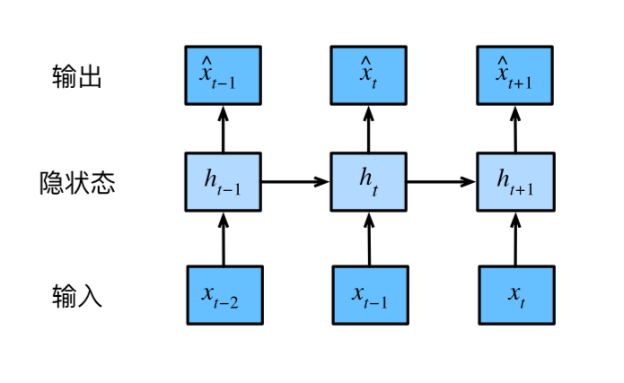
**第一步：更新记忆**

$$h_t = g(h_{t-1}, x_{t-1})$$

这个公式的意思是：
- 在 $t-1$ 时刻，我们有一个旧的记忆 $h_{t-1}$（它已经总结了 $t-1$ 时刻之前所有的过去）。
- 现在刚刚发生的事情是 $x_{t-1}$（也就是上一个时刻的具体值）。
- 我们把旧的记忆和新发生的事情，通过一个函数 $g$ 合并起来，更新为新的记忆 $h_t$。
- **新的记忆 $h_t$ 现在包含了从最开始到 $t-1$ 时刻所有数据的“摘要”**。

**第二步：用记忆做预测**

$$\hat{x}_t = P(x_t \mid h_t)$$

这个公式的意思是：
- 有了新的记忆 $h_t$，我们就用它来预测当前时刻的值 $x_t$。
- 注意：这里预测 $x_t$ 时，我们不再需要看原始的历史数据，只需要看 $h_t$。

###### 为什么叫“隐变量”？

- **“隐”**：因为 $h_t$ 是模型内部自己算出来的，你在原始数据中看不到它。它不是观测值（观测值是 $x_1, x_2, \ldots$），而是模型自己构造出来的一个内部状态。
- **“变量”**：因为它会随着时间变化而变化，是一个动态的、不断更新的向量。

###### 优点

- 可以记住很久以前的信息（因为 $h_t$ 会持续累积过去的信息，不会像固定窗口那样把老信息丢掉）。
- 不需要 $\tau$ 这个超参数。

###### 缺点

- 记忆可能“遗忘”或“扭曲”（因为 $h_t$ 是对过去信息的压缩，就像你记住的“印象”可能不完全准确）。
- 训练更复杂（因为 $h_t$ 的更新需要学习函数 $g$）。

##### 两种方法的对比总结

| 对比 | 自回归模型 | 隐变量自回归模型 |
| :--- | :--- | :--- |
| **依赖什么？** | 直接依赖过去 $\tau$ 个原始数据 $x_{t-\tau}, \ldots, x_{t-1}$ | 依赖一个“记忆状态” $h_t$ |
| **信息存储方式** | 保留原始数据，但只看最近的一段（固定窗口） | 把所有历史压缩成一段“摘要” |
| **参数数量** | 固定（由 $\tau$ 决定） | 固定（由记忆向量的大小决定） |
| **优点** | 简单直接，容易训练，容易理解 | 可以记住非常久远的信息 |
| **缺点** | 超过 $\tau$ 的老信息就完全不管了，可能丢失重要信息 | 记忆可能不准确，训练更复杂 |
| **生活中的比喻** | 手里拿着最近一周的天气预报记录来猜今天 | 老农民凭“今年整体偏旱”的印象来判断播种时机 |

#### 马尔可夫模型（一个特殊的自回归情况）

##### 定义

如果自回归模型假设 $x_t$ 只依赖于前 $\tau$ 个时间步，那么我们就说这个序列满足 **$\tau$ 阶马尔可夫条件**。

##### 一阶马尔可夫（$\tau = 1$）

这是最简单的情况：

$$P(x_t \mid x_{t-1}, x_{t-2}, \ldots, x_1) = P(x_t \mid x_{t-1})$$

这就是一阶马尔可夫假设。

##### 为什么这个公式很重要？

整个序列的联合概率 $P(x_1, x_2, \ldots, x_T)$ 可以写成所有时刻条件概率的乘积：

$$P(x_1, \ldots, x_T) = \prod_{t=1}^T P(x_t \mid x_{t-1})$$

（其中 $x_0$ 可以理解为初始状态。）

这是概率论里的“链式法则”和马尔可夫假设结合的结果。
**推导**：
在概率论中，任意两个事件 A 和 B 同时发生的概率可以写成：

$$P(A, B) = P(A \mid B) \cdot P(B)$$

这个法则可以推广到三个事件：

$$P(A, B, C) = P(A \mid B, C) \cdot P(B \mid C) \cdot P(C)$$

这就是链式法则：多个事件同时发生的概率，等于每个事件在给定前面所有事件条件下的条件概率的连乘积。

现在，假设我们有一个时间序列 $x_1, x_2, x_3, \ldots, x_T$。

根据链式法则，整个序列的联合概率可以写成：

$$P(x_1, x_2, \ldots, x_T) = P(x_T \mid x_{T-1}, x_{T-2}, \ldots, x_1) \cdots P(x_2 \mid x_1) \cdot P(x_1)$$

更紧凑地写成：

$$P(x_1, \ldots, x_T) = \prod_{t=1}^T P(x_t \mid x_{t-1}, \ldots, x_1)$$

这里每个时刻的条件概率 $P(x_t \mid x_{t-1}, \ldots, x_1)$ 都要考虑 t 时刻之前的所有历史。

核心问题：这个公式在理论上是正确的，但在计算上不可行。因为当 t 很大时，条件变量太多（t-1 个），模型参数数量会爆炸。

一阶马尔可夫假设：当前时刻 $x_t$ 只依赖于前一个时刻 $x_{t-1}$，与更早的历史无关。

数学上，这个假设写成：

$$P(x_t \mid x_{t-1}, x_{t-2}, \ldots, x_1) = P(x_t \mid x_{t-1})$$

现在我们把一阶马尔可夫假设代入链式法则：

$$P(x_1, \ldots, x_T) = P(x_1) \cdot P(x_2 \mid x_1) \cdot P(x_3 \mid x_2) \cdots P(x_T \mid x_{T-1}) = \prod_{t=1}^T P(x_t \mid x_{t-1})$$

其中 $x_0$ 可以理解为初始状态（一个常数），这样连乘可以从 $t=1$ 开始，并把 $P(x_1 \mid x_0)$ 看作初始分布。


#### 因果关系（为什么我们只向一个方向走？）

##### 核心原则

处理序列数据时，有一个非常自然的、不可违背的方向：**时间只能向前走。**这个原则叫做 **因果关系**。

##### 数学上的含义

因为因果关系是单向的（过去 → 现在 → 未来），所以我们做预测时，永远只做**正向预测**：

- 用过去的历史数据 $\{x_1, x_2, \ldots, x_{t-1}\}$ 来预测 $x_t$。
- 用现在的数据 $\{x_1, \ldots, x_t\}$ 来预测 $x_{t+1}$。

我们永远**不会**做反向预测：
- 不会用 $x_{t+1}$ 来预测 $x_t$，因为未来不能影响过去。

##### 为什么我们只做正向建模？

1. **符合物理现实**：因果律是物理学的基本法则。
2. **训练可行**：我们有过去的数据（历史数据），可以用来训练模型；未来的数据还没有发生，不可能用来训练。
3. **模型方向固定**：$x_1 \rightarrow x_2 \rightarrow x_3 \rightarrow \cdots \rightarrow x_t$，信息只能从过去流向未来。

#### 一图总结整个逻辑链

```
问题：序列太长，无法全部作为条件（变量数量随时间 t 增长）
                         │
                         ▼
            ┌────────────┴────────────┐
            │                         │
            ▼                         ▼
      【自回归模型】             【隐变量模型】
   只看最近 τ 个原始数据       用一个“记忆” h_t
    （固定窗口大小）          总结全部过去（压缩摘要）
            │                         │
            ▼                         ▼
      如果 τ = 1                 RNN 就是这种做法
     就是“一阶马尔可夫”            （后面章节会讲）
            │                         │
            └────────────┬────────────┘
                         │
                         ▼
                  因果关系方向：
              过去 → 现在 → 未来
              （我们永远只做正向预测）
```

#### 总结

> **序列太长没法算，所以有两种策略：**
>
> **① 自回归模型：只翻最近一段历史（固定窗口 $\tau$）。**
>
> **② 隐变量模型：用个“大脑记忆”把全部历史压缩成一段摘要。**
>
> **如果自回归只看最近 1 步，就叫一阶马尔可夫。**
>
> **而不管哪种方法，方向永远是从过去到未来——因为因果关系是不可逆的。**

### 8.1.3 模型训练与预测

#### 生成模拟数据

我们首先生成一些带有噪声的正弦波数据，作为我们的实验对象。

```python
# 导入绘图工具，使得 matplotlib 的图表可以直接在 notebook 中显示
%matplotlib inline

import torch
from torch import nn
from d2l import torch as d2l

# ==================== 1. 生成模拟序列数据 ====================
T = 1000  # 总共产生1000个时间点的数据

# 创建时间步序列：从1到1000，数据类型为 float32（张量）
# arange 生成 [1, 2, 3, ..., 1000] 的张量
time = torch.arange(1, T + 1, dtype=torch.float32)

# 生成带有噪声的正弦波序列
# torch.sin(0.01 * time) 生成低频正弦波（周期约为 2π/0.01 ≈ 628 步）
# torch.normal(0, 0.2, (T,)) 生成 T 个均值为0、标准差为0.2的独立高斯噪声
# 两者相加得到带有噪声的序列 x
x = torch.sin(0.01 * time) + torch.normal(0, 0.2, (T,))

# 使用 d2l 的绘图函数绘制序列
# time 作为横轴（时间），[x] 是一个列表，表示要绘制的多条曲线（这里只有一条）
# 'time' 是横轴标签，'x' 是纵轴标签
# xlim=[1, 1000] 设置横轴显示范围从1到1000
# figsize=(6, 3) 设置图像尺寸为宽6英寸、高3英寸
d2l.plot(time, [x], 'time', 'x', xlim=[1, 1000], figsize=(6, 3))
```

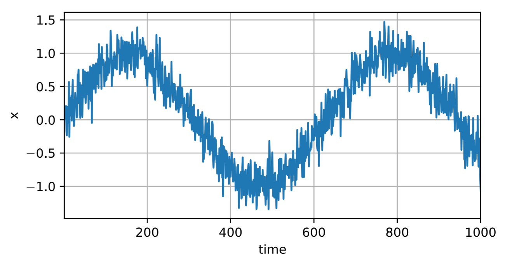

#### 构造特征-标签对

为了让模型学习序列，我们需要将序列转换为监督学习中的"特征-标签"对。我们选择 `tau = 4`，即用过去4个时间步的数据来预测下一个时间步。

```python
# ==================== 2. 构造特征-标签对 ====================
tau = 4  # 嵌入维度，即用过去多少个时间步来预测下一个值（超参数）

# 初始化特征矩阵，形状为 (T - tau, tau)
# 总共有 T - tau 个样本，每个样本有 tau 个特征
features = torch.zeros((T - tau, tau))

# 循环填充特征矩阵的每一列
# 第 i 列对应的是 x 从索引 i 开始、长度为 T - tau 的切片
# 通俗理解：features[t] 包含了 x[t], x[t+1], ..., x[t+tau-1]
for i in range(tau):
    # x[i: T - tau + i] 的切片长度为 T - tau
    # 例如 i=0: x[0:T-tau] -> 对应 x[0], x[1], ..., x[T-tau-1]
    # 例如 i=3: x[3:T-tau+3] -> 对应 x[3], x[4], ..., x[T-1]
    features[:, i] = x[i: T - tau + i]

# 标签是 tau 个时间步之后的值，即 x[tau: T]
# reshape(-1, 1) 将其变为列向量（T-tau 行，1列）
labels = x[tau:].reshape((-1, 1))

# ==================== 3. 划分训练集和加载数据 ====================
batch_size, n_train = 16, 600  # 批次大小16，训练样本数600

# 使用 d2l 的 load_array 函数创建 DataLoader
# features[:n_train] 取前600个样本作为训练集特征
# labels[:n_train] 取前600个样本作为训练集标签
# batch_size 指定每批数据大小
# is_train=True 表示训练模式，会在每个 epoch 开始时打乱数据
train_iter = d2l.load_array((features[:n_train], labels[:n_train]),
                            batch_size, is_train=True)
```

#### 训练模型

我们使用一个简单的多层感知机（MLP）作为模型，其输入是长度为4的特征向量。

```python
# ==================== 4. 定义模型 ====================
def init_weights(m):
    """初始化网络权重的函数（Xavier初始化）"""
    # 如果当前模块 m 是全连接层（Linear层）
    if type(m) == nn.Linear:
        # 使用 Xavier 均匀分布初始化权重
        # 这种初始化方法可以保持各层梯度的方差一致，有助于训练稳定
        nn.init.xavier_uniform_(m.weight)

def get_net():
    """创建一个简单的多层感知机（MLP）"""
    # nn.Sequential 是一个顺序容器，其中的模块会按添加顺序依次执行
    net = nn.Sequential(
        # 第一层：全连接层，输入维度4（tau的值），输出维度10（隐藏单元数）
        nn.Linear(4, 10),
        # 激活函数：ReLU（修正线性单元），引入非线性
        nn.ReLU(),
        # 第二层：全连接层，输入维度10（上一层的输出），输出维度1（预测值）
        nn.Linear(10, 1)
    )
    # apply 方法会递归地遍历 net 中的所有子模块，对每个子模块调用 init_weights
    # 这样所有 Linear 层的权重都会被 Xavier 初始化
    net.apply(init_weights)
    return net

# 损失函数：均方误差损失（MSE Loss）
# reduction='none' 表示返回每个样本的损失值（不求和也不平均）
# 注意：PyTorch 的 MSELoss 默认不除以2，即 loss = (y_pred - y)^2
loss = nn.MSELoss(reduction='none')

# ==================== 5. 训练模型 ====================
def train(net, train_iter, loss, epochs, lr):
    """
    训练模型的通用函数
    Args:
        net: 神经网络模型
        train_iter: 训练数据迭代器
        loss: 损失函数
        epochs: 训练轮数
        lr: 学习率
    """
    # 使用 Adam 优化器，它是一种自适应学习率的优化算法
    # net.parameters() 返回模型中所有可训练参数（权重和偏置）
    trainer = torch.optim.Adam(net.parameters(), lr)
    
    # 迭代训练 epochs 轮
    for epoch in range(epochs):
        # 从 train_iter 中取出每一批数据 (X, y)
        for X, y in train_iter:
            # 清空上一批次的梯度（如果不清零，梯度会累积）
            trainer.zero_grad()
            # 前向传播：计算模型预测值
            l = loss(net(X), y)
            # 反向传播：计算梯度
            # 先对损失求和（因为 loss 返回的是每个样本的损失），再调用 backward()
            l.sum().backward()
            # 更新模型参数：根据梯度执行一步优化
            trainer.step()
        # 每轮结束后，打印当前损失
        # d2l.evaluate_loss 会在整个训练集上计算平均损失
        print(f'epoch {epoch + 1}, '
              f'loss: {d2l.evaluate_loss(net, train_iter, loss):f}')

# 实例化模型
net = get_net()
# 开始训练：训练5轮，学习率0.01
train(net, train_iter, loss, 5, 0.01)
```
输出：
```
epoch 1, loss: 0.063133
epoch 2, loss: 0.053832
epoch 3, loss: 0.051174
epoch 4, loss: 0.050547
epoch 5, loss: 0.047369
```

#### 单步预测 (1-step-ahead prediction)

单步预测是指用真实的过去数据来预测下一个时间步。由于训练损失很小，模型在单步预测上表现良好。

```python
# ==================== 6. 单步预测 ====================
# 对整个特征集进行预测（包含训练集和测试集的所有样本）
# features 的形状是 (T - tau, tau)，即 (996, 4)
# net(features) 输出形状为 (996, 1)
onestep_preds = net(features)

# 绘图比较真实数据和单步预测结果
d2l.plot([time, time[tau:]],
         [x.detach().numpy(), onestep_preds.detach().numpy()], 'time',
         'x', legend=['data', '1-step preds'], xlim=[1, 1000],
         figsize=(6, 3))
```

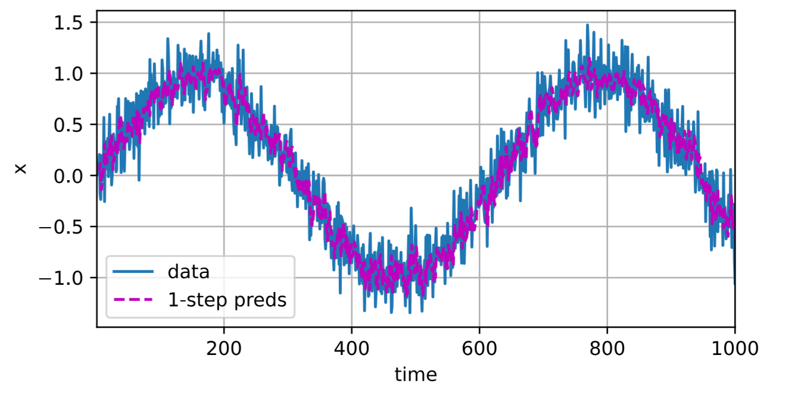

#### 多步预测 (k-step-ahead prediction)

多步预测是指用模型自己的预测结果来预测更远的未来。例如，预测 $x_{605}$ 时，我们使用 $x_{601}$ 到 $x_{604}$ 的真实值；但预测 $x_{606}$ 时，由于 $x_{605}$ 是未知的，我们不得不使用模型预测的 $\hat{x}_{605}$。误差会随着预测步数的增加而快速累积。

```python
# ==================== 7. 多步预测 ====================
# 初始化一个全零张量，长度为 T（1000）
multistep_preds = torch.zeros(T)

# 将前 n_train + tau 个时间步的真实值填入
# 即用真实的观测值作为初始的"上下文"，用于启动多步预测
multistep_preds[: n_train + tau] = x[: n_train + tau]

# 从 n_train + tau 开始，逐个预测后续的值
for i in range(n_train + tau, T):
    # 取出最近 tau 个预测值（或真实值）作为输入
    # multistep_preds[i - tau:i] 长度为 tau
    # .reshape((1, -1)) 将形状变为 (1, tau)，因为模型要求输入是 (batch_size, features)
    # 将输入传入模型得到预测值，并存储到 multistep_preds[i]
    multistep_preds[i] = net(
        multistep_preds[i - tau:i].reshape((1, -1)))

# 绘图比较：
# 1. 真实数据（蓝色）
# 2. 单步预测（紫色）
# 3. 多步预测（绿色）
# time[n_train + tau:] 是横轴，从训练集末尾开始
# multistep_preds[n_train + tau:] 是对应的多步预测值
d2l.plot([time, time[tau:], time[n_train + tau:]],
         [x.detach().numpy(), onestep_preds.detach().numpy(),
          multistep_preds[n_train + tau:].detach().numpy()], 'time',
         'x', legend=['data', '1-step preds', 'multistep preds'],
         xlim=[1, 1000], figsize=(6, 3))
```

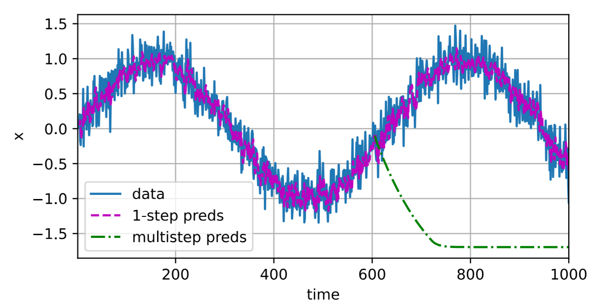

可以看到，多步预测（绿色曲线）很快崩溃，趋于一个常数。这表明多步预测的难度远大于单步预测，误差的指数级累积是其根本原因。

### 8.1.4 不同步数的预测效果

为了更直观地观察误差累积，我们比较了 `k = 1, 4, 16, 64` 步预测的效果。 `k` 越大，预测结果越差，很快就变成了无意义的抖动。

```python
# ==================== 8. 比较不同步数的预测效果 ====================
max_steps = 64  # 最多预测64步

# 创建一个特征矩阵，用于存储不同步数的预测结果
# 形状为 (T - tau - max_steps + 1, tau + max_steps)
# 行数：可用的样本数（从 tau 开始，到 T - max_steps 结束）
# 列数：前 tau 列是真实观测值，后 max_steps 列是对应的多步预测值
features = torch.zeros((T - tau - max_steps + 1, tau + max_steps))

# ---- 前 tau 列：填充真实观测值 ----
# 列 i（i < tau）存储 x 的切片，时间步从 i 到 i + T - tau - max_steps
for i in range(tau):
    features[:, i] = x[i: i + T - tau - max_steps + 1]

# ---- 后 max_steps 列：填充多步预测值 ----
# 列 i（i >= tau）存储第 (i - tau + 1) 步预测值
# 例如：i = tau 时，是第1步预测；i = tau + 3 时，是第4步预测
for i in range(tau, tau + max_steps):
    # 用模型预测：输入是最近 tau 列的值
    # features[:, i - tau:i] 形状为 (batch_size, tau)
    # 逐行预测，reshape(-1, 1) 将输出形状从 (batch_size, 1) 变为一维
    features[:, i] = net(features[:, i - tau:i]).reshape(-1)

# 定义要展示的步数
steps = (1, 4, 16, 64)

# 绘图展示不同步数的预测效果
# [time[tau + i - 1: T - max_steps + i] for i in steps]：每个步数对应的横轴范围
# [features[:, tau + i - 1].detach().numpy() for i in steps]：每个步数对应的预测值
d2l.plot([time[tau + i - 1: T - max_steps + i] for i in steps],
         [features[:, tau + i - 1].detach().numpy() for i in steps], 
         'time', 'x',
         legend=[f'{i}-step preds' for i in steps], 
         xlim=[5, 1000],
         figsize=(6, 3))
```

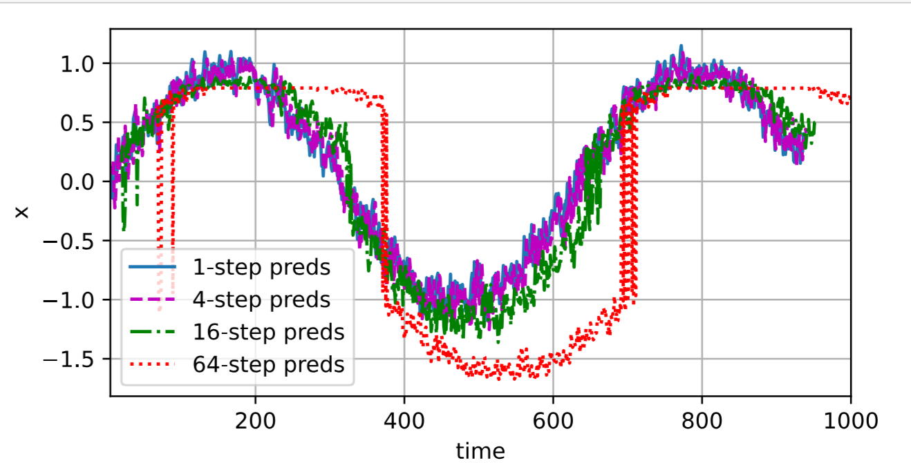

### 8.1.5 小结

1.  **内插 vs. 外推**：在现有观测值之间进行估计（内插法）远比预测未知的未来（外推法）要容易得多。训练序列模型时，必须遵循时间顺序，严禁使用未来的数据训练模型。
2.  **序列模型**：处理序列数据需要专门的统计工具，**自回归模型**和**隐变量自回归模型**是两种主流方法。
3.  **因果模型**：由于时间单向流动的特性，用过去预测未来（正向估计）比反向估计更合理。
4.  **多步预测**：随着预测步数 $k$ 的增加，预测误差会快速累积，导致模型性能急剧下降。这是序列预测中的一个核心挑战。


## 8.2 文本预处理

文本是序列数据最常见的形式之一。与股票价格或正弦波等数值序列不同，文本数据由离散的符号（字符、单词）组成，需要经过特定的预处理步骤才能被深度学习模型理解。本节将介绍文本预处理的核心流程。

### 8.2.1 文本预处理的核心步骤

文本预处理通常包括以下四个步骤：

1. **加载文本**：将原始文本作为字符串读入内存
2. **词元化**：将字符串拆分为基本单元（词元）
3. **构建词表**：将词元映射为数字索引
4. **转换为索引序列**：将文本转换为模型可处理的数字序列

### 8.2.2 读取数据集

首先，从H.G. Wells的《时光机器》中加载文本作为示例数据集。

```python
# 导入所需库
import collections      # 提供计数器 Counter，用于统计词频
import re               # 正则表达式，用于文本清洗
from d2l import torch as d2l  # 动手学深度学习工具包

# ==================== 1. 加载数据集 ====================
# 注册数据集到 d2l 的数据中心
# DATA_HUB 是 d2l 内置的数据集注册表，存储数据集名称、URL 和校验哈希值
d2l.DATA_HUB['time_machine'] = (d2l.DATA_URL + 'timemachine.txt',
                                '090b5e7e70c295757f55df93cb0a180b9691891a')

def read_time_machine():
    """
    将《时光机器》数据集加载到文本行列表中
    
    Returns:
        lines (list of str): 每行文本作为一个字符串元素
    
    处理流程:
        1. d2l.download('time_machine') 从 DATA_HUB 获取文件路径，若本地不存在则自动下载
        2. 以只读模式打开文件，读取所有行
        3. 对每一行进行清洗：
           - re.sub('[^A-Za-z]+', ' ', line): 将所有非字母字符替换为空格
           - .strip(): 去除首尾空白字符
           - .lower(): 将所有字母转为小写
    """
    with open(d2l.download('time_machine'), 'r') as f:
        lines = f.readlines()
    # 正则表达式：保留字母，将其他所有字符（数字、标点、特殊符号等）替换为空格
    # strip() 去掉首尾空格，lower() 统一转为小写
    return [re.sub('[^A-Za-z]+', ' ', line).strip().lower() for line in lines]

# 加载数据
lines = read_time_machine()
print(f'# 文本总行数: {len(lines)}')  # 输出: 3221 行
print(lines[0])   # 第一行: "the time machine by h g wells"
print(lines[10])  # 第11行: "twinkled and his usually pale face was flushed and animated the"
```

### 8.2.3 词元化

词元化（Tokenization）是将文本拆分为基本单元的过程。最基本的词元类型有：

- **单词级词元化**：按空格或标点分割，每个单词是一个词元
- **字符级词元化**：每个字符是一个词元

```python
# ==================== 2. 词元化 ====================
def tokenize(lines, token='word'):
    """
    将文本行拆分为单词或字符词元
    
    Args:
        lines (list of str): 文本行列表
        token (str): 词元类型，'word' 或 'char'
    
    Returns:
        list of list of str: 每个元素是一个词元列表
    
    工作原理:
        - 'word' 模式: line.split() 按空白字符分割，将每个单词作为一个独立元素
        - 'char' 模式: list(line) 将字符串拆分为单个字符列表
    """
    if token == 'word':
        # split() 默认按任意空白字符（空格、换行、制表符等）分割
        return [line.split() for line in lines]
    elif token == 'char':
        # list() 将字符串拆分为字符列表，如 "hello" -> ['h','e','l','l','o']
        return [list(line) for line in lines]
    else:
        print('错误：未知词元类型：' + token)

# 对文本行进行词元化（按单词分割）
tokens = tokenize(lines)
# 打印前11行的词元化结果
for i in range(11):
    print(tokens[i])
```

输出示例：
```
['the', 'time', 'machine', 'by', 'h', 'g', 'wells']
[]
[]
[]
[]
['i']
[]
[]
['the', 'time', 'traveller', 'for', 'so', 'it', 'will', 'be', 'convenient', 'to', 'speak', 'of', 'him']
['was', 'expounding', 'a', 'recondite', 'matter', 'to', 'us', 'his', 'grey', 'eyes', 'shone', 'and']
['twinkled', 'and', 'his', 'usually', 'pale', 'face', 'was', 'flushed', 'and', 'animated', 'the']
```

### 8.2.4 构建词表

词表（Vocabulary）的核心功能是**建立词元到数字索引的双向映射**。

```python
# ==================== 3. 构建词表 ====================
class Vocab:
    """
    文本词表：实现词元与数字索引之间的双向映射
    
    核心数据结构:
        - idx_to_token (list): 索引 -> 词元的映射，索引即列表下标
        - token_to_idx (dict): 词元 -> 索引的映射，用于快速查找
    
    特殊词元:
        - '<unk>': 未知词元，索引为0，用于处理词表中不存在的词
        - reserved_tokens: 其他保留词元，如 '<pad>'（填充）、'<bos>'（开始）、'<eos>'（结束）
    """
    def __init__(self, tokens=None, min_freq=0, reserved_tokens=None):
        """
        初始化词表
        
        Args:
            tokens: 词元列表（可以是1D或2D列表）
            min_freq: 最小词频阈值，低于该频率的词元会被过滤掉
            reserved_tokens: 保留的特殊词元列表（如填充、开始、结束标记）
        """
        if tokens is None:
            tokens = []
        if reserved_tokens is None:
            reserved_tokens = []
        
        # ---- 1. 统计词频 ----
        # count_corpus 统计所有词元的出现频率，返回 Counter 对象
        counter = count_corpus(tokens)
        # 按出现频率从高到低排序，得到 [(词元, 频率), ...]
        self._token_freqs = sorted(counter.items(), key=lambda x: x[1], reverse=True)
        
        # ---- 2. 初始化索引映射 ----
        # 未知词元 '<unk>' 固定在索引0
        self.idx_to_token = ['<unk>'] + reserved_tokens
        # 构建反向映射：词元 -> 索引
        self.token_to_idx = {token: idx for idx, token in enumerate(self.idx_to_token)}
        
        # ---- 3. 添加高频词元 ----
        # 遍历按频率排序的词元列表
        for token, freq in self._token_freqs:
            # 如果词频低于阈值，停止添加（因为后续词频更低）
            if freq < min_freq:
                break
            # 避免重复添加（如保留词元已存在）
            if token not in self.token_to_idx:
                self.idx_to_token.append(token)
                self.token_to_idx[token] = len(self.idx_to_token) - 1
    
    def __len__(self):
        """返回词表大小"""
        return len(self.idx_to_token)
    
    def __getitem__(self, tokens):
        """
        将词元转换为索引
        
        Args:
            tokens: 单个词元（str）或词元列表（list/tuple）
        
        Returns:
            单个索引或索引列表
        """
        # 如果是单个词元（不是列表或元组）
        if not isinstance(tokens, (list, tuple)):
            # get() 方法：若词元不存在，返回 self.unk（即0）
            return self.token_to_idx.get(tokens, self.unk)
        # 如果是列表，递归调用自身处理每个词元
        return [self.__getitem__(token) for token in tokens]
    
    def to_tokens(self, indices):
        """
        将索引转换回词元（反向转换）
        
        Args:
            indices: 单个索引（int）或索引列表
        
        Returns:
            单个词元或词元列表
        """
        if not isinstance(indices, (list, tuple)):
            return self.idx_to_token[indices]
        return [self.idx_to_token[index] for index in indices]
    
    @property
    def unk(self):
        """未知词元的索引固定为0"""
        return 0
    
    @property
    def token_freqs(self):
        """返回词频统计结果"""
        return self._token_freqs

def count_corpus(tokens):
    """
    统计词元的频率
    
    Args:
        tokens: 1D词元列表 或 2D词元列表（每行是一个词元列表）
    
    Returns:
        collections.Counter: 词元到频率的映射
    """
    # 如果 tokens 是空的，直接返回空 Counter
    if len(tokens) == 0:
        return collections.Counter()
    # 检查第一个元素：如果是列表，说明是2D列表，需要展平
    if isinstance(tokens[0], list):
        # 列表推导式：遍历每个 line，再遍历其中的每个 token
        # 相当于将所有子列表的元素合并到一个列表中
        tokens = [token for line in tokens for token in line]
    # collections.Counter 自动统计每个元素的出现次数
    return collections.Counter(tokens)
```

#### 构建并使用词表

```python
# ==================== 4. 构建词表示例 ====================
# 使用之前词元化得到的结果 tokens 构建词表
# min_freq=0 表示保留所有词（包括只出现1次的词）
vocab = Vocab(tokens)

# 打印前10个词元及其索引
# 注意：<unk> 占据索引0，'the'是高频词排在索引1
print(list(vocab.token_to_idx.items())[:10])
# 输出：
# [('<unk>', 0), ('the', 1), ('i', 2), ('and', 3), ('of', 4), ('a', 5), ('to', 6), ('was', 7), ('in', 8), ('that', 9)]
```

#### 文本转索引序列

```python
# ==================== 5. 文本转数字索引 ====================
for i in [0, 10]:
    print('文本:', tokens[i])
    # vocab[tokens[i]] 将词元列表转换为索引列表
    # 这里调用了 Vocab.__getitem__ 方法
    print('索引:', vocab[tokens[i]])
# 输出：
# 文本: ['the', 'time', 'machine', 'by', 'h', 'g', 'wells']
# 索引: [1, 19, 50, 40, 2183, 2184, 400]
# 文本: ['twinkled', 'and', 'his', 'usually', 'pale', 'face', 'was', 'flushed', 'and', 'animated', 'the']
# 索引: [2186, 3, 25, 1044, 362, 113, 7, 1421, 3, 1045, 1]
```

### 8.2.5 整合所有功能

将所有预处理步骤打包成一个统一的函数，供后续章节使用。

```python
# ==================== 6. 整合预处理流程 ====================
def load_corpus_time_machine(max_tokens=-1):
    """
    返回时光机器数据集的词元索引列表和词表
    
    Args:
        max_tokens (int): 限制返回的词元数量，-1表示全部返回
    
    Returns:
        corpus (list of int): 所有词元的索引列表（展平为一维）
        vocab (Vocab): 词表对象
    
    注意:
        1. 这里使用字符级词元化（'char'），而非单词级
           原因：字符级词表更小（约28个字符），便于后续章节的演示
        2. 所有文本行被展平为一个列表，而非保留行结构
           原因：时光机器数据集的每一行不一定是完整句子
    """
    # 1. 加载原始文本行
    lines = read_time_machine()
    
    # 2. 字符级词元化
    # 例如: "hello" -> ['h', 'e', 'l', 'l', 'o']
    tokens = tokenize(lines, 'char')
    
    # 3. 构建词表（字符级，所以词表很小）
    vocab = Vocab(tokens)
    
    # 4. 将所有文本展平为一个索引列表
    # 两层循环: 遍历每一行(line) -> 遍历每个字符(token)
    corpus = [vocab[token] for line in tokens for token in line]
    
    # 5. 限制词元数量（可选）
    if max_tokens > 0:
        corpus = corpus[:max_tokens]
    
    return corpus, vocab

# 加载完整的时光机器数据集
corpus, vocab = load_corpus_time_machine()
print(len(corpus), len(vocab))  # 输出: (170580, 28)
# 输出：(170580, 28)
```

### 8.2.6 关键数据结构总结

| 数据结构 | 类型 | 作用 | 示例 |
|---------|------|------|------|
| `lines` | `list of str` | 原始文本行 | `["the time machine", ...]` |
| `tokens` | `list of list of str` | 词元化后的文本 | `[["the", "time"], ...]` |
| `counter` | `collections.Counter` | 词频统计 | `{"the": 100, "and": 80}` |
| `Vocab.idx_to_token` | `list` | 索引→词元 | `["<unk>", "the", "i", ...]` |
| `Vocab.token_to_idx` | `dict` | 词元→索引 | `{"<unk>": 0, "the": 1}` |
| `corpus` | `list of int` | 数字索引序列 | `[1, 19, 50, ...]` |

### 8.2.7 小结

| 要点 | 说明 |
|------|------|
| **文本预处理流程** | 加载 → 词元化 → 建词表 → 转索引 |
| **词元化方式** | 单词级（`split()`）和字符级（`list()`）是两种基本方式 |
| **词表核心** | `idx_to_token`（索引→词元）和 `token_to_idx`（词元→索引）双向映射 |
| **特殊词元** | `<unk>` 处理未知词，索引固定为0 |
| **频率过滤** | `min_freq` 参数可过滤低频词，减小词表大小 |
| **展平操作** | 2D词元列表 → 1D索引列表（`[token for line in tokens for token in line]`） |

## 8.3 语言模型与数据集


语言模型（Language Model）是自然语言处理（NLP）的核心任务之一。它的目标是估计一个文本序列的联合概率分布，即对于词元序列 $x_1, x_2, \ldots, x_T$，计算：

$$P(x_1, x_2, \ldots, x_T) = \prod_{t=1}^T P(x_t \mid x_1, \ldots, x_{t-1})$$

一个理想的语言模型能够基于前面的上下文生成自然、连贯且有意义的文本。

### 8.3.1 语言模型的核心概念

#### 语言模型的作用

| 应用场景 | 说明 | 示例 |
|---------|------|------|
| **语音识别** | 解决同音词歧义 | "to recognize speech" vs "to wreck a nice beach" |
| **文本生成** | 根据上下文生成后续文本 | 对话系统、文章续写 |
| **机器翻译** | 选择最自然的翻译结果 | 考虑目标语言的语法和习惯 |
| **拼写纠错** | 识别并纠正错误拼写 | "我想吃奶奶" vs "我想吃，奶奶" |

#### 概率计算的挑战

**核心问题**：对于长序列，$P(x_t \mid x_1, \ldots, x_{t-1})$ 的估计极其困难，因为：

1. 随着序列长度增加，条件概率的维度指数增长
2. 大部分长序列组合在训练数据中从未出现
3. 数据稀疏性问题严重

**传统解决方案**：拉普拉斯平滑（Laplace Smoothing）

$$\hat{P}(x) = \frac{n(x) + \epsilon_1/m}{n + \epsilon_1}$$

$$\hat{P}(x' \mid x) = \frac{n(x, x') + \epsilon_2 \hat{P}(x')}{n(x) + \epsilon_2}$$

其中 $n$ 是训练集总词数，$m$ 是唯一词数，$\epsilon_1, \epsilon_2$ 是平滑超参数。

### 8.3.2 $n$ 元语法（n-gram）

$n$ 元语法通过**马尔可夫假设**简化语言模型：一个词只依赖于前面有限个词。

#### 不同阶数模型对比

| 模型 | 依赖关系 | 公式 | 特点 |
|------|---------|------|------|
| **一元语法 (Unigram)** | 无依赖 | $P(x_1, x_2, x_3, x_4) = P(x_1)P(x_2)P(x_3)P(x_4)$ | 完全忽略上下文，最简单 |
| **二元语法 (Bigram)** | 依赖前1个词 | $P(x_1, x_2, x_3, x_4) = P(x_1)P(x_2\mid x_1)P(x_3\mid x_2)P(x_4\mid x_3)$ | 只考虑相邻词关系 |
| **三元语法 (Trigram)** | 依赖前2个词 | $P(x_1, x_2, x_3, x_4) = P(x_1)P(x_2\mid x_1)P(x_3\mid x_1,x_2)P(x_4\mid x_2,x_3)$ | 考虑更长的上下文 |

### 8.3.3 自然语言统计规律

#### 词频统计与齐普夫定律

```python
# ==================== 1. 导入必要的库 ====================
import random
import torch
from d2l import torch as d2l

# ==================== 2. 加载并预处理数据 ====================
# 读取时光机器数据集并进行词元化（单词级别）
# d2l.read_time_machine() 返回文本行列表
# d2l.tokenize() 将每行按空格分割成单词列表
tokens = d2l.tokenize(d2l.read_time_machine())

# 将所有文本行拼接成一个一维列表
# 列表推导式：遍历每一行(line)，再遍历行中的每个单词(token)
corpus = [token for line in tokens for token in line]

# 构建词表
# d2l.Vocab 是上一节定义的词表类，自动统计词频并建立索引映射
vocab = d2l.Vocab(corpus)

# 打印前10个最常用词及其频率
# vocab.token_freqs 是按频率降序排列的 [(词, 频率), ...]
vocab.token_freqs[:10]
```

输出：
```
[('the', 2261), ('i', 1267), ('and', 1245), ('of', 1155), ('a', 816), 
 ('to', 695), ('was', 552), ('in', 541), ('that', 443), ('my', 440)]
```

**观察**：前10个高频词都是停用词（stop words），如 "the", "i", "and" 等。

#### 词频分布可视化

```python
# ==================== 3. 绘制词频分布图 ====================
# 提取所有词的频率（不关心具体是什么词）
freqs = [freq for token, freq in vocab.token_freqs]

# 在双对数坐标下绘制词频分布
# xscale='log', yscale='log' 将横纵轴都设为对数刻度
# 这样可以将幂律分布（齐普夫定律）显示为一条直线
d2l.plot(freqs, xlabel='token: x', ylabel='frequency: n(x)',
         xscale='log', yscale='log')
```

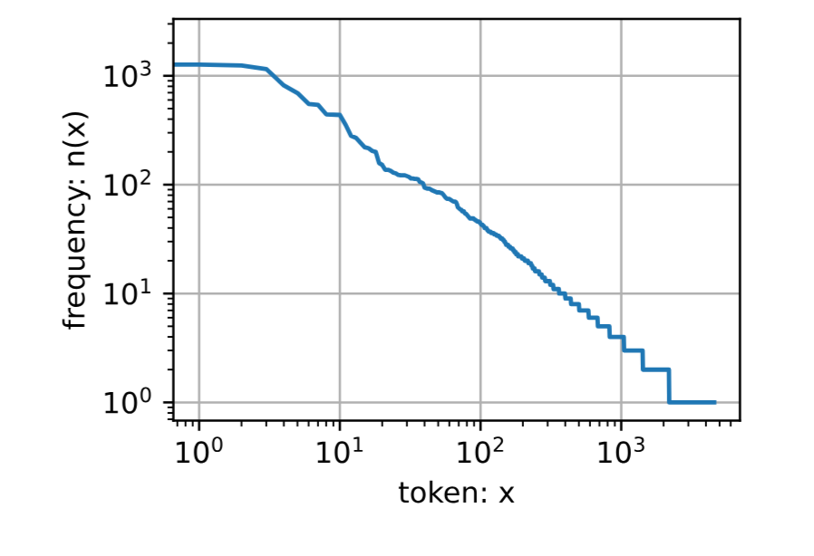

**齐普夫定律（Zipf's Law）**：第 $i$ 个最常用词的频率 $n_i$ 满足：

$$n_i \propto \frac{1}{i^\alpha} \quad \Leftrightarrow \quad \log n_i = -\alpha \log i + c$$

其中 $\alpha$ 是分布指数，$c$ 是常数。这意味着词频在双对数坐标下呈线性关系。

#### 不同 n-gram 的频率对比

```python
# ==================== 4. 构造二元语法和三元语法 ====================
# ---- 二元语法 (Bigram) ----
# zip(corpus[:-1], corpus[1:]) 将相邻的两个词配对
# 例如: [a, b, c] -> [(a,b), (b,c)]
# [:-1]会去除最后一个元素，[1:]会去除第一个元素
bigram_tokens = [pair for pair in zip(corpus[:-1], corpus[1:])]
bigram_vocab = d2l.Vocab(bigram_tokens)
print(bigram_vocab.token_freqs[:10])
```

输出：
```
[(('of', 'the'), 309), (('in', 'the'), 169), (('i', 'had'), 130), 
 (('i', 'was'), 112), (('and', 'the'), 109), (('the', 'time'), 102), 
 (('it', 'was'), 99), (('to', 'the'), 85), (('as', 'i'), 78), (('of', 'a'), 73)]
```

```python
# ---- 三元语法 (Trigram) ----
# zip(corpus[:-2], corpus[1:-1], corpus[2:]) 将相邻的三个词配对
trigram_tokens = [triple for triple in zip(corpus[:-2], corpus[1:-1], corpus[2:])]
trigram_vocab = d2l.Vocab(trigram_tokens)
print(trigram_vocab.token_freqs[:10])
```

输出：
```
[(('the', 'time', 'traveller'), 59), (('the', 'time', 'machine'), 30), 
 (('the', 'medical', 'man'), 24), (('it', 'seemed', 'to'), 16), 
 (('it', 'was', 'a'), 15), (('here', 'and', 'there'), 15), 
 (('seemed', 'to', 'me'), 14), (('i', 'did', 'not'), 14), 
 (('i', 'saw', 'the'), 13), (('i', 'began', 'to'), 13)]
```

#### 三种模型频率对比图

```python
# ==================== 5. 对比一元、二元、三元语法 ====================
# 提取三种模型的频率列表
bigram_freqs = [freq for token, freq in bigram_vocab.token_freqs]
trigram_freqs = [freq for token, freq in trigram_vocab.token_freqs]

# 在同一张图上绘制三种模型的词频分布
# 一元语法：蓝色实线；二元语法：紫色虚线；三元语法：绿色点划线
d2l.plot([freqs, bigram_freqs, trigram_freqs], xlabel='token: x',
         ylabel='frequency: n(x)', xscale='log', yscale='log',
         legend=['unigram', 'bigram', 'trigram'])
```

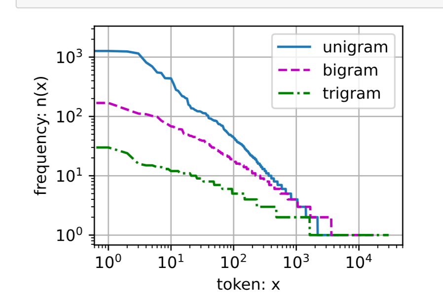

**关键观察**：
1. 所有 n-gram 都大致遵循齐普夫定律（双对数坐标下呈线性）
2. 随着 n 增大，指数 $\alpha$ 减小（曲线更平缓）
3. 高频 n-gram 数量有限，大部分 n-gram 出现频率很低
4. 拉普拉斯平滑对低频 n-gram 效果很差

### 8.3.4 读取长序列数据

由于序列可能很长（如整本书），无法一次性输入模型，需要将其划分为小批量子序列。

#### 序列划分策略

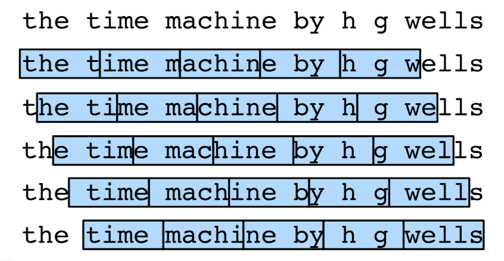

两种主要策略：

| 策略 | 原理 | 优点 | 缺点 |
|------|------|------|------|
| **随机采样** | 从随机位置开始截取子序列 | 覆盖全面，多样性好 | 相邻批次不连续 |
| **顺序分区** | 保持子序列的原始顺序 | 保留序列连续性 | 覆盖范围有限 |

#### 随机采样实现

```python
def seq_data_iter_random(corpus, batch_size, num_steps):
    """
    使用随机抽样生成一个小批量子序列
    
    Args:
        corpus: 整个语料库的索引列表（一维）
        batch_size: 每个批次的样本数
        num_steps: 每个子序列的时间步数
    
    Returns:
        生成器，每次迭代返回 (X, Y)
        X: 输入序列，形状 (batch_size, num_steps)
        Y: 标签序列（X 向后偏移一位），形状 (batch_size, num_steps)
    
    工作原理:
        1. 随机选择一个起始偏移量（0 到 num_steps-1）
        2. 从偏移量开始，将序列分割成多个长度为 num_steps 的子序列
        3. 随机打乱子序列的顺序
        4. 将子序列分组为 batch，每个 batch 包含 batch_size 个子序列
        5. 对每个子序列，标签 = 输入向后移一位（预测下一个词元）
    """
    # 从随机偏移量开始，确保每次迭代的起始位置不同
    # 这样可以增加数据的多样性
    corpus = corpus[random.randint(0, num_steps - 1):]
    
    # 计算可以分割出的子序列数量
    # 减1是因为标签需要向后偏移一位
    num_subseqs = (len(corpus) - 1) // num_steps
    
    # 生成所有子序列的起始索引
    # 例如: num_steps=5, 起始索引为 0, 5, 10, 15, ...
    initial_indices = list(range(0, num_subseqs * num_steps, num_steps))
    
    # 随机打乱起始索引，使得批次之间不连续
    random.shuffle(initial_indices)
    
    def data(pos):
        """返回从 pos 开始的长度为 num_steps 的子序列"""
        return corpus[pos: pos + num_steps]
    
    # 计算批次数量
    num_batches = num_subseqs // batch_size
    
    # 迭代生成每个批次
    for i in range(0, batch_size * num_batches, batch_size):
        # 取出当前批次对应的起始索引
        initial_indices_per_batch = initial_indices[i: i + batch_size]
        # X: 输入子序列
        X = [data(j) for j in initial_indices_per_batch]
        # Y: 标签子序列（向后移一位）
        Y = [data(j + 1) for j in initial_indices_per_batch]
        yield torch.tensor(X), torch.tensor(Y)
```

**示例演示**：

```python
# 生成测试序列 0 到 34
my_seq = list(range(35))

# 随机采样：batch_size=2, num_steps=5
for X, Y in seq_data_iter_random(my_seq, batch_size=2, num_steps=5):
    print('X: ', X, '\nY:', Y)
```

输出示例：
```
X:  tensor([[27, 28, 29, 30, 31],
        [ 2,  3,  4,  5,  6]]) 
Y: tensor([[28, 29, 30, 31, 32],
        [ 3,  4,  5,  6,  7]])
X:  tensor([[17, 18, 19, 20, 21],
        [ 7,  8,  9, 10, 11]]) 
Y: tensor([[18, 19, 20, 21, 22],
        [ 8,  9, 10, 11, 12]])
```

**注意**：相邻批次之间没有连续性，例如第一个批次的序列从27和2开始，第二个批次从17和7开始。

#### 顺序分区实现

```python
def seq_data_iter_sequential(corpus, batch_size, num_steps):
    """
    使用顺序分区生成一个小批量子序列
    
    Args:
        corpus: 整个语料库的索引列表
        batch_size: 批次大小
        num_steps: 每个子序列的时间步数
    
    Returns:
        生成器，每次迭代返回 (X, Y)
    
    工作原理:
        1. 随机选择一个偏移量
        2. 将序列重新排列为 (batch_size, -1) 的形状
        3. 按列切分，每列 num_steps 个时间步
        4. 相邻批次在原始序列上是连续的
    """
    # 随机偏移，增加数据多样性
    offset = random.randint(0, num_steps)
    
    # 计算可用词元数（保证能完整填充 batch_size 行）
    num_tokens = ((len(corpus) - offset - 1) // batch_size) * batch_size
    
    # 将一维序列转为二维矩阵: (batch_size, num_tokens // batch_size)
    # 每一行是一个独立的样本序列
    Xs = torch.tensor(corpus[offset: offset + num_tokens])
    Ys = torch.tensor(corpus[offset + 1: offset + 1 + num_tokens])
    Xs, Ys = Xs.reshape(batch_size, -1), Ys.reshape(batch_size, -1)
    
    # 计算可以分割的批次数量
    num_batches = Xs.shape[1] // num_steps
    
    # 按列切分，每列长度为 num_steps
    for i in range(0, num_steps * num_batches, num_steps):
        X = Xs[:, i: i + num_steps]
        Y = Ys[:, i: i + num_steps]
        yield X, Y
```

**示例演示**：

```python
for X, Y in seq_data_iter_sequential(my_seq, batch_size=2, num_steps=5):
    print('X: ', X, '\nY:', Y)
```

输出：
```
X:  tensor([[ 2,  3,  4,  5,  6],
        [18, 19, 20, 21, 22]]) 
Y: tensor([[ 3,  4,  5,  6,  7],
        [19, 20, 21, 22, 23]])
X:  tensor([[ 7,  8,  9, 10, 11],
        [23, 24, 25, 26, 27]]) 
Y: tensor([[ 8,  9, 10, 11, 12],
        [24, 25, 26, 27, 28]])
```

**注意**：相邻批次在原始序列上是连续的。例如第一批次的第二行从18开始，第二批次的第二行从23开始（中间隔着19-22）。

#### 数据加载器封装

```python
class SeqDataLoader:
    """
    加载序列数据的迭代器
    
    封装了数据加载逻辑，统一了随机采样和顺序分区的接口
    """
    def __init__(self, batch_size, num_steps, use_random_iter, max_tokens):
        """
        初始化数据加载器
        
        Args:
            batch_size: 批次大小
            num_steps: 每个子序列的时间步数
            use_random_iter: True-随机采样，False-顺序分区
            max_tokens: 限制使用的词元数量，-1表示全部使用
        """
        # 根据参数选择数据迭代函数
        if use_random_iter:
            self.data_iter_fn = d2l.seq_data_iter_random
        else:
            self.data_iter_fn = d2l.seq_data_iter_sequential
        
        # 加载语料库和词表（字符级）
        self.corpus, self.vocab = d2l.load_corpus_time_machine(max_tokens)
        self.batch_size, self.num_steps = batch_size, num_steps
    
    def __iter__(self):
        """使对象可迭代，返回数据迭代器"""
        return self.data_iter_fn(self.corpus, self.batch_size, self.num_steps)

def load_data_time_machine(batch_size, num_steps, 
                           use_random_iter=False, max_tokens=10000):
    """
    返回时光机器数据集的迭代器和词表
    
    Args:
        batch_size: 批次大小
        num_steps: 时间步数
        use_random_iter: 是否使用随机采样
        max_tokens: 最大词元数
    
    Returns:
        data_iter: 数据迭代器
        vocab: 词表对象
    """
    data_iter = SeqDataLoader(batch_size, num_steps, use_random_iter, max_tokens)
    return data_iter, data_iter.vocab
```

### 8.3.5 核心概念总结

| 概念 | 描述 | 关键点 |
|------|------|--------|
| **语言模型** | 计算序列的联合概率 $P(x_1,\ldots,x_T)$ | NLP的核心任务 |
| **n-gram** | 基于马尔可夫假设的近似模型 | 截断长距离依赖 |
| **齐普夫定律** | 词频 $n_i \propto 1/i^\alpha$ | 词频在双对数坐标呈线性 |
| **数据稀疏性** | 大部分 n-gram 出现频率极低 | 拉普拉斯平滑效果不佳 |
| **随机采样** | 从随机位置截取子序列 | 覆盖全面，但批次间不连续 |
| **顺序分区** | 保持子序列的原始顺序 | 保留连续性，但覆盖有限 |

### 8.3.6 两种采样策略对比

| 特性 | 随机采样 | 顺序分区 |
|------|----------|----------|
| **子序列连续性** | 批次内连续，批次间不连续 | 所有批次间都连续 |
| **数据覆盖** | 覆盖全面，起始位置多样 | 覆盖有限，起始位置固定 |
| **实现复杂度** | 中等（需要随机打乱） | 简单 |
| **适用场景** | 需要多样性的训练 | 需要保留序列结构的训练 |
| **收敛速度** | 通常更快 | 稍慢 |
| **内存使用** | 相同 | 相同 |

## 8.4 循环神经网络（RNN）

在上一节的语言模型中，我们介绍了 $n$ 元语法模型，其中单词 $x_t$ 在时间步 $t$ 的条件概率仅取决于前面 $n-1$ 个单词。然而，这种方法存在一个根本性问题：**随着 $n$ 增大，模型参数数量呈指数增长**（需要存储 $|\mathcal{V}|^n$ 个参数）。

本节将介绍**循环神经网络（Recurrent Neural Network, RNN）**，它通过引入**隐状态（Hidden State）** 来有效解决这一问题。

### 8.4.1 从 $n$ 元语法到隐变量模型

#### 传统 $n$ 元语法的局限

对于词表大小为 $|\mathcal{V}|$ 的 $n$ 元语法，需要存储 $|\mathcal{V}|^n$ 个参数.

这在实际应用中完全不可行。

#### 隐变量模型的核心思想

与其直接建模 $P(x_t \mid x_{t-1}, \ldots, x_{t-n+1})$，不如使用**隐状态** $h_{t-1}$ 来**总结所有历史信息**：

$$P(x_t \mid x_{t-1}, \ldots, x_1) \approx P(x_t \mid h_{t-1})$$

其中 $h_{t-1}$ 是**隐状态**（Hidden State），存储了到时间步 $t-1$ 为止的所有序列信息。

隐状态的更新公式：

$$h_t = f(x_t, h_{t-1})$$

这里的 $f$ 是参数化函数，在 RNN 中通常是一个带激活函数的全连接层。

### 8.4.2 无隐状态的神经网络（回顾MLP）

在理解 RNN 之前，先回顾一下**没有隐状态**的多层感知机（MLP）：

设隐藏层激活函数为 $\phi$，小批量输入 $\mathbf{X} \in \mathbb{R}^{n \times d}$：

**隐藏层**：
$$\mathbf{H} = \phi(\mathbf{X} \mathbf{W}_{xh} + \mathbf{b}_h)$$

其中 $\mathbf{W}_{xh} \in \mathbb{R}^{d \times h}$ 是输入到隐藏层的权重，$\mathbf{b}_h \in \mathbb{R}^{1 \times h}$ 是偏置。

**输出层**：
$$\mathbf{O} = \mathbf{H} \mathbf{W}_{hq} + \mathbf{b}_q$$

其中 $\mathbf{W}_{hq} \in \mathbb{R}^{h \times q}$ 是隐藏层到输出的权重，$\mathbf{b}_q \in \mathbb{R}^{1 \times q}$ 是输出偏置。

> **关键区别**：MLP 的隐藏层输出 $\mathbf{H}$ 仅依赖于当前输入 $\mathbf{X}$，不依赖于时间。

### 8.4.3 有隐状态的循环神经网络

#### 核心公式

在时间步 $t$，有：

- **输入**：$\mathbf{X}_t \in \mathbb{R}^{n \times d}$（$n$ 个样本，每个 $d$ 维）
- **上一时间步隐状态**：$\mathbf{H}_{t-1} \in \mathbb{R}^{n \times h}$
- **当前时间步隐状态**：
  
  $$\mathbf{H}_t = \phi(\mathbf{X}_t \mathbf{W}_{xh} + \mathbf{H}_{t-1} \mathbf{W}_{hh} + \mathbf{b}_h)$$
  
  | 参数 | 形状 | 含义 |
  |------|------|------|
  | $\mathbf{W}_{xh}$ | $\mathbb{R}^{d \times h}$ | 输入→隐状态的权重 |
  | $\mathbf{W}_{hh}$ | $\mathbb{R}^{h \times h}$ | 隐状态→隐状态的权重（**循环核心**） |
  | $\mathbf{b}_h$ | $\mathbb{R}^{1 \times h}$ | 隐状态偏置 |
  
- **输出**：
  
  $$\mathbf{O}_t = \mathbf{H}_t \mathbf{W}_{hq} + \mathbf{b}_q$$

#### 参数共享

> **关键特性**：RNN 在所有时间步**共享同一组参数**（$\mathbf{W}_{xh}, \mathbf{W}_{hh}, \mathbf{W}_{hq}, \mathbf{b}_h, \mathbf{b}_q$）

这意味着：
- 模型参数数量**不随序列长度增加**
- 可以处理**任意长度**的序列
- 模型具备**时间不变性**（time invariance）

#### 计算流程图解

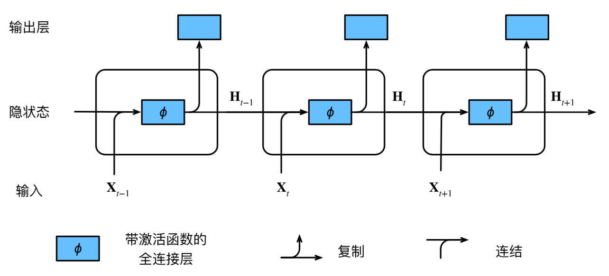

**三步计算逻辑**：

1. **拼接**：将当前输入 $\mathbf{X}_t$ 和上一隐状态 $\mathbf{H}_{t-1}$ 沿特征维度**拼接**
2. **线性变换**：拼接后的向量经过全连接层
3. **激活**：通过激活函数 $\phi$（通常为 tanh 或 ReLU）得到当前隐状态 $\mathbf{H}_t$

#### 数学等价性证明

$\mathbf{X}_t \mathbf{W}_{xh} + \mathbf{H}_{t-1} \mathbf{W}_{hh}$ 等价于拼接输入和隐状态后的矩阵乘法：

$$\text{concatenate}(X, H) \times \text{concatenate}(W_{xh}, W_{hh})$$

```python
import torch
from d2l import torch as d2l

# 准备数据：3个样本，输入维度1，隐状态维度4
X, W_xh = torch.normal(0, 1, (3, 1)), torch.normal(0, 1, (1, 4))
H, W_hh = torch.normal(0, 1, (3, 4)), torch.normal(0, 1, (4, 4))

# 方式一：分别计算后相加
result1 = torch.matmul(X, W_xh) + torch.matmul(H, W_hh)

# 方式二：拼接后计算（等价）
result2 = torch.matmul(torch.cat((X, H), 1), torch.cat((W_xh, W_hh), 0))

# 验证结果相同
print(torch.allclose(result1, result2))  # True
```

输出示例：
```
tensor([[ 0.2321, -0.9882, -1.6137, -1.0731],
        [-2.1590, -4.5628, -2.4992, -1.6673],
        [ 0.9875,  3.9260,  4.5676,  0.8728]])
```

### 8.4.4 基于 RNN 的字符级语言模型

#### 什么是字符级语言模型？

**字符级语言模型**将每个**字符**（而非单词）视为一个词元，预测序列中的下一个字符。

例如，对于文本序列 "machine"：

| 时间步 | 输入字符 | 目标字符 | 模型输入（含上下文） |
|--------|---------|---------|-------------------|
| $t=1$ | 'm' | 'a' | 'm' |
| $t=2$ | 'a' | 'c' | 'm', 'a' |
| $t=3$ | 'c' | 'h' | 'm', 'a', 'c' |
| $t=4$ | 'h' | 'i' | 'm', 'a', 'c', 'h' |
| $t=5$ | 'i' | 'n' | 'm', 'a', 'c', 'h', 'i' |
| $t=6$ | 'n' | 'e' | 'm', 'a', 'c', 'h', 'i', 'n' |

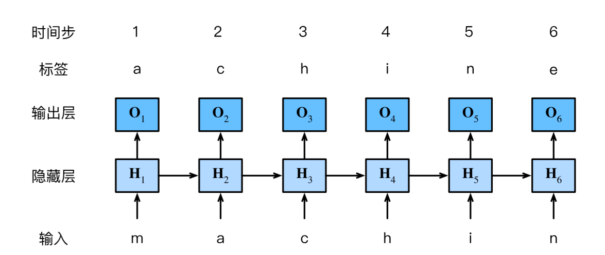

#### 训练过程

1. 输入序列：`['m', 'a', 'c', 'h', 'i', 'n']`
2. 标签序列：`['a', 'c', 'h', 'i', 'n', 'e']`（输入右移一位）
3. 每个时间步输出一个概率分布（词表大小 $\mathcal{V}$ 维）
4. 使用**交叉熵损失**计算每个时间步的误差
5. 通过**时间反向传播（BPTT）** 更新参数

#### 模型参数规模

以字符级 RNN 为例（词表大小 $|\mathcal{V}|$，隐状态维度 $h$）：

| 参数 | 形状 | 数量 |
|------|------|------|
| $\mathbf{W}_{xh}$ | $\|\mathcal{V}\| \times h$ | $\|\mathcal{V}\| \cdot h$ |
| $\mathbf{W}_{hh}$ | $h \times h$ | $h^2$ |
| $\mathbf{W}_{hq}$ | $h \times \|\mathcal{V}\|$ | $h \cdot \|\mathcal{V}\|$ |
| $\mathbf{b}_h, \mathbf{b}_q$ | 偏置 | $h + \|\mathcal{V}\|$ |

**总参数量**：$O(h^2 + h|\mathcal{V}|)$，**不随序列长度增加**。

### 8.4.5 困惑度（Perplexity）

#### 定义

困惑度（Perplexity）是评估语言模型质量的常用指标，定义为**平均交叉熵损失**的指数：

$$\text{Perplexity} = \exp\left(-\frac{1}{n} \sum_{t=1}^n \log P(x_t \mid x_{t-1}, \ldots, x_1)\right)$$

#### 理解困惑度

困惑度可以理解为 **"模型对下一个词元选择的不确定性"**，或 **"有效词表大小"**。

| 困惑度值 | 含义 | 示例 |
|---------|------|------|
| **1** | 完美预测（零不确定性） | 模型总能100%正确预测下一个词元 |
| **词表大小** | 均匀随机猜测（最大不确定性） | 词表有10000词，困惑度=10000 |
| **∞** | 完全错误预测 | 预测概率为0 |

#### 三种模型对比

| 续写示例 | 质量 | 困惑度 |
|---------|------|--------|
| "It is raining **outside**" | 好 | 低（接近1） |
| "It is raining **banana tree**" | 差 | 中 |
| "It is raining **piouw;kcj pwepoiut**" | 极差 | 极高 |

#### 困惑度的实际意义

- **困惑度 = K**：模型在选择下一个词元时，不确定性等同于从 K 个等可能词元中随机选择
- **语言建模目标**：尽可能降低困惑度
- **对比基准**：均匀分布模型的困惑度 = 词表大小 $|\mathcal{V}|$

### 8.4.6 RNN 与 MLP 对比总结

| 特性 | 多层感知机（MLP） | 循环神经网络（RNN） |
|------|------------------|-------------------|
| **隐状态** | 仅依赖于当前输入 | 依赖于当前输入 + 上一时间步隐状态 |
| **参数共享** | 每层独立参数 | 所有时间步共享参数 |
| **序列处理** | 不适合 | 天然适合 |
| **参数数量** | 随层数增加 | 不随序列长度增加 |
| **记忆能力** | 无 | 有（通过隐状态传递） |
| **训练方式** | 标准反向传播 | 时间反向传播（BPTT） |

### 8.4.7 核心公式汇总

| 公式 | 含义 |
|------|------|
| $h_t = f(x_t, h_{t-1})$ | 隐状态更新的一般形式 |
| $\mathbf{H}_t = \phi(\mathbf{X}_t \mathbf{W}_{xh} + \mathbf{H}_{t-1} \mathbf{W}_{hh} + \mathbf{b}_h)$ | RNN 隐状态计算 |
| $\mathbf{O}_t = \mathbf{H}_t \mathbf{W}_{hq} + \mathbf{b}_q$ | RNN 输出计算 |
| $\text{Perplexity} = \exp(\text{average CE loss})$ | 困惑度计算 |

### 8.4.8 关键概念记忆卡

| 概念 | 一句话总结 |
|------|-----------|
| **隐状态** | RNN 的"记忆"，通过时间步传递历史信息 |
| **循环** | 同一组参数在所有时间步被重复使用 |
| **参数共享** | RNN 参数量不随序列长度增长的核心原因 |
| **字符级语言模型** | 以字符为单位预测下一个字符 |
| **困惑度** | 语言模型质量的度量，越低越好 |
| **BPTT** | RNN 特有的反向传播算法，沿时间展开计算梯度 |

## 8.5 循环神经网络的从零开始实现

本节将根据上一节的理论，从头开始实现一个基于循环神经网络（RNN）的字符级语言模型，并在《时光机器》数据集上训练。

### 8.5.1 数据准备

```python
%matplotlib inline
import math
import torch
from torch import nn
from torch.nn import functional as F
from d2l import torch as d2l

# ==================== 超参数设置 ====================
batch_size, num_steps = 32, 35   # 批次大小32，时间步数35
train_iter, vocab = d2l.load_data_time_machine(batch_size, num_steps)
```

> 注：`num_steps` 是每个子序列的长度（时间步数），即 RNN 每次展开的步数。

### 8.5.2 独热编码（One-Hot Encoding）

将词元索引转为向量表示。**独热编码**是最简单的表示方式：创建一个长度为词表大小的向量，只在词元索引位置为1，其余为0。

```python
# ==================== 独热编码演示 ====================
# 将索引 0 和 2 转为独热向量，词表大小为 len(vocab)
F.one_hot(torch.tensor([0, 2]), len(vocab))
```

输出：
```
tensor([[1, 0, 0, ..., 0],
        [0, 0, 1, ..., 0]])  # 形状: (2, 词表大小)
```

#### 数据形状转换

```python
# 小批量数据形状: (批量大小, 时间步数)
X = torch.arange(10).reshape((2, 5))  # 2个样本，5个时间步

# 转置后做独热编码： (时间步数, 批量大小, 词表大小)
# 外层维度是时间步，方便循环逐时间步处理
F.one_hot(X.T, 28).shape  # torch.Size([5, 2, 28])
```

**为什么要转置？**
- 原形状 `(批量大小, 时间步数)` → 转置后 `(时间步数, 批量大小)`
- 循环遍历最外层时，每次取出的是**同一时间步**的所有样本
- 便于逐时间步更新隐状态

### 8.5.3 初始化模型参数

```python
def get_params(vocab_size, num_hiddens, device):
    """
    初始化 RNN 模型参数
    
    Args:
        vocab_size: 词表大小（输入/输出维度）
        num_hiddens: 隐藏单元数
        device: 计算设备（CPU/GPU）
    
    Returns:
        params: 所有可训练参数列表
    """
    num_inputs = num_outputs = vocab_size
    
    # 使用标准差 0.01 的正态分布初始化权重
    def normal(shape):
        return torch.randn(size=shape, device=device) * 0.01
    
    # ---- 隐藏层参数 ----
    W_xh = normal((num_inputs, num_hiddens))      # 输入 → 隐状态
    W_hh = normal((num_hiddens, num_hiddens))     # 隐状态 → 隐状态（循环核心）
    b_h = torch.zeros(num_hiddens, device=device) # 隐状态偏置
    
    # ---- 输出层参数 ----
    W_hq = normal((num_hiddens, num_outputs))     # 隐状态 → 输出
    b_q = torch.zeros(num_outputs, device=device) # 输出偏置
    
    # 所有参数需要计算梯度
    params = [W_xh, W_hh, b_h, W_hq, b_q]
    for param in params:
        param.requires_grad_(True)
    return params
```

**参数形状一览**：

| 参数 | 形状 | 含义 |
|------|------|------|
| `W_xh` | `(vocab_size, num_hiddens)` | 输入 → 隐状态 |
| `W_hh` | `(num_hiddens, num_hiddens)` | 隐状态 → 隐状态 |
| `b_h` | `(num_hiddens,)` | 隐状态偏置 |
| `W_hq` | `(num_hiddens, vocab_size)` | 隐状态 → 输出 |
| `b_q` | `(vocab_size,)` | 输出偏置 |

### 8.5.4 循环神经网络核心实现

#### 初始化隐状态

```python
def init_rnn_state(batch_size, num_hiddens, device):
    """
    返回初始隐状态（全零张量）
    使用元组包装，与后续 LSTM 等模型统一接口
    """
    return (torch.zeros((batch_size, num_hiddens), device=device),)
```

#### 单时间步 RNN 计算

```python
def rnn(inputs, state, params):
    """
    循环神经网络前向传播
    
    核心公式:
        H_t = tanh(X_t @ W_xh + H_{t-1} @ W_hh + b_h)
        O_t = H_t @ W_hq + b_q
    
    Args:
        inputs: (时间步数, 批量大小, 词表大小) 独热编码输入
        state: 初始隐状态 (批量大小, 隐藏单元数)
        params: [W_xh, W_hh, b_h, W_hq, b_q]
    
    Returns:
        outputs: (时间步数×批量大小, 词表大小) 所有时间步输出拼接
        state: 最终隐状态
    """
    W_xh, W_hh, b_h, W_hq, b_q = params
    H, = state  # 解包隐状态
    outputs = []
    
    for X in inputs:  # X: (批量大小, 词表大小)
        # tanh 激活，输出范围 (-1, 1)，有助于缓解梯度问题
        H = torch.tanh(torch.mm(X, W_xh) + torch.mm(H, W_hh) + b_h)
        Y = torch.mm(H, W_hq) + b_q
        outputs.append(Y)
    
    return torch.cat(outputs, dim=0), (H,)
```

#### 模型封装类

```python
class RNNModelScratch:
    """从零开始实现的循环神经网络模型"""
    
    def __init__(self, vocab_size, num_hiddens, device,
                 get_params, init_state, forward_fn):
        self.vocab_size, self.num_hiddens = vocab_size, num_hiddens
        self.params = get_params(vocab_size, num_hiddens, device)
        self.init_state, self.forward_fn = init_state, forward_fn
    
    def __call__(self, X, state):
        """前向传播：输入索引 → 独热编码 → RNN"""
        X = F.one_hot(X.T, self.vocab_size).type(torch.float32)
        return self.forward_fn(X, state, self.params)
    
    def begin_state(self, batch_size, device):
        """返回初始隐状态"""
        return self.init_state(batch_size, self.num_hiddens, device)
```

#### 验证输出形状

```python
num_hiddens = 512
net = RNNModelScratch(len(vocab), num_hiddens, d2l.try_gpu(),
                      get_params, init_rnn_state, rnn)

state = net.begin_state(X.shape[0], d2l.try_gpu())
Y, new_state = net(X.to(d2l.try_gpu()), state)

print(Y.shape)           # torch.Size([10, 28]) = (时间步数×批量大小, 词表大小)
print(new_state[0].shape) # torch.Size([2, 512]) = (批量大小, 隐藏单元数)
```

### 8.5.5 预测函数

```python
def predict_ch8(prefix, num_preds, net, vocab, device):
    """
    在给定前缀后生成新字符
    
    工作原理:
        1. 预热期（Warm-up）：用真实字符更新隐状态，不生成输出
        2. 预测期：使用模型预测后续字符
    """
    state = net.begin_state(batch_size=1, device=device)
    outputs = [vocab[prefix[0]]]
    get_input = lambda: torch.tensor([outputs[-1]], device=device).reshape((1, 1))
    
    # ---------- 预热期 ----------
    for y in prefix[1:]:
        _, state = net(get_input(), state)
        outputs.append(vocab[y])
    
    # ---------- 预测期 ----------
    for _ in range(num_preds):
        y, state = net(get_input(), state)
        outputs.append(int(y.argmax(dim=1).reshape(1)))  # 取概率最大的字符
    
    return ''.join([vocab.idx_to_token[i] for i in outputs])
```

**未训练模型的预测效果**（结果无意义）：
```python
predict_ch8('time traveller ', 10, net, vocab, d2l.try_gpu())
# 输出: 'time traveller vxs dyhmat'
```

### 8.5.6 梯度裁剪

**为什么需要梯度裁剪？**
- RNN 展开 $T$ 步，反向传播形成 $\mathcal{O}(T)$ 长的矩阵乘法链
- 容易导致**梯度爆炸**（梯度值变得极大）

**梯度裁剪公式**：
$$\mathbf{g} \leftarrow \min\left(1, \frac{\theta}{\|\mathbf{g}\|}\right) \mathbf{g}$$

其中 $\theta$ 是裁剪阈值。

```python
def grad_clipping(net, theta):
    """裁剪梯度，防止梯度爆炸"""
    # 收集所有可训练参数
    if isinstance(net, nn.Module):
        params = [p for p in net.parameters() if p.requires_grad]
    else:
        params = net.params
    
    # 计算梯度总范数
    norm = torch.sqrt(sum(torch.sum((p.grad ** 2)) for p in params))
    
    # 如果范数超过阈值，按比例缩放
    if norm > theta:
        for param in params:
            param.grad[:] *= theta / norm
```

### 8.5.7 训练函数

```python
def train_epoch_ch8(net, train_iter, loss, updater, device, use_random_iter):
    """训练一个迭代周期"""
    state, timer = None, d2l.Timer()
    metric = d2l.Accumulator(2)  # (训练损失之和, 词元数量)
    
    for X, Y in train_iter:
        # ---------- 隐状态初始化 ----------
        if state is None or use_random_iter:
            # 随机采样：每批重新初始化
            state = net.begin_state(batch_size=X.shape[0], device=device)
        else:
            # 顺序分区：使用上一批次的最终隐状态（需分离梯度）
            if isinstance(net, nn.Module) and not isinstance(state, tuple):
                state.detach_()
            else:
                for s in state:
                    s.detach_()
        
        # ---------- 前向传播 ----------
        y = Y.T.reshape(-1)  # 标签展平
        X, y = X.to(device), y.to(device)
        y_hat, state = net(X, state)
        l = loss(y_hat, y.long()).mean()
        
        # ---------- 反向传播 ----------
        if isinstance(updater, torch.optim.Optimizer):
            updater.zero_grad()
            l.backward()
            grad_clipping(net, 1)
            updater.step()
        else:
            l.backward()
            grad_clipping(net, 1)
            updater(batch_size=1)
        
        metric.add(l * y.numel(), y.numel())
    
    return math.exp(metric[0] / metric[1]), metric[1] / timer.stop()
```

**完整训练函数**：

```python
def train_ch8(net, train_iter, vocab, lr, num_epochs, device,
              use_random_iter=False):
    """完整的模型训练流程"""
    loss = nn.CrossEntropyLoss()
    animator = d2l.Animator(xlabel='epoch', ylabel='perplexity',
                            legend=['train'], xlim=[10, num_epochs])
    
    updater = (torch.optim.SGD(net.parameters(), lr) 
               if isinstance(net, nn.Module) 
               else lambda batch_size: d2l.sgd(net.params, lr, batch_size))
    
    predict = lambda prefix: predict_ch8(prefix, 50, net, vocab, device)
    
    for epoch in range(num_epochs):
        ppl, speed = train_epoch_ch8(net, train_iter, loss, updater,
                                      device, use_random_iter)
        if (epoch + 1) % 10 == 0:
            print(predict('time traveller'))
            animator.add(epoch + 1, [ppl])
    
    print(f'困惑度 {ppl:.1f}, {speed:.1f} 词元/秒 {str(device)}')
    print(predict('time traveller'))
    print(predict('traveller'))
```

### 8.5.8 模型训练结果

**顺序分区训练**（`use_random_iter=False`）：
```python
num_epochs, lr = 500, 1
train_ch8(net, train_iter, vocab, lr, num_epochs, d2l.try_gpu())
```

输出：
```
困惑度 1.0, 72303.8 词元/秒 cuda:0
time travelleryou can show black is white by argument said filby
traveller with a slight accession ofcheerfulness really thi
```

**随机采样训练**（`use_random_iter=True`）：
```python
net = RNNModelScratch(len(vocab), num_hiddens, d2l.try_gpu(),
                      get_params, init_rnn_state, rnn)
train_ch8(net, train_iter, vocab, lr, num_epochs, d2l.try_gpu(),
          use_random_iter=True)
```

输出：
```
困惑度 1.4, 70725.7 词元/秒 cuda:0
time travellerit s against reason said filbywhan seane of the fi
travellerit s against reason said filbywhan seane of the fi
```

### 8.5.9 核心概念总结

| 概念 | 说明 |
|------|------|
| **独热编码** | 词元索引 → 向量，维度 = 词表大小 |
| **隐状态** | RNN 的"记忆"，形状 `(批量大小, 隐藏单元数)` |
| **tanh 激活** | 输出范围 `(-1, 1)`，有助于稳定梯度 |
| **预热期** | 用真实字符更新隐状态，不生成输出 |
| **梯度裁剪** | 防止梯度爆炸，按比例缩小过大梯度 |
| **困惑度** | 语言模型质量的度量，越低越好 |
| **顺序分区** | 保持序列连续性，隐状态在批次间传递 |
| **随机采样** | 每批随机起始，隐状态每批重新初始化 |

### 8.5.10 两种采样策略对比

| 特性 | 随机采样 | 顺序分区 |
|------|----------|----------|
| **隐状态初始化** | 每批重新初始化 | 批次间传递 |
| **梯度分离** | 不需要 | 需要 `detach_()` |
| **数据覆盖** | 全面 | 有限 |
| **收敛速度** | 稍慢 | 稍快 |
| **困惑度** | 略高（1.4） | 略低（1.0） |

## 8.6 循环神经网络的简洁实现


虽然从零实现 RNN 有助于理解其内部原理，但在实际应用中，使用深度学习框架的高级 API 更加高效和便捷。本节将展示如何使用 PyTorch 的 `nn.RNN` 模块快速构建和训练循环神经网络。

### 8.6.1 数据准备

```python
import torch
from torch import nn
from torch.nn import functional as F
from d2l import torch as d2l

# ==================== 超参数设置 ====================
batch_size, num_steps = 32, 35
train_iter, vocab = d2l.load_data_time_machine(batch_size, num_steps)
```

### 8.6.2 定义模型

#### 使用 `nn.RNN` 层

PyTorch 的 `nn.RNN` 封装了循环神经网络的核心计算：

```python
# ==================== 定义 RNN 层 ====================
num_hiddens = 256
rnn_layer = nn.RNN(len(vocab), num_hiddens)
```

**`nn.RNN` 参数说明**：

| 参数 | 含义 |
|------|------|
| `input_size` | 输入维度（词表大小） |
| `hidden_size` | 隐藏单元数 |
| `num_layers` | 隐藏层数（默认1） |
| `nonlinearity` | 激活函数（默认 `tanh`） |
| `batch_first` | 是否 batch 在第一维（默认 False） |

#### 隐状态初始化

```python
# 隐状态形状: (隐藏层数, 批量大小, 隐藏单元数)
state = torch.zeros((1, batch_size, num_hiddens))
state.shape  # torch.Size([1, 32, 256])
```

**为什么形状是 `(层数, 批量大小, 隐藏单元数)`？**
- 支持**多层** RNN（`num_layers > 1`）
- 批量维度独立，便于并行计算
- 与输入 `X` 的形状 `(时间步数, 批量大小, 词表大小)` 对应

#### 前向传播

```python
# 创建随机输入: (时间步数, 批量大小, 词表大小)
X = torch.rand(size=(num_steps, batch_size, len(vocab)))

# Y: 所有时间步的隐状态 (时间步数, 批量大小, 隐藏单元数)
# state_new: 最终隐状态 (隐藏层数, 批量大小, 隐藏单元数)
Y, state_new = rnn_layer(X, state)
print(Y.shape)        # torch.Size([35, 32, 256])
print(state_new.shape) # torch.Size([1, 32, 256])
```

**重要区别**：
- `Y` 是**所有时间步**的隐状态（每个时间步的输出）
- `state_new` 是**最后一个时间步**的隐状态
- `Y[-1] == state_new[0]`（最后一个时间步的输出等于最终隐状态）

### 8.6.3 完整的 RNN 模型类

```python
class RNNModel(nn.Module):
    """使用高级 API 的循环神经网络模型"""
    
    def __init__(self, rnn_layer, vocab_size, **kwargs):
        super(RNNModel, self).__init__(**kwargs)
        self.rnn = rnn_layer
        self.vocab_size = vocab_size
        self.num_hiddens = self.rnn.hidden_size
        
        # 判断是否双向 RNN
        if not self.rnn.bidirectional:
            self.num_directions = 1
            self.linear = nn.Linear(self.num_hiddens, self.vocab_size)
        else:
            self.num_directions = 2
            self.linear = nn.Linear(self.num_hiddens * 2, self.vocab_size)
    
    def forward(self, inputs, state):
        """
        前向传播
        
        Args:
            inputs: 输入索引，形状 (批量大小, 时间步数)
            state: 初始隐状态
        
        Returns:
            output: 输出，形状 (时间步数×批量大小, 词表大小)
            state: 最终隐状态
        """
        # 转置并做独热编码: (时间步数, 批量大小, 词表大小)
        X = F.one_hot(inputs.T.long(), self.vocab_size)
        X = X.to(torch.float32)
        
        # RNN 前向传播
        Y, state = self.rnn(X, state)
        
        # 全连接层: 将 (时间步数×批量大小, 隐藏单元数) 转为 (时间步数×批量大小, 词表大小)
        output = self.linear(Y.reshape((-1, Y.shape[-1])))
        return output, state
    
    def begin_state(self, device, batch_size=1):
        """返回初始隐状态"""
        if not isinstance(self.rnn, nn.LSTM):
            # GRU/RNN: 隐状态是张量
            return torch.zeros((self.num_directions * self.rnn.num_layers,
                                batch_size, self.num_hiddens),
                               device=device)
        else:
            # LSTM: 隐状态是 (h, c) 元组
            return (torch.zeros((self.num_directions * self.rnn.num_layers,
                                 batch_size, self.num_hiddens), device=device),
                    torch.zeros((self.num_directions * self.rnn.num_layers,
                                 batch_size, self.num_hiddens), device=device))
```

### 8.6.4 模型结构与参数

```python
device = d2l.try_gpu()
net = RNNModel(rnn_layer, vocab_size=len(vocab))
net = net.to(device)

# 查看模型参数数量
# 总参数 = RNN层参数 + 输出层参数
# RNN层: input_size×h + h×h + h (输入权重 + 隐状态权重 + 偏置)
# 输出层: h×vocab_size + vocab_size
print(sum(p.numel() for p in net.parameters()))
```

**参数数量估算**（词表大小 28，隐藏单元数 256）：

| 参数组 | 计算 | 数量 |
|--------|------|------|
| RNN 输入权重 | 28 × 256 | 7,168 |
| RNN 隐状态权重 | 256 × 256 | 65,536 |
| RNN 偏置 | 256 | 256 |
| 输出层权重 | 256 × 28 | 7,168 |
| 输出层偏置 | 28 | 28 |
| **总计** | | **约 80,156** |

### 8.6.5 模型训练与预测

#### 随机初始化模型的预测效果

```python
# 随机初始化模型，生成预测（结果无意义）
d2l.predict_ch8('time traveller', 10, net, vocab, device)
# 输出: 'time traveller          '
```

#### 训练模型

```python
num_epochs, lr = 500, 1
d2l.train_ch8(net, train_iter, vocab, lr, num_epochs, device)
```

输出：
```
perplexity 1.3, 286908.2 tokens/sec on cuda:0
time traveller came the time traveller but now you begin to spen
traveller pork acong wa canome precable thig thit lepanchat
```
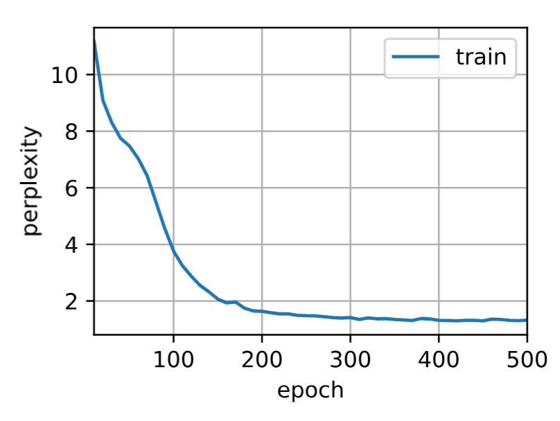

### 8.6.6 训练速度对比

| 实现方式 | 速度（词元/秒） | 相对速度 |
|---------|----------------|---------|
| **高级 API** | ~287,000 | 4x |
| 从零实现 | ~72,000 | 1x |

**速度提升原因**：
1. 底层使用优化的 CUDA 内核
2. 更好的内存管理
3. 批量矩阵运算优化
4. 避免 Python 循环开销

### 8.6.7 核心概念对比

| 特性 | 从零实现 | 高级 API |
|------|---------|---------|
| **代码量** | 较多 | 简洁 |
| **可读性** | 高（显式计算过程） | 中等（封装细节） |
| **速度** | 较慢 | 快（4倍以上） |
| **灵活性** | 高 | 中（可自定义层） |
| **维护成本** | 高 | 低 |
| **适用场景** | 学习理解 | 实际项目 |

### 8.6.8 `nn.RNN` 核心参数详解

```python
nn.RNN(
    input_size,          # 输入特征维度（词表大小）
    hidden_size,         # 隐藏单元数
    num_layers=1,        # 循环层数
    nonlinearity='tanh', # 激活函数：'tanh' 或 'relu'
    bias=True,           # 是否使用偏置
    batch_first=False,   # 输入形状: (batch, seq, feature) 或 (seq, batch, feature)
    dropout=0,           # 层间 dropout 概率（多层时使用）
    bidirectional=False  # 是否双向
)
```

### 8.6.9 输入/输出形状总结

| 张量 | 形状 | 说明 |
|------|------|------|
| **输入 `inputs`** | `(批量大小, 时间步数)` | 词元索引 |
| **独热编码 `X`** | `(时间步数, 批量大小, 词表大小)` | 转为独热向量 |
| **RNN 输出 `Y`** | `(时间步数, 批量大小, 隐藏单元数)` | 所有时间步的隐状态 |
| **最终隐状态** | `(层数, 批量大小, 隐藏单元数)` | 最后一个时间步的隐状态 |
| **模型输出** | `(时间步数×批量大小, 词表大小)` | 经过输出层的结果 |


## 8.6.11 RNN 训练流程速览

### 一、数据准备阶段

#### 文本 → 数字索引
原始文本经清洗、词元化、建词表后，每个字符映射为唯一数字索引，得到 `corpus`（一维整数序列）。

#### 构建训练样本
用滑动窗口将长序列切分为 `(X, Y)` 对，`X` 是输入序列，`Y` 是 `X` 向后移一位的标签，再组装成 `(批量大小, 时间步数)` 的小批量数据。


### 二、模型参数初始化

#### RNN 核心参数
包括输入→隐状态权重 `W_xh`、隐状态→隐状态权重 `W_hh`、隐状态偏置 `b_h`、输出权重 `W_hq`、输出偏置 `b_q`。所有参数在所有时间步共享，参数量不随序列长度增加。

#### 隐状态初始化
每个批次开始时，隐状态 `H` 初始化为 `(批量大小, 隐藏单元数)` 的全零张量，作为"记忆"的初始状态。


### 三、训练循环（核心）

#### 前向传播
按时间步展开：每个时间步用当前输入 `x_t` 和上一隐状态 `H_{t-1}` 计算当前隐状态 `H_t = tanh(x_t·W_xh + H_{t-1}·W_hh + b_h)`，再计算输出 `O_t = H_t·W_hq + b_q`，预测下一个字符的概率分布。

#### 损失计算与反向传播
所有时间步的输出与真实标签计算交叉熵损失并求和，然后反向传播计算所有参数的梯度。由于 `W_hh` 在每个时间步都被使用，其梯度是所有时间步梯度之和。

#### 梯度裁剪与参数更新
计算梯度总范数，若超过阈值则按比例缩放，防止梯度爆炸。最后用优化器更新所有参数，完成一个批次的训练。重复此过程直到遍历所有批次，即完成一个迭代周期（epoch）。


## 8.7 通过时间反向传播（BPTT）

通过时间反向传播（Backpropagation Through Time，BPTT）是循环神经网络中特有的反向传播算法。理解 BPTT 对于掌握 RNN 训练中**梯度消失**和**梯度爆炸**问题的本质至关重要。


### 8.7.1 为什么 RNN 的反向传播特殊？

在普通的前馈神经网络中，计算图是**有向无环图（DAG）**，反向传播沿着图从输出到输入单向传播。而在 RNN 中，由于**隐状态在时间步之间循环传递**，计算图是一个**有环图**，必须按时间展开成链式结构。

普通 MLP：

$$x \rightarrow h \rightarrow o \rightarrow L$$

RNN（展开）：

$$x_1 \rightarrow h_1 \rightarrow o_1 \rightarrow L_1$$

$$\uparrow \quad \downarrow \quad \downarrow$$

$$x_2 \rightarrow h_2 \rightarrow o_2 \rightarrow L_2$$

$$\uparrow \quad \downarrow \quad \downarrow$$

$$x_3 \rightarrow h_3 \rightarrow o_3 \rightarrow L_3$$

每个样本独立，而 RNN 中 $h_t$ 依赖于 $h_{t-1}$，形成时间链。

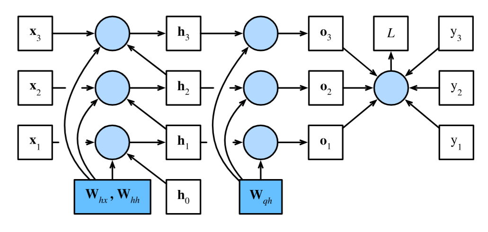

### 8.7.2 梯度分析的简化模型

为了分析梯度传播的本质，我们先忽略激活函数和偏置，使用一个简化模型。

#### 模型定义

设时间步 $t$ 的隐状态为 $h_t$，输入为 $x_t$，输出为 $o_t$。隐藏层和输出层的权重分别为 $w_h$ 和 $w_o$：

$$h_t = f(x_t, h_{t-1}, w_h)$$

$$o_t = g(h_t, w_o)$$

其中 $f$ 和 $g$ 分别是隐藏层和输出层的变换函数。

#### 前向传播链

前向传播按时间步依次计算：

$$h_1 = f(x_1, h_0, w_h)$$

$$o_1 = g(h_1, w_o)$$

$$h_2 = f(x_2, h_1, w_h)$$

$$o_2 = g(h_2, w_o)$$

$$\vdots$$

$$h_T = f(x_T, h_{T-1}, w_h)$$

$$o_T = g(h_T, w_o)$$

其中 $h_0$ 通常初始化为零向量。每个时间步的隐状态 $h_t$ 都通过 $h_{t-1}$ 间接依赖于所有之前的输入。

#### 目标函数

目标函数是所有时间步损失的平均值：

$$L(x_1, \ldots, x_T, y_1, \ldots, y_T, w_h, w_o) = \frac{1}{T} \sum_{t=1}^T l(y_t, o_t)$$

其中 $l(y_t, o_t)$ 是时间步 $t$ 的损失（如交叉熵）。


### 8.7.3 梯度计算的链式法则

#### 目标：计算 $\partial L / \partial w_h$

根据链式法则，目标函数对 $w_h$ 的梯度为：

$$\frac{\partial L}{\partial w_h} = \frac{1}{T} \sum_{t=1}^T \frac{\partial l(y_t, o_t)}{\partial w_h}$$

应用链式法则展开：

$$\frac{\partial l(y_t, o_t)}{\partial w_h} = \frac{\partial l(y_t, o_t)}{\partial o_t} \cdot \frac{\partial o_t}{\partial h_t} \cdot \frac{\partial h_t}{\partial w_h}$$

即：

$$\frac{\partial L}{\partial w_h} = \frac{1}{T} \sum_{t=1}^T \frac{\partial l(y_t, o_t)}{\partial o_t} \cdot \frac{\partial g(h_t, w_o)}{\partial h_t} \cdot \frac{\partial h_t}{\partial w_h}$$

在这个公式中：
- 第一项 $\partial l / \partial o_t$：取决于损失函数，容易计算
- 第二项 $\partial g / \partial h_t$：取决于输出层，容易计算
- 第三项 $\partial h_t / \partial w_h$：**这是困难的根源**，因为 $h_t$ 递归依赖于 $h_{t-1}$，而 $h_{t-1}$ 也依赖于 $w_h$


### 8.7.4 递归梯度的展开

#### 递归关系

根据 $h_t = f(x_t, h_{t-1}, w_h)$，$h_t$ 对 $w_h$ 的偏导数为：

$$\frac{\partial h_t}{\partial w_h} = \frac{\partial f(x_t, h_{t-1}, w_h)}{\partial w_h} + \frac{\partial f(x_t, h_{t-1}, w_h)}{\partial h_{t-1}} \cdot \frac{\partial h_{t-1}}{\partial w_h}$$

这个公式的含义：
- **第一项**：$w_h$ 对当前时间步 $h_t$ 的**直接影响**
- **第二项**：$w_h$ 通过 $h_{t-1}$ 对 $h_t$ 的**间接影响**（递归项）

#### 数学化简

为了简化分析，我们定义三个序列：

$$a_t = \frac{\partial h_t}{\partial w_h}$$

$$b_t = \frac{\partial f(x_t, h_{t-1}, w_h)}{\partial w_h}$$

$$c_t = \frac{\partial f(x_t, h_{t-1}, w_h)}{\partial h_{t-1}}$$

则递归关系可以重写为：

$$a_t = b_t + c_t \cdot a_{t-1}$$

这是一个**一阶线性递推关系**，初始条件为 $a_0 = 0$（因为 $h_0$ 与 $w_h$ 无关）。

#### 递推公式的展开

让我们手动展开前几个时间步：

$$a_1 = b_1$$

$$a_2 = b_2 + c_2 b_1$$

$$a_3 = b_3 + c_3 b_2 + c_3 c_2 b_1$$

$$a_4 = b_4 + c_4 b_3 + c_4 c_3 b_2 + c_4 c_3 c_2 b_1$$

由此可归纳出一般形式：

$$a_t = b_t + \sum_{i=1}^{t-1} \left( \prod_{j=i+1}^{t} c_j \right) b_i$$

**展开公式的含义**：$\partial h_t / \partial w_h$ 等于：
- 当前时间步的直接贡献 $b_t$
- 加上所有过去时间步 $i$ 的贡献 $b_i$，乘以从 $i$ 到 $t$ 的雅可比矩阵连乘 $\prod_{j=i+1}^{t} c_j$

#### 代入原式

将 $a_t = \partial h_t / \partial w_h$ 代入 $\partial L / \partial w_h$ 的表达式：

$$\frac{\partial L}{\partial w_h} = \frac{1}{T} \sum_{t=1}^T \frac{\partial l(y_t, o_t)}{\partial o_t} \cdot \frac{\partial g(h_t, w_o)}{\partial h_t} \cdot \left[ b_t + \sum_{i=1}^{t-1} \left( \prod_{j=i+1}^{t} c_j \right) b_i \right]$$

**关键观察**：梯度表达式中包含**雅可比矩阵的连乘** $\prod_{j=i+1}^{t} c_j$。当 $t$ 很大时，这个连乘可能导致数值不稳定。


### 8.7.5 梯度消失与梯度爆炸的数学本质

#### 线性 RNN 的精确分析

为了深入理解，考虑一个**线性 RNN**（激活函数为恒等映射 $\phi(x) = x$，无偏置）：

$$\mathbf{h}_t = \mathbf{W}_{hx} \mathbf{x}_t + \mathbf{W}_{hh} \mathbf{h}_{t-1}$$

$$\mathbf{o}_t = \mathbf{W}_{qh} \mathbf{h}_t$$

此时，雅可比矩阵 $c_j = \partial f / \partial h_{j-1} = \mathbf{W}_{hh}$ 是常数矩阵。

#### 隐状态梯度的展开
由总损失：
$$L = \frac{1}{T} \sum_{t=1}^{T} l(\mathbf{o}_t, y_t)$$

目标函数对 $\mathbf{h}_T$ 的梯度：

$$\frac{\partial L}{\partial \mathbf{h}_T} = \mathbf{W}_{qh}^\top \cdot \frac{\partial L}{\partial \mathbf{o}_T}$$

对于 $t < T$，梯度递归为：

$$\frac{\partial L}{\partial \mathbf{h}_t} = \mathbf{W}_{hh}^\top \cdot \frac{\partial L}{\partial \mathbf{h}_{t+1}} + \mathbf{W}_{qh}^\top \cdot \frac{\partial L}{\partial \mathbf{o}_t}$$

#### 展开递归

让我们手动展开 $\partial L / \partial \mathbf{h}_t$：

$$\frac{\partial L}{\partial \mathbf{h}_T} = \mathbf{W}_{qh}^\top \cdot \frac{\partial L}{\partial \mathbf{o}_T}$$

$$\frac{\partial L}{\partial \mathbf{h}_{T-1}} = \mathbf{W}_{hh}^\top \cdot \frac{\partial L}{\partial \mathbf{h}_T} + \mathbf{W}_{qh}^\top \cdot \frac{\partial L}{\partial \mathbf{o}_{T-1}}$$

$$= \mathbf{W}_{hh}^\top \mathbf{W}_{qh}^\top \cdot \frac{\partial L}{\partial \mathbf{o}_T} + \mathbf{W}_{qh}^\top \cdot \frac{\partial L}{\partial \mathbf{o}_{T-1}}$$

$$\frac{\partial L}{\partial \mathbf{h}_{T-2}} = \mathbf{W}_{hh}^\top \cdot \frac{\partial L}{\partial \mathbf{h}_{T-1}} + \mathbf{W}_{qh}^\top \cdot \frac{\partial L}{\partial \mathbf{o}_{T-2}}$$

$$= (\mathbf{W}_{hh}^\top)^2 \mathbf{W}_{qh}^\top \cdot \frac{\partial L}{\partial \mathbf{o}_T} + \mathbf{W}_{hh}^\top \mathbf{W}_{qh}^\top \cdot \frac{\partial L}{\partial \mathbf{o}_{T-1}} + \mathbf{W}_{qh}^\top \cdot \frac{\partial L}{\partial \mathbf{o}_{T-2}}$$

归纳可得一般公式：

$$\frac{\partial L}{\partial \mathbf{h}_t} = \sum_{i=t}^T (\mathbf{W}_{hh}^\top)^{T-i} \cdot \mathbf{W}_{qh}^\top \cdot \frac{\partial L}{\partial \mathbf{o}_{T+t-i}}$$

#### 矩阵幂的问题

上述公式中包含 $(\mathbf{W}_{hh}^\top)^{T-i}$，即 $\mathbf{W}_{hh}$ 的高次幂。

**矩阵幂与特征值的关系**：

设 $\mathbf{W}_{hh}$ 的特征值为 $\lambda_1, \lambda_2, \ldots, \lambda_h$，对应特征向量为 $\mathbf{v}_1, \mathbf{v}_2, \ldots, \mathbf{v}_h$。则：

$$\mathbf{W}_{hh}^k \mathbf{v}_j = \lambda_j^k \mathbf{v}_j$$

| 特征值大小 | k → ∞ 时的行为 | 结果 |
|-----------|---------------|------|
| 大于 1 | 趋向无穷大 | 梯度爆炸 |
| 小于 1 | 趋向 0 | 梯度消失 |
| 等于 1 | 保持不变 | 稳定（理想情况） |

**直观理解**：

梯度从 $T$ 传到 $t$，需要经过 $(T-t)$ 次矩阵乘法：

$$\frac{\partial L}{\partial \mathbf{h}_T} \leftarrow \frac{\partial L}{\partial \mathbf{h}_{T-1}} \leftarrow \cdots \leftarrow \frac{\partial L}{\partial \mathbf{h}_t}$$

每一步都乘以 $\mathbf{W}_{hh}^\top$。

如果 $\mathbf{W}_{hh}$ 的特征值 $> 1$：梯度像滚雪球一样越滚越大 → 爆炸

如果 $\mathbf{W}_{hh}$ 的特征值 $< 1$：梯度像细沙一样不断流失 → 消失


### 8.7.6 三种 BPTT 计算策略

由于完全 BPTT 计算量巨大且可能不稳定，实践中采用近似策略。

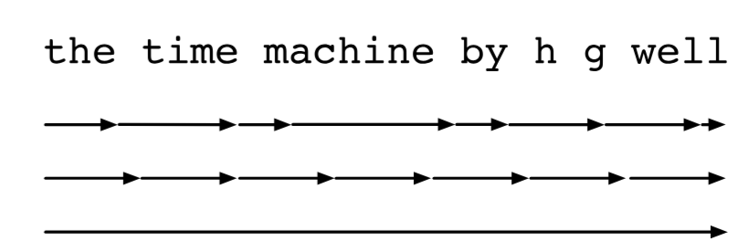

| 策略 | 原理 | 优点 | 缺点 |
|------|------|------|------|
| **完全 BPTT** | 计算所有时间步的梯度 | 精确 | 计算量大，易梯度爆炸 |
| **常规截断** | 只反向传播 $\tau$ 步 | 稳定，高效 | 近似，忽略长距离依赖 |
| **随机截断** | 随机停止反向传播 | 理论上无偏 | 实现复杂，方差大 |

#### 常规截断的数学表示

在常规截断中，我们在 $\tau$ 步后截断求和：

$$\frac{\partial h_t}{\partial w_h} \approx \frac{\partial f(x_t, h_{t-1}, w_h)}{\partial w_h} + \sum_{i=t-\tau}^{t-1} \left( \prod_{j=i+1}^{t} \frac{\partial f(x_j, h_{j-1}, w_h)}{\partial h_{j-1}} \right) \frac{\partial f(x_i, h_{i-1}, w_h)}{\partial w_h}$$

在代码中，这通过 `detach()` 实现——每隔 $\tau$ 步将隐状态从计算图中分离，阻止梯度继续向后传播。

#### 随机截断的数学表示

引入随机变量 $\xi_t$，满足 $P(\xi_t = 0) = 1 - \pi_t$，$P(\xi_t = \pi_t^{-1}) = \pi_t$，使得 $\mathbb{E}[\xi_t] = 1$。

用 $\xi_t$ 替换递归梯度：

$$z_t = \frac{\partial f(x_t, h_{t-1}, w_h)}{\partial w_h} + \xi_t \cdot \frac{\partial f(x_t, h_{t-1}, w_h)}{\partial h_{t-1}} \cdot \frac{\partial h_{t-1}}{\partial w_h}$$

由于 $\mathbb{E}[\xi_t] = 1$，我们有 $\mathbb{E}[z_t] = \partial h_t / \partial w_h$，即该估计是**无偏的**。


### 8.7.7 BPTT 完整计算流程

#### 计算图


图中：
- **未着色方框**：变量（$\mathbf{x}_t, \mathbf{h}_t, \mathbf{o}_t, L$）
- **着色方框**：参数（$\mathbf{W}_{hx}, \mathbf{W}_{hh}, \mathbf{W}_{qh}$）
- **圆形**：运算符

#### 梯度计算步骤

**步骤 1：计算输出梯度**

$$\frac{\partial L}{\partial \mathbf{o}_t} = \frac{\partial l(\mathbf{o}_t, y_t)}{T \cdot \partial \mathbf{o}_t}$$

**步骤 2：计算 $\mathbf{W}_{qh}$ 的梯度**

$$\frac{\partial L}{\partial \mathbf{W}_{qh}} = \sum_{t=1}^T \frac{\partial L}{\partial \mathbf{o}_t} \cdot \mathbf{h}_t^\top$$

这个梯度是所有时间步贡献的总和。

**步骤 3：计算 $\mathbf{h}_T$ 的梯度（最后时间步）**

$$\frac{\partial L}{\partial \mathbf{h}_T} = \mathbf{W}_{qh}^\top \cdot \frac{\partial L}{\partial \mathbf{o}_T}$$

**步骤 4：递归计算 $\mathbf{h}_t$ 的梯度（$t < T$）**

$$\frac{\partial L}{\partial \mathbf{h}_t} = \mathbf{W}_{hh}^\top \cdot \frac{\partial L}{\partial \mathbf{h}_{t+1}} + \mathbf{W}_{qh}^\top \cdot \frac{\partial L}{\partial \mathbf{o}_t}$$

这个公式的推导：
- 第一项：损失通过 $\mathbf{h}_{t+1}$ 间接影响 $\mathbf{h}_t$
- 第二项：损失通过 $\mathbf{o}_t$ 直接影响 $\mathbf{h}_t$

**步骤 5：计算 $\mathbf{W}_{hx}$ 和 $\mathbf{W}_{hh}$ 的梯度**

$$\frac{\partial L}{\partial \mathbf{W}_{hx}} = \sum_{t=1}^T \frac{\partial L}{\partial \mathbf{h}_t} \cdot \mathbf{x}_t^\top$$

$$\frac{\partial L}{\partial \mathbf{W}_{hh}} = \sum_{t=1}^T \frac{\partial L}{\partial \mathbf{h}_t} \cdot \mathbf{h}_{t-1}^\top$$


### 8.7.8 梯度公式汇总

| 梯度 | 公式 |
|------|------|
| $\partial L / \partial \mathbf{o}_t$ | $\dfrac{\partial l(\mathbf{o}_t, y_t)}{T \cdot \partial \mathbf{o}_t}$ |
| $\partial L / \partial \mathbf{h}_T$ | $\mathbf{W}_{qh}^\top \cdot \partial L / \partial \mathbf{o}_T$ |
| $\partial L / \partial \mathbf{h}_t$ | $\mathbf{W}_{hh}^\top \cdot \partial L / \partial \mathbf{h}_{t+1} + \mathbf{W}_{qh}^\top \cdot \partial L / \partial \mathbf{o}_t$ |
| $\partial L / \partial \mathbf{W}_{qh}$ | $\displaystyle\sum_{t=1}^T (\partial L / \partial \mathbf{o}_t) \cdot \mathbf{h}_t^\top$ |
| $\partial L / \partial \mathbf{W}_{hx}$ | $\displaystyle\sum_{t=1}^T (\partial L / \partial \mathbf{h}_t) \cdot \mathbf{x}_t^\top$ |
| $\partial L / \partial \mathbf{W}_{hh}$ | $\displaystyle\sum_{t=1}^T (\partial L / \partial \mathbf{h}_t) \cdot \mathbf{h}_{t-1}^\top$ |


### 8.7.9 核心概念总结

| 概念 | 说明 |
|------|------|
| **BPTT** | 将 RNN 按时间展开成链，然后进行反向传播 |
| **梯度消失** | $\mathbf{W}_{hh}$ 特征值 $< 1$，梯度指数衰减 |
| **梯度爆炸** | $\mathbf{W}_{hh}$ 特征值 $> 1$，梯度指数增长 |
| **梯度裁剪** | 限制梯度范数，防止梯度爆炸的最常用方法 |
| **截断 BPTT** | 只反传 $\tau$ 步，用 `detach()` 实现 |
| **完全 BPTT** | 计算所有时间步的梯度，精确但计算量大 |
| **特征值分析** | 揭示了 RNN 梯度问题的本质：$(\mathbf{W}_{hh}^\top)^{T-i}$ 的幂次效应 |
| **缓存中间值** | BPTT 存储 $\partial L/\partial \mathbf{h}_t$ 供后续使用，提高效率 |


## 总结
### 本章核心脉络

```
序列数据问题 → 文本预处理 → 语言模型 → RNN原理 → 从零实现 → 简洁实现 → BPTT
     (8.1)        (8.2)       (8.3)      (8.4)      (8.5)      (8.6)      (8.7)
```

### 各节核心要点

#### 8.1 序列模型

| 概念 | 核心思想 |
|------|----------|
| **序列数据的特点** | 数据点之间存在时间/顺序依赖，顺序本身包含信息 |
| **核心问题** | 序列太长，无法直接用 $P(x_t \mid x_{t-1}, \ldots, x_1)$ 建模（变量数量随 $t$ 增长） |
| **自回归模型** | 只看最近 $\tau$ 步：$P(x_t \mid x_{t-1}, \ldots, x_{t-\tau})$，参数固定 |
| **隐变量模型** | 用 $h_t$ 压缩全部历史：$h_t = f(x_t, h_{t-1})$，$P(x_t \mid h_t)$ |
| **一阶马尔可夫** | $\tau=1$ 的特殊情况：$P(x_t \mid x_{t-1})$ |
| **因果关系** | 过去 → 现在 → 未来，只做正向预测 |
| **多步预测** | 误差随步数 $k$ 指数累积，预测质量快速下降 |

#### 8.2 文本预处理

```
原始文本 → 清洗 → 词元化 → 建词表 → 数字索引序列
```

| 步骤 | 说明 |
|------|------|
| **词元化** | 单词级（`split()`）或字符级（`list()`） |
| **词表** | `idx_to_token`（索引→词元）+ `token_to_idx`（词元→索引）双向映射 |
| **特殊词元** | `<unk>`（未知词）固定索引 0 |
| **频率过滤** | `min_freq` 过滤低频词，减小词表 |

#### 8.3 语言模型与数据集

| 概念 | 公式/说明 |
|------|-----------|
| **语言模型目标** | $P(x_1, \ldots, x_T) = \prod_{t=1}^T P(x_t \mid x_1, \ldots, x_{t-1})$ |
| **n-gram** | 一元（无依赖）、二元（依赖前1词）、三元（依赖前2词） |
| **齐普夫定律** | $n_i \propto 1/i^\alpha$，词频在双对数坐标呈线性 |
| **随机采样** | 批次间不连续，覆盖全面 |
| **顺序分区** | 批次间连续，保留序列结构 |

#### 8.4 循环神经网络（RNN）

##### 核心公式

$$\mathbf{H}_t = \phi(\mathbf{X}_t \mathbf{W}_{xh} + \mathbf{H}_{t-1} \mathbf{W}_{hh} + \mathbf{b}_h)$$

$$\mathbf{O}_t = \mathbf{H}_t \mathbf{W}_{hq} + \mathbf{b}_q$$

##### 关键特性

| 特性 | 说明 |
|------|------|
| **参数共享** | 所有时间步共用同一组参数（$\mathbf{W}_{xh}, \mathbf{W}_{hh}, \mathbf{W}_{hq}$） |
| **参数量** | $O(h^2 + h|\mathcal{V}|)$，**不随序列长度增加** |
| **隐状态** | RNN 的"记忆"，传递历史信息 |

##### 困惑度（Perplexity）

$$\text{Perplexity} = \exp\left(-\frac{1}{n} \sum_{t=1}^n \log P(x_t \mid x_{t-1}, \ldots, x_1)\right)$$

- Perplexity = 1：完美预测
- Perplexity = 词表大小：均匀随机猜测

#### 8.5 从零实现 RNN

| 组件 | 说明 |
|------|------|
| **独热编码** | 词元索引 → 长度为词表大小的向量 |
| **数据形状** | 输入 `(批量大小, 时间步数)` → 转置后 `(时间步数, 批量大小, 词表大小)` |
| **参数初始化** | 权重用正态分布（标准差 0.01），偏置初始化为 0 |
| **tanh 激活** | 输出范围 $(-1, 1)$，有助于稳定梯度 |
| **预热期** | 用真实字符更新隐状态，不生成输出 |
| **梯度裁剪** | $\mathbf{g} \leftarrow \min(1, \theta/\|\mathbf{g}\|) \cdot \mathbf{g}$ |

#### 8.6 简洁实现（PyTorch）

| 对比 | 从零实现 | 高级 API |
|------|---------|----------|
| **代码量** | 较多 | 简洁 |
| **速度** | ~72,000 词元/秒 | ~287,000 词元/秒（4倍） |
| **适用场景** | 学习理解 | 实际项目 |

##### `nn.RNN` 核心参数

```python
nn.RNN(input_size, hidden_size, num_layers=1, 
       nonlinearity='tanh', batch_first=False)
```

#### 8.7 通过时间反向传播（BPTT）

##### BPTT 的核心问题

$$\frac{\partial L}{\partial \mathbf{h}_t} = \sum_{i=t}^T (\mathbf{W}_{hh}^\top)^{T-i} \cdot \mathbf{W}_{qh}^\top \cdot \frac{\partial L}{\partial \mathbf{o}_{T+t-i}}$$

**关键**：包含 $(\mathbf{W}_{hh}^\top)^{T-i}$ 的高次幂！

##### 梯度消失与梯度爆炸

| 特征值 | 行为 | 后果 |
|--------|------|------|
| $|\lambda| > 1$ | $|\lambda|^k \to \infty$ | **梯度爆炸** |
| $|\lambda| < 1$ | $|\lambda|^k \to 0$ | **梯度消失** |

##### 三种 BPTT 策略

| 策略 | 说明 |
|------|------|
| **完全 BPTT** | 计算所有时间步，精确但昂贵 |
| **常规截断** | 只反传 $\tau$ 步，用 `detach()` 实现 |
| **随机截断** | 随机停止反传，理论上无偏 |

### 关键公式速查表

| 公式 | 含义 |
|------|------|
| $h_t = f(x_t, h_{t-1})$ | 隐状态更新 |
| $\mathbf{H}_t = \phi(\mathbf{X}_t \mathbf{W}_{xh} + \mathbf{H}_{t-1} \mathbf{W}_{hh} + \mathbf{b}_h)$ | RNN 核心 |
| $\mathbf{O}_t = \mathbf{H}_t \mathbf{W}_{hq} + \mathbf{b}_q$ | 输出计算 |
| $\displaystyle \text{Perplexity} = \exp\left(-\frac{1}{n}\sum_{t=1}^n \log P(x_t \mid x_{t-1}, \ldots, x_1)\right)$ | 困惑度 |
| $\displaystyle \frac{\partial L}{\partial \mathbf{h}_t} = \sum_{i=t}^T (\mathbf{W}_{hh}^\top)^{T-i} \cdot \mathbf{W}_{qh}^\top \cdot \frac{\partial L}{\partial \mathbf{o}_{T+t-i}}$ | BPTT 梯度展开 |

### 思维导图

```
第八章：循环神经网络
│
├── 8.1 序列模型
│   ├── 序列数据特点（顺序信息）
│   ├── 自回归模型（固定窗口 τ）
│   ├── 隐变量模型（h_t 压缩历史）
│   └── 马尔可夫假设
│
├── 8.2 文本预处理
│   ├── 读取 → 词元化 → 建词表 → 转索引
│   └── Vocab 类：idx_to_token + token_to_idx
│
├── 8.3 语言模型
│   ├── 目标：P(x₁,...,x_T)
│   ├── n-gram（一元/二元/三元）
│   ├── 齐普夫定律
│   └── 数据读取：随机采样 / 顺序分区
│
├── 8.4 RNN 基础
│   ├── 核心公式：H_t = φ(X_t W_xh + H_{t-1} W_hh + b_h)
│   ├── 参数共享（所有时间步）
│   └── 困惑度评估
│
├── 8.5 从零实现 RNN
│   ├── 独热编码
│   ├── 隐状态初始化
│   ├── 前向传播（逐时间步）
│   ├── 梯度裁剪
│   └── 训练循环
│
├── 8.6 简洁实现（PyTorch）
│   ├── nn.RNN 层
│   ├── RNNModel 类
│   └── 速度对比（4倍提升）
│
└── 8.7 BPTT
    ├── 链式法则展开
    ├── (W_hhᵀ)^k 的幂次效应
    ├── 梯度消失 / 梯度爆炸
    └── 截断策略（常规/随机）
```

### 一句话总结

> **RNN 通过隐状态 $h_t$ 传递历史信息，所有时间步共享参数，解决了变长序列建模问题；但 BPTT 中 $(W_{hh}^\top)^k$ 的幂次效应导致了梯度消失/爆炸，需用梯度裁剪和截断 BPTT 来稳定训练。**