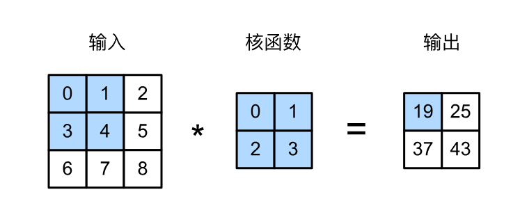
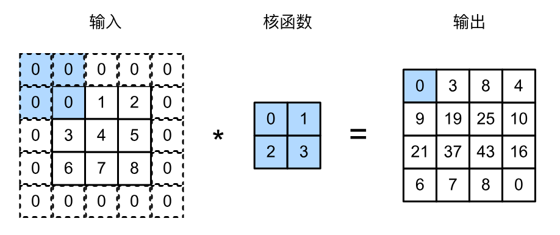
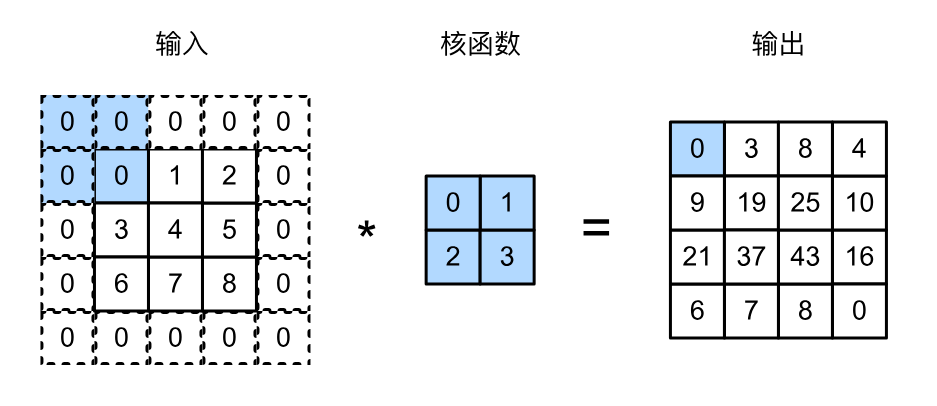
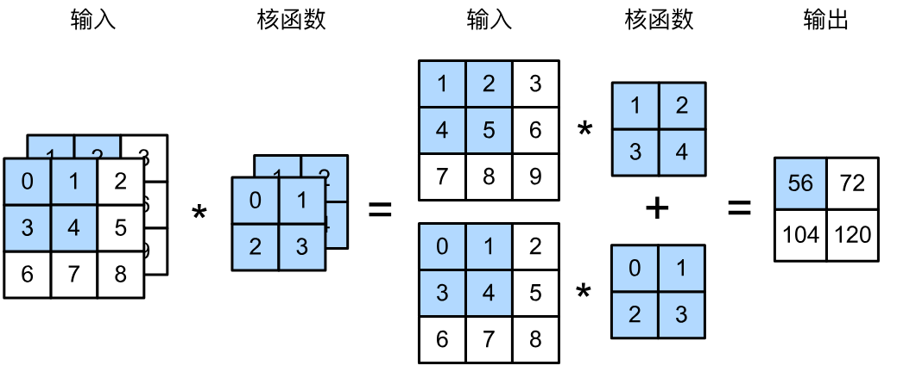
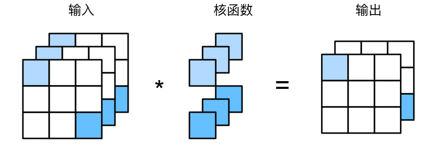
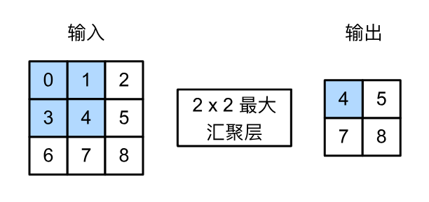
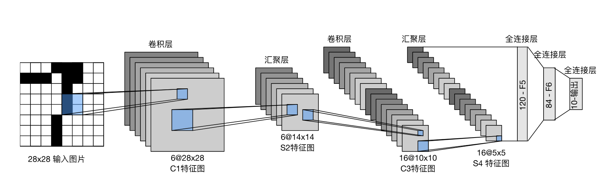
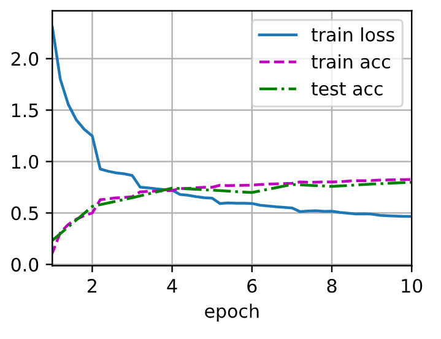

# 第六章 卷积神经网络

## 本章概述

在前面的章节中，我们处理图像数据时，采用了**将图像展平为一维向量**的方式，再输入全连接多层感知机。这种方法**完全忽略了图像的空间结构**——像素之间的相邻关系、局部模式、平移不变性等宝贵信息被丢弃了。随着图像尺寸增大，全连接网络的参数量会急剧膨胀，变得难以训练。

**卷积神经网络（CNN）** 正是为解决这些问题而设计的。它专门为处理图像等具有**网格结构**的数据而生，通过利用**局部性**和**平移不变性**两大先验知识，大幅减少了参数量，同时保留了空间结构信息。


### 卷积神经网络的核心优势

| 特性 | 说明 |
|------|------|
| **参数共享** | 同一个卷积核在图像的不同位置使用相同的权重，大幅减少参数量 |
| **局部连接** | 每个神经元只与输入的一小片局部区域连接，符合图像的局部相关性 |
| **空间结构保留** | 不展平图像，保持像素的二维空间关系 |
| **高效计算** | 卷积操作易于用GPU并行加速 |
| **泛化能力强** | 由于参数少且利用了正确的先验知识，在小数据集上也能表现良好 |


### 本章涵盖的内容

| 节号 | 内容 | 说明 |
|------|------|------|
| 6.1 | 从全连接层到卷积 | 理解为什么需要卷积，从MLP到卷积的数学推导 |
| 6.2 | 图像卷积 | 卷积运算的具体实现、互相关与卷积的区别 |
| 6.3 | 填充和步幅 | 控制输出尺寸的两个关键超参数 |
| 6.4 | 多输入多输出通道 | 彩色图像的多通道处理、特征图的扩展 |
| 6.5 | 汇聚层 | 池化操作（最大池化、平均池化）的作用 |
| 6.6 | 卷积神经网络（LeNet） | 第一个成功应用的CNN架构，手写数字识别 |


### 卷积神经网络的应用领域

卷积神经网络最初为计算机视觉设计，但如今已广泛应用于多个领域：

| 领域 | 应用示例 |
|------|----------|
| **计算机视觉** | 图像分类、目标检测、语义分割、人脸识别 |
| **医学影像** | CT/MRI图像分析、病理切片诊断 |
| **自动驾驶** | 车道检测、交通标志识别、行人检测 |
| **自然语言处理** | 文本分类、情感分析（1D卷积） |
| **音频处理** | 语音识别、音乐分类 |
| **推荐系统** | 图卷积网络（GCN）在社交网络和推荐中的应用 |


## 6.1 从全连接层到卷积

在之前的内容中，我们学习了多层感知机（MLP），它非常适合处理**表格数据**——每个样本有固定的特征维度，特征之间没有空间上的先后关系。

然而，当面对**高维感知数据**（如图像、音频、视频）时，全连接网络会遇到严重的参数爆炸问题。卷积神经网络（CNN）正是为了解决这一问题而设计的。

### 6.1.1 全连接网络在高维数据上的困境

以一张 \(1024 \times 1024\) 的彩色图像为例，它有 \(1024 \times 1024 \times 3 \approx 3 \times 10^6\) 个像素（输入维度）。如果隐藏层有 1000 个神经元，那么这一层的参数量为：

$$3 \times 10^6 \times 1000 = 3 \times 10^9 \text{（30亿个参数）}$$

训练这样一个模型需要海量的数据、计算资源和耐心，这在实践中是几乎不可行的。因此，我们需要一种**利用图像固有结构**的方法来大幅减少参数。

### 6.1.2 两个关键原则：平移不变性与局部性

人类能够快速识别图像中的物体（如“沃尔多在哪里？”游戏），是因为我们利用了视觉世界的两个重要特性：

#### 平移不变性（Translation Invariance）

**含义**：物体在图像中的位置不应影响其识别结果。无论在图像的左上角还是右下角，一只猫就是一只猫。

**数学意义**：检测器（卷积核）的权重应该在图像的所有位置**共享**，不依赖于具体位置。

#### 局部性（Locality）

**含义**：识别一个物体时，我们只需要关注其**局部邻域**的信息，而不需要全局信息。例如，识别一个像素是否属于猫的边缘，只需要看它周围几个像素即可。

**数学意义**：每个隐藏神经元的计算只依赖于输入中**邻近的一小片区域**，而不需要全图。

### 6.1.3 从全连接到卷积的数学推导

#### 第一步：全连接层的表示

对于输入图像 \(\mathbf{X}\) 和隐藏表示 \(\mathbf{H}\)，全连接层的一般形式为：

$$[\mathbf{H}]_{i,j} = [\mathbf{U}]_{i,j} + \sum_{a}\sum_{b} [\mathsf{W}]_{i,j,a,b} [\mathbf{X}]_{i+a, j+b}$$

其中：
- $\mathbf{U}_{i,j}$ 是全连接层的偏置项
- \([\mathbf{H}]_{i,j}\) 是隐藏表示中位置 \((i,j)\) 的值
- \([\mathbf{X}]_{i+a, j+b}\) 是输入图像中位置 \((i+a, j+b)\) 的像素值
- \(\mathsf{W}\) 是四阶权重张量（由于每个位置 \((i,j)\) 对每个输入位置 \((a,b)\) 都有自己的权重）

这个公式意味着：**每个输出位置都需要一组独立的权重**，导致参数量爆炸。

#### 第二步：施加平移不变性

平移不变性要求权重不依赖于输出位置 \((i,j)\)。因此：
$$\mathbf{U}_{i,j} = u$$

$$[\mathsf{W}]_{i,j,a,b} = [\mathbf{V}]_{a,b}$$

也就是说，所有位置共享同一个权重矩阵 \(\mathbf{V}\)。代入上式：

$$[\mathbf{H}]_{i,j} = u + \sum_{a}\sum_{b} [\mathbf{V}]_{a,b} [\mathbf{X}]_{i+a, j+b}$$

这就是**卷积操作**的雏形——用同一个卷积核在图像上滑动。

#### 第三步：施加局部性

局部性要求只考虑 \((i,j)\) 附近的像素，设定一个局部范围 \(\Delta\)：

$$[\mathbf{H}]_{i,j} = u + \sum_{a=-\Delta}^{\Delta} \sum_{b=-\Delta}^{\Delta} [\mathbf{V}]_{a,b} [\mathbf{X}]_{i+a, j+b}$$

这就是一个完整的**卷积层**的定义。其中 \(\mathbf{V}\) 就是**卷积核**（或滤波器），其尺寸为 \((2\Delta+1) \times (2\Delta+1)\)。

### 6.1.4 卷积的直观理解

**卷积核（Kernel）**：是一个小尺寸的权重矩阵，例如 \(3 \times 3\)。它在输入图像上**滑动**，在每个位置计算加权和，生成输出特征图。

**参数量的对比**：

| 网络类型 | 一层参数量 | 适用场景 |
|----------|-----------|----------|
| 全连接层 | \(10^9\)（10亿） | 低维固定特征 |
| 卷积层（核大小 \(3 \times 3\)） | \(3 \times 3 = 9\)（假设单通道） | 图像等空间数据 |

这就是卷积的威力：**参数量减少上亿倍**！

### 6.1.5 卷积的严格数学定义

#### 连续形式
在数学中，两个连续函数 \( f(t) \) 和 \( g(t) \) 的卷积定义为：

$$(f * g)(t) = \int_{-\infty}^{\infty} f(\tau) \, g(t - \tau) \, d\tau$$

**直观理解**：把 \( g \) **翻转**（\( \tau \rightarrow -\tau \)），然后**平移** \( t \)，计算 \( f \) 和翻转平移后的 \( g \) 的**重叠面积**。这就是“卷积”名称的由来——“卷”=翻转，“积”=积分。

#### 离散形式
对于离散序列，积分变成求和：
**一维离散卷积：**

$$(f * g)[n] = \sum_{k=-\infty}^{\infty} f[k] \, g[n - k]$$

**二维离散卷积（图像处理中）：**

$$(f * g)[i, j] = \sum_{a=-\infty}^{\infty} \sum_{b=-\infty}^{\infty} f[a, b] \, g[i-a, j-b]$$

在图像处理中，\( f \) 是输入图像，\( g \) 是卷积核（滤波器），两者大小都是有限的，所以求和范围限制在核的尺寸内。

**深度学习框架实际执行的是互相关，而不是真正的数学卷积：**

$$(f \star g)[i, j] = \sum_{a}\sum_{b} f[i+a, j+b] \, g[a, b]$$

| 维度 | 数学卷积 | CNN 的“卷积”（实际是互相关） |
|------|----------|------------------------------|
| **连续形式** | \( (f * g)(t) = \int f(\tau) g(t-\tau) d\tau \) | — |
| **离散形式** | \( (f * g)[i,j] = \sum_a\sum_b f[a,b] \, g[i-a,j-b] \) | \( (f \star g)[i,j] = \sum_a\sum_b f[i+a,j+b] \, g[a,b] \) |
| **是否翻转核** | ✅ 是（\( g \) 变成 \( g[-a,-b] \)） | ❌ 否（直接用 \( g \)） |

因为卷积核的参数是通过训练学出来的，如果网络需要“翻转”的效果，它完全可以通过调整权重值来学会。翻转与否对可学习的核来说没有本质区别，用互相关实现更简单、更高效。所以整个深度学习社区约定俗成：**把互相关称为“卷积”**。

> 数学上的卷积 = 翻转 + 滑动 + 加权求和；深度学习里的“卷积” = 不翻转 + 滑动 + 加权求和（严格叫互相关）。两者在可学习参数下等价，所以大家都混着叫。

### 6.1.6 多输入/输出通道

#### 为什么需要多个通道？

彩色图像有 RGB 三个通道。因此输入 \(\mathbf{X}\) 实际上是三维张量：\((高度, 宽度, 通道)\)。

为了处理多通道输入并产生多通道输出，卷积核也扩展为四维张量 \(\mathsf{V}\)：

$$[\mathsf{H}]_{i,j,d} = \sum_{a=-\Delta}^{\Delta} \sum_{b=-\Delta}^{\Delta} \sum_{c} [\mathsf{V}]_{a,b,c,d} [\mathsf{X}]_{i+a, j+b, c}$$

其中：
- \(c\) 是**输入通道**索引
- \(d\) 是**输出通道**索引

每个输出通道 \(d\) 都有自己的一组卷积核（每个输入通道一个），用于提取不同类型的特征（如边缘、纹理、颜色等）。

**直观理解**：靠近输入的通道可能识别**边缘**和**纹理**；靠近输出的通道可能识别**物体部件**（如眼睛、轮子）。

### 6.1.7 小结

| 概念 | 核心思想 |
|------|----------|
| **平移不变性** | 图像中物体的位置不应影响识别结果 → 权重在不同位置共享 |
| **局部性** | 识别物体只需关注局部信息 → 卷积核尺寸小 |
| **卷积** | 用滑动的小窗口（卷积核）在图像上提取局部特征 |
| **通道** | 每个通道提取一种特征，多个通道组合实现丰富表示 |
| **参数量** | 卷积层的参数量 = 核大小 × 输入通道 × 输出通道，远小于全连接层 |


## 6.2 图像卷积

上一节我们理解了卷积层的设计原理（平移不变性和局部性），本节将深入卷积层的具体实现——**互相关运算**，并通过代码演示卷积核如何检测图像边缘，以及如何从数据中学习卷积核参数。

### 6.2.1 互相关运算

**严格来说，卷积层实现的并不是数学上的卷积，而是互相关运算**。区别在于：互相关运算**不翻转卷积核**。

#### 运算过程

1. 卷积核（一个小矩阵）从输入张量的**左上角**开始
2. 按**从左到右、从上到下**的顺序滑动
3. 在每个位置，卷积核与覆盖的输入区域**逐元素相乘**，然后**求和**
4. 得到一个标量，填入输出张量的对应位置



**计算示例**（输入 \(3 \times 3\)，卷积核 \(2 \times 2\)）：

$$0 \times 0 + 1 \times 1 + 3 \times 2 + 4 \times 3 = 19$$
$$1 \times 0 + 2 \times 1 + 4 \times 2 + 5 \times 3 = 25$$
$$3 \times 0 + 4 \times 1 + 6 \times 2 + 7 \times 3 = 37$$
$$4 \times 0 + 5 \times 1 + 7 \times 2 + 8 \times 3 = 43$$

**输出形状**：

$$\text{输出高度} = n_h - k_h + 1$$
$$\text{输出宽度} = n_w - k_w + 1$$

即：输入 \((3 \times 3)\) + 核 \((2 \times 2)\) → 输出 \((2 \times 2)\)

#### 代码实现

```python
import torch
from torch import nn
from d2l import torch as d2l

def corr2d(X, K):
    """计算二维互相关运算"""
    h, w = K.shape                        # 卷积核的高度和宽度
    Y = torch.zeros((X.shape[0] - h + 1, X.shape[1] - w + 1)) # 代入公式计算
    # 遍历
    for i in range(Y.shape[0]):
        for j in range(Y.shape[1]):
            # 取出对应窗口，逐元素乘，求和
            Y[i, j] = (X[i:i + h, j:j + w] * K).sum()
    return Y

# 测试
X = torch.tensor([[0.0, 1.0, 2.0], [3.0, 4.0, 5.0], [6.0, 7.0, 8.0]])
K = torch.tensor([[0.0, 1.0], [2.0, 3.0]])
corr2d(X, K)          # tensor([[19., 25.], [37., 43.]])
```

### 6.2.2 卷积层

卷积层 = 互相关运算 + 偏置。可训练参数有两个：**卷积核权重**和**标量偏置**。

```python
class Conv2D(nn.Module):
    def __init__(self, kernel_size):
        super().__init__()
        self.weight = nn.Parameter(torch.rand(kernel_size))   # 随机初始化卷积核
        self.bias = nn.Parameter(torch.zeros(1))              # 偏置初始化为0

    def forward(self, x):
        return corr2d(x, self.weight) + self.bias
```

### 6.2.3 应用：边缘检测

卷积核可以检测图像中的**边缘**（像素变化的位置）。

#### 构造测试图像

创建一个 \(6 \times 8\) 的图像：**中间四列为黑色（0），其余为白色（1）**。

```python
X = torch.ones((6, 8))
X[:, 2:6] = 0          # 第2到5列设为0（黑色）
# tensor([[1., 1., 0., 0., 0., 0., 1., 1.], ...])
```

#### 设计边缘检测卷积核

```python
K = torch.tensor([[1.0, -1.0]])    # 1×2 卷积核
```

- 水平相邻像素**相同** → 输出为 **0**
- 水平相邻像素**从白到黑**（\(1 \to 0\)）→ 输出为 **1**（正边缘）
- 水平相邻像素**从黑到白**（\(0 \to 1\)）→ 输出为 **-1**（负边缘）

#### 执行互相关运算

```python
Y = corr2d(X, K)
# 输出：每一行在黑白交界处出现 1 或 -1
```

**结论**：该卷积核只能检测**垂直边缘**，无法检测水平边缘（对转置图像无效）。

```python
corr2d(X.t(), K)       # 转置后输出全为0，说明没有水平边缘
```

### 6.2.4 从数据中学习卷积核

我们能否**让网络自己学习**卷积核，而不是手动设计？答案是肯定的——利用`nn.Conv2d`模块。

```python
# 使用内置卷积层，1输入通道，1输出通道，核大小(1, 2)，无偏置
conv2d = nn.Conv2d(1, 1, kernel_size=(1, 2), bias=False)

# 调整数据形状：(批量大小, 通道数, 高度, 宽度)
X = X.reshape((1, 1, 6, 8))
Y = Y.reshape((1, 1, 6, 7))

lr = 3e-2
for i in range(10):
    Y_hat = conv2d(X)
    l = (Y_hat - Y) ** 2
    conv2d.zero_grad()
    l.sum().backward()
    conv2d.weight.data[:] -= lr * conv2d.weight.grad   # 梯度下降更新
    if (i + 1) % 2 == 0:
        print(f'epoch {i+1}, loss {l.sum():.3f}')
```

训练后，学习到的卷积核接近我们之前手动设计的 \([1, -1]\)：

```python
conv2d.weight.data.reshape((1, 2))   # tensor([[ 1.0486, -0.9313]])
```


### 6.2.5 特征映射与感受野

| 术语 | 含义 |
|------|------|
| **特征映射（Feature Map）** | 卷积层的输出，是输入图像经过卷积核提取后的特征图 |
| **感受野（Receptive Field）** | 输出层某个元素在输入层上所能“看到”的区域大小 |

**感受野随层数增加而扩大**：
- 第一层卷积：输出元素看到的是输入的一个小窗口（如 \(2 \times 2\)）
- 第二层卷积：输出元素看到的是第一层输出的多个元素，在原始输入上覆盖了更大的区域

> 这就是为什么**网络越深，每个神经元能感知的输入范围越大**，从而能检测更复杂的模式。

### 6.2.6 小结

| 要点 | 说明 |
|------|------|
| **互相关运算** | CNN实际执行的操作，不翻转卷积核 |
| **卷积层** | 互相关 + 偏置，核权重和偏置是可训练参数 |
| **边缘检测** | 通过设计特定卷积核（如 \([1, -1]\)）检测垂直/水平边缘 |
| **学习卷积核** | 可以通过反向传播从数据中自动学习核参数 |
| **互相关 vs 卷积** | 只差一个翻转，在学习情况下等价 |
| **感受野** | 越深的层，感受野越大，能捕捉更全局的特征 |


## 6.3 填充和步幅

在上一节中，我们了解到卷积操作的输出形状由输入形状和卷积核形状共同决定：

$$(n_h - k_h + 1) \times (n_w - k_w + 1)$$

这意味着每次卷积后特征图都会**缩小**。如果连续应用多层卷积，特征图会迅速变得很小。此外，我们有时也希望**主动缩小**特征图以提高计算效率。本节介绍两个控制输出形状的关键超参数：**填充（Padding）** 和 **步幅（Stride）**。

### 6.3.1 填充（Padding）

#### 为什么需要填充？

- 卷积每次会使特征图缩小（边缘信息丢失）
- 深层网络中，特征图会变得过小
- 边缘像素在卷积中“参与”次数较少，信息利用不充分

#### 什么是填充？

**填充** 是在输入图像的**边界周围添加额外的像素**（通常填充值为 0）。

如下图所示，将 \(3 \times 3\) 的输入填充为 \(5 \times 5\)（四周各加一圈 0），输出从 \(2 \times 2\) 变为 \(4 \times 4\)：



#### 填充后的输出形状

如果在高度两侧共添加 \(p_h\) 行填充，宽度两侧共添加 \(p_w\) 列填充，则输出形状为：

$$(n_h - k_h + p_h + 1) \times (n_w - k_w + p_w + 1)$$

**通常做法**：令 \(p_h = k_h - 1\)，\(p_w = k_w - 1\)，使**输出与输入形状相同**。

| 卷积核大小 | 所需填充（保持尺寸） |
|-----------|-------------------|
| \(1 \times 1\) | \(p = 0\) |
| \(3 \times 3\) | \(p = 1\) |
| \(5 \times 5\) | \(p = 2\) |
| \(7 \times 7\) | \(p = 3\) |

> **为什么卷积核通常用奇数（1、3、5、7）？** 因为奇数核可以**在上下左右对称填充**，且输出元素以输入对应位置为中心。

#### 代码示例

```python
import torch
from torch import nn

# 辅助函数：处理批量维度和通道维度
def comp_conv2d(conv2d, X):
    # 添加批量维度(1)和通道维度(1)
    X = X.reshape((1, 1) + X.shape)
    Y = conv2d(X)
    # 去掉批量维度和通道维度
    return Y.reshape(Y.shape[2:])

# 创建 3x3 卷积核，padding=1（每边填充1行/列，总共2行/列）
conv2d = nn.Conv2d(1, 1, kernel_size=3, padding=1)
X = torch.rand(size=(8, 8))
comp_conv2d(conv2d, X).shape          # torch.Size([8, 8])，输入输出形状相同
```

**不同维度上使用不同填充**：

```python
# 卷积核 5x3，高度填充2（上下各1），宽度填充1（左右各0.5，实际左右各补1列？）
# 注意：padding=(2,1) 表示高度两侧共2行，宽度两侧共1列
# 输出形状 = 8 - 5 + 2 + 1 = 6? 实际上用公式算 n_h - k_h + p_h + 1 = 8-5+2+1=6
# 但输出是8？因为padding=2, 总填充行数2，实际上下各1行，严格说应该是 p_h=2行总共
# 这里nn.Conv2d的padding=(2,1)表示高度方向总共填充2行，宽度方向总共填充1列
conv2d = nn.Conv2d(1, 1, kernel_size=(5, 3), padding=(2, 1))
comp_conv2d(conv2d, X).shape          # torch.Size([8, 8])
```

### 6.3.2 步幅（Stride）

#### 为什么需要步幅？

- 计算效率：大步幅可以大幅缩小特征图，减少计算量
- 降采样：主动降低空间分辨率，增加感受野

#### 什么是步幅？

**步幅** 是卷积窗口在输入上**每次滑动的行数/列数**。

如下图所示，垂直步幅为 3，水平步幅为 2：



#### 步幅后的输出形状

当垂直步幅为 \(s_h\)、水平步幅为 \(s_w\) 时：

$$\lfloor (n_h - k_h + p_h + s_h) / s_h \rfloor \times \lfloor (n_w - k_w + p_w + s_w) / s_w \rfloor$$

**常见简化**：当 \(p_h = k_h - 1\)，\(p_w = k_w - 1\) 时：

$$\lfloor (n_h + s_h - 1) / s_h \rfloor \times \lfloor (n_w + s_w - 1) / s_w \rfloor$$

如果输入高度/宽度能被步幅整除，则输出大小为：

$$(n_h / s_h) \times (n_w / s_w)$$

#### 代码示例

```python
# 3x3 卷积核，padding=1，步幅=2
# 输入 8x8 → 输出 (8-3+1+2)/2 = 8/2 = 4
conv2d = nn.Conv2d(1, 1, kernel_size=3, padding=1, stride=2)
comp_conv2d(conv2d, X).shape          # torch.Size([4, 4])
```

**复杂示例**（不同核大小、不同填充、不同步幅）：

```python
# 卷积核 3x5，高度填充0，宽度填充1，高度步幅3，宽度步幅4
# 输入 8x8
# 高度: floor((8-3+0+3)/3) = floor(8/3) = 2
# 宽度: floor((8-5+1+4)/4) = floor(8/4) = 2
conv2d = nn.Conv2d(1, 1, kernel_size=(3, 5), padding=(0, 1), stride=(3, 4))
comp_conv2d(conv2d, X).shape          # torch.Size([2, 2])
```

### 6.3.3 填充和步幅总结

| 参数 | 作用 | 对输出大小的影响 |
|------|------|----------------|
| **填充 (Padding)** | 在输入边界添加零值 | **增大**输出尺寸，保留边缘信息 |
| **步幅 (Stride)** | 控制窗口滑动步长 | **减小**输出尺寸，降低分辨率 |

**默认值**：
- 填充：\(p = 0\)
- 步幅：\(s = 1\)

**实践建议**：
- 通常使用**相同的填充和步幅**（\(p_h = p_w\)，\(s_h = s_w\)）
- 用填充保持尺寸，用步幅主动降采样
- 常见搭配：\(3 \times 3\) 卷积 + \(p = 1\) + \(s = 1\)（保持尺寸）
- 下采样时：\(3 \times 3\) 卷积 + \(p = 1\) + \(s = 2\)（尺寸减半）

### 6.3.4 小结

| 要点 | 说明 |
|------|------|
| **填充** | 在输入边界填充 0，使输出尺寸增大或保持不变 |
| **保持尺寸** | 通常取 \(p = (k - 1) / 2\)（当 \(k\) 为奇数时） |
| **步幅** | 卷积窗口滑动的步长，使输出尺寸减小 |
| **输出形状公式** | \(\lfloor (n - k + p + s) / s \rfloor\)（对称情况） |
| **设计惯例** | 奇数核（3、5、7）+ 对称填充 + 步幅控制降采样 |


## 6.4 多输入多输出通道

在之前的讨论中，我们一直使用**单输入单输出通道**的简化例子。然而，实际图像（如彩色图像）通常包含多个通道（RGB三个通道），而现代卷积神经网络也广泛使用**多输出通道**来提取更丰富的特征。本节将深入探讨多输入多输出通道的卷积核工作原理。

### 6.4.1 多输入通道

当输入包含多个通道时，卷积核需要**与输入具有相同的通道数**。运算过程为：

1. **每个输入通道**与卷积核的**对应通道**进行二维互相关运算
2. 将所有通道的运算结果**逐元素相加**，得到单通道输出

#### 图示说明

如下图所示，输入有两个通道（红色和绿色），卷积核也有两个通道。每个通道独立做互相关运算，然后将结果相加：



计算示例（阴影部分）：
- 通道1：\(1 \times 1 + 2 \times 2 + 4 \times 3 + 5 \times 4 = 37\)
- 通道2：\(0 \times 0 + 1 \times 1 + 3 \times 2 + 4 \times 3 = 19\)
- 输出：\(37 + 19 = 56\)

#### 代码实现

```python
import torch
from d2l import torch as d2l

def corr2d_multi_in(X, K):
    """多输入通道的互相关运算"""
    # zip(X, K) 将输入X和卷积核K按通道配对
    # 对每个通道执行corr2d，然后用sum将所有通道结果相加
    return sum(d2l.corr2d(x, k) for x, k in zip(X, K))
```

测试代码：

```python
X = torch.tensor([[[0.0, 1.0, 2.0], [3.0, 4.0, 5.0], [6.0, 7.0, 8.0]],
                  [[1.0, 2.0, 3.0], [4.0, 5.0, 6.0], [7.0, 8.0, 9.0]]])
K = torch.tensor([[[0.0, 1.0], [2.0, 3.0]], [[1.0, 2.0], [3.0, 4.0]]])

corr2d_multi_in(X, K)
# tensor([[ 56.,  72.],
#         [104., 120.]])
```

### 6.4.2 多输出通道

为了提取多种类型的特征（如边缘、纹理、颜色等），卷积层通常有**多个输出通道**。每个输出通道对应一个独立的卷积核（但每个卷积核的输入通道数等于输入的通道数），也就是说通过**引入多个卷积核**来实现多输出。

- **输入形状**：\((c_i, h, w)\)
- **卷积核形状**：\((c_o, c_i, k_h, k_w)\)
  - \(c_o\)：输出通道数
  - \(c_i\)：输入通道数
  - \(k_h, k_w\)：卷积核的高度和宽度
- **输出形状**：\((c_o, h', w')\)

每个输出通道的计算过程：
1. 用该输出通道对应的卷积核（形状 \(c_i \times k_h \times k_w\)）与输入进行多输入通道互相关运算
2. 得到一个二维输出

#### 代码实现

```python
def corr2d_multi_in_out(X, K):
    """多输入多输出通道的互相关运算"""
    # K的形状: (c_o, c_i, k_h, k_w)
    # 遍历K的第0维（输出通道），对每个卷积核执行corr2d_multi_in
    # torch.stack 将所有输出通道的结果堆叠在一起
    return torch.stack([corr2d_multi_in(X, k) for k in K], 0)
```

构造3个输出通道的卷积核（每个输出通道的卷积核不同）：

```python
# K的形状: (2, 2, 2, 2) -> (输入通道数2, 高2, 宽2)
# 构造3个不同的卷积核
K = torch.stack((K, K + 1, K + 2), 0)   # 形状: (3, 2, 2, 2)

corr2d_multi_in_out(X, K)
# 输出形状: (3, 2, 2)
```

### 6.4.3 \(1 \times 1\) 卷积层

\(1 \times 1\) 卷积核看起来似乎没有意义——它不提取相邻像素的空间信息。但它在现代神经网络中**非常流行**，因为它是一个**通道间的全连接层**。

#### 工作原理

- 卷积核大小：\(1 \times 1\)
- 输入形状：\((c_i, h, w)\)
- 卷积核形状：\((c_o, c_i, 1, 1)\)
- 输出形状：\((c_o, h, w)\)（**空间尺寸不变**）

**关键理解**：在每个像素位置 \((i, j)\)，\(1 \times 1\) 卷积将 \(c_i\) 个输入值通过一个全连接层映射为 \(c_o\) 个输出值。**跨像素的权重是共享的**。



#### 用全连接层实现 \(1 \times 1\) 卷积

```python
def corr2d_multi_in_out_1x1(X, K):
    """用矩阵乘法实现1x1卷积（等价于全连接层）"""
    c_i, h, w = X.shape          # 输入通道数, 高, 宽
    c_o = K.shape[0]             # 输出通道数
    
    # 将输入展平: (c_i, h*w)
    X = X.reshape((c_i, h * w))
    # 将卷积核展平: (c_o, c_i)
    K = K.reshape((c_o, c_i))
    
    # 矩阵乘法: (c_o, c_i) @ (c_i, h*w) = (c_o, h*w)
    Y = torch.matmul(K, X)
    
    # 恢复形状: (c_o, h, w)
    return Y.reshape((c_o, h, w))
```

验证两种实现等价：

```python
X = torch.normal(0, 1, (3, 3, 3))          # 3个输入通道
K = torch.normal(0, 1, (2, 3, 1, 1))       # 2个输出通道, 3个输入通道, 1x1

Y1 = corr2d_multi_in_out_1x1(X, K)
Y2 = corr2d_multi_in_out(X, K)
assert torch.abs(Y1 - Y2).sum() < 1e-6     # 两者结果相同
```

#### \(1 \times 1\) 卷积的作用

| 用途 | 说明 |
|------|------|
| **调整通道数** | 增加或减少通道维度，控制模型复杂度 |
| **跨通道信息融合** | 在不同通道间进行线性组合，整合特征 |
| **降维/升维** | 减少通道数可降低计算量（瓶颈结构） |
| **替代全连接层** | 在保持空间结构的同时实现全连接功能 |

### 6.4.4 小结

| 概念 | 核心要点 |
|------|----------|
| **多输入通道** | 卷积核通道数 = 输入通道数；各通道独立运算后求和 |
| **多输出通道** | 每个输出通道对应一个独立的卷积核；提取不同类型的特征 |
| **卷积核形状** | \((c_o, c_i, k_h, k_w)\)，其中 \(c_o\) 是输出通道数 |
| **\(1 \times 1\) 卷积** | 空间上不提取特征，但实现通道间的全连接；用于调整通道数 |
| **通道数变化趋势** | 随着网络加深，通道数通常增加，空间尺寸减小 |


## 6.5 汇聚层（池化层）

在卷积神经网络中，除了卷积层之外，**汇聚层（Pooling Layer）** 也是核心组件之一。它的主要作用是**降低特征图的空间分辨率**，从而减少计算量、增大感受野，同时增强模型对微小位移的**鲁棒性**（平移不变性）。

### 6.5.1 为什么需要汇聚层？

| 目标 | 说明 |
|------|------|
| **降低空间分辨率** | 减小特征图尺寸，减少后续层的计算量 |
| **增大感受野** | 让高层神经元能看到输入图像中更广的区域 |
| **平移不变性** | 即使物体在图像中发生微小移动，汇聚层的输出变化不大 |
| **防止过拟合** | 减少参数数量，降低模型复杂度 |

### 6.5.2 最大汇聚 vs 平均汇聚

汇聚层与卷积层的区别在于：**汇聚层没有可学习的参数**，它只是对窗口内的值进行固定的统计操作。

#### 最大汇聚（Max Pooling）

取汇聚窗口中的**最大值**作为输出：

$$Y[i, j] = \max(X[i:i+p_h, j:j+p_w])$$

#### 平均汇聚（Average Pooling）

取汇聚窗口中的**平均值**作为输出：

$$Y[i, j] = \frac{1}{p_h \cdot p_w} \sum X[i:i+p_h, j:j+p_w]$$

#### 图示

如下图所示，$2 \times 2$ 最大汇聚层，输出为每个窗口中的最大值：



计算过程：
- $\max(0,1,3,4) = 4$
- $\max(1,2,4,5) = 5$
- $\max(3,4,6,7) = 7$
- $\max(4,5,7,8) = 8$

### 6.5.3 从零实现汇聚层

```python
import torch
from torch import nn
from d2l import torch as d2l

def pool2d(X, pool_size, mode='max'):
    """实现二维汇聚层的前向传播"""
    p_h, p_w = pool_size
    Y = torch.zeros((X.shape[0] - p_h + 1, X.shape[1] - p_w + 1))
    for i in range(Y.shape[0]):
        for j in range(Y.shape[1]):
            if mode == 'max':
                Y[i, j] = X[i:i + p_h, j:j + p_w].max()
            elif mode == 'avg':
                Y[i, j] = X[i:i + p_h, j:j + p_w].mean()
    return Y
```

测试最大汇聚：

```python
X = torch.tensor([[0.0, 1.0, 2.0], [3.0, 4.0, 5.0], [6.0, 7.0, 8.0]])
pool2d(X, (2, 2))          # tensor([[4., 5.], [7., 8.]])
```

测试平均汇聚：

```python
pool2d(X, (2, 2), 'avg')   # tensor([[2., 3.], [5., 6.]])
```

### 6.5.4 填充和步幅

与卷积层一样，汇聚层也支持**填充（Padding）** 和**步幅（Stride）**。

**默认行为**：深度学习框架中，汇聚层的**步幅默认等于窗口大小**，即不重叠地滑动。

```python
X = torch.arange(16, dtype=torch.float32).reshape((1, 1, 4, 4))

# 默认：窗口(3,3)，步幅(3,3) → 输出 (1,1)
pool2d = nn.MaxPool2d(3)
pool2d(X)                  # tensor([[[[10.]]]])

# 手动设定：窗口(3,3)，填充1，步幅2 → 输出 (2,2)
pool2d = nn.MaxPool2d(3, padding=1, stride=2)
pool2d(X)                  # tensor([[[[ 5.,  7.], [13., 15.]]]])

# 矩形窗口：窗口(2,3)，步幅(2,3)，填充(0,1)
pool2d = nn.MaxPool2d((2, 3), stride=(2, 3), padding=(0, 1))
pool2d(X)
```

### 6.5.5 多通道上的汇聚

**关键区别**：汇聚层在每个通道上**独立运算**，不像卷积层那样在通道间进行汇总。因此，**输出通道数 = 输入通道数**。

```python
# 构造2个通道的输入
X = torch.cat((X, X + 1), 1)   # 形状: (1, 2, 4, 4)

pool2d = nn.MaxPool2d(3, padding=1, stride=2)
pool2d(X)                      # 输出形状: (1, 2, 2, 2) → 通道数保持为2
```

### 6.5.6 汇聚层的平移不变性

这是汇聚层最重要的特性之一。来看一个例子：

假设卷积层检测到图像中有一条**垂直边缘**，输出在边缘位置为1，其他位置为0。

- **不加汇聚**：边缘向右移动1个像素，输出也向右移动1个像素 → 位置敏感
- **加最大汇聚**：取 $2 \times 2$ 窗口内的最大值，只要边缘在窗口内，输出都是1 → **位置不敏感**

> 这就是汇聚层能增强平移不变性的原因——它关注的是“这个窗口里有没有特征”，而不是“特征在窗口的哪个位置”。

### 6.5.7 卷积层 vs 汇聚层

| 对比维度 | 卷积层 | 汇聚层 |
|----------|--------|--------|
| **是否有可训练参数** | ✅ 有（卷积核权重 + 偏置） | ❌ 无 |
| **运算方式** | 加权求和（互相关） | 最大值或平均值 |
| **通道处理** | 多通道输入 → 单通道输出（每个输出通道有独立核） | 多通道输入 → 多通道输出（逐通道独立操作） |
| **主要作用** | 提取局部特征 | 下采样、增强平移不变性 |
| **输出通道数** | 由卷积核数量决定（可任意设置） | 等于输入通道数 |

### 6.5.8 小结

| 要点 | 说明 |
|------|------|
| **最大汇聚** | 取窗口最大值，最常用，增强平移不变性 |
| **平均汇聚** | 取窗口平均值，通常用于网络末端 |
| **无参数** | 汇聚层没有可学习的参数，只有固定运算 |
| **独立通道** | 各通道独立汇聚，不改变通道数 |
| **填充和步幅** | 用法与卷积层相同，默认步幅=窗口大小 |
| **平移不变性** | 最大汇聚对此贡献最大 |


## 6.6 卷积神经网络（LeNet）

LeNet 是由 Yann LeCun 于 1989 年提出的最早的卷积神经网络之一，最初用于识别手写数字（如邮政编码）。它是第一个通过反向传播成功训练的卷积神经网络，并被广泛应用于自动取款机（ATM）的支票数字识别。时至今日，一些 ATM 仍在运行当年 LeCun 编写的代码。

### 6.6.1 LeNet 的架构

LeNet（LeNet-5）由两个核心部分组成：

| 部分 | 组成 | 作用 |
|------|------|------|
| **卷积编码器** | 2 个卷积层 + 激活函数 + 汇聚层 | 提取图像的空间特征 |
| **全连接层密集块** | 3 个全连接层 | 将特征映射到分类结果 |

#### 网络结构图



#### 逐层详解

| 层 | 操作 | 输入形状 | 输出形状 | 说明 |
|----|------|----------|----------|------|
| 1 | Conv2d + Sigmoid | (1, 28, 28) | (6, 28, 28) | 6 个 5×5 卷积核，padding=2（保持尺寸） |
| 2 | AvgPool2d | (6, 28, 28) | (6, 14, 14) | 2×2 窗口，步幅 2（尺寸减半） |
| 3 | Conv2d + Sigmoid | (6, 14, 14) | (16, 10, 10) | 16 个 5×5 卷积核，无 padding（尺寸减少 4） |
| 4 | AvgPool2d | (16, 10, 10) | (16, 5, 5) | 2×2 窗口，步幅 2（尺寸减半） |
| 5 | Flatten | (16, 5, 5) | (400,) | 展平为一维向量 |
| 6 | Linear + Sigmoid | (400,) | (120,) | 全连接层 |
| 7 | Linear + Sigmoid | (120,) | (84,) | 全连接层 |
| 8 | Linear | (84,) | (10,) | 输出层（10 个类别） |

> **注意**：原 LeNet-5 使用 Sigmoid 激活函数和平均汇聚层，因为当时（20 世纪 90 年代）ReLU 和最大汇聚层尚未普及。

#### 代码实现

```python
import torch
from torch import nn
from d2l import torch as d2l

net = nn.Sequential(
    # 卷积编码器部分
    nn.Conv2d(1, 6, kernel_size=5, padding=2), nn.Sigmoid(),   # 输入1通道 → 输出6通道
    nn.AvgPool2d(kernel_size=2, stride=2),                     # 28×28 → 14×14
    nn.Conv2d(6, 16, kernel_size=5), nn.Sigmoid(),             # 6通道 → 16通道
    nn.AvgPool2d(kernel_size=2, stride=2),                     # 10×10 → 5×5
    
    # 全连接层密集块
    nn.Flatten(),                                               # 16×5×5 = 400
    nn.Linear(16 * 5 * 5, 120), nn.Sigmoid(),
    nn.Linear(120, 84), nn.Sigmoid(),
    nn.Linear(84, 10)                                          # 10 个类别
)
```

#### 验证各层输出形状

```python
X = torch.rand(size=(1, 1, 28, 28), dtype=torch.float32)
for layer in net:
    X = layer(X)
    print(layer.__class__.__name__, 'output shape:', X.shape)
```

输出：
```
Conv2d output shape:   torch.Size([1, 6, 28, 28])
Sigmoid output shape:  torch.Size([1, 6, 28, 28])
AvgPool2d output shape: torch.Size([1, 6, 14, 14])
Conv2d output shape:   torch.Size([1, 16, 10, 10])
Sigmoid output shape:  torch.Size([1, 16, 10, 10])
AvgPool2d output shape: torch.Size([1, 16, 5, 5])
Flatten output shape:  torch.Size([1, 400])
Linear output shape:   torch.Size([1, 120])
Sigmoid output shape:  torch.Size([1, 120])
Linear output shape:   torch.Size([1, 84])
Sigmoid output shape:  torch.Size([1, 84])
Linear output shape:   torch.Size([1, 10])
```

### 6.6.2 GPU 训练适配

为了在 GPU 上训练模型，需要将数据和模型都移动到 GPU 设备。

**评估函数（GPU 版本）**：

```python
def evaluate_accuracy_gpu(net, data_iter, device=None):
    """使用GPU计算模型在数据集上的精度"""
    if isinstance(net, nn.Module):
        net.eval()                          # 切换到评估模式
        if not device:
            device = next(iter(net.parameters())).device
    
    metric = d2l.Accumulator(2)
    with torch.no_grad():
        for X, y in data_iter:
            X, y = X.to(device), y.to(device)
            metric.add(d2l.accuracy(net(X), y), y.numel())
    return metric[0] / metric[1]
```

**训练函数（GPU 版本）**：

```python
def train_ch6(net, train_iter, test_iter, num_epochs, lr, device):
    """用GPU训练模型"""
    # Xavier 初始化（适用于卷积层和全连接层）
    def init_weights(m):
        if type(m) == nn.Linear or type(m) == nn.Conv2d:
            nn.init.xavier_uniform_(m.weight)
    net.apply(init_weights)
    
    print('training on', device)
    net.to(device)                          # 将模型移到 GPU
    
    optimizer = torch.optim.SGD(net.parameters(), lr=lr)
    loss = nn.CrossEntropyLoss()
    animator = d2l.Animator(xlabel='epoch', xlim=[1, num_epochs],
                            legend=['train loss', 'train acc', 'test acc'])
    
    for epoch in range(num_epochs):
        metric = d2l.Accumulator(3)
        net.train()
        for X, y in train_iter:
            optimizer.zero_grad()
            # 将张量转移到 GPU 上
            X, y = X.to(device), y.to(device)
            y_hat = net(X)
            l = loss(y_hat, y)
            l.backward()
            optimizer.step()
            metric.add(l * X.shape[0], d2l.accuracy(y_hat, y), X.shape[0])
        
        test_acc = evaluate_accuracy_gpu(net, test_iter)
        # 记录并显示训练损失、训练精度、测试精度
    return train_l, train_acc, test_acc
```

### 6.6.3 在 Fashion-MNIST 上训练

```python
batch_size = 256
train_iter, test_iter = d2l.load_data_fashion_mnist(batch_size=batch_size)

lr, num_epochs = 0.9, 10
train_ch6(net, train_iter, test_iter, num_epochs, lr, d2l.try_gpu())
```

训练结果示例：
```
loss 0.467, train acc 0.825, test acc 0.821
88556.9 examples/sec on cuda:0
```


### 6.6.4 关键设计思想

| 设计思想 | 在 LeNet 中的体现 |
|----------|-------------------|
| **空间分辨率递减** | 28×28 → 14×14 → 5×5 → 展平 |
| **通道数递增** | 1 → 6 → 16 → 120 → 84 → 10 |
| **卷积提取局部特征** | 两个 5×5 卷积层 |
| **汇聚降低分辨率** | 两个 2×2 平均汇聚层（步幅 2） |
| **全连接层分类** | 3 个全连接层将特征映射到类别 |

**趋势**：随着网络加深，**空间尺寸减小**，**通道数增加**。浅层（靠近输入）提取低级特征（边缘、纹理），深层提取高级语义特征（形状、物体部件）。

### 6.6.5 小结

| 要点 | 说明 |
|------|------|
| **LeNet 架构** | 2 个卷积层 + 3 个全连接层 |
| **激活函数** | 原版使用 Sigmoid（当时 ReLU 未普及） |
| **汇聚层** | 原版使用平均汇聚（现代通常用最大汇聚） |
| **设计模式** | 空间尺寸递减，通道数递增 |
| **历史意义** | 第一个成功应用的 CNN，启发了现代所有卷积网络 |
| **现代改进** | 可用 ReLU + 最大汇聚 + Dropout + 更多层提升性能 |

##　思维导图
第六章：卷积神经网络
│
├── 6.1 从全连接层到卷积
│   ├── 问题：全连接层在高维图像上参数爆炸（30亿参数）
│   ├── 两大原则：平移不变性 + 局部性
│   ├── 数学推导：全连接 → 卷积（施加平移不变性 + 局部性）
│   └── 卷积 = 滑动窗口的加权求和（严格说是互相关）
│
├── 6.2 图像卷积
│   ├── 互相关运算：不翻转卷积核的“卷积”
│   ├── 卷积层 = 互相关 + 偏置
│   ├── 边缘检测：卷积核 [1, -1] 可检测垂直边缘
│   └── 学习卷积核：通过反向传播自动学习核参数
│
├── 6.3 填充和步幅
│   ├── 填充：在输入边界加0 → 控制输出尺寸，保留边缘信息
│   ├── 步幅：窗口滑动步长 → 控制输出尺寸，主动降采样
│   └── 输出形状公式：⌊(n - k + p + s) / s⌋
│
├── 6.4 多输入多输出通道
│   ├── 多输入通道：各通道独立运算后求和
│   ├── 多输出通道：每个输出通道一个独立卷积核 → 提取不同特征
│   ├── 卷积核形状：(c_o, c_i, k_h, k_w)
│   └── 1×1卷积：通道间的全连接层，调整通道数
│
├── 6.5 汇聚层（池化层）
│   ├── 最大汇聚：取窗口最大值 → 增强平移不变性
│   ├── 平均汇聚：取窗口平均值
│   ├── 特点：无参数，逐通道独立操作，步幅默认=窗口大小
│   └── 作用：下采样 + 增强平移不变性
│
└── 6.6 LeNet
    ├── 架构：2个卷积层 + 3个全连接层
    ├── 设计模式：空间尺寸递减，通道数递增
    ├── 历史意义：第一个成功应用的CNN
    └── 特点：Sigmoid + 平均汇聚（当时ReLU/最大汇聚未普及）