# 第十章 注意力机制

## 本章概述

灵长类动物的视觉系统每时每刻都在接收海量信息，远超大脑的完整处理能力。然而，并非所有信息同等重要——**注意力**让我们能够聚焦于关键目标（如猎物或天敌），忽略无关干扰。这种选择性关注能力对生存至关重要。

本章将系统介绍深度学习中的**注意力机制**，它受人类视觉注意力的启发，成为现代人工智能的核心技术。从早期的Nadaraya-Watson核回归到革命性的Transformer架构，我们将全面探索注意力机制的理论基础与实现方法。

### 什么是注意力机制？

| 类比 | 说明 |
|------|------|
| **人类视觉** | 在复杂场景中，我们不会处理每个像素，而是快速扫描并聚焦于感兴趣的区域 |
| **注意力机制** | 模型不会平等对待所有输入，而是**动态分配计算资源**到最重要的部分 |

### 本章内容

| 章节 | 内容 |
|------|------|
| **10.1 注意力提示** | 从认知科学角度理解注意力的基本概念 |
| **10.2 注意力汇聚：Nadaraya-Watson 核回归** | 注意力机制的早期数学原型 |
| **10.3 注意力评分函数** | 深度学习中的注意力核心计算 |
| **10.4 Bahdanau 注意力** | 机器翻译中的突破性注意力模型 |
| **10.5 多头注意力** | 从不同角度同时关注 |
| **10.6 自注意力** | 序列内部的自注意力机制 |
| **10.7 Transformer** | 纯注意力架构的革命性模型 |

### 注意力机制的核心思想

```
所有输入 → 计算注意力权重（重要性分数）→ 加权求和 → 聚焦后的表示
            ↑
        根据当前任务动态分配
```

### 本章学习目标

完成本章学习后，你将能够：

1. 理解**注意力机制**的基本原理和数学形式
2. 掌握**Nadaraya-Watson 核回归**与注意力的联系
3. 实现多种**注意力评分函数**
4. 理解**Bahdanau 注意力**在机器翻译中的作用
5. 掌握**多头注意力**和**自注意力**的核心概念
6. 理解 **Transformer** 架构的设计思想

### 核心思想

> **注意力机制的本质是"选择性关注"——不是平等地看待所有信息，而是根据当前任务动态地决定"看哪里、看多仔细"。这种灵活性让模型能够从海量信息中高效提取最有价值的内容。**

### CNN、RNN与Transformer的对比

| 对比维度 | CNN | RNN | Transformer |
|----------|-----|-----|-------------|
| **适用数据** | 图像（空间结构） | 序列（时间结构） | 任意序列 |
| **核心操作** | 卷积 | 状态更新 | 注意力 |
| **感受野** | 局部（需多层扩展） | 逐步扩展 | 全局（一步到位） |
| **并行计算** | 容易 | 困难 | 最容易 |
| **长距离依赖** | 困难 | 困难 | 自然捕获 |

### 一句话总结

> **如果说RNN是"顺序阅读"，CNN是"局部扫描"，那么注意力机制就是"智能聚焦"——它让模型能够像人类一样，在海量信息中迅速锁定最重要的部分，并根据任务需求灵活分配计算资源。Transformer正是基于这一思想，彻底改变了深度学习的格局。**


## 10.1 注意力提示
### 10.1.1 注意力的生物学基础

人类的视觉神经系统每秒接收约 $10^8$ 位的信息，远超大脑能够完全处理的水平。为了应对这种信息过载，人类进化出了**选择性注意力**的能力——只将注意力引向感兴趣的一小部分信息。

#### 注意力的两种类型

19世纪90年代，威廉·詹姆斯提出了注意力研究的**双组件框架**：

| 注意力类型 | 驱动方式 | 特点 | 生活中的例子 |
|-----------|---------|------|-------------|
| **非自主性提示** | 外部刺激的**突出性**和**易见性** | 自动、不自主、由环境驱动 | 红色杯子在黑白物体中自动吸引视线 |
| **自主性提示** | 认知和**意识控制** | 主动、谨慎、由任务目标驱动 | 想读书时主动将视线转向书本 |


### 10.1.2 注意力机制的框架：查询、键、值

注意力机制的核心理念可以概括为**查询-键-值**框架：

| 概念 | 来源 | 对应 | 生活中的比喻 |
|------|------|------|-------------|
| **查询（Query）** | 自主性提示 | 当前任务的目标 | 在图书馆找书时的"书名" |
| **键（Key）** | 非自主性提示 | 每个输入的特征标识 | 书脊上的标签 |
| **值（Value）** | 感官输入 | 每个输入的实际内容 | 书本身的内容 |

**工作流程**：

```
1. 给定查询 Q（我想找什么）
2. 将 Q 与所有键 K_i 进行匹配（哪些书与书名匹配）
3. 计算匹配程度的权重（匹配度）
4. 用权重对值 V_i 进行加权求和（提取最相关的内容）
```

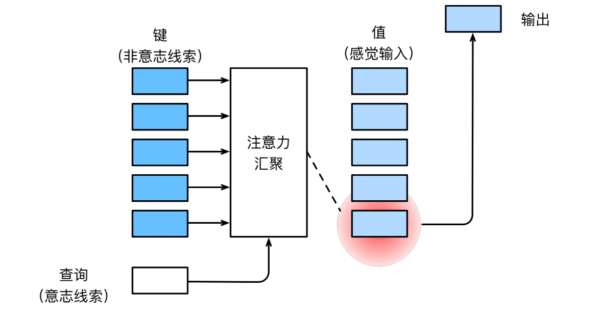

### 10.1.3 注意力的可视化

注意力权重展示了查询和键之间的匹配程度。**热图（Heatmap）** 是一种常用的可视化方式：

```python
import torch
from d2l import torch as d2l

def show_heatmaps(matrices, xlabel, ylabel, titles=None, figsize=(2.5, 2.5),
                  cmap='Reds'):
    """显示矩阵热图"""
    d2l.use_svg_display()
    num_rows, num_cols = matrices.shape[0], matrices.shape[1]
    fig, axes = d2l.plt.subplots(num_rows, num_cols, figsize=figsize,
                                 sharex=True, sharey=True, squeeze=False)
    for i, (row_axes, row_matrices) in enumerate(zip(axes, matrices)):
        for j, (ax, matrix) in enumerate(zip(row_axes, row_matrices)):
            pcm = ax.imshow(matrix.detach().numpy(), cmap=cmap)
            if i == num_rows - 1:
                ax.set_xlabel(xlabel)
            if j == 0:
                ax.set_ylabel(ylabel)
            if titles:
                ax.set_title(titles[j])
    fig.colorbar(pcm, ax=axes, shrink=0.6)

# 示例：仅当查询和键相同时权重为1，否则为0
attention_weights = torch.eye(10).reshape((1, 1, 10, 10))
show_heatmaps(attention_weights, xlabel='Keys', ylabel='Queries')
```
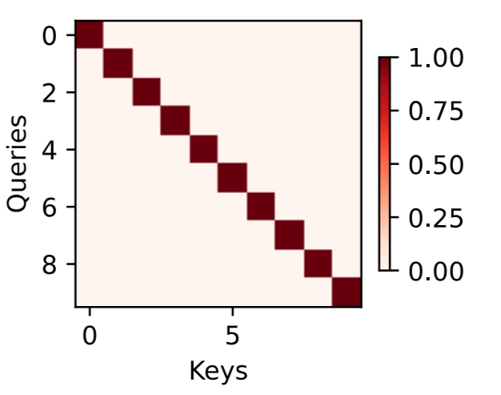

### 10.1.4 核心概念总结

| 要点 | 说明 |
|------|------|
| **非自主性提示** | 外部刺激的突出性自动吸引注意力 |
| **自主性提示** | 基于任务目标的主动注意力 |
| **查询（Query）** | 自主性提示，代表"我想关注什么" |
| **键（Key）** | 非自主性提示，代表"我是什么" |
| **值（Value）** | 感官输入，代表"我的信息是什么" |
| **注意力汇聚** | 根据查询和键的匹配程度，对值进行加权平均 |
| **可视化** | 热图显示查询对每个键的关注程度 |

### 10.1.5 小结

> **注意力机制的核心是"选择性关注"——通过查询（目标）与键（标签）的匹配程度，决定从值（内容）中提取多少信息。其本质是动态的、基于内容的加权平均。**


## 10.2 注意力汇聚：Nadaraya-Watson 核回归
### 10.2.1 什么是 Nadaraya-Watson 核回归？

Nadaraya-Watson 核回归（1964年）是一种非参数统计方法，用于估计随机变量之间的条件期望。它的核心思想是：**根据输入 $x$ 与训练数据 $x_i$ 的"相似度"，对对应的输出 $y_i$ 进行加权平均**。其数学形式与现代注意力机制完全一致，可以看作注意力机制的早期原型。

### 10.2.2 生成数据集

```python
import torch
from torch import nn
from d2l import torch as d2l

# ==================== 1. 生成数据集 ====================
# 生成 50 个训练样本，x 在 [0, 5) 范围内排序
n_train = 50
x_train, _ = torch.sort(torch.rand(n_train) * 5)

def f(x):
    """真实函数：2*sin(x) + x^0.8"""
    return 2 * torch.sin(x) + x**0.8

# 添加均值为 0、标准差为 0.5 的噪声
y_train = f(x_train) + torch.normal(0.0, 0.5, (n_train,))

# 测试样本：从 0 到 5，步长 0.1
x_test = torch.arange(0, 5, 0.1)
y_truth = f(x_test)  # 真实值（无噪声）
n_test = len(x_test)
```

```python
def plot_kernel_reg(y_hat):
    """绘制训练样本、真实函数和预测函数"""
    d2l.plot(x_test, [y_truth, y_hat], 'x', 'y', legend=['Truth', 'Pred'],
             xlim=[0, 5], ylim=[-1, 5])
    d2l.plt.plot(x_train, y_train, 'o', alpha=0.5)
```

### 10.2.3 平均汇聚（最简单的估计器）

直接取所有训练样本输出的平均值作为预测：

$$f(x) = \frac{1}{n} \sum_{i=1}^n y_i$$

```python
# 预测值恒等于训练样本输出的均值
y_hat = torch.repeat_interleave(y_train.mean(), n_test)
plot_kernel_reg(y_hat)
```
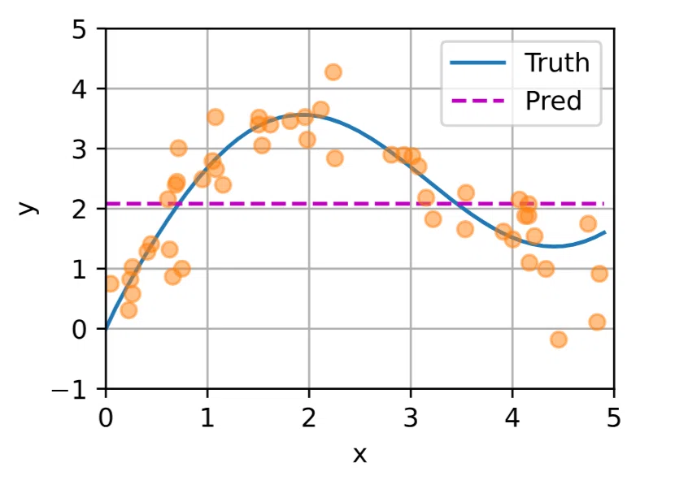

**结论**：平均汇聚完全忽略了输入 $x$ 的信息，预测是一条水平直线，效果很差。

### 10.2.4 非参数注意力汇聚（Nadaraya-Watson 核回归）

#### 数学定义

Nadaraya-Watson 核回归的预测公式：

$$f(x) = \sum_{i=1}^n \frac{K(x - x_i)}{\sum_{j=1}^n K(x - x_j)} y_i$$

其中 $K$ 是核函数（如高斯核 $K(u) = \frac{1}{\sqrt{2\pi}} \exp(-u^2/2)$）。

#### 注意力视角的重塑

将查询 $x$、键 $x_i$、值 $y_i$ 代入：

$$f(x) = \sum_{i=1}^n \alpha(x, x_i) y_i$$

其中注意力权重为：

$$\alpha(x, x_i) = \frac{\exp\left(-\frac{1}{2}(x - x_i)^2\right)}{\sum_{j=1}^n \exp\left(-\frac{1}{2}(x - x_j)^2\right)} = \text{softmax}\left(-\frac{1}{2}(x - x_i)^2\right)$$

**核心思想**：查询 $x$ 与键 $x_i$ 越接近，注意力权重越高，对应的值 $y_i$ 对预测的贡献越大。

#### 代码实现

```python
# ==================== 2. 非参数注意力汇聚 ====================
# X_repeat 形状: (n_test, n_train)
# 每一行都包含相同的测试输入（查询）
X_repeat = x_test.repeat_interleave(n_train).reshape((-1, n_train))

# 计算高斯核注意力权重
# 使用 softmax 对 -(x - x_i)^2 / 2 进行归一化
# 距离越近，权重越大
attention_weights = nn.functional.softmax(-(X_repeat - x_train)**2 / 2, dim=1)

# 加权求和：每个查询的预测 = 注意力权重 × 训练输出
# attention_weights: (n_test, n_train), y_train: (n_train,)
# 结果: (n_test,)
y_hat = torch.matmul(attention_weights, y_train)

# 绘图
plot_kernel_reg(y_hat)
```

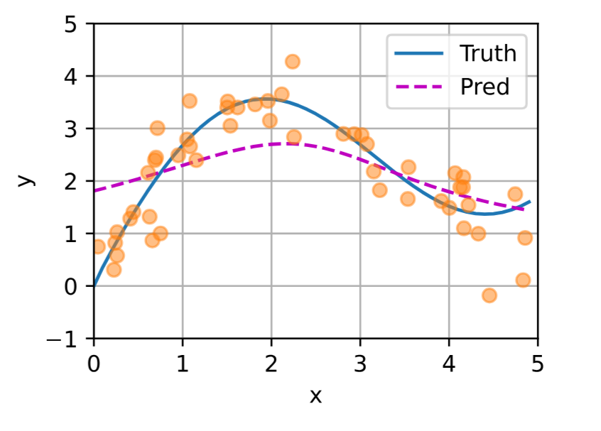

**观察**：预测曲线平滑，且比平均汇聚更接近真实函数。

#### 可视化注意力权重

```python
# 热图显示：行 = 测试输入（查询），列 = 训练输入（键）
# 颜色越红表示注意力权重越大
d2l.show_heatmaps(attention_weights.unsqueeze(0).unsqueeze(0),
                  xlabel='Sorted training inputs',
                  ylabel='Sorted testing inputs')
```

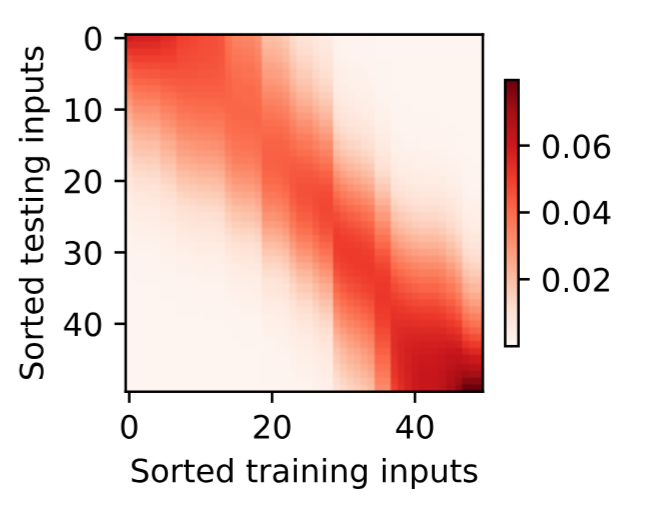

**观察**：当查询与键接近时（对角线附近），注意力权重较高。

### 10.2.5 带参数注意力汇聚

#### 引入可学习参数

在距离计算中引入可学习参数 $w$：

$$f(x) = \sum_{i=1}^n \text{softmax}\left(-\frac{1}{2}((x - x_i)w)^2\right) y_i$$

当 $w$ 增大时，注意力权重在距离较近的区域变得更加集中（更尖锐）；当 $w$ 减小时，权重分布更平滑。

#### 批量矩阵乘法（Batch Matrix Multiplication）

```python
# 批量矩阵乘法示例
X = torch.ones((2, 1, 4))
Y = torch.ones((2, 4, 6))
torch.bmm(X, Y).shape  # torch.Size([2, 1, 6])

# 使用批量矩阵乘法计算加权平均
weights = torch.ones((2, 10)) * 0.1  # 2 个样本，每个 10 个权重
values = torch.arange(20.0).reshape((2, 10))
# unsqueeze 增加维度后做矩阵乘法： (2, 1, 10) @ (2, 10, 1) -> (2, 1, 1)
torch.bmm(weights.unsqueeze(1), values.unsqueeze(-1))
```

输出：
```
tensor([[[ 4.5000]],
        [[14.5000]]])
```

#### 带参数注意力模型定义

```python
# ==================== 3. 带参数注意力汇聚模型 ====================
class NWKernelRegression(nn.Module):
    """Nadaraya-Watson 核回归的带参数版本"""
    def __init__(self, **kwargs):
        super().__init__(**kwargs)
        # 可学习的参数 w，初始化为随机值
        self.w = nn.Parameter(torch.rand((1,), requires_grad=True))

    def forward(self, queries, keys, values):
        """
        Args:
            queries: 查询，形状 (查询个数,)
            keys: 键，形状 (查询个数, 键-值对个数)
            values: 值，形状 (查询个数, 键-值对个数)
        Returns:
            加权平均结果，形状 (查询个数,)
        """
        # 将 queries 扩展为与 keys 相同的形状，以便逐元素计算
        queries = queries.repeat_interleave(keys.shape[1]).reshape((-1, keys.shape[1]))
        
        # 计算带参数的注意力权重
        # softmax(-((queries - keys) * w)^2 / 2)
        self.attention_weights = nn.functional.softmax(
            -((queries - keys) * self.w)**2 / 2, dim=1)
        
        # 批量矩阵乘法计算加权平均
        # attention_weights: (n, m), values: (n, m)
        # unsqueeze(1): (n, 1, m), unsqueeze(-1): (n, m, 1)
        # 结果: (n, 1, 1) -> reshape(-1): (n,)
        return torch.bmm(self.attention_weights.unsqueeze(1),
                         values.unsqueeze(-1)).reshape(-1)
```

#### 准备训练数据

训练时需要让模型对每个训练样本进行"留一法"预测（用除自己外的所有样本预测自己）：

```python
# ==================== 4. 准备训练数据 ====================
# X_tile: (n_train, n_train)，每行都是相同的训练输入
X_tile = x_train.repeat((n_train, 1))
Y_tile = y_train.repeat((n_train, 1))

# 创建对角线为 0 的掩码（去除自身）
# torch.eye(n_train) 单位矩阵，type(torch.bool) 转为布尔
# (1 - eye) 对角线为 0，其余为 1，然后通过 bool 索引取出
mask = (1 - torch.eye(n_train)).type(torch.bool)

# keys: (n_train, n_train-1)，每个样本去除自身后的其他样本的 x
keys = X_tile[mask].reshape((n_train, -1))
# values: (n_train, n_train-1)，每个样本去除自身后的其他样本的 y
values = Y_tile[mask].reshape((n_train, -1))
```

#### 训练模型

```python
# ==================== 5. 训练 ====================
net = NWKernelRegression()
loss = nn.MSELoss(reduction='none')
trainer = torch.optim.SGD(net.parameters(), lr=0.5)
animator = d2l.Animator(xlabel='epoch', ylabel='loss', xlim=[1, 5])

for epoch in range(5):
    trainer.zero_grad()
    # 用除自身外的所有样本预测自身
    l = loss(net(x_train, keys, values), y_train)
    l.sum().backward()
    trainer.step()
    print(f'epoch {epoch + 1}, loss {float(l.sum()):.6f}')
    animator.add(epoch + 1, float(l.sum()))
```

输出：
```
epoch 1, loss 18.739462
epoch 2, loss 17.532285
epoch 3, loss 16.382753
epoch 4, loss 15.204321
epoch 5, loss 14.653472
```

#### 预测与可视化

```python
# ==================== 6. 预测 ====================
# keys: (n_test, n_train)，每行都是相同的训练输入
keys = x_train.repeat((n_test, 1))
values = y_train.repeat((n_test, 1))
y_hat = net(x_test, keys, values).unsqueeze(1).detach()
plot_kernel_reg(y_hat)
```

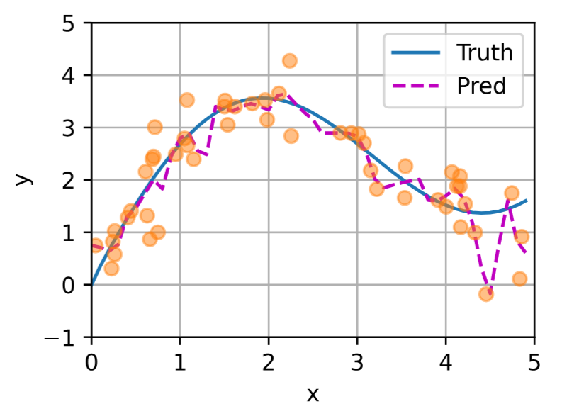

#### 学习到的注意力权重

```python
# 可视化训练后的注意力权重
d2l.show_heatmaps(net.attention_weights.unsqueeze(0).unsqueeze(0),
                  xlabel='Sorted training inputs',
                  ylabel='Sorted testing inputs')
```

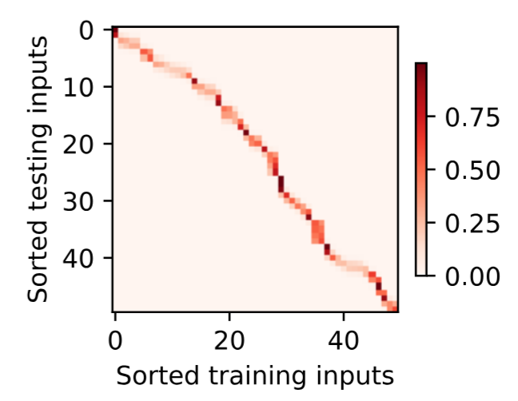

**观察**：学习到的参数 $w$ 使注意力权重在距离较近的区域变得更加**尖锐**（更集中），模型可以更好地拟合训练数据。

### 10.2.6 关键概念总结

| 概念 | 说明 |
|------|------|
| **平均汇聚** | 最简单估计器，完全忽略输入，预测为所有输出均值 |
| **Nadaraya-Watson 核回归** | 非参数方法，根据查询-键相似度对值加权平均 |
| **高斯核** | 产生 softmax 形式的注意力权重 $\propto \exp(-(x-x_i)^2/2)$ |
| **非参数 vs 带参数** | 非参数无训练参数；带参数引入可学习 $w$ 控制权重分布 |
| **注意力权重** | 查询与键的匹配度，决定每个值的贡献大小 |
| **批量矩阵乘法** | 高效计算批量加权平均 |


## 10.3 注意力评分函数
### 10.3.1 什么是注意力评分函数？

注意力评分函数 $a(\mathbf{q}, \mathbf{k}_i)$ 用于计算**查询** $\mathbf{q}$ 和**键** $\mathbf{k}_i$ 之间的**相关性**或**匹配程度**。评分函数的输出经过 softmax 归一化后，得到注意力权重。

**核心流程**：
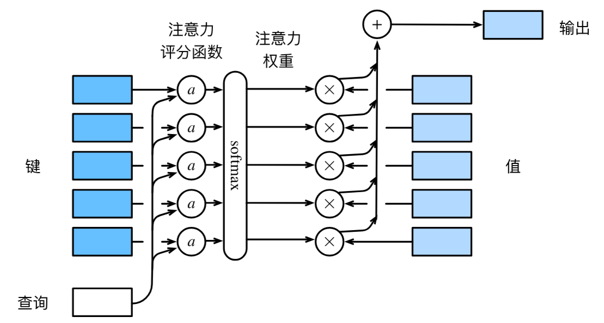

**数学表达**：

$$f(\mathbf{q}, (\mathbf{k}_1, \mathbf{v}_1), \ldots) = \sum_{i=1}^m \alpha(\mathbf{q}, \mathbf{k}_i) \mathbf{v}_i$$

$$\alpha(\mathbf{q}, \mathbf{k}_i) = \text{softmax}(a(\mathbf{q}, \mathbf{k}_i)) = \frac{\exp(a(\mathbf{q}, \mathbf{k}_i))}{\sum_{j=1}^m \exp(a(\mathbf{q}, \mathbf{k}_j))}$$

### 10.3.2 掩蔽 softmax（Masked Softmax）

在处理变长序列时（如机器翻译），短序列会被填充 `<pad>` 词元。这些填充位置**不应参与注意力计算**。应该将其填充为一个**较大的负值数**，经过softmax函数后会变为**0**。

```python
import math
import torch
from torch import nn
from d2l import torch as d2l

def masked_softmax(X, valid_lens):
    """
    通过在最后一个轴上掩蔽元素来执行 softmax 操作
    
    Args:
        X: 3D 张量 (batch_size, 查询数, 键数)
        valid_lens: 有效长度，1D (batch_size,) 或 2D (batch_size, 查询数)
    
    Returns:
        掩蔽后的 softmax 结果
    """
    if valid_lens is None:
        return nn.functional.softmax(X, dim=-1)
    else:
        shape = X.shape
        if valid_lens.dim() == 1:
            # 将每个有效长度重复 shape[1] 次（每个查询对应一个长度）
            valid_lens = torch.repeat_interleave(valid_lens, shape[1])
        else:
            valid_lens = valid_lens.reshape(-1)
        # 将超出有效长度的位置替换为 -1e6（softmax 后变为 0）
        X = d2l.sequence_mask(X.reshape(-1, shape[-1]), valid_lens, value=-1e6)
        return nn.functional.softmax(X.reshape(shape), dim=-1)
```

**示例**：

```python
# 2 个样本，每个 2 个查询，4 个键
# 有效长度分别为 2 和 3
masked_softmax(torch.rand(2, 2, 4), torch.tensor([2, 3]))
```

输出：
```
tensor([[[0.3313, 0.6687, 0.0000, 0.0000],
         [0.4467, 0.5533, 0.0000, 0.0000]],

        [[0.1959, 0.4221, 0.3820, 0.0000],
         [0.3976, 0.2466, 0.3558, 0.0000]]])
```

```python
# 二维 valid_lens：每个样本的每个查询单独指定有效长度
masked_softmax(torch.rand(2, 2, 4), torch.tensor([[1, 3], [2, 4]]))
```

### 10.3.3 加性注意力（Additive Attention）

当查询和键的**长度不同**时，使用加性注意力评分函数。

**数学定义**：

$$a(\mathbf{q}, \mathbf{k}) = \mathbf{w}_v^\top \tanh(\mathbf{W}_q \mathbf{q} + \mathbf{W}_k \mathbf{k}) \in \mathbb{R}$$

其中 $\mathbf{W}_q \in \mathbb{R}^{h \times q}$，$\mathbf{W}_k \in \mathbb{R}^{h \times k}$，$\mathbf{w}_v \in \mathbb{R}^{h}$ 都是可学习参数。

**计算流程**：

1. 将查询 $\mathbf{q}$ 和键 $\mathbf{k}$ 分别通过线性层投影到维度 $h$
2. 相加后经过 $\tanh$ 激活
3. 再通过一个线性层得到标量分数

```python
class AdditiveAttention(nn.Module):
    """
    加性注意力
    
    适用场景：查询和键的维度不同
    """
    def __init__(self, key_size, query_size, num_hiddens, dropout, **kwargs):
        super(AdditiveAttention, self).__init__(**kwargs)
        self.W_k = nn.Linear(key_size, num_hiddens, bias=False)      # 键投影
        self.W_q = nn.Linear(query_size, num_hiddens, bias=False)    # 查询投影
        self.w_v = nn.Linear(num_hiddens, 1, bias=False)             # 输出标量
        self.dropout = nn.Dropout(dropout)

    def forward(self, queries, keys, values, valid_lens):
        """
        Args:
            queries: (batch_size, 查询数, query_size)
            keys: (batch_size, 键数, key_size)
            values: (batch_size, 键数, 值维度)
            valid_lens: (batch_size,) 或 (batch_size, 查询数)
        
        Returns:
            注意力汇聚结果 (batch_size, 查询数, 值维度)
        """
        # 1. 投影查询和键
        queries = self.W_q(queries)  # (batch_size, 查询数, num_hiddens)
        keys = self.W_k(keys)        # (batch_size, 键数, num_hiddens)
        
        # 2. 广播求和：扩展维度后相加
        # queries: (batch_size, 查询数, 1, num_hiddens)
        # keys:    (batch_size, 1, 键数, num_hiddens)
        features = queries.unsqueeze(2) + keys.unsqueeze(1)
        features = torch.tanh(features)   # (batch_size, 查询数, 键数, num_hiddens)
        
        # 3. 计算分数并掩蔽
        scores = self.w_v(features).squeeze(-1)  # (batch_size, 查询数, 键数)
        self.attention_weights = masked_softmax(scores, valid_lens)
        
        # 4. 加权求和
        return torch.bmm(self.dropout(self.attention_weights), values)
```

**示例**：

```python
# 查询：2 个样本，各 1 个查询，维度 20
# 键：2 个样本，各 10 个键，维度 2
queries = torch.normal(0, 1, (2, 1, 20))
keys = torch.ones((2, 10, 2))
values = torch.arange(40, dtype=torch.float32).reshape(1, 10, 4).repeat(2, 1, 1)
valid_lens = torch.tensor([2, 6])

attention = AdditiveAttention(key_size=2, query_size=20, num_hiddens=8, dropout=0.1)
attention.eval()
attention(queries, keys, values, valid_lens)
```

输出：
```
tensor([[[ 2.0000,  3.0000,  4.0000,  5.0000]],
        [[10.0000, 11.0000, 12.0000, 13.0000]]])
```

**可视化注意力权重**：

```python
d2l.show_heatmaps(attention.attention_weights.reshape((1, 1, 2, 10)),
                  xlabel='Keys', ylabel='Queries')
```
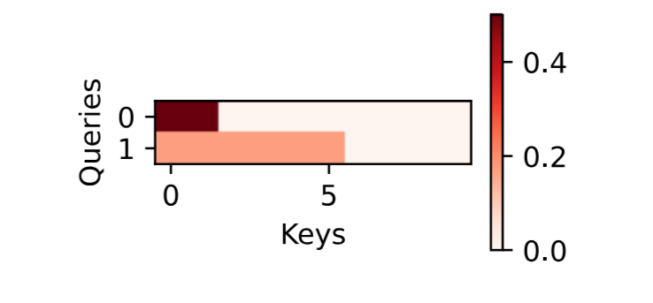

### 10.3.4 缩放点积注意力（Scaled Dot-Product Attention）

当查询和键的**长度相同**时，使用点积作为评分函数，计算效率更高。

**为什么需要缩放？**

假设查询和键的元素都是独立随机变量，均值为 0，方差为 1。则点积 $\mathbf{q}^\top \mathbf{k}$ 的均值为 0，方差为 $d$。当 $d$ 较大时，点积值会很大，导致 softmax 的梯度进入饱和区。除以 $\sqrt{d}$ 可使方差保持为 1。

**评分函数**：

$$a(\mathbf{q}, \mathbf{k}) = \frac{\mathbf{q}^\top \mathbf{k}}{\sqrt{d}}$$

**批量矩阵形式**：

$$\text{Attention}(\mathbf{Q}, \mathbf{K}, \mathbf{V}) = \text{softmax}\left(\frac{\mathbf{Q} \mathbf{K}^\top}{\sqrt{d}}\right) \mathbf{V}$$

其中 $\mathbf{Q} \in \mathbb{R}^{n \times d}$，$\mathbf{K} \in \mathbb{R}^{m \times d}$，$\mathbf{V} \in \mathbb{R}^{m \times v}$。

```python
class DotProductAttention(nn.Module):
    """
    缩放点积注意力
    
    适用场景：查询和键的维度相同
    """
    def __init__(self, dropout, **kwargs):
        super(DotProductAttention, self).__init__(**kwargs)
        self.dropout = nn.Dropout(dropout)

    def forward(self, queries, keys, values, valid_lens=None):
        """
        Args:
            queries: (batch_size, 查询数, d)
            keys: (batch_size, 键数, d)
            values: (batch_size, 键数, 值维度)
            valid_lens: (batch_size,) 或 (batch_size, 查询数)
        """
        d = queries.shape[-1]
        # 计算点积并缩放
        # keys.transpose(1,2) 交换最后两个维度
        scores = torch.bmm(queries, keys.transpose(1, 2)) / math.sqrt(d)
        self.attention_weights = masked_softmax(scores, valid_lens)
        return torch.bmm(self.dropout(self.attention_weights), values)
```

**示例**：

```python
# 查询维度与键维度相同（d=2）
queries = torch.normal(0, 1, (2, 1, 2))
attention = DotProductAttention(dropout=0.5)
attention.eval()
attention(queries, keys, values, valid_lens)
```

输出：
```
tensor([[[ 2.0000,  3.0000,  4.0000,  5.0000]],
        [[10.0000, 11.0000, 12.0000, 13.0000]]])
```
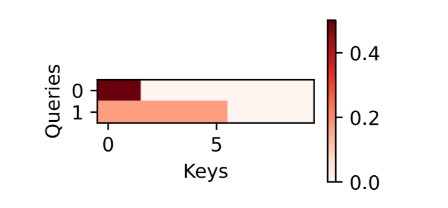

### 10.3.5 两种评分函数对比

| 特性 | 加性注意力 | 缩放点积注意力 |
|------|-----------|---------------|
| **适用条件** | 查询和键维度可以不同 | 查询和键维度必须相同 |
| **计算复杂度** | $O(h \cdot (q + k))$ | $O(d)$（更快） |
| **可学习参数** | $\mathbf{W}_q, \mathbf{W}_k, \mathbf{w}_v$ | 无 |
| **是否可训练** | 是 | 否（仅计算） |
| **使用场景** | 跨模态（文本+图像） | Transformer 标准选择 |

### 10.3.6 核心公式汇总

| 公式 | 含义 |
|------|------|
| $a(\mathbf{q}, \mathbf{k}) = \mathbf{w}_v^\top \tanh(\mathbf{W}_q\mathbf{q} + \mathbf{W}_k\mathbf{k})$ | 加性注意力评分 |
| $a(\mathbf{q}, \mathbf{k}) = \mathbf{q}^\top \mathbf{k} / \sqrt{d}$ | 缩放点积注意力评分 |
| $\alpha(\mathbf{q}, \mathbf{k}_i) = \text{softmax}(a(\mathbf{q}, \mathbf{k}_i))$ | 注意力权重（概率分布） |
| $f(\mathbf{q}, \ldots) = \sum_i \alpha_i \mathbf{v}_i$ | 注意力汇聚输出 |
| $\text{Attention}(\mathbf{Q}, \mathbf{K}, \mathbf{V}) = \text{softmax}(\mathbf{Q}\mathbf{K}^\top/\sqrt{d})\mathbf{V}$ | 批量缩放点积注意力 |

### 10.3.7 小结

| 要点 | 说明 |
|------|------|
| **评分函数** | 计算查询与键的匹配程度，输出标量分数 |
| **softmax** | 将分数转换为非负且和为 1 的注意力权重 |
| **加性注意力** | 通过 MLP 计算评分，适用于维度不同的场景 |
| **缩放点积注意力** | 通过点积计算评分，效率更高，Transformer 使用 |
| **掩蔽 softmax** | 屏蔽填充位置，只对有效位置计算注意力 |


## 10.4 Bahdanau 注意力
本节的核心：**用注意力机制来增强 Seq2Seq**。

### 10.4.1 为什么需要 Bahdanau 注意力？

在传统的 Seq2Seq 模型中，编码器将整个输入序列压缩为一个**固定的上下文向量** $\mathbf{c}$，解码器在每个时间步都使用同一个 $\mathbf{c}$。

**存在的问题**：

| 问题 | 说明 |
|------|------|
| **信息瓶颈** | 整个源序列压缩为单一固定向量，长句信息丢失 |
| **长序列崩溃** | 序列越长，早期信息越容易被"遗忘" |
| **无对齐能力** | 模型无法"查看"源句子中与当前预测最相关的部分 |

**Bahdanau 注意力（2014年）的突破**：允许解码器在**每一步动态地关注**源序列中与当前预测相关的部分。

### 10.4.2 核心思想

**传统 Seq2Seq**：

$$\mathbf{c} = \mathbf{h}_T \quad \text{（固定上下文向量）}$$

**Bahdanau 注意力**：

$$\mathbf{c}_{t'} = \sum_{t=1}^T \alpha(\mathbf{s}_{t'-1}, \mathbf{h}_t) \mathbf{h}_t \quad \text{（动态上下文向量）}$$

其中：
- $\mathbf{s}_{t'-1}$：解码器上一时间步的隐状态（**查询**）
- $\mathbf{h}_t$：编码器第 $t$ 个时间步的隐状态（**键**和**值**）
- $\alpha$：加性注意力评分函数

### 10.4.3 架构对比

| 组件 | Seq2Seq（无注意力） | Seq2Seq + Bahdanau |
|------|-------------------|-------------------|
| **上下文向量** | 固定 $\mathbf{c} = \mathbf{h}_T$ | 动态 $\mathbf{c}_{t'}$（每个解码步不同） |
| **解码器输入** | $\mathbf{s}_{t'} = g(y_{t'-1}, \mathbf{s}_{t'-1}, \mathbf{c})$ | $\mathbf{s}_{t'} = g(y_{t'-1}, \mathbf{s}_{t'-1}, \mathbf{c}_{t'})$ |
| **对齐能力** | 无 | 有（自动学习源-目标对齐） |

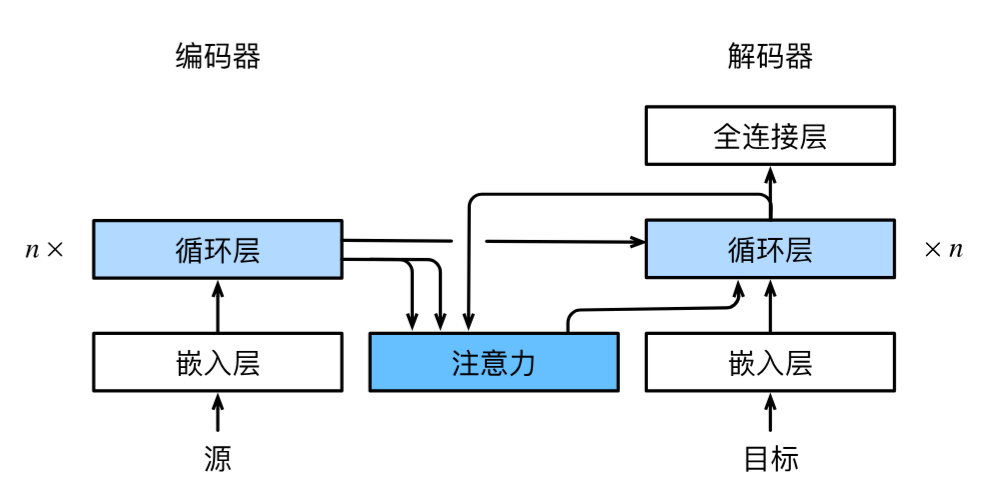

### 10.4.4 注意力解码器接口

```python
import torch
from torch import nn
from d2l import torch as d2l

class AttentionDecoder(d2l.Decoder):
    """带有注意力机制解码器的基本接口"""
    def __init__(self, **kwargs):
        super(AttentionDecoder, self).__init__(**kwargs)

    @property
    def attention_weights(self):
        """返回注意力权重（用于可视化）"""
        raise NotImplementedError
```

### 10.4.5 Bahdanau 注意力解码器实现

```python
class Seq2SeqAttentionDecoder(AttentionDecoder):
    """
    带有 Bahdanau 注意力的循环神经网络解码器
    
    核心改动：
        1. 每个解码步动态计算上下文向量 c_t
        2. 将注意力输出与输入拼接后送入 RNN
    """
    def __init__(self, vocab_size, embed_size, num_hiddens, num_layers,
                 dropout=0, **kwargs):
        super(Seq2SeqAttentionDecoder, self).__init__(**kwargs)
        
        # ---- 1. 加性注意力 ----
        # 查询(解码器隐状态)和键(编码器隐状态)维度都是 num_hiddens
        self.attention = d2l.AdditiveAttention(
            num_hiddens, num_hiddens, num_hiddens, dropout)
        
        # ---- 2. 嵌入层 ----
        self.embedding = nn.Embedding(vocab_size, embed_size)
        
        # ---- 3. GRU 解码器 ----
        # 输入维度 = embed_size + num_hiddens（拼接注意力输出）
        self.rnn = nn.GRU(
            embed_size + num_hiddens, num_hiddens, num_layers,
            dropout=dropout)
        
        # ---- 4. 输出层 ----
        self.dense = nn.Linear(num_hiddens, vocab_size)

    def init_state(self, enc_outputs, enc_valid_lens, *args):
        """
        初始化解码器状态
        
        Args:
            enc_outputs: (所有时间步的隐状态, 最终隐状态)
            enc_valid_lens: 编码器有效长度
        
        Returns:
            state: (编码器输出, 解码器隐状态, 有效长度)
        """
        outputs, hidden_state = enc_outputs
        # outputs: (batch_size, num_steps, num_hiddens) - 转置为 (batch_size, num_steps, num_hiddens)
        # hidden_state: (num_layers, batch_size, num_hiddens)
        return (outputs.permute(1, 0, 2), hidden_state, enc_valid_lens)

    def forward(self, X, state):
        """
        解码器前向传播
        
        Args:
            X: 目标输入，形状 (batch_size, num_steps)
            state: (enc_outputs, hidden_state, enc_valid_lens)
        
        Returns:
            output: (batch_size, num_steps, vocab_size)
            state: 更新后的状态
        """
        enc_outputs, hidden_state, enc_valid_lens = state
        
        # X 嵌入并转置: (num_steps, batch_size, embed_size)
        X = self.embedding(X).permute(1, 0, 2)
        
        outputs, self._attention_weights = [], []
        
        # ---- 逐时间步解码 ----
        for x in X:  # x: (batch_size, embed_size)
            # 1. 查询 = 解码器最后一层的隐状态
            # hidden_state[-1]: (batch_size, num_hiddens)
            # unsqueeze(1): (batch_size, 1, num_hiddens)
            query = torch.unsqueeze(hidden_state[-1], dim=1)
            
            # 2. 计算注意力上下文
            # query: (batch_size, 1, num_hiddens)
            # enc_outputs: (batch_size, num_steps, num_hiddens)
            # context: (batch_size, 1, num_hiddens)
            context = self.attention(
                query, enc_outputs, enc_outputs, enc_valid_lens)
            
            # 3. 拼接上下文和当前输入
            # x: (batch_size, embed_size) -> unsqueeze(1): (batch_size, 1, embed_size)
            # concat: (batch_size, 1, embed_size + num_hiddens)
            x = torch.cat((context, torch.unsqueeze(x, dim=1)), dim=-1)
            
            # 4. RNN 前向传播
            # x.permute(1, 0, 2): (1, batch_size, embed_size + num_hiddens)
            out, hidden_state = self.rnn(x.permute(1, 0, 2), hidden_state)
            
            # 5. 记录输出和注意力权重
            outputs.append(out)
            self._attention_weights.append(self.attention.attention_weights)
        
        # 6. 输出层
        outputs = self.dense(torch.cat(outputs, dim=0))
        # outputs: (num_steps, batch_size, vocab_size) -> (batch_size, num_steps, vocab_size)
        return outputs.permute(1, 0, 2), [enc_outputs, hidden_state, enc_valid_lens]

    @property
    def attention_weights(self):
        """返回所有时间步的注意力权重"""
        return self._attention_weights
```

### 10.4.6 测试解码器

```python
# 编码器
encoder = d2l.Seq2SeqEncoder(vocab_size=10, embed_size=8, num_hiddens=16,
                             num_layers=2)
encoder.eval()

# 解码器
decoder = Seq2SeqAttentionDecoder(vocab_size=10, embed_size=8, num_hiddens=16,
                                  num_layers=2)
decoder.eval()

# 测试输入：4个样本，7个时间步
X = torch.zeros((4, 7), dtype=torch.long)
state = decoder.init_state(encoder(X), None)
output, state = decoder(X, state)

print(output.shape)          # torch.Size([4, 7, 10])
print(len(state))            # 3 (enc_outputs, hidden_state, enc_valid_lens)
print(state[0].shape)        # torch.Size([4, 7, 16])
print(len(state[1]))         # 2 (num_layers)
print(state[1][0].shape)     # torch.Size([4, 16])
```

输出：
```
torch.Size([4, 7, 10])
3
torch.Size([4, 7, 16])
2
torch.Size([4, 16])
```

### 10.4.7 训练

```python
# ==================== 超参数设置 ====================
embed_size, num_hiddens, num_layers, dropout = 32, 32, 2, 0.1
batch_size, num_steps = 64, 10
lr, num_epochs, device = 0.005, 250, d2l.try_gpu()

# ==================== 加载数据 ====================
train_iter, src_vocab, tgt_vocab = d2l.load_data_nmt(batch_size, num_steps)

# ==================== 创建模型 ====================
encoder = d2l.Seq2SeqEncoder(
    len(src_vocab), embed_size, num_hiddens, num_layers, dropout)
decoder = Seq2SeqAttentionDecoder(
    len(tgt_vocab), embed_size, num_hiddens, num_layers, dropout)
net = d2l.EncoderDecoder(encoder, decoder)

# ==================== 训练 ====================
d2l.train_seq2seq(net, train_iter, lr, num_epochs, tgt_vocab, device)
```

输出：
```
loss 0.020, 5482.1 tokens/sec on cuda:0
```

### 10.4.8 翻译测试

```python
engs = ['go .', "i lost .", "he's calm .", "i'm home ."]
fras = ['va !', "j'ai perdu .", "il est calme .", "je suis chez moi ."]

for eng, fra in zip(engs, fras):
    translation, dec_attention_weight_seq = d2l.predict_seq2seq(
        net, eng, src_vocab, tgt_vocab, num_steps, device, True)
    print(f'{eng} => {translation}, bleu {d2l.bleu(translation, fra, k=2):.3f}')
```

输出：
```
go . => va !, bleu 1.000
i lost . => j'ai perdu ., bleu 1.000
he's calm . => il est riche ., bleu 0.658
i'm home . => je suis chez moi ., bleu 1.000
```

### 10.4.9 可视化注意力权重

```python
# 提取注意力权重
attention_weights = torch.cat([step[0][0][0] for step in dec_attention_weight_seq], 0)
attention_weights = attention_weights.reshape((1, 1, -1, num_steps))

# 绘制热图
d2l.show_heatmaps(
    attention_weights[:, :, :, :len(engs[-1].split()) + 1].cpu(),
    xlabel='Key positions', ylabel='Query positions')
```

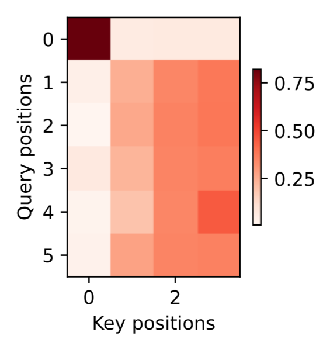

**观察**：每个查询（解码时间步）对不同的键（源语言位置）分配不同的权重，说明模型学会了自动对齐。

### 10.4.10 Bahdanau 注意力 vs 传统 Seq2Seq

| 对比维度 | 传统 Seq2Seq | Bahdanau 注意力 |
|----------|-------------|-----------------|
| **上下文向量** | 固定 $\mathbf{c} = \mathbf{h}_T$ | 动态 $\mathbf{c}_{t'}$（每个解码步不同） |
| **源信息利用** | 压缩为单一向量 | 每个解码步选择性关注不同位置 |
| **长句处理** | 差（信息丢失） | 好（动态选择相关部分） |
| **可解释性** | 无 | 有（注意力权重可视化） |
| **计算量** | 较少 | 较大（每步计算注意力） |

### 10.4.11 核心公式汇总

| 公式 | 含义 |
|------|------|
| $\mathbf{c}_{t'} = \sum_{t=1}^T \alpha(\mathbf{s}_{t'-1}, \mathbf{h}_t) \mathbf{h}_t$ | 动态上下文向量 |
| $\alpha(\mathbf{s}, \mathbf{h}) = \text{softmax}(a(\mathbf{s}, \mathbf{h}))$ | 注意力权重 |
| $a(\mathbf{s}, \mathbf{h}) = \mathbf{w}_v^\top \tanh(\mathbf{W}_q\mathbf{s} + \mathbf{W}_k\mathbf{h})$ | 加性注意力评分 |
| $\mathbf{s}_{t'} = g(y_{t'-1}, \mathbf{s}_{t'-1}, \mathbf{c}_{t'})$ | 解码器状态更新 |
| $P(y_{t'} \mid \ldots) = \text{softmax}(\mathbf{s}_{t'} \mathbf{W}_o)$ | 输出概率分布 |

### 10.4.12 小结

| 要点 | 说明 |
|------|------|
| **核心突破** | 打破信息瓶颈，每个解码步动态关注源序列的不同位置 |
| **查询** | 解码器上一时间步的隐状态 $\mathbf{s}_{t'-1}$ |
| **键和值** | 编码器所有时间步的隐状态 $\mathbf{h}_t$ |
| **评分函数** | 加性注意力（因为查询和键维度相同） |
| **可解释性** | 注意力权重热图展示源-目标对齐关系 |
| **改进效果** | 显著提升长句翻译质量 |


## 10.5 多头注意力
### 10.5.1 为什么需要多头注意力？

单头注意力有个问题：**它只能从一个角度去"看"输入**。

| 问题 | 说明 |
|------|------|
| **单一视角** | 一个注意力头只能关注一种模式（如语法关系或语义相似性） |
| **表达能力有限** | 复杂任务需要从多个角度同时关注 |
| **无法捕获多种关系** | 同一句话中可能存在多种依赖关系（句法、语义、指代等） |

**多头注意力的思想**：用 $h$ 个"头"并行地看，每个头关注不同的方面，最后把结果合并起来。

---

## 10.5.2 核心思想

### 通俗类比

| 场景 | 多头注意力 |
|------|-----------|
| **审问犯人** | 多个侦探从不同角度审问，最后汇总信息 |
| **看一幅画** | 不同专家分别看色彩、构图、笔触，最后综合判断 |
| **多头注意力** | 每个头看不同的子空间，最后合并知识 |

### 架构图

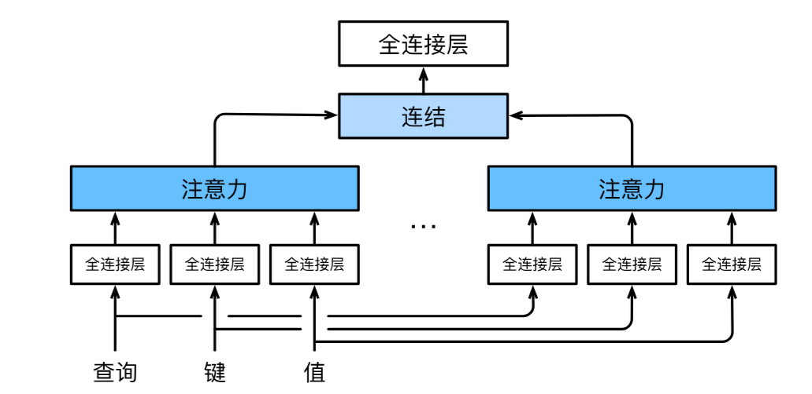

## 10.5.3 数学定义

### 单头注意力（回顾）

$$\text{head}_i = \text{Attention}(\mathbf{Q} \mathbf{W}_i^Q, \mathbf{K} \mathbf{W}_i^K, \mathbf{V} \mathbf{W}_i^V)$$

### 多头注意力

$$\text{MultiHead}(\mathbf{Q}, \mathbf{K}, \mathbf{V}) = \text{Concat}(\text{head}_1, \ldots, \text{head}_h) \mathbf{W}^O$$

其中每个头为：

$$\text{head}_i = \text{Attention}(\mathbf{Q} \mathbf{W}_i^Q, \mathbf{K} \mathbf{W}_i^K, \mathbf{V} \mathbf{W}_i^V)$$

### 参数说明

| 参数 | 形状 | 含义 |
|------|------|------|
| $\mathbf{W}_i^Q$ | $d_{\text{model}} \times d_k$ | 第 $i$ 个头的查询投影 |
| $\mathbf{W}_i^K$ | $d_{\text{model}} \times d_k$ | 第 $i$ 个头的键投影 |
| $\mathbf{W}_i^V$ | $d_{\text{model}} \times d_v$ | 第 $i$ 个头的值投影 |
| $\mathbf{W}^O$ | $(h \cdot d_v) \times d_{\text{model}}$ | 输出投影 |


## 10.5.4 代码实现

```python
import math
import torch
from torch import nn
from d2l import torch as d2l

class MultiHeadAttention(nn.Module):
    """
    多头注意力
    
    核心思想：
        1. 将 Q, K, V 分别投影到 h 个子空间
        2. 每个子空间独立计算注意力
        3. 拼接所有头的输出并再次投影
    """
    def __init__(self, key_size, query_size, value_size, num_hiddens,
                 num_heads, dropout, bias=False, **kwargs):
        """
        Args:
            key_size: 键的维度
            query_size: 查询的维度
            value_size: 值的维度
            num_hiddens: 隐藏单元数（也是最终输出维度）
            num_heads: 头的数量
            dropout: Dropout 概率
            bias: 是否使用偏置
        """
        super(MultiHeadAttention, self).__init__(**kwargs)
        self.num_heads = num_heads
        # 使用缩放点积注意力作为每个头的注意力函数
        self.attention = d2l.DotProductAttention(dropout)
        
        # 四个线性投影层
        self.W_q = nn.Linear(query_size, num_hiddens, bias=bias)  # 查询投影
        self.W_k = nn.Linear(key_size, num_hiddens, bias=bias)    # 键投影
        self.W_v = nn.Linear(value_size, num_hiddens, bias=bias)  # 值投影
        self.W_o = nn.Linear(num_hiddens, num_hiddens, bias=bias) # 输出投影

    def forward(self, queries, keys, values, valid_lens):
        """
        前向传播
        
        Args:
            queries: (batch_size, 查询数, num_hiddens)
            keys: (batch_size, 键数, num_hiddens)
            values: (batch_size, 键数, num_hiddens)
            valid_lens: (batch_size,) 或 (batch_size, 查询数)
        
        Returns:
            output: (batch_size, 查询数, num_hiddens)
        """
        # ---- 1. 线性投影并分头 ----
        # 每个头分配 num_hiddens / num_heads 维
        # 经过 transpose_qkv 后形状: (batch_size * num_heads, 序列长度, num_hiddens/num_heads)
        queries = transpose_qkv(self.W_q(queries), self.num_heads)
        keys = transpose_qkv(self.W_k(keys), self.num_heads)
        values = transpose_qkv(self.W_v(values), self.num_heads)

        # ---- 2. 复制有效长度（每个头都要用） ----
        if valid_lens is not None:
            # 将 valid_lens 复制 num_heads 次
            valid_lens = torch.repeat_interleave(
                valid_lens, repeats=self.num_heads, dim=0)

        # ---- 3. 并行计算所有头的注意力 ----
        # output: (batch_size * num_heads, 查询数, num_hiddens/num_heads)
        output = self.attention(queries, keys, values, valid_lens)

        # ---- 4. 合并多头输出 ----
        # transpose_output 将多头结果合并回 (batch_size, 查询数, num_hiddens)
        output_concat = transpose_output(output, self.num_heads)
        
        # ---- 5. 输出投影 ----
        return self.W_o(output_concat)
```


## 10.5.5 形状变换详解

### 为什么需要形状变换？

多头注意力的核心是**并行计算**。我们不想循环 $h$ 次，而是希望一次性算出所有头的结果。

### `transpose_qkv` 函数

```python
def transpose_qkv(X, num_heads):
    """
    为了多头注意力的并行计算而变换形状
    
    目标：将 (batch_size, 序列长度, num_hiddens)
    转换为 (batch_size * num_heads, 序列长度, num_hiddens/num_heads)
    
    这样每个头可以独立并行计算
    """
    # 1. 将最后一维拆成 (num_heads, num_hiddens/num_heads)
    # 输入: (batch, seq_len, num_hiddens)
    # 输出: (batch, seq_len, num_heads, num_hiddens/num_heads)
    X = X.reshape(X.shape[0], X.shape[1], num_heads, -1)
    
    # 2. 交换维度：将 num_heads 移到第1维
    # 输入: (batch, seq_len, num_heads, d_head)
    # 输出: (batch, num_heads, seq_len, d_head)
    X = X.permute(0, 2, 1, 3)
    
    # 3. 合并 batch 和 num_heads 维度
    # 输入: (batch, num_heads, seq_len, d_head)
    # 输出: (batch * num_heads, seq_len, d_head)
    return X.reshape(-1, X.shape[2], X.shape[3])
```

### `transpose_output` 函数

```python
def transpose_output(X, num_heads):
    """
    逆转 transpose_qkv 的操作
    
    将 (batch_size * num_heads, 查询数, num_hiddens/num_heads)
    转换回 (batch_size, 查询数, num_hiddens)
    """
    # 1. 拆回 batch 和 num_heads
    # 输入: (batch * num_heads, 查询数, d_head)
    # 输出: (batch, num_heads, 查询数, d_head)
    X = X.reshape(-1, num_heads, X.shape[1], X.shape[2])
    
    # 2. 交换维度
    # 输入: (batch, num_heads, 查询数, d_head)
    # 输出: (batch, 查询数, num_heads, d_head)
    X = X.permute(0, 2, 1, 3)
    
    # 3. 合并最后两维
    # 输入: (batch, 查询数, num_heads, d_head)
    # 输出: (batch, 查询数, num_hiddens)
    return X.reshape(X.shape[0], X.shape[1], -1)
```

### 形状变换流程图

```
输入 X: (batch_size, seq_len, num_hiddens)
              │
              ▼
transpose_qkv:
              │
              ▼
    (batch_size * num_heads, seq_len, num_hiddens/num_heads)
              │
              ▼
   并行注意力计算（每个头独立）
              │
              ▼
    (batch_size * num_heads, 查询数, num_hiddens/num_heads)
              │
              ▼
transpose_output:
              │
              ▼
输出: (batch_size, 查询数, num_hiddens)
```


## 10.5.6 测试代码

```python
# ==================== 测试多头注意力 ====================
num_hiddens, num_heads = 100, 5
attention = MultiHeadAttention(
    key_size=num_hiddens, 
    query_size=num_hiddens,
    value_size=num_hiddens,
    num_hiddens=num_hiddens,
    num_heads=num_heads,
    dropout=0.5
)
attention.eval()

# 输入数据
batch_size, num_queries = 2, 4
num_kvpairs, valid_lens = 6, torch.tensor([3, 2])

# 所有输入都是全1张量（测试形状）
X = torch.ones((batch_size, num_queries, num_hiddens))
Y = torch.ones((batch_size, num_kvpairs, num_hiddens))

# 前向传播
output = attention(X, Y, Y, valid_lens)
print(output.shape)  # torch.Size([2, 4, 100])
```

输出：
```
torch.Size([2, 4, 100])
```


## 10.5.7 多头 vs 单头对比

| 特性 | 单头注意力 | 多头注意力 |
|------|-----------|-----------|
| **视角数量** | 1 个 | $h$ 个（并行） |
| **表达能力** | 有限 | 更强（多角度） |
| **参数量** | 较少 | 相近（通过维度压缩） |
| **计算方式** | 直接计算 | 分头并行计算 |
| **可解释性** | 简单 | 不同头可解释不同模式 |
| **Transformer 使用** | ❌ | ✅（标准配置 8-16 头） |


## 10.5.8 每个头关注什么？

在 Transformer 中，不同的头往往会学到不同的模式：

| 头 | 可能关注的内容 |
|----|---------------|
| **头 1** | 句法结构（主谓宾关系） |
| **头 2** | 语义相似性（同义词） |
| **头 3** | 位置关系（相邻词） |
| **头 4** | 长距离依赖（指代消解） |
| **头 5** | 特定词类（动词-名词搭配） |


## 10.5.9 核心公式汇总

| 公式 | 含义 |
|------|------|
| $\text{head}_i = \text{Attention}(\mathbf{Q} \mathbf{W}_i^Q, \mathbf{K} \mathbf{W}_i^K, \mathbf{V} \mathbf{W}_i^V)$ | 第 $i$ 个头 |
| $\text{MultiHead} = \text{Concat}(\text{head}_1, \ldots, \text{head}_h) \mathbf{W}^O$ | 拼接所有头并投影 |
| $p_q = p_k = p_v = p_o / h$ | 每个头的维度压缩 |
| `transpose_qkv` | 分头并行的核心操作 |
| `transpose_output` | 合并多头结果 |


## 10.5.10 小结

| 要点 | 说明 |
|------|------|
| **核心思想** | 用 $h$ 个头并行关注不同的子空间 |
| **为什么有效** | 不同头可以捕获不同类型的依赖关系 |
| **参数效率** | 通过维度压缩 $p_o/h$ 保持总参数量相近 |
| **并行计算** | 通过形状变换实现所有头同时计算 |
| **标准配置** | Transformer 使用 8-16 个头 |


## 10.6 自注意力和位置编码
**自注意力 = 让序列里的每个词，自己去"看"一遍所有其他的词，然后决定从每个词那里"借"多少信息来丰富自己。**
### 10.6.1 什么是自注意力？

在深度学习中，我们常用 CNN 或 RNN 来编码序列。自注意力（Self-Attention），也称为内部注意力（Intra-Attention），提供了一种全新的序列编码方式：**将输入序列中的每个词元同时作为查询（Query）、键（Key）和值（Value）**，使得每个词元都能直接关注到序列中的所有其他词元。

#### 核心思想

给定一个由 $n$ 个词元组成的输入序列 $\mathbf{x}_1, \ldots, \mathbf{x}_n$，其中任意 $\mathbf{x}_i \in \mathbb{R}^d$。自注意力将该序列映射为另一个长度相同的序列 $\mathbf{y}_1, \ldots, \mathbf{y}_n$，其中：

$$\mathbf{y}_i = f(\mathbf{x}_i, (\mathbf{x}_1, \mathbf{x}_1), \ldots, (\mathbf{x}_n, \mathbf{x}_n)) \in \mathbb{R}^d$$

这里的 $f$ 就是之前定义的注意力汇聚函数。

#### 代码示例

在D2L中，我们可以直接使用`MultiHeadAttention`模块（将头数设为1即为单头自注意力）来计算自注意力：

```python
import torch
from d2l import torch as d2l

num_hiddens, num_heads = 100, 5
attention = d2l.MultiHeadAttention(num_hiddens, num_hiddens, num_hiddens,
                                   num_hiddens, num_heads, 0.5)
attention.eval()
```
```
MultiHeadAttention(
  (attention): DotProductAttention(
    (dropout): Dropout(p=0.5, inplace=False)
  )
  (W_q): Linear(in_features=100, out_features=100, bias=False)
  (W_k): Linear(in_features=100, out_features=100, bias=False)
  (W_v): Linear(in_features=100, out_features=100, bias=False)
  (W_o): Linear(in_features=100, out_features=100, bias=False)
)
```

```python
batch_size, num_queries, valid_lens = 2, 4, torch.tensor([3, 2])
X = torch.ones((batch_size, num_queries, num_hiddens))
attention(X, X, X, valid_lens).shape  # torch.Size([2, 4, 100])
```


### 10.6.2 比较CNN、RNN和自注意力

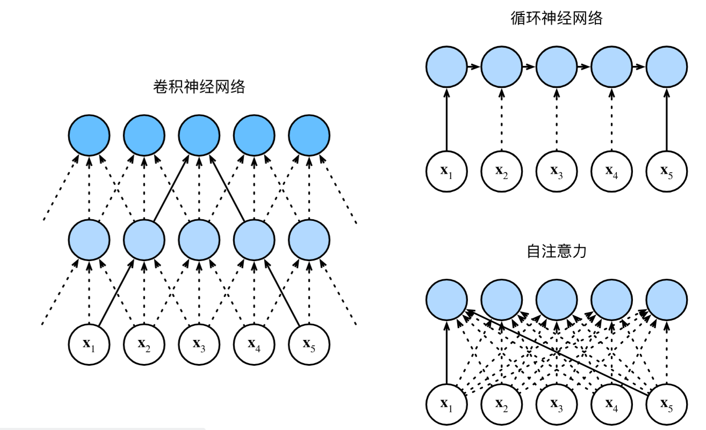

考虑一个将长度为 $n$ 的序列映射为等长序列的任务，每个词元用 $d$ 维向量表示。我们比较三种架构的计算复杂性、顺序操作数和最大路径长度。

| 特性 | CNN | RNN | 自注意力 |
|------|-----|-----|----------|
| **计算复杂度** | $\mathcal{O}(knd^2)$ | $\mathcal{O}(nd^2)$ | $\mathcal{O}(n^2d)$ |
| **顺序操作数** | $\mathcal{O}(1)$ (并行) | $\mathcal{O}(n)$ (串行) | $\mathcal{O}(1)$ (并行) |
| **最大路径长度** | $\mathcal{O}(n/k)$ | $\mathcal{O}(n)$ | $\mathcal{O}(1)$ |

*   **卷积神经网络 (CNN)**：通过卷积核捕获局部特征。虽然能并行计算，但扩大感受野需要堆叠多层，导致长距离依赖的路径较长。
*   **循环神经网络 (RNN)**：按顺序处理序列，能自然地捕获长距离依赖。但其顺序性阻碍了并行计算，且长路径会导致梯度消失或爆炸。
*   **自注意力 (Self-Attention)**：每个词元都能直接与所有其他词元交互，路径长度最短（$\mathcal{O}(1)$），且计算可并行。但其主要缺点是计算复杂度为 $\mathcal{O}(n^2d)$，在处理长序列时会非常慢。


### 10.6.3 位置编码

自注意力本身是**置换不变**的，即它不区分词元的顺序。为了让模型利用序列的顺序信息，我们必须在输入表示中加入位置信息。位置编码（Positional Encoding）正是为此而生，它通过向输入嵌入 $\mathbf{X} \in \mathbb{R}^{n \times d}$ 中添加一个位置嵌入矩阵 $\mathbf{P} \in \mathbb{R}^{n \times d}$ 来注入位置信息。

#### 固定位置编码

Transformer 提出了一种基于正弦和余弦函数的固定位置编码。对于位置 $i$ 和维度 $2j$（偶数列）和 $2j+1$（奇数列），编码定义如下：

$$ \begin{aligned} p_{i, 2j} &= \sin\left(\frac{i}{10000^{2j/d}}\right),\\p_{i, 2j+1} &= \cos\left(\frac{i}{10000^{2j/d}}\right).\end{aligned} $$

#### 代码实现

```python
#@save
class PositionalEncoding(nn.Module):
    """位置编码"""
    def __init__(self, num_hiddens, dropout, max_len=1000):
        super(PositionalEncoding, self).__init__()
        self.dropout = nn.Dropout(dropout)
        # 创建一个足够长的P
        self.P = torch.zeros((1, max_len, num_hiddens))
        X = torch.arange(max_len, dtype=torch.float32).reshape(
            -1, 1) / torch.pow(10000, torch.arange(
            0, num_hiddens, 2, dtype=torch.float32) / num_hiddens)
        self.P[:, :, 0::2] = torch.sin(X)
        self.P[:, :, 1::2] = torch.cos(X)

    def forward(self, X):
        X = X + self.P[:, :X.shape[1], :].to(X.device)
        return self.dropout(X)
```

#### 可视化位置编码

下图展示了位置编码矩阵中第6、7、8、9列（即维度）的值随位置变化的曲线：

```python
encoding_dim, num_steps = 32, 60
pos_encoding = PositionalEncoding(encoding_dim, 0)
pos_encoding.eval()
X = pos_encoding(torch.zeros((1, num_steps, encoding_dim)))
P = pos_encoding.P[:, :X.shape[1], :]
d2l.plot(torch.arange(num_steps), P[0, :, 6:10].T, xlabel='Row (position)',
         figsize=(6, 2.5), legend=["Col %d" % d for d in torch.arange(6, 10)])
```


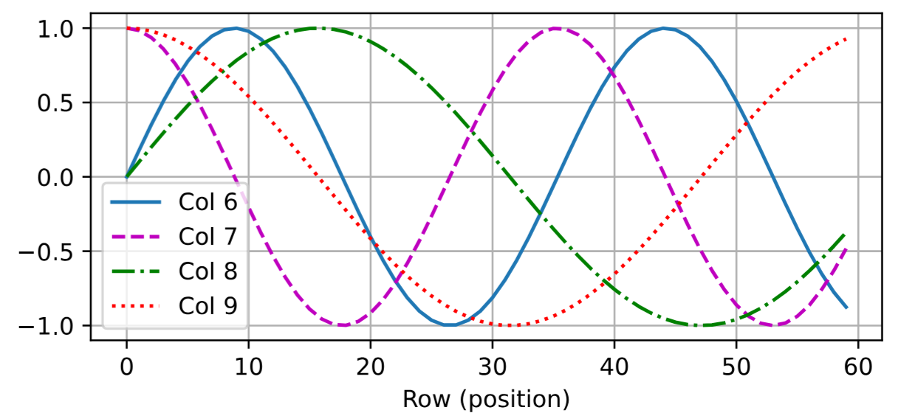

**观察**：可以看到，较低维度（第6、7列）的编码变化频率较高，而较高维度（第8、9列）的编码频率较低。这种设计类似于二进制编码中不同位的交替频率。

#### 绝对位置信息

为了理解这种设计，我们可以看下二进制表示中，不同位的交替频率：

```python
for i in range(8):
    print(f'{i}的二进制是：{i:>03b}')
```
```
0的二进制是：000
1的二进制是：001
2的二进制是：010
3的二进制是：011
4的二进制是：100
5的二进制是：101
6的二进制是：110
7的二进制是：111
```

*   最低位（2^0）交替频率最高（0,1,0,1,...）。
*   中间位（2^1）交替频率居中（0,0,1,1,...）。
*   最高位（2^2）交替频率最低（0,0,0,0,1,1,1,1）。

位置编码中的不同维度通过三角函数也实现了类似的效果：**维度越低，正弦/余弦波的频率越高，用于编码更精细的位置信息；维度越高，频率越低，用于编码更粗略的位置信息。**

#### 相对位置信息

位置编码的另一个重要特性是，它能让模型方便地学习到**相对位置**信息。数学上可以证明，对于任何固定的位置偏移 $\delta$，位置 $i+\delta$ 的编码 $p_{i+\delta}$ 可以表示为位置 $i$ 的编码 $p_i$ 的线性函数。

具体来说，存在一个与位置 $i$ 无关的 $2 \times 2$ 投影矩阵，可以将 $(p_{i, 2j}, p_{i, 2j+1})$ 投影为 $(p_{i+\delta, 2j}, p_{i+\delta, 2j+1})$：

$$\begin{bmatrix} \cos(\delta \omega_j) & \sin(\delta \omega_j) \\  -\sin(\delta \omega_j) & \cos(\delta \omega_j) \\ \end{bmatrix}
\begin{bmatrix} p_{i, 2j} \\  p_{i, 2j+1} \\ \end{bmatrix}
=
\begin{bmatrix} p_{i+\delta, 2j} \\  p_{i+\delta, 2j+1} \\ \end{bmatrix}$$

这个性质使得模型在处理长序列时，能够更容易地学习词元之间的相对位置关系，而不仅仅是绝对位置。
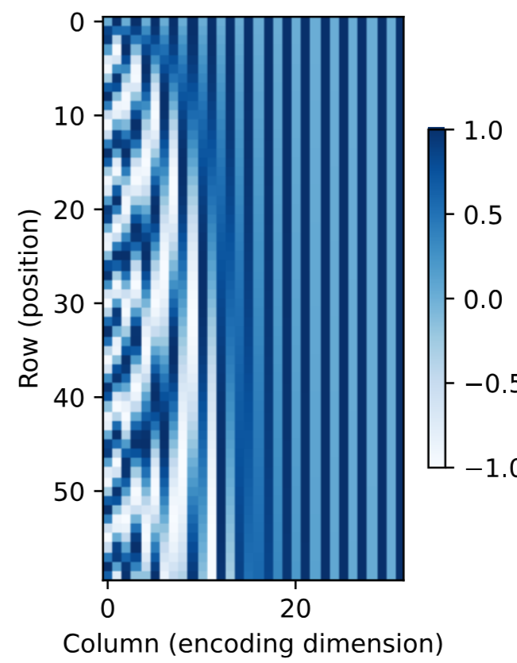


### 10.6.4 核心概念总结

| 要点 | 说明 |
|------|------|
| **自注意力** | 同一组词元充当查询、键和值，每个词元可以直接关注所有其他词元。 |
| **自注意力的优势** | 并行计算能力强、最大路径长度最短（$\mathcal{O}(1)$），能轻松捕获长距离依赖。 |
| **自注意力的劣势** | 计算复杂度为 $\mathcal{O}(n^2d)$，在处理长序列时非常耗时。 |
| **位置编码的必要性** | 由于自注意力是置换不变的，必须注入位置信息才能利用序列的顺序。 |
| **固定位置编码** | 使用正弦和余弦函数，不同维度具有不同的频率，可以编码绝对位置。 |
| **相对位置信息** | 正弦/余弦位置编码的一个重要性质是，它可以被线性投影来表示相对位置。 |


### 10.6.5 小结

1.  **自注意力**：是一种强大的序列编码方法，通过让每个词元直接关注所有其他词元，实现了**全局感受野**和**高度并行化**。
2.  **架构对比**：相比于CNN和RNN，自注意力在捕获长距离依赖和并行计算方面具有显著优势，但其**二次方的计算复杂度**是其主要瓶颈。
3.  **位置编码**：是自注意力模型（如Transformer）不可或缺的一部分。它通过向输入添加位置信号，**注入了序列的顺序信息**，使模型能够区分不同位置的词元。


## 10.7 Transformer
### 10.7.1 为什么需要 Transformer？

在之前的章节中，我们比较了 CNN、RNN 和自注意力机制。自注意力同时具备**并行计算**和**最短的最大路径长度**两大优势。Transformer 模型正是基于这一思想，**完全依赖注意力机制**，抛弃了传统的卷积层和循环神经网络层。

Transformer 最初被设计用于机器翻译任务，但现在已经广泛应用于 NLP、计算机视觉、语音和强化学习等多个领域。

### 10.7.2 整体架构

Transformer 是一个**编码器-解码器（Encoder-Decoder）**架构的实例。它的核心特点是**编码器和解码器均由自注意力层堆叠而成**，没有使用任何 RNN 或 CNN。

#### 架构概览

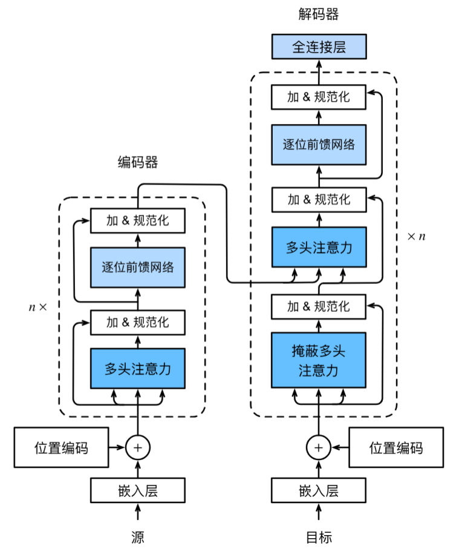


**关键设计原则**：
- **编码器**：由 N 个相同的层堆叠，每层包含多头自注意力和前馈网络两个子层
- **解码器**：由 N 个相同的层堆叠，每层包含掩蔽自注意力、编码器-解码器注意力和前馈网络三个子层
- **残差连接与层规范化**：每个子层都使用了残差连接 + 层规范化

### 10.7.3 位置编码（Positional Encoding）

自注意力本身是**置换不变**的，不包含任何顺序信息。为了让模型利用序列的顺序，需要在输入嵌入中加入位置编码。

**计算公式**：

$$ \begin{aligned} p_{i, 2j} &= \sin\left(\frac{i}{10000^{2j/d}}\right),\\p_{i, 2j+1} &= \cos\left(\frac{i}{10000^{2j/d}}\right).\end{aligned} $$

**特点**：编码值在 -1 到 1 之间，不同维度的频率不同（低维度高频，高维度低频），类似二进制编码的交替模式。

### 10.7.4 核心组件详解

#### （1）基于位置的前馈网络（Position-wise FFN）

对序列中**每个位置**独立应用同一个两层 MLP：

```python
class PositionWiseFFN(nn.Module):
    def __init__(self, ffn_num_input, ffn_num_hiddens, ffn_num_outputs):
        super().__init__()
        self.dense1 = nn.Linear(ffn_num_input, ffn_num_hiddens)
        self.relu = nn.ReLU()
        self.dense2 = nn.Linear(ffn_num_hiddens, ffn_num_outputs)

    def forward(self, X):
        return self.dense2(self.relu(self.dense1(X)))
```

**关键特性**：所有位置共享同一个 MLP，因此称为"基于位置的"（position-wise）。

#### （2）残差连接与层规范化（Add & Norm）

Transformer 中每个子层都采用：

$$\text{output} = \text{LayerNorm}(X + \text{Sublayer}(X))$$

| 对比 | 批量规范化 (BatchNorm) | 层规范化 (LayerNorm) |
|------|----------------------|---------------------|
| 规范化维度 | 批量维度 | 特征维度 |
| 适用场景 | 计算机视觉（固定形状） | NLP（变长序列） |
| Transformer 使用 | ❌ | ✅ |

```python
class AddNorm(nn.Module):
    def __init__(self, normalized_shape, dropout):
        super().__init__()
        self.dropout = nn.Dropout(dropout)
        self.ln = nn.LayerNorm(normalized_shape)

    def forward(self, X, Y):
        return self.ln(self.dropout(Y) + X)  # 残差连接 + 层规范化
```

### 10.7.5 编码器（Encoder）

编码器由 `num_layers` 个相同的 `EncoderBlock` 堆叠而成。每个块包含：
1. 多头自注意力（查询、键、值都来自前一层输出）
2. 基于位置的前馈网络
3. 每个子层后都跟 Add & Norm

```python
class EncoderBlock(nn.Module):
    def __init__(self, key_size, query_size, value_size, num_hiddens,
                 norm_shape, ffn_num_input, ffn_num_hiddens, num_heads,
                 dropout, use_bias=False):
        super().__init__()
        self.attention = d2l.MultiHeadAttention(
            key_size, query_size, value_size, num_hiddens, num_heads, dropout, use_bias)
        self.addnorm1 = AddNorm(norm_shape, dropout)
        self.ffn = PositionWiseFFN(ffn_num_input, ffn_num_hiddens, num_hiddens)
        self.addnorm2 = AddNorm(norm_shape, dropout)

    def forward(self, X, valid_lens):
        Y = self.addnorm1(X, self.attention(X, X, X, valid_lens))
        return self.addnorm2(Y, self.ffn(Y))
```

**编码器完整实现**：

```python
class TransformerEncoder(d2l.Encoder):
    def __init__(self, vocab_size, key_size, query_size, value_size,
                 num_hiddens, norm_shape, ffn_num_input, ffn_num_hiddens,
                 num_heads, num_layers, dropout, use_bias=False):
        super().__init__()
        self.num_hiddens = num_hiddens
        self.embedding = nn.Embedding(vocab_size, num_hiddens)
        self.pos_encoding = d2l.PositionalEncoding(num_hiddens, dropout)
        self.blks = nn.Sequential()
        for i in range(num_layers):
            self.blks.add_module("block"+str(i),
                EncoderBlock(key_size, query_size, value_size, num_hiddens,
                             norm_shape, ffn_num_input, ffn_num_hiddens,
                             num_heads, dropout, use_bias))

    def forward(self, X, valid_lens, *args):
        # 嵌入值乘以 sqrt(num_hiddens) 缩放，再与位置编码相加
        X = self.pos_encoding(self.embedding(X) * math.sqrt(self.num_hiddens))
        self.attention_weights = [None] * len(self.blks)
        for i, blk in enumerate(self.blks):
            X = blk(X, valid_lens)
            self.attention_weights[i] = blk.attention.attention.attention_weights
        return X
```

### 10.7.6 解码器（Decoder）

解码器比编码器多一个**编码器-解码器注意力**层（也即**交叉注意力**），查询来自解码器，键和值来自编码器输出。

此外，解码器的自注意力是**掩蔽的（Masked）**，确保在预测第 $t$ 个位置时，只能看到前 $t-1$ 个已生成的词元（自回归属性）。

**三个子层**：
1. **掩蔽自注意力**：查询、键、值都来自解码器前一层输出，但要掩蔽未来位置
2. **编码器-解码器注意力**：查询来自解码器，键和值来自编码器输出
3. **前馈网络**：与编码器相同

```python
class DecoderBlock(nn.Module):
    def __init__(self, key_size, query_size, value_size, num_hiddens,
                 norm_shape, ffn_num_input, ffn_num_hiddens, num_heads,
                 dropout, i, **kwargs):
        super().__init__(**kwargs)
        self.i = i
        # 子层1: 掩蔽自注意力
        self.attention1 = d2l.MultiHeadAttention(...)
        self.addnorm1 = AddNorm(norm_shape, dropout)
        # 子层2: 编码器-解码器注意力
        self.attention2 = d2l.MultiHeadAttention(...)
        self.addnorm2 = AddNorm(norm_shape, dropout)
        # 子层3: 前馈网络
        self.ffn = PositionWiseFFN(...)
        self.addnorm3 = AddNorm(norm_shape, dropout)

    def forward(self, X, state):
        enc_outputs, enc_valid_lens = state[0], state[1]
        # 缓存当前块之前所有时间步的输出（用于自回归）
        if state[2][self.i] is None:
            key_values = X
        else:
            key_values = torch.cat((state[2][self.i], X), axis=1)
        state[2][self.i] = key_values

        # 训练时使用因果掩码（dec_valid_lens = [1,2,3,...,num_steps]）
        if self.training:
            batch_size, num_steps, _ = X.shape
            dec_valid_lens = torch.arange(1, num_steps + 1, device=X.device).repeat(batch_size, 1)
        else:
            dec_valid_lens = None

        # 子层1: 掩蔽自注意力
        X2 = self.attention1(X, key_values, key_values, dec_valid_lens)
        Y = self.addnorm1(X, X2)
        # 子层2: 编码器-解码器注意力
        Y2 = self.attention2(Y, enc_outputs, enc_outputs, enc_valid_lens)
        Z = self.addnorm2(Y, Y2)
        # 子层3: 前馈网络
        return self.addnorm3(Z, self.ffn(Z)), state
```

**掩蔽自注意力的关键**：训练时，`dec_valid_lens` 为 `[1, 2, 3, ..., num_steps]`，确保第 $i$ 个位置只能看到前 $i$ 个位置（包括自身），看不到未来的词元。

### 10.7.7 完整模型

将编码器和解码器组合成一个完整的 Seq2Seq 模型：

```python
class TransformerDecoder(d2l.AttentionDecoder):
    def __init__(self, vocab_size, key_size, query_size, value_size,
                 num_hiddens, norm_shape, ffn_num_input, ffn_num_hiddens,
                 num_heads, num_layers, dropout, **kwargs):
        super().__init__(**kwargs)
        self.num_hiddens = num_hiddens
        self.num_layers = num_layers
        self.embedding = nn.Embedding(vocab_size, num_hiddens)
        self.pos_encoding = d2l.PositionalEncoding(num_hiddens, dropout)
        self.blks = nn.Sequential()
        for i in range(num_layers):
            self.blks.add_module("block"+str(i),
                DecoderBlock(key_size, query_size, value_size, num_hiddens,
                             norm_shape, ffn_num_input, ffn_num_hiddens,
                             num_heads, dropout, i))
        self.dense = nn.Linear(num_hiddens, vocab_size)

    def init_state(self, enc_outputs, enc_valid_lens, *args):
        return [enc_outputs, enc_valid_lens, [None] * self.num_layers]

    def forward(self, X, state):
        X = self.pos_encoding(self.embedding(X) * math.sqrt(self.num_hiddens))
        self._attention_weights = [[None] * len(self.blks) for _ in range(2)]
        for i, blk in enumerate(self.blks):
            X, state = blk(X, state)
            self._attention_weights[0][i] = blk.attention1.attention.attention_weights  # 自注意力
            self._attention_weights[1][i] = blk.attention2.attention.attention_weights  # 交叉注意力
        return self.dense(X), state
```

### 10.7.8 训练与结果

在英法翻译任务上训练，采用 2 层编码器和 2 层解码器，4 头注意力：

```python
num_hiddens, num_layers, dropout = 32, 2, 0.1
ffn_num_input, ffn_num_hiddens, num_heads = 32, 64, 4

encoder = TransformerEncoder(len(src_vocab), key_size, query_size, value_size,
                             num_hiddens, norm_shape, ffn_num_input,
                             ffn_num_hiddens, num_heads, num_layers, dropout)
decoder = TransformerDecoder(len(tgt_vocab), key_size, query_size, value_size,
                             num_hiddens, norm_shape, ffn_num_input,
                             ffn_num_hiddens, num_heads, num_layers, dropout)
net = d2l.EncoderDecoder(encoder, decoder)
```

训练 200 轮后，loss 约 0.032，BLEU 分数在测试句子上达到 1.0：

```
go . => va !, bleu 1.000
i lost . => j'ai perdu ., bleu 1.000
he's calm . => il est calme ., bleu 1.000
i'm home . => je suis chez moi ., bleu 1.000
```
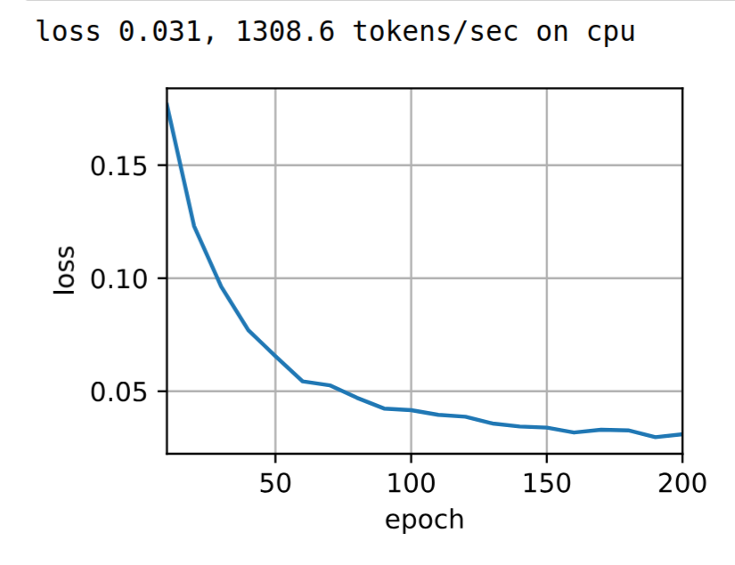

### 10.7.9 注意力可视化

Transformer 的注意力权重是可解释性的重要来源。观察编码器自注意力：

```python
# 形状: (层数, 头数, 查询数, 键数)
enc_attention_weights.shape  # torch.Size([2, 4, 10, 10])
```

**编码器自注意力**：
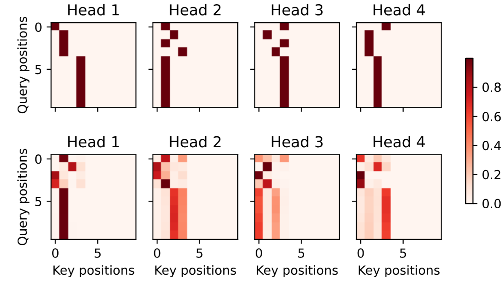
- 每一行表示一个查询（位置），每一列表示一个键（位置）
- 颜色越深表示注意力权重越大
- 填充位置（PAD）被有效掩蔽，权重为 0

**解码器自注意力**：
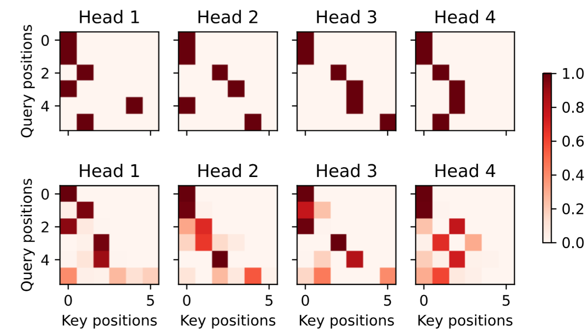
- 下三角模式：每个位置只能看到自身及之前的位置（因果掩蔽）
- 体现了自回归属性

**编码器-解码器注意力**：
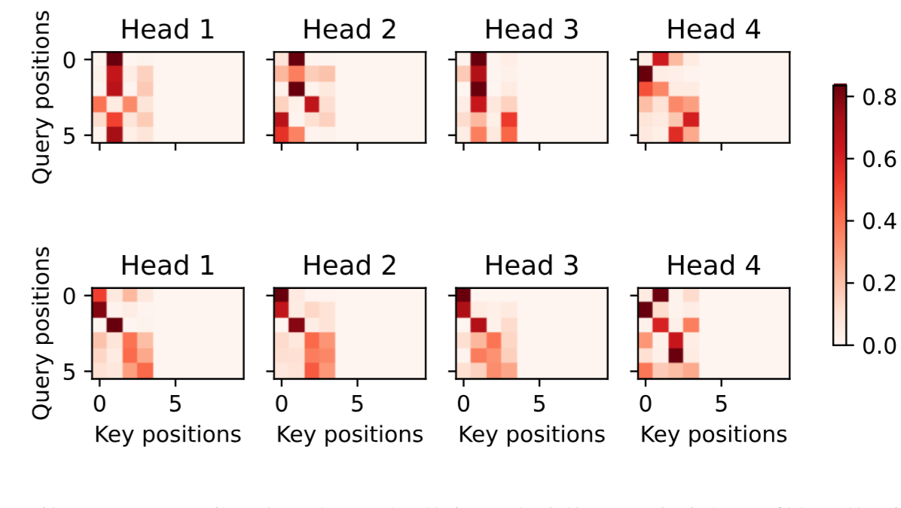
- 显示目标语言词元对源语言词元的关注分布
- 相当于**软对齐**，可解释翻译过程中哪些源词对当前输出贡献最大

### 10.7.10 核心设计总结

| 组件 | 作用 |
|------|------|
| **多头自注意力** | 捕捉序列内部的长距离依赖关系 |
| **掩蔽自注意力** | 保证解码器的自回归属性，防止看到未来信息 |
| **编码器-解码器注意力** | 将源语言信息传递到目标语言生成过程 |
| **位置编码** | 注入序列的顺序信息（因为自注意力是置换不变的） |
| **基于位置的前馈网络** | 对每个位置独立进行非线性变换 |
| **残差连接** | 解决深度网络的梯度消失问题 |
| **层规范化** | 稳定训练，对变长序列友好 |

### 10.7.11 小结

| 要点 | 说明 |
|------|------|
| **核心思想** | 完全基于注意力，抛弃 RNN 和 CNN |
| **编码器** | 多头自注意力 + FFN，带残差和层规范化 |
| **解码器** | 掩蔽自注意力 + 交叉注意力 + FFN，带残差和层规范化 |
| **位置编码** | 通过正弦/余弦函数注入位置信息 |
| **掩蔽机制** | 确保解码器的自回归属性 |
| **可解释性** | 注意力权重可视化，展示对齐关系 |
| **局限性** | 计算复杂度 $\mathcal{O}(n^2)$，长序列处理成本高 |