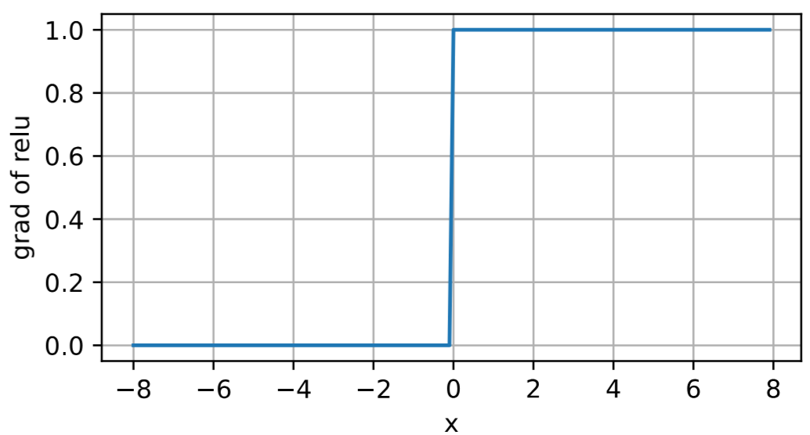
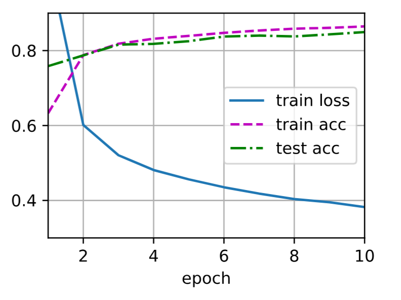
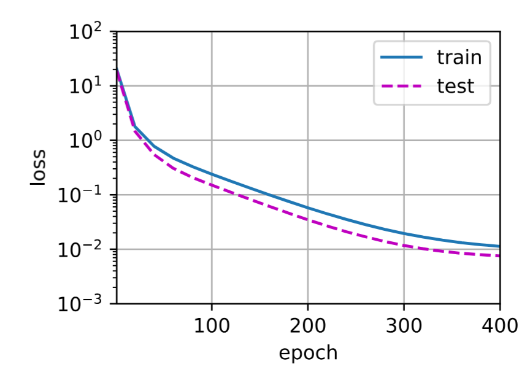
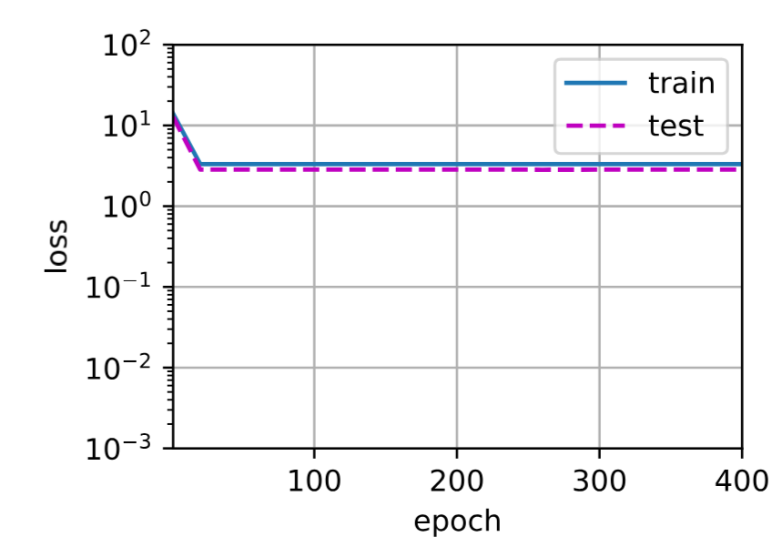
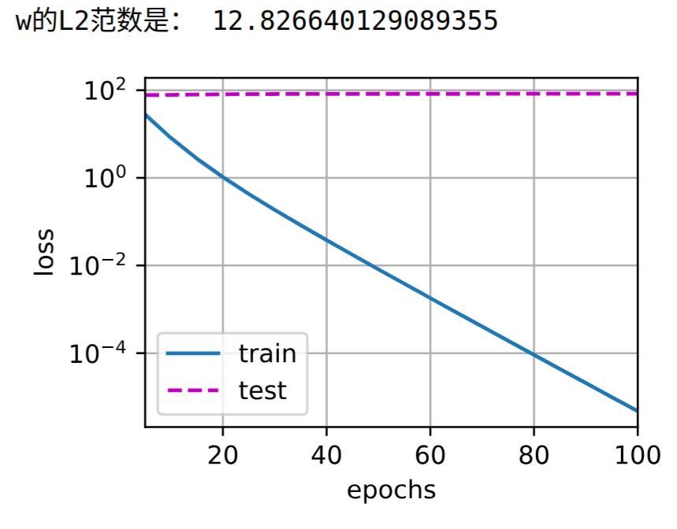
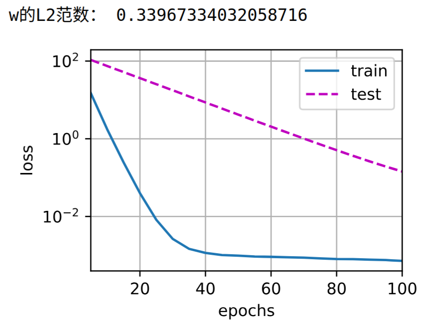
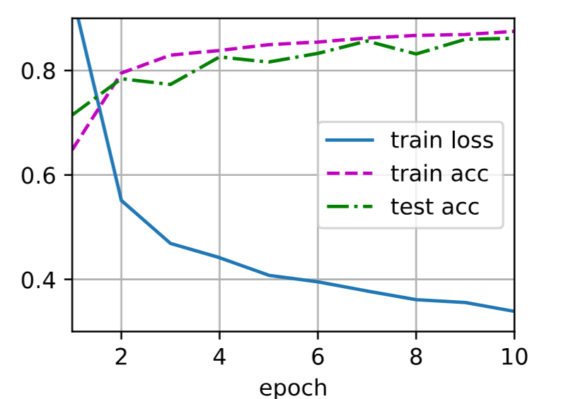
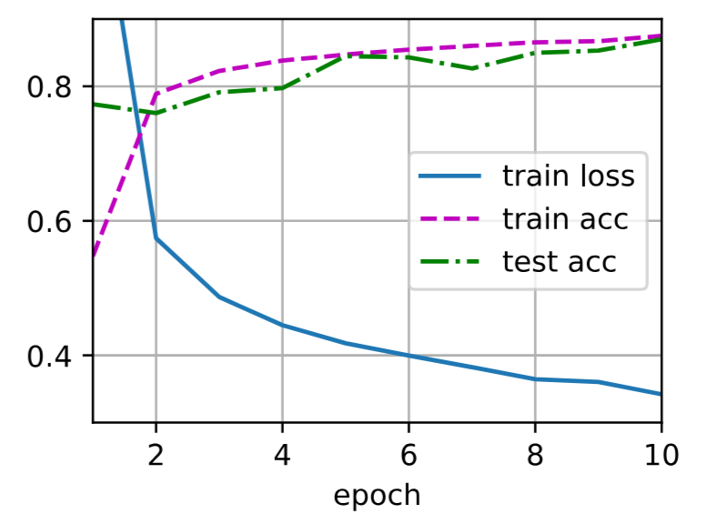
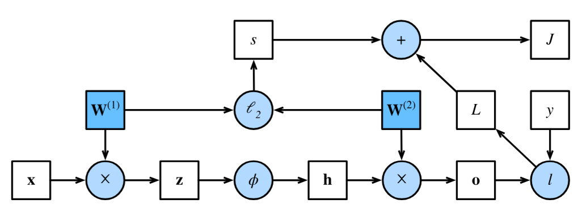
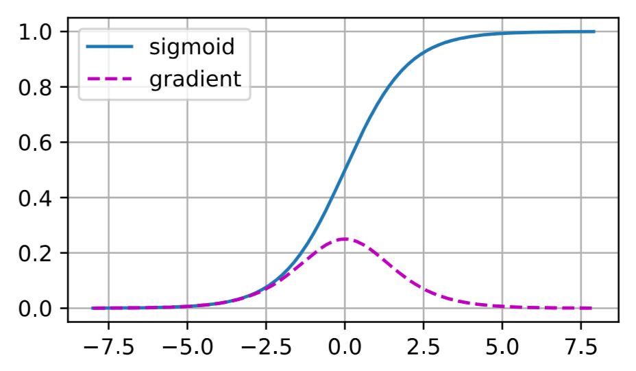

# 第四章  多层感知机
## 4.1 多层感知机 (MLP)

多层感知机（Multilayer Perceptron，简称MLP）是深度学习的基石。它通过在网络中加入**隐藏层**和**非线性激活函数**，克服了线性模型（如线性回归、Softmax回归）的表达能力限制，使其能够拟合复杂的非线性函数。

### 4.1.1 为什么需要多层感知机？

#### 线性模型的局限

线性模型的核心假设是**单调性**：特征的增大会导致模型输出的增大（正权重）或减小（负权重）。然而现实问题往往不满足这一假设。
>以体温与死亡率的关系为例，体温过高或过低都会增加死亡风险，呈现U型关系而非单调关系。在图像识别任务中，单个像素点的重要性取决于其周围像素的上下文，不能简单认为某个像素值的增加总是有利于或不利于某个类别的判断。因此，线性模型无法处理特征间的复杂交互和非线性关系。

#### 解决方案：引入隐藏层

为了克服线性模型的局限，可以在输入层和输出层之间加入一个或多个**全连接隐藏层**，让模型自动学习数据的复杂表示。需要特别注意的是，如果只是简单堆叠线性层而不添加激活函数，模型仍然是线性的，多个仿射变换的组合等价于一个仿射变换，并不能提升模型的表达能力。

### 4.1.2 从线性到非线性：激活函数

为了发挥多层架构的潜力，必须在每个隐藏层的仿射变换后应用一个**非线性激活函数**。

无激活函数时，多层网络等价于线性模型：
$$O = (XW^{(1)} + b^{(1)})W^{(2)} + b^{(2)} = XW + b$$

引入激活函数后，网络才能真正具备非线性表达能力：
$$H = \sigma(XW^{(1)} + b^{(1)})$$
$$O = HW^{(2)} + b^{(2)}$$

其中 $\sigma$ 表示非线性激活函数。

### 4.1.3 常见激活函数

激活函数为神经网络引入非线性，是深度学习的核心组件。

#### 4.1.3.1 ReLU (修正线性单元)

**定义**：
$$ReLU(x) = \max(0, x)$$
**特点**：ReLU的计算非常简单，仅需比较大小，不涉及指数运算，因此计算效率很高。在正区间（$x>0$）导数为1，梯度能够良好传播，有效缓解了困扰早期神经网络的梯度消失问题。负值被置为零，使得网络中的神经元输出具有稀疏性。


**导数**：当 $x<0$ 时导数为0，当 $x>0$ 时导数为1，在 $x=0$ 处不可导，实践中通常取该点的导数为0。


**变体 pReLU**：为负值区域添加一个小斜率 $\alpha$，避免神经元完全“死亡”：
$$pReLU(x) = \max(0, x) + \alpha \min(0, x)$$

#### 4.1.3.2 Sigmoid

**定义**：
$$\text{sigmoid}(x) = \frac{1}{1 + e^{-x}}$$

**特点**：Sigmoid函数的值域为 $(0, 1)$，可以将任意实数输入“挤压”到0和1之间，因此非常适合作为二分类问题的输出层激活函数，用于表示概率。它是神经网络早期最常用的激活函数，是对生物神经元“激发”与“不激发”阈值单元的平滑近似。


**缺点**：当输入绝对值很大时，Sigmoid函数的导数趋近于0，导致梯度消失问题，使得深层网络难以有效训练。此外，其计算涉及指数运算，开销较大。

**导数**：$$\frac{\text{d}}{\text{d}x} \text{sigmoid}(x) = \text{sigmoid}(x)(1-\text{sigmoid}(x))$$

最大值为0.25。

#### 4.1.3.3 Tanh (双曲正切)

**定义**：
$$\text{tanh}(x) = \frac{1 - e^{-2x}}{1 + e^{-2x}}$$

**特点**：Tanh函数的值域为 $(-1, 1)$，关于原点中心对称（即零中心），这种对称性有利于优化过程的收敛。其形状与Sigmoid类似，也是“S”形挤压函数。


**缺点**：与Sigmoid一样，Tanh也存在梯度消失问题，且在输入绝对值较大时导数趋近于0。计算同样涉及指数运算。

**导数**：$$\frac{\text{d}}{\text{d}x} \text{tanh}(x) = 1 - \text{tanh}^2(x)$$

最大值为1。

**与Sigmoid的关系**：
$$\text{tanh}(x) = 2 \cdot \text{sigmoid}(2x) - 1$$
即
$$\text{tanh}(x) + 1 = 2 \cdot \text{sigmoid}(2x)$$

### 4.1.4 通用近似定理

通用近似定理指出，一个具有足够多神经元的单隐藏层MLP，可以以任意精度近似任何连续函数。
>这可以类比为编程语言——理论上能够表达任何可计算程序，但真正写出符合规范的优质程序才是最困难的部分。虽然单隐藏层在理论上已经具有通用近似能力，但在实践中，**使用更深的网络（更多层）而非更宽的网络（更多神经元）** 通常更容易高效地逼近复杂函数，且参数效率更高。

### 4.1.5 激活函数的选择总结

在绝大多数现代深度学习模型中，
- **ReLU** 是隐藏层的默认选择，因为它计算简单且能有效缓解梯度消失问题;
- **Sigmoid** 的值域为 $(0,1)$，适合作为二分类输出层的概率输出，也常用于循环神经网络（RNN）中的门控机制。
- **Tanh** 的值域为 $(-1,1)$ 且具有零中心对称性，常用于循环神经网络中的隐藏状态。

### 关键要点总结

1. MLP的基本结构为输入层之后堆叠若干组“全连接层加激活函数”，最后连接输出层。非线性能力的来源是激活函数，没有激活函数的多层网络等价于单层线性模型。
2. 梯度消失是Sigmoid和Tanh在两端导数趋近于0时导致深层网络难以训练的问题，ReLU在正区间导数为1，部分缓解了这一问题。
3. 在模型设计上，更深（更多层）的网络通常比更宽（更多神经元）的网络更有效地表达复杂函数。


## 4.2 多层感知机的从零开始实现

在上一节中我们介绍了多层感知机的原理，本节将手动实现一个单隐藏层的多层感知机，并在Fashion-MNIST图像分类数据集上进行训练和评估。通过从零开始实现，可以更深入地理解多层感知机的内部工作机制。

### 4.2.1 数据准备

我们继续使用Fashion-MNIST数据集，它与之前softmax回归实验中使用的是同一数据集，方便进行效果对比。Fashion-MNIST中的每张图像为 $28 \times 28 = 784$ 个灰度像素值，共10个类别。我们忽略像素之间的空间结构，将每个图像视为具有784个输入特征和10个类别的分类数据集。

```python
import torch
from torch import nn
from d2l import torch as d2l

# 设置批量大小为256，加载训练集和测试集
batch_size = 256
train_iter, test_iter = d2l.load_data_fashion_mnist(batch_size)
```

### 4.2.2 初始化模型参数

我们实现一个具有单隐藏层的多层感知机，隐藏层包含256个隐藏单元。这里的输入维度为784（$28 \times 28$），输出维度为10（10个类别）。通常选择2的若干次幂作为层的宽度，因为内存在硬件中的分配和寻址方式使得这种选择在计算上更高效。

```python
# 定义网络维度
num_inputs, num_outputs, num_hiddens = 784, 10, 256

# 初始化第一层参数：输入层到隐藏层
W1 = nn.Parameter(torch.randn(num_inputs, num_hiddens, requires_grad=True) * 0.01)
b1 = nn.Parameter(torch.zeros(num_hiddens, requires_grad=True))

# 初始化第二层参数：隐藏层到输出层
W2 = nn.Parameter(torch.randn(num_hiddens, num_outputs, requires_grad=True) * 0.01)
b2 = nn.Parameter(torch.zeros(num_outputs, requires_grad=True))

# 将所有参数放入列表以便统一管理
params = [W1, b1, W2, b2]
```

### 4.2.3 激活函数

我们手动实现ReLU激活函数，而非直接调用内置的`relu`函数。ReLU函数的定义为 $\text{ReLU}(x) = \max(x, 0)$，实现时创建一个与输入形状相同的零张量，然后取输入与零张量的逐元素最大值。

```python
def relu(X):
    a = torch.zeros_like(X)      # 创建与X形状相同的全零张量

    # 比较的结果是 bool 类型
    return torch.max(X, a)       # 逐元素取X和0的最大值
```

### 4.2.4 模型定义

由于忽略了图像的空间结构，需要将每个二维图像通过`reshape`转换为长度为`num_inputs`的向量，然后依次进行第一层线性变换、ReLU激活、第二层线性变换。

```python
def net(X):
    # 每一个图像都有适合在校学生个特征
    X = X.reshape((-1, num_inputs))    # 将输入展平为形状(批量大小, 784)
    H = relu(X @ W1 + b1)              # 隐藏层：线性变换 + ReLU激活，@表示矩阵乘法
    return H @ W2 + b2                 # 输出层：线性变换，得到形状(批量大小, 10)的logits
```

### 4.2.5 损失函数

我们直接使用高级API中的`CrossEntropyLoss`来计算softmax和交叉熵损失。该函数在数值上更稳定，因为它将softmax计算与交叉熵损失合并，避免了分别计算时可能出现的数值溢出问题。

```python
loss = nn.CrossEntropyLoss(reduction='none')    # reduction='none'表示返回每个样本的损失
```

### 4.2.6 训练

多层感知机的训练过程与softmax回归完全相同，直接调用`d2l`包的`train_ch3`函数即可。我们设置迭代周期数为10，学习率为0.1，使用随机梯度下降优化器。

```python
num_epochs, lr = 10, 0.1                      # 设置训练轮数和学习率
updater = torch.optim.SGD(params, lr=lr)     # 使用SGD优化器更新参数
d2l.train_ch3(net, train_iter, test_iter, loss, num_epochs, updater)
```

训练完成后，可以在测试数据上评估模型性能，使用`d2l.predict_ch3`函数可视化模型的预测结果。

```python
d2l.predict_ch3(net, test_iter)
```


### 4.2.7 小结

通过从零实现多层感知机，可以更清晰地理解其内部结构和工作原理。手动实现的核心步骤包括：

1. 定义网络架构并初始化参数
2. 实现激活函数
3. 构建前向传播模型
4. 选择合适的损失函数
5. 使用优化器进行训练

然而，当网络层数增多时，从零开始实现会变得繁琐（需要命名和记录大量模型参数）。在后续章节中，我们将学习如何使用高级API更高效地构建复杂网络。


## 4.3 多层感知机的简洁实现

本节介绍如何使用PyTorch的高级API更简洁地实现多层感知机。与从零开始实现相比，高级API大大简化了模型定义和训练过程，使代码更加清晰和易于维护。

### 4.3.1 模型定义

使用`nn.Sequential`容器可以按顺序堆叠网络层，代码更加简洁。与softmax回归的简洁实现相比，唯一的区别是添加了一个包含256个隐藏单元的隐藏层，并在该层后应用ReLU激活函数。

```python
import torch
from torch import nn
from d2l import torch as d2l

# 使用Sequential构建网络，按顺序堆叠各层
net = nn.Sequential(
    nn.Flatten(),                # 将28x28图像展平为784维向量
    nn.Linear(784, 256),         # 输入层到隐藏层：784 -> 256
    nn.ReLU(),                   # ReLU激活函数
    nn.Linear(256, 10)           # 隐藏层到输出层：256 -> 10
)

# 定义权重初始化函数
def init_weights(m):
    if type(m) == nn.Linear:
        nn.init.normal_(m.weight, std=0.01)    # 使用标准差为0.01的正态分布初始化权重

# 对网络各层应用初始化
net.apply(init_weights)
```

### 4.3.2 训练过程

训练过程的实现与softmax回归完全相同，这种模块化设计使得训练代码与模型架构无关，提高了代码的复用性。

```python
# 设置超参数
batch_size, lr, num_epochs = 256, 0.1, 10

# 定义损失函数：交叉熵损失
loss = nn.CrossEntropyLoss(reduction='none')

# 定义优化器：随机梯度下降
trainer = torch.optim.SGD(net.parameters(), lr=lr)

# 加载Fashion-MNIST数据集
train_iter, test_iter = d2l.load_data_fashion_mnist(batch_size)

# 开始训练
d2l.train_ch3(net, train_iter, test_iter, loss, num_epochs, trainer)
```

### 4.3.3 小结

使用高级API实现多层感知机的核心优势在于代码的简洁性。整个实现仅需定义包含线性层和激活函数的`Sequential`容器，并设置好损失函数和优化器即可开始训练。相比从零实现，高级API不仅减少了代码量，还降低了出错的可能性，让开发者能够更专注于模型架构的设计和超参数的调优。


## 4.4 模型选择、欠拟合和过拟合

作为机器学习科学家，我们的目标是发现能够**泛化到新数据的模式**，而不仅仅是记住训练数据。然而，当我们使用有限的训练样本时，模型可能在训练数据上表现得很好，但在未见过的数据上表现不佳。这种现象称为**过拟合**。本节将深入探讨训练误差与泛化误差的区别、模型选择的方法以及欠拟合与过拟合的诊断。

### 4.4.1 训练误差和泛化误差

**训练误差**是指模型在**训练数据集**上计算得到的误差。
**泛化误差**是指模型应用在同样从原始样本分布中抽取的无限多数据样本时，模型误差的**期望**。
>我们永远无法准确计算泛化误差，只能通过将模型应用于独立的测试集来估计。

当训练误差明显**低于**验证误差时，表明发生了严重的**过拟合**。
当训练误差和验证误差都很高且两者**差距较小**时，表明模型**欠拟合**。
>需要注意的是，过拟合并不总是一件坏事——在深度学习中，最好的预测模型在训练数据上的表现往往比在验证数据上好得多，我们最终更关心验证误差而非两者之间的差距。

### 4.4.2 模型选择

在机器学习中，通常在评估几个候选模型后选择最终的模型，这个过程称为**模型选择**。为了确定最佳模型，通常会使用**验证集**。原则上，在确定所有超参数之前不应当使用测试集，否则会有**过拟合**测试数据的风险。

当训练数据稀缺时，可以采用**K折交叉验证**：将原始训练数据分成K个不重叠的子集，执行K次模型训练和验证，每次在K-1个子集上训练并在剩余的一个子集上验证，最后对K次结果取平均。

### 4.4.3 多项式回归实验

为了直观地理解欠拟合和过拟合，我们通过多项式拟合进行实验。给定由单个特征x和对应实数标签y组成的训练数据，试图找到d阶多项式来估计标签y：

$$\hat{y}= \sum_{i=0}^d x^i w_i$$

这本质上是一个线性回归问题，特征是x的幂。高阶多项式比低阶多项式复杂得多，在固定训练数据集的情况下，高阶多项式的训练误差应该始终更低（最坏也相等）。

```python
import math
import numpy as np
import torch
from torch import nn
from d2l import torch as d2l
```

#### 生成数据集

使用以下三阶多项式生成训练和测试数据，噪声服从均值为0、标准差为0.1的正态分布。将特征从 $x^i$ 调整为 $\frac{x^i}{i!}$ 以避免很大的i带来的指数值。

```python
max_degree = 20                     # 多项式的最大阶数，即最高次幂为 x^19（因为索引从0开始）
n_train, n_test = 100, 100          # 训练集和测试集的样本数量各为100
true_w = np.zeros(max_degree)       # 创建长度为20的全零数组，用于存储真实的权重系数

# 设置真实的多项式系数：只有前4个维度非零，对应 y = 5 + 1.2*x - 3.4*x^2/2! + 5.6*x^3/3!
# 索引0对应常数项（x^0），索引1对应一次项（x^1），索引2对应二次项（x^2），索引3对应三次项（x^3）
true_w[0:4] = np.array([5, 1.2, -3.4, 5.6])

# 从标准正态分布中随机生成200个样本的x值，形状为(200, 1)
features = np.random.normal(size=(n_train + n_test, 1))
np.random.shuffle(features)         # 随机打乱样本顺序，使训练集和测试集混合

# 计算每个样本的幂次特征：poly_features[i, j] = features[i]^j
# np.arange(max_degree).reshape(1, -1) 生成 [0, 1, 2, ..., 19] 的形状为(1, 20)
# 对每个样本的x计算x^0, x^1, x^2, ..., x^19
poly_features = np.power(features, np.arange(max_degree).reshape(1, -1))

# 对每个幂次特征除以对应阶乘 i!，避免高阶幂次产生过大的数值
# 例如：x^2/2!，x^3/3!，这样可以使特征值保持在合理范围内
for i in range(max_degree):
    poly_features[:, i] /= math.gamma(i + 1)   # gamma(n) = (n-1)!，gamma(i+1) = i!

# 计算真实标签值：labels = true_w[0]*x^0 + true_w[1]*x^1 + ... + true_w[19]*x^19
# 由于true_w只有前4个非零，实际等价于 5 + 1.2*x - 3.4*x^2/2! + 5.6*x^3/3!
labels = np.dot(poly_features, true_w)

# 添加高斯噪声，模拟真实数据中的随机误差
# 噪声服从均值为0、标准差为0.1的正态分布
labels += np.random.normal(scale=0.1, size=labels.shape)
```

将NumPy数组转换为PyTorch张量，查看前2个样本的特征和标签：

```python
# 将NumPy数组批量转换为PyTorch张量，并指定数据类型为float32
# 使用列表推导式：对true_w, features, poly_features, labels中的每个NumPy数组
# 依次执行torch.tensor()转换，然后将结果按顺序赋给左侧的四个变量
true_w, features, poly_features, labels = [torch.tensor(x, dtype=torch.float32) 
                                           for x in [true_w, features, poly_features, labels]]

# 查看转换后的前2个样本数据，用于验证数据是否正确生成
# features[:2]：前2个样本的x值，形状为(2, 1)
# poly_features[:2, :]：前2个样本的所有幂次特征（x^0 到 x^19），形状为(2, 20)
# labels[:2]：前2个样本对应的标签值（含噪声）
features[:2], poly_features[:2, :], labels[:2]
```

#### 定义训练和评估函数

定义评估模型在给定数据集上损失的函数：

```python
def evaluate_loss(net, data_iter, loss):
    """评估给定数据集上模型的损失"""
    # 创建累加器，用于累加两个值：损失总和 和 样本数量
    # Accumulator(2)表示可以累加2个数值
    metric = d2l.Accumulator(2)
    
    # 遍历数据集中的所有批次
    for X, y in data_iter:
        # 前向传播：将输入X传入网络，得到预测值
        out = net(X)
        
        # 将真实标签y的形状调整为与预测值out相同
        # 确保两个张量形状一致，才能计算损失
        y = y.reshape(out.shape)
        
        # 计算当前批次的损失张量（每个样本一个损失值）
        l = loss(out, y)
        
        # l.sum()：当前批次所有样本的损失总和（标量）
        # l.numel()：当前批次的样本数量（元素总数）
        # metric.add()将这两个值累加到累加器中
        metric.add(l.sum(), l.numel())
    
    # 返回平均损失：总损失 / 总样本数
    return metric[0] / metric[1]
```

定义训练函数：

```python
def train(train_features, test_features, train_labels, test_labels,
          num_epochs=400):
    """
    训练多项式回归模型并可视化训练过程
    
    参数:
        train_features: 训练集特征 (多项式展开后的特征)
        test_features: 测试集特征
        train_labels: 训练集标签 (真实y值)
        test_labels: 测试集标签
        num_epochs: 训练迭代轮数, 默认400
    """
    # 定义均方误差损失函数, reduction='none'表示返回每个样本的损失(不聚合)
    loss = nn.MSELoss(reduction='none')
    
    # 获取输入特征的维度, 即多项式的阶数+1
    input_shape = train_features.shape[-1]
    
    # 创建单层线性网络: 输入维度为input_shape, 输出维度为1
    # bias=False 表示不添加偏置项, 因为偏置已经在多项式特征中实现(常数项x^0)
    net = nn.Sequential(nn.Linear(input_shape, 1, bias=False))
    
    # 设置批量大小: 取10和训练样本数中的较小值
    batch_size = min(10, train_labels.shape[0])
    
    # 创建训练数据迭代器: 将特征和标签打包, 按batch_size分批读取
    train_iter = d2l.load_array((train_features, train_labels.reshape(-1,1)), batch_size)
    
    # 创建测试数据迭代器: is_train=False表示不随机打乱数据
    test_iter = d2l.load_array((test_features, test_labels.reshape(-1,1)), batch_size, is_train=False)
    
    # 创建随机梯度下降(SGD)优化器, 学习率为0.01
    trainer = torch.optim.SGD(net.parameters(), lr=0.01)
    
    # 创建动画绘制器, 用于实时显示训练过程中的损失变化
    animator = d2l.Animator(
        xlabel='epoch',           # x轴标签: 训练轮数
        ylabel='loss',            # y轴标签: 损失值
        yscale='log',             # y轴使用对数刻度(因为损失值可能跨越多个数量级)
        xlim=[1, num_epochs],     # x轴范围: 从1到总轮数
        ylim=[1e-3, 1e2],         # y轴范围: 0.001到100
        legend=['train', 'test']  # 图例: 训练损失和测试损失
    )
    
    # 开始训练循环
    for epoch in range(num_epochs):
        # 训练一个完整轮次: 遍历所有训练批次, 计算损失并更新参数
        # 该函数会执行: 前向传播 -> 计算损失 -> 反向传播 -> 梯度下降更新
        d2l.train_epoch_ch3(net, train_iter, loss, trainer)
        
        # 每20轮或在第0轮时, 记录并绘制当前的训练损失和测试损失
        if epoch == 0 or (epoch + 1) % 20 == 0:
            animator.add(
                epoch + 1, 
                (
                    evaluate_loss(net, train_iter, loss),  # 计算训练集上的平均损失
                    evaluate_loss(net, test_iter, loss)    # 计算测试集上的平均损失
                )
            )
    
    # 训练结束后, 打印学习到的权重参数(转换为NumPy数组以便查看)
    # net[0]是网络的第一层(也是唯一一层), 即Linear层
    print('weight:', net[0].weight.data.numpy())
```

### 4.4.4 三阶多项式函数拟合（正常）

使用与数据生成函数相同阶数（三阶）的多项式进行拟合。模型能有效降低训练损失和测试损失，学习到的参数接近真实值。

```python
train(poly_features[:n_train, :4], poly_features[n_train:, :4],
      labels[:n_train], labels[n_train:])
```



### 4.4.5 线性函数拟合（欠拟合）

使用线性函数（一阶多项式）拟合三阶多项式生成的数据。训练损失在最后一个迭代周期后仍然很高，线性模型无法捕捉非线性模式，导致欠拟合。

```python
train(poly_features[:n_train, :2], poly_features[n_train:, :2],
      labels[:n_train], labels[n_train:])
```


### 4.4.6 高阶多项式函数拟合（过拟合）

使用阶数过高的多项式（20阶）进行训练。模型过于复杂，没有足够的数据来学习高阶系数应接近零，容易受到训练数据中噪声的影响。虽然训练损失可以有效降低，但测试损失仍然很高，表明发生了过拟合。

```python
train(poly_features[:n_train, :], poly_features[n_train:, :],
      labels[:n_train], labels[n_train:], num_epochs=1500)
```

### 4.4.7 小结

- 欠拟合是指模型无法继续减少训练误差，通常因为模型过于简单。
- 过拟合是指训练误差远小于验证误差，通常因为模型过于复杂或训练数据不足。
- 不能基于训练误差来估计泛化误差，最小化训练误差不一定意味着泛化误差的减小。
- 验证集可用于模型选择，而K折交叉验证在数据稀缺时是有效的替代方案。
- 应当选择复杂度适当的模型，避免使用数量不足的训练样本。


## 4.5 权重衰减

**权重衰减（Weight Decay）** 是最广泛使用的正则化技术之一，也称为 $L_2$ 正则化。它通过在损失函数中添加权重向量的 $L_2$ 范数平方作为惩罚项，来限制模型的复杂度，从而有效缓解过拟合。
>正则化的定义：过对模型施加额外的约束或惩罚，使模型在训练数据上表现良好的同时，也能在未见过的数据上保持较好的表现（即提高泛化能力）

### 4.5.1 正则化与权重衰减

在训练参数化机器学习模型时，我们希望权重向量尽可能小。最常用的方法是将权重的 $L_2$ 范数平方作为惩罚项加到损失函数中。原来的训练目标从“最小化训练标签上的预测损失”调整为“最小化预测损失和惩罚项之和”。

线性回归的原始损失为：

$$L(\mathbf{w}, b) = \frac{1}{n}\sum_{i=1}^n \frac{1}{2}\left(\mathbf{w}^\top \mathbf{x}^{(i)} + b - y^{(i)}\right)^2$$

加入 $L_2$ 正则化惩罚后，损失变为：

$$L(\mathbf{w}, b) + \frac{\lambda}{2} \|\mathbf{w}\|^2$$

其中 $\lambda$ 是正则化常数（超参数），控制惩罚的强度。当 $\lambda = 0$ 时恢复原始损失，$\lambda > 0$ 时限制 $\|\mathbf{w}\|$ 的大小。

使用 $L_2$ 范数而非 $L_1$ 范数的原因包括：
- **计算方便**：平方 $L_2$ 范数去掉平方根，惩罚的导数容易计算
- **权重均匀分布**：$L_2$ 惩罚对权重向量的大分量施加巨大惩罚，使模型偏向在大量特征上均匀分布权重，对单个变量的观测误差更稳定
- **对比 $L_1$**：$L_1$ 惩罚会导致特征选择（将权重清零），适用于需要稀疏模型的场景

>$L_2$ 正则化回归被称为**岭回归（Ridge Regression）**，而 $L_1$ 正则化回归称为**套索回归（Lasso Regression）**。

加入权重衰减后，小批量随机梯度下降的更新公式为：

$$\mathbf{w} \leftarrow \left(1- \eta\lambda \right) \mathbf{w} - \frac{\eta}{|\mathcal{B}|} \sum_{i \in \mathcal{B}} \mathbf{x}^{(i)} \left(\mathbf{w}^\top \mathbf{x}^{(i)} + b - y^{(i)}\right)$$

#### 权重衰减更新公式的推导

权重衰减（$L_2$ 正则化）的损失函数为：

$$L(\mathbf{w}, b) = \frac{1}{n} \sum_{i=1}^{n} \frac{1}{2} \left( \mathbf{w}^\top \mathbf{x}^{(i)} + b - y^{(i)} \right)^2 + \frac{\lambda}{2} \|\mathbf{w}\|^2$$

其中 $\frac{\lambda}{2} \|\mathbf{w}\|^2$ 是 $L_2$ 正则化惩罚项。


##### 第一步：计算损失关于 $\mathbf{w}$ 的梯度

损失函数由两部分组成，分别求梯度：

**（1）原始损失部分的梯度（均方误差）**

$$L_1 = \frac{1}{n} \sum_{i=1}^{n} \frac{1}{2} \left( \mathbf{w}^\top \mathbf{x}^{(i)} + b - y^{(i)} \right)^2$$

对单个样本的损失求梯度：

$$\nabla_{\mathbf{w}} \left[ \frac{1}{2} \left( \mathbf{w}^\top \mathbf{x}^{(i)} + b - y^{(i)} \right)^2 \right] = \left( \mathbf{w}^\top \mathbf{x}^{(i)} + b - y^{(i)} \right) \cdot \mathbf{x}^{(i)}$$

对所有 $n$ 个样本取平均（小批量中为 $|\mathcal{B}|$ 个样本）：

$$\nabla_{\mathbf{w}} L_1 = \frac{1}{|\mathcal{B}|} \sum_{i \in \mathcal{B}} \mathbf{x}^{(i)} \left( \mathbf{w}^\top \mathbf{x}^{(i)} + b - y^{(i)} \right)$$

**（2）正则化部分的梯度（$L_2$ 惩罚项）**

$$L_2 = \frac{\lambda}{2} \|\mathbf{w}\|^2 = \frac{\lambda}{2} \sum_{j=1}^{d} w_j^2$$

对 $\mathbf{w}$ 求梯度（对每个分量 $w_j$ 分别求导）：

$$\frac{\partial L_2}{\partial w_j} = \frac{\lambda}{2} \cdot 2w_j = \lambda w_j$$

写成向量形式：

$$\nabla_{\mathbf{w}} L_2 = \lambda \mathbf{w}$$

**（3）总损失 $L(\mathbf{w}, b)$ 关于 $\mathbf{w}$ 的梯度**

将两部分合并：

$$\nabla_{\mathbf{w}} L(\mathbf{w}, b) = \frac{1}{|\mathcal{B}|} \sum_{i \in \mathcal{B}} \mathbf{x}^{(i)} \left( \mathbf{w}^\top \mathbf{x}^{(i)} + b - y^{(i)} \right) + \lambda \mathbf{w}$$


##### 第二步：梯度下降更新公式

梯度下降的更新规则为：沿着梯度的反方向更新参数，步长为 $\eta$。

$$\mathbf{w} \leftarrow \mathbf{w} - \eta \cdot \nabla_{\mathbf{w}} L(\mathbf{w}, b)$$

将上面求得的梯度代入：

$$\mathbf{w} \leftarrow \mathbf{w} - \eta \left[ \frac{1}{|\mathcal{B}|} \sum_{i \in \mathcal{B}} \mathbf{x}^{(i)} \left( \mathbf{w}^\top \mathbf{x}^{(i)} + b - y^{(i)} \right) + \lambda \mathbf{w} \right]$$


#### 第三步：合并 $\mathbf{w}$ 项

将式中含 $\mathbf{w}$ 的项提取出来：

$$\mathbf{w} \leftarrow \mathbf{w} - \eta\lambda \mathbf{w} - \frac{\eta}{|\mathcal{B}|} \sum_{i \in \mathcal{B}} \mathbf{x}^{(i)} \left( \mathbf{w}^\top \mathbf{x}^{(i)} + b - y^{(i)} \right)$$

提出公因子 $\mathbf{w}$，得到最终形式：

$$\boxed{\mathbf{w} \leftarrow \left(1- \eta\lambda \right) \mathbf{w} - \frac{\eta}{|\mathcal{B}|} \sum_{i \in \mathcal{B}} \mathbf{x}^{(i)} \left(\mathbf{w}^\top \mathbf{x}^{(i)} + b - y^{(i)}\right)}$$


##### 观察

这个公式揭示了一个重要现象：每一步更新时，**权重 $\mathbf{w}$ 首先被乘以一个小于 1 的因子 $(1 - \eta\lambda)$**，然后再减去梯度方向上的调整量。

- 当 $\lambda > 0$ 时，$(1 - \eta\lambda) < 1$，权重**衰减**（缩小）
- 当 $\lambda = 0$ 时，$(1 - 0) = 1$，恢复为普通的梯度下降更新公式

这也是**权重衰减（Weight Decay）** 这个名称的来源——每次更新都将权重向零的方向“衰减”一点点。


### 4.5.2 高维线性回归实验

我们通过一个高维线性回归问题来演示权重衰减的效果。选择标签是关于输入的线性函数，并加入高斯噪声。为了突显过拟合，设置输入维度 $d = 200$，训练集仅包含20个样本。

```python
%matplotlib inline              # 让 matplotlib 生成的图表直接嵌入在 notebook 中显示，而不是弹出新窗口
import torch                    # 导入 PyTorch 深度学习框架
from torch import nn            # 从 PyTorch 中导入神经网络模块 nn，包含 Linear、Sequential 等常用组件
from d2l import torch as d2l    # 导入 d2l 工具包（Dive into Deep Learning 配套库），提供绘图、数据加载、训练辅助等函数
```

生成合成数据集，权重真实值为 0.01，偏置为 0.05，噪声标准差为 0.01：

```python
n_train, n_test, num_inputs, batch_size = 20, 100, 200, 5          # 训练集20样本，测试集100样本，特征维度200
true_w, true_b = torch.ones((num_inputs, 1)) * 0.01, 0.05          # 真实权重全为0.01，真实偏置为0.05
train_data = d2l.synthetic_data(true_w, true_b, n_train)           # 生成训练数据：特征和标签
train_iter = d2l.load_array(train_data, batch_size)                # 创建训练数据迭代器
test_data = d2l.synthetic_data(true_w, true_b, n_test)             # 生成测试数据
test_iter = d2l.load_array(test_data, batch_size, is_train=False)  # 创建测试数据迭代器，不随机打乱
```

### 4.5.3 从零实现

#### 初始化模型参数

```python
def init_params():
    w = torch.normal(0, 1, size=(num_inputs, 1), requires_grad=True)  # 从标准正态分布初始化权重
    b = torch.zeros(1, requires_grad=True)                            # 偏置初始化为0
    return [w, b]
```

#### 定义 $L_2$ 范数惩罚

```python
def l2_penalty(w):
    return torch.sum(w.pow(2)) / 2    # 计算所有权重平方和除以2，即 L2 范数的平方的一半
```

#### 定义训练函数

```python
def train(lambd):
    w, b = init_params()                                            # 初始化模型参数
    net, loss = lambda X: d2l.linreg(X, w, b), d2l.squared_loss    # 定义网络和损失函数
    num_epochs, lr = 100, 0.003                                     # 设置训练轮数和学习率
    
    # 创建动画绘制器，实时显示训练过程
    animator = d2l.Animator(xlabel='epochs', ylabel='loss', yscale='log',
                            xlim=[5, num_epochs], legend=['train', 'test'])
    
    for epoch in range(num_epochs):
        for X, y in train_iter:
            # 计算损失 = 均方误差 + 正则化惩罚项
            # lambd * l2_penalty(w) 利用广播机制，使惩罚项成为长度为batch_size的向量
            l = loss(net(X), y) + lambd * l2_penalty(w)
            l.sum().backward()                                       # 反向传播计算梯度
            d2l.sgd([w, b], lr, batch_size)                          # 使用SGD更新参数
        if (epoch + 1) % 5 == 0:
            # 每5轮记录一次训练损失和测试损失
            animator.add(epoch + 1, (d2l.evaluate_loss(net, train_iter, loss),
                                     d2l.evaluate_loss(net, test_iter, loss)))
    print('w的L2范数是：', torch.norm(w).item())                    # 打印权重的L2范数
```

#### 忽略正则化直接训练（$\lambda = 0$）

当 `lambd = 0` 时，不施加权重衰减。训练误差虽然下降，但测试误差很高，表明出现了严重的过拟合。

```python
train(lambd=0)
```


#### 使用权重衰减（$\lambda = 3$）

使用权重衰减后，训练误差虽然比无正则化时稍高，但测试误差显著降低，这正是正则化期望达到的效果——提高模型的泛化能力。

```python
train(lambd=3)
```


### 4.5.4 简洁实现

深度学习框架将权重衰减集成到优化器中，无需手动添加惩罚项。在实例化优化器时通过 `weight_decay` 参数指定权重衰减系数。

```python
def train_concise(wd):
    net = nn.Sequential(nn.Linear(num_inputs, 1))                   # 定义单层线性网络
    for param in net.parameters():
        param.data.normal_()                                        # 对网络参数进行正态分布初始化
    loss = nn.MSELoss(reduction='none')                             # 均方误差损失
    num_epochs, lr = 100, 0.003                                     # 设置训练轮数和学习率
    
    # 优化器：对不同参数设置不同的权重衰减
    # 权重参数使用wd作为权重衰减系数，偏置参数不衰减
    trainer = torch.optim.SGD([
        {"params": net[0].weight, 'weight_decay': wd},              # 权重参数应用权重衰减
        {"params": net[0].bias}], lr=lr)                            # 偏置参数不衰减
    
    animator = d2l.Animator(xlabel='epochs', ylabel='loss', yscale='log',
                            xlim=[5, num_epochs], legend=['train', 'test'])
    
    for epoch in range(num_epochs):
        for X, y in train_iter:
            trainer.zero_grad()                                     # 清除历史梯度
            l = loss(net(X), y)                                     # 计算损失（框架自动添加权重衰减）
            l.mean().backward()                                     # 反向传播
            trainer.step()                                          # 更新参数
        if (epoch + 1) % 5 == 0:
            animator.add(epoch + 1,
                         (d2l.evaluate_loss(net, train_iter, loss),
                          d2l.evaluate_loss(net, test_iter, loss)))
    print('w的L2范数：', net[0].weight.norm().item())               # 打印权重的L2范数
```

使用简洁实现进行训练，效果与从零实现相同：

```python
train_concise(0)    # 不使用权重衰减，过拟合
```

```python
train_concise(3)    # 使用权重衰减，泛化能力提升
```


### 4.5.5 小结

- **正则化**是处理过拟合的常用方法，通过在损失函数中加入惩罚项来降低模型复杂度
- **权重衰减（$L_2$ 正则化）** 是最常用的正则化方法，使学习算法在更新步骤中衰减权重
- 深度学习框架的优化器直接提供权重衰减功能，使用非常方便
- 在同一训练代码中，可以对不同参数（如权重和偏置）设置不同的正则化策略


## 4.6 暂退法（Dropout）

暂退法（Dropout）是深度学习中广泛使用的正则化技术，通过在训练过程中**随机丢弃部分神经元**来防止过拟合。与权重衰减通过惩罚权重范数来**限制模型复杂度**不同，暂退法通过在网络中**注入噪声**来增强模型的鲁棒性。

### 4.6.1 重新审视过拟合

深度神经网络具有极强的灵活性，即使在训练样本充足的情况下也可能过拟合。研究表明，深度网络可以完美地标记随机标记的图像，但在测试集上表现极差，泛化差距高达90%。

过拟合的本质是模型**对训练数据中的噪声和细节过度敏感**，而一个好的预测模型**应当对输入的微小变化不敏感**，即具有**平滑性**。暂退法正是基于这一思想，通过在训练过程中向网络内部注入噪声来增强平滑性。

### 4.6.2 暂退法的原理

标准暂退法在训练过程中，按指定的暂退概率 $p$ 随机将当前层的一些神经元置零，并重新缩放剩余神经元以保持期望不变：

$$h' = \begin{cases} 0 & \text{概率为 } p \\ \frac{h}{1-p} & \text{其他情况} \end{cases}$$

这种设计确保了 $E[h'] = h$，即活性值的期望保持不变。在测试时，暂退法被禁用，所有神经元都参与计算。

```python
import torch
from torch import nn
from d2l import torch as d2l
```

### 4.6.3 从零实现

实现暂退法函数：从均匀分布 $U[0,1]$ 中采样，保留对应样本大于 $p$ 的节点，丢弃其余节点，并对剩余部分进行缩放。

```python
def dropout_layer(X, dropout):
    """
    实现暂退法：以dropout概率随机丢弃X中的元素
    
    参数:
        X: 输入张量
        dropout: 暂退概率，取值范围 [0, 1]
    
    返回:
        处理后的张量
    """
    assert 0 <= dropout <= 1              # 确保暂退概率在合法范围内
    
    # 暂退概率为1时，所有元素被丢弃，返回全零张量
    if dropout == 1:
        return torch.zeros_like(X)
    
    # 暂退概率为0时，所有元素保留，返回原始张量
    if dropout == 0:
        return X
    
    # 生成与X形状相同的掩码张量，元素为0或1
    # torch.rand(X.shape) 生成 [0,1) 均匀分布的随机数
    # (torch.rand(X.shape) > dropout) 返回布尔张量，大于dropout为True，否则为False
    # .float() 将布尔值转换为浮点数（True->1.0, False->0.0）
    mask = (torch.rand(X.shape) > dropout).float()
    
    # 掩码乘以X，将丢弃位置置零；除以(1-dropout)进行缩放，保持期望不变
    return mask * X / (1.0 - dropout)
```

### 4.6.4 定义模型参数

使用Fashion-MNIST数据集，定义具有两个隐藏层的多层感知机，每个隐藏层包含256个单元。

```python
num_inputs, num_outputs, num_hiddens1, num_hiddens2 = 784, 10, 256, 256
```

### 4.6.5 定义模型（从零实现）

在训练过程中对每个隐藏层的输出应用暂退法，并为不同层设置不同的暂退概率。常见的做法是在靠近输入层的地方设置较低的暂退概率。

```python
dropout1, dropout2 = 0.2, 0.5            # 第一层暂退概率0.2，第二层0.5

class Net(nn.Module):
    def __init__(self, num_inputs, num_outputs, num_hiddens1, num_hiddens2,
                 is_training=True):
        # 也可以写成 super().__init__()
        super(Net, self).__init__()
        self.num_inputs = num_inputs
        self.training = is_training          # 训练/测试模式标志
        self.lin1 = nn.Linear(num_inputs, num_hiddens1)   # 第一全连接层
        self.lin2 = nn.Linear(num_hiddens1, num_hiddens2) # 第二全连接层
        self.lin3 = nn.Linear(num_hiddens2, num_outputs)  # 输出层
        self.relu = nn.ReLU()                # ReLU激活函数

    def forward(self, X):
        # 第一隐藏层：展平输入 + 线性变换 + ReLU激活
        H1 = self.relu(self.lin1(X.reshape((-1, self.num_inputs))))
        # 仅在训练模式下应用暂退法
        if self.training == True:
            H1 = dropout_layer(H1, dropout1)    # 第一层暂退
        
        # 第二隐藏层：线性变换 + ReLU激活
        H2 = self.relu(self.lin2(H1))
        if self.training == True:
            H2 = dropout_layer(H2, dropout2)    # 第二层暂退
        
        # 输出层：线性变换，返回logits（未经过softmax）
        out = self.lin3(H2)
        return out

net = Net(num_inputs, num_outputs, num_hiddens1, num_hiddens2)
```

### 4.6.6 训练与测试

```python
num_epochs, lr, batch_size = 10, 0.5, 256
loss = nn.CrossEntropyLoss(reduction='none')       # 交叉熵损失
train_iter, test_iter = d2l.load_data_fashion_mnist(batch_size)
trainer = torch.optim.SGD(net.parameters(), lr=lr) # 随机梯度下降优化器
d2l.train_ch3(net, train_iter, test_iter, loss, num_epochs, trainer)
```


### 4.6.7 简洁实现

使用PyTorch高级API，在`nn.Sequential`中直接添加`nn.Dropout`层。`nn.Dropout`在训练时自动按指定概率丢弃神经元，在测试时自动禁用。

```python
net = nn.Sequential(
    nn.Flatten(),                                 # 将28x28图像展平为784维向量
    nn.Linear(784, 256),                          # 第一全连接层：784 -> 256
    nn.ReLU(),                                    # ReLU激活
    nn.Dropout(dropout1),                         # 第一层暂退（训练时生效，测试时自动关闭）
    nn.Linear(256, 256),                          # 第二全连接层：256 -> 256
    nn.ReLU(),                                    # ReLU激活
    nn.Dropout(dropout2),                         # 第二层暂退
    nn.Linear(256, 10)                            # 输出层：256 -> 10
)

def init_weights(m):
    if type(m) == nn.Linear:
        nn.init.normal_(m.weight, std=0.01)       # 使用标准差0.01的正态分布初始化权重

net.apply(init_weights)                           # 对网络所有层应用初始化
```

训练和测试简洁模型：

```python
trainer = torch.optim.SGD(net.parameters(), lr=lr)
d2l.train_ch3(net, train_iter, test_iter, loss, num_epochs, trainer)
```


### 4.6.8 小结

- **暂退法**在前向传播过程中，按指定概率随机丢弃内部层的神经元，并重新缩放剩余部分以保持期望不变
- **暂退法有效防止过拟合**，通过向网络注入噪声增强模型的平滑性和鲁棒性
- 暂退法**仅在训练期间使用**，测试时所有神经元都参与计算
- **暂退概率**通常设置为靠近输入层较小（0.2）、靠近输出层较大（0.5）
- **简洁实现**只需在`nn.Sequential`中添加`nn.Dropout`层即可


## 4.7 前向传播、反向传播和计算图

前向传播和反向传播是深度学习的核心机制。前向传播按顺序计算网络中每层的结果，而反向传播利用链式法则计算各层参数的梯度。理解这两者的工作原理对于深入掌握深度学习的训练过程至关重要。

### 4.7.1 前向传播

**前向传播**是指按顺序（从输入层到输出层）计算和存储神经网络中每层的结果。以带 $L_2$ 正则化的单隐藏层多层感知机为例：

输入样本为 $\mathbf{x} \in \mathbb{R}^d$，隐藏层权重为 $\mathbf{W}^{(1)} \in \mathbb{R}^{h \times d}$（为简化，省略偏置项），中间变量为：

$$\mathbf{z} = \mathbf{W}^{(1)} \mathbf{x}$$

将 $\mathbf{z}$ 通过激活函数 $\phi$ 后，得到隐藏激活向量：

$$\mathbf{h} = \phi(\mathbf{z})$$

输出层权重为 $\mathbf{W}^{(2)} \in \mathbb{R}^{q \times h}$，输出层变量为：

$$\mathbf{o} = \mathbf{W}^{(2)} \mathbf{h}$$

损失项（单个样本）为：

$$L = l(\mathbf{o}, y)$$

$L_2$ 正则化项为：

$$s = \frac{\lambda}{2} \left( \|\mathbf{W}^{(1)}\|_F^2 + \|\mathbf{W}^{(2)}\|_F^2 \right)$$

最终目标函数为：

$$J = L + s$$

### 4.7.2 前向传播计算图

计算图用于可视化操作符和变量的依赖关系。下图为该单隐藏层网络的计算图，正方形表示变量，圆圈表示操作符，箭头指示数据流动方向（从输入到输出）：



从计算图中可以清晰看到：$\mathbf{x}$ 和 $\mathbf{W}^{(1)}$ 通过矩阵乘法得到 $\mathbf{z}$，$\mathbf{z}$ 通过激活函数 $\phi$ 得到 $\mathbf{h}$，$\mathbf{h}$ 与 $\mathbf{W}^{(2)}$ 通过矩阵乘法得到 $\mathbf{o}$，最终 $\mathbf{o}$ 和 $y$ 计算损失 $L$，同时 $\mathbf{W}^{(1)}$ 和 $\mathbf{W}^{(2)}$ 计算正则项 $s$，两者相加得到目标函数 $J$。

### 4.7.3 反向传播

**反向传播**的核心是**链式法则**，它使我们能够从最终的目标函数出发，沿着网络逐层向后计算每个参数的梯度。下面的推导将展示如何一步步从输出层“走”回输入层。


#### 准备工作：链式法则回顾

对于两个函数 $\mathsf{Y}=f(\mathsf{X})$ 和 $\mathsf{Z}=g(\mathsf{Y})$，链式法则为：

$$\frac{\partial \mathsf{Z}}{\partial \mathsf{X}} = \text{prod}\left(\frac{\partial \mathsf{Z}}{\partial \mathsf{Y}}, \frac{\partial \mathsf{Y}}{\partial \mathsf{X}}\right)$$

其中 $\text{prod}$ 表示“将两个梯度以正确的方式相乘”。具体来说：

- 如果 $\mathsf{X}, \mathsf{Y}, \mathsf{Z}$ 都是**标量**，`prod` 就是普通乘法
- 如果它们是**向量或矩阵**，`prod` 可能涉及矩阵乘法、转置或更复杂的张量运算

我们的目标函数是 $J = L + s$，其中 $L$ 是损失项，$s$ 是正则项。所有梯度推导都从 $J$ 出发。


#### 第一步：目标函数 $J$ 的初始梯度

$J$ 是最终标量。它对自身的导数为 1。由于 $J = L + s$（加法运算），根据链式法则：

$$\frac{\partial J}{\partial L} = 1, \quad \frac{\partial J}{\partial s} = 1$$

这意味着：无论是损失 $L$ 还是正则项 $s$ 增加 1 个单位，$J$ 都会增加 1 个单位。

#### 第二步：关于输出层变量 $\mathbf{o}$ 的梯度

输出层变量 $\mathbf{o} \in \mathbb{R}^q$ 直接影响损失 $L$（因为 $L = l(\mathbf{o}, y)$）。我们的目标是求 $\partial J / \partial \mathbf{o}$。

首先，$J$ 对 $L$ 的导数为 1，而 $L$ 对 $\mathbf{o}$ 的导数取决于具体的损失函数（如交叉熵或均方误差）。根据链式法则：

$$\frac{\partial J}{\partial \mathbf{o}} = \text{prod}\left(\frac{\partial J}{\partial L}, \frac{\partial L}{\partial \mathbf{o}}\right) = 1 \cdot \frac{\partial L}{\partial \mathbf{o}} = \frac{\partial L}{\partial \mathbf{o}} \in \mathbb{R}^q$$

这个结果是一个 $q$ 维向量，表示：如果输出 $\mathbf{o}$ 的第 $i$ 个分量稍微变化，$J$ 会变化多少。


#### 第三步：正则项 $s$ 关于两个参数的梯度

正则项 $s$ 对 $\mathbf{W}^{(1)}$ 和 $\mathbf{W}^{(2)}$ 的梯度可以直接计算。

由于 $s = \frac{\lambda}{2} (\|\mathbf{W}^{(1)}\|_F^2 + \|\mathbf{W}^{(2)}\|_F^2)$，其中 $\|\mathbf{W}\|_F^2 = \sum_{i,j} W_{i,j}^2$，求导得：

$$\frac{\partial s}{\partial \mathbf{W}^{(1)}} = \lambda \mathbf{W}^{(1)}, \quad \frac{\partial s}{\partial \mathbf{W}^{(2)}} = \lambda \mathbf{W}^{(2)}$$

注意：正则项**不依赖于** $\mathbf{h}$ 或 $\mathbf{z}$，因此这些中间变量的梯度中不会出现 $\lambda$ 项。


#### 第四步：关于 $\mathbf{W}^{(2)}$ 的梯度（输出层权重）

$\mathbf{W}^{(2)} \in \mathbb{R}^{q \times h}$ 是输出层的权重矩阵，连接隐藏层 $\mathbf{h}$ 和输出 $\mathbf{o}$。$J$ 对 $\mathbf{W}^{(2)}$ 的梯度包含两项：

1. 从损失 $L$ 通过 $\mathbf{o}$ 传过来的梯度
2. 从正则项 $s$ 直接传过来的梯度

**第一项（损失路径）**：
从 
$$L = L(\mathbf{o}, y) = L(\mathbf{W}^{(2)} \mathbf{h}, y)$$
可知，结合
$$\frac{\partial J}{\partial L}= 1  $$
故
$$\frac{\partial J}{\partial \mathbf{W}^{(2)}} = \text{prod}\left(\frac{\partial J}{\partial L},\frac{\partial L}{\partial \mathbf{o}}, \frac{\partial \mathbf{o}}{\partial \mathbf{W}^{(2)}}\right) = \text{prod}\left(\frac{\partial J}{\partial \mathbf{o}}, \frac{\partial \mathbf{o}}{\partial \mathbf{W}^{(2)}}\right)$$

已知 $\frac{\partial J}{\partial \mathbf{o}} \in \mathbb{R}^q$，且 $\mathbf{o} = \mathbf{W}^{(2)} \mathbf{h}$。根据矩阵求导规则：

$$\frac{\partial \mathbf{o}}{\partial \mathbf{W}^{(2)}} = \mathbf{h}^\top$$

即梯度是一个 $q \times h$ 的矩阵。将两者组合：

$$\frac{\partial J}{\partial \mathbf{o}} \cdot \mathbf{h}^\top \in \mathbb{R}^{q \times h}$$

**第二项（正则路径）**：

$$\text{prod}\left(\frac{\partial J}{\partial s}, \frac{\partial s}{\partial \mathbf{W}^{(2)}}\right) = 1 \cdot \lambda \mathbf{W}^{(2)} = \lambda \mathbf{W}^{(2)}$$

**总梯度**：

$$\frac{\partial J}{\partial \mathbf{W}^{(2)}} = \frac{\partial J}{\partial \mathbf{o}} \mathbf{h}^\top + \lambda \mathbf{W}^{(2)}$$

这个结果可以直接用于梯度下降更新 $\mathbf{W}^{(2)}$。


#### 第五步：关于隐藏层输出 $\mathbf{h}$ 的梯度

$\mathbf{h} = \phi(\mathbf{z})$ 是隐藏层的活性值（经过激活函数后）。$J$ 对 $\mathbf{h}$ 的梯度用于继续向更深的层传播。

由于 $\mathbf{o} = \mathbf{W}^{(2)} \mathbf{h}$，且 $\partial J/\partial \mathbf{o}$ 已知，链式法则给出：

$$\frac{\partial J}{\partial \mathbf{h}} = \text{prod}\left(\frac{\partial J}{\partial \mathbf{o}}, \frac{\partial \mathbf{o}}{\partial \mathbf{h}}\right)$$

根据矩阵求导规则，$\partial \mathbf{o} / \partial \mathbf{h} = (\mathbf{W}^{(2)})^\top$。因此：

$$\frac{\partial J}{\partial \mathbf{h}} = (\mathbf{W}^{(2)})^\top \frac{\partial J}{\partial \mathbf{o}} \in \mathbb{R}^h$$

这个 $h$ 维向量表示：如果隐藏层第 $j$ 个神经元稍微变化，$J$ 会如何变化。


#### 第六步：关于中间变量 $\mathbf{z}$ 的梯度

$\mathbf{z} = \mathbf{W}^{(1)} \mathbf{x}$ 是隐藏层的线性输出（激活前）。它与 $\mathbf{h}$ 的关系是 $\mathbf{h} = \phi(\mathbf{z})$，其中 $\phi$ 是按元素操作的激活函数（如 ReLU、Sigmoid 或 Tanh）。

因为 $\phi$ 按元素作用于 $\mathbf{z}$，链式法则需要用**按元素乘法**（Hadamard 积 $\odot$）：

$$\frac{\partial J}{\partial \mathbf{z}} = \text{prod}\left(\frac{\partial J}{\partial \mathbf{h}}, \frac{\partial \mathbf{h}}{\partial \mathbf{z}}\right) = \frac{\partial J}{\partial \mathbf{h}} \odot \phi'(\mathbf{z})$$

其中 $\phi'(\mathbf{z})$ 是激活函数的导数按元素组成的向量。例如：

- 若 $\phi$ 是 ReLU：$\phi'(z) = \begin{cases} 1 & z > 0 \\ 0 & z < 0 \end{cases}$
- 若 $\phi$ 是 Sigmoid：$\phi'(z) = \sigma(z)(1 - \sigma(z))$

$\frac{\partial J}{\partial \mathbf{z}}$ 表示：如果线性输出 $\mathbf{z}$ 的第 $j$ 个分量稍微变化（在激活之前），$J$ 会变化多少。这个梯度会继续传给 $\mathbf{W}^{(1)}$。

#### 第七步：关于 $\mathbf{W}^{(1)}$ 的梯度（输入层权重）

$\mathbf{W}^{(1)} \in \mathbb{R}^{h \times d}$ 是输入层到隐藏层的权重矩阵。$J$ 对 $\mathbf{W}^{(1)}$ 的梯度同样包含两项：

1. 从损失 $L$ 通过 $\mathbf{z}$ 传过来的梯度
2. 从正则项 $s$ 直接传过来的梯度

**第一项（损失路径）**：

$$\text{prod}\left(\frac{\partial J}{\partial \mathbf{z}}, \frac{\partial \mathbf{z}}{\partial \mathbf{W}^{(1)}}\right)$$

已知 $\frac{\partial J}{\partial \mathbf{z}} \in \mathbb{R}^h$，且 $\mathbf{z} = \mathbf{W}^{(1)} \mathbf{x}$，其中 $\mathbf{x} \in \mathbb{R}^d$ 是输入。根据矩阵求导规则：

$$\frac{\partial \mathbf{z}}{\partial \mathbf{W}^{(1)}} = \mathbf{x}^\top$$

将两者组合：

$$\frac{\partial J}{\partial \mathbf{z}} \cdot \mathbf{x}^\top \in \mathbb{R}^{h \times d}$$

**第二项（正则路径）**：

$$\text{prod}\left(\frac{\partial J}{\partial s}, \frac{\partial s}{\partial \mathbf{W}^{(1)}}\right) = 1 \cdot \lambda \mathbf{W}^{(1)} = \lambda \mathbf{W}^{(1)}$$

**总梯度**：

$$\frac{\partial J}{\partial \mathbf{W}^{(1)}} = \frac{\partial J}{\partial \mathbf{z}} \mathbf{x}^\top + \lambda \mathbf{W}^{(1)}$$

#### 梯度流动路径总结

从输出到输入，梯度的流动路径如下：

$$J \rightarrow \underbrace{\frac{\partial J}{\partial \mathbf{W}^{(2)}}}_{\text{第4步}} \rightarrow \underbrace{\frac{\partial J}{\partial \mathbf{h}}}_{\text{第5步}} \rightarrow \underbrace{\frac{\partial J}{\partial \mathbf{z}}}_{\text{第6步}} \rightarrow \underbrace{\frac{\partial J}{\partial \mathbf{W}^{(1)}}}_{\text{第7步}}$$

每一步的计算都依赖于前一步的结果，形成信息从输出向输入的反向传播链条。这正是“反向传播”名称的由来——先算输出层的梯度，再往回逐层计算输入层的梯度。

### 4.7.4 训练神经网络

在训练神经网络时，前向传播和反向传播相互依赖，形成交替循环：

1. **前向传播**：从输入开始，按依赖方向遍历计算图，计算并存储路径上的所有中间变量（$\mathbf{z}$、$\mathbf{h}$、$\mathbf{o}$、$L$、$s$、$J$）
2. **反向传播**：从输出开始，按相反方向遍历计算图，利用前向传播存储的中间值计算各参数的梯度
3. **参数更新**：利用梯度更新参数（如 SGD）
4. 重复上述过程直至收敛

**关键要点**：
- 反向传播重复利用前向传播中存储的中间值，避免重复计算
- 中间值需保留到反向传播完成，因此训练比预测需要更多内存
- 中间值大小与网络层数和批量大小成正比，更大的批量或更深的网络更容易导致内存不足


## 4.8 数值稳定性和模型初始化

在深度学习中，**参数初始化**方案的选择对保持数值稳定性至关重要。糟糕的初始化可能导致梯度消失或梯度爆炸，从而阻碍优化算法的收敛。此外，初始化还与激活函数的选择密切相关，两者共同决定了网络能否有效训练。

### 4.8.1 梯度消失和梯度爆炸

考虑一个具有 $L$ 层的深层网络，输入为 $\mathbf{x}$，输出为 $\mathbf{o}$。每一层 $l$ 由变换 $f_l$ 定义，其隐藏变量为 $\mathbf{h}^{(l)}$（令 $\mathbf{h}^{(0)} = \mathbf{x}$）：

$$\mathbf{h}^{(l)} = f_l(\mathbf{h}^{(l-1)}), \quad \mathbf{o} = f_L \circ \cdots \circ f_1(\mathbf{x})$$

目标函数 $\mathbf{o}$ 关于参数 $\mathbf{W}^{(l)}$ 的梯度为：

$$\partial_{\mathbf{W}^{(l)}} \mathbf{o} = \mathbf{M}^{(L)} \cdot \ldots \cdot \mathbf{M}^{(l+1)} \cdot \mathbf{v}^{(l)}$$

其中 $\mathbf{M}^{(l+1)} = \partial_{\mathbf{h}^{(l)}} \mathbf{h}^{(l+1)}$ 是 Jacobian 矩阵。这个梯度是 $L-l$ 个矩阵的乘积，可能因为特征值过大或过小而导致梯度爆炸或梯度消失。

#### 梯度消失

Sigmoid 函数曾经在神经网络中广泛使用，但其导数在输入值很大或很小时趋近于 0，导致梯度消失。当反向传播通过许多层时，梯度可能逐渐消失，使得网络难以训练。

```python
%matplotlib inline
import torch
from d2l import torch as d2l

# 创建输入张量并启用梯度追踪
x = torch.arange(-8.0, 8.0, 0.1, requires_grad=True)

# 计算Sigmoid函数值
y = torch.sigmoid(x)

# 反向传播计算梯度
y.backward(torch.ones_like(x))

# 绘制Sigmoid函数及其梯度
d2l.plot(x.detach().numpy(), [y.detach().numpy(), x.grad.numpy()],
         legend=['sigmoid', 'gradient'], figsize=(4.5, 2.5))
```

如图所示，当 Sigmoid 函数的输入很大或很小时，梯度趋近于 0。这就是为什么更稳定的 ReLU 系列函数已成为深度学习中的默认选择。

#### 梯度爆炸

当网络初始化不当时，梯度可能在反向传播过程中指数级增长。下面的示例展示了 100 个随机矩阵连乘导致数值爆炸的现象：

```python
# 生成一个4x4的高斯随机矩阵
M = torch.normal(0, 1, size=(4, 4))
print('一个矩阵 \n', M)

# 将该矩阵与100个随机矩阵连续相乘
for i in range(100):
    M = torch.mm(M, torch.normal(0, 1, size=(4, 4)))    # 矩阵乘法

print('乘以100个矩阵后\n', M)

'''
一个矩阵 
 tensor([[-9.9847e-01,  1.2603e+00, -4.1296e-01,  6.3260e-01],
        [ 1.1571e+00,  9.1595e-01,  1.0308e+00,  1.3810e-01],
        [ 1.3605e+00,  1.8512e-03, -1.7068e-01, -3.0333e+00],
        [ 1.2431e+00, -2.4728e+00,  1.3888e+00, -1.0939e+00]])
乘以100个矩阵后
 tensor([[-2.2214e+22, -2.9478e+22, -4.7258e+21, -1.4685e+22],
        [ 7.9437e+21,  1.0542e+22,  1.6900e+21,  5.2513e+21],
        [ 5.3455e+22,  7.0936e+22,  1.1372e+22,  3.5337e+22],
        [ 3.5439e+22,  4.7028e+22,  7.5394e+21,  2.3427e+22]])
'''
```

输出显示矩阵元素的值已达到 $10^{23}$ 量级，这是典型的梯度爆炸表现。

#### 打破对称性

如果隐藏层的所有参数初始化为相同的值（如全为常数 $c$），则前向传播时同一层的所有隐藏单元产生相同激活，反向传播时梯度也相同。这导致参数更新始终同步，隐藏层的行为如同只有一个单元，网络无法发挥表达能力。因此，**随机初始化是打破对称性的关键**。

### 4.8.2 参数初始化

#### Xavier 初始化

Xavier 初始化（又称 Glorot 初始化）旨在保持前向传播和反向传播过程中信号方差的稳定性。其核心思想是：每层输出的方差不应受输入数量的影响，梯度的方差不应受输出数量的影响。

对于线性层 $o_i = \sum_{j=1}^{n_{\text{in}}} w_{ij} x_j$，假设 $w_{ij}$ 和 $x_j$ 独立且均值为 0，则输出方差为：

$$\text{Var}[o_i] = n_{\text{in}} \sigma^2 \gamma^2$$

其中 $\sigma^2$ 是权重的方差，$\gamma^2$ 是输入的方差。

- **为使方差稳定，需要 $n_{\text{in}} \sigma^2 = 1$**。
- **考虑反向传播，还需 $n_{\text{out}} \sigma^2 = 1$**。

两者无法同时满足，因此 Xavier 初始化采用折中方案：

$$\sigma^2 = \frac{2}{n_{\text{in}} + n_{\text{out}}}$$

从高斯分布 $\mathcal{N}(0, \sigma^2)$ 或均匀分布 $U\left(-\sqrt{\frac{6}{n_{\text{in}} + n_{\text{out}}}}, \sqrt{\frac{6}{n_{\text{in}} + n_{\text{out}}}}\right)$ 中采样权重。

### 4.8.3 小结

- **梯度消失和梯度爆炸**是深度网络中的常见问题，需小心控制梯度和参数的尺度
- **ReLU 激活函数**缓解了梯度消失问题，加速了收敛
- **随机初始化**是打破对称性、发挥网络表达能力的关键
- **Xavier 初始化**通过保持方差稳定，有效防止了梯度消失或爆炸，是现代深度学习的标准实践之一

# 第四章 多层感知机

## 4.9 环境和分布偏移

在机器学习实际部署中，训练数据和测试数据往往来自**不同的分布**，这可能导致模型在部署时出现灾难性的失败。理解分布偏移的类型和应对策略对于构建可靠的机器学习系统至关重要。

### 4.9.1 分布偏移的类型

我们通常假设训练数据来自分布 \(p_S(\mathbf{x}, y)\)，测试数据来自分布 \(p_T(\mathbf{x}, y)\)。当 \(p_S \neq p_T\) 时，就发生了分布偏移。理解不同类型分布偏移的本质，是构建稳健机器学习系统的基础。

首先，请记住一个基本公式——**联合概率分布**：

$$P(\mathbf{x}, y) = P(y \mid \mathbf{x}) \cdot P(\mathbf{x}) = P(\mathbf{x} \mid y) \cdot P(y)$$

这个公式左边的意思是“**看到某个特定输入 \(\mathbf{x}\) 和它对应标签 \(y\) 同时出现的概率**”。分布偏移，就是指这个联合概率的某一部分发生了变化。


#### 协变量偏移

协变量偏移（Covariate Shift）是最常见的分布偏移。其假设为：**输入分布 \(P(\mathbf{x})\) 可能随时间改变，但标签函数 \(P(y \mid \mathbf{x})\) 保持不变**。

- **通俗理解**：“看到的变了，但判断的规则没变。”
- **数学表达**：\(P_S(y \mid \mathbf{x}) = P_T(y \mid \mathbf{x})\)，但 \(P_S(\mathbf{x}) \neq P_T(\mathbf{x})\)
- **根本原因**：特征 \(\mathbf{x}\) 的边际分布发生了变化，但 \(\mathbf{x}\) 与 \(y\) 的因果关系未变。

**示例分析**：以区分猫和狗为例——训练集是真实照片，而测试集是卡通图片。虽然 \(P(y \mid \mathbf{x})\)（猫/狗的判断规则，即“什么是猫、什么是狗”）未变，但 \(P(\mathbf{x})\)（图像风格，即像素的统计分布）发生了改变。模型在真实照片上学到的纹理、边缘等特征，在卡通风格下不再适用，因此无法泛化。

**实际案例**：
- 用白天的街景照片训练自动驾驶模型，部署到夜间或雨天场景
- 用专业相机拍摄的医学影像训练诊断模型，部署到手机拍摄的低质量影像
- 用英语新闻训练文本分类器，部署到社交媒体上的非正式英语文本

**为什么模型会失败**：模型可能过度依赖某些在训练集中与标签相关、但在测试集中与标签无关的“虚假特征”。例如，在真实照片中，狗通常出现在户外场景（草地、公园），而猫通常出现在室内。模型可能错误地学习到“草地背景 \(\rightarrow\) 狗”的关联，而不是真正理解动物的形态特征。当测试集变成卡通图片时，这种虚假关联失效。

**纠正思路**：
1. 检测：训练一个二元分类器，判断样本来自训练集还是测试集，若分类准确率较高，说明存在协变量偏移
2. 纠正：对训练样本进行加权，权重为 \(\beta_i = p(\mathbf{x}_i) / q(\mathbf{x}_i)\)，其中 \(p\) 是测试分布，\(q\) 是训练分布

**何时协变量偏移是合理的假设**：当我们认为 \(\mathbf{x} \rightarrow y\)（即特征导致标签）时，协变量偏移假设成立。例如，“基因导致疾病”，即使基因分布在不同人群中不同，但基因与疾病之间的生物学关系不变。


#### 标签偏移

标签偏移（Label Shift）假设：**标签的边缘概率 \(P(y)\) 可以改变，但类别条件分布 \(P(\mathbf{x} \mid y)\) 保持不变**。

- **通俗理解**：“结果出现的频率变了，但规则没变。”
- **数学表达**：\(P_S(\mathbf{x} \mid y) = P_T(\mathbf{x} \mid y)\)，但 \(P_S(y) \neq P_T(y)\)
- **根本原因**：标签 \(y\) 的边际分布发生了变化，但给定标签后输入 \(\mathbf{x}\) 的生成方式未变。

**示例分析**：以疾病诊断为例——即使某种疾病的流行率（\(P(y)\)）随时间或地区变化，但由疾病引起的症状（\(\mathbf{x}\)）的分布不变。当我们认为 \(y\) 导致 \(\mathbf{x}\) 时，标签偏移是合理的假设。在海南台风频繁（\(P(y=\text{台风})\) 高），在北京台风罕见（\(P(y=\text{台风})\) 低），但无论在哪里，“台风”引起的天气现象（大风、降雨）是相同的。

**实际案例**：
- 疾病诊断：某种癌症在某地区流行率较低，但患癌人群的症状特征不变
- 垃圾邮件过滤：垃圾邮件的比例在不同时期不同，但垃圾邮件的特征模式不变
- 金融欺诈检测：欺诈交易的比例随时间变化，但欺诈行为本身的模式不变

**为什么模型会失败**：模型在训练时学习到的 \(P(y)\) 是“源分布”下的频率，当部署到“目标分布”时，\(P(y)\) 发生了变化，但模型仍然假设训练时的频率，导致预测概率产生系统性偏差。例如，如果在旧金山训练的疾病模型部署到疾病流行率不同的纽约，模型可能对所有疾病的预测概率都偏高或偏低。

**纠正思路**：
1. 使用训练好的分类器在验证集上计算混淆矩阵 \(\mathbf{C}\)
2. 在测试集上获取模型预测的平均输出 \(\mu(\hat{\mathbf{y}})\)
3. 求解 \(\mathbf{C} \cdot p(\mathbf{y}) = \mu(\hat{\mathbf{y}})\) 得到目标标签分布
4. 计算权重 \(\beta_i = p(y_i) / q(y_i)\)，进行加权经验风险最小化

**何时标签偏移是合理的假设**：当我们认为 \(y \rightarrow \mathbf{x}\)（即标签导致特征）时，标签偏移假设成立。例如，“疾病导致症状”——即使疾病流行率不同，但同一种疾病在不同地区的症状表现应该一致。这比协变量偏移更难检测，因为目标分布的标签未知，但可以通过混淆矩阵方法估计。


#### 概念偏移

概念偏移（Concept Shift）是指**标签本身的定义或输入与输出之间的映射关系发生变化**。

- **通俗理解**：“规则本身变了，世界重新定义了。”
- **数学表达**：\(P_S(y \mid \mathbf{x}) \neq P_T(y \mid \mathbf{x})\)
- **根本原因**：标签的语义或判断标准发生了变化。

**示例分析**：“软饮”在不同地区的称呼不同（苏打水、汽水、可乐等）。在训练时模型学习的是某种特定语境下的映射关系，当部署到不同地区时，相同的输入可能对应完全不同的标签定义。这类问题最难处理，因为不存在一个统一的、随时间不变的“真实规则”。

**实际案例**：
- 电影流派分类：半个世纪前的“科幻片”和现在的“科幻片”在视觉风格和主题上完全不同
- 社交媒体上的“热门”标准：不同年代、不同平台的“热门内容”定义不同
- 招聘标准：十年前一份“好的简历”与今天的标准完全不同
- 城市地名：城市的名字可能随历史变迁而改变，或一个名字所指代的地区范围发生变化

**为什么模型会失败**：概念偏移的本质是“世界本身在变”。模型学到的映射关系 \(P(y \mid \mathbf{x})\) 是历史的、静态的，而现实世界中的这个映射关系却在动态演化。模型就像拿着一本过时的地图在导航，注定会走错路。

**为什么不建议依赖数学纠正**：
- 概念偏移涉及语义的根本变化，没有数学公式可以表达“标签的含义变了”
- 纠正概念偏移通常需要：重新定义标签体系、重新收集训练数据、重新训练模型

**应对策略**：
- **持续监控**：实时监控模型表现，及时发现性能退化
- **主动更新**：定期用新数据重新训练或微调模型
- **设计适应机制**：构建能够在线学习、持续更新的系统
- **人工介入**：当偏移严重时，需要专家重新定义问题并标注新数据


#### 三者对比总结

| 维度 | 协变量偏移 | 标签偏移 | 概念偏移 |
|------|-----------|----------|----------|
| **变化的根源** | 输入 \(\mathbf{x}\) 的分布 | 输出 \(y\) 的频率 | 输入与输出之间的映射规则 |
| **不变的部分** | \(P(y \mid \mathbf{x})\) 规则 | \(P(\mathbf{x} \mid y)\) 条件分布 | 无（一切都在变） |
| **谁导致了谁** | \(\mathbf{x} \rightarrow y\)（特征导致标签） | \(y \rightarrow \mathbf{x}\)（标签导致特征） | 无法确定，或规则本身在变 |
| **能否检测** | 可以（训练/测试特征分布比较） | 可以（混淆矩阵法） | 较难（需要领域知识） |
| **能否纠正** | 可以（样本加权） | 可以（加权损失函数） | 极难（需要重新定义和收集数据） |
| **严重程度** | 中等 | 中等 | 高 |
| **典型场景** | 光线变化、图像风格变化 | 疾病流行率变化、垃圾邮件比例变化 | 语言演变、标准更新、文化差异 |

### 4.9.2 分布偏移的典型场景

- **医学诊断**：用大学生血液样本训练疾病检测模型，但目标人群是老年男性，年龄、激素水平等与疾病无关的协变量发生了偏移
- **自动驾驶**：使用游戏渲染引擎的合成数据训练路沿检测器，但真实世界的纹理完全不同
- **非平稳分布**：广告模型未及时更新，无法识别新发布的iPad；垃圾邮件发送者不断生成新模式的垃圾邮件

### 4.9.3 经验风险与真实风险

**经验风险**（Empirical Risk）是训练数据上的平均损失：

$$\mathop{\mathrm{minimize}}_f \frac{1}{n} \sum_{i=1}^n l(f(\mathbf{x}_i), y_i)$$

**真实风险**（True Risk）是总体数据上的期望损失：

$$E_{p(\mathbf{x}, y)} [l(f(\mathbf{x}), y)] = \int\int l(f(\mathbf{x}), y) p(\mathbf{x}, y) \; d\mathbf{x}dy$$

我们通过**经验风险最小化**来近似真实风险，但分布偏移会使两者产生差距。

### 4.9.4 协变量偏移纠正
在协变量偏移的假设下，我们假定给定输入后输出的条件分布在训练和测试中保持一致：

$$p(y \mid \mathbf{x}) = q(y \mid \mathbf{x})$$

当训练数据来自源分布 $q(\mathbf{x})$，而测试数据来自目标分布 $p(\mathbf{x})$ 时，真实风险的表达式为：

$$R_p​(f) = \int\int l(f(\mathbf{x}), y) p(y \mid \mathbf{x})p(\mathbf{x}) \; d\mathbf{x}dy = \int\int l(f(\mathbf{x}), y) q(y \mid \mathbf{x})q(\mathbf{x})\frac{p(\mathbf{x})}{q(\mathbf{x})} \; d\mathbf{x}dy$$

这意味着需要对每个样本赋予重要性权重：

$$\beta_i \stackrel{\mathrm{def}}{=} \frac{p(\mathbf{x}_i)}{q(\mathbf{x}_i)}$$

然后进行**加权经验风险最小化**：

$$\mathop{\mathrm{minimize}}_f \frac{1}{n} \sum_{i=1}^n \beta_i l(f(\mathbf{x}_i), y_i)$$

在协变量偏移的假设下（即 $p(y \mid \mathbf{x}) = q(y \mid \mathbf{x})$），我们需要对训练样本进行加权，使得加权后的训练分布尽可能接近目标分布。关键在于计算每个训练样本的重要性权重：

$$\beta_i \stackrel{\mathrm{def}}{=} \frac{p(\mathbf{x}_i)}{q(\mathbf{x}_i)}$$

这个权重衡量的是：样本 $\mathbf{x}_i$ 在目标分布中出现的概率，相对于在源分布中出现的概率的比值。如果 $\beta_i > 1$，说明这个样本在测试时更常见，应该被赋予更大的权重；反之则应赋予较小的权重。

##### 估计权重 $\beta_i$ 的方法

我们无法直接计算 $\frac{p(\mathbf{x})}{q(\mathbf{x})}$，因为 $p(\mathbf{x})$ 和 $q(\mathbf{x})$ 的具体表达式未知。但是，我们可以从数据中估计这个比值。

把“样本来自哪个分布”看作一个二分类问题。令 $z=1$ 表示样本来自目标分布 $p(\mathbf{x})$，$z=-1$ 表示样本来自源分布 $q(\mathbf{x})$。

在混合数据中，给定 $\mathbf{x}$ 时，它属于目标分布的概率为：

$$P(z=1 \mid \mathbf{x}) = \frac{p(\mathbf{x})}{p(\mathbf{x}) + q(\mathbf{x})}$$

属于源分布的概率为：

$$P(z=-1 \mid \mathbf{x}) = \frac{q(\mathbf{x})}{p(\mathbf{x}) + q(\mathbf{x})}$$

两者相除，得到：

$$\frac{P(z=1 \mid \mathbf{x})}{P(z=-1 \mid \mathbf{x})} = \frac{p(\mathbf{x})}{q(\mathbf{x})} = \beta_i$$

因此，如果我们能训练一个分类器来估计 $P(z=1 \mid \mathbf{x})$，就可以直接计算出重要性权重。

假设我们使用 **对数几率回归（Logistic Regression）** 作为分类器，其模型假设为：

$$P(z=1 \mid \mathbf{x}) = \frac{1}{1 + \exp(-h(\mathbf{x}))}$$

其中 $h(\mathbf{x})$ 是分类器学习到的某个函数（通常是一个线性函数 $h(\mathbf{x}) = \mathbf{w}^\top \mathbf{x} + b$，但也可以是非线性函数）。

那么，$\beta_i$ 可以表示为：

$$\beta_i = \frac{P(z=1 \mid \mathbf{x}_i)}{P(z=-1 \mid \mathbf{x}_i)} = \frac{1 / (1 + \exp(-h(\mathbf{x}_i)))}{\exp(-h(\mathbf{x}_i)) / (1 + \exp(-h(\mathbf{x}_i)))} = \exp(h(\mathbf{x}_i))$$

也就是说，**重要性权重 $\beta_i$ 就是分类器输出 $h(\mathbf{x}_i)$ 的指数**。


### 4.9.5 标签偏移纠正

当 $P(y)$ 变化但 $P(\mathbf{x} \mid y)$ 不变时，重要性权重为：

$$\beta_i \stackrel{\mathrm{def}}{=} \frac{p(y_i)}{q(y_i)}$$

在标签偏移的假设下（即 $p(\mathbf{x} \mid y) = q(\mathbf{x} \mid y)$，但 $p(y) \neq q(y)$），我们需要估计目标分布中的标签分布 $p(y)$，以便计算重要性权重 $\beta_i = \frac{p(y_i)}{q(y_i)}$。

问题的难点在于：**在测试时，我们无法直接观测到 $y$**，因此无法直接统计 $p(y)$。但是，我们可以利用模型在测试集上的预测输出来间接推断 $p(y)$。

##### 估计目标标签分布 $p(y)$ 的原理

设我们有一个分类模型，它是在源分布 $q(\mathbf{x}, y)$ 上训练得到的。对于任意输入 $\mathbf{x}$，模型输出一个预测概率向量 $\hat{\mathbf{y}} = (\hat{y}_1, \ldots, \hat{y}_k)^\top$，其中 $\hat{y}_i = P(\text{预测为类别 } i \mid \mathbf{x})$。

在测试集上，我们对所有样本的预测取平均，得到平均模型输出：

$$\mu(\hat{\mathbf{y}}) = (\mu_1, \ldots, \mu_k)^\top, \quad \mu_i = \frac{1}{m} \sum_{t=1}^{m} \hat{y}_i^{(t)}$$

其中 $\mu_i$ 表示模型在整个测试集上预测类别 $i$ 的平均概率。

这个 $\mu(\hat{\mathbf{y}})$ 与目标标签分布 $p(\mathbf{y})$ 之间存在一个线性关系，由**混淆矩阵** $\mathbf{C}$ 来刻画。

##### 混淆矩阵 $\mathbf{C}$ 的含义

混淆矩阵 $\mathbf{C}$ 是一个 $k \times k$ 的矩阵（$k$ 为类别数），其中元素 $c_{ij}$ 表示：在验证集（来自源分布）上，**真实标签为 $j$** 的样本中，**模型预测为 $i$** 的比例。

$$c_{ij} = P(\text{预测为 } i \mid \text{真实为 } j)$$

注意索引方向：
- 列 $j$：真实标签（Ground Truth）
- 行 $i$：模型预测（Prediction）

如果分类器是完美的，$\mathbf{C}$ 将是一个单位矩阵（对角线为 1，非对角线为 0）。

##### 从混淆矩阵到标签分布

假设标签偏移假设成立（即 $p(\mathbf{x} \mid y) = q(\mathbf{x} \mid y)$），那么模型在测试集上的**预测行为**（即混淆矩阵）在源分布和目标分布中是相同的。也就是说，混淆矩阵 $\mathbf{C}$ 是分布无关的——它只取决于模型本身的性能，而不取决于 $P(y)$。

现在考虑测试集上的预测平均 $\mu(\hat{\mathbf{y}})$。对于每个预测类别 $i$，$\mu_i$ 可以分解为：在所有真实类别 $j$ 上，模型预测为 $i$ 的概率乘以该类别在目标分布中的概率 $p(y_j)$ 的总和。

写成数学形式：

$$\mu_i = \sum_{j=1}^{k} c_{ij} \cdot p(y_j)$$

其中 $p(y_j)$ 是目标分布中类别 $j$ 的真实概率。

这可以写成矩阵形式：

$$\mathbf{C} \, p(\mathbf{y}) = \mu(\hat{\mathbf{y}})$$

其中：
- $\mathbf{C}$ 是 $k \times k$ 的混淆矩阵（已知，从验证集计算得到）
- $p(\mathbf{y})$ 是 $k$ 维向量，表示目标标签分布（未知，待求解）
- $\mu(\hat{\mathbf{y}})$ 是 $k$ 维向量，表示测试集上的平均预测（已知，从测试集计算得到）

##### 求解标签分布

如果混淆矩阵 $\mathbf{C}$ 是可逆的（即分类器的性能足够好，不同类别之间没有完全的混淆），则我们可以直接求解：

$$p(\mathbf{y}) = \mathbf{C}^{-1} \mu(\hat{\mathbf{y}})$$

求解后，$p(\mathbf{y})$ 的每个分量 $p(y_j)$ 就是目标分布中类别 $j$ 的估计概率。

**可逆性条件**：$\mathbf{C}$ 可逆意味着分类器对各个类别的区分能力足够强，不存在两个类别被完全混淆的情况。如果分类器很差，$\mathbf{C}$ 可能是奇异的（或接近奇异的），求解会不稳定。在实际中，可以通过添加正则化或使用伪逆来解决。

##### 直觉理解

这个方法的直觉是：**测试集上的预测分布 $\mu(\hat{\mathbf{y}})$ 是“真实标签分布”经过“分类器混淆矩阵”变换后的结果**。

- 如果分类器完全准确（$\mathbf{C} = \mathbf{I}$），则 $p(\mathbf{y}) = \mu(\hat{\mathbf{y}})$，即测试集上的预测分布直接等于真实标签分布
- 如果分类器有误差，混淆矩阵会“模糊”真实分布，我们需要通过逆变换来还原

##### 示例

假设有 3 个类别，混淆矩阵为：

$$\mathbf{C} = \begin{bmatrix}
0.8 & 0.1 & 0.1 \\
0.1 & 0.7 & 0.2 \\
0.1 & 0.2 & 0.7
\end{bmatrix}$$

测试集上的平均预测为：

$$\mu(\hat{\mathbf{y}}) = \begin{bmatrix}
0.35 \\ 0.35 \\ 0.30
\end{bmatrix}$$

求解 $\mathbf{C} p(\mathbf{y}) = \mu(\hat{\mathbf{y}})$，得到估计的目标标签分布 $p(\mathbf{y})$。

如果 $\mu(\hat{\mathbf{y}})$ 显示三个类别大致均匀分布，但混淆矩阵显示类别 2 经常被误判，那么真实分布 $p(\mathbf{y})$ 可能并不是均匀的——我们需要通过逆变换来“纠正”这种混淆。


### 4.9.6 学习问题的分类法

- **批量学习**：一次性访问所有训练数据，训练后固定使用，不更新
- **在线学习**：逐个或逐批处理数据，持续更新模型
- **老虎机**：有限动作空间的在线学习问题
- **控制**：环境状态受先前行动影响，需考虑反馈循环
- **强化学习**：基于环境行动以最大化累积奖励

### 4.9.7 公平、责任与透明度

部署机器学习系统不仅是优化预测模型，还涉及伦理考量：

- **公平性**：模型应对所有群体公平，避免系统性歧视
- **反馈循环**：预测可能改变环境，进而改变未来数据分布（如预测性警务导致同一地区被过度巡逻）
- **透明度**：需理解模型决策的依据和局限

这些问题提醒我们在技术设计的同时，还需考虑更广泛的社会影响。

### 小结
- 在实际应用中，训练集和测试集往往来自不同的数据分布，这种现象被称为**分布偏移**。它是导致模型在部署后性能下降的主要原因之一。

- **真实风险**定义为模型在整个目标分布上的期望损失，是对模型泛化能力的理论度量。然而，由于我们无法获知数据的真实分布，真实风险通常不可计算。作为替代，我们使用**经验风险**——即在训练集上的平均损失——来近似真实风险。在大多数实践中，我们实际进行的正是**经验风险最小化**。

- 在特定的假设条件下（如协变量偏移假设或标签偏移假设），我们可以利用无标签的测试数据来检测并部分纠正这些偏移。如果在模型部署时忽视这些偏移，可能会导致预测结果出现系统性偏差，甚至完全失效。

- 在某些场景下，环境会根据模型的决策产生反馈，进而影响未来的数据分布。这种交互可能导致模型与环境之间形成正反馈循环，使系统的行为偏离初衷。因此，在构建机器学习系统时，我们不仅要关注模型本身的性能，还需要持续监控其在实际环境中的表现，并对模型与环境之间可能产生的意外耦合保持警觉。


## 4.10 实战Kaggle比赛：预测房价

本节将通过Kaggle的房价预测比赛，将前面学习的深度网络训练工具（权重衰减、暂退法等）付诸实践。这个数据集涵盖了2006-2010年期间亚利桑那州埃姆斯市的房价，包含79个特征和1460个训练样本，是一个比波士顿房价数据集更大、更通用的回归问题。

### 4.10.1 下载和缓存数据集

首先实现数据下载和缓存功能，避免重复下载。

```python
import hashlib
import os
import tarfile
import zipfile
import requests

# 数据字典：存储数据集名称到(url, sha1哈希)的映射
DATA_HUB = dict()                                              # 数据字典：键为数据集名称，值为(url, sha1哈希值)元组
DATA_URL = 'http://d2l-data.s3-accelerate.amazonaws.com/'      # 数据托管站点的基础URL

def download(name, cache_dir=os.path.join('..', 'data')):
    """下载DATA_HUB中的文件，返回本地文件名"""
    assert name in DATA_HUB, f"{name} 不存在于 {DATA_HUB}"     # 确保数据集已在DATA_HUB中注册
    url, sha1_hash = DATA_HUB[name]                            # 从字典中获取URL和SHA-1校验值
    os.makedirs(cache_dir, exist_ok=True)                      # 创建缓存目录（如果不存在）
    fname = os.path.join(cache_dir, url.split('/')[-1])        # 从URL中提取文件名并拼接到缓存路径
    
    # 检查缓存文件是否存在且完整
    if os.path.exists(fname):                                  # 文件已存在，验证完整性
        sha1 = hashlib.sha1()                                  # 创建SHA-1哈希计算器
        with open(fname, 'rb') as f:                           # 以二进制模式打开文件
            while True:
                data = f.read(1048576)                         # 分块读取，每次1MB（1024*1024字节）
                if not data:                                   # 读取完毕（数据为空）
                    break
                sha1.update(data)                              # 更新哈希值
        if sha1.hexdigest() == sha1_hash:                      # 计算出的哈希值与预期匹配
            return fname                                       # 命中缓存，直接返回文件路径
    
    # 缓存不存在或校验失败，执行下载
    print(f'正在从{url}下载{fname}...')
    r = requests.get(url, stream=True, verify=True)            # 发起HTTP请求，stream=True实现流式下载
    with open(fname, 'wb') as f:                               # 以二进制写入模式打开文件
        f.write(r.content)                                     # 将响应内容写入文件
    return fname

def download_extract(name, folder=None):
    """下载并解压zip/tar文件"""
    fname = download(name)                                     # 先下载文件
    base_dir = os.path.dirname(fname)                          # 获取文件所在目录
    data_dir, ext = os.path.splitext(fname)                    # 分离文件路径和扩展名
    
    # 根据扩展名选择对应的解压方式
    if ext == '.zip':                                          # ZIP格式
        fp = zipfile.ZipFile(fname, 'r')                       # 创建ZIP文件对象
    elif ext in ('.tar', '.gz'):                               # TAR或GZ格式
        fp = tarfile.open(fname, 'r')                          # 创建TAR文件对象
    else:
        assert False, '只有zip/tar文件可以被解压缩'            # 不支持的格式
    
    fp.extractall(base_dir)                                    # 解压到文件所在目录
    return os.path.join(base_dir, folder) if folder else data_dir

def download_all():
    """下载DATA_HUB中的所有文件"""
    for name in DATA_HUB:                                      # 遍历DATA_HUB中的所有键
        download(name)                                         # 逐个下载
```
>SHA-1（安全哈希算法1）是一个将任意数据转换为160位（40个十六进制字符）固定长度哈希值的加密算法。核心特点:
>    - 固定长度输出：无论输入多大，输出永远是40位十六进制字符
>    - 单向不可逆：无法从哈希值反推原始数据
>    - 雪崩效应：输入微小变化导致输出巨大变化
>    - 确定性：相同输入永远产生相同输出

### 4.10.2 访问和读取数据集

使用`pandas`加载训练和测试CSV文件。

```python
%matplotlib inline
import numpy as np
import pandas as pd
import torch
from torch import nn
from d2l import torch as d2l

# 注册数据集的URL和SHA-1哈希值
DATA_HUB['kaggle_house_train'] = (
    DATA_URL + 'kaggle_house_pred_train.csv',
    '585e9cc93e70b39160e7921475f9bcd7d31219ce')

DATA_HUB['kaggle_house_test'] = (
    DATA_URL + 'kaggle_house_pred_test.csv',
    'fa19780a7b011d9b009e8bff8e99922a8ee2eb90')

# 加载数据
train_data = pd.read_csv(download('kaggle_house_train'))
test_data = pd.read_csv(download('kaggle_house_test'))

print(train_data.shape)    # (1460, 81)：1460个样本，80个特征+1个标签
print(test_data.shape)     # (1459, 80)：1459个样本，80个特征（无标签）
```

查看前四个样本的部分特征：

```python
# 显示Id、MSSubClass、MSZoning、LotFrontage、SaleType、SaleCondition、SalePrice
print(train_data.iloc[0:4, [0, 1, 2, 3, -3, -2, -1]])
```

每个样本的第一个特征是ID，它不携带预测信息，需要将其从数据集中删除。

```python
# 合并训练集和测试集的特征（去除ID列和训练集的标签列）
all_features = pd.concat((train_data.iloc[:, 1:-1], test_data.iloc[:, 1:]))
```

### 4.10.3 数据预处理

**处理数值特征**：

对所有数值特征进行标准化（零均值、单位方差），并用均值填充缺失值：

$$x \leftarrow \frac{x - \mu}{\sigma}$$

```python
# 筛选出数值类型特征（非object类型）
numeric_features = all_features.dtypes[all_features.dtypes != 'object'].index

# 标准化：减去均值，除以标准差
all_features[numeric_features] = all_features[numeric_features].apply(
    lambda x: (x - x.mean()) / (x.std()))

# 缺失值填充为0（标准化后均值为0）
all_features[numeric_features] = all_features[numeric_features].fillna(0)
```

**处理离散特征**：

使用独热编码（One-Hot Encoding）将类别特征转换为数值特征。`dummy_na=True`将缺失值也视为一个独立的类别。

```python
# 独热编码：将类别特征转换为多个二元特征
all_features = pd.get_dummies(all_features, dummy_na=True)
print(all_features.shape)    # (2919, 331)：特征数从79增加到331
```

**转换为张量**：

```python
n_train = train_data.shape[0]

# 训练集特征：前n_train行，测试集特征：剩余行
train_features = torch.tensor(all_features[:n_train].values, dtype=torch.float32)
test_features = torch.tensor(all_features[n_train:].values, dtype=torch.float32)

# 训练标签：SalePrice列，reshape为列向量
train_labels = torch.tensor(
    train_data.SalePrice.values.reshape(-1, 1), dtype=torch.float32)
```

### 4.10.4 训练

**定义模型和损失函数**：

```python
loss = nn.MSELoss()                                    # 均方误差损失
in_features = train_features.shape[1]                  # 输入特征维度

def get_net():
    net = nn.Sequential(nn.Linear(in_features, 1))     # 单层线性回归
    return net
```

**对数均方根误差（Log RMSE）**：

房价预测比赛中，官方使用预测价格的对数与真实价格对数之间的均方根误差作为评价指标。这相当于关注相对误差而非绝对误差。

$$\sqrt{\frac{1}{n}\sum_{i=1}^n\left(\log y_i - \log \hat{y}_i\right)^2}$$

```python
def log_rmse(net, features, labels):
    """
    计算预测值与真实值之间的对数均方根误差（Log RMSE）
    
    Log RMSE 是 Kaggle 房价预测比赛官方使用的评价指标，它关注的是相对误差而非绝对误差。
    
    参数:
        net: 神经网络模型
        features: 输入特征
        labels: 真实标签（房价）
    
    返回:
        rmse.item(): 对数均方根误差的标量值
    """
    
    # 将预测值截断到 1 以上，避免取对数时出现负无穷或错误
    # torch.clamp() 将 net(features) 的所有元素限制在 [1, +∞) 范围内
    # 房价最小为1美元，截断到1是合理的（房价不可能为0或负数）
    clipped_preds = torch.clamp(net(features), 1, float('inf'))
    
    # 计算对数均方根误差：
    # 1. torch.log() 对预测值和真实值分别取对数
    # 2. loss() 计算对数预测值和对数真实值之间的均方误差
    # 3. torch.sqrt() 开平方得到 RMSE
    # 
    # 公式: sqrt(1/n * sum((log(y_pred) - log(y_true))^2))
    rmse = torch.sqrt(loss(torch.log(clipped_preds), torch.log(labels)))
    
    return rmse.item()  # .item() 将单元素张量转换为 Python 标量
```

**训练函数**（使用Adam优化器）：

```python
def train(net, train_features, train_labels, test_features, test_labels,
          num_epochs, learning_rate, weight_decay, batch_size):
    train_ls, test_ls = [], []
    train_iter = d2l.load_array((train_features, train_labels), batch_size)
    
    # Adam优化器对学习率不那么敏感
    optimizer = torch.optim.Adam(net.parameters(),
                                 lr=learning_rate,
                                 weight_decay=weight_decay)
    
    for epoch in range(num_epochs):
        for X, y in train_iter:
            optimizer.zero_grad()
            l = loss(net(X), y)
            l.backward()
            optimizer.step()
        train_ls.append(log_rmse(net, train_features, train_labels))
        if test_labels is not None:
            test_ls.append(log_rmse(net, test_features, test_labels))
    return train_ls, test_ls
```

### 4.10.5 K折交叉验证

K折交叉验证用于模型选择和超参数调优。**将数据分成K份，轮流用K-1份训练、1份验证**。

```python
def get_k_fold_data(k, i, X, y):
    """
    获取 K 折交叉验证中第 i 折的训练集和验证集
    
    K折交叉验证：将数据分成 K 份，轮流用 K-1 份训练、1 份验证
    
    参数:
        k: 折数
        i: 当前第 i 折 (0 到 k-1)
        X: 全部特征数据
        y: 全部标签数据
    
    返回:
        X_train: 训练集特征
        y_train: 训练集标签
        X_valid: 验证集特征
        y_valid: 验证集标签
    """
    assert k > 1                                           # 确保折数大于1
    fold_size = X.shape[0] // k                            # 每折的样本数 = 总样本数 // 折数
    
    X_train, y_train = None, None                          # 初始化训练集为 None
    
    for j in range(k):                                     # 遍历每一折
        # slice(start, stop) 创建切片对象，用于切分数据
        idx = slice(j * fold_size, (j + 1) * fold_size)    # 第 j 折的数据索引范围
        X_part, y_part = X[idx, :], y[idx]                 # 取出第 j 折的数据
        
        if j == i:                                         # 如果当前折就是第 i 折
            X_valid, y_valid = X_part, y_part              # 作为验证集
        elif X_train is None:                              # 如果训练集还未初始化
            X_train, y_train = X_part, y_part              # 第一份作为训练集
        else:                                              # 如果训练集已有数据
            # 将当前折的数据拼接到训练集后面（按行拼接）
            X_train = torch.cat([X_train, X_part], 0)      # 纵向拼接特征
            y_train = torch.cat([y_train, y_part], 0)      # 纵向拼接标签
    
    return X_train, y_train, X_valid, y_valid


def k_fold(k, X_train, y_train, num_epochs, learning_rate, weight_decay, batch_size):
    """
    执行 K 折交叉验证，返回平均训练误差和验证误差
    
    参数:
        k: 折数
        X_train: 全部训练数据特征
        y_train: 全部训练数据标签
        num_epochs: 训练轮数
        learning_rate: 学习率
        weight_decay: 权重衰减系数
        batch_size: 批量大小
    
    返回:
        train_l_sum / k: 平均训练 log rmse
        valid_l_sum / k: 平均验证 log rmse
    """
    train_l_sum, valid_l_sum = 0, 0                         # 累加所有折的训练误差和验证误差
    
    for i in range(k):                                      # 遍历每一折作为验证集
        # 获取第 i 折的训练集和验证集
        data = get_k_fold_data(k, i, X_train, y_train)
        
        net = get_net()                                     # 创建新的模型（每折独立训练）
        
        # 训练模型，返回训练和验证的 log rmse 列表
        train_ls, valid_ls = train(net, *data, num_epochs, learning_rate,
                                   weight_decay, batch_size)
        
        # 累加最后一次迭代（即最终）的误差
        train_l_sum += train_ls[-1]                         # 训练误差取最后一轮
        valid_l_sum += valid_ls[-1]                         # 验证误差取最后一轮
        
        # 仅绘制第一折的训练曲线作为参考
        if i == 0:
            d2l.plot(list(range(1, num_epochs + 1)), [train_ls, valid_ls],
                     xlabel='epoch', ylabel='rmse', xlim=[1, num_epochs],
                     legend=['train', 'valid'], yscale='log')
        
        # 打印当前折的训练和验证误差
        print(f'折{i + 1}，训练log rmse{float(train_ls[-1]):f}, '
              f'验证log rmse{float(valid_ls[-1]):f}')
    
    # 返回平均训练误差和平均验证误差
    return train_l_sum / k, valid_l_sum / k
```

执行5折交叉验证：

```python
k, num_epochs, lr, weight_decay, batch_size = 5, 100, 5, 0, 64
train_l, valid_l = k_fold(k, train_features, train_labels, num_epochs, lr,
                          weight_decay, batch_size)
print(f'{k}-折验证: 平均训练log rmse: {float(train_l):f}, '
      f'平均验证log rmse: {float(valid_l):f}')
```

### 4.10.6 提交预测

用全部训练数据重新训练模型，然后对测试集进行预测并生成提交文件。

```python
def train_and_pred(train_features, test_features, train_labels, test_data,
                   num_epochs, lr, weight_decay, batch_size):
    """
    使用全部训练数据训练最终模型，并对测试集进行预测，生成 Kaggle 提交文件
    
    参数:
        train_features: 全部训练数据特征
        test_features: 测试数据特征（无标签）
        train_labels: 全部训练数据标签
        test_data: 测试数据的原始 DataFrame（包含 Id 列）
        num_epochs: 训练轮数
        lr: 学习率
        weight_decay: 权重衰减系数
        batch_size: 批量大小
    """
    
    # 创建新的网络模型（从零初始化，不复用之前的模型）
    net = get_net()
    
    # 用全部训练数据训练模型
    # 注意：train() 的 test_features 和 test_labels 参数传 None，表示不评估测试集
    train_ls, _ = train(net, train_features, train_labels, None, None,
                        num_epochs, lr, weight_decay, batch_size)
    
    # 打印最终训练误差
    print(f'训练log rmse：{float(train_ls[-1]):f}')
    
    # ========== 对测试集进行预测 ==========
    # net(test_features) 得到预测值张量
    # .detach() 从计算图中分离，不再追踪梯度
    # .numpy() 转换为 NumPy 数组（便于 pandas 处理）
    preds = net(test_features).detach().numpy()
    
    # ========== 生成 Kaggle 提交文件 ==========
    # preds 形状为 (1459, 1)，需要 reshape 成一维数组
    # pd.Series() 将数组转换为 pandas Series 对象
    test_data['SalePrice'] = pd.Series(preds.reshape(1, -1)[0])
    
    # 只保留 Id 和 SalePrice 两列，按列拼接（axis=1 表示横向拼接）
    submission = pd.concat([test_data['Id'], test_data['SalePrice']], axis=1)
    
    # 导出为 CSV 文件，不包含行索引（Kaggle 要求格式）
    submission.to_csv('submission.csv', index=False)
    
    # 此时会在当前目录生成 submission.csv 文件，可直接上传到 Kaggle


# 执行最终训练和预测
# 注意：这里使用的超参数是在 K 折交叉验证中表现最好的组合
train_and_pred(train_features, test_features, train_labels, test_data,
               num_epochs, lr, weight_decay, batch_size)
```

生成的`submission.csv`文件可以直接上传到Kaggle网站进行评分。

### 4.10.7 小结

- **真实数据预处理**：处理缺失值、标准化数值特征、独热编码类别特征
- **Log RMSE**：关注相对误差而非绝对误差，更适合房价预测这类问题
- **K折交叉验证**：有效利用有限数据进行模型选择和超参数调优
- **Adam优化器**：对学习率不太敏感，适合快速实验
- **完整流程**：数据加载 → 预处理 → 模型训练 → 交叉验证 → 最终预测 → 提交

第四章：多层感知机 (MLP)
│
├── 4.1 MLP基础
│   ├── 为什么需要MLP
│   │   ├── 线性模型局限：单调性假设
│   │   └── 解决：引入隐藏层 + 激活函数
│   ├── 激活函数
│   │   ├── ReLU：max(0,x)，计算简单，缓解梯度消失
│   │   ├── Sigmoid：1/(1+e^-x)，值域(0,1)，梯度易消失
│   │   └── Tanh：(1-e^-2x)/(1+e^-2x)，值域(-1,1)，零中心
│   └── 通用近似定理：单隐藏层可近似任意连续函数
│
├── 4.2 从零实现MLP
│   ├── 数据准备：Fashion-MNIST (784→10)
│   ├── 参数初始化：W~N(0,0.01)，b=0
│   ├── ReLU实现：torch.max(X, 0)
│   ├── 前向传播：reshape → H=relu(X@W1+b1) → O=H@W2+b2
│   ├── 损失函数：nn.CrossEntropyLoss
│   └── 训练：SGD，10轮，lr=0.1
│
├── 4.3 简洁实现MLP
│   ├── nn.Sequential：Flatten → Linear(784,256) → ReLU → Linear(256,10)
│   ├── 权重初始化：net.apply(init_weights)
│   └── 训练：与softmax回归完全相同
│
├── 4.4 模型选择、欠拟合与过拟合
│   ├── 训练误差 vs 泛化误差
│   ├── 欠拟合：训练误差高，验证误差高，差距小 → 模型太简单
│   ├── 过拟合：训练误差低，验证误差高，差距大 → 模型太复杂
│   ├── 模型选择：验证集 / K折交叉验证
│   └── 多项式回归实验
│       ├── 正常：3阶拟合 → 训练≈验证
│       ├── 欠拟合：1阶拟合 → 训练高
│       └── 过拟合：20阶拟合 → 训练低，验证高
│
├── 4.5 权重衰减 (L2正则化)
│   ├── 核心思想：损失函数 + λ/2 · ||w||²
│   ├── 更新公式：w ← (1-ηλ)w - η/|B| Σ x(ŷ-y)
│   │   └── 每次更新权重先“衰减”再减去梯度
│   ├── 从零实现：l2_penalty(w) = sum(w²)/2
│   ├── 简洁实现：optimizer中设置weight_decay
│   └── 岭回归 = L2正则化，Lasso = L1正则化
│
├── 4.6 暂退法 (Dropout)
│   ├── 核心思想：训练时随机丢弃神经元，注入噪声
│   ├── 公式：h' = 0 (概率p) 或 h/(1-p) (其他)
│   │   └── E[h'] = h（期望不变）
│   ├── 从零实现：mask * X / (1-dropout)
│   ├── 简洁实现：nn.Dropout(p)
│   └── 关键：仅在训练时使用，测试时关闭
│
├── 4.7 前向传播、反向传播与计算图
│   ├── 前向传播：输入→隐藏→输出，计算并存储中间变量
│   ├── 计算图：可视化变量和操作的依赖关系
│   └── 反向传播
│       ├── 链式法则：∂Z/∂X = prod(∂Z/∂Y, ∂Y/∂X)
│       ├── 梯度流动路径：J → W2 → h → z → W1
│       └── 关键：需要存储中间值，训练内存>预测内存
│
├── 4.8 数值稳定性与模型初始化
│   ├── 梯度消失：Sigmoid/Tanh两端导数→0 → 深层无法训练
│   ├── 梯度爆炸：权重过大 → 数值爆炸 → 训练不稳定
│   ├── 打破对称性：必须随机初始化
│   └── Xavier初始化
│       ├── 保持方差稳定：σ² = 2/(n_in + n_out)
│       └── 分布：N(0,σ²) 或 U(-√(6/(n_in+n_out)), √(6/(n_in+n_out)))
│
├── 4.9 环境和分布偏移
│   ├── 联合分布：P(x,y) = P(y|x)·P(x) = P(x|y)·P(y)
│   ├── 协变量偏移：P(x)变了，P(y|x)不变 → “看到的变了”
│   │   └── 纠正：重要性加权 β = p(x)/q(x)
│   ├── 标签偏移：P(y)变了，P(x|y)不变 → “频率变了”
│   │   └── 纠正：混淆矩阵法 C·p(y) = μ(ŷ)
│   ├── 概念偏移：P(y|x)变了 → “规则变了”
│   │   └── 难纠正，需重新定义+重新训练
│   └── 经验风险 vs 真实风险
│
└── 4.10 实战：Kaggle房价预测
    ├── 数据准备
    │   ├── 下载缓存：DATA_HUB + SHA-1校验
    │   ├── pandas加载：train (1460,81), test (1459,80)
    │   └── 数据预处理
    │       ├── 数值特征：标准化 + 均值填充
    │       └── 类别特征：独热编码 (79→331)
    ├── 模型训练
    │   ├── 损失函数：MSELoss
    │   ├── 评估指标：Log RMSE
    │   └── 优化器：Adam
    ├── K折交叉验证 (k=5)
    │   └── 选择最佳超参数
    └── 提交预测
        ├── 用全部数据重新训练
        └── 生成 submission.csv 上传Kaggle