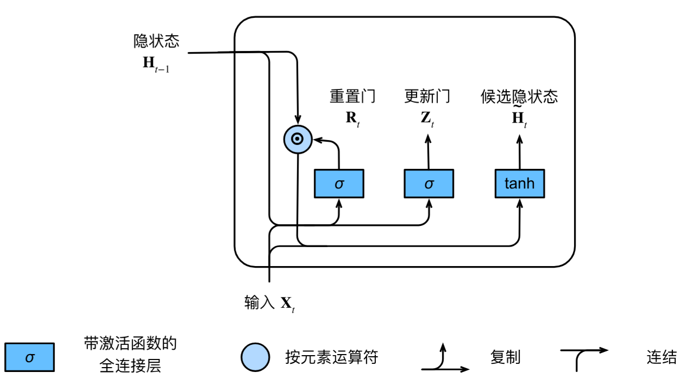
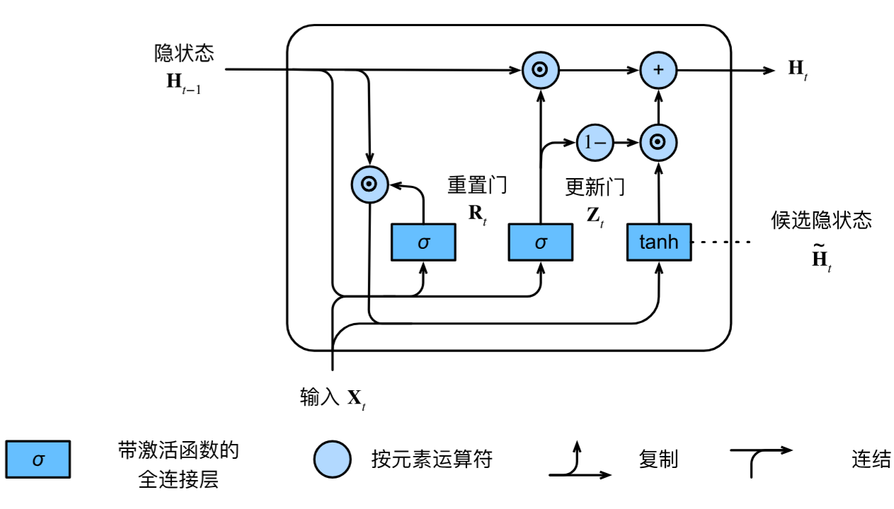

# 第九章 现代循环神经网络

## 本章概述

前一章介绍了循环神经网络的基础知识，但对于当今各种各样的序列学习问题，这些技术可能并不够用。本章将介绍更复杂的序列模型，以应对 RNN 在实际应用中的挑战。

### 主要挑战

| 挑战 | 描述 |
|------|------|
| **数值不稳定性** | 梯度消失和梯度爆炸问题 |
| **长期依赖** | 难以捕捉长距离的序列依赖关系 |
| **输入输出变长** | 许多任务中输入和输出都是任意长度的序列 |
| **单向信息流** | 标准 RNN 只能利用过去的信息 |

### 本章内容

| 章节 | 内容 |
|------|------|
| **9.1 门控循环单元（GRU）** | 通过重置门和更新门控制信息流动 |
| **9.2 长短期记忆网络（LSTM）** | 通过输入门、遗忘门、输出门和记忆单元实现长期记忆 |
| **9.3 深层循环神经网络** | 堆叠多个 RNN 层提高表达能力 |
| **9.4 双向循环神经网络** | 同时利用过去和未来的上下文信息 |
| **9.5 机器翻译与数据集** | 变长序列任务的数据准备 |
| **9.6 编码器-解码器架构** | 处理变长输入输出序列的通用框架 |
| **9.7 序列到序列学习（Seq2Seq）** | RNN 实现编码器-解码器的具体方案 |
| **9.8 束搜索** | 平衡质量和效率的序列生成策略 |

### 本章学习目标

完成本章学习后，你将能够：

1. 理解 **GRU** 和 **LSTM** 的门控机制及其解决梯度问题的原理
2. 构建 **深层循环神经网络** 处理更复杂的序列任务
3. 使用 **双向循环神经网络** 利用双向上下文信息
4. 理解 **编码器-解码器架构** 处理变长序列到变长序列的映射
5. 掌握 **束搜索** 在序列生成中的应用

### 核心思想

> **如果说标准 RNN 是"记忆"的雏形，那么 GRU 和 LSTM 就是给记忆装上了"读写控制器"，让网络学会自主决定何时记住、何时忘记、何时输出。这种门控机制是解决梯度消失/爆炸的关键突破。**


## 9.1 门控循环单元（GRU）

### 9.1.1 为什么需要门控机制？

标准 RNN 在处理长序列时面临三个关键问题：

| 问题 | 描述 |
|------|------|
| **早期信息丢失** | 第一个观测值可能对预测所有未来值至关重要，但梯度消失使早期信息无法传递到后期 |
| **无关词元干扰** | 某些词元（如辅助 HTML 代码）与预测任务无关，但 RNN 无法"跳过"它们 |
| **逻辑中断** | 序列中存在逻辑上的段落切换（如章节过渡、市场牛熊转换），需要"重置"内部状态 |

**门控机制的核心思想**：引入可学习的"门"来控制信息流，让网络自己学会何时记住、何时忘记、何时读取。

### 9.1.2 重置门和更新门

#### 门控设计

重置门（Reset Gate）$\mathbf{R}_t$ 和更新门（Update Gate）$\mathbf{Z}_t$ 都是 $(0, 1)$ 区间中的向量：

- **重置门**：控制"可能还想记住"的过去状态的数量
- **更新门**：控制新状态中有多少是旧状态的副本


#### 核心公式

$$\mathbf{R}_t = \sigma(\mathbf{X}_t \mathbf{W}_{xr} + \mathbf{H}_{t-1} \mathbf{W}_{hr} + \mathbf{b}_r)$$

$$\mathbf{Z}_t = \sigma(\mathbf{X}_t \mathbf{W}_{xz} + \mathbf{H}_{t-1} \mathbf{W}_{hz} + \mathbf{b}_z)$$

其中 $\mathbf{W}_{xr}, \mathbf{W}_{xz} \in \mathbb{R}^{d \times h}$ 和 $\mathbf{W}_{hr}, \mathbf{W}_{hz} \in \mathbb{R}^{h \times h}$ 是权重参数，$\mathbf{b}_r, \mathbf{b}_z \in \mathbb{R}^{1 \times h}$ 是偏置参数。

### 9.1.3 候选隐状态

$$\tilde{\mathbf{H}}_t = \tanh(\mathbf{X}_t \mathbf{W}_{xh} + (\mathbf{R}_t \odot \mathbf{H}_{t-1}) \mathbf{W}_{hh} + \mathbf{b}_h)$$

其中 $\odot$ 是 Hadamard 积（按元素乘积）。

**重置门的作用**：
- $\mathbf{R}_t$ 接近 $1$：恢复标准 RNN 行为
- $\mathbf{R}_t$ 接近 $0$：候选隐状态由当前输入决定，旧状态被**重置**



### 9.1.4 隐状态更新

$$\mathbf{H}_t = \mathbf{Z}_t \odot \mathbf{H}_{t-1} + (1 - \mathbf{Z}_t) \odot \tilde{\mathbf{H}}_t$$

**更新门的作用**：
- $\mathbf{Z}_t$ 接近 $1$：保留旧状态，忽略当前输入（**跳过时间步**）
- $\mathbf{Z}_t$ 接近 $0$：完全更新为候选隐状态



### 9.1.5 GRU 的两个显著特征

| 特征 | 作用 |
|------|------|
| **重置门** | 有助于捕获序列中的**短期依赖关系** |
| **更新门** | 有助于捕获序列中的**长期依赖关系** |

### 9.1.6 从零开始实现
#### 初始化模型参数

```python
import torch
from torch import nn
from d2l import torch as d2l

# ==================== 1. 加载数据 ====================
batch_size, num_steps = 32, 35  # 批次大小32，时间步数35
train_iter, vocab = d2l.load_data_time_machine(batch_size, num_steps)


# ==================== 2. 初始化模型参数 ====================
def get_params(vocab_size, num_hiddens, device):
    """
    初始化 GRU 的所有可训练参数
    
    Args:
        vocab_size: 词表大小（输入/输出维度）
        num_hiddens: 隐藏单元数
        device: 计算设备（CPU/GPU）
    
    Returns:
        params: 所有可训练参数列表（11个参数）
    
    GRU 参数分为四组:
        1. 更新门: W_xz, W_hz, b_z
        2. 重置门: W_xr, W_hr, b_r
        3. 候选隐状态: W_xh, W_hh, b_h
        4. 输出层: W_hq, b_q
    """
    num_inputs = num_outputs = vocab_size  # 输入和输出都等于词表大小

    def normal(shape):
        """从标准差为0.01的正态分布中采样"""
        return torch.randn(size=shape, device=device) * 0.01

    def three():
        """
        返回一组三参数: (输入权重, 隐状态权重, 偏置)
        用于更新门、重置门、候选隐状态各一组
        """
        return (normal((num_inputs, num_hiddens)),      # 输入→隐状态权重
                normal((num_hiddens, num_hiddens)),     # 隐状态→隐状态权重
                torch.zeros(num_hiddens, device=device)) # 偏置

    # ---- 更新门参数 ----
    # 控制有多少旧状态保留到新状态
    W_xz, W_hz, b_z = three()

    # ---- 重置门参数 ----
    # 控制是否忽略过去的隐状态
    W_xr, W_hr, b_r = three()

    # ---- 候选隐状态参数 ----
    # 生成当前时间步的候选隐状态
    W_xh, W_hh, b_h = three()

    # ---- 输出层参数 ----
    # 将隐状态映射到词表大小的输出
    W_hq = normal((num_hiddens, num_outputs))
    b_q = torch.zeros(num_outputs, device=device)

    # 收集所有参数并启用梯度
    params = [W_xz, W_hz, b_z, W_xr, W_hr, b_r, W_xh, W_hh, b_h, W_hq, b_q]
    for param in params:
        param.requires_grad_(True)
    return params
```
### 9.1.7 简洁实现（PyTorch）

使用 `nn.GRU` 高级 API：

```python
# ==================== 1. 加载数据 ====================
import torch
from torch import nn
from d2l import torch as d2l

batch_size, num_steps = 32, 35
train_iter, vocab = d2l.load_data_time_machine(batch_size, num_steps)


# ==================== 2. 定义模型 ====================
num_inputs = vocab_size          # 输入维度 = 词表大小
num_hiddens = 256                # 隐藏单元数（超参数）

# 创建 PyTorch 内置的 GRU 层
# nn.GRU 封装了所有 GRU 的门控计算，底层使用优化的 CUDA 内核
gru_layer = nn.GRU(num_inputs, num_hiddens)

# 使用 d2l 的 RNNModel 包装器，自动添加输出层
# RNNModel 会将 GRU 的输出（隐状态）通过全连接层映射到词表大小
model = d2l.RNNModel(gru_layer, len(vocab))

# 将模型参数移到 GPU（如果可用）
model = model.to(device)


# ==================== 3. 训练 ====================
num_epochs, lr = 500, 1

# 训练函数与从零实现相同，但底层使用 PyTorch 优化的 GRU 实现
# 高级 API 版本速度更快（约 4 倍），因为使用了编译好的 CUDA 运算符
d2l.train_ch8(model, train_iter, vocab, lr, num_epochs, device)
```

### 9.1.8 公式汇总

| 公式 | 含义 |
|------|------|
| $\mathbf{R}_t = \sigma(\mathbf{X}_t \mathbf{W}_{xr} + \mathbf{H}_{t-1} \mathbf{W}_{hr} + \mathbf{b}_r)$ | 重置门 |
| $\mathbf{Z}_t = \sigma(\mathbf{X}_t \mathbf{W}_{xz} + \mathbf{H}_{t-1} \mathbf{W}_{hz} + \mathbf{b}_z)$ | 更新门 |
| $\tilde{\mathbf{H}}_t = \tanh(\mathbf{X}_t \mathbf{W}_{xh} + (\mathbf{R}_t \odot \mathbf{H}_{t-1}) \mathbf{W}_{hh} + \mathbf{b}_h)$ | 候选隐状态 |
| $\mathbf{H}_t = \mathbf{Z}_t \odot \mathbf{H}_{t-1} + (1 - \mathbf{Z}_t) \odot \tilde{\mathbf{H}}_t$ | 隐状态更新 |

### 9.1.9 小结

| 要点 | 说明 |
|------|------|
| **门控机制** | 通过可学习的门控制信息流，解决梯度消失问题 |
| **重置门** | 控制是否忽略过去状态，捕获短期依赖 |
| **更新门** | 控制是否保留旧状态，捕获长期依赖 |
