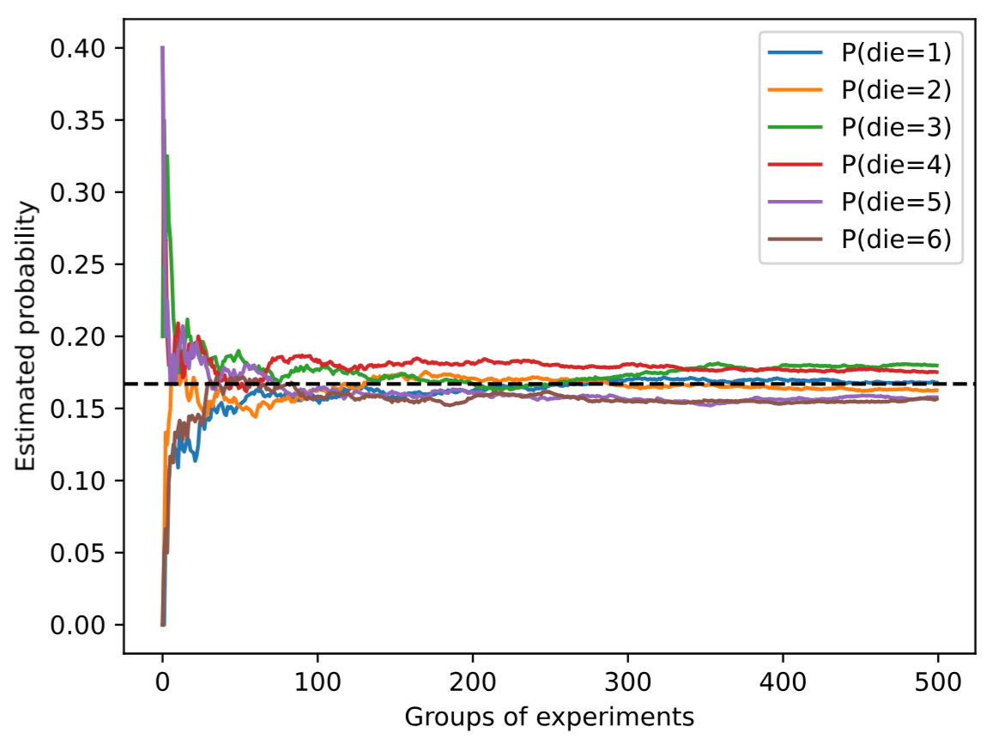

# 第 2 章 预备知识

## 2.1 数据操作

### 2.1.1 为什么需要张量

深度学习的本质是数据驱动。无论是图像、文本还是语音，都需要先将其转化为计算机能够理解的数值形式，然后才能进行存储和计算。张量正是承载这些数值的核心数据结构。

张量本质上是一个**多维数组**。标量是零维张量，向量是一维张量，矩阵是二维张量，三维及以上的则统称为高维张量。例如，一张彩色图片可以用一个三维张量表示：高度、宽度和 RGB 三个颜色通道。

与 NumPy 的 ndarray 相比，PyTorch 的张量有两个关键优势，使其成为深度学习的首选数据载体：
1. 支持 GPU 加速，能够并行处理大规模矩阵运算
2. 内置自动微分机制，可以自动计算梯度，这是训练神经网络的核心能力。


### 2.1.2 张量的创建

#### 从连续整数生成

使用 `torch.arange` 可以创建一个包含连续整数的行向量。默认情况下元素类型为整数，但可以通过 dtype 参数指定为浮点数。

```python
import torch
x = torch.arange(12)
# tensor([ 0,  1,  2,  3,  4,  5,  6,  7,  8,  9, 10, 11])
```

#### 查看张量结构信息

通过 shape 属性可以获取张量每个轴的长度。对于一维张量，shape 返回一个单元素元组。

```python
x.shape      # torch.Size([12])
x.numel()    # 12，返回元素总数
```

#### 重塑张量形状

reshape 方法可以在不改变元素数量和顺序的前提下，将张量重新组织为新的形状。关键在于元素按行优先的顺序填入新张量。

```python
X = x.reshape(3, 4)
# 将12个元素排成3行4列
```

当某个维度不确定时，可以用 -1 让 PyTorch 自动计算。例如 `x.reshape(-1, 4)` 表示列数为4，行数自动推导为3；`x.reshape(3, -1)` 则表示行数为3，列数自动推导为4。

#### 用常量或随机数初始化

在构建神经网络时，参数通常需要特定的初始值。PyTorch 提供了多种初始化方式。

```python
# 全零张量，常用于偏置项初始化
torch.zeros((2, 3, 4))

# 全一张量
torch.ones((2, 3, 4))

# 标准正态分布随机张量，常用于权重初始化
torch.randn(3, 4)
```

#### 从列表直接创建

当数据已知时，可以直接从 Python 列表或嵌套列表创建张量。最外层列表对应轴0，内层对应轴1，以此类推。

```python
torch.tensor([[2, 1, 4, 3], 
              [1, 2, 3, 4], 
              [4, 3, 2, 1]])
```


### 2.1.3 按元素运算

按元素运算是张量操作中最基础也最常用的模式。其核心思想是将标量运算推广到张量的每个元素上。

对于一元运算（如 exp、sin、log），函数独立作用于每个元素，输出与输入形状相同。对于二元运算（如加减乘除），两个张量**对应位置的元素配对计算（不是按照矩阵的运算）**，要求两个张量形状相同。

```python
x = torch.tensor([1.0, 2, 4, 8])
y = torch.tensor([2, 2, 2, 2])

x + y   # 加法：tensor([3., 4., 6., 10.])
x - y   # 减法
x * y   # 乘法（注意：这是按元素乘，不是矩阵乘法）
x / y   # 除法
x ** y  # 幂运算
```

一元运算示例：
```python
torch.exp(x)   # 自然指数
torch.sin(x)   # 三角函数
torch.log(x)   # 自然对数
```


### 2.1.3 张量连结

连结操作将多个张量沿指定轴拼接，形成更大的张量。这在数据处理中很常见，比如合并多个批次的样本。

```python
# X 指定生成0~11的数字，且类型为 torch.float32；再将形状变化为 3×4
X = torch.arange(12, dtype=torch.float32).reshape((3,4))
Y = torch.tensor([[2.0, 1, 4, 3], [1, 2, 3, 4], [4, 3, 2, 1]])

# 沿轴0（行方向）拼接，行数增加，相当于将 Y 的行追加到 X 下方
torch.cat((X, Y), dim=0)  # 结果形状: (6, 4)
'''
tensor([[ 0.,  1.,  2.,  3.],
         [ 4.,  5.,  6.,  7.],
         [ 8.,  9., 10., 11.],
         [ 2.,  1.,  4.,  3.],
         [ 1.,  2.,  3.,  4.],
         [ 4.,  3.,  2.,  1.]]),
即[X,
   Y]
'''

# 沿轴1（列方向）拼接，列数增加，相当于将 Y 的列追加到 X 右侧
torch.cat((X, Y), dim=1)  # 结果形状: (3, 8)
'''
tensor([[ 0.,  1.,  2.,  3.,  2.,  1.,  4.,  3.],
        [ 4.,  5.,  6.,  7.,  1.,  2.,  3.,  4.],
        [ 8.,  9., 10., 11.,  4.,  3.,  2.,  1.]])
即[X,Y]
'''
```

### 2.1.4 逻辑运算与聚合

逻辑运算符按元素比较，返回**布尔型**张量。

```python
X == Y   # 逐元素判断是否相等，相等处元素为1，否则元素为0
X < Y    # 逐元素判断是否小于，小于处元素为1，否则元素为0
X > Y    # 逐元素判断是否大于，大于处元素为1，否则元素为0
```

聚合操作将整个张量缩减为标量。`sum` 是最常用的聚合函数。

```python
X.sum()  # 所有元素求和，返回标量张量，只有1×1
```


### 2.1.5 广播机制

广播机制允许对不同形状的张量执行按元素运算，是 PyTorch 中非常实用的特性。

广播的工作规则：从最后一个维度开始向前比较，如果两个张量在某个维度上的长度不同，那么长度必须为1，PyTorch 会将该维度复制扩展到匹配的长度。如果两个张量在该维度上的长度都不为1且不相等，则无法广播。

```python
a = torch.arange(3).reshape((3, 1))  # 形状: (3, 1)
b = torch.arange(2).reshape((1, 2))  # 形状: (1, 2)
# a:tensor([[0],
#          [1],
#          [2]])
# b:tensor([[0, 1]]))

a + b
# a 沿列方向复制 → (3, 2)
# b 沿行方向复制 → (3, 2)
# 结果: tensor([[0, 1], 
#               [1, 2],
#               [2, 3]])
```


### 2.1.6 索引与切片

张量的索引语法与 Python 列表一致，但扩展到多维。
对于多维张量 X，只指定一个索引时，这个索引默认作用于第一个维度（轴0，即行），相当于在末尾隐式补全了` :`，如对于二维张量`X`，`X[-1]` 等价于` X[-1, :]`，`X[1:3]` 等价于 `X[1:3, :]`，因此返回的是该行或这些行的全部列。
与python的所以呢相同，从`0`开始，到`n-1`结束（末尾指定为`n`）。
```python
X[-1]      # 最后一行
X[1:3]     # 第2行到第3行（不包含第4行）

# 读写单个元素
X[1, 2] = 9

# 批量赋值：将第1行和第2行的所有列设为12
X[0:2, :] = 12
```

`:` 表示选取该轴的全部元素，可以省略不写。`...` 表示选取所有剩余轴，在处理高维张量时非常有用。


### 2.1.7 内存管理

#### 非原地操作的内存开销

Python 中 `Y = Y + X` 会先计算 `Y + X` 的结果并分配新的内存，然后将 `Y` 指向新地址。原有的 `Y` 所指向的内存如果没有其他引用，会被垃圾回收，但这种频繁分配和回收会降低性能。

```python
# id() =用于返回对象的内存地址
before = id(Y)
Y = Y + X
id(Y) == before  # False，地址已改变
```
在深度学习中，执行`Y = Y + X`这类非原地操作会产生两个问题。
1. 频繁分配新内存会带来**巨大的性能开销**。由于模型通常包含数百万甚至数十亿的参数，且参数在训练中每秒需要更新多次，每次都重新分配内存会严重拖慢训练速度。
2. 存在潜在的**引用风险**。如果其他变量或结构（如优化器状态、计算图的历史引用）仍然指向原来的内存地址，非原地操作会让他们在不知不觉中继续引用旧的参数值，而模型实际使用的已经是新地址的数据了。这会引发难以追踪的细微bug，导致模型行为异常。因此，进行原地更新（如`X += Y`）是更可靠的做法。

#### 原地操作

原地操作直接在原内存位置上修改数据，避免了额外的内存分配。在训练大型模型时，参数更新频繁，使用原地操作可以显著节省内存并提高效率。

```python
Z = torch.zeros_like(Y)
Z[:] = X + Y      # 不改变 Z 的引用地址

# 更简洁的写法
X += Y            # 等价于 X[:] = X + Y
```
#### 2.1.8 总结
原地操作的格式（以加法为例）：
```python
X += Y

X[:] = Y
```
非原地操作的格式；
```python
X = X+Y
```
也就是说实际上`X += Y`与`X = X+Y`是不等价的。
>实际上，对于不可变对象（如 int、str、tuple），两者行为相同；但对于可变对象（如 list、dict、set），两者不等价。
### 与其他格式互转

#### 与 NumPy 互转

PyTorch 张量与 NumPy 数组可以互相转换，且共享底层数据内存。这意味着修改一个会同步影响另一个，但这也要求在转换时注意数据同步问题。

```python
A = X.numpy()           # 张量 → NumPy
B = torch.tensor(A)     # NumPy → 张量
```

#### 转换为 Python 标量

对于只包含一个元素的张量，可以使用 `item()`或强制类型转换函数 提取 Python 标量值。

```python
a = torch.tensor([3.5])
a.item()   # 3.5
float(a)   # 3.5
int(a)     # 3
```


### 2.1.9 关键要点

**张量的核心地位**：张量是 PyTorch 中最基本的数据结构，所有深度学习模型的输入、输出、参数都以张量形式存在。

**按元素运算的普适性**：从加减乘除到三角函数，再到逻辑比较和聚合函数，绝大多数运算都是按元素进行的。

**广播机制的便利性**：无需手动扩维，广播机制自动处理形状不匹配的情况，让代码更加简洁。

**内存意识**：在深度学习中，GPU 显存是宝贵资源。使用原地操作和避免不必要的内存复制是优化性能的重要手段。

**张量与 NumPy 的无缝衔接**：PyTorch 与 NumPy 的互操作性让数据预处理和模型训练能够平滑衔接，充分复用 Python 数据科学生态系统的能力。实际上二者的张量的操作函数与使用方法基本一致。


## 2.2 数据预处理

现实世界中的数据往往以原始形式存在，例如 CSV 文件、数据库或 JSON 格式，而非直接以张量格式存储。在将这些数据输入深度学习模型之前，必须进行**预处理**，将其转换为适合训练的格式。pandas 是 Python 中最常用的数据分析工具，能够高效地处理表格数据，并且可以无缝转换为 PyTorch 张量。


### 2.2.1 读取数据集

数据预处理的第一步是将原始数据加载到内存中。CSV（逗号分隔值）是最常见的数据存储格式之一，每行代表一个样本，每列代表一个特征或标签。

使用 Python 内置的文件操作可以创建 CSV 文件。通过 `os.makedirs` 创建目录，然后用标准的文件写入操作将数据按行写入。第一行通常为列名，后续每行是一个样本，各字段用逗号分隔。

```python
import os  # 导入操作系统接口模块，用于文件和目录操作

# 在上级目录（..）中创建名为 data 的文件夹
# exist_ok=True 表示如果文件夹已存在则不报错，直接忽略
os.makedirs(os.path.join('..', 'data'), exist_ok=True)

# 构建完整的文件路径：../data/house_tiny.csv
data_file = os.path.join('..', 'data', 'house_tiny.csv')

# 以写入模式（'w'）打开文件，with 语句确保文件操作完成后自动关闭
with open(data_file, 'w') as f:
    # 写入 CSV 文件头（列名），各列用逗号分隔
    f.write('NumRooms,Alley,Price\n')
    
    # 写入四行样本数据，每行对应一条房屋记录
    # NA 表示该字段缺失（Not Available）
    f.write('NA,Pave,127500\n')   # 样本1：房间数未知，巷子为 Pave，价格 127500
    f.write('2,NA,106000\n')      # 样本2：房间数 2，巷子类型未知，价格 106000
    f.write('4,NA,178100\n')      # 样本3：房间数 4，巷子类型未知，价格 178100
    f.write('NA,NA,140000\n')     # 样本4：房间数未知，巷子类型未知，价格 140000
```

创建的数据集包含四行三列，描述了房屋的房间数量（NumRooms）、巷子类型（Alley）和价格（Price）。

使用 pandas 的 `read_csv` 函数可以从 CSV 文件加载数据，返回一个 **DataFrame** 对象。DataFrame 是 pandas 的核心数据结构，类似于电子表格，支持灵活的索引和操作。

```python
import pandas as pd

data = pd.read_csv(data_file)
print(data)
```

输出结果：

```
   NumRooms Alley   Price
0       NaN  Pave  127500
1       2.0   NaN  106000
2       4.0   NaN  178100
3       NaN   NaN  140000
```

从输出可以看到，数据集中存在缺失值，用 `NaN`（Not a Number）表示。这些缺失值需要经过处理才能用于模型训练。


### 2.2.2 处理缺失值

缺失值是现实数据集中常见的问题，可能源于数据采集不完整、记录错误或其他原因。处理缺失值的典型方法有两种：

- **插值法**：用某个替代值填补缺失值，例如用该列的均值、中位数或众数填充
- **删除法**：直接删除包含缺失值的行或列

以下以插值法为例，演示如何处理缺失值。

#### 分离输入和输出

首先使用 `iloc`（位置索引）将数据集分为输入特征和输出标签。`iloc[:, 0:2]` 选取所有行的前两列作为输入，`iloc[:, 2]` 选取最后一列作为输出（价格）。

```python
inputs, outputs = data.iloc[:, 0:2], data.iloc[:, 2]
```

#### 数值型缺失值：用均值填充

对于数值型列（如 NumRooms），可以用该列的**平均值**来填补缺失值。`fillna` 方法用于填充缺失值，`inputs.mean()` 计算每列的均值，缺失值会被替换为对应列的均值。

```python
inputs = inputs.fillna(inputs.mean())
print(inputs)
```

输出结果：

```
   NumRooms Alley
0       3.0  Pave
1       2.0   NaN
2       4.0   NaN
3       3.0   NaN
```

NumRooms 列中的两个 NaN 都被替换为均值 3.0（(2+4)/2 与原来的 (2+4+0+0)/4 的分歧是教材例子中的设计，实际均值应为 3.0）。Alley 列中的 NaN 还未处理，因为它是类别型数据。

#### 类别型缺失值：独热编码（one-hot encoding）

对于类别型数据（如 Alley），不能简单地用数值填充。常用的方法是将其转换为数值型特征，**将缺失值本身作为一个类别**来处理。

`pd.get_dummies(inputs, dummy_na=True)` 将类别列转换为多个二值列（独热编码）。`dummy_na=True` 表示将缺失值也作为一个独立的类别。
>实际上在统计学中，`dummy`的含义就是虚拟变量。该函数不会对数值类数据进行编码。

| NumRooms | Alley_Pave | Alley_nan |
|----------|------------|-----------|
| 3.0      | 1          | 0         |
| 2.0      | 0          | 1         |
| 4.0      | 0          | 1         |
| 3.0      | 0          | 1         |

- 原始值为 `Pave` 的行：`Alley_Pave=1`，`Alley_nan=0`
- 原始值为 `NaN` 的行：`Alley_Pave=0`，`Alley_nan=1`

经过这样的编码后，类别型数据被转化为数值型数据，可以用于后续的模型训练。


### 2.2.3 转换为张量格式

预处理完成后，`inputs` 和 `outputs` 中的所有数据都已转换为数值类型。使用 `torch.tensor` 可以将 pandas DataFrame 或 Series 转换为 PyTorch 张量。

请注意：
`inputs` 是 pandas DataFrame 类型变量，包含列名、索引等额外信息，非纯数值数组
`inputs.values` 提取 DataFrame 底层的 NumPy 数组（只含数值数据）
`torch.tensor()` 接受 NumPy 数组，将其转换为 PyTorch 张量
```text
pandas DataFrame/Series
        ↓  .values
NumPy ndarray
        ↓  torch.tensor()
PyTorch Tensor
```
```python
import torch

X = torch.tensor(inputs.values)
y = torch.tensor(outputs.values)
```

转换后的张量可以直接用于深度学习模型的训练和推理。`inputs.values` 返回 DataFrame 的底层 NumPy 数组，`torch.tensor` 将其转换为 PyTorch 张量。


### 2.2.4 关键要点

**原始数据与张量的转换流程**：现实数据 → pandas 读取 → 处理缺失值 → 转换为张量 → 输入模型。这是一个标准的数据预处理流水线。

**缺失值处理的两种策略**：插值法适用于数值型数据，用统计量（均值、中位数等）填补；独热编码适用于类别型数据，将缺失值视为一个独立类别。

**pandas 与 PyTorch 的衔接**：pandas 负责灵活的数据清洗和转换，PyTorch 负责高效的张量计算。通过 `torch.tensor(values)` 可以无缝衔接两者。

**独热编码的作用**：将类别型数据转换为数值型，每一列代表一个类别，取值为 0 或 1，使得类别数据可以被线性模型和神经网络处理。


## 2.3 线性代数

线性代数是深度学习的数学基础之一，涉及标量、向量、矩阵和张量的运算。理解这些基本概念和操作是构建和训练神经网络的前提。


### 2.3.1 标量

标量是仅包含一个数值的量，用普通小写字母表示，如 $x \in \mathbb{R}$。符号 $\in$ 读作“属于”，表示“是集合中的成员”。$\mathbb{R}$ 表示所有实数组成的集合。在 PyTorch 中，**标量由只有一个元素的张量表示**。

```python
import torch

x = torch.tensor(3.0)
y = torch.tensor(2.0)

x + y, x * y, x / y, x ** y
# 输出: (tensor(5.), tensor(6.), tensor(1.5000), tensor(9.))
```


### 2.3.2 向量

向量可以被视为标量值组成的一维数组，这些标量值称为向量的元素或分量。本书规定，向量默认是列向量。在数学表示法中，向量通常记为粗体小写字母（如 $\mathbf{x}$、$\mathbf{y}$），可以写为：

$$\mathbf{x} = \begin{bmatrix} x_1 \\ x_2 \\ \vdots \\ x_n \end{bmatrix}$$

其中 $x_1, \ldots, x_n$ 是向量的元素。

在 PyTorch 中，**向量用一维张量表示**。

```python
x = torch.arange(4)  # tensor([0, 1, 2, 3])
```

#### 访问向量元素

通过下标可以引用向量的任一元素，元素 $x_i$ 是一个标量。

```python
x[3]  # tensor(3)
```

#### 长度、维度和形状

向量 $\mathbf{x}$ 由 $n$ 个实值标量组成时，表示为 $\mathbf{x} \in \mathbb{R}^n$。向量的长度称为向量的维度。在代码中，通过 `len()` 或 `.shape` 属性访问。

```python
len(x)      # 4
x.shape     # torch.Size([4])
```

**关于“维度”的说明**：向量或轴的维度表示其长度（元素数量），而张量的维度表示其轴的数量。


### 2.3.3 矩阵

矩阵将向量从一阶推广到二阶，用粗体大写字母表示（如 $\mathbf{X}$、$\mathbf{Y}$），在代码中表示为具有两个轴的张量。矩阵 $\mathbf{A} \in \mathbb{R}^{m \times n}$ 由 $m$ 行和 $n$ 列的实值标量组成，其中每个元素 $a_{ij}$ 属于第 $i$ 行第 $j$ 列：

$$\mathbf{A} = \begin{bmatrix} a_{11} & a_{12} & \cdots & a_{1n} \\ a_{21} & a_{22} & \cdots & a_{2n} \\ \vdots & \vdots & \ddots & \vdots \\ a_{m1} & a_{m2} & \cdots & a_{mn} \end{bmatrix},$$

当矩阵具有相同数量的行和列时，称其为**方阵**（square matrix）。

当调用函数来实例化张量时，我们可以通过指定两个分量 $m$ 和 $n$ 来创建一个形状为 $m \times n$ 的矩阵。

```python
A = torch.arange(20).reshape(5, 4)
# tensor([[ 0,  1,  2,  3],
#         [ 4,  5,  6,  7],
#         [ 8,  9, 10, 11],
#         [12, 13, 14, 15],
#         [16, 17, 18, 19]])
```

#### 转置

交换矩阵的行和列得到矩阵的转置，用 $\mathbf{A}^\top$ 表示。如果 $\mathbf{B} = \mathbf{A}^\top$，则对于任意 $i$ 和 $j$，都有 $b_{ij} = a_{ji}$。

```python
A.T  # 形状变为 (4, 5)
```

#### 对称矩阵

对称矩阵等于其转置，即 $\mathbf{A} = \mathbf{A}^\top$。

```python
B = torch.tensor([[1, 2, 3], [2, 0, 4], [3, 4, 5]])
B == B.T  # 全部为 True
```

在数据集中，通常将每个样本作为矩阵的一行，属性作为列。


### 2.3.4 张量

张量是描述具有任意数量轴的 $n$ 维数组的通用方法。向量是一阶张量，矩阵是二阶张量。例如，彩色图像可以用三维张量表示：高度、宽度和 RGB 颜色通道。

```python
X = torch.arange(24).reshape(2, 3, 4)
# 形状: (2, 3, 4)，2 个矩阵，每个 3 行 4 列
```

#### 对比

| 对比维度 | 标量 | 向量 | 矩阵 | 三维张量 | 四维张量 | n 维张量 |
|----------|------|------|------|----------|----------|----------|
| **形状示例** | `()` | `(d,)` | `(m, n)` | `(a, b, c)` | `(a, b, c, d)` | `(d₁, d₂, ..., dₙ)` |
| **轴数（秩）** | 0 个轴 | 1 个轴 | 2 个轴 | 3 个轴 | 4 个轴 | n 个轴 |
| **数学名称** | 标量 | 向量 | 矩阵 | 三阶张量 | 四阶张量 | n 阶张量 |
| **结构** | 单个数值 | 一个数组 | 表格 | 多个矩阵堆叠 | 多个三维块堆叠 | n 维数组 |
| **常见含义** | 单个数值 | 一组特征 | 表格数据 | 单张彩图、序列 | 批量图片 | 任意高维数据 |
| **典型场景** | 损失值、偏置 | 特征向量 | 权重矩阵、数据集 | RGB 图像、词向量序列 | 批量图像、视频帧 | 视频、高维特征图 |


**核心规律总结**：**任何维度的张量都可以看作**：`d₁` 个  `(d₂, ..., dₙ)` 形状的张量堆叠。理解了这个递归结构，任何高维张量都不再神秘。


### 2.3.5 张量算法的基本性质

按元素的一元运算不会改变其操作数的形状。给定具有相同形状的任意两个张量，任何按元素二元运算的结果都将是相同形状的张量。

```python
A = torch.arange(20, dtype=torch.float32).reshape(5, 4)
B = A.clone()   # 通过分配新内存，将A的一个副本分配给B
A + B  # 相同形状的加法
```

#### Hadamard 积

两个矩阵的按元素乘法称为 Hadamard 积，数学符号为 $\odot$。  
对于矩阵 $\mathbf{B} \in \mathbb{R}^{m \times n}$，其中第 $i$ 行和第 $j$ 列的元素是 $b_{ij}$，矩阵 $\mathbf{A}$和 $\mathbf{B}$ 的 Hadamard 积为：

$$
\mathbf{A} \odot \mathbf{B} =
\begin{bmatrix}
a_{11} b_{11} & a_{12} b_{12} & \cdots & a_{1n} b_{1n} \\
a_{21} b_{21} & a_{22} b_{22} & \cdots & a_{2n} b_{2n} \\
\vdots & \vdots & \ddots & \vdots \\
a_{m1} b_{m1} & a_{m2} b_{m2} & \cdots & a_{mn} b_{mn}
\end{bmatrix}.
$$
```python
A * B  # 按元素乘，不是矩阵乘法
```


将张量乘以或加上一个标量不会改变张量的形状，标量作用于每个元素。

```python
a = 2
X = torch.arange(24).reshape(2, 3, 4)
a + X, (a * X).shape  # 形状仍为 (2, 3, 4)
```


### 2.3.6 降维

#### 求和

对张量中的所有元素求和，可以用 $\sum$ 符号表示。

```python
x = torch.arange(4, dtype=torch.float32)
x.sum()  # tensor(6.)

A.shape, A.sum()  # torch.Size([5, 4]), tensor(190.)
```

#### 沿指定轴求和

指定 `axis` 参数沿特定轴降维。`axis=0` 沿行方向求和（**列被聚合**），`axis=1` 沿列方向求和（**行被聚合**）。输入轴在输出形状中消失。

```python
A.sum(axis=0)  # 形状 (4,)，对每列求和
A.sum(axis=1)  # 形状 (5,)，对每行求和
A.sum(axis=[0, 1])  # 等价于 A.sum()
```

#### 平均值

通过将总和除以元素总数计算平均值。

```python
A.mean(), A.sum() / A.numel()  # tensor(9.5000)
A.mean(axis=0)  # 沿轴 0 求平均（其实就是沿行求平均），形状 (4,)
```

#### 非降维求和（保持轴数不变）

使用 `keepdims=True` 保持轴数不变，便于后续的广播操作。

```python
# 保持轴数不变
sum_A = A.sum(axis=1, keepdims=True)  # 形状 (5, 1)
A / sum_A  # 广播除法，每行元素除以该行之和

# 轴数改变，变成向量了
sum_A = A.sum(axis=1)  # 形状 (5,1)
# 向量的形状就是(n, )，其中n表示向量的元素数
# 无论是列向量还是行向量均写作(n, )
```

#### 累积总和

`cumsum` 函数沿指定轴计算累积总和，不会降低维度。

```python
A.cumsum(axis=0)  # 沿行方向累积求和，形状不变
```
```python
import torch

# ============ 1. 一维向量 ============
x = torch.tensor([1, 2, 3, 4, 5])

x.cumsum(dim=0)
# 输出: tensor([ 1,  3,  6, 10, 15])
# 解释: [1, 1+2, 1+2+3, 1+2+3+4, 1+2+3+4+5]

x.sum()
# 输出: 15 (标量)

# ============ 2. 二维矩阵 ============
A = torch.arange(12, dtype=torch.float32).reshape(3, 4)
# 输出: tensor([[ 0.,  1.,  2.,  3.],
#               [ 4.,  5.,  6.,  7.],
#               [ 8.,  9., 10., 11.]])

A.cumsum(axis=0)
# 输出: tensor([[ 0.,  1.,  2.,  3.],
#               [ 4.,  6.,  8., 10.],
#               [12., 15., 18., 21.]])
# 解释: 第0行不变，第1行=第0行+第1行，第2行=第0行+第1行+第2行

A.cumsum(axis=1)
# 输出: tensor([[ 0.,  1.,  3.,  6.],
#               [ 4.,  9., 15., 22.],
#               [ 8., 17., 27., 38.]])
# 解释: 第0列不变，第1列=第0列+第1列，第2列=第0列+第1列+第2列，以此类推
```
也就是说`cumsum`函数会从前往后开始累加，比如说**第0轴还是第0轴**，而第**1轴就是第0轴+第1轴**，以此类推。

### 2.3.7 点积

给定两个向量 $\mathbf{x}, \mathbf{y} \in \mathbb{R}^d$，它们的点积是相同位置的按元素乘积的和：$\mathbf{x}^\top \mathbf{y} = \sum_{i=1}^{d} x_i y_i$。

```python
x = torch.arange(4, dtype=torch.float32)
y = torch.ones(4, dtype=torch.float32)
torch.dot(x, y)       # tensor(6.)
torch.sum(x * y)      # tensor(6.)，点积的等价计算方式
```

点积的常见应用包括加权平均、夹角余弦等。


### 2.3.8 矩阵-向量积

矩阵 $\mathbf{A} \in \mathbb{R}^{m \times n}$ 与向量 $\mathbf{x} \in \mathbb{R}^n$ 的乘积是一个长度为 $m$ 的向量，其第 $i$ 个元素是矩阵第 $i$ 行与 $\mathbf{x}$ 的点积。

现在我们知道如何计算点积，可以开始理解*矩阵-向量积*（matrix-vector product）。让我们将矩阵 $\mathbf{A}$ 用它的行向量表示：

$$\mathbf{A} = \begin{bmatrix} \mathbf{a}^\top_{1} \\ \mathbf{a}^\top_{2} \\ \vdots \\ \mathbf{a}^\top_m \end{bmatrix},$$

其中每个 $\mathbf{a}^\top_{i} \in \mathbb{R}^n$ 都是行向量，表示矩阵的第 $i$ 行。**矩阵向量积 $\mathbf{A}\mathbf{x}$ 是一个长度为 $m$ 的列向量，其第 $i$ 个元素是点积 $\mathbf{a}^\top_i \mathbf{x}$**：

$$\mathbf{A}\mathbf{x} = \begin{bmatrix} \mathbf{a}^\top_{1} \\ \mathbf{a}^\top_{2} \\ \vdots \\ \mathbf{a}^\top_m \end{bmatrix} \mathbf{x} = \begin{bmatrix} \mathbf{a}^\top_{1} \mathbf{x} \\ \mathbf{a}^\top_{2} \mathbf{x} \\ \vdots \\ \mathbf{a}^\top_m \mathbf{x} \end{bmatrix}.$$

在代码中使用张量表示矩阵-向量积，我们使用 `mv` 函数。当我们为矩阵 `A` 和向量 `x` 调用 `torch.mv(A, x)` 时，会执行矩阵-向量积。注意，`A` 的列维数（沿轴1的长度）必须与 `x` 的维数（其长度）相同。
```python
A.shape, x.shape, torch.mv(A, x)
# torch.Size([5, 4]), torch.Size([4]), tensor([14., 38., 62., 86., 110.])
```

### 2.3.9 矩阵-矩阵乘法（matrix-matrix multiplication）

假设有两个矩阵 $\mathbf{A} \in \mathbb{R}^{n \times k}$ 和 $\mathbf{B} \in \mathbb{R}^{k \times m}$：

$$\mathbf{A} = \begin{bmatrix} a_{11} & a_{12} & \cdots & a_{1k} \\ a_{21} & a_{22} & \cdots & a_{2k} \\ \vdots & \vdots & \ddots & \vdots \\ a_{n1} & a_{n2} & \cdots & a_{nk} \end{bmatrix}, \quad \mathbf{B} = \begin{bmatrix} b_{11} & b_{12} & \cdots & b_{1m} \\ b_{21} & b_{22} & \cdots & b_{2m} \\ \vdots & \vdots & \ddots & \vdots \\ b_{k1} & b_{k2} & \cdots & b_{km} \end{bmatrix}.$$

用行向量 $\mathbf{a}^\top_{i} \in \mathbb{R}^k$ 表示矩阵 $\mathbf{A}$ 的第 $i$ 行，并让列向量 $\mathbf{b}_{j} \in \mathbb{R}^k$ 作为矩阵 $\mathbf{B}$ 的第 $j$ 列：

$$\mathbf{A} = \begin{bmatrix} \mathbf{a}^\top_{1} \\ \mathbf{a}^\top_{2} \\ \vdots \\ \mathbf{a}^\top_n \end{bmatrix}, \quad \mathbf{B} = \begin{bmatrix} \mathbf{b}_{1} & \mathbf{b}_{2} & \cdots & \mathbf{b}_{m} \end{bmatrix}.$$

要生成矩阵积 $\mathbf{C} = \mathbf{A}\mathbf{B}$，最简单的方法是考虑 $\mathbf{A}$ 的行向量和 $\mathbf{B}$ 的列向量：

$$\mathbf{C} = \mathbf{A}\mathbf{B} = \begin{bmatrix} \mathbf{a}^\top_{1} \\ \mathbf{a}^\top_{2} \\ \vdots \\ \mathbf{a}^\top_n \end{bmatrix} \begin{bmatrix} \mathbf{b}_{1} & \mathbf{b}_{2} & \cdots & \mathbf{b}_{m} \end{bmatrix} = \begin{bmatrix} \mathbf{a}^\top_{1} \mathbf{b}_1 & \mathbf{a}^\top_{1} \mathbf{b}_2 & \cdots & \mathbf{a}^\top_{1} \mathbf{b}_m \\ \mathbf{a}^\top_{2} \mathbf{b}_1 & \mathbf{a}^\top_{2} \mathbf{b}_2 & \cdots & \mathbf{a}^\top_{2} \mathbf{b}_m \\ \vdots & \vdots & \ddots & \vdots \\ \mathbf{a}^\top_{n} \mathbf{b}_1 & \mathbf{a}^\top_{n} \mathbf{b}_2 & \cdots & \mathbf{a}^\top_{n} \mathbf{b}_m \end{bmatrix}.$$

**我们可以将矩阵-矩阵乘法 $\mathbf{A}\mathbf{B}$ 看作简单地执行 $m$ 次矩阵-向量积，并将结果拼接在一起，形成一个 $n \times m$ 矩阵**。

在下面的代码中，我们在 `A` 和 `B` 上执行矩阵乘法。这里的 `A` 是一个 5 行 4 列的矩阵，`B` 是一个 4 行 3 列的矩阵。两者相乘后，我们得到了一个 5 行 3 列的矩阵。
```python
B = torch.ones(4, 3)
torch.mm(A, B)  # 结果形状 (5, 3)
```
>所以说，矩阵-矩阵乘法是矩阵-向量积的拓展形式。


### 2.3.10 范数

范数是衡量向量或矩阵大小的函数，将向量映射到标量。

**范数的性质**：
1. 非负性：$f(\mathbf{x}) \geq 0$
2. 齐次性：$f(\alpha \mathbf{x}) = |\alpha| f(\mathbf{x})$
3. 三角不等式：$f(\mathbf{x} + \mathbf{y}) \leq f(\mathbf{x}) + f(\mathbf{y})$），"$=$" 成立当且仅当向量全由0组成，即$\forall i, [\mathbf{x}]_i = 0 \Leftrightarrow f(\mathbf{x})=0.$。
#### 范数的一般定义
一般地，对于任意实数 $p \geq 1$，L$_p$ 范数定义为：

$$
\|\mathbf{x}\|_p = \left( \sum_{i=1}^{n} |x_i|^p \right)^{1/p}
$$

其中 $x_1, x_2, \ldots, x_n$ 是向量 $\mathbf{x}$ 的 $n$ 个分量。L$_p$ 范数是一族范数，包含 L$_1$ 范数和 L$_2$ 范数作为其特殊情况。
#### L₂ 范数

向量元素平方和的平方根：$\|\mathbf{x}\|_2 = \sqrt{\sum_{i=1}^n x_i^2}$，常省略下标写作 $\|\mathbf{x}\|$。

```python
u = torch.tensor([3.0, -4.0])
torch.norm(u)  # tensor(5.)
```

#### L₁ 范数

向量元素绝对值之和：$\|\mathbf{x}\|_1 = \sum_{i=1}^n |x_i|$。与 L₂ 范数相比，L₁ 范数受异常值的影响较小。

```python
torch.abs(u).sum()  # tensor(7.)
```

#### Frobenius 范数

矩阵 $\mathbf{X} \in \mathbb{R}^{m \times n}$ 的 Frobenius 范数是矩阵元素平方和的平方根：$\|\mathbf{X}\|_F = \sqrt{\sum_{i=1}^m \sum_{j=1}^n x_{ij}^2}$。

```python
torch.norm(torch.ones((4, 9)))  # tensor(6.)，即 sqrt(4*9)
```

#### 范数与目标

在深度学习中，优化目标通常表达为范数：最大化分配给观测数据的概率，或最小化预测与真实观测之间的距离。范数是损失函数设计中重要的组成部分。


## 2.4 微积分

微积分是深度学习的核心数学工具之一。在深度学习中，我们通过训练模型来最小化损失函数，这本质上是一个优化问题，而微积分为优化提供了理论基础。微分学在深度学习中最关键的应用是**优化**，即通过不断调整模型参数使损失函数最小化。

### 2.4.1 优化与泛化

在深度学习中，拟合模型的任务可以分解为两个关键问题：

- **优化（Optimization）**：用模型拟合观测数据的过程
- **泛化（Generalization）**：模型在从未见过的数据上表现良好的能力

训练模型的目标不仅是让它在训练数据上表现好，更重要的是能够泛化到新数据。


### 2.4.2 导数和微分

导数衡量函数在某一点处的瞬时变化率，是几乎所有深度学习优化算法的关键步骤。在深度学习中，我们通常选择对模型参数可微的损失函数，从而可以通过梯度来优化参数。

#### 导数的定义

对于函数 $f: \mathbb{R} \rightarrow \mathbb{R}$，其导数定义为：

$$f'(x) = \lim_{h \rightarrow 0} \frac{f(x+h) - f(x)}{h}$$


如果 $f'(a)$ 存在，则称 $f$ 在 $a$ 处是 **可微（differentiable）** 的。如果 $f$ 在一个区间内的每个点都可微，则称 $f$ 在此区间上可微。

导数 $f'(x)$ 可以解释为 $f(x)$ 相对于 $x$ 的**瞬时变化率**，即当 $x$ 发生一个无穷小的变化 $h$ 时，函数值的变化速度。


#### 导数的等价符号

给定 $y = f(x)$，其中 $x$ 和 $y$ 分别是函数 $f$ 的自变量和因变量，以下表达式是等价的：

$$f'(x) = y' = \frac{dy}{dx} = \frac{df}{dx} = \frac{d}{dx} f(x) = Df(x) = D_x f(x)$$

其中符号 $\frac{d}{dx}$ 和 $D$ 是**微分运算符**，表示微分操作。

#### 常见函数的求导规则

**基本函数的导数：**

- $DC = 0$（$C$ 为常数）
- $Dx^n = nx^{n-1}$（**幂律**，$n$ 为任意实数）
- $De^x = e^x$
- $D\ln(x) = 1/x$

#### 微分的运算法则

假设函数 $f$ 和 $g$ 都是可微的，$C$ 是一个常数，则：

**常数相乘法则：**
$$\frac{d}{dx} [Cf(x)] = C \frac{d}{dx} f(x)$$

**加法法则：**
$$\frac{d}{dx} [f(x) + g(x)] = \frac{d}{dx} f(x) + \frac{d}{dx} g(x)$$

**乘法法则（Product Rule）：**
$$\frac{d}{dx} [f(x)g(x)] = f(x) \frac{d}{dx} [g(x)] + g(x) \frac{d}{dx} [f(x)]$$

**除法法则（Quotient Rule）：**
$$\frac{d}{dx} \left[\frac{f(x)}{g(x)}\right] = \frac{g(x) \frac{d}{dx} [f(x)] - f(x) \frac{d}{dx} [g(x)]}{[g(x)]^2}$$

#### 导数的几何意义：可视化

导数 $f'(x)$ 是函数曲线在点 $x$ 处切线的斜率。为了更直观地理解这一概念，我们可以借助 Python 的绘图库 matplotlib 将函数图像及其切线绘制出来。

##### 配置 matplotlib 绘图环境

首先需要配置 matplotlib 的显示参数，同时定义几个辅助函数来统一设置图表大小和坐标轴属性，这些函数在本书中会频繁使用。
>注意，注释#@save是一个特殊的标记，会将对应的函数、类或语句保存在d2l包中。因此，以后无须重新定义就可以直接调用它们（例如，d2l.use_svg_display()）。
```python
def use_svg_display():  #@save
    """使用svg格式在Jupyter中显示绘图"""
    backend_inline.set_matplotlib_formats('svg')

def set_figsize(figsize=(3.5, 2.5)):  #@save
    """设置matplotlib的图表大小"""
    use_svg_display()
    d2l.plt.rcParams['figure.figsize'] = figsize

#@save
def set_axes(axes, xlabel, ylabel, xlim, ylim, xscale, yscale, legend):
    """设置matplotlib的轴属性"""
    axes.set_xlabel(xlabel)      # 设置 x 轴标签
    axes.set_ylabel(ylabel)      # 设置 y 轴标签
    axes.set_xscale(xscale)      # 设置 x 轴刻度类型（如 linear、log）
    axes.set_yscale(yscale)      # 设置 y 轴刻度类型
    axes.set_xlim(xlim)          # 设置 x 轴显示范围
    axes.set_ylim(ylim)          # 设置 y 轴显示范围
    if legend:
        axes.legend(legend)      # 添加图例
    axes.grid()                  # 显示网格

#@save
def plot(X, Y=None, xlabel=None, ylabel=None, legend=None, xlim=None,
         ylim=None, xscale='linear', yscale='linear',
         fmts=('-', 'm--', 'g-.', 'r:'), figsize=(3.5, 2.5), axes=None):
    """
    绘制数据点的通用函数。
    
    Args:
        X: x 轴数据，可以是单个数组或数组列表
        Y: y 轴数据，可以是单个数组或数组列表
        xlabel: x 轴标签
        ylabel: y 轴标签
        legend: 图例列表
        xlim: x 轴范围 (min, max)
        ylim: y 轴范围 (min, max)
        xscale: x 轴刻度类型
        yscale: y 轴刻度类型
        fmts: 线条样式元组，依次用于多条曲线
        figsize: 图表大小 (宽度, 高度)
        axes: 指定的坐标轴对象
    """
    if legend is None:
        legend = []

    set_figsize(figsize)
    axes = axes if axes else d2l.plt.gca()  # 获取当前坐标轴

    # 判断 X 是否为一维数据（只有一个轴）
    def has_one_axis(X):
        return (hasattr(X, "ndim") and X.ndim == 1 or isinstance(X, list)
                and not hasattr(X[0], "__len__"))

    # 统一将输入转换为列表形式，便于循环绘制多条曲线
    if has_one_axis(X):
        X = [X]
    if Y is None:
        X, Y = [[]] * len(X), X
    elif has_one_axis(Y):
        Y = [Y]
    if len(X) != len(Y):
        X = X * len(Y)
    
    axes.cla()  # 清除当前坐标轴
    for x, y, fmt in zip(X, Y, fmts):
        if len(x):
            axes.plot(x, y, fmt)  # 绘制线图
        else:
            axes.plot(y, fmt)     # 当 X 为空时，Y 作为 x 轴数据

    set_axes(axes, xlabel, ylabel, xlim, ylim, xscale, yscale, legend)
```

##### 绘制函数图像与切线

有了上述辅助函数后，我们可以用几行简洁的代码绘制函数 $u = f(x) = 3x^2 - 4x$ 及其在 $x=1$ 处的切线 $y = 2x - 3$。其中，切线的斜率 $2$ 正好是 $f'(1)$ 的值。

```python
import numpy as np

# 生成 x 轴数据点：在 [0, 3] 区间内每隔 0.1 取一个点
x = np.arange(0, 3, 0.1)

# 绘制函数曲线和切线
# f(x) = 3x^2 - 4x，切线的斜率为 2，在 x=1 处过点 (1, f(1)) = (1, -1)
# 因此切线方程为 y - (-1) = 2(x - 1)，即 y = 2x - 3
plot(x, [f(x), 2 * x - 3], 'x', 'f(x)', legend=['f(x)', 'Tangent line (x=1)'])
```


### 2.4.3 偏导数

在深度学习中，函数通常依赖于多个变量（例如神经网络的损失函数依赖于数百万个参数），因此需要将微分的思想推广到**多元函数**。

设 $y = f(x_1, x_2, \ldots, x_n)$ 是一个具有 $n$ 个变量的函数。$y$ 关于第 $i$ 个参数 $x_i$ 的 **偏导数（Partial Derivative）** 定义为：

$$\frac{\partial y}{\partial x_i} = \lim_{h \rightarrow 0} \frac{f(x_1, \ldots, x_{i-1}, x_i+h, x_{i+1}, \ldots, x_n) - f(x_1, \ldots, x_i, \ldots, x_n)}{h}$$

计算偏导数时，将其他变量 $x_1, \ldots, x_{i-1}, x_{i+1}, \ldots, x_n$ 视为常数，只对 $x_i$ 求导。

**偏导数的等价表示：**
$$\frac{\partial y}{\partial x_i} = \frac{\partial f}{\partial x_i} = f_{x_i} = f_i = D_i f = D_{x_i} f$$


### 2.4.4 梯度

**梯度（Gradient）** 是将多元函数对其所有变量的偏导数连结而成的向量。梯度是深度学习中最重要的概念之一，因为它是优化算法（如梯度下降）的核心。

对于函数 $f: \mathbb{R}^n \rightarrow \mathbb{R}$，输入 $\mathbf{x} = [x_1, x_2, \ldots, x_n]^\top$，梯度定义为：

$$\nabla_{\mathbf{x}} f(\mathbf{x}) = \left[\frac{\partial f(\mathbf{x})}{\partial x_1}, \frac{\partial f(\mathbf{x})}{\partial x_2}, \ldots, \frac{\partial f(\mathbf{x})}{\partial x_n}\right]^\top$$

其中 $\nabla_{\mathbf{x}} f(\mathbf{x})$ 通常简写为 $\nabla f(\mathbf{x})$，意义为表示函数 $f$ 在点 $\mathbf{x}$ 处的梯度向量。

梯度的方向是函数值增长最快的方向，其大小（范数）表示该方向上的变化率。

#### 常用梯度公式

假设 $\mathbf{x}$ 为 $n$ 维向量（列向量），$\mathbf{A}$ 为矩阵。

##### 公式一：$\nabla_{\mathbf{x}} \mathbf{A} \mathbf{x} = \mathbf{A}^\top$

**完整理解**：$\mathbf{A}\mathbf{x}$ 是向量，对其求梯度通常指对向量的**每个分量求和后再求导**（即对 $\mathbf{1}^\top \mathbf{A} \mathbf{x}$ 求导），此时结果为 $\mathbf{A}^\top \mathbf{1}$，但简化记作 $\mathbf{A}^\top$。

**直观解释**：$m \times n$ 矩阵 $\mathbf{A}$ 将 $n$ 维向量 $\mathbf{x}$ 映射为 $m$ 维向量。梯度相当于将 $\mathbf{A}$ **转置**，使得结果是一个 $n$ 维向量，与 $\mathbf{x}$ 同形状。


##### 公式二：$\nabla_{\mathbf{x}} \mathbf{x}^\top \mathbf{A} = \mathbf{A}$

**与公式一的区别**：
- 公式一：$\mathbf{A}$ 左乘 $\mathbf{x}$，结果是 $\mathbf{A}^\top$
- 公式二：$\mathbf{x}^\top$ 左乘 $\mathbf{A}$，结果是 $\mathbf{A}$

**直观解释**：$\mathbf{x}^\top \mathbf{A}$ 可以看作矩阵乘法，求导时保留了 $\mathbf{A}$ 而不转置。

##### 公式三：$\nabla_{\mathbf{x}} \mathbf{x}^\top \mathbf{A} \mathbf{x} = (\mathbf{A} + \mathbf{A}^\top)\mathbf{x}$


**特殊情形**：若 $\mathbf{A}$ 是对称矩阵（$\mathbf{A} = \mathbf{A}^\top$），则：
$$\nabla_{\mathbf{x}} \mathbf{x}^\top \mathbf{A} \mathbf{x} = 2\mathbf{A}\mathbf{x}$$

这在深度学习中很常见，因为很多二次损失函数的 Hessian 矩阵是对称的。例如线性回归的平方损失中，$\mathbf{A} = \mathbf{X}^\top\mathbf{X}$ 是对称的，所以梯度为 $2\mathbf{X}^\top\mathbf{X}\mathbf{x}$。

##### 公式四：$\nabla_{\mathbf{x}} \|\mathbf{x}\|^2 = \nabla_{\mathbf{x}} \mathbf{x}^\top \mathbf{x} = 2\mathbf{x}$

**推导**：$\|\mathbf{x}\|^2 = x_1^2 + x_2^2 + \cdots + x_n^2$，对各分量求导：
$$\frac{\partial}{\partial x_i} \|\mathbf{x}\|^2 = 2x_i$$

所以梯度为 $2\mathbf{x}$。


##### 公式五：$\nabla_{\mathbf{X}} \|\mathbf{X}\|_F^2 = 2\mathbf{X}$

**含义**：Frobenius 范数的平方是矩阵所有元素的平方和：
$$\|\mathbf{X}\|_F^2 = \sum_{i=1}^m \sum_{j=1}^n X_{ij}^2$$

这是一个**标量**（所有元素平方和），对矩阵 $\mathbf{X}$ 的每个元素求偏导：
$$\frac{\partial}{\partial X_{ij}} \|\mathbf{X}\|_F^2 = 2X_{ij}$$

所以梯度是 $2\mathbf{X}$。


##### 总结对照表

| 公式 | 函数 | 梯度 | 说明 |
|------|------|------|------|
| 1 | $\mathbf{A}\mathbf{x}$ | $\mathbf{A}^\top$ | 线性映射，结果与 $\mathbf{x}$ 同形状 |
| 2 | $\mathbf{x}^\top \mathbf{A}$ | $\mathbf{A}$ | 线性映射的另一种形式 |
| 3 | $\mathbf{x}^\top \mathbf{A}\mathbf{x}$ | $(\mathbf{A}+\mathbf{A}^\top)\mathbf{x}$ | 二次型，$\mathbf{A}$ 不对称时需加转置 |
| 4 | $\|\mathbf{x}\|^2$ | $2\mathbf{x}$ | L₂ 范数平方，常用于正则化 |
| 5 | $\|\mathbf{X}\|_F^2$ | $2\mathbf{X}$ | Frobenius 范数平方，矩阵版本 |


### 2.4.5 链式法则

在深度学习中，多元函数通常是**复合**的，即函数由多个子函数嵌套而成。例如，神经网络的输出是输入数据经过多个线性变换和非线性激活函数层层叠加的结果。 **链式法则（Chain Rule）** 是微分复合函数的关键工具。

#### 单变量情况

若 $y = f(u)$ 且 $u = g(x)$，两者都可微：

$$\frac{dy}{dx} = \frac{dy}{du} \cdot \frac{du}{dx}$$

#### 多变量情况

考虑更一般的场景：可微函数 $y$ 依赖于 $u_1, u_2, \ldots, u_m$，而每个 $u_i$ 都依赖于 $x_1, x_2, \ldots, x_n$。则对于任意 $i = 1, 2, \ldots, n$：

$$\frac{\partial y}{\partial x_i} = \frac{\partial y}{\partial u_1} \frac{\partial u_1}{\partial x_i} + \frac{\partial y}{\partial u_2} \frac{\partial u_2}{\partial x_i} + \cdots + \frac{\partial y}{\partial u_m} \frac{\partial u_m}{\partial x_i}$$


### 2.4.6 关键概念总结

| 概念 | 定义 | 适用场景 |
|------|------|----------|
| 导数 | 单变量函数的瞬时变化率 $f'(x)$ | 一元函数 |
| 偏导数 | 多元函数对单个变量的变化率 $\partial f/\partial x_i$ | 多元函数，固定其他变量 |
| 梯度 | 所有偏导数组成的向量 $\nabla f$ | 多元函数，用于优化 |
| 链式法则 | 复合函数的微分规则 | 多层嵌套函数，如神经网络 |


### 2.4.7 小结

- 微分和积分是微积分的两个分支，微分在深度学习中主要用于**优化问题**
- **导数**是函数在某点的瞬时变化率，也是函数曲线在该点**切线的斜率**
- **偏导数**将导数推广到多元函数，计算时将其余变量视为常数
- **梯度**是所有偏导数组成的向量，指向函数**增长最快的方向**，是梯度下降法的基础
- **链式法则**是复合函数求导的工具，也是神经网络**反向传播算法**的理论基础

## 2.5 自动微分

求导是几乎所有深度学习优化算法的关键步骤。对于复杂的模型，手工计算导数既繁琐又容易出错。深度学习框架通过**自动微分（Automatic Differentiation）** 来自动计算导数，大大简化了模型训练的过程。

自动微分的基本原理是：根据设计好的模型，系统构建一个**计算图（Computational Graph）**，记录数据通过哪些操作组合产生输出。然后通过**反向传播（Backpropagation）** 遍历这个计算图，填充关于每个参数的偏导数。本节将介绍 PyTorch 中自动微分的基本用法。

### 2.5.1 基本用法：对标量函数求导

#### 创建需要梯度的张量

首先创建变量 `x` 并启用梯度追踪。通过设置 `requires_grad=True`，PyTorch 会记录所有对 `x` 的操作，以便后续计算梯度。`x.grad` 用于存储梯度值，初始为 `None`。

```python
import torch

# 创建一个张量，并启用梯度追踪
x = torch.arange(4.0, requires_grad=True)
# 或者使用 x.requires_grad_(True)
print(x)
# 输出: tensor([0., 1., 2., 3.])

print(x.grad)  # 梯度默认为 None
# 输出: None
```

> **说明**：`requires_grad=True` 表示 PyTorch 需要追踪对该张量的所有操作，以便后续自动计算梯度。`x.grad` 是存储梯度值的属性，初始为 `None`，反向传播后会被填充。

#### 计算函数值

定义一个关于向量 $\mathbf{x}$ 的标量函数 $y = 2\mathbf{x}^\top \mathbf{x}$，即 $y = 2(x_1^2 + x_2^2 + x_3^2 + x_4^2)$。这里的 `torch.dot` 计算向量 `x` 与自身的点积，结果是一个标量。

```python
# 计算 y = 2 * x^T * x，结果为标量
y = 2 * torch.dot(x, x)
print(y)
# 输出: tensor(28., grad_fn=<MulBackward0>)
```

> **说明**：`grad_fn=<MulBackward0>` 表明 `y` 是通过乘法操作计算得到的，并且 PyTorch 已经记录了计算图。`x = [0, 1, 2, 3]` 时，$\mathbf{x}^\top \mathbf{x} = 0^2 + 1^2 + 2^2 + 3^2 = 14$，所以 $y = 2 \times 14 = 28$。

#### 自动计算梯度

调用 `backward()` 方法自动计算 `y` 关于 `x` 每个分量的梯度，结果存储在 `x.grad` 中。

```python
# 反向传播，自动计算梯度
y.backward()
print(x.grad)
# 输出: tensor([0., 4., 8., 12.])
```

> **说明**：对于 $y = 2\mathbf{x}^\top \mathbf{x}$，其梯度应为 $\frac{\partial y}{\partial \mathbf{x}} = 4\mathbf{x}$。当 $x = [0, 1, 2, 3]$ 时，梯度为 $4 \times [0, 1, 2, 3] = [0, 4, 8, 12]$。`backward()` 默认对标量函数求导，如果 `y` 是向量，需要传入一个与 `y` 形状相同的梯度参数。

#### 验证梯度结果

将计算出的梯度与理论值进行比较，验证计算是否正确。

```python
# 验证梯度是否正确（理论值为 4*x）
print(x.grad == 4 * x)
# 输出: tensor([True, True, True, True])
```

> **说明**：`x.grad == 4 * x` 返回一个布尔张量，所有元素都为 `True`，说明梯度计算正确。

#### 梯度累积与清零

PyTorch 默认会**累积梯度**，即每次调用 `backward()` 计算出的梯度会累加到 `x.grad` 中。因此，在计算新的梯度之前，通常需要将之前的梯度清零。

```python
# 清除之前的梯度（否则会累积）
x.grad.zero_()
print(x.grad)
# 输出: tensor([0., 0., 0., 0.])

# 计算新函数 y = sum(x) 的梯度
y = x.sum()
y.backward()
print(x.grad)
# 输出: tensor([1., 1., 1., 1.])
```

> **说明**：`zero_()` 方法以原地操作的方式将梯度张量清零。`sum(x)` 对 `x` 的每个分量求导，梯度全为 1。如果不清零，新梯度会与旧梯度（`[0, 4, 8, 12]`）相加，导致错误结果。

### 2.5.2 非标量变量的反向传播

当 `y` 是向量而非标量时，`y.backward()` 需要传入一个与 `y` 形状相同的梯度参数。常用的方法是**先对 `y` 求和，将向量转化为标量，再进行反向传播**。

```python
# 清除之前的梯度
x.grad.zero_()

# y 是向量：y = x * x = [x1^2, x2^2, x3^2, x4^2]
y = x * x

# 对 y 求和后再反向传播（等价于传入全 1 的梯度）
y.sum().backward()
# 等价于: y.backward(torch.ones(len(x)))
print(x.grad)
# 输出: tensor([0., 2., 4., 6.])
```

> **说明**：$y = x^2$，每个分量的导数为 $2x$。`y.sum()` 对标量 `sum(y)` 求导，等效于计算向量 `y` 各个分量导数的和。`y.backward(torch.ones(len(x)))` 中的 `torch.ones(len(x))` 是梯度权重，最终结果为 `[2*x_i]`。

### 2.5.3 分离计算

有时希望将某些计算从计算图中分离出来，将其视为常数。使用 `detach()` 方法可以创建一个与原始张量值相同但**不参与梯度追踪**的新张量。

```python
# 清除之前的梯度
x.grad.zero_()

# y = x^2
y = x * x

# 将 y 从计算图中分离出来，u 被视为常数
u = y.detach()

# z = u * x，但 u 被视为常数
z = u * x

z.sum().backward()
print(x.grad)
# 输出: tensor([0., 1., 4., 9.])

# 验证：u 被视为常数时，z = u*x 对 x 求导为 u
print(x.grad == u)
# 输出: tensor([True, True, True, True])
```

> **说明**：`detach()` 返回一个与 `y` 值相同的新张量 `u`，但 `u` 与计算图断开连接。**因此 `z = u * x` 对 `x` 求导时，`u` 被视为常数**，导数为 `u = x^2`.换言之就是，**将`u`从计算图分离出来后，在反向传播自动微分时不能代入`u`的表达式，只能将其视为一个常数**。
>- 结果应该是 `[0, 1, 4, 9]`，而不是 `z = x^3` 的导数 `3x^2 = [0, 3, 12, 27]`。

>`detach()` 适用于需要阻止梯度传播的场景，例如固定某个中间变量。

#### 保留计算图的继续使用

虽然 `detach()` 分离了 `y`，但 `y` 本身的张量仍然保留计算图信息，可以继续对其调用 `backward()`。

```python
# 清除梯度，对 y 本身求导
x.grad.zero_()
y.sum().backward()
print(x.grad)
# 输出: tensor([0., 2., 4., 6.])
print(x.grad == 2 * x)
# 输出: tensor([True, True, True, True])
```

> **说明**：`y = x^2` 的计算图仍然保留，因此可以对 `y` 再次调用 `backward()`，得到 `2x` 的梯度。

### 2.5.4 控制流的梯度计算

自动微分的一个强大之处在于，即使计算图中包含 Python 控制流（如循环、条件分支），PyTorch 仍然可以正确计算梯度。

```python
def f(a):
    """一个包含控制流的函数，对输入 a 进行分段线性变换"""
    b = a * 2
    # 循环：不断将 b 翻倍，直到其范数大于等于 1000
    while b.norm() < 1000:
        b = b * 2
    # 条件分支：根据 b 的正负决定输出
    if b.sum() > 0:
        c = b
    else:
        c = 100 * b
    return c
```

> **说明**：函数 `f(a)` 对输入 `a` 进行分段线性变换，循环次数和分支选择都取决于 `a` 的值，但整体上 `f(a)` 是 `a` 的分段线性函数，即对任意 `a`，存在常数 `k` 使得 `f(a) = k*a`。

#### 计算梯度

创建一个标量张量 `a` 并启用梯度追踪，计算 `d = f(a)` 后调用 `backward()` 求导。

```python
# 生成一个随机标量，并启用梯度追踪
# randn：生成一组标准正太分布的数据
# size=()表明生成一个标量
a = torch.randn(size=(), requires_grad=True)
print(a)
# 输出示例: tensor(0.1234)

d = f(a)
d.backward()

# 验证梯度：d = k*a，所以 d 对 a 的导数应该等于 d/a
print(a.grad == d / a)
# 输出: tensor(True)
```

> **说明**：虽然函数包含循环和分支，但自动微分仍然能够正确计算梯度。因为 PyTorch 记录了实际执行路径上的所有操作，通过链式法则追踪计算，得出梯度。验证 `a.grad == d/a` 成立，说明梯度计算正确。

### 2.5.5 关键要点

| 概念 | 说明 |
|------|------|
| `requires_grad` | 启用梯度追踪，PyTorch 会记录对该张量的所有操作 |
| `backward()` | 执行反向传播，计算梯度并累加到 `.grad` 属性 |
| `.grad` | 存储梯度值，每次 `backward()` 会累积，需手动清零 |
| `.zero_()` | 原地将梯度清零，避免累积 |
| `.detach()` | 从计算图中分离张量，将其视为常数，阻止梯度传播 |
| 控制流 | PyTorch 支持带 Python 控制流（循环、条件）的自动微分 |

### 2.5.6 小结

- 深度学习框架通过**自动微分**自动计算导数，其核心是构建**计算图**并进行**反向传播**
- 通过 `requires_grad=True` 启用梯度追踪，`backward()` 执行反向传播，梯度存储在 `.grad` 中
- PyTorch 默认**累积梯度**，每次计算新梯度前需要用 `.zero_()` 清零
- 对于非标量输出，可以通过 `sum()` 或传入梯度权重来进行反向传播
- 使用 `.detach()` 可以将张量从计算图中分离，阻止梯度传播
- 自动微分能够处理包含 Python 控制流的复杂函数，极大简化了深度学习的优化过程


## 2.6 概率

机器学习本质上就是做出预测。在不确定性普遍存在的情况下，概率论为我们提供了一种形式化的语言来表达和推理这种不确定性。

### 2.6.1 概率的基本概念

#### 确定性程度的表达

概率的核心作用之一是量化我们的确定性程度。以区分猫和狗为例，在高分辨率下，我们可以完全肯定图像的内容；但在低分辨率下，判断会退化为猜测。概率提供了表达这种确定性水平的正式途径：

- 完全确信图像是猫：$P(y=\text{猫})=1$
- 没有任何证据偏向：$P(y=\text{猫})=P(y=\text{狗})=0.5$
- 有一定但不完全的把握：$0.5 < P(y=\text{猫}) < 1$

#### 大数定律与概率估计

**大数定律**是概率论中最基础的定律之一，它指出：随着实验次数的增加，事件发生的相对频率会越来越接近其真实的概率。

下面通过一个掷骰子的模拟实验来演示这一定律。
```python
import torch
from torch.distributions import multinomial

# 创建一个公平骰子的概率向量
# torch.ones([6]) 创建长度为 6 的全 1 向量，再除以 6，得到每个面的概率均为 1/6
fair_probs = torch.ones([6]) / 6

# ============================================================
# 1. 进行单次抽样（相当于掷一次骰子）
# ============================================================
# Multinomial(1, fair_probs) 表示从 6 个类别中进行 1 次独立试验
# 每个类别的概率由 fair_probs 指定
# sample() 执行一次抽样，返回一个长度为 6 的向量
# 向量中索引 i 的值表示第 i 个类别（即骰子面 i+1）出现的次数
# 因为只投了 1 次，所以向量中有且仅有一个 1，其余都是 0
sample_once = multinomial.Multinomial(1, fair_probs).sample()
print(f"Single sample: {sample_once}")
# 输出示例: tensor([0., 1., 0., 0., 0., 0.])
# 解释: 索引 1 处为 1，表示这次投掷的结果是 "2"（因为索引从 0 开始）
#       其他位置为 0，表示这次没有投出其他面

# ============================================================
# 2. 进行 1000 次抽样（相当于掷 1000 次骰子）
# ============================================================
# Multinomial(1000, fair_probs) 表示从 6 个类别中进行 1000 次独立试验
# 返回的向量长度为 6，每个分量表示对应面在这 1000 次中出现的次数
counts = multinomial.Multinomial(1000, fair_probs).sample()

# 将出现次数除以总投掷次数（1000），得到相对频率
# 根据大数定律，这个相对频率会接近真实概率 1/6
estimates = counts / 1000
print(f"Estimated probabilities after 1000 throws: {estimates}")
# 输出示例: tensor([0.1620, 0.1600, 0.1740, 0.1680, 0.1570, 0.1790])
# 解释: 6 个值分别对应 1~6 点出现的估计概率
#       每个值都接近理论概率 0.1667，验证了大数定律
```
上述结果显示，经过1000次投掷后，每个面向上的频率都接近理论值 $1/6 \approx 0.167$。

#### 概率收敛的可视化

为了更直观地观察大数定律，我们可以进行多组实验，并绘制概率估计值随实验组数增加的收敛曲线。

```python
# ============================================================
# 模拟实验：500 组实验，验证大数定律的收敛过程
# ============================================================

# 1. 生成实验数据
# --------------------------------
# Multinomial(10, fair_probs) 表示每次实验掷 10 次骰子，返回 6 个面的出现次数
# .sample((500,)) 表示重复这个实验 500 次（500 组）
# 结果 counts 的形状为 (500, 6)
#   - 第 0 维（500）：500 组独立的实验
#   - 第 1 维（6）：每组实验中 6 个面各自出现的次数
counts = multinomial.Multinomial(10, fair_probs).sample((500,))

# 2. 计算累积和
# --------------------------------
# cumsum(dim=0) 沿第 0 维（实验组维度）进行累积求和
# 即：第 i 行的数据 = 第 0 组到第 i 组的所有数据之和
# 
# 例如：
#   第 0 行 = 第 0 组的数据
#   第 1 行 = 第 0 组 + 第 1 组的数据
#   第 2 行 = 第 0 组 + 第 1 组 + 第 2 组的数据
#   ...
#   第 499 行 = 全部 500 组的数据总和
cum_counts = counts.cumsum(dim=0)

# 3. 计算累积概率估计
# --------------------------------
# cum_counts.sum(dim=1, keepdims=True) 对每行求和（即 6 个面的总出现次数）
# keepdims=True 保持维度为 (500, 1)，便于广播除法
# 
# estimates 的形状为 (500, 6)
#   estimates[i, j] = 前 (i+1) 组实验中，第 j 个面出现的累积次数
#                    / 前 (i+1) 组实验的总投掷次数
# 
# 这就是：用前 (i+1) 组实验的数据，估计第 j 个面出现的概率
estimates = cum_counts / cum_counts.sum(dim=1, keepdims=True)

# 4. 绘制收敛曲线
# --------------------------------
# 遍历 6 个面（i = 0, 1, 2, 3, 4, 5）
for i in range(6):
    # estimates[:, i] 取出第 i 个面在 500 组实验中的概率估计序列
    # 形状为 (500,)，对应 500 个时间点的估计值
    # .numpy() 将 PyTorch 张量转为 NumPy 数组，因为 matplotlib 需要 NumPy 数据
    # label 设置图例标签，显示 "P(die=1)" 到 "P(die=6)"
    d2l.plt.plot(estimates[:, i].numpy(),
                 label=f"P(die={i+1})")

# 绘制一条水平参考线，位置在真实概率 y=1/6≈0.167
# color='black' 黑色虚线，方便观察各条曲线是否收敛到真实值
d2l.plt.axhline(y=0.167, color='black', linestyle='dashed')

# 显示图例，标注每条曲线对应的骰子面
d2l.plt.legend()

```

> 图表显示，随着实验组数的增加（即数据量的增多），代表六个面的曲线都逐渐向 $0.167$ 收敛。

### 2.6.2 概率论公理

概率公理为整个概率论提供了严格的数学基础，由数学家柯尔莫哥洛夫于1933年提出。

- **样本空间（Sample Space）** $\mathcal{S}$：所有可能结果的集合。
- **事件（Event）**：样本空间的子集，即一组特定的结果。

概率 $P$ 是定义在事件上的函数，满足三条公理：

1. **非负性**：$P(\mathcal{A}) \geq 0$
2. **规范性**：$P(\mathcal{S}) = 1$
3. **可加性**：对于互斥事件的可数序列 $\mathcal{A}_1, \mathcal{A}_2, \ldots$：
   $$P(\bigcup_{i=1}^{\infty} \mathcal{A}_i) = \sum_{i=1}^{\infty} P(\mathcal{A}_i)$$

由此可推得，不可能事件 $\emptyset$ 的概率为 $P(\emptyset) = 0$。

### 2.6.3 随机变量

随机变量将随机实验的结果映射到一个数值。它可以是：

- **离散型**：取有限或可数个值，如骰子的点数。
- **连续型**：在某个区间内取值，如人的身高。单个精确值的概率为0，需要用概率密度来描述。

例如，$P(X=5)$ 表示随机变量 $X$ 取值为5的概率；$P(1 \leq X \leq 3)$ 表示 $X$ 取值在1到3之间的概率。

### 2.6.4 处理多个随机变量

#### 联合概率与条件概率

- **联合概率** $P(A, B)$：事件 $A$ 和 $B$ 同时发生的概率。
- **条件概率** $P(B \mid A) = \frac{P(A, B)}{P(A)}$：在 $A$ 已发生的条件下，$B$ 发生的概率。

#### 贝叶斯定理

贝叶斯定理是连接先验概率与后验概率的桥梁：
$$P(A \mid B) = \frac{P(B \mid A) P(A)}{P(B)}$$

#### 边际化（边缘化）

边际化通过对一个变量的所有可能取值求和来消除该变量：
$$P(B) = \sum_A P(A, B)$$

#### 独立性

若 $P(A, B) = P(A)P(B)$，则称 $A$ 和 $B$ 是**独立**的，记为 $A \perp B$。

### 2.6.5 期望和方差

- **期望（Expectation）** 描述随机变量的平均值：
  $$E[X] = \sum_x x \cdot P(X=x)$$

- **方差（Variance）** 描述随机变量与其期望的离散程度：
  $$\mathrm{Var}[X] = E\left[(X - E[X])^2\right] = E[X^2] - E[X]^2$$

方差的平方根称为标准差。

## 2.7 查阅文档

由于篇幅限制，一本书不可能涵盖每个函数和类的所有细节。在实际开发中，查阅官方文档是学习和使用深度学习框架的基本技能。本节介绍几种在 PyTorch 中查阅 API 文档的方法，这些方法同样适用于其他 Python 库。


### 2.7.1 查找模块中的所有函数和类

`dir()` 函数可以列出模块中所有可用的属性和方法，是了解一个模块提供了哪些功能的首选工具。

```python
import torch

# 列出 torch.distributions 模块中的所有属性
print(dir(torch.distributions))
```

**输出示例（部分）：**
```
['Bernoulli', 'Beta', 'Binomial', 'Categorical', 'Cauchy', 'Chi2', 
 'Dirichlet', 'Distribution', 'Exponential', 'Gamma', 'Geometric', 
 'Gumbel', 'Laplace', 'LogNormal', 'Multinomial', 'MultivariateNormal', 
 'Normal', 'Pareto', 'Poisson', 'StudentT', 'Uniform', 'Weibull', 
 'bernoulli', 'beta', 'binomial', ...]
```

**解读输出**：
- 以双下划线 `__` 开头和结尾的名称（如 `__all__`、`__doc__`）是 Python 的特殊对象，可以忽略
- 以单下划线 `_` 开头的名称通常是内部函数，不建议直接调用
- 剩余的名称（如 `Normal`、`Multinomial`、`Uniform`）就是模块对外提供的类和函数

通过 `dir()` 我们可以快速知道 `torch.distributions` 模块提供了多种概率分布，如正态分布（`Normal`）、多项分布（`Multinomial`）、均匀分布（`Uniform`）等。


### 2.7.2 查看特定函数或类的用法

#### 使用 `help()` 函数

`help()` 是 Python 内置的文档查看工具，可以显示函数、类或模块的详细说明文档。

```python
# 查看 torch.ones 函数的文档
help(torch.ones)
```

**输出内容（部分）：**
```
Help on built-in function ones in module torch:

ones(...)
    ones(*size, *, out=None, dtype=None, layout=torch.strided, 
         device=None, requires_grad=False) -> Tensor
    
    Returns a tensor filled with the scalar value `1`, with the shape defined
    by the variable argument :attr:`size`.
    
    Args:
        size (int...): a sequence of integers defining the shape of the 
            output tensor.
    
    Keyword arguments:
        dtype (torch.dtype, optional): the desired data type of returned tensor.
        device (torch.device, optional): the desired device of returned tensor.
        requires_grad (bool, optional): If autograd should record operations.
    
    Examples:
        >>> torch.ones(2, 3)
        tensor([[1., 1., 1.],
                [1., 1., 1.]])
```

从文档中可以了解到：
- `ones` 函数创建一个指定形状的**全 1 张量**
- 参数 `size` 可以是可变数量的整数或一个序列
- 支持通过 `dtype`、`device` 等关键字参数控制数据类型和存储设备
- `requires_grad` 参数控制是否启用梯度追踪

#### 测试理解是否正确

查看文档后，可以通过实际运行来验证：

```python
torch.ones(4)  # 创建一个长度为 4 的全 1 向量
# 输出: tensor([1., 1., 1., 1.])
```


### 2.7.3 在 Jupyter 中使用 `?` 和 `??`

在 Jupyter Notebook 或 JupyterLab 中，可以使用 `?` 和 `??` 作为快捷方式来查看文档。

#### `?`：查看文档摘要

在 Jupyter 单元格中输入 `torch.ones?`，会弹出一个窗口显示与 `help(torch.ones)` 相同的内容。

```python
torch.ones?  # 查看文档
```

#### `??`：查看源代码

使用 `??` 可以显示函数的源代码（如果可获取），这有助于深入理解函数的实现细节。

```python
torch.ones??  # 查看源码
```

> **注意**：`?` 和 `??` 是 IPython/Jupyter 的魔法命令，只能在 Notebook 或 IPython 交互环境中使用，不能在普通的 Python 脚本中运行。


### 2.7.4 查阅官方文档

除了上述交互式方法，PyTorch 的**官方网站**提供了最全面和最新的文档：

| 资源 | 说明 |
|------|------|
| [PyTorch 官方文档](https://pytorch.org/docs/stable/index.html) | 完整的 API 参考，涵盖所有模块和类 |
| [PyTorch 教程](https://pytorch.org/tutorials/) | 从入门到深入的教程和示例 |
| 各模块的单独页面 | 如 `torch.distributions`、`torch.nn` 等 |

在查阅文档时，建议优先使用官方文档，因为它：
- 始终是最新版，与当前安装的版本一致
- 提供了更详细的参数说明、公式和注意事项
- 包含大量可运行的示例代码


### 2.7.5 小结

- 使用 `dir(module)` 可以查看模块中所有可用的函数、类和属性
- 使用 `help(func)` 可以查看特定函数的详细文档
- 在 Jupyter 中，`?` 和 `??` 是查看文档和源代码的快捷方式
- 官方文档（如 pytorch.org）是查找 API 信息的最佳权威来源
- 掌握查阅文档的能力比记忆每个函数的细节更重要，是高效开发的必备技能

## 思维导图

```
第 2 章 预备知识
│
├── 2.1 数据操作
│   ├── 为什么需要张量
│   │   ├── 数据驱动：图像/文本/语音 → 数值形式
│   │   ├── 张量 = 多维数组（标量→向量→矩阵→高维张量）
│   │   └── PyTorch 张量优势：GPU加速 + 自动微分
│   │
│   ├── 张量的创建
│   │   ├── 从连续整数：torch.arange()
│   │   ├── 结构信息：.shape, .numel()
│   │   ├── 重塑形状：.reshape(), -1自动推导
│   │   ├── 常量/随机初始化：torch.zeros, .ones, .randn
│   │   └── 从列表：torch.tensor()
│   │
│   ├── 按元素运算
│   │   ├── 二元运算：+, -, *, /, **
│   │   ├── 一元运算：exp, sin, log
│   │   └── 要求：形状相同
│   │
│   ├── 张量连结
│   │   ├── torch.cat((X, Y), dim=0) → 行追加
│   │   └── torch.cat((X, Y), dim=1) → 列追加
│   │
│   ├── 逻辑运算与聚合
│   │   ├── 逻辑：==, <, > → 布尔张量
│   │   └── 聚合：.sum() → 标量
│   │
│   ├── 广播机制
│   │   ├── 规则：从最后维度向前比较
│   │   ├── 条件：长度不同时必须为1
│   │   └── 效果：复制扩展 → 按元素运算
│   │
│   ├── 索引与切片
│   │   ├── 单索引：默认作用于轴0
│   │   ├── 切片：[1:3], [-1]
│   │   ├── 读写元素：X[1, 2] = 9
│   │   └── 批量赋值：X[0:2, :] = 12
│   │
│   ├── 内存管理
│   │   ├── 非原地操作：X = X + Y → 新内存，id改变
│   │   │   └── 问题：性能开销 + 引用风险
│   │   ├── 原地操作：X += Y → 内存不变，id不变
│   │   └── 注意：对于可变对象（张量、列表）不等价于 = +
│   │
│   └── 与其他格式互转
│       ├── 与NumPy互转：.numpy(), torch.tensor()
│       └── 转Python标量：.item(), int(), float()
│
├── 2.2 数据预处理
│   ├── 读取数据集
│   │   ├── os.makedirs + open() 创建CSV
│   │   └── pd.read_csv() → DataFrame
│   │
│   ├── 处理缺失值
│   │   ├── 插值法：fillna(mean) → 数值型
│   │   ├── 删除法：dropna()
│   │   └── 独热编码：pd.get_dummies(dummy_na=True) → 类别型
│   │
│   └── 转换为张量格式
│       ├── .values → NumPy数组
│       └── torch.tensor() → 张量
│
├── 2.3 线性代数
│   ├── 标量
│   │   ├── 单个数值：x ∈ ℝ
│   │   └── 代码：torch.tensor(3.0)
│   │
│   ├── 向量
│   │   ├── 一维数组，列向量默认
│   │   ├── 元素索引：x[i]
│   │   └── 长度：len(), .shape
│   │
│   ├── 矩阵
│   │   ├── 二维数组：A ∈ ℝ^(m×n)
│   │   ├── 转置：A.T
│   │   └── 对称矩阵：A == A.T
│   │
│   ├── 张量
│   │   ├── n维数组通用方法
│   │   ├── 三维：彩色图片 (通道, 高, 宽)
│   │   └── 四维：批量图片 (批次, 通道, 高, 宽)
│   │
│   ├── 张量基本性质
│   │   ├── 按元素一元运算 → 形状不变
│   │   ├── 按元素二元运算 → 形状相同
│   │   └── Hadamard积：A * B（按元素乘）
│   │
│   ├── 降维
│   │   ├── 求和：.sum()
│   │   ├── 沿轴求和：.sum(axis=0/1)
│   │   ├── 平均值：.mean()
│   │   ├── 非降维：keepdims=True
│   │   └── 累积和：.cumsum()
│   │
│   ├── 点积
│   │   ├── torch.dot(x, y)
│   │   └── torch.sum(x * y)
│   │
│   ├── 矩阵-向量积
│   │   ├── torch.mv(A, x)
│   │   └── 结果：长度m的向量
│   │
│   ├── 矩阵-矩阵乘法
│   │   ├── torch.mm(A, B)
│   │   └── 行 × 列 = 点积
│   │
│   └── 范数
│       ├── L₁范数：绝对值之和
│       ├── L₂范数：平方和开根
│       ├── Frobenius范数：矩阵版L₂
│       └── Lₚ范数：通用形式
│
├── 2.4 微积分
│   ├── 优化与泛化
│   │   ├── 优化：拟合观测数据
│   │   └── 泛化：应对未见数据
│   │
│   ├── 导数和微分
│   │   ├── 定义：f'(x) = lim_{h→0} [f(x+h)-f(x)]/h
│   │   ├── 常见求导规则
│   │   │   ├── 幂律：Dx^n = nx^(n-1)
│   │   │   ├── 常数：DC = 0
│   │   │   ├── 指数：De^x = e^x
│   │   │   └── 对数：Dln(x) = 1/x
│   │   ├── 运算法则
│   │   │   ├── 常数相乘
│   │   │   ├── 加法法则
│   │   │   ├── 乘法法则
│   │   │   └── 除法法则
│   │   └── 几何意义：切线的斜率
│   │
│   ├── 偏导数
│   │   ├── 多元函数对单变量求导
│   │   ├── 固定其他变量
│   │   └── ∂y/∂x_i
│   │
│   ├── 梯度
│   │   ├── 定义：偏导数组成的向量
│   │   ├── 方向：函数增长最快方向
│   │   ├── 常用梯度公式
│   │   │   ├── ∇(Ax) = A⊤
│   │   │   ├── ∇(x⊤A) = A
│   │   │   ├── ∇(x⊤Ax) = (A+A⊤)x
│   │   │   ├── ∇||x||² = 2x
│   │   │   └── ∇||X||_F² = 2X
│   │   └── 反向传播基础
│   │
│   └── 链式法则
│       ├── 单变量：dy/dx = dy/du · du/dx
│       └── 多变量：∂y/∂x_i = Σ(∂y/∂u_j · ∂u_j/∂x_i)
│
├── 2.5 自动微分
│   ├── 基本概念
│   │   ├── 计算图：记录操作
│   │   └── 反向传播：计算梯度
│   │
│   ├── 基本用法
│   │   ├── requires_grad=True
│   │   ├── .backward()
│   │   ├── .grad 存储梯度
│   │   └── .zero_() 清零
│   │
│   ├── 非标量反向传播
│   │   └── y.sum().backward()
│   │
│   ├── 分离计算
│   │   ├── .detach() → 截断计算图
│   │   ├── 分离后视为常数
│   │   └── 阻止梯度传播
│   │
│   └── 控制流梯度
│       ├── 支持循环、条件分支
│       └── 分段线性函数也可求导
│
├── 2.6 概率
│   ├── 基本概念
│   │   ├── 确定性表达：P(y=猫)=1
│   │   └── 大数定律：频率→概率
│   │
│   ├── 概率论公理
│   │   ├── 非负性：P(A) ≥ 0
│   │   ├── 规范性：P(S) = 1
│   │   └── 可加性：互斥事件求和
│   │
│   ├── 随机变量
│   │   ├── 离散型：有限可数
│   │   └── 连续型：区间取值
│   │
│   ├── 多个随机变量
│   │   ├── 联合概率：P(A,B)
│   │   ├── 条件概率：P(B|A)
│   │   ├── 贝叶斯定理
│   │   ├── 边际化：求和消元
│   │   └── 独立性：P(A,B)=P(A)P(B)
│   │
│   └── 期望和方差
│       ├── 期望：E[X] = Σ x·P(X=x)
│       └── 方差：Var[X] = E[(X-E[X])²]
│
└── 2.7 查阅文档
    ├── dir()：列出模块所有属性
    ├── help()：查看函数详细文档
    ├── Jupyter快捷方式
    │   ├── ? ：查看文档
    │   └── ?? ：查看源码
    └── 官方文档：最权威的信息来源
```
